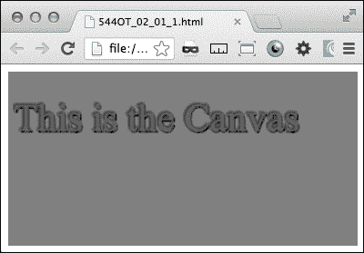
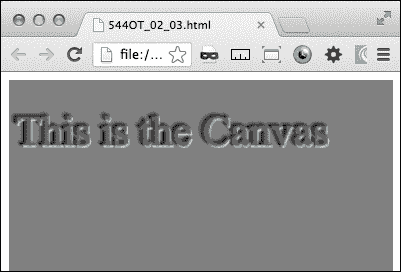
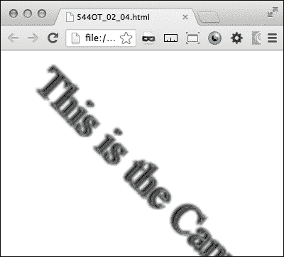
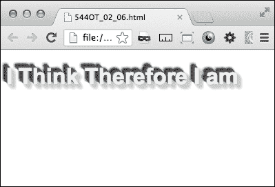
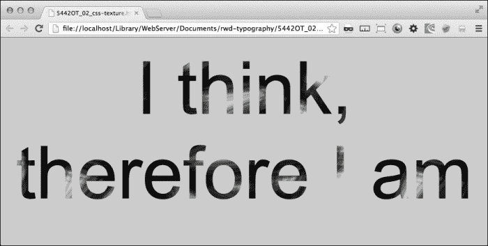
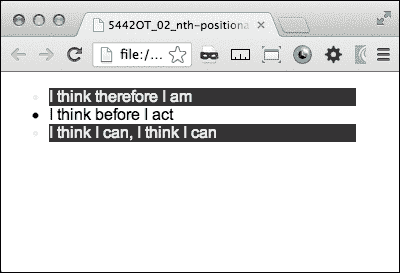
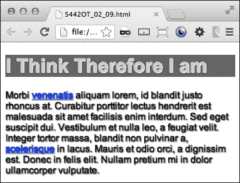
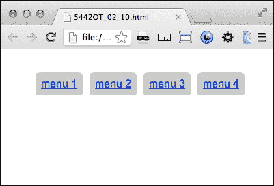

# 第二章：响应式排版

在本章中，您将学习以下内容：

+   创建流畅、响应式的排版

+   用 canvas 制作文本阴影

+   用 canvas 制作内部和外部阴影

+   用 canvas 旋转您的文本

+   用 CSS3 旋转您的文本

+   用 CSS3 制作 3D 文本

+   用 CSS3 文本遮罩为您的文本添加纹理

+   使用 nth 位置伪类为交替行添加样式

+   在伪元素之前和之后添加字符

+   使用相对字体大小制作按钮

+   为您的字体添加阴影

+   用边框半径弯曲一个角

# 介绍

这一章主要讨论如何制作响应式排版。您将学习为各种类型的设备优化文本的配方，以及装饰文本的方法。涉及的技术只是 CSS3 和 HTML5 的`canvas`元素与 JavaScript。通过响应式排版，您可以为文本应用许多令人兴奋的效果。

完成本章后，您将掌握一些技术，可以让您开始制作令人惊叹的响应式网站。这些配方涵盖了基础知识，但结合一些创造力，它们将使您能够做一些出色的作品。

# 创建流畅、响应式的排版

这个配方是响应式排版的一个简单示例。它将演示新的尺寸单位`REM`的使用。`REM`表示根 EM。这意味着字体的大小是相对于根字体大小而不是父元素的大小，就像`EM`单位一样。

## 准备工作

没有更多讨论，让我们开始这个配方。从我最喜欢的 Ipsum 生成器([`ipsum.com`](http://ipsum.com))获取一些填充文本。生成至少一个段落，并将文本复制到剪贴板中。

## 如何做…

现在，将填充文本粘贴到您的 HTML 文档中，并将其包装在一个段落标记中。给段落元素`class="a"`，然后复制并分配新段落`class="b"`，如下面的代码片段所示：

```html
<p class="a">
     Lorem ipsum dolor sit amet, consectetur adipiscing elit.
<p>

<p class="b">
     ultricies ut viverra massa rutrum. Nunc pharetra, ipsum ut ullamcorper placerat,
<p>
```

接下来，为基本 HTML 的`font-size`属性创建一个样式，然后为静态大小的段落创建一个样式，以便比较字体大小的变化——类似于实验的对照组：

```html
html{font-size:12px;}
p.b{font-size:1rem;}
```

接下来创建两个`@media`查询，一个用于`orientation:portrait`，另一个用于`orientation:landscape`。在`orientation:portrait`媒体查询中，使用`font-size`值为`3rem`为`"a"`类段落元素添加样式。在`orientation:landscape`媒体查询中，使用`font-size`值为`1rem`为`"a"`类段落添加样式。

```html
@media screen and (orientation:portrait){
p.a{font-size:3rem;}
}
@media screen and (orientation:landscape){
p.a{font-size:1rem;}
}
```

现在，当您将浏览器窗口从横向模式调整为纵向模式时，您会看到第一个段落的字体大小从 1:1 的比例变为基本大小，再到基本大小的 3:1。虽然这看起来非常简单，但这个配方可以变化并构建，以创建许多令人印象深刻的响应式排版技巧。

## 它是如何工作的…

当您的浏览器发出请求时，CSS3 的`@media`查询根据视口的宽度返回一些条件样式。它会根据视口大小的变化实时加载或构建（重建）。虽然您的受众中不会有很多人在浏览器中花费大量时间调整您的网站大小，但很容易花费过多时间担心您的网站从一个大小变化到另一个大小。

## 另请参阅

+   *使用相对字体大小制作按钮*配方

# 用 canvas 制作文本阴影

HTML5 为网页设计带来了一个新元素，即`<canvas>`元素。这是用 JavaScript 在网页上实时创建图形的。

## 准备工作

`<canvas>`元素在您的页面上创建一个矩形区域。它的默认尺寸为 300px x 150px。您可以在 JavaScript 中指定不同的设置。这个配方中的代码增长很快，所以您可以在 Packt Publishing 的网站上找到整个代码。

## 如何做…

首先，创建一个带有`<canvas>`元素的简单 HTML 页面：

```html
<!DOCTYPE HTML>
<html>
     <head>

     </head>
     <body>
           <canvas id="thecanvas"></canvas>
     </body>
</html>
```

JavaScript 从 DOM 中获取`canvas`元素。

```html
var canvas = document.getElementById('thecanvas');
```

然后调用`getContext()`方法。`getContext('2d')`方法是内置的 HTML5 对象。它有许多方法可以绘制文本、形状、图像等。

```html
var ctx = canvas.getContext('2d');
```

接下来，开始在 JavaScript 中绘制文本。在这里，我们创建一个代码来绘制水平和垂直阴影偏移、模糊和阴影的颜色。

```html
ctx.shadowOffsetX = 2;   
ctx.shadowOffsetY = 2;
ctx.shadowBlur = 2;
ctx.shadowColor = "rgba(0, 0, 0, 0.5)";
```

文本及其属性是在 JavaScript 中编写的，但可以作为变量从 DOM 中传递：

```html
ctx.font = "20px Times New Roman"; 
ctx.fillStyle = "Black"; 
ctx.fillText("This is the canvas", 5, 30); 
```

回到 HTML，在`body`元素中添加`onload="drawCanvas();"`脚本命令。当页面加载时，JavaScript 会触发并将文本及其阴影绘制到画布上。如下截图所示：



## 它是如何工作的…

不要深入 JavaScript 的细节，`canvas`元素提供了一个地方，让设计者可以在页面加载时直接向页面上添加一些内容。`body`元素的`onload="drawCanvas();"`命令触发 JavaScript，将内容绘制到画布上。

## 另请参阅

+   *使用画布旋转文本*食谱

# 使用画布制作内部和外部阴影

这个食谱还使用`canvas`和 JavaScript 在浏览器中绘制文本和效果。使用`canvas`没有直接的方法来制作内发光或内阴影效果，但是使用描边方法，你可以在文本中模拟内部阴影。

## 准备工作

这个食谱从一些已经写好的代码开始。你可以从 Packt Publishing 的网站上下载。这也是你在食谱中创建的相同代码，*使用画布制作文本阴影*。这段代码应该在你的本地计算机上运行，不需要任何特殊的 Web 服务器。你可以在书的网站上在线获取整个代码。

## 如何做…

首先，创建一个带有`<canvas>`元素的简单 HTML 页面。

```html
<html>
  <head>

  </head>
  <body>
    <canvas id="thecanvas"></canvas>
  </body>
</html>
```

JavaScript 从 DOM 中获取`canvas`元素。

```html
var canvas = document.getElementById('thecanvas');
```

然后调用`getContext()`方法。`getContext('2d')`方法是内置的 HTML5 对象。它有许多方法可以绘制文本、形状、图像等。

```html
var context = canvas.getContext('2d');
```

这个脚本使用多种效果组合来制作内部和外部阴影。首先，在左上角添加一个投影，并将其设为黑色，`context.shadowBlur`值为`2`。在此基础上，在`context.fillText`之后，将`context.strokeStyle`和`context.strokeText`添加到画布上下文。

```html
context.shadowOffsetX = -1;   
context.shadowOffsetY = -1;   
context.shadowBlur = 2;   
context.shadowColor = "#888888";   
context.textAlign = "left";
context.font = "33px Times New Roman";  
context.fillStyle = "#666";   
context.fillText("This is the Canvas", 0, 50); 
context.strokeStyle = "#555";
context.strokeText("This is the canvas", 2, 50); 
context.linewidth = 2;
```

文本看起来不是凸起的，而是内凹的，并具有内部发光或阴影效果。该效果显示在下面的截图中：



## 它是如何工作的…

正如本食谱开头所述，画布中没有真正的直接方法来制作内部阴影，但有办法使用`context.fillText`和`context.strokeStyle`方法一起使用，可以创建出看起来足够像内部阴影的东西。

# 使用画布旋转文本

HTML5 画布方法不仅可以给文本上色或添加阴影，还可以用来移动或操纵画布区域中的对象。在这个食谱中，我们将旋转画布中的对象。

## 准备工作

这个食谱是在之前的食谱基础上构建的。如果你跳过了它们，没关系，你可以回到之前的食谱参考完整的代码。

## 如何做…

一旦你设置好了之前食谱的画布，旋转的基本步骤就很容易了。在函数的开头添加一个`rotate`方法：

```html
context.rotate(Math.PI/4,0,0);
```

你可能会注意到文本已经旋转出了画布。发生了什么？`rotate`方法旋转整个画布，并不知道其中有什么。

画布的默认大小是 300px x 150px。更改元素的大小属性不会影响画布的大小，但会扭曲在其上绘制的对象。要改变画布和绘制的对象的大小，可以在 JavaScript 中添加`canvas.width`和`canvas.height`属性：

```html
canvas.width=250;
canvas.height=250;
```

此外，由于`canvas`完全旋转自身，而不是文本围绕一个原点旋转，因此文本位置需要重新定位到所需的位置。在这种情况下，更改填充和描边的对象偏移量：

```html
context.fillText("This is the Canvas", 140, 1); 
context.strokeText("This is the Canvas ", 140, 1);
```

如下截图所示：



## 工作原理

JavaScript 使用`rotate`方法来旋转整个`canvas`元素以及其中绘制的所有内容。在使用`canvas`的`rotate`方法时需要一些事先考虑。它很复杂，但是在大型响应式 Web 项目中使用是完美的工具。

## 另请参阅

+   *使用 CSS3 旋转文本* 配方

# 用 CSS3 旋转文本

CSS3 提供了一种简单的方法来旋转文本。`transform:rotate`属性易于实现，并且在项目不需要`canvas`的复杂性时提供了一个简单的解决方案。

## 准备工作

在您的 HTML 文档中写一行文本。做好准备，您将要用 CSS3 旋转它。

## 操作步骤

将文本放在段落标签元素中：

```html
 <p class="rotate">I think, therefore I am</p>
```

然后，添加 CSS `transform`属性来旋转文本。每个浏览器呈现方式都不同，因此每个浏览器都需要自己独特的`transform`属性。但是，每个浏览器都将使用`transform`属性的子属性`rotate`，后跟旋转的度数，如下面的代码片段所示：

```html
<!DOCTYPE HTML>
<html>
     <head>
          <style>
     .rotate {
/* Chrome, Safari 3.1+*/
-webkit-transform: rotate(-90deg);
/* Firefox 3.5-15 */
-moz-transform: rotate(-90deg);
/* IE9 */
-ms-transform: rotate(-90deg);
/* Opera 10.50-12*/
-o-transform: rotate(-90deg);
/* IE */
transform: rotate(-90deg);
}
          </style>
     </head>
     <body >
          <p class="rotate">I think, therefore I am </p>
     </body>
</html>
```

## 工作原理…

`transform` 属性将 2D 或 3D 变换应用于元素。其他可用的属性更改包括 `move`、`skew` 和 `perspective`。

## 另请参阅

+   *使用 canvas 旋转文本* 配方

# 使用 CSS3 制作 3D 文本

在以前的示例中，我们使用`canvas`元素创建了投影阴影、斜角和内部阴影。使用 CSS3，我们可以做到让您的文本真正脱颖而出。使用 CSS3 的`text-shadow`属性，我们可以让您的文本看起来好像是从屏幕上朝向观众突出。

## 准备工作

如果您想要跳过，可以在 Packt Publishing 的网站上在线获取代码。否则，如果您是通过实践学习的类型，让我们制作我们的 3D 文本。我们通过使用 CSS3 阴影效果的组合来创建 3D 效果。

## 操作步骤

在您的 IDE 中，创建一个只有标题的新 HTML 文档。在`head`标签中添加一个`style`部分，并将标题分配为`color:#f0f0f0;`，如下面的代码片段所示：

```html
<style>
     h1{ color: #f0f0f0;}
</style>
```

现在，为其添加一系列七个逐渐增加和减少的 X 和 Y 位置的`text-shadow`属性，从`0px 0px0px #666`到`-6px -6px 0px #666`。

```html
text-shadow: 0px 0px0px #666,
-1px -1px 0px #666, 
-2px -2px 0px #666,
-3px -3px 0px #666,
-4px -4px 0px #666,
-5px -5px 0px #666,
-6px -6px 0px #000,
```

您的标题现在几乎跳出屏幕。好吧，几乎！为了确保它真的脱颖而出，让我们给它一些更多的效果。在屏幕上构建任何 3D 对象时，重要的是要给予一致的光照和阴影。由于这个文本上升，它需要一个阴影。

再添加一系列六个 X 和 Y 位置的`text-shadow`属性，只是这一次给它们正值和一个较浅的颜色（`color:#ccc;`）。

```html
1px 1px 5px #ccc, 
 2px 2px 5px #ccc,
 3px 3px 5px #ccc,
 4px 4px 5px #ccc,
 5px 5px5px #ccc,
 6px 6px 5px #ccc;
```

投影阴影是有道理的，但它看起来仍然有点假，好吧，让我们把它提升到另一个水平；让我们模糊和加深背景上的元素。在`text-shadow`属性中的第三个数字创建了模糊效果，因此按照以下代码中所示添加逐渐增加的模糊：0、0、1、1、2、3 和 5。还要将颜色更改为越往后越暗：`#888`、`#777`、`#666`、`#555`、`#444`、`#333` 和 `#000`。

```html
text-shadow:0px 0px0px #888,
-1px -1px 0px #777, 
-2px -2px 1px #666,
-3px -3px 1px #555,
-4px -4px 2px #444,
-5px -5px 3px #333,
-6px -6px 4px #000,
```

现在您的标题具有真正逼真的 3D 效果。如下截图所示：



## 工作原理

尝试并尝试这个配方的变化，以获得一些非常令人兴奋的排版效果。CSS3 为排版设计带来了全新的兴奋和深度，这是以前很难实现的，而且做得很好。

`text-shadow`属性可以处理多个阴影属性。因此，您可以将它们堆叠在一起，使它们离文本越来越远。这样可以为您的文本创建 3D 效果。

# 使用文本遮罩为您的文本添加纹理

CSS3 还为你提供了使用图像为文本添加图像蒙版纹理的强大功能。以前只能通过使用图像编辑软件创建文本的静态图像来实现这种效果。

## 准备工作

你需要一张图像作为纹理蒙版。使用图像编辑软件创建一个带有 alpha 通道的新图像。如果你没有能够创建带有 alpha 通道的 PNG 图像的图像编辑软件，你可以在[`www.gimp.org`](http://www.gimp.org)下载一个开源的免费图像编辑软件 GIMP。为了快速创建纹理效果，使用散射型刷子在图像顶部附近创建一个纹理区域。

将其保存为 PNG 图像类型，在 web 主机的`images`目录中保留 alpha 通道。

## 如何做…

创建一个包含要应用纹理蒙版的文本的标题元素的 HTML。然后，在其中添加一些文本：

```html
<h1 class="masked">I think, therefore I am</h1>
```

然后，添加你的 CSS 标记。这将包括一个大字体大小（展示你的蒙版纹理！），白色字体颜色，填充和对齐，当然还有图像蒙版属性。

### 提示

请注意，每个浏览器都需要为该属性添加自己的前缀。

```html
 h1.masked{
      font: 140px "Arial";
      color: white;
      -webkit-mask-image: url(images/mask2.png);
      -o-mask-image: url(images/mask2.png);
      -moz-mask-image: url(images/mask2.png);
      mask-image: url(images/mask2.png);
      text-shadow: 0px 0px 10px #f0f0f0;
      width: 100%;
      padding: 12% 0 12%;
      margin:0;
      text-align: center;
     }
```

CSS 效果显示在以下截图中：



## 它是如何工作的…

蒙版图像根据蒙版图像的 alpha 值剪切元素的可见部分。当在 CSS 中应用于文本时，它将剪切掉蒙版部分。这与图像编辑软件的 alpha 通道图层的工作方式非常相似。

# 使用 nth 位置伪类样式交替行

CSS3 中的位置伪类提供了简单的 CSS 解决方案，解决了以前需要繁琐解决方案的问题。直到最近，要为列表或表的交替行设置样式，如果你有幸能够在具有某种逻辑的服务器上工作，你至少可以在列表中迭代计数，或者如果不幸的话，你必须手动编号你的行。

## 准备工作

CSS3 的解决方案非常简单。首先，创建你的 HTML 值列表。这不一定需要一个命名空间类，因为你可能希望这是你站点中的一个通用样式：

```html
       <ul>
           <li>
               I think, therefore I am
           </li>
           <li>
               I think before I act
           </li>
           <li>
               I think I can, I think I can
           </li>
       </ul>
```

## 如何做…

为列表项`<li>`添加一个*n*th 位置伪类奇数值的 CSS 属性。给它一个背景颜色和字体颜色的值，这些颜色与你的默认颜色方案明显不同。

```html
  ul{
width:100px;
  }
  li:nth-of-type(odd){
background-color:#333;
color:#f0f0f0;
  }
```

这将自动地为你的列表的奇数行设置样式！以下截图说明了这种效果：



现在深呼吸；那么容易！

## 它是如何工作的…

根据[`www.w3.org`](http://www.w3.org)，`:nth-of-type(an+b)`伪类符号表示具有在其之前具有相同扩展元素名称的*an+b-1*个兄弟元素的元素，在文档树中，对于*n*的任何零或正整数值，并且具有父元素。

那是什么意思？这意味着只要它在同一个父元素内具有类似的兄弟元素，你可以输入一个类似*(-n+2)*的公式来为兄弟元素的最后两行设置样式，或者保持简单，奇数或偶数，并通过 CSS 样式这些行。

# 在伪元素之前和之后添加字符

在 CSS 的一个新属性中，似乎失落了一集*The Twilight Zone*，它给了你在内容中添加伪标记的能力。尽管听起来很奇怪，但这种样式有令人惊讶的用例。你可能想在你的内容中加引号，而不必处理额外的编码麻烦来放置引号在你的内容或主题文件中，这当然是明智的做法。或者你可能想加入 Twitter 及其 hash 标签和`@`标记的流行，你可以在你的内容之前加上`#`或`@`符号，只需使用 CSS 标记，如下面的代码行所示：

```html
#I think, therefore I am#
```

## 准备工作

这不需要任何服务器端逻辑或任何花哨的动作。你只需要能够在本地主机上启动页面，看到它的运行情况。

## 如何做...

这只需要使用 CSS 就可以实现，因此你在 HTML 中需要创建的只是一个包裹目标内容的`class`或`id`属性：

```html
<h2 class="hashtag">I think, therefore I am</h2>
```

CSS 标记只是稍微复杂一点，插入的符号遵循内容的边距和填充规则。它使用了*n*th `class:before`和`class:after`伪类。因此，`before`的 CSS 是`.class:before {content:"#";}`。只需用你想要使用的符号替换`#`。对于`after`，用`.class:before{}`替换`.class:after{}`。

```html
.hashtag {
     border:1px solid #ccc;
     display:block;
     width:200px;
     height:10px;
           }
.hashtag:before{
     content:"#";
           }
.hashtag:after{
     content:"#";
           }
```

## 它是如何工作的...

CSS 中的`before`和`after`伪元素生成元素内容之前或之后的内容。请注意，它们不是真正的内容或元素，不能用于标记或 JavaScript 事件触发。

# 使用相对字体大小制作按钮

有几种情况可以使用响应式按钮字体大小。一个很好的例子是你网站的移动版本。当在 iPhone 上查看普通按钮时，它非常小，难以点击。我们最不希望做的就是通过我们对移动设备的忽视来给移动设备用户创造糟糕的体验。

## 准备工作

这个配方的目标是使用新的字体度量`REM`来制作一个响应式按钮字体大小，当在移动设备上查看时会变大。

`REM`是 CSS3 中引入的一个新单位，它代表根`EM`，或者相对于根字体大小。这与相对于父元素的`EM`不同。一种使用它的方法是将某些元素的大小设置为 body 字体的基本大小。

## 如何做...

它可以与`@media`查询一起使用，为你的桌面和移动设备构建一个响应式按钮。下面是具体操作。

首先，创建一个简单的 HTML 页面，包含一些填充文本（[`lipsum.com`](http://lipsum.com)）和一个`input`类型为`submit`的元素。

```html
<div>
<p>Lorem ipsum dolor sit amet, consectetur adipiscing elit. Vestibulum vehicula enim at dolor ultricies ut viverra massa rutrum. Nunc pharetra, ipsum ut ullamcorper placerat,
</p>
     <input type="submit">
</div>
```

接下来，在 HTML 的基本字体大小上添加 CSS，设置为`62.5%`，并为段落添加静态字体大小，作为实验对照组：

```html
html{font-size:62.5%;}
p{font-size:1.4rem;}
```

下一步是为移动设备创建你的`@media`查询，以及两个不同的桌面窗口大小。我添加了一个额外的`@media`查询用于桌面屏幕，所以如果你没有移动设备，你仍然可以看到响应性的效果。

为桌面设备设置两个`@media`查询，分别为`1024px`和`1280px`，为移动设备设置两个，都是`max-device-width:480px`，一个是`orientation:landscape`，另一个是`orientation:portrait`。

```html
@media screen and (min-width:1024px){ } 
@media screen and (min-width:1280px){ } 
@media screen and (max-device-width: 480px) and (orientation:landscape){ } 
@media screen and (max-device-width: 480px) and (orientation:portrait){ } 
```

在你的桌面`@media`查询中，为两者都添加一个`input`元素；并为`min-width:1024px`查询添加一个`font-size:1rem`值，为`min-width:1280px`查询添加一个`font-size:2rem`值。对于这两个查询，添加属性：`width:84px;`和`padding:2%;`。

在移动`@media`查询中，为两者都添加`input`元素。在`orientation:landscape`媒体查询中，分配属性：`font-size:2rem;`和`width:25%;`。在`orientation:portrait`媒体查询中，分配属性：`font-size:2.4rem;`和`width:30%;`。

```html
@media screen and (min-width:1024px){    
           input{
               font-size:1rem;
               width:84px;
               padding:2%;}
       } 
@media screen and (min-width:1280px){    
     input{
          font-size:2rem;
          width:84px;
          padding:2%;
     }
} 
@media screen and (max-device-width: 480px) and 
(orientation:landscape){
     input{
          font-size:2rem;
          width:25%;
          padding:2%;
     }
} 
@media screen and (max-device-width: 480px) and 
(orientation:portrait){  
     input{
          font-size:2.4rem;
          width:30%;
          padding:2%;
     }  
} 
```

现在，当你从移动设备查看这个页面时，你可以看到`REM`大小单位创建了一个相对于基本字体大小的字体。移动设备可能会将字体渲染得非常小，几乎无法阅读，按钮也太小，难以使用。将设备从纵向方向旋转到横向方向，你会看到按钮及其字体大小发生变化。

比较移动设备按钮和桌面版本。你会看到按钮会根据设备类型显示独特的属性。当你在`1024px`和`1280px`之间拖动桌面浏览器窗口时，按钮字体也会发生变化。

## 它是如何工作的...

`REM`字体大小单位创建相对于在`HTML`或`body`元素中声明的基本字体大小的字体大小，或者如果未声明，则相对于字体的内置基本大小。我们编写的`@media`查询为不同的设备和方向提供了新的相对大小。

# 给你的字体添加阴影

使用 CSS3，你可以很容易地为你的文本添加阴影。这个效果可以用来给特殊元素添加突出效果，也可以用在你的`body`文本中，以增强你内容的外观。此外，你可以用它来突出你文本中的链接，帮助它们更加突出。

## 准备工作

CSS3 使这变得很容易，所以不需要太多设置。打开你的开发环境，或者一个记事本程序，然后开始。你也可以在线访问 Packt Publishing 的网页，获取完成的代码并查看其中的内容。

## 如何做...

首先，创建一个文本段落元素；记住你可以从我们喜欢的填充文本生成器[`lipsum.com`](http://lipsum.com)获取。并给文本一个标题头：

```html
<h1>I think therefore I am </h1>
<p>Lorem ipsum dolor sit amet…
</p>
```

在你的段落中，通过在`href`标签中包裹一些单词来插入一些链接：

```html
<h1>I think therefore I am</h1>
<p>Morbi<a href ="#">venenatis</a>Lorem ipsum dolor sit amet… <a href ="#">scelerisque</a> Lorem ipsum dolor sit amet…</p>
```

首先，让我们给你的段落文本添加一个阴影，这是一个简单的 CSS3 `dropshadow`效果，我们可以用在文本上。在你的 CSS 中添加`text-shadow`属性。对于 Internet Explorer，添加`filter`属性。

```html
text-shadow: 1px 1px 2px #333333; 
```

这让你的文本有一个轻微的阴影，使它脱颖而出。对于正文文本，任何超过轻微阴影的效果都会太多。对于你的链接，为了让它们更加突出，我们可以添加多层文本阴影。添加一个类似于前面例子的阴影，然后在逗号后面添加另一个阴影效果。这个例子给链接文本添加了一个浅蓝色的阴影。

```html
text-shadow: 0px 0px 1px blue, 1px 1px 2px #333333; filter: dropshadow(color=blue, offx=1, offy=1);
```

让我们添加一个旧属性，给页面带来新的光芒。让你的链接在伪动作悬停(`:hover`)时闪烁：

```html
p.shadowa:hover{
text-shadow: 0px 0px 8px #ffff00, 2px 2px 3px #666; filter: dropshadow(color=#ffff00, offx=1, offy=1);
}
```

当你悬停在链接上时，这个属性会让段落中的链接闪烁着黄色的光芒。这个效果在下面的截图中有所体现：



## 它是如何工作的...

这个食谱是阴影效果的组合。你可以组合多个阴影效果，为你的文本创建逼真的 3D 效果。学习的最佳方法是不断尝试，直到你对你的 3D 效果非常满意。

# 用`border-radius`曲线化一个角

曲线角曾经是网页设计世界的圣杯。它总是可能的，但从来不简单。设计师只能做出有限数量的糟糕选择，来使一个元素拥有曲线角。

## 准备工作

这现在是通过 CSS3 轻松实现的。`border-radius`属性是在元素上创建圆角的简单方法。

## 如何做...

首先创建你的 HTML 元素。这适用于任何可以有边框的元素。所以让我们创建一个段落文本块。你可以在[`lipsum.com`](http://lipsum.com)获取填充文本。

```html
<p class="rounded"> Lorem ipsum dolor sit amet…</p>
```

接下来添加 CSS 来填充段落元素：

```html
.rounded{
           background-color:#ccc;
           width:200px;
           margin:20px;
           padding:20px;
        }
```

然后，为了使角变圆，添加 CSS3 属性`border-radius`。在这个例子中，我使用了`5px`的曲线半径。

```html
border-radius: 5px;
-webkit-background-clip: padding-box; 
background-clip: padding-box;
```

这个属性为你提供了简单和容易的圆角。这对于页面上的浮动元素非常有用。但是如果你只想为菜单元素的顶部角创建圆角怎么办？仍然很容易。

让我们从一个简单的内联列表开始：

```html
<ul class="inline">
     <li class="rounded-top"><a href="#">menu 1</a></li>
     <li class="rounded-top"><a href="#">menu 2</a></li>
     <li class="rounded-top"><a href="#">menu 3</a></li>
     <li class="rounded-top"><a href="#">menu 4</a></li>
</ul>
```

接下来添加 CSS 使列表内联，带有填充和边距：

```html
li.rounded-top{
     display:inline;
     background-color:#ccc;
     margin:3px;
     padding:8px;
}
```

前面例子中的 CSS 为所有角创建了圆角。要有不同的圆角，指定每个角的半径。

```html
      border-radius: 8px 8px 1px 1px;
```

你可以通过指定每个角作为自己的 CSS 属性来实现相同的结果：

```html
border-top-left-radius:8px;
border-top-right-radius:8px;
border-bottom-right-radius:2px;
border-bottom-left-radius:2px;
```

你可以通过添加另一个曲线半径来进一步扩展这一点：

```html
border-top-left-radius:8px 4px;
border-top-right-radius:8px 4px;
border-bottom-right-radius:2px;
border-bottom-left-radius:2px;
```

新的外观如下截图所示：



为了增加另一个响应级别，尝试用百分比替换曲线半径的条目。回到这个食谱中的第一个例子，将 CSS 更改为具有百分比半径曲线：

```html
border-radius: 1%;
```

## 它是如何工作的...

`border-radius` 属性提供了在元素上绘制曲线的简单方法。这个属性接受四个值，但也可以用只有一个曲线半径的简写格式来书写。
