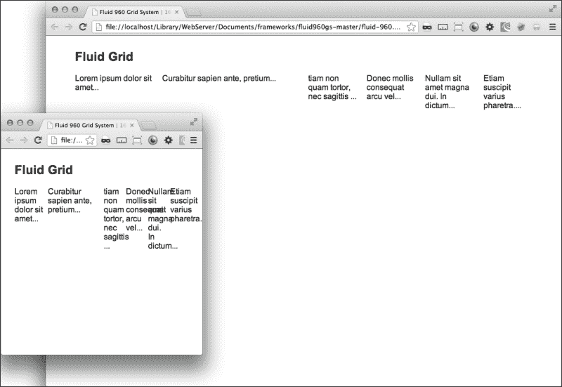
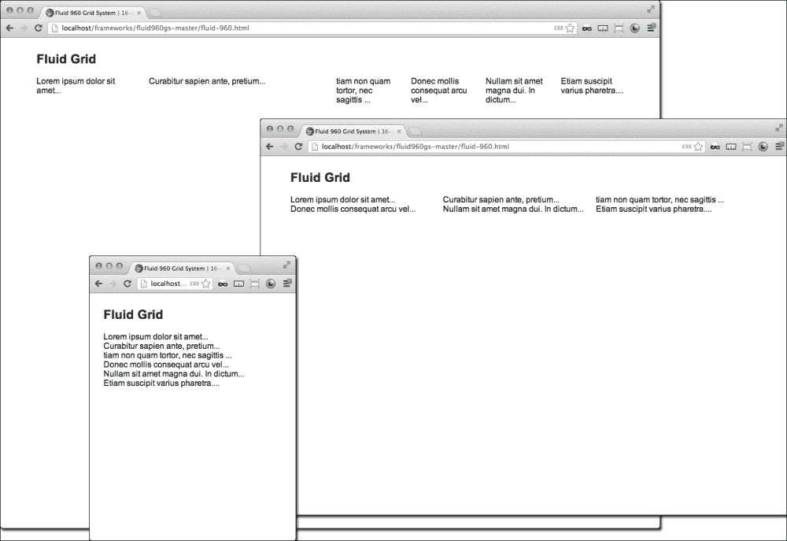
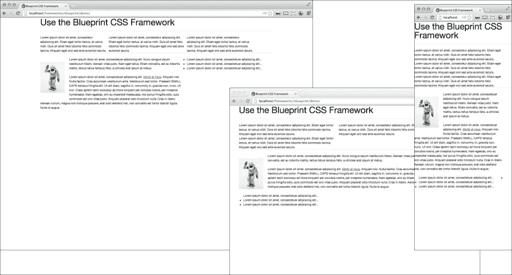
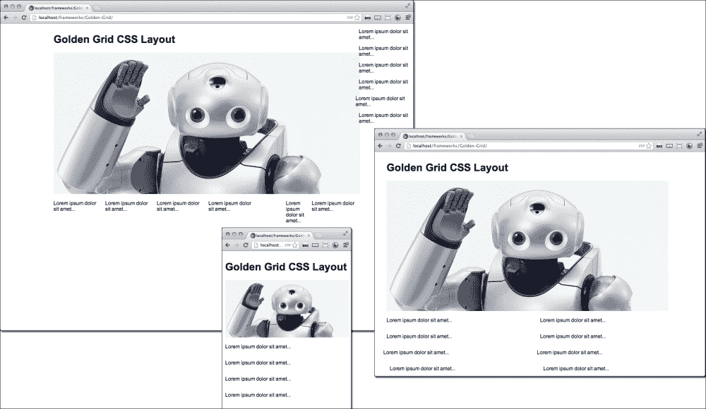
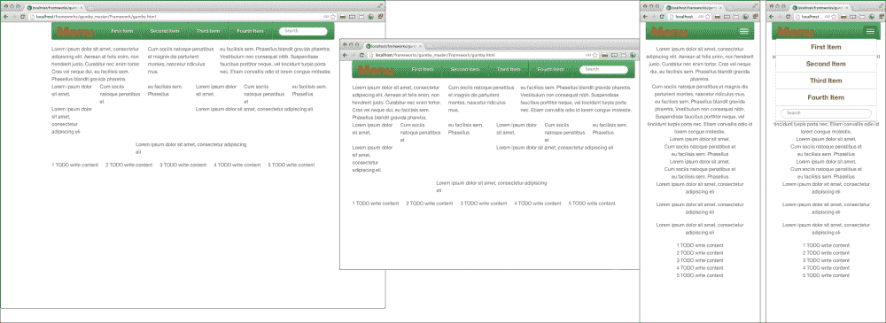
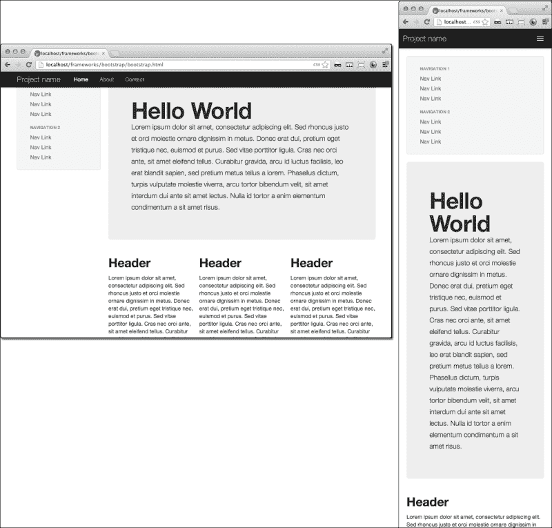

# 第四章：使用响应式框架

在本章中，你将学习：

+   使用流体 960 网格布局

+   使用蓝图网格布局

+   使用三分之一规则的流体布局

+   尝试 Gumby，一个响应式 960 网格

+   Bootstrap 框架使响应式布局变得容易

# 介绍

布局框架在布局设计和开发中变得越来越有用和普遍。许多网页开发人员发现，通过将他们的设计调整到一个框架中，他们可以大大加快生产速度。

有许多好的框架，乍一看可能会觉得启动起来太费劲，否则你将不得不牺牲太多设计来适应别人的方法。至少，这是我一开始的想法。实际上，我发现学习和使用框架让我更专注于项目中我喜欢的部分，并帮助我更快地完成项目。实质上，使用框架可能会导致你的最终产品看起来像框架。有时，这可能并不是一个糟糕的想法，也就是说，拥有一个工具集，可以帮助你更快、更好地开发网站。有许多可用的框架；有些是基本的，需要你在设计和开发上投入更多时间，但你对最终产品有更多的控制；另一些提供更多的功能，但框架指导你的设计，如果没有完全重新设计，将很难改变。

那么，哪个框架适合你呢？答案当然是：这取决于项目需求。我建议在本章中尝试一些示例，并准备好一些工具来构建项目。

# 使用流体 960 网格布局

960 网格系统已经存在一段时间，并且已经被证明在快速部署新项目方面非常有用。它相当简单易学，学习曲线很快，你就可以开始使用它了。

唯一的问题是它不是响应式的。事实上，它的行为很像使用固定宽度表头的列跨越固定宽度表头的表格。它在 960 像素宽的窗口中布局得很好，就是这样，你只能在一个浏览器窗口尺寸下看到良好的视图。那么在一个关于响应式设计的书中为什么还要讨论 960 网格呢？答案是有些人非常喜欢它，以至于他们决定解决这个问题。

## 准备工作

这方面有很好的解决方案，希望你可以在本章中找到。跟着我，我会在这个示例中向你展示一个更简单的版本。960 网格系统的简单响应式版本实际上更准确地描述为**流体网格**。它用百分比宽度替换了大部分固定宽度网格元素，左浮动元素。这样做效果很好，但当列变窄时，阅读可能会变得困难。我们可以通过一些额外的 CSS 很容易地解决这个问题。

我们最终希望页面能够对屏幕变化做出更精细的响应，以更改网格在不同屏幕尺寸下的布局。

首先，去[`www.designinfluences.com/fluid960gs/`](http://www.designinfluences.com/fluid960gs/)获取流体 960 网格系统。然后，下载并解压存档文件。将存档的`CSS`文件夹中的`grid.css`文件复制到项目的`CSS`文件夹中。接下来，在你的`CSS`目录中创建一个名为`responsive.css`的新 CSS 文件。我们稍后会回到这个文件。

## 如何做...

在你的 IDE 中创建一个新的 HTML 文件。添加链接到`grid.css`文件和你的新 CSS 文件`responsive.css`。

```html
<link rel="stylesheet" href="css/grid.css" media="screen" />
<link rel="stylesheet" href="css/responsive.css" media="screen" />
```

接下来，在 HTML 主体中创建一些内容。然后，为了使流体 960 网格工作，首先添加一个包装的`div`元素，其中包含一个定义内部列数的类。对于这个示例，使用`containter_16`类，共有 16 个可用列。你还可以通过将`div`元素分配给`container_12`类来拥有 12 列。

在`container_16`元素内，首先创建一个头部的容器。创建一个带有`grid_16`类的新的`div`元素。你可能已经猜到了，`grid_16`类占据了整个`container_16` div 的宽度。这是一个相当好的猜测；你有 98%的正确率；它实际上占据了 98%的宽度，或者所有 16 列，外部有 2%的填充。如果你使用了`grid_11`类，它将占据 11 列，或者 66.75%的宽度，外部有 2%的填充。

为了创建新的一行，我们添加另一个`div`元素，这次使用`clear`类。这与键盘上的*Enter*键或某些编程语言中的换行符(`\n`)类似。在行之间需要添加`clear`元素，因为它们的位置是由`left:float`属性设置的，这个属性没有垂直空间。

```html
<div class="clear"></div>
```

同样的效果也可以通过使用简单的断点来实现，如下所示：

```html
<br class="clear"> 
```

你需要在每一行之间添加`clear` div 或断点。

现在，我们将专注于内容！在你的`clear`元素之后，添加六个新的`div`元素。给第一个元素添加`grid_3`类，第二个元素添加`grid_5`类，其余的元素添加`grid_2`类。顺序不重要，只要`grid_*`后面的数字加起来等于 16。在`div`元素中插入一些 Ipsum 填充文本([`lipsum.com`](http://lipsum.com))。你的代码会看起来像这样：

```html
<div class="container_16">
<div class="grid_16">
<h2>Fluid Grid</h2>
</div>
<div class="clear"></div>
<div class="grid_3">Loremipsum dolor sit amet...</div>
<div class="grid_5">Curabitursapien ante, pretium...</div>
<div class="grid_2">tiam quam tortor, necsagittis ...</div>
<div class="grid_2">Donecmollisconsequatarcuvel...</div>
<div class="grid_2">Nullam sit amet magna dui. In dictum...</div>
<div class="grid_2">Etiamsuscipitvariuspharetra...</div>
</div>
```

在下面的截图中，你可以看到流体网格在较小的视口上是如何崩溃的：



下一步是更新你的 CSS，为流体布局添加一些响应性。现在，打开你的 IDE 中的`responsive.css`文件进行编辑。添加媒体查询以覆盖较小的屏幕断点：`1024px`，`600px`和`420px`，如下面的代码片段所示：

```html
@media screen and (max-width:420px){...}
@media screen and (max-width:600px) and (min-width:421px){...}
@media screen and (max-width:1024px) and (min-width:601px){...}
```

我们的目的是创建一些新的 CSS，覆盖流体网格，并为内容元素创建新的固定断点。在较窄的宽度下，我们希望一个元素有更大的百分比宽度，或者固定宽度。为了进行覆盖，我们将在媒体查询中添加一个新的类：`.break-column`。

接下来，在`max-width:420px`媒体查询中，为`.break-column`元素类添加`min-width`值为`360px`。然后，在新的媒体查询中，`max-width:600px`和`min-width:421px`，添加`.grid_2.break-column`、`.grid_3.break-column`和`.grid_5.break-column`元素类以及它们的`width:48%`属性。在这三个媒体查询中最大的一个中，添加一个带有`width:30%`属性的类，后面跟着`!important`覆盖(确保它在分号之前插入)，如下面的代码片段所示：

```html
@media screen and (max-width:420px){
   .break-column{min-width:360px;} 
}
@media screen and (min-width:421px) and (max-width:600px){ 
   .grid_2.break-column, .grid_3.break-column, .grid_5.break-column{width:48%;}
}
@media screen and (max-width:1024px) and (min-width:601px){
   .break-column{width:30% !important;}
}
```

一个响应式流体网格的最后一步！再次打开你的 HTML 文件，并给每个六个`div`元素添加一个`break-column`类。食谱就完成了。刷新你的浏览器，或者打开 HTML 文件查看。当你缩小浏览器窗口或在移动设备上打开文件时，你会看到布局会根据较小的视图做出响应并优化布局。流体网格如下截图所示：



## 工作原理...

当你在浏览器中打开未更新的(流体和非响应式)HTML 文件时，你会看到六列，它们会在浏览器窗口或设备变小的时候保持它们相同的比例宽度。当在小窗口或移动设备中查看时，它会显示六列不可读的窄列。

添加媒体查询是通过覆盖`div`元素的样式属性来实现的。我用三种不同的方法演示了覆盖：首先，`min-width`方法覆盖了百分比宽度；接下来，由于`responsive.css`文件跟随`grid.css`文件，并且 CSS 是显式命名空间（`.grid_2.break-column`，`.grid_3.break-column`和`.grid_5.break-column`），它覆盖了在`grid.css`文件中声明的流体宽度，在最后一种情况下，`!important`声明会压倒所有其他覆盖级联。

# 使用 Blueprint 网格布局

**Blueprint CSS**框架是另一个流行的静态 CSS 网格系统。可能会有这样一种情况，你需要将静态 Blueprint CSS 网格框架变成你自己的响应式 Blueprint 框架。这个框架很容易分解成一个响应式布局。只需要插入一些简单的 CSS 断点，你就有了一个响应式框架。

## 做好准备

首先去获取 Blueprint CSS 框架。你可以在[`www.blueprintcss.org/`](http://www.blueprintcss.org/)下载它。这个框架与其他静态 CSS 网格框架类似。

## 如何做……

一旦你下载了 Blueprint 框架，解压文件并将`blueprint`文件夹复制到你的`CSS`目录中。接下来我们将开始构建 HTML 文件，以便与 Blueprint CSS 框架一起使用。在你的 IDE 中创建一个新的 HTML 文件。在 body 内部，添加一个标题，然后添加一个`hr`元素。

“啥？什么？”，你可能会问。这是一个水平规则——一个主题性的分隔符。让我解释一下。

在以前的 HTML 版本中，`hr`是一个水平规则。意思是它像一个分隔符一样起作用，但是在页面上放置一条水平线。它在 HTML5 中得到了升级，现在是一个主题性的分隔符。那么有什么区别呢？它本身仍然做着同样的事情，即在页面上放置一条水平线。然而，在过去它被用来定义布局，但现在它强调了主题或内容的变化。

然而，在 Blueprint CSS 中，`hr`元素被专门用来捕捉一行。好吗？让我们回到手头的任务。

在你的`hr`元素之后，你可以开始一行内容。首先为第一行创建一个三列布局。然后，在三个`div`元素中插入一些 Ipsum（[`Ipsum.com`](http://Ipsum.com)）文本。就像 960 Grid 一样，这就像一个表格`colspan`，你给`div`元素分配一个与你想要跨越的列数相对应的类。总列数是 22。前三个类将是：`span-7`，`span-8`和`span-7`。用另一个主题性的分隔符跟着同样的步骤：

```html
<h1>Blueprint CSS Framework Responsive<h2>
<hr>
  <div class="span-7">Loremipsum dolor sit amet, 
   consecteturadipiscingelit...</div>
  <div class="span-8">Etiamegettortorlectus, et 
   variusnibh...</div>
  <div class="span-7">Duis sit 
   ametfelislobortisfeliscommodolacinia...</div>
<hr>
```

在你的下一行中，添加两个大列。在它们中间添加两个带有类`span-15`和`span-7`的 div。在左侧的`div`元素中，添加一段 Ipsum 文本和一张图片。在右侧列中，添加一列 Ipsum 文本句子的无序列表。然后用一个水平规则关闭这一行：

```html
<hr />
<div class="span-15">
    
    <p>Loremipsum dolor sit amet, consectetueradipiscingelit...</p>
</div>
<div class="span-7">
<ul>
<li>Loremipsum dolor sit amet, consectetueradipiscingelit...</li>
<li>Loremipsum dolor sit amet, consectetueradipiscingelit...</li>
<li>Loremipsum dolor sit amet, consectetueradipiscingelit...</li>
</ul>
</div>
<hr /> 
```

这是我们想要为这个配方构建的大部分 HTML。如果你想要更多，你可以在你下载的存档的`tests`文件夹中看到`sample.html`文件。

在你的 HTML 头部，添加链接到`css/Blueprint/`目录中的 Blueprint CSS 框架样式表。

接下来，让我们添加我们自己的样式表，使框架成为一个响应式的框架。在你的头部添加一个新的链接到新的样式表`responsive.css`。如果你还没有添加 CSS 文件，那么添加新的`responsive.css`样式表：

```html
<link rel="stylesheet" href="css/responsive.css"  >
```

打开`responsive.css`样式表。为最小的断点和下一个断点创建一个媒体查询。将媒体查询断点设置为`600px`和`1024px`，如下所示：

```html
@media screen and (max-width:600px) {...}
@media screen and (min-width:601px) and (max-width:1024px) {...}
```

在其中，我们将使用一种称为**属性选择器**的 CSS 技巧。这就像使用通配符`*`。为了使属性应用于 Blueprint CSS 网格中的所有列 span 类，比如`span-1`、`span-2`、`span-3`等，你可以这样写：`div[class*='span']{...}`。这是在 CSS 网格中进行响应式覆盖的一个很好的技巧。

在`600px`的媒体查询中，使用属性选择器添加 CSS，并添加一个宽度为`90%`。当浏览器窗口小于`600px`时，这将使所有的 span 扩展到 100%。在`1024px`的媒体查询中，使用宽度为`42%`。如果你期望得到像 100%和 50%这样的漂亮的整数，你可能会感到惊讶；但请记住，Blueprint CSS 已经添加了填充。

```html
@media screen and (max-width:600px){
   div[class*='span-']{width:90%;}
}
@media screen and (min-width:601px) and (max-width:1024px){
   div[class*='span-']{width:42%;} 
}
```

在浏览器中打开 HTML 文件或刷新屏幕，你会发现当你改变浏览器宽度时，这些 span 会自动调整到新的宽度。

当你达到`1024px`的断点时，你可能会注意到第二行留下了太多的空白空间。让我们来修复一下。在`1024px`的媒体查询中复制你的属性选择器 CSS 行，并将其粘贴在下面。在属性选择器后面添加一个`.wide`类。给它一个宽度为`90%`。

在你的 HTML 文件中，在第二个主题分隔符（`hr`）后的第一个 span 中添加一个`wide`类，其中包含图像。

这在最新的浏览器上效果很好，但在旧的浏览器上还不行。我们需要添加几行 CSS 代码，使其在更多的浏览器中起作用。在你的`responsive.css`文件中，在第一行添加`.container`类，并给它一个宽度为`960px`的属性。然后在每个媒体查询中添加相同的类，但将宽度更改为`100%`。

```html
.container{width:960px}
@media screen and (max-width:600px){
     div[class*='span-']{width:90%;}
     .container{width:100%}
}
@media screen and (min-width:601px) and (max-width:1024px){
     div[class*='span-']{width:42%;}   
     div[class*='span-'].wide{width:90%;}   
     .container{width:100%}
}
```

这将有助于防止在不支持媒体查询的旧浏览器中出现问题。

为了增加一些额外的乐趣，给这些 span 添加一些 CSS3 过渡效果。这将使受影响的 span 的宽度平滑地动画过渡。这些操作都是在任何媒体查询之外进行的。

```html
div[class*='span-']{

-moz-transition: width 0.1s; /* Firefox 4 */
-webkit-transition: width 0.1s; /* Safari and Chrome */
-o-transition: width 0.1s; /* Opera */
transition: width 0.1s;

}
```

有了这个额外的小提示，你可以在每个媒体查询中做一些更花哨的响应式设计。新的响应式蓝图如下截图所示：



## 它是如何工作的...

为了使 Blueprint CSS 框架具有响应性，我们首先将其容器宽度从静态宽度更改为流体最大宽度，并在断点处添加了媒体查询。这个配方的关键成分是属性选择器，它允许我们向 CSS 抛出一个通配符，避免了需要重新编码每个 span 的属性。

# 使用三分之一规则的流体布局

**三分之一规则**是一种设计方法论，它规定如果一个布局或图像被水平或垂直地分成三部分，那么它会变得更有趣。就像与互联网相关的其他一切一样，关于它有无尽的讨论和辩论。对于本书的目的，我们只关心如何使它有用。

至少在我看来，搜索结果中没有基于三分之一规则的响应和流体布局的索引。然而，有一个基于三分之一规则的良好静态框架。它被称为**Golden Grid**。

## 准备工作

搜索`Golden Grid`，[`code.google.com/p/the-golden-grid/`](http://code.google.com/p/the-golden-grid/)应该是第一个结果。从顶部导航中，转到**Downloads**页面并获取最新版本。

## 如何做...

在提取的文件中查找`CSS/golden-base`目录。在其中，将`golden.css`文件复制到你的开发目录中。你将使用这个 CSS 文件作为你的布局基础框架。

在一个新的 HTML 文件中添加一个链接到`golden.css`样式表。

```html
<link rel="stylesheet" href="CSS/golden.css" media="screen, projection">
```

打开这个 CSS 文件并编辑`.main`类的属性。将`width:970px`更改为`max-width:970px`。这将打破静态页面模板，并允许外部包装随着浏览器窗口的缩小而调整。

当您打开`golden.css`样式表时，看一下它是如何工作的。它非常简单；三条垂直线，然后对于每个分区，将页面布局分成一半，然后再分成一半。类跨度从`70px`宽度开始，每次增加`80px`，直到填满它们的`width:950px;`属性。要将`width`属性分配给您的元素，请为其分配一个以字母`g`开头的类，加上宽度和`10px`的边距。这些还具有`float:left;`和`display:inline;`样式。因为它们是左浮动的内联元素，当它们水平空间用完时，它们将换行。由于它们是左浮动的，它们被左对齐，要将它们移动到右边，您可以在其前面放置空元素，或者使用框架的`.margin`类在其前面放置左边距。

边距的工作方式与网格跨度的宽度类似，它们以`80px`递增，唯一的区别是它们从`90px`开始而不是`70px`。这个差异在元素的`margin-left:10px`属性中得到了解决。

元素在行中对齐，就像我们在本章中使用的其他框架一样，它在开始新行之前使用一个元素来清除行的末尾。在这种情况下，框架使用一个带有`clear:both`属性的 div。

让我们现在回到编辑 HTML 文件，并使用“三分法则”创建一个响应式布局。我们将从创建一个静态布局开始。创建一个带有`width:100%`样式的标题（`H1`），然后添加三个`div`来清除新的行。

```html
<body>
<div class="g960"><h1>Golden Grid CSS Layout</h1></div>
   <div class="clear"></div>
   <div class="clear"></div>
   <div class="clear"></div>
</body>
```

在第一个清除`div`元素之后，添加一个带有类`.g960`的`div`元素，我们将在其中插入一个大图像，其中我们将创建响应特性。您可以参考第一章中的*使用百分比宽度调整图像大小*一节，了解如何使图像具有响应性：

```html
<div class="clear"></div>
<div class="g960">

</div>
<div class="clear"></div>
```

在下一个断点之后，插入六个带有类`g160`的`div`元素。在每个内部，插入一段 Ipsum 文本。为了更具信息性的示例，用一个 80px 宽的类替换一个`.g160`元素。确保还包括边距类`ml80`，如下所示：

```html
<div class="clear"></div>
<div class="g160"><p>Loremipsum dolor sit amet...</p></div>
<div class="g160"><p>Loremipsum dolor sit amet...</p></div>
<div class="g160"><p>Loremipsum dolor sit amet...</p></div>
<div class="g160"><p>Loremipsum dolor sit amet...</p></div>
<div class="g80 ml80"><p>Loremipsum dolor sit amet...</p></div>
<div class="g160"><p>Loremipsum dolor sit amet...</p></div>
<div class="clear"></div>
```

这可能足够让 HTML 清楚地演示如何使其工作。现在让我们继续添加我们的 CSS，使其成为一个响应式设计。

在您的`CSS`目录中添加一个新的 CSS 文件，`responsive.css`，并在 HTML 头部链接到它。

```html
<link rel="stylesheet" href="CSS/responsive.css" media="screen, projection">
```

在这里，我们将添加一些 CSS 属性，使 CSS 框架具有响应性。首先，让我们处理一下那张大图片。当浏览器变小时，我们宁愿不让它保持大尺寸。

```html
.resp{
    width:100%; 
    height:auto;
}
```

接下来，在两个断点处添加媒体查询，`600px`用于移动设备，`1024px`用于平板电脑。您可以根据需要为更大的屏幕添加更多，但是对于这个示例，我们只涵盖了基础知识。

```html
@media screen and (max-width:600px){...}
@media screen and (min-width:601px) and (max-width:1024px){...}
```

对于所有小于`600px`的屏幕，我们希望所有`div`元素默认为屏幕的全宽度。不要忘记我们有带有左边距属性的类；我们将希望将它们缩小到零。为了使新的 CSS 尽可能简洁，让我们使用 CSS 属性选择器来通配选择所有网格类。添加`div[class*='g']{...}`并分配宽度为`90%`，以及`div[class*='ml'] {...}`来分配左边距为`0`。

```html
@media screen and (max-width:600px){
   div[class*='g']{width:96%;}
   div[class*='ml']{margin-left:0;}
}
```

对于屏幕范围从 600px 到 1024px，添加相同的内容，但将网格类的宽度更改为`48%`。对于这个`@media`查询，我们不希望每个元素都占据屏幕的一半。那将破坏这个响应式框架的所有乐趣。在您的属性选择器之后，添加`.wide`以为这个特殊的类添加一个不同的 CSS 属性。然后，给它一个宽度为`96%`。在您的 HTML 中，将`wide`类添加到标题和图像父`div`元素（它们是带有`g960`类的元素）。

```html
div[class*='g'].wide{width:96%;} 
```

以下截图说明了 Golden Grid 的行为：



## 它是如何工作的...

属性选择器为我们提供了一个巧妙的技巧，可以将刚性框架分割成有限的列跨度，变成整个屏幕的全宽。将这个与自定义媒体查询结合起来，只在较小的屏幕上改变 HTML，你就可以轻松地为所有尺寸创建一个响应式、可能视觉上引人注目的布局。这个技术也可以用于许多不同的框架。

## 还有更多...

让我们玩得更开心一点，把这个做得更深入一些。到目前为止，在这一章中，我们主要是在移动设备上制作静态框架。让我们一起做一个实验，让 Golden Grid 在大屏幕上显示时做一些酷炫的事情。为`1280px`断点添加一个新的媒体查询。

```html
@media screen and (min-width:1280px){...}
```

这个配方的额外部分深入探讨了属性选择器。一开始在您的 CSS 中看到基本逻辑可能有点令人不安，但请耐心等待，您将会发现一些新的工具，这些工具对您的工具箱非常有用。但首先让我们添加一些更多的内容和一个 HTML 结构。

复制您的 HTML 的最后一行，并将其附加到 HTML 页面中，就在您复制它的地方的右边。给它一个父`div`元素，类名为`g960`。在前面的`div`元素中，添加类名`last clear`。

```html
<div class="last clear"></div>
<div class="g960">
   <div class="g160"><p>Loremipsum dolor sit amet...</p></div>
   <div class="g160"><p>Loremipsum dolor sit amet...</p></div>
   <div class="g160"><p>Loremipsum dolor sit amet...</p></div>
   <div class="g160"><p>Loremipsum dolor sit amet...</p></div>
   <div class="g80 ml80"><p>Loremipsum dolor sit amet...</p></div>
   <div class="g160"><p>Loremipsum dolor sit amet...</p></div>
</div>
```

回到你的 CSS。属性选择器现在允许更多的条件，比如父元素、子元素和优先级。让我们使用这个来将 CSS 属性应用到由`.last` div 元素前面的网格元素。为了做到这一点，我们使用`~`符号；语法如下：

```html
DIV.preceding~DIV.following
```

我们希望当屏幕大于 1280px 时，这个元素变成右侧的一列，以最大化我们的视觉区域。

```html
div.last~div[class*='g']{position:absolute;right:0;top:0;width:14%;max-width:226px;}
```

接下来，我们希望所有的子元素都能很好地排列并占用可用空间，同时移除`ml`类的任何边距。这个语法与前面的类似，但使用了`>`符号；写法如下`DIV.parent>DIV.child`。

```html
div.last~div[class*='g']>div[class*='g']{display:block;float:none;width:100%;}
div.last~div[class*='g']>div[class*='ml']{margin-left:0;}
```

我们还需要防止包裹`g960`网格元素受到`max-width:1024px`媒体查询中通配符的影响。在`.lost` div 元素前面的网格 div 元素中添加相同的属性选择器，并给它一个宽度为`100%`，如下面的代码行所示：

```html
div.last~div[class*='g']{width:100%}
```

现在刷新您的浏览器窗口，并将其扩展到`1280px`断点之后。您会看到最后一行移动到侧边栏位置。谁说框架太死板，不能响应呢？

现在，您已经知道旧浏览器不支持媒体查询，所以既然我们关心我们所有的观众，我们希望给予那些忠实使用旧浏览器的用户一些关爱。复制`1280px`媒体查询断点的 CSS，并将其添加到一个仅适用于 IE9 之前的样式表中。然后在您的头部添加一个条件链接到样式表：

```html
<!--[if lt IE 9]>
  <link rel="stylesheet" type="text/css" href="IE8.css" />
<![endif]-->
```

这将解决旧浏览器支持问题，您的网站在旧浏览器中看起来仍然很好。

# 尝试 Gumby，一个响应式的 960 网格

Gumby 框架是对可靠的静态 960 网格框架的持续努力。它是由 Digital Surgeons 的友好人士为您带来的。框架本身已经更新，添加了许多新功能。当然，我们没有时间在这个教程中介绍所有的功能，所以我们将专注于框架的改进布局结构。

## 准备工作

让我们来看看 Gumby 960 响应式框架的网站[gumbyframework.com/](http://gumbyframework.com/)。当您浏览它时，您可以看到现代化的框架功能在其中的应用。布局在 767px 时很好地适应了移动版本，并且还将菜单转换为可用的移动导航。还包括了一些有用的 UI 元素，您会想花一些时间来熟悉它们。

点击导航栏上非常显眼的**下载 Gumby 2**按钮，获取 Gumby 的主版本存档。包含在包中的有 Photoshop 文件，帮助你设计布局，实际的框架 CSS，JavaScript，图像文件和示例 HTML 文件。`demo.html`文件可能是检查源代码并对框架的使用进行一些发现的好地方。

但是先把探索留到以后，让我们直接开始构建一个页面。

## 如何做…

在你的 HTML 编辑器中创建一个新页面。这个框架有一种简洁的方法，可以通过一个链接`css/imports.css`导入你的 CSS 脚本。在这个文件中，导入了不同的样式表。这是一个有用的概念，以防将来需要更改或添加样式表，你可以在这个 CSS 文件中进行控制。

```html
<link rel="stylesheet" href="css/imports.css">
```

CSS 看起来是这样的：

```html
@import url('gumby.hybrid.css');
@import url('ui.css');
@import url('style.css');
@import url('text.css');
```

为了不让你忘记，将你的链接添加到 jQuery 库和包含的 JavaScript 文件：`gumby.min.js`、`plugins.js`和`main.js`，直接放在页面末尾，紧接着`body`标签的闭合之前。你以后会需要这些。

```html
<script src="img/jquery.min.js"></script>
<script src="img/gumby.min.js"></script>
<script src="img/plugins.js"></script>
<script src="img/main.js"></script>
</body>
```

现在基础工作已经完成，让我们继续开发。Gumby 响应式网格框架可以使用 12 列或 16 列。首先建立一个 12 列的布局，然后我们将通过添加一个 16 层的部分使页面成为混合布局。

在你的 HTML body 中，添加一个带有`container`类的`div`元素。`container`类元素内的默认布局是 12 列。接下来，在`container`类元素内部，添加一个带有`row`类的新的`div`元素。`row`类元素封装了 12 列跨度的整个范围。在每一行中，你有 12 列跨度可以使用，来构建你的内容 div。

在`row`类元素内插入三个新的 div 元素，分别为`four columns`、`three columns`和`five columns`。列类可以是你的设计需要的任何数字，只要它们加在一起等于 12。类的数字标签决定了元素占据的列跨度数。在每个元素内部添加一个 Ipsum 填充文本段落([`ipsum.com`](http://ipsum.com))，以帮助更生动地演示布局。

```html
<div class="container">
        <div class="row">
<div class="four columns"><p>Loremipsum dolor sit amet, consecteturadipiscingelit. …</p></div>
<div class="three columns"><p>Loremipsum dolor sit amet, consecteturadipiscingelit. …</p></div>
<div class="five columns"><p>Loremipsum dolor sit amet, consecteturadipiscingelit. …</p></div>
        </div>
</div>
```

现在可以随意在浏览器中打开这个页面，看看它的样子。测试它的响应性，看看它在较小的屏幕上的表现如何。`columns`类的 CSS 如下所示：

```html
.column, .columns {
margin-left: 2.127663%;
float: left;
min-height: 1px;
position: relative;
-webkit-box-sizing: border-box;
-moz-box-sizing: border-box;
box-sizing: border-box;
}
```

数字类的 CSS 如下所示：

```html
.row .two.columns {
width: 14.893641%;
}
.row .three.columns {
width: 23.404293%;
}
.row .four.columns {
width: 31.914945%;
}
.row .five.columns {
width: 40.425597%;
}
....
And so on.
```

正如你所看到的，`columns`类给出了一个相对位置，并将元素浮动到左侧，带有填充和一些其他样式。

接下来添加另一个带有`row`类的`div`元素。在`row` div 内部，添加一个包含六个较小`div`元素的行。每个新的`div`元素将具有`two`和`columns`类。这两者将占据 12 列的跨度。在每个元素内部包含一个简短的文字段落。

```html
<div class="row">
<div class="two columns"><p>Loremipsum dolor sit amet...</p></div>
<div class="two columns"><p>Cum sociisnatoquepenatibus et...</p></div>
<div class="two columns"><p>eufacilisis sem. Phasellus...</p></div>
<div class="two columns"><p>Loremipsum dolor sit amet...</p></div>
<div class="two columns"><p>Cum sociisnatoquepenatibus et...</p></div>
<div class="two columns"><p>eufacilisis sem. Phasellus...</p></div>
</div>
```

在浏览器中，你可以看到它们很好地对齐成六列内容。当你调整到一个小的浏览器窗口时，你会看到它们跳转到 100%的宽度。

到目前为止，如果你设计的所有元素都浮动在屏幕的左侧，网格就会按照有序的方式工作。然而，情况并非总是如此；总会有内容需要右对齐、居中或其他任意对齐方式。别担心，Gumby 960 响应式框架已经考虑到了这一点。让我们添加一些更多的行，来演示如何做到这一点。

在第一行，我们将制作两个`div`元素，一个在左侧，一个在右侧。添加一个新的`row` div 元素，在其中添加两个`div`元素。给第一个`div`元素，它将位于屏幕左侧，添加类`two`和`columns`。有了这两个类，第一个`div`元素向左浮动并跨越两列。我们希望下一个`div`元素只占据六列，给它添加类`six`和`columns`。我们不希望这个下一个列向左浮动；相反，它应该在前一个`div`元素和自身之间留有一些空间。为了做到这一点，有一系列只有固定百分比左边距的类。在这种情况下，我们需要将元素向右推四列跨度。为此，添加类`push_four`。

```html
<div class="row">
<div class="two columns"><p>Loremipsum dolor sit amet...</p></div>
<div class="six columns push_four"><p>Consecteturadipiscingeli...</p>/div>
</div>
```

以下是`push_four`类的 CSS：

```html
.row .push_four {
margin-left: 36.170271%;
}
```

要使内容的列跨度*居中*，有一个特殊的类。我在引号中放置了 center，因为它并不真正居中，它是伪居中。Gumby Grid 不使用`text-align:center`或`float:center`属性，而是使用智能左边距系统。居中的`six column` div 元素的 CSS 如下所示：

```html
.row .six.centered {
margin-left: 25.531956%;
}
```

它遵循与数字类相同的模式，一个居中的`five column`行具有更大的左边距：`margin-left: 29.787282%`。

最后，在结束这个教程之前，让我们利用框架构建一个响应式菜单。这值得额外花点时间来展示框架中包含的响应式 UI 元素之一。

由于 CSS 已经构建好了，我们只需通过 HTML 来构建这个菜单。回到`container` div 元素的顶部，添加一个`row` div 元素。在`row` div 元素中添加一个`nav`元素，其`id`值为`"prettynav"`，并且具有`pretty navbarclearfix`类。接下来，在`nav`元素内部，添加一个`a href`标签，其`link`值等于`#`，一个`toggle`类，以及一个`data-for`值为`#prettynav&gt;ul`元素标签。在`a href`元素内部添加图像，该图像包含在`img`目录中，`img/icon_nav_toggle.gif`。

```html
<div class="row">
<nav class="pretty navbarclearfix" id="prettynav">
<a href="#" class="toggle" data-for="#prettynav&gt; ul"></a>
</nav>
</div>
```

`a href`元素在移动版本的菜单中隐藏时，作为显示导航菜单的按钮起作用。

在`a href`元素之后，添加一个无序列表（`ul`），其中包含您导航的链接的列表项（`li`）：

```html
<ul>
  <li><a href="#">First Item</a></li>
  <li><a href="#">Second Item</a></li>
  <li><a href="#">Third Item</a></li>
  <li><a href="#">Fourth Item</a></li>
</ul>
```

这样就创建了一个不错的响应式菜单系统，这本身就足够令人兴奋了，但还有更多。您可以为每个菜单列表项添加一个子菜单。要添加一个子菜单，添加一个带有`dropdown`类的`div`元素。在该`div`元素内部，添加一个类似于父元素的子菜单`ul`。它们会自动转换为隐藏的子菜单！

```html
<li>
<a href="#">Second Item</a>
<div class="dropdown">
<ul>
<li><a href="#">Dropdown item</a></li>
<li><a href="#">Dropdown item</a></li>
</ul>
</div>
</li>
```

以下截图说明了 Gumby 框架：



## 它是如何工作的...

Gumby 960 Grid 框架旨在设计和构建一个优雅且易于布局和元素的框架。不需要太多了解如何使其工作。首先，学习如何对您的`div`元素进行分类，使其在框架内工作。其次，构建它。了解如何使用框架中包含的 UI 元素将需要更多的参与，但这将是值得您时间的。

# Bootstrap 框架使响应式布局变得简单

Bootstrap 框架（以前称为**Twitter Bootstrap**框架）与大多数其他框架不同，因为它是完全响应式的。您可以将其用作静态框架，也可以使用它们的附加文件快速部署完全响应式的站点。当您需要快速制作出色的站点，并且愿意对外部标准进行最小的设计调整时，这是一个很好的工具。

获取框架就像搜索“Bootstrap 框架”并转到第一个链接[`twitter.github.com/bootstrap/`](http://twitter.github.com/bootstrap/)，然后点击大的**下载 Bootstrap**按钮一样容易。该软件包包括 CSS 文件、图像和 JavaScript，但没有文档。然而，在他们的网站上有很多很好的在线文档，他们的示例源代码也非常连贯。这个步骤将帮助您开始使用 Bootstrap 框架。

## 准备工作

使用 Bootstrap 框架构建非常容易；您可以在几分钟内创建一个模板。话虽如此，让我们继续努力。创建一个新的 HTML 文件并开始。首先，在页眉中添加一个链接到 Bootstrap CSS 文件，这样我们偶尔可以看到我们的工作成果：

```html
<link href="css/bootstrap.css" rel="stylesheet" media="screen">
<link href="css/bootstrap-responsive.css" rel="stylesheet" media="screen">
```

让我们从一个带有顶部导航和内容的简单页面开始。导航将根据屏幕宽度做出响应，并为每个显示进行优化。导航`div`元素使用了几个类来实现期望的结果；它们是`navbarnavbar-inverse navbar-fixed-top`。在其中，添加一个带有`container`类的`div`元素。在`container`div 元素内，有一个按钮图形，它在移动版本中显示。点击后，它会显示菜单的移动版本。菜单以优化的方式显示在移动和桌面版本中。相当酷，对吧！

以下是一个示例菜单，展示了它是如何组合在一起的：

```html
<div class="navbarnavbar-inverse navbar-fixed-top">
     <div class="navbar-inner">
       <div class="container">
         <a class="btnbtn-navbar" data-toggle="collapse" data-target=".nav-collapse">
           <span class="icon-bar"></span>
           <span class="icon-bar"></span>
           <span class="icon-bar"></span>
         </a>
         <a class="brand" href="#">Project name</a>
         <div class="nav-collapse collapse">
           <ul class="nav">
             <li class="active"><a href="#">Home</a></li>
             <li><a href="#about">About</a></li>
             <li><a href="#contact">Contact</a></li>
           </ul>
         </div><!--/.nav-collapse -->
       </div>
     </div>
   </div>
```

然后，在页眉中插入一个指向 jQuery 库的链接。

```html
<script src="img/jquery-latest.min.js"  ></script>
```

然后，在 HTML 的底部，在闭合的`body`标签之前，添加一个指向`js/bootstrap.js`文件的链接。

```html
<script src="img/bootstrap.js"></script>
```

最后，如果您还没有直接将 JS 复制到您的`webroot`中，请这样做。

现在，检查您的时髦响应式导航。

那很棒，不是吗？既然我们都对 Bootstrap 框架感到兴奋，让我们开始做一些响应式内容布局的工作。接下来，让我们来构建 Bootstrap 称为基本营销网站的内容。

首先要做的是添加一个带有`container`类的`div`元素。如果您回顾我们的菜单，您会发现这个类是一个巧妙的可重复使用的布局元素，用于控制包含元素的响应式宽度。在`container`元素内，添加一个新的`div`元素并给它一个类，`hero-unit`。在`hero-unit`类内，添加一些您想要以大型广告牌样式显示在屏幕上的内容：

```html
<div class="container">
<div class="hero-unit">
<h1>Hello World</h1>
<p>Loremipsum dolor sit amet...</p>
</div> 
</div>
```

刷新浏览器，试试看。一切看起来都很好，而且不费吹灰之力。在下面，我们想要添加一些列的引人注目的文本。这开始看起来像一个不错的着陆页。你难道不为自己做这个而高兴吗？

Bootstrap 框架使用`div`元素和`row`类来勾勒其列跨度。因此，要创建新的*行*内容，添加一个带有`row`类的新`div`元素。在行内，您有 12 个跨度可用于将内容放入其中。对于这个步骤，让我们保持简单，所以在`row`div 元素内插入三个新的`div`元素，每个都带有`span4`类。在每个`span4`元素内，添加一个次级标题和一段 Ipsum ([`lipsum.com`](http://lipsum.com))的填充文本。

```html
<div class="row">
<div class="span4">
<h2>Header</h2>
<p>Loremipsum dolor sit amet, consecteturadipiscingelit...</p>
</div>
<div class="span4">
<h2>Header</h2>
<p>Loremipsum dolor sit amet, consecteturadipiscingelit...</p>
</div>
<div class="span4">
<h2>Header</h2>
<p>Loremipsum dolor sit amet, consecteturadipiscingelit......</p> 
</div>
```

打开浏览器窗口或刷新它，看看这个漂亮的布局是如何运行的。最新的行占据了三列，并在移动浏览器或宽度较小的窗口中很好地折叠成单列。

您可以复制整个`row`类元素和内部 HTML，并将其粘贴以添加一个全新的内容行，它会很好地运行。

既然我们已经做了一个好看的页面，而且没有费太大的力气，让我们为页面添加另一个级别。这部分是 Bootstrap 框架灵活性的绝佳演示。接下来，您将在页面上添加一个侧边导航。

在第二个`container`类元素中，将`hero-unit`和`row`元素包装在一个新的`div`元素中，并为该元素分配一个`span9`类。接下来，在新元素之前插入另一个带有`span3`类的`div`元素。这样就可以处理页面布局的变化；接下来我们将快速在其中构建一个菜单。

在你的`span3` div 类中添加一个新的`div`元素，并给它添加`well`和`sidebar-nav`类。这样可以为侧边导航添加一个漂亮的样式。现在，添加一个带有`nav`和`nav-list`类的无序列表(`ul`)到菜单列表中。你可以通过给列表项分配`nav-header`类来添加列表部分标题。在每个列表项中添加一个导航项的`href`链接：

```html
<div class="well sidebar-nav">
     <ul class="navnav-list">
          <li class="nav-header">Navigation 1</li>
          <li><a href="#">Nav Link</a></li>
          <li><a href="#">Nav Link</a></li>
          <li><a href="#">Nav Link</a></li>
          <li class="nav-header">Navigation 2</li>
          <li><a href="#">Nav Link</a></li>
          <li><a href="#">Nav Link</a></li>
          <li><a href="#">Nav Link</a></li>
     </ul>
</div>
```

你几乎完成了；在这个步骤中只剩下几个步骤。将你的两个新的`span*`元素包装在另一个带有`row`或`row-fluid`类的`div`元素中。最后，将包含摘要内容元素的`row` div 元素类名称更改为`row-fluid`。

```html
<div class="container">
           <div class="row">
             <div class="span3">
             <div class="well sidebar-nav">
                <ul class="navnav-list">
                  <li class="nav-header">Navigation 1</li>
                  <li><a href="#">Nav Link</a></li>
                  <li><a href="#">Nav Link</a></li>
                  <li><a href="#">Nav Link</a></li>
                  <li class="nav-header">Navigation 2</li>
                  <li><a href="#">Nav Link</a></li>
                       <li><a href="#">Nav Link</a></li>
                       <li><a href="#">Nav Link</a></li>
                   </ul>
               </div>

           </div>
           <div class="span9">
           <div class="hero-unit">
<h1>Hello World</h1>
     <p>Loremipsum dolor sit amet, consecteturadipiscingelit...</p>
       </div>
         <div class="row-fluid">
           <div class="span4">
             <h2>Header</h2>
             <p>Loremipsum dolor sit amet, consectetur adipiscing elit...</p>    
           </div>
           <div class="span4">
             <h2>Header</h2>
             <p>Loremipsum dolor sit amet, consecteturadipiscingelit...</p>    
           </div>
         </div>
       </div>
    </div>

</div>
```

恭喜，你完成了！现在你有了一个专业外观的响应式布局和设计的坚实基础。你只需要对此进行一些修改，就可以得到一个成品。以下截图显示了基本的 Bootstrap 框架：



## 工作原理...

就像魔术一样！不是开玩笑，Bootstrap 框架必须是我使用过的最简单和最周到的框架之一。一旦你熟悉了类和布局，通过这个配方和他们的文档，快速开发你的项目就变得非常容易。

有一些具体的事项我想讨论。首先是响应式菜单；`container`类中顶部的`div`元素是`button`，它只在移动版本中显示，其目的是在点击时以移动样式显示隐藏的菜单`div`元素`nav-collapse`。

这本身就为你提供了一个可用且非常优雅的响应式菜单的良好起点。然而，你会发现按钮本身不起作用，这是因为我们需要添加一些 JavaScript 来使这个战斗站完全运转。

响应式布局在幕后为你做了大量工作。你创建的每一列都占据了指定的列，但在移动浏览器或窄宽窗口中时，会很好地折叠成单列。

## 还有更多...

这个框架还有很多你可以做的事情。Bootstrap 框架中包含了丰富的元素、菜单、UI 功能和动画。花点时间深入了解框架，你会发现这是件值得的事情。学会这些之后，我发现我可以更快地部署新的工作，而且过程也不那么令人沮丧。
