# 第六章：优化响应式内容

在本章中，您将学习以下内容：

+   使用 IE 的开发者工具进行响应式测试

+   浏览器测试-使用插件

+   开发环境-获取免费的 IDE

+   虚拟化-下载 VirtualBox

+   为 Chrome 获取浏览器调整大小器

# 介绍

本章的食谱涵盖了广泛的主题。本章没有涵盖任何代码，但食谱属于更多功能性的范畴。本章更多地讨论了您将用于开发和测试代码的工具。在这里，我们将确保我们的代码按我们的意愿工作。虽然这个话题可能看起来不那么有趣，但它和磨练您的设计和开发技能一样重要。没有自信的吹嘘能让前端开发人员免受错误的影响，而在项目不断发展的过程中可能出现太多问题。请阅读这些食谱并尝试这些工具，它们将使您的工作更轻松，更不容易出现错误。

# 使用 IE 的开发者工具进行响应式测试

拥有响应式设计还包括为所有常见的浏览器优化设计，这无疑是响应式设计中最不令人兴奋的方面。没有办法美化这一点，许多 HTML5 和 CSS3 的特性甚至在未来版本的 Internet Explorer 中也得不到支持，而得到支持的特性有时可能会被错误地渲染。更疯狂的是，版本 7、8 和 9 的行为都不同，还有无数用户根本无法或不愿意更新他们的浏览器。还有一些公司投资于只能在旧版本的 Internet Explorer 上运行的网络软件的问题。这种缺乏更新已经被 Chrome 和 Firefox 等其他浏览器解决了；Internet Explorer 团队确实需要赶上。然而，因为您希望您的工作无论在哪个浏览器中都能看起来良好，这个责任就是您的，要让它在每个浏览器中都能正常工作。

## 准备工作

与项目中的客户和其他设计师讨论您想为 Internet Explorer 用户提供什么级别的支持。支持旧版本的 Internet Explorer 有几种可能的策略。讨论每种策略需要多少额外工作来支持旧版本的 Internet Explorer，应该花费多少钱，以及谁应该为此付费。您最不希望的是推出客户全新的网络项目，然后他们开始抱怨在他们喜爱的老旧浏览器中看起来有问题。

首先要问的问题是：您可以用 Internet Explorer F12 开发者工具做什么？答案是，您可以使用它来调试 Internet Explorer 显示您的代码的方式，并在不同版本的 Internet Explorer 之间切换，看看您的网站在每个版本中的效果如何。

## 如何做...

如果您不使用 Windows 计算机，您将无法本地获取 Internet Explorer F12 开发者工具。这并不意味着您可以简单地忘记为 IE 进行测试，希望您所做的工作有效。有许多网页和插件承诺准确模拟 IE 的多个版本的怪癖。我尝试过许多，发现没有一个能真正经得起与原始 IE 开发者工具的测试。因此，在经过多次尝试和失败后，我发现测试 IE 的唯一可靠方法，而不必购买几台计算机进行测试，就是使用虚拟化。我有几个 Windows 虚拟机实例，安装了不同版本的 Internet Explorer。我发现这是唯一确定的方法。如果您想了解如何开始虚拟化，请参阅本章中的*虚拟化-下载 VirtualBox*食谱。

所以一旦我们启动了 Windows 机器并更新到最新版本的 Internet Explorer，让我们看看 F12 开发者工具能为我们做些什么。要么按下键盘上的*F12*，要么点击屏幕右上角工具栏上的齿轮图标，显示 F12 开发者工具。这在下面的截图中有演示：

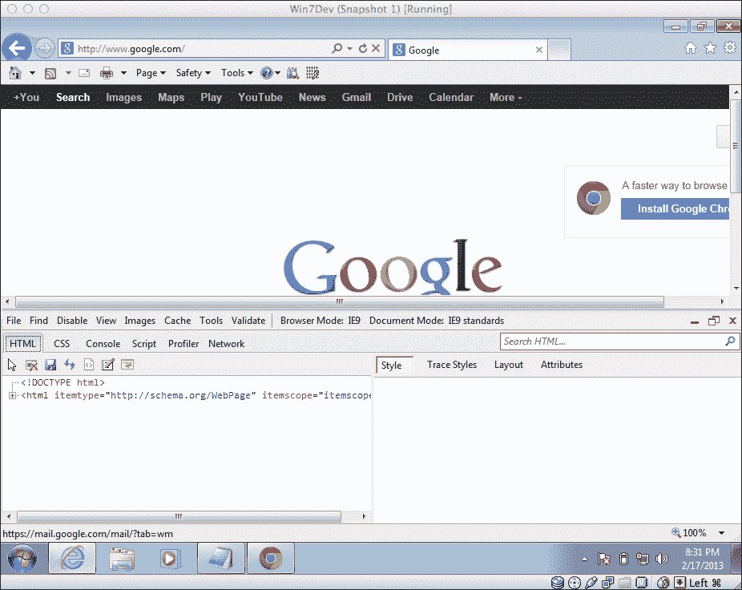

在这里你可以做的第一件有用的事情是点击指针图标，将鼠标移动到浏览器窗口中行为异常的元素上。当鼠标移动时，你会看到你的鼠标移动到的元素周围有一个白色的边框。一旦你看到你想要检查的元素周围有白色边框，点击它；HTML 窗格将会把 HTML 代码的那一行带入左侧窗口的焦点，并在右侧显示其 CSS。在 CSS 窗格中，你可以编辑每个元素的 CSS 属性树。

如果你想添加一个 CSS 属性，点击**属性**按钮。通过向下滚动到页面底部，你可以为属性添加一个新的名称和值对。你可以使用这两个工具来测试不同的 CSS 属性变化或调试一些奇怪的 IE 行为。

另一个有用的工具是**浏览器模式**选择菜单。你可以使用这个工具在不同的浏览器版本之间切换。这是一个很好的工具，可以在工作中进行即时检查。在这里，你还可以测试你的 IE 特定样式表。你可以在下面的截图中看到这一点：

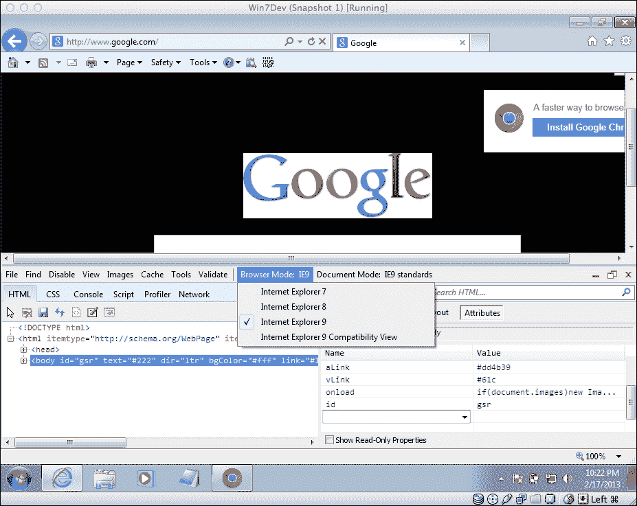

## 它是如何工作的...

根据 MSDN，F12 开发者工具代表文档对象模型（DOM）解释页面的实际方式，而不是你实际编写的代码。

## 还有更多...

你可能会遇到的另一个陷阱是，在设计一个可能作为内部软件或在内部网站的同一域名下访问的站点时。Internet Explorer 将使用 Internet Explorer 7 兼容视图作为默认的渲染视图。

兼容模式是 IE 8 中添加的一个功能，以便为旧标准开发的网站在新浏览器中仍然可以工作。通常，人们的浏览器被设置为在兼容模式下渲染内部网站。要使为 IE 7 构建的站点在最新的 Internet Explorer 中工作，你需要设置这个`<meta>`标签以在所需的渲染版本下进行渲染。为了强制浏览器始终使用最新的渲染引擎进行渲染，你需要指定以下`<meta>`标签以防止这种情况发生。

```html
<meta http-equiv="X-UA-Compatible" content="IE=edge,chrome=1">
```

# 浏览器测试 - 使用插件

在任何开发过程中，测试都是一件大事。对一些人来说，测试的概念被错误地视为工艺粗糙或工作的重要性不够的标志。这个想法是错误的。相反，严格和彻底的测试是确保软件接近完美状态的唯一途径。我觉得自己非常幸运能够与质量保证测试人员一起工作，他们的角色是测试开发团队的工作。在以前的生活中，我不得不做所有的测试工作，我可以说这是一种奢侈。

在这个教程中，我们将讨论测试的一个特定领域，即跨浏览器测试。不久以前，这个过程并不复杂，但同时也更具挑战性。为移动设备测试 Web 项目的想法并不常见；它根本不会被期望看起来相似，甚至显示相同的内容。因此，你需要测试的设备数量通常限于你可以在虚拟环境中启动的设备，并且它们都是台式设备。工具也是有限的，通常只是具有较旧浏览器版本的虚拟桌面。还记得那些拒绝放弃 IE6 的顽固的人吗？

进行浏览器测试的一种方法是简单地拿出信用卡，购买您认为可能在您的软件上查看的每个设备。我实际上从未遇到过任何人这样做，但我认为我给孩子们读的童话故事中有一两个讲述了这种现象发生的情况。对于为了赚钱而工作的人来说，这不是一个实际的解决方案。这导致了互联网上出现了付费和免费的跨浏览器测试工具市场。

## 准备工作

如果您开始认为这将是一个昂贵的步骤，那就冷静下来。没有必要去购买市场上的每一款新移动设备。有很多模拟器可以满足您的大部分需求。

## 操作步骤...

我已经在互联网上搜索并为您建立了一个免费测试工具列表。跟我一起浏览列表并查看它们。在浏览器标签中打开之前的响应式网页设计（RWD）项目文件中的一个。对于每个模拟器，您都需要通过在模拟浏览器的地址栏中输入文件来打开它。如果您还没有做过这些，或者只是没有方便的文件，请转到 Packt 网站并下载它们。继续进行模拟器。

首先让我们看看在线浏览器模拟器。转到[`theleggett.com/tools/webapptester`](http://theleggett.com/tools/webapptester)。在这里，您可以在 iOS 设备的 Web 模拟器上测试您的 RWD 网站。它可以读取您的本地文件。您可以在纵向和横向模式之间切换，并选择 iPhone 或 iPad。这很简单，您不需要安装任何复杂的应用程序或插件。如果您需要紧急情况下的测试，想要快速测试，并且不想安装任何东西，这是一个不错的选择。您可以在以下截图中看到模拟器的运行情况：

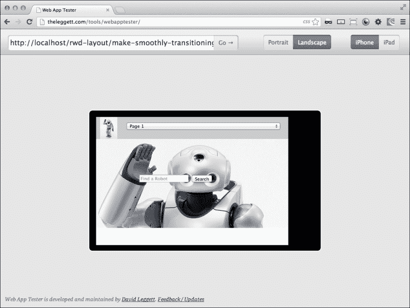

在[`ipadpeek.com`](http://ipadpeek.com)上还有一个方便的基于 Web 的 iOS 模拟器。您也可以在这里选择纵向与横向以及 iPad 与 iPhone（包括 iPhone 5）选项。这个模拟器也可以查看您的本地服务器。我一直在提到这一点，因为有太多基于 Web 的模拟器由于这个原因没有进入这个列表，包括一些商业模拟器。下一张截图显示了这个基于 Web 的模拟器：

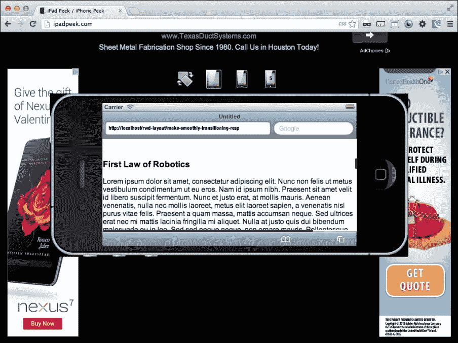

接下来让我们看一些基于应用程序的浏览器测试工具。

Ripple 浏览器插件是一个非常好的测试工具。它可以在[`chrome.google.com/webstore/detail/ripple-emulator-beta`](https://chrome.google.com/webstore/detail/ripple-emulator-beta)下载。这个模拟器比其他模拟器更胜一筹。首先，它做的工作和其他模拟器一样（即模拟 iOS 设备），但它做得很好。这个模拟器比您需要的功能更多，但它将为您的网页应用的未来移动集成进行测试。让我们开始找到并安装 Ripple 浏览器插件。这很容易。只需搜索它。还记得以前的事情是多么困难吗？

一旦您进入 Google Chrome 网络商店，点击大蓝色按钮并安装浏览器插件。请参阅以下截图：

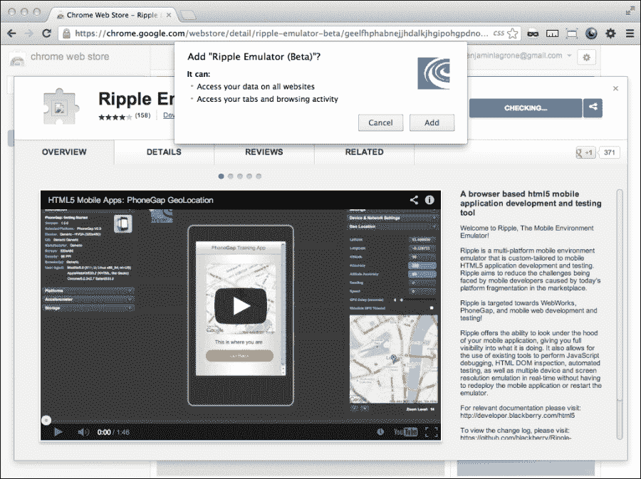

安装完成后，在你的 Chrome 浏览器的地址栏旁边会出现一个带有蓝色涟漪的新浏览器按钮。在浏览器中，打开你的响应式 Web 应用。接下来，点击**Ripple plugin**按钮，然后当弹出菜单询问是否要启用 Ripple 插件时，点击**Enable**。浏览器窗口的内容会转换为显示设备的模拟，显示你页面的移动版本。此外，你会注意到许多充满了惊人设置和工具的工具栏。让我们探索其中一些。大部分超出了我们正在做的范围，但你仍然应该注意这些。随着你开发更高级的移动 Web 应用，这些会派上用场。你可以在下一个截图中看到 Ripple 的众多设置。

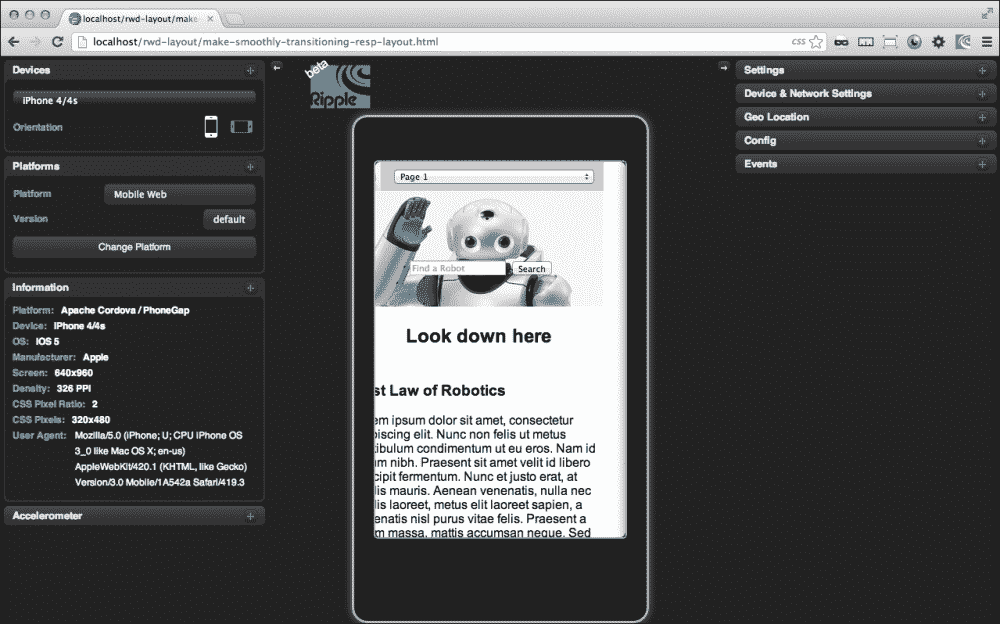

首先，点击屏幕左上角的菜单，以显示许多不同的移动设备。在下面，你可以选择横向或纵向方向。当你浏览不同的模拟设备时，你会发现有一个信息面板，其中会更新当前模拟设备的技术规格。测试完成后，只需再次点击 Ripple 按钮，然后选择**Disable**选项。

这个模拟器中还有许多其他很棒的工具，超出了本书的范围。花一些时间自己去发现一些有用的工具，以便将来在移动 Web 应用项目中使用。现在让我们继续下一个浏览器测试工具。

Opera Mobile Emulator 位于[`www.opera.com/developer/tools/mobile`](http://www.opera.com/developer/tools/mobile)。当我第一次看到它时，我几乎跳过它，因为它是 Opera。尽管它是一个严肃的浏览器项目，但我已经习惯于忽略它进行测试。它确实是一个值得尊重的移动设备浏览器。我很高兴我还是试了一下。我惊讶地发现它有许多选项，你真的可以用它来模拟许多设备。它实际上是一个很好的移动设备浏览器测试工具，可以在多个 Android 设备上测试项目。这是一个重要的声明；请注意我说的是 Android 设备，这意味着它只测试这些设备。但是，它确实允许你创建和保存自定义屏幕尺寸和设置。让我们直接安装它并设置一些自定义屏幕尺寸。

要找到它，使用你喜欢的搜索引擎，输入`Opera Mobile Emulator`。这应该会带你到一个页面，下载适用于你操作系统的 Opera Mobile Emulator（[`www.opera.com/developer/tools/mobile/`](http://www.opera.com/developer/tools/mobile/)）。下载并安装后，启动应用程序。

当应用程序加载时，你会看到屏幕左侧有许多定义好的设备可供选择。选择其中任何一个设备，然后点击**Launch**按钮。查看以下截图以进行演示：

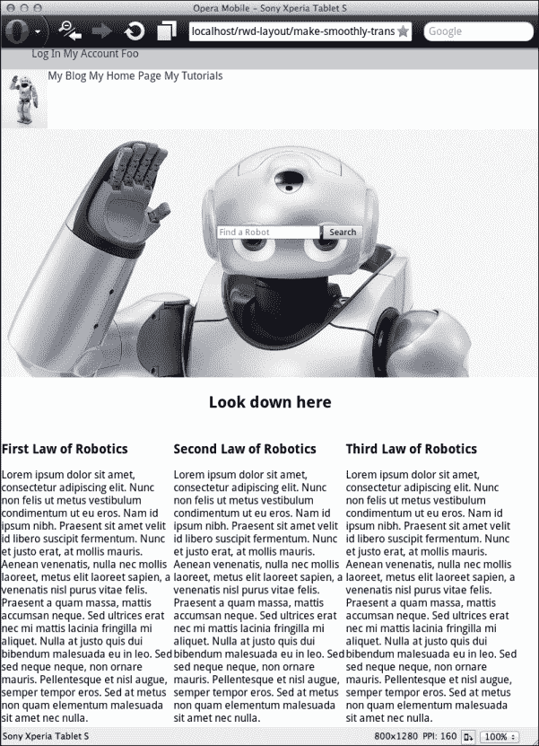

我们还可以创建自定义设备配置文件并保存它们。由于没有 iPhone 设备设置，我们将为 iPhone 设置一个自定义屏幕。从**Profile**列表中选择**Custom**。接下来，在**Resolution**下拉菜单中，选择分辨率为 320 x 480。然后在**Pixel Density**下拉菜单中，点击**Add**，添加`326`。现在点击**Launch**。你也可以点击**Save**或**Save As...**按钮来保存你的配置文件。iPhone 4 的尺寸为 640 x 960，iPhone 5 的尺寸为 640 x 1136。这在下面的截图中显示：

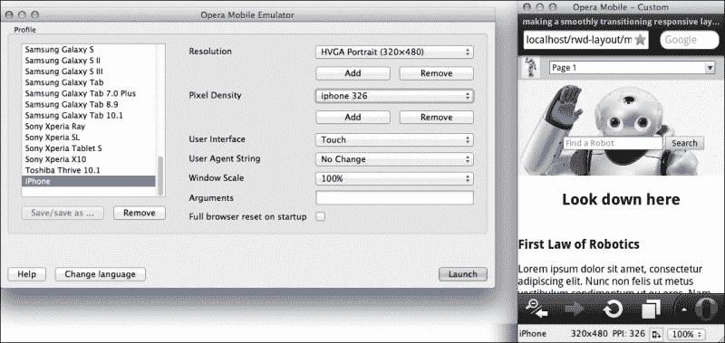

Opera Mobile 浏览器的一个重要功能是您可以使用它来调试您的代码！要使用此工具，请下载并安装桌面设备的 Opera；转到[www.opera.com](http://www.opera.com)。接下来，打开它，然后在**菜单**下，转到**工具** | **高级** | **Opera Dragonfly**。在 Opera Dragonfly 中，在右侧窗口中，找到并单击**远程调试配置**按钮，然后单击**应用**。然后在您的移动浏览器模拟器中，在地址栏中输入`opera:debug`，然后单击**连接**。现在您可以调试您的移动代码。

# 开发环境-获取免费 IDE

在本书中，我经常提到在 IDE 中开发代码，或者集成开发环境。IDE 是开发人员创建和管理代码的工具集。有许多免费和付费的 IDE 可供您使用，以帮助生成优秀的代码。您应该选择哪个 IDE？这取决于许多因素。成本是一个重要因素；Visual Studio 可能需要花费数百美元，而对于额外的自动建议插件可能需要花费更多。昂贵的 IDE 只要有人为它们买单就很棒！

## 准备工作

对于这个步骤，让我们选择更简单、更便宜的路线，并安装一个好的免费 IDE。我曾经作为一名科学家工作了几年，因为十位科学家中有九位偏爱 NetBeans，所以您可能会猜测我使用 NetBeans。我可以告诉您，您的假设在经验上有 90%的概率是正确的。

您可能认为增强型记事本足以构建您的应用程序。这可能是真的；您的记事本足以编写一些代码。但使用开发环境带来的远不止是一个大型程序来编写您的代码。它还具有增强的项目组织、自动建议和社区开发的插件等功能，几乎可以适用于几乎所有类型的项目或特殊功能。

## 操作步骤…

要获取 NetBeans，您可以直接转到 NetBeans 网站[www.netbeans.org](http://www.netbeans.org)，然后单击大橙色**下载**按钮。下一页有一个网格选项，用于 NetBeans 下载；您可以选择 PHP 选项，或"All"选项以获取您需要的前端开发 IDE 软件包。但在下载任何内容之前，还有一个谜题。NetBeans 运行在 Java 上，而 OSX 和 Windows 都没有预装 Java。请参阅以下屏幕截图：

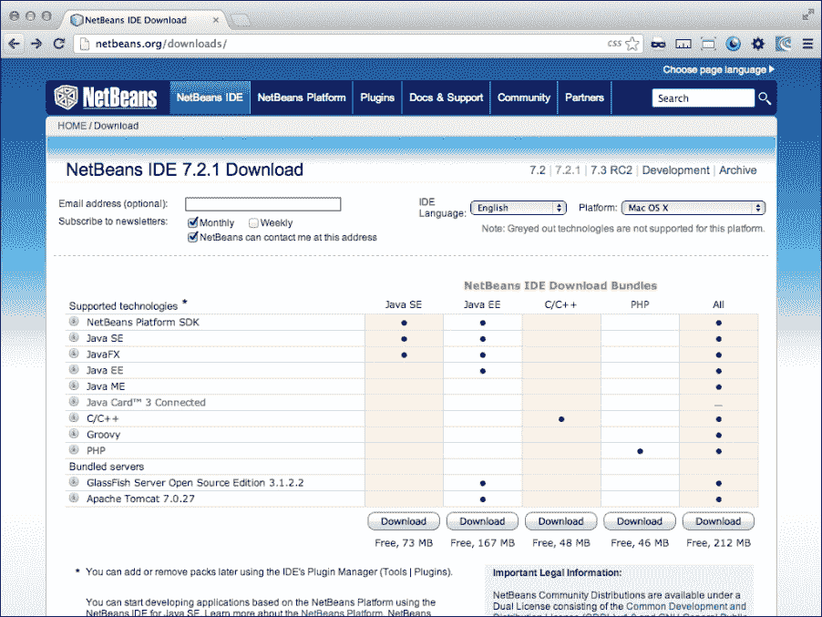

如果您已经安装了 Java 开发工具包，请继续下载和安装过程。如果没有，请转到 Java JDK 网站[`www.oracle.com/technetwork/java/javase/downloads/index.html`](http://www.oracle.com/technetwork/java/javase/downloads/index.html)（如果该网址无效，请搜索 Java JDK，然后单击**下载**链接）。在这里，您可以下载包含最新稳定 NetBeans 版本和 JDK 的软件包。这是一个很大的文件，所以开始下载并去喝杯咖啡。

展开下载的软件包；安装过程将负责安装 IDE 和 JDK。

接下来，打开 NetBeans。您应该在 IDE 的左侧窗格上看到文件和项目浏览器。如果没有，并且您无法打开任何项目，则说明未激活 Web 开发插件。打开**工具**菜单，然后选择**插件**。在**可用插件**中，找到 PHP 插件并激活它。您的 IDE 将要求重新启动。重新启动后，您将在 IDE 的左侧看到**项目**和**文件**窗格。如下图所示：

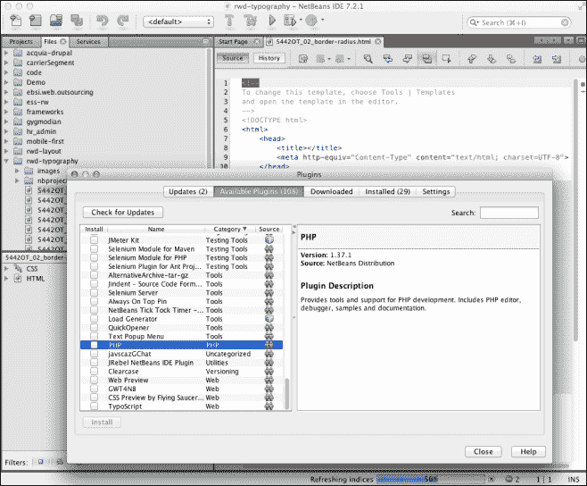

## 工作原理…

NetBeans 集成开发环境是用 Java 构建的，因此需要 JDK 才能运行。它作为基本 IDE；您可以下载并安装您特定项目所需的插件。此外，由于它是开源的，人们可以开发更多酷和有用的插件。测试、自动建议、语言和其他插件不断在开发中。因此，请尝试勇敢地尝试一些，看看它们是否能增强您的开发工作。

# 虚拟化 - 下载 VirtualBox

虚拟化是开发人员工具箱中的关键工具之一。它在开发过程的许多不同阶段中使用。我们在本文中的重点将放在测试上。但首先，我想提一下它如何在进程中进一步使用。设置虚拟机允许您在只提供和支持不同操作系统的商店中使用您首选的操作系统和工具集。例如，如果您需要使用 Visual Studio 但不想使用 Windows，您可以启动一个虚拟机并在其上开发应用程序。您还可以在虚拟机上使用 LAMP 堆栈并将其启动。

虚拟化是一个资源密集型的计算任务。当您运行带有 IDE、Web 服务器和远程桌面查看器的虚拟机时，很容易使系统变得缓慢，甚至可能使系统陷入停滞。因此，我的建议是在尝试加载多个虚拟机之前，先加载内存。

## 准备就绪

在继续进行新 VM 的简单任务之前，让我们探讨一下我们即将开始的背后的一些原因。第一个原因是 Internet Explorer。我还需要说什么吗？无论如何，对于未经培训的人，我会说。每当设计师不得不使他的美丽现代网站变得糟糕，以便在任何版本的 Internet Explorer 中运行时，都会有一种震撼人心的共同呻吟。在 IE9 中看起来不错是不够的；我们还需要使其在 IE8 中看起来体面。

为什么这是 Web 开发的现实？因为人们在升级时很慢；企业在这方面甚至更糟。要了解您网站访问者中使用的已弃用浏览器的比例，请安装 Google Analytics 并监视访问您页面的浏览器类型。您可能会惊讶地发现，有 20%的流量使用 Internet Explorer 7，您需要对其进行营销。您无法在同一台计算机上运行 IE7 和 IE9。因此，解决方案是开始可视化其问题。

为了能够测试您的网站以确保其优化，或者至少对每个旧版本的 Internet Explorer 进行降级，或者对移动设备进行响应，您可以使用虚拟化。为您需要测试的每个不同浏览器版本启动一个新的虚拟机。在本文的其余部分，我们将介绍创建新虚拟机的过程。

## 如何做到...

VirtualBox 是由 Oracle 提供的免费软件。还有其他虚拟化软件，如 VMware，它们是收费的。要下载 VirtualBox，请访问[www.VirtualBox.org](http://www.VirtualBox.org)并从**Downloads**页面下载。

一旦下载完成，安装过程就像其他任何东西一样简单。在 OS X 中，解压并将其拖放到`Applications`文件夹中。在 Windows 中，它提供不同的选项。此时我不会尝试任何棘手的事情；它将在默认选项下运行良好。两个版本都将在您的个人资料主目录中设置虚拟机的目录。

接下来，您将需要虚拟机上要安装的客户操作系统的操作系统安装光盘或磁盘映像（ISO）。当您准备好并且准备好您的 OS 安装软件时，请单击**Oracle VM VirtualBox Manager**左上角的**New**按钮。这将启动一个名为**New Virtual Machine Wizard**的向导。请参阅以下屏幕截图：

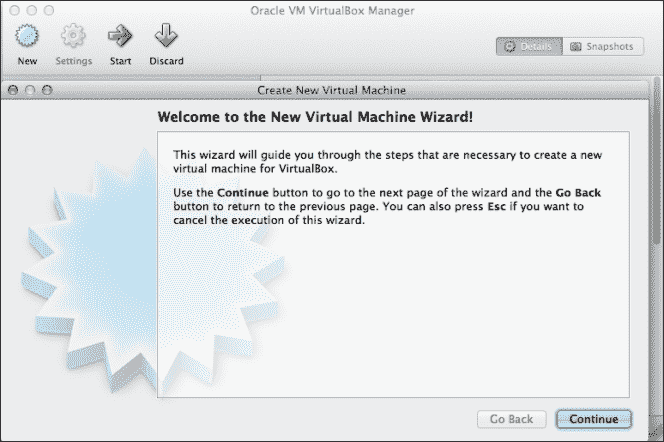

在下一个屏幕上，您将被要求输入名称和操作系统类型。接下来，选择要为虚拟机分配的内存。推荐的基本内存大小为 192 MB。下一个屏幕会要求您创建新磁盘或使用现有磁盘。当从磁盘或镜像安装新操作系统时，您将要选择**创建新硬盘**。在下一个屏幕上，使用已经选择的默认选项**VDI**（VirtualBox 磁盘映像），然后选择**动态分配**。

然后，您将被要求命名包含虚拟映像的文件夹，以及虚拟磁盘的大小；默认大小为 10 GB。接下来是摘要页面，您可以在继续之前审查您的选择。到目前为止，我们只创建了虚拟机，相当于打开一个没有操作系统的新计算机。

为了完成我们已经开始的工作，我们需要启动您的新虚拟机并在其上安装 Windows。选择您的新虚拟机并启动它以启动**首次运行向导**。它会提示您选择安装介质；在这里选择您的磁盘或镜像 ISO。选择您的安装介质，继续到**摘要**页面，然后进行操作系统安装过程。由于这是一个虚拟驱动器，所以这个过程非常快。我会跳过安装 Windows 桌面操作系统软件的细节；这里没有秘密的最佳实践，只需点击默认选项并继续。

当我写那段文字时，我的虚拟机已经完成了操作系统的安装。我告诉过你它很快。一旦启动，您可以使用默认的浏览器版本或获取更新的版本。这取决于您项目的需求。我建议为 IE9、IE8，甚至 IE7 单独创建一个虚拟机。一旦它运行起来，您应该有一个良好、干净、正常工作的 Windows XP 版本。请参见以下截图：

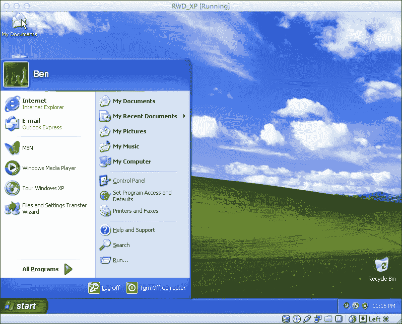

现在虚拟机已经安装了操作系统，启动浏览器并将其指向主机计算机的 IP 地址。如果您的本地 Web 服务器正在运行，并且没有在 VirtualBox 网络设置中进行修改，您应该能够看到您本地 Web 服务器上的文件。

您可以使用这个来测试您的网页设计，以确保桌面版本对所有桌面用户都能正常工作，甚至是那些使用 IE7 的用户。

您不再需要托管多个版本的 Chrome 或 Firefox，它们都已开始自动更新。旧版本的 Firefox 已经成为过去。

这涵盖了桌面测试。在我们进入下一章之前，让我们看看如何使用 VirtualBox 来测试移动设备。

在互联网上存在可下载的虚拟机，其中已经安装了 Android。我在[`www.android-x86.org/download`](http://www.android-x86.org/download)找到了一些可下载的资源。通过搜索`Android-v4.7z`，我在这里找到了一个好的下载链接：[`www.vmlite.com/index.php?option=com_kunena&func=view&catid=9&id=8838`](http://www.vmlite.com/index.php?option=com_kunena&func=view&catid=9&id=8838)。它提供了一个从[`www.vmlite.com/vmlite/VMLite-Android-v4.0.4.7z`](http://www.vmlite.com/vmlite/VMLite-Android-v4.0.4.7z)下载的链接。下载并将虚拟映像解压到您的硬盘。

让我们看看当我们用 VirtualBox 打开其中一个 Android 映像时会发生什么。在下载了 Android 映像后，启动一个新的虚拟映像。在选择操作系统类型时，从下拉列表中的操作系统列表中选择**Linux**，并选择**其他 Linux**作为**版本**。请参见以下截图以进行演示：

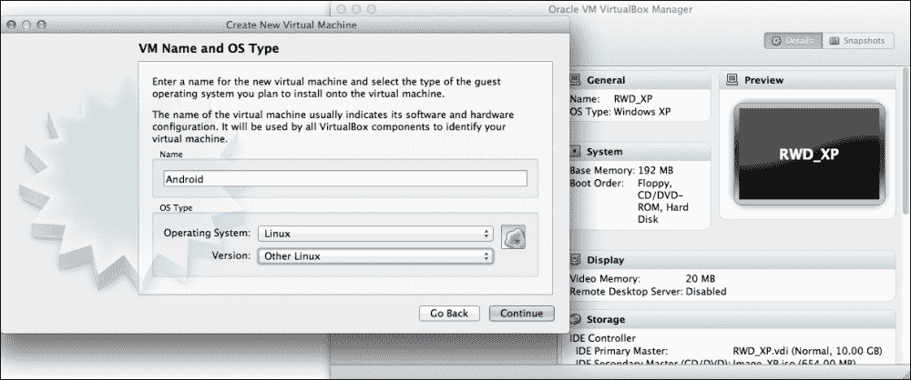

在**虚拟硬盘**屏幕上，选择**使用现有硬盘**，然后在选择对话框中，浏览到您解压到驱动器的文件夹。其中有一个`*.vmdk`文件。选择它加载到您的新虚拟机中，并点击**继续**。

继续查看**摘要**页面之后，您的 Android 模拟器将启动并完全可操作。现在您可以在真正的 Android 模拟器上测试您的应用程序，如下一个屏幕截图所示：

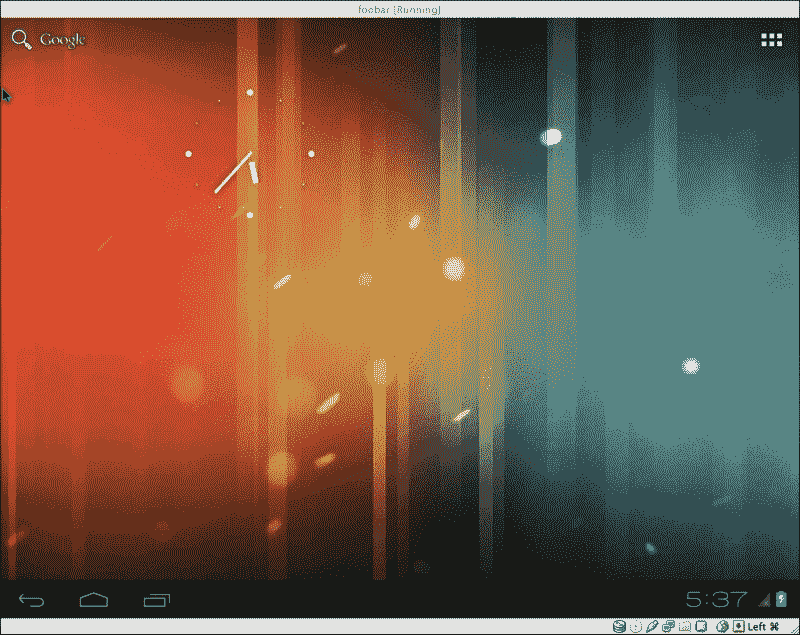

## 它是如何工作的…

虚拟机允许您在一个通用类型的模拟计算机上安装操作系统。您可以在虚拟机上随时复制、编辑和删除虚拟机，并且可以轻松地在虚拟机之间切换。在这些虚拟机中，您可以做很多事情；拍摄快照，如果出了问题，就重新开始。使用虚拟机是一个很好的做法，不需要太担心让您的操作系统运行 Apache。

# 获取 Chrome 浏览器调整大小

想象一下，您不断地拖动浏览器窗口的底部角，左右调整大小，观察您最佳的视觉估计告诉您应该达到媒体查询断点的点，并通过显示网站的新优化显示来优雅地响应。您面临的一个远非微小的问题是，您不知道您的断点将会达到哪里，因为您对当前浏览器大小没有真正的概念，也没有可靠的方法将其设置为所需的大小。看起来很傻，不是吗？坐在您身后的同事也这么认为。

一定有更好的方法。有了！现在您可以阻止您的同事嘲笑您的浏览器窗口把戏。

## 准备工作

在互联网上有一些网站可以将您的浏览器调整为最流行的断点。然而，这些很难找到，也不可靠。我发现最好的选择是安装一个好的浏览器调整大小插件。

## 如何做…

我发现的最佳解决方案是 Chrome Window Resizer 插件。要在 Chrome 上获取它，请在您喜欢的搜索引擎中搜索`Window Resizer`，然后单击链接转到 Chrome Web Store 上的插件页面。单击大蓝色按钮，上面写着**添加到 Chrome**。

这是一个相当简短和简单的安装。按照流程操作，并在每次提示时选择“是”。在下一个屏幕截图中看到调整大小器的操作：

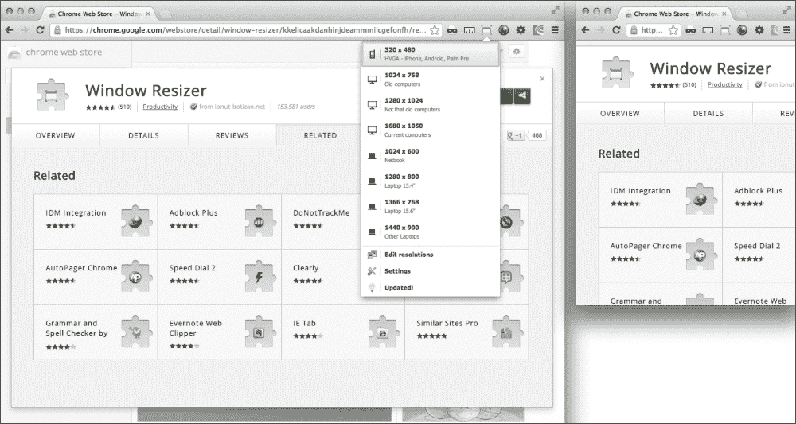

完成后，您将看到世界上最小的浏览器停靠在 Chrome 浏览器的地址栏旁边；不，开玩笑的，那是一个图标。当您单击它时，您将看到一个下拉菜单，其中包含不同的窗口大小。选择这些尺寸是因为它们是在互联网上最常见的屏幕尺寸。

如果您在您的网络项目中安装了 Google Analytics 等分析工具，您可以很好地了解您的观众是什么样子的。就这个教程而言，您会想要查看浏览器屏幕尺寸。导航到**受众**选项卡，并展开**技术**切换元素以显示**浏览器和操作系统**链接。您将看到受众浏览器的细分。在该页面上，将**主要维度：**更改为**屏幕分辨率**。现在您将能够看到站点访问者最常见的屏幕尺寸。这个工具应该能够让您了解在设计中需要集中关注的领域。请参阅以下屏幕截图：

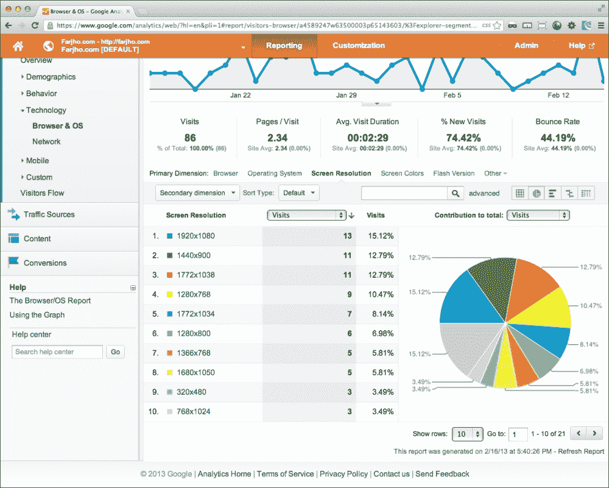

### 提示

分析将为您提供有关用户屏幕的一些有用信息，但请记住，人们通常只使用其屏幕的一部分来浏览器窗口。

回到浏览器调整大小插件；在您的项目上尝试一些内置尺寸，看看它的响应。这个工具将是您响应式设计工具箱中的一个很好的测试工具。

除了设置的尺寸之外，您会发现下拉菜单还有一个**编辑分辨率**菜单项。在这里，您可以添加您在分析屏幕上发现的任何屏幕尺寸。根据我的分析报告，我可能想首先添加`1920 x 1080`，`960 x 1080`，`1772 x 1038`和`886 x 1038`。我在下一个屏幕截图中演示了这个选项：

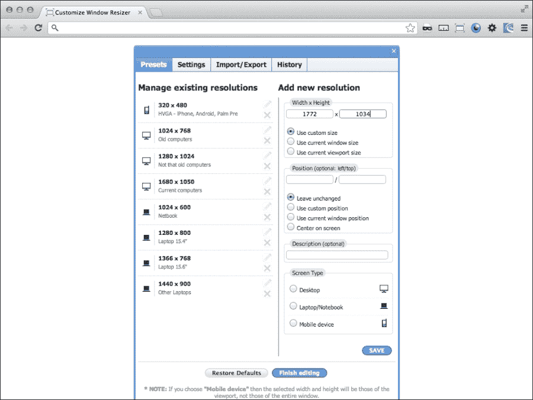

## 它是如何工作的…

这个非常有用的工具可以直接插入到您的浏览器中，通过模拟不同的屏幕分辨率来发挥其作用。虽然好的软件有时看起来像是魔术，但它并不真的是魔术。通过分析工具，您可以为您网站的访问者屏幕设计特定的优化方案。
