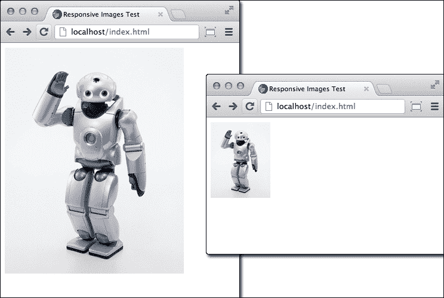
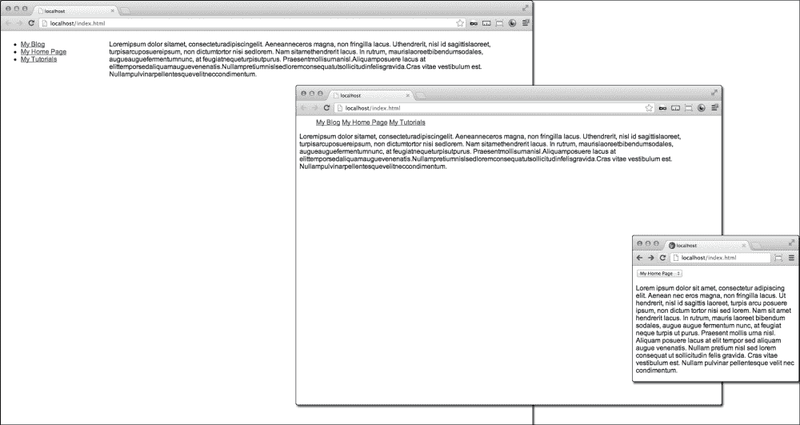
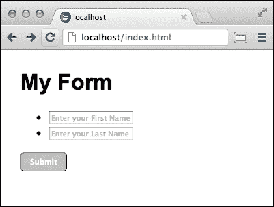
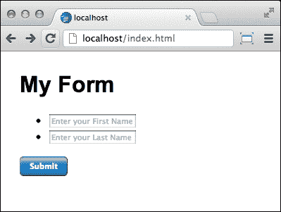
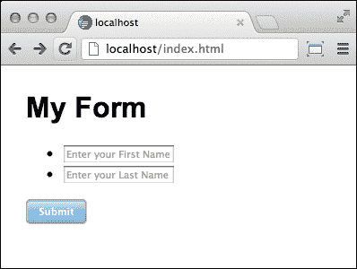

# 第一章：响应式元素和媒体

在本章中，您将学习以下内容：

+   使用百分比宽度调整图像大小

+   使用 cookie 和 JavaScript 创建响应式图像

+   使您的视频响应屏幕宽度

+   使用媒体查询调整图像大小

+   使用媒体查询更改您的导航

+   基于尺寸创建响应式填充

+   使 CSS3 按钮在加载元素上发光

# 介绍

响应式网站设计和媒体是自从我还是学生时 ASCII 艺术出现在公告板上以来，对 Web 开发最激动人心的事情之一。HTML5、CSS3 和 jQuery 的新功能为旧网络带来了新生命，以一种让人兴奋的方式为您的应用程序带来了乐趣。本章包含了几个配方，将帮助您创建响应式 HTML 元素和不同的媒体。

有些配方很简单，有些则更具挑战性。**响应式网页设计**元素所使用的所有代码都在本书中提供，因此没有什么是不可能完成的。所有响应式网页设计配方都将帮助您优化您的网站呈现，为您的观众创造一个令人惊叹的响应式网页体验，无论您使用何种设备类型或尺寸。

# 使用百分比宽度调整图像大小

这种方法依赖于客户端编码来调整大图像的大小。它只为客户端提供一张图片，并要求根据浏览器窗口的大小来渲染图像。当您确信客户端有带宽可以下载图像而不会导致页面加载缓慢时，这通常是首选的方法。

## 准备工作

首先，您需要一张图片。要找到高质量的图像，请使用 Google 图像搜索。例如搜索`robots`，搜索结果给我 158,000,000 个结果，这相当不错。但是，我真正想要的是一张大图像，所以我点击**搜索工具**，然后点击**任何尺寸**，将其更改为**大**。我仍然有 496 万张图片可供选择。

图像应调整大小以匹配最大的可视比例。在图像编辑软件中打开它。如果您还没有图像编辑软件，有许多免费的软件，去下载一个。Gimp 是一款功能强大的图像编辑软件，它是开源的，或者可以免费下载。访问[`www.gimp.org`](http://www.gimp.org)获取这款功能强大的开源图像编辑软件。

## 如何做…

一旦您有了图像编辑软件，打开图像并将图像的宽度更改为 300px。保存新图像，然后将图像移动或上传到您的网站目录。

您的 HTML 应包含图像和一些文本，以演示响应效果。如果您没有时间写自己的生活故事，可以回到互联网上从 Ipsum 生成器获取一些示例文本。访问[`www.lipsum.com`](http://www.lipsum.com)生成一个 Ipsum 文本段落。

```html
<p class="text">Loremipsum dolor sit amet…</p>
<div class="img-wrap" >
     
     <p>Loremipsum dolor sit amet</p>
</div>
```

您的 CSS 应包括一个段落类和一个图像类和一个图像包装器。将段落浮动到左侧，并给它一个宽度为`60%`，图像包装器的宽度为`40%`。

```html
p.text {
     float:left;
     width:60%;
}
div.img-wrap{
     float:right;
     width:40%;
}
```

这将创建一个流体布局，但尚未做任何事情来创建一个响应式图像。图像将保持静态宽度为 300px，直到您添加以下 CSS。然后，在 CSS 中为图像添加一个新类。为其分配`max-width`值为`100%`。这允许宽度根据浏览器宽度的变化而调整。接下来，为该类添加一个动态的`height`属性。

```html
img.responsive {
     max-width: 100%;
     height: auto;
}
```

这将创建一个根据浏览器窗口宽度响应的图像，并为观众提供优化版本的图像。

### 提示

**下载示例代码**

您可以从您在[`www.packtpub.com`](http://www.packtpub.com)的帐户中购买的所有 Packt 图书的示例代码文件。如果您在其他地方购买了这本书，您可以访问[`www.packtpub.com/support`](http://www.packtpub.com/support)并注册，以便将文件直接发送到您的电子邮件。

## 工作原理…

图像 CSS 的`responsive`属性强制其占据其父元素的 100％。当父元素的宽度发生变化时，图像会填充该宽度。`height: auto`属性用于保持图像的纵横比。

## 另请参阅

+   *使用 cookie 和 JavaScript 的响应式图像*方法

+   *基于大小创建响应式填充的方法*

# 使用 cookie 和 JavaScript 的响应式图像

响应式图像的宽度可以通过复杂的服务器逻辑进行交付。有时，由于要求，您无法通过最简单的方法实现所需的结果。百分比宽度方法依赖于客户端对大型图像文件进行调整大小。此方法提供了服务器端交付您请求的适当大小的图像。它可能减少服务器负载和带宽，并帮助您解决长时间加载的问题，如果您担心加载缓慢会影响您网站的性能。

## 准备工作

这些方法需要您的服务器对其执行某种逻辑功能。首先，它需要您的服务器上有 PHP。它还要求您创建图像的三个不同大小的版本，并根据客户端的请求将它们提供给客户端。

## 如何做…

JavaScript 很简单。它基于您设备的屏幕尺寸创建一个 cookie。当客户端请求服务器的图像时，它会触发 PHP 代码以传递适当的图像。

```html
<script >
     document.cookie = "screen_dimensions=" + screen.width + "x" + screen.height;
</script>
```

现在，在您的服务器上，在 Web 目录中创建一个`images`文件夹，并在其中创建一个名为`index.php`的 PHP 文件，其中包含以下代码：

```html
<?php
 $screen_w = 0;
 $screen_h = 0;
 $img = $_SERVER['QUERY_STRING'];

 if (file_exists($img)) {

   // Get screen dimensions from the cookie
   if (isset($_COOKIE['screen_dimensions'])) {
     $screen = explode('x', $_COOKIE['screen_dimensions']);
     if (count($screen)==2) {
       $screen_w = intval($screen[0]);
       $screen_h = intval($screen[1]);
     }
   }
   if ($screen_width> 0) {

     $theExt = pathinfo($img, PATHINFO_EXTENSION);

     // for Low resolution screen
     if ($screen_width>= 1024) {
       $output = substr_replace($img, '-med', -strlen($theExt)-1, 
     } 

     // for Medium resolution screen
     else if ($screen_width<= 800) {
       $output = substr_replace($img, '-low', -strlen($theExt)-1, 0);
     }

     // check if file exists
     if (isset($output) &&file_exists($output)) {
       $img = $output;
     }
   }

   // return the image file;
   readfile($img);
 }

?>
```

现在，使用您的图像编辑软件打开您的大图像，并创建两个较小的版本。如果原始版本是 300px，则将下面的两个副本分别制作为 200px 和 100px。然后，分别将它们命名为`robot.png`，`robot-med.png`和`robot-low.png`。将这三个图像上传到`images`文件夹中。

最后，在您服务器的文档根目录中放入以下 HTML 文件：

```html
<!doctype html>
<html>
     <head>
          <title>Responsive Images</title>
          <meta charset="utf-8">
          <script>
   document.cookie = "device_dimensions=" + screen.width + "x" + screen.height;
          </script>
     </head>
     <body>
         
     </body>
</html>
```

您可以在以下截图中看到该方法的实际效果：



虽然此方法仅限于为每个屏幕尺寸提供特定图像，并且不是流动动态的，但它在服务器端提供了与 CSS 媒体查询相同的功能。您可以使用 CSS 对提供的图像进行样式设置，或者使用 JavaScript 对其进行动画处理。它可以与各种方法结合使用，以提供响应式内容。

此方法的代码最初由[`www.html.it/articoli/responsive-images-con-i-cookie/`](http://www.html.it/articoli/responsive-images-con-i-cookie/)的聪明人创建。

## 工作原理…

HTML 文件首先创建一个描述您设备屏幕尺寸的 cookie。当图像元素调用 PHP 文件时，它的工作原理类似于 PHP 中的`include`语句。PHP 文件首先检查文件是否存在，然后读取屏幕宽度的 cookie，并传递图像的适当大小版本。

# 使您的视频响应您的屏幕宽度

视频的流媒体也可以是响应式的。您可以轻松地在页面中嵌入 HTML5 视频并使其响应式。`video`标签很容易支持使用百分比宽度。但是，这需要您在您网站的主机上拥有视频源。如果您有这个可用，这很容易。

```html
<style>
video {
     max-width: 100%;
     height: auto;
}
</style>

<video width="320" height="240" controls="controls">
     <source src="img/movie.mp4" type="video/mp4">
     <source src="img/movie.ogg" type="video/ogg">
     Your browser does not support the video tag.
</video>
```

然而，使用视频托管网站，如 YouTube 或 Vimeo，与自己托管它相比有很多优势。首先，存在带宽问题，您的托管服务器可能有带宽或磁盘空间限制。此外，视频托管网站使上传转换为可用的网络视频变得非常容易，而不仅仅是使用您自己的资源。

## 准备工作

视频托管网站允许您在页面中嵌入 iFrame 或对象代码片段以在您的网站上流式传输视频。这不适用于`video`标签内。因此，为了使其响应式，有一种更复杂但仍然简单的方法。

## 如何做…

将视频源片段包装在包含`div`元素的 HTML 中，并在底部给它 50 到 60％的填充和相对位置。然后给它的子元素，视频 iFrame 对象，一个`100%`的宽度和`100%`的高度，并且一个`absolute`位置。这样可以使 iFrame 对象完全填充父元素。

以下是使用`iframe`标签从 Vimeo 获取视频的 HTML 代码：

```html
<div class="video-wrap">
     <iframe src="img/52948373?badge=0" width = "800" height= "450" frameborder="0"></iframe>
</div>
```

以下是使用旧版 YouTube 对象的 HTML 代码：

```html
<div class="video-wrap">
    <object width="800" height="450">
       <param name="movie" value="http://www.youtube.com/v/b803LeMGkCA?version=3&amp;hl=en_US">
         </param>
         <param name="allowFullScreen" value="true"></param>
         <param name="allowscriptaccess" value="always"></param>
         <embed src="img/b803LeMGkCA?version=3&amp;hl=en_US" type="application/x-shockwave-flash" width="560" height="315" allowscriptaccess="always" allowfullscreen="true">
          </embed>
     </object>
</div>
```

两种视频类型使用相同的 CSS：

```html
.video-wrap {
     position:relative;
     padding-bottom: 55%;
     padding-top: 30px;
     height: 0;
     overflow:hidden;
}
.video-wrap iframe,
.video-wrap object,
.video-wrap embed {
     position:absolute;
     top:0;
     width:100%;
     height:100%;
}
```

您可能不希望视频占据整个页面的宽度。在这种情况下，您可以使用`width`和`max-width`限制视频的宽度。然后，用另一个`div`元素包装`video-wrap`元素，并分配一个固定的`width`值和`max-width:100%`。

```html
<div class="video-outer-wrap">
     <div class="video-wrap">
          <iframe src="img/6284199?title=0&byline=0&portrait=0" width="800" height="450" frameborder="0">
          </iframe>
     </div>
</div>

.video-outer-wrap {
     width: 500px;
     max-width:100%;
}
```

这个方法适用于所有现代浏览器。

## 它是如何工作的...

这种方法被称为视频的固有比率，由 Thierry Koblentz 在 A List Apart 上创建。您将视频包裹在具有固有纵横比的元素内，然后给视频一个绝对位置。这样可以锁定纵横比，同时允许尺寸是流体的。

# 使用媒体查询调整图像大小

媒体查询是另一种有用且高度可定制的响应式图像方法。这与通过百分比宽度方法实现的响应式流体宽度不同。您的设计可能需要不同屏幕尺寸范围的特定图像宽度，而流体宽度会破坏您的设计。

## 准备工作

这种方法只需要一个图像，并且使客户端的浏览器重新调整图像而不是服务器。

## 如何做…

HTML 代码很简单，使用标准图像标签，创建一个图像元素，如下所示：

```html

```

首先从一个简单版本开始，创建一个媒体查询，以检测浏览器窗口的大小，并为大于`1024px`的浏览器屏幕提供更大的图像，为较小的浏览器窗口提供较小的图像。首先是媒体查询，它寻找媒体类型`screen`，然后是屏幕大小。当媒体查询满足时，浏览器将呈现大括号内的 CSS。

```html
@media screen and ( max-width: 1024px ) {…}
@media screen and ( min-width: 1025px ) {…}
```

现在，为图像标签添加一个类。该类将在不同的媒体查询中有不同的响应，如下面的代码行所示：

```html

```

为每个媒体查询添加不同大小的 CSS 类将使浏览器为每个不同大小的浏览器窗口呈现所需的图像大小。媒体查询可以与其他 CSS 类共存。然后，在媒体查询之外，添加一个带有`height:auto`的图像的 CSS 类。这将适用于只添加一行 CSS 的两个媒体查询。

```html
@media screen and ( max-width: 1024px ) {
img.responsive { width: 200px; }
}
@media screen and ( min-width: 1025px) {
img.responsive { width: 300px;}
}
img.responsive { height: auto; }
```

要使图像响应多个范围，可以结合`max-width`和`min-width`媒体查询。要为浏览器窗口大小在`1024px`和`1280px`之间的屏幕添加媒体查询，添加一个媒体查询为屏幕，`1024px`为`min-width`，`1280px`为`max-width`。

```html
@media screen and ( max-width: 1024px ) {
img.responsive { width: 200px; }
}
@media screen and ( min-width:1025px ) and ( max-width: 1280px ) {
img.responsive { width: 300px; }
}
@media screen and ( min-width: 1081px ) {
img.responsive { width: 400px; }
}
img.responsive { height: auto; }
```

使用媒体查询方法可以为许多不同的浏览器窗口大小指定许多不同的图像大小。

## 它是如何工作的...

CSS3 的媒体查询根据浏览器的视口属性给出您的 CSS 逻辑条件，并且可以根据浏览器的窗口属性呈现不同的样式。这个方法利用了这一点，通过为许多不同的浏览器窗口大小设置不同的图像宽度。因此，可以提供响应式图像大小，并且可以以高度精细的方式进行控制。

# 使用媒体查询更改导航

媒体查询不仅可以调整图像大小，还可以向观众提供更加动态的网页。您可以使用媒体查询根据不同的屏幕尺寸显示响应式菜单。

## 准备工作

为了创建一个响应式菜单系统，使用两个不同的菜单，我们将为三种不同的浏览器窗口大小显示一个动态菜单。

## 如何做...

对于较小的浏览器窗口，特别是移动设备和平板电脑，创建一个简单的`select`菜单，它只占用少量的垂直空间。该菜单使用 HTML`form`元素作为导航选项，当选择时触发 JavaScript 代码以加载新页面。

```html
<div class="small-menu">
     <form>
          <select name="URL" onchange="window.location.href=this.form.URL.options[this.form.URL.selectedIndex].value">
              <option value="blog.html">My Blog</option>
              <option value="home.html">My Home Page</option>
              <option value="tutorials.html">My Tutorials</option>
          </select>
     <form>
</div>
```

对于较大的浏览器窗口大小，创建一个可以通过 CSS 进行样式设置的简单`ul`列表元素。这个菜单将从不同的媒体查询中获得不同的布局和外观。这个菜单被添加到与`select`菜单相同的页面之后：

```html
<div class="large-menu">
     <ul>
          <li>
               <a href="blog.html">My Blog</a>
          </li>
          <li>
               <a href="home.html">My Home Page</a>
          </li>
          <li>
               <a href="tutorials.html">My Tutorials</a>
          </li>
     </ul>
</div>
```

为了使菜单具有响应性，为目标浏览器窗口大小创建媒体查询。对于小于`800px`的浏览器窗口，CSS 将仅显示带有`small-menu`类的`div`元素内的`select`表单，对于所有较大的浏览器窗口，CSS 将显示带有`large-menu`类的`div`元素内的`ul`列表。这会在浏览器窗口跨过`801px`的宽度时创建一个效果，页面将在菜单之间切换。

```html
@media screen and ( max-width: 800px ) {
.small-menu { display:inline; }
.large-menu { display:none; }
}
@media screen and ( min-width: 801px ) and ( max-width: 1024px ) {
.small-menu { display:none; }.
.large-menu { display:inline; }
}
@media screen and ( min-width: 1025px ) {
.small-menu { display:none; }
.large-menu { display:inline; }
}
```

对于较大的屏幕尺寸，您可以使用相同的`ul`列表，并进一步使用媒体查询来提供不同的菜单，只需切换 CSS 并使用相同的 HTML 即可。

对于中等大小的菜单，使用 CSS 将列表项显示为水平列表，如下面的代码片段所示：

```html
.large-menu ul{ 
     list-style-type:none; 
}
.large-menu ul li { 
     display:inline; 
}
```

这将把列表转换为水平列表。我们希望这个版本的导航出现在中等大小的浏览器窗口上。将其放在介于`801px`和`1024px`之间的媒体查询中，如下面的代码片段所示：

```html
@media screen and ( min-width: 801px ) and (max-width: 1024px ) {
     .small-menu { 
          display:none; 
     }
.large-menu { 
          display:inline; 
     }
.large-menu ul { 
          list-style-type:none; 
     }
.large-menu ul li {
          display:inline;
     }
}
@media screen and (min-width: 1025px ) {
.small-menu { 
          display:none; 
     }
     .large-menu { 
          display:inline; 
     }
}
```

为了更好地利用响应式导航元素，我们希望菜单列表版本在屏幕宽度变化时移动到不同的布局位置。对于中等宽度，`801px`到`1024px`，菜单保持在页面顶部，并且宽度为`100%`。当屏幕宽度大于`1025px`时，菜单将浮动到其父元素的左侧。在`801px`到`1024px`的媒体查询中，为`large-menu`类添加`100%`的宽度，在`1025px`的媒体查询中，为`large-menu`类添加`20%`的宽度和`float:left`的值。

为了填充页面，我们还将添加一个包裹在`div`元素中的文字段落。您可以返回到 Lorem Ipsum 文本生成器创建占位文本（[`lipsum.com/`](http://lipsum.com/)）。在中等宽度的媒体查询中，给包含段落的元素一个`100%`的宽度。在最大的媒体查询中，给包含段落的元素一个`80%`的宽度，并将其浮动到其父元素的右侧。

```html
<div class="small-menu">
     <form>
          <select name="URL" onchange="window.location.href=this.form.URL.options[this.form.URL.selectedIndex].value">
              <option value="blog.html">My Blog</option>
              <option value="home.html">My Home Page</option>
              <option value="tutorials.html">My Tutorials</option>
          </select>
     <form>
</div>

<div class="large-menu">
     <ul>
          <li>
               <a href="blog.html">My Blog</a>
          </li>
          <li>
               <a href="home.html">My Home Page</a>
          </li>
          <li>
               <a href="tutorials.html">My Tutorials</a>
          </li>
     </ul>
</div>

<div class="content">
     <p>Loremipsum dolor sitamet, consecteturadipiscingelit…</p>
</div>
```

您的样式应该如下所示：

```html
<style>
@media screen and ( max-width: 800px ) {
     .small-menu { 
          display: inline; 
     }
     .large-menu { 
          display: none; 
     }
}
@media screen and ( min-width: 801px ) and ( max-width: 1024px ) {
     .small-menu { 
          display: none; 
     }
     .large-menu { 
          display:inline; 
          width: 100%; 
     }
     .large-menu ul { 
          list-style-type: none; 
     }
     .large-menu ul li { 
          display: inline; 
     }
     .content: { 
          width: 100%; 
     }
}
@media screen and ( min-width: 1025px ) {
     .small-menu { 
          display: none; 
     }
     .large-menu { 
          display: inline; 
          float: left; 
          width: 20%;
     }
     .content{
          float: right;
          width: 80%;
     }
}
</style>
```

最终结果是一个页面，其中包含三种不同版本的导航。当为每个特定的浏览器窗口大小提供优化版本的菜单时，您的受众将感到惊讶。您可以在以下截图中看到导航元素的所有精彩之处：



## 它是如何工作的...

每个导航版本都利用了媒体查询 CSS3 属性，以最大化菜单和内容的可用空间。在最小的窗口下，低于`1024px`，导航被整齐地放置在`select`表单元素内。中等窗口，范围从`1025px`到`1280px`，导航是内联的，并横跨页面顶部，后面是内容。最后，在最宽的浏览器宽度下，菜单浮动在左侧，并且只占据水平屏幕空间的 20%，而内容则最大化占据剩余的 80%（右侧）的宽广浏览器窗口。这种技术需要更多的规划和努力，但为了向您的受众提供最佳的观看体验，这是非常值得的。

# 基于大小创建响应式填充

为了补充响应式宽度图像元素，可以添加相对填充。使用静态宽度填充，图像填充可能在较小的浏览器窗口中显得太厚，并且会挤满附近的任何其他元素，或者可能将图像推出屏幕。

## 做好准备

一个很好的开始是对盒模型属性的计算有一些了解。对象占用的总宽度是其实际宽度加上其两侧的填充、边框和边距，或者*2 x (margin + border + padding) + content = total width*。

## 如何做…

对于一个在其正常非响应状态下宽度为 200px 的图像，您的典型填充可能为 8px，因此使用先前的盒模型，公式可以表述如下：

`2 x ( 0 + 0 + 8px ) + 200px = 216px`

要找到填充的百分比，将填充除以总宽度，`8 / 216 = 0.037%`四舍五入为`4%`。

我们之前创建了这个 CSS 和 HTML，当我们创建了响应式百分比宽度的图片时。在图像类中添加`4%`的填充。

```html
<style>
p.text {
      float: left;
      width: 60%;
   }
div.img-wrap{
      float: right;
      margin: 0px;
      width: 38%;
   }
img.responsive {
      max-width: 100%;
      height: auto;
      padding: 4%;
   }
</style>

<p class="text">ipsum dolor sit amet, consecteturadi…</p>
<div class="img-wrap">
     
     <p>ipsum dolor sit amet, consecteturadipiscingelit…</p>
</div>
```

为了帮助您看到实际填充宽度随着更改浏览器窗口大小而改变，将背景颜色（`background-color: #cccccc;`）添加到您的图像 CSS 中。

## 它是如何工作的…

设置为 100%的图像填充将粘附在其父元素的边缘。随着父元素大小的变化，图像填充会相应调整。如果您正确计算了盒模型数学，您的布局将成功响应浏览器窗口的宽度变化。

# 使 CSS3 按钮在加载元素时发光

您的网站，像许多其他网站一样，可能迎合着急的人。如果您的网站有一个可提交的表单，如果您的页面加载新内容的速度不够快，您的用户可能会不耐烦地多次点击“提交”按钮。当它导致多次提交相同数据的表单时，这可能会成为一个问题。

## 做好准备

您可以通过添加一些简单的视觉提示来阻止这种行为，告诉用户幕后正在发生一些事情，并且要有点耐心。如果有点花哨，甚至可能会给他们匆忙的生活带来一点阳光。这个配方不需要任何图像，我们将只使用 CSS 创建一个漂亮的渐变提交按钮。您可能需要暂停一下，去喝杯咖啡，因为这是本章中最长的配方。

## 如何做…

您可以先创建一个带有一些文本框和提交按钮的表单。然后，使表单真的很酷，使用 HTML5 的占位符属性作为标签。即使有了占位符，表单还是相当无聊。

请注意，这在 Internet Explorer 9 中尚不受支持。

```html
<h1>My Form<h1>
<form>
     <ul>
        <li>
          <input type="text" placeholder="Enter your first name"/>
        </li>
        <li>
          <input type="text" placeholder="Enter your last name"/>
        </li>
     </ul>
<input type="submit" name="Submit" value="Submit">
</form>
```

通过添加 CSS 属性，我们可以开始为按钮赋予一些生命：

```html
input[type="submit"] {
     color: white;
     padding: 5px;
     width: 68px;
     height: 28px;
     border-radius: 5px;
     border: 1px;
     font-weight: bold;
     border: 1px groove #7A7A7A;
}
```

这在以下截图中有所说明：



当我们添加 CSS3 渐变效果时，按钮甚至可以变得更加闪亮。为了实现这一点，必须为每个浏览器渲染引擎添加不同的 CSS 行：Opera、Internet Explorer、WebKit（Chrome 和 Safari）和 Firefox。您可以通过添加`color`相位和从顶部的`%`位置，每个移位之间用逗号分隔，来添加尽可能多的渐变移位，如下面的代码片段所示：

```html
<style>
input[type="submit"] {
     background: -moz-linear-gradient(top, #0F97FF 0%, #97D2FF 8%,#0076D1 62%, #0076D1 63%, #005494 100%);
     background: -webkit-gradient(linear, left top, left bottom, color-stop(0%,#0F97FF), color-stop(8%,#97D2FF)color-stop(50%,#0076D1), color-stop(51%,#0076D1), color-stop(100%,#005494));
     background: -webkit-linear-gradient(top, #0F97FF 0%,#97D2FF 8%,#0076D1 62%,#0076D1 63%,#005494 100%);
     background: -o-linear-gradient(top, #0F97FF 0%,#97D2FF 8%,#0076D1 62%,#0076D1 63%,#005494 100%);
     background: -ms-linear-gradient(top, #0F97FF 0%,#97D2FF 8%,#0076D1 62%,#0076D1 63%,#005494 100%);
     background: linear-gradient(to bottom, #0F97FF 0%,#97D2FF 8%,#0076D1 62%,#0076D1 63%,#005494 100%);filter: progid:DXImageTransform.Microsoft.gradient( startColorstr='#0f97ff', endColorstr='#005494',GradientType=0 );
}
</style>
```

这个效果在以下截图中有所说明：



CSS 还可以为按钮添加`hover`效果。使用此属性，当指针移动到按钮上时，它看起来就像被按下了。以下 CSS 将帮助您为按钮添加那个深色边框：

```html
input[type="submit"]:hover {
   border: 2px groove #7A7A7A;
}
```

这在以下截图中显示：



使用 CSS3 Box Shadows 和 jQuery，我们可以制作一个简单的动画，在您按下**提交**按钮后，围绕按钮出现脉动的光环。使用 jQuery 创建一个事件监听器，监听按钮的`click`事件，在该`click`事件上，对表单按钮元素进行一系列类更改。脚本将向按钮元素添加`partial-fade`类。

### 提示

不要忘记在`head`标签中添加到 jQuery 源的链接：

```html
<scriptsrc="img/jquery-latest.js"></script>
```

然后，在表单关闭后插入以下脚本：

```html
<script >
//Submit Glow
$('input[type="submit"]').click(function() {
$(this).addClass('partial-fade');
   $(this).animate({
      opacity: 0.1
   }, 8).animate({
       opacity: 0.9
   }, 226).animate({
       opacity: .5
   }, 86);
   setTimeout(function () {
      $('input[type="submit"]').removeClass('partial-fade');
   }, 366).animate({
       opacity: 1
   }, 86);
});
</script>
```

要完成按钮在点击时发光，需要在 CSS 文件中添加新的类`partial-fade`，并给它一个 CSS3 Box Shadow 属性，并改变边框属性。

```html
<style>
input[type="submit"].partial-fade {
     border-top: 1px solid #CFF !important;
     border-right: 1px solid #CCF !important;
     border-left: 1px solid #CCF !important;
     border-bottom: 1px solid #6CF !important;
     -webkit-box-shadow: 0 08px 0px #0F97FF, inset 0 0 20px rgba(37, 141, 220, 1);
     -moz-box-shadow: 0 0 8px 0px #0F97FF, inset 0 0 20px rgba(37,141,220,1);
     box-shadow: 0 0 8px 0px #0F97FF, inset 0 0 20px rgba(37, 141, 220, 1);
}
</style>
```

现在，**提交**按钮在按下时会闪烁蓝色。下面的截图显示了最终产品：


哇！为了这样一个小细节，这个按钮需要做很多工作，但是这样的细节确实会帮助制作出一个看起来很棒的网站。这恰好是我最喜欢用来给我的观众一个惊喜的细节之一。

## 工作原理…

CSS3 背景渐变是一种在各种浏览器中制作出一个看起来很棒的按钮的简单方法。渐变很复杂，每个浏览器目前都需要自己的 CSS 行。您可以通过手动添加百分比和颜色来控制渐变的断点。添加盒阴影、边框和 jQuery 可以在事件触发时给按钮带来有趣的效果。
