# 第五章：制作移动优先 Web 应用程序

在本章中，您将学习：

+   使用 Safari 开发人员工具的用户代理切换器

+   使用 Chrome 插件在 Chrome 中掩盖您的用户代理

+   使用浏览器调整大小插件

+   学习视口及其选项

+   为 jQuery Mobile 添加标签

+   在 jQuery Mobile 中添加第二个页面

+   在 jQuery Mobile 中制作列表元素

+   使用 jQuery Mobile 添加移动原生外观按钮

+   仅为移动浏览器添加移动样式表使用媒体查询

+   仅为移动浏览器添加 JavaScript

# 介绍

在本章中，我们将专注于移动优先响应式设计。这意味着首先为移动设备设计您的站点，然后为桌面应用程序应用变化甚至完全不同的外观。我们将介绍一些关于 jQuery Mobile 的配方，这是一个免费的开源移动 UI 元素和小部件库。此外，我们将构建一些客户端脚本来处理仅适用于移动设备的独特外观。

# 使用 Safari 开发人员工具的用户代理切换器

对于开发移动优先应用程序，您需要在本地部署它们并测试您开发的各种功能。到目前为止，我们已经使用了许多响应式 Web 配方，依赖于媒体查询来确定基于大小的布局，以提供站点的优化视图。这不是应用程序可以提供移动布局的唯一方式，还有更多。一种方法是通过**用户代理**来嗅探。

您可能已经了解用户代理，但让我们假设您不了解。此外，已经知道一切简单地违背了购买这本书的目的，不是吗？用户代理存在于请求标头中，并标识发出请求的客户端软件。它包含有关您的处理器、操作系统版本、浏览器、渲染引擎、IP 地址和其他标识信息的信息。

根据项目的需求或开发人员的偏好，一些网站被设计为为移动设备显示不同的模板文件，或者基于用户代理数据的其他细节。这种方法需要不同的服务器或客户端智能来读取用户代理并解释其数据，以提供该场景的演示。

所以你创建了一个新的 Web 应用程序，当用户代理详细信息为移动设备时，软件会显示移动模板。但是，您希望能够即时测试它，而不必启动 Web 服务器，因此下一个最好的方法是在 Safari 中使用用户代理掩码功能。

使用 Safari 浏览器用户代理切换器是双赢的，因为它不仅模仿了 iOS 设备上移动 Safari 浏览器的用户代理，还模仿了 Android 浏览器的用户代理。所以您可以放心，因为 Android 用户代理已更改为也是 Mobile Safari，只是为了让您的生活更轻松。他们真好。

### 提示

在您的工作范围中明确指定您将进行测试的浏览器和用户代理是一个很好的做法。

## 准备就绪

在苹果电脑上，它已经安装好了。你领先一步。所以等着 Windows 用户赶上吧。

苹果公司似乎不太可能继续为 Windows 开发 Safari。事实上，当您搜索`Safari Windows`时，第一个链接不是 Safari 主页，而是一个包含指向最新 Safari for Windows 版本 Safari 5.1.7 for Windows 链接的苹果支持页面，而不是最新版本（版本 6）。但是为了这个配方的目的，让我们继续。

## 如何做…

首先，打开 Safari 浏览器；您将要访问一个作为读取用户代理演示的网站。转到[`whatsmyuseragent.com`](http://whatsmyuseragent.com)，页面将显示您的用户代理的详细信息。

在 Safari 中，转到**Safari** | **首选项**，或按下*Command* `+` *,*。在**高级**选项卡中，选择**在菜单栏中显示开发菜单**复选框。您可以在以下截图中看到这一点：

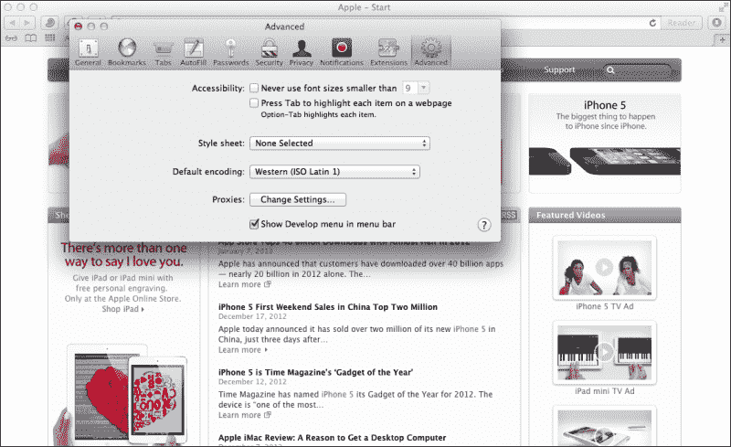

现在菜单栏显示了菜单选项**开发**。单击它，然后选择**用户代理**；一个子菜单出现，其中包含不同的用户代理选项。这里有许多有用的选项，但对于这个教程，最有用的是**Safari iOS 5.1 - iPhone**和**Safari iOS 5.1 - iPad**（很可能您的版本可能不是 5.1）。这在下一个截图中有演示：

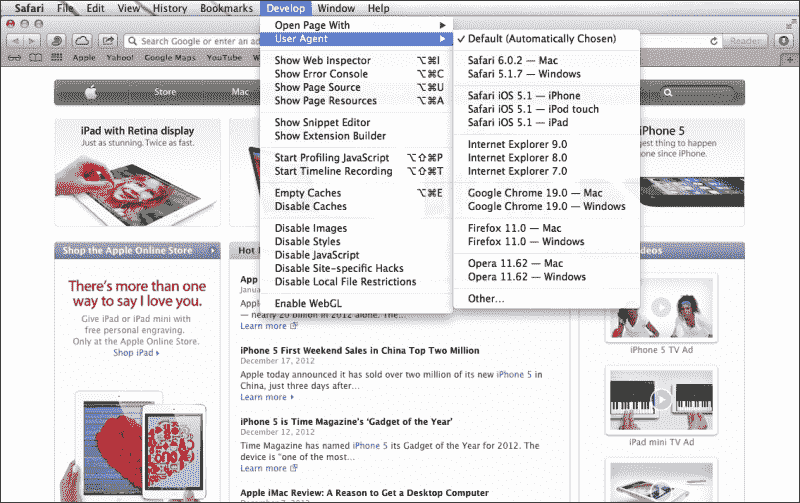

选择其中一个 iOS 版本；页面将自动刷新。您现在将看到新的用户代理信息，如下一个截图所示：

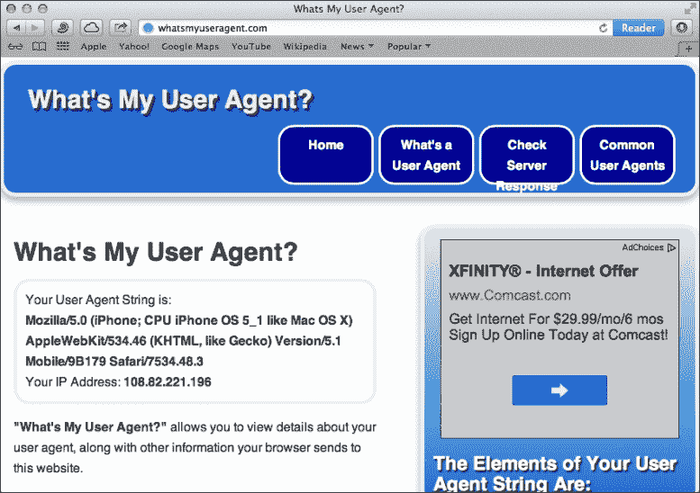

## 它是如何工作的...

我知道看起来好像没有发生什么，但发生的事情很重要。浏览器向服务器提供了关于您的计算机和浏览器的信息，并因此为您提供了不同的网页。您可以构建逻辑，为移动浏览器提供特殊的样式表、模板、脚本或完全不同的页面内容。

# 使用插件在 Chrome 中伪装您的用户代理

Chrome 浏览器拥有大量插件，您可以为几乎任何目的使用。让我们探索一个用户代理伪装插件来伪装您的用户代理。

为什么要“伪装”您的用户代理？这不诚实吗？好吧，我承认，是的。但这是为数不多的几种情况之一，结果确实证明了手段。此外，没有任何伤害；就像服务器发现您的浏览器在撒谎并感到被欺骗和受伤一样。伪装您的用户代理可以让您说服 Web 服务器，您的桌面浏览器实际上是移动浏览器。如果服务器相信您正在使用移动浏览器，并且其逻辑决定应该提供移动版本，那么您将得到移动版本。

## 准备工作

我们想找到一种方法，可以在不同的用户代理之间切换，并且希望它非常简单。事实上，我们希望它是浏览器上的一个按钮，我们可以按下并切换。那么我们从哪里可以得到这个令人惊叹的技术把戏？在 Chrome 网络商店！

我尝试了一些不同的 Chrome 浏览器插件，并找到了一个成为我响应式工具包中最喜欢的插件。Chrome 的**用户代理切换器**提供了一种快速切换全面用户代理列表的方法。要获得它，采取更简单的路径，搜索`Google UA Spoofer`。

## 如何做...

第一个搜索结果应该是指向 Chrome 网络商店中的用户代理切换器的链接。如果是的话，转到该链接，然后点击**添加到 Chrome**按钮。这就是您需要安装它的全部内容。使用它将更容易。

现在看看浏览器顶部的最上方部分，地址栏右侧，找到一个新图标，形状像一个小面具。当您点击它时，会弹出一个不同浏览器的菜单，其中包含可用版本的子菜单。我们测试过了，很容易。看下一个截图以证明：

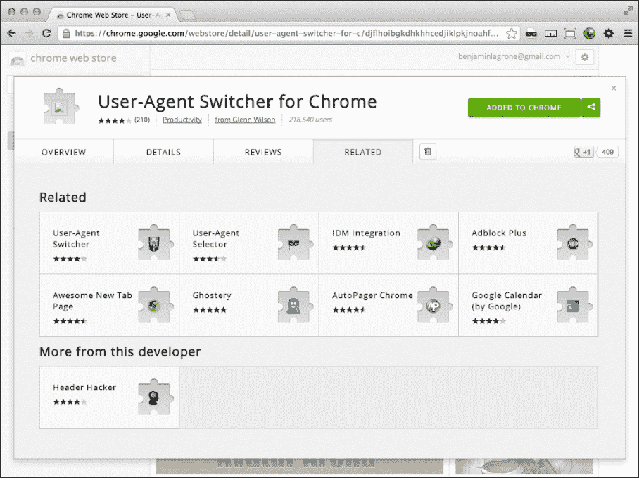

## 它是如何工作的...

Chrome 用户代理欺骗浏览器插件拦截了请求头中的正常浏览器用户代理信息，并用欺骗的用户代理信息替换它。到目前为止，我们只是讨论了如何测试用户代理欺骗器。如何设计您的网站来处理不同的用户代理是一个完全不同的主题。

要看它的效果，请转到[`whatsmyuseragent.com/`](http://whatsmyuseragent.com/)，然后切换浏览器插件，从**iOS**切换到**iPhone**。您将看到用户代理信息更改为**iPhone**。尝试一些更多的实验，看看伪装的用户代理如何影响您喜欢的网站。

## 还有更多...

看看网络上一些流行的网站，你会看到它们如何处理不同的用户代理。有些提供不同的主题，有些将你的浏览器重定向到他们的移动版本的子域。例如，[`facebook.com`](http://facebook.com) 会将 iOS 用户代理重定向到[`m.facebook.com/?_rdr`](http://m.facebook.com/?_rdr)，而[`plus.google.com/`](https://plus.google.com/) 会将移动版本的网站重定向到[`plus.google.com/app/basic/stream`](https://plus.google.com/app/basic/stream)。

下面的截图显示了伪装用户代理如何显示页面的不同之处：

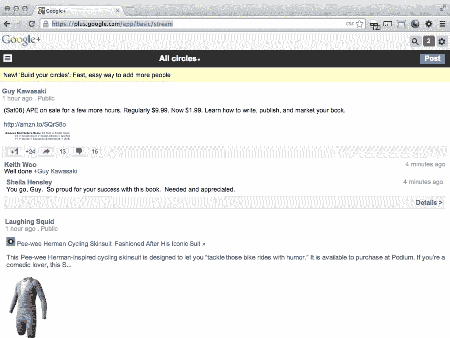

# 使用浏览器调整大小插件

我会坦率地告诉你；这个教程是关于安装和使用我使用的浏览器调整大小插件。如果你有更好的选择，请告诉我。我在搜索后选择的插件叫做“Window Resizer”。

除了在目标设备上测试外，使用插件调整窗口大小是测试媒体查询的最准确方法。然而，这只是你应该对响应式网站进行的测试的一部分。在部署之前，一定要使用模拟器和实际设备进行测试。没有什么比部署一个现场网站后，有人提醒你它崩溃和燃烧更糟糕的了。

## 准备工作

谷歌是你的朋友。搜索`Window Resizer`。第一个搜索结果应该是 Chrome 网上应用店中的 Window Resizer 插件。就像夜晚的灯塔一样！它有五颗星，而且是免费的；你怎么能不点击那个链接呢？

## 如何做...

如果你跟着我走，你会发现自己在 Chrome 网上应用店的安装页面上。你会看到一个吸引人的、宽阔而宁静的深蓝色按钮，上面写着**+ 添加到 Chrome**。你被吸引住了，感觉需要点击它。你看到了蓝色，夜晚你仰望的天空，想着有一天你会走多远。你想着你的浏览器可以有多种不同的大小。你想着拖动窗口角落时的痛苦，试图猜测它的大小。你受不了了。点击按钮！

你的浏览器窗口上出现了一阵动作的飘忽。最后，蓝色按钮变成了绿色。你在这里完成了。

在你的浏览器窗口，一个看起来像一个微小浏览器窗口的新图标已经找到了它的位置，位于地址栏右侧。好奇心驱使你需要知道这个东西能做什么。

这几乎是测试不同媒体查询和网站响应式版本的几乎完美的方法，仅次于直接在目标设备上测试。

## 它是如何工作的...

使用这个按钮来测试你的响应式设计，达到像素级的精确度。当你点击它时，它会展示一个不同的浏览器窗口大小的列表。每一个都是完美测量的，会根据你的意愿调整你的浏览器大小。这个浏览器插件为你做所有的猜测和精确测量，因为它可以在点击按钮时直接影响浏览器窗口大小！见下面的截图：

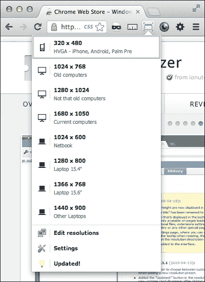

# 学习视口及其选项

如果没有别的，可以说视口的目的是驯服移动浏览器窗口。视口对于确定你的移动浏览器如何呈现移动网页至关重要。

## 准备工作

如果你使用苹果电脑，可以通过从苹果下载 Xcode 来获得 iOS 模拟器。它是 Xcode 软件包的一部分。我通常通过使用 Spotlight 来找到它。按下*Command* + 空格键；Spotlight 搜索框会出现在屏幕右上角。开始输入`iOS Simulator`，它会出现在搜索结果中。点击它来启动 iOS 模拟器。

## 如何做...

打开之前从上一个配方项目中完成的响应式项目之一。我建议打开*使用媒体查询创建响应式宽度布局*配方中的[resp-width-layout-media-query.html](http://resp-width-layout-media-query.html)项目。

要在 Windows 上获得 iOS 模拟器，你需要在网上找到一个。经过搜索，我在[`iphone4simulator.com/`](http://iphone4simulator.com/)找到了一个好的模拟器，还有一个在[`iphonetester.com/`](http://iphonetester.com/)。要使用它们，你需要在将项目文件上传到 Web 主机之前，这个 Web 模拟器才能查看它。该模拟器无法读取你本地硬盘上的文件，除非你运行一个本地 Web 服务器。

首先，为了比较，在你的浏览器中查看文件。然后在你的 iPhone 模拟器中，输入文件的 URL，你会发现震惊和恐惧，因为你的网站看起来就像桌面版本一样。当我的早期响应式项目不按照我想要的方式工作时，我也经历了同样的挫败感。问题在于移动浏览器不知道你希望它的大小是多少。它很聪明，但不够机智。就像所有软件一样，它需要良好的指示。所以深呼吸，我们将一起解决它。问题在下面的截图中有所说明：

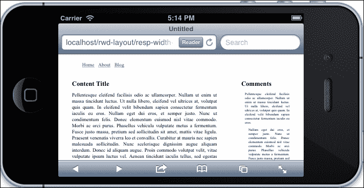

你可以通过配置 viewport 告诉移动浏览器它应该做什么。首先添加简单的 viewport `<meta>`标签：

```html
<meta name="viewport">
```

在我们继续之前，我应该告诉你一个警告。如果你不打算为移动设备设计页面，那就不要包含 viewport `<meta>`标签。它可能会对你的页面交付产生意想不到的后果。事实上，它可能只会显示你页面的一小部分，不允许观众放大或滚动查看整个页面。

现在我们将讨论它的选项。首先是宽度；我非常喜欢 K.I.S.S.原则（保持简短和简单）。除非你有特定的宽度要求，将设备宽度作为 viewport 宽度。这样，它将读取设备宽度并将其设置为页面宽度。设置特定的宽度，例如`1000px`，在 iPad 上看起来还可以，但在手机设备上会呈现得太宽，使小于该宽度的媒体查询无效。

```html
<meta name="viewport" content="width=device-width">
```

一旦你做出了改变，打开你的 iOS 模拟器的浏览器并查看文件。你可以在下面的截图中看到修复后的版本：

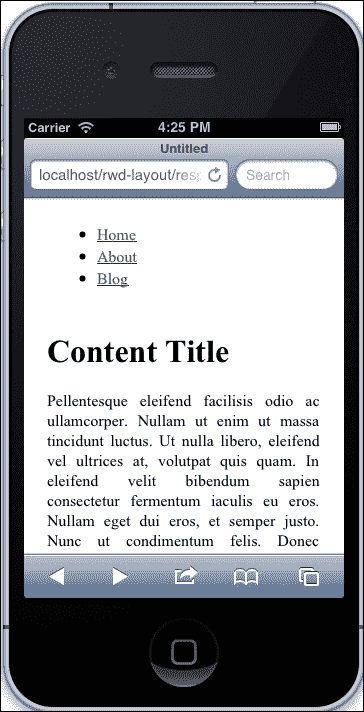

接下来，让我们谈谈缩放。假设你没有特殊要求，不要做任何奇怪的事情，比如以除了一之外的任何值开始缩放。在 viewport `<meta>`标签中添加初始缩放值`1`。

好的，我知道我说过不要做任何奇怪的事情，但只是为了演示，将你的初始比例改为`2`。刷新你的屏幕。

接下来，将其更改为`0.4`。请记住，这只是为了演示。请再次刷新你的屏幕。在纵向视图中，你会看到网页使用了小屏幕媒体查询。现在，更改模拟器的方向，使其进入横向模式。现在你会看到较大的媒体查询被激活。这是一个有趣的实验；现在将你的初始比例改回`1`。

最后，你是否希望你的观众能够使用多点触控缩放？使用 meta 属性`maximum-scale`来限制你想要允许的缩放程度。如果你不想允许缩放，将最大缩放设置为`1`。

```html
maximum-scale=1
```

## 它是如何工作的...

viewport `<meta>`标签最初是由苹果的 Safari 移动浏览器添加的，然后被添加到其他浏览器中。它用于定义页面应该以什么宽度进行阅读。当浏览器看到 viewport `<meta>`标签中定义了宽度属性时，它会以该宽度设置中定义的比例加载页面，再加上初始缩放属性。

# 为 jQuery Mobile 添加标签

这个示例深入到了一个新的响应式设计领域，即移动优先。移动优先，简而言之，意味着你首先设计网站的移动版本，然后对桌面进行修改。现在，这并不意味着你正在设计一个“仅限移动”的网站，只是移动端的布局和样式首先设计。

Mobile-first 可能需要重新思考你的设计，或者至少从不同的角度进行设计。但改变不是好事吗？我们不是可以通过尝试新的方法来改进我们的设计技能吗？达尔文主义不仅仅是适应变化的人才能生存吗？

所以让我们以开放的心态前进，尝试一些移动优先的开发。

## 准备工作

首先，跳转到 jQuery Mobile 网站。网址是[`jquerymobile.com`](http://jquerymobile.com)。否则，如果你像我一样懒得话，你可以简单地搜索`jQuery Mobile`。如果你不想搜索，因为你是我的特别朋友，我会提供直接链接。网站的直接链接是[`lmgtfy.com/?q=jquery+mobile&l=1`](http://lmgtfy.com/?q=jquery+mobile&l=1)。我甚至会为你缩短链接；访问[`bit.ly/TMpuB8`](http://bit.ly/TMpuB8)。

在这里，如果你想要在本地托管文件，你可以下载这个库（而且有一些非常好的理由可以这样做）；然而，对于这个示例，我们可以更加迅速地让其他人托管所有必要的文件。

jQuery Mobile 网站有大量的文档和示例。它甚至有下载构建器，所以你可以缩减必要的库，只使用那些运行你的移动 web 应用程序所需的文件。

## 如何做...

首先，在你的 IDE 中创建一个新的 HTML 文档。在头部添加 viewport `<meta>`标签：

```html
<meta name="viewport" content="width=device-width, initial-scale=1">
```

接下来，包括链接到 jQuery Mobile CSS 和 JavaScript 文件。

```html
<link rel="stylesheet" href="http://code.jquery.com/mobile/1.2.0/jquery.mobile-1.2.0.min.css" />
<script src="img/jquery-1.8.2.min.js"></script>
<script src="img/jquery.mobile-1.2.0.min.js"></script>
```

值得停下来进行一分钟的教学，并谈谈你的样式表。在前面的代码中，我们链接到了远程的 jQuery CSS。我建议你（如果你要在本地托管这个文件）保持原样，并在一个完全不同的样式表中添加你所有新的元素的 CSS。另外，如果你想对 jQuery 的 CSS 进行任何更改，添加另一个 CSS 文件并进行显式的命名空间覆盖，或者使用`!important`覆盖。将其命名为`jQuery-mobile-changes.css`之类的东西。我不认为你会需要这样做，但以防万一，这是一个处理的好方法。我建议这样做是因为当一个新版本的 jQuery 发布时，你不需要在升级时破坏你的网站。

这基本上涵盖了你的页眉大部分内容。现在让我们为页面创建一些基本内容。首先，让我们用一个`<div>`元素包裹页面：

```html
<body>
     <div>

     </div>
</body>
```

jQuery Mobile 的一个非常棒的特性是它使用标签，你可以将这些标签放在 HTML 元素中，这些元素不用来渲染你的页面。好处是你可以通过替换 jQuery Mobile 脚本和样式来在桌面站点上使用相同的模板。接下来，向包裹的`<div>`元素添加一些标签，告诉 jQuery Mobile 在这个页面上起作用。在元素中添加`data-role="page"`。

```html
<div data-role="page">
```

让我们通过构建一个示例文本页面来演示。

在一个`<div>`元素中添加一个新的`h1`标题。给`<div>`元素添加一个`data-role="header"`属性。然后，在浏览器中打开文件，查看 jQuery Mobile 主题。

```html
<div data-role="header">
   <h1>Adding tags for jQuery Mobile</h1>
</div>
```

这是一个很好的开始；让我们继续添加一些 jQuery Mobile 中页面结构的示例。

### 提示

你也可以为桌面版本给这些元素添加 ID 和类。

接下来，添加一个 body。添加一段填充文本，然后将段落包裹在一个`<div>`元素中。给`<div>`元素分配一个 HTML5 数据属性`data-role:"content"`。

```html
<div data-role="content">
  <p>
    Lorem ipsum dolor sit amet, consectetuer adipiscing elit. Aenean commodo ligula eget dolor. Aenean massa....
  </p>
</div>
```

同样地，添加一个页脚。在一个`<div>`元素中包裹一个简单的文本，然后在一个`<div>`元素中包裹一个`h4`标签。现在给这个`<div>`元素添加属性`data-role="footer"`：

```html
<div data-role="footer">
  <h4>The Footer</h4>
</div>
```

就是这样。jQuery Mobile 网站有很好的文档和示例，介绍了如何进一步使用他们的框架构建移动站点。在本章中，我们将继续介绍更多的 jQuery Mobile 示例。去看看吧。这是使用 jQuery Mobile 的页面效果：

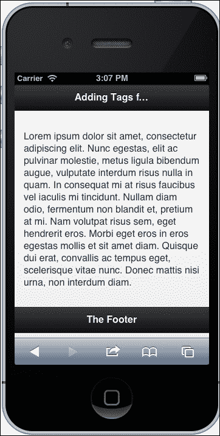

## 它是如何工作的...

jQuery Mobile 使用 HTML5 数据属性来触发标记和小部件的脚本。当您在元素中放置数据属性时，脚本将自动起作用。

# 在 jQuery Mobile 中添加第二个页面

在 jQuery Mobile 中有一个非常酷的功能，允许您将一个更大的 HTML 页面分成更小、可消化的部分。想象一下，您有一个包含大量内容的页面，您不希望强迫您的受众不断向下滚动阅读。考虑使用 jQuery Mobile 的多页面模板结构。移动设备上的网页用户体验与桌面上的网页用户体验非常不同。在旧的桌面 Web 上，经常说“内容为王”；现在 Web 是移动的，空间有限，所有内容很容易变得过多。您可能希望考虑限制每个页面显示的一些内容。在本示例中，我们将使用 jQuery Mobile 将包含大量数据的大页面分成更小的可消化部分。

## 准备工作

在上一个示例中，我们使用了 jQuery Mobile 标记构建了一个简单的页面。让我们找出那个示例的文件，并将其另存为一个新文件进行操作。这将作为本示例的起点。

## 如何操作...

在外部包裹的`<div>`元素（带有页面`data-role`）中添加 ID 为`p1`。这将帮助 jQuery 识别和在多页面元素之间进行过渡。

```html
<div data-role="page" id="p1">
```

您已经创建了 jQuery Mobile 将识别为多个页面中的第一个页面。让我们创建下一个页面。在闭合的`<body>`标签之前，创建新的开放和闭合的`<div>`元素。给这个`<div>`元素一个`data-role="page"`元素，就像之前的实例一样，并且 ID 为`p2`。

```html
<div data-role="page" id="p2">
```

这个页面将需要`data-role="header"`、`data-role="content"`和`data-role="footer"`，就像之前的`<div>`元素`data-role="page"`一样。您也可以简单地复制上一节并将其粘贴到`"p2"` `<div>`元素中。

```html
<div data-role="page" id="p2">
  <div data-role="header">
    <h1>The second page</h1>
  </div>
  <div data-role="content">
    <p> Lorem ipsum dolor sit amet...</p>
  </div>
  <div data-role="footer">
    <h4>The Footer</h4>
  </div>
</div>
```

我们几乎完成了；我们只需要将页面链接在一起。在`"p1"`内容中，在闭合的`<div>`元素之前，添加一个`href`锚标签，链接到`"#p2"`：

```html
<a href="#p2">Page 2</a>
```

在`"p2"` `<div>`元素中，在`data-role="content"` `<div>`元素内部，添加另一个链接，链接回第一个页面的 ID：

```html
<a href="#p1">Back to Page 1</a>
```

现在保存文件并启动它。您将看到它创建了一个漂亮且原生的移动网站。单击**页面**链接，您将看到多页面之间有平滑的淡入淡出过渡。您还会注意到返回按钮也可以正常工作。如果您仔细考虑，这种行为对于网站的原生应用外观和感觉非常有用。请查看下一个截图中的第一个页面：

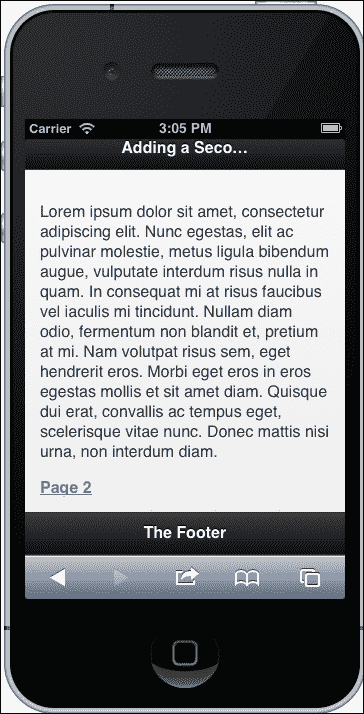

下面的截图显示了第二个页面：

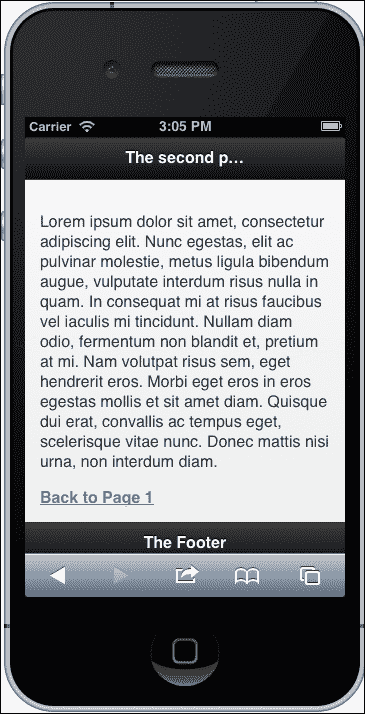

## 它是如何工作的...

jQuery Mobile 可以在单个 HTML 页面内加载多个页面，并将它们呈现为多个页面或子页面。要在它们之间进行链接，只需添加`HREF="#page"`。当单击该链接时，jQuery Mobile 将查找具有该 ID 的内部页面，并平滑地将其写入视口。

# 在 jQuery Mobile 中创建列表元素

让我第一个说：我喜欢无序列表。相反，我对“程序员艺术”表格有同样强烈的厌恶。事实上，我在与我一起工作的人中赢得了一个“表格销毁者”的名声。在 HTML 中几乎没有一组东西不能用一个好的列表来显示，这就是为什么我喜欢 jQuery Mobile 处理列表的方式。在我看来，jQuery Mobile 列表证明了为什么列表是呈现数据、菜单、导航等的优越方式。足够了解我对无序列表的异常迷恋，让我们一起来学习一下 jQuery Mobile 列表的使用方法。

## 准备工作

想想你在互联网上发布了多少糟糕的表格，以及所有那些废代码变成了多么可怕的东西。对于你过去的罪行，这已经是足够的警告了，让我们继续前进，制作一些 jQuery Mobile 列表！

## 如何做...

创建一个新页面，包含 jQuery Mobile 所需的必要头部信息。包括 viewport `<meta>`标签和链接到 jQuery Mobile 样式表、jQuery JavaScript，最后是 jQuery Mobile JavaScript。你可以在自己的服务器上托管这些文件，也可以使用[`code.jquery.com`](http://code.jquery.com)上托管的文件。

```html
<meta name="viewport" content="width=device-width, initial-scale=1"> 
<link rel="stylesheet" href="http://code.jquery.com/mobile/1.3.0-beta.1/jquery.mobile-1.3.0-beta.1.min.css" />
<script src="img/jquery-1.9.min.js"></script>
<script src="img/jquery.mobile-1.3.0-beta.1.min.js"></script>
```

接下来创建一个带有`data-role="page"`属性的`<div>`元素。这是一个 HTML5 属性，jQuery Mobile 用它来部署样式、元素和小部件。

```html
<div data-role="page"></div>
```

在那个`<div>`包裹中，创建一个你最喜欢的机器人的无序列表。

```html
<ul>
  <li>Hero 1</li>
  <li>Bender</li>
  <li>Optimus Prime</li>
  <li>Soundwave</li>
  <li>Wall-E</li>
  <li>Maximillian</li>
  <li>R2-D2</li>
  <li>GORT</li>
  <li>Cat Quadcopter</li>
  <li>Robocop</li>
  <li>The Maschinenmensch</li>
</ul>
```

现在不要启动这个。我们俩都知道这看起来就像一个普通的列表。如果你为桌面版本制作了一个单独的 CSS，你可以在那里为这个列表设置样式。

将属性`data-role="listview"`添加到你的无序列表中。现在你可以启动它，看看它看起来像一个样式化的机器人列表。

让我们继续。因为这是一个列表，而且我们喜欢列表，我们将继续使用它，并看看 jQuery Mobile 可以对其进行什么操作。添加另一个属性，`data-inset="true"`。现在你的列表周围有一个很酷的包边，所以每个项目不会延伸到屏幕的边缘。

有时，你可能会得到一个非常长的列表，比如当你制作一个酷机器人列表时，因为机器人很酷，你不想不断滚动来选择你最喜欢的机器人。jQuery Mobile 为此提供了一个内置解决方案，即过滤元素。通过添加一个新属性`data-filter="true"`来调用它。刷新你的移动浏览器；你会看到一个输入框在顶部输入`filtertext`元素。搜索小部件使用客户端搜索/过滤来过滤列表项。你将不再需要滚动到列表底部找到那个令人惊叹的机器人。

让我们把这个提升到下一个级别。如果我们想要能够根据一些我们不想显示的其他数据来过滤机器人，比如机器人制造商，我们可以为每个列表项添加属性`data-filtertext=""`。它看起来会像这样：

```html
<li data-filtertext="Mom's Robots"><a href="#">Bender</a></li>
<li data-filtertext="Hasbro"><a href="#">Optimus Prime</a></li>
```

请参见以下图示：

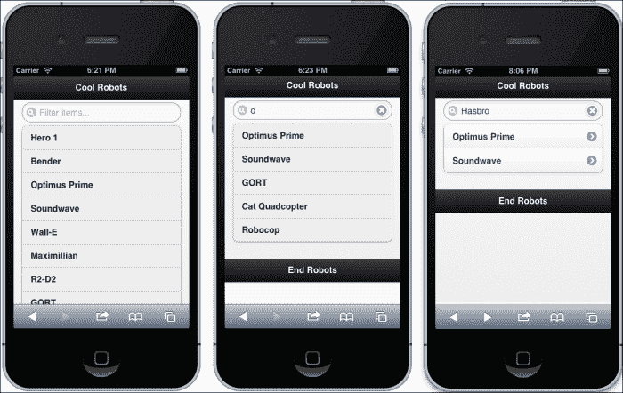

这个列表甚至可以通过在数据属性中分配一个主题来进行不同的样式设置。尝试向无序列表添加`data-theme="a"`。现在尝试使用字母`b`到`f`。每个字母都有一个不同的主题，你可以应用到列表上。

这是到目前为止我们使用的不同属性的无序列表。在下面的代码片段之后的图示展示了不同的主题效果。

```html
<ul data-role="listview" data-inset="true" data-filter="true" data-theme="g">
```

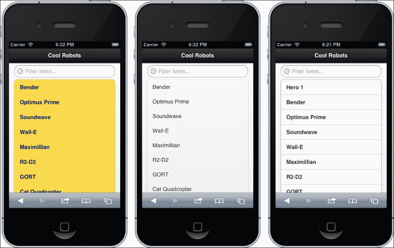

接下来让我们看看当这些列表项变成链接时会发生什么。为每个项目添加一个`href`锚标签。

```html
<li><a href="#">Bender</a></li>
```

当你刷新屏幕时，你会看到它添加了图标来指示它是一个可点击的链接。然而，由于`href`链接到`#`，它不会加载一个新页面。请参见下面的屏幕截图以获得示例：

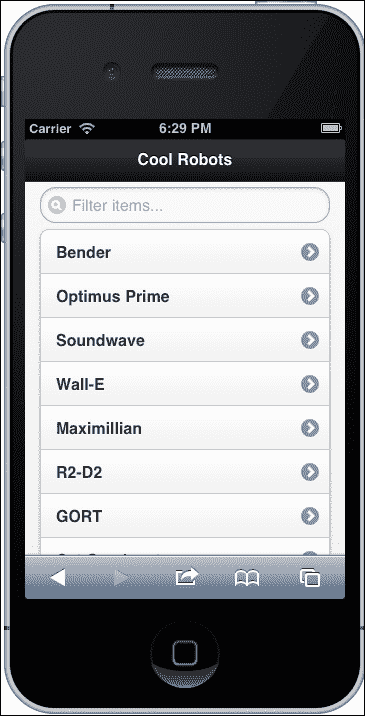

让我们把这个列表分成两组，“摧毁所有人类”组和“工作机器人”组。为第一组在列表顶部添加另一个列表项，带有属性`data-role="list-divider"`。

```html
<li data-role="list-divider">destroy all humans</li>
```

在列表中间再添加一个类似的列表项。

```html
<li data-role="list-divider">workerbot</li>
```

这在下一个截图中显示：

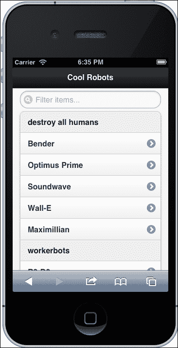

如果这样做让你感觉良好，你可能会有必要将你的机器人组织成这些组。我们可以进一步采取这种冲动，使列表嵌套。在你刚刚制作的`list-divider`中添加一个`ul`元素，然后将机器人的`li`代码的前半部分剪切并粘贴到这个`ul`元素中。

```html
<li data-role="list-divider">destroy all humans
  <ul>
    <li><a href="#">Bender</a></li>
    <li><a href="#">Optimus Prime</a></li>
    <li><a href="#">Soundwave</a></li>
    <li><a href="#">Wall-E</a></li>
    <li><a href="#">Maximillian</a></li>
  </ul>
</li>
```

对下一个列表部分也做同样的操作。然后刷新以查看新的结果。查看下图：

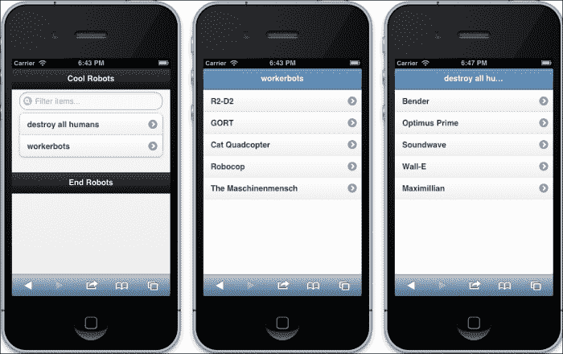

你可以给父列表项添加一个`h3`标题包裹，甚至在段落元素中添加一个描述。这些列表变得越来越花哨。参见下面的截图：

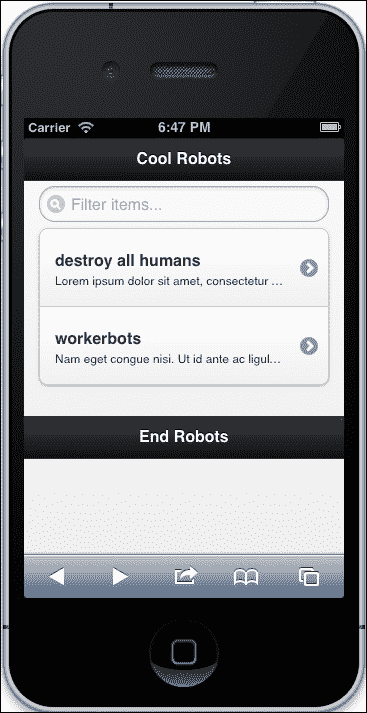

所以让我们做最后一个列表特性，并称之为一个配方。这是一个处理列表的华丽小部件。你可以制作一个可折叠列表元素的列表。我们将改变`ul`和`li`列表项的属性。首先，使外部`ul`列表元素包含属性`data-role="collapsible-set"`、`data-theme="b"`和`data-content-theme="d"`。

```html
<ul data-role="collapsible-set" data-theme="b" data-content-theme="d">
```

那个`ul`元素的两个直接子`li`元素应该有属性`data-role="collapsible"`。

```html
<li data-role="collapsible"><h2>workerbots</h2><p>...<p>
```

给那个可折叠`li`列表项的子`ul`元素添加属性`data-role="listview"`和`data-filter="true"`。

```html
<ul data-role="listview" data-filter="true">
```

整个无序列表看起来是这样的：

```html
<ul data-role="collapsible-set" data-theme="b" data-content-theme="d">
  <li data-role="collapsible">
    <h2>destroy all humans</h2>
    <p>Lorem ipsum dolor sit amet, consectetur adipiscing elit. Integer consectetur quam in nulla malesuada congue volutpat mi molestie. Quisque faucibus, nisi ut malesuada volutpat</p>
    <ul data-role="listview" data-filter="true">
      <li><a href="#">Bender</a></li>
      <li><a href="#">Optimus Prime</a></li>
      <li><a href="#">Soundwave</a></li>
      <li><a href="#">Wall-E</a></li>
      <li><a href="#">Maximillian</a></li>
    </ul>
  </li>
  <li data-role="collapsible" >
    <h3>workerbots</h3>
    <p>Nam eget congue nisi. Ut id ante ac ligula congue auctor a et lacus. Suspendisse varius sem sed elit tincidunt convallis.</p>
    <ul data-role="listview" data-filter="true">
      <li><a href="#">R2-D2</a></li>
      <li><a href="#">GORT</a></li>
      <li><a href="#">Cat Quadcopter</a></li>
      <li><a href="#">Robocop</a></li>
      <li><a href="#">The Maschinenmensch</a></li>
    </ul>
  </li>
</ul>
```

完成的列表已经在下图中显示：

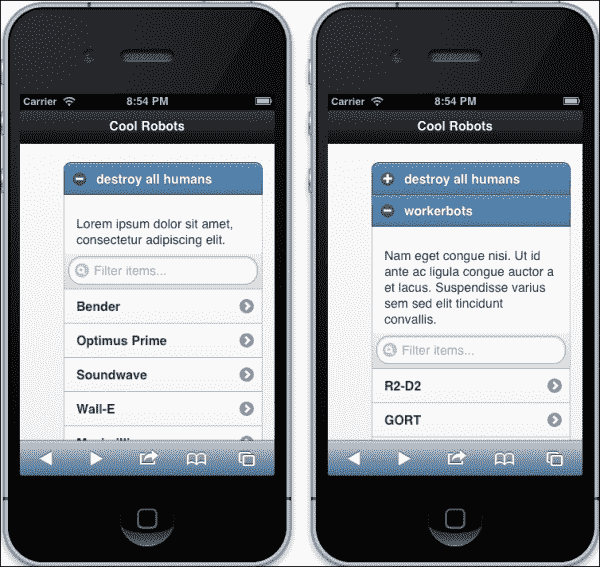

## 它是如何工作的...

太神奇了。除了做一个好的列表之外，你并不需要做太多事情。任何表格都无法做到这一点。只要在你的元素中使用 HTML5 数据属性，jQuery Mobile 就会承担大部分工作，将你的列表转换成一个时尚的、移动端原生外观的 Web 应用。jQuery Mobile 获取数据属性（不影响布局或样式），并从中重写移动版本的 HTML 和 CSS。

# 使用 jQuery Mobile 添加一个移动端原生外观的按钮

让我们制作按钮！制作按钮可能看起来是设计中非常微不足道的一部分，但相反，当你构建一个 Web 应用程序时，按钮可能是网站可用性的一个非常重要的部分。

jQuery Mobile 有一个令人印象深刻的按钮调用数组，它们都很容易使用。它们也可以在许多其他 jQuery Mobile 小部件中使用。此外，从链接创建按钮和从`form input`元素创建按钮一样容易。

## 准备工作

在你的 IDE 或文本编辑器中，启动一个新的 HTML 文档，并添加必要的头部标签。首先添加 viewport`<meta>`标签，然后添加链接到 jQuery Mobile CSS 和 JavaScript 库 jQuery 和 jQuery Mobile。

```html
<meta name="viewport" content="width=device-width, initial-scale=1">
<link rel="stylesheet" href="http://code.jquery.com/mobile/1.2.0/jquery.mobile-1.2.0.min.css" />
<script src="img/jquery-1.8.2.min.js"></script>
<script src="img/jquery.mobile-1.2.0.min.js"></script>
```

在你的 HTML`<body>`标签中，添加一个带有 HTML5 属性`data-role="page"`的`<div>`元素。在其中，添加一个`h1`标题，并用带有`data-role="header"`属性的`<div>`元素包裹它。在标题元素之后，添加一个带有`data-role="content"`属性的`<div>`元素。参见下面的代码片段：

```html
<div data-role="page">
  <div data-role="header"><h1>There be buttons</h1></div>
  <div data-role="content">...</div>
</div>
```

## 如何操作...

让我们比较一些不同的方法来创建一个基本按钮。首先是 HTML5 元素`<button>`，各种`<input>`表单元素`button`和`submit`，以及一个`href`伪按钮。在你的内容`<div>`元素中放入每种按钮。

```html
<button>HTML5 Button</button>

<input type="button" value="Input Button" />

<input type="submit" value="Submit Button" />

<a href="#" data-role="button">Link button</a>
```

启动你的新页面。你会看到四个看起来完全相同的新按钮（除了文字）。你可以看到每种方法都是以相同的方式呈现的。这很令人印象深刻，因为你的模板文件的非移动版本可能需要你使用某种类型的`submit`元素（这并不完全是移动优先的，但没有人是完美的）。参见下面的截图：

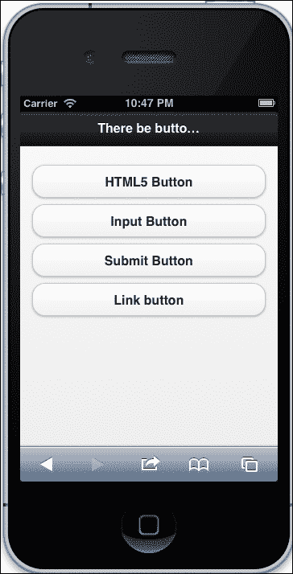

现在让我们继续这个教程，演示如何使用 jQuery Mobile 向按钮添加图标。这是一个简单的、一步到位的过程；它使用了一个 HTML5 数据属性，即`data-icon`属性。在第一个按钮中，添加`data-icon="delete"`属性；在下一个按钮中，添加`data-icon="check"`属性；在下一个按钮中添加`data-icon="plus"`；最后，在这组按钮中的最后一个按钮中添加`data-icon="arrow-l"`属性。你可以在文档中找到可以放在其中的图标列表。

```html
<button data-icon="delete">HTML5 Button</button>

<input type="button" value="Input Button" data-icon="check" />

<input type="submit" value="Submit Button" data-icon="plus"/>

<a href="#" data-role="button" data-icon="arrow-l">Link button</a>
```

下面的屏幕截图显示了新的按钮：

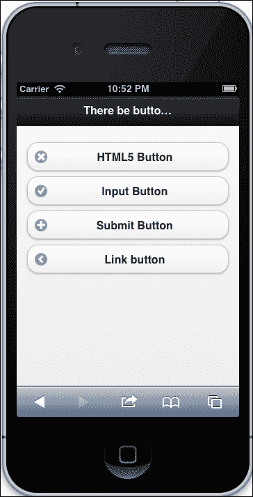

你还可以通过添加`data-mini="true"`属性使按钮变小，并使用`data-iconpos`属性将图标定位在按钮的右、左、顶部或底部角落。否则，你可以使用`data-iconpos="notext"`属性仅显示图标。参见下面的屏幕截图：

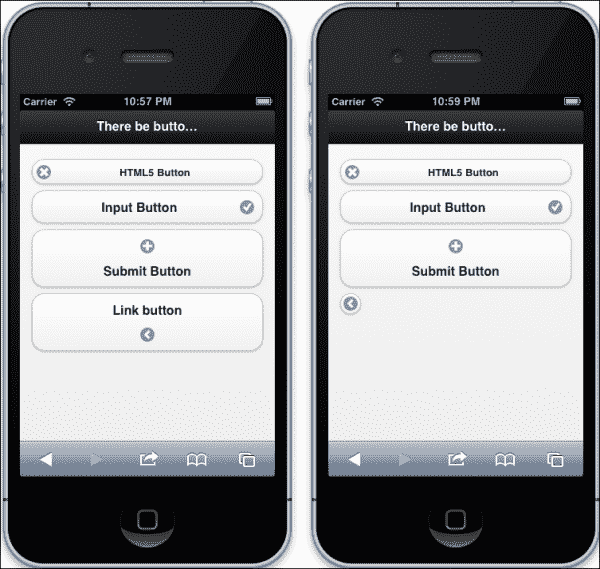

这些 jQuery Mobile 按钮的默认行为是横跨整个屏幕。你可以通过添加`data-inline="true"`属性来改变这一点。

```html
<button data-icon="delete" data-mini="true" data-inline="true">HTML5 Button</button>

<input type="button" value="Input Button" data-icon="check" data-iconpos="right" data-inline="true"/>

<input type="submit" value="Submit Button" data-icon="plus" data-iconpos="top" data-inline="true"/>

<a href="#" data-role="button" data-icon="arrow-l" data-iconpos="notext" data-inline="true">Link button</a>
```

虽然有些混乱，但你可以在这里看到它的效果：

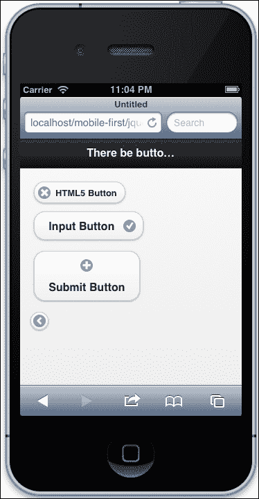

它们将变成内联元素，类似于以内联方式显示的列表项。我们几乎完成了，但还有一些有趣的地方。我们还可以轻松地创建按钮组。删除在上一节中添加的`data-inline="true"`属性。接下来，用`<div>`元素包装按钮元素，并添加`data-role="controlgroup"`属性。

```html
<div data-role="controlgroup">

  <button data-icon="delete" data-mini="true" >HTML5 Button</button>
  <input type="button" value="Input Button" data-icon="check" data-iconpos="right"/>

  <input type="submit" value="Submit Button" data-icon="plus" data-iconpos="top" />

  <a href="#" data-role="button" data-icon="arrow-l" data-iconpos="notext" >Link button</a>

</div>
```

现在你可以看到创造性按钮组的潜力，并将它们整齐地放在一起。让我们给按钮组添加一些更多的效果。如果你在`"controlgroup"` `<div>`元素中添加`data-type="horizontal"`，你会弄得一团糟。清理这一点的一种方法是将所有的`data-iconpos`属性改为`"notext"`。

最后，正如我们在之前的 jQuery Mobile 教程中所看到的，`data-theme`属性可以使你的按钮变得丰富多彩。为了快速展示这种效果，为每个按钮添加不同的`data-theme`属性（`a`、`b`、`c`、`e`）（我跳过了`d`，它看起来太像`c`）。这些在下一个屏幕截图中有所体现：

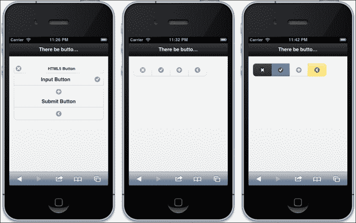

## 工作原理...

你真正需要知道的是如何使用哪些数据标签使 jQuery Mobile 识别 HTML 元素并将其转换为移动原生按钮。实际上，当你有正确的属性时，它会自动发生，并且无论应用于`submit`按钮的方法如何，它都能正常工作。jQuery Mobile 在 HTML5 属性上触发事件，并将 HTML 和样式添加到渲染的页面中。

# 在移动浏览器中仅使用媒体查询添加移动样式表

在这个教程中，我们希望能够在模板中仅供移动浏览器使用样式表。除了 JavaScript 之外，在客户端渲染中没有办法监听用户代理并为移动浏览器提供一些逻辑或特殊模板。让我们采用 K.I.S.S.方法，并尽可能接近媒体查询。

当然，有许多种方法可以编写 JavaScript 来检测用户代理，我们将在后面的教程中介绍，但现在让我们编写一个杀手级的媒体查询来锁定特定 CSS 的移动浏览器。在之前的教程中，我们的媒体查询是在样式表中执行的。这一次将会有所不同，因为我们将把它放在 HTML 头部链接中。改变是好的，不要担心。我们将媒体查询放在 HTML 链接到 CSS 文件中的原因是，我们希望只在特殊情况下调用该 CSS 文件。当你使用移动优先设计和 jQuery Mobile 等技术时，这个教程尤其有用。

## 准备工作

打开您方便的 IDE 并开始一个新的 HTML 页面。确保添加您的视口`<meta>`标签。如果您愿意，您可以在 HTML 主体中添加一个文字段落。

## 如何做...

在您的新 HTML 文件的`<body>`标签中，添加两个文字段落。每个都有不同的类（`class="a"`和`class="b"`）。这将是足够的 HTML 来演示媒体查询的工作。

```html
<p class="a">Lorem ipsum dolor sit amet, consectetur adipiscing elit.</p>
<p class="b">Nulla ante tortor, rutrum eu sollicitudin eget, vehicula quis sem. Nullam cursus placerat luctus.</p>
```

现在回到`<head>`标签。首先，让我们添加视口`<meta>`标签。包括内容属性`"width=device-width"`。接下来，为字体添加一些简单的样式（`font-size: 100%`）。

```html
<style>
  html{font-size:100%}
</style>
```

接下来，我们将添加移动 CSS 样式表的链接和媒体查询。基本的样式表链接包含`rel="stylesheet"`和路径。添加它需要满足的条件。为`screen`和`max-device-width=320px`添加一个媒体查询。您的 CSS 链接应该如下所示：

```html
<link rel="stylesheet" media="screen and (max-device-width:320px)" href="mobile.css" />
```

在 HTML 文件中我们没有更多要做的事情，所以在同一个目录中创建一个 CSS 文件并将其命名为`mobile.css`。打开它进行编辑。我们在这里不需要做太多事情，只需要一行就足够了。为`b`类段落添加一行，并为字体大小添加一个属性`2rem`。REM 表示相对 EM，或者相对于根字体大小（如果您跳过了响应式排版配方）。

```html
p.b{font-size:2rem}
```

现在让我们试一试。在浏览器中打开您的 HTML 文件，然后在移动设备模拟器中打开它。在这里，您可以看到移动设备具有独特的呈现方式，`b`类段落的字体大小不同。请参阅以下屏幕截图中的这个配方：

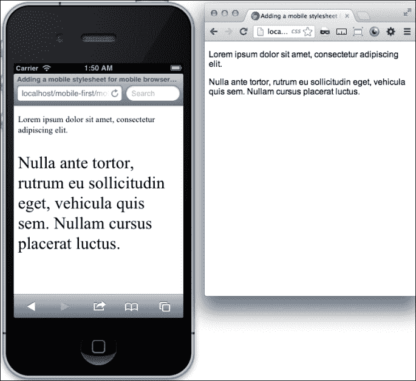

## 它是如何工作的...

媒体查询的设计仅在具有 320px 或更低分辨率的设备上才会激活。大于这个值的任何值都会忽略（它仍然会下载）链接的 CSS 文件。您还可以为其他特定设备编写媒体查询。

# 仅为移动浏览器添加 JavaScript

在之前的配方中，我们在样式表链接中编写了一个媒体查询。这对于我们自己的移动优先响应式网页开发非常有用。然而，当使用专门针对移动平台的 JavaScript 代码，比如 jQuery Mobile 时，您可能不希望在桌面计算机上启动它们。让我们构建一个小的 JavaScript 代码，检测移动设备屏幕大小，然后为其部署 jQuery Mobile，但不适用于桌面设备。

## 准备好了

像 jQuery Mobile 这样的移动优先技术是在拥有服务器端技术时的惊人工具。它们需要服务器端逻辑才能发挥最佳作用。如果您没有幸运地获得了服务器端逻辑的访问权限，您可以使用一些客户端技巧来发挥您的魔力。

## 如何做...

如果您还没有浏览过 jQuery Mobile 的配方，请现在浏览一下；我们将重用我们已经使用过的配方之一。

打开之前使用 jQuery Mobile 创建的文件之一。您可以使用*使用 jQuery Mobile 添加移动原生外观按钮*的配方。如果您已经按照这个配方制作了一个移动的、原生外观的按钮，请使用它进行跟踪。

当我们上次看到这个文件时，jQuery Mobile 脚本将您的普通无聊的 HTML 按钮转换成了很酷的 jQuery Mobile 按钮。您所需要做的就是在您的元素中包含 HTML5 数据属性，然后 jQuery Mobile 会自动完成剩下的工作。那么如果您只想在移动设备上发生这种情况呢？

如果没有客户端脚本的魔力，你可能会遇到麻烦。我们首先希望脚本意识到它正在处理一个移动设备。一种方法是通过查询 DOM 元素的用户代理。我见过一些人这样做，但足够复杂以至于容易出错。所以，让我们检测设备屏幕的大小。大多数移动视口最多为 600 像素宽或更小；所以现在，如果您正在开发应用程序，并假设这是正确的最大尺寸，那么您是安全的。

所以让我们让脚本从 DOM 获取屏幕宽度；如果小于 600px，就获取 jQuery Mobile 脚本。首先，使用 jQuery，在文档加载时触发一个函数。

```html
$(document).ready(function(){
  //
});
```

在函数内部，编写一个条件语句；如果屏幕小于 600，则做某事。

```html
$(document).ready(function(){
  if (window.screen.width < 600){
    //Do something!
  };
});
```

这是一个很好的开始，但让我们更具体地谈谈“做某事”。我们希望脚本能够获取并运行 jQuery Mobile 脚本。一个很好的方法是使用 jQuery 的`$.getScript()`函数。所以把它放在`if`条件中，包括 jQuery Mobile 源 URL。

```html
$(document).ready(function(){
  if (window.screen.width < 600){
    $.getScript("http://code.jquery.com/mobile/1.2.0/jquery.mobile-1.2.0.min.js");
  };
});
```

现在在您的移动设备模拟器中加载页面。

## 它是如何工作的...

如果模拟器成功地欺骗了请求中的设备宽度，您将看到 HTML 页面的 jQuery Mobile 版本。在您的桌面浏览器中，无论浏览器窗口大小如何，您都无法加载 jQuery Mobile 脚本。

jQuery 的`$.getScript()`是一个将外部脚本加载到头部的函数。您可以像我们在示例中所做的那样使用它，有条件地加载外部 JavaScript，并在成功加载时执行其他函数。
