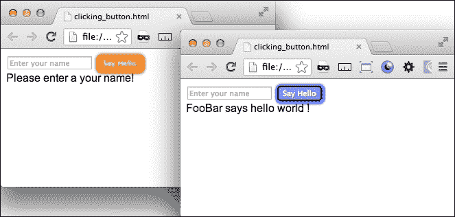
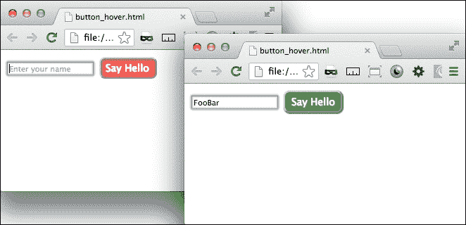
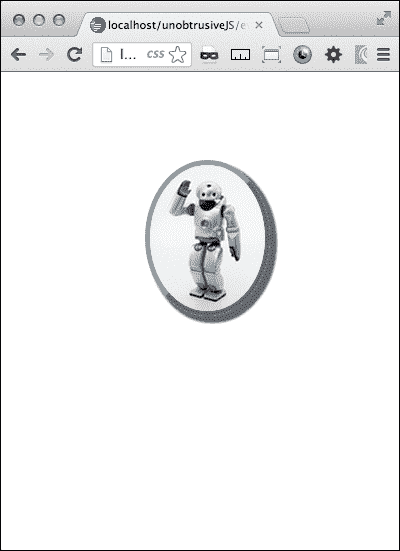

# 第七章：不显眼的 JavaScript

在本章中，您将学到：

+   不显眼地编写“Hello World”

+   使用事件监听器创建一个发光的“submit”按钮

+   当您悬停在按钮上时使按钮突出显示

+   使用不显眼的 jQuery 调整元素

+   使用不显眼的 JavaScript 掩盖密码

+   使用事件监听器来为图像阴影添加动画

# 介绍

不显眼的 JavaScript 的概念完全符合响应式设计。通过将交互层与演示层保持一定距离，您可以为您的 Web 应用程序构建很大程度的灵活性。因为移动设备有非常不同的输入方法，您可能需要通过不同的事件调用一个函数。您可能希望为页面创建一个桌面版本，并为移动版本使用 jQuery Mobile；通过使用不显眼的 JavaScript，使用相同的模板文件，这并不是一项困难的任务。

# 不显眼地编写“Hello World”

响应式设计的一个重要方面是交互。我们知道移动设备和台式机有非常不同的用户界面，我们不能期望我们的 JavaScript 交互脚本能在所有设备上运行。一个例子是`.mouseover()`或鼠标悬停事件监听器。鼠标不连接到触摸屏设备上，因此任何错误的`.mouseover()`事件尝试可能会作为`.click()`事件执行。解决方法是完全从模板中移除交互脚本。

## 准备工作

这种方法被称为“不显眼的 JavaScript”。在这里，您可以通过一系列事件监听器创建一个外部 JavaScript，而不是在 HTML 模板中嵌入`onclick()`之类的脚本。

## 如何做...

让我们从一个简单的例子开始；我们将只创建一个按钮和一个警报。许多 JavaScript 都是从测试开始的；实质上，我将创建一个事件监听器，然后用警报进行调试。我们首先创建一个带有简单`submit`按钮的 HTML 页面。

```html
<body>
<input type="submit">
</body>
```

就是这样，这是一个简单的任务，但并不是很令人兴奋。那只是一个基本的`submit`按钮，即使它没有提交任何内容。所以让我们一步一步地让它变得更有趣。首先在按钮上添加一些自定义文本，这样当页面准备好时，我们至少有一些期望会发生什么。我们添加`value="Say Hello"`。这对于`body`标签来说已经足够了，接下来我们在头部添加一个`script`标签：

```html
<script></script>
```

在脚本标签内，您需要添加一个事件来启动 JavaScript。否则，脚本将无法运行，没有`$(document).ready(function(){...});`函数：

```html
$(document).ready(function(){
//do something here
};
```

在这个函数内部，用一个监听器替换`//do something`，监听`:submit`按钮的点击事件，触发一个函数，以某种方式将 Hello World 显示在屏幕上：

```html
$(":submit").click(function() {
//write "Hello World"
});
```

到目前为止，我们已经创建了一个 JavaScript，它在页面加载时加载，并监听用户点击按钮的事件。当`click`事件发生时，一个函数执行，但现在该函数是空的。我们的下一个任务是创建一种方法，将“Hello World”文本添加到页面上。

在函数内部，我们希望将“Hello World”文本附加到`:submit`按钮的父元素上。由于`:submit`按钮是触发方法的对象，我们可以在 jQuery 中使用`$(this)`来引用它。要附加“Hello World”文本，使用 jQuery 的`.append()`方法：

```html
$(this).parent().append("Hello World");
```

jQuery 将“Hello World”文本附加到 HTML 的`body`标签的末尾。为了更好地控制文本的附加位置，将按钮包装在父`div`元素中。

在浏览器中打开 HTML 文件并测试按钮的功能。如果按下按钮没有使文本**Hello World**出现在按钮下方，那么就出了问题。回到教程中看看哪里出错了。

在继续之前，我们不能让文本保持原样。我们希望以后能够做更多事情。用一个包含`ID`属性`helloWorld`的段落标签标记它。

到目前为止，我们已经实现了我们的基本意图，点击按钮，写下 Hello World。这很好，但还不够好；因为我们总是要超额交付，不是吗？

在`.click()`事件函数之外，添加一个变量`foo`，表示字符串`Hello World`。接下来，用`foo`变量替换`.append(...)`函数内部的 Hello World 文本。从方法中删除文本并用变量替换它使得工作更容易，并且只是改进这个函数的一小步。刷新并测试你的页面，确保一切仍然正常。

在`body`标签内，我们现在将通过一个表单`input`元素将文本发送到脚本以个性化这个页面。在你的 HTML body 标签内，输入一个带有`id="bar"`和`placeholder="输入你的名字"`的文本`input`元素。

为了接收来自我们输入框的文本，我们需要在你的函数内添加一个新变量`bar`。将它设置为等于输入的值：

```html
var bar = $('input').val();
```

接下来，通过更改`.append()`方法来包括`foo`、`bar`和一些新文本，所有这些都包裹在一个可样式化的元素中：

```html
$(this).parent().append("<div class='newText'>" + bar + " says " + foo + "!</div>");
```

现在，当你刷新这个页面时，你会发现文本框已经添加了。尝试在输入框中输入你的名字并观察结果。

这很好，但不完整。现在是时候进行一些清理了。让我们通过一些我们想要避免的情景。我们不希望能够提交空输入或继续添加更多的**Hello World**行。

首先，处理空白输入框。让我们添加一个`if`条件来检查输入文本在附加到 HTML 之前是否为空。在获取输入值的行之后，添加一个新行，其中包含检查变量是否为空字符串的条件语句。这个条件包裹了`append`语句。还要为输入为空字符串时添加一个`else`语句。在其中，复制`.append()`方法，并提醒用户在文本输入中输入值的文本。

```html
var bar = $('input').val();
if (bar != ""){ 
$(this).parent().append("<div class='newText'>" + bar + " says " + foo + "!</div>");
} else { 
$(this).parent().append("Please enter a your name!") 
};
```

这将为您的表单添加一些验证，如果单击**提交**按钮时文本框为空，它将提醒用户输入姓名。还有两个清理项目，所以再等几分钟。

首先，我们希望附加的 HTML 每次重置。因此，在你的`if`条件语句之后，在`else`语句之前添加一行，删除之前添加的`.newText`元素。

```html
$(".newText").remove(); 
```

最后，在`if`条件结束之前，使用`.val()`方法重置输入表单的值为空。还要为文本输入添加一个`ID`属性，以将值连接到输入。

```html
$('input#fooBar').val("");
```

就是这样！我们有点过度了，但我们有一个相当不错的 Hello World 网络应用。

## 它是如何工作的...

不显眼的 JavaScript 通过在页面加载时加载脚本，并通过使用监听器等待页面上发生特定事件来运行。这可能需要调整你的写作方式，但能够将交互与呈现分开是有优势的。

# 创建一个发光的“提交”按钮，并添加事件监听器。

处理表单通常是大多数网页设计主题中被忽视的一个方面，尤其是响应式网页设计。通常非交易页面除了简单的**联系我们**页面外不使用表单，因此表单设计通常是事后想到的。然而，在交易电子商务和软件即服务行业中，表单是用户交互中最重要的元素。在这个世界中，响应式设计不仅仅是响应式布局和图片，还包括周到的交互。在这个示例中，我们可以想象一个用户处于表单流程的最后阶段，准备提交表单。

一个常见的情况是，一个人滑稽地点击 **submit** 按钮，然后看着页面似乎什么都没发生（但实际上是在执行表单的 `post` 操作），然后再次点击同一个按钮，一遍又一遍。在简单的 **联系我们** 场景中，这可能会生成一些额外的表单提交电子邮件，但在交易情况下，这可能会激活一长串的业务逻辑，并对其他流程造成干扰。

对于用户来说，有可能会有这样的想法，即在点击 **submit** 按钮后立即没有发生任何事情，说明出了问题，网站出现了故障；最终结果是放弃交易并损害了您网站的信任。您可以和应该做很多事情。其中之一是添加视觉提示，让用户知道他们已成功点击按钮，即将发生某些事情。考虑在幕后执行的交易以及所需的时间。如果您预计会有很长的等待时间，请注意您的用户可能不知道这一点。人们通常期望在互联网世界中得到即时满足，一切都是即时的，任何不是即时的东西都是有问题的。

## 准备工作

在 *以不显眼的方式编写 "Hello World"* 配方中，我们编写了一个简单的提交按钮函数。我们可以将其作为此配方的基本构建块。如果您没有这段代码，您可以在 Packt Publishing 的网站上找到它的最终版本（[`www.packtpub.com/`](http://www.packtpub.com/)）。

## 如何做到这一点...

首先，我们需要将提交函数的主要部分分离出来，放到一个由 `.click()` 事件函数调用的单独函数中。将函数内部的所有内容剪切出来，粘贴到 `$(document).ready(function() {...});` 函数之外。用新函数的函数调用替换您剪切出的所有内容。在函数调用中，使用 `.attr()` 方法将声明的变量 `foo` 与 `$(this)` 的 `ID` 值包含在一起。然后，将您粘贴的代码包裹在同名的新函数中，并将其分配为接收这两个变量。最后，向您的提交输入添加一个 `ID` 属性。您的代码应该类似于以下内容：

```html
$(document).ready(function(){ 
     var foo = "hello world "; 
     $(":submit").click(function(){ 
          formAction(foo,$(this).attr("id")); 
     }); 
}); 

function formAction(foo,id){ 
     var bar = $('input').val();
     if (bar != ""){ 
          $(".newText").remove(); 
          $("#" + id).parent().append("<div class='newText'>" + bar + " says " + foo + "!</div>"); 
          $('input#fooBar').val(""); 
      } else { 
          $(".newText").remove(); 
          $("#" + id).parent().append("<div class='newText'>Please enter a your name!</div>"); 
     };
};
```

首先，从 `formAction()` 函数中移除 `bar` 变量，并将其粘贴到 `.click()` 事件监听器函数中。这样可以在每次点击事件中构建变量。现在开始构建新函数；在 JavaScript 中添加一个名为 `buttonAnimate()` 的新函数，并在 `.click()` 事件监听器中的 `formAction()` 调用之后调用它。在 `buttonAnimate()` 函数调用中，发送 `bar` 变量。最后，将 `bar` 变量添加到 `formAction()` 函数调用和函数声明变量中。关键的发展是我们已经将输入值作为变量添加到了 `.click()` 事件监听器函数中，并将其发送到了两个函数调用中。

有了这个，我们现在可以开始编写一个新函数，用于在按钮上实现动画效果。休息一下，喝杯咖啡。我们将暂时转换方向，编写一些 CSS。

将样式表添加到您的项目中；在样式表中，添加两个类，`.valid` 和 `.invalid`，它们将分别对按钮的两种不同响应状态 `valid` 和 `invalid` 进行操作。`pass` 场景发生在提交表单时输入文本，`fail` 场景发生在在 `form` 元素中未输入文本的情况下按下 **submit** 按钮。

```html
.valid{...}
.invalid{...}
```

在 `valid` 状态下，我们已经在输入框中提交了表单。我们希望为代表正面状态的按钮添加 CSS；按钮已被激活，表示发生了某些正确的事情。我添加了边框、阴影、文本阴影、背景颜色、文本颜色和边框半径。这将足以表明发生了预期的事情。

```html
.valid{ 
     border:2px solid #000; 
     -webkit-box-shadow: 1px 1px 5px 3px #0000ff; 
     box-shadow: 1px 1px 5px 3px #0000ff; 
     text-shadow: 1px 1px 1px #666666; 
     filter: dropshadow(color=#666666, offx=1, offy=1); 
     background-color:rgb(150, 150, 255); 
     color:#ffffff; 
     -webkit-border-radius: 5px; 
     border-radius: 5px; 
}
```

我们将相同的 CSS 样式类型添加到`invalid`状态，用户在输入框中没有输入文本提交表单时。在这种情况下，我们希望给出视觉线索表明出了问题，并提示用户重新尝试。在这种情况下，橙色和红色是用来表示错误的好颜色。此外，我们还添加了一个带有过渡效果的 CSS 模糊效果。

```html
.invalid{ 
     border:2px solid #ffff00; 
     -webkit-box-shadow: 1px 1px 5px 3px rgb(255, 0, 0); 
     box-shadow: 1px 1px 5px 3px rgb(255, 0, 0); 
     background-color:rgb(255, 133, 0); 
     color:#ffffff; -webkit-border-radius: 
     5px; border-radius: 5px; 
     -webkit-filter: grayscale(0.1) blur(1px); 
     -webkit-transition: border 0.2s ease; 
     -moz-transition: border 0.2s ease; 
     -ms-transition: border 0.2s ease; 
     -o-transition: border 0.2s ease; 
     transition: border 0.2s ease; 
     text-shadow: 1px 1px 1px #666666; 
     filter: dropshadow(color=#666666, offx=1, offy=1); 
}
```

这就是我们为这个食谱要编写的所有 CSS。接下来，我们将编写 JavaScript 来将两种不同的样式连接到实际状态。在这个食谱的早些时候，我们创建了一个名为`buttonAnimate()`的空函数，它接收了变量`bar`，现在是时候构建它了。在其中，添加相同的`if`条件语句来检查`bar`是否为空字符串。如果是，将`valid`类添加到`submit`按钮，如果不是，则添加`invalid`类。添加`invalid`类会提醒用户出现了问题，需要采取行动。

```html
if(bar!= ""){ 
     $(":submit").addClass("valid"); 
} else { 
     $(":submit").addClass("invalid"); 
};
```

当采取适当的行动时，也就是当用户点击表单元素输入文本时，按钮应该被重置为其原始状态；从技术上讲，新添加的类应该被移除。代码如下：

```html
$('input#fooBar').focus(function(){ 
     $(":submit").removeClass('invalid') 
}); 
```

最后一点清理工作是从`if`和`else`条件的开头删除一个或两个类。在`submit`元素上使用`.removeClass()`方法两次来删除与要添加的类相反的类。

```html
function buttonAnimate(bar){ 
     if(bar!= ""){ 
          $(":submit").removeClass("invalid"); 
          $(":submit").addClass("valid"); 
     } else { 
          $(":submit").removeClass("valid"); 
          $(":submit").addClass("invalid"); 
          $('input#fooBar').focus(function(){ 
                $(":submit").removeClass('invalid') 
          }); 
     }; 
};
```

现在重新加载并测试页面，看看您创建的魔法。它将看起来像下面的截图：



## 它是如何工作的...

jQuery 是一个很棒的库，它可以帮助您快速创建出色的 Web 应用程序，而且代码很少。在旧的纯 JavaScript 世界中，这个功能会花费您更多的代码和时间。它有库函数来读取表单的值，轻松附加 HTML，并在 CSS 类之间切换。您只需要实现一些 jQuery 方法和 CSS，剩下的就交给它了。

# 当你悬停在按钮上时让它突出显示

有时，响应式设计中的一个大挑战是在要求只是构建足够好的东西时，能够真正超出交付一个项目。按钮是一个机会，您可以为令用户惊叹的产品提供额外的抛光。如果我们不是在超出交付，我们可以只是添加一个`:hover`选择器就完成了。然而，在这个食谱中，我们将制作一个在悬停时闪闪发光的按钮。

## 准备工作

了解过度交付的缺陷。超出要求是我们都应该努力追求的，但要注意不要设定无法满足的不合理期望，从而导致本来成功的项目失败。

在之前的食谱中，我们创建了一个带有按钮的表单，当您点击它时会有动画效果。对于这个食谱，您可以继续使用那段代码。您也可以去下载那个食谱的代码，或者下载这个食谱的代码。

或者您可以只是创建一个表单和按钮元素。这并不难。

## 如何做...

我们基本上是从一个页面开始，有两个表单元素；一个输入框和一个提交按钮。正如我之前提到的，这些是在之前的食谱中构建的；您也可以在这里构建它们。我们在食谱中构建的 JavaScript 将与新的交互一起工作，但不是必需的。`input`元素具有`id`属性`fooBar`，按钮具有`id`属性`submit`。

```html
<input id="fooBar" type="text" placeholder="Enter your name">
<input id="submit" type="submit" value="Say Hello">
```

让我们从使按钮的默认外观更有趣开始。在您的 CSS 中为`input#submit`元素添加样式。在样式中，添加蓝色背景颜色，白色字体颜色，8 点边框半径，14 像素字体大小和 5 像素和 8 像素的填充。可以使用以下代码完成：

```html
input#submit{ 
     background-color:blue; 
     color:white; 
     border-radius:8px; 
     font-size:14px; 
     padding:5px 8px; 
}
```

现在按钮的默认外观已经定义，让我们谈谈交互设计。在这里，我们进入使用 JavaScript 进行`.mouseover()`事件的实际优势，而不是使用 CSS 的`:hover`选择器。我想与`form`元素交互，并查询是否已输入文本。如果输入了文本，我们希望有一个特殊的视觉提示，表明表单已准备好提交；如果没有提交文本，强烈的视觉提示应告诉用户停下来，返回检查他们的表单。

首先，如果表单已准备好提交，按钮将似乎向鼠标指针延伸并变成绿色。CSS 将包括一个绿色的背景颜色，带有`!important`覆盖，一个盒子阴影和一个文本阴影。请参阅以下代码片段，了解确切的 CSS 语法：

```html
.buttonLight{
     background-color:green !important;
     -webkit-box-shadow: 1px 1px 2px 1px green;
     box-shadow: 1px 1px 2px 1px green;
     text-shadow: 1px 1px 2px #666666;
     filter: dropshadow(color=#666666, offx=1, offy=1);
            }
```

或者，如果表单输入为空，按钮将变成红色，并远离鼠标指针。这个 CSS 将有一个红色的背景颜色，带有`!important`覆盖，和一个内阴影，以及一个使文本模糊的文本阴影。

```html
.redButtonLight{
     background-color:red !important;
     -webkit-box-shadow:inset 1px 1px 3px 2px #663535;
     box-shadow:inset 1px 1px 3px 2px #663535;
     text-shadow: 0px 0px 2px #fff;
     filter: dropshadow(color=#fff, offx=0, offy=0);
}
```

这就是我们正在创建的 CSS 的范围。现在是时候构建交互性了。在您的头部，如果还没有这样做，请创建开头和结尾的`<script>`标签。首先，我们创建`(document).ready`监听器：

```html
     $(document).ready(function(){
          //do some things here
     });
```

这并没有做太多事情，但这是一个开始。让我们继续构建交互性。在`(document).ready`监听器函数内部，添加一个`.mouseover()`事件监听器和一个`.mouseout()`事件监听器。`.mouseover()`监听器替换了`hover`函数，并且将同时动画按钮并添加我们之前构建的 CSS 类之一，而`.mouseout()`监听器完成了`hover`函数，并最终移除了`.mouseover()`函数添加的`class`属性。

```html
$(document).ready(function(){
     $("#submit").mouseover(function(){
          //do something
     });
     $("#submit").mouseout(function(){
          //do something else
     });
});
```

继续前进，让我们首先构建`.mouseover()`事件监听器函数。在其核心，它执行两个功能；首先，它查询表单`input`元素的值，然后根据表单`input`元素的值更改`submit`按钮。第一部分，查询输入的值，将如下所示：

```html
if($('input').val()!="")
     //do something
} else {
     //do something else
}
```

当表单的值不是空字符串时，第一个条件应该创建新的变量，`classtoAdd = "buttonLight"`和`paddingAdd = "5px 8px 5px 9px"`。另一个条件，当表单的值是空字符串时，创建相同的变量，`classtoAdd = "redButtonLight"`和`paddingAdd = "5px 9px 5px 7px"`。这些将应用于函数的下一部分中的`submit`按钮。

函数的下一部分是通过`.animate()`方法开始动画按钮的不透明度和填充，并添加由`classtoAdd`变量确定的类。动画应该相当快，比如 100 毫秒。

```html
$("#submit").animate({opacity: 0.7, padding: paddingAdd},
100, function(){ 
     $("#submit").addClass(classtoAdd); 
});
```

这就是`.mouseover()`事件所需的全部内容。接下来需要的是`.mouseout()`函数的内部工作。同样，动画`submit`按钮的`position`和`padding`属性，但时间更长，然后移除`class`属性。

```html
$("#submit").mouseout(function(){ 
     $("#submit").animate({opacity: 1, padding :"5px 8px"}, 
     300, function(){ 
          $("#submit").removeClass(classtoAdd); 
     }); 
});
```

就是这样。启动页面，观察按钮的交互。以下截图说明了同样的内容：



## 工作原理...

这个配方使用事件监听器来替换简单的 CSS `:hover`选择器，后者只能使用有限的逻辑，而使用`.mouseover()`事件监听器可以针对表单`input`元素进行查询，以查看表单数据是否为空。根据页面的表单状态，脚本可以为按钮分配不同的 CSS 类。这为应用程序的客户端端增加了另一个逻辑层，并为您的应用程序增加了更丰富的交互性。

# 使用不显眼的 jQuery 调整元素大小

这个配方的目的是在您的项目中构建一个智能图像元素处理程序。这将是一个简单的元素，可以响应您的屏幕大小。我们可以用一个不显眼的 jQuery 脚本来完成所有这些。

在以前的配方中，我们使用 PHP 对服务器端脚本调整了图像的大小。这个配方将实现类似的结果，但是它将是客户端而不是服务器端，并且将用于移动优先响应式设计。

这个配方是移动优先响应式设计的一个好工具。例如，如果你想要一个缩小的图像来显示文档的加载，如果屏幕很大，脚本将用更大的图像版本替换图像。这种不显眼的特点意味着脚本可以通过向图像添加`class`属性来轻松调用。

## 准备工作

这个配方是从头开始的，所以你不需要下载任何东西就可以开始。但是，你需要连接到 jQuery 库才能使其工作。在你的头部，包括 jQuery 库在线的路径：

```html
<script src="img/div>

## How to do it...

Once you have your header set up with the path to the jQuery libraries, add a script element to the HTML header. Inside the `<script>` tags, we will shortly add some event listeners and a function that will resize an element.

In your HTML body, add a div element to wrap the child elements in the page. Give that the class `wrap`. Inside the `.wrap` div element, add two child div elements.

Inside one of those div elements, we will insert an image. We want to have two versions ready and available for the page to display, so open your image editing software (if you do not have one, go to [www.gimp.com](http://www.gimp.com) and download it) and create two versions, a large one and a small one, of the image you want displayed.

Name the two images `imagename-small` and `imagename-large`. The images I created for the recipe are `robot-small.png` and `robot-large.png`. Add the small image with an image element, and add to the image element the class, `scalable`.

```


```html

Now that we have the basic HTML, let us do some slight CSS layout and styling. Add the `<style>` tag to your header. Inside, add a style for the `div.wrap` element to be `75%` wide. Float its first child element to the left and assign `50%` width. Do the opposite for the second child element. You can add different colored backgrounds to each just to see the division between the two elements. Finally, for `img`, add a responsive `100%` width and `auto` height. The CSS is displayed as follows:

```

div.wrap{width:75%;}

div.wrap div:first-child{float:left;width:50%;background-color:#ccc;}

div.wrap div:nth-child(2){float:right;width:50%;background-color:#666;}

div.wrap div img{width:100%;height:auto;}

```html

Now that the page layout is ready, it is time to build the JavaScript. The most important function, the utility function, to replace the image should be created next. It will be called from within a separate function with parameters of whether to replace it with the large or small version.

```

function replaceImage(size){...}

```html

Inside the function, first we need to see if the parameter sent is large or small. Create a simple `if` conditional statement with an `else` condition to check this.

```

if (size == 'small') {…} else {…};

```html

If the parameter is `small`, then the function works to replace the image in HTML with the small version. First, for the sake of preventing the function from replacing the small version with the small version unnecessarily, add another `if` condition to check if the `img` element with the class `scalable` has the string `large` in the `src` attribute using the `.indexOf()` method. If the `.indexOf()` method finds the string present, it will return the index number of where it is found in the `img.scalable` object. The specific `if` condition will ask if the index is greater than `1`; if it is greater than 1, the `if` condition would be true.

```

if($("img.scalable").attr("src").indexOf('large')>1){…}

```html

Inside the conditional statement, create a new variable, `newImageReplace`, this will create a string to set the `src` attribute to in the next line. Set the variable's value to get the `img.scalable` object's `src` attribute and replace the string section `-large.` with `-small.` (I included the trailing period just in case your original image name included `-large.`).

```

var newImageReplace = $("img.scalable").attr("src").replace("-large.", "-small.");

```html

The next line uses the `.attr()` method to update the value of the `img.scalable` object's `src` attribute to the value of the variable created earlier, `"robot-small.png"`.

```

$("img.scalable").attr({src:newImageReplace});

```html

That is it for the `if` conditional, and there is no method to act on as there is no `else` condition. Next, for the parent element's `else` condition, if the `size` parameter is not `small`, the function will do exactly the opposite as before. Use the `.indexOf()` method to check if the `small` image is present, and if so, change the `src` attribute to point to the `large` image.

```

} else {

if($("img.scalable").attr("src").indexOf('small')>1){

var newImageReplace =    $("img.scalable").attr("src").replace("-small.", "-large.");

$("img.scalable").attr({src:newImageReplace});

};

};

```html

This completes the most important action function. Now let us backtrack to create the function that calls it with the parameter. This function will have to get some intelligence about the screen width, therefore, call it `measureWindow()`. Inside, first gather the intelligence by measuring the window width into a variable called `getWindowWidth`. If the window width is small, say smaller than `600` px, and you want it to call up the small image, it should thus call the `replaceImage()` function with a parameter, `small`. If larger than `600` px, call the function with the parameter `large`.

```

function measureWindow(){

var getWindowWidth = $(window).width();

if (getWindowWidth < 600){

replaceImage("small");

} else {

replaceImage("large");

};

};

```html

That function which measures the screen width, and then calls the resize function, itself needs to be called. It does not just fire itself. And we would not want it to be constantly measuring the screen width. We only want it to occur in two scenarios. First, on page load, when we want to check if the screen is large, and quickly replace the low-resolution image with a higher one. For this instance, the call is as follows:

```

$(document).ready(function(){

measureWindow();

});

```html

The second scenario is when the screen width is changed by the user. We will use the `.resize()` listener to fire a function when the window is resized.

```

$(window).resize(function(){

measureWindow();

});

```html

Now we are really finished, and that was short enough. Launch the file and open your inspector or debugger to watch the image `src` change when you resize your screen below `600` px. You could build on this to deliver a few different sizes if you wanted.

## How it works...

This recipe gives a usable example of client-side responsive image delivery using unobtrusive JavaScript. It measures the screen width whenever there is some change, and updates the image source appropriately.

```

# 用不显眼的 JavaScript 屏蔽密码

处理密码屏蔽的最常见方法是在创建输入元素时使用密码类型。这是在桌面上使用时的最佳实践。然而，在移动设备上输入密码时，设备的触摸输入很容易出现输入错误。这些输入错误通常不会被捕捉到，因为你看不到加密的文本。这是 iOS 设计者真正做对的地方。他们创建了一个输入，其中输入文本在变成`*`之前短暂可见，或者在输入下一个字符时发生变化。

在这个配方中，我们将为您的密码输入创建一个模仿这个解决方案的密码输入。

你也可以使用这个表单元素来屏蔽其他表单条目。但是请确保你理解，底层的隐藏表单包含要传输的条目。除非你指定，否则它不是加密的。这只是防止密码在视觉上被看到。

## 准备工作

你不需要在本地获取任何文件就可以开始。只需要在头部包括 jQuery 库的链接。这将允许你连接到 jQuery 库并使用它们来扩展你的代码的功能。

```html
<script src="img/jquery-1.8.2.min.js"></script>
```

## 如何做...

第一项任务是在你的 HTML 主体中创建两个`input`元素。第一个具有密码的`type`和`ID`属性。这将是在表单中提交的加密版本，但最终将被隐藏起来。第二个将具有 ID`altDisplay`并被禁用，所以用户不能在其中点击。这个将显示在另一个上面，看起来像用户正在输入的那个。最后，我们将添加一个样式来隐藏密码字段。

这就是配方的 HTML 主体所需的一切，当然你可以根据需要添加其他表单元素。

在头部，添加一个 JavaScript `<script>`元素，在里面添加 jQuery `$(document).ready`函数。在里面，为`#password`输入添加一个`.keyup()`事件的监听器。这发生在按下键之后，当松开键时，事件触发。

但在我们进入这个教程的实质内容之前，有一个小障碍需要解决。首先，并非所有按下的键都是字母；还有*Shift*、*Tab*和功能键，还有*Delete*键。每个键都有一个数字标识符，您可以通过在控制台中记录`e.which`来找到它。您将需要这些数字键标识符来编写一个条件来过滤掉非字符`keyup`事件。

首先，我们应该制作一系列的`if`条件，以确保我们没有得到一个不是实际字符的按键。在其中，创建一个额外的`if`语句来检查*删除*（8）键是否未被输入。如果没有，我们可以继续处理常规字符`keyup`事件的功能，否则我们将需要添加功能来处理`delete keyup`事件（稍后会介绍）。

```html
$(document).ready(function(){
     $("#password").keyup(function(e){
          if (e.which!=16 && e.which!=27 && e.which!=91 &&e.which!=18 && e.which!=17 && e.which!=20 ){
               if (e.which!=8){
                    //do something for the character key
               }else{
                    //Do something for the delete key
               }}; 
          });
     });
```

在字符`keyup`的条件下，我们将获取两个输入字段的当前值，分别存入变量`altDisplayVal`和`passwordVal`中。获取`#altDisplay`输入中的值，并使用正则表达式将其所有值更改为`*`，并存储在`regAltDisplayVal`变量中。获取`#password`中的值，并取出最后一个字母放入一个新变量中，使用`.charAt()`方法。然后将这两个新变量相加，成为`#altDisplay`输入的新值。

```html
var altDisplayVal = $("#altDisplay").val();
var passwordVal = $("#password").val();
var regAltDisplayVal = altDisplayVal.replace(/./g,"*");
var passwordValLastLetter = passwordVal.charAt( passwordVal.length-1 );
$("#altDisplay").val(regAltDisplayVal + passwordValLastLetter);
```

这处理了`keyup`上的字符键，接下来让我们为删除键编写功能。删除键不同之处在于它会删除字符字符串中的最后一个字符。要处理删除键的 keyup 事件，请使用`.charAt()`方法获取`#password`输入中的最后一个字符，并将其保存在`delLast`变量中。

然后使用`.slice()`方法首先获取`delTxt`变量的倒数第二个字符。使用正则表达式将字符更改为`*`并将它们存储在`regDelTxt`变量中。最后，将`regDelTxt`和`delLast`变量添加到`#altDisplay`输入元素的新值中。

```html
var delLast = this.value.charAt(this.value.length-1);
var delTxt = this.value.slice(0,this.value.length-1);
var regDelTxt = delTxt.replace(/./g,"*");
$("#altDisplay").val(regDelTxt + delLast);
```

至此，JavaScript 部分已经完成。您现在可以启动页面，看到页面上的两个输入元素。在第一个输入元素中输入文本，然后它将作为`*`输入到第二个输入元素中。现在唯一的问题是，在页面上有两个并排的表单元素并不会使其成为 iOS 风格的密码元素。要使其真正起作用，我们需要将`#password`输入覆盖在`#altDisplay`上并使其不可见。您可以通过一些 CSS 来实现这一点，如下所示：

```html
div input:first-child{ 
     position: relative; 
     left: 131px; 
     background: transparent; 
     color: transparent; 
}
```

在这里，试试看。刷新屏幕后，您将只看到一个输入元素。当您在其中输入文本时，它会变成星号。

## 它是如何工作的...

这实际上并不改变提交的输入；它只是隐藏它，并将隐藏字段中的值转换为星号字符。这应该是 iOS 密码输入的一个很好的模仿。

# 使用事件侦听器来为图像阴影添加动画

由于这是最后一个教程，它应该是一个有趣的教程。这个教程会使用 jQuery 事件监听器和 CSS3 来使阴影随着鼠标移动而动。

这是一个简单的教程，但它仍然以响应的方式工作。图像将响应页面宽度，而 jQuery 是这样编写的，以至于它仍然在每次鼠标移动时测量图像位置和鼠标位置。

## 准备工作

这个教程需要您使用 jQuery。因此，在新文件的头部，添加一个指向 jQuery 库的链接。除此之外，您已经准备好了。

```html
<script src="img/jquery-1.8.2.min.js"></script>
```

## 如何做...

首先，使用一个带有类`wrap`的 div 元素创建 HTML 文件的主体。在其中，添加一个带有类`topRight`的图像。接下来是 CSS。

```html
<div class="wrap">
     
</div>
```

添加 CSS 部分。首先，为 body 添加`text-align: center`样式。接下来，给`.wrap` div 元素一个宽度为`30%`，并自动水平宽度。代码片段如下所示：

```html
body{text-align:center;} 
.wrap{
     width:30%;
     margin:0 auto;
} 
.wrap img{ 
     width:100%; 
     height:auto; 
     margin:80px 1%; 
     border-radius:50%; 
     -webkit-border-radius:50%; 
     border:1px dotted #666; 
}
```

接下来的一组 CSS 是根据鼠标位置由 jQuery 脚本分配的图像类变化。每个都包含一个不同角度的`box-shadow`。命名不同的类`topLeft`，`topRight`，`bottomLeft`和`bottomRight`。每个都将具有`5`像素的阴影偏移，`2`像素的扩展和`2`像素的模糊半径。

```html
img.topLeft{
     border-top: 5px solid #666;
     border-right:5px solid #999;
     border-bottom: 5px solid #999;
     border-left:5px solid #666;
     -webkit-box-shadow: -5px -5px 2px 2px #666;
     box-shadow: -5px -5px 2px 2px #666;
}
img.topRight{
     border-top: 5px solid #666;
     border-right:5px solid #666;
     border-bottom: 5px solid #999;
     border-left:5px solid #999;
     -webkit-box-shadow: 5px -5px 2px 2px #666;
     box-shadow: 5px -5px 2px 2px #666;
}
img.bottomLeft{
     border-top: 5px solid #999;
     border-right:5px solid #999;
     border-bottom: 5px solid #666;
     border-left:5px solid #666;
     -webkit-box-shadow: -5px 5px 2px 2px #666;
     box-shadow: -5px 5px 2px 2px #666;
}
img.bottomRight{
     border-top: 5px solid #999;
     border-right:5px solid #666;
     border-bottom: 5px solid #666;
     border-left:5px solid #999;|
     -webkit-box-shadow: 5px 5px 2px 2px #666;
     box-shadow: 5px 5px 2px 2px #666;
}
```

到目前为止，工作得非常出色。现在是构建 JavaScript 的时候了。在您的`script`标签内部，创建标准的`$(document).ready`事件函数。然后，开始添加一个`.mousemove()`事件监听器函数到 body。在其中，为`.wrap img` div 元素的水平和垂直位置创建两个新变量`imgHorz`和`imgVert`。

```html
$("body").mousemove(function(e){
     var imgHorz = ($(".wrap img").offset().left);
     var imgVert = ($(".wrap img").offset().top);
});
```

接下来，在创建了变量之后，我们根据变量值与事件发生时鼠标位置的比较创建一些条件。如果结果为真，则在添加图像类之前删除所有 CSS 类。

```html
if(e.pageX < imgHorz && e.pageY < imgVert){ 
     $(".wrap img").removeClass();
     $(".wrap img").addClass("bottomRight");
};
```

然后，您将希望添加三个额外的`else`/`if`条件来添加其他类。以下代码片段显示了显示的四个条件：

```html
if(e.pageX < imgHorz && e.pageY < imgVert){
     $(".wrap img").removeClass(); 
     $(".wrap img").addClass("bottomRight");
} else if (e.pageX > imgHorz && e.pageY < imgVert) {
     $(".wrap img").removeClass(); 
     $(".wrap img").addClass("bottomLeft"); 
} else if(e.pageX > imgHorz && e.pageY > imgVert) { 
     $(".wrap img").removeClass(); 
     $(".wrap img").addClass("topLeft"); 
} else if(e.pageX < imgHorz && e.pageY > imgVert) { 
     $(".wrap img").removeClass(); 
     $(".wrap img").addClass("topRight"); 
};
```

然后，我们结束了 JavaScript。

最后一件事，我们还需要对 CSS 样式之间的过渡进行动画处理。因此，不要添加更多的 JavaScript，而是将 CSS 过渡添加到`.wrap img`元素（每个浏览器都需要自己的过渡命令）。

```html
-webkit-transition: all .5s linear; 
-o-transition: all .5s linear; 
-moz-transition: all .5s linear; 
-ms-transition: all .5s linear; 
-kthtml-transition: all .5s linear; 
transition: all .5s linear;
```

这是一个相当简单的配方，最终结果是一个有趣的图像元素，其中阴影跟随鼠标移动。以下截图是这个配方的示例：



## 它是如何工作的...

这个配方在每个`.mousemove()`事件上测量图像和鼠标的位置。每次事件的结果是将新的阴影应用于对象。现在重要的是要考虑哪些事件适合移动设备，哪些适合桌面设备。`.mousemove()`事件不起作用，因为移动设备上没有鼠标。从这里开始，我会参考第五章，“制作移动优先的 Web 应用程序”，以便在移动设备上加载 jQuery Mobile 等 JavaScript 的复习。

我们使用不显眼的 JavaScript 构建了简单的 UI 交互。我希望这些简单的脚本不仅是您可以在项目中实际使用的有用示例，而且还有效地演示了如何编写可以存在于模板文件之外的 JavaScript。当您将其与可以调用到移动设备的脚本的移动版本配对时，这将符合您的响应式设计。未来，这将帮助您创建更具响应性和流畅过渡的网络项目。

愿你们长寿而繁荣。
