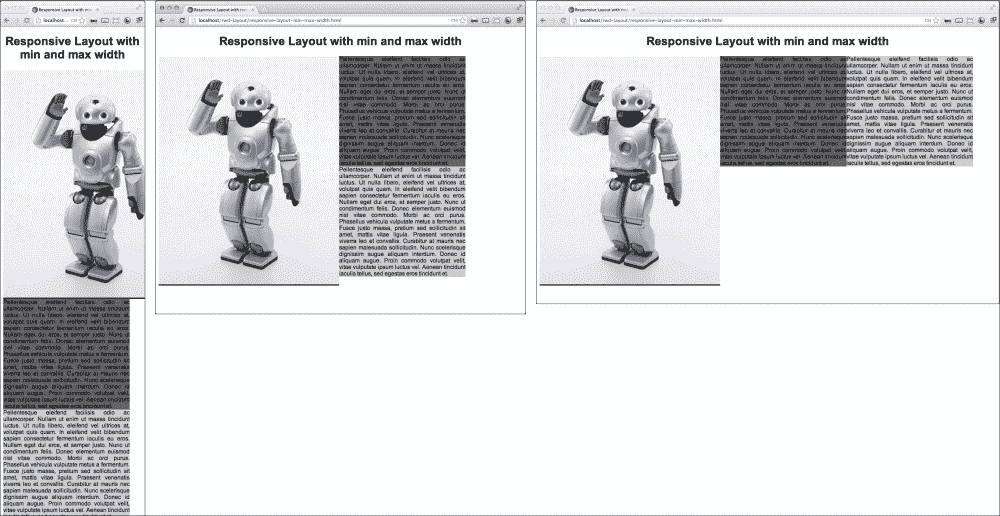
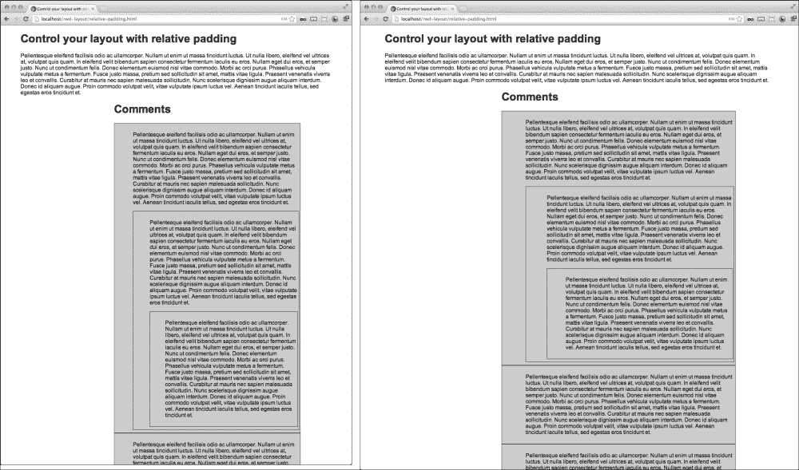
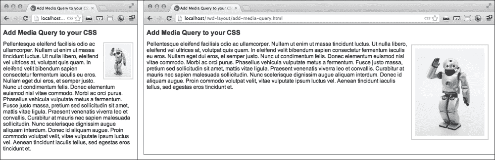
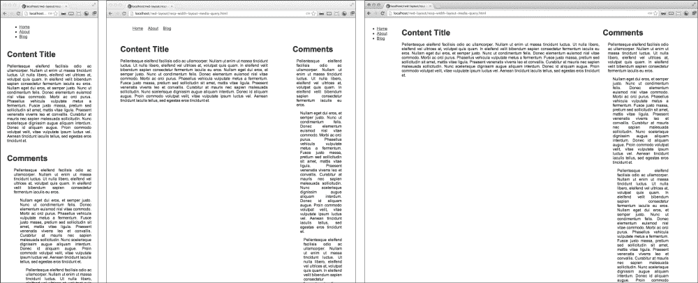
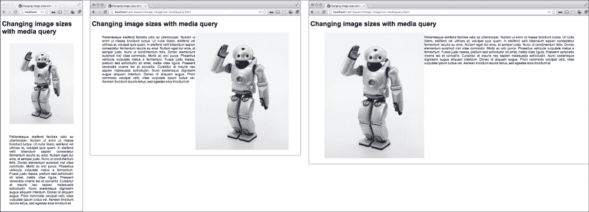
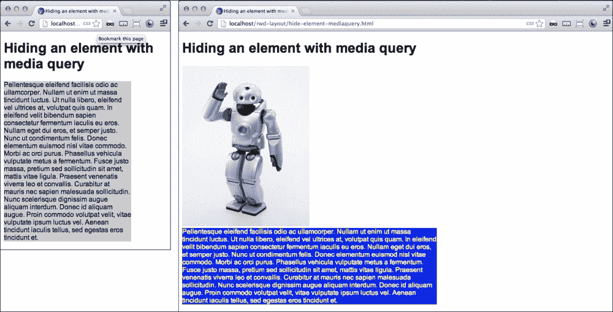
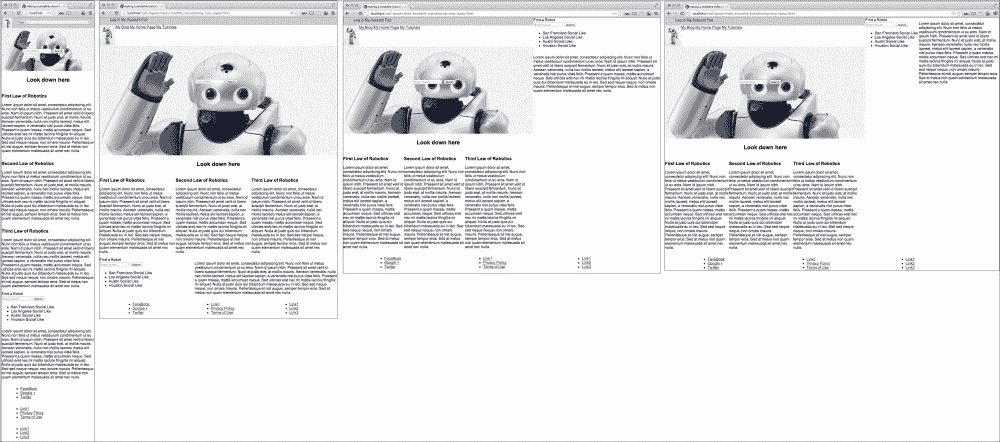

# 第三章：响应式布局

在本章中，你将学习：

+   使用 min-width 和 max-width 属性创建响应式布局

+   使用相对填充控制布局

+   向你的 CSS 添加媒体查询

+   使用媒体查询创建响应式宽度布局

+   使用媒体查询更改图像大小

+   使用媒体查询隐藏元素

+   创建平稳过渡的响应式布局

# 介绍

这一章有一些具有挑战性的示例。响应式布局经常会带来一些困难的挑战，这可能会促使你创造一个很好的解决方案。通过响应式设计方法，你可以做更多的事情，而且更有效率。响应式布局为网页开发引入了全新的挑战领域和新的激动人心的维度。

# 使用 min-width 和 max-width 属性创建响应式布局

许多响应式布局技术可能非常复杂和令人不知所措，但在这个示例中，你将看到应用于三个浮动元素的`min-width`和`max-width`属性的相当简单的布局。通过 CSS 的这个非常简单的响应式布局特性，你可以准备好在各种大小的移动设备和桌面屏幕上显示你的网站。

## 准备工作

在小视口上从多列折叠为一列的浮动元素并不是一个新的技巧。这已经作为 CSS1 的标准属性存在多年了，然而，直到移动设备变得普遍之前，从来没有理由认为它有用。因此，让我们将这个古老的、陈旧的属性与一些其他新鲜的 CSS 属性结合起来，制作一个响应式布局。

## 如何做...

创建一个简单的 HTML 页面，包含在`article`元素中，包含一个`h1`标题和三个元素。第一个元素将包含一个图像，第二个和第三个将包含填充文本。给所有内部元素分配一个`float`类，分别将它们的 ID 分配为`one`、`two`和`three`：

```html
<article>
     <h1>Responsive Layout with min and max width</h1>

     <div class="one float">
        
     </div>

     <div class ="two float">Pellentesqueeleifendfacilisisodio ac ullamcorper. Nullamutenimutmassatinciduntluctus...
     </div>

     <div class="three float">Pellentesqueeleifendfacilisisodio ac ullamcorper. Nullamutenimutmassatinciduntluctus. Utnullalibero, …
     </div>
</article>
```

接下来，为`.article`元素创建样式，并分配属性：`width: 100%;`、`max-width: 1280px;`和自动边距。然后，将`h1`标题居中。给`img`元素分配`width: 100%`和`height: auto;`属性，使其对父元素响应。对包含`img`元素的浮动元素，给它一个`min-width`值为`500px`。你也可以给每个浮动元素分配不同的背景颜色，以使它们更加可辨认，但这对布局并不是必要的。对于`.float`类中的所有浮动元素，添加`max-width: 350px`属性，左浮动，并为了清晰的外观，调整文本对齐方式。

```html
<style>
article{
     width: 100%;
     max-width: 1280px;
     margin: 0 auto;
}
h1 {text-align:center;}
img {
     width: 100%;
     height: auto;
}
.one {
     background-color: #333;
     min-width: 500px;
}
.two {background-color:#666}
.three {background-color:#ccc}
.float {
     max-width: 350px;
     float: left;
     text-align: justify;
}
   </style>
```

一旦所有东西都放在一起，你在浏览器中打开 HTML 文档，你会看到布局如何平稳地从三列布局变成两列布局，最后变成单列布局，如下面的屏幕截图所示：



## 它是如何工作的...

列的`max-width`属性允许它们具有流动但最大宽度。这使得列的布局比静态宽度更加灵活。图像列利用`min-width`属性，因此它可以根据父元素宽度的变化而增长和收缩。最后，整个布局可以通过使用`float`属性从三列平滑地变成一列；一旦元素无法并排浮动，最后一个元素就会跳到新的一行。

# 使用相对填充控制布局

让我们为一个带有评论和评论回复的博客设计一个简单的布局。这可以只使用相对填充来实现。你可能会说，“这太疯狂了！你怎么可能只用填充来控制页面布局？”我们来看看。

## 准备工作

当然，博客比静态 HTML 页面要动态得多，所以这将是你最喜欢的博客软件的评论模板部分的一部分。话虽如此，这个方法非常简单，但却非常有效。所以，去找一些 Ipsum 填充文本，准备好自己吧。

## 如何做…

第一步是创建一个非常简单的博客风格页面，其中评论嵌入在`div`元素中。在你的 HTML body 中，创建一个将包含所有内容的元素，`.content` div。给它一个`h1`标题，一个 Ipsum 填充文本段落，然后跟一个`.comments`元素。在`.comments`元素内，你将构建嵌入式评论布局。

```html
<div class="content">
     <header>Control your layout with relative padding</header>
     <p>
Pellent esque eleifend facilis isodio ac ullam corper. Null amuten imut massat incident luctus. Utnull alibero, el eifend vel ultrices at, volut patquis quam...</p>
     <div class="comments">
          <h2>Comments</h2> No 2 x h1
     </div>
</div>
```

在`.comments`标题下，你将添加你的第一个评论。接下来，在那个评论里，在闭合段落标签后立即添加一个评论：

```html
<aside>
     <h1>Comments</h1>
     <div class="comment">
          <p>
Pellent esque eleifend facilis isodio ac ullam corper. Null amuten imut massat incident luctus. Utnull alibero, et...
          </p>
          <div class="comment">
               <p>
Pellent esque eleifend facilis isodio ac ullam corper. Null amuteni mut massat incident luctus. Ut null alibero, el eifend vel ultrices at, volut patquis quam...
               </p>
          </div>
     </div>
</aside>
```

接着，你可以以同样的方式插入更多的评论到父评论中，或者在父`div`元素之外添加评论，使评论到达父级的父级，一直到原始博客帖子：

```html
<aside>
    <h1>Comments</h1>
      <div class="comment">
        <p>
          Pellent esque el eifend facilis isodio ac ullam corper..
        </p>

      <div class="comment">
        <p>
           Null amuten imut massat incident luctus....
        </p>

      <div class="comment">
        <p>
          Ut null alibero, el eifend velul trices at, volut pat quis quam...
        </p>
      </div>
     </div>
    </div>
   <div class="comment">
       <p>
         Null ameget dui eros, et semper justo. Nun cut condi mentum felis...
       </p>
    </div>
   </div>

</aside>
```

最终，你可以有很多评论和一个漂亮的工作布局，只需使用相对填充就可以构建。

使这个方法生效的 CSS 非常简单。只需添加类：`.content`、`.comments`和`.comment`。在`content`类中添加一些侧边填充，在`comment`中添加更重的左填充。

```html
.content {padding:0 5% 0 5%;}
aside {padding:0 10% 0 20%}
.comment {padding:0 0 0 10%}
```

如下截图所示：



## 工作原理…

相对填充属性通过调整自身宽度来响应页面宽度的变化。

# 向你的 CSS 添加媒体查询

在这个方法中，我们将探索媒体查询的强大功能，通过在宇宙中的每个排列和设备上呈现一个简单的网页。好吧，我承认我有点夸张。但我们将创建一个简单的网页，可以响应几种浏览器窗口大小、设备和其他可能的呈现方法。

## 准备工作

仅仅为了这个方法，去购买这里描述的每种设备和变体中的一种。你需要一台新的高清电视，一个智能手机，一个不那么智能的手机，以及至少一台打印机。不可能？好吧，但我只是想帮助你和经济。话虽如此，当然，真正测试每个媒体查询是不可能的，但尽力而为。有惊人的可能性。但在大多数现实场景中，你不太可能需要或关心使用其中大多数。我们至少会尝试覆盖最常用的媒体查询。

我会跳过我认为对你不必要的部分。如果你发现自己在一个项目中需要为这些晦涩的设备之一创建演示文稿，你可以很容易地获取关于这些设备的信息。你永远不知道！WC3 有关于这些设备的详细信息和描述，如果你需要，可以在[`www.w3.org/TR/css3-mediaqueries/`](http://www.w3.org/TR/css3-mediaqueries/)上找到。我将排除示例，仅供参考，包括具有特定颜色限制的许多设备，包括单色、打印、电视和手持设备。你最有可能需要的媒体查询可能是`screen`和`print`。

## 如何做…

创建一个简单的 HTML 页面，包括一个`h1`标题，一个包裹图片的元素，和一个文字段落。如果你没有文本，可以使用 Ipsum 填充文本。它看起来就像下面这样：

```html
<body> 
     <h1>Add Media Query to your CSS</h1>
          <div class="wrap">
               
Pellent esque el eifend facilisis odio ac ullam corper. Nullam ut enim ut massa tincidunt luctus…
          </div>
</body>
```

接下来创建一系列媒体查询。在下面的列表中，我将简要解释每个查询的作用：

```html
@media print{...}
```

这在打印网页时应用。你可以通过选择**文件** | **打印**，然后查看打印预览来测试这一点。这对用户将其打印为文档阅读的网页非常有用。你可以利用这一点，改变或删除格式，使这个版本尽可能简单。 

```html
@media (orientation: portrait){...}
```

这通常适用于以纵向模式显示文档的任何设备。你可以用它来为移动设备改变不同方向的外观。要小心，因为这也会应用于桌面屏幕，除非你指定它只适用于较小的屏幕或设备。媒体查询方向的其他可能值是横向。

```html
@media (height:500px){...}
```

`height`和`width`媒体查询允许你为特定的屏幕尺寸指定样式。

```html
@media (device-width:500px){...}
```

这个媒体查询将应用样式到任何页面，不管浏览器窗口大小如何，只要在指定尺寸的设备上查看。

```html
@media screen and (device-aspect-ratio: 16/9) {...}
```

这个媒体查询可以用来定义`16/9`比例的屏幕（非打印）的样式。

```html
@media tv {...}
```

这个纵横比只适用于使用电视观看的设备。

```html
@media screen and (max-width:960px){...}
@media screen and (min-width:961px) and (max-width:1280px){...}
@media screen and (min-width:1281px) and (max-width:1336px){...}
@media screen and (min-width:1336px){...}
```

`min-width`和`max-width`媒体查询是最有用的。在这里，你可以为任何窗口大小定义响应式样式，包括小屏幕移动设备。我通常从定义最小的——或移动设备——视口断点开始，并定义它们的样式，然后为最流行的屏幕尺寸创建断点范围，最后使用`min-width`媒体查询应用于最大的屏幕尺寸。

一旦你创建了你认为对当前项目有用的媒体查询，就为媒体查询添加不同值的样式：

```html
@media tv { 
     body {color: blue;} 
     h1 {
          font-weight: bold;
          font-size: 140%;
     }
     img {
          float: left;
          width: 20%;
          border: 2px solid #ccc;
          padding: 2%;
          margin: 2%;
     } 
     p {
          width: 62%;
          float: right;
          font-size: 110%;
          padding: 2%;
     }
} 
@media screen and (max-width: 960px) {
     body {color: #000;} 
     h1 {
          font-weight: bold;
          font-size: 120%;
     } 
     img {
          float: right;
          width: 20%;
          border: 2px solid #ccc;
          padding: 1%;
          margin: 1%;
     } 
     P {
          width: 80%;
          float: left;
          font-size: 60%; 
     } 
}
@media screen and (min-width:961px) and (max-width:1280px) { 
     body {color: #000000;} 
     h1 {
          font-weight: bold;
          font-size: 120%;
     }
     img {
          float: right;
          width: 20%;
          border: 2px solid #ccc;
          padding: 1%;
          margin: 1%;
     } 
     P {
          width: 76%;
          float: left;
          font-size: 60%;
     }
} 
@media screen and (min-width: 1281px) {
     body {color: #000000;} 
     h1 {
          font-weight: bold;
          font-size: 120%;
     } 
     img {
          float: right;
          width: 20%;
          border: 2px solid #ccc;
          padding: 1%;
          margin: 1%;
     } 
     P {
          width: 70%;
          float: left;
          font-size: 100%;
     }
} 
```

页面的最终版本显示在以下截图中：



## 工作原理…

应用这些样式，你会发现不同的设备应用了不同的样式。你可以巧妙地结合一些媒体查询来在你的网站上创建魔术般的响应性。

# 使用媒体查询创建响应式宽度布局

在这个配方中，我们将制作一个简单的响应式宽度布局，它会根据不同的屏幕宽度进行调整。这个布局将是一个很好的起始模板，用于个人博客或新闻杂志，你希望读者评论你的内容和彼此的评论。它甚至可能是一个吸引喷子参与激烈争论的绝佳主题起点。这段话听起来有点傻，抱歉！

## 准备工作

这个模板在动态 CMS 或博客软件中效果很好，但作为一个纯 HTML 页面可能没有太多意义。但大多数主题在呈现方面与 HTML 一样工作。在大多数情况下，你只需用模板标签替换文本和静态导航。这个配方将需要一些填充文本来演示。如果你还没有一些文本可以使用，可以去我们的老朋友 Ipsum 生成器获取一些填充文本。

## 操作方法…

首先，创建一个简单的网页，在`style`元素中创建你的媒体查询。你可以随时链接到外部样式表，但为了简单起见，这个和大多数的配方都包含在你的头部`<style>...</style>`部分的 CSS 中。在屏幕尺寸上包括这些标准断点：`960`，`1024`和`1280`。

```html
<style>
@media screen and (max-width: 960px) {…}
@media screen and (min-width: 961px) and (max-width: 1024px) {…} 
@media screen and (min-width: 1025px) and (max-width: 1280px) {…} 
@media screen and (min-width: 1281px) {…}
</style>
```

第一个媒体查询影响所有窄于`960px`的视口。第二个从`961px`到`1024px`，第三个从`1025px`到`1280px`，最后一个影响所有大于`1281px`的屏幕尺寸。在每个媒体查询中，你将为不同的布局编写 CSS。除了媒体查询之外，还会有一些布局 CSS 以及你的样式呈现，但大多数都会在媒体查询中定义。

接下来的步骤是创建你的 HTML 布局。基本结构从这些基本的`div`元素开始——`nav`，`content`和`comments`：

```html
<body>
  <nav></nav>
  <div class="content"></div>
  <aside class="comments"></aside>
</body>
```

接下来在你的页面中添加一些填充内容。这将有助于演示布局。

在`nav`元素中，添加一个带有示例菜单链接的无序列表。这将作为一个响应式菜单。在页面最窄的宽度上，菜单将垂直显示。在宽度范围从 961px 到 1280px 之间，菜单以水平方式显示在顶部。对于更大的宽度，我们希望菜单返回到垂直显示并返回到左侧。

在前两个媒体查询中，`content`和`comments`元素将向左浮动，但宽度比例不同。在`960px`时，这些元素的宽度应为`90%`。在更大的宽度上，将`content`和`comments`元素分别设置为`60%`和`20%`。

```html
@media screen and (max-width: 960px) {
     .content {width: 90%;}
     .comments {width: 90%;}
}
@media screen and (min-width: 961px) and (max-width: 1280px) {
     .nav ul li {display: inline-block;} 
     .content {width: 60%;}
     .comments {width: 20%;}
@media screen and (min-width: 1281px) {
     .content {width: 60%;}
     .comments {width: 20%;}
}
```

为了使菜单在大屏幕上滑回左侧，我们将使用定位来创建一个三列布局。在`min-width:1281px`媒体查询中，添加`.nav`元素和绝对定位和宽度的样式：

```html
.nav{
     position: absolute;
     top: 20px;
     left: 0px;
     width:144px;
}
```

这几乎是构建响应式布局所需的所有步骤。为了使布局更整洁，让我们为布局添加一些填充。将`.nav`、`.content`和`.comments`元素添加到其他媒体查询中，然后为这些元素添加填充。参考以下 CSS。`min-width:1281px`媒体查询不会为`.nav`元素添加填充，而`.content`和`.comments`元素的填充会减少以适应垂直菜单。

```html
@media screen and (max-width: 960px){
     .nav {padding: 1% 5%;}
     .content,.comments {padding: 1% 5%;}
     .content {width: 90%;}
}
@media screen and (min-width: 961px) and (max-width: 1280px){
     .nav {padding: 1% 5%;}
     .nav ul li {display: inline;}
     .content,.comments {padding: 1% 5%;}
     .content {width: 60%;}
}
@media screen and (min-width: 1281px){
     .nav {
          position: absolute;
          top: 20px;
          left: 0px;
          width: 144px;
     }
     .content,.comments {padding: 1% 1% 1% 0;}
     .content{
          width: 60%;
          margin-left: 144px;
     }
}
```

你也可以按照自己的喜好对内联菜单进行样式设置。现在让我们简单地为`li`元素添加一些边距。在媒体查询之外添加这些元素和样式，`.nav ul li{margin: 2px 10px;}`。

最后，关于内容和评论，将你的占位文本粘贴到`.content`元素内。我还在里面添加了标题和段落标签。我们将对评论做类似的操作。

记住，我们希望允许嵌入式评论，或者允许人们对评论进行评论。评论可能会有继承的层次结构，我们仍然希望在所有浏览器大小下都能看起来不错，所以我们应该添加一些填充。在每个媒体查询的`.comments`元素中添加相对填充，以便随着浏览器窗口变小而占用更少的空间：对于`max-width:960px`媒体查询，填充为`90%`，对于所有更大的尺寸，填充为`20%`。在媒体查询之外，为`.comment`元素添加`padding-left: 8%`，并将`.content`和`.comments`元素向左浮动。你还可以使用`text-align:justify`使文本看起来像一个块。

```html
@media screen and (max-width: 960px) {
     .nav {padding: 1% 5%;}
     .content,.comments {padding: 1% 5%;}
     .content {width: 90%;}
     .comments {width: 90%;}
}@media screen and (min-width: 961px) and (max-width: 1280px) {
     .nav {padding: 1% 5%;}
     .nav ul li {display: inline;}
     .content,.comments {padding: 1% 5%;}
     .content {width: 60%;}
     .comments {width: 20%;}
}
@media screen and (min-width: 1281px) {
     .nav {
          position: absolute;
          top: 20px;
          left: 0;
          width: 144px;
     }
     .content,.comments {padding:1% 1% 1% 0}
     .content {
          width: 60%;
          margin-left: 144px;
     }
     .comments { width: 20%;}
}
.content,.comments {
     float: left;
     text-align: justify;
}
.nav ul li {margin: 2px 10px;}
.comment {padding-left: 8%;}
```

这个 CSS 将使评论和嵌入式评论的填充根据浏览器窗口大小的变化而调整。因此，你的页面的评论部分将显示评论的父子层次结构，以及每个浏览器窗口大小的一致且可操作的布局。你可以在以下截图中看到代码的实际演示：



## 工作原理…

在这个响应式布局中，我们使用了一些不同的技术。首先，媒体查询为我们提供了有限但有用的逻辑，可以针对不同的浏览器窗口大小部署不同的布局技术。其次，流体和浮动元素的大小比例可以轻松调整到新的布局。最后，流体的百分比填充给出了与屏幕大小和布局一致的填充比例。

# 使用媒体查询更改图像大小

在这个教程中，你将学习如何使用 CSS 媒体查询调整图像大小。这在许多情况下都很有用，特别是当你想要下载一个图像并在响应式布局中使用不同尺寸的版本时。

## 准备工作

这是一种可以在客户端处理的尺寸变化的好方法，但要小心不要滥用这种方法，导致客户端下载一个非常大的图像文件并在他们的浏览器中进行大量调整。有更好的方法来做到这一点，在第一章中已经讨论过，*响应式元素和媒体*。

## 如何操作…

我建议创建一个小的 HTML 页面，包括一个`h1`标题，`wrap`元素，以及在`wrap`内部，一个图像和一个文字段落。实际上，在媒体查询中更改图像大小并不需要所有这些额外的东西，但是这将帮助你演示在媒体查询中更改图像大小的用法。

接下来，为最常见的浏览器窗口大小断点创建您的媒体查询：`960px`、`1024px`、`1280px`、`1366px`、`1440px`，最后是`1680px`。在每个媒体查询中，添加您的元素样式。在我的示例中，我在`960px`和`1280px`处创建了媒体查询：

```html
@media screen and (max-width: 960px){ 
     .wrap {padding:0 5%; width: 90%;} 
     .wrap img { 
          width: 90%; 
          height: auto; 
          padding:5%;
     } 
     .wrap p {
          width: 90%;
          padding: 5%;
          text-align: justify;
     } 
} 
@media screen and (min-width: 961px) and (max-width: 1280px) { 
     .wrap {
          padding: 0 5%;
          width: 90%;
     } 
     .wrap img {
          width: 50%; 
          height: auto; 
          max-width: 600px; 
          float: right; 
          } 
     .wrap p {
          width: 50%;
          text-align: justify;
          float: left;
     } 
} 
@media screen and (min-width:1281px) { 
     .wrap {
          padding: 0 5%;
          width: 90%;
      } 
     .wrap img {
          width: 40%; 
          height: auto; 
          max-width: 500px; 
          float: left; 
      } 
     .wrap p {
          width: 60%;
          text-align: justify;
          float: right;
      } 
}
```

现在，当您调整页面大小时，您可以看到图片在浏览器通过各种媒体查询调整大小时的变化。这在下面的截图中有所说明：



## 工作原理…

当浏览器调用不同的媒体查询时，元素的`width`和`height`属性会呈现不同的大小。这使您能够为不同的设备优化图像大小。请根据您的判断，如果原始图像太大，可以考虑一些服务器端的调整大小作为替代方法。

# 使用媒体查询隐藏元素

这个教程将向您展示一些非常有用的媒体查询技巧，以使元素根据浏览器窗口的大小消失。有几种不同的方法可以隐藏屏幕上的元素，我将在这个教程中介绍其中三种。

## 准备工作

这种方法可以有很多用例。一个非常有用的用例是在将页面缩小到较小的设备时，使用它来动态切换菜单。您还可以使用它来改变内容区域或侧边内容的显示方式。当您用这些方法进行创意时，可能性是无限的。

## 如何做…

设置一个简单的演示页面。在我的示例中，我编写了一个带有`h1`标题、一张图片，然后两个带有文本的元素的页面。接下来，为这些元素添加一些样式。我为每个元素添加了不同的背景颜色和宽度属性，主要是为了在它们消失时能够保持它们的间隔。

然后在断点处添加您的媒体查询。在示例中，我将在`960px`处添加一个断点。在媒体查询内，我们将看一下一些不同的方法来使元素消失。

在您的第一个媒体查询`max-width: 960px`中，为`img`元素添加`position: absolute`和`left: 5000px`属性；这个样式将把元素移动到屏幕左侧足够远的地方，实际上，它已经消失了。在该媒体查询中添加`display: none`样式到`.bar`元素。这将使元素保持在原位，但使其不可见。这两个元素实际上已经从页面上消失了，只留下标题和`.foo`元素。

在第二个媒体查询中，您将尝试另一种方法来从屏幕上移除一个元素。首先，将`.foo`元素添加到媒体查询中，并给它一个左边距为`5000px`。这将把它从屏幕上移除，但是下一个元素会清除它的垂直空间，留下一个明显的白色空间。然后，将元素浮动到左侧，白色空间将消失。这在下面的代码片段中有所说明：

```html
.foo {
     background-color: #ccc;
     width: 300px;
} 
.bar {
     background-color: blue;
     width: 600px;
     color: white;
} 
@media screen and (max-width: 960px) { 
     img {
          position: absolute;
          left: 5000px;
     } 
     .bar {display: none;} 
} 
@media screen and (min-width: 961px) { 
     .foo {
          float: left;
          margin-left: -5000px;
     } 
}
```

恭喜！在浏览器中打开项目，看看是否像下面的截图一样：



## 工作原理…

绝对定位和浮动都没有高度属性，因此一旦应用到一个元素上，它们将不占据任何垂直空间。这可以是一个特别有用的技巧，用来在页面上移动元素。但当您使用浮动元素进行布局时，可能会出现一些问题。这种行为可以通过在元素后插入一个带有`clear:both`属性的换行来解决。

# 创建一个平滑过渡的响应式布局

在这个教程中，我将指导您创建一个多区域和响应式的首页。这个首页将有一些以不同方式响应的元素；提供丰富的用户体验，呈现出令人印象深刻的布局。我为一家初创公司开发了这个，发现我非常喜欢它，所以我继续进一步开发，与您分享在这个教程中。

## 准备工作

这个配方将是内容丰富网站的主页的良好模板。如果你已经建立了一段时间的内容，这将是完美的登陆页面，并且可以很容易地修改为单个内容页面。如果你刚刚开始建立你的网站，你可以像我为这个配方做的那样去[`lipsum.com`](http://lipsum.com)获取一些生成的文本。

## 如何做到这一点...

这个网站分解成三个 HTML 元素或者页脚，还有两个元素，有时是垂直的，有时是左浮动和右浮动，取决于屏幕宽度。这些元素本身也分成更小的元素。所以，开始创建一个带有顶部包裹元素、中间包裹元素和页脚的基本页面：

```html
<body>
  <header>...</header>
  <div class="content" role="main">...</div>
  <footer>...</footer> 
</body>
```

接下来，我们开始这些项目的 CSS。添加一些基本的 CSS 和以下媒体查询：

```html
body{
     margin: 0;
     padding: 0;
}
footer {width: 100%;}
.clear {clear: both;}
@media screen and (max-width: 1280px) {  
     header, .content {width: 100%;} 
} 
@media screen and (min-width: 1281px) { 
     header {
          float: left; 
          width: 60%;
     } 
     .content {
          float: right; 
          width: 40%;
     }
}
```

在这个基本布局中，`header`和`.content`行在页面宽度小于`1280px`时都占据`100%`的页面宽度。当页面更大时，它们占据各自的`60%`/`40%`分割和`left`和`right`浮动。

接下来让我们构建菜单。这个菜单将利用响应式技巧，使用媒体查询来隐藏和显示两个不同的菜单。基本上，我们将构建两个不同的菜单，然后使用 CSS 来为每个屏幕显示优化的菜单。最小版本将使用多选下拉菜单，而较大的菜单包含两个内联列表。在`top-wrap`元素内部的 HTML 如下所示：

```html
<header>
    <nav>
        <div class="menu small-menu">
             
             <form>
                <select name="URL" onchange='window.location.href=this.form.URL.options[this.form.URL.selectedIndex].value'>
                 <option value="blog.html">Page 1</option>
                 <option value="home.html">Home Page</option>
                 <option value="tutorials.html">Tutorials</option>
                </select>
             </form>
        </div>

        <div class="menu large-menu">
             <div class="top-menu">
                 <nav>
                   <ul>
                    <li><a href="login.html">Log In</a></li>
                    <li><a href="account.html">My Account</a></li>
                   </ul>
                 </nav>
             </div>
        <div class="bottom-menu"> these should be classes so they can be reused. Plus the names are too specific.
           <nav>
             <a href="#" class="logo">
                
             </a>
             <ul>
                <li><a href="blog.html">Page 1</a></li>
                <li><a href="home.html">Home Page</a></li>
                <li><a href="tutorials.html">Tutorials</a></li>
                <li> <a href="news.html">News</a> </li>
             </ul>
          </nav>
        </div>
     </div>
    </nav>
</header>
```

为头部元素添加以下 CSS：

```html
nav .small-menu img{
     width:9%;
     height:auto;
     float:left;
     padding:0 2%;
}
nav .small-menu select {
     margin: 3%;
     width: 80%;
}
```

这将显示菜单的两个不同版本，直到我们添加到我们的媒体查询。添加媒体查询以在小浏览器窗口和较大浏览器窗口尺寸上切换显示下拉菜单和较大的内联列表菜单。使用`display`属性来显示和隐藏菜单。

```html
@media screen and (max-width: 600px) {
     nav .small-menu {display: inline;}
     nav .large-menu {display: none;}
}
@media screen and (min-width: 601px) {
     nav .small-menu {display: none;}
     nav .large-menu {display: inline;}
}
```

在菜单下，在闭合的`</header>`标签之前，为网站上显示的大高质量照片创建一个空间。为了防止它成为浪费的空间，让我们把一个搜索框放在它的中间。我们实际上可以使这个搜索表单紧贴图片中心，并对屏幕尺寸的变化做出响应性调整。这在下面的简单代码中有所说明：

```html
<div class="img-search">classes
   <div class="search">
       <form>
         <input type="text" placeholder="Find a Robot">
         <input value="Search" class="search-input" type="submit">
       </form>
   </div>
   
</div>
```

当然，这是 CSS 的魔力。让我们使用一些技巧使搜索表单在同一位置悬停。首先给外部`div`元素一个`100%`的宽度，然后`search`元素将在不同的媒体查询下获得绝对位置和几个不同的属性。这种组合将使搜索表单悬浮在`img`区域的中间。请记住，我们正在向媒体查询添加新的 CSS。以下 CSS 代码仅反映了新增内容，而不是已经存在的内容。如果每次都展开整个 CSS，它会变得相当长。最后，我将包括整个 CSS，以便它以最终状态呈现。

```html
.img-search {width: 100%;}
.search {position: absolute; }
.top-menu {
     height: 33px; 
     background-color: #ccc;
}
.logo img {height: 87px; float: left;}
.top-menu nav li {display: inline-block;} 
.large-menu ul {margin: 0 5px;}
.large-menu li {display: inline;}

@media screen and (max-width: 600px) {
     .search {
          margin-top: 87px;
          left: 22%;}
   }
@media screen and (min-width: 601px) and (max-width: 1280px) {
     .search {
          margin-top: 144px;
          left: 40%;
     }
}
@media screen and (min-width: 1281px) {
     .search {
          margin-top: 144px;
          left: 22%;
     }
}
```

`.img-search`图像元素将获得`100%`的动态宽度和自动高度。这就是大图搜索字段的全部内容。

给下一个元素`.flip-tab`一个`100%`的宽度，以及任何高度或其他你想要的属性。你不必再担心这个了：

```html
<div class="flip-tab"><h3>Look Down Here</h3></div>

.flip-tab {width: 100%; height: 54px; text-align: center;}
```

接下来的元素`.teasers`将获得一个`max-width: 1280px`属性，因此它将自动占据其父元素`top-wrap`的`100%`宽度，限制为`1280px`。这个元素只是三个左浮动的`.teaser`元素的容器。这些`.teaser`元素在不同的媒体查询下会有两组不同的属性集，用于`600px`断点。

```html
<div class="teasers">
     <div class="teaser teaser1">
          <h3>The First Law of Robotics</h3>
               <p>
                    Lorem ipsum dolor sit amet,..
               </p> 
     </div>
     <div class="teaser teaser2"> 
          <h3>The First Law of Robotics</h3>
               <p>
                    Lorem ipsum dolor sit amet,..
               </p> 
     </div>
     <div class="teaser teaser3"> 
          <h3>The First Law of Robotics</h3>
               <p>
                    Lorem ipsum dolor sit amet,..
               </p> 
     </div>
</div>
.teasers {max-width: 1280px;}
.teaser {float: left;}
@media screen and (max-width: 600px) {
     .teaser {width: 100%;}
}
@media screen and (min-width: 601px) {
     .teaser {
          width: 32%;
          min-width: 144px;
     }
}
```

这就结束了你在`header`元素中要做的一切。接下来是`content`元素，它包裹着将在右侧列中浮动的内容。这个元素里面的内容只是一个 60/40 比例的两列浮动，或者如果父元素很窄，每个都是`100%`宽。`content`元素将在断点为`1280px`的媒体查询下有两组不同的属性集。这些元素有一些有限的示例内容。一旦部署了布局，你可以添加更多内容：

```html
<div class="content" role="main">
     <div class="contact-us">

          <div class="form-wrap">
               <legend>Find a Robot</legend> 

               <form>
                    <input type="text" placeholder="Robot Search">
                    <input value="Search" class="search-input" type="submit">
               </form>
          </div>
                <h4>Search or Like Us Locally</h4>
          <ul class="local-like">                  <li><a href="/search/SanFranciso">San Francisco</a><a href="/like/SanFrancisco">Like</a></li>
               <li><a href="/search/LosAngeles">Los Angeles</a><a href="/like/LosAngeles">Like</a></li>
               <li><a href="/search/Austin">Austin</a><a href="/like/Austin">Like</a></li>
              <li><a href="/search/Houston">Houston</a><a href="/like/Houston">Like</a></li>          </ul>
     </div>
     <divclass="cities"> really?
          <p>Loremipsumdolor sitamet, consecteturadipiscingelit. Nunc non felisutmetusvestibulumcondimentumuteueros.Nam id ipsumnibh.Praesent sit ametvelit...
          </p>
     </div>

</div>
```

这个 CSS 更加复杂，但是记住，你可以在线访问整个工作。正如你所看到的，元素会在周围来回移动一下，但是每个断点都会有一个优化的显示。

```html
.contact-us {float: left;}
.cities {float: left;}
@media screen and (max-width: 600px) {
     .contact-us {width: 100%;}
     .cities {width: 100%;}            
}
@media screen and (min-width: 601px) and (max-width: 1280px) {
     .contact-us {width: 40%;}
     .cities {width: 60%;}
}
@media screen and (min-width: 1281px) and (max-width: 1366px) {
     .contact-us {width: 100%;}
     .cities {width: 100%;}
}
@media screen and (min-width: 1367px) {
     .contact-us {width: 40%;}
     .cities {width: 60%;}
}
```

最后，页脚！（页面的结尾！）页脚分解为`100%`宽的外部`<footer>`，然后是一个`footer-wrap`包裹，宽度为`100%`，`max-width`为`1280px`，动态的边距，并且内联块显示。里面有三个元素，它们始终具有`display:inline-block`属性。当显示较小时，这些元素每个都是`100%`宽，否则它们是`33%`宽，左浮动，最小宽度为`144px`：

```html
<footer>
     <div class="footer-wrap">
          <div class="footer-1 footer-third">
               <ul>
               <li><span class=""><a href="#">FaceBook</a></span></li>
               <li><span class=""><a href="#">Google +</a></span></li>
               <li><span class=""><a href="#">Twitter</a></span></li>
               </ul>
          </div>
          <div class="footer-2 footer-third">
               <ul>
                 <li><span class=""><a href="#">Link1</a></span></li>
                 <li><span class=""><a href="#">Privacy Policy</a></span></li>
                 <li><span class=""><a href="#">Terms of Use</a></span></li>
               </ul>
          </div>
          <div class="footer-3 footer-third">
               <ul>
                  <li><span class=""><a href="#">Link1</a></span></li>
                  <li><span class=""><a href="#">Link2</a></span></li>
                  <li><span class=""><a href="#">Link3</a></span></li>
               </ul>
          </div>
    </div>
</footer>

.footer-wrap{ 
     width: 100%;
     max-width: 1280px; 
     margin :0 10%;
     display: inline-block;
}
.footer-third {display: inline-block;}

@media screen and (max-width: 600px) {
     .footer-third {width :100%;}
}
@media screen and (min-width: 601px{
     .footer-third {
          float: left; 
          width: 33%;
             min-width: 144px;
     }
}
```

就像我之前承诺的那样，这里是完整的 CSS 代码：

```html
body{margin:0;padding:0;}
.img-search {width: 100%} 
.search {position:absolute;}
nav .small-menu img{width:9%;height:auto;float:left;padding:0 2%;}
nav .small-menu select {margin: 3%; width: 80%;}
.main-img {width: 100%; height: auto;}
.top-menu {height: 33px; background-color: #ccc;}
.top-menu nav li {display: inline-block;}
.logo img {height: 87px; float: left;}
.large-menu ul {margin: 0 5px;}
.large-menu li {display: inline;}

.flip-tab {width: 100%; height: 54px; text-align: center;}
.teasers {max-width: 1280px;}
.teaser {float:left;}
.contact-us {float:left;}
.cities {float:left;}

footer {width:100%}
.footer-wrap {width: 100%; max-width: 1280px; margin: 0 10%; display: inline-block;}
.footer-third {display:inline-block;}

@media screen and (max-width: 600px) {
 nav .small-menu {display: inline}
 nav .large-menu {display: none}
 .search {margin-top: 87px; left: 22%;}
 .teaser {width: 100%}
 .contact-us {width: 100%;}
 .cities {width: 100%}
 .footer-third {width: 100%}
}
@media screen and (min-width: 601px) and (max-width: 1280px){
     .search {margin-top: 144px; left: 40%}
     .contact-us {width: 40%;}
     .cities {width: 60%}
}
@media screen and (min-width: 601px) {
 nav .small-menu{display: none}
 nav .large-menu{display: inline}
 .teaser {width: 32%; min-width: 144px;}
 .footer-third {float: left; width: 33%; min-width: 144px;}
}
@media screen and (max-width: 1280px) {
 header, .content {width: 100%;}
}
@media screen and (min-width: 1281px) {
 header {float: left; width: 60%;}
 .content {float: right; width: 40%;}
 .search {margin-top: 144px; left:22%;}
}
@media screen and (min-width: 1281px) and (max-width: 1366px){
 .contact-us {width: 100%}
 .cities {width:100%}
 }
@media screen and (min-width: 1367px) {
.contact-us {width: 40%}
.cities {width: 60%}
}
```

这一部分又长又难，感谢你的耐心等待！效果如下截图所示，请与你的输出进行比较：



## 它是如何工作的...

这些 CSS 和媒体查询结合在一起，可以制作一个响应式页脚，可以在所有屏幕尺寸下保持居中，并且可以在小型移动浏览器窗口中折叠。

响应式布局是 Web 开发方法的一个令人兴奋的新领域。响应式方法允许设计师和开发人员为多个设备创建，特别是移动设备，而无需开发原生应用程序。很快，如果还没有的话，你可以期待许多公司希望采用响应式方法来重新设计他们的网站。

## 还有更多...

你使用了一种非常简单的方法，几乎完全使用 CSS 来实现响应式。我要求你进一步挑战自己，通过在*为移动浏览器添加 JavaScript*配方中查看第五章中的*制作移动优先的 Web 应用程序*，添加一个 jQuery 方法，以在移动浏览器中用`<select>`元素替换大菜单。这将防止在菜单中有重复内容时可能导致的潜在搜索引擎惩罚。

首先，剪切`smallMenu` div 元素及其子元素，并将其粘贴到头部的某个地方，或者在`<script> </script>`元素中作为变量`smallMenu`。

```html
var smallMenu = '<div class="menu small-menu">…</div>'
```

接下来编写脚本，将调用以删除`large-menu` div 元素，并将`smallMenu`变量附加到`nav`元素。

```html
$(document).ready(function() {
     $('.large-menu').remove();
     $('nav').append(smallMenu);
});
```

现在，当页面在移动设备上加载时，脚本将用缩小的移动版本替换导航，你不会因为 SEO 而失眠！
