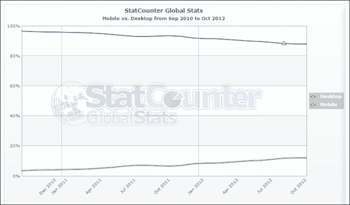

# 第一章：即时迁移到 HTML5 和 CSS3 的方法

自 1991 年成立以来，HTML 只改变了几次。在这个快节奏的数字时代，最受欢迎的技术之一变化如此缓慢是非常不寻常的。从基于表格的布局到基于 div 的架构，从 HTML 的主要规范到向后兼容的 XHTML 网站，从内联样式到外部动态样式表，技术进步的采纳速度一直缓慢地进行着。

1999 年 12 月之后，HTML 4.01 规范发布后，**万维网联盟**（**W3C**）和工作组的重点转向了 XHTML 和 CSS。在各种编码实践之间跳跃，用于简单的基于标记的文档和用于向早期版本的兼容性的后备，导致大多数网页出现了破损、不一致和非标准导向的代码。

在当今时代，当网页存在被视为等同于房地产或商店前台时，对于更高的搜索结果可见性，网页必须是可访问的、高效的、精简的、快速的和语义上正确的。

欢迎来到*Instant Migration to HTML5 and CSS3 How-to*手册。本书将为您提供迁移当前网站到 HTML5 的所有信息，这是 W3C 的新网络标准。

在接下来的配方中，我们将通过各种示例来帮助您将当前网站迁移到 HTML5，而不改变任何现有内容/呈现。我们还将解决您的网站在此过程中可能遇到的任何兼容性问题，并提出适当的解决方案，并进一步讨论升级的一些出色新功能。

# 当前网站的分析（必须知道）

在迁移任何网站之前，我们需要分析和检查文档和访问者的当前状态。这项练习将帮助我们概述可以升级的所有资源、库和依赖项。

快速分析访客将帮助我们确定访客使用的最常见浏览器，以及是否有任何特定浏览器（如 IE6）可以在此次升级中排除。如果大部分访客人群一直使用过时的浏览器访问您的网站，这些收集的信息将指导我们为这些访客设置代码规则或后备选项。

## 准备就绪

要开始分析，我们只需要访问 Google Analytics 或网站仪表板中集成的类似跟踪服务。例如，我们将查看我的网站[`www.dushyantkanungo.com`](http://www.dushyantkanungo.com)的访客趋势，持续一段时间。

您可以使用当前网站和文字处理器（铅笔/纸）来跟踪我们在途中发现的问题。

## 如何做到这一点...

1.  网站[`www.dushyantkanungo.com`](http://www.dushyantkanungo.com)使用 Google Analytics 进行访客跟踪，可以从[`www.google.com/analytics`](http://www.google.com/analytics)访问。在从左侧列导航到**受众** | **技术** | **浏览器和操作系统**后，我们得到了特定时期的以下结果：

根据 Google Analytics 提供的统计数据，我们现在知道超过 75%的访问者使用的是 Google Chrome 或 Firefox，大约 20%的流量来自 IE 和 Safari。

1.  进一步深入，我们可以看到访问网站的旧版 IE 的比例变得微不足道，因此我们可以选择编码实践来支持或排除它们。

类似的操作系统分析可以告诉我们来自移动设备或不同屏幕分辨率的访问者数量。这有助于我们设计支持目标人群的一系列最终用户。

1.  接下来，我们需要使用 W3C 验证器在[`validator.w3.org`](http://validator.w3.org)检查网站的当前验证状态。这将告诉我们在前往更新版本之前内容标记中是否存在任何已知问题。只需记下或复制错误，以备将来参考。

### 注

有时，旧网站可能链接到已移动或不再存在的外部资源。网页上的损坏链接总是令人不悦的，不仅是访问者，也是网络爬虫。

为了检查这些链接的当前状态并及时纠正它们，我们可以使用一个名为**Xenu's Link Sleuth**的小实用程序（从[`xenus-link-sleuth.en.softonic.com`](http://xenus-link-sleuth.en.softonic.com)下载），这是一个便携式免费软件，用于生成网站可能存在的任何损坏链接的报告。

1.  继续使用 Firefox 或 Chrome，您可以通过右键单击页面上的任何位置并选择**检查元素** | **网络**来检查页面加载所需的时间。然后，我们需要刷新页面以查看从页面到服务器的所有请求所花费的实时时间结果。

1.  您可能希望检查外部小部件的脚本或任何大型图像文件是否需要很长时间才能加载，从而影响网站的性能。

## 它是如何工作的...

了解目标受众、浏览器、已知基于内容的损坏标记信息和链接结构将有助于改善最终迁移产品的质量。

此外，您可能希望从旧的 DHTML/JavaScript 实用程序转移到改进的 jQuery 库，或者从基于图像的文本转移到基于 CSS 的样式以获得更健康的性能。

## 还有更多...

HTML5 的相关性远远超出了人们对编写网页的新规则的预期。这个简单而强大的标签也对开发人员有很多期望。

### 有效代码的影响

**文档类型定义**（**DTD**），表示为`<!DOCTYPE...>`，允许浏览器正确解释已用于编写单个网页的规则（XHTML、HTML 等），并随后正确呈现它们。

HTML 的通用规范，以及后来的 XHTML，允许浏览器以最佳解决方案呈现网页，无论是否正确使用 HTML 标记。这意味着，如果文档以 XHTML 的定义 DTD 编写，它仍将呈现和显示所有未使用 XHTML 规范关闭的元素（例如`<br/>`）。

迁移到更高标准的整个目的在于采用最佳实践来开发代码，以便为未来的技术发展铺平道路。浏览器供应商不支持 W3C 关于 HTML 或 CSS 的所有规范的最大论点仍然是当前标准的较低流行度以及仍在使用错误编码实践开发的网页数量。

作为网络专业人士，重要的是要确保我们开发的网页符合国际标准，语义正确，并且支持互联网作为一个无主、无国界、自由的网络的整体目的，以保持浏览器供应商的竞争力。

### HTML5 的重要性

理解 HTML5 引起如此多的喧嚣和噪音并不难。为了清晰地表达，这里有 HTML5 的 5 个 S：

+   **文件大小**：使用新的语义分区标记的 HTML5 与 XHTML 相比，文件大小差异将略小。有了各种新标签，用于需要外部支持或更长语法的任务，现在我们有了更清洁和更强大的 HTML 规范。

+   **语义**：HTML5 的语义标准化了现有的编码实践，以帮助机器和人类阅读和理解代码。这也为可扩展和易于维护的网站铺平了道路。

+   **简单性**：新的简单标签比以往更有助于定义文档的结构。这使得结构在维护或移交期间保持简单和易于理解。

+   **支持**：有了各种设备和浏览器的支持，现在更容易创建丰富的基于 Web 的应用程序，而不依赖于访问者端的第三方插件。结合 CSS3，HTML5 提供了从漂亮的排版到外部字体，渐变颜色到圆角边缘等一切。

+   **SEO**：对于企业所有者和营销经理来说，HTML5 迁移被证明是一项有利的投资，长期来看具有强大的回报潜力。具有更高的内容与代码比例，语义上定位的文章，以及以前可用的（并且在 HTML5 中积极鼓励）微格式数据，使搜索爬虫更容易区分真实信息和强制性的 SEO 实践。

### 简而言之，语义 Web

根据 W3C：

> “语义 Web 提供了一个通用框架，允许数据在应用程序、企业和社区边界之间共享和重复使用。”

简而言之，这意味着网页的不同模块，如标题、页脚、内容等，可以被特定应用程序和网络爬虫单独识别和提取，用于各种目的。HTML5 中的语义给一维`DIV`标签赋予了身份，并帮助网站变得更智能，鼓励基于真实内容的网页。

这是一个非常基本的结构差异的示例，我们将在后面详细讨论：


目前，开发人员可以为网页内的任何`DIV`标签指定自己选择的 ID。**内容**的`DIV`的`ID`可以是`inner-copy`，**标题**的`DIV`的`ID`可以是`top`，在当前的 XHTML 和 HTML 旧版本中也是如此。这使得外部应用程序或网络页面上的垃圾数据无法识别实际内容。

使用 HTML5，新的标签如`HEADER`、`FOOTER`、`NAV`、`ARTICLE`、`ASIDE`或`SECTION`等提供了一个全局的标识系统，用于网页的各个部分。

### 最后

掌握了关于当前网站的所有必要信息，并明确了练习的目的，我们开始迁移到 HTML5。

我们还将研究优先级黑客和替代解决方案，这些解决方案可以解决其中一些问题。

# 迁移开始（必须知道）

在本节中，我们将以一个具有常规特性或部分的示例 XHTML 页面，并将其转换为 HTML5，而不会破坏先前的内容或网站结构。

## 准备就绪

首先，从 FTP 获取网站的本地副本，并在其他文件夹中备份以供以后比较。在编辑器中打开其中一个 HTML 文档。

## 如何做…

1.  示例文档的代码可能如下所示：

```html
<!--the doctype declaration and head element-->
<!DOCTYPE html PUBLIC "-//W3C//DTD XHTML 1.0 Transitional//EN" "http://www.w3.org/TR/xhtml1/DTD/xhtml1-transitional.dtd">
<html  lang="en" xml:lang="en">
<head>
<meta http-equiv="Content-Type" content="text/html; charset="utf-8" />
<title>Example Document</title>
<link rel="stylesheet" type="text/css" href="style.css" />
</head>
<!--body of the document starts -->
<body>
<div id="wrapper">
<div id="header">
        <h1>HTML5 Migration</h1>
        <h2>A quick handbook for developers</h2>
</div>
<!--navigation starts-->
<div id="nav">
       <ul>
<li><a href="#">Home</a></li>
<li><a href="#">Chapters</a></li>
<li><a href="#">About</a></li>
   <li><a href="#">Contact</a></li>
</ul>
</div>
<!--navigation ends-->
<!--content starts-->
<div id="content">
        <h1>Article heading</h1>
        <h2>Article sub-heading</h2>
        <p>Loremipsumdolor sit amet, consecteturadipiscingelit. Aeneanpharetraerosquis nisi pellentesque tempus facilisisjustocommodo.</p>
        <p>Donecodioerat, euismod id posuere sit amet, sollicitudin at nibh. Vivamuspharetra magna portaliberoiaculis tempus.</p>
</div>
<!--sidebar starts-->
<div id="sidebar">
      <h2>Sidebar</h2>
<ul>
   <li>Item One</li>
   <li>Item Two</li>
   <li>Item Three</li>
   <li>Item Four</li>
   <li>Item Five</li>
   </ul>
</div>
<!--sidebar ends-->
<!--footer starts-->
<div id="footer">
        <p>&copy; 2012 PACKT Publishing &amp; Dushyant Kanungo. All rights reserved.</p>
</div>
<!--footer ends-->
</div>
<!--content ends-->
</body>
<!--body ends--></html>
<!--end of document-->
```

1.  让我们给前面的 HTML 页面添加一些样式：

```html
//style for the whole document
body {font-family: Verdana, Geneva, sans-serif;	font-size: 12px; color: #333; font-size:0.8em;}
//various div properties
div#wrapper {width:80%; margin: 0 auto;}
div#header, div#nav, div#footer {clear:both;}
div#header, div#nav, div#footer, div#content, div#sidebar {margin:5px; border:1px solid #999; padding:10px;}
div#content {width:72%;float:left;}
div#sidebar {width:22%;float:left;}

div#nav ul {margin:0; padding:0;} 
div#nav ul li {display:inline; margin-right:30px;}
div#footer {font-size:0.7em; color:#000;}
```

1.  页面在浏览器中的样子：

### 注意

**下载示例代码**

您可以从您在[`www.PacktPub.com`](http://www.PacktPub.com)账户中购买的所有 Packt 图书中下载示例代码文件。如果您在其他地方购买了本书，您可以访问[`www.PacktPub.com/support`](http://www.PacktPub.com/support)注册并直接通过电子邮件接收文件。

### 文档类型

浏览器根据文档类型定义（DTD）来识别文档类型，该定义在前面的代码的第一行中使用`DOCTYPE`标签声明。DTD 定义了标记语言的特定规则。

示例代码中的 DTD 是 XHTML 1.0 的过渡规则，定义如下：

```html
<!DOCTYPE html PUBLIC "-//W3C//DTD XHTML 1.0 Transitional//EN" "http://www.w3.org/TR/xhtml1/DTD/xhtml1-transitional.dtd">
```

HTML 和 XHTML 文档的`DOCTYPE`定义在各个版本和不同的规则集之间有所不同，如`transitional`、`loose`、`strict`或`frameset`。在 HTML5 中，解决了为各种文档版本或规则定义记忆许多不同行的代码的问题，只需使用：

```html
<!DOCTYPE HTML>
```

简短而简单。

### 根元素

继续前进，我们来到根元素的以下代码：

```html
<html  lang="en" xml:lang="en">
```

由于我们已经在代码的第一行中用`DOCTYPE`确定了文档类型，因此无需再次声明。这将标签截断为其主要形式，并使用以下语言声明：

```html
<html lang="en">
```

### head 元素

在任何 HTML 页面的头部声明的第一件事是字符编码。这使浏览器理解并帮助翻译我们在内容中使用的任何特殊字符。字符编码在`Meta`标签中定义：

```html
<meta http-equiv="Content-Type" content='text/html; charset="utf-8"'>
```

再次，这需要在同一页中第三次声明内容类型。删除不需要的代码和重复声明后，变成以下内容：

```html
<meta charset="utf-8">
```

通过查看迁移代码到目前为止，我们得到以下内容：

```html
<!DOCTYPE html>
<html lang="en">
<head>
<meta charset="utf-8" />
<title>Example Document</title>
<link rel="stylesheet" type="text/css" href="style.css" />
</head>
```

### body 元素

简化了常见 HTML 文档的`div`元素如下：

```html
<div id="header">...</div>
<div id="nav">... </div>
<div id="content">... </div>
<div id="sidebar">... </div>
<div id="footer">... </div>
```

HTML5 为这些`DIV`标签提供了通用的标识：

```html
<header>... </header>
<nav>... </nav>
<article>... </article>
<section>... </section>
<footer>... </section>
```

`DIV`标签`sidebar`可以用`<aside>`标签来唯一标识。

让我们把所有新标签放在主代码中，看起来是这样的：

```html
<div id="wrapper">
<header>
      <h1>HTML5 Migration</h1>
      <h2>A quick handbook for developers</h2>
</header>
<nav>
<ul>
<li><a href="#">Home</a>
</li>
</ul>
</nav>
<article>
      <h1>Article heading</h1>
      <h2>Article sub-heading</h2>
      <p>Loremipsumdolor …  tempus. </p>
</article>
<aside>
   <h2>Sidebar</h2>
<ul>
<li>Item O...  Five</li>
</ul>
</aside>
<footer>
      <p>&copy; 2012 PACKT … </p>
</footer>
</div>
```

请注意，HTML5 没有任何`<wrapper>`或`<container>`标签，而使用`DIV`标签仍然是 HTML5 中有效和可接受的做法。`<div id="wrapper">`或`<div id="container">`标签声明仍然常用于定义页面的实际宽度。

### CSS

通过新的截断 HTML 代码，我们也需要改变 CSS。HTML5 作为元素的 CSS 有助于减少 CSS 选择器对许多标签元素的需求。因此，在样式表中这些元素的`CLASS`或`ID`标识不需要前缀；例如，`p.intro`等。

```html
header, nav, footer {clear:both;}
header,nav,footer,article,aside {margin:5px; border:1px solid #999; padding:10px;}
article {width:72%;float:left;}
aside {width:22%;float:left;}

nav ul {margin:0; padding:0;}
nav ul li {display:inline; margin-right:30px;}
footer {font-size:0.7em; color:#000;}
```

### 兼容性方案

目前，只有少数不太流行的浏览器支持新标签的基于块的显示。为了解决这个问题，我们必须为*尚未*理解所示的新语义分区标签的浏览器创建定义。一些浏览器（某些版本的 Internet Explorer）将需要明确创建这些定义。

为了定义这一点，我们只需要在 CSS 文件的顶部添加前面的代码片段：

```html
article,aside,details,figcaption,figure,footer,header,hgroup,menu,nav,section {display:block;}
```

### 进一步的语义部分

如果您仔细查看我们在示例中使用的代码，您会发现我们不断使用两个`H1`和`H2`标签。一个是网页的标题，另一个是内容。这可能会导致爬虫混淆，并可能导致某些页面上标题的多次出现。

为了解决这个问题，我们可以定义*标题组*或`HGROUP`元素。

在这里，第一组标题变成：

```html
<header>
<hgroup>
         <h1>HTML5 Migration</h1>
      <h2>A quick handbook for developers</h2>
   </hgroup>
</header>
```

第二组变成：

```html
<article>
   <hgroup>
         <h1>Article heading</h1>
         <h2>Article sub-heading</h2>
      </hgroup>
         <p>Loremipsumdolor …  tempus. </p>
</article>
```

对于页面上出现多个标题的情况，这可以附加到特定组的便于操作：

```html
<article>
   <hgroup>
         <h1>Article heading</h1>
         <h2>Article sub-heading</h2>
      </hgroup>
         <p>Loremipsumdolor …  tempus. </p>

<hr>
   <hgroup>
         <h1>Article heading</h1>
         <h2>Article sub-heading</h2>
      </hgroup>
         <p>Loremipsumdolor …  tempus. </p>
</article>
```

标题的样式可以使用以下选择器进行设置：

```html
header hgroup {font-weight:bold;}
article hgroup {font-weight:normal;}
aside hgroup {text-decoration:none;}
```

这不仅使得操纵任何特定组的标题变得容易，而且有助于生成一个整洁的 CSS 文件。

### 图表和标题

如果我们查看所有的教科书或报纸，使用每个图像或图形的图表标题是一种常见做法，以提供完整的视觉解释。查看使用普通``元素的网页，我们必须使用手动的`div`元素来提供与之相关的所有附加属性。

```html

```

HTML5 允许我们使用`FIGURE`元素和嵌套的`FIGCAPTION`元素来分块图表和图像：

```html
<figure>

<figcaption>A beautiful sunset in Greece by 
<a href="http://www.flickr.com/photos/byrdiegyrl/"> Karol M</a>
</figcaption>
</figure>
```

这将输出以下内容：


如果需要，可以对标题进行居中对齐的小样式，并且我们有一个语义上正确的图形，也符合无障碍和**知识共享**规则。

### 表单元素

在以前的 HTML 版本中，表单元素高度依赖于 JavaScript 支持，用于一些基本任务，如**占位符**和**必填数据**。使用 HTML5，我们获得了几个新属性来支持`form`和`input`元素。

以下是一些属性：

| `autocomplete` | `height and width` |
| --- | --- |
| `autofocus` | `list` |
| `form` | `min and max` |
| `formaction` | `multiple` |
| `formenctype` | `pattern (regexp)` |
| `formmethod` | `placeholder` |
| `formnovalidate` | `required` |
| `formtarget` | `step` |

对于这些属性，浏览器的支持仍然存在一些差距，但是随着新的 IE10，微软承诺最大程度地弥合这一差距。

以下是 HTML5 表单元素中最常用的一些属性：

+   实际应用中，用于自动对焦：

```html
First name: <input type="text" name="fname" autofocus="autofocus">
```

+   使用图像作为按钮：

```html
<input type="image" src="img/submit.png" alt="Submit">
```

+   必填字段：

```html
Email: <input type="text" name="email" required>
```

+   表单输入中的占位文本：

```html
<input type="text" name="fname" placeholder="First name">
```

### 输入类型

此外，HTML5 中的新输入类型减少了开发人员需要的大量额外脚本。这些新的输入类型包括：

| `color` | `range` |
| --- | --- |
| `date` | `search` |
| `datetime` | `tel` |
| `datetime-local` | `time` |
| `email` | `url` |
| `month` | `week` |
| `number` |   |

在撰写本书时，所有新的输入类型都得到了 Google Chrome 和 Opera 的支持，但是其他浏览器仍然存在一些不一致性。

让我们来看看这些输入类型的一些应用：

+   颜色选择器：

```html
Select color: <input type="color" name="color">
```

+   日期选择器：

```html
Date of birth: <input type="date" name="dob">
```

+   验证的电子邮件：

```html
E-mail: <input type="email" name="emailadd">
```

+   范围选择器：

```html
<input type="range" name="points" min="1" max="10">
```

## 它是如何工作的...

HTML5 标准化了常见的编码实践，并创建了一组更具语义的分区标签（例如`header`、`nav`、`footer`等）。这促进了内容数据的机器可读性、互操作性和可重用性。

通过消除`DOCTYPE`声明和主要语法中的所有重复内容，宣布文档的格式，使开发人员更容易地构建和组织内容。

通过引入语义化分区标签，如`header`、`footer`、`nav`等，消除了对`DIV`标签的过度使用，现在的代码看起来更清晰、语义上更正确。

## 还有更多...

可能需要一些关于可以互换使用的特定标签的实用性的澄清。**Section versus Article**和**Menu versus Nav**标签在这里有解释。

### Section versus Article

在开发人员社区中，关于`<section>`和`<article>`标签的嵌套仍然存在一些争论。一些开发人员更喜欢将内容`DIV`称为`<section>`，并在其中放置多个`<article>`标签，而一些人更喜欢使用一个`<article>`标签和多个`<section>`标签。

建议使用`article`标签来表示可以在完整情境中进行合并并仍然有意义的内容（如杂志文章）。

通常建议使用`section`标签在内容页中表示与页面上的另一个区域在主题上有明显区别的区域；例如，新闻区域和博客区域。

### 菜单与导航

就像`section`和`article`一样，我们在`nav`和`menu`中有另一组听起来相似的元素。

根据 W3C，`nav`元素表示文档的一个部分，链接到其他文档或文档内的部分；也就是说，一个导航链接部分和`menu`元素用于定义上下文菜单和工具栏。

简而言之，使用`nav`进行主导航，使用`menu`进行页面应用。

# 微格式-更智能的网络（应该知道）

根据[www.microformats.org](http://www.microformats.org)：

> “首先为人类设计，其次为机器，微格式是一组简单的、基于现有和广泛采用的标准构建的开放数据格式。”

尽管**微格式**在 W3C 宣布 HTML5 规范之前已经存在并且在实践中被广泛使用，但它们对编码的语义化方式的共同座右铭大大提升了微格式的地位。

使用微格式不会影响网页的任何视觉方面，但如果需要，这些选择器可以用于样式化数据的呈现。

## 准备工作

首先，让我们来看一下常用的微格式：

### 已发布的微格式

标准化的微格式甚至在 HTML5 规范发布之前就已经由 W3C 制定。强烈推荐和鼓励使用这些微格式。

+   复合微格式

+   **hCard**：这定义了人员和组织的联系信息

+   **hCalendar**：这定义了基于时间的信息，如事件

+   **XOXO**：这定义了大纲

+   基本（简单）微格式：

+   **hAtom**：这用于在标准 HTML 中标记 Atom 源

+   **adr**：这定义了邮政地址

+   **geo**：这定义了地理坐标（纬度、经度）

+   **hMedia**：这定义了音频/视频内容

+   **hNews**：这定义了新闻内容

+   **hProduct**：这定义了产品的数据

+   **hRecipe**：这定义了食谱和食品的数据

+   **hResume**：这定义了诸如简历或 CV 的数据

+   **hReview**：这定义了评论

+   **rel-directory**：这用于分布式目录的创建和包含

+   **rel-enclosure**：这定义了网页的多媒体附件

+   **rel-license**：这定义了版权许可的规范

+   **rel-nofollow**：这是为了阻止第三方内容垃圾信息（例如博客中的垃圾信息）而进行的尝试

+   **rel-tag**：这用于分散式标记（folksonomy）

+   **xFolk**：这定义了标记链接

+   **XHTML Friends Network**（**XFN**）：这用于社交关系

+   **VoteLinks**：这用于表示对链接目标的同意、不同意或漠不关心

### 草案微格式

有一些微格式正在开发中，我们可以选择在必要时实施，以便未来考虑：

+   **hAudio**：这定义了音频文件和对已发布录音的引用

+   **citation**：这定义了引用参考文献

+   **currency**：这定义了货币的金额细节

+   **figure**：这用于将标题与图像关联起来

+   **geo 扩展**：这定义了火星、月球和其他天体的地名。它还存储了有关海拔和标记路线或边界的航点集合的数据

+   **species**：这定义了生物的名称（已被维基百科和 BBC 野生动物查找器使用）

+   **measure**：这定义了物理量和结构化数据值

现在，我们需要列出所有可以与各种设备共享的内容的通用属性。日期等文档和用途可以用于日历，电子邮件地址可以用于通讯录，街道地址可以被地图应用程序利用，或者如果使用`hResume`定义了简单的机器人可以搜索简历。

## 操作方法…

让我们以微格式的最常见用法为例。

### hCard

每个网站通常都有一个联系页面，其中包含组织的注册地址。一般来说，地址由一些常见属性组成，如组织名称、联系人、建筑编号、街道名称、城市、州、邮政编码、国家、电话号码、电子邮件地址等。

例如，Packt Publishing 的联系方式，这本书的出版社是：

Packt Publishing Limited

Livery Place，2nd Floor

Livery Street，35 号

伯明翰

B3 2PB

T +44 0121 265 6484

F +44 0121 212 1419

`<contact@packtpub.com>`

要在 HTML 中格式化此地址而不使用微格式应该很简单。

```html
<p>
Packt Publishing Limited<br />
2nd Floor, Livery Place<br />
35 Livery Street<br />
Birmingham<br />
B3 2PB<br />
T +44 0121 265 6484<br />
F +44 0121 212 1419 <br />
<a href="mailto:contact@packtpub.com">contact@packtpub.com</a><br />
</p>
```

一个简单而非常常见的编码实践！但对于浏览器或网络爬虫来说，除了只是另一个带有一些链接和换行的段落标签之外，它还意味着什么呢？没有。

现在，我们在之前的数据中添加`hCard`微格式：

```html
<div class="vcard">
<div class="fn org">Packt Publishing Limited</div>
<div class="adr">
<div class="street-address">2nd Floor, Livery Place, 35 Livery Street</div>
<div><span class="locality">Birmingham</span>,
   <span class="postal-code">B3 2PB</span></div>
<div class="country-name">UK</div>
</div>
<div>Phone: <span class="tel">+44 0121 265 6484</span></div>
<span class="tel"><span class="type">Fax</span>: 
<span class="value">+44 0121 212 1419</span></span>
<div>Email: <span class="email"><a href="mailto:contact@packtpub.com">contact@packtpub.com</a></span></div>
<div>
<span class="tel"><span class="type">Fax</span>:
<span class="value">+1-415-882-0495</span></span>
</div>
</div>
```

`hCard`微格式的属性如下：

| `vcard` | `email` |
| --- | --- |
| `fn` | `bday` |
| `org` | `honorific-prefix` |
| `adr` | `honorific-suffix` |
| `street-address` | `label` |
| `locality` | `logo` |
| `postal-code` | `nickname` |
| `country-name` | `note` |
| `tel` | `photo` |
| `fax` | `post-office-box` |

### 日期/时间

在 HTML5 中，微格式的新成员是**日期/时间**。通过增强新标签`<time>`，我们可以定义页面的年龄、内容相关性以及对各种设备的日历支持。

```html
<time>2012-11-05</time>
```

HTML5 中的`time`元素为接下来的内容提供了时间定义。现在，让我们给它添加一些微格式：

```html
<time datetime="2012-11-05">5<sup>th</sup> November</time>
```

`datetime`作为单个属性同时涵盖了日期和时间的定义。如果我们只需要定义时间而不是日期，我们可以这样做：

```html
<time datetime="20:00">starting at 8pm</time>
```

现在，一起：

```html
<time datetime="2012-11-05T20:00+00:00">5<sup>th</sup> November, 8pm for the party</time>
```

日期可以通过年份、年-月、年-Wxx（其中 xx 是该年的周数）来定义，正如我们在前面的例子中看到的，日期后面可以加上`-T`来声明时间。值为`+00:00`可以通过 GMT 时间差来定义本地时间。

上述声明足以让各种浏览器和设备允许访问者添加日历项或提醒事件。

### rel-nofollow

`rel-nofollow`微格式多年来一直被以 SEO 为动机的开发者使用。在任何`<a>`标签中使用`rel-nofollow`作为属性告诉网络爬虫，以下链接是外部网站或包含网站不需要被爬取或列入搜索结果的数据。

```html
<a href="http://www.example.com" rel="nofollow">Other Website<a>
```

## 它是如何工作的...

微格式使用各种类名和属性来定义其后特定类型数据的属性。这些数据可以被浏览器、设备和网络爬虫识别。在网页中简单实现`hCard`可以让网络爬虫对信息和组织行为产生真实感。

同样，日期/时间也可以通过特定页面的发布日期来实现，以确保网络爬虫将其识别为最新信息并保持较高的排名。

## 还有更多...

微格式的应用对数据的扩展性至关重要。

### 扩展数据

在多设备、多平台的互联网时代，信息不再局限于标准的 HTML 可视化。网页内容越智能，对各种应用程序就越有用。

许多基于 XML 的应用程序、网络爬虫、机器人和算法每天都在开发中，以便以有意义的方式识别和排序内容。虽然 HTML5 正在重新定义编码的整体方法，但微格式正在忙着打造一个更智能的新网络。

# 播放多媒体（必须知道）

自 HTML 诞生以来，开发者社区经常讨论一个问题。为什么我们有一个用于图像的`img`标签，但没有用于支持视频或音频文件的`video`或`audio`标签？对这个问题的答案是关于音频/视频文件的大小和互联网速度的另一个问题。

近年来，互联网发生了变革。视频分享网站如 YouTube 和 Vimeo 使访问者每天都可以上传、分享和在线观看多媒体。这只有借助第三方软件插件才能实现，如 Adobe Flash、Quicktime Player、Realplayer 或 Windows Media Player 的集成组件。

在每种情况下，访问者必须在其计算机上本地安装这些软件和支持插件。此外，关于网站访问者应该使用哪种插件格式来进行视频目的仍然没有标准化。

在浏览器中加载所有这些扩展和插件需要很长时间，导致计算机和连接响应非常缓慢。

随着更快的互联网连接，浏览器支持和 HTML5 的标准化方法的定义，浏览器对视频和音频的本地文件格式的支持已经解决了这个问题。嗯，几乎解决了。

## 准备工作

首先，拿出之前在本书中做的网站分析，看看最近访问者使用的浏览器比例。

所有浏览器都支持`<video>`和`<audio>`标签，包括 IE，但只有 IE9 或更高版本。

第二步是将媒体文件保存为`.ogv`，`.mp4`和`.webm`用于视频，以及`.ogg`和`.mp3`用于音频。每个文件的各种文件格式将由浏览器选择并播放最佳支持的格式。

## 如何做…

HTML5 中的`<video>`和`<audio>`元素与``元素并没有太大的不同。唯一显著的区别是完全使用文本而不是缩写为三个字符，并且有独立的闭合标签。

### 视频

这是我们如何在 HTML5 文档中嵌入视频的方法：

```html
<video src="img/movie.webm"></video>
```

如果访客来自不支持`video`标签的浏览器，我们可以添加一条消息来告诉他们这种不便。

```html
<video src="img/movie.webm">
This is fallback content to display if the browser does not support the video element.
</video>
```

为了解决浏览器对各种格式的支持，我们可以为浏览器本身提供选项：

```html
<video>
<source src="img/movie.webm" />
<source src="img/movie.ogv" />
<source src="img/movie.mp4" />
<p>This is fallback content</p>
</video>
```

现在，我们添加了一些最佳实践，如视频控件，占位图像，类型和视频的编解码器信息：

```html
<video poster="movie.jpg" controls>
<source src="img/movie.webm" type='video/webm; codecs="vp8.0, vorbis"'/>
<source src="img/movie.ogv" type='video/ogg; codecs="theora, vorbis"'/>
<source src="img/movie.mp4" type='video/mp4; codecs="avc1.4D401E, mp4a.40.2"'/>
<p>This is fallback content</p>
</video>
```

正如你可以想象的，`poster="movie.jpg"`声明指的是在访客点击控件播放视频之前将显示的图像。

`type`和`codecs`属性被包括在其中，以告诉浏览器特定的压缩版本或格式在那个特定文件中使用，从而节省浏览器扫描视频和匹配内置编解码器库的压缩所需的时间。

### 音频

一旦你理解了`video`元素，`audio`元素就会跟着来。

```html
<audio controls>
<source src="img/horse.ogg" type="audio/ogg">
<source src="img/horse.mp3" type="audio/mpeg">
Your browser does not support the audio element.
</audio>
```

控件可以像前面的例子一样使用，也可以使用`controls="controls"`，这取决于开发者的选择方法。

## 它是如何工作的…

如前所述，HTML 的原生`video`和`audio`元素的到来是因为网络上的速度和数据大小实际问题而延迟的。

在发展和激烈竞争的浏览器市场中，当涉及到任何新的基于浏览器的技术时，浏览器供应商仍然是决定性的。这正是为什么我们需要服务器上的音频和视频文件有多种文件格式。浏览器选择他们有适当许可协议支持的文件格式，其他的则保持原样。如果找不到合适的文件格式，访客会看到占位消息。

## 还有更多…

由于文件大小的原因，拥有多种媒体文件的多种文件格式并不总是切实可行。开发者在这里的最佳方法是决定他们计划支持的浏览器范围以及常见支持的格式。

### 文件格式

以下是各种浏览器原生支持的文件格式列表，包括这两个元素：

| 视频格式 |
| --- |
| 浏览器 | MP4 | WebM | Ogg |
| --- | --- | --- | --- |
| 互联网浏览器 9 | 是 | 否 | 否 |
| 火狐 4.0 | 否 | 是 | 是 |
| 谷歌浏览器 6 | 是 | 是 | 是 |
| 苹果 Safari 5 | 是 | 否 | 否 |
| Opera 10.6 | 否 | 是 | 是 |
| 音频格式 |
| --- |
| 浏览器 | MP3 | Wav | Ogg |
| --- | --- | --- | --- |
| 互联网浏览器 9 | 是 | 否 | 否 |
| 火狐 4.0 | 否 | 是 | 是 |
| 谷歌浏览器 6 | 是 | 是 | 是 |
| 苹果 Safari 5 | 是 | 是 | 否 |
| Opera 10.6 | 否 | 是 | 是 |

一般建议，视频使用`.mp4`和`.ogv`，音频使用`.mp3`和`.ogg`几乎覆盖了所有浏览器平台。

# 移动端-无缝体验（成为专家）

很长一段时间以来，标准桌面分辨率通常是 800 x 600。在网页开发人员和设计师的头脑中，对容器或包装器的宽度选择没有任何疑问。

所有网站都有一个临时的 760 像素宽度定义，并且在代码中硬编码。当分辨率普遍跳到 1024 x 768 时，所有网络专业人员都将网页的选择宽度几乎移动到了 980 像素。

所以现在，当用于浏览网站的设备从高分辨率平板电脑和智能手机到您的冰箱（不是开玩笑！）时，我们不能依赖硬编码的固定宽度编码实践。

## 准备好了

媒体查询已经存在很长时间，即使现在也与浏览器有惊人的友好性。

它们在 HTML 的先前版本以及 CSS2 中都存在。如果你能回忆起以下的小语法：

```html
<link rel="stylesheet" type="text/css" media="screen" href="style.css">
<link rel="stylesheet" type="text/css" media="print" href="print.css">
```

`media="screen"`或`media="print"`声明确保当页面显示在设备屏幕上时，它使用`style.css`文件，当发送到打印机时，文档继承`print.css`文件中的属性。

现在，`print.css`文件可能只包含完全不同的字体、宽度、图像大小，或者全新的布局，或者我们可以只有一个 CSS 文件，其中包含特定媒体的特定 CSS 属性：

```html
@media print {
         * { font-family: serif }
}
```

任何开发人员或设计师都不可能在每一种设备和浏览器组合上测试他们的网站。这就是我们需要回到书的开头所做的分析。在数字上看起来可能微不足道，但考虑到网站在这些设备上可能的呈现方式，可能会导致访问者不再返回或继续浏览您的网站。

## 如何做到这一点...

媒体类型元素是通过使用`@media`定义的，并支持以下媒体类型：

| `print` | `screen` |
| --- | --- |
| `aural` | `tty` |
| `braille` | `tv` |
| `handheld` | `embossed` |
| `all` | `speech` |
| `projection` | `3d-glasses` |

实际上，实践中最常见的媒体类型是`screen`和`print`。

### @media 规则

对于以下示例，我们将对移动设备取*小于*600px，对平板电脑取*最小*900px，对特定媒体支持的这两种尺寸的组合进行查询，最后对更高的屏幕分辨率进行查询。

```html
@media screen and (max-width: 600px) { … }
@media screen and (min-width: 900px) { … }
@media screen and (min-width: 600px) and (max-width: 900px) { … }
@media screen and (min-width: 900px) { … }
```

常见样式可以定期在`@media`元素之外定义。

从媒体查询中调用样式的 HTML 调用是相同的，并且在任何时候都不需要任何额外的处理。

```html
   @media screen and (max-width: 600px) { 
      #wrapper{
width:480px;
}
}
   @media screen and (min-width: 600px) and (max-width: 900px) { 
      #wrapper{
width:600px;
}
}
   @media screen and (min-width: 900px) { 
      #wrapper{
width:900px;
}
}
```

太多的混乱太快了？还有另一种方法！

### @import 规则

`@import`规则允许您向浏览器发送媒体查询，并从外部 CSS 文件导入相应的样式规则：

```html
@import url(one.css) (min-width:400px);
@import url(two.css) (min-width:600px);
@import url(three.css) (min-width:800px);
```

这些常规文件不仅可以帮助您省去在多个大括号中跟踪嵌套参数的麻烦，而且只在必要时加载所需的代码片段。

除了`min-width`和`max-width`参数之外，查询还可以针对各种不同的目的进行设置，例如：

+   尺寸：

```html
@media (min-device-width: 640px) { ... }
@media (max-device-height: 720px) { ... }
```

+   设备宽高比：

```html
@media screen and (device-aspect-ratio: 16/9) { ... }
```

+   设备方向：

```html
@media screen and (orientation:portrait) { ... }
```

+   颜色：

```html
@media screen and (color) { ... }
@media screen and (monochrome) { ... }
@media screen and (min-color-index: 256) { ... }
```

## 它是如何工作的...

从 HTML 文档中的基于选项的 CSS 调用仅加载样式表一次，并且在方向更改或浏览器窗口调整大小时不会做出响应。它还会导致不必要的服务器连接，以检查并根据设备返回不同的 CSS 文件。

通过在 CSS 文件中定义媒体查询，简化了网页对样式表的反应方式。它允许标识符从样式表中继承属性，而不会导致多次连接到服务器和网页加载时的延迟。

## 还有更多...

在快节奏的网络市场中，当开发人员了解用户偏好的确切数字时，总是有所帮助。

### 当前趋势

如果我们查看[www.StatusCounter.com](http://www.StatusCounter.com)上的全球趋势报告，很明显，随着全球 3G 和 4G 网络的兴起，移动浏览显然正在上升。



相对较短时间内的另一个统计数据可以为我们提供用于移动浏览的设备浏览器的详细信息，以进行更准确的查询和实施：


# RIA – 画布（成为专家）

如果您在 90 年代末到 21 世纪初开始您的网页设计或开发职业，那么很有可能在某个时候，您被要求使用（当时的）Macromedia Flash 制作一个古怪、酷炫和有弹性的网站。

在 2005 年被 Adobe 收购后，Flash 从一个基于舞台的、过程化的脚本运行、硬编码和嵌入式对象转变为**富互联网应用程序**（**RIA**）。

随着 Adobe Flex 作为 Flash 的 Action Script 3.0 的 SDK 的到来，该公司试图吸引更多的开发人员进行 Flash 开发。后来，Adobe 将 Flex 捐赠给了 Apache 基金会。尽管如此，没有任何浏览器供应商曾经发布过与其产品集成的 Flash 插件。

基于 Flash 的应用程序需要时间来开发，从来没有任何开源框架支持最终产品，并且遇到了许多占用内存的安全威胁。这项技术遭受的最大打击是当苹果决定不支持 Flash 与 iPad、iPhone 或 iPod 设备中的任何一个。

信息是清楚的。网络需要一个新的平台来支持富互联网应用程序，这些应用程序可以在浏览器中无缝集成，而不需要访问者端的任何第三方插件。

介绍 HTML5 画布。

## 准备工作

HTML5 的`canvas`元素在网页中提供了一个指定高度和宽度的画布，可以用 JavaScript 来操纵生成图形和富互联网应用程序。

## 如何做…

这与视频或音频的操作方式完全相同。

```html
<canvas id="TestCanvas" width="300" height="300">
Your browser does not support Canvas element from HTML5.
</canvas>
```

前面的语法给出了一个具有指定高度和宽度的空白块元素，现在可以通过 ID`TestCanvas`用一些 JavaScript 来识别它。

```html
<script>
var test=document.getElementById("TestCanvas");
var col1=c.getContext("2d");
col1.fillRect(0,0,20,80);
col1.fillStyle="#808";
</script>
```

使用`document.getElementByID()`方法定义了一个名为`test`的变量，以识别网页上的画布。

`getContext`对象是一个内置的 HTML5 对象，定义在另一个名为`col1`的变量中。值`2d`提供了绘制路径、框、圆、文本、图像等的属性和方法。

`fillRect(x,y,width,height)`方法提供了四个参数来在 x 和 y 坐标上绘制一个矩形。同样，`fillStyle()`方法定义了绘图的填充颜色。

输出如下：


x 和 y 坐标的原点位于画布的左上角，不像我们大多数人习惯的图纸上的坐标原点位于左下角。

通过附加额外的`getContext`变量来添加多列的图表可以这样做：

```html
<script>
var test=document.getElementById("TestCanvas");
var col1=test.getContext("2d");
col1.fillStyle="#808";
col1.fillRect(10,0,20,80);
var col2=test.getContext("2d");
col2.fillStyle="#808";
col2.fillRect(40,0,20,100); 
var col3=test.getContext("2d");
col3.fillStyle="#808";
col3.fillRect(70,0,20,120);
</script>
```

我们得到了以下输出：


`getContext`变量也可以用不同的方法定义。

要绘制一条线，我们使用`moveTo(x,y)`和`lineTo(x,y)`方法：

```html
line.moveTo(10,10);
line.lineTo(150,250);
line.stroke();
```

`moveTo()`方法定义了线的起点，`lineTo()`方法定义了 x 和 y 坐标的终点。`stroke()`方法没有分配任何值给它，它用一条线连接了两个指定的点。

`stroke()`和`fill()`是用于定义图形可见性的墨水方法。


要绘制一个圆，我们使用`arc(x,y,r,start,stop)`方法：

```html
circle.beginPath();
circle.arc(150,150,80,0,2*Math.PI);
circle.fill();
```

使用`arc()`方法时，我们必须使用`fill()`方法或`stroke()`方法来获得可见区域。


为了进一步探索，这里有一些可以尝试的画布方法：

画布上的文本：

+   `font`: 这指定了文本的字体属性

+   `fillText(text,x,y)`: 这在画布上绘制普通文本

+   `strokeText(text,x,y)`: 这会绘制没有填充颜色的描边文本

以下是先前属性的语法：

```html
text.font="30px Arial";
text.fillText("HTML5 Canvas",10,50);
text.strokeText("HTML5 Canvas Text",10,100);
```


最后一个例子，我们将使用 ID 进行栅格图像绘制到画布中：

```html
var img=document.getElementById("canvas-bg");
draw.drawImage(img,10,10);
```

与 Canvas 的 ID 类似，图像 ID 是通过`document.getElementById()`方法选择的，然后我们可以将其用作所选画布的背景。

使用 ID `canvas-bg`的图像可以放置在隐藏的`div`标签中，然后可以用作任何图形或图表的背景，或者任何其他图形的背景。在画布上绘制文本和图像的最实际的应用之一可能是使用标签图像和文本对产品进行定制。

## 它是如何工作的...

Canvas 可以在许多常规网页开发实践中实现。它可以用于生成实时图表、产品定制应用程序，或者根据需求生成更复杂或更简单的应用程序。

我们知道 Canvas 是 HTML5 元素，而 Canvas 的关键始终与其中使用的 JavaScript 相关。除了 IE8 或更低版本，我们得到了所有浏览器的支持。

## 还有更多...

当开发人员了解自己可以使用的资源时，总是很有帮助。

### Canvas 的开源 JS 框架

有许多开源的 JavaScript 框架和库可用于使用 Canvas 轻松开发图形。一些值得注意的是**KineticJS**和**GoJS**。另一个框架是**ThreeJS**，它使用 WebGL 并允许在网页图形上进行 3D 渲染。

# CSS3-美丽而强大（应该知道）

CSS3，在这个版本中涉及的每个新规范都在每一步中为 HTML5 提供动力。就像在 HTML5 中减少代码长度和减少服务器连接的情况一样，CSS3 甚至进一步推动了这一趋势。

这不是通过对现有编码实践进行任何基本更改来实现的，而是通过引入一些最常用的样式作为本机属性，例如渐变、圆角、投影和外部字体。

对于先前提到的每种设计样式或属性，设计师使用了图像，这导致了多个服务器连接和更大的页面大小。

## 准备工作

作为设计师，使用一些基本的设计效果来实现客户或经理要求的影响是一种常规做法。看看你的网站，列出以下属性是否可以在网页上看到：

+   **基于图像的文本**：因为在访问者设备上可能找不到字体

+   **盒子的圆角**：用于突出显示特定的信息或按钮

+   **来自 Photoshop 的投影效果**：用于整个页面或标题或内容的特定部分，包括导航

+   **渐变背景**：使用小的（通常为 1 像素宽）PNG 文件与 CSS 平铺

+   **半透明背景瓷砖**：用于整个网页的光泽效果，用于图像背景

+   **背景**：使用大图像文件

+   **悬停动画效果**：用于使用 JS 或 Flash 进行动画

现在，准备好了列表，让我们看看如何在 CSS 中实现它，而不使用外部图像或 JavaScript。这里我们要尝试的所有东西通常都受到所有浏览器的支持（有时需要一些技巧），并且 IE9 及以上版本也支持。

## 如何做...

像往常一样，IE8 或更低版本可能不支持其中一些属性，但其余的都可以使用。

### 外部字体

使用外部字体的优势在于，现在设计师可以更有创意地设计，而不必担心网络安全字体，或者换句话说，访问者的计算机上默认可以找到的字体，而不必退回到基于图像的文本。

在 CSS3 中集成外部字体有两种方法。

#### 本地字体

本地存储的字体与图像或其他脚本文件一样位于服务器上，并在加载时在 CSS 文件中导入，然后用作字体属性。

```html
@font-face {
font-family: 'Marcellus SC';
src: url('fonts/Marcellus.ttf'),
url('fonts/Marcellus.eot'); /*IE9 and above*/
}
```

一旦定义，它可以像常规定义的那样在各个地方使用：

```html
h1{
font-family: 'Marcellus SC';
font-size: 1.5em;
}
```

#### 网络字体

网络字体是从第三方服务器上的存储库导入的。**Google Webfonts 库**是最知名的资源，可以在[`www.google.com/webfonts`](http://www.google.com/webfonts)上访问。

字体可以以不同的方式从外部网站集成。您可以通过以下方式将它们集成到网页中：

```html
<linkhref="http://fonts.googleapis.com/css?family=Marcellus+SC" rel="stylesheet" type="text/css">
```

您还可以通过应用以下代码片段将其导入到 CSS 文件中：

```html
@import url(http://fonts.googleapis.com/css?family=Marcellus+SC);
```

对于字体的 CSS 文件调用与本地字体部分中描述的相同。

### 投影

大多数经理和客户都喜欢使用投影。有时需要为设计增加一点高度和深度。

以前最常用于导航栏或整个容器，现在使用投影的唯一方法是使用 Photoshop 编辑的图形。

CSS3 规范中给出了两种阴影选项。

#### 盒子阴影

盒子阴影用于块元素，适用于整个区域，而不适用于其中的特定文本。

```html
#shadow{
box-shadow:1px 1px 5px #333;
}
```

四个参数是水平阴影，垂直阴影，效果的淡入淡出或模糊距离，以及阴影的颜色。如果需要内部阴影而不是投影，则可以使用另一个参数`inset`。

当此属性作为给定 DIV 的 ID 属性调用时，我们得到以下结果：


还要注意前面示例中的外部字体的使用。

#### 文本阴影

其它阴影属性的实用性由其名称清楚。当我们需要为文本添加阴影时，使用文本阴影。

```html
h1{
   text-shadow:2px 2px 2px #C30;
}
```

这将得到：


截至 IE9，文本阴影属性不受任何 IE 版本支持。

### 圆角

如果涉及到圆角，设计师会花费数小时来整理那四个角。如果它们以多种形状或尺寸，甚至颜色存在，那么图像目录通常会被这些小图像填满。

CSS3 说不再：

```html
border-radius:10px;
-moz-border-radius:10px; /* To support with Firefox 3.6 and earlier */
```

以下是我们得到的结果：


更多冒险：

```html
      border-bottom-right-radius:25px;
      border-top-left-radius:25px;
      -moz-border-bottom-right-radius:25px;
      -moz-border-top-left-radius:25px;
```


### 渐变

以下示例是另一个由 CSS3 渐变简化的面向图像的任务。以下是如何做到这一点：

```html
.gradient-bg {
background-image: -webkit-linear-gradient(top, #2F2727, #1a82f7);
background-image: -moz-linear-gradient(top, #2F2727, #1a82f7);
background-image: -ms-linear-gradient(top, #2F2727, #1a82f7);
background-image: -o-linear-gradient(top, #2F2727, #1a82f7);
}
```

看起来很俗气，不是吗？所以请允许我解释一下这是如何工作的。

所有浏览器都支持 CSS3 的`gradient`属性，但它们使用自己的语法。通用语法不受任何浏览器支持，这绝对是滑稽的。以下是 W3C 提出的建议：

```html
background-image: linear-gradient(top, #2F2727, #1a82f7);
```

以下是特定于浏览器的 CSS 声明：

```html
/* Safari 5.1+, Mobile Safari, Chrome 10+ */
background-image: -webkit-linear-gradient(top, #2F2727, #1a82f7);
/* Firefox 3.6+ */
background-image: -moz-linear-gradient(top, #2F2727, #1a82f7);
/* IE 10+ */
background-image: -ms-linear-gradient(top, #2F2727, #1a82f7);
/* Opera 11.10+ */
background-image: -o-linear-gradient(top, #2F2727, #1a82f7);
}
```

在前面的代码片段中的三个参数中，第一个告诉我们线性渐变的起始位置，其余两个是颜色。此外，`gradient`属性可以通过各种参数来控制。这些包括`radial-gradient`，`left top`，`left bottom`等等。

由于`gradient`属性仅在 IE10 中受支持，因此建议在`gradient`属性之前定义回退的背景颜色或图像。

### 不透明度

为了给一个块元素，通常是一个 DIV，一些半透明的背景，使用了 CSS3 的`opacity`属性。常见的实现是为使用基于图像的背景设计的网站。

该属性的声明非常简单，使用从`0`到`1`的比例，其中`0`表示完全透明，`1`表示不透明：

```html
div { opacity: 0.5;}
```

不透明度通常受到所有浏览器的支持，包括 IE9 及以上版本。对于 IE8 及更低版本，声明如下，范围从`0`到`100`：

```html
div {opacity: Alpha(opacity=50);}
```

### 背景大小

背景大小属性允许我们使用具有缩放属性的图像作为背景。

```html
body
{
background: url(background.png);
background-size: 100%;
background-repeat: no-repeat;
}
```

这减少了背景中使用的图像文件的大小。

### 列

一个非常有用的属性以`columns`的形式出现。这有助于在`DIV`标签中以报纸格式分解文本。

```html
div.threecols
{
columns:100px3;
-webkit-columns:100px 3; /* Safari and Chrome */
-moz-columns:100px 3; /* Firefox */
}
```

这是我在 CSS3 中最喜欢的属性之一，但不幸的是没有 IE 支持。这不应该阻止您使用它，因为它将使其他好浏览器的访问者对易于阅读的文本感到满意。

### 过渡

来自 CSS3 的鼠标悬停效果以过渡属性的形式出现。

```html
div.transform
{
width:100px;
height:30px;
background:red;
transition:height 2s;
-moz-transition:height 2s; /* Firefox 4 */
-webkit-transition:height 2s; /* Safari and Chrome */
-o-transition:width 2s; /* Opera */
}

div.transform:hover
{
height:50px;
}
```

如`transition`属性中传递的两个参数所示，`height`和`2s`分别是方向和秒数。过渡可以应用于`width`作为选择的参数。

给定的`DIV`元素的悬停被定义为触发转换。调用给定的`DIV`很简单：

```html
<div class="transform"></div>
```

这是另一个非 IE 属性，但是一个很好的尝试。

## 还有更多...

CSS3 规范中还有许多其他新属性，它们在应用中功能强大且多样化。

### 一些更多的属性

以下是 CSS3 中的一些更多属性供您尝试：

| `盒子尺寸` | `字体拉伸` |
| --- | --- |
| `旋转` | `断词` |
| `盒子对齐` | `单词换行` |
| `盒装` | `变换` |
| `内容` | `导航索引` |

# 数据 - 智能网站（成为专家）

HTML5 最先进的功能是关于数据。现在，我们可以开发基于 Web 的应用程序，使用用户计算机上的本地存储文件和数据库。如果两个或更多访问者之间有数据通信，并且您不希望参与大量服务器流量，这些文件以后可以在没有任何活动互联网连接的情况下访问。

如果我们为那些在移动中或可能没有一致的互联网覆盖范围的用户开发重型应用程序，并且我们希望为访问者保持无缝体验，离线存储变得很重要。

**WebSockets**允许访问者在网页上拥有自己的通信渠道。

## 准备好

通常，本地存储用于移动网站或涉及大量数据的应用程序。为了让访问者快速获取他们想要的内容，将数据保存在计算机或移动设备的本地存储中直到被请求是一个聪明的主意。

Google Docs 和离线 Gmail 是我们每天使用的许多 Web 应用程序中的两个。在移动平台上，使用诸如 PhoneGap（[`phonegap.com/`](http://phonegap.com/)）之类的工具编译的 HTML5 应用程序强烈使用本地存储。

WebSockets 经常出现在现场体育广播网站上，访问者可以一起讨论现场事件，或者在技术支持网站上，访问者可以与公司代表进行一对一讨论。

## 如何做…

让我们先看看本地存储，然后是 WebSockets。

### 本地存储

现在，我们有一个网站或应用程序，我们希望为访问者预加载并本地存储，以便稍后访问或在浏览时，如果互联网连接变得不稳定。

首先要记住的是，HTML5 的本地存储的默认限制是移动设备的 5MB。如果缓存数据大小超过该限制，访问者将收到一条消息，要求他们增加设备上的本地存储大小。

如果用户接受通知，应用程序将按预期恢复。否则，本地存储根本不会缓存。

第二件要记住的事情是，要缓存的所有文件或数据必须在服务器上可用。缓存遵循“一切或无”的原则。

#### Appcache

遇见**appcache**，这种文档类型将告诉浏览器你希望本地存储的所有网页或资源。使用`.appcache`扩展名，这个文件保存本地存储的清单。以下是如何在网页上调用`.appcache`文件：

```html
<html lang="en" manifest="offline.appcache">
```

易于理解，语法添加到网页的 HTML 属性中，使用名为`manifest`的元素，在名为`offline.appcache`的文件中。`manifest`必须在希望在本地缓存的所有网页中声明。

#### `.htaccess`文件

要将 appcache 声明为服务器的新文件/MIME 类型，我们需要在尝试从服务器缓存任何数据之前在`.htaccess`文件中声明它。

这是我们需要在服务器上的`.htaccess`文件中添加的内容：

```html
AddType text/cache-manifest .appcache
```

#### 缓存清单

有效的`.appcache`文件可以尽可能小，只包含主要的语法声明：

```html
CACHE MANIFEST
```

前面的语法对于每个清单文件都是必不可少的。在缓存清单中，可以使用`#`前缀声明注释：

```html
# cache manifest for my website v1.0 - Jan-05-2013
```

每个缓存清单都有三个部分，如下所示：

+   `CACHE`：这是一个确切的 URL 列表，用于请求和本地存储

+   `FALLBACK`：这些是离线用户尝试访问未缓存文件时显示的文件

+   `NETWORK`：这些资源仅在用户在线时可用

这是一个缓存清单文件的示例：

```html
CACHE MANIFEST
# cache manifest for my website v1.0 - Jan-05-2013

CACHE:
/css/style.css
/images/logo.png
http://example.com/css/offline.css
http://example.com/index.html 
about.html

FALLBACK:
login.html offline-message.html
/ /offline.html
/images /offline.png

NETWORK:
*
```

`CACHE`是缓存清单文件的默认属性。如果我们不使用其他部分，简单的文件列表将确保它属于`CACHE`部分。

文件的 URL 可以是相对的或绝对的，这取决于网站结构的复杂性。任何文件类型，包括图像、脚本、样式和 HTML 文档都可以被缓存在本地存储中。

`FALLBACK`部分定义了未缓存资源被调用时的默认属性。可以以不同的方式进行，如在前面的示例中所示，直接文件名回退、常见的站点范围回退，或者基于特定文件类型的文件夹或目录回退。

`NETWORK`部分规定了仅在线时可用的资源列表。`*`表示网站的其余部分，如果没有在`CACHE`部分中提到，将需要互联网或网络连接。

如前所述，清单中提到要缓存的所有内容，在网站被访问时必须在服务器上以互联网连接的方式可用，以便本地存储。它要么缓存清单中指定的所有内容，要么不缓存任何内容。

要查看 Chrome 上的缓存文件，请在地址栏中键入`chrome://appcache-internals`。

### WebSocket

WebSocket 用于使用 TCP 在单个套接字上进行双向通信。目前，它仍在 W3C 标准化中；但是，最新版本的 Chrome 和 Safari 支持 WebSocket。

WebSocket 不仅仅是一个独立的 HTML5 功能。为了使用套接字，通常使用 JavaScript 服务（通常使用`Node.js`编写）。

```html
var Ws = new WebSocket(url, [protocol] );
```

要检查浏览器是否支持套接字，请运行以下脚本：

```html
<script type="text/javascript">
function WebSocketTest()
{
if ("WebSocket" in window)
  {
alert("WebSocket is supported by your Browser!");
}
else
  {
alert("WebSocket NOT supported by your Browser!");
  }
}
</script>
```

在支持可用性的情况下，我们可以声明套接字事件。WebSocket 的事件包括`open`、`close`、`error`和`message`。每个事件的事件处理程序总结了套接字之间的完整通信。

| 事件 | 处理程序 | 描述 |
| --- | --- | --- |
| `Open` | `Ws.onopen` | 当套接字连接建立时 |
| `message` | `Ws.onmessage` | 当客户端从服务器接收数据时 |
| `error` | `Ws.onerror` | 通信出现错误时 |
| `close` | `Ws.onclose` | 当连接关闭时 |

声明基于`Ws`，这是在示例中选择声明 WebSocket 的变量名。WebSocket 有两个关联的方法，称为`Ws.send()`和`Ws.close()`。

`send()`方法用于使用连接传输数据。`close()`方法用于终止任何现有连接。

这是先前提到的上下文中的完整示例：

```html
<script type="text/javascript">
function MyFirstWebSocket()
{
if ("WebSocket" in window)
  {
alert("WebSocket is supported by your Browser! ");
     // Let us open a web socket
var ws = new WebSocket("ws://localhost:9998/echo");
ws.onopen = function()
     {
        // Web Socket is connected, send data using send()
ws.send("Message to send");
alert("Message is sent... ");
     };
ws.onmessage = function (evt) 
     { 
var received_msg = evt.data;
alert("Message is received... ");
     };
ws.onclose = function()
     { 
        // websocket is closed.
alert("Connection is closed... ");
     };
  }
else
  {
     // The browser doesn't support WebSocket
alert("WebSocket NOT supported by your Browser!");
  }
}
</script>
```

现在在 body 中调用脚本：

```html
<a href="javascript:MyFirstWebSocket()">Run WebSocket</a>
```

## 工作原理…

WebSockets 在基于服务器的配置上运行，可以在您的本地主机 WAMP 或 XAMPP 或 Apache Web 服务器上进行配置。一旦启动，协议就会将控制权交给浏览器，以便在特定会话时间内允许访问者建立数据连接。

本地存储会复制`.appcache`文件中提到的所有文件，直到它被更新。在评论中进行微小的编辑就足以触发浏览器缓存数据的刷新。

## 还有更多...

想象力在新技术的适应中总是扮演着重要角色。有很多支持和许多有创意的开发人员愿意展示他们可以用这种新的强大技术做些什么！

### 套接字的作用

有几个 WebSockets 的例子可以在互联网上看到，但由于缺乏适当的浏览器支持，它仍处于起步阶段。最好的 WebSocket 聊天示例可以在[`html5demos.com/web-socket`](http://html5demos.com/web-socket)上看到。

# 可传输的 Web（必须了解）

我们试图将本书的重点放在如何将网站的代码从以前的 HTML 或 XHTML 版本迁移到 HTML5，而不改变任何视觉外观上。

仔细观察，HTML5 中给定网页的主要结构在主要元素方面与其他网页相似。那些原本没有编写它们的开发人员可以更好地保持网页的一致性和质量。

## 结果

现在我们知道，使用诸如 header、footer、section 和 article 之类的常见元素名称使得机器在需要时更容易呈现相关信息。这使得代码的沟通和可读性变得更加容易。

在长期实践中更容易记录语义正确元素的属性，以后更容易维护它们。

渐变、圆角和阴影可以在浏览器中生成，而无需返回服务器并要求显示图像文件。

外部字体允许设计人员考虑使用文本来替代基于大型图形的文本，从而减少浏览器的文件大小和网络时间。

本地存储和 Web 套接字允许离线浏览和对等通信通道，而不会给服务器带来任何真正的负载。

所有这些以及更多都是可能的，因为您作为开发人员或设计师希望它成为可能。我们越快采用 HTML5，互联网和浏览器就会变得越好。

## 未来的可扩展性

HTML5 规范仍在编写中。官方宣布完成的延迟导致了两个负责的组织，**Web 超文本应用技术工作组**（WHATWG）和 W3C 将规范定义为两个单独的版本。

W3C 的**快照**和 WHATWG 的**活动标准**将成为开发人员可以使用的两个不同的 HTML5 版本。一方面，快照将更加明确定义并受规则约束作为基准，而另一方面，WHATWG 的活动标准将遵循修复错误和在发现或开发它们时添加功能的方法。

简单来说，WHATWG 已经决定不会有 HTML6，HTML5 的全部内容将在适当的时候被称为 HTML。

新标签和功能的适应将留给开发人员社区和浏览器供应商。预计持续的更新将使供应商保持竞争优势，并确保健康的竞争。

## 还有更多...

### 还有一些标签

以下是一些 HTML5 中的新标签，您可能希望在适当的时候进行探索。除了兼容性问题，这些新标签足以让您的想象力飞翔。

+   `<progress>`：这代表了任务的进展

+   `<meter>`：这定义了已知范围内的标量测量（一个表）

+   `<command>`：这定义了用户可以调用的命令按钮

+   `<mark>`：这定义了标记/高亮文本

+   `<wbr>`：这定义了可能的换行

+   `<bdi>`: 这隔离了可能以不同方向格式化的文本的一部分

+   `<details>`: 这定义了用户可以查看或隐藏的附加细节

+   `<summary>`: 这为`<details>`元素定义了一个可见的标题

+   `<keygen>`: 这定义了一个密钥对生成器字段（用于表单）

+   `<datalist>`: 这指定了输入控件的预定义选项列表

+   `<output>`: 这定义了计算的结果

除了其他新元素之外，一些过时的元素也从 HTML5 规范中删除了；它们如下：

| `<acronym>` | `<applet>` | `<basefont>` |
| --- | --- | --- |
| `<big>` | `<center>` | `<dir>` |
| `<font>` | `<frame>` | `<frameset>` |
| `<noframes>` | `<strike>` | `<tt>` |

### 尝试的酷东西

许多基于 HTML5 的开源社区推出了各种框架和标准脚本。例如，PhoneGap 允许开发人员输入一个 HTML5-CSS3-JS 网站，并将其转换为移动应用程序。

名为**jQuery Mobile**的移动特定版本完全与 HTML5 和 CSS3 同步，这使得它对核心框架具有语义化的方法。

许多互动式基于 Web 的游戏和 Adobe Flash 的 HTML5 导出插件证明了`canvas`标签的未来光明。

为了展示各自产品的能力，所有浏览器供应商都开发了 HTML5 画廊。这些画廊（[`www.chromeexperiments.com/`](http://www.chromeexperiments.com/) 适用于 Google Chrome 和[`developer.mozilla.org/en-US/demos/tag/tech:html5`](https://developer.mozilla.org/en-US/demos/tag/tech:html5) 适用于 Firefox）提供了一个优秀的指南，以衡量 HTML5 的真正能力和极限。

所以，赶紧转向网络空间上的下一个最好的东西。*转向* HTML5。
