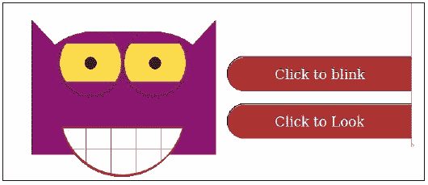
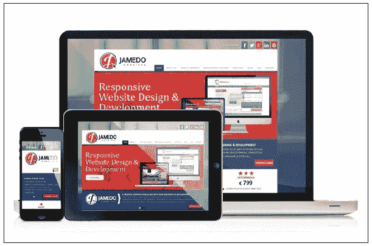

# 前言

在 1999 年 HTML 4.01 引入后，Web 发生了快速变化。许多新设备，如平板电脑和手机，应运而生。移动互联网变得更快、更便宜和更稳定。W3C 于 2007 年启动了 HTML5 工作组。2012 年 12 月，W3C 将 HTML5 指定为候选推荐标准。HTML5 与 CSS3 一起工作。如今，所有主要浏览器（Chrome、Safari、Firefox、Opera、IE）都支持 HTML5。

CSS3 的影响是巨大的。如今，CSS3 不仅用于为 HTML 文档设置样式，而且在设计的责任方面也扮演着重要的角色。最后但并非最不重要的是，CSS3 通过动画和过渡等功能扩展了 CSS。

我们不需要外部 Flash 组件来进行复杂的动画。看看[`www.hongkiat.com/blog/css3-animation-transition-demos/`](http://www.hongkiat.com/blog/css3-animation-transition-demos/)或查看以下截图中的有趣的猫头鹰：



在前面的截图中，猫头鹰仅使用 HTML5 和 CSS3 构建。通过按下按钮，实时版本可以眨眼和看。

响应式设计允许您使用只有一个代码库构建网站的一个版本，该版本在不同设备上（如手机、平板电脑和台式机）运行良好并且外观良好。不需要为不同的移动和台式机版本构建任何技术原因，如下图所示：



有了所有这些新东西，CSS（或 Web）开发人员的工作变得更加复杂。Web 开发人员需要了解复杂的 CSS3、浏览器和设备之间的差异、动画和其他样式效果。编写正确和功能性的 CSS 代码将是第一要务；使这些代码可读、可维护并在所有主要浏览器上运行将是第二要务。CSS 文件在开发和维护过程中会变得越来越混乱。CSS 没有修改现有值或重用常见样式的能力。此外，在 CSS 中无法进行数学运算或定义变量。这就是 Less 的用武之地。

**Less**（**Leaner CSS**）是由 Alexis Sellier 设计的动态样式表语言。它始于 2010 年，现在由 Less 核心团队维护和扩展。Less 帮助您使 CSS 代码可维护、可重用，并防止代码重复。

在本书中，您将学习如何编写、编译和理解 Less。我们将帮助您更快、更具成本效益地进行 Web 开发。您将获得将 Less 集成到当前和新项目中的实用技巧。阅读本书后，您将能够使用 Less 编写清晰和可读的 CSS3。与花费时间调试特定设备或浏览器的复杂 CSS 代码相比，您可以更多地关注真正的设计任务。

您的客户将对您的先进和稳定的设计感到满意。这将减少开发和维护时间，从而降低设计成本。

Less 通过函数和变量扩展了 CSS。从语义上讲，有效的 CSS 也是有效的 Less。最初的 Less 版本是用 Ruby 编写的；现在，Less 是用 JavaScript 编写的。

Less 被称为 CSS 预编译器。这意味着最终产品将用于生产。在这种情况下，最终产品将是有效的、紧凑的和可读的 CSS 代码。此外，预编译的 Less 代码也可以实时编译。Less 提供了服务器端和客户端选项来实现这一点。通过现代 Web 浏览器中的 LESS.js 进行实时客户端编译，可以轻松进行测试。服务器端编译还提供了使用 Less 构建应用程序以及创建动态 CSS 的机会。

此外，其他人也知道 Less 的强大。Twitter 的 Bootstrap 和 Roots 等项目都依赖于 Less。这些项目使用 Less 构建了清晰和可扩展的框架。您不能忽视这一证据。停止编写带有错误和浏览器缺陷的繁琐 CSS，并通过阅读本书了解 Less。

Less 是开源的，根据 Apache 许可证授权。在撰写本书时，最新版本是 1.7。Less 的源代码将在 GitHub 上维护。每个人都可以为其做出贡献。你可以免费使用 Less。

# 本书涵盖内容

第一章，“用 Less 改进 Web 开发”，展示了 CSS3 如何为网页设计师带来了高级功能，如渐变、过渡和动画。它还解释了 CSS 代码变得更加复杂和难以维护。Less 帮助你使你的 CSS 可维护、可重用，并防止代码重复。

第二章，“使用变量和混合”，解释了为什么变量允许你在一个地方指定广泛使用的值，然后在整个样式表中重复使用它们，从而使全局更改变得像改变一行代码一样容易。混合允许你将一个类的所有属性嵌入到另一个类中，只需将类名包含为其属性之一。本章还解释了参数化混合是什么以及如何使用它们。

第三章，“嵌套规则、操作和内置函数”，解释了使用嵌套规则来使继承清晰，并使样式表更短。本章还解释了如何创建属性之间的复杂关系以及如何使用 Less 的内置函数。

第四章，“避免重复造轮子”，教你 Less 代码和混合可以变得复杂，因为它们处理不同的浏览器和设备。本章还解释了预构建的混合和其他帮助你（重新）使用它们的来源。

第五章，“在你自己的项目中集成 Less”，教你如何为新项目组织文件，或者准备使用 Less 的项目。

第六章，“Bootstrap 3、WordPress 和其他应用”，解释了 Bootstrap 是什么，并展示了使用 Less 与 Bootstrap 的优势。本章还教你如何使用 Less 构建 Web 应用程序或将其集成到你的 WordPress 主题中。

# 你需要什么

为了理解并充分利用本书的内容，我们希望你之前已经用 CSS 构建过网站。需要基本的 CSS 理解。理解 CSS 选择器和 CSS 优先级将帮助你充分利用本书。我们还将在第一章中简要介绍这些 CSS 方面。理解在 JavaScript 等函数式语言中使用函数和参数的基础知识将是有价值的，但不是必需的。如果你对函数和参数一无所知，不要惊慌。本书包含清晰的示例。即使没有任何（函数式）编程知识，你也可以学会如何使用 Less，本书将帮助你做到这一点。最重要的技能将是学习的意愿。

本书的所有章节都包含示例和示例代码。运行和测试这些示例将帮助你发展你的 Less 技能。你需要一个现代的网络浏览器，如 Google Chrome 或 Mozilla Firefox 来运行这些示例。使用任何首选的文本或 CSS 编辑器来编写你的 Less 代码。

# 这本书是为谁准备的

每个与 CSS 一起工作并希望在真正的设计任务上花更多时间的网页设计师都应该阅读这本书。无论你是初学者网页设计师还是使用 CSS 多年的人，都将从阅读本书中受益，并学会如何利用 Less。我们还推荐这本书给现代网页设计和计算机科学的教师和学生。Less 不依赖于平台、语言或 CMS。如果你使用 CSS，你可以并且会从 Less 中受益。

# 约定

在本书中，您会发现许多不同类型信息的文本样式。以下是一些样式的示例，以及它们的含义解释。

文本中的代码词、数据库表名、文件夹名、文件名、文件扩展名、路径名、虚拟 URL 和用户输入显示如下：“请注意，在这种情况下，ID 是以`#`开头的唯一选择器；相同 HTML 元素的选择器`[id=]`算作属性。”

代码块设置如下：

```less
.box-shadow(@style, @c) when (iscolor(@c)) {
  -webkit-box-shadow: @style @c;
  -moz-box-shadow:    @style @c;
  box-shadow:         @style @c;
}
.box-shadow(@style, @alpha: 50%) when (isnumber(@alpha)) {
  .box-shadow(@style, rgba(0, 0, 0, @alpha));
}
```

当我们希望引起您对代码块的特定部分的注意时，相关的行或项目会以粗体显示：

```less
.box-shadow(@style, @c) when (iscolor(@c)) {
  -webkit-box-shadow: @style @c;
  -moz-box-shadow:    @style @c;
  box-shadow:         @style @c;
}
.box-shadow(@style, @alpha: 50%) when (isnumber(@alpha)) {
  .box-shadow(@style, rgba(0, 0, 0, @alpha));
}
```

任何命令行输入或输出都是这样写的：

```less
# lessc -c styles.less > styles.css

```

**新术语**和**重要单词**以粗体显示。您在屏幕上看到的单词，例如菜单或对话框中的单词，会以这种方式出现在文本中：“点击**下一步**按钮会将您移动到下一个屏幕。”

### 注意

警告或重要提示会出现在这样的框中。

### 提示

技巧和窍门会出现在这样的样式中。
