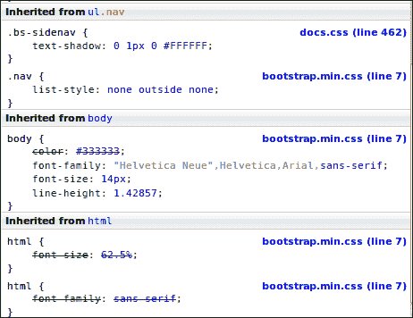
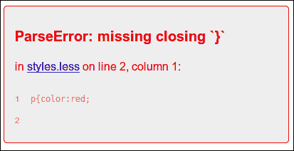
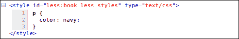
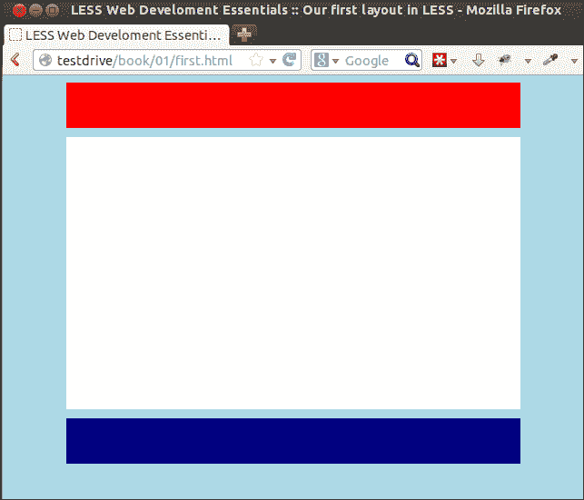
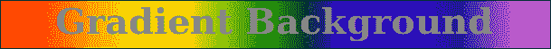
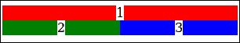
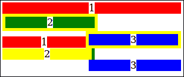
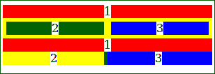

# 第一章：使用 Less 改进 Web 开发

在现代网页设计中，无法想象没有 CSS。有了 CSS3，网页设计师可以依赖于高级功能，如渐变、过渡和动画。另一方面，CSS 代码变得更加复杂和难以维护。*Less*是一种 CSS 预处理器，它使用现代编程语言的概念扩展了 CSS。Less 使您能够在编写 CSS 时使用变量、函数、操作，甚至规则或选择器嵌套。*Less*帮助您使用**不要重复自己**（**DRY**）原则编写 CSS。DRY 原则防止您在代码中重复任何信息。

本章将涵盖以下主题：

+   CSS3 介绍

+   将 Less 编译成 CSS

+   供应商特定规则

+   CSS3 圆角、动画和渐变

+   使用 box-sizing border-box

+   服务器端编译和使用 GUI

# 使用 CSS3 为您的 HTML 设置样式

在网页设计中，您将使用 HTML 来描述文档的结构，使用 CSS 语言来描述它们的呈现，包括字体、颜色和布局。当前标准的 HTML5 和 CSS3 版本适用于大多数现代浏览器和移动设备。CSS3 通过其他新的选择器、文本效果、背景渐变和动画扩展了旧的 CSS。CSS3 的强大功能、新功能以及在使用 HTML5 和 CSS3 的移动设备上的高接受度使它们成为现代网页设计的标准。HTML5 和 CSS3 的组合非常适合构建响应式网站，因为它们在手机（和其他设备）上的高接受度。

HTML5 和 CSS3 一起引入了许多新功能。在本书中，您将了解到学习它们概念时最重要的功能。

## 使用 CSS 选择器为您的 HTML 设置样式

使用*Less*（和 CSS），您可以使用**选择器**来为您的 HTML 代码设置样式。CSS 选择器是用于识别应该设置样式的网页 HTML 元素的模式或名称。CSS 选择器在编写*Less*代码时起着重要作用。

对于`body p.article {color:red}`，这里的选择器是`body p.article`。选择器不仅仅指一个元素。它们可以指向多个元素，不同的选择器可以指向同一个元素。例如，单个`p`选择器指的是所有的`p 元素`，包括具有`.article`类的`p 元素`。在冲突的情况下，**级联**和**特异性**决定应该应用哪些样式。在编写*Less*代码时，我们应该牢记上述规则。*Less*使得编写复杂的 CSS 变得更容易，而不会改变您的网站外观。它不会对最终的 CSS 引入任何限制。使用*Less*，您可以编辑结构良好的代码，而不是改变最终 CSS 的效果。

CSS3 引入了许多新的和方便的选择器。其中之一是`:nth-child(n)`，它使得在 HTML 文档中可以对每四个段落的`p`标签进行样式设置成为可能。这样的选择器为 CSS3 添加了强大的功能。现在我们能够仅使用 CSS 执行操作，而在过去我们需要 JavaScript 或硬编码样式（或至少需要类）。这也是学习*Less*的原因之一。强大的选择器将使 CSS 变得更加重要，但 CSS 代码也变得繁琐和难以维护。*Less*将在 CSS 中解决这个问题，甚至使复杂的代码变得灵活和易于维护。

### 注意

请访问[`developer.mozilla.org/en-US/docs/Web/CSS/Reference#Selectors`](https://developer.mozilla.org/en-US/docs/Web/CSS/Reference#Selectors)获取完整的 CSS 选择器列表。

## CSS 中的特异性、继承和级联

在大多数情况下，许多 CSS 样式可以应用于同一个 HTML 元素，但只有一个样式会获胜。*W3C 规范*描述了哪些 CSS 样式具有最高优先级并最终将被应用。您可以在以下部分找到这些规范。

关于重要性顺序的规则在 CSS3 中并没有发生重大变化。它们被简要提及，以帮助你理解*Less*/CSS 中一些常见的陷阱以及如何解决它们。迟早，你会遇到这样的情况，你试图将 CSS 样式应用到一个元素，但它的效果却看不见。你会重新加载，拔头发，一遍又一遍地检查拼写错误，但什么都不会有用。这是因为在大多数情况下，你的样式将被另一个具有更高优先级的样式所覆盖。

CSS 中级联的全局规则如下：

+   找到适用于所讨论的元素和属性的所有 CSS 声明。

+   **内联样式**具有最高的特异性，除了`!important`。CSS 中的`!important`语句是一个用于增加声明权重的关键字。`!important`语句添加在 CSS 属性值的末尾。之后，检查是谁设置了声明；作者设置的样式比用户或浏览器（默认）定义的样式具有更高的特异性。默认意味着样式是由 Web 浏览器设置的，作者样式是由网页中的 CSS 定义的，用户样式是由用户通过其 Web 浏览器的设置设置的。用户的重要性高于默认值，而带有`!important`语句的代码（参见第二章，*使用变量和混合*中的*Less*含义）将始终具有最高的特异性。请注意，像 Firefox 这样的浏览器有选项来禁用页面以使用其他替代的用户定义字体。在这里，用户设置将覆盖网页的 CSS。这种覆盖页面设置的方式不是 CSS 优先级的一部分，除非它们使用`!important`设置。

+   计算特异性，这将在下一节中讨论。

+   如果两个或更多规则具有相同的优先级和特异性，则最后声明的规则获胜。

作为*Less*/CSS 设计师，你在大多数情况下将使用计算的 CSS 特异性。

### CSS 特异性的工作原理

每个 CSS 声明都有一个特异性，这将根据声明的类型和选择器的使用来计算。内联样式将始终具有最高的特异性，并且将始终被应用（除非被前两个级联规则覆盖）。在实践中，你不应该在许多情况下使用内联样式，因为它会违反 DRY 原则。它还会阻止你在一个集中的位置上更改样式，并阻止你使用*Less*进行样式设置。

内联样式声明的一个示例如下所示：

```less
<p style="color:#0000ff;">
```

之后，选择器中 ID 的数量将是计算特异性的下一个指标。`#footer #leftcolumn {}`选择器有 2 个 ID，`#footer {}`选择器有 1 个 ID，依此类推。

### 提示

请注意，在这种情况下，ID 是以`#`开头的唯一选择器；相同 HTML 元素的选择器`[id=]`计为一个**属性**。这意味着`div.#unique {}`有 1 个 ID，而`div[id="unique"] {}`有 0 个 ID 和 1 个属性。

如果两个声明的 ID 数量相等，则选择器中**类**、**伪类**和**属性**的数量将很重要。类以点开头。例如，`.row`是一个类。伪类，比如`:hover`和`:after`，以冒号开头，而属性，当然，是`href`、`alt`、`id`等。

`#footer a.alert:hover {}`选择器得分为 2（1 个类和 1 个伪类），而`#footer div.right a.alert:hover {}`选择器得分为 3（2 个类和 1 个伪类）。

如果这两个声明的值相等，我们可以开始计算**元素**和**伪元素**。最新的变量将使用双冒号（`::`）定义。伪元素允许作者引用其他无法访问的信息，比如`::first-letter`。下面的例子展示了它是如何工作的。

`#footer div a{}`选择器得分为 2（2 个元素），而`#footer div p a {}`选择器得分为 3（3 个元素）。

当你的样式没有直接应用时，你现在应该知道该怎么做了。在大多数情况下，使你的选择器更具体以使你的样式应用。例如，如果`#header p{}`不起作用，那么你可以尝试添加`#header #subheader p{}` ID，一个`#header p.head{}`类，等等。

当级联和`!important`规则无法给出明确的答案时，特异性计算似乎是一项困难且耗时的工作。虽然*Less*在这里无法帮助你，但诸如 Firebug（和其他开发者工具）之类的工具可以使特异性可见。下面是使用 Firebug 的一个示例，其中具有最高特异性的选择器显示在屏幕顶部，被覆盖的样式被划掉：



Firebug 中特异性的示例

## 使用灵活盒子构建你的布局

**Flexbox 布局**（也称为灵活盒子）是 CSS3 的一个新特性。它在创建响应式和灵活的布局方面非常有用。Flexbox 提供了根据不同屏幕分辨率动态更改布局的能力。它不使用浮动，并包含不会与其内容折叠的边距。不幸的是，目前主要浏览器对 Flexbox 布局的支持并不完整。我们关注 Flexbox 是因为它的强大，而且作为 CSS 的一个重要特性，我们也可以使用*Less*来生成和维护它。你可以在[`gist.github.com/bassjobsen/8068034`](https://gist.github.com/bassjobsen/8068034)上访问一组用于 CSS3 Flexbox 的*Less* mixin。你可以使用这些 mixin 来使用*Less*创建 Flexbox 布局，而不使用重复的代码。

这些 mixin 现在不会被详细解释，但以下示例显示了*Less*如何减少创建 flex 容器所需的代码。使用 CSS，你可能会使用以下代码：

```less
div#wrapper {
  display: -webkit-flex;
  display: -moz-flex;
  display: -ms-flexbox;
  display: -ms-flex;
  display: flex;
}
```

### 提示

**下载示例代码**

你可以从你在[`www.packtpub.com/`](http://www.packtpub.com/)的帐户中下载你购买的所有 Packt 图书的示例代码文件。如果你在其他地方购买了这本书，你可以访问[`www.packtpub.com/support/`](http://www.packtpub.com/support/)并注册，以便直接通过电子邮件接收文件。

然而，如果你使用*Less*，可以通过插入以下代码行来产生相同的效果：

```less
div#wrapper { .flex-display; }
```

你可以使用 Google Chrome 来测试你的 Flexbox 布局。在撰写本书时，Firefox 和 Internet Explorer IE11 也提供了对 Flexbox 布局的全面或更好的支持。之所以提到 Flexbox，是因为它们有潜力在未来的网页设计中扮演重要角色。目前，它们超出了本书的范围。本书将重点介绍如何使用*Less*、CSS 媒体查询和网格来创建响应式和灵活的布局。

### 注意

请访问[`developer.mozilla.org/en-US/docs/Web/Guide/CSS/Flexible_boxes`](https://developer.mozilla.org/en-US/docs/Web/Guide/CSS/Flexible_boxes)获取更多信息、示例和浏览器兼容性。

# 编译 Less

在深入研究 CSS 理论之后，你最终可以开始使用*Less*。如前所述，它与 CSS 具有相同的语法。这意味着任何 CSS 代码实际上也是有效的*Less*代码。使用*Less*，你可以生成可以用于样式化你的网站的 CSS 代码。从*Less*制作 CSS 的过程称为**编译**，你可以通过**服务器端**或**客户端**编译*Less*代码。本书中给出的示例将使用客户端编译。在这里，客户端指的是在浏览器中加载代码，并使用本地机器的资源将*Less*代码编译成 CSS 代码。本书使用客户端编译，因为这是最容易入门的方式，同时也足够好用于开发你的*Less*技能。

### 提示

需要注意的是，客户端编译的结果仅用于演示目的。对于生产环境，特别是在考虑应用程序性能时，建议使用服务器端的**预编译**。*Less*捆绑了一个基于**Node.js**的编译器，还有许多其他的 GUI 可用于预编译你的代码。这些 GUI 将在本章末讨论。

## 开始使用 Less

最后，你可以开始使用*Less*了。你需要做的第一件事是从[`www.lesscss.org/`](http://www.lesscss.org/)下载*Less*。在本书中，将使用版本 1.6 的`less.js`。下载后，应该创建一个 HTML5 文档。它应该包括`less.js`和你的第一个*Less*文件。

请注意，你可以从[www.packtpub.com](http://www.packtpub.com)上本书的可下载文件中下载示例，包括`less.js`的副本。

首先，看一下这个简单但结构良好的 HTML5 文件：

```less
<!doctype html>
<html lang="en">
<head>
  <meta charset="utf-8">

  <title>Example code</title>
  <meta name="description" content="Example code">
  <meta name="author" content="Bass Jobsen">

  <link rel="stylesheet/less" type="text/css" href="less/styles.less" />
   <script src="img/less.js" type="text/javascript"></script>
</head>

<body>
<h1>Less makes me Happy!</h1>
</body>
</html>
```

你可以看到，使用以下代码将*Less*文件添加到了这个文档中：

```less
<link rel="stylesheet/less" type="text/css" href="less/styles.less" />
```

当使用`rel="stylesheet/less"`时，代码将与样式表相同。在*Less*文件之后，你可以使用以下代码调用`less.js`：

```less
<script src="img/less.js" type="text/javascript"></script>
```

事实上，这就是你开始的全部内容！

为了保持清晰，暂时忽略了`html5shiv`（可以在[`code.google.com/p/html5shiv/`](http://code.google.com/p/html5shiv/)访问）和**Modernizr**（可以在[`modernizr.com/`](http://modernizr.com/)访问）。这些脚本为旧版浏览器如 IE7 和 IE8 添加了对新的 CSS3 和 HTML5 特性的支持和检测。预计你将使用现代浏览器，如 Mozilla Firefox，Google Chrome，或 IE8 之后的任何版本。这些浏览器将完全支持 HTML5、CSS3 和**媒体查询**，这在阅读本书和做练习时是需要的。

### 提示

你已经知道在大多数情况下只能在开发和测试中使用`less.js`；仍然有一些情况可以在生产中使用`less.js`的客户端。为了支持旧版浏览器的`less.js`，你可以尝试使用 es5-shim（[`github.com/es-shims/es5-shim/`](https://github.com/es-shims/es5-shim/)）。

现在，在浏览器中打开`http://localhost/index.html`。你会看到**Less makes me Happy!**标题文字以默认的字体和颜色显示。之后，你应该在你喜欢的文本编辑器中打开`less/styles.less`。*Less*和 CSS 的语法在这里没有区别，所以你可以在这个文件中输入以下代码：

```less
h1{color:red;}
```

接着，重新加载你的浏览器。你应该会看到标题文字变成了红色。

从上面的代码中，`h1`是选择器，用于选择你的 HTML 中的`H1`属性。`color`属性已经在大括号中设置为`red`。这些属性将被应用到你的选择器上，就像 CSS 一样。

### 提示

不需要运行一个 web 服务器。在浏览器中导航到你的硬盘上的`index.html`就足够了。不幸的是，这对所有浏览器都不起作用，所以最好使用 Mozilla Firefox。本书中的示例使用的是`http://localhost/map/`，但根据你的情况，可以替换为类似于`file:///map/`或`c:\map\`的内容。

## 使用自动重新加载的观察功能

`less.js`文件有一个**watch**功能，它会检查你的文件是否有更改，并在发现更改时重新加载你的浏览器视图。使用起来非常简单。执行以下步骤：

1.  在你想要打开的 URL 后面添加`#!watch`。

1.  在`index.html`后面添加`#!watch`，然后重新加载浏览器窗口。

1.  所以，在浏览器中打开`http://localhost/index.html#!watch`，开始编辑你的*Less*文件。你的浏览器将在不需要重新加载的情况下反映你的更改。

1.  现在在你的文本编辑器中打开`less/styles.less`。在这个文件中，写入`#h1{color:red;}`然后保存文件。

1.  现在你应该导航到你的浏览器，应该会看到**Less makes me Happy!**以红色显示。

1.  重新排列你的屏幕，以便在同一个窗口中同时看到文本编辑器和浏览器。

1.  此外，如果你在`less/styles.less`中将`red`改为`blue`，你会发现浏览器跟踪这些更改，并在文件保存后以蓝色显示**Less makes me Happy!**。

相当酷，不是吗？

### 提示

本代码示例中使用颜色名称而不是十六进制值。例如，代码使用`red`而不是`#ff0000`。基本颜色名称由 less.js 转换为它们的十六进制值，并写入 CSS 中。在本书中，始终使用命名颜色。

## 调试你的代码

由于我们只是人类，我们容易犯错或打字错误。能够看到你的错误并调试你的代码是很重要的。如果你的*Less*文件包含错误，它根本无法编译。因此，一个小小的打字错误会破坏整个文档的样式。

使用`less.js`也很容易进行调试。要使用调试或允许`less.js`显示错误，可以将以下代码添加到你的`index.html`中：

```less
  <link rel="stylesheet/less" type="text/css" href="less/styles.less" />
  <script type="text/javascript">less = { env: 'development' };</script>
  <script src="img/less.js" type="text/javascript"></script>
```

如你所见，带有`less = { env: 'development' };`的这一行是新的。这一行包含`less`作为`less.js`使用的 JavaScript 变量。实际上，这是一个全局*Less*对象，用于将一些设置解析给`less.js`。本书中将使用的唯一设置是`env: 'development'`。有关更多设置，请查看以下网站：[`lesscss.org/#client-side-usage-browser-options`](http://lesscss.org/#client-side-usage-browser-options)。

### 提示

`env: 'development'`还可以防止*Less*缓存。Less 不会在浏览器缓存中缓存文件。相反，文件会被缓存在浏览器的本地存储中。如果`env`设置为`production`，这种缓存可能会产生意想不到的结果，因为更改和保存的文件不会被编译。

要尝试这个新设置，再次编辑`less/styles.less`并删除一个大括号，以创建`h1{color:red`形式的无效语法，然后保存文件。

在你的浏览器中，你将看到一个如下截图的页面：



Less 解析错误示例

除了**语法错误**之外，还会显示**名称错误**。在名称错误的情况下，可能会使用未声明的函数或变量。

可以在全局*Less*对象中设置其他调试设置，也可以将设置附加到 URL 中。例如，你可以通过将以下代码添加到你的 HTML 文件中来指定`dumpLineNumbers`设置：

```less
<script type="text/javascript">less = { env: 'development',dumpLineNumbers: "mediaQuery"
 };</script>
```

或者，你可以在 URL 中添加`!dumpLineNumbers:mediaQuery`。这个设置可以让其他工具在*Less*源文件中找到错误的行号。将此选项设置为`mediaQuery`可以使 FireBug 或 Chrome 开发工具可用于错误报告。类似地，将其设置为`comments`可以使 FireLess 等工具实现相同的功能。例如，使用 FireLess 可以使 Firebug 显示*Less*原始文件名和*Less*生成的 CSS 样式的行号。

FireBug、Chrome 开发工具或默认浏览器检查元素功能（可以通过右键单击浏览器屏幕访问）也可以用来查看和评估编译后的 CSS。CSS 显示为内联 CSS，包裹在`<style type="text/css" id="less:book-less-styles">`标签中。在以下截图中给出的示例中，你将看到一个 ID，其值为`less:book-less-styles`。这个 ID 的值是根据`book/less/styles.less` *Less*文件的路径和名称自动生成的：



Less 生成的 CSS 样式

### 本书中使用的示例代码

在本书中，你会找到许多代码示例。除非另有说明，这些示例的格式总是先显示*Less*代码，然后是编译后的 CSS 代码。例如，你可以在*Less*中编写以下代码行：

```less
mixin() {
color: green;
}
p {
.mixin();
}
```

此代码将被编译为以下 CSS 语法：

```less
p {
color: green;
}
```

# Less 中的第一个布局

您必须首先在浏览器中打开`first.html`（从本书的可下载文件中）然后在文本编辑器中打开`less/first.less`。在浏览器中，您将看到一个页眉、正文和页脚的表示。

正如预期的那样，`less/first.less`包含了*Less*代码，将由`less.js`编译器转换为有效的 CSS。此文件中的任何错误都将停止编译器并抛出错误。尽管*Less*代码与普通 CSS 代码显示出一些相似之处，但这里描述的过程与直接编辑 CSS 完全不同。

以下截图显示了在 Web 浏览器中打开时此布局的外观：



Less 中的第一个布局

## 供应商特定规则

CSS3 引入了**供应商特定规则**，为您提供了编写一些仅适用于一个浏览器的附加 CSS 的可能性。乍一看，这似乎与您的期望恰恰相反。您想要的是一套标准和实用性，适用于每个浏览器的相同效果和解释的标准 HTML 和 CSS 集。供应商特定规则旨在帮助我们实现这一乌托邦。供应商特定规则还为我们提供了标准属性和替代语法的早期实现。最后但并非最不重要的是，这些规则允许浏览器实现专有的**CSS 属性**，否则这些属性将没有工作标准（并且可能永远不会成为标准）。

出于这些原因，供应商特定规则在 CSS3 的许多新功能中起着重要作用。例如，**动画属性**、**border-radius**和**box-shadow**都依赖于供应商特定规则。

供应商使用以下前缀：

+   **WebKit**: `-webkit`

+   **Firefox**: `-moz`

+   **Opera**: `-o`

+   **Internet Explorer**: `-ms`

## 使用 border-radius 构建圆角

边框半径是一个新的 CSS3 属性，它将使许多网页开发人员感到高兴。使用 border-radius，您可以给 HTML 元素设置圆角。在以前的几年中，已经看到了许多使用图像和透明度来实现圆角的实现。然而，这些方法不够灵活，难以维护。

实施需要供应商特定规则，尽管圆角不能用一行代码处理，但它的使用确实使圆角处理变得更加容易。

要给一个元素设置 10 像素半径的圆角，您可以使用带有供应商特定规则的 CSS 代码，如下所示：

```less
-webkit-border-radius: 10px;
-moz-border-radius: 10px;
border-radius: 10px;
```

对于具有不同半径的圆角，使用一个由空格分隔的值列表：`10 px 5px 20px 15px;`。半径的顺序是：左上，右上，右下和左下。牢记这些规则，您将看到*Less*如何保持您的代码整洁。

您可以在浏览器中打开本章下载部分的`roundedcorners.html`，并在文本编辑器中打开`less/roundedcorners.less`。在浏览器中，您将看到一个具有圆角的页眉、正文和页脚的表示。

`less/roundedcorners.less`中页眉的 CSS 如下所示：

```less
#header{
background-color: red;
-webkit-border-radius: 10px;
-moz-border-radius: 10px;
border-radius: 10px;
}
```

您可以看到使用供应商特定规则，圆角已经创建为 10 像素的半径。如果您使用 CSS，您将不得不为页眉、页脚和正文重复供应商特定规则三次。为了更改这些规则或添加供应商，您还必须三次更改相同的代码。起初，您可能会想，“为什么不将选择器分组？”，类似于以下代码的方式：

```less
#header, #content, #footer{
-webkit-border-radius: 10px;
-moz-border-radius: 10;
border-radius: 10px;
}
```

前面的代码在编写 CSS 或*Less*代码时在语法上是正确的，但随着代码库的增长，维护起来并不容易。基于属性对选择器进行分组在阅读和维护代码时是没有意义的。这样的结构也会引入许多重复和无结构的相同选择器的用法。

使用*Less*，你可以高效地解决这些问题。通过创建所谓的**混合**，你可以解决前面提到的问题。对于边框半径，你可以使用以下代码：

```less
.roundedcornersmixin()
{
-webkit-border-radius: 10px;
-moz-border-radius: 10px;
border-radius: 10px;
}
```

要使用这个混合，你将使用以下代码将其作为选择器的属性调用：

```less
#header{
background-color: red;
.roundedcornersmixin();
}
```

这个*Less*代码的编译 CSS 现在将如下所示：

```less
#header{
background-color: red;
-webkit-border-radius: 10px;
-moz-border-radius: 10px;
border-radius: 10px;
}
```

观察`less/roundedcorners.less`文件中的原始代码，你会发现前面的代码无法适用于`#content`。内容的边框半径是 20 像素，而不是用于页眉和页脚的 10 像素。再次，*Less*帮助我们高效地解决了这个问题。混合可以像在函数式编程中调用函数一样带参数调用。这意味着结合值和对该值的引用，可以调用混合以设置属性。在这个例子中，这将改变为以下代码：

```less
.roundedcornersmixin(@radius: 10px){
-webkit-border-radius: @radius;
-moz-border-radius: @radius;
border-radius: @radius;
}
```

在`.roundedcornersmixin(@radius: 10px)`混合中，`@radius`是我们的参数，其默认值将是`10px`。

从这个点开始，你可以在你的代码中使用混合。`.roundedcornersmixin(50px);`语句将设置半径为 50 像素的角，而`.roundedcornersmixin();`语句将使用默认值 10 像素进行相同的操作。

使用这个，你可以重写`less/roundedcorners.less`，使其变成以下代码：

```less
/* mixins */
.roundedcornersmixin(@radius: 10px){
-webkit-border-radius: @radius;
-moz-border-radius: @radius;
border-radius: @radius;
}
#header{
background-color: red;
.roundedcornersmixin();
}
#content{
background-color: white;
min-height: 300px;
.roundedcornersmixin(20px);
}
#footer{
background-color: navy;
.roundedcornersmixin();
}
```

### 提示

下载部分的`less/roundedcornersmixins.less`文件包含了这段代码的副本。要使用这个，你还必须在 HTML 文件中将引用更改为`<link rel="stylesheet/less" type="text/css" href="less/groundedcornersmixins.less" />`。

请注意，这段代码省略了 HTML 中`div`和`body`标签的一般样式。这些样式只是用来使演示看起来好看，并没有真正有用地展示*Less*。

重写*Less*代码后，重新加载浏览器或观察它是否应用了`#!watch`技巧。你会发现输出结果完全相同。这向你展示了如何使用*Less*以更高效的结构化代码获得相同的结果。

# 使用 CSS 重置来防止跨浏览器问题

在谈论 CSS 中的**层叠**时，无疑会提到浏览器默认设置比作者首选样式具有更高的优先级。在编写*Less*代码时，你将覆盖浏览器的默认样式。换句话说，任何你没有定义的东西都将被分配一个默认样式，这是由浏览器定义的。这种行为在许多跨浏览器问题中起着重要作用。为了防止这些问题，你可以执行**CSS 重置**。最著名的浏览器重置是 Eric Meyer 的 CSS 重置（可在[`meyerweb.com/eric/tools/css/reset/`](http://meyerweb.com/eric/tools/css/reset/)访问）。

CSS 重置会覆盖浏览器的默认样式规则，并为样式创建一个起点。这个起点在所有（或大多数）浏览器上看起来和行为都是一样的。在本书中，使用的是 normalize.css v2。Normalize.css 是 CSS 重置的现代、HTML5-ready 替代方案，可以从[`necolas.github.io/normalize.css/`](http://necolas.github.io/normalize.css/)下载。它让浏览器更一致地渲染所有元素，并使它们符合现代标准。

要使用 CSS 重置，您可以使用*Less*的`@import`指令。使用`@import`，您可以在主*Less*文件中包含其他*Less*文件。语法是`@import "{filename}";`。默认情况下，指令的搜索路径从主文件的目录开始。虽然可以设置替代搜索路径（通过设置*Less*环境的路径变量），但本书中不会使用。

本书中的示例*Less*文件将在代码的前几行包含`@import "normalize.less";`。再次强调，您应该特别注意这种解决方案的利润！

如果要更改或更新 CSS 重置，您只需替换一个文件。如果您必须管理或构建多个项目，那么您应该这样做，那么您可以简单地重用完整的重置代码。

## 创建背景渐变

CSS3 中的一个新功能是在元素的背景颜色中添加**渐变**的可能性。这可以替代复杂的代码和图像回退。

可以定义不同类型的渐变并使用两种或两种以上颜色。在下图中，您将看到不同颜色的背景渐变：



渐变示例（来自[W3schools.com](http://W3schools.com)）

在下一个示例中，您可以使用两种颜色的线性渐变。背景渐变使用供应商特定的规则。

您可以利用圆角示例中的示例代码来添加渐变。

第一步是复制或打开`less/gradient.less`，并在该文件开头添加一个新的 mixin，如下面的代码所示：

```less
/* Mixin */
.gradient (@start: black, @stop: white,@origin: left) {
    background-color: @start;
    background-image: -webkit-linear-gradient(@origin, @start, @stop);
     background-image: -moz-linear-gradient(@origin, @start, @stop);
    background-image: -o-linear-gradient(@origin, @start, @stop);
    background-image: -ms-linear-gradient(@origin, @start, @stop);
    background-image: linear-gradient(@origin, @start, @stop);
}
```

这将从左侧（`@origin`）到右侧创建渐变，颜色从`@start`到`@stop`。这个 mixin 有默认值。

IE9（及其早期版本）不支持渐变。可以通过添加`background-color: @start;`来添加回退，这将为旧版浏览器创建统一的彩色背景。

在将 mixin 添加到您的代码后，您可以按照以下代码为我们的`#header`，`#body`和`#footer`选择器调用它：

```less
#header{
background-color: red;
.roundedcornersmixin();
.gradient(red,lightred);
}
#content{
background-color: white;
min-height: 300px;
.roundedcornersmixin(20px);
.gradient();
}
#footer{
background-color: navy;
.roundedcornersmixin(20px);
.gradient(navy,lightblue);
}
```

例如，如果您将*Less*文件重命名为`less/gradient.less`，您还必须更改 HTML 文件中的引用为以下代码：

```less
<link rel="stylesheet/less" type="text/css" href="less/gradient.less" />
```

如果您现在在浏览器中加载 HTML 文件，您的结果应该如下截图所示：


来自示例代码的标题，内容和页脚中的渐变

# CSS 过渡，变换和动画

CSS3 中的另一个新功能是过渡，变换和动画的存在。这些功能可以替代现有或新网页中的动画图像，Flash 动画和 JavaScript。过渡，变换和动画之间的区别并不是微不足道的。**动画**是由一系列`@keyframes`构建的，其中每个`@keyframes`处理元素在时间上的不同状态。**过渡**也描述了元素在开始和结束之间的状态。过渡大多是由 CSS 更改触发的，例如鼠标悬停在元素上。

为了搞清楚事情，重要的是要记住即将按下的按钮。按钮将有两种状态：按下和未按下。没有过渡和动画，我们只能对这些状态进行样式设置。按钮的颜色是白色，当您将鼠标悬停在其上时，其颜色变为红色。（在 CSS 术语中，通过添加`:hover`伪类，其状态变为悬停。）在这种情况下，过渡描述了悬停按钮如何变为红色。例如，从白色到红色的颜色变化在两秒内（使其在一半时变为粉红色）表明颜色变化的开始是缓慢的，并随着时间的推移变化更快。在这里使用动画使我们能够描述按钮在开始和结束之间的每个时间间隔的状态。例如，您不必将颜色从白色变为红色，而是变化涵盖了所有状态，从白色、蓝色、绿色，最终到红色。

**转换**改变元素的位置和外观。它们不依赖于元素的状态。一些可能的转换是**缩放**、**平移**（移动）和**旋转**。

在实践中，我们在大多数情况下都会使用动画、转换和/或过渡的组合。同样，在这种情况下，特定于供应商的规则将发挥重要作用。

现在，我们的示例将添加一个转换。

使用带有圆角和渐变的示例代码，将以下代码复制到`less/transition.less`，或者打开`less/transition.less`并将以下代码添加到文件的开头：

```less
/* Mixin */
.transition (@prop: all, @time: 1s, @ease: linear) {
-webkit-transition: @prop @time @ease;
-moz-transition: @prop @time @ease;
-o-transition: @prop @time @ease;
-ms-transition: @prop @time @ease;
transition: @prop @time @ease;
}
```

这个**mixin**有三个变量；第一个是您将要更改的**属性**(`@prop`)。这可以是`height`、`background-color`、`visibility`等。默认值`all`不应在生产代码中使用，因为这会对性能产生负面影响。`@time`设置以毫秒或秒为单位的持续时间，并在其后附加`s`。最后一个变量`@ease`设置**transition-timing-function 属性**。此函数描述了属性的值，假设其某个百分比已经完成。transition-timing-function 属性描述了过渡的完成度随时间的函数。将其设置为`linear`会显示从开始到结束相同速度的效果，而`ease`会以较慢的速度开始和结束，并在中间速度更快。预定义的函数有`ease`、`linear`、`ease-in`、`ease-out`、`ease-in-out`、`step-start`和`step-end`。

现在，您可以编辑`less/transition.less`以使用此**mixin**。当您悬停在页面上时，您可以设置 body 的背景颜色。请注意，您不需要使用过渡来更改渐变颜色，而是更改`background-color`属性。您使用`background-color`是因为`transition-duration`对渐变没有可见效果。`background-color`过渡的代码如下：

```less
#content{
background-color: white;
min-height: 300px;
.roundedcornersmixin(20px);
.transition(background-color,5s);
}
#content:hover{
background-color: red;
}
```

如果您将*Less*文件重命名为`less/transition.less`，您还必须更改 HTML 文件中的引用为以下代码：

```less
 <link rel="stylesheet/less" type="text/css" href="less/transition.less" />
```

如果您在浏览器中加载 HTML 文件，您将能够在浏览器中看到结果。将鼠标悬停在内容上，您将看到它在 5 秒内从白色变为红色。

最后，可以添加一个旋转标题的第二个示例。在这个示例中，您将使用`@keyframes`。使用`@keyframes`会比较复杂。因此，在这种情况下，您可以定义一些特定于供应商的规则，并将这些动画属性添加到`#header:`如下：

```less
@-moz-keyframes spin { 100% { -moz-transform: rotate(360deg); } }
@-webkit-keyframes spin { 100% { -webkit-transform: rotate(360deg); } }
@keyframes spin { 100% { -webkit-transform: rotate(360deg); transform:rotate(360deg); } }
#header{
    -webkit-animation:spin 4s linear infinite;
    -moz-animation:spin 4s linear infinite;
    animation:spin 4s linear infinite;
}
```

您可以将上述代码添加到我们的示例文件中，或者打开`less/keyframes.less`。

如果您将*Less*文件重命名为`less/keyframes.less`，您还必须更改 HTML 文件中的引用为以下代码：

```less
 <link rel="stylesheet/less" type="text/css" href="less/keyframes.less" />
```

现在，在浏览器中加载 HTML 文件并观看您的结果。很神奇，不是吗？通过一点创造性思维，您将看到只使用 CSS3 就可以创建旋转的风车或眨眼的猫头鹰的可能性。然而，首先应该更详细地解释这里使用的代码。如前所述，在许多情况下，您会组合**动画**和**转换**。在这个例子中，您还可以对转换效果进行动画处理。要理解发生了什么，代码可以分为三个部分。

第一部分是`@keyframes`，如下面的代码所示，它描述了 CSS 属性（在这种情况下是转换）的值作为**动画**完成百分比的函数：

```less
@keyframes spin { 100% { -webkit-transform: rotate(360deg); transform:rotate(360deg); } }
```

这些**关键帧**被赋予了名称引用`spin`，这不是一个特殊效果，而只是一个选择的名称。在前面的例子中，描述了 100%完成的状态。在这种状态下，动画元素应该旋转 360 度。

这个旋转是需要我们关注的第二部分。**转换**描述了元素在空间中的位置或尺寸。在这个例子中，位置由围绕轴的旋转度数描述，100%时为 360 度，50%时为 180 度，25%时为 90 度，依此类推。

第三部分是动画本身，由`animation:spin 4s linear infinite;`描述。这是动画属性的子属性的设置的简写表示法。实际上，您可以将其写成以下代码，不包括供应商特定的规则：

```less
animation-name: spin;
animation-duration: 4s;
animation-timing-function:linear;
animation-iteration-count:  infinite;
```

您可以使用这三个部分来构建完整的动画。完成后，您可以扩展它。例如，添加一个额外的关键帧，使时间曲线非线性，如下所示：

```less
@keyframes spin {
50% { transform: rotate(10deg);}
100% {transform: rotate(360deg); }
 }
```

您可以使用`background-color`添加第二个属性。不要忘记删除渐变以查看其效果。如下面的代码所示：

```less
@-moz-keyframes spin {
50% { transform: rotate(10deg); background-color:green;}
100% { transform: rotate(360deg); }
 }
//.gradient(red,yellow);
```

您可能已经注意到，在这里并没有完全实现使用*Less*的利润。由于其可变动画名称，您将不得不重复编写`@keyframes`定义。在第四章中，*避免重复造轮子*，将为您提供一个解决方案。

不幸的是，浏览器对过渡、转换和动画的支持并不理想，并且在各个浏览器之间存在差异。谷歌 Chrome 不支持 CSS 3D 转换，火狐缺乏对 CSS 滤镜的支持，IE9（以及更早的版本）根本不支持它们。为了解决这个问题，许多开发人员寻求 jQuery 来支持他们的动画。`jQuery.animate()`函数允许我们使用 JavaScript 更改元素的 CSS 属性。您仍然可以使用*Less*来设置初始 CSS。一个替代方案是使用`animate.css`（您可以在[`github.com/daneden/animate.css`](https://github.com/daneden/animate.css)上访问）；这个跨浏览器的 CSS 动画库可以转换为*Less*代码，并带有 jQuery 回退。

# 盒模型

**box-sizing**属性是设置用于计算元素尺寸的 CSS 框模型的属性。实际上，box-sizing 在 CSS 中并不新鲜，但是将代码切换到`box-sizing: border-box`将使您的工作变得更加容易。使用`border-box`设置时，元素宽度的计算包括边框宽度和填充。因此，更改边框或填充不会破坏您的布局。您可以在下载文件中的`boxsizing.html`中找到本节中使用的代码的副本。

如今，大多数网页设计都使用网格。网格将设计分成相等大小的列。这有助于使事情清晰，并构建响应式界面。根据可用的屏幕尺寸（或宽度），您可以以相同列的不同表示形式显示内容和导航。

为了处理不同的屏幕尺寸，网站的某些部分将具有流体宽度或高度。其他元素，如边框、装订线和空白处，应具有固定宽度。流体宽度作为屏幕宽度（或视口）的百分比与固定宽度的组合变得复杂。这种复杂性是因为浏览器对元素的填充和边距使用不同的计算。

为了让您看到这一点，请看以下示例。已创建了一个宽度为 500 像素的容器。在这个容器内，您可以添加两行，并将第二行分成两部分，宽度为 50%（或一半）。

```less
<div class="wrapper" style="width:300px;">
  <div style="background-color:red;width;100%;">1</div>
  <div style="background-color:green;width:50%;float:left;">2</div>
  <div style="background-color:blue;width:50%;float:right;">3</div>
</div>
```

现在看起来应该像以下的截图：



一个 HTML 包装器

当前的结构直到您添加一些填充时并不会出现问题，这些填充用于在第二行的两列之间构建一些空间或边框（在 HTML 包装器图像中的数字*2*和*3*）。填充和边框将破坏我们的布局，如下所示：

```less
<div class="wrapper" style="width:300px;">
<div style="background-color:red;width:100%;">1</div>
<div style="background-color:green;width:50%;float:left;border:5px solid yellow;">2</div>
<div style="background-color:blue;width:50%;border:5px solid yellow;float:right;">3</div>
</div>
<br>
<div class="wrapper" style="width:300px;">
<div style="background-color:red;width;100%;">1</div>
<div style="background-color:green;float:left;width:50%;padding-right:5px;"><div style="background-color:yellow;">2</div></div>
<div style="background-color:blue;width:50%;padding-right:5px;float:right;">3</div>
</div>
```

最后，这段代码的输出应该看起来像以下的截图：



由于填充和边框而导致的破碎布局

可以执行类似的操作，只是包装器可以包装在额外的包装器内。然后，`box-sizing: border-box;`声明可以应用于此。现在，结果应该看起来像以下的截图：



使用 box-sizing: border-box 的布局

如您所见，填充和边框被父元素减去了 50%。这将使计算变得更容易。当然，一旦父容器包装器具有固定宽度，您可以自行进行计算。如果父元素有 300 像素，那么这个 50%将是 150 像素。减去填充和边框的宽度将给出列的固定大小。当父元素具有流体宽度（视口的百分比）时，这种方法不起作用。流体布局随着屏幕宽度的变化而变化。如果您的屏幕变小，那么所有元素也会变小，百分比保持不变。通过为所有可能的屏幕尺寸进行计算，找到允许所有元素对齐的列的真实大小，您将很快发现这是一个漫长、具有挑战性和艰巨的过程。

因此，您应该在本书的所有示例中使用`box-sizing: border-box;`。请注意，box-sizing 也必须按照供应商特定的规则进行定义，如下所示：

```less
-webkit-box-sizing: border-box;
-moz-box-sizing: border-box;
box-sizing: border-box;
```

在这个例子中，*Less*代码将如下所示：

```less
// Box sizing mixin
.box-sizing(@boxmodel) {
  -webkit-box-sizing: @boxmodel;
     -moz-box-sizing: @boxmodel;
          box-sizing: @boxmodel;
}
// Reset the box-sizing
*,
*:before,
*:after {
  .box-sizing(border-box);
}
```

### 提示

这段代码已经被添加到一个名为`boxsizing.less`的单独文件中。从现在开始，我们的*Less*文件的基础将包含以下代码：

```less
@import: "normalize.less";
@import: "boxsizing.less";
```

在接下来的章节中，您将学习更多关于如何将您的*Less*代码组织成文件。

# 服务器端编译

您已经迈出了*Less*开发的前几步。如前所述，已经使用了客户端编译。然而，**客户端**编译与`less.js`不应该在真实的网站上使用。这是因为尽管使您的开发变得简单和快速，但为每个页面请求（或实际上，每个用户的初始页面加载）编译您的*Less*文件实际上会减慢您的网站速度。

对于生产环境，需要编译您的文件并将最终的 CSS 文件提供给浏览器。术语**服务器端**可能有些误导。在这种情况下，服务器端意味着编译后的 CSS 代码被发送到客户端浏览器，而不是*Less*代码，它必须在客户端浏览器中由 less.js 编译后显示。您应该预编译您的*Less*代码。通过将*less.js*的结果复制粘贴到一个文件中，并在 HTML 文件中包含这个文件作为 CSS 文件，您应该会得到相同的效果，只是您的 CSS 没有被最小化。

*Less*捆绑了一个命令行编译器。使用以下命令安装和使用它非常简单：

```less
 >> npm install -g less
 >> lessc styles.less styles.css

```

Node JavaScript 平台的软件包管理器是 **npm**。Node 可以在没有浏览器的情况下运行 JavaScript 脚本。Node 和 npm 可在 Windows、Mac OS X 和其他 Unix/*nix 机器上运行。您可以通过访问 [`nodejs.org/download/`](http://nodejs.org/download) 找到适用于您平台的 Node.js 源代码或预构建安装程序。要安装 npm，请阅读 README 文件中的说明，网址为 [`www.npmjs.org/doc/README.html`](https://www.npmjs.org/doc/README.html)。

使用 `–help` 函数获取以下命令行编译器可用的选项列表：

```less
 >> lessc –help

```

`lessc styles.less styles.css` 将 `styles.less` 编译为 `styles.css`。在成功编译后，HTML 中指向 `styles.css` 的链接将如下显示：

```less
<link rel="stylesheet/css" type="text/css" href="styles.css">
```

## 压缩和最小化你的 CSS

编译后，CSS 代码是干净且可读的。在将此代码投入生产时，您必须压缩和最小化它以增加加载速度并节省带宽。**压缩** 和 **最小化** CSS 代码的基本步骤是删除注释、空格和其他不必要的代码。结果可能不容易被人类阅读，但这并不重要，因为您可以使用 *Less* 文件来更新或修改 CSS。

*Less* 命令行编译器有两个选项用于压缩和最小化。第一个选项（**-x** 或 `–yui-compress`）使用 **YUI CSS 压缩器**（可以在 [`yui.github.io/yuicompressor/css.html`](http://yui.github.io/yuicompressor/css.html) 访问），第二个选项（`--clean-css`）使用 **clean-css**（可以在 [`github.com/GoalSmashers/clean-css`](https://github.com/GoalSmashers/clean-css) 访问）。你不能同时使用这两个选项。**Clean-css** 声称更快，直到最近，你可能不会在压缩中发现太大的差异。通过编译前面示例中的 `keyframes.less`，包括 `normalize.less` 和 `boxsizing.less`，结果将为 4377 字节。使用 clean-css，这将减少到 3516 字节，而 YUI 则为 3538 字节。自 *Less* 版本 1.5.0 起，clean-css 是编译器的默认选项。

## 图形用户界面

有些人会更喜欢使用 **图形用户界面**（**GUI**）而不是命令行编译。有许多 GUI 可用于不同平台，以编辑和编译您的 *Less* 代码。这里无法提及所有 GUI。相反，以下是一些最显著的正面 GUI 的列表：

+   WinLess 是 Windows 上的 *Less* GUI。

+   SimpLESS 是一个跨平台的编辑器和编译器，具有许多功能，包括自动向您的代码添加供应商特定规则。

+   CodeKIT 是 Mac（OS X）的 GUI。它可以编译许多语言，包括 *Less*。它包括优化和浏览器预览。

+   最后提到的是 Crunch! Crunch! 也是一个跨平台的编译器和编辑器。

在选择 *Less* 开发的 GUI 时，始终检查它使用的 `less.js` 版本。一些 GUI 是建立在较旧版本的 `less.js` 上，并不支持最新的功能。

使用 Visual Studio 的 Web 开发人员应该查看 **Web Essentials**。Web Essentials 扩展了 Visual Studio 的许多新功能，包括 *Less*。此外，其他 IDE（如 **PHPStorm**）也内置了 *Less* 编译器。Eclipse 也有 *Less* 插件。

# 总结

在本章中，您刷新并扩展了关于 CSS3 的知识。您学会了如何在客户端上编译您的*Less*代码。此外，您已经编写了允许您在*Less*中拥有圆角、渐变和动画的代码，因此您现在可以见证使用*Less*的利润，并采取关键的初始步骤来组织和规划您的新项目。您了解了为什么要使用 CSS 重置，如何将其编译成*Less*代码，以及 box-sizing border-box 如何使您的工作更轻松。您还了解了 mixin 是什么，如何使用它，以及如何使用`@import`指令导入*Less*文件。最后但同样重要的是，您已经学会了什么是服务器端编译以及如何使用 GUI。

在下一章中，您将学习如何在*Less*中使用变量以及如何构建和使用复杂的 mixin。
