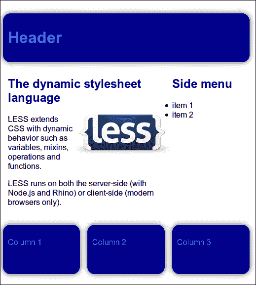
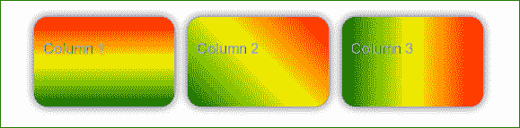
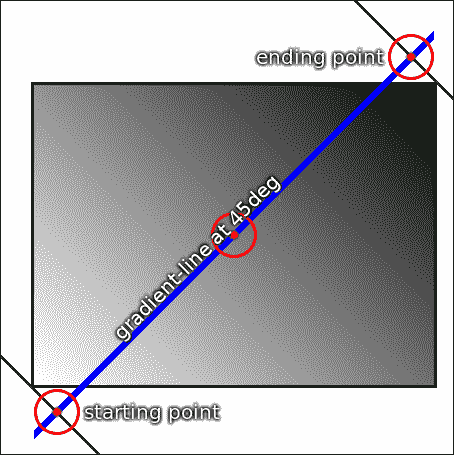
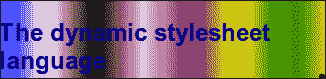

# 第二章：使用变量和混合

在本章中，你将更详细地学习*Less*，了解更多关于变量和混合的知识。*Less*中的**变量**可以在代码中的任何地方重复使用。虽然它们通常在一个地方定义，但也可以在代码的其他地方被覆盖。它们用于定义常用值，这些值只能在一个地方编辑一次。基于**不要重复自己**（**DRY**）原则，常用值将帮助你构建更易于维护的网站。**混合**用于设置类的属性。它们将任务捆绑在一行代码中，并且可重复使用。你将学习如何在项目中创建、使用和重复使用它们，并且编写更好的 CSS 而不重复代码。

本章将涵盖以下主题：

+   对你的代码进行注释

+   使用变量

+   值的转义

+   使用混合

# 注释

注释使你的代码清晰易读。重要的是你能够清楚地理解它们。这就是为什么本章以一些注释的注解和示例开始的原因。

### 提示

在考虑文件大小、下载时间和性能时，不要吝啬你的注释。在编译和最小化最终的 CSS 代码过程中，注释和其他布局结构将被有效地移除。你可以在需要的地方添加注释以便理解和可读性。

在*Less*中，你可以像编写 CSS 代码时一样添加注释。注释行放在`/* */`之间。*Less*还允许以`//`开头的单行注释。

使用*Less*，你将会在最终样式表中保留这些注释，除了单行注释，它们不会被打印出来。**最小化器**会在你的最终**编译样式表**中移除这些注释。以下代码中可以看到一个例子：

```less
/* comments by Bass
.mixins() { ~"this mixin is commented out"; }
*/
```

## 嵌套注释

虽然*Less*，像 PHP 或 JavaScript 一样，不允许嵌套注释，但以`//`开头的单行注释是允许的，并且可以与正常的注释语法混合使用。以下代码片段中展示了这一点：

```less
/*
//commented out
*/
```

## 特殊注释

最小化器定义了一种特殊的注释语法，有时允许将重要注释（如许可通知）包含在最小化的输出中。你可以使用这种语法在样式表的顶部写一些版权声明。使用干净的 CSS 和*Less*的`clean-css`命令行编译器的默认最小化器，你应该在`/*! !*/`之间放置这个重要的命令，如下例所示：

```less
 /*!
very important comment!
         !*/
```

# 变量

*Less*中的变量帮助你保持文件的组织和易于维护。它们允许你在一个地方指定广泛使用的值，然后在整个*Less*代码中重复使用它们。最终样式表的属性可以通过变量设置。所以，想象一下，你不再需要在样式表中搜索特定颜色或值的每个声明了。所有这些是如何工作的呢？变量将以`@`开头并具有一个名称。这样的变量示例包括`@color`、`@size`和`@tree`。在写名称时，你可以使用任何字母数字字符、下划线和破折号。这意味着`@this-is-variable-name-with-35-chars`是一个有效的变量名。

### 提示

尽管本书中的变量名使用了字母数字字符、下划线和破折号，但规范允许使用任何字符，有一些例外。这些规范源自 CSS 语法（你可以在[`www.w3.org/TR/CSS21/grammar.html`](http://www.w3.org/TR/CSS21/grammar.html)查看）。以破折号开头的名称保留给供应商特定规则，而空格已经用于将类名相互分隔。使用转义是可能且允许的，这在（编程）语言中非常罕见。然而，空格的转义是不可能的。`NULL`也是不允许的。

不幸的是，在*Less*中使用`@`是有歧义的。正如您在第一章中所见，混合使用的参数也以`@`开头。这还不是全部。由于有效的 CSS 代码也是有效的*Less*代码，因此还会有以`@`开头的 CSS 媒体查询声明。上下文将清楚地表明`@`用于声明变量。如果上下文不够清晰，本书中将明确提到`@`的含义。

您可以为变量赋值，这将被称为声明。值可以包含任何对 CSS 属性有效的值。

您可以使用冒号（`:`）为变量赋值。声明以分号（`;`）结束。以下示例将说明这一点：

```less
@width: 10px;
@color: blue;
@list: a b c d;
@csv-list: a, b, c, d;
@escaped-value: ~"dark@{color}";
```

在变量声明之后，您可以在代码中的任何位置使用该变量来引用其值。这使得变量在编程*Less*代码时非常强大。查看本书的可下载代码中的本章示例代码，以更好地理解。

## 组织您的文件

正如您所见，您只需声明一次变量，就可以在代码中的任何地方使用它。因此，要对变量进行更改，您也只需更改一次。示例代码在名为`less/variables.less`的单独文件中定义了变量。组织文件是一个很好的做法。如果您想要进行更改，现在您知道该去哪里查找了。

回想一下第一章中的**CSS 重置**和**边框盒模型**，您的主*Less*文件现在将如下代码片段所示：

```less
@import "less/normalize.less";
@import "less/boxsizing.less";
@import "less/mixins.less";
@import "less/variables.less";
```

在这里，`@import`语句从文件中导入代码到主*Less*文件中。文件名用引号括起来，后面跟着一个分号。除了*Less*文件，您还可以导入普通的 CSS 文件，这些文件不会被处理为*Less*指令；这将在第五章中详细解释，*将 Less 集成到您自己的项目中*。

现在您应该在浏览器中打开`http://localhost/index.html`。您将看到一个简单的网站布局，其中包含标题、内容块、侧边菜单和三列页脚，如下面的屏幕截图所示。所有布局项都有蓝色的装饰。之后，打开您喜欢的文本编辑器中的`less/variables.less`。



使用*Less*构建的布局

您很好奇，我敢打赌您也打开了其他文件。不要被其中的代码复杂性吓到。这些代码和布局用于展示在单个位置定义的广泛使用的变量的强大功能。这可以通过比几行代码更现实和复杂的示例更好地展示出来。请放心，所有其他代码很快就会向您解释这一点。在您知晓之前，所有这些代码对您来说都将非常熟悉。

首先，在您之前打开的`less/variables.less`文件中的`@darkcolor: darkgreen;`行中，将`darkblue`更改为`darkgreen`。之后，观察浏览器中的结果。如果您还没有使用`#!watch`功能，请重新加载浏览器。

布局现在将显示为绿色。如果您之前还不确定，现在应该明白了。在实践中，您不会使用一行代码来更改整个网站，但这个示例展示了*Less*可以如何使您的工作更轻松。

想象一下，您已经完成了您的深绿色网站的工作，并向老板展示了它。"干得好！"他说，但他也告诉您："我知道我要求绿色，但如果您不介意，我更喜欢红色的网站"。现在，您微笑着，只需在`less/variables.less`文件中的`@darkcolor: darkgreen;`行中将`darkgreen`更改为`darkred`。

正如您所见，您的 HTML 是干净和直接的，没有内联 CSS 甚至类名。现在有一个新的问题；您将不得不以聪明和适当的方式命名、声明和保存您的变量。在这样做时，保持一致和清晰是非常重要的。在组织您的变量时，始终遵循相同的策略，使用命名约定和在上下文不够清晰的地方添加注释。请记住，任何人都应该能够在任何时候接管您的工作而无需进一步的说明。为了实现这一点，您将不得不深入了解变量。

## 命名您的变量

您应该始终给您的变量起有意义和描述性的名称。像`@a1`和`@a2`这样的变量名称会被编译，但选择得不好。当变量数量增加或者您需要在代码中做一些深层次的更改时，您将不知道或者记得`@a2`被用于什么。您将不得不查找它的上下文，以找到它在您的*Less*文件中的使用，或者更糟糕的是，检查您的 HTML 元素，以找到哪些 CSS 规则被应用在它上面，以便找到*Less*上下文。在这种不幸的情况下，您将回到原点。

好的命名示例包括`@nav-tabs-active-link-hover-border-color`和`@dark-color`。这些变量是有意义和描述性的，因为它们的名称试图描述它们的功能或用途，而不是它们的值。这种命名过程也被称为**语义命名**。因此，在这种情况下，`@dark-color`比`@red`更好，而在某些情况下，您可以更具体地使用`@brand-color`。这可以描述网站的一些品牌颜色，就像前面的例子一样。如果品牌颜色从深红色变为浅绿色，那么`@brand-color: lightgreen;`仍然是有意义的。然而，`@dark-color: lightgreen;`或`@red: lightgreen;`就不太合适了。

如您所见，变量名中使用连字符来分隔单词。这些名称被称为**连字符名称**。您应该使用小写字母。使用连字符名称并没有严格的规则；所谓的**驼峰命名法**也被使用，并且被许多程序员认为是可接受的替代方式。在驼峰命名法中，您将使用类似`@navTabsActiveLinkHoverBorderColor`和`@darkColor`的命名。无论是连字符名称还是驼峰名称都可以提高可读性。

### 提示

在编写 CSS 和 HTML 代码时，您会使用连字符连接的双词术语和小写的类名、ID 和字体名称，以及其他内容。这些规则并不总是严格的，也不是按照惯例遵循的。本书在编写*Less*代码时遵循这种约定，因此使用了连字符名称。

无论您喜欢驼峰命名法还是连字符名称都不是很重要。当您选择了驼峰命名法或连字符名称之后，保持一致并在整个*Less*文件中使用相同的命名方式是很重要的。

### 提示

当进行计算时，连字符名称可能会引起一些麻烦。您将需要一些额外的空格来解决这个问题。当您声明`@value`减一时，`@value-1`将被读作一个单独的变量，而不是`@value -1`。

## 使用变量

如果您的项目不断增长，将为每个 CSS 属性值添加一个变量将变得不可能，因此您将不得不选择哪些值应该是变量，哪些不应该是。在这个过程中并没有严格的规则。在接下来的章节中，您将找到一些明确的指导来做出这些选择。

首先，您应该尝试找到在您的代码中多次使用的属性值。在创建变量时，重复使用是合适的。示例代码中的`@dark-color`变量就是这种属性值的一个很好的例子。

其次，您可以创建用于自定义设置的属性的变量。示例代码中的`@basic-width`变量就是这种属性的一个例子。

最后，你应该考虑为可重用的组件创建变量。看看我们的示例，你可以在其他项目中重用页眉。为了实现这一点，你应该创建一个新的`less/header.less`文件，并使用以下代码将其导入到你的主文件中：

```less
@import "less/header.less";
```

## 组织变量

为了使组件可重用，你可以为每个组件或函数创建*Less*文件，并安排变量以适应这些文件。为了演示这一点，将示例代码拆分为`less/header.less`，`less/content.less`和`less/footer.less`。

`less/header.less`文件现在将包含以下代码：

```less
header
{
   background-color: @header-dark-color;
   min-height: @header-height;
   padding: 10px;

   .center-content;
   .border-radius(15px);
   .box-shadow(0 0 10px, 70%);

   h1 {color: @header-light-color;}
 }
```

注意，`@dark-color`已被重命名为`@header-dark-color`。在浏览器中打开`http://localhost/project.html`，并在文本编辑器中打开`less/project.less`文件，以查看所有更改及其影响。

现在，在你的`less/project.less`文件中使用`@import "header.less";`包含`less/header.less`文件，并在`less/variablesproject.less`文件中创建一个页眉部分，如下所示：

```less
/* header */
@header-dark-color: @dark-color;
@header-light-color: @light-color;
@header-height: 75px;
```

`@header-dark-color: @dark-color;`语句将`@dark-color;`的值赋给`@header-dark-color`。之后，你将对`less/content.less`和`less/footer.less`做同样的操作。正如你所看到的，`http://localhost/project.html`在你的更改后仍然看起来一样。

现在，在你的文本编辑器中打开`less/variablesproject.less`文件，并将页脚部分更改为以下代码：

```less
/* footer */
@footer-dark-color: darkgreen;
@footer-light-color: lightgreen;
@footer-height: 100px;
@footer-gutter: 10px;
```

在你的浏览器中，你现在将看到带有绿色页脚的布局。

## 最后声明获胜

在第一章中，你已经了解了**CSS 层叠**，最后一条规则指出，如果其他规则的输出相等，最后声明的值将获胜。*Less*使用相同的策略，变量的最后声明将在所有前面的代码中使用。在下面的代码中，你将看到属性值设置为`2`，符合最后声明获胜的规则：

```less
@value: 1;
.class{
property: @value;
}
@value: 2;
```

```less
Compiles into:
.class{
property: 2;
}
```

事实上，*Less*首先读取你的所有代码。当变量的值被使用时，实际上只使用最后分配或最后读取的值。最后声明获胜的事实只会影响在相同作用域中定义的声明。

在大多数编程语言中，作用域由编译器可以独立运行的代码部分定义。函数和类可以有自己的作用域。在*Less*中，mixin 有自己的作用域。混合将在本章后面更详细地讨论。

以下代码向你展示了，根据在 mixin 作用域内声明的值，属性值设置为`3`：

```less
@value: 1;
.mixin(){
  @value: 3;
  property: @value;
}
.class{
  .mixin;
}
@value: 2;Compiles to:
.class{
property: 3;
}
```

上述代码意味着你不能在编译过程中更改变量。这使得这些变量成为理论上的**常量**。将这与你代码中数学值 pi 的定义进行比较，它始终是相同的。你只需定义`PI`一次，`PI = 3.14`将在你的代码中，并且在运行代码时保持不变。因此，变量应该只声明一次。

变量的**重声明**和最后声明获胜的规则将在许多*Less*项目和代码的定制中使用。

为了演示重声明，创建一个新的`less/customized.less`文件，并将以下代码写入其中：

```less
@import "styles.less";
@dark-color: black;
@basic-width: 940px;
```

在`customized.html`文件中引用`customized.less`文件，如下所示：

```less
<link rel="stylesheet/less" type="text/css" href="less/customized.less" />
```

现在在浏览器中加载`customized.html`文件。正如你所看到的，你只用了三行代码就创建了一个定制版本的布局！

## 变量声明不是静态的

尽管变量的行为类似于常量，但它们的**声明**不一定是不可改变的或静态的。首先，你可以将一个变量的值赋给另一个变量，如下面的代码所示：

```less
@var2 : 1;
@var1 : @var2;
@var2 : 3;
```

`@var1`的值现在是`3`而不是`1`。请理解，你不需要创建某种**引用**，因为最后声明获胜的规则在这里适用。`@var1`变量将获得最后声明的`@var2`变量的值。

在示例代码中，您还会发现`@light-color: lighten(@dark-color,40%);`的声明。`lighten()`函数是*Less*的所谓内置函数。第三章，*嵌套规则、操作和内置函数*，将介绍内置函数。使用`lighten()`函数将`@light-color`设置为基于`@dark-color`计算的颜色值。您还应该注意`@dark-color`的最后一个声明，因为这用于颜色计算。

动态声明变量值可以提供灵活性，但请记住，您只能在声明后声明一次值，并且不能在声明后更改它。

## 懒加载

在从变量切换到混合器之前，您应该首先了解**懒加载**。在计算机编程中，这意味着推迟对象的初始化，直到需要它为止。懒加载是急切加载的相反。对于*Less*来说，这意味着变量是懒加载的，不必在实际使用之前声明。

试图理解理论方面固然很好，但现在是时候通过以下示例了解它们在实践中是如何工作的：

```less
.class {
  property: @var;
}
@var: 2;
```

上述代码编译为以下代码：

```less
.class {
  property: 2;
}
```

# 转义值

*Less*是 CSS 的扩展。这意味着*Less*在遇到无效的 CSS 或在编译期间评估有效的 CSS 时会出错。一些浏览器使用无效的 CSS 定义属性。众所周知的例子包括`property: ms:somefunction()`之类的东西。其中一些规则可以被供应商特定的规则替换。重要的是要注意，*Less*中无效的属性值不会被编译。

CSS3 中的新函数`calc()`是 CSS 中进行简单数学运算的一种本地 CSS 方式，可以替代任意长度的值。

在这两种情况下，*Less*在编译或导入时都无法给我们正确的值。

```less
@aside-width: 80px;
.content {
width: calc(100% -  @aside-width)
}
```

上述代码编译为以下代码：

```less
.content {
  width: calc(20%);
}
```

从上述代码中，`@aside-width: 80px;`是声明一个名为`aside-width`的变量。这个变量得到了 80 像素的值。关于变量的更多信息将在接下来的章节中介绍。然而，更重要的是，现在上述结果是错误的（或者至少不如预期），因为`calc()`函数应该在渲染时进行评估。在渲染时，`calc()`函数有能力混合单位，比如百分比和像素。在上述代码中，`.content`被分配了`100%`的可用空间的宽度（换句话说，所有可用空间）减去`80px`（像素）。

**转义**这些值将防止这些问题。在*Less*中，您可以通过将值放在用波浪号(`~)前面的引号(`""`)之间来转义值。因此，在这个例子中，您应该写`width: ~"calc(100% - @{aside-width})"`。

请注意，大括号放在`aside-width`的变量名中，这被称为**字符串插值**。在转义的值中，任何在引号之间的内容都会被原样使用，几乎没有变化。唯一的例外是**插值变量**。

字符串是字符序列。在*Less*和 CSS 中，引号之间的值是字符串。没有转义，*Less*会将其字符串编译成 CSS 字符串。

例如，`width: "calc(100 – 80px)"`在 CSS 中没有意义，`width: calc(100% - @aside-width)`也是如此，因为`@aside-width`没有意义。

因此，通过转义和字符串插值，您可以从以下代码片段开始：

```less
@aside-width: 80px;
.content{
    width: ~"calc(100% - @{aside-width});"
}
```

上述代码将编译为以下代码：

```less
.content {
  width: calc(100% - 80px);
}
```

### 提示

在使用`calc()`函数的特定情况下，*Less*编译器具有**strict-math**选项（自 1.4 版本以来使用）。这与命令行中的`–strict-math=on`或在 JavaScript 中使用`strictMath: true`一起使用。当打开 strict-math 选项时，`calc(100% - @aside-width);`的宽度将被编译为`width: calc(100% - 80px);`。请注意，在 1.6、1.7 和 2.0 版本的开发过程中，对这个**strict-math**选项进行了许多更改。

# 混合

混合在*Less*中扮演着重要角色。在第一章中讨论圆角示例时，您已经看到了混合。混合从面向对象编程中获取其命名。它们看起来像函数式编程中的函数，但实际上像 C 宏一样起作用。*Less*中的混合允许您通过简单地将类名包含为其属性之一，将一个类的所有属性嵌入到另一个类中，如下面的代码所示：

```less
.mixin(){
  color: red;
      width: 300px;
  padding: 0 5px 10px 5px;
}
p{
.mixin();
}
```

前面的代码将被编译为以下代码：

```less
p{
  color: red;
  width: 300px;
  padding: 0 5px 10px 5px;
}
```

在网站上使用的最终 CSS 代码中，每个`<p>`段落标记都将使用`mixin()`函数中定义的属性进行样式设置。优点是您可以在不同的类上应用相同的混合。正如在圆角示例中所看到的，您只需要声明一次属性。

尝试打开本章可下载文件中的`less/mixins.less`。在本书的示例中，所有混合都保存在一个文件中。在这个文件中，您可以根据它们的功能来安排您的混合。将它们分组到一个文件中可以防止我们在删除或替换其他功能*Less*文件时破坏代码。您的项目中包含了`sidebar.less`和`content.less`的示例，这两个文件都使用了 border-radius 混合。如果我们现在替换`sidebar.less`，您不会破坏`content.less`。当然，您也不希望在代码中两次使用相同类型的混合。

`less/boxsizing.less`中的 box-sizing 混合将被视为一个特例。box-sizing 混合影响所有元素，您希望能够完全替换 box-sizing 模型。

`less/mixins.less`文件包含四个混合，将在以下部分中讨论。box-shadow 和 clearfix 混合也具有**嵌套**等复杂结构，但这些混合将在下一章中进一步详细解释。

## 基本混合

您已经看到了圆角混合。基本混合看起来像 CSS 中的类定义。混合在类内部调用并赋予这些类其属性。

在`less/mixins.less`文件中的示例代码中，您将找到`.center-content`混合，它将`margin`属性的值设置为`0 auto`。这个混合用于居中对齐标题、内容包装器和页脚。

### 提示

请注意，这些居中内容混合并不是唯一的解决方案。一个通用的包装器可以一次性居中对齐标题、内容包装器和页脚，也适用于这个示例布局。这个混合的名称也可以讨论。当您决定不再居中内容时，这个混合的名称将不再有任何意义。

删除`margin: 0 auto;`属性，实际上是从混合中使内容居中。然后应该重新加载浏览器中的`index.html`以查看效果。

## 参数化混合

如前所述，混合在函数式编程中扮演函数的角色，因此，作为函数，它们可以被参数化。参数是与混合结合使用的值，参数的名称在混合内部用作其值的引用。以下代码向您展示了一个使用参数化混合的示例：

```less
.mixin(@parameter){
  property: @parameter;
}
.class1 {.mixin(10);}
.class2 {.mixin(20);}
```

前面的代码被编译为以下代码：

```less
.class1 {
  property: 10;
}

.class2 {
  property: 20;
}
```

前面的示例显示了参数化如何使混合非常强大。它们可以根据输入值设置属性。

### 默认值

参数具有可选的默认值，可以使用`.mixins(@parameter:defaultvalue);`来定义。要了解这是如何工作的，您应该考虑`less/mixins.less`文件中的`border-radius`混合，如下面的代码所示：

```less
.border-radius(@radius: 10px)
{
  -webkit-border-radius: @radius;
  -moz-border-radius: @radius;
  border-radius: @radius;
}
```

请注意，这里的默认值是`10px`。

## 命名和调用

在本书中，混合物具有有意义和描述性的名称，就像变量名称一样，这些名称是用连字符分隔的。为混合物使用有意义和描述性的名称使您的代码对其他人更易读，更易于维护。参数和变量都以`@`符号开头。上下文应该清楚地表明正在讨论的是变量还是混合参数。

为了更好地理解，请考虑以下代码：

```less
@defaulvalue-parameter1 :10;
.mixin(@parameter1: @defaulvalue-parameter1)
{
  property: @parameter1;
}
.class {
 .mixin
}
```

这段代码可以编译成以下代码：

```less
.class{
  property: 10;
}
```

请注意，这里的`@defaulvalue-parameter1`是一个变量。

以下代码还说明了混合的范围：

```less
@defaulvalue-parameter1 :10;
.mixin(@parameter1: @defaulvalue-parameter1){
  property: @parameter1;
}
.class {
  .mixin
}
 @parameter1 : 20;
```

这段代码可以编译成以下代码：

```less
.class{
  property: 10;
}
```

在这里，`@parameter1`的最后一个声明在混合的范围之外，所以属性仍然设置为`10`。

## 多个参数

混合物的多个参数可以用逗号或分号分隔。函数式程序员通常使用逗号作为**分隔符**。在*Less*中，分号更受青睐。逗号在这里实际上有一个模棱两可的作用，因为它们不仅用于分隔参数，还用于分隔**csv 列表**中的列表项。

`.mixin(a,b,c,d)`调用使用四个参数调用混合物，同样`.mixin(a;b;c;d)`调用也是一样。现在，考虑一下您使用`.mixin(a,b,c;d)`调用混合物的情况。这里只使用了两个参数，第一个参数是一个包含三个项目的列表。如果参数列表中至少有一个分号，则唯一的分隔符将是分号。下面的代码向您展示了在参数列表中添加额外分号的效果：

```less
.mixin(@list){
   property: @list;
}
.class{ mixin(a,b,c,d;);}//see the extra semi-colon!
```

这段代码可以编译成以下代码：

```less
.class{
   property: a, b, c, d;
}
```

没有这个额外的分号，你调用一个带有四个参数的混合物。在这种情况下，编译器会抛出一个错误：**RuntimeError: No matching definition was found for .mixin(a, b, c, d)**。实际上，你需要的是一个包含`.mixin(@a,@b,@c,@d)`的混合物。

在前面的例子中，已经明确表示*Less*中允许具有相同名称的混合物。当找到具有相同名称的不同混合物时，编译器仅使用具有正确数量参数的混合物，或者在找不到匹配的混合物时抛出错误。这种形式的参数匹配可以与各种编程语言中的**方法重载**进行比较。

如果一个混合调用匹配多个混合，如下面的代码所示，那么编译器将使用所有匹配的混合：

```less
 .mixin(@a){
        property-a: @a;
}

.mixin(@b){
        property-b: @b;
}

class{
      .mixin(value);
}
```

这段代码编译成以下代码：

```less
class {
  property-a: value;
  property-b: value;
}
```

## 更复杂的线性渐变背景混合

现在您已经有足够的理论知识来构建更复杂的混合物。在这个例子中，您将为我们布局的页脚列添加三种颜色的**背景渐变**指令。

最终结果应该如下截图所示：



使用*Less*构建的线性渐变背景

这些渐变背景被选择是因为它们的复杂性和随时间变化的充分记录。最终结果将是一个复杂的混合，肯定不完美，但可以显著改善结果。您可以肯定，您将不得不不时更改您的渐变混合，因为旧浏览器的支持下降，新浏览器，规范的变化和新的见解。请参考[`developer.mozilla.org/en-US/docs/Web/Guide/CSS/Using_CSS_gradients`](https://developer.mozilla.org/en-US/docs/Web/Guide/CSS/Using_CSS_gradients)获取更多示例。

你无法阻止这些必要的更改，但你可以最小化花在保持你的混合器最新的时间。*Less*保证了你所有的背景渐变都是基于同一个混合器定义在一个地方。

在基本层面上，CSS 中的背景渐变被定义为图像。因此，它们被应用在**background-image 属性**上。

在本书中，渐变是在`background-image`属性上设置的。其他示例（其他地方和其他书中）可能会在`background`属性上设置它们。它们的定义没有区别。CSS 为背景定义了不同的属性，如`background-image`、`background-color`、`background-size`和`background-position`。`background`属性是它们所有的缩写。当你将`background`属性的第一个值定义为图像，或者在这种情况下是渐变时，所有其他属性值都设置为它们的默认值。

你开始你的混合器，列出以下**要求**：

+   你需要一个参数来设置你的渐变的方向，你将使用角度。

+   你的渐变将由三种颜色组成

+   之后，你定义一个浏览器列表和你需要支持的浏览器版本

现在，你可以定义你的混合器的前几行如下：

```less
.backgroundgradient(@deg: 0deg; @start-color: green; @between-color:yellow; @end-color: red; @between:50%)
{
background-image: linear-gradient(@deg, @start-color, @between-color @between, @end-color);
}
```



展示 45 度渐变线如何工作的一种方法。这是从[`dev.w3.org/csswg/css-images-3/`](http://dev.w3.org/csswg/css-images-3/)中获取的，版权所有 2013 W3C，2013 年 9 月 11 日

背景混合器有五个参数，如下：

+   第一个参数描述了以度为单位的方向。度数的数量给出了垂直和渐变方向之间的角度。方向的描述从底部开始。在底部，角度为 0 度，描述了从底部到顶部的渐变。然后角度顺时针转到 90 度点，描述了从左到右的渐变，依此类推。

+   接下来的三个参数是你的渐变的三种颜色，这是为它设置的默认值。

+   第五个也是最后一个参数定义了中间颜色的真实值。这里的百分比是应用渐变的元素宽度的百分比。第一个和最后一个颜色默认为 0 和 100。

现代浏览器，如 IE 11 版本，Firefox 16+版本，Opera 12.10+版本，Safari 7+版本和 Chrome 26+版本，支持这些背景图像属性。对于较旧的浏览器，必须添加特定于供应商的规则。这里的第一个问题是特定于供应商的规则使用了不同的方式来定义角度。为了补偿这一点，你可以使用以下代码对 90 度进行校正：

```less
.backgroundgradient(@deg: 0deg; @start-color: green; @between-color:yellow; @end-color: red; @between:50%){
  @old-angel: @deg – 90deg;
  -ms-background-image: linear-gradient(@old-angel , @start-color, @between-color @between, @end-color);
  background-image: linear-gradient(@deg, @start-color, @between-color @between, @end-color);
}
```

`-ms background-image`属性被 IE10 使用，因为较旧版本的 IE 无法支持背景图像。或者，你可以添加一个滤镜来支持双色渐变。在使用这个滤镜时，不支持与回退图像的组合，所以你必须选择基于 webkit 的浏览器，比如 Chrome 和 Safari，它们使用`-webkit-linear-gradient`；然而，如果你必须支持这些浏览器的旧版本，你将不得不使用`-webkit-gradient`。请注意，`-webkit-gradient`有一个不寻常的语法。例如，你的最终混合器可能看起来像以下代码：

```less
.backgroundgradient(@degrees: 0deg; @start-color: green; @between-color:yellow; @end-color: red; @between:50%){
  background-image: -moz-linear-gradient(@degrees, @start-color 0%, @between-color @between, @end-color 100%);
  background: -webkit-gradient(linear, left top, left bottom, color-stop(0%, @start-color), color-stop(@between,@between-color), color-stop(100%,@end-color));
  background-image : -webkit-linear-gradient(@degrees, @start-color 0%, @between-color @between, @end-color 100%);
  background-image: -o-linear-gradient(@degrees, @start-color 0%, @between-color @between, @end-color 100%);
  background-image: -ms-linear-gradient(@degrees, @start-color 0%, @between-color @between, @end-color 100%);
  background-image: linear-gradient((@degrees - 90deg), @start-color 0%, @between-color @between, @end-color 100%);
  filter: progid:DXImageTransform.Microsoft.gradient( startColorstr='@startcolor', endColorstr='@endcolor',GradientType=0 );
}
```

前面的代码表明，即使使用*Less*，我们的代码仍然可能很复杂。除非这种复杂性可以支持不同的浏览器，你可以看到使用*Less*的优势，它允许你只在一个地方处理这段代码。

前面示例中的代码可以在`directivebackgrounds.html`和`less/directivebackgrounds.less`中找到。如果你想知道在经历了这一切之后为什么还要使用 CSS 背景渐变，那么请看一下[`lea.verou.me/css3patterns/`](http://lea.verou.me/css3patterns/)，看看有什么可能性。

## 特殊变量-@arguments 和@rest

*Less*定义了两个特殊变量。`@arguments`变量是第一个，包含传递的所有参数的列表。`@arguments`变量存在于 mixin 内部。在*Less*中，列表是用空格分隔的，所以你可以用`@arguments`来设置可以由值列表设置的属性。像`margin`和`padding`这样的属性在它们的简写表示法中接受列表，如下面的代码所示：

```less
.setmargin(@top:10px; @right:10px; @bottom: 10px; @left 10px;){
  margin: @arguments;
}
p{
.setmargin();
}
```

这段代码可以编译成以下代码：

```less
p {
  margin: 10px 10px 10px 10px;
}
```

第二个特殊变量是`@rest`。`@rest...`将调用者的前面参数后的所有奇数参数绑定到一个列表中。通过这样做，`@rest...`可以让 mixin 使用无限的参数列表。请注意，这三个结束点是语法的一部分。下面的代码显示了`@rest...`将`@a`变量后的所有奇数参数绑定到`property2`属性：

```less
.mixin(@a,@rest...) {
  property1: @a;
             property 2: @rest;
}
element {
    .mixin(1;2;3;4);
}
```

这段代码将被编译成以下代码：

```less
element {

  property1: 1;

  property2: 2 3 4;

}
```

你还应该考虑使用`@rest...`作为 csv 列表。为此，你可以将`less/mixinswithdirectivebackgrounds.less`中的`.backgroundgradient` mixin 重写为以下代码：

```less
.backgroundgradient(@deg: 0; @colors...) {
    background-repeat: repeat-x;
    background-image: -webkit-linear-gradient(@deg, @colors);
    background-image: -moz-linear-gradient(@deg, @colors);
    background-image: linear-gradient(@deg, @colors);
}
```

现在，这个 mixin 将接受一个无限的颜色列表，你可以用以下代码来使用它：

```less
div#content {        .backgroundgradient(0;blue,white,black,pink,purple,yellow,green,orange);
}
```

以下图显示了使用这个背景 mixin 的代码的结果：



## 返回值

如果你习惯于函数式编程，甚至了解数学函数，你会期望 mixin 有一个**返回值**。这只是意味着把`x`放进去，得到`y`。Mixin 没有返回值，但你可以使用它们的作用域模仿这种行为。在 mixin 中定义的变量将被复制到**调用者的作用域**，除非变量已经在调用者的作用域中定义。下面的例子将说明这一点：

```less
.returnmixin(){
        @par1: 5;
        @par2: 10;
}
.mixin(){
	@par2: 5; // protected for overwriting
        property1: @par1; // copied from returnmixin's scope
        property2: @par2;
        .returnmixin();
}

element{
.mixin();
}
```

这段代码将被编译成以下代码：

```less
element {
  property1: 5;
  property2: 5;
}
```

如果你看前面的例子，你可以将`property2: @par2;`与一个函数比较，比如`property2 = returnmixin();`。

### 提示

使用作用域来模仿返回值也可以应用在 mixin 上。在另一个 mixin 中定义的 mixin 可以在调用者的作用域中使用。然而，这些不像变量那样受作用域的保护！这个过程被称为**解锁**。目前，解锁不在本书的范围之内。

## 改变 mixin 的行为

为了使 mixin 更加灵活，影响它们的输出基于它们的输入参数将是有用的。*Less*提供了不同的机制来实现这一点。

### 开关

假设你有一个 mixin，`color();`应该根据上下文将颜色属性设置为白色或黑色。使用`@context: light;`声明设置上下文，并声明两个具有相同名称的 mixin，如下面的代码所示：

```less
.color(light)
{
      color: white;
}
.color(dark)
{
      color: black;
}
```

现在你可以在你的代码中使用`.color(@context);` mixin，它将把你的类的`color`属性设置为白色或黑色，取决于声明给`@context`的值。现在这可能看起来没什么用，但在你不断发展的项目中会很有用。看一下 Bootflat 项目[`www.flathemes.com/`](http://www.flathemes.com/)。这个项目提供了 Twitter 的 Bootstrap 的颜色变体。**Twitter 的 Bootstrap**是基于*Less*的**CSS 框架**。Bootflat 定义了两种样式，其中一种样式基于改进的 Bootstrap 3.0 样式，另一种样式是一个去掉了圆角的 Square UI 样式。这个项目使用一个开关来编译两种不同的样式。

### 参数匹配

*Less*允许具有相同名称的不同 mixin。如果有这样的 mixin，那么与调用者的参数列表匹配的每个 mixin 都将被使用。参考以下颜色 mixin：

```less
.color(@color)
{
  color: @color;
}
.color(@color1,@color2)
{
  color: gray;
}
```

在前面的代码中定义的颜色混合，`.color(white)`编译成`color: white;`，而`.color(white,black)`将给出`color: gray;`。请注意，`.color(white);`调用不匹配`.color(@color1,@color2)`混合，因为它需要两个参数，所以编译器没有使用它。

### 守卫混合

*Less*中也可以有相同名称和相同参数数量的混合。在这种情况下，所有匹配项都会被使用，如下例所示：

```less
.color(@color){
        color: @color;
        display: block;
}

.color(@color) {
        color: blue;
}
.class{
  .color(white)
}
```

这段代码将被编译成以下代码：

```less
.class{
  color: #ffffff;
  display: block;
  color: blue;
}
```

### 提示

还要注意*Less*将命名颜色`white`转换为`#ffffff;`。

在这种情况下，两个`color`声明是没有意义的。*Less*不会过滤掉重复声明，除非它们以完全相同的方式使用。

**守卫**可以用来防止重复定义的混合带来的麻烦。守卫是在关键字后面跟着一个条件定义的。当条件为真时，使用混合。以下示例清楚地说明了这一点：

```less
mixin(@a) when (@<1){
    color: white;
}
mixin(@a) when (@>=1){
    color: black;
}
.class {
   mixin(0);
}
.class2 {
    mixin(1);
}
```

这段代码将被编译成以下代码：

```less
.class {
  color: white;
}
.class2 {
  color: black;
}
```

守卫可以像编程中的*if*语句一样使用。比较运算符如`>`、`>=`、`=`, `=<`和`<`可以使用。一个或多个条件可以用逗号分隔的方式组合在一起，如果其中一个为真，则为真。

关键字`and`可以用来在两个条件都为真时评估为真，例如，`when @a>1` `and` `@<5`。最后，条件可以用关键字`not`否定，例如，`when (not a = red)`。

### 提示

如果您之前使用过 CSS 媒体查询，那么您一定会意识到守卫的作用方式与 CSS 中的媒体查询相同。

最后，守卫条件也可以包含内置函数。这些函数将在下一章中讨论，并在它们不是参数列表的一部分时作用于所有定义的变量。守卫条件的内置函数可以在以下代码中看到：

```less
@style: light;
.mixin(@color) when is_color(@color) and (@style = light) {
  color: pink;
}
.class() {
  mixin(red);
}
```

这段代码可以编译成以下代码：

```less
.class {
  color: pink;
}
```

在`@style: dark;`或`mixin(1);`的情况下，没有匹配项。

### 使用守卫和参数匹配来构建循环

当*Less*找不到**匹配的混合**时，它会继续到下一个评估并不会中断。这可以与守卫和参数匹配结合使用来构建循环。举个例子，想象有 10 个**类**，每个类都包含一个编号的背景图片。`.class1`类的`background-image`属性值设置为`background-1.png`，`.class2`类将`background-image`属性的值设置为`background-2.png`，依此类推，如下代码所示：

```less
.setbackground(@number) when (@number>0){
  .setbackground( @number - 1 );
  .class@{number} { background-image: ~"url(backgroundimage-@{number}.png)"; }
}
.setbackground(10);
```

这段代码可以编译成以下代码：

```less
.class1 {
  background-image: url(backgroundimage-1.png);
}
.class2 {
  background-image: url(backgroundimage-2.png);
}
...
.class10 {
  background-image: url(backgroundimage-10.png);
}
```

当您第一次看到最后一个混合时，它可能看起来很复杂，但如果您尝试自己评估混合，您会发现它实际上包含了您之前学到的很多东西。

在前面的代码中，`setbackground`混合调用了自身。程序员会称这为**递归**。这里发生了什么？

`.setbackground(10);`调用匹配了`.setbackground(@number)`混合，当`@number>0`时，请利用这一点。`.setbackground( @number - 1 );`的第一次评估也匹配了混合。这意味着编译器再次运行混合。这将重复直到`@number -1`为`0`；再也找不到匹配项。现在编译器将读取停止位置之后的内容，以使用混合。

最后一次停在`@number = 1`，所以它会评估`@numer = 1`条件下的`.class@{number} { background-image: ~"url(backgroundimage-@{number}.png)"; }`声明。当它之前停止时，是在`@number = 2`。所以，它会评估`@numer = 2`条件下的`.class@{number} { background-image: ~"url(backgroundimage-@{number}.png)"; }`声明，依此类推。当我们回到`@numer = 10`时，所有代码都已经编译完成。所以，编译器停止了。

除了保护和参数匹配，上面的示例还包含了`.class@{number}`类声明中的插值属性，以及在声明`~"url(backgroundimage-@{number}.png)";`时进行转义的字符串插值示例。混合还显示了在执行计算时需要使用额外的空格。因此，`@number - 1`不会被计算为一个`@number-1`变量。

## `!important`关键字

本章以关于*Less*中`!important`关键字的说明结束。在声明中使用`!important`会使该声明在两个或更多选择器匹配同一元素时具有最高的优先级。`!important`关键字会覆盖内联样式，如下面的代码所示：

```less
<style>
p{color:green !important;}
</style>
<p style="color:red;">green</p>
```

上述代码将显示为绿色文本。正如示例所示，您可以使用`!important`来更改内联 CSS 源的样式，这是您无法编辑的。它还可以用于确保样式始终被应用。然而，请谨慎使用`!important`，因为覆盖`!important`的唯一方法是使用另一个`!important`。在*Less*中不正确或不必要地使用`!important`将使您的代码混乱且难以维护。

在*Less*中，您不仅可以在属性中使用`!important`，还可以在混合中使用它。当为某个混合设置`!important`时，该混合的所有属性都将使用`!important`关键字声明。这可以在以下代码中看到：

```less
.mixin(){property1: 1;property2: 2;
}
.class{
.mixin() !important;
}
```

此代码将编译为以下代码：

```less
.class{
  property1: 1 !important;
  property2: 2 !important;
}
```

# 总结

在本章中，您学习了关于变量和混合的知识。您已经看到了在一个地方定义变量和混合将减少您的代码并使其易于维护。

在下一章中，您将学习更多关于混合和如何嵌套和扩展它们的知识。您还将了解*Less*的内置函数。内置函数可用于操纵混合和代码其他部分中的值。
