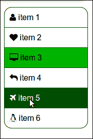
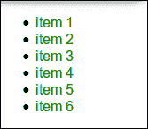
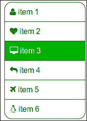
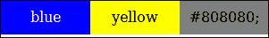
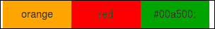

# 第三章：嵌套规则，操作和内置函数

在本章中，你将学习*Less*如何帮助你更直观地组织你的 CSS 选择器，使继承清晰，并使你的样式表更短。你还将学习操作和内置函数。操作让你能够添加、减去、除以和乘以属性值和颜色。它们还让你有能力在属性之间创建复杂的关系。你还将学习如何在你的*Less*代码中使用内置函数来设置变量或保护。

本章将涵盖以下主题：

+   嵌套 CSS 规则

+   使用操作

+   在你的代码中使用内置函数

+   使用混合中的内置函数

# 导航结构

通过本章的示例，你将逐步扩展第二章中的布局，*使用变量和混合*，并使用导航结构。你将通过使用*Less*来为 HTML 列表设置样式来构建这个导航结构。这个导航结构形成了布局侧边栏中的菜单。

最终结果将如下截图所示：



使用*Less*构建的最终导航菜单

# 嵌套规则

你将使用第二章中的布局示例，*使用变量和混合*，来更详细地研究*规则的嵌套*。

为了做到这一点，你首先必须在浏览器中打开`http://localhost/index.html`，然后在你的文本编辑器中打开`less/sidebar.less`。

锚点被添加到菜单项中。这意味着侧边栏的 HTML 代码现在看起来像以下代码：

```less
<aside id="sidemenu">
  <h2>Side menu</h2>
  <ul>
      <li><a href="page1.html">item 1</a></li>
      <li><a href="page2.html">item 1</a></li>
  </ul>
</aside>
```

你需要为 CSS 中的不同元素设置每个规则的选择器，如下面的代码所示：

```less
#sidebar h2{
  color: black;
  font-size: 16px;
}
#sidebar ul li a{
  text-decoration: none;
  color: green;
}
```

正如你所看到的，`ul`（包括`li`元素和`a`锚点）元素和`h2`元素都是具有`#sidemenu` ID 的`aside`元素的子元素。CSS 并没有反映这种关系，因为它目前的格式如前面的代码所示。*Less*将帮助你在你的代码中反映这种关系。在*Less*中，你可以写下以下代码：

```less
#sidebar{
  h2{
    color: black;
    font-size: 16px;
  }
  ul{
    li{
      a{
        text-decoration: none;
        color: green;
      }
    }
  }
}
```

前面的代码将直接编译成以下 CSS 语法：

```less
#sidebar h2 {
  color: black;
  font-size: 16px;
}
#sidebar ul li a {
  text-decoration: none;
  color: green;
}
```

你编译后的*Less*代码的结果 CSS 与你原始的 CSS 代码完全相同。在*Less*中，你只需一次引用`#sidemenu` ID，由于`h2`和`ul`嵌套在`#sidemenu`中，你的代码结构是直观的，并且反映了你的 HTML 代码的**DOM 结构**。

为了保持你的代码整洁，一个新的`less/sidebar.less`文件已经被创建。它包含了前面的*Less*代码。当然，这个文件也应该被导入到`less/styles.less`中，使用以下代码行：

```less
@import "sidebar.less";
```

请注意，侧边栏被包裹在语义化的 HTML5 `aside`元素中，而不是`div`元素中。虽然这更语义化，但你会发现在你做出这些改变后，你的侧边栏已经浮动到了左侧。要解决这个问题，打开你的文本编辑器中的`less/content.less`。通过研究*Less*代码中 CSS 选择器的嵌套，你会发现`.wrapper`容器中嵌套了`aside float:right;`。如果你将这个`aside`规则移到`#content`容器中，语法应该如下所示：

```less
#content {
  //two third of @basic-width
  width:(@basic-width * 2 / 3);
  float:left;
  min-height:200px;
  aside {
    float:right;
  }
}
```

在`less/content.less`文件中，你还会发现一行`h2 { color: @content-dark-color; }`，这与你在`aside`元素中看到的是相反的。`h2`规则仍然会被`#sidebar h2{ color: black; }`覆盖。最终的规则包含了一个`#sidebar`选择器，因此它具有更高的**CSS 特异性**，正如第一章所解释的那样。

检查*Less*文件，例如`less/header.less`，再次牢记关于 CSS 选择器嵌套的全新见解。你会发现嵌套已经经常被使用。例如，在`less/header.less`中，`h1`元素的属性是通过嵌套设置的。

对这些文件进行适当的检查还将向您展示混合可以嵌套在类和其他混合中的方式。

## 混合和类

混合的名称应该总是以括号结尾；否则，它就是一个普通的**类**。*Less*中的混合和类都可以嵌套。考虑以下示例*Less*代码的区别：

```less
.class-1{
  property-1: a;
}
.class-2{
  .class-1;
  property-2: b;
}
```

这段代码将被编译成以下代码：

```less
.class-1 {
  property-1: a;
}
.class-2 {
  property-1: a;
  property-2: b;
}
```

您可以看到`.class-1`的属性如何被复制到编译后的 CSS 中的`.class-2`中。当您在*Less*中在`.class-1`后面添加括号并将其变成混合时，现在您应该考虑以下代码：

```less
.mixin(){
  property-1: a;
}
.class-2{
 .mixin;
  property-2: b;
}
```

这段代码将被编译成以下 CSS 代码：

```less
.class-2 {
  property-1: a;
  property-2: b;
}
```

让我们回到侧边导航菜单的示例。当您的菜单准备好时，您会发现`h2`标题元素内的“导航”文本毫无意义。除非您视力受损并使用屏幕阅读器，否则您可以轻松地看到侧边菜单是网站的导航。因此，您可以隐藏此标题，但应该保持对**屏幕阅读器**可见。设置`display:none`将使元素对屏幕阅读器不可见，而`visibility:hidden`也会隐藏元素，但仍会占用空间，因此可能会搞乱我们的设计。设置`clip`属性将有助于解决这种情况。您可以通过访问[`a11yproject.com/posts/how-to-hide-content/`](http://a11yproject.com/posts/how-to-hide-content/)了解更多详情。

根据优先规则，您可以使用*Less*编写以下类：

```less
.screenreaders-only {
  clip: rect(1px, 1px, 1px, 1px);
  position: absolute;
  border:0;
}
```

将前述类添加到`less/boxsizing.less`中，并将此文件重命名为`less/basics.less`。还请不要忘记重命名`less/styles.less`中的导入语句。现在，您可以使用以下*Less*代码来隐藏侧边栏菜单中的`h2`标题元素：

```less
#sidebar{
  h2{
    color: black;
    font-size: 16px;
 .screenreaders-only;
  }
}
```

执行这些步骤并将*Less*代码编译为 CSS 代码后，侧边导航现在将如下截图所示：



带有隐藏标题文本的样式化导航菜单

由于`.screenreaders-only`是一个类而不是混合，并且类被编译到最终的 CSS 中，因此不仅可以使用`.screenreaders-only`类将其属性添加到*Less*中的其他类中，还可以直接在 HTML 中使用该类，如下面的代码行所示：

```less
<div class="screenreaders-only">Only readable for screen readers</div>
```

在使用*Less*时，您经常需要根据项目的 HTML 结构选择特定编译的*Less*类和更通用的解决方案，该解决方案将应用于 HTML 代码中的一个类。不幸的是，在这些情况下，没有单一的解决方案。一般来说，特定于 DOM 的代码将生成更多的 CSS 代码，但也会保持 HTML 的清晰，并为您提供生成更多语义 HTML 代码的机会。对于这个选项，重用您的*Less*代码并不总是简单的。

将您的*Less*语法编译为类，并在 HTML 中使用它们将使您的代码更具可重用性。另一方面，它会由于这些类而搞乱您的 HTML。此外，CSS 效果与 HTML 结构之间的关系变得不那么严格。这使得维护或更改变得更加困难。

## 变量

在`less/variables.less`中，您应该定义一个侧边栏的部分，如下面的代码所示：

```less
/* side bar */
@header-color: black;
@header-font-size: 16px;
/* menu */
@menu-background-color: white;
@menu-font-color: green;
@menu-hover-background-color: darkgreen;
@menu-hover-font-color: white;
@menu-active-background-color: lightgreen;
@menu-active-font-color: white;
```

使用前面的变量，`less/sidebar.less`中的*Less*代码现在将如下所示：

```less
#sidebar{
  h2{
    color: @header-color;
    font-size: @header-font-size;
    .screenreaders-only;
  }
  ul{
    li{
      a{
        text-decoration: none;
        color: @menu-font-color;
        background-color: @menu-background-color;
        }
    }
  }
}
```

## 类和命名空间

在完成菜单之前，用于样式化菜单的*Less*代码将首先更改为类。这里已经讨论了需要考虑的要点。导航是一个通用结构，可以在许多项目中使用。在类结构中，它可以用来为任何 HTML 列表设置样式。

请为`less/nav.less`创建一个新文件，并将以下代码写入其中：

```less
.nav{
  li{
    a{
      text-decoration: none;
      color: @menu-font-color;
      background-color: @menu-background-color;
      }
  }
}
```

现在，您可以通过将`.nav`类添加到每个 HTML 列表（`ul`或`ol`）中，将我们 HTML 文档中的每个 HTML 列表转换为导航结构。可以使用以下代码行来实现：

```less
<ul class="nav">
```

请注意，使用这个*Less*代码，列表不能嵌套，列表中的项目应包含锚点（链接）。这些要求使得这段代码在您的其他项目中可以轻松地被（重新）使用。*Less*还提供了定义**命名空间**的可能性。命名空间可以使您的代码更具可移植性，并且与 CSS ID 选择器的定义方式相同。命名空间以`#`开头，如下面的代码所示：

```less
#lessnamespace {
  .nav {
    //code from  less/nav.less here
  }
}
```

`#lessnamespace`命名空间现在可以作为示例使用，如下面的代码所示：

```less
#sidebar {
  ul{
    #lessnamespace > .nav;
  }
}
```

实际上，命名空间与 ID 选择器没有区别。`#lessnamespace`命名空间也可以直接在您的 HTML 代码中使用，尽管在大多数情况下这并没有什么用，如下面的代码所示：

```less
<div id="lessnamespace">
  <ul class="nav">
    ...
  </ul>
</div>
```

HTML 要求每个 ID 只能定义一次，因此除非将 ID 附加到 body，否则不能在 HTML 文档中多次使用前面的 HTML 代码。然而，前面的代码表明，即使为自定义 HTML DOM 结构专门编写了*Less*代码，也可以在其他项目中重用。

在之前定义的`#lessnamespace`命名空间中，`.nav`是一个使直接使用成为可能的类。当`.nav`被更改为 mixin 时，它只能在*Less*中被重用，如下面的代码所示：

```less
#namespace {
  .nav(){
    li{
      width:100%;
    }
  }
}
#sidebar {
  ul{
    #namespace > .nav;
  }
}
```

这段代码将直接编译成以下代码：

```less
#sidebar ul li {
  width: 100%;
}
```

# 操作数字、颜色和变量

*Less*支持基本算术运算：加法（`+`）、减法（`-`）、乘法（`*`）和除法（`/`）。在 strict-math 模式下，操作应放在括号之间。您可以对变量、值和数字进行操作。这些将帮助您建立变量之间的关系。

打开`less/footer.less`立即看到您使用的操作，如下面的代码所示，以及它的好处：

```less
footer {
  div {
    float: left;
  width: ((@basic-width / 3 ) - @footer-gutter);
  }
}
```

在前面的代码中，`/`符号（除法）被用来使页脚列占可用宽度的三分之一（由`@basic-width`设置）。在代码中使用操作感觉如此自然，以至于您可能甚至没有意识到您一直在使用它们。*Less*使用正常的**顺序优先级**，您可以添加额外的括号来明确设置优先级并避免混淆。例如，在*Less*中，*3 + 3 * 3*得到*12*。因此，*(3 + 3) * 3*等于*18*，如下面的代码所示：

```less
.mixin(){
  property1: (3 + 3 * 3);
  property2: ((3 + 3) * 3);
}
.class {
.mixin;
}
```

这段代码将编译成以下代码：

```less
.class {
  property1: 12;
  property2: 18;
}
```

*Less*操作也可以用于颜色处理，可以对不同单位的值和颜色进行操作，如下面的代码所示：

```less
@color: yellow;
.mixin(){
  property1: (100px * 4);
  property2: (6% * 1px);
  property3: (#ffffff - #111111);
  property4: (@color / 10%)
}
.class {
.mixin;
}
```

这段代码将编译成以下代码：

```less
.class {
  property1: 400px;
  property2: 6%;
  property3: #eeeeee;
  property4: #1a1a00;
}
```

# &符号

`&`符号在*Less*中扮演着特殊而重要的角色。它指的是当前选择器的父级，您可以使用它来颠倒嵌套顺序，扩展或合并类。您将看到下面的示例将告诉您比千言万语还要多的内容：

```less
.class1
{
  .class2{
    property: 5;
  }
}

.class1
{
  .class2 & {
    property: 5;
  }
}
```

这段代码将编译成以下代码：

```less
.class1 .class2 {
  property: 5;
}
.class2 .class1 {
  property: 5;
}
```

您可以看到当您在`.class2`后使用`&`符号时，它变成了`.class1`的父级。`&`符号也可以用来引用超出 mixin 范围的嵌套。

`&`符号也可以用来嵌套和附加**伪类**到一个类。稍后，您将看到您还可以用它来附加类。一个简单的例子是为链接添加一个由鼠标悬停触发的`:hover`伪类，如下面的代码所示：

```less
.hyperlink{
  color: blue;
  &:hover {
    color: red;
  }
}
```

这段代码可以编译成以下代码：

```less
.hyperlink {
  color: blue;
}
.hyperlink:hover {
  color: red;
}
```

现在，在文本编辑器中打开`less/mixins.less`，找到**clearfix mixin**。clearfix mixin 使用`&`符号将`:hover`、`:after`和`:before`伪类附加到您的元素上，如下面的代码所示：

```less
.clearfix() {
  &:before,
  &:after {
    content: " "; /* 1 */
    display: table; /* 2 */
  }
  &:after {
    clear: both;
  }
}
```

有了关于`&`符号的这些新知识，您现在可以轻松理解如何通过`:hover`和`:active`（`.active`）状态扩展示例导航菜单，下面的代码显示了您的扩展代码将是什么样子：

```less
.nav {
    li {
      a {
        text-decoration: none;
        color: @menu-font-color;
        &:hover {
          color:@menu-hover-font-color;
          background-color:@menu-hover-background-color;
        }

      width:100%;
      display: block;
      padding: 10px 0 10px 10px;
      border: 1px solid @menu-border-color;
      margin-top: -1px;// prevent double border      
    }
    &.active {
      a {
        color:@menu-active-font-color;
        background-color:@menu-active-background-color;
      }
    }
    &:first-child a {
      border-radius: 15px 15px 0 0;
    }
    &:last-child a{
      border-radius: 0 0 15px 15px;
    }

  }

  list-style: none outside none;
  padding:0;
}
```

在浏览器中打开`http://localhost/indexnav.html`以检查前面语法的结果。

`extend`伪类是*Less*伪类，使用与 CSS 伪类相同的语法。`extend`伪类将选择器添加到**扩展选择器**列表中。将选择器添加到不同类的选择器列表中，使选择器具有与扩展类相同的属性。还记得之前示例中的`.hyperlink`类吗？如果您扩展此类，那么两个类将具有相同的属性：

```less
.hyperlink{
  color: blue;
  &:hover {
    color: red;
  }
}
       .other-hyperlink:extend(.hyperlink){};
```

此代码将编译为以下代码：

```less
.hyperlink,
.other-hyperlink {
  color: blue;
}
.hyperlink:hover {
  color: red;
}
```

请注意，嵌套的`:hover`伪类未在`.other-hyperlink`中涵盖。要扩展包括扩展样式的嵌套元素的类，必须在选择器末尾添加`all`关键字，如下面的代码所示：

```less
.other-hyperlink:extend(.hyperlink all){};
```

现在，此代码将编译为以下代码：

```less
.hyperlink,

.other-hyperlink {

  color: blue;

}

.hyperlink:hover,

.other-hyperlink:hover {

  color: red;

}
```

在嵌套`：extend`语句的情况下，您必须使用`&`符号作为引用，如下面的代码所示：

```less
.other-hyperlink{
  &:extend(.hyperlink);
};
```

尽管`extend`语法模仿伪类的语法，但只要在选择器末尾添加`:extend`，两者就可以结合使用，如下面的代码所示：

```less
.other-hyperlink:hover:extend(.hyperlink){};
```

# 属性合并

**属性合并**在属性接受**逗号分隔值**（**CSV**）时非常有用。您将在 CSS3 中大多数情况下找到这种类型的属性，其中边框、背景和过渡接受 CSV 列表。但是，您还会发现老式的`font-family`参数接受由逗号分隔的字体名称列表。通过在名称后添加加号（`+`）来合并属性，如下面的代码所示：

```less
.alternative-font()
{
  font-family+: Georgia,Serif;
}
.font()
{
  font-family+: Arial;
  .alternative-font;
}
body {
.font;
}
```

此代码将编译为以下代码：

```less
body {
  font-family: Arial, Georgia,Serif;
}
```

# 内置函数

*Less*支持许多方便的**内置函数**。内置函数可用于在混合中操作*Less*值并设置变量的值。最后但同样重要的是，它们还可以用于**守卫表达式**。您可以通过访问[`lesscss.org/functions/`](http://lesscss.org/functions/)找到完整的函数列表。

在本章中，您不会找到所有这些函数，但您将学习如何使用来自所有不同组的函数。函数可以根据其输入和输出类型进行分组，其中这些类型是数学函数、颜色函数、列表函数、字符串函数和类型函数。还有一小部分函数无法使用前述分类进行分组。

## JavaScript

*Less*函数首先映射本机**JavaScript 函数**和代码，因为*Less*是用 JavaScript 编写的。目前，JavaScript 表达式仍然可以在*Less*代码中作为值进行评估，但这种能力可能会在将来的版本中被移除。在您的*Less*代码中使用 JavaScript 代码时，应该将 JavaScript 代码包装在反引号之间，如下面的代码所示：

```less
@max: ~"`Math.max(10,100)+'px'`";
p {
  width: @max;
}
```

包含 JavaScript 代码的*Less*代码将编译为以下 CSS 代码：

```less
p {

  width: 100px;

}
```

尽管可能，但尽量避免在代码中使用 JavaScript。用其他语言编写的**Less 编译器**无法评估此代码，因此您的代码不具备可移植性，并且更难以维护。

如果您的目的没有内置的*Less*函数可用，尝试用*Less*代码编写您需要的等效代码。自 1.6 版本以来，有一个`max()`函数，以前可以使用以下代码：

```less
.max(@a,@b) when (@a>=@b){@max:@a;}
.max(@a,@b) when (@b>@a){@max:@b;}
```

特别是在使用 JavaScript 环境时要小心在您的*Less*代码中。此外，诸如`document.body.height`之类的值在您编译的无状态 CSS 中毫无意义。

## 列表函数

`Extract()`和`length()`是用于获取 CSV 列表的值和长度的函数。这些函数可以一起用于作为数组在 CSV 列表上进行**迭代**。

还记得在第二章中用于设置侧边栏导航中的链接前景图像的循环吗？在这里，您将使用相同的技术在链接之前添加图标。

此示例使用了来自 Font Awesome 的图标。Font Awesome 是一种使用可缩放矢量图标的图标字体，可以通过 CSS 进行操作。图标可以很容易地通过 CSS 进行缩放或着色；此外，加载字体只需要一个 HTTP 请求来获取所有图标。请参阅[`fontawesome.io/`](http://fontawesome.io/)获取更多信息。

要使用 Font Awesome，首先通过将以下代码添加到 HTML 文档的头部来引用其源：

```less
<link href="//netdna.bootstrapcdn.com/font-awesome/4.0.3/css/font-awesome.css" rel="stylesheet">
```

### 注意

Font Awesome 和其他图标字体也可以使用*Less*集成和编译到您的项目中。您将在第四章中学习如何做到这一点，*避免重复造轮子*。

在您的 HTML 中，现在可以使用以下代码行：

```less
<i class="fa fa-camera-retro"></i> fa-camera-retro
```

图标是使用 CSS 的`:before`伪类添加的，因此前面的 HTML 代码也可以通过以下*Less*代码进行样式设置，而无需使用类：

```less
i:before {
  font-family:'FontAwesome';
  content:"\f083";
}
```

### 提示

可以通过访问[`astronautweb.co/snippet/font-awesome/`](http://astronautweb.co/snippet/font-awesome/)找到 Font Awesome 图标及其 CSS 内容值的列表。

有了关于图标字体的这些信息，您可以构建一个循环，将图标添加到导航的列表项中，如下面的代码所示：

```less
@icons: "\f007","\f004","\f108","\f112","\f072","\f17c";
.add-icons-to-list(@i) when (@i > 0) {
  .add-icons-to-list((@i - 1));
  @icon_: e(extract(@icons, @i));
  li:nth-child(@{i}):before {
    font-family:'FontAwesome';
     content: "@{icon_}\00a0";
  }
}
.add-icons-to-list(length(@icons));
```

在`@icon_: e(extract(@icons, @i));`行中，`e()`是一个**字符串函数**，这个函数相当于使用`~""`进行转义。还请注意，在`content: "@{icon_}\00a0";`语句中，`\00a0`只是添加了一个额外的空格，用于将图标与链接分隔开。

`@icons` CSV 列表中的图标是随机选择的。`add-icons-to-list()` mixin 的递归调用从`.add-icons-to-list(length(@icons));`调用开始，其中`length(@icons)`返回`@icons`中的项目数。

将添加图标到列表项的循环的*Less*代码应该添加到`less/navicons.less`中。在添加代码后，打开`http://localhost/indexnavicons.html`查看结果，结果应该如下屏幕截图所示：



使用 Less 和 Font Awesome 构建的图标化超链接

在前面的屏幕截图中，图标列表仅用于演示目的，在实际情况下，这些图标甚至与超链接没有关联。这种关系的缺失使得很难找到任何用例。但是，凭借你们的创造力，我敢打赌你们能找到一个。请记住，CSS 仅用于演示，不能修改 HTML，因此无法使用*Less*设置链接本身。但是，可以创建超链接和已存在的图标之间的关系，如下面的代码所示：

```less
#content a[href*="linux"]:before {
  font-family:'FontAwesome';
  content: "\f17c\00a0";
}
```

在这里，`a[href*="linux"]`是一个选择器，用于选择所有`href`属性中包含`linux`单词的锚点。在将上述代码添加到`less/styles.less`后，可以在`http://localhost/index.html`上查看结果。

## 使用颜色函数

*Less*颜色函数可以分为**颜色定义**、**混合、操作**和**通道操作**的函数。

颜色是在**颜色通道**中定义的。RGB 颜色有三个通道：红色、绿色和蓝色。CSS2 使用这个 RGB 定义来声明颜色，CSS3 为颜色声明添加了新的定义。这些新的定义，如 HSL 和 HSV，实际上只是 RGB 值的转换。CSS3 颜色设置方法应该更直观和用户友好。例如，HSL 在这种情况下定义了三个通道的颜色，即色调、饱和度和亮度。*Less*具有用于不同类型颜色定义的通道操作的内置函数。*Less*还支持不同类型的颜色定义。自 CSS3 以来，您可以将颜色值声明为十六进制颜色、RGB 颜色、RGBA 颜色（带有额外 alpha 通道的 RGB 颜色，用于设置不透明度）、HSL 颜色和 HSLA 颜色（带有额外 alpha 通道的 HSL 颜色，也用于设置不透明度）。当然，您可以使用预定义的跨浏览器颜色名称。

*Less*颜色定义的编译颜色值并不总是在 CSS 代码中定义为十六进制颜色；如果可能的话，颜色定义的输出与 CSS 值匹配，如下面的代码所示：

```less
.selector {

 color1: rgb(32,143,60);

 color2: rgba(32,143,60,50%);

 color3: hsl(90, 100%, 50%);

}
```

编译后，上述*Less*代码变为以下 CSS 代码：

```less
.selector {

  color1: #208f3c;

  color2: rgba(32, 143, 60, 0.5);

  color3: #80ff00;

}
```

颜色是网站设计和样式的基本部分。颜色函数可以帮助您设计您的**调色板**并使其具有动态性。例如，它们将用于为元素赋予比背景颜色更深的边框颜色，或者为元素赋予基于单个输入颜色的对比颜色。

## `darken()`和`lighten()`函数

`darken()`和`lighten()`函数是两个颜色函数，可用于获得输入颜色的较暗或较亮的变体。您已经看到这些函数如何在第二章的示例布局中使用，*使用变量和混合*。现在，您可以在先前构建的网站导航菜单上应用这些函数。

请在文本编辑器中打开`less/variablesnav.less`，并根据以下方式定义依赖于主`@menucolor`参数的菜单变量：

```less
@menucolor: green;
@menu-background-color: white;
@menu-font-color: @menucolor;
@menu-border-color: darken(@menucolor,10%);
@menu-hover-background-color: darken(@menucolor,10%);
@menu-hover-font-color: white;
@menu-active-background-color: lighten(@menucolor,10%);
@menu-active-font-color: white;
```

完成后，通过在浏览器中打开`http://localhost/indexnav.html`来检查您的更改。现在，您可以通过仅更改`@menucolor`变量定义的颜色来修改导航的外观。您还会发现，将`@menucolor`设置为浅色，如粉红色或黄色，会使您的字体由于背景颜色和字体颜色之间的**对比度**不够高而无法阅读。高对比度在网页设计中起着重要作用。高对比度的设计有助于满足**可访问性**标准。高对比度不仅有助于视觉障碍或色盲人士，也影响正常视力的人，因为人类天生喜欢高对比度的颜色设计。这种偏好在您网站的第一印象中起着作用。

计算正确的对比度并不总是容易的。此外，在这种情况下，您不希望在更改基本颜色后不得不更改所有字体颜色。*Less*的`contrast()`函数将帮助您选择一种颜色，可以在有色背景下轻松看到。根据 WCAG 2.0（[`www.w3.org/TR/2008/REC-WCAG20-20081211/#relativeluminancedef`](http://www.w3.org/TR/2008/REC-WCAG20-20081211/#relativeluminancedef)），此函数比较**亮度**值而不是颜色的明亮度。`luma()`函数本身也是一个内置的颜色函数。

`contrast()`函数接受四个参数。第一个参数定义要与之比较的颜色；在这种特殊情况下，这是背景颜色。第二和第三个参数定义暗色和亮色，默认为黑色和白色。第四个和最后一个参数设置一个阈值。默认情况下，此阈值设置为 43%，并定义了亮度（感知亮度）。超过阈值的颜色被视为亮色，`contrast()`返回已在第二个参数中定义的暗色。

现在，重新打开`less/variablesnav.less`，并根据以下代码更改导航字体颜色：

```less
@menucolor: green;
@menu-background-color: white;
@menu-font-color: contrast(@menucolor);
@menu-border-color: darken(@menucolor,10%);
@menu-hover-background-color: darken(@menucolor,10%);
@menu-hover-font-color: contrast(@menu-hover-background-color);
@menu-active-background-color: lighten(@menucolor,10%);
@menu-active-font-color: contrast(@menu-active-background-color);
```

要查看更多效果，请将`@menucolor`变量更改为不同的颜色，如`yellow`、`pink`、`darkgreen`或`black`，并通过打开`http://localhost/indexnav.html`来观察变化。请记住，最浅的颜色是白色，最深的是黑色，因此`darken(black,10%);`或`lighten(white,10%);`不会产生任何效果。

## 颜色操作

如前所述，*Less*为您提供了许多操作颜色的功能。本书不涉及**色彩理论**，因此只处理了一些颜色操作的示例。您可以通过访问[`www.packtpub.com/article/introduction-color-theory-lighting-basics-blender`](http://www.packtpub.com/article/introduction-color-theory-lighting-basics-blender)获取更多关于色彩理论的信息。

### 颜色操作

通过`darken()`、`lighten()`和`contrast()`函数，您已经了解了一些颜色操作。其他操作包括`saturate()`、`desaturate()`、`fadein()`、`fadeout()`、`fade()`、`spin()`、`mix()`和`grayscale()`。

前面提到的函数接受一个或多个颜色值，以百分比作为输入参数，并返回一个颜色。请注意，颜色范围从白色到黑色，不会环绕。因此，无法像前面提到的那样使黑色变暗，使其变成白色。

如果颜色定义包含百分比，则操作会将其转换为输入参数的绝对百分比。因此，`darken(hsl(90, 80%, 50%), 20%)`变为`#4d8a0f`；相当于`hsl(90, 80%,30%)`而*不是*`hsl(90, 80%,10%)`。当然，您会看到相同的效果，因为您操作了定义饱和度的第二通道。例如，`desaturate(hsl(45, 65%, 40%), 50%)`编译为`#756e57;`，相当于`hsl(45, 15%, 40%)`。

`mix()`函数是颜色操作的最后一个示例。其他函数留作练习。

```less
@color: mix(blue, yellow, 50%);
.class {
color: @color;
}
```

这将再次变成以下内容：

```less
.class {
  color: #808080;
}
```

这种混合也将显示在以下图像中：



如何使用`mix(blue, yellow, 50%)`来呈现蓝色和黄色的混合

## 使用 Less 进行颜色混合

颜色混合函数根据两个输入颜色计算新的颜色，其中函数对输入颜色的颜色通道应用基本操作，如减法。可用的函数，也称为混合模式，包括`multiply()`、`screen()`、`overlay()`、`softlight()`、`hardlight()`、`difference()`、`exclusion()`、`average()`和`negation()`。使用图层图像编辑器（如 Photoshop 或 GIMP）的用户将会认识到这些函数。

`difference()`函数按通道逐个通道地从第一个颜色中减去第二个颜色，如下所示：

```less
@color: difference(orange, red, 50%);
.class {
color: @color;
}
```

前面的代码将变成以下代码：

```less
.class {
  color:  #00a500;
}
```

以下图显示了橙色和红色混合的效果：



使用`difference(orange, red, 50%)`来呈现橙色和红色的混合

## 类型函数

类型函数评估输入值的类型，并在类型匹配函数时返回`true`。可用的函数包括`isnumber()`、`isstring()`、`iscolor()`、`iskeyword()`、`isurl()`、`ispixel()`、`isem()`、`ispercentage()`和`isunit()`。以下代码显示了一些示例函数：

```less
isnumber("string"); // false
isnumber(1234); // true
isnumber(56px); // true
iscolor(#ff0); // true
iscolor(blue); // true
iscolor("string"); // false
ispixel(1234); // false
ispixel(56px); // true
```

类型函数在定义守卫时非常有用。请考虑以下语法：

```less
.mixin() when isprecentage(@value) {
  width: 25%;
}
.mixin() when ispixel(@value) {
  width: (@value / 4 );
}
```

`default()`函数是另一个内置函数，不属于函数类。`default()`函数可以在守卫内使用，并在没有其他 mixin 与调用者匹配时返回`true`。您可以将默认 mixin 添加到前面的 mixin 中，如下所示：

```less
.mixin() when ispercentage(@value) {
  width: 25%;
}
.mixin() when ispixel(@value) {
  width: (@value / 4 );
}
.mixin() when (default()) {
  display: none;
}
```

# box-shadow mixin

通过学习*Less*，您现在可以理解、构建和评估任何复杂的*Less*代码。为了证明这一点，请打开`less/mixins.less`，看一下 box-shadow mixin（最初发布在[lesscss.org](http://lesscss.org)上），代码如下：

```less
.box-shadow(@style, @c) when (iscolor(@c)) {
  -webkit-box-shadow: @style @c;
  -moz-box-shadow:    @style @c;
  box-shadow:         @style @c;
}
.box-shadow(@style, @alpha: 50%) when (isnumber(@alpha)) {
  .box-shadow(@style, rgba(0, 0, 0, @alpha));
}
```

要完全理解这些混合，您将需要了解 CSS3 中**box-shadow**的基础知识。box-shadow 属性接受阴影的 CSV 列表。阴影由两到四个长度值和一个颜色组成。前两个长度值描述与框的中心相关的垂直和水平偏移量。这些值是必需的，但可以设置为`0`以获得围绕框的等大小阴影。最后的值是可选的，并设置模糊半径和扩展半径。默认情况下，模糊和扩展半径都为`0`，并产生一个锐利的阴影，其中扩展半径等于模糊半径。

现在您应该能够评估这个混合。您将看到这些混合形成了一个保护。两个混合都接受两个参数。第一个参数是长度向量，如前所述；第二个是颜色或百分比。如果您回忆一下`isnumber(40%)`的调用会评估为`true`，尽管最后有百分号。调用`rgba(0, 0, 0, @alpha)`将根据`@alpha`的值给出灰色的阴影。如果您将第二个参数定义为颜色，比如`blue`或`#0000ff`，`iscolor(@c)`保护将评估为`true`，并且第一个混合将使用您定义的颜色进行编译。

# 摘要

在本章中，您使用*Less*构建了一个导航菜单。导航包含了悬停、对比颜色和图标等内容，所有这些都可以通过几个基本设置来设置。您已经学会了如何在*Less*中使用嵌套规则、混合和内置函数。在本章的结尾，您已经理解并使用了复杂的*Less*代码。所有这些新获得的知识将在下一章中非常有用。在下一章中，您将学习如何查找和构建可重用的*Less*代码。这将帮助您更快地工作并获得更好的结果。
