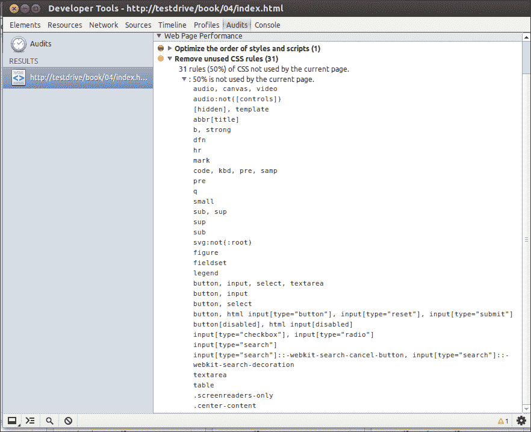
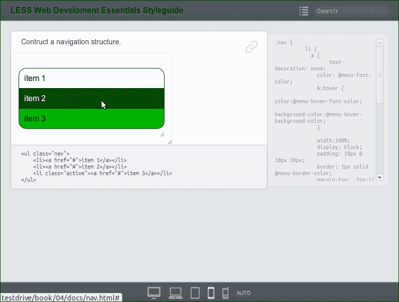
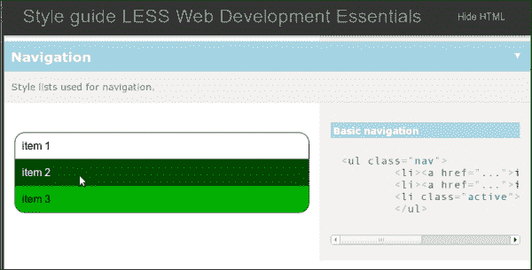
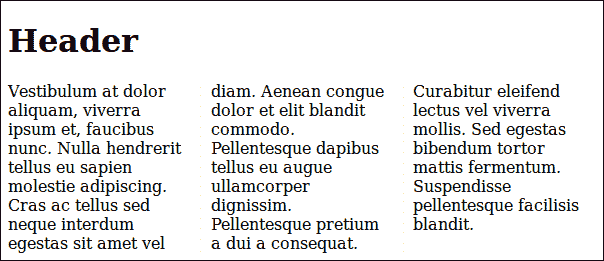
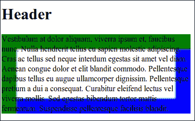
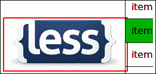
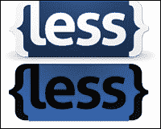
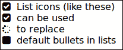
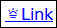
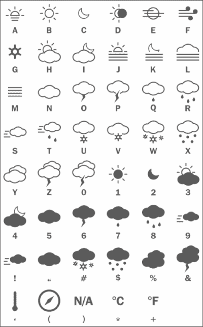

# 第四章：避免重复造轮子

在前几章中，你学会了如何使用*Less*来编译你的 CSS。*Less*帮助你创建可重用和可维护的 CSS 代码。你已经学会了如何组织你的文件，前一章还向你展示了命名空间的作用，使你的代码具有可移植性。*Less*帮助你编写高效的代码来处理浏览器的不兼容性。*Less*不能单独解决浏览器的不兼容性问题，但可以使你的解决方案可重用，尽管由于这个原因，可重用的混合仍然可能很复杂。在本章中，你将学会你不必自己编写所有这些复杂的代码。有一些预构建混合的库可以帮助你更快地工作并创建更稳定的代码。

本章将涵盖以下主题：

+   背景渐变

+   防止未使用的代码

+   测试你的代码

+   预构建混合的标志性字体

+   Retina.js

# 重新审视背景渐变

还记得第二章中讨论的 CSS3 背景渐变吗，*使用变量和混合*？为了在不同的浏览器上显示更好或相同的渐变，你必须使用特定于供应商的规则。不同的规则集会使你的混合更加复杂。在这种情况下，更复杂也意味着更难以维护。

在实践中，你的混合会随着过时的代码或不再受支持的代码而增长，另一方面，你必须更新你的混合以适应更新的浏览器。当然，我们只能希望新的浏览器版本支持 CSS3 规范，而不需要对代码进行进一步的更改。

**Can I use...**网站([`caniuse.com/`](http://caniuse.com/))提供了 HTML5、CSS3 和 SVG 支持的兼容性表，还有桌面和移动浏览器的兼容性表。它会告诉你，大多数当前浏览器在其当前版本中都支持 CSS 渐变。在撰写本书时，移动设备的 Android 浏览器仍然依赖于`-webkit`供应商规则，而 Opera Mini 根本不支持它。

如果放弃对旧版浏览器的支持，你的混合可以简化为以下代码片段：

```less
  .verticalgradient(@start-color: black; @end-color: white; @start-percent: 0%; @end-percent: 100%) {
    background-image: -webkit-linear-gradient(top, @start-color @start-percent, @end-color @end-percent);
    background-image: linear-gradient(to bottom, @start-color @start-percent, @end-color @end-percent);
    background-repeat: repeat-x;
 }
```

前面的代码还放弃了对 IE8 和 IE9 的支持。如果你选择支持这些浏览器，你必须添加额外的 IE 特定规则。**Can I use…**网站还向你展示了最常见浏览器的市场份额。在某些情况下，只为旧版浏览器提供功能支持而不指望所有浏览器看起来完全一样也是有用的。例如，一个没有高级动画的导航结构仍然可以帮助用户浏览你的网站。使用旧版浏览器的人并不总是期望最新的技术。这些技术也并不总是有附加值。旧版浏览器大多不运行在最新的硬件上；在这些浏览器上，对渐变等功能的支持只会减慢你的网站速度，而不会增加任何价值。

## 未使用代码

即使在长期运行和不断增长的项目中使用*Less*，也几乎不可能在你的代码中找不到一些未使用的代码。浏览器工具可以帮助检测最终 CSS 中的未使用代码。

### Chrome 的开发者工具

谷歌 Chrome 的开发者工具有一个选项可以找到未使用的 CSS。在谷歌 Chrome 中，导航到**工具** | **开发者工具**，选择**审核**选项卡，然后点击**运行**。

现在使用这个工具来测试前几章的演示代码。

首先，在浏览器中打开`http://localhost/index.html`并运行测试。你会看到以下截图：



Chrome 的开发者工具显示的未使用代码

未使用代码列表以`less/normalize.less`中定义的一长串样式开始，如第一章中所示，*使用 Less 改进 Web 开发*；这些是**CSS 重置**的样式。

在大多数项目中，每个页面都使用相同的 CSS 代码基础（相同的文件）。因此，您不能总是保证页面只包含真正使用的代码。其中一些代码不会在每个页面上使用，但将必须在其他或未来的页面上使用。Web 浏览器能够缓存 CSS 文件，因此最好使用相同的 CSS 文件来为网站的不同页面设置样式。某些页面将不使用所有缓存的样式规则，这将显示为该页面上未使用的代码。缓存的代码只加载一次并在每个页面上使用。CSS 重置似乎对所有页面都有用，因此您不应更改或删除它。

正如您所看到的，`.centercontent`和`.screen-readeronly`是未使用的。请记住，类被编译到您的 CSS 中，而 mixin 则不是。现在，`.centercontent`和`.screen-readeronly`被定义为类。拥有`.screen-readeronly`类似乎是有用的，但`.centercontent`可以更改为 mixin。

### Firebug CSS 使用附加组件

对于 Firefox，可以使用 Firebug 的附加组件。这将帮助您找到未使用的代码。您可以在[`addons.mozilla.org/en-US/firefox/addon/css-usage/`](https://addons.mozilla.org/en-US/firefox/addon/css-usage/)下载此插件。

# 测试您的代码

您不必自己编写所有的 Less 代码，因为它是可重用和可移植的。在 Web 上可以找到 Less 代码的 mixin 和片段，并在您的项目中（重新）使用。搜索*Less* mixin 背景渐变，您将得到许多有用的结果。尝试找到支持浏览器并满足您要求的代码。如果对 mixin 的浏览器支持有任何疑问，请考虑在 Stackoverflow.com 上提问。始终展示您的代码和您所做的事情；不要只是寻求解决方案。此外，关于*Less*的其他问题也可以在 Stackoverflow.com 上提问。

集成代码片段甚至完整的命名空间将使您的代码测试更加重要。

## 了解 TDD

测试驱动开发（TDD）是软件开发的一种经过验证的方法。在 TDD 中，您为项目中的每一段代码编写测试。在添加或改进功能或重构代码时，更改代码后，所有测试都应该通过。所有测试应该自动运行。虽然可以自动测试 Less 和 CSS 代码，但您需要手动查看不同浏览器和设备上页面的确切外观，尽管其他方面，如正确性和性能可以自动测试。例如，您可以使用 CSS Lint 等工具自动测试您的代码。CSS Lint 验证和测试您的代码，包括性能、可维护性和可访问性等方面。这些工具测试编译后的 CSS 而不是您的 Less 代码。Less Lint Grunt 插件编译您的 Less 文件，通过 CSS Lint 运行生成的 CSS，并输出任何发现的 CSS Lint 错误的冒犯的 Less 行。可以通过访问[`www.npmjs.org/package/grunt-lesslint`](https://www.npmjs.org/package/grunt-lesslint)获取更多信息。

## 关于样式指南的一切

样式指南提供了网站元素的概述，如按钮、导航结构、标题和字体。它展示了正确的呈现和颜色。为您的项目和网站创建样式指南可以帮助您测试您的 Less 代码。样式指南还将帮助项目的其他开发人员和内容发布者。

您现在可能会认为样式指南确实很有用，但也很耗时；因此，接下来将讨论两种工具。这些工具根据您的 *Less*（或编译后的 CSS）代码自动生成样式指南。这两种工具仍然需要一些额外的代码和努力，但不会花费太多时间。几乎总是值得测试您的代码。还要意识到这里的重大收益：您只需测试样式的效果。*Less* 保证您的 CSS 已经有效，并且 *Less* 编译器处理了它的优化。正如承诺的那样，这为您的真正设计任务提供了更多时间。

### 使用 StyleDocco 构建样式指南

StyleDocco 从样式表中生成文档和样式指南文档。StyleDocco 也非常适用于 *Less* 文件。要使用 StyleDocco 创建样式指南，您需要在 *Less* 文件中添加注释。注释应该解释样式的作用，并包含 HTML 示例代码。注释需要用 **Markdown** 编写。Markdown 是一种纯文本格式，可以轻松转换为 HTML。StackOverflow.com 使用 Markdown 发表和评论。您可以使用其帮助指南了解更多信息；您可以通过访问 [`www.stackoverflow.com/editing-help/`](http://www.stackoverflow.com/editing-help/) 找到它。

可以使用以下命令使用 **npm** 安装 StyleDocco：

```less
npm install -g styledocco

```

您已经在 第一章 中了解了 npm，*使用 Less 改进 Web 开发*。安装 StyleDocco 后，您需要在 *Less* 文件中添加 Markdown 注释。

要查看使用 StyleDocco 生成的样式指南示例，请在文本编辑器中打开 `less/nav.less`，并按照下面的代码片段添加 Markdown 描述，然后是 HTML 测试代码：

```less
/* Construct a navigation structure.

    <ul class="nav">
        <li><a href="#">item 1</a></li>
        <li><a href="#">item 2</a></li>
        <li class="active"><a href="#">item 3</a></li>
    </ul>
*/
```

要构建样式指南，请在终端中导航到您的 *Less* 文件夹（`lessc`）并运行以下命令：

```less
styledocco -n "Less Web Development Essentials Styleguide"  --preprocessor "/usr/local/bin/lessc"  --verbose [file path]

```

在上面的示例中，使用 `-n` 设置了样式指南的名称。通常情况下，如果您的文件路径只包含 *Less* 文件，则不必设置 `–preprocessor` 选项。要为您的 *Less* 文件构建样式指南，命令应该如下所示：

```less
styledocco -n "Less Web Development Essentials Styleguide" less/*

```

`styledocco` 命令会生成一个名为 `docs/` 的新文件夹。这个文件夹包含一个 `index.html` 文件，可以在浏览器中打开。最终结果应该看起来像下面的截图：



使用 StyleDocco 构建的样式指南示例

### 使用 tdcss.js 测试您的代码

`tdcss.js` 框架是另一个与 *Less* 配合良好并促进测试驱动开发的样式指南工具。`tdcss.js` 框架可以从 GitHub 免费下载，网址为 [`github.com/jakobloekke/tdcss.js`](https://github.com/jakobloekke/tdcss.js)。另请参阅 [`jakobloekke.github.io/tdcss.js/`](http://jakobloekke.github.io/tdcss.js/) 以获取更多信息。与 StyleDocco 不同，使用 `tdcss.js` 不会更改您的 *Less* 文件。您可以使用项目中相关源代码的片段生成样式指南。例如，您可以使用 HTML 注释样式编码，如 `<!-- : 导航 -->`，将它们分隔开。然后将片段复制并粘贴到一个 HTML 文档中，形成您的样式指南，并包含来自您的 *Less* 代码和 `tdcss.js` 的样式。示例导航的 HTML 文档的 `head` 部分应具有以下结构：

```less
<!-- Your Less code  -->
  <link rel="stylesheet/less" type="text/css" href="less/styles.less" />
  <script type="text/javascript">less = { env: 'development' };</script>
  <script src="img/less.js" type="text/javascript"></script>

<!-- TDCSS -->
<link rel="stylesheet" href="tdcss/tdcss.css" type="text/css" media="screen">
<script src="img/jquery-1.11.0.min.js"></script>
<script src="img/jquery-migrate-1.2.1.min.js"></script>

<script type="text/javascript" src="img/tdcss.js"></script>
<script type="text/javascript">
     $(function(){
         $("#tdcss").tdcss();
     })
</script>
```

body 中的标记如下：

```less
<div id="tdcss">
    <!-- # Navigation -->
    <!-- & Style lists used for navigation. -->
    <!-- : Basic navigation -->
       <ul class="nav">
        <li><a href="#">item 1</a></li>
        <li><a href="#">item 2</a></li>
        <li class="active"><a href="#">item 3</a></li>
       </ul>
</div>
```

通过在浏览器中打开 `http://localhost/tdcss.html` 查看上述代码的结果。最终结果应该看起来像下面的截图：



使用 tdcss.js 构建的样式指南示例

# 预构建的混合

您已经了解了在网络上搜索和找到 mixin。然而，使用和重用经过充分测试的 mixin 将比那更容易。其他开发人员已经构建了完整的库和预构建的 mixin，您可以在项目中使用。这些预构建的 mixin 帮助您编写*Less*代码，而无需考虑使 CSS3 复杂的供应商特定规则。在接下来的章节中，您将了解到五个最常用的库。这些库如下：

+   Less Elements ([`lesselements.com`](http://lesselements.com))

+   Less Hat ([`lesshat.madebysource.com/`](http://lesshat.madebysource.com/))

+   3L ([`mateuszkocz.github.io/3l/`](http://mateuszkocz.github.io/3l/))

+   ClearLess ([`clearleft.github.com/clearless/`](http://clearleft.github.com/clearless/))

+   Preboot ([`markdotto.com/bootstrap/`](http://markdotto.com/bootstrap/))

还可以在[`lesscss.org/usage/#frameworks-using-less`](http://lesscss.org/usage/#frameworks-using-less)找到更全面的 mixin 库列表。

请理解，您不必选择；没有限制您只能使用这些库中的一个。所有这些库都有优缺点；您必须选择最适合您项目需求的库。

全局上，所有库都为您提供一个*Less*文件，其中包含您可以在项目中导入的 mixin。虽然一些库也有一些设置，在所有情况下，`@import "{library-name}";`就足以使其 mixin 可用于您的项目。*Less*没有限制包含多个库，但这样做会导致 mixin 名称冲突的问题。所有具有相同名称的 mixin 将被编译为 CSS（如果它们的参数也匹配）。因此，一些库还具有这些 mixin 的带前缀版本。

与带前缀版本不同，使用命名空间，如第三章中所解释的，*嵌套规则、操作和内置函数*，在大多数情况下提供了更稳定的解决方案，如下面的代码片段所示：

```less
// create a namespace for {library-name}
#{library-name}{@import "{library-name}";}
```

使用`#{library-name} > mixin()`使 mixin 可用。

## 使用 Less Elements 为供应商特定规则提供单行声明

Less Elements 可能是本章讨论的库中最紧凑的一个。紧凑并不意味着它没有用处。这个库的重点是将跨浏览器前缀合并为单一简洁的声明。

还记得本章开头的垂直背景渐变吗？您已经看到，当您支持现代浏览器时，您将需要至少三个声明，包括供应商特定规则。

使用 Less Elements，您可以使用三个参数的单行声明来完成相同的操作，如下面的代码片段所示：

```less
element {
.gradient(#F5F5F5, #EEE, #FFF);
      }
```

第一个参数定义了在不支持渐变的浏览器中使用的回退颜色。渐变从底部到顶部，第二个参数设置底部颜色，第三个参数设置顶部颜色。

前面的*Less*代码最终将编译为以下 CSS：

```less
  element {
  background: #f5f5f5;
  background: -webkit-gradient(linear, left bottom, left top, color-stop(0, #eeeeee), color-stop(1, #ffffff));
  background: -ms-linear-gradient(bottom, #eeeeee, #ffffff);
  background: -moz-linear-gradient(center bottom, #eeeeee 0%, #ffffff 100%);
  background: -o-linear-gradient(#ffffff, #eeeeee);
  filter: progid:DXImageTransform.Microsoft.gradient(startColorstr='#ffffff', endColorstr='#eeeeee', GradientType=0);
}
```

在其简单性中，Less Elements 提供了许多有用的 mixin，用于使用**CSS3 技术**构建您的项目。它为所有 CSS3 属性提供了供应商特定规则的单行声明，并通过布局声明扩展了这一点。

`.columns()` mixin 将元素分成列，包括列之间的边框和间隙。`.columns()` mixin 的变量顺序为列宽、列数、列间隙、列边框颜色、列边框样式和列边框宽度。

这个 mixin 可以应用于非替换的块级元素（除表元素外）、表单元格和内联块元素，如`body`或`div`元素。

要将`div`元素分成宽度为 150 像素的三列，您现在可以在*Less*中编写以下代码：

```less
div.threecolumns {
 .columns(40px, 3, 20px, #EEE, solid, 1px);
}
```

前面的代码编译成 CSS，并如下所示：

```less
div.threecolumns {
  -moz-column-width: 150px;
  -moz-column-count: 3;
  -moz-column-gap: 20px;
  -moz-column-rule-color: #eeeeee;
  -moz-column-rule-style: solid;
  -moz-column-rule-width: 1px;
  -webkit-column-width: 150px;
  -webkit-column-count: 3;
  -webkit-column-gap: 20px;
  -webkit-column-rule-color: #eeeeee;
  -webkit-column-rule-style: solid;
  -webkit-column-rule-width: 1px;
  column-width: 150px;
  column-count: 3;
  column-gap: 20px;
  column-rule-color: #eeeeee;
  column-rule-style: solid;
  column-rule-width: 1px;
}
```

您还可以通过在浏览器中加载 `http://localhost/columns.html` 来测试这一点。还请将浏览器窗口从小屏幕调整到全屏幕，以查看这些列默认情况下是响应式的。编译后的 `.div.threecolumns` 类可以与以下 HTML 代码一起使用：

```less
<div class="threecolumns" role="content">Vestibulum at dolor aliquam, viverra ipsum et, faucibus nunc. Nulla hendrerit tellus eu sapien molestie adipiscing. Cras ac tellus sed neque interdum egestas sit amet vel diam. Aenean congue dolor et elit blandit commodo. Pellentesque dapibus tellus eu augue ullamcorper dignissim. Pellentesque pretium a dui a consequat. Curabitur eleifend lectus vel viverra mollis. Sed egestas bibendum tortor mattis fermentum. Suspendisse pellentesque facilisis blandit.</div>
```

前面的代码将产生以下截图：



使用 Less Elements 的 columns mixin 构建的多列布局示例

`.columns()` mixin 使用了 **CSS 多列布局模块**。有关此模块的更多信息可以在 [`www.w3.org/TR/css3-multicol/`](http://www.w3.org/TR/css3-multicol/) 找到。不幸的是，大多数现代浏览器对该模块的支持还不够好。

Less Elements 不提供有关编译后的 CSS 的浏览器支持的任何信息。在使用 Less Elements 时，您必须已经意识到了这一点。如前所述，您可以在 [caniuse.com](http://caniuse.com) 网站上检查浏览器支持情况。要找出哪些浏览器支持此多列布局模块，您将需要访问 [`caniuse.com/multicolumn`](http://caniuse.com/multicolumn)。始终检查前面的模块与您的项目的要求是否匹配。此外，此示例向您展示了为什么样式指南非常有用。

## Less Hat – a comprehensive library of mixins

与 Less Elements 不同，**Less Hat** 非常全面。在撰写本书时，Less Hat 包含了 86 个预构建 mixin。Less Hat 还与 CSS Hat 有着密切的关系。CSS Hat 是一款商业许可的工具，可以将 Adobe Photoshop 图层转换为 CSS。

Less Hat mixin 提供了禁用一些特定于浏览器的前缀的可能性。除非您有非常充分的理由这样做，否则不应该使用这个功能。默认情况下，Less Hat 通过将 *Less* 变量设置为 `true` 来使用所有浏览器前缀，如下面的代码所示：

```less
@webkit: true;
@moz: true;
@opera: true;
@ms: true;
@w3c: true;
```

在前面的代码中，`@w3c` 指的是定义了 **W3C 规范** 描述的标准属性名称的非前缀规则。Less Hat 宣传自己具有可以创建无限数量的阴影、渐变和动画的 mixin。**Box-shadow** 就是一个例子。使用 Less Hat，box-shadow mixin 可以写成 `.box-shadow(<offset-x> <offset-y> spread blur-radius color inset, …)`。

要尝试前面的 `.box-shadow` mixin，您可以使用 Less Hat 在 *Less* 中编写如下：

```less
div {
 .box-shadow(30px 30px 5px green inset,-30px -30px 5px blue inset);
}
```

前面的代码编译成以下代码片段：

```less
div {
  -webkit-box-shadow: 30px 30px 5px #008000 inset, -30px -30px 5px #0000ff inset;
  -moz-box-shadow: 30px 30px 5px #008000 inset, -30px -30px 5px #0000ff inset;
  box-shadow: 30px 30px 5px #008000 inset, -30px -30px 5px #0000ff inset;
}
```

要检查这一点，请在浏览器中打开 `http://localhost/boxshadow.html`，您将看到 `.box-shadow` mixin 的结果，如下截图所示：



Less Hat 的 box-shadow mixin 的效果示例

实际上，Less Elements 的 `.box-shadow()` mixin 不接受多个阴影，但在下一节讨论的 3L 的 mixin 可以处理用逗号分隔的多个阴影。

## 使用预构建 mixin 的 3L 库

**3L** (**Lots of Love for Less**) 是另一个预构建 mixin 集合。除了标准的单行声明，3L 还提供了额外的功能。3L 提供了用于 CSS 重置或规范化的 mixin，如 第一章 中所讨论的 *使用 Less 改进 Web 开发*。您可以在不将它们放在选择器块内的情况下调用这些 mixin，如下所示：

```less
.normalize();

/* OR */
.reset();

/* OR */
.h5bp();
```

在前面的`.h5bp()`重置中，您的 CSS 基于**HTML5 Boilerplate**。HTML5 Boilerplate 是一个专业的前端模板，用于构建快速、健壮和适应性强的 Web 应用程序或站点。您可以通过访问[`html5boilerplate.com/`](http://html5boilerplate.com/)获取有关 Boilerplate 的更多信息。3L 不仅提供了用于 HTML5 Boilerplate 重置的 mixin，还包含了用于 HTML5 Boilerplate 辅助类的 mixin。这些 mixin 包含了清除浮动和用于隐藏内容的 mixin，适用于浏览器或屏幕阅读器。

例如，`.visuallyhidden()`可以用于隐藏浏览器中的内容，但对于屏幕阅读器来说，这些内容是可用的。

### SEO 和 HTML 调试

**SEO**（搜索引擎优化）在现代网页设计中扮演着重要角色。正确和有效的 HTML5 是 SEO 的要求。此外，设置适当的标题，使用关键字的 meta 标签和描述以及图像的 alt 属性将有助于您的网站排名更高。

3L 的`.seo-helper()` mixin 将快速了解网页缺少的元素和属性。

要使用这个 mixin - 在导入 3L 后，您可以在*Less*中编写如下：

```less
html {
.seo-helper();
}
```

使用`.seo-helper()` mixin 后，您的 HTML 页面将包含有关缺少标题或 meta 标签的警告，并在缺少 alt 属性的图像周围显示红色边框，如下面的屏幕截图所示：



3L 的辅助类使缺少的 alt 属性可见

此外，访问`http://localhost/indexseo.html`以获取有关此类如何工作的更多见解。之后，您可以自行判断这个类是否有用。独立于您的判断，`.seo-helper()` mixin 向您展示了*Less*如何可以应用于网站样式之外的功能。

## ClearLess - 另一个预构建 mixin 库

ClearLess 还与 HTML5 Boilerplate 有关。与 3L 一样，ClearLess 提供了用于 HTML5 Boilerplate 和辅助类的 mixin。除此之外，ClearLess 还使用**Modernizr**。Modernizr 是一个 JavaScript 库，用于检测用户浏览器中的 HTML5 和 CSS3 功能。Modernizr 会为检测到的功能在您的 HTML 的`html`元素中添加额外的类。使用 Modernizr，您的`html`元素将如下面的代码片段所示：

```less
<html id="modernizrcom" class="js no-touch postmessage history multiplebgs boxshadow opacity cssanimations csscolumns cssgradients csstransforms csstransitions fontface localstorage sessionstorage svg inlinesvg no-blobbuilder blob bloburls download formdata wf-proximanova1proximanova2-n4-active wf-proximanova1proximanova2-i4-active wf-proximanova1proximanova2-n7-active wf-proximanova1proximanova2-i7-active wf-proximanovacondensed1proximanovacondensed2-n6-active wf-athelas1athelas2-n4-active wf-active" lang="en" dir="ltr">
```

这个类名列表告诉您一个功能是否可用。因此，用于生成前面代码的浏览器支持 box-shadow、opacity 等。使用 Modernizr，您将拥有可以在*Less*代码中使用的条件类。此外，ClearLess 还使用这些类。

除了 Modernizr mixin 外，ClearLess 还有用于图标和**CSS 精灵图像**的 mixin。

CSS 精灵图像是一种至少可以追溯到七年前的技术。网站的图像被添加到单个图像中，即精灵。如果浏览器请求图像，精灵将作为背景图像加载。**SpriteMe** ([`spriteme.org/`](http://spriteme.org/))可以帮助您为您的项目创建精灵。CSS 用于显示包含精灵部分的请求图像。加载一个大的精灵，可以被缓存，而不是几个小图像，将减少浏览器显示页面所需的 HTTP 请求的数量。HTTP 请求越少，页面加载速度就越快。

为了演示这一点，请使用本章的代码包中的*Less*图像的简单精灵（`less-sprite.png`），如下面的屏幕截图所示：



简单精灵图像的示例

要使用精灵图像，您可以在*Less*中编写如下：

```less
#clearless {
@import "clearleft-clearless-63e2363/mixins/all.less";
@sprite-image: "../images/less-sprite.png";
@sprite-grid: 80px; //image height
}

.logo {
    #clearless > .sprite-sized(0,0,200px,80px);
    &:hover {
    #clearless > .sprite-sized(0,1,200px,80px);
    }
}
```

这段代码也可以在`less/sprite.less`中找到。请注意，`#clearless`命名空间有自己的作用域，因此`@sprite-grid`和`@sprite-grid`应该在命名空间内定义。变量通过重新声明进行设置。

前面代码的编译 CSS 将如下所示：

```less
.logo {
  background-image: url("../images/less-sprite.png");
  background-repeat: no-repeat;
  background-position: 0px 0px;
  width: 200px;
  height: 80px;
}
.logo:hover {
  background-image: url("../images/less-sprite.png");
  background-repeat: no-repeat;
  background-position: 0px -80px;
  width: 200px;
  height: 80px;
}
```

加载`http://localhost/index.html`以查看前面代码的效果。

最后，应该提到 ClearLess 定义了一些混合来构建网格。这些混合将在下一节中向您解释，因为它们是从**Preboot**中采用的。

## 使用 Preboot 的预构建混合来构建您的项目

Preboot 最初是由 Mark Otto (`@mdo`)编写的，是一个全面灵活的*Less*实用工具集。Preboot 是 Twitter 的**Bootstrap**的前身。Bootstrap 是用于在 Web 上开发响应式、移动优先项目的前端框架。您将在第六章中了解更多关于 Bootstrap 的内容，*Bootstrap 3、WordPress 和其他应用*。Bootstrap 改进了原始的 Preboot 代码。最后，Bootstrap 中的许多*Less*变量和混合改进被带回到了 Preboot 2 中。

Preboot 带有混合来构建网格系统，因为它与 Bootstrap 有关。这个网格系统创建一个包含 12 列的行。在浏览器中打开从下载的代码包中的`http://localhost/prebootgrid.html`，以查看一个包含两行的示例。第一行网格包含三列，第二行包含两列。这个网格默认是响应式的；您可以通过使用示例网格使浏览器窗口变小来看到这一点。如果屏幕宽度小于 768 像素，网格中的列将堆叠在彼此下面，而不是水平排列。以下代码示例只显示了编译后的 CSS，没有响应式类。

使用 Preboot，您可以在*Less*中编写以下代码：

```less
.col-a-half { 
.make-column(6); 
}
```

前面的代码编译成 CSS 如下（它是非响应式的）：

```less
.col-a-half {
  min-height: 1px;
  padding-left: 15px;
  padding-right: 15px;
  -webkit-box-sizing: border-box;
  -moz-box-sizing: border-box;
  box-sizing: border-box;
  float: left;
  width: 50%;
}
```

在第五章中，*将 Less 集成到您自己的项目中*，您将找到另一个示例，该示例使用了 Preboot 的网格，并更详细地讨论了其响应性特性。

Preboot 设置了一些变量来定义网格，如下面的代码片段所示：

```less
// Grid
// Used with the grid mixins below
@grid-columns:          12;
@grid-column-padding:   15px; // Left and right inner padding
@grid-float-breakpoint: 768px;
```

此外，其他值，如基本颜色，已预先定义如下：

```less
// Brand colors
@brand-primary:           #428bca;
@brand-success:           #5cb85c;
@brand-warning:           #f0ad4e;
@brand-danger:            #d9534f;
@brand-info:              #5bc0de;
```

事实上，Preboot 不是一个完整的 CSS 框架；另一方面，它不仅仅是一个预构建混合的库。

# 使用 Less 将其他技术集成到您的项目中

除了预构建的混合，还有一些其他技术可以轻松集成到您的项目中使用*Less*。

## 使用图标字体

顾名思义，图标字体是作为字体定义的一组图标。图标字体可以替换项目中的图像图标。使用图标字体而不是图像的主要原因，以及它们在这里讨论的原因是，就像任何普通字体一样，图标字体可以完全通过 CSS 进行操作。在您的项目中，您可以使用*Less*设置所使用的图标字体的大小、颜色和阴影。使用图标字体的主要原因是为了提高网站的加载时间；只需要一个 HTTP 请求就可以加载它们。图标字体在不同的分辨率和显示器上看起来也很好。

在本书中，图标字体已经在第三章中使用过，*嵌套规则、操作和内置函数*。这些示例中使用了 CDN 加载 Font Awesome。Font Awesome 还在 GitHub 上提供了一组*Less*文件，网址为[`github.com/FortAwesome/Font-Awesome/tree/master/less`](https://github.com/FortAwesome/Font-Awesome/tree/master/less)。您可以通过以下步骤使用这些文件在项目中集成 Font Awesome：

1.  将`font-awesome/`目录复制到您的项目中。

1.  打开项目的 `font-awesome/less/variables.less` 文件，并编辑 `@fa-font-path` 变量，将其指向字体目录，`@fa-font-path: "../font";`。

1.  在您的主*Less*文件中导入 Font Awesome 的*Less*文件，`@import "font-awesome-4.0.3/less/font-awesome.less";`。

执行前面的步骤后，您可以在 HTML 文档中使用以下代码片段： 

```less
<ul class="fa-ul">
  <li><i class="fa-li fa fa-check-square"></i>List icons (like these)</li>
  <li><i class="fa-li fa fa-check-square"></i>can be used</li>
  <li><i class="fa-li fa fa-spinner fa-spin"></i>to replace</li>
  <li><i class="fa-li fa fa-square"></i>default bullets in lists</li>
</ul>
```

在您的网络浏览器中打开前面的代码将得到以下截图：



具有 Font Awesome 项目的 HTML 列表

您将在可下载文件的`less/font-awsome.less`中找到前面 HTML 列表的*Less*代码。请检查此文件。您将看到您无需更改 Font Awesome 的原始文件来设置`@fa-font-path`。`@fa-font-path`变量将通过重新声明进行设置，并使用上一次声明获胜的规则，如前面在第二章中所解释的，*使用变量和 mixin*。

您可以通过访问[`fontawesome.io/examples/`](http://fontawesome.io/examples/)找到更多 Font Awesome 用法的例子。

此外，其他图标字体，如 Bootstrap 的 Glyphicons，也可以与*Less*一起使用（请参阅[`github.com/twbs/bootstrap/blob/master/less/glyphicons.less`](https://github.com/twbs/bootstrap/blob/master/less/glyphicons.less)）。但是，在找不到*Less*文件的图标字体的情况下，您现在已经有足够的知识来自己创建所需的*Less*代码。

尝试编写所需的*Less*代码，将 Meteocons ([`www.alessioatzeni.com/meteocons/`](http://www.alessioatzeni.com/meteocons/))集成到您的项目中作为练习，或执行以下步骤：

1.  首先从[`www.alessioatzeni.com/meteocons/res/download/meteocons-font.zip`](http://www.alessioatzeni.com/meteocons/res/download/meteocons-font.zip)下载字体。

1.  在这个压缩文件中，您将找到四个文件：`meteocons-webfont.eot`，`meteocons-webfont.svg`，`meteocons-webfont.ttf`和`meteocons-webfont.woff`。这些是在不同浏览器中显示 Meteocons 所需的不同格式。

1.  将这些文件复制到您项目的`fonts/`文件夹中。您还将找到包含这些字体文件的`stylesheet.css`。此文件包含 Meteocons 的`@fontface`样式。如果您检查 Font Awesome 的*Less*文件，您将找到相同类型的样式。在您的项目中使用字体，需要`@fontface`声明。

现在，您应该记住 Less Hat 预构建的 mixin。Less Hat 具有 fontface mixin，`.font-face(@fontname, @fontfile, @fontweight:normal, @fontstyle:normal)`。

使用此 fontface mixin，您可以将以下代码添加到您的*Less*代码中：

```less
#lesshat {@import "lesshat/lesshat.less";}

@font-face {
#lesshat > .font-face("Meteocons", "../fonts/meteocons-webfont");
}

[data-icon]:before {
        font-family: 'Meteocons';
        content: attr(data-icon);
}
```

前面的代码将编译为以下 CSS：

```less
@font-face {
  font-family: "Meteocons";
  src: url("../fonts/meteocons-webfont.eot");
  src: url("../fonts/meteocons-webfont.eot?#iefix") format("embedded-opentype"), url("../fonts/meteocons-webfont.woff") format("woff"), url("../fonts/meteocons-webfont.ttf") format("truetype"), url("../fonts/meteocons-webfont.svg#Meteocons") format("svg");
  font-weight: normal;
  font-style: normal;
}
[data-icon]:before {
  font-family: 'Meteocons';
  content: attr(data-icon);
}
```

前面的 CSS 代码使您可以使用以下 HTML 代码：

```less
<a href="" data-icon="A">Link</a>
```

在 HTML 中的前面代码将如下截图所示：



使用 Meteocon 的超链接

之前，您已经看到了如何通过类名添加 Font Awesome 图标。要将此功能添加到 Meteocons，您将需要编写一些*Less*代码。以下图表显示了该字体的每个图标的字母：



气象字体

现在，根据以下方式为每个图标在您的*Less*代码中添加一个类声明：

```less
. meteocons-sun               { &:before { content: "\2a"; } }
```

在前面的示例中，`.meteocons-sun`是您的类名，`\2a`表示类似字符的十六进制值。 2A 十六进制是 42 十进制，`*`（星号）的 ASCII 值为 42。您还可以使用八进制或十进制（对于前 128 个可打印字符）。有时，unicode 的`\u`会被添加，例如在前面的代码中的`\u002a`。

如果您添加这些类声明，您的列表将如下代码片段所示：

```less
.mc-light-sunrise:before {
  content: "\0041";
}
.mc-light-sunshine:before {
  content: "\0042";
}
.mc-light-moon:before {
  content: "\0043";
}
.mc-light-eclipse:before {
  content: "\0044";
}
and so on
```

现在，您已经掌握了图标字体的基础知识，并且可以扩展您的代码。例如，添加以下代码以设置字体的大小：

```less
.mc-2x { font-size: 2em; }
.mc-3x { font-size: 3em; }
.mc-4x { font-size: 4em; }
.mc-5x { font-size: 5em; }
```

在本章的下载部分，您将找到完整的*Less*代码，以便像 Font Awesome 一样在`less/meteocons`中使用 Meteocons。正如您所看到的，大部分 Font Awesome 的代码可以被重用。请访问`http://localhost/indexmeteo.html`以了解如何使用此代码。

## Retina.js

高密度设备的每英寸或每厘米像素比普通显示屏多。苹果为其双倍密度显示屏引入了**Retina**一词。如果您放大图像（或将其放大），它将变得模糊。这是网页设计师在为高密度设备设计时必须解决的问题。您可能想知道这与*Less*有什么关系。 CSS 结合媒体查询（您将在第五章中了解更多关于媒体查询的信息，*将 Less 集成到您自己的项目中*），可以防止您的图像在高密度显示屏上变得模糊。

要理解发生了什么，您必须意识到 CSS 像素实际上是设备独立的。CSS 像素用于在浏览器中给元素赋予物理尺寸。在普通屏幕上，一个 CSS 像素匹配一个设备像素。高密度显示屏比 CSS 像素有更多的设备像素；在 Retina 的情况下，它们的像素数量是 CSS 像素的四倍。更多和更小的像素使人眼无法看到单个像素，并且应该提供更好的用户体验。

Retina 显示屏上的图像宽度为 300 个 CSS 像素，需要 600 个设备像素才能保持相同的物理尺寸。现在，您可以通过使用更高分辨率（CSS 像素）的位图，并通过 HTML 或 CSS 进行缩小，来防止图像模糊。

在普通显示屏上，您的 HTML 将如下所示：

```less

```

在 Retina 显示屏上，您将使用以下代码片段显示相同的图像：

```less

```

目前，有一个惯例，即在高密度图像的名称中添加`@2x`，例如`example@2x.png`。

您现在应该明白，您可以使用*Less*编写高效的代码，为这些不同的图像提供正确的 CSS 尺寸。`retina.js`库（[`github.com/imulus/retinajs`](https://github.com/imulus/retinajs)）帮助您处理高密度图像和显示屏；它结合了 JavaScript 和*Less*来编写您的 Retina 代码。

对于普通图像，您必须使用以下代码片段：

```less

```

前面的代码将由 JavaScript 处理，但您将需要使用*Less*来设置背景图像。这里，背景不仅指页面背景，还指由 CSS 设置的每个背景。大多数现代设计都使用背景图像进行布局；此外，辅助功能规则要求由 CSS 设置装饰性图像。

使用`retina.js`，您可以在*Less*中编写以下代码：

```less
.logo {
  .at2x('/images/my_image.png', 200px, 100px);
}
```

前面的代码将编译为以下 CSS：

```less
.logo {
  background-image: url('/images/my_image.png');
}

@media all and (-webkit-min-device-pixel-ratio: 1.5) {
  .logo {
    background-image: url('/images/my_image@2x.png');
    background-size: 200px 100px;
  }
}
```

此外，之前提到的其他预构建 mixin 库将具有用于设置 Retina 背景的 mixin。

# 总结

在本章中，您已经学会了如何保持代码清晰，并使用样式指南进行测试。您已经学会了如何使用具有预构建 mixin 的库，这有助于更快、更安全地开发您的*Less*代码。最后但同样重要的是，您已经学会了如何使用*Less*和图标字体，并使您的项目准备好 Retina。

在下一章中，您将学习如何在您的项目中集成*Less*，或者如何从头开始使用*Less*开始一个项目。您还将学习如何组织项目文件并重用旧的 CSS 代码。最后，您将使用媒体查询构建一个响应式网格。
