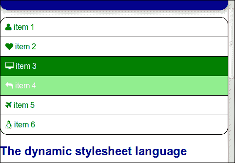
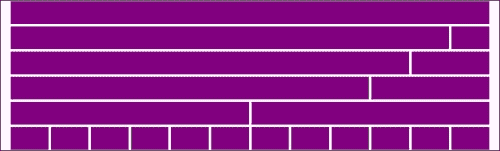
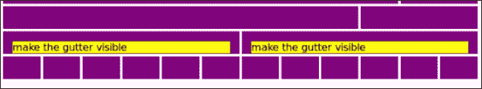

# 第五章：将 Less 集成到你自己的项目中

现在是时候将*Less*集成到你的工作流程和项目中了。在本章中，你将学会迁移你当前的项目或从头开始使用*Less*。将讨论将你的 CSS 代码转换为*Less*代码的技术和工具，最后，你将学会使用*Less*构建和使用响应式网格。

本章将涵盖以下主题：

+   将 CSS 导入到*Less*中

+   将你的项目迁移到*Less*

+   从头开始一个项目

+   媒体查询和响应式设计

+   在你的项目和设计中使用网格

在使用*Less*并看到它如何解决重复代码和无法重用 CSS 的问题时，你可能会想知道何时开始在项目中使用*Less*。尽管这可能是本书中最重要的问题，答案却很简单。你将不得不立刻开始！CSS 的问题可能是你**设计过程**中的一些缺陷。一旦检测到缺陷，就没有理由不立即解决它们。如果你现在不开始，你可能永远不会开始，最终你将花费太多时间调试你的 CSS 代码，而不是在真正的设计任务上工作。

# 将 CSS 导入到 Less 中

正如你现在已经知道的那样，有效的 CSS 也是有效的*Less*代码。CSS 代码可以被导入到*Less*中。有不同的方法来做到这一点。在导入你的 CSS 之后，你可以通过编译器运行结果。这为你提供了一个在当前项目中开始使用*Less*的简单方法。

在开始导入你的 CSS 代码之前，考虑创建一个**样式指南**。样式指南有助于测试你的代码，如第四章中所述，*避免重复造轮子*。还要记住，*Less*是一个**CSS 预处理器**。这意味着你必须在将*Less*代码投入生产之前将其编译成 CSS。客户端编译只应用于测试目的！只是导入你的 CSS 并将其重新编译成 CSS 是没有意义的。导入 CSS 还提供了将现有 CSS 与新编写的*Less*代码结合以及逐步进行*Less*转换的机会。

## 使用@import 规则

之前，你已经看到*Less*中的`@import`规则用于将*Less*文件导入到你的项目中。*Less*中的这个规则是 CSS 中相同规则的扩展版本。

在之前章节的示例中，`@import`规则只用于导入*Less*文件。默认情况下，每个文件只被导入一次。完整的语法如下：

```less
@import (keyword) "filename";
```

有六个关键字可以与这个规则一起使用：`reference`，`inline`，`less`，`css`，`once`和`multiple`。例如，`@import (reference) "file.less"`中的`reference`关键字将使`file.less`中的 mixin 和类可用，而不会将它们编译到生成的 CSS 中。

这可以很容易地通过一个例子来展示。你可以从 Packt 网站([www.packtpub.com](http://www.packtpub.com))下载本书所有章节的示例代码。之前章节的示例布局将在这里再次使用。请记住，这个项目的主文件`styles.less`导入了其他项目文件。现在你可以使用它来重用导航栏。首先创建一个新文件，并将以下代码写入其中：

```less
@import (reference) "styles";
.nav:extend(.nav all){};
```

这两行将编译成以下代码：

```less
.nav {
  list-style: none outside none;
  padding: 0;
}
.nav li a {
  text-decoration: none;
  color: #000000;
  width: 100%;
  display: block;
  padding: 10px 0 10px 10px;
  border: 1px solid #004d00;
  margin-top: -1px;
}
.nav li a:hover {
  color: #ffffff;
  background-color: #004d00;
}
.nav li.active a {
  color: #000000;
  background-color: #00b300;
}
.nav li:first-child a {
  border-radius: 15px 15px 0 0;
}
.nav li:last-child a {
  border-radius: 0 0 15px 15px;
}
```

还要注意，前面的结果包含了原始项目中`variables.less`中定义的值。

`inline`关键字用于导入与*Less*不兼容的代码。虽然*Less*接受标准 CSS，但有时注释和 hack 不会被编译。使用`inline`关键字将 CSS 按原样导入输出。如下面的代码所示，`inline`关键字与`css`关键字有很大的不同。`less`关键字强制导入的代码被编译。使用`@import (less) "styles.css"`时，所有代码将像往常一样被编译。与此同时，`css`关键字强制`@import`作为普通的 CSS 导入。下面的代码显示了`inline`和`css`之间的区别：

```less
@import (css) "styles.css";
```

上述代码的输出如下：

```less
@import "styles.css";
```

在编译的 CSS 代码中，使用`@import`导入的样式表在所有其他规则之前声明。这些样式表可以在**CSS 优先级**中发挥作用，这在第一章中有所讨论，*使用 Less 改进 Web 开发*。因此，您不能应用高级技术，如命名空间，应该在开始时导入未使用*Less*创建的文件。

CSS 2.1 用户代理必须忽略任何出现在块内或在任何非忽略语句之后的`@import`规则，除了`@charset`或`@import`（[`www.w3.org/TR/CSS21/syndata.html#at-rules`](http://www.w3.org/TR/CSS21/syndata.html#at-rules)）。如果导入具有相同名称的文件两次，默认只会编译一个。如果使用`once`关键字，也会发生相同的情况；另一方面，如果使用`multiple`关键字，文件将在输出中被编译两次。下面的代码将为您演示使用`multiple`关键字时的多重输出的示例：

如果`styles.less`文件包含以下代码：

```less
p {
color: red;
}
```

您的*Less*代码如下：

```less
@import (multiple) "style";
@import (multiple) "style";
```

上述代码将输出以下 CSS 代码：

```less
p {
  color: red;
}
p {
  color: red;
}
```

# 迁移您的项目

使用不同的导入规则，您可以在项目中开始使用 Less 而无需更改代码。导入 CSS 后，您可以逐步开始定义变量和使用混合。在开始将其用于生产之前，始终检查新代码的输出。

### 提示

请记住，样式指南可以帮助您管理项目的迁移，也不要忘记在生产环境中使用*Less*之前，在服务器端将其编译为 CSS 代码。

## 组织您的文件

尝试以与前面示例相同的方式组织您的文件。为项目的变量和混合创建单独的文件。如果您的项目之前在`project.css`中定义了样式表，您的主*Less*文件可能如下所示：

```less
@import "reset.less";
@import "variables.less";
@import "mixins.less";
@import (less) "project.css";
```

在上述代码中，您将导入原始的`project.css`；或者，您可以将其重命名为`project.less`。还要注意，您最终将编译一个新的 CSS 文件，该文件将用于您的项目。可以使用相同的名称来命名此文件；确保不要覆盖原始的 CSS 文件。虽然新的 CSS 文件应用相同的样式，但这些文件更有组织性，*Less*保证它们只包含有效的 CSS。编译器还将压缩 CSS 文件。

## 将 CSS 代码转换为 Less 代码

在**迁移**过程中，您可能更喜欢不必一步一步地转换代码。有一些可用的工具可以将 CSS 代码转换为*Less*代码。这些工具应该谨慎使用。**Lessify**可以帮助您将 CSS 代码组织成*Less*代码。Lessify 将相同元素或类的规则放在一起。您可以通过访问[`leafo.net/lessphp/lessify/`](http://leafo.net/lessphp/lessify/)来使用 Lessify。

考虑以下 CSS 代码：

```less
p {
  color: blue;
}
p  a {
  font-size:2em;
}
p a:hover {
  text-decoration: none;
}
```

使用 Lessify 后，前面的 CSS 代码编译成以下*Less*代码：

```less
p {
  color:blue;
  a {
    font-size:2em;
  }
  a:hover {
    text-decoration:none;
  }
}
```

你可以在[`css2less.cc/`](http://css2less.cc/)找到另一个工具叫做 CSS2Less。此外，这个工具只会分组类和元素规则。Lessify 和 Css2Less 在组织你的样式时可能会有所帮助。这两个工具都不支持**媒体查询**。

从迄今为止学到的所有知识来看，通过开发你的*Less*代码来开始项目似乎是一个不错的做法。因此，通过使用*Less*构建样式指南来开始你的项目。

你的`project.less`文件可能如下所示：

```less
@import "reset.less";
@import "variables.less";
@import "mixins.less";
```

将`project.less`文件与客户端`less.js`编译器集成到你的样式指南中。之后，开始添加你的设计元素，或者在你的代码中添加注释。

当你完成了你的样式指南，你可以开始构建最终的 HTML 代码。如果你要构建一个响应式网站，你应该首先确定你将需要哪些**屏幕尺寸**。例如，移动设备、平板和台式机可能是一个不错的选择。

为了更好地理解在流程的这个阶段如何使用*Less*，以下两个部分描述了**CSS 媒体查询**在响应式设计中的作用，并教你如何使用**网格**。

# 媒体查询和响应式设计

媒体查询是 CSS3 模块，自 2012 年 6 月以来一直是 W3C 的候选推荐。媒体查询增加了在媒体查询评估为 true 时仅将样式表应用于 CSS 的可能性。媒体查询评估设备的类型和设备的特性。设备的类型有屏幕、语音和打印等，特性有宽度、**设备宽度**和分辨率等。

如今，屏幕类型和设备宽度在响应式网页设计中扮演着重要的角色。通过使用媒体查询，可以将 CSS 规则限制在指定的屏幕宽度上，从而根据不同的屏幕分辨率改变网站的呈现方式。

一个典型的媒体查询看起来像下面的代码行：

```less
@media  { ... }
```

例如，以下媒体查询在视口宽度大于 767 像素时将字体颜色设置为黑色：

```less
@media screen and (min-width: 768px) {
  color:black;
  //add other style rules here
}
```

在上述代码中，我们可以看到花括号之间的所有样式规则只有在屏幕宽度大于 768 像素时才会应用。这些样式规则将遵循正常的**级联规则**。

## 使你的布局流动

到目前为止，你的布局一直由`@basic-width`定义的固定宽度。流动设计将其宽度定义为视口或浏览器窗口宽度的百分比。

为了使你的布局流动，定义`@basic-width: 900px;`在`less/responsive/project.less`中。这个设定值不再定义你设计的宽度，而是在你的改变后只设置`max-width`变量。

之后，打开`.center-content()` mixin 中的`less/responsive/mixinsresponsive.less`，将`width:@basic-width;`改为`max-width:@basic-width;`。

页眉现在是流动的，无需进一步更改。页脚列也是基于`@basic-width`的，所以你也需要对它们进行更改。

页脚列的宽度由以下代码设置：

```less
width: ((@basic-width/3)-@footer-gutter);
```

请使用以下代码在`less/responsive/footer.less`中更改页脚列的宽度：

```less
width: ~"calc((1/3 * 100%) - @{footer-gutter})";
```

可以通过访问[`caniuse.com/#feat=calc`](http://caniuse.com/#feat=calc)来检查`calc()`函数的浏览器支持情况。还要记住第一章中关于`calc()`和**字符串插值**的说明，*使用 Less 改进 Web 开发*。*Less*代码是无状态的，因此这些宽度计算应该由浏览器中的 CSS 完成。一旦 CSS 加载完成，浏览器就有了真实的像素宽度，因此浏览器可以计算并呈现列的宽度。

最后，你将需要改变`less/contentresponsive.less`并在其中添加媒体查询。如果屏幕宽度小于 500 像素，导航和内容应该在你的布局中堆叠。

首先，通过将宽度设置为`width: 2 / 3 * 100%;`和`width: 1/ 3 * 100%;`，使`#content`和`#sidebar`变为流体。现在，宽度是流体的，您可以添加媒体查询。对于`#content`，您应该将代码更改为以下代码：

```less
  width:  2 / 3 * 100%;
  float:left;
  @media (max-width:500px) {
    width:100%;
    float:none;
  }
```

前面的代码如果屏幕宽度小于 500 像素，则将`#content`的宽度设置为`100%`。它还会删除元素的浮动。您应该对`#sidebar`做同样的操作。

进行这些更改后，屏幕宽度为 500 像素时，导航将堆叠在内容下方。

如何在屏幕宽度小于 500 像素的屏幕上交换导航和内容的位置，可以在`http://localhost/indexresponsivechange.html`中看到。您可以通过两个步骤完成这个过程。首先，在 HTML 文档中交换`#content`和`#sidebar`的内容。打开`http://localhost/indexresponsivechange.html`，并将源代码与`http://localhost/indexresponsive.html`进行比较。进行这些更改后，侧边栏将显示在屏幕的左侧。要将侧边栏移动到右侧，您应该将其浮动设置为`right`而不是`left`，如下面的代码所示：

```less
  //one third of @basic-width
  #sidebar {
   width: 1 / 3 * 100%;
   float:right;
   @media (max-width:500px) {
    width:100%;
    float:none;
   }
  }
```

在小屏幕上，布局现在看起来像以下的截图：



在手机上您的布局可能会是这样的一个例子

### 在手机上测试您的布局

您肯定也会在手机上检查响应式布局。确保在 HTML 文档的头部添加以下额外的代码行：

```less
<meta name="viewport" content="width=device-width, initial-scale=1.0">
```

前面的代码强制移动浏览器在视口中加载您的网站，该视口等于设备的屏幕宽度。默认情况下，移动浏览器会在比屏幕尺寸更大的视口中加载网站。这样做可以让非移动网站在大屏幕上按预期加载。加载网站后，用户可以滚动和放大结果。如果您优化的移动布局在宽度大于 500 像素的视口中加载，媒体查询将无法工作，强制视口调整为设备的屏幕尺寸，从而防止媒体查询不被应用。请注意，这也意味着您将不得不使用屏幕宽度不超过 500 像素的手机测试此示例。您还可以在[`www.responsinator.com/`](http://www.responsinator.com/)等网站上测试您的设计。

### 首先为移动设备编码

如今，先为移动设备编写样式，然后使用媒体查询来调整它们以适应更大的屏幕是很常见的。您可以在示例布局的文件`header.less`和`content.less`中找到编码的移动设备优先原则的示例。还可以打开`less/responsive/footer.less`，看看媒体查询如何添加浮动：

```less
    @media (min-width:501px) {
      float: left;
      width: ((@basic-width/3)-@footer-gutter);
    }
```

这个例子展示了一种**移动设备优先**的编码方式。元素默认堆叠，并在屏幕尺寸增大时变为水平。请注意，诸如 Internet Explorer 8 之类的旧版浏览器不支持媒体查询，并且始终会显示堆叠版本。

# 在您的设计和工作流程中使用网格

前面的媒体查询示例没有使用网格。您可能想知道什么是网格，以及为什么应该使用它。**基于网格的布局**将设计分成一系列大小相等的列和行。内容和图形元素可以根据此布局进行组织。网格有助于为设计创建逻辑和正式的结构。它可以防止原始设计与 HTML 中最终实现之间的不一致，因为设计师和开发人员使用相同的网格。

网格在响应式设计中也很有帮助，因为网格的列可以轻松重新排列以适应不同的屏幕宽度。

在本书的初步章节中，您已经了解了定义布局结构的 CSS 模块。Flex boxes 和 columns 可以用来定义 CSS 布局和网格。尽管这些布局默认情况下是响应式的，或者可以很容易地定义为响应式，但它们还不是定义 CSS 布局的常用方式。如前所述，大多数现代浏览器尚未准备支持这些模块。幸运的是，有其他方法可以使用 CSS 定义网格。

网格的列宽可以定义为网格的百分比或固定宽度。流体网格将其宽度定义为视口的百分比。在流体网格中，列宽随屏幕宽度变化。流体布局可以重新排列内容以占用可用的屏幕宽度，因此用户需要滚动的次数更少。另一方面，设计师对设计的精确表示没有太多控制。因此，大多数响应式网格是流体和固定网格的混合体。

## 网格中 CSS 浮动的作用

CSS 的`float`属性是 CSS 中的一个位置属性；浮动将元素推到屏幕的左侧（或右侧），并允许其他元素围绕它包裹。因此，CSS 的`float`在大多数**CSS 网格**中起着重要作用。

一个示例将帮助您了解这是如何工作的。您将创建一个具有两列的网格。开始编写固定网格的*Less*代码。示例如下：

```less
@grid-container-width: 940px;
@column-number: 2;

.container {
  width: @grid-container-width;
  .row {
    .col {
 float: left;
              width: (@grid-container-width/@column-number);
    }
    .col2{
      width: 100%;
    }
  }
}
```

您可以使用上述代码的编译 CSS 和以下 HTML 代码：

```less
<div class="container">
  <div class="row">
    <div class="col">Column 1</div>
    <div class="col">Column 2</div>
  </div>
  <div class="row">
    <div class="col2">Column 3</div>
  </div>
</div>
```

您可以通过访问本书可下载示例代码中的`http://localhost/grid.html`来检查上述代码的结果。

现在，您有一个固定网格的示例。通过使用以下*Less*代码更改固定宽度，可以使此网格成为流体网格：

```less
@grid-container-width: 100%;
```

在这个网格中，`.container`类包含网格。此容器包含了使用`.row`类定义的行。您只需要定义两个额外的类，因为此网格有两列。第一个类`.col`定义了单列，第二个类`.col2`定义了双列。

### 使您的网格具有响应性

要使网格具有响应性，您必须定义一个或多个断点。断点定义了网站响应以提供合适布局的屏幕宽度；在断点以下或以上，网格可以提供不同的布局。在示例网格中，您可以描述两种情况。在第一种情况下，在断点以下（例如 768 像素），屏幕很小。在小屏幕上（记住手机屏幕），网格的列应该堆叠。在断点以上，对于平板电脑和台式机屏幕，网格应该变为水平，网格行的列将浮动在一起。

在*Less*中，您可以使用以下代码为小屏幕编写第一种情况：

```less
.container {
  width: @grid-container-width;
  .row {
    .col, .col2 {
      width: 100%;
    }
   }
}
```

所有列都占视口的`100%`宽度，没有一个浮动。从最小的屏幕开始编写代码将生成“移动优先”网格。移动优先设计从小屏幕（和移动浏览器）开始，为大屏幕重新排列和添加内容。您已经看到网格在较大屏幕上变为水平。其他示例可能是导航，它有另一种表示，或者图像滑块，它只对桌面用户可见。

现在尝试通过添加媒体查询并在*Less*中定义断点来使您的网格具有响应性，如下所示：

```less
@break-point: 768px;

.container {
  width: @grid-container-width;
  .row {
    .col, .col2 {
      width: 100%;
    }
    @media(min-width: @break-point) {
      .col {
        float: left;
        width: (@grid-container-width/@column-number);
      }
    }
  }
}
```

编译为 CSS 代码的上述代码将如下所示：

```less
.container {
  width: 100%;
}
.container .row .col,
.container .row .col2 {
  width: 100%;
}
@media (min-width: 768px) {
  .container .row .col {
    float: left;
    width: 50%;
  }
}
```

很容易看到现在`.row`类只在宽度大于 768 像素的屏幕上浮动。如果屏幕尺寸小于 786 像素，宽度列将堆叠。

### 清除浮动的作用

在上面的示例中，列通过应用`float:left`而变为水平。`clearfix()`混合在元素渲染后清除元素的浮动，无需额外的标记，因此可以用于网格的`.row`类。使用这些清除可以保证您的元素只在自己的行中浮动。

## 使用更具语义性的策略

在前一节中，您使用`div`元素和 CSS 类构建了一个网格。许多 CSS 框架，如**Twitter 的 Bootstrap**和**ZURB Foundation**，都是以这种方式构建它们的网格。批评者声称这种方法破坏了 HTML5 的语义性质。因此，他们有时甚至将其与使用 HTML 表定义布局的老式方法进行比较。HTML5 引入了语义标签，不仅描述结构，还描述文档的含义。例如，`header`标签是语义的；每个人都知道头部是什么，浏览器知道如何显示它们。

使用混合而不是类可以帮助您使您的网格更具语义。

这样的混合示例是以下*Less*代码：

```less
.make-columns(@number) {
  width: 100%;
  @media(min-width: @break-point) {
    float: left;
    width: (@grid-container-width* ( @number / @grid-columns ));
  }
}
```

上述代码可以使用以下*Less*代码进行编译：

```less
/* variables */
@grid-columns: 12;
@grid-container-width: 800px;
@break-point: 768px;

header,footer,nav{.make-columns(12);}
main{.make-columns(8);}
aside{.make-columns(4);}
```

上述 CSS 代码的 HTML 将如下所示：

```less
<header role="banner"></header>
<nav role="navigation"></nav>
<main role="main">
  <section></section>
</main>
<aside role="complementary"></aside>
<footer role="contentinfo"></footer>
```

请注意，在上述代码中，`@number`设置总宽度为`@number`乘以列宽度，并且上述网格中的列总数将固定为`12`。

## 使用网格类构建您的布局

`.make-columns()`混合也可以用于创建您的网格类，如下面的代码所示：

```less
.make-grid-classes(@number) when (@number>0) {
  .make-grid-classes(@number - 1);
  .col-@{number} {
    .make-columns(@number);
  }
}
.make-grid-classes(12);
```

上述代码将编译为以下 CSS 代码：

```less
.col-1 {
  width: 100%;
}
@media (min-width: 768px) {
  .col-1 {
    float: left;
    width: 66.66666666666666px;
  }
}
.col-2 {
  width: 100%;
}
@media (min-width: 768px) {
  .col-2 {
    float: left;
    width: 133.33333333333331px;
  }
}
…
.col-12 {

  width: 100%;

}

@media (min-width: 768px) {

  .col-12 {

    float: left;

    width: 800px;

  }

}
```

在上述代码中，使用混合来构建网格类是递归调用的。请回顾第三章中已经看到如何使用保护和递归构建循环。

## 构建嵌套网格

如果将`@grid-container-width`设置为`100%`并使您的网格流动，`.make-columns()`混合也可以用于构建嵌套网格。

访问`http://localhost/nestedgrid.html`以查看此类嵌套网格的示例。

在 HTML 中，您可以编写以下代码来创建一个带有标题、内容部分、侧边栏和页脚的页面：

```less
<div class="container">
<header role="banner">header</header>
<section id="content" role="content">
  <div class="content-column">Column 1</div>
  <div class="content-column">Column 2</div>
  <div class="content-column">Column 3</div>
</section>
<aside role="complementary">sidebar</aside>
<footer role="contentinfo">footer</footer>
</div>
```

内容部分将分为三个相等大小的列。要实现上述代码，您可以在*Less*中编写以下代码：

```less
.make-columns(@number) {
  width: 100%;
  @media(min-width: @break-point) {
    float: left;
    width: (@grid-container-width* ( @number / @grid-columns ));
  }
}

/* variables */
@grid-columns: 12;
@grid-container-width: 100%;
@break-point: 768px;

header,footer{.make-columns(12);}
section#content {
  .make-columns(8);
  div.content-column {
    .make-columns(4);
  }
}
#sidebar{.make-columns(4);}
```

在这里，对于`div.content-column`的`.make-columns(4);`语句将创建`33.3%`的宽度（*4 / 12 * 100%*）。33.3%将根据直接父元素进行计算。在这个例子中，`div.content-column`的直接父元素是`section#content`。`section#content` HTML 元素本身将占视口的`66.6%`的宽度（*8 / 12 *100%*）。

### 提示

请注意，如果您在项目中使用上述网格，应将代码分成不同的文件。如果为变量和混合创建不同的文件，您的代码将清晰而干净。

## 替代网格

在前面的示例中，您已经看到了随着屏幕尺寸增加而变为水平的列定义的网格。这些网格使用 CSS 浮动来将列对齐在一起。在某些情况下，主要是对于旧版本的浏览器，这可能会导致像素计算方面的一些问题。这个问题有时被描述为“亚像素舍入”问题。尽管`box-sizing: border-box;`可以解决相关问题，如第一章中所述，*使用 Less 改进 Web 开发*，但可以选择使用不同的网格定义。

CSS 隔离提供了一个解决方案。CSS 隔离并不容易理解。Susy ([`susydocs.oddbird.net/`](http://susydocs.oddbird.net/))将其描述如下：

> 每个浮动都相对于其容器定位，而不是前面的浮动。这有点像一个黑客，会将内容从流中移除，所以我不建议在孤立的浮动上构建整个布局，但在舍入错误真的让你头疼时，它可能非常有用。

CSS 隔离最初是 Zen Grids ([`zengrids.com/`](http://zengrids.com/))的一部分。Zen Grid 的实现是用 SCSS/SASS 编写的。将其重写为*Less*将相对容易；你可以尝试这个作为练习。如果你想尝试这个栅格系统，你也可以从[`github.com/bassjobsen/LESS-Zen-Grid`](https://github.com/bassjobsen/LESS-Zen-Grid)下载一些示例*Less*代码。

# 使用响应式栅格构建你的项目

在前面的示例中，只定义了栅格列。这应该给你一个很好和现实的印象，栅格是如何工作以及如何使用它们的。完整的栅格代码还定义了响应式容器和行类。大多数栅格还会在列之间有所谓的间距。间距（通常是固定的）是分隔列的空间。这也意味着跨越两列的宽度包括一个间距。

在第四章*避免重复造轮子*中，你已经学会了重用*Less*和预构建的 mixin；你也可以对栅格做同样的事情。你不需要自己编写完整的代码。Twitter 的 Bootstrap、Golden Grid System ([`goldengridsystem.com/`](http://goldengridsystem.com/))或 Less Framework 4 ([`lessframework.com/`](http://lessframework.com/))等框架将为你提供所需的所有*Less*代码和 mixin。这些框架中的一些将在第六章*Bootstrap3、WordPress 和其他应用*中进一步讨论。

以下示例将使用 Preboot 的栅格 mixin 来构建项目的栅格。最后，你将重新构建之前使用的布局示例。

## 使用 Preboot 的栅格系统

Preboot 的栅格系统使你能够使用少量变量和 mixin 构建移动优先的栅格布局。正如你之前看到的，你可以使用 Preboot 的 mixin 来创建语义化的栅格或定义更一般的栅格类。

Preboot 定义了栅格的变量，如下所示：

```less
@grid-columns:          12;
@grid-column-padding:   15px;
@grid-float-breakpoint: 768px;
```

在前面的代码片段中，`@grid-column-padding`定义了栅格的间距宽度，正如前面提到的。栅格列采用了移动优先的方法进行编码。这意味着默认情况下，它们在视口宽度等于或大于`@grid-float-breakpoint`时会垂直堆叠并水平浮动。当然，不要忘记`@grid-columns`设置了栅格列的数量。

Preboot 没有提供包含栅格行的容器。你可以自己定义这个变量，以定义你的栅格的最大宽度，如下面的代码所示：

```less
@grid-width: 960px;
```

每个标准栅格系统的部分都有三个可用的 mixin，分别是：

+   `.make-row()`: 为列提供一个包装器，通过负边距对齐它们的内容并清除浮动

+   `grid.make-column(n)`: 用于生成`n`个栅格列，作为可用栅格列的百分比（默认设置为`12`）

+   `.make-column-offset(n)`: 通过边距将列向右推`n`列

现在你可以使用前面的变量和 mixin 与 Preboot 一起制作栅格的可见表示。首先，在 HTML 中定义一些栅格行，如下所示：

```less
<div class="container">
<div class="row">
  <div class="col-12"></div>
</div>
<div class="row">
  <div class="col-11"></div><div class="col-1"></div>
</div>
<div class="row">
  <div class="col-10"></div><div class="col-2"></div>
</div>
<div class="row">
  <div class="col-9"></div><div class="col-3"></div>
</div>
<div class="row">
  <div class="col-6"></div><div class="col-6"></div>
</div>
<div class="row">
  <div class="col-1"></div><div class="col-1"></div><div class="col-1"></div><div class="col-1"></div><div class="col-1"></div><div class="col-1"></div><div class="col-1"></div><div class="col-1"></div><div class="col-1"></div><div class="col-1"></div><div class="col-1"></div><div class="col-1"></div>
</div>
</div>
```

这里使用的栅格包含 12 列，你可以看到每行的列数应该总和为 12。

现在你可以编写前面栅格的*Less*代码，其中使用了 Preboot 的 mixin 和变量。同样，你可以将代码分成不同的文件，以保持清晰。

`project.less`文件包含以下*Less*代码，将所有所需的文件导入项目：

```less
@import "../normalize.less";
@import "../basics.less";
#preboot { @import (reference) "preboot-master/less/preboot.less"; }
@import "variables.less";
@import "mixins.less";
@import "grid.less";
@import "styles.less";
```

variables.less 文件包含以下*Less*代码，定义了项目的变量：

```less
@grid-columns:          12;
@grid-column-padding:   30px;
@grid-float-breakpoint: 768px;
@grid-width: 1200px;
```

`mixins.less`文件包含了项目的 mixin：

```less
.make-grid-classes(@number) when (@number>0) {

  .make-grid-classes(@number - 1);
  .col-@{number} {
    #preboot > .make-column(@number);
  }
}
```

请注意这里使用了`#preboot > .make-column(@number);`命名空间。现在循环结构应该对您来说很熟悉了。

`grid.less`文件包含了定义网格类的*Less*代码：

```less
.container {
max-width: @grid-width;
padding: 0 @grid-column-padding;
}
.row {
  #preboot > .make-row()
}
& { .make-grid-classes(12); }
```

上述代码将创建用于您的网格的 CSS 类。请注意，`.container`类将用于设置网格的最大宽度。它还设置了填充，这是需要纠正网格周围的槽口的。每行的填充为`@grid-column-padding`大小的一半。在两行之间，`.containter`类使槽口等于`@grid-column-padding`，但现在，网格的左右两侧只有填充，大小为`@grid-column-padding`的一半。`.row`类通过添加大小为`@grid-column-padding`一半的负边距来纠正这一点。最后，容器的填充防止了这个负边距使网格偏离屏幕。

还请注意`& { .make-grid-classes(12); }`语句中的和符号。这个和符号（引用）保证了继承的`.make-row` mixin 在需要时可见。命名空间 mixin 在全局范围内不可见。这个问题可能在以后的*Less*版本中得到解决。

最后，`styles.less`文件包含了定义样式以使网格列可见的*Less*代码：

```less
.row [class^="col-"]{
  background-color: purple;
  height: 40px;
  border: 2px solid white;
}
```

从`styles.less`编译的 CSS 只用于使网格列可见。如第一章中所述，*使用 Less 改进 Web 开发*，`[class^="col-"]`是一个**CSS 选择器**，选择具有以`col-`开头的类的网格列。每列都有高度（`height`）、背景颜色（`background-color`）和边框（`border`）。此外，在这里，`box-sizing: border-box;`语句确保边框宽度不影响列的宽度。

您可以通过在浏览器中访问`http://localhost/prebootgridclasses.html`来查看最终结果。结果将如下图所示：



Preboot 的 12 列网格的表示

当您看到网格的前面的表示时，您可能会想知道槽口在哪里。如前所述，槽口将由列的填充构成。您可以通过在列中添加一些内容来使其可见。因此，请尝试将以下代码添加到您的 HTML 文件中：

```less
<div class="row">
  <div class="col-6"><p style="background-color:yellow;">make the gutter visible</p></div>
  <div class="col-6"><p style="background-color:yellow;">make the gutter visible</p></div>
</div>
```

将上述代码添加到 HTML 文件后，结果将如下图所示：



Preboot 的 12 列网格；内容使槽口可见

在前面的图片中，您将看到网格的槽口。还请注意，`.col-6`类只在两侧有槽口，因此`.col-6`的总内容宽度将是 6 列，包括五个槽口。

# 使用网格 mixin 来构建语义布局

在前面的部分中，您使用了 Preboot 的网格 mixin 来构建网格类。在本章的最后一节中，您将使用这些 mixin 来构建语义布局。

您可以使用之前使用的相同示例。在开始之前，您应该撤消在媒体查询示例中所做的更改。您在这里不需要这些媒体查询，因为网格默认是响应式的。

### 注意

您可以通过访问`http://localhost/semanticgrid.html`来观看结果，并且您将在`/less/semanticgrid/`文件夹中找到此示例的 Less 文件。

在当前示例布局中，容器样式应用于 body 元素。现在似乎没有理由添加额外的`div`容器（包装器）。所有现代浏览器都将 body 视为普通的块级元素。如果出于某种原因希望添加额外的包装器，请这样做。例如，出于某种原因添加版权信息到您的布局；当然，body 不允许您在其后添加内容。在这两种情况下，此容器保存网格的行。

打开`/less/semanticgrid/project.less`，并将以下*Less*代码写入其中提到的容器：

```less
body {
  max-width: @basic-width;
  padding: 0 @grid-column-padding;
  margin: 0 auto;
}
```

请注意，在`/less/semanticgrid/variables.less`中，`@basic-width`设置为 900 像素，以明确表明网格在 768 像素处具有断点响应。

在此语义示例中，您将使用在`/less/semanticgrid/variables.less`中定义的仅三列网格，使用以下代码：

```less
/* grid */
@grid-columns:          3;
@grid-column-padding:   30px;
@grid-float-breakpoint: 768px;
```

在`/less/semanticgrid/project.less`中，您可以看到此示例不使用 Preboot 的命名空间。在撰写本书时，最新版本的*Less*不支持在全局范围内使用命名空间的变量。在以后的版本中，您可以期望`#namespace > @variable`起作用，但目前还不起作用。使用命名空间将使命名空间内的设置（例如`@grid-columns`）从全局范围内变得复杂或不可能。

现在，打开`/less/semanticgrid/header.less`。在此文件中，您可以删除旧的`.centercontent`类。

使用 Preboot 的`.make-row()` mixin 使`header`标签像一行一样工作，并在其中使用`.make-column(3)` mixin 调用`h1`。现在，`h1`元素将具有三列的宽度。

对`/less/semanticgrid/content.less`执行相同操作，但在此处使用`.make-column(2)`为内容和`.make-column(1)`为侧边栏。

同样，您将看到在移动版本中，导航位于内容下面，就像之前解释的那样。您可以使用在媒体查询示例中看到的相同技巧来解决此问题。在第六章中，*Bootstrap3，WordPress 和其他应用程序*，您将学习解决此类问题的其他方法。目前，反转 HTML 代码中的侧边栏和内容，以便侧边栏在内容之前。之后，您应该给侧边栏一个`float: right`调用，如以下代码所示：

```less
@media (min-width: @grid-float-breakpoint) {
  float:right;
}
```

最后，您需要更改页脚。请再次为`footer`标签使用`.make-row()`。页脚内的`div`元素，即列，将使用`.make-column(1)`进行样式设置。完成此操作后，您将看到页脚的列相互挨着，之间没有任何空白。请记住，网格的间距在列的内容之间，而不是在列本身之间。

为了解决前面提到的问题，请在`div`元素内部的`p`元素上应用`background-color`，`border-radius`和`box-shadow`，如以下代码所示：

```less
div {
.make-column(1);
p {
  min-height: @footer-height;
  background-color: @footer-dark-color;
  //margin: @footer-gutter (@footer-gutter / 2);
  .border-radius(15px);
  .box-shadow(10px 10px 10px, 70%);
  padding: 10px;
  }
}
```

前面的代码将使栅格之间的间距可见，就像之前看到的那样。网格的间距在列之间添加了一些空白。左列的左侧和右列的右侧也会有间距。这将使页脚列的总可见宽度小于页眉。您可以通过在这些侧面将`div`的填充设置为`0`来去除此间距。再次更改中间列的填充，以再次使三列具有相同的宽度。可以使用以下代码来实现：

```less
div {

  &:first-child {

    padding-left: 0;

  }

  &:nth-child(2) {

    padding-left: 15px;

    padding-right: 15px;

  }

  &:last-child {

    padding-right: 0;

  }

}
```

访问`http://localhost/semanticgrid.html`，查看前面代码的最终结果。调整浏览器窗口大小，以确保它确实是响应式的。

# 扩展您的网格

在前面的例子中，您使用了一个带有一个断点的网格。在断点以下，您的行简单地堆叠。这在许多情况下似乎有效，但有时，也有必要为小屏幕创建一个网格。想象一下，您构建了一个照片库。在大屏幕上，一行中会有四张照片。对于较小的屏幕，照片不应该堆叠，而是一行中显示两张而不是四张。

同样，您可以使用网格类或 mixin 来解决这种情况，以获得更语义化的解决方案。

在这两种情况下，您还应该使您的照片具有响应性。您可以通过为您的图片添加样式来实现这一点。将`max-width`设置为`100%`，将`height`设置为`auto`在大多数情况下都可以奏效。`max-width`变量可以防止图像显示宽于其原始尺寸，并确保它们在其他情况下获得其父元素宽度的 100%。在小屏幕上，这些图像将获得视口宽度的 100%。

要使您的图像默认具有响应性，您可以将以下代码添加到您项目的*Less*代码中：

```less
img {
  display: block;
  height: auto;
  max-width: 100%;
}
```

如果您喜欢通过为源中的每个图像添加一个类来明确地使您的图像具有响应性，您可以使用以下*Less*代码来创建这样一个类：

```less
.responsive-image {
  display: block;
  height: auto;
  max-width: 100%;
}
```

## 为小网格添加网格类

使用网格类时，您必须更改 Preboot 中的原始`.make-column` mixin。这个`.make-columns()` mixin 设置了列的样式并添加了一个媒体查询。`.make-columns()` mixin 中的媒体查询让列在更宽的视口上水平浮动。对于新的小网格，您不需要媒体查询，因为列根本不应该堆叠。

为了实现这一点，您可以将 mixin 拆分为两个新的 mixin，如下面的代码所示：

```less
.make-columns(@columns) {
  // Prevent columns from collapsing when empty
  min-height: 1px;
  // Set inner padding as gutters instead of margin
  padding-left: @grid-column-padding;
  padding-right: @grid-column-padding;
  // Proper box-model (padding doesn't add to width)
  .box-sizing(border-box);
}

.float-columns(@columns) {
  float: left;
  // Calculate width based on number of columns available
  width: percentage(@columns / @grid-columns);
}
```

编写了前面的 mixin 之后，您还应该创建两个 mixin，这两个 mixin 会循环创建您的网格类。

第一个 mixin 应该如下代码所示：

```less
.make-grid-columns(@number) when (@number>0) {

  .make-grid-columns(@number - 1);

  .col-small-@{number},.col-large-@{number} {
    .make-columns(@number)
  }
}
```

前面的 mixin 将通过`grid.less`中的`.make-grid-columns(12);`语句调用。这些 mixin 将编译成以下代码：

```less
.col-small-1,
.col-large-1 {
  min-height: 1px;
  padding-left: 30px;
  padding-right: 30px;
  -webkit-box-sizing: border-box;
  -moz-box-sizing: border-box;
  box-sizing: border-box;
}
.col-small-2,
.col-large-2 {
  min-height: 1px;
  padding-left: 30px;
  padding-right: 30px;
  -webkit-box-sizing: border-box;
  -moz-box-sizing: border-box;
  box-sizing: border-box;
}
```

在这之后，您可以很容易地看到前面的代码可以优化为以下代码：

```less
div[class~="col"] {
  // Prevent columns from collapsing when empty
  min-height: 1px;
  // Set inner padding as gutters instead of margin
  padding-left: @grid-column-padding;
  padding-right: @grid-column-padding;
  // Proper box-model (padding doesn't add to width)
  .box-sizing(border-box);
}
```

第二个 mixin 将如下代码所示：

```less
.float-grid-columns(@number; @grid-size: large;) when (@number>0) {
  .float-grid-columns(@number - 1,@grid-size);
  .col-@{grid-size}-@{number} {
     .float-columns(@number)
  }
}
```

前面的 mixin 将通过以下代码在`grid.less`中调用：

```less
.float-grid-columns(12,small);
@media (min-width: @grid-float-breakpoint) {
  .float-grid-columns(12);
}
```

前面的代码将创建两组网格类。大网格类只有在媒体查询为真时才会应用。您可能会想为什么不能在一个单独的循环中创建这些网格类。这是因为*最后的声明获胜*规则；您应该在小网格类之后定义所有的大网格类。例如，如果`col-large-2`在`col-small-3`之前定义，您就不能使用`<div class="col-small-3 col-large-2">`，因为`col-small-3`会覆盖`col-large-2`的样式。

在创建了前面描述的 mixin 之后，您可以按照以下方式编写您的 HTML 代码：

```less
<div class="row">
  <div class="col-small-6 col-large-3"></div>
  <div class="col-small-6 col-large-3"></div>
  <div class="col-small-6 col-large-3"></div>
  <div class="col-small-6 col-large-3"></div>
</div>
```

前面的代码将在您的屏幕上显示四列。这些列宽度大于 768 像素。该代码还将在较小的屏幕上显示两列。您可以通过访问`http://localhost/prebootgridclassesextend.html`来查看这个例子。

## 在您的语义化代码中应用小网格

如果您选择了语义化的方式来构建您的网格，下面的例子将帮助您在之前构建的布局的页脚中添加一个小网格。您可以在这个例子中再次使用`/less/semanticgrid/content.less`中的文件。

布局在 768 像素处有一个断点。在这个断点以下，即在小屏幕上，页脚应该有三列，在大屏幕上，页脚列应该堆叠。

您可以重用本章前面使用的 Preboot mixin 来构建一个响应式网格，以创建如前所述的页脚列。首先，将 mixin 拆分为两个新的 mixin：一个用于浮动，一个用于样式化列，如下面的代码所示：

```less
.less-make-column(@columns) {
  float: left;
  // Calculate width based on number of columns available
  width: percentage(@columns / @grid-columns);
}
.iscolumn()
{
  // Prevent columns from collapsing when empty
  min-height: 1px;
  // Set inner padding as gutters instead of margin
  padding-left: @grid-column-padding;
  padding-right: @grid-column-padding;
  // Proper box-model (padding doesn't add to width)
  .box-sizing(border-box);
}
```

创建这些 mixin 之后，您可以将它们与媒体查询一起使用，如下所示：

```less
 footer {
  .make-row();
  div {
    .iscolumn();
    .less-make-column(1);
    @media (min-width: @grid-float-breakpoint) {
      .less-make-column(3);
    }
   }
}
```

# 总结

很遗憾，你已经到达了本章的结尾。希望你觉得自己已经能够用*Less*开始自己的项目了。在本章中，你学会了如何在项目中使用*Less*。你还学会了如何使用媒体查询和网格来构建响应式网站。现在你已经准备好在项目中开始使用*Less*了。最后，你将有更多时间来处理真正的设计任务。在下一章中，你将介绍其他使用*Less*的项目和框架。你还将学习如何在自己的项目中使用它们。
