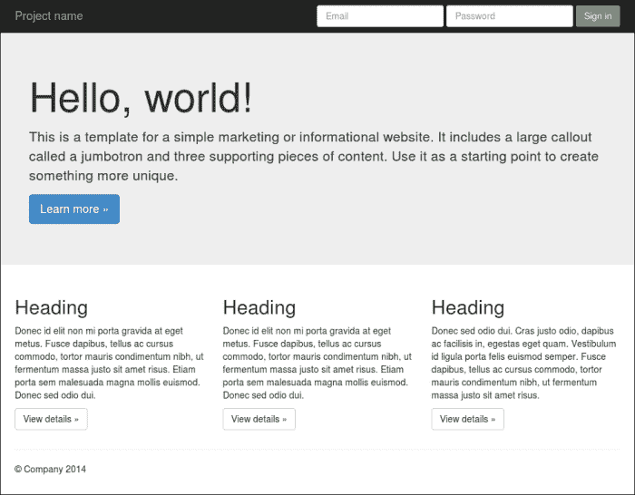
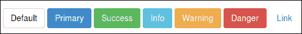
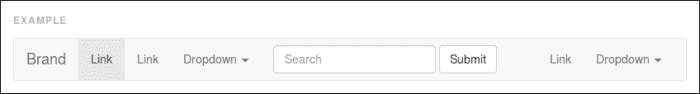
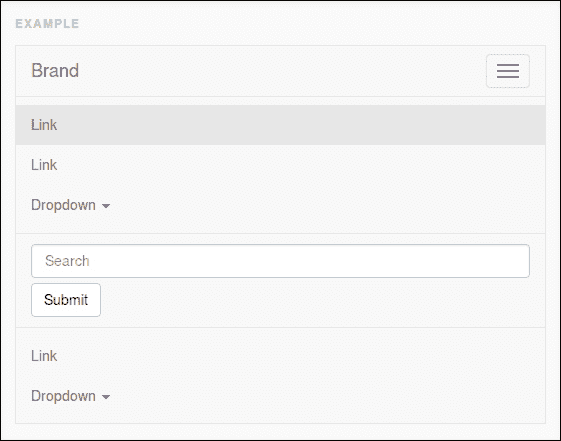
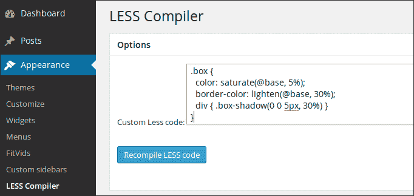
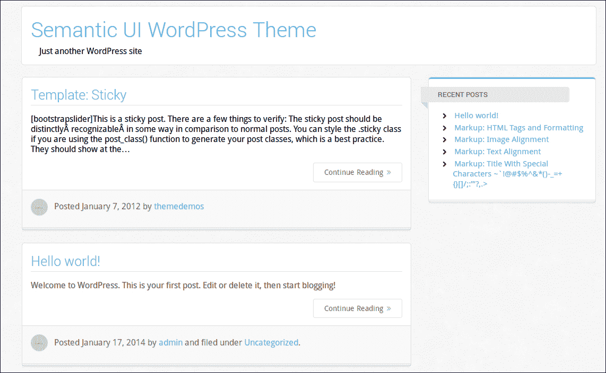

# 第六章：Bootstrap 3，WordPress 和其他应用程序

在阅读了前面的章节之后，你应该已经学会了如何使用*Less*构建自己的项目。你将在同样的时间内写出更好的 CSS 并取得更多的成就。你现在绝对已经准备好了最后一步。在本书的最后一章中，你将学习如何在其他知名框架、应用程序和工具中使用*Less*。你将了解到使用*Less*构建更好项目的工具，这些项目可以使用、定制和扩展*Less*。 

本章将涵盖以下主题：

+   Bootstrap 3

+   语义化 UI

+   使用*Less*构建网格

+   WordPress 和*Less*

+   编译*Less*代码的替代编译器

# Bootstrap 3

Bootstrap 3，以前被称为**Twitter 的 Bootstrap**，是用于构建应用程序前端的 CSS 和 JavaScript 框架。Bootstrap 3 中的三指的是这个框架的第三个版本；在本书中提到 Bootstrap 时，指的就是这个第三个版本。Bootstrap 3 与框架早期版本有重要的变化。Bootstrap 3 与早期版本不兼容。

Bootstrap 3 可以用来构建出色的前端。你可以下载完整的框架，包括 CSS 和 JavaScript，并立即开始使用。Bootstrap 还有一个**网格**。Bootstrap 的网格默认是移动优先的，有 12 列。事实上，Bootstrap 定义了四个网格：小于 768 像素的超小网格（手机），768 到 992 像素之间的小网格（平板电脑），992 到 1200 像素之间的中等网格（桌面），最后，大于 1200 像素的大桌面的大网格。在第五章中，*将 Less 集成到您自己的项目中*，你使用 Preboot 的 mixin 构建了一个网格；Bootstrap 的网格以类似的方式工作。

网格、所有其他 CSS 组件和 JavaScript 插件在[`getbootstrap.com/`](http://getbootstrap.com/)上都有描述和文档。

Bootstrap 的默认主题如下截图所示：



使用 Bootstrap 3 构建的布局示例

过去所有的 Bootstrap 网站看起来都很相似的时代已经远去。Bootstrap 将给你创造创新设计所需的所有自由。

关于 Bootstrap 还有很多要讲，但现在让我们回到*Less*。

## 使用 Bootstrap 的 Less 文件

Bootstrap 的所有 CSS 代码都是用*Less*编写的。你可以下载 Bootstrap 的*Less*文件并重新编译自己的版本的 CSS。*Less*文件可以用于定制、扩展和重用 Bootstrap 的代码。在接下来的章节中，你将学习如何做到这一点。

要下载*Less*文件，请在[`getbootstrap.com/`](http://getbootstrap.com/)上的 Bootstrap 的 GitHub 页面[`github.com/twbs/bootstrap`](https://github.com/twbs/bootstrap)上选择**下载 Zip**在右侧栏。

### 使用 Grunt 构建 Bootstrap 项目

在下载了前面提到的文件之后，你可以使用**Grunt**构建一个 Bootstrap 项目。Grunt 是一个 JavaScript 任务运行器；它可以用于自动化你的流程。Grunt 在执行重复任务时会帮助你，比如代码的缩小、编译、单元测试和代码的 linting。

Grunt 在**node.js**上运行，并使用**npm**，你在安装*Less*编译器时看到了。Node.js 是一个独立的 JavaScript 解释器，建立在谷歌的 V8 JavaScript 运行时上，就像在 Chrome 中使用的那样。Node.js 可以用于轻松构建快速、可扩展的网络应用程序。

当你解压下载的文件时，你会在其中找到`Gruntfile.js`和`package.json`等文件。`package.json`文件包含了作为 npm 模块发布的项目的元数据。`Gruntfile.js`文件用于配置或定义任务和加载 Grunt 插件。Bootstrap Grunt 配置是一个很好的例子，可以向你展示如何为包含 HTML、*Less*（CSS）和 JavaScript 的项目设置自动化测试。这本书无法涵盖所有内容；关于 Grunt.js 的更多信息可以在[`www.packtpub.com/grunt-js-cookbook/book`](http://www.packtpub.com/grunt-js-cookbook/book)上找到*Grunt.js Cookbook*。作为*Less*开发者，对你有趣的部分在下面的章节中提到。

在`package.json`文件中，你会发现 Bootstrap 使用`grunt-contrib-less`来编译它的*Less*文件。在撰写本书时，`grunt-contrib-less`插件使用 less.js 版本 1.7 来编译*Less*。与 Recess（Bootstrap 先前使用的另一个 JavaScript 构建工具）相比，`grunt-contrib-less`也支持源映射。

除了`grunt-contrib-less`，Bootstrap 还使用`grunt-contrib-csslint`来检查编译后的 CSS 是否存在语法错误。`grunt-contrib-csslint`插件还有助于改善浏览器兼容性、性能、可维护性和可访问性。该插件的规则基于面向对象的 CSS 原则（[`www.slideshare.net/stubbornella/object-oriented-css`](http://www.slideshare.net/stubbornella/object-oriented-css)）。你可以通过访问[`github.com/stubbornella/csslint/wiki/Rules`](https://github.com/stubbornella/csslint/wiki/Rules)来获取更多信息。

Bootstrap 大量使用*Less*变量，这些变量可以通过自定义器进行设置。

曾经研究过`Gruntfile.js`源代码的人可能也会找到对`BsLessdocParser` Grunt 任务的引用。这个 Grunt 任务用于基于 Bootstrap 使用的*Less*变量动态构建 Bootstrap 的自定义器。尽管解析*Less*变量来构建文档等过程非常有趣，但这个任务在这里不再讨论。你将在本章后面了解到自定义器。

本节以`Gruntfile.js`中执行*Less*编译的部分结束。`Gruntfile.js`中的以下代码应该让你对这段代码的外观有所了解：

```less
    less: {
      compileCore: {
        options: {
          strictMath: true,
          sourceMap: true,
          outputSourceFiles: true,
          sourceMapURL: '<%= pkg.name %>.css.map',
          sourceMapFilename: 'dist/css/<%= pkg.name %>.css.map'
        },
        files: {
          'dist/css/<%= pkg.name %>.css': 'less/bootstrap.less'
        }
      }
```

最后，让我们来看一下从命令行运行 Grunt 并构建 Bootstrap 的基本步骤。Grunt 将通过 npm 安装。Npm 会检查 Bootstrap 的`package.json`文件，并自动安装列在那里的必要的本地依赖项。

要使用 Grunt 构建 Bootstrap，你需要在命令行上输入以下命令：

```less
> npm install -g grunt-cli
> cd /path/to/extracted/files/bootstrap

```

之后，你可以通过运行以下命令来编译 CSS 和 JavaScript：

```less
> grunt dist

```

这将把你的文件编译到`/dist`目录中。`> grunt test`命令也会运行内置的测试。

### 编译你的 Less 文件

虽然你可以使用 Grunt 构建 Bootstrap，但并不一定非要使用 Grunt。你会在根目录`/bootstrap`内找到一个名为`/less`的单独目录中的*Less*文件。主项目文件是`bootstrap.less`；其他文件将在下一节中解释。你可以像在前面的章节中一样使用`bootstrap.less`。

你可以将`bootstrap.less`与 less.js 一起包含到你的 HTML 中进行测试。

```less
  <link rel="bootstrap/less/bootstrap.less" type="text/css" href="less/styles.less" />
  <script type="text/javascript">less = { env: 'development' };</script>
  <script src="img/less.js" type="text/javascript"></script>
```

当然，你也可以在服务器端编译这个文件，方法如下：

```less
lessc bootstrap.less > bootstrap.css

```

### 深入了解 Bootstrap 的 Less 文件

现在是时候更详细地查看 Bootstrap 的*Less*文件了。`/less`目录包含了一长串文件。您可以通过它们的名称来识别一些文件。您之前已经看到了一些文件，比如`variables.less`、`mixins.less`和`normalize.less`。打开`bootstrap.less`文件，看看其他文件是如何组织的。`bootstrap.less`文件中的注释告诉您，*Less*文件按功能组织，如下面的代码片段所示：

```less
// Core variables and mixins
// Reset
// Core CSS
// Components
```

尽管 Bootstrap 基本上是基于 CSS 的，但一些组件在没有相关的 JavaScript 插件的情况下无法工作。导航栏组件就是一个例子。Bootstrap 的插件需要**jQuery**。您不能使用最新的 2.x 版本的 jQuery，因为这个版本不支持 Internet Explorer 8。

要编译您自己的 Bootstrap 版本，您必须更改`variables.less`中定义的变量。在前面的章节中，您已经学会了不必覆盖原始文件和变量。使用*最后声明胜出*和*延迟加载*规则时，重新声明一些变量将变得很容易。变量的重新声明在第二章中已经讨论过，*使用变量和混合*。

### 使用 Less 创建自定义按钮

默认情况下，Bootstrap 定义了七种不同的按钮，如下截图所示：



Bootstrap 3 的七种不同按钮样式

在开始编写*Less*代码之前，请查看 Bootstrap 按钮的以下 HTML 结构：

```less
<!-- Standard button -->
<button type="button" class="btn btn-default">Default</button>
```

一个按钮有两个类。全局来看，第一个`.btn`类只提供布局样式，第二个`.btn-default`类添加颜色。在这个例子中，您只会改变颜色，按钮的布局将保持不变。

在文本编辑器中打开`buttons.less`文件。在这个文件中，您会找到不同按钮的以下*Less*代码：

```less
// Alternate buttons
// --------------------------------------------------
.btn-default {
  .button-variant(@btn-default-color; @btn-default-bg; @btn-default-border);
}
```

上述代码清楚地表明，您可以使用`.button-variant()`混合来创建自定义按钮。例如，要定义一个自定义按钮，您可以使用以下*Less*代码：

```less
// Customized colored button
// --------------------------------------------------
.btn-colored {
  .button-variant(blue;red;green);
}
```

在上述情况下，如果您想要使用自定义按钮扩展 Bootstrap，可以将您的代码添加到一个新文件中，并将该文件命名为`custom.less`。将`@import custom.less`附加到`bootstrap.less`中的组件列表中将起作用。这样做的缺点是，当更新 Bootstrap 时，您将不得不再次更改`bootstrap.less`；或者，您可以创建一个名为`custombootstrap.less`的文件，其中包含以下代码：

```less
@import "bootstrap.less";
@import "custom.less";
```

前面的步骤使用自定义按钮扩展了 Bootstrap；或者，您还可以通过重新声明其变量来更改默认按钮的颜色。为此，再次创建一个名为`custombootstrap.less`的文件，并将以下代码添加到其中：

```less
@import "bootstrap.less";
//== Buttons
//
//## For each of Bootstrap's buttons, define text, background and border color.
@btn-default-color:             blue;
@btn-default-bg:                 red;
@btn-default-border:           green;
```

在某些情况下，例如，您需要使用 Bootstrap 的按钮样式，而不需要其他任何东西。在这种情况下，您可以在`@import`指令中使用`reference`关键字，如前面在第五章中讨论的那样，*将 Less 集成到您自己的项目中*。

您可以使用以下*Less*代码为您的项目创建一个 Bootstrap 按钮：

```less
@import (reference) "bootstrap.less";
.btn:extend(.btn){};
.btn-colored {
  .button-variant(blue;red;green);
}
```

您可以通过在浏览器中访问`http://localhost/index.html`来查看上述代码的结果。

请注意，根据您使用的 less.js 版本，您可能会在编译输出中找到一些意外的类。**媒体查询**或扩展类有时会破坏旧版本的 less.js 中的引用。

### 使用 Less 自定义 Bootstrap 的导航栏

Bootstrap 的一个重要组件是导航栏。导航栏为网站添加了主要导航。它主要包含标志或品牌名称、搜索框和导航链接。在本书中，导航栏指的是导航栏。典型的 Bootstrap 导航栏将如下截图所示：



Bootstrap 导航栏的示例

Bootstrap 的导航栏默认是响应式的。在小屏幕尺寸上，上述导航栏将如下截图所示：



折叠和展开的 Bootstrap 导航栏

除了 CSS 之外，Bootstrap 的响应式导航栏还需要折叠 JavaScript 插件。这个插件应该包含在您的 Bootstrap 版本中。

现在，尝试更改默认导航栏的颜色作为示例。为此，您必须首先打开`variables.less`，以找出哪些变量给导航栏上色，如下所示：

```less
//== Navbar
//
//##

// Basics of a navbar
@navbar-height:                    50px;
@navbar-margin-bottom:             @line-height-computed;
@navbar-border-radius:             @border-radius-base;
@navbar-padding-horizontal:        floor((@grid-gutter-width / 2));
@navbar-padding-vertical:          ((@navbar-height - @line-height-computed) / 2);
@navbar-collapse-max-height:       340px;

@navbar-default-color:             #777;
@navbar-default-bg:                #f8f8f8;
@navbar-default-border:            darken(@navbar-default-bg, 6.5%);

// Navbar links
@navbar-default-link-color:                #777;
@navbar-default-link-hover-color:          #333;
@navbar-default-link-hover-bg:             transparent;
@navbar-default-link-active-color:         #555;
@navbar-default-link-active-bg:            darken(@navbar-default-bg, 6.5%);
@navbar-default-link-disabled-color:       #ccc;
@navbar-default-link-disabled-bg:          transparent;

// Navbar brand label
@navbar-default-brand-color:               @navbar-default-link-color;
@navbar-default-brand-hover-color:         darken(@navbar-default-brand-color, 10%);
@navbar-default-brand-hover-bg:            transparent;

// Navbar toggle
@navbar-default-toggle-hover-bg:           #ddd;
@navbar-default-toggle-icon-bar-bg:        #888;
@navbar-default-toggle-border-color:       #ddd;
```

您已经看到找到这些变量很容易。文件中的注释是找到它们的方便指南。您还会看到变量的有意义和描述性名称是有意义的，就像在第二章中学到的那样，*使用变量和 mixin*。另一方面，您可能会想知道为什么导航栏只有这么多变量。导航栏有许多元素和不同的表现形式，需要用变量来定义。正如前面提到的，Bootstrap 的导航栏默认是响应式的；它会在较小的屏幕上折叠（或者从移动优先的角度来看，它会在较大的屏幕尺寸上变成水平的）。因此，必须为导航栏的折叠和水平版本定义样式。上述代码还设置了导航栏链接和折叠菜单切换按钮的颜色。

就像 Bootstrap 的按钮一样，Bootstrap 的导航栏也是用两个类构建的，如下面的代码片段所示：

```less
<nav class="navbar navbar-default" role="navigation"></nav>
```

在这种情况下，`.navbar`类提供布局样式，第二个`.navbar-default`类添加了颜色和其他变化。`.navbar`类还有一个设置其类型的第三个类。有四种类型的导航栏：默认、固定在顶部、固定在底部和静态顶部。

导航栏类可以在`navbar.less`中找到。导航栏没有 mixin 来构建这些类。*Less*代码提供了两种备用导航栏样式的类：`.navbar-default`和`.navbar-inverse`。

由于没有 mixin 可用，重新声明一些导航栏的变量将是自定义其外观和感觉的最佳选择。或者，您可以复制完整的`.navbar-default`类并用于自定义。Bootstrap 打算每页只使用一个导航栏，因此额外的样式类没有增加的价值。

例如，现在设置如下：

```less
@navbar-default-color:          red;
@navbar-default-bg:              blue;
@navbar-default-border:        yellow;
```

您可以将这些变量声明为`customnavbar.less`，并在该文件中添加`@import "bootstrap.less";`。现在，您可以编译`customnavbar.less`。

您可以通过在浏览器中访问`http://localhost/customnavbar.html`来查看上述代码的结果。

### Bootstrap 的类和 mixin

浏览组件时，您会发现 Bootstrap 是一个非常完整的框架。在编译框架之后，您将拥有构建响应式网站所需的所有类。另一方面，Bootstrap 也可以作为一个库来使用。您已经看到如何只使用按钮。

在`utilities.less`中，您可以找到以下代码：

```less
.clearfix {
  .clearfix();
}
```

上述代码使`.clearfix`类可以直接在您的 HTML 中使用；另一方面，您仍然可以重用`.clearfix()` mixin。您可以在`mixins.less`中找到 Bootstrap 的 mixin。这种严格的 mixin 和类的分离允许您导入`mixins.less`并将这些 mixin 应用到您自己的代码中，而不需要实际创建这些类的输出。

`mixins.less`文件的前面导入将允许您在自己的项目中使用 Bootstrap 的渐变 mixin，如下面的代码片段所示：

```less
@import "bootstrap/mixins.less";
header {
 #gradient > .horizontal(red; blue);
}
```

上述代码将编译为以下 CSS 代码：

```less
header {
  background-image: -webkit-linear-gradient(left, color-stop(#ff0000 0%), color-stop(#0000ff 100%));
  background-image: linear-gradient(to right, #ff0000 0%, #0000ff 100%);
  background-repeat: repeat-x;
  filter: progid:DXImageTransform.Microsoft.gradient(startColorstr='#ffff0000', endColorstr='#ff0000ff', GradientType=1);
}
```

如您所见，渐变混合是有命名空间的。还请访问`http://localhost/gradient.html`，以查看前面示例中的背景渐变的外观。

### 使用 Less 主题化 Bootstrap

由于 Bootstrap 的样式是用*Less*构建的，因此很容易为 Bootstrap 的自定义版本设置主题。基本上有两种方法可以集成您的主题的*Less*代码。

第一种方法将所有代码编译为单个 CSS 文件。在大多数情况下，推荐使用此方法，因为加载只需要一个 HTTP 请求。

要使用此方法，使用`@import`语句将您的主题文件导入到`bootstrap.less`中，并重新编译 Bootstrap。或者，创建一个新的项目文件，例如`bootstraptheme.less`，其中包括两者，如下面的代码片段所示：

```less
@import "bootstrap.less";
@import "theme.less";
```

这种方法在*Less*级别上重写了 Bootstrap 的样式，而第二种方法在 CSS 级别上执行相同的操作。在第二种方法中，主题的*Less*代码将被编译成单独的 CSS 文件，这些文件将在 Bootstrap 的 CSS 之后加载。

您的客户端编译的 HTML 将如下所示：

```less
  <link rel="stylesheet/less" type="text/css" href="less/bootstrap/bootstrap.less" />
  <link rel="stylesheet/less" type="text/css" href="less/yourtheme.less" />
  <script type="text/javascript">less = { env: 'development' };</script>
  <script src="img/less.js" type="text/javascript"></script>
```

服务器端编译后，您的 HTML 将如下所示：

```less
  <link type="text/css"  rel="stylesheet" href="css/bootstrap.min.css" />
  <link type="text/css"  rel="stylesheet" href="css/yourtheme.min.css" />
```

这种第二种方法在加载页面时需要额外的 HTTP 请求，但另一方面，它提供了从 CDN 加载 Bootstrap 核心的机会，如下所示：

```less
  <link type="text/css"  rel="stylesheet" href="//netdna.bootstrapcdn.com/bootstrap/3.1.1/css/bootstrap.min.css" />
  <link type="text/css" rel="stylesheet" href="css/yourtheme.min.css" />
```

### Bootstrap 的 a11y 主题

**A11y**是（网络）可访问性的常用缩写。可访问性在现代网页设计中起着重要作用；然而，许多网站对此关注较少。Bootstrap 的 a11y 主题提供了更好的可访问性与 Bootstrap。

a11y 主题可以从[`github.com/bassjobsen/bootstrap-a11y-theme`](https://github.com/bassjobsen/bootstrap-a11y-theme)下载。您只需编译*Less*文件即可使用该主题。此外，在这种情况下，您可以选择将*Less*代码集成到您的*Less*代码库中，或者编译一个单独的主题 CSS 文件。要了解有关 Bootstrap 的更多无障碍改进，请访问[`github.com/paypal/bootstrap-accessibility-plugin/`](https://github.com/paypal/bootstrap-accessibility-plugin)。请注意，此插件不提供任何*Less*代码，只提供 CSS。

### 1pxdeep 的颜色方案

**1pxdeep**帮助您在项目中使用**相对视觉权重**和**颜色方案**。基于种子颜色，1pxdeep 的`scheme.less`文件生成一个包含 16 种颜色的调色板。每种颜色也以变量的形式定义。这些变量，如`@color1`或`@color4c`，可用于自定义设计。每个颜色变量还定义了一个同名的类，因此您的*Less*代码中的`@color1`和 HTML 中的`.color1`指的是您颜色方案中的同一种颜色。

在项目中实现 1pxdeep 后，更改品牌或颜色方案将像更改种子颜色一样简单。

使用 1pxdeep 和 Bootstrap 的典型`Less`项目文件将如下代码片段所示：

```less
@import "scheme.less"; // color scheme
@import "bootstrap.less"; // bootstrap
@import "1pxdeep.less"; // 1pxdeep theme
@import "style.less"; // your own styles
```

前面的代码重新声明了 Bootstrap 的变量，例如`@brand-primary: hsl(hue(#428bca),@sat,@l-factor);`，并使您能够在`style.less`文件中使用 1pxdeep 的变量，如下面的代码片段所示：

```less
header {
    background-color: @color3;
    h1 {
    color: @color3a;
    }
}
```

1pxdeep 的 CSS 类也可以直接在您的 HTML 代码中使用，如下所示：

```less
<button class="btn btn-default color1">Color 1</button>
```

在 1pxdeep 的网站上，您可以测试不同的种子颜色，以了解它们的外观。请访问[`rriepe.github.io/1pxdeep/`](http://rriepe.github.io/1pxdeep)并感到惊讶。

## 使用 Bootstrap 的自定义工具构建您自己的版本

想要从头开始使用定制版本的 Bootstrap 的人也可以使用 Bootstrap 的自定义工具。您可以通过访问[`getbootstrap.com/customize/`](http://getbootstrap.com/customize/)找到自定义工具。自定义工具允许您选择使用哪些*Less*文件。还可以设置所有 Bootstrap 的*Less*变量。该列表也可以用作在编译自己的版本时 Bootstrap 变量的参考。请注意，使用自定义工具时可以下载的文件不包含任何*Less*文件，因此 Bootstrap 自定义工具中的文件不适合进一步使用*Less*进行定制。

# Semantic UI - 另一个 Less 框架

Semantic 也可以用于构建前端。就像 Bootstrap 一样，它包含 CSS 组件和模块。组件已分为元素、集合和视图。模块不仅需要 CSS，还需要 JavaScript。

Semantic 的名称已经清楚地表明它关注 HTML5 的语义。它还是标签不可知的，这意味着您可以在 UI 元素中使用任何 HTML 标签。

在以下代码中，您将找到一个简短的 HTML 示例，展示了 Semantic 的预期用法：

```less
<main class="ui three column grid">
  <aside class="column">1</aside>
  <section class="column">2</section>
  <section class="column">3</section>
</main>
```

此外，Semantic 也是使用*Less*构建的。完整的源代码，包括*Less*文件，可以从[`github.com/semantic-org/semantic-ui/`](https://github.com/semantic-org/semantic-ui/)下载。

Semantic 处理*Less*的方式与 Bootstrap 和本书中早期看到的大多数示例不同。与之相反，Semantic 源代码也将使用 Grunt 构建，就像前面的 Bootstrap 部分描述的那样。然而，Semantic 不定义变量，也不定义导入和连接不同*Less*文件的主文件。Semantic 的*Less*代码分为不同的模块，其中大多数设置都是硬编码的。

Semantic 处理*Less*的不同方式也意味着，当您的项目完全使用框架时，您将始终需要在更改或扩展*Less*代码后运行完整的 Grunt 任务。另一方面，在您的项目中使用单个 Semantic 组件或模块将非常容易。这些组件和模块不依赖于彼此或全局变量。

请访问示例文件中的`http://localhost/semanticui.html`以查看其工作原理。您会发现，您可以只包含*Less*文件来使用网格或按钮。还要注意，如果您的按钮使用图标（Semantic 包含由 Dave Gandy 设计的 Font Awesome 的完整端口作为其标准图标集），您还应该包含`icon.less`文件。

## 自动添加供应商特定规则的前缀

在使用 Grunt 构建 Semantic 时，任务首先将*Less*文件编译为单个 CSS 文件。在此任务之后，下一个任务运行`grunt-autoprefixer`。`grunt-autoprefixer`插件使用**Can I Use...**数据库（[`caniuse.com/`](http://caniuse.com/)）解析*Less*或 CSS，并添加带有供应商前缀的 CSS 属性。`/build`目录中的*Less*文件也以这种方式添加前缀。您可以通过访问[`github.com/nDmitry/grunt-autoprefixer`](https://github.com/nDmitry/grunt-autoprefixer)了解有关`grunt-autoprefixer`的更多信息。最终任务将捆绑 CSS 和 JavaScript 文件到单个文件中并对其进行缩小。

自动添加前缀对于您未来的项目将非常有趣，因为它使您可以仅使用单行声明编写您的*Less*代码。查看 Semantic 的`Grunt.js`以了解其工作原理。目前，运行任务和自动添加前缀不在本书的范围内。请注意，如果您在项目中使用 Semantic 的单个*Less*文件，您将需要使用`/build`目录中的文件，而不是`/source`目录中的文件。`/build`目录中的*Less*文件已添加前缀，而`/source`目录中的文件没有。

# 使用 Less 构建网格的其他框架

在前面的部分中，您学习了如何使用 Bootstrap 和 Semantic UI 构建完整的前端。在实践中，对于许多项目，只需一个网格就足够了。您已经看到，语义的网格可以轻松编译为单个组件。同样，Bootstrap 的网格也可以使用以下代码片段编译为单个组件：

```less
// Core variables and mixins
@import "variables.less";
@import "mixins.less";
// Reset
@import "normalize.less";
@import "grid.less";
```

或者，您也可以使用另一个网格系统。其中一些在以下部分中简要讨论。

## 使用黄金网格系统构建您的网格

**黄金网格系统**（**GGS**）将屏幕分成 18 个均匀的列。最左边和最右边的列用作网格的外边距；这为您的设计留下了 16 列。有关此网格系统的更多详细信息可以在[`goldengridsystem.com/`](http://goldengridsystem.com/)找到。

GGS 带有一个*Less*文件，用于编译所需的 CSS 以构建网格。

### 注意

**Frameless**网格系统逐列适应，而不是像素逐像素。

由构建 GGS 的同一作者构建的 Frameless 网格系统不是流体的；当达到断点时，网格会添加列。请注意，Bootstrap 的网格工作方式相同。Frameless 带有一个*Less*模板，可以编译以使用网格。此模板包含一个小的 CSS 重置，一些一致性修复，以及一些用于启动 Frameless 网格的基本可自定义变量和函数。有关 Frameless 网格的更多信息可以在[`framelessgrid.com/`](http://framelessgrid.com/)找到。Frameless 的文档很少；但是，您可以在 GitHub 上找到 Frameless 主页的源代码。这将让您了解如何使用它与*Less*。

## 语义网格系统

**语义网格系统**非常基础和有效。设置列和间距宽度后，选择列数并在像素和百分比之间切换；您将在标记中没有任何`.grid_x`类的布局。语义网格系统也是响应式的。它还支持嵌套和推拉，这使您可以对列应用左右缩进。

使用*Less*定义流体布局将像在以下代码片段中所示一样简单：

```less
@import 'grid.less';
@columns: 12;
@column-width: 60;
@gutter-width: 20;

@total-width: 100%; // Switch from pixels to percentages
article {
   .column(9);
}
section {
   .column(3);
}
```

关于语义网格系统的更多信息可以在[`semantic.gs/`](http://semantic.gs/)找到。

# WordPress 和 Less

如今，WordPress 不仅用于博客；它也可以用作内容管理系统来构建网站。

用 PHP 编写的 WordPress 系统已分为核心系统、插件和主题。插件为系统添加了额外的功能，主题处理了使用 WordPress 构建的网站的外观和感觉。插件彼此独立工作。插件也独立于主题，主题大多也不依赖插件。WordPress 主题为网站定义全局 CSS，但每个插件也可以添加自己的 CSS 代码。

WordPress 主题开发人员可以使用*Less*来编译主题和插件的 CSS。

## 使用 Less 的 Roots 主题

**Roots**是一个 WordPress 起始主题。您可以使用 Roots 来构建自己的主题。Roots 基于 HTML5 Boilerplate ([`html5boilerplate.com/`](http://html5boilerplate.com/))和 Bootstrap。还请访问 Roots 主题网站[`roots.io/`](http://roots.io/)。此外，Roots 也可以完全使用 Grunt 构建。有关如何在 WordPress 开发中使用 Grunt 的更多信息，请访问[`roots.io/using-grunt-for-wordpress-theme-development/`](http://roots.io/using-grunt-for-wordpress-theme-development/)。

下载 Roots 后，*Less*文件可以在`assets/less/`目录中找到。这些文件包括 Bootstrap 的*Less*文件，如前所述。`assets/less/app.less`文件导入了主要的 Bootstrap *Less*文件，`bootstrap.less`。

现在，您可以编辑`app.less`来自定义您的主题。更改后，您将需要重新构建 Roots。

Roots 的文档描述了编辑 Bootstrap 的`variables.less`文件作为定制使用 Roots 构建的网站的最简单方法。更多信息请访问[`roots.io/modifying-bootstrap-in-roots/`](http://roots.io/modifying-bootstrap-in-roots/)。

## JBST 内置 Less 编译器

JBST 也是一个 WordPress 入门主题。JBST 旨在与所谓的子主题一起使用。有关 WordPress 子主题的更多信息，请访问[`codex.wordpress.org/Child_Themes`](https://codex.wordpress.org/Child_Themes)。

安装 JBST 后，您将在**仪表板**的**外观**下找到一个*Less*编译器，如下截图所示：



JBST 在 WordPress 仪表板中内置的 Less 编译器

内置的*Less*编译器可用于完全定制您的网站与*Less*。Bootstrap 也构成了 JBST 的骨架，并且默认设置是从前面提到的 a11y bootstrap 主题中收集的。

JBST 的*Less*编译器可以以不同的方式使用。

首先，编译器接受任何自定义编写的*Less*（和 CSS）代码。例如，要更改`h1`元素的颜色，只需编辑并重新编译代码如下：

```less
h1 {color: red;}
```

其次，您可以编辑 Bootstrap 的变量并（重新）使用 Bootstrap 的混合器。因此，要设置导航栏的背景颜色并添加自定义按钮，可以在*Less*编译器中使用以下代码：

```less
@navbar-default-bg:              blue;
.btn-colored {
  .button-variant(blue;red;green);
}
```

第三，您可以设置 JBST 内置的*Less*变量，例如：

```less
@footer_bg_color: black;
```

第四，JBST 有自己的一套混合器。要设置自定义字体，可以编辑如下：

```less
.include-custom-font(@family: arial,@font-path, @path: @custom-font-dir, @weight: normal, @style: normal);
```

在上述代码中，参数用于设置字体名称（`@family`）和字体文件的路径（`@path/@font-path`）。`@weight`和`@style`参数设置了字体的属性。更多信息，请访问[`github.com/bassjobsen/Boilerplate-JBST-Child-Theme`](https://github.com/bassjobsen/Boilerplate-JBST-Child-Theme)。

还可以在特殊文件（`wpless2css/wpless2css.less`或`less/custom.less`）中添加更多*Less*代码；这些文件还可以让您选择添加预构建的混合库，例如第四章中讨论的那些，*避免重复造轮子*。通过这个文件添加库后，混合器也可以与内置编译器一起使用。

## Semantic UI WordPress 主题

如前所述，Semantic UI 提供了自己的 WordPress 插件。该插件可以在 GitHub 上找到[`github.com/ProjectCleverWeb/Semantic-UI-WordPress`](https://github.com/ProjectCleverWeb/Semantic-UI-WordPress)。安装并激活此主题后，您可以直接使用 Semantic UI 进行网站。使用默认设置，您的网站将如下截图所示：



使用 Semantic UI WordPress 主题构建的网站

## WordPress 插件和 Less

如前所述，WordPress 插件有自己的 CSS。此 CSS 将作为普通样式表添加到页面中，如下所示：

```less
<link rel='stylesheet' id='plugin-name'  href='//domain/wp-content/plugin-name/plugin-name.css?ver=2.1.2' type='text/css' media='all' />
```

除非插件为其 CSS 提供*Less*文件，否则将很难使用*Less*管理其样式。

### 带有 Less 的 WooCommerce 主题

**WooCommerce**是 WordPress 的一款热门电子商务插件。使用 WooCommerce，您可以很快地建立一个网店。您可以使用*Less*为 WooCommerce 网店设置主题，文档在[`docs.woothemes.com/document/css-structure/`](http://docs.woothemes.com/document/css-structure/)中有记录。

WooCommerce 的*Less*文件应该编译成 CSS 并按照前面描述的方式使用。要为所有样式表创建单个 CSS 文件，您可以考虑将`woocommerce.less`导入到项目的主*Less*文件中，并在主题的`functions.php`文件中使用`define('WOOCOMMERCE_USE_CSS', false);`禁用默认样式。

### WP Less to CSS 插件

**WP Less to CSS**插件可以在[`wordpress.org/plugins/wp-less-to-css/`](http://wordpress.org/plugins/wp-less-to-css/)找到，它可以让您使用*Less*为 WordPress 网站设置样式。如前所述，您可以使用 JBST 的内置编译器输入*Less*代码。此代码将被编译成网站的 CSS。此插件使用 PHP Less 编译器`Less.php`编译*Less*。

# 用于编译 Less 代码的替代编译器

随着*Less*的日益流行，*Less*编译器也被移植到其他语言。这些移植可以用于使用本地语言调用编译*Less*。请记住，这些移植通常会滞后于官方 JavaScript 实现，因此您可能会发现它们缺少最近的*Less*功能。您可能也会意识到，正如第三章中早些时候提到的，*嵌套规则、操作和内置函数*，这些编译器无法编译反引号内的本机 JavaScript 表达式。

## Less.php 编译器

官方*Less*处理器的这个 PHP 移植版本可以在[`lessphp.gpeasy.com/`](http://lessphp.gpeasy.com/)下载。您已经看到了它的用法示例；WP Less to CSS 插件就是用它构建的。`Less.php`还实现了缓存以加快编译速度。

尽管`Less.php`提供了动态创建 CSS 的可能性，但在大多数情况下，您仍应该为生产环境预编译您的 CSS。WordPress 也是用 PHP 编写的，因此在 WordPress 插件的情况下，可以使用*Less*进行编译，而无需使用系统调用。

在下面的代码中，您将找到一个简短的示例，它将向您展示如何在 PHP 编写的网站上编译、自定义和使用 Bootstrap：

```less
<?php
require 'less.php/Cache.php';
Less_Cache::$cache_dir = '/var/www/mysite/writable_folder';
$files = array();
$files['/var/www/mysite/bootstrap/bootstrap.less'] = '/mysite/bootstrap/';
$files['/var/www/mysite/custom/my.less'] = '/mysite/custom/';
$css_file_name = Less_Cache::Get( $files );
echo '<link rel="stylesheet" type="text/css" href="/mysite/writable_folder/'.$css_file_name.'">';
```

[`leafo.net/lessphp/`](http://leafo.net/lessphp/)提供的**lessphp**编译器是另一种 PHP Less 编译器。

## .NET 应用程序的.less 编译器

`.less`编译器是 JavaScript *Less*库在**.NET 平台**上的完整移植。如果您想要静态编译您的文件，可以使用附带的`dotless.Compiler.exe`编译器。您可以通过向`Web.Config`文件添加新的 HTTP 处理程序来使用`.less`来制作您的网页，如下所示：

```less
<add type="dotless.Core.LessCssHttpHandler,dotless.Core" validate="false" path="*.Less" verb="*" />
```

## 开发 Less 的工具列表

在*Less*网站([`lesscss.org/usage/`](http://lesscss.org/usage/))上，您将找到许多其他库、工具和框架来开发*Less*。

# 总结

在本章中，您学会了如何在 Bootstrap 和 Semantic UI 中使用*Less*，还介绍了其他使用*Less*构建的网格和框架。您已经了解了如何在 WordPress 中使用*Less*，最后，您了解了如何为项目使用替代编译器。

这也是本书的最后一章。在本书中，您学会了如何在项目中使用*Less*。您看到了变量、混合和内置函数如何帮助您重用代码。使用*Less*，您可以嵌套您的样式规则，这使得您的代码更直观和可读。阅读本书后，您知道自己不必亲自编写所有代码，而是可以使用他人编写的预构建混合。最后，您学会了如何从头开始使用*Less*启动项目，并将*Less*与 WordPress、Bootstrap 和其他工具集成。现在，您真的准备好开始开发*Less*了。恭喜！您已经使自己能够更好、更快地使用*Less*来开发项目，并为真正的设计任务节省更多时间。
