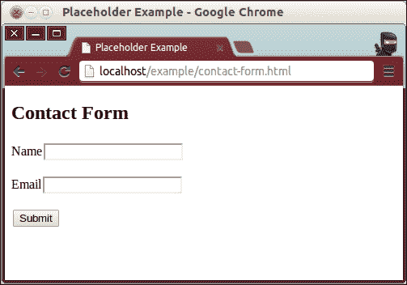
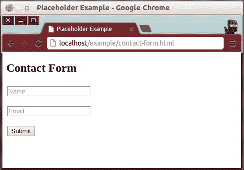
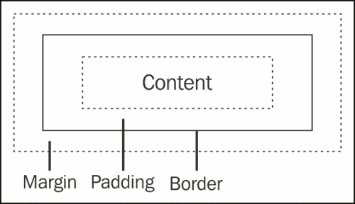
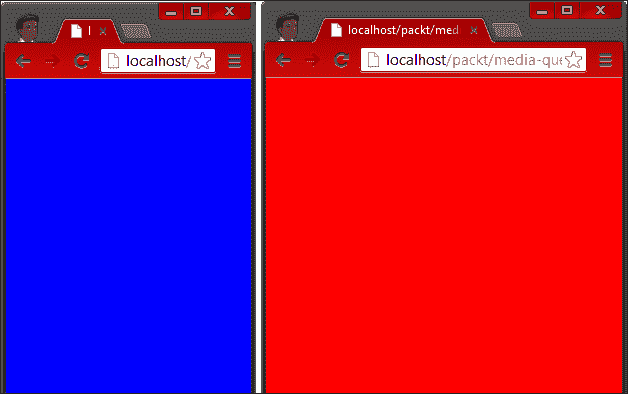

# 第一章：HTML5 概述

欢迎来到迷人的网络开发世界！在我们开始 HTML5 开发的旅程时，我们将花时间回顾过去。毕竟，除非你知道自己来自哪里，否则你真的无法到达任何地方。除非你在过去几年里一直生活在石头下，你肯定听说过很多关于 Web 2.0、开放网络和 HTML5 的事情。如果你从三个不同的人那里听到这些术语，你可能也听到了至少三种不同的定义。因此，我们将简要描述这些术语的含义，为什么你应该对它们感到兴奋，以及 HTML5 是如何改变游戏规则的。

# 什么是 HTML？

在我们开始谈论开放网络以及 HTML5 在其中的核心作用之前，我们需要澄清的第一个术语是 HTML。简单来说，HTML 是一种非常基本的标记语言，用于描述文本文件给读取它们的程序。虽然这可能是对它的最概括的定义，但有趣的是这样一种基本技术如何在我们整个社会的发展中发挥了如此关键的作用。从不起眼的开始，最初只是为了服务一个非常具体的目的，HTML 已经成为了网络的主要标记语言，进而进入了世界上几乎每一个家庭，以及大多数公文包、口袋和其他电子设备。

鉴于 HTML 的这种戏剧性、广泛的影响，很快就清楚地意识到这种技术需要做的不仅仅是声明一些文本块的颜色，或者一些研究论文中存储的照片的宽度和高度。由于多年来网络被使用的许多不同方式，HTML 已经发展和演变，从一个简单的标记语言，发展成为强大、高度复杂的在线应用和服务的基础。

## HTML 的简要历史

**超文本标记语言**，简称**HTML**，就像我们今天所知的那样，最早是由蒂姆·伯纳斯-李在 1989 年构想出来的。当时，他在瑞士日内瓦的欧洲粒子物理实验室工作，他认为将科学家们编写和使用的各种研究文档链接在一起会很有益处。这样，不仅可以阅读大量独立的文档，每个引用另一篇研究论文的文档都可以有一个超链接到另一篇文档，这样读者就可以轻松地从一篇文档导航到下一篇文档，而且时间上也更为及时。

为了实现他将文档超链接在一起的想法，蒂姆·伯纳斯-李将现有的标记语言作为他自己标记语言的基础——**标准通用标记语言**，简称**SGML**。SGML 是一种通过使用标签词汇来结构化文本的简单语言。例如，为了指定一个文本块被解释为一个段落，一个人会用一对“段落标签”将这样的文本包围起来，这看起来与今天 HTML 中的段落标签一样。虽然蒂姆版本的语言中的基本词汇保持不变，但添加了一个关键标签——超链接标签。因此，HTML 诞生了。

请记住，蒂姆对这种语言的愿景非常具体。通过 HTML 跨文档引用的能力，发表的科学研究论文可以更有效地进行研究。直到多年后，HTML 才开始被用于除了共享互联文本之外的其他目的。

## 万维网的演变

随着计算机变得更加普遍，越来越多的人开始拥有自己的机器，随着互联网的广泛使用，人们开始找到新的使用新技术的方式。人们开始使用 Web 不仅仅是阅读他人所写的内容，而是开始通过编写和发布文档与他人交流。不久之后，互联网就成为了一个巨大的虚拟社会。

20 世纪 90 年代，互联网继续增长，不同的用途不断出现。随着对这种惊人基础设施如何使用的新想法，必须想出新的方法来将这些想法变为现实，因为支持互联网的技术仍然是相同的。在本质上，Web 应用程序仍然只是一个基于文本的文档，使用 HTML 格式化。为了向这些否则静态数据添加一些逻辑，程序员使用存储在 Web 服务器中的程序来操作用户的输入，并动态创建 HTML 文档。再次强调，用户在浏览互联网时实际上与之交互的文档只不过是纯 HTML。

为了使互联网能够继续增长和适应其使用方式和目的，需要进行改变。与其仅向 HTML 阅读器（Web 浏览器）发送纯文本数据，不如找到一种方法在网页上添加某种代码，以便在浏览器上处理信息。因此，JavaScript 诞生了。

如今，网络在使用人数和使用方式和目的方面继续增长。好消息是，支持和运行网络的技术也在不断增长和发展，以便适应新的用例。

# HTML5 是什么？

毫无疑问，你肯定听过人们在不同情境下使用 HTML5 这个术语，这可能至少引起了一些混淆。与大多数所谓的技术术语一样，它们进入了普通大众，并经常从非技术人员的嘴唇上掉下来，HTML5 进入普通大众实际上意味着不止一件事。在最基本的层面上，HTML5 指的是由 Tim Berners-Lee 创建的标记语言的下一个版本，现在有一个指导其进展的管理机构。该术语的另一个含义是指与标记语言相辅相成的其他技术，以及开放网络的概念，我们将在本章后面更多地讨论。

## HTML5-演变的下一步

信不信由你，人们一直在努力开发旨在在 Web 浏览器中执行的功能齐全、复杂的应用程序。在很大程度上，最大的挑战是实现这一目标所需的技术直到相对最近才完全可用。使用早期版本的 HTML 创建大型 Web 应用程序如此困难的原因在于 HTML 最初并非为此而设计。然而，随着 Web 的发展，HTML 也在不断发展。

HTML5 的目标之一就是实现这一点-使开发人员能够创建完全在互联网上运行的功能强大的非平凡应用程序。HTML5 的另一个主要目标是完全向后兼容，以便用于其他目的（即超链接研究文档）的网页仍然可以正常运行。

正如 Tim Berners-Lee 向 SGML（以及其他标记）添加了超链接标记一样，HTML5 基本上就是这样-比以前版本的语言更多的标记（或更多的功能）。虽然这是 HTML5 是什么的一个很好的概述，但故事还有更多。除了向 HTML 规范添加的新标记外，HTML5 这个术语还指的是 Web 演变的下一步。

有些人称之为 Web 2.0，而其他人简单地称之为*未来*。当我提到 HTML 历史上的下一个步骤时，我将指的是对 HTML、CSS 和 JavaScript 的升级，因为这三种技术是这个新互联网的核心，其中 Web 应用程序（包括在线游戏）是关注的中心之一，也是本书的重点之一。

# HTML5 不是一个单一的特性

在为开发人员提供新功能之前，HTML5 试图解决在以前版本的 HTML 中暴露出的核心问题，即编程架构。由于 HTML 最初并不是为了网页应用程序开发而创建的，当程序员开始将其用于此类目的时，他们很快发现自己的代码非常混乱。应用程序数据与呈现代码严重混合，而呈现代码又与应用程序逻辑紧密耦合。

为了解决这个问题，开发人员得到了**层叠样式表**（**CSS**），它允许他们将 HTML 标记（信息）与信息的呈现方式分开。因此，HTML5 实际上指的是三种不同的技术，即 HTML5（新的语义元素或标签）、CSS3 和 JavaScript（所有新的 API，如 Web 存储、Web Workers 和 Web Sockets 等）。

# 更多语义化的文档结构

当开发人员看到现有技术的不同应用的需求，并对其进行实验时，他们会使用自己手头的工具，并将其适应新的环境。这就是以前版本的 HTML 的情况。由于只存在少数几个容器标签，开发人员使用相同的元素描述非常复杂的文档结构；虽然这完成了工作，但也使得结构混乱且难以维护。简而言之，如果你手头只有一把锤子，那么你看到的一切都会变成钉子。

例如，开发人员通常使用`<div>`标签来表示文档的每个部分，描述类似下图所示的结构时。


图 1

上图显示了大多数上一代网页设计中使用的典型结构。

这样的设计可以用以下结构表示：

```js
<div id="wrapper">
  <div id="header"></div>
  <div id="body">
    <div id="main_content">
      <p>Lorem Ipsum...</p>
    </div>
    <div id="sidebar"></div>
  </div>
  <div id="footer"></div>
</div>
```

虽然使用`<div>`标签来完成任何目的是完成工作的一种方式，但你可以看到这很快就会失控，将文档变成难以理解而需要仔细检查的东西。当你看到一长串闭合的`<div>`标签时，这种代码变得尤为麻烦——你怎么知道每个闭合标签实际上关闭了什么，因为所有标签都有相同的名称？更糟糕的是，你怎么知道你有恰好数量的闭合标签？

在`<div>`范式之后设计 HTML 结构的另一个主要问题是，从语义角度来看，每个标签都是完全无意义的。为了使每个`<div>`标签稍微更有意义和自我描述，通常会添加额外的属性，通常以 ID 或类的形式。再次，这种解决方案只会加剧问题，因为更大、更复杂的文档需要更多这些属性，而这些属性需要跟踪，从而增加了本应简单的解决方案的复杂性。

值得庆幸的是，在 HTML5 中，这个问题以一种非常优雅的方式得到了解决。鉴于许多文档都使用`<div>`标签来定义共同的部分，如页眉、页脚、导航和主要内容，因此添加了新的标签来表示这些共同的部分。有了这些新标签，你现在可以直观地扫描设计结构，并非常快速地理解信息的布局方式。此外，完全消除了为了区分每个`<div>`标签而创建无尽的 ID 属性的需求。

使用 HTML5 提供的一些新标签，可以将*图 1*中的相同设计概念表示如下：

```js
<header></header>
<section>
  <article>
    <p>Lorem Ipsum...</p>
  </article>
  <nav></nav>
</section>
<footer></footer>
```

### 提示

**下载示例代码**

您可以从您在[`www.packtpub.com`](http://www.packtpub.com)的帐户中下载您购买的所有 Packt 图书的示例代码文件。如果您在其他地方购买了这本书，您可以访问[`www.packtpub.com/support`](http://www.packtpub.com/support)并注册，以便将文件直接发送到您的电子邮件。

您可以看到代码变得更加描述性。还要记住，这种更有意义的结构的好处不仅仅是对人类更易读。使用 HTML5 中的新语义标签，搜索引擎（如 Google、微软的必应和雅虎！）能够更好地理解网页的内容，因此可以更好地根据其主题对您的网站进行索引，从而使网络变得更好。此外，通过使用更具体的标签定义 HTML 文件，屏幕阅读器软件能够更好地理解网页的内容，从而使依赖此类软件的用户更好地使用和享受互联网。

### 注意

由于互联网似乎使我们的世界变得完全扁平，你不应该假设只有你的朋友和邻居才能访问你在网上发布的内容。你的访问者不仅会来自其他国家和设备（如智能手机、平板电脑，甚至电视机），而且许多上网的人（因此，来到你的网站消费你提供给他们的材料）也有视觉或音频辅助设备或软件等特殊需求。因此，当你编写任何 HTML 代码时，请记住这一点，并考虑屏幕阅读器程序可能如何解释你的内容，以及用户使用和消费你的作品会有多容易。

以下标签是为了实现这种新的、更简化的语义顺序而添加到 HTML5 中的。请记住，每个标签都有几个属性，我们将在下一章中展示示例用法时详细讨论。此外，由于新的数据属性，元素可以任意扩展。

以下表格摘自*HTML5 W3C 候选推荐 2012 年 12 月 17 日*，可在[`www.w3.org/TR/2012/CR-html5-20121217/`](http://www.w3.org/TR/2012/CR-html5-20121217/)找到。

| 标签名称 | 描述 |
| --- | --- |
| `<address>` | 该标签表示与其关联的文章元素相关的联系信息，或者与 body 元素相关联时，表示与整个文档相关的联系信息。 |
| `<article>` | 该标签表示一个独立的内容片段，如文章或博客文章。文章元素可以嵌套，这种情况下，子文章节点将与其父节点相关联，但它仍然独立于文档中的所有其他内容。 |
| `<aside>` | 该标签表示与文档中的其他内容元素相关的内容片段，但仍然可以独立表示其相关元素。例如，子导航部分、侧边栏等。 |
| `<audio>` | 该标签表示来自单一来源的声音或音频流（或两者）。可以指定多个来源，但浏览器会选择最合适的来源进行流式传输。 |
| `<bdi>` | 该标签表示一个孤立的文本内容，可以以双向方式格式化。 |
| `<bdo>` | 该标签表示控制其子元素文本方向的元素。`dir`属性的值指定元素内的文本是从左到右流动（值为`ltr`）还是从右到左流动（值为`rtl`）。 |
| `<canvas>` | 该标签表示一个矩形面板，可以通过 JavaScript 公开的渲染上下文 API 来操作其内容。 |
| `<command>` | 该标签表示用户可以执行的命令，如键盘快捷键。 |
| `<details>` | 这个标签代表了与其他元素或内容相关的附加内容。 |
| `<figure>` | 这个标签代表了可以用作照片、插图等注释的独立内容。 |
| `<footer>` | 这个标签代表了一个包含有关其元素的信息的内容部分，比如版权信息和关于文章的其他细节。 |
| `<header>` | 这个标签代表了一个部分标题，比如目录和导航元素。 |
| `<hgroup>` | 这个标签代表了一个部分副标题，比如备用标题和署名。 |
| `<mark>` | 这个标签代表了用于引用的一部分内容，类似于对一段文本进行高亮。 |
| `<meter>` | 这个标签代表了在已知范围内的值，比如剩余能量的数量。请注意，由于有专门的`progress`元素，`meter`元素不应该用来表示进度条。 |
| `<nav>` | 这个标签代表了一个带有指向其他文档或同一文档内链接的导航元素。 |
| `<progress>` | 这个标签代表了在已知范围内完成的进度量，比如在注册过程中完成的步骤数。 |
| `<rt>` | 这个标签代表了 ruby 注释的文本组件。 |
| `<rp>` | 这个标签代表了当 ruby 注释不被支持时，浏览器显示的 ruby 注释的文本组件。 |
| `<section>` | 这个标签代表了文档中的一个通用部分，比如幻灯片，或者显示文章列表的部分。 |
| `<summary>` | 这个标签代表了一些内容的摘要。 |
| `<time>` | 这个标签代表了一个日期和时间，可以以人类可读和机器可读的格式显示。浏览器显示的内容是为人类消费而设计的，而数据属性则是为了被浏览器和其他应用程序使用而设计的。 |
| `<video>` | 这个标签代表了来自单一来源的视频流。可以指定多个来源，但浏览器会选择最合适的来源进行流式传输。 |
| `<wbr>` | 这个标签代表了一个换行机会，提示浏览器在需要时在何处进行换行。请注意，这个元素没有宽度，因此当不需要换行时，该元素是不可见的。 |

# 关于性能的警告

在网页设计和前端开发中经常被忽视的是性能。虽然今天的主流浏览器让渲染 HTML 看起来像是一项微不足道的任务，但实际上在幕后进行了大量工作，以将一系列 HTML 标签和 CSS 转化为一个漂亮的网页。更重要的是，随着在网页中添加鼠标悬停效果、下拉菜单和自动幻灯片变得更加容易，很容易忘记浏览器仍然需要做些什么来完成这项工作。

如果你把 HTML 文档看作是一棵树形结构，其中每个嵌套的标签就像结构中的一个分支，那么很容易理解深层布局相对于浅层布局会是什么样子。换句话说，你拥有的嵌套标签越多，结构就会越深。

总之，要牢记的是，HTML 节点中最微小的变化（比如文本标签的物理大小因为悬停效果导致文本变粗，从而在屏幕上多占据了几个像素）可能会触发所谓的回流，这实际上会导致浏览器对 HTML 结构中的每个分支（标签）进行多次计算，因为它需要重新计算每个元素的位置，以便正确地重绘页面。

你的 HTML 结构越浅，浏览器在重新绘制页面时需要进行的计算就越少，从而使体验更加流畅。虽然深度嵌套的`<div>`标签导致 HTML 文件变得难以阅读和维护的论点可能是主观的，但毫无疑问，深层 HTML 结构的性能远远不如更扁平的替代方案。

# 浏览器的本地功能

正如前面所述，HTML5 的一个优点是它反映了现实世界的需求，并为这些需求提供了优雅的解决方案。开发人员很少使用的功能（或者没有得到浏览器制造商的广泛采用）最终会从规范中消失。同样，开发人员反复努力解决重复出现的问题最终会导致新功能被提出，然后被添加到规范中。随着新的建议被接受为规范的一部分，浏览器制造商实现这些新功能，最终结果是浏览器被扩展，能够做开发人员以前需要手动编码的事情。

举个例子，让我们来看看占位字段。占位符是在 HTML 表单中的输入字段内的文本，它代替了单独的标签。当输入字段为空时，其中的文本描述了字段期望的数据（比如名字或电子邮件地址）。一旦用户开始在字段中输入，占位符文本就会消失，用户的实际输入会替代它。



虽然这种技术非常直观，但在表示上需要更多的物理空间，尤其是在较小的屏幕尺寸上。

如下面的屏幕截图所示，一个更加动态的解决方案是使用 JavaScript 和 CSS 的组合将字段标签放在字段内部：



在 HTML5 之前，实现这种效果需要写相当多的样板 JavaScript 代码：

```js
<style>
.hint-on { color: #ddd; }
.hint-off { color: #333; }
</style>
<input type="text" name="firstName" value="First Name" class="hint-on"
 onblur="if (this.value == '') {
 this.className='hint-on';
 this.value='First Name';
 }"
 onfocus="if (this.value == 'First Name') {
 this.className='hint-off';
 this.value='';
 }" />

```

当然，有很多种方法可以用 JavaScript 实现相同的效果。在 HTML5 中，可以用一行代码实现相同的功能，如下面的代码片段所示：

```js
<input type="text" placeholder="Last Name" />
```

这个第二个版本之所以有效，是因为*placeholder*属性被添加到了浏览器，以及使其工作所需的逻辑。虽然这可能看起来像是浏览器学会的一个小技巧，但让我们更仔细地看一下它给我们带来的一些主要好处：

+   作为开发人员，你在整个项目过程中可能要写和测试的代码行数会减少数百行，因为浏览器提供了这样一个简单的替代方案

+   开发时间减少有两个原因：你需要写的代码更少，你需要测试的代码也更少

+   你的代码将更具可移植性和可靠性，因为你不需要为每个浏览器编写特定的代码逻辑实现，并且你可以相信每个浏览器都会正确地实现该功能（即使它们需要几次更新才能达到这一点）

换句话说，与其将大量精力投入到规范化代码，使其在尽可能多的浏览器中以相同方式运行，或者写大量样板代码来将应用程序带到最新的接受标准，现在你可以将大部分时间投入到构建独特的应用程序上，因为浏览器已经将重复的代码抽象化了。

关于 HTML5 这种积极循环的最后一个令人兴奋的点是，随着时间的推移，我们只能期待浏览器本地添加更多更加精彩和有用的功能。谁能想象得到未来几年浏览器将本地支持什么新功能呢？

截至本书，现代浏览器支持以下一些原生功能（关于这些功能的更多细节将在接下来的章节中给出，但这个列表应该让您对即将到来的内容有一个很好的预览）。

## 自动表单验证

您告诉浏览器您希望用户输入的确切格式，并且浏览器将强制执行该格式。提供任何无效输入（基于您的设置），浏览器甚至会向用户报告，让用户知道出了什么问题。

## 新的输入类型

以各种格式从用户那里收集数据，超出文本、列表、复选框和单选按钮。对于给定数值范围内的值，可以使用滑块输入（也称为范围输入）。您还可以输入与日期、颜色、电话号码或电子邮件地址相关的精确输入。在输入中指定这些限制只需要一个 HTML 元素属性。

## 电话友好的超链接

在浏览文本文档时，浏览器一直非常擅长从一个文档导航到下一个文档。只需告诉浏览器下一步去哪里就可以了，这需要一个锚标签。现在，智能手机在世界某些地区的互联网使用量中占据了近一半的份额，超链接可以有不同的上下文，比如告诉您的设备拨打一个号码。使用 HTML5，您可以告诉同一个锚标签将其链接视为要拨打的电话号码，类似于您当前告诉它将其资源视为电子邮件地址。

## 基于 CSS 的 DOM 选择器

除非你过去五年来一直生活在石头下，否则你一定听说过并可能使用过如今最流行的 JavaScript 库——jQuery。jQuery 变得如此流行并得到 Web 开发人员的广泛接受的主要原因之一是它革命性地允许你访问 DOM 元素的方式。在 jQuery 之前，访问 DOM 元素的三种最常见方式如下：

+   `document.getElementsByTagName()`

+   `document.getElementsByClassName()`

+   `document.getElementById()`

基于 jQuery 对访问文档节点的有限方式的解决方案，您现在可以通过指定 CSS 选择器从文档中检索元素（或一组元素）。新的选择命令返回与这些 CSS 选择器匹配的任何或所有节点：

+   `document.querySelector("css 查询在这里");`

+   `document.querySelectorAll("css 查询在这里");`

## 文本转语音

文本转语音可能是最令人兴奋和强大的功能之一，它被原生添加到浏览器中。虽然用户可以简单地在输入字段中输入一些内容，您可以对该文本输入进行任何操作，但浏览器现在可以让您从用户那里接收语音输入。无论用户通过麦克风向浏览器直接*告诉*浏览器什么，浏览器都会使用自己的文本分析算法，并为您提供等效的文本转录。通过向您的应用程序添加一行代码（而且是基于 Web 的应用程序），您现在可以更接近于只在电影中（或离线，在基于桌面的应用程序中）展示的界面类型。

# CSS3

层叠样式表，通常简称为 CSS，是 HTML 和万维网成功的另一个贡献技术。CSS 是一种控制 HTML 结构呈现方式的样式语言。使用标记语言和样式语言的好处包括关注点分离、可重用的视觉设计、易于维护和可扩展性。作为 HTML5 革命的一部分，CSS 规范进行了一些重大更新，这也将语言提升到了一个全新的水平。

## 关注点分离

CSS 为游戏带来的第一个，可能也是最明显的好处是关注点分离。通过允许 HTML 描述其表示的数据，并且不担心如何呈现这些数据，CSS 能够控制数据的显示方式。这样，CSS 专家可以在不需要触及 HTML 文件的情况下处理 Web 应用程序的样式。最重要的是，CSS 专家绝对不需要了解给定项目中可能使用的任何其他技术。这样，无论项目的其余部分有多复杂，样式都可以独立和分开地完成。

## 可视设计的可重用性

有许多方法可以将 CSS 规则包含到 HTML 文档中。例如，您可以将所有 CSS 代码直接写入使用它的同一 HTML 文件中，也可以在创建每个 HTML 元素时将其写入其中，或者可以将 CSS 样式放在一个完全独立的文件中，然后将样式表导入到 HTML 文件中。最常见的做法是将所有 CSS 代码写在一个或多个单独的文件中（考虑关注点分离），然后将每个文件导入到您想要用于每组样式的 HTML 文件中。这样，您可以拥有一个描述特定视觉*主题*的单个样式表，然后可以通过一行代码将该主题在整个应用程序中重用（可能由成千上万个单独的 HTML 文件和片段组成），只需导入样式表：

```js
<style>
p {
   color: #cc0000;
   font-size: 23px;
}
</style>
<p>Hello, World!</p>
<p style="color: #cc0000; font-size: 23px;">Hello, World!</p>
```

前面的代码是在特定元素上编写的 CSS 规则的示例。在这种情况下，只有这些 HTML 段落标记将使用由这个简单规则定义的样式（告诉浏览器以红色渲染文本，并且高度为 23 像素）。

```js
(file: /my-style sheet.css)
p {
   color: #cc0000;
   font-size: 23px;
}
(file: /index.html)
<!doctype html>
<html>
<head>
   <link rel="style sheet" href="my-style sheet.css" />
   (...)
```

前面的代码是在一个单独的文档中编写的 CSS 规则的示例。在这种情况下，文件`index.html`中的任何 HTML 段落标记都将使用由这个简单规则定义的样式（告诉浏览器以红色渲染文本，并且高度为 23 像素）。如果样式表未导入到其他文档中，那么其他文档将不使用`my-style sheet.css`中找到的样式规则。

## 易于维护

通过将 HTML 文档的表现层与外部 CSS 文件分离，您获得的另一个巨大好处是维护变得非常容易。想象一下，如果您将所有样式都写在使用它们的同一文档中。如果您只有一个文档，那么这不是一个大问题。然而，大多数项目包括多个 HTML 文件。因此，想象一下，您只需将一个文件中的 CSS 复制并粘贴到下一个文件中，因为它们都共享相同的 CSS 规则。如果您现在需要更改其中一些规则，那么您将如何更新数十甚至数百个文件，因为需要更新的 CSS 在所有这些 HTML 文件中都可以找到？

因此，如果你只有几个只包含 CSS 代码的 CSS 文件，以及所有使用它们的 HTML 文件只是简单地导入样式表，那么当你需要为项目更改样式时，只需要更新一个 CSS 文件。一旦更新了该 CSS 文件，所有导入该 CSS 的其他 HTML 文件将自动使用新样式。

## 可扩展性

最后，使用 CSS 的优势在于它使项目的表现层非常具有可扩展性。一旦 CSS 代码就位，你可以在成千上万的文件中使用它（比如维基百科），并且样式将在所有文件中保持一致。如果你决定升级设计，只需要更改一个文件——样式表。

## CSS 的演变

尽管有一个单独的样式语言来处理 HTML 文档的呈现层的想法无疑是很棒的，但是对于大多数设计师来说，CSS 一直是一种噩梦。由于不同的浏览器一直试图与其他竞争浏览器有足够的独特之处，以赢得用户的青睐，不同的浏览器以不同的方式实现了 CSS 的某些功能。例如，指定宽度为 500 像素的 CSS 规则在所有主要浏览器中的行为并不一致。通过 CSS 指定元素的宽度属性，大多数浏览器只会设置元素的内容宽度，同时允许任何填充、边框和边距宽度使元素的总宽度更大。然而，有些浏览器在设置 CSS 宽度属性时会包括元素的填充和边框宽度。



前面的图显示了 CSS 盒模型的一个例子。请注意，边距空间始终是透明的，而任何填充空间都会继承其相应元素的背景颜色或图像。

这种不一致性使得 CSS 的成功受到限制并且缓慢。当设计师接手一个项目时，一个设计需要考虑到许多浏览器，这也意味着需要在许多不同的浏览器中进行测试。不仅如此，CSS 提供的实际功能也是有限的。例如，在第 3 版之前，通过 CSS 创建具有圆角的元素的唯一方法是向元素添加背景图像，其中该图像是一个带有圆角的框。这并不是非常实用，通常需要更改 HTML 结构，这在一定程度上违背了外部样式表的目的。

然而，由于 Web 标准的响应性，随着新版本的 HTML 一起发布了 CSS 的新版本。正式命名为 CSS Level 3，新规范建立在 CSS Level 2 模块的基础上，并包括额外的模块。鉴于 CSS 的广泛接受和使用，主要的 Web 浏览器在更一致地实现功能方面做得更好，这意味着一个代码库更有可能在不同的浏览器上一致地运行。

## 实验性功能和供应商前缀

随着新功能被添加到规范中，规范本身的进展，浏览器供应商试图保持领先地位，并为设计师和最终用户提供最新和最好的功能。然而，截至本书出版时，并非所有列在 CSS3 规范中的功能都被所有浏览器完全实现。您可以通过 CSS 规则是否带有破折号和浏览器的代码名称前缀来判断浏览器是否尚未完全支持某个功能（或者某个功能可能停止被某个特定浏览器支持）。例如，`-webkit-（规则名称）`。

| 供应商 | 前缀 |
| --- | --- |
| Google Chrome | `-webkit-` |
| Mozilla Firefox | `-moz-` |
| Microsoft Internet Explorer | `-ms-` |
| Opera | `-o-` |
| Safari | `-webkit-` |

最终，规范将进一步稳定，所有浏览器都将以相同的方式实现 CSS 规范，您的样式表中将不再需要出现供应商前缀。但在那之前，您需要重复一些 CSS Level 3 规则，以便每个浏览器都能识别该功能。

## CSS 预处理器

有时很难跟上所有 CSS 功能及其相应的浏览器支持。一些功能已经不再需要前缀（这意味着所有主要浏览器都支持规则，而不需要在规则关键字前面加上供应商前缀关键字）。但是，许多其他功能仍未完全摆脱这个实验阶段，只有一些主要浏览器支持它们而没有任何供应商前缀。

一些勇敢的开发人员努力跟上最新的浏览器更新，并相应地更新他们的代码，通过从样式表代码中删除多余的供应商前缀。其他人发现这种积极的努力是适得其反的，而是将所有可能的规则版本包含到他们的代码中，这样他们只需要在遥远的将来的某一天更新他们的样式表代码，如果有的话。

当然，用每个供应商前缀重复相同的规则，然后跟着非前缀规则，会迅速使你的样式表文件变得非常庞大，难以维护。找到最适合你的方法。还有各种工具可用于帮助你维护你的 CSS 文件，特别是关于供应商前缀的这种不断发展的情况。

最受欢迎的这类工具（也称为 CSS 预处理器）是 LESS（见[`lesscss.org/`](http://lesscss.org/)）和 SASS（见[`sass-lang.com/`](http://sass-lang.com/)）。虽然每个预处理器略有不同，但它们都实现了同样的功能，即，接受普通的 CSS 样式表，然后在需要的地方添加所有必需的供应商前缀。

## CSS3 模块

新的 CSS Level 3 模块可以分为几个模块，即**样式属性**，**选择器**，**颜色**和**媒体查询**。

样式属性告诉浏览器如何呈现（或样式化）元素。这可以是任何东西，从一个字符串文本被样式化为 23 像素的字体大小，到样式化一组图像，使其绕其 y 轴旋转 45 度并放置在自己的倒影上，再到样式化各种 HTML 节点以每半秒使用关键帧动画进行动画处理。

选择器是告诉浏览器要样式化哪些元素的方式。也就是说，通过 CSS 选择器的特殊表达语言，你可以寻址一个或多个元素，其样式规则遵循选择器声明。新的 CSS3 选择器基本上扩展了这种表达语言，使得可以以不同、更灵活的方式来定位不同的元素。

颜色，顾名思义，提示浏览器如何对元素进行着色。颜色可以应用于网页上的实际文本，也可以应用于文本或其他元素周围的边框，以及元素的背景，遵循盒模型方案。

最后，媒体查询允许样式表基于各种条件来定位文档（或其部分）。而且，媒体查询由浏览器实时触发。换句话说，例如，如果你指定了一个媒体查询，定义了只有在浏览器窗口不超过某个宽度时才应用的 CSS 规则，那么浏览器将根据需要自动更新网页，随着窗口的调整大小。这样，网页可以是*响应式*的，意味着它立即对其环境中的任何变化做出响应，使得任何媒体查询都变得有效。

这些模块的简要定义将在下文中进行，但更深入的讨论以及使用示例可以在随后的章节中找到，因为每个模块都被添加到我们的游戏中。

## 样式属性

在样式属性模块中，我们可以将特性细分为处理自定义字体、文本效果、其他效果和动画的较小模块。

| 属性 | 定义 |
| --- | --- |
| `border-radius` | 这指定了每个框的角要圆多少 |
| `border-image` | 这指定了要在框的边框上渲染的图像 |
| `box-shadow` | 这指定了相对于框的投影的方向和大小 |
| `background-size` | 这指定了背景图像的大小 |
| `background-origin` | 这指定了背景图像的偏移位置 |
| `background-clip` | 这指定了要绘制背景图像的程度 |
| `animation` | 这指定了动画的各个方面，比如关键帧、时间、效果等 |
| `transform` | 这指定了各种 2D 和 3D 变换 |
| `transition` | 这指定了两个属性应该如何从一个过渡到另一个 |
| `text-shadow` | 这指定了相对于文本的投影阴影的方向和大小 |
| `@font-face` | 这指定了浏览器可以下载到用户系统并用作本机字体的字体文件 |

## 选择器

CSS 选择器，最早在 CSS Level 1 中引入，一直以来都非常强大和全面。

| 属性 | 定义 |
| --- | --- |
| `E[foo^="bar"]` | 它选择了一个具有属性`foo`值以`bar`开头的`E`元素 |
| `E[foo$="bar"]` | 它选择了一个具有属性`foo`值以`bar`结尾的`E`元素 |
| `E[foo*="bar"]` | 它选择了一个具有属性`foo`值包含`bar`的`E`元素 |
| `E:root` | 它选择了文档根部的`E`元素 |
| `E:nth-child(n)` | 它选择了第 N 个`E`子元素 |
| `E:nth-last-child(n)` | 它选择了从最后一个子元素开始计数的第 N 个`E`子元素 |
| `E:nth-of-type(n)` | 它选择其类型的第 N 个`E`兄弟元素 |
| `E:nth-last-of-type(n)` | 它选择了从最后一个子元素开始计数的第 N 个`E`兄弟元素 |
| `E:last-child` | 它选择了最后一个`E`元素 |
| `E:first-of-type` | 它选择了其类型的第一个`E`兄弟元素 |
| `E:last-of-type` | 它选择了其类型的最后一个`E`兄弟元素 |
| `E:only-child` | 它选择了一个`E`元素，如果这是其父元素的唯一子节点 |
| `E:only-of-type` | 它选择了一个`E`元素，如果这是其父元素的唯一同类型的兄弟节点 |
| `E:empty` | 它选择了一个`E`元素，如果它没有子节点和文本内容 |
| `E:target` | 它选择了一个`E`元素，其`ID`属性与 URL 哈希符号匹配 |
| `E:enabled``E:disabled` | 它选择了通过相应属性被禁用的`E`元素 |
| `E:checked` | 它选择了通过相应属性或适当的用户交互已被选中的`E`元素 |
| `E:not(S)` | 它选择了一个不匹配选择器表达式`S`的`E`元素 |
| `F ~ E` | 它选择了一个`F`元素之前的`E`元素 |

来源：层叠样式表（CSS）快照 2010，W3C 工作组注释 2011 年 5 月 12 日[](http://www.w3.org/TR/CSS/)

## 颜色

CSS Level 3 中对颜色的两个主要添加是采用 HSL 颜色和额外的 alpha 通道。以前，您可以通过为每个通道（红色、绿色和蓝色）指定 0 到 255 之间的值来指定 RGB 颜色。现在，额外的 alpha 通道可以附加到属性的末尾，允许您控制透明度的级别：

```js
div { background: RGBA(255, 255, 255, 0.5);
```

这个 CSS 规则指定了一个完全白色的背景，不透明度为 50%（半透明），用小数表示：

```js
div { background: RGBA(100%, 100%, 100%, 50%);
```

或者，您可以使用百分比为所有值指定相同的 CSS 规则，这可能更容易阅读，并使表达更一致。

使用**色调、饱和度和亮度**（**HSL**）指定颜色同样简单，而且可能更直观。您不再需要使用`RGB`或`RGBA`关键字，而是通过使用关键字`HSL`（如果您想要添加额外的可选 alpha 通道，则使用`HSLA`）。使用`HSL`而不是`RGB`的另一个好处是，`RGB`是面向硬件的，而`HSL`不是。

```js
div { background: HSL(359, 100%, 50%);
```

在这里，通过将饱和度设置为极限，并将颜色点亮一半，您可以指定一个非常明亮的红色背景颜色。请记住，将亮度通道设置为`100%`会使颜色完全变为白色（就像超级明亮的灯光一样），而将其设置为`0%`会使其完全变为黑色，就像在黑暗的房间中一样；例如，参见以下代码行：

```js
div { background: HSLA(359, 100%, 50%, 50%);
```

或者，您可以通过添加 alpha 通道并将其设置为`50%`不透明度，为相同的 CSS 规则指定半透明外观。

HSL 的色调通道是 0 到 359 之间的数字，表示颜色轮上的角度，红色为 0 度，绿色为 120 度，蓝色为 240 度。请注意，这个数字是环绕的（因为它是一个角度值），所以 360 代表轮子上的相同位置为 0。饱和度和亮度通道表示完全表示和完全不表示之间的百分比。

## 媒体查询

媒体查询允许您检查渲染 HTML 文件的设备的特定功能。这在实时确定查看您网站的窗口的宽度和高度方面最常用。这个强大功能的常见用例是确定用户是否在移动设备上。理解媒体查询的一个简单方法是将它们视为条件语句，比如，“如果媒体是（…）”。例如，如下截图所示，当媒体宽度至少为 500 像素时，将应用一组 CSS 规则。当媒体宽度小于 500 像素时，将使用另一组 CSS 规则：



由于媒体查询，相同的 HTML 结构根据浏览器的当前状态呈现不同。

```js
@media (orientation: portrait) {
   body {
      background: RGB(100%, 0%, 0%);
   }
}
```

这个简单的例子特别针对处于纵向模式的任何设备，并定义了指定`body`元素为红色背景颜色的 CSS 规则。

### 注意

在幕后，浏览器实现这个特定的媒体查询（`portrait`模式）的方式是通过计算查看页面的窗口的宽度与窗口的高度的比例。如果窗口的高度大于宽度，那么从实际目的上来说，页面被认为处于`portrait`模式。同样，如果您手动调整窗口大小，或者它刚好处于宽度大于高度的位置，那么浏览器将认为页面处于`landscape`模式，并且将触发针对该模式的任何媒体查询。

```js
@media (max-width: 240px) {
   body {
      background: RGB(100%, 100%, 100%);
   }
}
```

在上一个例子中，我们告诉浏览器检查窗口是否小于或等于 240 像素宽。如果是，我们定义 CSS 规则，告诉`body`标签以白色背景呈现自己。

```js
@media (min-width: 800px) and (max-width: 1200px), (min-height:  5000px) {
   body {
      background: RGB(0%, 100%, 0%);
   }
}
```

作为最后一个例子，我们告诉浏览器在上一个代码片段中检查几个不同的条件。如果至少一个条件求值为 true，则该媒体查询块内的 CSS 规则将对页面可用。在不同条件下重用规则或者简单地创建不同规则以应用于不同情况时，这将非常有帮助。在这种特殊情况下，我们将`body`标签的背景颜色设置为明亮的绿色，只要两个条件中的一个（或两个都是）为 true：窗口高度至少为 5000 像素，或者窗口宽度在 800 像素和 1200 像素之间（两个值都包括在内）。

# JavaScript API

正如前面所述，当 HTML 被创建时，并不是用于开发大型企业应用程序。当 JavaScript 于 1995 年首次创建时，其主要目标是提供一种简单的脚本语言，使 Web 设计人员能够为其网页添加一些逻辑。这也不是用于开发大型复杂应用程序的基础工具。

然而，正如我们在 HTML 本身以及 CSS 中所看到的，JavaScript 已经被广泛使用，开发人员已经超越了其有限的能力。看到开发人员采用这种语言的方向，为了利用 Web 作为平台，浏览器供应商开始尽其所能改进 JavaScript。结果，非常强大的 JavaScript 引擎已经出现。因此，随着 JavaScript 的使用越来越广泛，浏览器变得越来越强大，JavaScript 也增加了一系列新的功能。

今天，JavaScript 是最流行的 Web 脚本语言。鉴于其功能和最新的工具，JavaScript 已成为开发大型应用程序的非常好的选择，特别是游戏。最新的 JavaScript API 允许进行 2D 和 3D 图形渲染，类似线程的行为，套接字，嵌入式数据库等等。最重要的是，这些新功能是以安全性为重点构建的，并且不仅适用于台式电脑，还可以在连接到全球网络的大多数设备上使用。

## 新的 JavaScript API

虽然以下内容并非所有新的和即将推出的 API 和语言特性的全面列表，但它确实涵盖了 JavaScript 最重要、最稳定的新增内容，特别是我们可以利用它们进行游戏开发。关于以下列表中列出的每个 API 的更详细解释以及使用示例，可在随后的章节中找到：

| API | 定义 |
| --- | --- |
| 画布 API | 它渲染 2D 或 3D 图形 |
| Web Audio API | 它控制音频文件的播放 |
| Web 视频 API | 它控制视频文件的播放 |
| 地理位置 API | 它提供对托管设备地理位置的访问 |
| Web Socket API | 它提供了与远程服务器进行双向通信的协议 |
| Web Workers API | 它提供了类似线程的后台工作程序以进行并发执行 |
| 消息 API | 它提供了不同浏览器上下文之间通信的机制 |
| Web 存储 API | 它提供了一个键值对持久性机制 |
| 索引数据库 API | 它提供了一个 NoSQL 对象存储机制 |
| 拖放 API | 它提供了一种原生的拖放对象的机制 |
| 选择器 API | 它提供了使用 CSS 选择器选择 DOM 元素的机制 |

### 注意

HTML5 中还有另一个持久性 API，称为 WebSQL。该 API 的规范定义了一种在客户端使用实际内置的基于 SQL 的数据库引擎进行存储和查询数据的异步方式。该规范已被弃用，并且完全被更强大、更受欢迎的 IndexedDB API 所取代。

# 作为平台的 Web

HTML5 最令人兴奋的事情之一是它是全球网络的主要语言。换句话说，几乎任何连接到网络的设备都能运行你在其中编写的任何游戏或应用程序。这使得 Web 成为一个非常独特的平台。

毫无疑问，你已经听说过或经历过“游戏机战争”之类的事情，不同的游戏机制造商争夺更大比例的市场份额。虽然一些人拥有多个游戏机，但大多数玩家只拥有一个系统。因此，对于游戏开发人员来说，为了使他们的游戏销售良好，或者换句话说，为了使他们的游戏被尽可能多的玩家玩和享受，他们需要为多个平台开发相同版本的游戏。这是一个昂贵且非常耗时的过程。创建一个游戏已经很昂贵和耗时了，更不用说为其他一个或两个平台复制所有这些工作了。

如今，随着全球范围内越来越多的用户使用互联网，你不必像游戏机开发人员那样经历。只要你的游戏在标准的现代 Web 浏览器中正常运行，它在世界上几乎任何其他浏览器中都会运行相同。换句话说，因为它们都运行符合 HTML5 的浏览器，所以超过十亿人可以享受你的相同代码库。这使得 Web 成为有史以来最大、最伟大的平台。最棒的是，完全免费开发。你不需要特殊许可证或向任何人支付版税，就可以为 Web 开发游戏或其他应用程序。

# 开放网络

正如我们在本章前面提到的，今天流传着许多术语，其含义充其量是不清楚的。根据谁告诉您有关人类未来的情况，术语“开放网络”的具体定义可能会有所不同。

最常见的情况下，“开放网络”一词不是指一系列技术，而是指一种哲学，如果您愿意的话。开放一词是指网络不对少数人关闭，也不受某人限制，也不是为了某一特定目的。万维网被设计成一个所有人都欢迎来创造、创新、消费和享受的地方。网络没有中央管理机构。实际上，每个人都拥有网络，尤其是因为没有数百万个个人服务器和文件，网络就不会成为现在的样子。

您可能会问自己这一切与 HTML 或 HTML5 有什么关系，或者对您有什么好处。简单地说，一切。真的。开放网络如此令人兴奋的原因（迄今为止如此成功）是因为大部分时间，每个人都站在同等的地位上。虽然有数十种不同的服务器端语言和技术，但用户与之交互的应用程序部分是用三种基本技术编写的，即 HTML、CSS 和 JavaScript。现在是成为开放网络一部分的令人兴奋的时刻，您应该觉得自己很幸运能够成为其中一部分的原因是，这些技术正在成熟和变得更加成熟。

HTML5 是为开放网络而构建的。它具有足够的能力来利用网络的分布式范例，并允许您，无论您是独立开发人员还是一个拥有数百名其他程序员的非常大的公司的成员，都可以在浏览器上创建类似桌面的体验，立即触达全球数亿人口。

# HTML5 - 一个改变游戏规则的技术

当万维网首次推出时，其创始人心中只有一件事——信息交换。后来，HTML 被开发出来，其目标是描述文本文档。再次强调，主要目的是帮助交换和分发文本文档。

尽管 HTML5 完全向后兼容，并且仍然提供了一个极好的信息分发范例，但它也是为应用程序而设计的。今天，网络不再仅仅用于信息交换。人们现在使用网络作为一种娱乐手段——观看电影，收听广播，尤其是玩完整的、功能齐全的视频游戏。

HTML5 至少在三个方面是一个改变游戏规则的技术，即它的广泛采用、强大的功能以及它将其功能直接带到浏览器中——无需插件。这三种方式如下解释：

+   广泛采用：不仅有超过十亿人使用万维网，而且几乎任何连接到网络的设备都能执行 HTML5 代码。这意味着您可以编写 HTML5 游戏，让它在台式电脑、笔记本电脑、智能手机、平板电脑，甚至电视上播放。

+   强大的功能：在 HTML5 之前，许多常用的任务和功能都需要开发人员每次编程——拖放功能、表单验证、自定义字体等等。有了 HTML5，所有这些事情（以及更多）都由网络浏览器为您完成。您不再需要几十甚至几百行代码来创建拖放效果。浏览器会为您，开发人员，轻松完成这项工作。

+   **无需插件**：虽然 HTML5 带来的许多特性在之前已经通过第三方软件（如 Macromedia Flash（后来被 Adobe 收购）或 Java 小程序）看到过，但使用这些技术作为网页应用的一部分的挑战在于用户必须安装（并经常升级）扩展浏览器本机功能的插件。不仅如此，开发人员还需要学习和维护至少两个不同语言编写的代码库。HTML5 通过提供自己强大的特性集来解决了这个问题，允许用户在不安装或担心任何插件的情况下获得类似甚至更好的体验。

总之，网络已经从一个交换信息的地方发展成为用户寻找优质娱乐的地方。为了响应这一变化，HTML5 被设计为让您能够在 Web 上创建用户寻找的娱乐，以有趣的视频游戏的形式。

# 通过游戏开发学习 HTML5

在这本书中，我们将学习关于 HTML5 的一切。我们将学习每个特性的用途以及如何使用它们。然而，更重要的是，我们希望使教学过程有趣、简单和值得记忆。因此，我们的方法可能与大多数其他书籍有些不同。

如果您仔细观察大多数教师和作者教授新概念的方式，您会注意到以下模式：首先解释主题，然后为了巩固学生对刚刚讲解的材料的理解，给出一个示例以展示主题如何应用。问题在于，这个示例通常既不实用也不可用。例如，在计算机编程书籍中，您会看到一个常见的主题描述动物、食物或其他抽象概念，这些概念在现实世界中并不适用。因此，学生可能会因缺乏真实世界的应用而感到沮丧。

有效学习的关键是一个好的例子或用例，学生可以在其中应用新获得的信息。这样，当学生发现自己处于真实世界的情况下，他们新获得的技能确实可以应用时，他们可以很容易地认识到这个机会并使用刚刚获得的知识。此外，如果学习过程过于抽象和理论化，学生往往会分心甚至感到无聊。另一方面，如果教学过程参与和有趣，学生更有可能记住概念，更重要的是，他们更有可能理解所教授的内容。

我们在这本书中的方法可能与您习惯的有些不同，因为我们将大部分精力集中在通过有趣的游戏来阐述每个主题，而不是尽可能多地列出关于 HTML5 及其涉及的理论信息。

为什么要通过游戏开发来教授 HTML5 呢？有很多原因。首先，游戏很有趣。游戏开发虽然有些朋友可能不同意，但也很有趣和有益的。另外，恰巧 HTML5 的大多数特性非常适合游戏开发，因此教授 HTML5 而不开发游戏也有点失礼。最后，游戏非常有趣，通过游戏开发学习新的编程技术将为学习者提供一组非常激动人心的示例，展示每个概念的实际应用，并且作为学习过程的强大实际产品。

然而，本书的目标并不是教你如何开发视频游戏。我们的目标是首先教你 HTML5。如果您已经了解游戏开发，并在这个领域有一些经验，您不仅将学习 HTML5 的最新和最伟大的功能，还将学习如何将它们直接应用于设计和编程视频游戏。如果您不是非常有经验的游戏开发人员，或者事实上根本没有进行过任何游戏开发，不要害怕！您仍然会学习一些游戏开发技巧，因为我们将引导您了解涉及的概念，但请记住，本书的重点是 HTML5。

我们将在本书中编写的游戏将是有趣的、完整的，并且易于扩展。我们将为每个游戏构建多个层，以便添加更多功能或重构其部分将变得非常简单。在每章的末尾，您将拥有自己的 HTML5 游戏，由于开放网络，您将能够与所有有互联网访问权限的朋友以及全球数亿人分享。

最后，由于 HTML 只是文本标记，而 JavaScript 是一种动态的、解释性的语言，我们不需要昂贵或复杂的工具来开发我们的游戏。如果您的计算机上有文本编辑器程序，以及 Google Chrome、Mozilla Firefox、Opera、Safari 或最新的 Internet Explorer 等现代 Web 浏览器，那么您就可以开始了。您还需要一种或另一种类型的 Web 服务器，我们将在下一章中详细介绍。

由于开放网络和 HTML5 的性质，您使用什么样的计算机系统都无所谓。您在自己的系统上编写的任何 HTML5 代码都将在其他人不同的计算机上运行。更好的是，不需要安装，这进一步降低了可能阻止您的游戏被全球数亿人享受的任何障碍。

# 摘要

在本章中，我们看了一下 HTML 是什么，它来自哪里，以及它的发展方向。我们讨论了开放网络是一个任何至少具有一些使其工作的技术知识和大量雄心（或足够的好奇心）的人都可以以几乎不存在的成本达到前所未有的观众的地方。

尽管 HTML5 是对以前版本的 HTML 的升级，但这个术语也指的是与标记语言配套升级的其他技术，比如 CSS 和 JavaScript。这三种语言都是为了满足当前的需求而进行升级，以便将网络带入下一个层次。许多新功能的添加旨在将常用功能的实现工作从开发人员转移到浏览器上。曾经由许多开发人员通过艰苦、耗时且经常昂贵的工作完成的工作，现在可以由程序员轻松地通过浏览器完成。此外，HTML5 的许多新功能和能力使网络平台成为桌面范式的一个非常强大的对手。个别桌面计算机在完全隔离的状态下运行，每个计算机从自己的中央存储系统运行程序的想法正在逐渐消失。取而代之的是基于云的范式，所需的软件从连接到网络的一个中央服务器发送到每个用户。由于这些 Web 应用程序在用户的浏览器中执行，因此应用程序的一些主要部分是用纯 HTML5 编写的。

HTML5 是现在掌握的完美技术，因为它是开放网络的核心。由于 HTML5 的响应和不断发展的性质，我们只能等待看看未来对我们有什么安排，因为浏览器继续变得更加强大，计算成本继续下降。

我们将探索令人兴奋的 HTML5 世界，并通过设计和开发有趣而引人入胜的游戏来介绍其主要概念和构建模块。我们采取这种方法不仅因为游戏很有趣，而且因为 HTML5 中许多新的功能非常适合解决编程视频游戏的复杂问题。此外，通过成功地使用纯 HTML5 技术编程完整的游戏，我们将能够测试和证明 HTML5 和开放网络的真正能力。

在下一章中，我们将迈出建立令人惊叹的基于网络的游戏的第一步。首先，我们将通过安装网络服务器来建立开发环境。接下来，我们将建立一个 HTML5 网络门户，通过它我们可以访问我们的游戏，并且可以练习使用新的语义元素。
