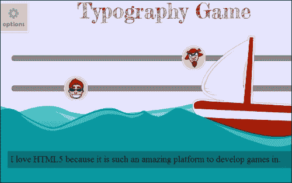
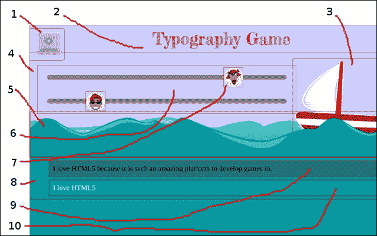
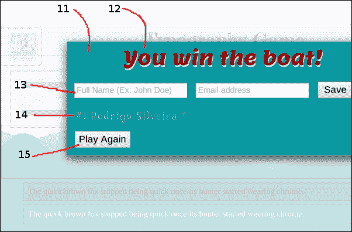
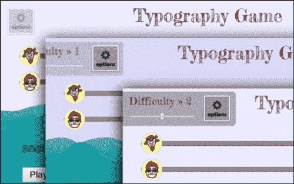
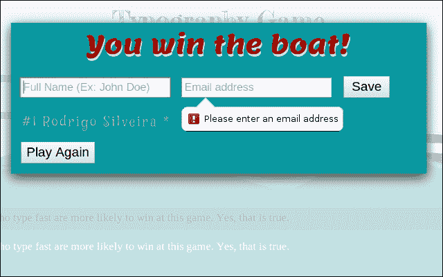
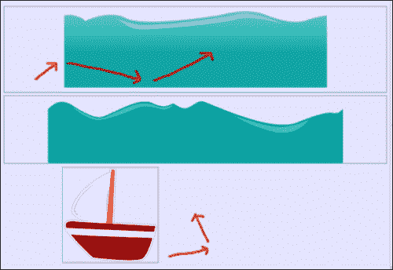
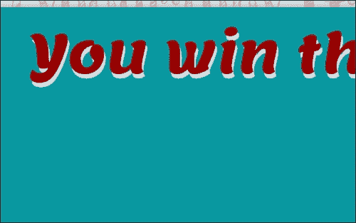
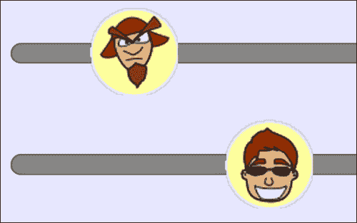
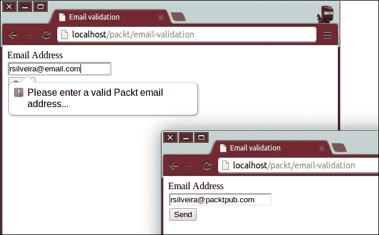

# 第二章：HTML5 排版

现在我们的环境已经设置好，我们准备深入研究 HTML5 背后的实际代码。这是本书开始起飞的地方，因为无论你学习了多少理论，要掌握一门编程语言都很难没有一些键盘时间。

本章中我们将开发一个打字游戏，重点是其排版方面。再次提醒你，本书的重点不是教授游戏开发，而是教授你关于 HTML5 的一切。因此，我们将采取的一般方法来编写游戏的代码并不一定是最适合一般游戏开发的，尽管本书涵盖的所有游戏在大多数主要浏览器中都表现得相当不错。

# 游戏

出于缺乏创意，并且为了避免可能的来自一个脾气暴躁的游戏公司的诉讼，我们将这个第一个游戏简单地命名为`Typography Game`。我知道，这不是你听说过的最令人印象深刻的游戏，但至少它很好地解释了这个游戏大致是关于什么的。

游戏的整体故事情节以及其一般要点如下：正确地输入一个逐字显示给你的短语，就可以赢得你梦想的船。如果你不能正确且足够快地输入每个字符，那么**Snooty McSnootington**就会赢得船，你就输掉了游戏技能。



从单个截图中很难传达关于这个用户界面的所有细节，但是那美丽的海洋中的波浪实际上是非常平滑地动画，船也是自由漂浮并被波浪摇动。此外，虽然整个游戏中只有六张图片，但是游戏中使用的所有组件都是 DOM 元素。船、波浪和字符都是使用 div、图片和其他语义 HTML5 元素完成的。所有的动画都是使用原生 CSS3 功能完成的。

本章的其余部分将列出游戏中使用的所有 HTML、CSS 和 JavaScript 功能，展示如何使用它们以及它们在游戏中的使用方式。所使用的编码风格旨在简单，所以不要在全局变量、不一致的面向对象原则使用以及整体基本的图形上介意。有了基本的 HTML5 概念，你可以通过应用任何额外的改进来使游戏更加完善或从开发的角度来说更具可扩展性。

我们将游戏组织成三个单独的文件：一个`index.html`文件，我们将在其中托管所有的 HTML 结构并整合其他两个文件，即一个 CSS 文件和一个 JavaScript 文件。这应该是一个相当标准的文件结构，但请随意调整以最好地满足你的需求和习惯。

按照上一章我们建立网页门户时创建的文件结构约定，我们需要在项目的根目录内创建一个名为 typography 的目录。在这个目录内，我们将创建以下文件和目录：

+   `packt/typography`

+   `packt/typography/index.html`

+   `packt/typography/fonts`

+   `packt/typography/css`

+   `packt/typography/css/style.css`

+   `packt/typography/js`

+   `packt/typography/main.js`

+   `packt/typography/img`

### 注意

我将带你走过在本章后面的部分找到并下载自定义字体的过程。至于图片，你可以自己绘制或购买，或者从网站`http://www.CHANGE-THIS-FOR-A-REAL-WEBSITE`下载我为游戏绘制的相同图片。

# 游戏元素

在这个游戏中使用了九个 HTML5 元素。每个元素将在其主要类别（HTML、CSS 或 JavaScript）中进行解释。游戏本身由大约 15 个元素组成，如下图所示：



主游戏界面，带有微妙的选项小部件。

游戏结束后，无论玩家是否赢得游戏，都会显示一个记分板，玩家有机会输入他或她的名字，以及开始新游戏。



前面的截图显示了一个消息小部件，指示玩家已经赢了或输了，以及一个排行榜小部件。

为了我们能够轻松识别每个主要的视觉游戏组件，我们将列出它们如下：

## 选项小部件

这个小部件允许玩家选择预设的难度级别。选择更难的难度级别会使敌人在他的轨道上更快地移动到船上。此外，我们可以使玩家需要输入的短语根据难度设置更难或更容易。然而，我们把这个实现细节留给读者作为练习。

## 游戏标题

这个基于文本的小部件只是显示游戏的主标题。请注意，那里使用的字体是纯文本（没有图像），使用自定义网络字体。它的唯一目的是装饰用户界面。

## 船

这个动画小部件的目的是通过帮助讲述游戏故事来加强用户界面。船是一个简单的 HTML 元素（`div`），具有代表船的背景图像。船所遵循的动画路径严格由 CSS 完成，并完全由浏览器管理。

## 天空

这部分 HTML 用于封装用户界面顶部的所有元素，并使其可能对天空进行动画处理。随着游戏的进行，天空的颜色会微妙地变化，以模拟太阳的升起和落下。

## 波浪

有一个被分类为*海洋*的 HTML 部分，它封装了存储波浪的区域。每个波浪（在这种情况下有两个）都是一个宽度为 100%的`div`元素，并且具有代表波浪的背景图像。这个背景图像在整个`div`元素的宽度上重复，并通过 CSS 进行动画处理，以产生运动的错觉，遵循海洋中的波浪模式。

## 轨道

这个小部件是一个 HTML 部分，封装了各个轨道小部件，以及使用该轨道的玩家。

## 玩家

这些图标代表游戏中的个别玩家。为了尽可能简单，游戏中只有两个玩家：你（英雄）和 Snooty McSnootington 先生（敌人）。此外，我们可以很容易地在选项小部件中添加功能，允许玩家为英雄和敌人选择特定的图标，因为控制所使用的图标的代码是一个简单的 CSS 类，可以添加到图标对象中或从中删除。

## 主容器

这部分 HTML 包含控制游戏的元素，即天空小部件下方的所有内容。

## 要写的单词

在这里，我们显示用户在游戏开始时必须输入的单词。在幕后，这是一个简单的块级 HTML 元素，其唯一目的只是显示几个单词。

## 已写的单词

尽管这个小部件与写字小部件相同（当然样式略有不同），但这个小部件更加动态，因为它会响应用户的操作。当用户在键盘上按键时，输入会显示在那里。如果输入的字符与写字小部件中显示的期望字符匹配，那么字符将显示为白色。如果字符不正确，它将显示为红色，并带有一条线，非常明显地表明出现了错误。用户可以使用*退格*键删除在此小部件中显示的任何或所有字符。当输入每个正确的字符时，英雄将按比例向右移动，与要输入的字符总数相对应。

## 消息容器

这部分 HTML 显示在一个半透明的元素顶部，以呈现覆盖框的外观。该小部件主要用于作为一种通用的通信工具，通过它我们可以通知玩家事件，比如让他们知道游戏结束了，或者他们赢了或输了游戏。此外，我们还添加了其他四个元素，以使游戏更具吸引力。

## 消息标题

这个元素在样式和目的上与主游戏标题小部件非常相似，它只是简单地通知用户其余消息容器小部件的内容。

## 新冠军表单

这种形式背后的想法是模拟旧式街机游戏中使用的老式排行榜。一旦你赢得了与 Snooty McSnootington 先生的比赛，你就有机会输入你的姓名和电子邮件地址，以便在排行榜中显示，如下面的屏幕截图所示。当然，这些信息是象征性的，只是为了说明我们如何使用 HTML5 的网络表单。表单生成的信息不会保存在任何地方，因此，在每次页面刷新后（或者游戏关闭或导航离开时），信息就会消失。再次强调，要么将该表单的内容发送到电子邮件，将其保存到后端服务器，或者甚至在浏览器中本地存储，都是一项微不足道的任务，通过我们将在书的后面讨论的许多持久性或存储 API 中的任何一个。

## 排行榜

在新冠军表单中输入的任何数据（假设输入的数据有效）都会显示在这里。每个名称旁边的数字只是显示每个名称输入的顺序。名称右侧的星号表示游戏的难度级别（在这种特殊情况下为 1 级-简单）。为了获得更有吸引力的体验，我们可以追踪玩家完成游戏所花费的时间，犯了多少错误，或者以某种方式计算出总体得分并在这里显示。我们选择全名和电子邮件地址的原因是为了展示如何在 HTML5 中执行表单验证。这可能是本游戏中使用的 HTML5 最强大和令人兴奋的功能。开发者过去需要数百行代码，而且经常有大量重复的代码，现在只需要几个 HTML 属性，浏览器就会强制执行。

## 游戏控制

最后，消息容器小部件包括控件，允许玩家开始新游戏。

### 注意

为了使代码更简洁，更易于解释，我们将致力于更少的可移植代码，唯一的要求是代码至少在一个浏览器中正确运行。

大部分使用的 API 确实非常可移植（意味着代码在大多数主要浏览器中执行相同），但肯定不是全部，特别是任何需要供应商前缀的实验性 CSS API。为了与以下示例最大兼容性，我建议您使用最新版本的谷歌 Chrome 或谷歌 Chromium，或者至少使用任何基于 webkit 的浏览器，比如苹果 Safari。

采用这种方法的原因首先是为了简化教学过程。没有必要解释一个给定的功能，然后展示代码示例，该示例与之前的功能名称的第一部分不同，但在 99%的情况下是相同的，这是供应商名称。选择 webkit 作为首选浏览器引擎的原因也非常简单；我们必须选择一些东西，那为什么不选择 webkit 呢？此外，谷歌 Chrome 和苹果 Safari 在市场上有很大的渗透率，以及一套令人难以置信的工具，可以帮助我们进行开发（例如谷歌 Chrome 的开发者工具）。

最后，游戏中使用的*九*个 HTML5 元素，以及它们对应的类别：

## HTML

这个游戏中使用的 HTML 功能可以在 JavaScript 中或直接由浏览器使用。Web 表单元素和属性在浏览器中提供了很好的功能，而数据属性在与 JavaScript 绑定时更有意义。在我们的“排版游戏”中，我们在有意义的上下文中构建了这些元素，但我们当然可以使用其他技术（例如严格在代码中存储数据属性所代表的数据），或者以不同的方式使用我们使用的元素和属性。

### Web 表单

HTML5 中添加的新表单 API 是语言中最显著的增加之一。通过它，您可以访问 13 种新的输入类型，以及无数新的属性，使表单开发快速、有趣和迷人。大多数增加的功能在视觉上可能会让您感到熟悉，因为它们在浏览器中的本地效果已经存在很长时间了。这些效果包括占位文本、表单验证、自动对焦字段等等。

游戏中使用了 13 种新的输入类型中的两种，以及每种输入类型的一些属性，包括表单验证和字段占位符。以下是这些元素在游戏中的简要说明。关于它们的工作原理和如何使用它们的深入讨论可以在下一节中找到。

#### 范围输入

新的范围输入类型是一个滑块，允许用户通过水平移动滑块来选择数值。在游戏中，我们使用范围输入作为选择难度级别的手段。该游戏中指定的范围是从 1 到 3，1 表示最容易的难度级别，3 表示最困难的难度级别。



包含范围输入类型的容器使用 CSS 在不使用时切换选项菜单并使其淡出。

#### 电子邮件输入

电子邮件输入类型看起来与旧的文本输入类型完全相同，但具有一些好处。首先，在移动设备上使用时，输入类型提示操作系统它期望的信息类型，此时操作系统可以向用户显示特殊的键盘。例如，如果用户尝试输入数据到只允许数字的数字输入类型中，移动操作系统可以显示只有数字的键盘。在电子邮件类型的情况下，通常显示的键盘包括**@**符号，这使用户更容易更方便地输入信息到网络表单中。

使用电子邮件输入类型的第二个好处，也是对桌面用户的好处，是浏览器本身可以验证用户输入的数据。如果字段设置为验证，并且字段中的数据不符合电子邮件地址的基本格式，浏览器将告诉用户存在问题，表单将无法提交。

在游戏中，每当玩家获胜时，我们会要求用户输入他或她的全名和电子邮件地址。这些信息将用于排行榜，就像您可能在旧游戏中看到的那样。虽然用户不被强制输入表单中要求的任何信息，但如果用户选择输入任何信息，浏览器将自动验证数据。

自动表单验证的令人兴奋之处在于，您可以通过包括的 HTML 属性自定义表单，仅验证必填字段，错误消息的内容等等。此外，即使用户在浏览器中禁用了 JavaScript 功能，表单仍将由浏览器验证和处理。当然，您很清楚，从用户那里获取输入的主要规则之一是您永远不应信任用户，并始终在服务器上验证和清理任何和所有用户输入。



如果没有输入数据或格式错误，浏览器会告诉你，并阻止表单提交。

### 数据属性

作为努力的一部分，为了更语义化的文档结构，HTML5 允许我们创建自己的自定义元素属性。在 HTML5 之前，大多数浏览器简单地忽略了它不理解的元素属性（例如，专门为某个应用程序制作的自定义属性），但这种做法的缺点包括文档无法验证，行为有些不可预测，还有可能语言的新版本引入了同名的属性，从而使旧的自定义属性无效。现在，我们可以安全地为元素创建自定义属性，上述提到的任何缺点都不适用。

在我们的游戏中，我们使用数据属性来做两件事，即指定玩家可以在赛道上移动的最小速度，并指定一个通用按钮应该触发一个新游戏（因此，具有该数据属性的任何按钮都不需要在 JavaScript 中额外的逻辑来表现得像一个特殊按钮）。

## CSS

由于这个游戏旨在展示 HTML5 更多的视觉方面，我们大部分的努力都集中在使游戏界面成为真正的眼睛糖果。由于 CSS 主要关注视觉呈现，大多数采用的特色都属于这个类别。

### 网络字体

在 HTML5 能够处理自定义字体之前，网页设计师和开发人员只能使用少数几种字体在网站或 Web 应用程序中使用。随着时间的推移，出现了一些解决这个问题的解决方案，但没有一个特别令人印象深刻，大多数（如果不是全部）都破坏了一些浏览器的功能。例如，一种常见的显示自定义文本的技术涉及使用 JavaScript 动态替换字符串中的每个字符，使用自定义字体的实际图像。这种方法的问题包括需要创建和管理所有这些图像。用户必须下载所有这些图像，最糟糕的是，生成的文本无法被选择、复制、调整大小，颜色也无法更改。

现在我们可以简单地指定字体的名称，以及实际的字体文件，如果用户的操作系统没有安装该字体，浏览器可以下载并像任何其他字体一样使用。

在游戏中，我们使用了三种不同的自定义字体来创建恰到好处的视觉效果，并使游戏中的文本与期望的视觉主题相匹配。使用的三种字体都是开源字体，可以从互联网上免费下载和使用。使用的字体是 Lemon，Mystery Quest 和 Fredericka the Great。这些名字很棒，你同意吗？


在寻找游戏的一些字体之前，我不知道这些字体的存在。最重要的是，我只花了几分钟时间浏览了大量的开源字体（来自 Google 的 Web 字体工具），找到了我想要的。

由于字体文件是从服务器下载的外部资产，因此在浏览器开始下载字体文件和页面准备好渲染之间存在一段时间。不同的浏览器处理这种情况的方式不同。例如，webkit 会隐藏文本，直到字体资产准备就绪。其他浏览器可能会使用备用或默认字体渲染文本，直到网络字体文件准备就绪，然后切换字体并重新渲染文本。

### 过渡

CSS 过渡属性告诉浏览器它适用于哪些属性以及过渡应持续多长时间。一旦这些属性发生变化，浏览器将插值开始和结束状态，并在指定的持续时间内生成非常平滑的过渡效果。当然，这只能应用于由某些数值表示的属性，例如字体大小，背景颜色（由 RGB 或 HSL 值或十六进制数表示，所有这些都可以转换为百分比），元素位置等。在 CSS 过渡中不会平滑插值的值包括字体系列，背景图像或任何其他没有中间值的属性，例如显示块和显示无。

在游戏中，过渡的唯一用途是选项菜单，消息容器以及将玩家移动到轨道上。选项菜单设置为从屏幕左侧推出，代表它的主图标为 75％的透明度。一旦用户将鼠标悬停在该图标上，它的透明度就会过渡到零（完全可见），并且菜单的其余部分会过渡到其左侧，向右移动，直到其左边缘与浏览器的左边缘对齐。

消息容器使用类似的效果，它始终位于屏幕顶部，其宽度默认为窗口视口的 100％，高度默认设置为零（当容器处于“关闭”状态时）。当我们想向用户显示消息时，将 CSS 类`open`添加到容器小部件中，将容器的高度设置为 100％，从而触发平滑过渡，模拟滑入效果。

最后，我们使用过渡效果将玩家从右侧移动到各自绑定的轨道上。这是一个非常容易实现的任务，尽管英雄和敌人的控制方式略有不同。敌人移动的方式很简单：在游戏计时器的每个滴答声中，我们通过改变其左侧样式属性来增加敌人的水平位置，增加的数值是其数据速度数据属性中设置的。两点之间的平滑过渡由浏览器处理。英雄的移动方式类似，唯一的区别是数据速度始终设置为零（否则它会自动移动，而无需用户输入任何内容），每次按键按下时，我们都会检查用户输入的字符是否符合预期，如果是，则英雄会相对于正确输入的字符的百分比和总字符数的百分比向轨道的末端前进。例如，如果用户正确输入了具有 100 个字符的短语的第十个字符，那么我们将英雄移动到其轨道的 10％处。英雄和敌人都有检查机制，以防止它们被移动超出各自轨道的宽度。

### 动画

CSS3 最强大的功能可能是动画属性，它允许命名关键帧动画，非常类似于以前流行的 Adobe Flash。它的工作方式非常简单：您创建一个动画序列，给它一个名称，并指定一个或多个 CSS 属性，以便在每个关键帧上应用。每个关键帧代表这些属性应该添加到您将其与动画序列关联的任何元素上的时间点。然后，浏览器会平滑地插值两个关键帧之间的每个时间点，并实现动画的幻觉。

在游戏中，我们使用动画来赋予海浪生命，让船在其航道上移动，并随着时间的推移使天空变暗和变亮，从而模拟太阳的升起和落下。虽然这可能看起来是一项复杂的任务，但动画元素是如此简单，以至于你可能遇到的主要限制可能是创造力。如果你对 CSS 和如何使用它来为元素应用各种样式有一定了解，那么学习和使用动画 API 应该是一个自然的下一步。



每个动画对象都只是一个带有背景图像的`div`元素。波浪的背景图像设置为在 x 轴上重复，而船的背景图像设置为不重复。船的宽度和高度设置为与其代表的图像相匹配，而每个波浪的高度设置不同（位于一切之后的波浪略高一些，以便它可以在另一组波浪后面看到），但宽度设置为 100％，以便始终填充查看应用程序的监视器的宽度，无论该监视器有多宽。在动画周期结束时，对象沿着相同的路径，但是反向移动，使得动画看起来连续而且始终平滑。

最容易动画化的元素是天空，因为它只有两个关键帧。在第一个关键帧中，代表天空的`div`元素的背景被设置为浅蓝色。最后一个关键帧将背景颜色更改为略深的蓝色。为了获得更加戏剧性的效果，我们可以让最后一个关键帧为背景定义一个非常深的颜色。为了更加戏剧性地表示夜晚降临，我们还可以在这个天空元素的顶部添加另一个`div`，其背景图像是一个带有散布的白点的透明图像。每个点代表一颗星星。然后，以与天空变暗相同的速度，我们将这个元素的不透明度设置为更加可见（不透明度更低），以便从完全透明到完全不透明进行动画。最终效果是随着天空变暗，星星会出现。

船只使用了三个关键帧进行动画：第一个将其放置在略高于海浪的某个位置，第二个将其向右上移动，第三个关键帧将其移动得更高，稍微向左移动。使得动画在这些点之间看起来有些自然，并且更像是真实生活中海洋中的运动的技巧是使得物体在两个不同关键帧之间移动的距离不同。例如，船在第一个和第二个关键帧之间移动的水平距离与第二个和第三个关键帧之间使用的水平位移不同。这些关键帧之间的垂直位移更加激烈。如果所有距离都相同，我们的眼睛会习惯于相同的运动模式，动画很快会显得太重复和无聊。

动画波浪同样容易。虽然有两组波浪，它们都使用相同的动画设置。唯一的区别是，位于另一组波浪后面的波浪（后面的波浪）设置为移动速度较慢，以便看起来它离得更远，动画看起来不同。

在这些波浪元素中进行的所有动画（记住，波浪元素只是一个带有重复背景图像的`div`）只是背景图像的位置。`div`元素本身始终是静态的，并且绝对定位在彼此之上。由于元素在其背景图像透明的地方是透明的，我们能够将背景颜色应用于包含这三个元素的元素（波浪和船），我们将其设置为天空元素，从而使背景颜色动画化。

尽管最终结果看起来有趣且稍微复杂，但组合这种东西所需的工作实际上并不比使用纯 CSS 设置任何其他设计更复杂或困难，特别是因为这只是纯粹的旧 CSS。

### 注意

在撰写本文时，有一些旨在帮助开发人员创建和管理关键帧动画的工具。虽然许多这些工具是免费的，许多完全基于云（使用 HTML5 技术编写），但如果您正在寻找一个企业级工具，以帮助您构建与 Adobe Flash 中看到的类似的专业动画，那么您需要投资一些现金来获得更先进和精细调整的工具。尽管其中一些工具可能不是预算有限的开发人员（或根本没有预算的开发人员）的最佳选择，但它们的质量和功能通常远远超出任何免费工具可以提供的范围。

如果您只是为了好玩或学习经验而开发，那么在线可用的大量免费工具应该足够让您开始使用 CSS3 关键帧动画。然而，如果您的目标是构建高端应用程序，并且需要对动画进行高精度和控制，那么专业工具可能是值得投资的。

一个特别受欢迎的免费基于 Web 的 CSS 动画生成器可以在[`www.css3maker.com/`](http://www.css3maker.com/)找到。另一方面，Adobe 推出了一款名为 Adobe Edge Animate 的出色产品，可以在[`html.adobe.com/edge/animate/`](http://html.adobe.com/edge/animate/)上购买。

### 文本阴影

CSS 中的这个新文本属性允许您在文本周围模拟阴影效果。在幕后，浏览器真正做的是创建文本的副本，然后根据您指定的垂直和水平偏移值将其位移在原始文本的后面。您还可以告诉浏览器通过指定介于零和您所需的任何整数值之间的值来模糊这个“阴影”版本的文本。在某一点上，取决于原始文本的大小，模糊度很高，以至于文本几乎是看不见的，因此提供非常大的数字可能是适得其反的。

游戏中唯一使用文本阴影的情况是在消息容器的标题中。由于游戏的其余用户界面使用了非常平坦的图形，几乎没有渐变，我认为我可以使用文本阴影来添加一个坚实的、较浅的阴影，以延续平面、单维度图形的主题。



CSS3 文本阴影 API 允许您指定文本字符串的任意数量的位移和模糊副本。

### 框阴影

与文本阴影类似，框阴影在特定元素的后面放置一个或多个框，指定为参数的垂直和水平偏移量，第三个参数是要应用于阴影的模糊量。您可以指定纯色或使用可选的 alpha 通道，以添加不同级别的不透明度。或者，阴影可以应用于其绑定的容器的内部。请注意，如果元素的任何框阴影被放置在框的后面，它们将被放置在边框的外部，如果有的话，忽略元素可能具有的任何边距。放置在元素内部的阴影将被放置在边框的内部，如果有的话，忽略添加到元素的任何填充。

在游戏中，有两个 CSS 盒子阴影的实例。一个显示了元素后面的传统阴影，并应用于消息容器。游戏中另一个盒子阴影的实例应用于容纳每个玩家的轨道。在这种情况下，阴影旨在传达轨道被按入页面的效果，这是通过使用将阴影放置在框内的属性来实现的。如果阴影放在框外，给出的效果是框叠加在页面上。



每个轨道底部的白线只是一个底部边框，但可以通过添加第二个盒子阴影来实现相同的效果。

### 边框半径

在边框半径属性可用之前，可以通过将圆角图像定位到元素的角落来实现它提供的相同效果。这是一项繁琐的任务，最终效果很少如预期那样令人印象深刻。有了 CSS3 的边框半径属性，我们可以将任意数量的圆角应用于一个或多个`container`元素的角落。

### 注意

请记住，尽管可以通过为所有四个角指定足够大的边框半径值使`container`元素看起来完全圆形，但对于浏览器来说，该元素仍然是一个矩形。换句话说，如果您浮动两个或更多通过 CSS 制作成圆形的元素，它们将像矩形而不是圆形一样行为。

HTML5 中元素和文本的流动仍然是基于矩形的，尽管有一些实验性的 API 允许我们通过指定任意形状来流动文本。有关这些特定的 CSS API（称为**regions**和**exclusions**）的更多信息，请参见第六章，*为您的游戏添加功能*。

游戏中只使用了一次 CSS 边框半径，即在导航选项小部件的右侧。该 API 允许我们指定要应用边框半径的特定边，并为了演示这一特性，容器的四个边中只有两个被圆角化。

玩家图标本可以更符合 HTML5 的风格，而不仅仅是将透明图像应用于元素的背景。一种可能性是将每个图标都作为矩形图像，然后将其应用于代表每个玩家的容器的背景，然后我们可以使用边框半径使元素看起来完全圆形。还可以添加可选的盒子阴影，以创建与用于创建图像的照片编辑软件实现的相同阴影效果。使用这种技术的一个好处是，原生效果会更好地缩放，这意味着如果您放大或缩小页面，图像最终看起来会变形和像素化，而对元素添加的任何边框半径、盒子阴影或边框始终会看起来平滑和清新。

## JavaScript

尽管驱动这个游戏的逻辑相当简单，而且相当受限，但为了使游戏运行，仍需要相当多的 JavaScript 代码。由于我们试图专注于 HTML5 的特性，我们只会看一下代码中使用的一个可以更多或少被视为 HTML5 的特定 API。这就是**选择器 API**，它是由 W3C 于 2006 年 5 月首次起草的。

### 查询选择器

如果您在过去几年中进行过任何网页开发，您肯定听说过或使用过并爱上了流行的 JavaScript 库 jQuery。在其众多强大功能中，jQuery 最有用的工具之一是其令人惊叹的 DOM 选择器 API，它允许您仅使用 CSS 选择器和伪选择器而不是使用有限的`document.getElementById()`、`document.getElementsByClassName()`和`document.getElementsByName()`等方法来检索 DOM 元素。

好消息是，这个强大的节点选择器 API 现在完全是现代浏览器的本机功能。由于该功能是浏览器的本机功能，因此速度更快，更稳定。此外，由于该功能是浏览器的本机功能，因此无需导入库来处理任务。

这个游戏，以及本书中描述的所有其他游戏，都使用了新的选择器 API 级别 1。由于没有可见的元素可以从查询选择器中看到，我们将在下一节深入讨论其用法，同时还将看一些代码示例。

# API 使用

现在我们已经讨论了所有游戏元素以及每个 HTML5 功能是如何用来实现这一角色的，让我们更深入地了解如何充分利用这些 API。对于以下每个 API，我们将提供该功能的更具体定义，其预期用途是什么，并将跟随一个代码示例。您还可以参考附在本章末尾的完整源代码，以填补代码示例与该功能如何与游戏代码基础的其他部分配合的差距。还建议您跟着编码，并尝试各种设置和值，以便实验和更全面地理解每个 API。

## Web 表单

新的 HTML5 Web 表单 API 添加了 13 种新的输入类型，可以实现更灵活、更强大的体验。更重要的是，Web 表单还能够自行验证，无需任何 JavaScript 干预。

### 新的输入类型

以下是 HTML5 规范中新的 Web 表单章节中定义的新输入类型：

#### 日期

日期输入类型允许用户从浏览器提供的日历中选择特定的日期。此日历的特定格式和样式是与使用的浏览器和平台相关的。日期选择结果的数据格式为`YYYY-MM-DD`。

```js
<input type="date"
  min="1935-12-16"
  max="2013-08-19"
/>
```

可选属性`min`和`max`可用于强制验证用户选择的日期在给定范围内。日期输入类型的其他有效属性包括以下内容：

+   `name`（值必须是字符串）：通过与属性关联的字符串值标识特定字段

+   `disabled`（可接受的值包括`disabled`，`""`或空）：指定该元素被禁用，无法接收控制

+   `autocomplete`（可接受的值包括`on`或`off`）：指定浏览器是否应存储用户输入的值，因此将来可以由浏览器自动完成用户提示时输入的存储值

+   `autofocus`（可接受的值包括`autofocus`，`""`或空）：指定元素在文档加载完成后必须立即接收焦点

+   `min`（值必须是形式为"yyyy-mm-dd"的有效日期）：指定用户可以选择的最低日期

+   `max`（值必须是形式为"yyyy-mm-dd"的有效日期）：指定用户可以选择的最高日期

+   `readonly`（可接受的值包括`readonly`，`""`或空）：指定该元素的值不能被用户更改

+   `step`（可接受的值包括`any`或任何正整数）：指定元素的值属性如何更改

+   `required`（可接受的值包括`required`，`""`或空）：指定该元素必须具有有效值，以便允许表单提交

+   `value`（值必须是形式为"yyyy-mm-dd"的有效日期）：指定由该元素表示的实际日期

#### 月

月份输入类型允许用户从浏览器提供的日历中选择特定的月份和年份。此日历的特定格式和样式是与使用的浏览器和平台相关的。日期选择结果的数据格式为`YYYY-MM`。

```js
<input type="month"
  min="1935-12"
  max="2013-08"
/>
```

日期输入类型的其他有效属性包括以下内容：

+   `name`（值必须是字符串）：通过与属性关联的字符串值标识特定字段

+   `disabled`（可接受的值包括`disabled`、`""`或空）：指定该元素已禁用，不能接收控制

+   `autocomplete`（可接受的值包括`on`或`off`）：指定浏览器是否应存储用户输入的值，以便将来可以由浏览器自动完成用户的提示输入的存储值

+   `autofocus`（可接受的值包括`autofocus`、`""`或空）：指定在文档完成加载后，元素必须立即获得焦点

+   `min`（值必须是形式为“yyyy-mm”的有效日期）：指定用户可以选择的最早日期

+   `max`（值必须是形式为“yyyy-mm”的有效日期）：指定用户可以选择的最高日期

+   `readonly`（可接受的值包括`readonly`、`""`或空）：指定此元素的值不能被用户更改

+   `step`（可接受的值包括`any`或任何正整数）：指定元素的值属性如何更改

+   `required`（可接受的值包括`required`、`""`或空）：指定此元素必须具有有效值，以便允许表单提交

+   `value`（值必须是形式为“yyyy-mm”的有效日期）：指定由此元素表示的实际日期

#### 周

周输入类型允许用户从浏览器提供的日历中选择一年中的特定周。此日历的特定格式和样式是独特的，取决于所使用的浏览器和平台。日期选择的结果数据形式为`YYYY-Www`（例如，2013-W05）。

```js
<input type="week"
  min="1935-W51"
  max="2013-W34"
/>
```

日期输入类型的其他有效属性包括以下内容：

+   `name`（值必须是字符串）：通过与属性关联的字符串值标识特定字段

+   `disabled`（可接受的值包括`disabled`、`""`或空）：指定该元素已禁用，不能接收控制

+   `autocomplete`（可接受的值包括`on`或`off`）：指定浏览器是否应存储用户输入的值，以便将来可以由浏览器自动完成用户的提示输入的存储值

+   `autofocus`（可接受的值包括`autofocus`、`""`或空）：指定在文档完成加载后，元素必须立即获得焦点

+   `min`（值必须是形式为“yyyy-Www”的有效日期，其中“ww”必须是周数的两位数字表示）：指定用户可以选择的最早日期

+   `max`（值必须是形式为“yyyy-Www”的有效日期，其中“ww”必须是周数的两位数字表示）：指定用户可以选择的最高日期

+   `readonly`（可接受的值包括`readonly`、`""`或空）：指定此元素的值不能被用户更改

+   `step`（可接受的值包括`any`或任何正整数）：指定元素的值属性如何更改

+   `required`（可接受的值包括`required`、`""`或空）：指定此元素必须具有有效值，以便允许表单提交

+   `value`（值必须是形式为“yyyy-Www”的有效日期，其中“ww”必须是周数的两位数字表示）：指定由此元素表示的实际日期

#### 时间

时间输入类型允许用户选择一天中的特定时间。此元素中的数据格式为`HH:MM:SS.Ms`。

```js
<input type="time"
  min="16:23:42.108"
  max="23:59:59.999"
/>
```

日期输入类型的其他有效属性包括以下内容：

+   `name`（值必须是字符串）：通过与属性关联的字符串值标识特定字段

+   `disabled`（可接受的值包括`disabled`、`""`或空）：指定该元素已禁用，不能接收控制

+   `autocomplete`（可接受的值包括`on`或`off`）：指定浏览器是否应存储用户输入的值，以便将来可以由浏览器自动完成用户的提示输入的存储值

+   `autofocus`（可接受的值包括`autofocus`、`""`或空）：指定元素在文档加载完成后必须立即获得焦点

+   `min`（值必须是部分时间的有效形式，如"HH:MM:SS.Mss"、"HH:MM:SS"或"HH:MM"）：指定用户可以选择的最低日期

+   `max`（值必须是部分时间的有效形式，如"HH:MM:SS.Mss"、"HH:MM:SS"或"HH:MM"）：指定用户可以选择的最高日期

+   `readonly`（可接受的值包括`readonly`、`""`或空）：指定此元素的值不能被用户更改

+   `step`（可接受的值包括`any`或任何正整数）：指定元素的值属性如何更改

+   `required`（可接受的值包括`required`、`""`或空）：指定此元素必须具有有效值，以便允许提交表单

+   `value`（值必须是部分时间的有效形式，如"HH:MM:SS.Mss"、"HH:MM:SS"或"HH:MM"）：指定此元素表示的实际日期

#### 日期时间

日期时间输入类型允许用户从浏览器提供的日历中选择特定日期和时间（包括时区）。此日历的特定格式和样式对于所使用的浏览器和平台是独特的。日期选择结果的数据形式为`YYYY-MM-DDTHH:MM:SS-UTC`。

```js
<input type="datetime"
  min="1935-12-16T16:23:42-08:00"
  max="2013-08-19T23:59:59-09:00"
/>
```

日期输入类型的其他有效属性包括以下内容：

+   `name`（值必须是字符串）：通过与属性关联的字符串值标识特定字段

+   `disabled`（可接受的值包括`disabled`、`""`或空）：指定该元素被禁用，不能接收控制

+   `autocomplete`（可接受的值包括`on`或`off`）：指定浏览器是否应存储用户输入的值，以便将来可以由浏览器自动完成用户的提示输入的存储值

+   `autofocus`（可接受的值包括`autofocus`、`""`或空）：指定元素在文档加载完成后必须立即获得焦点

+   `min`（值必须是有效的日期时间，如 RFC 3339 中定义）：指定用户可以选择的最低日期

+   `max`（值必须是有效的日期时间，如 RFC 3339 中定义）：指定用户可以选择的最高日期

+   `readonly`（可接受的值包括`readonly`、`""`或空）：指定此元素的值不能被用户更改

+   `step`（可接受的值包括`any`或任何正整数）：指定元素的值属性如何更改

+   `required`（可接受的值包括`required`、`""`或空）：指定此元素必须具有有效值，以便允许提交表单

+   `value`（值必须是有效的日期时间，如 RFC 3339 中定义）：指定此元素表示的实际日期

#### 日期时间本地

日期时间本地输入类型允许用户从浏览器提供的日历中选择特定日期和时间（不包括时区）。此日历的特定格式和样式对于所使用的浏览器和平台是独特的。日期选择结果的数据形式为`YYYY-MM-DDTHH:MM:SS`。

```js
<input type="datetime-local"
  min="1935-12-16T16:23:42"
  max="2013-08-19T23:59:59"
/>
```

日期输入类型的其他有效属性包括以下内容：

+   `name`（值必须是字符串）：通过与属性关联的字符串值标识特定字段

+   `disabled`（可接受的值包括`disabled`、`""`或空）：指定该元素被禁用，不能接收控制

+   `autocomplete`（可接受的值包括`on`或`off`）：指定浏览器是否应存储用户输入的值，以便将来可以由浏览器自动完成用户提示的存储值

+   `autofocus`（可接受的值包括`autofocus`，`""`或空）：指定文档完成加载后元素必须立即接收焦点

+   `min`（值必须是有效的部分时间，格式为“YYYY-MM-DDTHH:MM:SS.Mss”，“YYYY-MM-DDTHH:MM:SS”或“YYYY-MM-DDTHH:MM”）：指定用户可以选择的最低日期

+   `max`（值必须是有效的部分时间，格式为“YYYY-MM-DDTHH:MM:SS.Mss”，“YYYY-MM-DDTHH:MM:SS”或“YYYY-MM-DDTHH:MM”）：指定用户可以选择的最高日期

+   `readonly`（可接受的值包括`readonly`，`""`或空）：指定此元素的值不能被用户更改

+   `step`（可接受的值包括`any`或任何正整数）：指定元素的值属性如何更改

+   `required`（可接受的值包括`required`，`""`或空）：指定此元素必须具有有效值，以便允许提交表单

+   `value`（值必须是有效的部分时间，格式为“YYYY-MM-DDTHH:MM:SS.Mss”，“YYYY-MM-DDTHH:MM:SS”或“YYYY-MM-DDTHH:MM”）：指定此元素表示的实际日期

#### 颜色

颜色输入类型允许用户从浏览器提供的颜色选择器中选择特定颜色。此颜色选择器小部件的特定格式和样式是独特的，取决于所使用的浏览器和平台。尽管小部件的某些实现可能以不同格式（RGB 或 HSL）提供值，但从颜色选择结果的数据是颜色的十六进制表示形式，格式为`#RRGGBB`。

```js
<input type="color"
  value="#900CC1"
/>
```

日期输入类型的其他有效属性包括以下内容：

+   `name`（值必须是字符串）：通过与属性关联的字符串值标识特定字段。

+   `disabled`（可接受的值包括`disabled`，`""`或空）：指定元素已禁用，无法接收控制。

+   自动完成（可接受的值包括`on`或`off`）：指定浏览器是否应存储用户输入的值，以便将来可以由浏览器自动完成用户提示的存储值。

+   `autofocus`（可接受的值包括`autofocus`，`""`或空）：指定文档完成加载后元素必须立即接收焦点。

+   `value`（值必须是有效的十六进制颜色，长度为七个字符，格式为“#rrggbb”或“#RRGGBB”）：指定此元素表示的实际颜色。不允许使用关键字，如 Color。

#### 电子邮件

电子邮件输入类型允许用户输入电子邮件地址。在提供数字键盘进行数据输入的移动设备上，此输入类型提示系统提供最适合输入电子邮件地址的键盘。

```js
<input type="email"
  placeholder="Enter an email address"
  pattern="\w{3,}@packtpub\.com"
  maxlength="23"
/>
```

日期输入类型的其他有效属性包括以下内容：

+   `name`（值必须是字符串）：通过与属性关联的字符串值标识特定字段。

+   `disabled`（可接受的值包括`disabled`，`""`或空）：指定元素已禁用，无法接收控制。

+   `autocomplete`（可接受的值包括`on`或`off`）：指定浏览器是否应存储用户输入的值，以便将来可以由浏览器自动完成用户提示的存储值。

+   `autofocus`（可接受的值包括`autofocus`，`""`或空）：指定文档完成加载后元素必须立即接收焦点。

+   `maxlength`（值必须是非负整数）：指定元素可以包含的最大字符数。

+   `pattern`（值必须是由 ECMA 262 定义的有效正则表达式模式）：指定浏览器必须根据指定的输入验证的模式。

+   `size`（值必须是正整数）：指定元素显示的最大字符数，尽管可能允许输入更多字符。

+   `placeholder`（值必须是字符串）：指定要显示给用户作为提示的字符串，以指示字段期望的信息。当数据输入到字段中时，此字符串消失，并在字段变为空时显示。

+   `multiple`（可接受的值包括`multiple`、`""`或空）：指定此元素允许多个值。

+   `readonly`（可接受的值包括`readonly`、`""`或空）：指定此元素的值不能被用户更改。

+   `required`（可接受的值包括`required`、`""`或空）：指定此元素必须具有有效值，以便允许提交表单。

+   `value`（值必须是有效的电子邮件地址，并且必须遵守模式属性指定的任何进一步限制）：指定此元素表示的实际电子邮件地址，或者当存在多个属性时，指定有效电子邮件地址的逗号分隔列表。

### Note

对于不熟悉 JavaScript 正则表达式语言或需要复习的人，以下是语法的摘要：

`[rodig]`（括号）：用于匹配括号内找到的任何内容。例如：匹配括号内的任一字母。

`[^rodig]`（负括号）：用于匹配括号内未找到的任何内容。例如，匹配括号内字母之外的任何字符。

`[D-M]`（范围）：用于匹配一系列字符或数字。例如，匹配大写字母 D 和 M 之间的任何字符。

`(me|you|us)`（管道）：用于匹配备选选项。例如，匹配括号内的任一单词。

`.`（句号）：匹配任何字符，除了换行符或行终止符。

`\w`（单词字符）：匹配任何字母、数字或下划线。

`\W`（非单词字符）：匹配任何不是单词字符的字符。

`\d`（数字）：匹配任何单个数字。

`\D`（非数字）：匹配任何非数字字符。

`\s`（空格）：匹配空格。

`\S`（非空格）：匹配任何不是空格字符的字符。

`\b`（单词边界）：在单词的开头或结尾找到匹配。

`\B`（非单词边界）：查找不是单词边界的匹配。

`\0`（空字符）：匹配字符串中的空字符。

`\n`（换行符）：匹配换行符。

`\f`（换页符）：匹配换页符。

`\r`（回车符）：匹配回车符。

`\t`（制表符）：匹配制表符。

`\v`（垂直制表符）：匹配垂直制表符字符。

`+`（加号量词）：匹配前一个表达式或字符一次或多次。

`*`（星号量词）：匹配前一个表达式或字符零次或多次。

`?`（问号量词）：匹配前一个表达式或字符零次或一次。

`{3,5}`（括号量词）：分别匹配前一个表达式的最小和最大次数。如果最大数字缺失，匹配将继续直到找到一个非匹配。例如：\d{1,} 匹配一个或多个数字。

`^`（尖角修饰符）：在字符串的开头匹配表达式。

`$`（美元修饰符）：在字符串的末尾匹配表达式。

#### Number

数字输入类型允许用户从浏览器提供的任何机制中选择数字，或者如果浏览器只提供标准输入字段，则只需输入数字值。浏览器会验证该值，以确保用户确实输入了数字。在移动设备上，数字键盘用于数据输入，该输入类型提示系统应提供最适合输入数字的键盘。

```js
<input type="number"
  min="42"
  max="108"
  step="2"
/>
```

日期输入类型的其他有效属性包括以下内容：

+   名称（值必须是字符串）：通过与属性关联的字符串值标识特定字段。

+   禁用（可接受的值包括`disabled`，`""`或空）：指定该元素被禁用，不能接收控制。

+   自动完成（可接受的值包括`on`或`off`）：指定浏览器是否应存储用户输入的值，以便在用户提示时浏览器可以自动完成将来输入的存储值。

+   自动对焦（可接受的值包括`autofocus`，`""`或空）：指定元素在文档加载完成后必须立即获得焦点。

+   最小值（值必须是浮点数）：指定用户可以选择的最小数字。

+   最大值（值必须是浮点数）：指定用户可以选择的最大数字。

+   只读（可接受的值包括`readonly`，`""`或空）：指定该元素的值不能被用户更改。

+   占位符（值必须是字符串）：指定要显示给用户的字符串，作为字段期望的信息提示。当数据输入到字段中时，该字符串消失，并在字段变为空时显示。

+   步长（可接受的值包括`any`或任何正整数）：指定元素的值属性如何改变。

+   必填（可接受的值包括`required`，`""`或空）：指定该元素必须具有有效值，以便允许表单提交。

+   值（值必须是浮点数）：指定由该元素表示的实际浮点数。

#### 范围

范围输入类型允许用户使用浏览器提供的滑块小部件从指定范围中选择一个数字。范围选择的具体格式和样式是独特的，取决于所使用的浏览器和平台。范围选择的结果数据是一个浮点数。

```js
<input type="range"
  min="42"
  max="108"
  step="0.5"
/>
```

日期输入类型的其他有效属性包括以下内容：

+   名称（值必须是字符串）：通过与属性关联的字符串值标识特定字段。

+   禁用（可接受的值包括`disabled`，`""`或空）：指定该元素被禁用，不能接收控制。

+   自动完成（可接受的值包括`on`或`off`）：指定浏览器是否应存储用户输入的值，以便在用户提示时浏览器可以自动完成将来输入的存储值。

+   自动对焦（可接受的值包括`autofocus`，`""`或空）：指定元素在文档加载完成后必须立即获得焦点。

+   最小值（值必须是浮点数）：指定用户可以选择的最小数字。

+   最大值（值必须是浮点数）：指定用户可以选择的最大数字。

+   只读（可接受的值包括`readonly`，`""`或空）：指定该元素的值不能被用户更改。

+   占位符（值必须是字符串）：指定要显示给用户的字符串，作为字段期望的信息提示。当数据输入到字段中时，该字符串消失，并在字段变为空时显示。

+   步长（可接受的值包括`any`或任何正整数）：指定元素的值属性如何改变。

+   `required`（可接受的值包括`required`、`""`或空）：指定该元素必须具有有效值，以便允许表单提交。

+   `value`（值必须是浮点数）：指定由该元素表示的实际浮点数。

#### 搜索

搜索输入类型允许用户输入用于搜索的字符串。总体而言，搜索输入类型看起来和行为非常像常规文本输入类型。一些浏览器可能会为该字段添加杂项行为，例如内置图标或小部件，以立即清除字段，但这些都不是规范的一部分。

```js
<input type="search"
  placeholder="Search"
  pattern="[^!\?]"
/>
```

日期输入类型的其他有效属性包括以下内容：

+   `name`（值必须是一个字符串）：通过与属性关联的字符串值标识特定字段。

+   `disabled`（可接受的值包括`disabled`、`""`或空）：指定该元素已禁用，无法接收控制。

+   `autocomplete`（可接受的值包括`on`或`off`）：指定浏览器是否应存储用户输入的值，以便将来可以由浏览器自动完成用户提示的存储值。

+   `autofocus`（可接受的值包括`autofocus`、`""`或空）：指定给浏览器，元素在文档完成加载后必须立即获得焦点。

+   `maxlength`（值必须是非负整数）：指定元素可以包含的字符的最大长度。

+   `pattern`（值必须是由 ECMA 262 定义的有效正则表达式模式）：指定浏览器必须根据指定的输入验证模式。

+   `size`（值必须是正整数）：指定元素显示的最大字符数，尽管可能允许输入更多字符。

+   `placeholder`（值必须是一个字符串）：指定要显示给用户的字符串，作为字段期望的信息的提示。当数据输入到字段中时，此字符串消失，并在字段变为空时显示。

+   `multiple`（可接受的值包括`multiple`、`""`或空）：指定此元素允许多个值。

+   `readonly`（可接受的值包括`readonly`、`""`或空）：指定该元素的值不能被用户更改。

+   `required`（可接受的值包括`required`、`""`或空）：指定该元素必须具有有效值，以便允许表单提交。

+   `value`（值必须是一个没有换行符或回车字符的字符串）：指定由该元素表示的实际搜索查询。

#### 电话

电话输入类型允许用户输入电话号码。

```js
<input type="tel"
  placeholder="Enter your phone number"
  required
/>
```

日期输入类型的其他有效属性包括以下内容：

+   `name`（值必须是一个字符串）：通过与属性关联的字符串值标识特定字段。

+   `disabled`（可接受的值包括`disabled`、`""`或空）：指定该元素已禁用，无法接收控制。

+   `autocomplete`（可接受的值包括`on`或`off`）：指定浏览器是否应存储用户输入的值，以便将来可以由浏览器自动完成用户提示的存储值。

+   `autofocus`（可接受的值包括`autofocus`、`""`或空）：指定给浏览器，元素在文档完成加载后必须立即获得焦点。

+   `maxlength`（值必须是非负整数）：指定元素可以包含的字符的最大长度。

+   `pattern`（值必须是由 ECMA 262 定义的有效正则表达式模式）：指定浏览器必须根据指定的输入验证模式。

+   `size`（值必须是正整数）：指定元素显示的最大字符数，尽管可能允许输入更多字符。

+   `placeholder`（值必须是字符串）：指定要显示给用户的字符串，作为字段期望的信息的提示。当数据输入到字段中时，此字符串消失，并在字段变为空时显示。

+   `multiple`（可接受的值包括`multiple`，`""`或空）：指定此元素允许多个值。

+   `readonly`（可接受的值包括`readonly`，`""`或空）：指定此元素的值不能被用户更改。

+   `required`（可接受的值包括`required`，`""`或空）：指定此元素必须具有有效值，以便允许表单提交。

+   `value`（值必须是没有换行符或回车符的字符串）：指定此元素表示的实际电话号码。

#### 网址

url 输入类型允许用户输入网站网址。

```js
<input type="url"
  placeholder="Enter your website address"
  required
/>
```

日期输入类型的其他有效属性包括以下内容：

+   `name`（值必须是字符串）：通过与属性关联的字符串值标识特定字段。

+   `disabled`（可接受的值包括`disabled`，`""`或空）：指定元素已禁用，不能接收控制。

+   `autocomplete`（可接受的值包括`on`或`off`）：指定浏览器是否应存储用户输入的值，以便将来可以由用户提示时由浏览器自动完成存储的值。

+   `autofocus`（可接受的值包括`autofocus`，`""`或空）：指定向浏览器，元素必须在文档完成加载后立即获得焦点。

+   `maxlength`（值必须是非负整数）：指定元素可以包含的最大字符长度。

+   `pattern`（值必须是由 ECMA 262 定义的有效正则表达式模式）：指定浏览器必须根据指定的输入验证模式进行验证。

+   `size`（值必须是正整数）：指定元素显示的最大字符数，尽管可能允许输入更多字符。

+   `placeholder`（值必须是字符串）：指定要显示给用户的字符串，作为字段期望的信息的提示。当数据输入到字段中时，此字符串消失，并在字段变为空时显示。

+   `multiple`（可接受的值包括`multiple`，`""`或空）：指定此元素允许多个值。

+   `readonly`（可接受的值包括`readonly`，`""`或空）：指定此元素的值不能被用户更改。

+   `required`（可接受的值包括`required`，`""`或空）：指定此元素必须具有有效值，以便允许表单提交。

+   `value`（值必须是没有换行符或回车符的字符串）：指定此元素表示的实际网址。

### 表单验证

尽管表单提交将自动验证插入表单的数据并提醒用户可能的错误，但是有一个明确定义的 API，可以让我们更多地控制验证过程和报告，而不仅仅是默认的。

#### 有效状态对象

每个`form`元素都附有一个类型为**ValidityState**的对象，其中包含与该节点的验证状态相关的属性列表。您可以直接从`form`元素访问此对象，并手动检查其属性：

```js
var firstName = document.querySelector("#myForm input[name='firstName']");
//firstName.validity == ValidityState {
  valid : false,
  customError : false,
  badInput : false,
  stepMismatch : false,
  rangeOverflow : false,
  rangeUnderflow : false,
  tooLong : false,
  patternMismatch : false,
  typeMismatch : false,
  valueMissing : false
}
```

具有这些属性，我们能够检查每个`form`元素，并真正定制表单的验证程序。然而，鉴于自动验证是一个旨在节省时间和精力的吸引人的功能，我们将专注于可以最好地帮助我们实现自动验证的功能。

#### 自定义验证

**ValidState**的属性之一是布尔值`customError`，它指定了是否为字段元素设置了自定义错误消息，或者浏览器是否要显示一个通用的错误消息，以防表单不通过验证。要设置自定义错误消息，我们可以调用`form`元素本身的`setCustomValidity()`方法，并在需要时为浏览器分配一条消息，如下所示：

```js
var email = document.querySelector("#myForm input[type='email']");
email.pattern = "\\w{3,}@packtpub\\.com";
email.setCustomValidity("Please enter a valid Packt email address...");
```



刚刚看到的表单中的第一个条目是无效的，因为它不包含字符串`packtpub.com`。第二个表单是有效的，因为它符合指定的模式。请注意第一个表单上的自定义错误消息，这在任何支持这些特性的浏览器中都是相同的，而不是具有可能因浏览器而异的通用错误消息。

### 在游戏中使用

游戏中有两个单独的实例使用了 Web 表单 API。第一个是在游戏选项小部件中，使用了范围输入类型，允许用户选择游戏的难度，另一个是在新冠军表单中使用，允许用户输入他/她的全名以及电子邮件地址。

```js
<nav id="navOptions">
  <div>
    <p>Difficulty &raquo; <span>1</span></p>
    <input type="range" step="1" min="1" max="3" value="1" />
  </div>
  
</nav>
```

在这里，我们设置了一个基本的范围输入，指定最大值为`3`。默认情况下，大多数浏览器会将`step`、`min`和`value`属性的值都设置为`1`，但为了安全起见，我们将在这里指定这些值，以防某个浏览器在这些属性未指定的情况下处理方式有所不同。

```js
<form>
  <input type="text" name="fullName"
    pattern="\w{2,16}\s\w{2,16}"
    placeholder="Full Name (Ex: John Doe)"
    autofocus
  />
  <input type="email" name="email"
    placeholder="Email address"
  />
  <input type="submit" value="Save" />
</form>
```

通常，当要求名字时，您会希望在表单中有两个单独的字段来分别输入名字和姓氏。然而，在单个字段中要求输入全名，使得该字段成为自定义模式属性的一个很好的候选项。

在这种情况下用于验证全名的模式非常简单；我们将输入视为 2 到 16 个单词字符（字母，在这种情况下甚至可能是数字）之间的一个单词，后面跟着一个单个的空格，然后是另一个长度大于 2 但小于 16 个字符的单词。

为了避免在表单中需要额外的标签，我们向两个`输入字段`元素添加了占位符字符串。这样，表单既可以简洁，又足够描述，用户永远不会困惑于表单在问什么。

## 数据属性

当需要在 HTML 元素中存储数据，而没有其他更适合保存该数据的属性时，HTML5 规范提供了一个特殊的属性来处理这种情况。尽管规范特别将这个属性称为`自定义数据`属性，但大多数人简单地称之为`data`属性。

`自定义数据`属性的工作方式非常简单。只需创建您选择的属性名称，以`data-`前缀开始名称关键字，然后使用您选择的任何长度至少为一个字符的关键字。唯一的限制是关键字不能包含任何大写字母，尽管所有 HTML 元素属性默认会自动转换为小写。您可以向单个元素添加任意数量的这样的自定义属性。最后，任何`自定义数据`属性都可以具有您选择的任何值，将空字符串作为其值，或者为空，在任何情况下该属性都被认为具有值 true（在其缺失的情况下为 false）。

```js
<!-- Indicates an element that display some sort of score -->
<input type="text" id="scoreDisplay"
  <!-- Indicates that this score is not yet a new high score -->
  data-is-high-score="false"
  <!-- Indicates the current high score -->
  data-score-to-beat="891,958"
  <!-- Not a good use of data attributes, since the disabledattribute is a better choice -->
  data-enabled="false"
/>
```

在刚刚看到的示例代码中，我们有一些 DOM 节点，碰巧是一个`input`标签，代表了某个游戏的得分。前两个示例数据属性，`data-is-high-score`和`data-score-to-beat`，都是很好的例子。仅仅通过观察每个属性的名称，我们就可以推断它们应该被用在什么样的上下文中。

第一个属性用于保存一个布尔值，表示标题元素显示的分数是否是新的最高分。由于它当前的值是 false，显然当前的分数还不是新的最高分。

第二个属性存储当前的最高分，这意味着如果玩家得分高于该值，他或她的分数将成为新的最高分，并且属性`data-is-high-score`应该更新为 true。请记住，这些属性是静态的和无意义的，您的应用程序逻辑负责根据它们的上下文赋予它们意义，并处理对它们的任何更新，例如前面描述的示例。

最后，注意第三个“数据”属性示例。这不是数据属性的一个非常实际的用法，因为存在另一个 HTML 元素属性，专门用于指定元素是否被禁用。

要以编程方式添加、删除和检查元素的属性及其值，可以使用以下 JavaScript API：

```js
var myInput = document.getElementById("scoreDisplay");

// Check for the presence of an attribute
if (myInput.getAttribute("data-is-high-score") == null) {

  // If attribute is not present, add it to the element with somedefault value
  myInput.setAttribute("data-is-high-score", false);
}

// If attribute is present, check its value
else {

  var isHighScore = myInput.getAttribute("data-is-high-score");

  if (isHighScore) {
    // Do something with this new high score
  } else {
    // The current score is not yet a new high score
  }
}
```

### 在游戏中使用

在游戏中有几个不同目的和不同原因使用自定义“数据属性”的用法。如前所述，一个用途是指定玩家当前的速度。另外两个属性的用途是用于识别和区分一个玩家与另一个玩家，并将打算以相同方式行为的不同按钮分组。

### 注意

虽然官方规范规定应始终使用最合适的属性在 DOM 元素中存储数据，但您还应该记住，可能会有时候可能会变得模糊，这时您应该优先考虑您的具体需求和目标。

例如，如果您尝试使用“自定义数据”属性来命名一组相关元素，可能会出现一个问题，即简单的 CSS 类可以实现相同的结果。有人可能会认为，由于 CSS 类已经存在，它们的目的是将相关元素分组，其他人可能会认为，如果这些元素之间没有共享特定样式，那么使用这样的自定义数据属性是完全合理的。然而，最终的决定因素应该是特定的应用程序目标和需求，因此，例如，如果向这些元素添加一个符号 CSS 类会使其变得混乱，因为没有真正对应的 CSS 类存在，那么使用自定义数据属性的确是合理的。

```js
<section class="tracks">
  <div class="track">
    <span data-name="badGuy" data-speed="0"></span>
  </div>

  <div class="track">
    <span data-name="goodGuy" data-speed="0"></span>
  </div>
</section>
```

请注意，`div.track`元素内的每个 span 元素都具有名称数据属性，用于区分英雄玩家和敌人玩家，以及速度数据属性，用于指定每个元素在游戏计时器的每个滴答中移动多少。无论该数字代表像素、百分比还是其他单位，都是无关紧要的，因为两个玩家的值都设置为零，这意味着它们在每个计时器周期中都不移动。

数据属性名称是否可以通过 CSS 类更好地表示可以在任何方向上进行辩论。在这种情况下，我选择使用数据属性，因为这样样式可以独立于任何内容，这个问题可以委托给应用程序的另一部分，而不会有任何犹豫。

```js
<button data-intent="play">Play Again</button>
<section id="mainContainer">
  <div id="wordsToWrite"></div>
  <div id="wordsWritten"></div>
  <button data-intent="play">Play</button>
</section>
```

这里有两个分开的按钮，它们共享相同的数据属性`intent = "play"`。有了这个属性，以及分配的值，我们可以使用一些 JavaScript 逻辑来处理这些按钮，以及其他任何按钮，使它们的行为可预测和通用。

```js
// Select all buttons with a custom data attribute of intent anda value of play
var playBtns = document.querySelectorAll("button[data-intent='play']");
// Assign the same click handler to all of these buttons
for (var i = 0, len = playBtns.length; i < len; i++) {
  playBtns[i].addEventListener("click", doOnPlayClicked);
}

// Now every button with data-intent="play" executes thisfunction when clicked
function  doOnPlayClicked(event) {
  event.preventDefault();

  // Play button click behavior goes here
}
```

## 查询选择器

作为新选择器接口的一部分，有两种不同但非常相似的 API。一个选择与使用的查询匹配的元素集合，另一个只匹配一个。如果单个选择器版本中的查询匹配了多个节点，则只返回第一个出现的节点。

要使用此接口，您需要在文档对象上调用适当的函数，并提供表示 CSS 查询的字符串。现在，您可以停止通过其 ID 选择元素，然后导航到奇怪的子路径，最终以编程方式定位要目标的元素。

### 注意

在此功能可用之前，开发人员通常会在其文档结构中添加 ID 和类属性，以使通过代码定位这些元素变得更加容易。虽然使用 CSS 表达式来定位特定节点可能很容易，以至于您可能会觉得不再需要向元素添加唯一 ID 或类，以便通过代码更容易地定位该元素，但请记住，长的 CSS 表达式可能会非常复杂，以至于应用程序的性能可能会因为导航到这些元素所需的时间而受到影响。请记住，CSS 查询越短，浏览器匹配涉及的元素就越容易。

考虑游戏中的以下代码片段，我们尝试向包含游戏选项的导航菜单中找到的图像元素注册点击事件侦听器：

```js
<nav id="navOptions">
  <div>
    <p>Difficulty &raquo; <span>1</span></p>
    <input type="range" step="1" min="1" max="3" value="1" />
  </div>
  
</nav>

<script>
// 1\. Capture the image element inside that nav structurewith id="navOptions"

// ----------------------------------
// Without query selectors:
// ----------------------------------
var nav = document.getElementById("navOptions");
var img = null;

// Iterate through every child node of nav instead ofdirectly targeting the current
// position of that image element in case the structureof #navOptions change,
// in which case this code wouldn't need to be updated.
for (var i = 0, len = nav.children.length; i < len; i++) {
  if (nav.children[i].tagName == "IMG") {
    img = nav.children[i];
    break;
  }
}

// -----------------------------------
// With the query selectors:
// -----------------------------------
var img = document.querySelector("#navOptions img");

// 2\. Set the click handler
if (img) {
  img.addEventListener("click", doOnOptionsClicked);
}
</script>
```

您将注意到，演示选择元素的旧方法使用了非常防御性的编程风格。虽然微不足道的选择可能不需要这样的偏执措施，但是一个大型应用程序肯定会从这种方法中受益，以防 DOM 中找不到特定元素，并且尝试向保存空引用的变量添加事件侦听器。无论如何，您可以看到新的选择器 API 如何解决了这个特定情况下的问题，因为无论`#navOptions`子树中可能添加或删除了哪些其他元素，`querySelector("#navOptions img")`语句中使用的 CSS 查询仍然有效，而`nav.children[1]`可能不再引用相同的元素，如果`#navOptions`的结构发生变化。

此外，如果使用`querySelectorAll`接口，如果未使用提供的 CSS 查询匹配任何元素，则`querySelector`的调用将返回 null。当使用`querySelectorAll`接口时，请记住每当找到匹配时都会返回一个列表，无论选择了一个还是多个元素。因此，如果只匹配了一个元素，您仍然需要索引到结果集中，以匹配返回的唯一元素。

```js
<div id="wordsWritten">
  <span class="correct">I</span>
  <span class="correct">love</span>
  <span class="correct">HTML5</span>
  <span class="wrong">?</span>
</div>

<script>
var correctWords = document.querySelectorAll("#wordsWritten .correct");
// correctWords == [
//  <span class="correct">I</span>,
//  <span class="correct">love</span>,
//  <span class="correct">HTML5</span>]

var wrongWords = document.querySelectorAll("#wordsWritten .wrong");
//  wrongWords == [
//    <span class="wrong">?</span>]
</script>
```

### 在游戏中使用

如前所述，游戏中的每个节点选择都是使用查询选择器完成的。值得一提的是，不可能一次向一组节点注册事件侦听器。您需要遍历整个列表（或至少部分列表）以触及列表中的一个或多个单独节点。

```js
// Select a collection of zero, one, or more buttons
var playBtns = document.querySelectorAll("button[data-intent='play']");

// Assign the same click handler to all of these buttons
for (var i = 0, len = playBtns.length; i < len; i++) {
  playBtns[i].addEventListener("click", doOnPlayClicked);
}

// This does not work >> TypeError: Object [object Array] hasno method 'addEventListener'
  playBtns.addEventListener("click", doOnPlayClicked);
```

如果您尝试调用通常会直接在`querySelectorAll`调用的结果集上调用的任何函数，您将收到`TypeError`，因为调用的函数应用于数组元素而不是每个元素。

## Web 字体

新的 Web 字体 API 对所有那些直到现在都不得不依赖图像才能使网络真正美丽的 Web 开发人员来说特别令人兴奋和解放。

要使用自定义字体，我们使用 CSS 属性`@font-face`并指定一些属性，例如字体的名称和字体文件，浏览器将遵循并下载到客户端，就像它对客户端调用的图像、视频和声音文件等资源一样。

```js
@font-face {
  font-family: "Lemon",
  src: url("/fonts/lemon.woff") format("woff");
}

h1 {
  font-family: "Lemon", Arial, sans-serif;
}
```

Web 字体的唯一注意事项是并非所有浏览器都支持相同的字体类型。虽然解决方案很简单，但可能有点麻烦，因为它涉及将不同的文件格式上传到您的服务器，然后在 font-face 声明中指定每一个。当浏览器遇到您的自定义字体声明时，它可以下载它可以处理的文件格式并将其提供给客户端。

```js
@font-face {
  font-family: "Lemon",
  src:url("/fonts/lemon.woff") format("woff"),
      url("/fonts/lemon.eot") format("eot"),
      url("/fonts/lemon.ttf") format("truetype"),
      url("/fonts/lemon.svg#font") format("svg");
}
```

截至目前，Google Chrome，Firefox 3.6 和 Microsoft Internet Explorer 9 接受`.woff`字体文件，而 Safari，Opera 和 Android 支持`.ttf`文件。苹果的 iOS 只支持`.svg`字体文件。

或者，您可以将整个字体文件编码为`Data-URI`字符串并将其嵌入到您的 CSS 中。

```js
@font-face {
  font-family: "Lemon";
  src: url("data:font/opentype;base64,d09GRgABAAAAA...");
}
```

### 注意

一个很好的免费开源网络字体资源是 Google 的 Web 字体项目。在那里，您可以找到一个直接包含数百种不同字体文件的资源，您可以从中搜索并直接导入到您的项目中。每个文件都托管在 Google 服务器上，这意味着这些字体的可用性非常高，交付速度也非常快。更重要的是，通过他们的服务，一旦您找到一个想要导入到您的项目中的字体，Google 会为您提供三种导入选项：标准链接`rel="stylesheet"`标签，CSS`@import`语句或 JavaScript 替代方案。无论您做出哪种选择，最终提供给最终用户的字体文件都是请求浏览器支持的确切格式。这样，您就不需要在 CSS 文件中指定多个`src: url`属性。

## 过渡

CSS 过渡是向任何现有网站添加特殊效果的一种很好且简单的方法。很可能您现有的项目已经使用了某种基于不同事件的元素状态变化，比如悬停效果，这可能会导致元素改变大小、颜色或位置。

通过向这些元素添加 CSS 过渡属性，您可以更加精确地控制`原始`状态和`最终`状态之间的各种状态。例如，如果链接默认设置为蓝色，当用户将鼠标光标移动到文本上时，字体颜色变为紫色，CSS 过渡会使文本平滑地逐渐从蓝色变为紫色，而不是在眨眼之间改变颜色属性。

请记住，只有可能具有中间状态的属性才能在状态之间过渡。通常，您可以通过查看分配给属性的值来确定特定属性是否具有中间状态。如果值是一个数字，比如 10px、2.5em 或 50%，那么您可以确定过渡属性会导致逐渐变化到`最终`状态。由于颜色最终都是由数字表示的，无论是十六进制值还是其他值，我们也可以将过渡属性应用到颜色上。

```js
#navOptions {
  position: relative;
  top: 10px;
  left: -230px;
  width: 325px;
  overflow: auto;
  padding: 10px;
  border-radius: 0 10px 10px 0;
  -webkit-transition: all 0.3s;
}

#navOptions.open {
  left: 0;
  background: rgba(100, 100, 100, 0.5);
  padding-right: 15px;
}
```

在这个例子中，具有`navOptions`属性的元素被赋予了一个过渡属性。默认情况下，该元素的左侧位置为`-230px`，填充为`10px`，没有背景颜色。然后我们定义了一个名为`open`的类，并将其与`#navOptions`元素具体关联。这个类为左侧、填充和背景属性指定了不同的值。因此，每当`#navOptions`元素被分配到类`.open`时，这三个属性将从默认值逐渐变化为新值。

请注意，过渡属性分配了一个特定于浏览器的前缀。这是为了简单起见，但在您的生产代码中，您可能希望检查每个浏览器关于该特定属性的状态，并指定可能需要的所有值，以及在浏览器删除前缀时的纯粹的非前缀版本：

```js
#navOptions {
  position: relative;
  top: 10px;
  left: -230px;
  width: 325px;
  overflow: auto;
  padding: 10px;
  border-radius: 0 10px 10px 0;

  -webkit-transition: all 0.3s; /* Webkit-based browsers */
  -moz-transition: all 0.3s;     /* Mozilla Firefox */
  -o-transition: all 0.3s;          /* Opera */
  transition: all 0.3s;              /* One day, every browser. Today, any browser not in experimental */
}
```

刚才看到的示例使用简写来定义所有四个可能的属性，但它们也可以单独声明：

```js
#navOptions {
  position: relative;
  top: 10px;
  left: -230px;
  width: 325px;
  overflow: auto;
  padding: 10px;
  border-radius: 0 10px 10px 0;

  transition-property: padding;
  transition-duration: 0.3s;
  transition-timing-function: linear;
  transition-delay: 1s;
}
```

简写中，这些参数的顺序是：`属性`、`持续时间`、`时间函数`和`延迟`。您还可以通过使用逗号分隔的属性列表在同一声明中指定多个属性：

```js
#navOptions {
  position: relative;
  top: 10px;
  left: -230px;
  width: 325px;
  overflow: auto;
  padding: 10px;
  border-radius: 0 10px 10px 0;

  transition: padding 0.3s ease-out 0.1s, left 0.5s linear,background ease-in 1s 1s;
}
```

请注意，您可以指定任意数量的属性，或者简单地使用关键字`all`。另外，如前面的示例所示，并非所有值都需要相同（每个属性可以具有不同的持续时间、时间函数或延迟）。默认延迟为`0`（意味着一旦触发属性更改，过渡就会立即开始），时间函数的默认值为 ease。

## 动画

动画 API 与过渡 API 有些相似，但主要区别在于我们可以指定两个或更多个关键帧，浏览器在这些关键帧之间进行过渡。关键帧就是时间点，为该特定时间点指定了一系列属性。

要使用 CSS 动画，首先需要创建一个命名的关键帧序列，为每个关键帧指定所有属性，然后将该关键帧序列分配给某个元素。与过渡类似，当您将关键帧序列指定给一个元素时，您还要指定该序列的配置，如动画名称、持续时间、定时函数、延迟、迭代次数（播放整个关键帧序列的次数）、方向（动画是从第一个关键帧到最后一个关键帧播放，还是从最后一个关键帧到第一个关键帧播放），以及播放状态（指示动画是运行还是暂停）。

设置关键帧序列，只需使用`@keyframes`关键字，后面跟着标识该序列的字符串。

```js
@keyframes myAnimation {
}
```

然后，与其他 CSS 属性略有不同，我们在这个声明中嵌套其他表达式，其中每个子表达式都是一个单独的关键帧声明。由于每个关键帧都是一个时间点（在应用动画序列到元素时指定总时间，我们很快就会看到），我们可以以两种方式之一指定每个关键帧：我们可以指定时间的百分比，以确定何时调用关键帧，或者我们可以使用`from`和`to`关键字，指示已经过去了总动画时间的 0％和 100％的时间点。

```js
@keyframes myAnimation {
  from {
    background: #ffffff;
  }

  to {
    background: #000000;
  }
}
```

请注意，`from`关键字的行为与 0％完全相同，`to`关键字与 100％完全相同。使用其中一个纯粹是个人偏好的问题。

```js
@keyframes myAnimation {
  0% {
    left: 0px;
    top: 0px;
  }

  25% {
    left: 0px;
    top: 50%;
  }

  50% {
    left: 50px;
    top: 100%;
  }

  75% {
    left: 50px;
    top: 100%;
  }

  100% {
    left: 0px;
    top: 0px;
  }
}
```

毋庸置疑，与动画接口相关的供应商前缀问题也适用。

```js
-webkit-@keyframes myAnimation {
  from {
    background: #ffffff;
  }

  to {
    background: #000000;
  }
}

#sky {
  -webkit-animation-name: myAnimation; 
  /* This is how you link a keyframe sequence to an element */
  -webkit-animation-duration: 3s; 
  /* Can be a value in seconds (s) or milliseconds (m) */
  -webkit-animation-timing-function: ease-out; 
  /* Can be linear, ease, ease-in, or ease-out */
  -webkit-animation-iteration-count: 23; 
  /* Can be any non-negative integer or "infinite" */
  -webkit-animation-direction: alternate; 
  /* Default is "normal" */
  -webkit-animation-play-state: running; 
  /* Can also be "paused" */
}
```

## 文本阴影

文本阴影接口比过渡或动画 API 更简单，因为它只有四个基本参数，但在增加美观的视觉元素方面同样强大。这些参数是阴影相对于文本的水平和垂直偏移量，要应用到阴影的模糊程度，最后是阴影的颜色，可以具有可选的 alpha 通道以增加不透明度。

```js
h1 {
  text-shadow: -5px 5px 0 #000;
}
```

可以通过逗号分隔的列表添加多个阴影到同一个元素中：

```js
h1 {
  text-shadow: -5px 5px 0 #000, 5px -5px 0 rgba(50, 50, 50, 0.3);
}
```

此外，文本阴影可以添加到通过 HTML5 的 Web 字体嵌入到页面中的自定义字体：

```js
h1 {
  text-shadow: 1px 1px 5px #000;
  font-family: "Lemon";
}
```

## 盒子阴影

盒子阴影与文本阴影相同，只是有一些非常重要的区别。首先，它们不适用于文本，而只适用于盒子元素。实际上，您可以将盒子阴影属性应用到文本元素（如`p`标签、h1、h2、h3 等），但效果会截然不同。文本阴影效果本质上只是渲染应用了阴影的文本的偏移和模糊副本，而盒子阴影效果只是元素的宽度、高度、边距和边框创建的矩形的副本，以 CSS 中指定的颜色、偏移和模糊值渲染。

```js
div {
  box-shadow: 5px 5px 3px #aaa;
}
```

与文本阴影一样，我们可以通过逗号分隔的阴影声明列表向同一个元素应用多个盒子阴影。

```js
div {
  box-shadow: 5px 5px 3px #aaa, -10px -10px 30px rgba(255, 255, 255, 0.01);
}
```

如果像刚才展示的那样应用多个阴影，任何后续的阴影都应该绘制在先前绘制的阴影后面，如果它们碰巧重叠。例如，以下一组阴影将显示为单个红色阴影，因为红色（`#cc0000`）首先声明，并且它们恰好覆盖相同的区域。如果阴影有任何程度的模糊，效果将是阴影的混合。由于在这个特定的例子中，阴影完全实心，不会发生混合，前面的阴影优先（因为它在渲染堆栈中绘制得更高）。

```js
div {
  box-shadow: 5px 5px 0 #cc0000, 5px 5px 0 #0000cc;
}
```

还有第四个值可以在盒子阴影中指定，它指定了阴影的扩散（或大小）。默认值为零，这意味着模糊将从包含元素创建的容器的边缘开始。阴影扩散产生的效果类似于放置在模糊和包含元素创建的容器之间的边框。

最后，可选的`inset`关键字告诉浏览器从容器的边框向内绘制阴影，而不是从边框（或者如果边框宽度大于零，则从边框的位置）向外沿水平和垂直偏移方向绘制。

```js
div {
  box-shadow: inset 5px 5px 3px #aaa;
}
```

请注意，在多重阴影声明中，每个阴影都可以指定自己的渲染方向。

```js
div {
  box-shadow: inset 5px 5px 3px #aaa, 
  /* This shadow is drawn inside the div */
    5px 5px 3px #aaa; /* And this shadow is drawn outside it */
}
```

## 边框半径

边框半径属性允许我们使元素尺寸形成的容器的角落变圆。如果有任何内容使角落的圆弧减少了容器的物理区域，那么该内容就不会被绘制。最后，边框半径声明可以通过单个值指定，其中该值应用于所有角落（请注意，这里我们指的是角落，而不是边，如边框声明中所述），通过提供四个不同的值（角落的顺序为左上，右上，右下和左下），或者通过单独定位每个角落。

```js
div.one {
  border-radius: 5px; /* Make all four corners round by 5px */
}

div.two {
  border-radius: 5px 10px 
  /* Top left and bottom right = 5px, top right andbottom left = 10px */

div.three {
  border-top-left-radius: 4px;
  border-top-right-radius: 8px;
  border-bottom-left-radius: 15px;
  border-bottom-right-radius: 16px;
}
```

# 代码

现在您已经熟悉了在这个有趣游戏中使用的 HTML5 API，让我们来看看游戏是如何组合起来的。由于简洁和易于解释，这里只列出或解释了这个游戏源代码的主要部分。请务必在本书网站上下载游戏的完整源代码。

## HTML 结构

这个游戏的第一个组件是 HTML 结构。它的主要部分是轨道，每个玩家移动的地方，以及显示用户需要输入的文本的容器。还有一个第二个容器，显示玩家实际输入的文本。为了定制，有一个输入类型范围，允许玩家改变游戏的难度级别，这在实际上只增加了敌方玩家的速度属性。

```js
<section class="tracks">
  <div class="track">
    <span data-name="badGuy" data-speed="0"></span>
  </div>

  <div class="track">
    <span data-name="goodGuy" data-speed="0"></span>
  </div>
</section>

<section id="mainContainer">
  <div id="wordsToWrite"></div>
  <div id="wordsWritten"></div>
  <button data-intent="play">Play</button>
</section>
```

其他元素只是为了增加体验，要么是视觉上（通过动画和其他视觉组件），要么是通过更多的交互。但这些是基本的游戏组件，没有它们游戏就无法运行。

## JavaScript 和逻辑

这个游戏的逻辑分为三个非常基本的组件，即一个`Player`类，封装了每个玩家的行为，一个游戏循环函数，根据游戏计时器定期调用，以及一些全局函数，封装了应用程序生命周期中使用的各种逻辑片段。

`Player`类持有一个引用，表示玩家的 DOM 节点，玩家奔跑的轨道，并定义了一些基本行为来控制玩家。

```js
function Player(query) {
  // Hold a reference to the DOM element that they playerwill control
  var element = document.querySelector(query);
  var trackWidth = parseInt(element.parentElement.offsetWidth);
  var minLeft = 0 - parseInt(element.offsetWidth / 2);
  var maxLeft = trackWidth - parseInt(element.offsetWidth / 2);

  // Move the player based on whatever speed is set inits custom data attribute
  this.move = function() {
    var left = parseInt(element.style.left);
    var speed = parseInt(element.attributes.getNamedItem("data-speed").value);

    element.style.left = (left + speed) + "px";

    if (left > maxLeft) {
      this.moveToFinish();
    } else if (left < minLeft) {
      this.moveToStart();
    }
  };

  // Manually move the player to a certain point along its track,independent of
  // what its speed data attribute is.
  this.moveToPercent = function(percent) {
    element.style.left = parseInt(percent * maxLeft) + "px";

    if (percent >= 100) {
      this.moveToFinish();
    } else if (percent <= 0) {
      this.moveToStart();
    }
  };

  // Determine if the player has reached the end of its track
  this.isFinished = function() {
    return parseInt(element.style.left) >= maxLeft;
  };

  // Place the player at the beginning of its track
  this.moveToStart = function() {
    element.style.left = this.getMinLeft() + "px";
  };

  // Move the player to the very end of its track
  this.moveToFinish = function() {
    element.style.left = this.getMaxLeft() + "px";
  };
}
```

在全局范围内，我们创建了这个玩家类的两个实例，一个代表游戏的英雄，另一个代表我们试图击败的敌人。

```js
var hero = new Player("[data-name='goodGuy']");
var enemy = new Player("[data-name='badGuy']");
```

游戏开始时，我们初始化一些代码，这意味着我们确定游戏计时器的运行速度，敌方玩家的移动速度，用户要输入的短语，最重要的是，我们在 HTML 结构的 body 元素上注册了一个键盘事件。换句话说，我们监听页面上任何地方的每次按键，以便在游戏开始后检测用户输入的内容。

这可能是游戏中最复杂的功能，因为我们必须自己处理每次按键。这意味着我们需要考虑用户是否按下了*Shift*键（在这种情况下，他们输入了大写字母），或者是否按下了特殊的键组合。例如，如果用户按下*Backspace*键，默认情况下浏览器会通过将网页导航回上次导航的页面来响应此事件。显然，我们不希望浏览器离开我们的游戏。相反，我们希望删除用户输入的最后一个字符。因此，诸如此类的细节必须考虑在内。

最后，对于用户输入的每个字母，我们必须检查该字母是否是我们期望的相同字母（正确的字母），或者用户是否输入了错误的字母。根据这个决定，我们将刚刚输入的字母输出到屏幕上，并附上一些 HTML，使我们能够根据是否是正确的键来以不同的方式呈现该字母。

```js
function handleKeyPress(event) {

  var keyCodes = {
    SHIFT_KEY: 16,
    BACKSPACE_KEY: 8, 
    SPACEBAR_KEY: 32, 
    COMMA_KEY: 188, 
    PERIOD_KEY: 190
  };

  var wordsLen = wordsWritten.children.length;

  // If the Shift key was entered, just ignore it
  if (event.keyCode == keyCodes.SHIFT_KEY)
    return false;

  // If the backspace key was entered, don't let thebrowser navigate away
  if (event.keyCode == keyCodes.BACKSPACE_KEY) {
    event.preventDefault();

    // If we have deleted every letter entered by the user,don't do anything else
      if (wordsLen < 1)
        return false;

      // If the user has pressed the backspace key, andthere is at least one letter
      // that the user had typed in before, delete thatletter from where it was output.
      // Note that some browsers might not supportthe .remove() function on a node,
      // but rather use the removeChild() function onthe node's parent element.
    wordsWritten.children[wordsLen - 1].remove();
    return false;
  }

  // Determine what character the user has typed in
  var letter = String.fromCharCode(event.keyCode);

  // If the charactered enterd by the user is a letter,capitalize it if the Shift key was pressed
  if (!event.shiftKey && event.keyCode >= 65 &&event.keyCode <= 90)   
    letter = String.fromCharCode(event.keyCode + keyCodes.SPACEBAR_KEY);

  // Convert special character codes into their corresponding character
  if (event.keyCode == keyCodes.COMMA_KEY)
    letter = ",";

  if (event.keyCode == keyCodes.PERIOD_KEY)
    letter = ".";

  // Determine if they letter entered is right or wrong,and print special HTML to
  // indicate that. Move the hero if the letterentered was correct.
  if (letter == words[wordsLen]) {
    wordsWritten.innerHTML += "<span class='correct'>"+ letter + "</span>";
    var correct = document.querySelectorAll("#wordsWritten .correct").length;
    var percent = correct / words.length;
    hero.moveToPercent(percent);
  } else {
    wordsWritten.innerHTML += "<span class='wrong'>"+ letter + "</span>";
  }

  // By returning false from a key press event,we further prevent the browser
  // from taking any default action based on thekey combination entered.
  return false;
}
```

在主游戏计时器的每个滴答声中，我们可以根据玩家选择的难度使其变快或变慢，我们调用我们的主游戏循环，执行一些基本任务。首先我们移动每个玩家，然后检查他们是否到达了赛道的终点。这是通过调用每个玩家的`isFinished()`函数来完成的，该函数由`Player`类定义。如果是这种情况，那么我们知道游戏结束了。如果是这样，我们取消绑定到 body 元素的键盘事件，这样我们就不再检查用户的任何键盘输入。在确定游戏结束后，我们确定用户是否实际赢得或输掉了游戏。如果他们赢了，我们记录他们的胜利。如果他们输了，我们告诉他们，并允许他们玩新游戏。如果游戏还没有结束，我们只需等待游戏循环再次运行。

```js
function tick() {

  hero.move();
  enemy.move();

  if (isGameOver()) {
    document.body.removeEventListener("keydown", handleKeyPress);

    if (hero.isFinished()) {
      gamesWon++;
      showWinPanel();
    } else if (enemy.isFinished()) {
      showLosePanel();
    }
  } else {
    setTimeout(tick, tickPeriod);
  }
}
```

# 摘要

在本章中，我们终于跳出了上一章设立的跳板，直接投入了 HTML5 游戏开发的深邃世界。我们首先建立了用于构建此游戏的项目结构，并讨论了游戏的主要目标和目的。接下来，我们查看了游戏中使用的每个组件，并讨论了它们的使用方式和原因。最后，我们深入研究了构成这些组件的每个 HTML5 API，并查看了一些代码示例来使它们工作。

由于游戏的完整源代码相当冗长，我们只是简要地查看了代码的主要结构，这样当您从 Packt 的网站下载完整的源代码时，代码对您来说会有些熟悉。再次提醒您，因为本书的重点不是游戏开发，而是 HTML5，用于制作此游戏的方法和技术可能不是最优化的游戏开发方法。尽管如此，这款游戏是纯 HTML5 编码的，在任何现代的基于 webkit 的浏览器中都能很好地运行和表现。游戏开发的讨论以及更复杂的技术超出了本书的范围。
