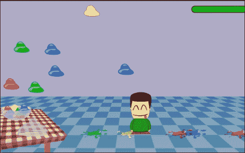
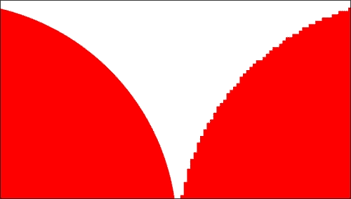
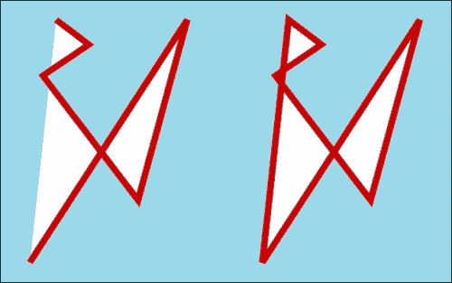
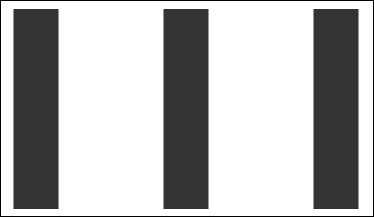
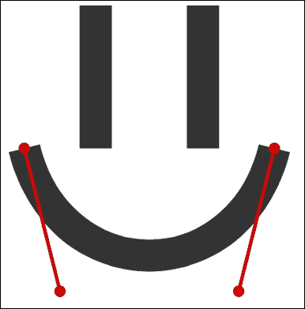

# 第三章：理解 HTML5 的重要性

在我们深入探讨本章将构建的游戏之前，我们将研究为什么在多个不同的浏览器中部署 HTML 和 JavaScript 应用程序可能会很困难。我们将重点关注这些问题的简单和实用解决方案，特别是关于今天使用的 HTML5 和最新 API。

我们将在本章中构建的游戏是一个基本的果冻重力游戏。它将利用 HTML5 的新 API 进行矢量图形、本地音频处理和拖放。作为这个游戏渲染系统的支撑，我们将使用旧的 JavaScript 定时器，正如我们将看到的，这对于我们需要每秒多次更新的这种游戏来说并不合适。幸运的是，现代浏览器已经解决了这个问题，并考虑到了我们对高效渲染引擎的需求。然而，我们不会在下一个游戏之前讨论这个新功能。只是为了完整起见，这个新功能被称为**requestAnimationFrame**。

# 浏览器兼容性

任何做过任何网页开发的人都很快就对不同浏览器解释和渲染相同代码的方式产生了非常深刻和彻底的厌恶。然而，如果我们深入研究一下这种现象，并寻找这些差异的根本原因，一些人会惊讶地意识到问题并不是看起来那样。虽然找到渲染差异的原因很容易，例如，一些浏览器以不同的方式定义框模型，但找到代码差异的原因可能并不那么清晰。令人惊讶的是，一些开发人员似乎对 JavaScript 语言感到厌恶，因为一些代码在某些浏览器中运行方式不同。然而，事实是 JavaScript 实际上是相当可移植的，它的 API 非常稳定和一致。

信不信由你，这些头疼大部分是由 DOM API 引起的，而不是 JavaScript 本身。一些浏览器以一种方式注册与 DOM 相关的事件，而其他浏览器则不承认该方法，而是使用自己的变体。对于操作 DOM 元素和子树也是如此。

例如，从 DOM 中删除节点的一种方法是在节点本身上调用`remove`方法。然而，截至目前，只有极少数浏览器公开了这个功能。通常，浏览器允许我们通过在父节点上调用`removeChild`方法，传递要从父节点中删除的子节点的引用，来从 DOM 树中删除节点。

这里要强调的关键点是：JavaScript 本身在不同浏览器中非常一致，但浏览器允许我们通过编程方式与 DOM 进行交互的方式，尽管这通常是通过 JavaScript 完成的，但在不同浏览器中可能会有所不同。虽然这对任何人来说都不是新闻，当然也不是 HTML5 独有的，但重要的是要记住，我们用于编程 Web 平台的主要工具，也就是 JavaScript，是一个非常强大和一致的工具。我们需要记住的问题是 DOM API（以及 CSS，尽管这个特定问题正在变得越来越不是问题，因为浏览器开始就与之相关的共同标准达成一致）。

## 支持不同的浏览器

在开发 HTML5 应用程序时，我们可以采取不同的方法来确保代码在不同浏览器中运行相同，并且设计也相同。其中一些做法是痛苦和繁琐的，另一些是不可靠的，还有一些是足够好的。不幸的是，只要今天存在这么多浏览器差异，就不会有一个单一的解决方案完全消除这个问题。

在编写在不同浏览器中运行几乎相同的代码时，主要目标有两个：尽可能少地为每个浏览器编写独特的代码，以及编写能够优雅降级的代码。专门针对特定浏览器的一些独特功能是一回事，但维护两个或更多个独立的代码库是完全不同的问题。记住，你可能写的最好的代码，无论是在执行效率还是安全性方面，都是你根本不需要写的代码。你写的代码越多，你的代码就越容易出错和故障。因此，避免写太多与你正在编写的其他代码相同的代码，但为不同的浏览器编写独特的代码。

虽然追求完美主义可能是一个很好的品质，但我们必须现实一点，我们不会很快达到完美。不仅如此，在大多数情况下（特别是涉及到视频游戏的所有情况），我们不需要编写接近完美的软件。在一天结束时，无论你是否同意，软件开发的目标是生产足够好的软件。只要程序解决了它被编写的问题，并以合理的方式做到这一点，那么从实际目的来看，我们可以说这个软件是好的。

在我们介绍完这些原则后，当你开发 HTML5 应用程序时，包括面向全球数亿人的游戏时，请记住这两个原则。确实，有一些特定于浏览器的功能可能会使游戏无法玩或者至少使用户体验有很大不同，最终结果可能不理想。但是，要密切关注你真正想要实现的目标，以便辨别哪些浏览器差异是足够好的。可能某个特定浏览器的功能被使用的用户太少，以至于这个功能没有成本效益。然而，我们绝对不希望部署一个无法使用的产品。

## HTML5 库和框架

在我们寻求以成本效益的方式支持多个浏览器时，我们可以放心地知道我们并不孤单。今天，有许多旨在解决浏览器兼容性问题的开源项目，我们可能可以玩字母游戏，为字母表中的每个字母命名一个不同的 HTML5 库或框架。

这些工具存在的主要原因通常有两个，即抽象掉浏览器差异和加快开发速度。虽然今天的大多数 JavaScript 工具提供的抽象试图为客户端提供统一浏览器差异的接口，但许多这些库也提供功能，简单地加快开发时间和工作量。

### jQuery

到目前为止，最受欢迎的 JavaScript 库是一个叫做 jQuery 的库。如果你以前没有听说过 jQuery，那么很可能你刚从一个非常深沉和深刻的冬眠中醒来，而你的身体穿越了遥远的星系。使用 jQuery 的一些主要好处包括非常强大的 DOM 查询和操作引擎，一个非常简单、统一的 XHR（XML HTTP 请求，也称为 Ajax）接口，以及通过一个良好定义的插件接口来扩展它的能力。

使用 JavaScript 库，特别是 jQuery，可以节省开发时间和精力的一个例子是尝试向服务器发出异步请求。没有 jQuery，我们需要编写一些样板代码，以便不同的浏览器都表现一致。代码如下：

```js
var xhr = null;

// Attempt to create the xhr object the popular way
try {
  xhr = new XMLHttpRequest();
}
// If the browser doesn't support that construct, try a different one
catch (e) {
  try {
    xhr = new ActiveXObject("Microsoft.XMLHTTP");
  }
  // If it still doesn't support the previous 2 xhr constructs, just give up
  catch (e) {
    throw new Error("This browser doesn't support AJAX");
  }

// If we made it this far, then the xhr object is set, and the rest
// of the API is identical independent of which version we ended up with
xhr.open("GET", "//www.some-website.com", true);
xhr.onreadystatechange = function(response) {
  // Process response
  // (...)
};

xhr.send();
```

现在，相比之下，可以使用以下代码使用 jQuery 来实现相同的功能：

```js
$.ajax({
  type: "GET",
  url: "//www.some-website.com",
  async: true,  /* This parameter is optional, as its default value is true */
  complete: function(response) {
    // Process response
    // (…)
  }
});
```

jQuery 的 XHR 功能的一个很棒的地方是它非常灵活。至少，我们可以以完全跨浏览器的方式实现与上一个代码中相同的行为，如下面的代码所示：

```js
$.get("//www.some-website.com", function(response) {
  // Process response
  // (…)
});
```

总之，用很少的工作、时间和代码就可以做很多事情，这也带来了额外的好处，即该库是由一个非常专注和活跃的社区开发的。有关 jQuery 的更多信息，请访问官方网站[`www.jquery.com`](http://www.jquery.com)。

### Google Web Toolkit

另一个流行且非常强大的 JavaScript 工具是 Google Web Toolkit（GWT）。首先，GWT 不仅仅是一个提供了一些 JavaScript 抽象的库，而是一个完整的开发工具包，使用 Java 语言（本身具有所有的优势），然后将 Java 代码编译和转换为高度优化的、特定于浏览器的 JavaScript 代码。

愚蠢地将 jQuery 与 GWT 进行比较，因为它们解决不同的问题，并对 Web 开发有完全不同的看法。然而，值得一提的是，虽然 jQuery 是一个很棒的工具，几乎每个网页开发者的工具箱中都可以找到，但它并不适用于实际的游戏开发。另一方面，Google Web Toolkit 虽然不是小型琐碎的 HTML 和 JavaScript 项目的最合适工具，但非常适合游戏开发。事实上，流行的游戏《愤怒的小鸟》在开发 Google Chrome 版本时使用了 Google Web Toolkit。

总之，虽然 GWT 足够成为一本独立的书的主题，但在你接手下一个大型 Web 开发项目时，考虑使用它是一个很好的选择，其中一个目标是为你的应用程序提供多个浏览器的支持。有关 Google Web Toolkit 的更多信息，请访问官方网站[`developers.google.com/web-toolkit/`](https://developers.google.com/web-toolkit/)。

## 支持具有有限 HTML5 功能的浏览器

正如前面提到的，上述由浏览器引起的开发头疼问题都不是 HTML5 特有的。然而，重要的是要知道，HTML5 并没有解决这个问题（尚未）。此外，HTML5 带来了全新的跨浏览器噩梦。例如，虽然大多数与 HTML5 相关的 API 在文档规范中得到了很好的定义，但也有许多 API 目前处于实验阶段（有关实验性 API 和供应商前缀的讨论，请参阅在线章节《设置环境》和第二章《HTML5 排版》，在那里这个主题得到了更全面的讨论）。除此之外，还有一些浏览器尚未支持某些 HTML5 功能，或者目前提供有限的支持，或者更糟糕的是，它们通过与其他浏览器不同的接口提供支持。

再次，作为网页开发者，我们在创建新应用程序时必须始终把用户放在首要位置。由于浏览器兼容性问题仍然存在，一些人认为 HTML5 仍然是未来的事情，其新功能的实用性尚未得到验证。本节的其余部分将描述我们如何在今天使用 HTML5 而不必担心不太理想的浏览器，并为使用这些浏览器的用户提供功能性应用程序。

### 优雅地降级

如果您仔细关注先前的代码片段，我们尝试创建一个在许多不同浏览器中工作的**XHR**对象，您会注意到，如果执行代码的浏览器不支持代码搜索的两个选项中的一个，代码会故意停止执行。这是一个很好的例子，说明我们不应该这样做，如果可能的话。每当特定功能对某个浏览器不可用时，第一选择应该是提供替代构造，即使这种替代方法并不能完全提供相同的行为。我们应该尽力在最坏的情况下提供一个功能性的体验，即浏览器完全不支持我们要实现的功能的情况。

例如，HTML5 提供了一种新的存储机制，类似于 cookie（换句话说，是一种简单的键值对存储），但主要区别在于这种存储机制完全将数据存储在客户端，并且这些数据永远不会作为 HTTP 请求的一部分来回传输到服务器。虽然这种存储系统的具体内容和工作原理将在本书的后面进行介绍，但我们可以总结说，这种存储系统（称为本地存储）存储键值对，并通过一个名为`localStorage`的 Window 对象的属性的明确定义的接口来实现。

```js
localStorage.setItem("name", "Rodrigo Silveira");
localStorage.length == 1; // true
localStorage.getItem("name"); // "Rodrigo Silveira"
localStorage.removeItem("name");
localStorage.length; // == 0
```

本地存储的一个强大应用是缓存用户发出的异步请求，以便后续请求可以直接从浏览器的本地存储中获取，从而避免往返到服务器。然而，如果浏览器不支持本地存储，在这种特定情况下的最坏情况是应用程序需要再次从服务器获取后续请求。虽然这并不实用或高效，但这绝对不是一个应该让人担心的问题，除非这意味着我们需要编写大量额外的代码来测试`localStorage`对象的存在，从而在每次需要使用它时污染代码库，因为会有很多重复的条件语句。

这种问题的一个简单解决方案是使用 polyfills，我们将在接下来更深入地讨论。简而言之，polyfill 是一个 JavaScript 替代方案，当原始实现尚不可用时，浏览器可以使用它。这样，如果浏览器需要，您可以加载 polyfill，而代码库的其余部分可以通过原始接口使用功能，而不知道它正在使用哪种实现。对于`localStorage`，我们可以简单地检查真实的 API 是否可用，并在不可用时编写模拟其行为的代码。以下代码片段展示了这种行为：

```js
// If the browser doesn't know anything about localStorage,
// we create our own, or at least an interface that respond
// to the calls we'd make to the real storage object.
if (window.localStorage === undefined) {
  var FauxLocalStorage = function() {
    var items = {};
    this.length = 0;

    this.setItem = function(key, value) {
      items[key] = value;
      this.length++;
      };

    this.getItem = function(key) {
      if (items[key] === undefined)
        return undefined;

        return items[key];
      };

    this.removeItem = function(key) {
      if (items[key] === undefined)
        return undefined;

      this.length--;
        return delete items[key];
      };
  };

  // Now there exists a property of window that behaves just like
  // one would expect the local storage object to (although in this example
  // the functionality is reduced in order to make the point)
  window.localStorage = new FauxStorage();
}

// This code will work just fine whether or not the browser supports the real
// HTML5 API for local storage. No exceptions will be thrown.
localStorage.setItem("name", "Rodrigo Silveira");
localStorage.length == 1; // true
localStorage.getItem("name"); // "Rodrigo Silveira"
localStorage.removeItem("name");
localStorage.length; // == 0
```

尽管前面的 polyfill 实际上并没有存储任何数据超出当前会话，但这种本地存储 polyfill 的特定实现可能足够满足特定应用程序的需求。至少，这种实现允许我们编写符合官方接口的代码（调用规范定义的真实方法），并且浏览器不会抛出异常，因为这些方法确实存在。最终，每当不支持 HTML5 API 的浏览器使用我们的 polyfill 时，由于条件检查了浏览器是否支持该功能，这个条件将不再触发加载 polyfill，因此客户端代码将始终引用原始实现，而主源代码不需要进行任何更改。

虽然考虑 polyfills 对我们有什么作用是相当令人兴奋的，但细心的学生会很快注意到，编写完整、安全和准确的 polyfills 比在样式表中添加简单的 CSS hack 以使设计与不同浏览器兼容要复杂一些。即使之前展示的样本本地存储 polyfill 相对复杂，它也没有完全模仿官方接口，也没有完全实现它所实现的少量功能。很快，有组织的学生会问自己应该期望花费多少时间来编写防弹 polyfills。我很高兴地报告，答案在下一节中给出并解释。

### Polyfills

回答前面的问题，即您应该期望花费多少时间来编写自己的强大 polyfills，以便能够开始使用 HTML5 功能，并且仍然使您的代码在多个不同的浏览器上运行，答案是零。除非您真的想要为不同的浏览器编写后备方案的经验，否则没有理由自己编写库等，因为这个领域已经有数百名其他开发人员为社区分享了他们的工作。

使用 polyfills 时，我们无法在 HTML5 项目的顶部使用单个 JavaScript 导入来神奇地扩展每个不足的浏览器，使它们 100％准备好使用 HTML5。然而，有许多单独的项目可用，因此，如果您想要使用特定元素，只需导入该特定的 polyfill 即可。虽然没有一个确定的来源可以找到所有这些 polyfills，但是简单地通过 Google 或 Bing 搜索您想要的特定功能，应该可以迅速连接到适当的 polyfill。

### Modernizr

值得一提的一个工具是 Modernizr。这个 JavaScript 库检查加载它的页面，并检测用户浏览器中可用的 HTML5 功能。这样，我们可以非常容易地检查特定 API 是否可用，并相应地采取行动。

截至目前，当前版本的 Modernizr 允许我们测试特定的 API 或功能，并在测试结果为正或负时加载特定的 polyfills，这使得在需要时添加 polyfills 非常容易和轻松。

此外，Modernizr 还包括 HTML5 Shiv，这是一个非常小的 JavaScript 片段，允许我们在不识别它们的浏览器中使用所有 HTML5 语义标签。请注意，这不会添加标签的实际功能，而只是允许您通过 CSS 样式化这些标签。原因是在 Internet Explorer 8 及更低版本中，如果我们尝试为浏览器不识别的元素添加样式，它将简单地忽略应用于它的任何 CSS。然而，使用 Modernizr，这些元素被创建（使用 JavaScript），因此浏览器知道这些标签，从而允许应用 CSS。

有关 Modernizr 的更多信息，请访问官方网站[`modernizr.com/`](http://modernizr.com/)。

# 游戏

我们将在本章中构建的项目游戏简称为*基本果冻摇摆重力游戏*。游戏的目标是喂我们的主角足够多的果冻，以至于他吃得太多而生病并倒在地板上。主角通过键盘上的左右箭头键控制，为了吃果冻，您只需将主角放在一个下落的果冻下面。每次喂主角一个果冻，他的健康指数都会略微下降。一旦喂了足够多的果冻，健康指数降到零，主角就会生病晕倒。如果让果冻掉在地板上，除了果冻到处溅开之外，什么也不会发生。这就是一个基本的果冻摇摆重力游戏。您能为乔治王子提供足够多的果冻直到他昏倒吗？



为了演示一些关于 HTML5 游戏开发的原则，我们将完全使用 DOM 元素构建这个游戏。虽然这种方法通常不是理想的方法，但你会注意到许多游戏在大多数现代浏览器和今天的普通台式机或笔记本电脑上仍然表现得相当不错。然而，正如我们将在接下来的章节中学到的那样，HTML5 中有一些技术、工具和 API 对于游戏开发来说更加合适。

此外，与本书一贯的做法一样，大多数游戏元素在复杂性方面都会保持在最低水平，以便能够轻松解释和理解。特别是在这个游戏中，我们只会使用 SVG 图形作为概念验证，而不是深入探讨 SVG 标准为我们提供的潜力和机会。拖放也是如此，还有很多可以做的事情。

## 代码结构

这段代码的结构非常简单。游戏中的每个元素都是通过 CSS 绝对定位的，并且每个元素都由一些带有背景图像或一些 CSS3 属性的 HTML 容器组成，这些属性赋予它们圆角、阴影等新鲜外观。尽管有些人可能更喜欢面向对象的编程而不是函数式编程，更喜欢更好的内聚而不是到处都是全局变量，但在这个游戏中，我们将采取这种方法，并专注于 HTML5 方面，而不是游戏的设计。同样，图形的风格和质量也是如此。你在这个游戏中看到的所有东西都是我用一个免费的照片编辑程序创建的，而且我用不到 30 分钟的时间就创建了你在游戏中看到的所有图形。这主要是为了表明即使你预算有限，或者没有专门的图形设计团队，也可以构建有趣的游戏。

由于我们将所有的 SVG 实体都直接加载到 HTML 结构中，我们将它们放在一个对用户隐藏的`div`容器中，然后克隆我们需要的每个实体，并在游戏中使用它们。我们对所有果冻和英雄都使用这种技术。英雄 SVG 与从矢量编辑软件导出的内容保持一致。果冻 SVG 稍作修改，去掉了它们设计时的所有颜色，并用 CSS 类替换。这样我们可以创建不同的 CSS 类来指定不同的颜色，每个果冻 SVG 的新实例都被分配一个随机类。最终结果是一个单一的 SVG 模型隐藏在不可见的`div`容器中，每个实例都被赋予不同的颜色，而不需要额外的代码，以增加游戏的多样性。我们也可以随机分配不同大小和旋转给每个果冻实例，但这被留作读者的练习。

```js
<body>
  <div class="health-bar">
    <span></span>
  </div>

    <h1 id="message"></h1>

    <div id="table"></div>
    <div id="bowl"></div>
    <div id="bowl-top-faux-target"></div>
    <div id="bowl-top" class="dragging-icon bowl-closed"
      draggable="true"
      ondragstart="doOnDragStart(event)"
      ondragend="doOnDragEnd(event)"></div>
    <div id="bowl-top-target"
      ondrop="startGame()"
      ondragover="doOnDrop(event)"
      ondragleave="doOnDragLeave(event)"></div>

    <div class="dom-recs">
      <svg class="hero-svg">
      (…)
      </svg>
      <svg class="jelly-svg">
      (…)
      </svg>
    </div>
</body>
```

虽然我们可以使用数据属性而不是 ID 属性来表示所有这些元素，但在这种情况下，使用它们而不是 ID 并没有真正的好处，就像在这种情况下使用 ID 而不是数据属性也没有好处一样。

请注意，`bowl-top`可以拖放到两个目标上。实际上，只有一个目标，即`bowl-top-target`元素。另一个看起来像目标的元素，巧妙地被赋予了`bowl-top-faux-target`的 ID，只是为了视觉效果。由于真正的放置目标（拖动元素可以在拖动选项结束时放置的元素）只有在鼠标指针移动到它上面时才会被激活，所以在桌子上没有足够的空间来实现`bowl-top`似乎被放置在一个小轮廓区域的期望效果。

最后，在游戏中使用了一个全局计时器，用于控制我们调用游戏循环函数`tick()`的频率。虽然这不是一章关于正确游戏设计的内容，但我要指出，您应该避免诱惑去为不同目的创建多个计时器。有些人在这方面毫不犹豫，会通过一个独立于主游戏计时器的唯一计时器触发事件。这样做，特别是在 HTML5 游戏中，可能会对性能和所有事件的同步产生负面影响。

## API 使用

游戏中使用的三个 API 是音频、SVG 和拖放。接下来将简要解释这些 API 在游戏中的使用方式，其中只给出了功能的概述。然而，在下一节中，我们将详细了解这些功能实际上是如何使用的，以及如何在这种和其他情况下使用它。有关此游戏的完整源代码，请查看 Packt Publishing 网站上的书页。

### 网络音频

音频被用作永无止境的循环，作为背景音乐，以及当果冻被发射，弹跳，溅在地板上，或被饥饿的英雄吃掉时，会发出单独的音效。当英雄因吃太多果冻而最终死亡时，也会发出一个老式的音效。

游戏中每个音频实体的管理方式是通过一个简单的封装，其中包含对单独音频文件的引用，并公开一个接口，允许我们播放文件，淡入淡出音频文件，以及将新的音频文件添加到此类管理的音频列表中。代码如下：

```js
// ** By assigning an anonymous function to a variable, JavaScript
// allows us to later call the variable's referenced function with
// the keyword 'new'. This style co function creation essentially 
// makes the function behave like a constructor, which allows us to
// simulate classes in JavaScript
var SoundFx = function() {
  // Every sound entity will be stored here for future use
  var sounds = {};

  // ------------------------------------------------------------
  // Register a new sound entity with some basic configurations
  // ------------------------------------------------------------
  function addSound(name, file, loop, autoplay) {

    // Don't create two entities with the same name
    if (sounds[name] instanceof Audio)
      return false;

      // Behold, the new HTML5 Audio element!
      sounds[name] = new Audio();
      sounds[name].src = file;
      sounds[name].controls = false;
      sounds[name].loop = loop;
      sounds[name].autoplay = autoplay;
    }

    // -----------------------------------------------------------
    // Play a file from the beginning, even if it's already playing
    // -----------------------------------------------------------
  function play(name) {
    sounds[name].currentTime = 0;
    sounds[name].play();
  }

    // -----------------------------------------------------------
    // Gradually adjust the volume, either up or down
    // -----------------------------------------------------------
  function fade(name, fadeTo, speed, inOut) {
    if (fadeTo > 1.0)
      return fadeOut(name, 1.0, speed, inOut);

    if (fadeTo < 0.000)
      return fadeOut(name, 0.0, speed, inOut);

      var newVolume = parseFloat(sounds[name].volume + 0.01 * inOut);

    if (newVolume < parseFloat(0.0))
      newVolume = parseFloat(0.0);

      sounds[name].volume = newVolume;

    if (sounds[name].volume > fadeTo)
      setTimeout(function(){ fadeOut(name, fadeTo, speed, inOut); }, speed);
    else
      sounds[name].volume = parseFloat(fadeTo);

      return sounds[name].volume;
  }

    // -----------------------------------------------------------
    // A wrapper function for fade()
    // ------------------------------------------------------------
    function fadeOut(name, fadeTo, speed) {
      fade(name, fadeTo, speed, -1);
    }

    // -----------------------------------------------------------
    // A wrapper function for fade()
    // -----------------------------------------------------------
    function fadeIn(name, fadeTo, speed) {
      fade(name, fadeTo, speed, 1);
    }

    // -----------------------------------------------------------
    // The public interface through which the client can use the class
    // -----------------------------------------------------------
    return {
      add: addSound,
      play: play,
      fadeOut: fadeOut,
      fadeIn: fadeIn
    };
};
```

接下来，我们实例化了一个自定义的`SoundFx`类型的全局对象，其中存储了游戏中使用的每个音频剪辑。这样，如果我们想播放任何类型的声音，我们只需在这个全局引用上调用`play`方法。看一下以下代码：

```js
// Hold every sound effect in the same object for easy access
var sounds = new SoundFx();

// Sound.add() Parameters:
// string: hash key
// string: file url
// bool: loop this sound on play?
// bool: play this sound automatically as soon as it's loaded?
sounds.add("background", "sound/techno-loop-2.mp3", true,  true);
sounds.add("game-over",  "sound/game-over.mp3",     false, false);
sounds.add("splash",     "sound/slurp.mp3",         false, false);
sounds.add("boing",      "sound/boing.mp3",         false, false);
sounds.add("hit",        "sound/swallow.mp3",       false, false);
sounds.add("bounce",     "sound/bounce.mp3",        false, false);
```

### 可伸缩矢量图形（SVG）

如前所述，游戏中使用 SVG 的方式受限于 SVG 规范非常强大且可能相当复杂。正如您将在 SVG API 的深入描述中看到的那样，我们可以对通过 SVG 绘制的每个基本形状做很多事情（例如原生动画化英雄的面部表情，或使每个果冻摇晃或旋转等）。

当果冻触地时，我们将代表果冻溅开的精灵切换成了一个相当巧妙的方法。当我们使用矢量编辑软件绘制果冻矢量时，我们创建了两个分离的图像，每个代表果冻的不同状态。这两个图像叠放在一起，以便正确对齐。然后，在 HTML 代码中，我们为这些图像分配了一个 CSS 类。这些类分别称为 jelly-block 和 splash，代表果冻的自然状态和果冻溅在地板上。在这两个类中，一个矢量被隐藏，另一个没有。根据每个果冻元素的状态，这两个类来回切换。这只需简单地将这两个矢量组中的一个分配给父 svg 元素的`jelly-svg-on`和`jelly-svg-off`两个类之一，如下面的代码所示：

```js
.jelly-svg-off g.jelly-block, .jelly-svg-on g.splash {
    display: none;
}

.jelly-svg-off g.splash, .jelly-svg-on g.jelly-block {
    display: block;
}
```

前面的样式驱动方式很简单。默认情况下，每个果冻元素都被赋予`jelly-svg-on`的 CSS 类，这意味着果冻没有溅开。然后，当计算出果冻已经触地时，我们移除该类，并添加`jelly-svg-off`的 CSS 类，如下面的代码片段所示：

```js
// Iterate through each jelly and check its state
for (var i in jellies) {

  // Don't do anything to this jelly entity if it's outside the screen,
  // was eaten, or smashed on the floor
  if (!jellies[i].isInPlay())
    continue;

    // Determine if a jelly has already hit the floor
    stillFalling = jellies[i].getY() + jellies[i].getHeight() * 2.5 < document.body.offsetHeight;

    // If it hasn't hit the floor, let gravity move it down
    if (stillFalling) {
      jellies[i].move();
    } else {

    // Stop the jelly from falling
    jellies[i].setY(document.body.offsetHeight - jellies[i].getHeight() - 75);

      // Swap the vectors
      jellies[i].swapClass("jelly-svg-on", "jelly-svg-off");
      jellies[i].setInPlay(false);

      // Play the corresponding sound to this action
      sounds.play("splash");
    }
}
```

### 拖放

与 SVG 在游戏中的使用方式类似，拖放以次要的方式进入最终产品，而 Web 音频则占据主导地位。然而，拖放在游戏中扮演的角色可以说是最重要的，它启动了游戏。与其让游戏在页面加载时立即开始播放，或者让用户按下按钮或按键来开始游戏，玩家需要将盖子从存放所有果冻的碗中拖出，并将其放在桌子上碗的旁边。

HTML5 中拖放的工作方式简单而直观。我们至少注册一个对象作为可拖动对象（您拖动的对象），至少注册一个其他对象作为放置目标（可将可拖动对象放入其中的对象）。然后，我们为适用于拖放行为的任何事件注册回调函数。

在游戏中，我们只监听了五个事件，两个在可拖动元素上，三个在放置目标元素上。首先，我们监听用户首次拖动可拖动对象时触发的事件（拖动开始），我们会对此做出响应，使碗盖图像不可见，并在鼠标指针后面放置一个盖子的副本，以便看起来用户真的在拖动那个盖子。

接下来，我们监听用户最终释放鼠标按钮时触发的事件，表示拖动动作的结束（拖动结束）。在这一点上，我们只需将碗盖恢复到最初的位置，放在碗的顶部。每当拖动动作结束，且放置在有效的放置目标内时（用户没有在预期的位置放置盖子），就会触发此事件，从根本上重新启动该过程。

我们在放置目标上监听的三个事件是`onDragLeave`、`onDragOver`和`onDrop`。每当可拖动对象放置在放置目标内时，目标的`onDrop`事件就会被触发。在这种情况下，我们所做的就是调用`startGame()`函数，这将启动游戏。作为`startGame`函数的设置的一部分，我们将碗盖元素移动到放置的确切像素位置，并删除可拖动属性，以便用户无法再拖动该元素。

`onDragOver`和`onDragLeave`函数分别在鼠标指针移动到目标对象上方和悬停在目标对象外部时触发。在我们的情况下，在这些函数中我们所做的就是切换碗盖和在拖动发生时显示在鼠标指针后面的图像的可见性。可以在以下代码中看到：

```js
// ------------------------------------------------------------
// Fired when draggable starts being dragged (onDragStart)
// ------------------------------------------------------------
function doOnDragStart(event) {
  if (bowlTop.isReady) {
    event.target.style.opacity = 0.0;
    event.dataTransfer.setDragImage(bowlTop, 100, 60);
  }
}

// ------------------------------------------------------------
// Fired when draggable is released outside a target (onDragEnd)
// ------------------------------------------------------------
function doOnDragEnd(event) {
  event.target.style.opacity = 1.0;
  document.querySelector("#bowl-top-faux-target").style.opacity = 0.0;
}

// ------------------------------------------------------------
// Fired when draggable enters target (onDragOver)
// ------------------------------------------------------------
function doOnDragOver(event) {
  event.preventDefault();
  document.querySelector("#bowl-top-faux-target").style.opacity = 1.0;
}

// ------------------------------------------------------------
// Fired when draggable is hovered away from a target (onDragLeave)
// ------------------------------------------------------------
function doOnDragLeave(event) {
  document.querySelector("#bowl-top-faux-target").style.opacity = 0.0;
}

// ------------------------------------------------------------
// Fired when draggable is dropped inside a target (onDrop)
// ------------------------------------------------------------
function startGame() {

  // Keep the game from starting more than once
  if (!isPlaying) {

    // Register input handlers
    document.body.addEventListener("keyup", doOnKeyUp);
    document.body.addEventListener("keydown", doOnKeyDown);

    // Reposition the bowl lid
    var bowlTop = document.querySelector("#bowl-top");
    bowlTop.classList.remove("bowl-closed");
    bowlTop.style.left = (event.screenX - bowlTop.offsetWidth + 65) + "px";
    bowlTop.style.top = (event.screenY - bowlTop.offsetHeight + 65 * 0) + "px";

    // Disable dragging on the lid by removing the HTML5 draggable attribute
    bowlTop.removeAttribute("draggable");
    bowlTop.classList.remove("dragging-icon");

    newJelly();
      isPlaying = true;

      // Start out the main game loop
      gameTimer = setInterval(tick, 15);
    }
};
```

# Web 音频

新的 Web 音频 API 定义了一种在浏览器中播放音频而无需单个插件的方法。对于高级别的体验，我们可以简单地在整个 HTML 页面中添加一些音频标签，浏览器会负责显示播放器供用户进行交互和播放、暂停、停止、倒带、快进和调整音量。或者，我们可以使用可用的 JavaScript 接口，并使用它来控制页面上的音频标签，或者实现更强大和复杂的任务。

关于浏览器支持和 Web 音频 API 的一个关键细节是，不同的浏览器支持不同的文件格式。在定义音频标签时，类似于图像标签，我们指定源文件的路径。不同的是，对于音频，我们可以为同一文件指定多个源（但是不同的格式），然后浏览器可以选择它支持的文件，或者在支持多个文件格式的情况下选择最佳选项。目前，所有主要浏览器都支持三种音频格式，即`.mp3`、`.wav`和`.ogg`。截至目前，没有一种音频格式在所有主要浏览器中都受支持，这意味着每当我们使用 Web 音频 API 时，如果我们希望触及尽可能多的受众，我们将需要每个文件的至少两个版本。

最后，请记住，尽管我们可以（而且应该）为每个音频元素指定多个音频文件，但每个浏览器只下载其中一个文件。这是一个非常方便（和显而易见）的功能，因为下载多个相同文件的副本将非常低效且占用带宽。

## 如何使用它

使用 Web 音频 API 的最简单方法是使用内联 HTML5 元素。其代码如下：

```js
<audio>
  <source src="img/sound-file.mp3" type="audio/mpeg" />
  <source src="img/sound-file.ogg" type="audio/ogg" />
</audio>
```

将上述片段添加到页面上不会导致任何可见的结果。为了对标签添加更多控制，包括向页面添加播放器以便用户可以与其交互，我们可以从与标签相关的元素中进行选择。这些属性如下：

+   **autoplay**：一旦浏览器下载完成，它立即开始播放文件。

+   **controls**：它显示一个可视化播放器，通过它用户可以控制音频播放。

+   **loop**：用于无限循环播放文件。

+   **muted**：当音频输出被静音时使用。

+   **preload**：它指定浏览器如何预加载音频资源。

通过 JavaScript 实现类似的结果，我们可以创建一个类型为音频的 DOM 元素，或者实例化一个类型为 Audio 的 JavaScript 对象。添加可选属性的方式与我们对任何其他 JavaScript 对象所做的方式相同。请注意，创建 Audio 的实例与创建对 DOM 元素的引用具有完全相同的效果：

```js
// Creating an audio file from a DOM element
var soundOne = document.createElement("audio");
soundOne.setAttribute("controls", "controls");

soundOneSource = document.createElement("source");
soundOneSource.setAttribute("src", "sound-file.mp3");
soundOneSource.setAttribute("type", "audio/mpeg");

soundOne.appendChild(soundOneSource);

document.body.appendChild(soundOne);

// Creating an audio file from Audio
var soundTwo = new Audio("sound-file.mp3");
soundTwo.setAttribute("controls", "controls");

document.body.appendChild(soundTwo);
```

尽管 JavaScript 音频对象可能看起来更容易处理，特别是因为它采用了令人惊叹的构造函数参数，可以节省我们一行代码，但它们的行为完全相同，并且只有在运行时才能够区分它们。一个小细节是，当我们在 JavaScript 中创建音频引用时，不需要将其附加到 DOM 以播放文件。

无论您决定如何处理此设置步骤，一旦我们在 JavaScript 中有音频对象的引用，我们就可以使用与该对象相关的许多事件和属性来控制它。音频对象如下：

+   **play()**：开始播放文件。

+   **pause()**：它停止播放文件，并保持 currentTime 不变。

+   **paused**：表示当前播放状态的布尔值。

+   **canPlayType**：用于查找浏览器是否支持特定的音频类型。

+   **currentSrc**：它返回当前分配给对象的文件的绝对路径。

+   **currentTime**：它以浮点数形式返回当前播放位置（以秒为单位）。

+   **duration**：它以浮点数形式返回总播放时间（以秒为单位）。

+   **ended**：一个布尔值，指示 currentTime 是否等于 duration。

+   **readyState**：它指示源文件的下载状态。

+   **volume**：它指示文件的当前音量，范围从 0 到 1，包括 0 和 1。这个数字是相对于当前系统音量的。

# SVG

**可缩放矢量图形**（**SVG**）简称为 SVG，是一种描述图形的基于 XML 的格式。这种格式可能看起来足够复杂，以至于被误认为是用于 2D 图形的完整编程语言，但实际上它只是一种标记语言。虽然对一些 Web 开发人员来说，SVG 可能是新的，但该规范最早是在 1999 年开发的。

矢量图形和光栅图形（即位图）的主要区别在于图形的描述方式。在位图中，每个像素基本上由三个或四个数字表示，表示该单个像素的颜色（RGB），以及可能的不透明度级别。从更广泛的意义上看，位图只不过是像素网格。另一方面，矢量图形由一系列数学函数描述，这些函数描述了线条、形状和颜色，而不是整个图像上的每个单独点。简而言之，矢量图形在缩放其尺寸方面表现出色彩，如下面的屏幕截图所示：



如果放大或尝试拉伸矢量图形，它将始终与原始图像一样平滑，因为形状是使用相同的数学函数定义（如左侧图像所示）。另一方面，光栅图形只由相同的像素网格定义。缩放该网格只意味着将网格的尺寸乘以，导致右侧图像所代表的方块状、像素化的图像。

现在，SVG 标准不仅仅定义了形状、线条、路径和颜色。规范还定义了可以应用于任何单个基元、一组基元或整个 SVG 上下文的变换和动画。规范还允许 SVG 成为一种非常可访问的格式，这意味着可以将文本和其他元数据直接包含到文件中，以便其他应用程序可以以除了图形之外的其他方式理解文件。例如，搜索引擎可以爬行和索引，不仅您的网页，还有任何 SVG 图形。

由于 SVG 是基于文本的（与存储二进制数据相反，例如音频文件），因此也可以使用诸如流行的 Gzip 之类的压缩算法来压缩 SVG 图像，这在当今的 Web 开发世界中非常普遍。当 SVG 文件保存为自己的独立文件时，它被赋予扩展名`.svg`。如果文件经过 Gzip 压缩，那么扩展名应该是`.svgz`，这样浏览器就知道在处理之前解压缩文件。

SVG 文件可以以几种不同的方式在 HTML 文件中使用。由于文件本身可以保存为自己的文件，因此可以使用对象标签将整个文件嵌入到页面中，也可以使用普通图像标签，甚至可以使用 XHR 对象从服务器获取其内容，并将其注入到 HTML 文档中。或者，SVG 文件的内容可以手动复制到主机 HTML 文件中，以便其内容内联导入。

要将 SVG 图形内联导入到 HTML 文档中，我们只需插入一个`svg`标签，其中包含所有内容作为其子节点。截至目前，XML 命名空间属性是必需的，还需要版本号，如下面的代码所示：

```js
<body>
  <svg

    version="1.1"
    width="150"
    height="150">

    <circle
      cx="75"
      cy="75"
      r="50"
      stroke="black"
      stroke-width="2"
      fill="red"></circle></svg>
</body>
```

虽然对于一个简单的红色圆圈来说可能很容易，但一旦图像变得更加复杂，就很难在一个文件中管理所有内容。因此，简单保存所有 SVG 文件并单独导入它们可能更方便。这种方法也更适合资源共享和重用，因为我们可以在多个文件中导入相同的图形，而无需每次都复制整个文件。

```js
<body>
  <object type="image/svg+xml" data="red-circle.svg"
    width="100" height="100">
  </object>

  
</body>
```

在我们深入一些实际示例之前，关于 SVG 的最后一点是，父`svg`标签内的每个节点（包括父节点）都由浏览器管理。因此，这些节点中的每一个都可以通过 CSS 进行样式设置。如果这还不够，SVG 图形中的每个节点都可以注册浏览器事件，允许我们与图形及其所有单独组件进行交互，就像大多数其他 DOM 元素一样。这使得 SVG 成为一种非常动态、高度灵活的图形格式。

如果 SVG 实例与 HTML 内联，则我们可以直接引用父 svg 节点，或者通过 JavaScript 直接引用任何子节点。一旦我们有了这个引用，我们就可以像处理任何其他 DOM 元素一样处理对象。然而，如果 SVG 是外部的，我们需要多做一步，将实际的 SVG 文件加载到 JavaScript 变量中。一旦完成了这一步，我们就可以像处理本地文件一样处理 SVG 的子树。

```js
<body>
  <object type="image/svg+xml" data="red-circle.svg"
    width="100" height="100">
  </object>

  <script>
    var obj = document.querySelector("object");

    // Very important step! Before calling getSVGDocument, we must register
        // a callback to be fired once the SVG document is loaded.
    obj.onload = function(){
      init(obj.getSVGDocument());
    };

    function init(svg) {
      var circles = svg.getElementsByTagName("circle");

      // Register click handler on all circles
      for (var i = 0, len = circles.length; i < len; i++) {
        circles[i].addEventListener("click", doOnCircleClick);
      }

      // When a circle element is clicked, it adds a CSS class "blue"
            // to itself.
    function doOnCircleClick(event) {
      this.classList.add("blue");
    }
  }
  </script>
</body>
```

关于前面代码片段的一些重要细节，你应该始终记住的是：

+   导入的 SVG 文档被视为外部文档（类似于 Iframe），这意味着该文档之外的任何 CSS（如宿主文档）都不在其范围之内。因此，如果你想对从`getSVGDocument()`调用中的 SVG 节点应用 CSS 类，那么该 CSS 类必须在最初导入的同一个 SVG 文件中定义。

+   SVG 的 CSS 属性略有不同。例如，你会定义填充颜色而不是背景颜色。基本上，用在 SVG 元素本身上的属性，也是你在相应的样式表声明中会用到的属性。

+   任何特定于浏览器的 CSS 属性都可以应用到 SVG 节点上（例如，过渡、光标等）。

因此，前面的示例是通过以下`.svg`文件完成的，作为相应的`red-circle.svg`文件，如下面的代码片段中所使用的：

```js
<svg

  version="1.1"
  width="150"
  height="150">

<style type="text/css">
.blue {
  /* CSS Specific to SVG */
  fill: #0000ff;

  /* CSS Specific to the browser */
  cursor: pointer;
  -webkit-transition: fill 1.25s;
}
</style>
  <circle
    cx="75"
    cy="75"
    r="50"
    stroke="black"
    stroke-width="2"
    fill="red"></circle>
</svg>
```

## 如何使用它

尽管强烈建议在组合复杂的 SVG 图形时使用专业的矢量编辑软件，比如 Inkspace 或 Adobe Illustrator，但本节将带你了解 SVG 组合的基础知识。这样你就可以手工绘制基本的形状和图表，或者至少熟悉 SVG 绘制的基础知识。

请记住，无论你是通过之前描述的任何方法将 SVG 图形导入到 HTML 中，内联绘制它们，甚至通过 JavaScript 动态创建它们，你都需要将 XML 命名空间包含到根`svg`元素中。这是 SVG 新手常犯的一个错误，可能导致你的图形在页面上不显示。

我们可以用 SVG 绘制的原始形状有矩形、圆、椭圆、线、折线、多边形和路径。其中一些原始形状共享属性（如宽度和高度），而其他一些具有特定于该形状的属性（如圆的半径）。在 SVG 图形中看到的一切都是这些原始形状在某种组合中使用的结果。

SVG 中的一切都是在 SVG 画布内绘制的，由父`svg`标签定义。这个画布总是矩形的，即使它内部的形状可以是由任何原始形状创建的任何形状。此外，画布有自己的坐标系，将原点放在画布的左上角。画布的宽度和高度（由父`svg`标签确定）决定了绘图区域的尺寸，所有`svg`的子元素内部的（x，y）点都是相对于该点的。

作为以下示例的样板，我们将假设有一个外部的`svg`文件，我们将把画布大小设置为 1000 x 1000 像素，并在其中绘制。要查看每个示例的最终结果，你可以使用前一节中描述的任何一种方法来将 SVG 图像加载到 HTML 文件中。以下代码片段显示了如何定义`svg`标签：

```js
<svg  version="1.1" width="1000" height="1000">
</svg>
```

用 SVG 绘制矩形就像它可以得到的那样简单。只需为`rect`元素指定宽度和高度，就可以了。可选地，我们可以指定描边宽度和描边颜色（其中描边就是边框），以及背景颜色。看一下下面的代码：

```js
<svg  version="1.1" width="1000" height="1000">
  <rect
    width="400"
    height="150" />
</svg>
```

默认情况下，每个形状都在原点（x = 0，y = 0）处呈现，没有描边（`stroke-width = 0`），并且背景颜色（填充）设置为全黑（十六进制值为#000000，RGB 值为 0, 0, 0）。

圆是通过指定至少三个属性来绘制的，即*x*和*y*位置（由`cx`和`cy`表示），以及半径值（由字母`r`表示）。圆的中心位于位置（`cx`，`cy`），半径长度不考虑描边的宽度，如果存在的话。

```js
<svg  version="1.1" width="1000" height="1000">
  <circle
    cx="0"
    cy="0"
    r="300"
    fill="#ff3" />

  <circle
    cx="200"
    cy="200"
    r="100"
    fill="#a0a" />
</svg>
```

您会注意到，默认情况下，就像定位的 DOM 元素一样，每个节点都具有相同的 z-index。因此，如果两个或更多元素重叠，无论哪个元素最后被绘制（意味着它在父元素之外的位置更远），都会呈现在顶部。

椭圆与圆非常相似，唯一的区别是它们在每个方向（垂直和水平）都有一个半径。除此之外，绘制椭圆与绘制圆是完全相同的。当然，我们可以通过绘制两个半径长度相同的椭圆来模拟圆。

```js
<svg  version="1.1" width="1000" height="1000">
  <ellipse
    cx="400"
    cy="300"
    rx="300"
    ry="100"
    fill="#ff3" />

  <ellipse
    cx="230"
    cy="200"
    rx="75"
    ry="75"
    fill="#a0a" />
  <ellipse
    cx="560"
    cy="200"
    rx="75"
    ry="75"
    fill="#a0a" />
</svg>
```

有了这些基本形状，我们现在将继续绘制更复杂的形状。现在不仅仅是按照几个预定义的点和长度进行绘制，我们可以选择在我们将要绘制的形状中准确放置每个点。虽然这使得手工绘制形状稍微困难，但也使得可能性更加广泛。

绘制一条线既简单又快速。只需在 SVG 坐标空间内指定两个点，就可以得到一条线。每个点由一个枚举的（x，y）对指定。

```js
<svg  version="1.1" width="1000" height="1000">
  <line
    x1="50"
    y1="50"
    x2="300"
    y2="500"
    stroke-width="50"
    stroke="#c00" />
</svg>
```

接下来我们将介绍折线，它是常规线的扩展。线和折线之间的区别在于，正如其名称所示，折线是一组线的集合。而常规线只接受两个坐标点，折线接受两个或更多点，并按顺序连接它们。此外，如果我们为折线指定了填充颜色，最后一个点将连接到第一个点，并且由该封闭区域形成的形状将应用填充。显然，如果没有指定填充，折线将呈现为由直线组成的简单形状。

```js
<svg  version="1.1" width="1000" height="1000">
  <polyline
    points="50, 10, 100, 50, 30, 100, 175, 300, 250, 10, 10, 400"
    fill="#fff"
    stroke="#c00"
    stroke-width="10"/>
</svg>
```

我们将要看的下一个形状是多边形。与折线非常相似，多边形的绘制方式与折线完全相同，但有两个非常重要的区别。首先，多边形必须至少有三个点。其次，多边形总是一个封闭的形状。这意味着序列的最后一个点和第一个点在物理上是连接的，而在折线中，只有通过填充才会进行连接，如果为折线分配了填充的话：

```js
<svg  version="1.1" width="1000" height="1000">
    <polygon
        points="50, 10, 100, 50, 30, 100, 175, 300, 250, 10, 10, 400"
        fill="#fff"
        stroke="#c00"
        stroke-width="10"/>
</svg>
```



在前面的屏幕截图的左侧显示了折线，而右侧的形状是使用完全相同的点来描述其位置和方向的多边形。两者之间唯一的区别是多边形是强制闭合的。当然，我们也可以通过简单地手动连接最后一个点和第一个点来模拟这种行为，使用折线。

SVG 还允许我们使用平滑曲线来绘制非常复杂的形状，而不是之前介绍的基于线的形状。为此，我们可以使用路径元素，起初可能有点复杂，因为它有几个不同的属性可以操作。路径的一个关键特点是它允许我们将指针移动到坐标空间内的位置，或者画一条线到一个点。

描述路径的所有路径属性都放在`d`属性中。这些属性如下：

+   **M**：移动到

+   **L**：线到

+   **H**：水平线到

+   **V**：垂直线到

+   **C**：曲线到

+   **S**：平滑曲线到

+   **Q**：二次贝塞尔曲线

+   **T**：平滑二次贝塞尔曲线

+   **A**：椭圆弧

+   **Z**：关闭路径

这些属性可以根据需要重复多次，尽管将整体绘图分解为多个较小的路径可能是个好主意。将较大的绘图分成多个路径的一些原因是使图形更易管理，更易于故障排除和更易于理解。代码如下：

```js
<svg  version="1.1" width="1000" height="1000">
  <path
    d="M 100 100
    L 100 300
    M 250 100
    L 250 300
    M 400 100
    L 400 300"
    fill="transparent"
    stroke-width="45"
    stroke="#333" />
</svg>
```

除非你练习并训练自己查看路径描述，否则很难仅凭这些代码来可视化路径。花点时间，逐个查看每个属性。前面的示例首先将指针移动到点(100, 100)，然后从该点画一条线到另一个点(100, 300)。这样就从指针上次位置到由线条指定的点画了一条垂直线。接下来，光标从原来的位置改变到一个新位置(250, 100)。请注意，简单地移动光标不会影响任何以前的绘图调用，也不会在那时进行任何绘图。最后，画了第二条垂直线到点(250, 300)。第三条线与第一条线的距离相等。这可以在以下截图中看到：



请注意，我们为填充、描边、描边宽度等定义的任何值都将应用于整个路径。想要不同的填充和描边值的解决方案是创建额外的路径。

绘制曲线仍然有点复杂。曲线需要三个值，即两个控制点和最终绘制线的点。为了说明控制点的工作原理，请观察以下示例：

```js
<svg  version="1.1" width="1000" height="1000">
  <path
    d="M 250 100
    L 250 300
    M 400 100
    L 400 300"
    fill="transparent"
    stroke-width="45"
    stroke="#333" />
  <path
    d="M 150 300
    C 200 500,
    450 500,
    500 300"

    fill="transparent"
    stroke-width="45"
    stroke="#333" />

  <circle
    cx="150"
    cy="300"
    r="8"
    fill="#c00" />
  <circle
    cx="200"
    cy="500"
    r="8"
    fill="#c00" />
  <line
    x1="150"
    y1="300"
    x2="200"
    y2="500"
    stroke-width="5"
    stroke="#c00" />

  <circle
    cx="450"
    cy="500"
    r="8"
    fill="#c00" />
  <circle
    cx="500"
    cy="300"
    r="8"
    fill="#c00" />
  <line
    x1="450"
    y1="500"
    x2="500"
    y2="300"
    stroke-width="5"
    stroke="#c00" />
</svg>
```

在执行上述代码时，如下截图所示，我们可以看到控制点与线的曲率之间的关系：



这是一个三次贝塞尔曲线，红线显示了第一个和最后一个曲线点与控制点连接的位置。

手动绘制所需的曲线正是一个相当复杂的问题。不同的曲线函数之间的行为不同，因此一定要尝试它们，直到你对它们的工作方式有了很好的感觉。请记住，尽管至少要有一些了解这些曲线和其他绘图原语的工作方式是个好主意，但强烈建议您始终使用适当的软件来帮助您创建您的绘图。理想情况下，我们会利用我们的创造力来创建绘图，让计算机来找出如何使用 SVG 表示它。

### 注意

路径的描述属性可以使用小写字母或大写字母来指定。区别在于大写字母表示点是绝对的，小写字母表示点是相对的。相对和绝对点的概念与 HTML 中的不完全相同，其中相对偏移意味着目标点相对于其自身原始位置的相对位置，而绝对点是完全相对于元素的父级的位置。

在 SVG 世界中，绝对点是相对于画布的原点，而相对点是相对于上次定义的点。例如，如果将指针移动到位置(10, 10)，然后使用值为 10 15 进行相对移动，指针将最终停在位置(10, 15)而不是位置(10, 15)，而是在 x 位置上离开 10 个单位，在 y 位置上离开 15 个单位。然后指针的新位置将是位置(20, 25)。

最后，SVG 能够将文本呈现到屏幕上。想象一下，如果要使用线条和路径手动渲染每个字母会耗费多少时间。幸运的是，SVG API 规定了一个非常简单的文本呈现接口。

```js
<svg  version="1.1" width="1000" height="1000">
  <text
    x="100"
    y="300"
    fill="#c00"
    stroke="#333"
    stroke-width="2"
    style="font-size: 175px">I Love HTML5!</text>
</svg>
```

现在，SVG 标准不仅仅是定义形状、线条、路径和颜色。规范还定义了元素组，可以将一组节点组合在一起，使它们可能作为一个单一单元一起处理。还有变换、动画、渐变，甚至是照片滤镜，所有这些都可以应用于之前描述的简单基元。看一下下面的代码：

```js
<svg  version="1.1" width="1000" height="1000">
  <rect
    x="500"
    y="500"
    width="900"
    height="600"
    fill="#c00"
    stroke="#333"
    stroke-width="2"
    transform="translate(800, 50)
      rotate(55, 0, 0)
      scale(0.25)">

    <animate
      dur="1.5s"
      attributeName="x"
      values="-50; 100; -50"
      repeatCount="indefinite" />

    <animate
      dur="1.5s"
      attributeName="height"
      values="50; 300; 50"
      repeatCount="indefinite" />
  </rect>
</svg>
```

# 拖放

尽管手动创建拖放功能并不是一个非常具有挑战性的任务，但 HTML5 将拖放提升到了一个全新的水平。通过新的 API，我们可以做的远不止让浏览器处理拖放操作。该接口允许自定义拖动的方式，拖动动作的外观，可拖动对象携带的数据等等。此外，不必担心在不同平台和设备上跟踪低级事件的方式是一个不错的、受欢迎的功能。

对于好奇的读者来说，我们可以实现自己的拖放行为的方式实际上非常简单；首先，我们监听要拖动的元素上的鼠标按下事件。当这种情况发生时，我们设置一个鼠标按下标志，一旦鼠标抬起事件被触发，无论是在我们希望拖动的元素上还是其他地方，我们就取消这个标志。接下来，我们监听鼠标移动事件，检查鼠标是否按下。如果鼠标在鼠标按下标志被设置的情况下移动，我们就有了一个拖动动作。处理它的一种方式是每次鼠标移动时更新可拖动元素的位置，然后在鼠标抬起事件被调用时设置元素的位置。当然，还有一些小细节我们需要跟踪，或者至少要注意，比如如何检测可拖动元素被放置的位置，以及如何在需要时将其移回原来的位置。

好消息是，浏览器提供的拖放 API 非常灵活和高效。自从这个功能首次引入以来，许多开发人员继续使用 JavaScript 实现它，原因有很多，但主要是因为很多人觉得原生的 HTML5 版本使用起来有点困难、有 bug，或者不如他们选择使用的其他库提供的版本实用。然而，如今这个 API 得到了广泛支持，相当成熟，并且深受推荐。

## 如何使用它

现在，拖放 API 的工作方式非常直接。首先，我们需要通过将`draggable`属性设置为 true 来标记一个或多个元素为可拖动，如下面的代码所示：

```js
<ul>
  <li draggable="true" class="block"
    ondragstart="doOnDragStart(event)"
    data-name="Block 1">Block #1</li>
</ul>
```

仅仅这一步就可以使这些元素都可拖动。当然，除非我们有一个放置这些元素的地方，否则这没有任何用处。信不信由你，我们实际上可以在任何地方放置一个被拖动的元素。问题在于，我们没有任何代码来处理放置元素的事件。我们可以在任何元素上注册这样的事件，包括 body 标签，例如。下面的代码中展示了这一点：

```js
document.body.ondragover = doOnDragOver;
document.body.ondragleave = doOnDragLeave;
document.body.ondrop = doOnDrop;

function doOnDragOver(event) {
  event.preventDefault();
  document.body.classList.add("dropme");
}

function doOnDragLeave(event) {
  event.preventDefault();
  document.body.classList.remove("dropme");
}

function doOnDrop(event) {
  event.preventDefault();
  document.body.classList.remove("dropme");
  var newItem = document.createElement("li");
  newItem.setAttribute("draggable", true);
  newItem.classList.add("block");

  document.querySelector("ul").appendChild(newItem);
}
```

在这个例子中，每当一个列表元素在页面的任何地方被放置时，我们都会向无序列表追加一个新的列表元素，因为页面上的每个元素都是 body 节点的子元素。此外，每当可拖动的元素悬停在 body 元素上时，我们会添加一个名为`dropme`的 CSS 类，这是为了给用户提供一个视觉反馈，让他们知道拖动事件正在发生。当可拖动的元素被放置时，我们会从 body 元素中移除该类，表示拖动动作的结束。

使用拖放 API 的一种方法是在对象之间传输数据。这些数据可以是字符串，或者可以转换为字符串的任何数据类型。我们可以通过在拖动操作期间设置`dataTransfer`对象来实现这一点。数据必须在系统触发拖动开始函数时设置。与`dataTransfer`数据相关联的键可以是我们选择的任何字符串，如下面的代码所示。

```js
function doOnDragStart(event) {
    // First we set the data when the drag event first starts
 event.dataTransfer.setData("who-built-me", event.target.getAttribute("data-name"));
}

function doOnDrop(event) {
    event.preventDefault();
    document.body.classList.remove("dropme");

    var num = document.querySelectorAll("li").length + 1;

    // Then we retrieve that data when the drop event is fired by the browser
 var builtBy = event.dataTransfer.getData("who-built-me");

    var newItem = document.createElement("li");
    newItem.ondragstart = doOnDragStart;
    newItem.setAttribute("draggable", true);
    newItem.setAttribute("data-name", "Block " + num);
    newItem.innerText = "Block #" + num + ", built by " + builtBy;

    newItem.classList.add("block");

    document.querySelector("ul").appendChild(newItem);
}
```

# 总结

本章涉及了浏览器支持和代码可移植性这个非常重要的话题。作为高效的开发者，我们应该始终努力创建可维护的代码。因此，我们支持的浏览器越多，我们就越高效。为了帮助我们实现这个目标，我们可以创建封装了从浏览器到浏览器，从设备到设备都有所不同的代码的抽象。另一个选择是使用其他人编写的现有 polyfill，从而以可能更少的工作量和更可靠地实现相同的功能。

我们在本章构建的游戏利用了三个 HTML5 API，即拖放、Web 音频和 SVG。HTML5 提供的本机拖放远不止是在屏幕上拖动 DOM 元素。通过它，我们可以定制与拖放操作相关的许多可视元素，以及指定通过可拖动元素和放置目标携带的数据。

Web 音频允许我们管理多个音频实体。虽然大多数现代浏览器支持多种音频格式，但目前还没有一种音频格式被所有这些现代 Web 浏览器支持。因此，建议我们通过 API 链接每个音频文件的至少两种不同版本，以便所有现代浏览器都能播放该文件。虽然我们可以为每个音频元素指定多个来源（其中每个来源是相同文件的不同版本，但以不同格式编码），但浏览器足够智能，只下载它支持和知道如何播放的文件，或者对它来说最合适的文件。这样可以缩短加载时间，节省用户和服务器的带宽。

可伸缩矢量图形是一种基于 XML 的二维图形描述语言，可以以多种方式嵌入到网页中。由于所有的图形元素都不过是由浏览器渲染到 SVG 画布上的 XML 节点，每个图形元素都由浏览器管理，因此可以通过 CSS 进行样式设置，并且可以与用户输入事件相关联。我们还可以为由浏览器生成的事件（比如元素加载、聚焦、失焦等）注册回调函数。

最后，我们看到 JavaScript 提供的定时器函数都不适合快速游戏。幸运的是，有一个新的渲染 API，我们将在下一章中介绍，可以用来克服 JavaScript 定时器的不足。使用请求动画帧接口可以让我们更有效地渲染游戏，因为浏览器本身管理所使用的定时器，并且可以使我们的游戏更加 CPU 友好，不会渲染不可见的屏幕（比如当浏览器最小化或者焦点在不同的标签页上时）。

在下一章中，我们将编写一个传统的贪吃蛇游戏，主要关注点是使用 Canvas API 渲染整个游戏场景（而不是使用原始 DOM 元素），应用程序缓存以进行离线游戏，Web Workers 以及新而强大的 JavaScript 类型数组。正如本章前面提到的，我们还将看一下在 HTML5 应用程序中以新的方式渲染非常动态的图形，使用 requestAnimationFrame 来访问浏览器自己的渲染管道。
