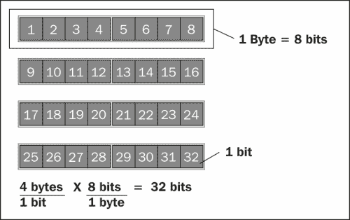
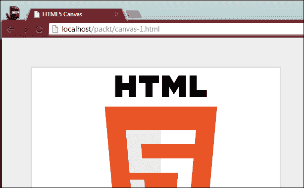

# 第四章：使用 HTML5 捕捉蛇

这一章是一个两部分系列的第一部分，在这里我们将构建游戏的第一个版本，然后在下一章中使用更多的 HTML5 API 来增加趣味性。两个版本都是完整可玩的，但是在同一章节中涵盖所有 API 会使章节变得非常庞大，因此我们将事情分解成更小的块，并编写两个单独的游戏。

游戏的第一个版本将涵盖五个新概念，即**HTML5 的 2D 画布 API**，**离线应用缓存**，**Web Workers**，**类型数组**和**requestAnimationFrame**。画布元素允许我们绘制 2D 和 3D 图形，并以非常低的级别操作图像数据，获得对单个像素信息的访问。离线应用缓存，也称为应用缓存，允许我们将特定资产从服务器缓存到用户的浏览器中，以便应用程序即使在没有互联网访问时也能工作。Web Workers 是一种类似线程的机制，允许我们在与主 UI 线程分离的单独线程中执行 JavaScript 代码。这样，用户界面永远不会被阻塞，用户也不会看到**页面无响应**的警告。`Typed arrays`是一种新的本机 JavaScript 数据类型，类似于数组，但效率更高，专门设计用于处理二进制数据。最后，requestAnimationFrame 是浏览器提供的一个 API，帮助我们执行基于时间的动画。我们可以让浏览器进行繁重的工作，优化动画，超出我们在 JavaScript 中单独实现的范围，而不是多次每秒使用 JavaScript 计时器（`setTimeout`或`setInterval`）来执行动画。

# 游戏

你肯定以前见过或玩过这个游戏。你在一个 2D 网格中控制一条蛇，只能向上、下、左或右移动。当你改变蛇头移动的方向时，蛇身的每一部分都会逐渐改变方向，跟随着头部。如果你撞到墙壁或蛇的身体，你就输了。如果你引导蛇头经过一个水果，蛇的身体就会变大。蛇变得越大，游戏就越具挑战性。此外，蛇移动的速度可以增加，增加额外的挑战。为了保持这个经典游戏的老派特性，我们选择了老派的图形和字体，如下面的截图所示：


图像显示了游戏的外观和感觉。游戏刚开始时，蛇的总体长度为零——只有头部存在。一开始，蛇会随机放置在游戏网格的某个位置，并且没有给予一个初始移动方向。玩家可以用箭头键控制蛇，一旦蛇开始朝特定方向移动，就无法停止。例如，如果蛇向右移动，玩家可以将其向上或向下移动（但不能向后）。如果玩家希望将蛇向左移动（当它当前向右移动时），唯一可能的方法是先将蛇向上移动，然后向左移动，或者向下移动，然后向左移动。

每当游戏网格上没有水果时，会随机添加一个水果到网格中。该水果会一直留在那里，直到玩家吃掉它，此时会在网格中添加一个新的水果。为增加难度，如果蛇在几秒内无法到达水果，我们可以让水果消失。

## API 使用

游戏中使用的每个 API 的一般描述和演示如下。要了解每个功能是如何整合到最终游戏中的，请查看以下代码部分。有关此游戏的完整源代码，请查看 Packt Publishing 网站上的书页。

在引入`requestAnimationFrame`之前，开发人员在 JavaScript 中创建动画的主要方法是使用定时器重复调用一个逐渐更新正在动画的元素的属性的函数。虽然这是一种简单直接的方法，但浏览器通过`requestAnimationFrame`提供的一些额外好处。首先，浏览器使用单个动画周期来处理页面的渲染，因此我们使用相同的周期进行的任何渲染都将导致更平滑的动画，因为浏览器可以为我们优化动画。此外，由于渲染将由浏览器的内部渲染机制完成，我们的动画在运行我们的动画的浏览器选项卡未显示时不会运行。这样我们就不会浪费电池寿命来动画显示不可见的内容。

## 如何使用

使用`requestAnimationFrame`非常简单，类似于`setTimeout`。我们在全局窗口对象上调用`requestAnimationFrame`函数，传递一个回调函数，该函数在浏览器准备好再次运行动画周期时执行。当调用回调函数时，会传递一个时间戳，通常在我们使用`requestAnimationFrame`注册的动画函数内部使用。

`requestAnimationFrame`有两种常见的使用方式，两种方式都能实现相同的结果。在第一种方法中，您定义动画函数时不引用`requestAnimationFrame`。然后，第二个函数调用该动画函数，然后调用`requestAnimationFrame`。

```js
function myAnimationLoop(time) {
   // 1\. Perform the animation
   myAnimation(time);

   // 2\. Register with request animation frame
   requestAnimationFrame(myAnimationLoop);
}

function myAnimation(time) {
   // Perform animation here
}
```

常用的第二种模式非常相似，只包括主要的动画函数。该函数本身负责在需要时调用`requestAnimationFrame`。

```js
function myAnimation(time) {
   // 1\. Perform the animation
   myAnimation(time);

   // 2\. Register with request animation frame
   requestAnimationFrame(myAnimationLoop);
}
```

时间参数有用的原因是，因为大多数情况下，您希望动画在不同的计算机上以更多或更少相同的速度运行。`requestAnimationFrame`尝试以尽可能接近每秒 60 次的速度运行。但是，根据您在其中执行的代码，该速率可能会显著下降。显然，更快的硬件能够更快地执行您的代码，并因此比一些较慢的硬件更频繁地显示在屏幕上。为了弥补这种可能性，我们可以使用实际时间来控制动画代码运行的频率。这样，我们可以指定一个刷新率上限，如果特定计算机能够以比这个速率更快的速度运行，可以简单地减慢该计算机的速度，所有用户都能体验到大致相同的动画。

这种技术的一种可能实现如下所示。虽然这可能看起来像是很多步骤，但概念实际上非常简单。其要点是：我们设置两个变量，一个用于跟踪动画运行的速度上限（以**每秒帧数**（**fps**）为单位），另一个用于跟踪上次渲染帧的时间。然后，每当动画函数执行时，我们获取当前时间，减去上次渲染帧的时间，并检查它们的差是否大于或等于我们选择的理想 fps。如果小于我们期望的 fps，我们不会进行任何动画，但仍会注册`requestAnimationFrame`在未来回调我们。

我们这样做直到经过足够的时间，以便我们可以实现每秒帧数（换句话说，我们可能运行的最快帧速率就是我们的 fps）。如果系统运行速度比这慢，我们无能为力。这种技术的作用是控制最大速度。

一旦`requestAnimationFrame`调用了我们的动画函数，并且自上次渲染帧以来已经过了足够的时间，我们就会更新所有需要的数据，用于动画渲染到屏幕上（或者让浏览器完成，如果可以的话），并更新跟踪上次更新帧的变量。

```js
// 1\. Create some element
var el = document.createElement("h1");
el.textContent = "I Love HTML5!";
el.style.position = "absolute";

// 2\. Attach it to the document
document.body.appendChild(el);

// 3\. Set some variables to control the animation
var loop = 0;
var lastFrame = 0;
var fps = 1000 / 60;

// 4\. Perform the animation one frame at a time
function slideRight(time) {

   // 5\. Control the animation to a set frames per second
   if (time - lastFrame >= fps) {

      var left = parseInt(el.style.left);

      // 6\. Perform the animation while some condition is true
      if (left + el.offsetWidth < document.body.offsetWidth) {
         el.style.left = (left + loop) + "px";
         loop += 5;

         // 7\. Perform the time control variable
         lastFrame = time;
      } else {

         // 8\. If the animation is done, return from this function
         el.style.left = document.body.offsetWidth - el.offsetWidth;
         return true;
      }
   }

   // 9\. If the animation is not done yet, do it again
   requestAnimationFrame(slideRight);
}

// 10\. Register some event to begin the animation
el.addEventListener("click", function(){
   el.style.left = 0;
   loop = 0;
   slideRight(0);
});
```

这个简单的代码片段创建了一个**文档对象模型**（**DOM**）元素，为其设置一些文本，并为其注册了一个点击处理程序。当调用点击处理程序时，我们重置元素的一些样式属性（即将元素放在屏幕的最左侧），并启动动画例程。动画例程每帧将元素向右移动一点，直到元素到达屏幕的右侧。如果元素尚未到达屏幕的右侧，或者换句话说，如果动画尚未完成，我们执行动画（移动元素几个像素），然后将其自身注册到`requestAnimationFrame`，从而继续循环。一旦动画完成，我们就简单地停止调用`requestAnimationFrame`。

记住的一个关键点是，浏览器使用`requestAnimationFrame`的主要优化之一是只在有东西需要渲染时调用它（换句话说，当包含页面的选项卡相对于其他选项卡处于活动状态时）。因此，如果用户在动画进行中切换选项卡，动画将暂停，直到再次选择该选项卡。

换句话说，我们应该让`requestAnimationFrame`调用处理游戏渲染的代码，而不是更新游戏状态的代码。这样，即使浏览器没有渲染，与动画相关的值仍会被动画化，但我们不会浪费 CPU 和 GPU 的功率，渲染看不见的东西。但是一旦浏览器选项卡再次变为活动状态，最新的数据状态将被渲染，就好像它一直在渲染一样。

这种技术对游戏特别有用，因为我们可能不希望用户切换浏览器选项卡时整个游戏都暂停。另一方面，我们总是可以通过在不需要时不向屏幕渲染数据来节省用户的电池。

### 注意

请记住，`requestAnimationFrame`将按定义将动画循环的帧速率限制为显示器的刷新速率。因此，`requestAnimationFrame`并不打算替代本机定时器实现，特别是在我们希望回调函数以与显示器刷新速率独立且可能更高的速率被调用的情况下。

# 类型化数组

多年来，JavaScript 引擎的速度变得惊人地快。然而，仅仅能够更快地处理数据并不一定等同于能够做更强大的事情。以 WebGL 为例。仅仅因为浏览器现在具有理解 OpenGL ES 的能力，并不一定意味着它具有我们开发人员需要利用的所有工具。

好消息是，JavaScript 语言也在一些方面取得了进展，以满足这一需求和其他需求。近年来 JavaScript 的一个新增内容是一种新的数据类型：类型化数组。一般来说，类型化数组提供了与 JavaScript 中已有的数组类型类似的结构。然而，这些新数组更加高效，并且是针对二进制数据设计的。

你问为什么和如何类型化数组比普通数组更高效？好吧，让我们看一个简单的例子，我们只是以旧的方式遍历一个整数数组。尽管大多数 JavaScript 引擎并不特别困难地快速完成这项任务，但我们不要忽视引擎需要做的所有工作。

```js
var nums = [1, 2, 3, 4, 5];
for (var i = 0, len = nums.length; i < len; i++) {
   // ...
}
```

由于 JavaScript 不是强类型的，数组`nums`不受限于保存任何特定类型的数据。此外，`nums`数组可以为其中的每个元素存储不同的数据类型。虽然这对程序员来说有时可能很方便，但 JavaScript 引擎需要弄清楚每个元素存储在哪里，以及存储在该位置的数据类型是什么。与您可能认为的相反，在`nums`数组中的这五个元素可能不是存储在连续的内存块中，因为 JavaScript 就是这样做的。

另一方面，使用类型化数组，数组中的每个元素只能是`整数`或`浮点数`。根据我们选择的数组类型，我们可以有不同类型的`整数`或`浮点数`（`有符号`，`无符号`，8、16 或 32 位），但数组中的每个元素始终是我们决定使用的相同数据类型（整数或浮点数）。这样，浏览器就可以准确并立即知道`nums[3]`元素在内存中的位置，即在内存地址`nums + 3`处。这是因为类型化数组存储在连续的内存块中，就像 C 和 C++中的数组结构一样（顺便说一句，这是实现大多数，如果不是所有 JavaScript 引擎的语言）。

类型化数组的主要用例是，正如之前暗示的那样，WebGL（我们将在第六章中介绍，*为您的游戏添加功能*）。在 WebGL 中，我们可以直接从 JavaScript 执行 3D 渲染，可能需要处理超过一百万个元素的`整数`缓冲区。这些缓冲区可以用来表示我们希望绘制到屏幕上的 3D 模型。现在，想象一下浏览器需要遍历这样一个数组需要多长时间。对于每个元素，它都必须跟随一个内存位置，检查该位置的值，确保该值是一个数字，尝试将该值转换为数字，然后最终使用该值。听起来是不是很多工作？那是因为确实是。有了类型化数组，它可以以尽可能快的速度运行整个数组，知道每个元素确实是一个数字，并且确切地知道每个元素占用多少内存，因此跳转到下一个内存地址是一个一致和可预测的过程。

类型化数组也用于 2D 画布上下文。正如我们将在本章后面的画布 API 部分中看到的，我们可以从画布中绘制的任何内容中获取像素数据的方法。所有这些像素数据只是一个 8 位夹紧的`无符号整数`的长数组。这意味着该数组中的每个元素只能是介于 0 和 255 之间的`整数`值，这正是像素的可接受值。

## 如何使用它

使用类型化数组非常简单。如果您至少有一些 C 或 C++的经验，那么了解它们的工作原理可能会更容易。创建类型化数组的最简单方法是声明我们的数组变量，并为它分配特定类型的类型化数组实例。

```js
var typedArr = new Int32Array(10);
```

在这个例子中，我们创建了一个`整数`数组的实例，其中每个元素可以是正数或负数（`有符号`）。每个元素将以 32 位数字的形式存储。我们传递的`整数`参数表示数组的大小。创建了这个数组之后，它的大小就不能改变了。浏览器会悄悄地忽略分配给它的任何超出其范围的值，以及任何非法值。

除了对这种特殊数组中可以存储什么的限制之外，对于未经训练的人来说，它可能看起来就像是一个普通的 JavaScript 数组。但是，如果我们深入研究一下，我们会注意到数组和类型化数组之间还有一些区别。

```js
typedArr instanceof Int32Array; // True
typedArr.length == 10; // True

typedArr.push(23); // TypeError: <Int32Array> has no method 'push'
typedArr.pop(); // TypeError: <Int32Array> has no method 'pop'
typedArr.sort(); // TypeError; <Int32Array> has no method 'sort'

typedArr.buffer instanceof ArrayBuffer; // True
typedArr.buffer.byteLength == 40; //True

typedArr instanceof Array; // False
```

我们注意到的第一件事是，数组确实是一个`Int32Array`，而不是一个数组。接下来，我们很高兴地知道`length`属性仍然存在。到目前为止一切顺利。然后，事情开始分开，与普通数组相关的简单方法不再存在。不仅如此，类型化数组对象中还有一个名为`buffer`的新属性。这个缓冲区对象是`ArrayBuffer`类型，它有一个`byteLength`属性。在这种情况下，我们可以看到缓冲区的长度是`40`。很容易看出这个`40`是从哪里来的：`buffer`包含 10 个元素（`typedArr.length`），每个元素都是 32 位长（4 字节），总共在`ArrayBuffer`中有`40`字节（因此属性名为`byteLength`）。

由于类型化数组没有像普通 JavaScript 数组那样的辅助函数，我们使用旧的数组表示法来读取和写入数据，其中我们通过索引进入数组以读取或写入一个值。

```js
var typedArr = new Uint32Array(3);

typedArr[] = 0; // SyntaxError

typedArr[0] = 3;
typedArr[1] = 4;
typedArr[2] = 9;

for (var i = 0, len = typedArr.length; i < len; i++) {
   typedArr[i] >= 0; // True
}
```

再次强调一点，与普通 JavaScript 数组相关的任何辅助函数或快捷方式都不适用于类型化数组，注意，尝试在不提供索引的情况下访问元素将导致浏览器抛出异常。

### ArrayBuffer 和 ArrayBufferView

尽管所有先前的例子都直接使用了特定类型的数组，但类型化数组的工作方式要比那更复杂一些。实现被分解为两个单独的部分，即数组缓冲区和视图（或更具体地说，数组缓冲区视图）。数组缓冲区只是分配的一块内存，所以我们可以在那里存储我们的数据。关于这个缓冲区的事情是，它没有与之关联的类型，所以我们无法访问该内存来存储数据，或者从中读取数据。

为了能够使用数组缓冲区分配的内存空间，我们需要一个视图。尽管这个视图的基本类型是`ArrayBufferView`，但我们实际上需要`ArrayBufferView`的一个子类，它为数组缓冲区中存储的数据定义了一个特定的类型。

```js
var buffer = new ArrayBuffer(32);
buffer.byteLengh == 32; // True

var i32View = new Int32Array(buffer);
i32View.length == 8; // True
```

这就是事情可能变得有点混乱的地方。数组缓冲区以字节为单位工作。作为复习，一个字节由 8 位组成。一个位是一个单一的二进制数字，它可以有一个值，要么是零，要么是一。这是数据在计算机中以最基本的格式表示的方式。

现在，如果一个缓冲区以字节为单位工作，当我们在示例中创建我们的缓冲区时，我们创建了一个`32`字节的块。我们创建的视图可以是九种可能类型之一，每种类型都指定了不同的数据大小（以位而不是字节为单位）。因此，类型为`Int32`的视图表示一个每个元素都是 32 位长的`整数`的缓冲区。换句话说，32 位视图可以恰好容纳 8 个字节（1 字节=8 位；32 位=8 字节），如下面的屏幕截图所示：



数组缓冲区以字节为单位工作。在图中，有 4 个字节，尽管视图类型是以位为单位工作的。因此，如果我们使用 32 位视图，将导致一个长度恰好为一个元素的数组。如果视图使用 16 位数据类型，那么数组将有 2 个元素（4 个字节除以 16 位）。最后，如果视图使用 8 位数据类型，那么存储在 4 个字节缓冲区中的数组将有 4 个元素。

### 提示

始终要记住的一件重要的事情是，当你创建一个数组缓冲区时，你选择的长度必须完全能够被你创建的数组缓冲区视图的大小整除。如果缓冲区中没有足够的空间来容纳整个字节，JavaScript 将抛出一个`RangeError`类型的错误。

在下图中，缓冲区只足够大以容纳 8 位，所有位都必须由整个字节占用。因此，视图是一个 8 位数，恰好可以容纳一个整个元素，这是可以的。16 位元素只能容纳一半的元素，这是不可能的。32 位元素同样只能容纳一部分，这也是不允许的。


正如您所看到的，只要数组缓冲区的位长度是视图中使用的数据类型的位大小的倍数，事情就会很顺利。如果视图为 8 位长，则 8、16、24、32 或 40 字节的数组缓冲区都可以很好地工作。如果视图为 32 位长，则缓冲区必须至少为 4 字节长（32 位）、8 字节（64 位）、24 字节（96 位）等。然后，通过将缓冲区中的字节数除以视图表示的数据类型的字节数，我们可以计算出我们可以放入所述数组的总元素数。

```js
// 96 bytes in the buffer
var buffer = new ArrayBuffer(96);

// Each element in the buffer is 32 bits long, or 4 bytes
var view = new Int32Array(buffer);

// 96 / 4 = 24 elements in this typed array
view.length == 24;
```

## 类型化数组视图类型

总之，一个普通的数组缓冲区没有实际大小。虽然创建一个长度为 5 字节的数组缓冲区没有意义，但我们可以这样做。只有在创建了数组缓冲区后，我们才能创建一个视图来保存缓冲区。根据缓冲区的字节大小，我们可以通过选择适当的数据类型来确定数组缓冲区视图可以访问多少元素。目前，我们可以从九种数据类型中为数组缓冲区视图选择。

+   **Int8Array**：它是一个 8 位长的`有符号整数`，范围从 32,768 到 32,767

+   **Uint8Array**：它是一个 8 位长的`无符号整数`，范围从 0 到 65,535

+   **Uint8ClampedArray**：它是一个 8 位长的`无符号整数`，范围从 0 到 255

+   **Int16Array**：它是一个 16 位长的`有符号整数`，范围从 2,147,483,648 到 2,147,483,647

+   **Uint16Array**：它是一个 16 位长的`无符号整数`，范围从 0 到 4,294,967,295

+   **Int32Array**：它是一个 32 位长的`有符号整数`，范围从 9,223,372,036,854,775,808 到 9,223,372,036,854,775,807

+   **Uint32Array**：它是一个 32 位长的`无符号整数`，范围从 0 到 18,446,744,073,709,551,615

+   **Float32Array**：它是一个 32 位长的`有符号浮点数`，范围为 3.4E +/- 38（7 位数）

+   **Float64Array**：它是一个 64 位长的`有符号浮点数`，范围为 1.7E +/- 308（15 位数）

不用说，视图类型越大，缓冲区就需要越大来容纳数据。显然，创建的缓冲区越大，浏览器就需要为您设置更多的内存，无论您最终是否使用该内存。因此，我们应该始终注意我们实际可能需要多少内存，并尽量不要分配超过这个数量。如果为了表示游戏中的蛇而分配了一个 64 位长的 10,000 个元素的数组，这将是一种可怕的资源浪费，比如我们在本章中正在构建的游戏中，蛇的最大大小可能不会超过 50 个元素，每个元素的值也不会超过 10。

考虑到这些限制，我们可以计算出一个粗略但乐观的数组大小为 50，其中每个元素只需要 8 位（因为我们只需要大约 10 个唯一的值）。因此，50 个元素乘以每个一个字节，给我们一个总缓冲区大小为 50 字节。这应该足够我们的目的，而仅此缓冲区的内存消耗应该保持在 0.05 KB 左右。不错。

最后，您可能已经注意到，本节的第一部分演示了不使用显式`ArrayBuffer`构造来创建类型化数组。

```js
// Create a typed array with 4 elements, each 32 bits long
var i32viewA = new Int32Array(4);

// Create the same typed array, but using an explicit ArrayBuffer first
var buffer = new ArrayBuffer(16)
var i32viewB = new Int32Array(buffer)
```

虽然上面的两个类型化数组指向两个独立的内存位置，但在运行时它们是相同的，无法区分（除非实际的数组保存了不同的值，当然）；这里的重点是数组缓冲器视图构造函数可以接受`ArrayBuffer`，或者简单的`integer`。如果使用`ArrayBuffer`，所有上面提到的限制都适用，并且必须小心处理。如果只提供一个`integer`，浏览器将自动为您创建一个适当大小的数组缓冲器。在实践中，有时候会有少数情况和原因，您会想要手动创建一个独立的数组缓冲器。然而，值得注意的是，即使每个视图是不同的数据类型，也完全可以为同一个数组缓冲器创建多个数组缓冲器视图。请记住，由于缓冲器指向单个内存位置，因此绑定到同一个缓冲器的所有视图都共享该内存空间。

# 画布

也许没有其他 HTML5 功能像画布 API 一样强大，特别是对于 Web 平台的游戏开发。尽管我们可能已经拥有规范中的每一个功能，以及浏览器可能支持的任何即将推出的功能，但要使用 HTML 和 JavaScript 制作高质量、引人入胜、有趣的游戏几乎是不可能的。画布 API 允许我们在浏览器上创建 2D 和 3D 图形。它还允许我们操纵画布上存储的图形数据，甚至可以到像素级别。

画布图形和 SVG 图形之间的一个主要区别是，SVG 图形是基于矢量的，而画布图形始终是光栅图形，另外一个区别是画布是一个单一的 HTML 元素，其中绘制的所有内容在实际上对浏览器来说都是不存在的。因此，画布上绘制的任何实体的事件处理必须在应用程序级别进行处理。画布上有一些通用事件，我们可以观察和响应，比如点击、移动事件和键盘事件。除此之外，我们可以自由地做任何我们想做的事情。

除了在 HTML5 画布上可以进行基于形状的绘制之外，API 还有三个主要用例。我们可以创建基于精灵的 2D 游戏，完整的 3D 游戏（使用 WebGL 和画布的帮助），以及操纵照片。最后一个提到的用例：照片处理，尤其有趣。API 有一个非常方便的函数，不仅允许我们将画布中的数据导出为 PNG 或 JPG 图像，而且还支持各种类型的压缩。这意味着我们可以在画布上绘制，加载图形（例如照片），以像素级别操纵数据（例如应用类似 Photoshop 的滤镜），旋转、拉伸、缩放，或者以其他方式玩弄数据。然后，API 允许我们将这些数据导出为一个可以保存到文件系统的压缩文件。

对于本书的目的，我们将重点关注画布 API 的方面，这些方面对游戏开发最有用。尽管 WebGL 是画布元素的一个非常令人兴奋的方面，但我们将在第六章中简要介绍它，*为您的游戏添加功能*。对于画布 API 上其他可用的功能，我们将在下一节中简要介绍并举例说明。

## 如何使用它

我们需要了解关于画布元素的第一件事是，它有两个部分。一个是物理画布元素，另一个是我们可以通过它绘制到画布的渲染上下文。截至目前，我们可以在现代浏览器中使用两个渲染上下文，即`CanvasRenderingContext2D`和`WebGLRenderingContext`。

要获取画布的渲染上下文的引用，我们需要在画布元素本身上调用一个`factory`方法。

```js
var canvasA = document.createElement("canvas");
var ctx2d = canvas.getContext("2d");
ctx2d instanceof CanvasRenderingContext2D; // True

var canvasB = document.createElement("canvas");
var ctx3d = canvas.getContext("webgl") || canvas.getContext("experimental-webgl");
ctx3d instanceof WebGLRenderingContext; // True
```

请注意，使用备用上下文是针对带有前缀的`experimentalwebgl`上下文。截至目前，大多数支持 WebGL 的浏览器都会通过实验标签来支持它。

本节的其余部分将专门涉及`CanvasRenderingContext2D` API。虽然从技术上讲，可以使用 WebGL 的 3D 画布上下文来完成 2D 画布上下文可以做的一切，但这两个 API 共同之处仅在于它们与 HTML5 画布元素的关联。WebGL 本身就是一种完整的编程语言，单独的一章是远远不够的。

现在，2D 渲染上下文的一个非常重要的方面是它的坐标空间。与大多数计算机坐标系统类似，原点位于画布的左上角。水平轴向右增加，垂直轴向下增加。用于表示画布的内存中的网格大小由生成渲染上下文的画布的物理大小决定，而不是画布的样式大小。这是一个无法过分强调的关键原则。默认情况下，画布是 300 x 150 像素。即使我们通过**层叠样式表**（**CSS**）调整了画布的大小，它生成的渲染上下文仍然是那个大小（除非我们物理调整了画布的大小）。一旦渲染上下文被创建，它就无法调整大小。

```js
<style>
canvas {
   border: 3px solid #ddd;
   width: 500px;
   height: 300px;
}
</style>

<script>
   var canvas = document.createElement("canvas");
   var ctx = canvas.getContext("2d");

   document.body.appendChild(canvas);

   alert(ctx.canvas.width);
</script>
```


边框是为了使画布对我们有些可见，因为默认情况下，画布是透明的。

您将观察到 CSS 规则确实应用于画布元素，即使画布的实际大小仍然是默认的 300 x 150 像素。如果我们在画布中间画一个圆，圆看起来会变形，因为应用于画布的样式会拉伸实际绘制圆的坐标空间。

### clearRect

我们将要查看的第一个绘图函数是`clearRect`。这个函数所做的就是清除画布的一个矩形区域。这个函数是在上下文对象上调用的，就像我们将在 2D 画布上进行的所有绘图调用一样。它所需要的四个参数依次代表了从画布原点的 x 和 y 偏移量，以及要清除的宽度和高度距离。请记住，与其他流行的绘图 API 不同，最后两个参数不是从原点开始测量的——它们是从由前两个参数指定的点的位移距离。

```js
var canvas = document.querySelector("canvas");
var ctx = canvas.getContext("2d");

// Clear the entire canvas
ctx.clearRect(0, 0, canvas.width, canvas.height);

// Only clear the half inside area of the canvas
ctx.clearRect(canvas.width * 0.25, canvas.height * 0.25,
   canvas.width * 0.5, canvas.height * 0.5);

// Clear a square 100x100 at the lower right bottom of the canvas
ctx.clearRect(canvas.width - 100, canvas.height - 100, 100, 100);
```

通常，当每秒渲染许多帧时，我们会在绘制下一帧之前调用此函数来清除整个画布。幸运的是，在大多数 JavaScript 引擎中，这个函数的性能表现相当不错；因此，我们不需要过多担心定期优化要清除的精确区域。

### 填充和描边

在绘制诸如线条、路径、文本和其他形状等本机对象时，我们将处理描边和填充的概念；就像在 SVG 中一样，描边是指原始图形的轮廓（如边框或类似物），而填充是覆盖形状内部的内容。

我们可以通过将任何颜色分配给`fillStyle`或`strokeStyle`属性来更改用于填充形状的颜色，或者用于描边形状的颜色。颜色可以是任何有效的 CSS 颜色字符串。

```js
// Short hand hex colors are fine
ctx.fillStyle = "#c00";
ctx.fillRect(0, 0, canvas.width, canvas.height);

// Keyword colors are fine, though not as precise
ctx.strokeStyle = "white";

ctx.lineWidth = 10;
ctx.strokeRect(25, 25, 100, 100);
ctx.strokeRect(175, 25, 100, 100);

// Alpha transparency is also allowed
ctx.fillStyle = "rgba(100, 255, 100, 0.8)";

ctx.fillRect(5, 50, canvas.width - 10, 50);
```


任何有效的 CSS 颜色字符串都可以分配给 2D 渲染上下文中的颜色属性，包括带有不透明度的颜色。

### 注意

特别注意渲染上下文的行为很像一个状态机。一旦设置了填充或描边样式，以及任何其他属性，该属性将保持该值，直到您更改它。

另外，请注意，您发出的每个后续绘图调用都会绘制在画布上已有的内容之上。因此，我们可以通过仔细安排绘图调用的顺序来分层形状和图像。

### 线条

绘制线条就像调用`lineTo`函数一样简单，它只接受两个参数，表示线条的终点。对`lineTo`的后续调用将绘制一条线到函数调用指定的点，从上一次绘制线条的地方开始。更具体地说，线条从当前绘制指针的位置开始。

默认情况下，指针没有定义在任何地方，因此将线条绘制到其他点几乎没有意义。为了解决这个问题，我们可以使用`moveTo`函数，它可以移动绘制指针而不绘制任何东西。

最后，对`lineTo`的任何调用只是在内存中设置点。为了最终绘制线条，我们需要快速调用 stroke 函数。一旦进行了这个调用，当前设置的任何属性（如线宽和描边样式）都会被绘制。因此，在实际描边线条之前更改线条属性没有什么好处，而且可能会对性能产生负面影响。

```js
ctx.fillStyle = "#fff";
ctx.fillRect(0, 0, canvas.width, canvas.height);

// This call is completely useless
ctx.strokeStyle = "#c0c";
ctx.lineWidth = 5;

ctx.moveTo(0, 0);
ctx.lineTo(100, 100);
ctx.lineTo(canvas.width, 0);

// This call is also useless because the line hasn't been drawn yet
ctx.strokeStyle = "#ca0";
ctx.moveTo(10, canvas.height - 10);
ctx.lineTo(canvas.width - 10, canvas.height * 0.5);

// This color is applied to every line drawn so far
ctx.strokeStyle = "#f5a";

// The line is finally drawn here
ctx.stroke();
```


形状只有在调用`stroke()`之后才会被绘制，此时会使用当前的样式属性。

### 形状

我们可以非常轻松地绘制几种不同的形状。这些是矩形和圆。虽然没有像绘制矩形的`rect`函数那样的圆函数。但是，有一个`arc`函数，我们可以从中绘制圆。

`rect`函数接受四个参数，与`fillRect`完全相同。`arc`接受一个 x 和一个 y 坐标，然后是半径、起始角度（以弧度而不是度数表示）、结束角度和一个布尔值，指定弧是顺时针绘制还是逆时针绘制。要绘制一个圆，我们可以绘制一个从 0 到 PI 乘以 2 的弧，这与 360 度相同。

```js
ctx.fillStyle = "#fff";
ctx.strokeStyle = "#c0c";

ctx.fillRect(0, 0, canvas.width, canvas.height);

ctx.rect(10, 10, 50, 50);
ctx.rect(75, 50, 50, 50);

ctx.moveTo(180, 100);
ctx.arc(180, 100, 30, 1, 3, true);

ctx.moveTo(225, 40);
ctx.arc(225, 40, 20, 0, Math.PI * 2, false);

ctx.stroke();
```


弧（包括圆）是从它们的中心绘制的，而不是从轮廓上的某一点开始。

### 文本

在 HTML5 画布上绘制文本也非常简单。函数`fillText`接受一个字符串（要绘制的文本），以及一个 x 和 y 坐标，文本开始绘制的位置。此外，我们可以通过设置文本样式属性字符串到字体属性来对文本进行样式设置，就像通过 CSS 对文本进行样式设置一样。

```js
ctx.fillStyle = "#fff";
ctx.fillRect(0, 0, canvas.width, canvas.height);

ctx.fillStyle = "#f00";
ctx.font = "2.5em 'Times New Roman'";

ctx.fillText("I Love HTML5!", 20, 75);
```

### 变换

画布 API 还定义了一些变换函数，允许我们对上下文的坐标系进行平移、缩放和旋转。在变换坐标系之后，我们可以像平常一样在画布上绘制，变换会应用到绘制上。

```js
ctx.fillStyle = "#fff";
ctx.fillRect(0, 0, canvas.width, canvas.height);

// Now the origin is at point 50x50
ctx.translate(50, 50);

ctx.fillStyle = "#f00";
ctx.fillRect(0, 0, 50, 50);
```

旋转和缩放也是一样的。`scale`函数接受一个值，用于在每个轴上缩放坐标系。`rotation`函数接受一个参数，即要将坐标系旋转的角度（以弧度表示）。

```js
ctx.fillStyle = "#fff";
ctx.fillRect(0, 0, canvas.width, canvas.height);

// With transformations, order is very important
ctx.scale(2, 1);
ctx.translate(50, 50);
ctx.rotate(0.80);
ctx.translate(10, -20);

ctx.fillStyle = "#f00";
ctx.fillRect(0, 0, 50, 50);
```


在变换中，顺序非常重要。

### 绘制图像

从游戏开发的角度来看，2D 画布 API 最令人兴奋和有用的功能可能就是它能够在上面绘制图像。对我们来说，幸运的是，有几种方法可以直接在画布上绘制常规的 JPG、GIF 或 PNG 图像，包括处理从源到目标的图像缩放的函数。

关于画布元素，我们需要注意的另一点是它遵循相同的源策略。这意味着，为了能够在画布上绘制图像，尝试绘制图像的脚本必须与图像来自相同的域（以及相同的协议和端口号）。任何尝试从不同域加载图像到画布上下文的操作都会导致浏览器抛出异常。

```js
ctx.fillStyle = "#fff";
ctx.fillRect(0, 0, canvas.width, canvas.height);

var img = new Image();
img.onload = function(){
   ctx.drawImage(img, 0, 0, this.width, this.height);
};

img.src = "img/html5-logo.png";
```

绘制图像的最简单调用只需要五个参数。第一个是图像的引用。接下来的两个参数是图像将被绘制到画布上的 x 和 y 位置，最后两个参数是将图像绘制到画布上的宽度和高度。如果最后两个参数不保持原始图像的宽高比，结果将是扭曲而不是裁剪。另外，请注意，如果原始图像大于画布，或者如果图像是从偏移处绘制的，以至于图像的一部分超出了画布，那么额外的数据将不会被绘制（显然），画布将忽略视图区域外的像素：



在画布渲染上绘制的 HTML5 标志。

一个非常重要的观察是，如果浏览器在调用`drawImage`时尚未完成从服务器下载图像资源，那么画布将不会绘制任何东西，因为要绘制到画布上的图像尚未加载。在使用某种游戏循环多次每秒绘制相同图像到画布的情况下，这并不是一个问题，因为图像最终加载时，游戏循环的下一次通过将成功绘制图像。然而，在只调用一次绘制图像的情况下（就像上面的例子一样），我们只有一次机会来绘制图像。因此，非常重要的是，我们不要在图像实际加载到内存并准备好绘制到画布之前进行调用。

为了确保在图像从服务器完全下载后才调用将图像绘制到画布的操作，我们可以简单地在图像的加载事件上注册一个回调函数。这样，一旦图像下载完成，浏览器就可以触发回调，最终可以调用绘制图像的操作。这样，我们可以确保在我们想要在画布中呈现图像时，图像确实已经准备好了。

还有另一个版本的相同函数，它考虑了从源到目的地的缩放。在上面的情况下，源图像大于画布。我们可以告诉画布将整个图像绘制到画布的较小区域，而不是使用照片编辑软件调整图像的大小。缩放由画布自动完成。我们还可以将图像绘制到比图像本身更大的区域，但这样做将根据我们缩放图像的程度而导致像素化。

该函数的参数是源图像，源 x 和 y 坐标（换句话说，从图像本身开始采样源图像的位置），源宽度和高度（换句话说，采样源图像的量），以及目标 x 和 y，然后是宽度和高度。

```js
ctx.fillStyle = "#fff";
ctx.fillRect(0, 0, canvas.width, canvas.height);

var img = new Image();
img.onload = function(){

   ctx.drawImage(img,
      // Sample part of the upper left corner of the source image
      35, 60, this.width / 2, this.height / 2,

      // And draw it onto the entire canvas, even if it distorts the image
      0, 0, canvas.width, canvas.height);
};

img.src = "img/html5-logo.png";
```


在画布渲染上绘制的 HTML5 标志的一部分，有一些故意的拉伸。

### 操作像素

现在我们知道如何将图像绘制到画布中，让我们将事情推进一步，处理在画布中绘制的单个像素。有两个函数可以用来实现这一点。一个函数允许我们从画布上下文中检索像素数据，另一个函数允许我们将像素缓冲区放回到画布上下文中。此外，还有一个函数允许我们将像素数据作为数据 URL 检索出来，这意味着我们可以将画布中的图像数据保存到用户的文件系统中，就像我们可以使用``标签中的常规图像一样。

```js
ctx.fillStyle = "#fff";
ctx.fillRect(0, 0, canvas.width, canvas.height);

var img = new Image();
img.onload = function(){
   ctx.drawImage(img, 35, 60, this.width / 2, this.height / 2, 0, 0, canvas.width, canvas.height);

   // Extract pixel data from canvas context
   var pixels = ctx.getImageData(0, 0, canvas.width, canvas.height);

   pixels instanceof ImageData; // True
   pixels.data instanceof Uint8ClampedArray; // True
   pixels.width == canvas.width; // True
   pixels.height == canvas.height; // True

   // Insert pixel data into canvas context
   ctx.putImageData(pixels, 0, 0);
};

img.src = "img/html5-logo.png";
```

要获取表示当前在画布上绘制的内容的像素数据，我们可以使用`getImageData`函数。四个参数是源图像上的 x 和 y 偏移量，以及要提取的宽度和高度。请注意，这个函数的输出是一个`ImageData`类型的对象，它有三个属性，即宽度、高度和包含实际像素信息的类型化数组。正如本章前面提到的，这个类型化数组是`Uint8ClampedArray`类型的，其中每个元素只能是一个值在 0 到 255 之间的整数。

像素数据是一个长度为(`canvas.width x canvas.height x 4`)的缓冲区。也就是说，每四个元素代表一个像素，按照红色、绿色、蓝色和 alpha 通道的顺序表示像素。因此，为了通过这个画布 API 操纵图像，我们对这个像素缓冲区进行各种计算，然后可以使用`putImageData`函数将其放回画布。

`putImageData`的三个参数是`ImageData`对象，以及目标画布上的 x 和 y 偏移量。从那里，画布将尽可能地呈现图像数据，裁剪任何多余的数据，否则会被绘制在画布外部。

作为我们可以用图像做的一个例子，我们将取出我们在画布上绘制的 HTML5 标志，并对代表它的像素数据应用灰度函数。如果这听起来像一个复杂的任务，不用担心。虽然有几种不同的公式可以将彩色图像转换为灰度图像，但最简单的方法是简单地对每个像素的红色、绿色和蓝色值求平均值。

```js
ctx.fillStyle = "#fff";
ctx.fillRect(0, 0, canvas.width, canvas.height);

var img = new Image();
img.onload = function(){
   ctx.drawImage(img, 35, 60, this.width / 2, this.height / 2, 0, 0, canvas.width, canvas.height);

   // Extract pixel data from canvas context
   var pixels = ctx.getImageData(0, 0, canvas.width, canvas.height);

   // Iterate over every four elements, which together represent a single pixel
   for (var i = 0, len = pixels.data.length; i < len; i += 4) {
      var red = pixels.data[i];
      var green = pixels.data[i + 1];
      var blue = pixels.data[i + 2];
      var gray = (red + green + blue) / 3;

     // PS: Alpha channel can be accessed at pixels.data[i + 3]

      pixels.data[i] = gray;
      pixels.data[i + 1] = gray;
      pixels.data[i + 2] = gray;
   }

   // Insert pixel data into canvas context
   ctx.putImageData(pixels, 0, 0);
};

img.src = "img/html5-logo.png";
```


操纵图像并不比对代表图像的像素缓冲区中的每个像素进行各种计算更复杂。

最后，我们可以通过调用`toDataURL`函数来从画布中导出图像。特别注意，这个函数是在画布对象上调用的，而不是在渲染上下文对象上调用的。画布对象的`toDataURL`函数接受两个可选参数，即表示输出图像的 MIME 类型的字符串，以及一个介于`0.0`和`1.0`之间的`float`，表示输出图像的质量。如果输出图像类型不是`"image/jpeg"`，则忽略质量参数。

```js
   ctx.putImageData(pixels, 0, 0);

   var imgUrl_LQ = canvas.toDataURL("image/jpeg", 0.0);
   var out = new Image();
   out.src = imgUrl_LQ;
   document.body.appendChild(out);

   var imgUrl_HQ = canvas.toDataURL("image/jpeg", 1.0);
   var out = new Image();
   out.src = imgUrl_HQ;
   document.body.appendChild(out);

   var imgUrl_raw = canvas.toDataURL("image/png");
   var out = new Image();
   out.src = imgUrl_raw;
   document.body.appendChild(out);
```

# Web workers

Web workers 带来了在主 UI 线程之外执行代码的能力。这种类似线程的行为使我们能够执行长时间的任务而不阻塞用户界面。当一个 JavaScript 任务花费太长时间来完成时，浏览器会向用户显示一个警报，让用户知道页面没有响应。使用 web workers，我们可以解决这个问题。

关于 web workers，我们需要牢记一些限制。首先，workers 在 DOM 之外运行，因此任何与 DOM 相关的功能在 worker 线程内不可用。此外，workers 没有共享内存的概念——传递给 worker 的任何数据都会被复制到它自己的内存空间中。最后，传递给和从 worker 传递的任何对象都可以包含任何数据类型，除了函数。如果尝试传递函数给 worker（或者包含对函数引用的对象），浏览器将抛出一个**DataCloneError**（DOM Exception 25）。

另一方面，workers 完全能够发起 XHR 请求（Ajax 调用），启动其他 workers，并停止其他 workers，包括它们自己。一旦 worker 被终止，它就不能再启动，类似于其他语言中可用的其他线程构造。

## 如何使用它

在这一部分，我们将创建一个示例迷你应用程序，该应用程序在一个工作线程中生成素数。用户可以在应用程序中输入一个数字，应用程序将返回一个小于该数字的素数列表。然后这些素数将被传回主应用程序，主应用程序将把素数列表返回给用户。

要开始使用 Web Workers，我们必须首先创建一个单独的 JavaScript 文件，该文件将在工作线程中运行。该脚本将通过消息与其父线程通信。为了从父线程接收消息，工作线程需要注册一个回调函数，每当有消息传递给它时就会被调用。

```js
self.addEventListener("message", getPrimes);
```

当接收到消息时，该函数在工作线程和其父线程中都会被调用，并且会传递一个`MessageEvent`对象。该对象包含许多属性，包括时间戳，最重要的是一个数据属性，其中包含传递给工作线程的任何数据。

要向工作线程或其父级发送消息，我们只需在适当的对象上调用`postMessage`函数（无论是工作对象还是在工作线程中的 self 对象），并将数据与函数调用一起传递。这些数据可以是单个值、数组或任何类型的对象，只要不包括函数。

最后，要创建一个`worker`对象，我们只需创建`Worker`类的一个实例，并将工作脚本的路径作为构造函数参数传递。这个`worker`对象将需要为它想要观察的任何事件注册回调函数：`onMessage`或`onError`。要终止工作线程，我们可以直接在工作对象上调用`terminate`函数，或者在工作脚本上调用`close`函数。

```js
// index.html
var worker = new Worker("get-primes.worker.js");

worker.addEventListener("message", function(event){
   var primes = event.data.primes;
   var ul = document.createElement("ul");

   // Parse each prime returned from the worker
   for (var i = 0, len = primes.length; i < len; i++) {
      var li = document.createElement("li");
      li.textContent = primes[i];
      ul.appendChild(li);
   }

   // Clear any existing list items
   var uls = document.querySelectorAll("ul");
   for (var i = 0, len = uls.length; i < len; i++)
      uls[i].remove();

   // Display the results
   document.body.appendChild(ul);
});

var input = document.createElement("input");
input.addEventListener("keyup", function(event){
   var key = event.which;

   // Call the worker when the Enter key is pressed
   if (key == 13 /* Enter */) {
      var input = this.value;

      // Only use input that's a positive number
      if (!isNaN(input) && input > 0) {
         worker.postMessage({max: input});
      } else if (input == -1) {
         worker.terminate();
         this.remove();
      }
   }
});

input.setAttribute("autofocus", true);
document.body.appendChild(input);
```

在上面的片段中，我们设置了两件事：一个工作线程和一个输入字段。然后我们在输入字段上设置了一个`keydown`监听器，这样用户就可以输入一个数字发送到工作线程。要将这个数字发送到工作线程，用户必须按下**Enter**键。当发生这种情况时，输入字段中的数字将是工作线程生成的最大可能的素数。如果用户输入数字`-1`，则工作线程将被终止，并且输入字段将从 DOM 中移除。

为了简单起见，工作线程将使用**埃拉托斯特尼筛法**来查找素数。请记住，这个练习只是一个概念验证，用来说明 Web Workers 的工作原理，而不是高级数学课程。

```js
// get-primes.worker.js

// Register the onMessage callback
self.addEventListener("message", getPrimes);

// This function implements the Sieve of Eratosthenes to generate the primes.
// Don't worry about the algorithm so much – focus on the Worker API
function getPrimes(event) {

   var max = event.data.max;
   var primes = [];
   var d = [];

   for (var q = 2; q < max; q++) {
      if (d[q]) {
         for (var i = 0; i < d[q].length; i++) {
            var p = d[q][i];
            if (d[p + q])
               d[p + q].push(p);
            else
               d[p + q] = [p];
         }
         delete d[q];
      } else {
         primes.push(q);
         if (q * q < max)
            d[q * q] = [q];
      }
   }

   // Return the list of primes to the parent thread
   self.postMessage({primes: primes});
}
```

如何使用它

只要工作线程没有被终止，就可以无限次地调用工作线程。一旦终止，工作线程就可以被删除，因为从那时起它就没有任何有用的目的了。

# 离线应用程序缓存

离线应用程序缓存是一种在浏览器上存储资产以供用户在未连接到互联网时使用的方法。这个 API 进一步消除了本地应用程序和 Web 应用程序之间的任何障碍，因为它消除了将 Web 应用程序与本地应用程序区分开来的主要特征——对全球网络的连接需求。尽管用户显然仍然需要在某个时候连接到网络，以便可以最初下载应用程序；之后，应用程序可以完全从用户的缓存中运行。

离线应用程序缓存的主要用例可能是当用户的连接不稳定、一致或者在每次使用应用程序时都不连接的情况。这在游戏中尤其如此，因为用户可能选择在某些时间玩某个在线游戏，但之后离线。同样，如果游戏需要连接到后端服务器，以执行任何任务（例如检索新的游戏数据），只要用户连接，资源就可以再次被缓存在本地，新数据可以在用户的连接不可用时再次使用。

## 如何使用它

离线应用程序缓存 API 的核心是清单文件，它指定了浏览器应该为离线使用缓存哪些资源，哪些资源绝对不能被缓存，以及当尝试连接到服务器但找不到连接时浏览器应该做什么。

当加载应用程序时，清单文件与用户请求的 HTML 文件一起提供。更具体地说，主机 HTML 文件指定了清单文件的路径，然后浏览器并行获取和处理主应用程序的下载和处理。这是通过根`html`标记中的`manifest`属性完成的。

```js
<!doctype html>
<html manifest="manifest.appcache">
```

请注意，上面的片段指定了一个名为`manifest.appcache`的清单文件，位于指定清单的 HTML 文件相同的目录中。文件的名称和扩展名完全是任意的。按照惯例，许多开发人员简单地将清单命名为`manifest.appcache`、`manifest`（没有扩展名）或`appcache.manifest`。但是，这个文件也可以被命名为`manifest.php?id=2642`、`my-manifest-file.txt`或`the_file.json`。

要记住的一件重要的事情是，清单文件必须以正确的 MIME 类型提供。如果浏览器尝试获取根 HTML 标记中`manifest`属性中列出的任何文件，并且 MIME 类型不是`text/cache-manifest`，那么浏览器将拒绝清单，并且不会发生离线应用程序缓存。

设置文件的 MIME 类型有很多种方法，但通常这是服务器设置。如果使用 Apache 服务器，比如我们在 WAMP、MAMP 或 LAMP 中使用的服务器（请参阅在线章节《设置环境》），我们可以通过`.htaccess`文件轻松实现这一点。例如，在我们项目的根目录中，我们可以创建一个名为`.htaccess`的文件，其中包含以下代码：

```js
AddType text/cache-manifest .appcache
```

这将告诉服务器为任何扩展名为`.appcache`的文件添加正确的 MIME 类型。当然，如果您决定调整`htaccess`文件以为其他文件扩展名提供`cache-manifest` MIME 类型，如果您选择的扩展名已经与其他 MIME 类型相关联（例如`.json`），可能会遇到问题。

清单文件的第一行必须是以下字符串：

```js
CACHE MANIFEST
```

如果这一行不存在，整个 API 将不起作用。如果在上述列出的字符串之前有多余的空格，浏览器将抛出以下错误，指示文件清单无效，并且不会被缓存：

```js
Application Cache Error event: Failed to parse manifest
```

### 注意

在游戏中使用离线应用程序缓存时，请确保密切关注浏览器的 JavaScript 控制台。如果出现任何问题，比如找不到清单文件、解析清单或加载清单中描述的任何资源，浏览器会通过引发异常来告诉您发生了错误，但它会继续执行。与大多数致命的 JavaScript 异常不同，致命的离线应用程序缓存异常不会停止或影响启动缓存过程的脚本的执行。因此，您可能会遇到应用程序缓存异常而不知道，因此熟悉浏览器支持的任何开发人员工具，并充分利用它。

清单的其余部分可以分为三个主要类别，即要缓存的资产、永远不要缓存的资产和回退资产。注释可以放置在文件的任何位置，并以井号表示。井号后的整行将被清单解析器忽略。

```js
CACHE MANIFEST

# HTML5 Snake, Version 1.0.0

CACHE:
index.html
js/next-empty.worker.js
js/renderer.class.js
js/snake.class.js
img/block-green.png
img/fruit-01.png
fonts/geo.woff
fonts/vt323.woff
css/style.css

NETWORK:
*

FALLBACK:
fallback.html
```

通过在网络部分使用通配符，我们指示任何未在缓存下指定的资源都属于网络部分，这意味着这些资源不会被缓存。在没有网络访问时尝试加载这些资源将导致加载回退文件。这是一个很好的选择，可以让用户知道需要网络访问，而无需特殊处理任何额外的代码。

一旦清单被解析并且所有资源都被缓存，所有资源将保持缓存，直到用户删除离线应用程序缓存数据（或浏览器缓存的所有数据），或者清单被更改。即使清单文件中只有一个字符发生变化，浏览器也会认为它是一个更新，因此所有资源都会被重新缓存。因此，许多开发人员在清单文件的顶部写下了一行注释，其中包括一些版本号，用于标识清单的唯一版本。这样，如果一个或多个资产发生变化，我们可以通过简单地更改清单文件中列出的版本号来强制浏览器重新缓存这些资产。请记住，浏览器只会检查清单文件中的文本，以确定是否需要下载新的资源。如果资源发生变化（比如，您更新了清单中列出的 JavaScript 代码，或者一些图形，或者任何其他资源），但清单文本没有变化，这些资源将不会从服务器上拉取，用户将继续使用应用程序中过时的资产，因为资产只从缓存中加载。

# 代码

这个游戏的布局实际上非常简单。HTML 只有三个小部件：游戏的标题，玩家当前得分的计分板，以及跨多个游戏的总高分计分板。这个最后的计分板在这个版本的游戏中没有使用，我们将在下一个游戏中更深入地讨论它（参见第五章，“改进蛇游戏”）。

```js
<h1>HTML5 Snake</h1>

<section id="scores">
   <h3>Score: <span>0</span></h3>
   <h3>High Score: <span>0</span></h3>
</section>

<section id="gameMenu" class="hide">
   <h3>Ready!</h3>
   <button>Play</button>
</section>
```

为了将游戏中所有不同组件的各种责任分开，我们将整个游戏的渲染抽象成一个单独的`Renderer`类。这个类负责向给定的`canvas`引用绘制数据。它绘制的数据，无论是蛇还是其他对象，都以类型化数组的形式传递给它，表示实体要绘制的坐标，以及在类型化数组指定的位置绘制的图像资源。 `Renderer`类还包括一些辅助函数，帮助我们轻松清除画布，并将`x`和`y`点转换为用于遍历表示 2D 数组的扁平数组的索引。

```js
var Renderer = function(canvas) {

   var canvas = canvas;
   var ctx = canvas.getContext("2d");
   var width = canvas.width;
   var height = canvas.height;

   var getIndex = function(x, y) {
      return width * y + x;
   };

   var getPosition = function(index) {
      return {
         x: index % width,
         y: parseInt(index / width)
      };
   };

   this.clear = function() {
      ctx.clearRect(0, 0, canvas.width, canvas.height);
   };

   this.draw = function(points, img) {
      for (var i = 0, len = points.length; i < len; i += 2) {
         ctx.drawImage(img, points[i] * img.width, points[i + 1] * img.height, img.width, img.height);
      }
   };
};
```

接下来，我们创建了一个`Snake`类，它封装了与蛇相关的所有数据和行为。这个类存储的数据包括蛇头的当前位置，蛇身的当前长度，代表蛇的绘制图像，以及蛇是否存活。它处理的行为包括移动蛇和处理用户输入（为简单起见，这些都包含在这个类中）。还有一些辅助函数，允许我们将其他行为委托给客户端。例如，通过公开的 API，客户端可以在每一帧检查蛇是否超出了世界网格，它是否吃了水果，或者蛇是否撞到了自己的身体。客户端还可以使用提供的 API 对蛇采取行动，比如设置它的生命属性（死或活），以及重置用于绘制蛇的图像，或者它的任何其他属性。

```js
var Snake = function(x, y, width, height, maxSize) {
   var isAlive = true;
   var size = 0;
   var body = new Int8Array(maxSize * 2);
   for (var i = 0, len = body.length; i < len; i++)
      body[i] = -1;
   body[0] = x, body[1] = y;
   var worldWidth = width;
   var worldHeight = height;
   var skin;
   var dir = { 38: false, 40: false, 37: false, 39: false };
   var keys = { UP: 38, DOWN: 40, LEFT: 37, RIGHT: 39 };
   // To move the snake, we first move each body part to where the
   // part before it used to be, starting at the tail and moving
   // towards the head. Lastly, we update the head's position
   var move = function() {
      // Traverse the snake backwards and shift each piece one spot
      for (var i = size * 2 + 1; i > 1; i -= 2) {
         body[i] = body[i - 2];
         body[i - 1] = body[i - 3];
      }
      if (dir[keys.UP]) {
         body[1]--;
      } else if (dir[keys.DOWN]) {
         body[1]++;
      } else if (dir[keys.LEFT]) {
         body[0]--;
      } else if (dir[keys.RIGHT]) {
         body[0]++;
      }
   };
   // Update the snake's position vectors on key presses
   this.doOnKeyDown = function(event) {
      var key = event.which;
      // Don't process a key that's already down
      if (dir[key])
         return;
      dir[keys.UP] = false;
      dir[keys.DOWN] = false;
      dir[keys.LEFT] = false;
      dir[keys.RIGHT] = false;
      if (key == keys.UP && !dir[keys.DOWN]) {
         return dir[keys.UP] = true;
      } else if (key === keys.DOWN && !dir[keys.UP]) {
         return dir[keys.DOWN] = true;
      } else if (key === keys.LEFT && !dir[keys.RIGHT]) {
         return dir[keys.LEFT] = true;
      } else if (key === keys.RIGHT && !dir[keys.LEFT]) {
         return dir[keys.RIGHT] = true;
      }
   };
   // This allows us to use different images to represent the snake
   this.setSkin = function(img) {
      skin = new Image();
      skin.onload = function() {
         skin.width = this.width;
         skin.height = this.height;
      };
      skin.src = img;
   };
      this.move = move;
   this.getSkin = function() { return skin; };
   this.setDead = function(isDead) { isAlive = !isDead; };
   this.isAlive = function() { return isAlive; };
   this.getBody = function() { return body; };
   this.getHead = function() { return {x: body[0], y: body[1]}; };
   this.grow = function() { if (size * 2 < body.length) return size++; };
   // Check if the snake is at a certain position on the grid
   this.isAt = function(x, y, includeHead) {
      var offset = includeHead ? 0 : 2;
      for (var i = 2, len = body.length; i < len; i += 2) {
         if (body[i] == x && body[i + 1] == y)
            return true;
      }
      return false;
   };
   this.reset = function(x, y) {
      for (var i = 0, len = body.length; i < len; i++)
         body[i] = -1;
      body[0] = x;
      body[1] = y;
      size = 0;
      isAlive = true;
      dir[keys.UP] = false;
      dir[keys.DOWN] = false;
      dir[keys.LEFT] = false;
      dir[keys.RIGHT] = false;
   };
};
```

与`snake`类类似，我们还创建了一个类来封装蛇将要吃的水果。`snake`类和`fruit`类之间唯一的区别是`fruit`类除了出现在地图上之外不会做任何其他事情。在实际目的上，`fruit`类与`snake`类共享一个公共实体接口，允许它们被重置为默认状态，设置它们的位置，并检查碰撞。

```js
var fruit = {
   position: new Int8Array(2),
   reset: function() {
      this.position[0] = -1;
      this.position[1] = -1;
   },
   isAt: function(x, y) {
      return this.position[0] == x && this.position[1] == y;
   },
   img: null
};
```

最后，在主代码中，我们执行以下设置任务：

+   创建一个 canvas 元素并将其附加到 DOM。

+   实例化`renderer`、`snake`和`fruit`对象。

+   创建一个游戏循环，在没有水果存在时在网格上放置一个水果，更新蛇的位置，检查蛇的位置，并将游戏状态渲染到画布上。

我们还使用游戏循环来连接记分牌小部件，以增强用户体验。游戏的完整源代码可在 Packt Publishing 网站上的书页上找到，还包括额外的菜单，但由于简洁起见，这些菜单已经从这里显示的代码片段中删除。

在这个游戏循环中，我们还利用了`requestAnimationFrame`API。为了确保不同的 CPU 和 GPU 以相同的速度渲染游戏，我们在游戏循环内添加了一个简单的帧速率控制器。帧速率由一个变量控制，指定游戏应该尝试以多少 fps 运行。

```js
function gameLoop() {
   // Only do anything here if the snake is not dead
   if (snake.isAlive()) {

      // Make the frame rate no faster than what we determine (30 fps)
      renderTime.now = Date.now();
      if (renderTime.now - renderTime.last >= renderTime.fps) {
         // If there is no fruit on the grid, place one somewhere. Here we
         // use a web worker to calculate an empty square on the map
         if (fruit.position[0] < 0) {
            cellGen.postMessage({
               points: snake.getBody(),
               width: worldWidth,
               height: worldHeight
            });
         } else {

            snake.move();
            head = snake.getHead();

            // Check if the snake has ran into itself, or gone outside the grid
            if (snake.isAt(head.x, head.y, false) ||
                   head.x < 0 || head.y < 0 ||
                   head.x >= worldWidth || head.y >= worldHeight) {
               snake.setDead(true);
            }

            // Check if the snake has eaten a fruit
            if (fruit.isAt(head.x, head.y)) {
               fruit.reset();
               snake.grow();
               score.up();
            }

            renderTime.last = renderTime.now;
         }
      }

      // Render everything: clear the screen, draw the fruit, draw the snake,
      // and register the callback with rAF
      renderer.clear();
      renderer.draw(fruit.position, fruit.img);
      renderer.draw(snake.getBody(), snake.getSkin());
      requestAnimationFrame(gameLoop);
   }

   // If the snake is dead, stop rendering and disable
   // the key handlers that controlled the snake
   else {
      document.body.removeEventListener("keydown", snake.doOnKeyDown);
   }
}
```

# 总结

在本章中，我们开始使用备受期待的 canvas API 进行 2D 渲染。我们研究了通过 canvas 渲染上下文可用的各种绘图函数，包括绘制简单的线条和形状，从外部图像源绘制图像，像素操作和图像提取，这使我们能够将画布上的图像保存回用户的文件系统。

我们还研究了通过 Web Worker 接口可用的新线程系统。这使我们能够释放用户界面线程，同时执行长时间运行的任务，否则会锁定界面，并导致浏览器显示非响应页面警报。不幸的是，Web Worker 存在一些限制，因为工作线程之间没有共享内存，也不允许在工作线程中关联或允许 DOM。尽管如此，HTML5 的这一壮丽新功能仍然可以完成许多工作。

在本章中，我们涵盖的另一个 HTML5 特定 API 是离线应用程序缓存。通过这种机制，我们可以从 Web 服务器保存特定资产，将其存储为快速、高可用的缓存，由用户的浏览器提供支持。浏览器保存的特定资产由清单文件指定，虽然它是一个简单的基于文本的文件，并且必须由服务器以`text/cache-manifest` MIME 类型提供。

最后，我们还研究了 JavaScript 语言的两个新功能，使游戏开发更加高效和令人兴奋。这两个功能中的第一个是`requestAnimationFrame`，它允许我们在单个同步调用中渲染所有内容，由浏览器自己管理。这通常是渲染所有图形的最佳方式，因为浏览器可以高度优化渲染过程。第二个功能是类型化数组数据类型，它允许更高效的数据存储和访问。这对游戏开发特别有吸引力，因为我们可以通过使用这种新的数据类型获得额外的性能提升，即使它看起来和行为几乎与常规数组完全相同。因此，使用类型化数组编写新代码应该完全没有学习曲线，因为迁移使用数组的现有代码是一种真正的享受。

在下一章中，我们将继续改进 Snake 游戏，使其更加健壮和功能丰富。我们将学习另外四个 HTML5 API，即 sessionStorage、localStorage、IndexedDB 和 web messaging。
