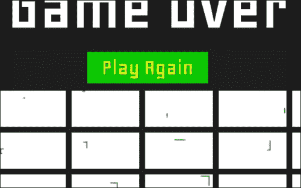
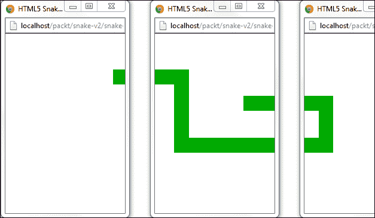
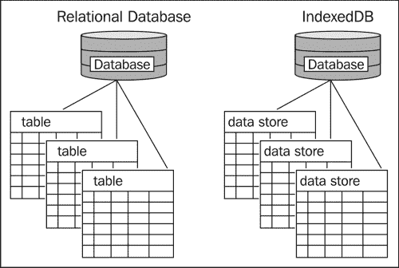
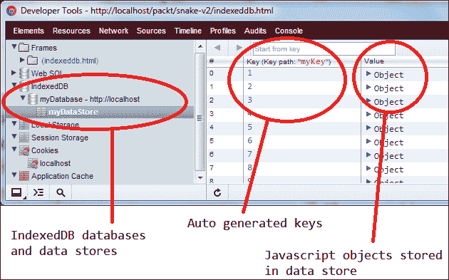

# 第五章：改进贪吃蛇游戏

本章是我们构建更健壮的贪吃蛇游戏系列的第二部分，也是最后一部分。在本章中，我们将继续使用第三章中已有的内容，*理解 HTML5 的重要性*，并向其中添加更多的 HTML5 API，以使游戏更加丰富，提供更加引人入胜的用户体验。

游戏的第一个版本使用了五个 HTML5 概念，即 2D 画布渲染、离线应用程序缓存、Web Workers、类型化数组和 requestAnimationFrame。在这个版本中，我们将包括来自新 Web 存储 API 的两个功能，即本地存储和会话存储。我们还将研究 Web 存储的一部分，即 IndexedDB，以及包括跨域消息传递的 Web 消息传递功能。

本地存储和会话存储是两种机制，允许我们使用键值策略在用户的浏览器上保存数据。这类似于 cookie，其中每个值必须是一个字符串。这两种存储选项与 cookie 之间的区别首先是，cookie 始终通过 HTTP 请求发送回服务器。当我们希望存储更多数据时，这可能特别不希望发生，因为数据会在网络中传输，消耗额外的带宽，而我们无能为力。使用 HTML5 的 Web 存储，我们可以在本地保存更多数据，而这些数据永远不会离开用户的机器，尽管像 cookie 这样的 HTTP 组件会离开。

IndexedDB，也是 Web 存储的一部分，类似于本地和会话存储，数据以键值方式存储，但是与仅限于字符串的值不同，IndexedDB 更像是一个对象存储，我们可以存储整个 JavaScript 对象。当然，IndexedDB 远不止是一个简单的哈希映射，用于为我们保存对象。正如其名称所示，这个新的 API 允许我们对这些存储的对象进行索引，以便通过查询系统进行搜索。总之，IndexedDB 是一个通过异步编程接口访问的 NoSQL 数据库。

最后，Web 消息传递 API 提供了一个接口，通过该接口，HTML 文档可以与其他 HTML 上下文进行通信。这些文档可以通过 iframe 相关联，在单独的窗口中，甚至在不同的域中。

# 游戏

在游戏的第二个版本中添加了两个新功能。首先，我们现在可以跟踪玩家获得的最高分，并通过本地存储保存它。即使玩家关闭浏览器应用程序或关闭计算机，该值仍将安全地存储在玩家的硬盘上，并在游戏重新开始时加载。其次，我们使用会话存储在玩家在游戏中吃水果时以及玩家杀死蛇时保存游戏状态。这被用作额外的精彩之处，当玩家失败时，我们会显示玩家在游戏中实现的所有单独的升级，以及玩家撞墙或撞到蛇时的快照，如下图所示：



在每局游戏结束时，会显示玩家获得升级的瞬间图像，以及玩家最终死亡的快照。这些图像是通过 canvas API（调用`toDataURL`函数）创建的，并且组成每个图像的数据在整个游戏中都会被保存，并使用 Web 存储 API 进行存储。

有了这样一个功能，我们可以使游戏变得更加有趣，可能也更加社交化。想象一下，如果玩家不仅可以将他们的最高分发布到他们最喜欢的社交网络网站，还可以在关键时刻发布游戏的图片，那将会有多么强大。当然，这个功能的基础只是在本章中实现了（换句话说，我们只是在游戏的关键时刻拍摄了快照）。将实际功能添加到将这些数据发送到真正的社交网络应用程序中，留给读者作为练习。

# API 使用

游戏中使用的每个 API 的一般描述和演示在以下部分中给出。要了解每个功能是如何被整合到最终游戏中的，请查看代码部分。要获取此游戏的完整源代码，请查看 Packt Publishing 网站上的书页。

## Web 消息传递

Web 消息传递允许我们与其他 HTML 文档实例进行通信，即使它们不在同一个域中。例如，假设我们的贪吃蛇游戏托管在[`snake.fun-html5-games.com`](http://snake.fun-html5-games.com)，通过`iframe`嵌入到一个社交网站中（假设这个社交网站托管在[`www.awesome-html5-games.net`](http://www.awesome-html5-games.net)）。当玩家获得新的最高分时，我们希望将来自贪吃蛇游戏的数据直接发布到主页（加载游戏的`iframe`页面）。使用 Web 消息传递 API，这可以在本地完成，而无需任何服务器端脚本。

在 Web 消息传递之前，文档通常不允许与其他域中的文档通信，主要是因为安全性的原因。当然，如果我们盲目地接受来自任何应用程序的消息，Web 应用程序仍然可能容易受到恶意外部应用程序的攻击。然而，Web 消息传递 API 提供了一些可靠的安全措施来保护接收消息的页面。例如，我们可以指定消息要发送到的域，以便其他域无法拦截消息。在接收端，我们还可以检查消息的来源，从而忽略来自任何不受信任域的消息。最后，DOM 永远不会直接通过此 API 暴露，提供了另一层安全性。

### 如何使用它

与 Web Workers 类似，两个或多个 HTML 上下文之间通过 Web 消息传递 API 进行通信的方式是注册`on-message`事件的事件处理程序，并使用`postMessage`函数发送消息：

```js
// ---------------------------------
// Host document: web-messaging.html
// ---------------------------------
var doc = document.querySelector("iframe").contentWindow;
// alternatively:
// var doc = window.open("web-messaging-rec.html", "", "width=800,height=600");
// Post a message to the child document
doc.postMessage({msg: "Hello!"}, "http://localhost");
// --------------------------------------
// Child document: web-messaging-rec.html
// --------------------------------------
window.addEventListener("message", function(event) {
   var data = event.data;
   // Post a message back to the parent document
   event.source.postMessage({msg: "Thanks for saying " + data.msg}, "*");
});
```

使用 Web 消息传递 API 的第一步是获取要与之通信的某个文档的引用。这可以通过获取`iframe`引用的`contentWindow`属性，或者打开一个新窗口并保留该引用来完成。持有此引用的文档称为父文档，因为这是通信发起的地方。尽管子窗口可以与其父窗口通信，但这只能在这种关系成立的情况下发生。换句话说，窗口不能与任何窗口通信；它需要一个引用，无论是通过父子关系还是通过子父关系。

一旦引用了子窗口，父窗口就可以通过`postMessage`函数向其子窗口发送消息。当然，如果子窗口没有定义回调函数来捕获和处理传入的消息，那么发送这些消息就没有什么意义。但是，父窗口无法知道子窗口是否定义了回调函数来处理传入的消息，所以我们能做的最好的事情就是假设（并希望）子窗口已经准备好接收我们的消息。

`postMessage`函数中使用的参数与 Web Workers 中使用的版本非常相似。也就是说，可以发送任何 JavaScript 值（数字、字符串、布尔值、对象文字和数组，包括类型化数组）。如果将函数作为`postMessage`的第一个参数发送（直接发送或作为对象的一部分），浏览器将引发`DATA_CLONE_ERR: DOM Exception 25`错误。第二个参数是一个字符串，表示我们允许消息被接收的域。这可以是绝对域，一个斜杠（表示与发送消息的文档相同的源域），或一个通配符字符（*），表示任何域。如果消息被不匹配`postMessage`中的第二个参数的域接收，整个消息将失败。

在接收消息时，子窗口首先在消息事件上注册一个回调。这个函数传递了一个`MessageEvent`对象，其中包含以下属性：

+   `event.data`：它返回消息的数据

+   `event.origin`：它返回消息的来源，用于服务器发送的事件和跨文档消息

+   `event.lastEventId`：它返回最后一个事件 ID 字符串，用于服务器发送的事件

+   `event.sourceReturns`：它是源窗口的 WindowProxy，用于跨文档消息

+   `event.portsReturns`：这是与消息一起发送的 MessagePort 数组，用于跨文档消息和通道消息

### 注意

来源：[`www.w3.org/TR/webmessaging/#messageevent`](http://www.w3.org/TR/webmessaging/#messageevent)

举个例子，我们可以在现实世界中使用这个功能，就游戏开发而言，想象一下能够玩我们的贪吃蛇游戏，但蛇可以穿过几个窗口。多有创意啊！当然，从实际角度来看，这可能不是玩游戏的最佳方式，但我很难反驳这样的事实，即这确实是对一个普通游戏非常独特和引人入胜的呈现。



借助 Web 消息传递 API 的帮助，我们可以设置一个贪吃蛇，其中贪吃蛇不受限于单个窗口。想象一下，当我们将这个巧妙的 API 与另一个非常强大的 HTML5 功能结合起来时，这个功能非常适合游戏 - Web 套接字。通过将 Web 消息传递与 Web 套接字结合起来，我们不仅可以在多个窗口中玩贪吃蛇，还可以同时与多个玩家玩游戏。也许每个玩家在蛇进入给定窗口时都可以控制蛇，并且所有玩家可以同时看到所有窗口，即使他们每个人都在使用不同的计算机。这些可能性是无穷无尽的。

令人惊讶的是，用于设置贪吃蛇的多窗口端口的代码非常简单。基本设置是相同的，我们有一个一次只能朝一个方向移动的蛇。我们还有一个或多个蛇可以移动的窗口。如果我们将每个窗口存储在一个数组中，我们可以计算蛇需要呈现在哪个屏幕上，给定其当前位置。找出蛇应该呈现在哪个屏幕上，给定其世界位置，是最棘手的部分。

例如，假设每个窗口宽度为 200 像素。现在，假设有三个打开的窗口。每个窗口的画布也只有 200 像素宽，所以当蛇在位置 350 时，在所有画布中都会打印得太靠右。所以我们首先需要确定总世界宽度（画布宽度乘以画布的总数），计算蛇所在的窗口（位置/画布宽度），然后将位置从世界空间转换到画布空间，给定蛇所在的画布。

首先，在父文档中定义我们的结构。代码如下：

```js
// 1\. Create an array to hold each frame (aka. window)
var frames = new Array();
// 2\. Let's keep track of some settings for these frames
frames.max = 3;
frames.width = 200;
frames.height = 300;
frames.margin = 50;
// 3\. Finally, we'll need a snake to move around
var snake = {
  max: 3,
  pos: {
    x: 0,
    y: 0
  },
  w: 25,
  h: 25,
  speed: 3,
  dir: {
    x: 1,
    y: 0
  },
  color: "#0a0"
};
```

当此脚本加载时，我们需要一种方法来创建新窗口，蛇将能够在其中移动。这可以通过单击按钮轻松完成，然后将该窗口添加到我们的帧数组中，以便我们可以遍历该数组，并告诉每个窗口蛇在哪里。此代码如下所示：

```js
// Define a few global variables in order to keep the code shorter and simpler
var isPaused = true;
var timer;
var dirChange = 100;
var btn = document.createElement("button");
btn.textContent = "Add Window";
btn.addEventListener("click", function(event){
  var left = frames.length * frames.width + frames.margin * frames.length;
  frames[frames.length] = window.open("/packt/snake-v2/snake-panels.html", "",
    "width=" + frames.width + "," +
    "height=" + frames.height + "," +
    "top=100, left=" + left);
  isPaused = false;
  clearTimeout(timer);
  play();
}, false);
document.body.appendChild(btn);
// We'll close all the windows we have opened to save us the
// trouble of clicking each window when we want them closed
function closeAll() {
  for (var i = 0, len = frames.length; i < len; i++) {
    frames[i].close();
  }
}
window.onunload = closeAll;
```

现在，真正的魔法发生在以下方法中。我们要做的就是更新蛇的位置，然后告诉每个窗口蛇在哪里。这将通过将蛇的位置从世界坐标转换为画布坐标（因为每个画布的宽度都相同，这对于每个画布来说很容易），然后告诉每个窗口蛇应该在画布中的哪个位置呈现。由于该位置对每个窗口都有效，我们还单独告诉每个窗口是否应该呈现我们发送给它们的信息。只有我们计算出蛇在其中的窗口才会被告知继续呈现。

```js
function play() {
  // This is used to change the snake's position randomly
  // from time to time. The reason for this is so we don't
  // need to implement any event handling to handle user input,
  // since this is just a simple demonstration.
  if (dirChange-- < 0) {
    dirChange = 100;
    var rand = parseInt(Math.random() * 1000) % 4;
    // Make the snake move to the right
    if (rand == 0) {
      snake.dir.x = 1;
      snake.dir.y = 0;
    // Make the snake move to the left
    } else if (rand == 1) {
      snake.dir.x = -1;
      snake.dir.y = 0;
    // Make the snake move down
    } else if (rand == 2) {
      snake.dir.x = 0;
      snake.dir.y = 1;
      // Make the snake move up
    } else if (rand == 3) {
      snake.dir.x = 0;
      snake.dir.y = -1;
    }
  };
  // Update the snake's position, making sure to wrap the snake
  // around each window. If it goes too far to the right, and
  // wanders off one window, it needs to wrap to the left side
  // of the next window.
  snake.pos.x += snake.dir.x * snake.speed;
  snake.pos.x %= frames.width * frames.length;
  snake.pos.y += snake.speed * snake.dir.y;
  if (snake.pos.y < 0)
    snake.pos.y = frames.height - snake.h;
  if (snake.pos.y + snake.h > frames.height)
    snake.pos.y = 0;
  if (snake.pos.x < 0)
    snake.pos.x = (frames.width - snake.w) * frames.width * frames.length;
  var shouldDraw;
  for (var i = 0, len = frames.length; i < len; i++) {
    // Determine which window the snake is in, and tell only that
    // window that it needs to render the snake
    shouldDraw = snake.pos.x + snake.w <= frames.width * (i + 1) &&
        snake.pos.x >= frames.width * i ||
        snake.pos.x <= frames.width * (i + 1) &&
        snake.pos.x >= frames.width * i;
    // Lastly, we pass all this information to each window in canvas coordinates.
    frames[i].postMessage({
      x: snake.pos.x % frames.width,
      y: snake.pos.y,
      w: snake.w,
      h: snake.h,
      shouldDraw: shouldDraw,
      color: snake.color
    }, "*");
  }
}
```

就是这样。构成所有其他窗口的代码对于它们所有来说都是相同的。实际上，我们只打开了指向完全相同脚本的一堆窗口。就每个窗口而言，它们是唯一打开的窗口。它们所做的就是通过消息 API 接收一堆数据，然后在`shouldDraw`标志设置时呈现该数据。否则，它们只清除它们的画布，并静静地等待来自其父窗口的进一步指示。

```js
// 1\. Create a canvas
var canvas = document.createElement("canvas");
canvas.width = 400;
canvas.height = 300;
// 2\. Attach the canvas to the DOM
document.body.appendChild(canvas);
// 3\. Get a reference to the canvas' context
var ctx = canvas.getContext("2d");
// 4\. Set up the callback to receive messages from some parent window
function doOnMessage(event) {
  // 5\. For security, make sure we only process input from a trusted window
  if (event.origin == "http://localhost") {
    var data = event.data;
    ctx.clearRect(0, 0, canvas.width, canvas.height);
    // 6\. And here's where the magic happens for this window. If told to
    // draw something through the message received, go ahead and do so.
    if (data.shouldDraw) {
      ctx.fillStyle = data.color;
      ctx.fillRect(data.x, data.y, data.w, data.h);
    }
  }
}
window.addEventListener("message", doOnMessage, false);
```

## Web 存储

在 HTML5 出现之前，Web 开发人员在客户端上存储数据的唯一方法是通过 cookie。虽然范围有限，但 cookie 确实做到了它们的本意，尽管它们有一些限制。首先，每当将 cookie 保存到客户端时，此后的每个 HTTP 请求都会包含该 cookie 的数据。这意味着数据总是明确暴露，而且每个 HTTP 请求都会带有不属于其中的额外数据。在考虑可能需要存储相对大量数据的 Web 应用程序时，这种效率特别低下。

通过新的 Web 存储 API，这些问题已得到解决和满足。现在有三种不同的客户端存储选项，它们都解决了不同的问题。但请记住，客户端存储的所有数据仍然以纯文本形式暴露给客户端，因此并不适合作为安全存储解决方案。

这三种存储解决方案是会话存储、本地存储和 IndexedDB NoSQL 数据存储。会话存储允许我们存储键值数据对，这些数据对在浏览器关闭之前（换句话说，在会话结束之前）都会持续存在。本地存储在每个方面都类似于会话存储，只是数据持续存在的时间更长。

即使会话关闭，存储在本地存储中的数据仍然存在。只有当用户明确告诉浏览器这样做，或者应用程序本身从存储中删除数据时，本地存储中的数据才会被清除。最后，IndexedDB 是一个强大的数据存储，允许我们存储自定义对象（不包括包含函数的对象），然后查询数据库以获取这些对象。当然，强大性带来了复杂性。虽然在浏览器中内置了专用的 NoSQL 数据库听起来很激动人心，但不要被愚弄。虽然使用 IndexedDB 可以成为 HTML 世界的迷人补充，但对于初学者来说绝不是一项微不足道的任务。与本地存储和会话存储相比，IndexedDB 具有相当陡峭的学习曲线，因为它涉及掌握一些复杂的数据库概念。

### 注意

如前所述，本地存储和会话存储之间唯一的区别在于会话存储在浏览器关闭时会自动清除。除此之外，两者的所有内容都完全相同。因此，学习如何使用两者将是一个简单的经验，因为学习其中一个也意味着学习另一个。然而，在决定何时使用其中一个时可能需要您多花一些时间思考。为了获得最佳结果，请在决定使用哪种存储 API 之前专注于您自己应用程序的独特特性和需求。更重要的是，要意识到在同一个应用程序中同时使用这两种存储系统是完全合法的。关键是专注于一个独特的特性，并决定哪种存储 API 最适合这些特定需求。

本地存储和会话存储对象都是`Storage`类的实例。通过`storage`类定义的接口，我们可以与这些存储对象进行交互，其定义如下（来源：Web Storage W3C 候选推荐，2011 年 12 月 08 日，[`www.w3.org/TR/webstorage/`](http://www.w3.org/TR/webstorage/)）：

+   `getItem(key)`: 返回与给定键关联的当前值。如果给定键在与对象关联的列表中不存在，则该方法必须返回 null。

+   `setItem(key, value)`: 首先检查与对象关联的列表中是否已经存在具有给定键的键/值对。如果不存在，则必须向列表中添加一个新的键/值对，其中给定的键及其值设置为`value`。如果给定的键在列表中存在，则必须将其值更新为`value`。如果无法设置新值，则该方法必须抛出`QuotaExceededError`异常。（例如，如果用户已禁用了站点的存储，或者已超出配额，则设置可能会失败。）

+   `removeItem(key)`: 如果存在具有给定键的键/值对，则导致该键/值对从与对象关联的列表中被移除。如果不存在具有该键的项目，则该方法不执行任何操作。

+   `clear()`: 当与对象关联的列表中存在任何键/值对时，它会自动导致该列表被清空。如果没有任何键/值对，则该方法不执行任何操作。

+   `key(n)`: 返回列表中第 n 个键的名称。键的顺序由用户代理定义，但在对象内部必须保持一致，只要键的数量不变。（因此，添加或删除键可能会改变键的顺序，但仅更改现有键的值不得改变。）如果 n 大于或等于对象中键/值对的数量，则该方法必须返回 null。Storage 对象上支持的属性名称是与对象关联的列表中当前存在的每个键/值对的键。

+   `length`: 返回与对象关联的列表中当前存在的键/值对的数量。

## 本地存储

本地存储机制通过全局对象的属性访问，浏览器上是`window`对象。因此，我们可以通过`window.localStorage`显式访问存储属性，也可以隐式地简单地使用`localStorage`。

`window.localStorage.clear();`

`localStorage.length == 0; // True`

由于 localStorage 只允许存储 DOMString 值，因此除字符串之外的任何其他值在存储到 localStorage 之前都会被转换为字符串。也就是说，我们不能在`localStorage`中存储数组、对象、函数等。只允许存储普通的 JavaScript 字符串。

```js
var typedArray = new Uint32Array(100);
localStorage.setItem("my-array", typedArray);
var myArray = localStorage.getItem("my-array");
myArray == "[object Uint32Array]"; // True
```

现在，虽然这可能看起来像是存储 API 的限制，但实际上这是有意设计的。如果您的目标是存储复杂数据类型以供以后使用，localStorage 并不一定是为解决这个问题而设计的。在这种情况下，我们有一个更强大和方便的存储解决方案，我们很快就会看到（即 IndexedDB）。然而，有一种方法可以在 localStorage 中存储复杂数据（包括数组、类型化数组、对象等）。

关键在于美妙的`JSON`数据格式。现代浏览器在全局范围内有非常方便的`JSON`对象，我们可以访问两个重要的函数，即`JSON.stringify`和`JSON.parse`。使用这两种方法，我们可以序列化复杂数据，将其存储在`localStorage`中，然后从存储中反序列化检索到的数据，并继续在应用程序中使用它。

```js
// 1\. Define some class
var Person = function(name) {
  this.name = name;
};
// 2\. Add functions to the class
Person.prototype.greet = function(){
  return "Hello, " + this.name;
};
// 3\. Create an array of objects of that class
var people = new Array();
people.push(new Person("Rodrigo"));
people.push(new Person("Silveira"));
// 4\. Stringify the complex array, and store it away
var json = JSON.stringify(people);
localStorage.setItem("people", json);
// 5\. Retrieve that serialized data, and parse it back into what it was
people = JSON.parse(localStorage.getItem("people"));
people[0].name == "Rodrigo"; // True
people[0] instanceof Person; // False
people[0].greet(); // TypeError: Object has no method 'greet'
```

虽然这是一个不错的小技巧，但你会注意到可能存在一个主要限制：`JSON stringify`不会序列化函数。此外，如果你仔细观察 JSON.stringify 的工作方式，你会意识到类实例会失去所有的“身份”，只保留硬数据。换句话说，当我们序列化和反序列化`Person`的实例后，结果将是一个简单的对象文字，没有构造函数或原型信息。尽管 localStorage 从未打算填补对象持久性的角色（而是简单的键值字符串对），但这应该被视为一个有限但非常巧妙的技巧。

## 会话存储

由于 sessionStorage 接口与 localStorage 的接口相同，因此没有理由重复刚才描述的所有信息。有关 sessionStorage 的更深入讨论，请查看前两节，并将“local”替换为“session”。上面提到的适用于本地存储的所有内容也适用于会话存储。再次强调，两者之间唯一的区别是在与客户端结束会话时（即，每当浏览器关闭时）擦除`sessionStorage`上保存的任何数据。

下面将展示如何使用 sessionStorage 的一些示例。在示例中，我们将尝试在 sessionStorage 中存储一个值，如果该值尚不存在。请记住，当我们将键值对设置为存储时，如果该键已经存在于存储中，那么与该键关联的任何值都将被覆盖。如果键不存在，它将自动创建。

```js
var name = sessionStorage.getItem("coolestPerson");
// Only set a new value if the key exists,
// and the value is not what we want
if (name != null && name != "Rodrigo") {
  sessionStorage.setItem("coolestPerson", "Rodrigo");
}
```

请注意，我们还可以使用`in`运算符查询 sessionStorage 对象的特定键，该运算符返回如下所示的布尔值：

```js
if ("coolestPerson" in sessionStorage) {
   // …
}
```

最后，尽管我们可以通过`sessionStorage.length`检查存储中的键的总数，但如果我们不知道所有不同的键是什么，那本身可能并不是非常有用。幸运的是，`sessionStorage.key`函数允许我们获取特定的键，通过它我们可以获得与该键存储的值。

```js
sessionStorage.clear();
sessionStorage.length == 0; // True
sessionStorage.setItem("name", "Rodrigo");
sessionStorage.setItem("book", "Learn HTML5");
sessionStorage.setItem("publisher", "Packt Pub");
sessionStorage.setItem("isColor", true);
sessionStorage.setItem("rating", 5);
var values = new Array();
for (var i = 0, len = sessionStorage.length; i < len; i++) {
   var key = sessionStorage.key(i);
   var value = sessionStorage.getItem(key);
   values.push({key: key, value: value});
}
values.length == sessionStorage.length; // True
values[0].key == "book"; // True*
values[0].value == "Learn HTML5"; // True*
```

因此，我们可以查询`sessionStorage`中给定位置的键，并接收表示该键的字符串键。然后，使用该键，我们可以获得存储在该键下的值。然而，请注意，`sessionStorage`对象中存储项的顺序是完全任意的。虽然一些浏览器可能会按键值按字母顺序对存储的项目列表进行排序，但这在 HTML5 规范中明确规定为留给浏览器制造商决定的决定。

# IndexedDB

尽管到目前为止 Web 存储 API 可能看起来很令人兴奋，但在某些情况下，我们的需求可能是序列化和反序列化数据，使用本地或会话存储可能不够。例如，想象一下，我们在本地存储中存储了几百（或者，几千）个类似的记录（比如我们正在存储 RPG 游戏中的敌人描述卡）。考虑如何使用本地存储来完成以下操作：

+   按字母顺序检索存储的前五条记录

+   删除所有存储的记录，这些记录包含特定特征（例如，不能在水中生存的敌人）

+   检索存储的最多三条记录，这些记录包含特定特征（例如，敌人的生命值得分为 42,000 或更高）

重点是：我们可能想要对本地存储或会话存储中存储的数据进行任何查询，都必须由我们自己的代码处理。换句话说，我们将花费大量时间和精力编写代码，只是为了帮助我们获取一些数据。更不用说本地或会话存储中存储的任何复杂数据都会被转换为文字对象，而曾经属于这些对象的任何和所有函数现在都消失了，除非我们编写更多的代码来处理某种自定义的反序列化。

如果你现在还没有猜到，IndexedDB 非常漂亮地解决了这些问题和其他问题。在其核心，IndexedDB 是一个 NoSQL 数据库引擎，允许我们存储整个对象并对其进行索引，以实现快速插入、删除和检索。数据库系统还为我们提供了强大的查询引擎，这样我们就可以对已持久化的数据执行非常高级的计算。

下图显示了 IndexedDB 和传统关系数据库之间的一些相似之处。在关系数据库中，数据存储为特定表结构内的一组行。而在 IndexedDB 中，数据则是分组存储在被称为数据存储的广义定义的桶中。



IndexedDB 的架构在某种程度上类似于当今大多数 Web 开发项目中使用的流行关系数据库系统。一个核心区别是，关系数据库存储数据在数据库中，这是一组相关表的集合，而 IndexedDB 系统将数据分组存储在数据库中，这是一组数据存储的集合。虽然在概念上相似，但在实践中，这两种架构实际上是非常不同的。

### 注意

如果你来自关系数据库背景，并且数据库、表、列和行的概念对你来说是有意义的，那么你已经在成为 IndexedDB 专家的路上了。正如你将看到的，这两种系统和方法之间有一些重要的区别。虽然你可能会倾向于简单地用数据存储替换表这个词，但要知道这两个概念之间的差异不仅仅是名称上的区别。

数据存储的一个关键特性是它们没有与之关联的特定模式。在关系数据库中，表由其非常特定的结构定义。每个列在表首次创建时就被指定。然后，在这样的表中保存的每条记录都遵循完全相同的格式。在 NoSQL 数据库（其中 IndexedDB 是一种类型）中，数据存储可以保存任何对象，无论它们的格式是什么。基本上，这个概念与在关系数据库表中为每条记录定义不同的模式是相同的。

## IDBFactory

要开始使用 IndexedDB，我们首先需要创建一个数据库。这是通过 IDBFactory 的实现来完成的，在浏览器中，就是`window.indexedDB`对象。删除数据库也是通过 indexedDB 对象来完成的，我们很快就会看到。

为了打开一个数据库（或者如果它还不存在的话创建一个），我们只需调用`indexedDB.open`方法，传入数据库名称和版本号。如果没有提供版本号，将使用默认版本号 1，如下面的代码片段所示：

```js
var dbName = "myDatabase";
var dbVersion = 1;
var request = indexedDB.open(dbName, dbVersion);
```

正如你很快会注意到的，IndexedDB 中用于异步请求的每个方法（例如`indexedDB.open`）都会返回一个 IDBRequest 类型的请求对象，或者它的实现。一旦我们有了那个请求对象，我们就可以在其属性上设置回调函数，当与它们相关的各种事件被触发时，这些回调函数就会被执行，如下面的代码片段所示：

```js
var dbName = "myDatabase";
var dbVersion = 1;
var db = null;
var request = indexedDB.open(dbName, dbVersion);
request.onerror = function(event) {
   console.log("Error:", event);
};
request.onsuccess = function(event) {
   db = event.target.result;
};
```

## IDBOpenDBRequest

正如在前一节中提到的，一旦我们对 IndexedDB API 进行了异步请求，立即返回的对象将是 IDBRequest 类型。在打开请求的特定情况下，返回给我们的对象是 IDBOpenDBRequest 类型。我们可能想要在这个对象上监听的两个事件在前面的代码片段中已经显示出来了（`onerror`和`onsuccess`）。还有一个非常重要的事件，我们可以在这个事件中创建一个对象存储，这是这个存储系统的基础。这个事件是`onupgradeneeded`（即需要升级）事件。当数据库首次创建时，以及当打开数据库时使用的版本号高于上次打开数据库时使用的版本号时，这个事件将被触发，如下面的代码所示：

```js
var dbName = "myDatabase";
var dbVersion = 1;
var db = null;
var store = null;
var request = indexedDB.open(dbName, dbVersion);
request.onupgradeneeded = function(event) {
   db = event.target.result;
   store = db.createObjectStore("myDataStore", {keyPath: "myKey"});
};
```

在数据库对象上进行的`createObjectStore`调用需要两个参数。第一个是表示对象存储名称的字符串。这个存储可以被认为是在关系数据库世界中的一个表。当然，我们不是将记录插入到表中的列中，而是将整个对象插入到数据存储中。第二个参数是定义数据存储属性的对象。这个对象必须定义的一个重要属性是`keyPath`对象，它使我们存储的每个对象都是唯一的。分配给这个属性的值可以是我们选择的任何东西。

现在，我们在这个数据存储中持久化的任何对象都必须具有与分配给`keyPath`相同的名称的属性。在这个例子中，我们的对象将需要一个`myKey`属性。如果持久化了一个新对象，它将根据这个属性的值进行索引。

存储的任何额外对象，如果具有相同的`myKey`值，将替换具有相同键的任何旧对象。因此，每次我们想要持久化一个唯一对象时，我们必须为这个对象提供一个唯一值。

或者，我们可以让浏览器为我们提供这个键的唯一值。同样地，将这个概念与关系数据库进行比较，我们可以将`keyPath`对象看作是特定元素的唯一 ID。就像大多数关系数据库系统都支持某种自动增量一样，IndexedDB 也是如此。为了指定我们想要自动增加的值，我们只需在数据存储首次创建（或升级）时将该标志添加到对象存储属性对象中，如下面的代码片段所示：

```js
request.onupgradeneeded = function(event) {
  var settings = {
    keyPath: "myKey",
    autoIncrement: true
  };
  db = event.target.result;
  store = db.createObjectStore("myDataStore", settings);
};
```

现在，我们可以持久化一个对象，而无需为属性`myKey`提供唯一值。事实上，我们甚至不需要在存储在这里的任何对象中提供这个属性。IndexedDB 会为我们处理这个问题。看一下下面的图表：



使用谷歌 Chrome 的开发者工具，我们可以看到我们为我们的域创建的所有数据库和数据存储。请注意，主对象键，即我们在创建数据存储时给它的任何名称，都具有 IndexedDB 生成的值，正如我们所指定的，这些值是相对于上一个值递增的。

有了这个简单但冗长的样板代码，我们现在可以开始使用我们的数据库和数据存储了。从这一点开始，我们对数据库所采取的操作将在通过创建它们的数据库对象上访问的个别数据存储对象上进行。

## IDBTransaction

在处理 IndexDB 时，我们需要记住的最后一件一般的事情是，我们与数据存储的每一次交互都是在事务内完成的。如果在事务过程中出现问题，整个事务将被回滚，没有任何效果。同样地，如果事务成功，IndexedDB 将自动为我们提交事务，这是一个非常方便的奖励。

要使用事务，我们需要获取对数据库的引用，然后请求特定数据存储的事务。一旦我们获得了对数据存储的引用，我们就可以执行与数据存储相关的各种功能，例如将数据放入其中，从中读取数据，更新数据，最后从数据存储中删除数据。

```js
var TodoItem = function(task) {
  this.task = task;
  this.completed = false;
};
try {
  var trans = db.transaction(storeName, "readwrite");
  var store = trans.objectStore(storeName);
  var task1 = new TodoItem("Buy more pizza");
  var task2 = new TodoItem("Finish writing the book");
  var task3 = new TodoItem("Shave before going to work");
  var request = store.put(task1);
  // We can reuse this request object to store multiple objects
  request = store.put(task2);
  request = store.put(task3);
  request.onsuccess = function(e) {
    log("Success!" + value.key);
  };
  request.onerror = function(e) {
    log(e.stack);
  };
} catch (e) {
   log(e.stack);
}
```

要将项目存储到我们的数据存储中，我们需要遵循几个步骤。请注意，如果在此事务期间发生任何错误，我们只需捕获浏览器抛出的任何错误，并且由于 try/catch 块的存在，执行将继续不受中断。

在 IndexedDB 中持久化对象的第一步是启动一个事务。这是通过从我们之前打开的数据库中请求一个事务对象来完成的。事务始终与特定的数据存储相关联。此外，在请求事务时，我们可以指定要启动的事务类型。IndexedDB 中可能的事务类型如下：

### 读写

这种事务模式允许将对象存储到数据存储中，从中检索，更新和删除。换句话说，readwrite 模式允许进行完整的 CRUD 功能。

### 只读

这种事务模式类似于 readwrite，但明确限制了与数据存储的交互仅限于读取。不允许修改数据存储的任何内容，因此任何尝试创建新记录（换句话说，将新对象持久化到数据存储中），更新现有对象（换句话说，尝试保存已经在数据存储中的对象）或从数据存储中删除对象都将导致事务失败，并引发异常。

### versionchange

这种事务模式允许我们创建或修改数据存储中使用的对象存储或索引。在这种模式的事务中，我们可以执行任何操作或操作，包括修改数据库的结构。

## 获取元素

如果我们无法在以后的某个时间点检索数据，那么简单地将数据存储到黑匣子中是毫无用处的。使用 IndexedDB，可以通过几种不同的方式来实现这一点。更常见的是，我们持久化数据的数据存储设置了一个或多个索引，这些索引通过特定字段对对象进行组织。对于习惯于关系数据库的人来说，这类似于对特定表列进行索引/应用键。如果我们想要获取一个对象，我们可以通过其唯一 ID 进行查询，或者我们可以搜索符合特定特征的对象的数据存储，这可以通过该对象的索引值来实现。

要在数据存储上创建索引，我们必须在创建数据存储时指定我们的意图（在首次创建存储时的`onupgradeneeded`回调内，或者在事务模式`versionchange`内）。代码如下：

```js
request.onupgradeneeded = function(event) {
  var settings = {
    keyPath: "myKey",
    autoIncrement: true
  };
  db = event.target.result;
  store = db.createObjectStore("myDataStore", settings);
  var indexSettings = {
    unique: true
  };
  store.createIndex("taskIndex", "task", indexSettings);
};
```

在上面的示例中，我们为对象的 task 属性创建了一个索引。这个索引的名称可以是任何我们想要的，通常与它适用的对象属性的名称相同。在我们的例子中，我们只是将其命名为 taskIndex。我们可以配置的可能设置如下：

+   unique - 如果为 true，则存储具有相同属性的重复值的对象将被拒绝

+   multiEntry - 如果为 true，并且索引属性是一个数组，则每个元素都将被索引

### 注意

请注意，可以为数据存储创建零个或多个索引。与任何其他数据库系统一样，对数据库/数据存储进行索引可以真正提高存储容器的性能。但是，仅仅为了提供乐趣而添加索引并不是一个好主意，因为数据存储的大小会相应增长。一个良好的数据存储设计是考虑到数据存储与应用程序的特定上下文，并且每个索引字段都经过仔细考虑。在设计数据存储时要牢记的短语是：量一次，切一次。

尽管任何对象都可以保存在数据存储中（与关系数据库相反，在关系数据库中，存储的数据必须严格遵循表结构，由表的模式定义），为了优化应用程序的性能，尝试构建数据存储时要考虑存储的数据。任何数据都可以储存在任何数据存储中，但明智的开发人员在将数据提交到数据库之前会非常谨慎地考虑存储的数据。

一旦数据存储设置好，并且至少有一个有意义的索引，我们就可以开始从数据存储中提取数据。从数据存储中检索对象的最简单方法是使用索引，并查询特定对象，如下面的代码所示：

```js
var TodoItem = function(task) {
  this.task = task;
  this.completed = false;
};
function getTask(taskName, callback) {
  // 1\. Open a transaction. Since we don't need to write anything to
  // the data store, a simple readonly transaction will sufice.
  var trans = db.transaction(storeName, "readonly");
  var store = trans.objectStore(storeName);
  // 2\. specify an index to use, and the data to get from it
  var req = store.index("taskIndex").get(taskName);
  req.onsuccess = function(e) {
    var todoItem = e.target.result;
    // todoItem.task => "Buy more pizza"
    // todoItem.completed => false
    callback(todoItem);
  };
  req.onerror = function(e) {
    // Handle error
  };
};
// Search for a TodoItem object with a task property of "Buy more pizza"
getTask("Buy more pizza", function(taskItem) {
  console.log("TaskItem object: " + taskItem.task);
});
```

上述函数尝试从我们的数据存储中检索单个保存的对象。搜索是针对具有与函数提供的任务名称匹配的任务属性的对象进行的。如果找到一个，它将从数据存储中检索出来，并通过传递给回调函数的事件对象传递给存储对象的请求。如果在过程中发生错误（例如，如果提供的索引不存在），则会触发`onerror`事件。最后，如果数据存储中没有对象与搜索条件匹配，通过请求参数对象传递的结果属性将为 null。

现在，要搜索多个项目，我们可以采用类似的方法，但是我们请求一个`IndexedDBCursor`对象。游标基本上是指向零个或多个对象结果集中特定结果的指针。我们可以使用游标遍历结果集中的每个对象，直到当前游标指向没有对象（null），表示结果集中没有更多对象了。

```js
var TodoItem = function(task) {
  this.task = task;
  this.completed = false;
};
function getTask(taskName, callback) {
  // 1\. Open a transaction. Since we don't need to write anything to
  // the data store, a simple readonly transaction will sufice.
  var trans = db.transaction(storeName, "readonly");
  var store = trans.objectStore(storeName);
  // 2\. specify the range in the data store to request data from
  var keyRange = IDBKeyRange.lowerBound(0);
  var req = store.openCursor(keyRange);
  req.onsuccess = function(e) {
    // cursor IDBCursorWithValue
    //   key : int
    //   primaryKey : int
    //   source : IDBObjectStore
    //   value : Object
    //
    var cursor = e.target.result;
    // Before we continue, we need to make sure that we
    // haven't hit the end of the result set
    if (!cursor) {
      callback();
    }
    // If there are still results, let's process them
    //    cursor.value === todoItem
    //    cursor.value.task => "Buy more pizza"
    //    cursor.value.completed => false
    // Since results are plain, typeless object literals, we need to rebuild
    // each object from scratch.
    var todoItem = new TodoItem(cursor.value.task);
    todoItem.myKey = cursor.value.myKey;
    todoItem.completed = cursor.value.completed;
    todoItems.push(todoItem);
     // Tell the cursor to fetch the next result
      cursor.continue();
  };
  req.onerror = function(e) {
    // Handle error
  };
};
// Retrieve every TodoItem in the data store
var todoItems = new Array();
getTask("Buy more pizza", function() {
  for (var i = 0; i < todoItems.length; i++) {
    console.log("TaskItem object: " + todoItems[i].task);
  }
})
```

您会注意到上面的代码片段中有一些事情。首先，进入我们的 IndexedDB 数据存储的任何对象都被剥去了其 DNA，而只是存储了一个简单的哈希值。因此，如果我们从数据存储中检索到的每个对象的原型信息对应用程序很重要，我们将需要手动从我们从数据存储中获取的数据中重建每个对象。

其次，观察到我们可以过滤数据存储的子集，我们想从中取出。这是通过一个 IndexedDB Key Range 对象来实现的，它指定了从哪里开始获取数据的偏移量。在我们的情况下，我们指定了一个下限为零，意味着我们想要的最低主键值是零。换句话说，这个特定的查询请求数据存储中的所有记录。

最后，记住请求的结果不是单个结果或结果数组。相反，所有结果都以游标的形式一个接一个地返回。我们可以一起检查游标的存在，然后如果确实存在游标，就使用游标。然后，我们请求下一个游标的方式是在游标本身上调用`continue()`函数。

另一种思考游标的方式是想象一个电子表格应用程序。假设我们从请求中返回的 10 个对象中的每个对象都代表电子表格中的一行。因此，IndexedDB 将把这 10 个对象都取到内存中，并通过`event.target.result`属性在`onsuccess`回调中发送指向第一个结果的指针。通过调用`cursor.continue()`，我们只是告诉 IndexedDB 现在给我们一个指向结果集中下一个对象的引用（换句话说，我们要求电子表格中的下一行）。这将一直持续到第十个对象，之后结果集中就不再存在对象了（再次配合电子表格的比喻，在我们获取了最后一行之后，下一行就是 null-它不存在）。因此，数据存储将调用`onsuccess`回调，并传入一个 null 对象。如果我们尝试读取这个空引用中的属性，就好像我们正在处理从游标返回的真实对象一样，浏览器将抛出一个空指针异常。

与其尝试一次从游标重建一个对象的属性，我们可以以通用形式将此功能抽象化。由于被持久化到对象存储中的对象不能有任何函数，我们不允许在对象本身内部保留这样的功能。然而，由于 JavaScript 能够从对构造函数的引用构建对象，我们可以创建一个非常通用的对象构建函数，如下所示：

```js
var TodoItem = function(task) {
  this.task = task;
  this.completed = false;
  this.toHTML = function() {
    var el = document.createElement("li");
    el.textContent = this.task;
    if (this.completed) {
      el.style.textDecoration = "line-through";
    }
    return el;
  };
};
function inflatObject(class, object) {
  // 1\. Create an instance of whatever class we reference
  var obj = new class();
  // 2\. Copy every property from the object returned by the cursor
  // into the newly created object
  for (var property in object) {
    obj[property] = object[property];
  }
  // 3\. Return the inflated object
  return obj;
}
// …
var req = store.openCursor(keyRange);
req.onsuccess = function(e) {
  var cursor = e.target.result;
  // Before we continue, we need to make sure that we
  // haven't hit the end of the result set
  if (!cursor) {
    callback();
  }
  var todoItem = inflatObject(TodoItem, cursor.value);
  // We could even call methods on the new inflated object
  var itemElement = todoItem.toHTML();
  document.body.appendChild(itemElement);
  todoItem.myKey == cursor.myKey; // True
  todoItem.task == cursor.task; // True
  todoItem.completed == cursor.completed; // True
  todoItems.push(todoItem);
  // Tell the cursor to fetch the next result
  cursor.continue();
};
```

## 删除元素

要从数据存储中删除特定元素，与检索数据涉及的原则相同。实际上，整个过程看起来与检索数据非常相似，只是我们在对象存储对象上调用删除函数。不用说，此操作中使用的事务必须是 readwrite，因为 readonly 会限制对象，使其无法进行任何更改（包括删除）。

删除对象的第一种方法是将对象的主键传递给`delete`函数。如下所示：

```js
function deleteTask(taskId, callback) {
  // 1\. Open a transaction. Since we definitely need to change the object
  // in the data store, we need proper access and benefits
  var trans = db.transaction(storeName, "readwrite");
  var store = trans.objectStore(storeName);
  // 2\. specify an index to use, and the data to get from it
  var req = store.delete(taskId);
  req.onsuccess = function(e) {
    // Do something, then call callback
  };
  req.onerror = function(e) {
    // Handle error
  };
};
```

这种第一种方法的困难在于我们需要知道对象的 ID。在某些情况下，这将涉及到先前的事务请求，我们将根据一些更容易获得的数据检索对象。例如，如果我们想要删除所有属性设置为 true 的任务，我们首先需要查询数据存储以获取这些对象，然后使用每个结果关联的 ID，并在删除对象的事务中使用这些值。

从数据存储中删除数据的第二种方法是简单地在对象存储对象上调用`clear()`。同样，事务必须设置为 readwrite。这将消除数据存储中的每一个对象，即使它们都是不同类型的，如下面的代码片段所示：

```js
var trans = db.transaction(storeName, "readwrite");
var store = trans.objectStore(storeName);
var req = store.clear();
req.onsuccess = function(e) {
  // Do something, then call callback
};
req.onerror = function(e) {
  // Handle error
};
```

最后，我们可以使用游标删除多条记录。这类似于我们检索对象的方式。当我们使用游标遍历结果集时，我们可以简单地删除游标当前所在位置的对象。在删除时，游标对象的引用被设置为 null，如下面的代码片段所示：

```js
  // 1\. Be sure to set the transaction to readwrite. Else, there will be a nice
  // exception raised if we try to delete readonly data.
  var trans = db.transaction(storeName, "readwrite");
  var store = trans.objectStore(storeName);
  // 2\. specify the range in the data store to request data from
  var keyRange = IDBKeyRange.lowerBound(0);
  var req = store.openCursor(keyRange);
  req.onsuccess = function(e) {
    var cursor = e.target.result;
    // Before we continue, we need to make sure that we
    // haven't hit the end of the result set
    if (!cursor) {
      callback();
    }
    // Here, we could have accessed the object's primary ID through
    // the cursor object in cursor.value.myKey. However, accessing
    // cursor.primaryKey maps to the specific property name that holds
    // the value of the primary key.
    store.delete(cursor.primaryKey);
    // Tell the cursor to fetch the next result
    cursor.continue();
  };
```

这几乎与获取数据的过程相同。唯一的细节是我们绝对需要提供对象的键。键是存储在对象的`keyPath`属性中的值，可以是用户提供的，也可以是自动生成的。幸运的是，游标对象通过`cursor.primaryKey`属性返回至少两个对这个键的引用，以及通过对象自己的属性引用该值（在我们的情况下，我们选择将`keyPath`属性命名为`myKey`）。

# 代码

我们在游戏的第二个版本中添加的两个升级非常简单，但它们为游戏增添了很多价值。我们添加了一个持久化的最高分引擎，因此用户实际上可以跟踪他们的最新记录，并且可以保留过去的成功记录。我们还添加了一个非常巧妙的功能，每当玩家得分时，以及玩家最终死亡时，都会拍摄游戏板的快照。一旦玩家死亡，我们会显示在游戏中收集到的所有快照，允许玩家保存这些图像，并可能与他或她的朋友分享。

## 保存最高分

你可能注意到这个游戏的上一个版本的第一件事是，我们有一个高分的占位符，但那个数字从未改变过。现在我们知道如何持久保存数据，我们可以非常容易地利用这一点，并通过各种游戏持久保存玩家的最高分。在更现实的情况下，我们可能会将最高分数据发送到后端服务器，在那里每次提供游戏时，我们可以跟踪整体最高分，并且每个玩游戏的用户都会知道这个全局分数。然而，在我们的情况下，高分仅限于浏览器，因为持久性 API（本地和会话存储，以及 IndexedDB）不会在其他浏览器之间共享数据，也不会本地到远程服务器。

由于我们希望高分即使在一个月后，当计算机已经多次关闭电源（当然还有浏览器）后，仍然存在于玩家的浏览器中，将这个高分数据存储在 sessionStorage 中是愚蠢的。我们可以将这个单个数字存储在 IndexedDB 或 localStorage 中。由于我们不关心与该分数相关的任何其他信息（例如获得分数的日期等），我们实际上只是存储了一个数字。因此，我认为 localStorage 是一个更好的选择，因为可以只用 5 行代码就可以完成。使用 IndexedDB 也可以，但就像用大炮打蚊子一样：

```js
function setHighScore(newScore, el) {
  var element = document.querySelector(el);
  // Multiply by 1 to cast the value from a string to a number
  var score = localStorage.getItem("high-score") * 1;
  // Check if there is a numerical score saved
  if (score && !isNaN(score)) {
    // Check if new score is higher than current high score
    if (newScore > element.textContent * 1) {
      localStorage.setItem("high-score", newScore);
      element.textContent = newScore;
    } else {
        element.textContent = score;
    }
  } else {
    localStorage.setItem("high-score", newScore);
    element.textContent = newScore;
  }
}
```

这个功能非常直接了当。我们传递给它的两个值是要设置为新高分的实际分数（这个值将被保存到 localStorage，并显示给用户），以及要显示该值的 HTML 元素。

首先，我们检索保存在键高分下的现有值，并将其转换为数字。我们可以使用函数`parseInt()`，但将字符串乘以数字会以稍微更快的执行速度执行相同的操作。

接下来，我们检查该值是否评估为真实的东西。换句话说，如果本地存储中没有保存高分值，那么变量分数将被评估为未定义乘以一，这不是一个数字。如果保存了与键高分相关的值，但该值不是可以转换为数字的东西（例如一串字母等），我们知道这不是一个有效的值。在这种情况下，我们将传入的分数设置为新的最高分。这将适用于当前持久值无效或不存在的情况（这将是游戏加载的第一次情况）。

接下来，一旦我们从本地存储中检索到有效的分数，我们就会检查新值是否高于旧的持久值。如果我们有更高的分数，我们就会持久保存该值，并在屏幕上显示它。如果新值不高于现有值，我们就不会持久保存任何东西，而是显示保存的值，因为那是当时的真正最高分。

## 拍摄游戏的屏幕截图

这个功能不像保存用户的最高分那么琐碎，但实施起来同样非常直接了当。因为我们不关心超过一个游戏之前捕获的快照，所以我们将使用`sessionStorage`实时保存玩家在游戏中的数据。

在幕后，我们所做的一切只是将游戏状态保存到`sessionStorage`中，然后在游戏结束时检索我们一直在保存的所有片段，并在不可见的画布中重建游戏。然后我们使用`canvas.toDataURL()`函数将该数据提取为图像。

```js
function saveEvent(event, snake, fruit) {
  var eventObj = sessionStorage.getItem(event);
  // If this is the first time the event is set, create its structure
  if (!eventObj)  {
    eventObj = {
      snake: new Array(),
      fruit: new Array()
    };
    eventObj.snake.push(snake);
    eventObj.fruit.push(fruit);
    eventObj = JSON.stringify(eventObj);
    sessionStorage.setItem(event, eventObj);
  } else {
    eventObj = JSON.parse(eventObj);
    eventObj.snake.push(snake);
    eventObj.fruit.push(fruit);
    eventObj = JSON.stringify(eventObj);
    sessionStorage.setItem(event, eventObj);
  }
  return JSON.parse(eventObj);
}
```

每当玩家吃掉水果时，我们调用这个函数，将`snake`（我们游戏中的主角）和`fruit`（游戏目标）对象的引用传递给它。我们所做的实际上非常简单：我们创建一个表示蛇和水果状态的数组，每次捕获事件时都会更新。数组中的每个元素都是一个字符串，表示序列化数组，跟踪水果的位置以及蛇的每个身体部分的位置。

首先，我们检查这个对象当前是否存在于`sessionStorage`中。在我们开始游戏的第一次，这个对象还不存在。因此，我们创建一个引用这两个对象的对象，即`snake`和`fruit`对象。接下来，我们对跟踪元素位置的缓冲区进行字符串化。每次添加新事件时，我们只需将其附加到这两个缓冲区中。

当然，如果用户关闭浏览器，那些数据将被浏览器自己擦除，因为这就是`sessionStorage`的工作原理。然而，我们可能不想保留上一局游戏的数据，所以我们还需要一种方法在每局游戏结束后清除我们自己的数据。

```js
function clearEvent(event) {
  return sessionStorage.removeItem(event);
}
```

足够简单。我们只需要知道我们用来保存每个元素的键的名称。对于我们的目的，我们简单地将蛇吃的快照称为`"eat"`，将蛇死亡的快照的缓冲区称为`"die"`。因此，在每局游戏开始之前，我们可以简单地使用这两个全局键值调用`clearEvent()`，缓存将在每次清除后重新清除。

接下来，每当发生事件时，我们只需调用我们定义的第一个函数，向其发送适当的数据，如下面的代码片段所示：

```js
if (fruit.isAt(head.x, head.y)) {
  // Save current game state
  saveEvent("eat", snake.getBody(), fruit.position);
  fruit.reset();
  snake.grow();
  score.up();
  // Save high score if needed
  setHighScore(document.querySelector("#scores h3:first-child span").textContent);
}
// …
if (!snake.isAlive()) {
  saveEvent("die", snake.getBody(), fruit.position);
}
```

最后，每当我们希望显示所有这些快照时，我们只需要创建一个与游戏中使用的画布具有相同尺寸的单独画布，并将缓冲区绘制到该画布上。我们需要一个单独的画布元素的原因是因为我们不希望在玩家可以看到的同一个画布上绘制。这样，生成这些快照的过程就更加流畅和自然。一旦每个状态被绘制，我们可以提取每个图像，调整大小，并按照下面的代码显示给用户：

```js
// Use each cached buffer to generate each screen shot
function getEventPictures(event, canvas) {
  // Take the buffer from session storage
  var obj = sessionStorage.getItem(event);
  // Create an array to hold the generated images
  var screenShots = new Array();
  if (!obj)
    return screenShots
  obj = JSON.parse(obj);
  var canvas = canvas.cloneNode();
  var renderer = new Renderer(canvas);
  // Go through each game state, and simply draw the data as though it
  // was being drawn for the actual game in action
  for (var i = 0, len = obj.snake.length; i < len; i++) {
    renderer.clear();
    renderer.draw(obj.snake[i], snake.getSkin());
    renderer.draw(obj.fruit[i], fruit.img);
    var screenShot = renderer.toImg();
    screenShots.push(screenShot);
  }
  return screenShots;
}
// Display a list of images to the user
function drawScreenShots(imgs) {
  var panel = document.querySelector("#screenShots");
  for (var i = 0, len = imgs.length; i < len; i++) {
    var a = document.createElement("a");
    a.target = "_blank";
    a.href = imgs[i].src;
    a.appendChild(imgs[i]);
    panel.appendChild(a);
  }
}
```

请注意，我们只是将表示蛇和水果的点绘制到画布上。画布中的所有其他点都被忽略，这意味着我们生成了一个透明的图像。如果我们想要图像有一个实际的背景颜色（即使只是白色），我们可以在绘制蛇和水果之前调用`fillRect()`覆盖整个画布表面，或者我们可以遍历渲染上下文中的`pixelData`数组中的每个像素，并将 alpha 通道设置为 100%不透明。即使我们手动为每个像素设置颜色，但没有设置 alpha 通道，我们会得到有颜色的像素，但是 100%透明。

# 总结

在本章中，我们在引人入胜的 2D 渲染世界中迈出了一些额外的步伐，使用了期待已久的画布 API。我们利用了画布导出图像的能力，使我们的游戏更具吸引力，可能也更具社交性。我们还通过在游戏之上添加持久层，使游戏更具吸引力和社交性，从而能够保存玩家的最高分。

HTML5 的另外两个强大功能，即 Web 消息传递和 IndexedDB，在本章中进行了探讨，尽管在游戏的这个版本中并没有使用这些功能。Web 消息传递 API 提供了一个机制，使两个或更多窗口可以通过消息传递直接进行通信。令人兴奋的是，这些窗口（或 HTML 上下文）不需要在同一个域中。尽管这可能听起来像一个安全问题，但有几个系统可以确保跨文档和跨域消息传递是安全和高效的。

Web 存储接口带来了三种不同的解决方案，用于客户端的长期数据持久性。这些是会话存储、本地存储和 IndexedDB。虽然 IndexedDB 是一个完整的、内置的、完全事务性和异步的 NoSQL 对象存储，但本地和会话存储为简单的需求提供了一个非常简单的键值对存储。这三种系统都比传统的基于 cookie 的数据存储引入了巨大的好处和收益，包括可以在浏览器中持久保存的数据总量更大，而且用户浏览器中保存的数据从未通过 HTTP 请求在服务器和客户端之间来回传输。

在下一章中，我们将讨论一些高级的 HTML5 主题，包括超越画布 2D 渲染上下文的下一步 - WebGL。虽然这些主题将被详细介绍，但随后添加的功能都不会被添加到游戏中。事实上，《第六章》《向您的游戏添加功能》，是本书中另一个罕见的游戏，它不是建立在一款有趣的 HTML5 游戏之上，因为我们一直在一起构建。我们将在《第七章》《HTML5 和移动游戏开发》中继续游戏开发项目，最后在移动空间射击游戏中结束本书。
