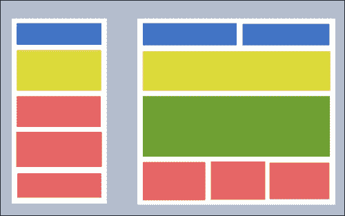
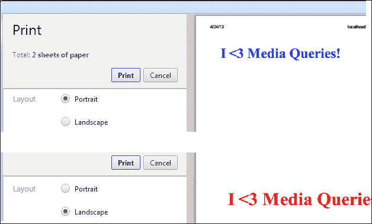
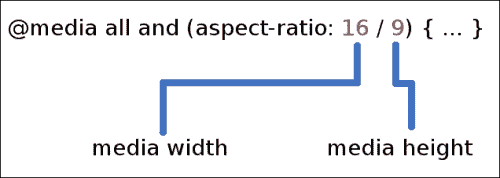
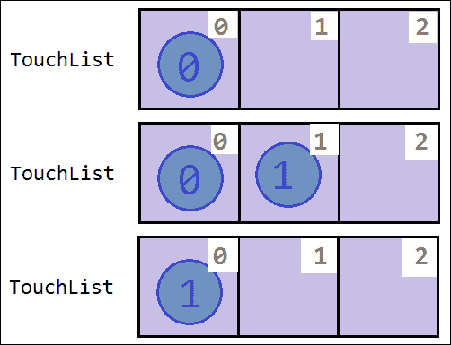
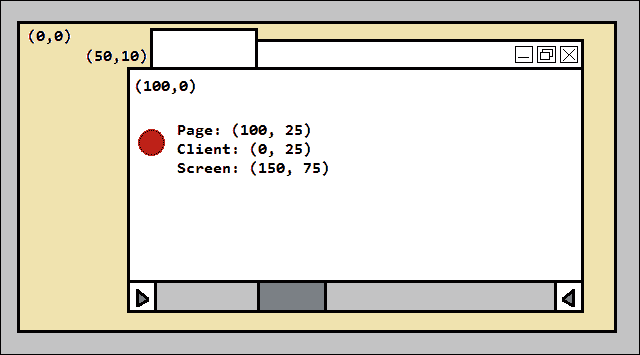
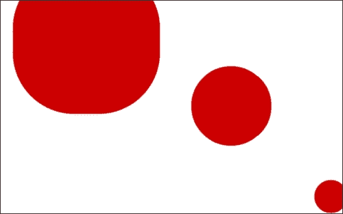
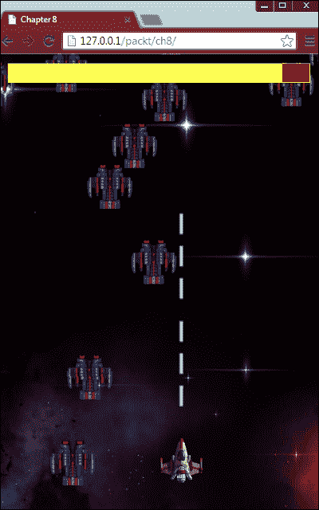
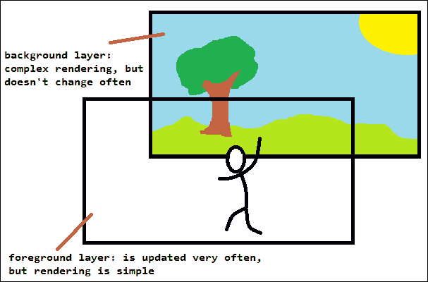
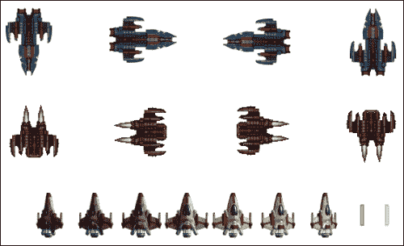

# 第七章：HTML5 和移动游戏开发

在本章中，我们将看一下不仅要为多个浏览器和平台开发，还要考虑多个设备的应用程序开发的非常重要的概念。过去，网页开发主要是关于支持多个浏览器。然后，它变成了利用最新技术并创建类似本机台式应用程序的应用程序。今天，我们不仅要记住那些允许我们使我们的应用程序尽可能多地面向人们的概念，还要记住标准台式电脑不是唯一访问我们的网络应用程序的设备。

在创建基于 HTML5 的游戏或应用程序时，我们必须能够设想我们的用户通过台式电脑、上网本、支持 HTML5 的视频游戏系统、智能手机、平板电脑、电视机，以及很快他们的智能手表、智能眼镜，可能还有智能烤面包机、鱼缸等等进行连接。不用说，除了它们的大小、形状和建议零售价格之外，这些设备之间有相当多的差异。

在我们开发本书中的最后一个游戏时，让我们来看看与 HTML5 移动游戏开发相关的一些最重要的概念。我们首先将看一下台式机和移动设备（特别是智能手机和平板电脑）之间的基本差异。本章讨论的两个与 HTML5 相关的 API 是媒体查询（它允许我们根据查看应用程序的设备的当前状态来调整 CSS 属性）和 JavaScript 触摸事件，以及它们对应的事件处理程序。最后，我们将结束本章，讨论如何开发和优化一款游戏，使其适用于台式浏览器和移动设备，只需一个代码库。

# 台式机与移动设备

乍一看，粗心的网页开发者可能会误以为，因为如今许多智能手机实际上比大多数五年级学生聪明得多，他们的花哨网页应用和游戏在移动设备上会运行得很好。不要被欺骗！虽然你的智能手机确实比你五年级时聪明（事实上，今天大多数不那么聪明的手机的计算能力比 NASA 在 1969 年用来将尼尔·阿姆斯特朗、迈克尔·柯林斯和爱德温·艾尔德林送上月球的硬件还要强大），但在许多情况下，它并不是大多数人上网和在线游戏的平均台式电脑的对手。

台式浏览器和移动浏览器之间存在一些重大差异。因此，我们需要考虑这些差异来开发我们的应用程序。毕竟，无论只有多少人仅仅使用移动设备或台式浏览器上网，我们没有理由将我们的覆盖范围限制在其中的任何一个群体。

移动友好开发的一个关键方面是，我们必须牢记的是，这并不总是适用于游戏，即一个人的移动策略通常在硬件限制和差异之外有固有的不同原因。例如，在移动设备上的使用情况与日记应用程序的台式机版本上的使用情况有很大不同。由于在小设备上打字更困难和慢，用户不太可能像在台式机上那样在手机应用程序上花几个小时输入日记条目，因为台式机上有全尺寸键盘可用。因此，整个移动体验必须考虑到不同的用户角色。

最后，由于移动设备的人机交互方式不同，应用程序的呈现必须考虑到这些特点。例如，在浏览网站时，大多数人会慷慨地在屏幕上移动鼠标指针，试图发现可以点击和可以交互的内容。每当悬停在一个动作元素上时，鼠标指针会发生变化（通常从箭头图标变为指向手指），提示用户可以通过点击该项来启动操作。然而，在移动设备上，这样的操作并不存在。因此，设计必须考虑到这一点，以免用户感到困惑、害怕，甚至犹豫使用您的游戏或应用程序。

本节的其余部分将介绍移动策略的一些主要实施考虑因素以及一些当前的最佳实践。这两个部分同样适用于移动游戏和移动应用程序（非游戏应用程序）。尽管不是很全面，但这些考虑因素和最佳实践清单应该足以让您朝着正确的方向思考，并指向一个成功的移动运营。

## 主要实施考虑因素

也许最明显的区别是移动设备与台式电脑的区别在于移动设备始终可以访问。一旦用户离开家，台式机可能要停放很多小时。另一方面，移动设备可以离用户的口袋很远。因此，用户随时可以拿出移动设备开始玩游戏或使用应用程序。

非常重要的是，始终可以访问的使用情况是，用户将在非常短的时间内玩游戏——在等待电梯时，在商店排队时，或者在第一次约会时试图消磨尴尬时刻。因此，您的游戏必须适应这些短暂、非常短暂的游戏时间，并且必须以一种方式来做到，玩家在每次 30 到 120 秒的游戏时间内仍然可以取得进展。

与移动设备的物理特性更相关的您的移动游戏的一些重要考虑因素包括其有限的屏幕尺寸，轻松改变屏幕方向的可能性，有限的计算能力（相对于台式电脑），有限的电池电量和浏览器差异（是的，在移动设备上这些问题还没有消失）。

### 屏幕尺寸和方向

台式电脑和移动设备之间最明显的区别是大小。尽管大多数现代设备可以模拟大屏幕分辨率，但物理屏幕尺寸仍然相当有限。而且，用户随时可以将设备旋转，期望应用程序能够做出响应。

在网页设计中，解决较小和不同屏幕尺寸问题的标准解决方案是一种称为响应式设计的技术。如今用于实现响应式设计的主要工具是新的 CSS 媒体查询 API（我们稍后在本章中讨论）。简而言之，这个 API 允许我们根据屏幕尺寸、比例和方向等因素加载不同的样式表或一组 CSS 规则。

例如，我们可以为屏幕宽度大于高度的情况定义一个 CSS 样式表（根据定义，这将使其成为横向视口），并设计第二个样式表，用于屏幕高度大于宽度的情况（使其成为纵向视图）。媒体查询将允许我们根据当前屏幕状态自动动态加载这两个样式表中的一个。也就是说，如果用户手动调整浏览器窗口大小，样式表将实时触发。

至于屏幕方向的变化，基于 DOM 的 Web 应用程序更容易，因为浏览器本身能够旋转一切，使其面向正确的方向。在基于画布的应用程序（无论是 2D 画布还是 WebGL）中，屏幕旋转也会旋转浏览器的坐标系统，但不会旋转画布的坐标系统。因此，如果你希望特定游戏在横向视图上水平播放，在纵向视图上垂直播放，你需要手动管理画布的坐标系统的旋转。

然而，最重要的是，当设计移动友好或游戏的移动版本时，屏幕尺寸将会显著较小。这意味着较少的元素可以塞进特定的视图中。需要呈现的信息较少，因为一次传达的信息较少。

解决这个问题的两种常见方法是开发一个应用程序，具有两个单独的呈现层（或两个单独的视图或模板），只为请求它的设备提供适当的视图（当模板访问应用程序时提供移动模板，当桌面浏览器请求应用程序时提供完整模板），以及开发一个单一应用程序，具有单一模板，但使该模板具有响应性，如前所述。较不受欢迎的选择是完全开发两个单独的应用程序，其中每个应用程序专注于特定的范例（移动和桌面）。

通常，移动模板是完整模板的缩小版本，其中并非一定显示所有元素，如下图所示：



### 计算能力

如前所述，今天的移动设备变得非常强大。更令人惊讶的是，它们的趋势是继续改进，将更多的计算能力塞进更小的物理空间。然而，即使是今天最好的智能手机也无法与平均性能的游戏 PC 相媲美。对于大多数 Web 应用程序来说，这种差异通常可以忽略，但对于更复杂的游戏来说绝对不能忽略。

移动设备在这方面与桌面计算机相比具有一个特定的劣势，即低端移动设备和普通移动设备之间的计算能力差距相当大，而低端桌面计算机和普通桌面计算机之间的差距则较小。因此，在考虑游戏用户的能力时，请记住大多数玩家将拥有非常有限的设备。

### 电池寿命

信不信由你，智能手机最常用的功能是，嗯，打电话和接电话。由于这样一个重要的功能是移动设备的主要用途，如果因为一个游戏耗尽了设备的电量而无法执行这样的任务，那将是相当悲剧的。因此，移动应用程序（包括游戏和移动 Web 应用程序）的一个非常重要的特征是它如何节约电力。

应用程序需要处理的数据越多，它所需的电力就越多。如果游戏大部分时间都在执行复杂的计算，它很可能会比人们希望的更快地耗尽设备的电量。你的移动游戏必须尽可能地节约电力，以便玩家能够尽可能地享受游戏，同时又能节省足够的电量，以便设备能够履行其最基本的任务——打电话。

### 浏览器差异

如果你认为一旦开始将网页开发工作重点放在移动设备上，所有浏览器兼容性问题都会消失，那就大错特错了。不仅各种移动浏览器之间存在差异（就像它们的桌面对应物上一样），而且并非每个 HTML5 API 和功能在给定桌面浏览器上可用时也在同一浏览器的移动版本上可用。

一些功能实际上在移动浏览器上是可用的，但性能仍然远远不够好。一个简单的例子是我们将在本章开发的游戏中看到的 CSS 动画。根据动画的创意程度，移动浏览器可能很难处理动画，而在桌面浏览器上，显示动画所需的计算和渲染能力是相当微不足道的。

总之，当定义移动应用程序的具体实现方式时，要记住一些 API 和功能必须被抛弃，否则应用程序的性能将无法接受。

### 最佳实践

现在，您已经准备好将刚讨论的理论付诸实践，让我们讨论一下如何做到这一点的一些最佳实践。虽然可以专门撰写一本完整的书来讨论这个主题，但以下选择涵盖了我认为对移动 Web 开发最重要的五个最佳实践。同样，这些概念也适用于通用的 Web 应用程序以及游戏。

### 优雅降级和渐进增强

直到几年前，关于向 Web 应用程序添加新的尖端功能的讨论都是围绕着优雅降级的话题展开的。最近，这种思想已经更多地转向了另一端，即建议构建多平台和多设备应用程序的方式是采用渐进增强。

在这种情况下，优雅降级是指首先构建完整的应用程序（最新和最先进的桌面浏览器），然后将其缩小，使其在性能较差的浏览器以及移动设备上运行。同样，渐进增强是指首先构建应用程序的移动版本，然后使其在桌面浏览器上运行。无论采取哪种方法，最终结果都是相同的——一个在两个平台上都能很好运行的应用程序。

虽然关于这两种方法都可以说很多，但在实践中，没有一种特别比另一种更好。唯一的区别就是你从哪里开始。希望应用程序经过良好规划，以便在开始构建之前已经设想了每个版本，这样无论从哪一端开始，应用程序都会达到同样的地方。然而，通常情况下，采取的理想方法很大程度上取决于所涉及的项目类型。

在大多数游戏的情况下，正如在本章中为之构建的 2D 太空射击游戏中所发生的那样，首先开发桌面版本，然后删除移动设备不支持或不适用的功能会更容易一些。

例如，我们游戏的主要渲染循环是基于新的`requestAnimationFrame`函数。现在，并非所有浏览器都暴露出这个函数，而其他浏览器则通过不同的接口暴露出来。优雅地降级这个功能意味着在可用的地方使用该函数，在不可用的地方使用备用方案。

```js
window.requestAnimationFrame = (function() {

  // Check if the unprefixed version is present
  if (window.requestAnimationFrame) {
    return window.requestAnimationFrame;
  }

  // Check for WebKit based implementation
  if (window.webkitRequestAnimationFrame) {
    return window.webkitRequestAnimationFrame;
  }

  // Check for Mozilla based implementation
  if (window.mozRequestAnimationFrame) {
    return window.mozRequestAnimationFrame;
  }

  // Check for Microsoft based implementation
  if (window.msRequestAnimationFrame) {
    return window.msRequestAnimationFrame;
  }

  // Check for Opera based implementation
  if (window.oRequestAnimationFrame) {
    return window.oRequestAnimationFrame;
  }

  // If nothing else, simulate the functionality with
  // something similar - a custom timer
  return function(callback) {
    var fps = 1000 / 60;
    var timestamp = Date.now();

    setTimeout(function(){
      callback(timestamp);
    }, fps);
  };
})();
```

另一方面，渐进增强的方法将首先从最低公共分母开始，不向任何人承诺任何特殊的功能，但在客户端技术允许的情况下添加这些功能。

例如，假设我们想要广泛使用 CSS 动画。具体来说，我们希望使用一个非常大的图像作为背景，然后使用关键帧动画不断地改变其位置和大小。在移动设备上，这可能会消耗大量的处理能力，导致严重的性能问题。因此，在这种情况下，我们决定不使用这些动画。

在这种情况下，逐步增强应用程序意味着我们首先使用静态图像作为背景。默认情况下不加载定义动画并将其应用于应用程序的 CSS 文件。

```js
// ---------------------------------
// Default Stylesheet: style.css
// ---------------------------------
.background-img {
  background: url("/img/bg.png");
}

// ---------------------------------
// HTML Template: template.html
// ---------------------------------
<div id="container" class="background-img"></div>
```

一旦最低功能得到满足，我们可以测试环境，以确定是否应该加载 CSS 文件，注入更强大的功能。

```js
// ---------------------------------
// Enhanced Stylesheet: enhanced.css
// ---------------------------------

@-webkit-keyframes animagedBg {
  from {
    background-position: 0 0;
  }
  to {
    background-position: 1300% 600%;
  }
}

.anim-background {
  -webkit-animation: animagedBg;
  -webkit-animation-duration: 500s;
  -webkit-animation-timing-function: linear;
  -webkit-animation-iteration-count: infinite;
}

// ---------------------------------
// JavaScript Detection: main.js
// ---------------------------------

// Returns true if the browser is mobile
function isMobile(userAgent) {
  var mobileAgents = [
    "ANDROID",
    "BLACKBERRY",
    "IPHONE",
    "IPAD",
    "IPHONE",
    "OPERA MINI",
    "IEMOBILE"
  ];

  return mobileAgents.indexOf(userAgent.toUpperCase()) >= 0;
}

var mobile = isMobile(navigator.userAgent);

// If the browser is not mobile, add enhanced CSS functionality
if (!mobile) {
  var container = document.querySelector("#container");
  container.classList.add("anim-background");
}
```

现在，首先构建具有动画背景的游戏，然后在检测到特定设备时将其删除并不特别困难。采取这种方法也不一定会增加任何附加值。

总之，无论哪种方法更符合你特定的应用程序和设计目标，关键原则是要考虑用户体验。永远不要向你的游戏或应用程序的用户呈现无法使用的产品或功能。要么将功能降级为有用的东西，要么在确定用户的环境可以正确使用该功能时将其升级。

### 手指友好设计

另一个非常重要的设计考虑因素是各种元素的大小。尽管确保文本足够大很重要，但这相对容易做到。而且，文本大小相对容易动态调整，因此用户可以调整直到他们对应用程序中文本的确切大小感到舒适为止。然而，来自点按式世界的我们可能没有意识到不同的人有着截然不同的手指大小。对于手指较大的用户来说，没有什么比因为目标太小而错过点击目标更令人沮丧的了。几年前第一批触摸敏感的移动应用程序推出时，用户可能会考虑随身携带一个手指磨刀石，以便触及那些微小的触摸目标。

在下面的插图中，左侧的屏幕截图是用户无法触摸的项目的示例，以及太靠近在一起的项目。右侧的屏幕截图显示了更好的解决方案，使界面更容易操作，用户更难出错。

手指友好设计

如果你查看各种移动平台制造商发布的开发者指南，你会发现建议的小部件的最小像素尺寸以及两个或更多可触摸元素之间的最小距离。虽然没有任何特定小部件的完美尺寸，但我们必须始终以这个问题为考虑设计。

### 节省电池寿命

无论你的移动游戏有多么惊人，一旦用户意识到游戏对设备电池的需求过高，游戏就会立即受到指责。如果用户电量不足，但他们知道你的游戏对电量消耗非常友好，你的应用程序肯定会得到额外的喜爱。

现在，移动应用程序中能源效率的主要来源是过度、不必要的硬件使用。例如，如果一个应用程序每秒多次获取 GPS，它可能会很快耗尽电池。然而，在 HTML5 应用程序中，直接硬件访问并不那么容易获得。

在 Web 应用程序的情况下，节省能源的主要方法是尽可能多地进行缓存。这里缓存的主要目的是避免额外的网络活动。额外的处理不仅需要更多的能量，而且还会迫使用户花费通常有限的带宽。作为额外的奖励，缓存还会使你的应用程序表现得更快。

### 离线计划

今天有很多移动游戏玩家在他们的移动设备上有限的互联网访问。任何额外使用宝贵的数据计划可能会对用户造成昂贵的损失。因此，许多用户会主动禁用设备上的互联网访问。因此，你不应该假设你的游戏会持续访问互联网。

同样，这种用例的最佳解决方案是利用缓存。首先，通过减少服务器往返次数，即使每个批次更大，也会节省用户试图节省的昂贵带宽。其次，如果 HTTP 请求被保存到应用程序没有做任何有意义的事情（比如显示游戏相关消息或等待用户输入信息）的时刻，应用程序看起来会更快速和更具响应性。

### 提供桌面版本

有许多原因可能会导致用户想要查看移动应用的非移动版本。也许是因为缺少功能，也许是因为用户有一个足够好的移动设备可以很好地处理完整版本，或者可能是用户只是出于好奇想要从移动设备访问完整版本。无论原因是什么，添加一个指向应用程序完整版本的链接可能是你可以做的最简单的事情，那么为什么不为那些可能真正使用它的少数用户做呢！

# 理解媒体查询

媒体查询自 HTML4 和 CSS2 以来就存在。最初，CSS 媒体属性用于根据加载页面的媒体类型（如屏幕、电视、投影或手持设备）指定要加载的不同样式表。在 HTML5 中，媒体查询还允许检查文档查看用户代理的其他属性，如视口宽度、高度、分辨率等。

**媒体查询**由两部分组成，即媒体类型声明和一个或多个表达式，这些表达式评估为真或假。只要媒体查询表达式中的任何一个表达式评估为真，嵌套在媒体查询声明中的任何 CSS 规则都会被应用。或者，如果链接标签的媒体属性包含一个**真值**媒体查询表达式，那么被引用的样式表中的每个 CSS 规则都会应用到指定的媒体类型。

```js
// ---------------------------------
// Media queries on the HTML file
// ---------------------------------
<link rel="stylesheet"
  media="screen and (min-device-width: 960px)"
  href="default-style.css" />

// ---------------------------------
// Media queries within a CSS file
// ---------------------------------
@media screen and (min-device-width: 960px) {
  html, body {
    margin: 0;
    padding: 0;
  }

  /* ... */
}
```

### 注意

根据规范，浏览器预期会继续评估媒体查询中的表达式，并在浏览器环境发生变化时更新 CSS 规则，但不是必须的。换句话说，如果页面中指定了两个媒体查询——一个用于宽度小于某个值的窗口，另一个用于宽度大于该值的窗口——如果用户手动调整浏览器宽度而不刷新页面，浏览器不需要加载相应的样式表。然而，由于这不是一个非常常见的用例，这对网页设计师来说应该不是太大的问题。此外，大多数现代浏览器实际上会实时重新评估媒体查询表达式。

可以从媒体查询中指定和定位的媒体类型有九种。或者，关键字`all`可以用来表示所有媒体类型。CSS 媒体类型中允许的媒体类型如下：

+   `盲文`: 用于盲文触觉反馈设备

+   `手持设备`: 用于手持设备

+   `打印`: 用于打印机

+   `projection`: 用于投影仪

+   `屏幕`: 用于计算机屏幕

+   `tty`: 用于使用固定间距字符网格的媒体

+   `电视`: 用于电视

+   `浮雕`: 用于分页盲文打印机

+   `语音`: 用于语音合成器

可以用于连接两个或多个表达式的两个运算符是逻辑`AND`和`OR`运算符，分别由`and`关键字和逗号字符表示。此外，逻辑`NOT`运算符可以用于否定一个表达式。这个运算符由`not`关键字表示。

```js
// Applies media queries to:
// viewport width between [200px, 450px] OR wider than orequals to 1200px
@media
  all and (min-width: 200px) and (max-width: 450px),
  (min-width: 1200px) {
  /* ... */
}

// Applies media queries to:
// non-printer viewport width between [200px, 450px]
// OR any media type wider than or equal to 1200px
@media
  not print and (min-width: 200px) and (max-width: 450px),
  all (min-width: 1200px) {
  /* ... */
}
```

媒体查询表达式中可以检查的 13 个值是宽度、高度、设备宽度、设备高度、方向、宽高比、设备宽高比、颜色、颜色索引、单色、分辨率、扫描和网格。只要表达式有意义，这些值的任意组合都可以在表达式中使用。这时一些基本的布尔逻辑以及一点常识就会派上用场。

最后，可以与每个表达式一起使用的单位与 CSS 单位相同。我们可以使用固定单位（如像素、厘米或英寸）或相对单位（如百分比或 em）。作为复习，以下列表描述了 CSS 中可能使用的单位，因此也适用于媒体查询表达式：

+   `%`: 百分比

+   `in`: 英寸

+   `cm`: 厘米

+   `mm`: 毫米

+   `em`: em（1 em = 当前字体大小的高度）

+   `ex`: ex（1 ex = 字体的高度）

+   `pt`: 点（1 点 = 1/72 英寸）

+   `pc`: 琴（1 琴 = 12 点）

+   `px`: CSS 像素

本节的其余部分将包含对媒体查询中使用的每个有效值的更详细解释，以及每个值的示例。

## 宽度

当针对连续媒体类型进行查询时，该值指的是设备的总视口（可见窗口区域）宽度，包括任何渲染的滚动条。当针对分页媒体类型进行查询时，总宽度是针对输出页面的宽度。

可选地，前缀`min`和`max`可以与`width`关键字一起使用，允许我们指定范围，而不是离散值。

```js
@media all and (min-width: 250px) {
  body {
    background: red;
  }
}

@media all and (max-width: 249px) {
  body {
    background: blue;
  }
}
```

前面的片段指定了适用于所有媒体类型的两个媒体查询。当输出宽度小于 250（不包括 250）时，背景颜色设置为蓝色。否则，背景颜色变为红色。与大多数现代浏览器一样，我们可以手动调整浏览器窗口大小，新的 CSS 规则将自动应用。否则，属性将在浏览器首次渲染页面时进行测试和设置。

在下图中，左侧窗口的宽度不足以触发前面片段中的第一个媒体查询，导致第二个片段的评估结果为 true。通过简单地调整浏览器窗口大小（可以通过最大化浏览器或可能通过将移动设备转为横向模式来完成），第二个媒体查询将被作废，第一个将被启用。

 {
  h1 {
    color: red;
  }
}

@media print and (max-width: 6.5in) {
  h1 {
    color: blue;
  }
}
```

前面代码片段的输出可以在以下截图中看到。请注意，问题中的最小宽度和最大宽度不一定是打印所在页面的宽度，而是纸张宽度减去打印机设置的任何边距所形成的盒子宽度。在这种情况下，宽度为 8.5 英寸的纸张，减去左右边距各一英寸，形成了 6.5 英寸的有效宽度。同一页面的横向版本宽度为 11 英寸，产生了 9 英寸的盒子宽度，足够宽以触发第一个媒体查询。

以下截图中的顶部打印预览表示以纵向模式打印的页面。也就是说，其宽度（在本例中）不超过 6.5 英寸。底部的预览宽度超过 7.0 英寸，导致启用了不同的媒体查询，从而改变了要打印页面的样式设置。



## 高度

与`width`属性类似，`height`属性指的是连续媒体类型的视口高度，包括渲染的滚动条。对于分页媒体类型，这指的是输出媒体可用的有效页面框。不用说，高度属性的值不能是负单位。与前面描述的`width`属性一样，我们还可以在此属性上添加修饰符前缀`min`和`max`，以便指定值的范围，而不是单位完美的单个值。

```js
@media all and (min-height: 500px) {
  article {
    width: 100%;
    float: none;
  }
}

@media all and (max-height: 499px) {
  article {
    width: 33%;
    float: left;
  }
}
```

## 设备宽度

与`width`属性类似，设备宽度指的是整个物理窗口或页面，而不管当前浏览器窗口的宽度或分页媒体的可用输出宽度如何。

```js
@media all and (min-device-width: 1601px) {
  h1 {
    color: red;
  }
}

@media all and (max-device-width: 1599px) {
  h1 {
    color: green;
  }
}

@media all and (device-width: 1600px) {
  h1 {
    color: blue;
  }
}
```

在前面的代码示例中，如果屏幕宽度（而不是浏览器宽度）恰好为 1600px，最后一个媒体查询将激活，而不考虑任何浏览器调整大小。对于页面也是一样——如果整个页面的宽度计算恰好为 1600px，相应的媒体查询将匹配。如果大于或小于该值，将使用其他两个媒体查询中的一个。同样，关键字`min`和`max`是我们可以与此属性结合使用的有效修饰符。

关于何时选择设备宽度或宽度以及反之的问题的答案很简单：每当您的应用程序设计需要时。在大多数情况下，最终结果是相同的。唯一的情况是当宽度比设备宽度更合适的时候，那就是当用户可能使用自定义大小的浏览器窗口（而不是最大化），并且设计意图重新流动并自动调整到浏览器的当前宽度时。另一方面，如果设计意味着在特定监视器宽度（或一系列宽度）上保持不变，而不考虑当前浏览器状态，则设备宽度可能是更优雅和高效的方式。

## 设备高度

最后，查询显示器矩形边的最后一个可能性，设备高度与设备宽度完全相同（除了测量的尺寸）。虽然到目前为止描述的其他视口查询也可以实现相同的结果，但在到目前为止描述的四个查询中，设备高度可能是理想的选择（与设备宽度一起）来识别移动设备的方向（纵向或横向）。

## 方向

由于媒体查询不允许比较两个属性（例如，如果宽度大于或等于高度），方向允许我们确定媒体类型旋转的方式。如果 CSS 媒体查询引擎中包含比较运算符，我们可以轻松确定页面是否处于横向模式。为此，我们只需确定宽度是否大于高度。如果两边长度相同（视口为正方形），规范确定媒体处于纵向模式。然而，由于媒体查询不直接支持这种方法，我们可以使用更直观的方向属性。

该属性的两个可能值是`纵向`和`横向`。前缀`min`和`max`在此查询中不允许，因为将某物分类为至少横向或最多纵向是没有意义的。

```js
@media all and (orientation: portrait) {
  body {
    backgroundcolor: red;
  }
}

@media all and (orientation: landscape) {
  body {
    backgroundcolor: green;
  }
}

@media all and
  not (orientation: portrait) and
  not (orientation: portrait) {
  body {
    backgroundcolor: blue;
  }
}
```

在前面的示例中，我们检查媒体是横向还是纵向。无论方向如何评估，媒体查询都会被激活。请注意，第三个查询试图基于错误的结论设置第三个方向。有人可能会想象，确定某物是横向还是纵向的方法是通过两者之间的比率来确定——如果宽度大于高度，则媒体处于横向模式，否则处于纵向模式。您可以想象有人可能会得出结论，如果两边（宽度和高度）相同，那么方向既不是横向也不是纵向。然而，重要的是要记住，正方形不是横向，而是纵向。关键是要记住，该属性只有两个可能的值，因为媒体一次只能处于两种可能的状态中的一种。

## 纵横比

纵横比属性允许我们检查媒体宽度相对于高度的比例（按照这个顺序）。该属性考虑了`宽度`和`高度`媒体查询值之间的实际比率，这意味着视口宽度和高度的动态变化会直接影响该属性。`min`和`max`关键字可以用于评估此属性。

```js
// Aspect ratio is exactly twice as high as wide
@media all and (aspect-ratio: 1/2) {
  h1 {
    color: blue;
    font-size: 1.0em;
  }
}

// Aspect ratio is at least three times as high as wide
@media all and (min-aspect-ratio: 1/3) {
  h1 {
    color: red;
    font-size: 0.5em;
  }
}

// Aspect ratio is no more than four times as wide as high
@media all and (max-aspect-ratio: 4/1) {
  h1 {
    color: green;
    font-size: 3.0em;
  }
}

// Aspect ratio is an exact square
@media all and (aspect-ratio: 1/1) {
  h1 {
    color: yellow;
    font-size: 2.0em;
  }
}

// Aspect ratio is no more than half as high as wide – ERROR!
@media all and (max-aspect-ratio: 1/0.5) {
  h1 {
    color: green;
    font-size: 3.0em;
  }
}
```

前面的代码片段演示了计算宽高比的各种方法。请记住，该属性的值必须始终读作一个分数，不涉及浮点数。简单地说，该值必须以整数形式表示，后跟斜杠，后跟第二个整数。第一个整数是宽度值，第二个是高度值。它们一起形成一个比例。

前面的示例中的第一个媒体查询测试的是每个宽度单位正好两个宽度单位的视口。换句话说，该表达式检查的是一个高度是宽度的两倍或宽度的一半的视口。相比之下，最后一个媒体查询试图以相反的方式生成相同的结果。那里的尝试是查询一个最多是宽度的两倍的媒体类型。这个表达式会引发一个静默表达式（该表达式将被忽略），因为格式不合适。与其检查 1/0.5，正确的方式是将其设为 2/1，使宽度长度是高度的两倍。

在指定媒体查询宽高比表达式的期望值时，左边的数字表示宽度相对于高度，右边的数字表示高度。两个数字必须是正整数，较大的值可以在任一侧。或者，两个值可以相同，这将测试一个正方形宽高比（1/1）。



## 设备宽高比

检查设备宽高比的方式与宽高比相同，如前所述，唯一的区别在于`width`和`height`的参考是基于设备宽度和设备高度的，如各自部分所述。

与设备宽度和设备高度一样，这是一种检查设备访问应用程序的底层指纹的好方法，这与测试媒体查询时浏览器窗口的当前状态无关。就响应用户操作而言，测试宽高比可能比设备宽高比更好，因为用户可能会独立于设备屏幕比例改变浏览器窗口的尺寸。然而，为了确定设备的真实宽高比，另一种选择是使用设备宽高比。

另外，请记住，在查询宽高比时很可能定义多余的媒体查询。在这种情况下，与 CSS 一样，最后匹配的表达式将覆盖先前重复的表达式和值。

```js
// Aspect ratio evaluates to 1/1
@media all and (device-aspect-ratio: 1/1) {
  h1 {
    color: blue;
    font-size: 3.0em;
  }
}

// Aspect ratio evaluates to 1/1
@media all and (device-aspect-ratio: 1/1) {
  h1 {
    color: red;
    font-size: 3.0em;
  }
}

// Aspect ratio evaluates to 1/1
@media all and (device-aspect-ratio: 2/2) {
  h1 {
    color: green;
    font-size: 0.5em;
  }
}

// Aspect ratio evaluates to 1/1
@media all and (device-aspect-ratio: 10/10) {
  h1 {
    color: purple;
    font-size: 0.5em;
  }
}

// Aspect ratio evaluates to 1/1
@media all and (device-aspect-ratio: 2000/2000) {
  h1 {
    color: orange;
    font-size: 10.5em;
  }
}

// Aspect ratio evaluates to 1/1
@media all and (device-aspect-ratio: 17/17) {
  h1 {
    color: transparent;
    font-size: 0.0em;
    display: none;
  }
}
```

前面的代码示例显示了六个媒体查询表达式，所有这些表达式都评估为相同的宽高比。无论原始表达的比例是先前值的重复还是缩减为相同比例的不同值，最终结果都是相同的。当发现相等的比例并且没有其他表达式通过进一步限定整个表达式来打破平局时，那么重复表达式的最后一次出现就成为唯一激活的查询，用于不是先前表达式唯一的值。例如，如果两个或更多表达式评估为相同的宽高比，那么两个表达式共有的任何 CSS 属性都优先于查询的最后一次出现。每个表达式之间的唯一值被级联到最终评估中。

```js
// Aspect ratio evaluates to 1/1
//  Properties set: color, font-size
//  Properties overridden: none
@media all and (device-aspect-ratio: 1/1) {
  h1 {
    color: blue;
    font-size: 1.5em;
  }
}

// Aspect ratio evaluates to 1/1
//  Properties set: color, border, padding
//  Properties overridden: color
@media all and (device-aspect-ratio: 1/1) {
  h1 {
    color: red;
    border: 1px solid green;
    padding: 20px;
  }
}

// Aspect ratio evaluates to 1/1 and anything landscape
//  Properties set: color
//  Properties overridden: color
@media all and (min-device-aspect-ratio: 1/1) {
  h1 {
    color: green;
  }
}
```

在前面的代码片段中，三个单独的媒体查询评估为相同的宽高比。最后一个查询还使用了`min`修饰符，这意味着它匹配任何不是 1/1 的宽高比（以及任何正好是 1/1 的宽高比），但设备宽度仍然大于高度（换句话说，任何宽高比为 1/1 和任何横向方向的媒体类型）。

在这种情况下，当媒体类型为`landscape`（记住正方形或 1/1 宽高比从不被认为是横向的）时，只有第三个查询匹配当前状态。因此，只有颜色属性被分配给该媒体查询中指定的`h1`标签。然而，当宽高比实际上是 1/1 时，那么所有三个媒体查询都会评估为 true，因此所有三个查询都会应用到它们指定的元素上。

第一个查询只将标签的颜色设置为绿色。第二个查询重置该标签颜色，并另外应用一些属性到该标签。最后，第三个查询再次重置标签颜色，但不影响任何其他属性。这些复合查询对于 1/1 宽高比的媒体类型的最终结果可以在以下代码片段中看到。

```js
@media all and (device-aspect-ratio: 1/1) {
  h1 {
    color: green;
    border: 1px solid green;
    padding: 20;
  }
}
```

## 颜色

此媒体查询属性检查输出设备使用的每个颜色分量的位数。例如，如果输出设备使用 8 位颜色系统，其中使用 2 位表示红色、绿色、蓝色和 alpha 分量，则媒体查询表达式中的颜色属性为 2。`min`和`max`修饰符也可以用于测试这一点。

```js
@media all and (color: 2) {
  h1 {
    color: green;
    border: 1px solid green;
    padding: 20;
  }
}
```

如果输出设备不是彩色设备，则颜色属性的值将为零。

```js
@media all and (color: 0) {
  h1 {
    color: green;
    border: 1px solid green;
    padding: 20;
  }
}
// This query produces the exact same result as the previous one
@media all and (min-color: 1) {
  h1 {
    color: green;
    border: 1px solid green;
    padding: 20;
  }
}
```

在某些情况下，输出设备使用不同的颜色分量位数，颜色属性指的是每个分量的最小位数值。例如，如果输出设备使用 8 位颜色系统，并且红色分量使用 3 位，绿色分量使用 3 位，蓝色分量使用 2 位，那么用作媒体查询颜色属性的值将是 2。

## 颜色索引

`color-index`属性返回输出设备使用的颜色数。例如，具有 256 种颜色的设备将完全匹配以下媒体查询：

```js
@media all and (color-index: 256) {
  h1 {
    color: green;
    border: 1px solid green;
    padding: 20;
  }
}
```

与颜色属性一样，颜色索引属性指定的值不能为负数。此外，如果输出设备不使用颜色查找表，则颜色索引的值为零。

## 单色

如果输出设备是单色的，此媒体查询属性指的是设备使用的每像素位数。这类似于颜色，但仅适用于单色设备，并且出于明显的原因，仅适用于单个像素，而不是最低的颜色分量。

```js
@media all and (monochrome: 1) {
  h1 {
    color: black;
    border: 1px solid black;
    padding: 20;
  }
}
```

如果设备不是单色的，则此属性将匹配值为零。此外，我们可以使用`min`和`max`修饰符关键字来定位范围。或者，可以使用单个布尔表达式来确定设备是否为单色设备。

```js
@media not all and (monochrome) {
  h1 {
    color: red;
    border: 1px solid purple;
    padding: 20;
  }
}

// This query produces the exact same result as the previous one
@media all and (color) {
  h1 {
    color: red;
    border: 1px solid purple;
    padding: 20;
  }
}
```

## 分辨率

与人们可能认为的相反，分辨率属性并不是查询屏幕分辨率，就像我们可以通过操作系统设置监视器的分辨率一样。相反，分辨率属性查询以 dpi（每英寸点数或每英寸像素）和 dpcm（每厘米点数或像素）表示的像素密度（或打印机的点密度）。

```js
@media all and (resolution: 300dpi) {
  h1 {
    color: black;
    border: 1px solid black;
    padding: 20;
  }
}
```

`min`和`max`修饰符在此查询表达式中有效。如果输出设备不使用方形像素，则使用`min-resolution`查询来针对输出设备的最不密集的维度。当发出`max-resolution`查询时，将使用输出设备的最密集维度来评估表达式。

## 扫描

在电视上渲染时，扫描属性查询设备的扫描。可能的值只有`progressive`和`interlace`。在电视扫描过程的上下文中使用`min`和`max`修饰符是没有意义的，因此会导致无效表达式。

```js
@media all and (scan: interlace) {
  h1 {
    color: black;
    border: 1px solid black;
    padding: 20;
  }
}

@media all and (scan: progressive) {
  h1 {
    color: red;
    border: 1px solid red;
    padding: 20;
  }
}
```

## 网格

网格输出设备是指非基于位图的设备。查询`grid`属性在输出设备不是基于位图时返回 true。可以查询的唯一可能值是 1 和 0。`min`和`max`修饰符在此查询中无效。

基于网格的设备的示例包括使用字符网格的任何设备，例如那些旧计算器或甚至具有固定字体的旧型号手机。

```js
// Evaluates to true on grid-based devices
@media all and (grid) {
  h1 {
    color: black;
    border: 1px solid black;
    padding: 20;
  }
}

// Evaluates to true on grid-based devices
@media all and (grid: 1) {
  h1 {
    color: black;
    border: 1px solid black;
    padding: 20;
  }
}

// Evaluates to true on bitmap-based devices
@media all and (grid: 0) {
  h1 {
    color: black;
    border: 1px solid black;
    padding: 20;
  }
}

// Evaluates to true on bitmap-based devices
@media not all and (grid) {
  h1 {
    color: black;
    border: 1px solid black;
    padding: 20;
  }
}
```

# 理解触摸事件

虽然与普通鼠标点击类似，触摸事件允许我们主要通过点和响应的方式与计算机进行交互。然而，触摸比点击更灵活，因此为全新类型的游戏打开了舞台。

从根本上说，触摸与点击不同之处在于在同一表面上可以同时进行多次触摸。此外，触摸通常与点击不同，因为它允许更大的目标区域以及不同的压力。我说通常是因为并非所有设备都能高精度地检测触摸区域（或根本没有精度）或触摸压力。同样，一些鼠标或其他等效输入设备实际上确实提供了压力灵敏度，尽管大多数浏览器都没有使用这样的功能，也不会通过点击事件对象公开这些数据。

### 注意

出于兼容性目的，大多数移动浏览器在 JavaScript 代码期望触摸时会响应触摸事件。换句话说，用户触摸屏幕可以触发点击处理程序。在这种情况下，常规点击事件对象被传递给注册的`callback`函数，而不是触摸事件对象。此外，拖动事件（`dragMove`事件）和触摸移动事件之间的体验可能会有所不同。最后，多个触摸可能会触发同时的点击事件监听器，也可能不会。

有三个与触摸相关的事件，即触摸开始、触摸移动和触摸结束。触摸开始和触摸结束分别可以与鼠标按下和鼠标松开事件相关联，而触摸移动事件类似于拖动移动事件。

## touchstart

当触摸区域检测到新的触摸时，无论一个或多个触摸事件是否已经开始并且尚未结束，都会触发此事件。

```js
document.body.addEventListener("touchstart", doOnTouchStart);

function doOnTouchStart(event) {
  event.preventDefault();

  // ...
}
```

传递给注册的`callback`函数的对象是`TouchEvent`类的一个实例，其中包含以下属性：

### 触摸

`TouchList`类的一个实例，看起来像一个普通数组，包含了所有已经在触摸设备上触摸并且尚未被移除的触摸的列表，即使其他活动的触摸已经在屏幕或输入设备上移动。该列表中的每个元素都是`Touch`类型的实例。

### changedTouches

`TouchList`类的一个实例，包含了自上一个触摸事件以来引入的所有新触摸点的触摸对象列表。例如，如果已经检测到两个触摸对象（换句话说，两个手指已经按在触摸设备上），并且检测到第三个触摸，那么只有这第三个触摸存在于这个触摸列表中。同样，该触摸列表中包含的每个与触摸相关的元素都是`Touch`类型的。

### targetTouches

`TouchList`类的一个实例，包含了代表已被给定 DOM 节点捕获的所有触摸点的触摸对象列表。例如，如果在整个屏幕上检测到了多个触摸，但是特定元素注册了触摸开始事件并捕获了此事件（无论是从捕获还是冒泡阶段），那么只有该节点捕获的触摸事件会出现在这个触摸列表中。同样，该触摸列表中包含的每个与触摸相关的元素都是`Touch`类型的。

## touchend

类似于鼠标松开事件，当任何已注册的触摸事件离开输入触摸设备时，会触发`touchend`事件。

```js
document.body.addEventListener("touchend", doOnTouchEnd);

function doOnTouchEnd(event) {
  event.preventDefault();

  // ...
}
```

就像`touchstart`事件一样，传递给注册的`callback`函数的对象是`TouchEvent`类的一个实例，其中包含相同的三个`TouchList`属性。`touches`和`targetTouches`属性的上下文与它们在`touchstart`中的版本完全相同。然而，在此事件中，`changedTouches`触摸列表的含义略有不同。

虽然`touchend`事件中的`TouchList`对象与`touchstart`中的完全相同，但这里包含的触摸对象列表代表已离开触摸输入设备的触摸。

## touchmove

`touchmove`事件类似于`drag`事件，当至少一个注册的触摸对象改变位置而不触发`touchend`事件时触发。正如我们将很快看到的，每个触摸对象都是唯一跟踪的，因此可以确定是否有任何已注册的触摸对象移动，以及哪些实际上已经移动。

```js
document.body.addEventListener("touchmove", doOnTouchMove);

function doOnTouchMove(event) {
  event.preventDefault();

  // ...
}
```

与`touchend`事件一样，传递到注册的`callback`函数中的对象是`TouchEvent`类的实例，其中包含相同的三个`TouchList`属性。`touches`和`targetTouches`属性的上下文与它们在`touchstart`中的版本完全相同。`touchmove`事件中`changedTouches`列表中的触摸对象代表先前注册的触摸在输入设备上移动的情况。

关于`touchmove`事件的一个重要事项是它可以与`drag`事件相关联。如果注意到，默认情况下`drag`事件的行为是沿滚动方向滚动页面。在一些涉及用手指在屏幕上拖动的应用程序中，可能不希望出现这种行为。因此，调用`event.preventDefault()`方法，产生的效果是告诉浏览器不需要滚动。然而，如果意图是使用`touchmove`事件滚动屏幕，只要被触摸的元素支持这种行为，可以通过省略调用 prevent default 函数来实现这一点。

## 触摸对象

现在，您可能已经注意到，每个`TouchList`对象都包含一个非常特定的对象的实例，这是`Touch`类的一个实例。这很重要，因为输入设备需要跟踪单独的触摸。否则，`changedTouches`列表将不准确，从而限制我们可以通过 API 实现的功能。

每个触摸可以通过输入设备分配一个唯一的 ID 来唯一标识。这个 ID 对于相同的触摸对象保持不变，直到该对象被释放（换句话说，当该特定触摸离开输入设备时）。

让我们看看`Touch`类的所有其他属性，并了解其中包含的其他重要信息。

### 标识符

当前触摸`TouchList`中包含的特定触摸事件的唯一整数标识符。这个数字保持不变，直到触摸事件离开输入设备，这样我们可以跟踪每个触摸，即使在一个特定的触摸对象开始、移动和结束时，其他许多触摸对象也可以被单独找出并适当地保持。

请注意，有时此属性的值可能与`TouchList`对象中的触摸对象的数组索引值匹配。有时标识符属性甚至可能与输入设备检测到每次触摸的顺序匹配。作为一个细心的程序员，你绝不能假设这两个值总是相同的。

例如，假设设备第一次检测到触摸时具有标识符 ID 为零（由于这是** TouchList **中的第一个触摸，它显然将被索引为零）。现在检测到第二次触摸，使其成为** TouchList **数组中的第二个对象，这将使其索引键为一。假设这个触摸也收到标识符为一，以便所有三个值匹配（触摸顺序，数组顺序和标识符值）。现在，在移动这两个触摸设备后，假设释放第一个触摸对象并检测到新的触摸事件。现在** TouchList **中再次有两个触摸对象，但它们的值与前两个触摸元素完全不同。虽然第二次触摸事件仍具有相同的标识符（在这个例子中，标识符为一），但它现在（可能）是** TouchList **中的第一个元素。

尽管有时检测到触摸的顺序，触摸在** TouchList **数组中的位置和触摸的唯一标识号可能都匹配（假设输入设备甚至分配特定的标识符值），但您永远不应该使用这些假设来跟踪单个触摸。当跟踪多个触摸时，应始终通过其唯一标识符属性来跟踪触摸。如果只跟踪单个触摸，该触摸将始终是`TouchList`对象中的第一个元素。



总之，检测触摸并将其分配给`TouchList`对象的顺序是不可预测的，永远不应该假设。跟踪单个触摸对象的正确方法是通过分配给每个对象的标识符属性。一旦触摸事件被释放，其先前的标识符属性的值可以重新分配给后续的触摸，因此请务必记住这一点。

### screenX

`screenX`坐标是指相对于系统显示器原点触摸的浏览器视口中的点。浏览器视口的原点在这个计算中根本没有考虑。点（0，0）是显示器的左上角，无论向右移动多少像素，该属性都将引用该点的位置。

### screenY

`screenY`坐标是指从系统屏幕（显示器）向下的点，与浏览器相对位置无关。如果屏幕高度为 800 像素，浏览器设置为高度为 100 像素，位于屏幕顶部正下方 100 像素处，那么在触摸浏览器视口顶部和底部左上角之间的中点将导致触摸的`screenY`坐标为 150。

想想看，浏览器的视口高度为 100 像素，因此其中点恰好在其原点下方 50 像素。如果浏览器恰好在屏幕原点下方 100 像素，那么该中点就在屏幕垂直原点下方 150 像素。

`screenX`和`screenY`属性几乎看起来根本不考虑浏览器的坐标系统。因此，由于浏览器基于其屏幕的原点进行计算，因此`screenX`和`screenY`返回的点永远不会小于零，因为我们无法触摸屏幕范围之外的点，而屏幕仍然能够检测到该点。

### clientX

`screenX`类似于`clientX`坐标，指的是触摸位置距离浏览器视口原点的偏移量，与页面内的任何滚动无关。换句话说，由于浏览器视口的原点是其左上角，距离该点右侧 100 像素的触摸对应于`clientX`值为 100。现在，如果用户将页面向右滚动了 500 像素，那么在浏览器左边框右侧 100 像素处的触摸仍将导致`clientX`值为 100，即使触摸发生在页面内的第 600 个点。

### clientY

`clientY`坐标指的是距离浏览器视口原点向下的位置，与触摸发生在页面内的具体位置无关。如果页面向右和向下滚动了任意数量的像素，并且在浏览器视口的左上角右侧的第一个像素处检测到触摸，并且向下正好一个像素，那么`clientY`值将被计算为 1。

`clientX`和`clientY`属性根本不考虑网页的坐标系。因此，由于这一点是相对于浏览器框架计算的，因此`clientX`和`clientY`返回的点永远不会小于零，因为我们无法触摸到浏览器视口外的点，而浏览器仍然能够检测到该点。

### pageX

最后，`pageX`表示的坐标指的是触摸被检测到的实际页面内的位置。换句话说，如果浏览器只有 500 像素宽，但应用程序有 3000 像素宽（这意味着我们可以将应用程序的内容向右滚动 2500 像素），那么在距离浏览器视口原点 2000 像素的地方检测到的触摸将导致`pageX`值为 2000。

在游戏世界中，`pageX`的更好名称可能是`worldCoordinateX`，因为触摸事件发生的世界位置会被考虑在内。当网页实际滚动时，这才有效，而不是当滚动的表示已经发生时。例如，假设我们将一个世界渲染到一个 2D 画布上，而世界实际上比画布元素的宽度和高度要大得多。如果我们以任意数量的像素滚动虚拟地图，但是画布元素本身实际上并没有移动，那么`pageX`值将与游戏地图的偏移量无关。

### pageY

最后，`pageY`坐标指的是触摸被检测到的位置在浏览器视口原点下方的点，再加上任何滚动偏移量。与其他触摸点位置一样，`pageX`和`pageY`属性不可能获得负值，因为我们无法触摸到尚未滚动到的页面上的点，尤其是页面原点后面的点，我们永远无法滚动到那里。

下图显示了屏幕、客户端和页面位置之间的差异。屏幕位置指的是屏幕内的位置（而不是浏览器窗口），原点是显示器的左上角。客户端位置类似于屏幕位置，但将原点放在浏览器视口的左上角。即使浏览器被调整大小并移动到屏幕的一半，浏览器视口右侧的第一个像素仍将是点（0, 0）。页面位置类似于客户端位置，但考虑了浏览器视口内的任何滚动。如果页面垂直滚动了 100 像素，水平没有滚动，那么浏览器视口左边距右侧的第一个像素将是（100, 1）。



### radiusX

当输入设备检测到触摸时，输入设备会在触摸区域周围绘制一个椭圆。可以通过`radiusX`和`radiusY`属性访问该椭圆的半径，暗示了触摸覆盖的面积。请记住，描述触摸区域的椭圆的准确性取决于所使用的设备，因此在这里可能会有很大的差异。

### radiusY

为了获得输入设备检测到的触摸形成的椭圆在水平轴上的半径，我们可以使用`radiusY`属性。有了这些信息，我们可以为使用触摸作为输入的应用程序增加额外的深度。

作为示例应用程序，以下代码片段检测输入设备可以同时处理的触摸数量，跟踪每个触摸的半径，然后显示每个触摸的大致大小。

首先，我们需要设置文档视口与设备的宽度和高度相同，并设置初始缩放级别。我们还希望禁用捏合手势，因为在这个特定的示例应用程序中，我们希望该手势像其他触摸移动一样，没有任何特殊含义。

```js
<meta name="viewport"
  content="width=device-width, initial-scale=1.0,
    user-scalable=no" />
```

meta 视口标签允许我们为视口定义特定的宽度和高度值，或者使用可选的 device-width 和 device-height 属性。如果只指定了宽度或高度值，则用户代理会推断另一个值。该标签还允许我们指定默认的缩放级别，以及通过手势或其他方式禁用缩放。

接下来，我们需要确保应用程序中的根 DOM 节点能够延伸到整个显示屏的宽度和高度，以便我们可以在其中捕获所有的触摸事件。

```js
<style>
body, html {
  width: 200%;
  height: 100%;
  margin: 0;
  padding: 0;
  position: relative;
  top: 0;
  left: 0;
}

div {
  position: absolute;
  background: #c00;
  border-radius: 100px;
}
</style>
```

我们将`body`标签设置为与视口一样宽，并从中删除任何边距和填充，以便屏幕边缘附近的触摸不会被元素的事件处理所忽略。我们还将`div`元素样式设置为圆形，具有红色背景颜色，并且绝对定位，以便我们可以在检测到触摸的任何位置放置一个。我们可以使用画布元素而不是渲染多个`div`标签来表示每个触摸，但对于这个演示来说，这是一个微不足道的细节。

最后，我们来到应用程序的 JavaScript 逻辑。为了总结这个演示的结构，我们简单地使用一个全局数组来存储每个触摸。每当文档上检测到任何触摸事件时，我们都会清空跟踪每个触摸的全局数组，为每个活动触摸创建一个`div`元素，并将新节点推送到全局数组中。与此同时，我们使用请求动画帧来持续渲染全局触摸数组中包含的所有 DOM 节点。

```js
// Global array that keeps track of all active touches.
// Each element of this array is a DOM element representingthe location
// and area of each touch.
var touches = new Array();

// Draw each DOM element in the touches array
function drawTouches() {
  for (var i = 0, len = touches.length; i < len; i++) {
    document.body.appendChild(touches[i]);
  }
}

// Deletes every DOM element drawn on screen
function clearMarks() {
  var marks = document.querySelectorAll("div");

  for (var i = 0, len = marks.length; i < len; i++) {
    document.body.removeChild(marks[i]);
  }
}

// Create a DOM element for each active touch detected by the
// input device. Each node is positioned where the touch was
// detected, and has a width and height close to what the device
// determined each touch was
function addTouch(event) {
  // Get a reference to the touches TouchList
  var _touches = event.touches;

  // Flush the current touches array
  touches = new Array();

  for (var i = 0, len = _touches.length; i < len; i++) {
    var width = _touches[i].webkitRadiusX * 20;
    var height = _touches[i].webkitRadiusY * 20;

    var touch = document.createElement("div");
    touch.style.width = width + "px";
    touch.style.height = height + "px";
    touch.style.left = (_touches[i].pageX - width / 2) + "px";
    touch.style.top = (_touches[i].pageY - height / 2) + "px";

    touches.push(touch);
  }
}

// Cancel the default behavior for a drag gesture,
// so that the application doesn't scroll.
document.body.addEventListener("touchmove", function(event) {
  event.preventDefault();
});

// Register our function for all the touch events we want to track.
document.body.addEventListener("touchstart", addTouch);
document.body.addEventListener("touchend", addTouch);
document.body.addEventListener("touchmove", addTouch);

// The render loop
(function render() {
  clearMarks();
  drawTouches();

  requestAnimationFrame(render);
})();
```

考虑到每个触摸的半径，多点触摸的示例如下所示。通过将封闭拳头的一侧触摸到移动设备上，我们可以看到手部触摸屏幕的每个部分都以其相对大小和接触面积被检测到。



### rotationAngle

根据触摸检测的方式，表示触摸的椭圆可能会旋转。与每个触摸对象相关联的`rotationAngle`属性是将椭圆顺时针旋转以最接近触摸的角度（以度为单位）。

### force

一些触摸设备能够检测用户对输入表面施加的压力量。在这种情况下，力量属性表示该压力量，取值范围在 0.0 到 1.0 之间，其中 1.0 表示设备可以处理的最大压力量。当设备不支持力量灵敏度时，该属性将始终返回 1.0。

由于力量属性的值始终在零和一之间，我们可以方便地使用它来渲染具有不同透明度的元素（其中零表示完全透明，即不可见的元素，而一表示完全渲染的元素）。

```js
var width = _touches[i].webkitRadiusX * 20;
var height = _touches[i].webkitRadiusY * 20;
var force = _touches[i].webkitForce;

var touch = document.createElement("div");
touch.style.width = width + "px";
touch.style.height = height + "px";
touch.style.left = (_touches[i].pageX - width / 2) + "px";
touch.style.top = (_touches[i].pageY - height / 2) + "px";
touch.style.opacity = force;

touches.push(touch);
```

### 目标

当检测到触摸事件时，通过`target`属性引用触摸最初被检测到的 DOM 元素。由于触摸对象在触摸结束之前被跟踪，所以`target`属性将在整个触摸生命周期内引用触摸最初开始的原始 DOM 元素。

# 游戏

正如我们在本章开头讨论的那样，在设计和构建适用于移动设备和桌面浏览器的游戏时，必须牢记几个考虑因素。在本书的最后一个游戏中，我们将应用这些原则和最佳实践，制作一个可以在移动设备和支持 HTML5 的浏览器上玩的游戏。

这个项目采取的方法是首先为桌面设计，然后稍后添加特定于移动设备的 API 和功能。这个决定的主要原因是因为在桌面浏览器上使用现有工具和常见做法进行测试和调试应用要容易得多，然后再添加必要的东西，使代码在移动设备上运行顺畅。

最终的游戏是一个传统的二维太空射击游戏，玩家控制一艘飞船在屏幕上移动，并始终向上射击。随机的敌人太空船从屏幕的各个方向出现，试图击中玩家的飞船，给玩家的飞船造成伤害，直到爆炸。



## 代码结构

考虑到这个游戏的复杂性，代码结构必须经过仔细考虑。为了简单起见，我们将采用基于组件的方法，这样添加功能就会更容易，特别是在动态添加输入处理机制时。由于游戏需要在移动设备和桌面上同样出色地运行（换句话说，游戏需要接受和处理鼠标和键盘输入以及触摸输入，取决于游戏所在的环境），能够在游戏中动态添加特定组件是一个非常重要的功能。

如果您对基于组件的游戏开发不太熟悉，不用太担心。基于组件的开发的一般思想是将每个功能模块从一个类中分离出来，使其成为自己的类。这样可以让我们创建代表各个功能模块的单独对象，比如移动、渲染等等。

这个游戏的最终项目结构如下，文件和目录列表显示了项目文件夹的根目录：

### /css

这是存储单个样式表文件的地方。这个样式表定义了桌面和移动版本的所有样式，尽管两者之间几乎没有什么区别。向游戏版本添加 CSS 功能的方法是在 CSS 类中声明这些功能，然后在适当的时候将这些类分配给 DOM 元素。

我们想在这个样式表中首先声明的是视口，确保屏幕上的每个像素都是文档的一部分，这样我们就可以在文档的任何地方捕获输入事件。我们还希望保持文档不会以某种方式变得比视口更大，这样就不会为游戏引入滚动条，这在这种情况下是不希望的。

```js
body, html {
  width: 100%;
  height: 100%;
  margin: 0;
  padding: 0;
  overflow: hidden;
}

body {
  background: url("../img/space-bg-01.jpg") repeat;
}
```

我们希望游戏具有两个功能，如果运行游戏的设备支持的话，那就是 DOM 元素的过渡效果以及背景图片的动画效果。为了只在适当的情况下添加这些功能（例如，将这些功能添加到某些移动设备可能会减慢游戏速度，因为移动浏览器需要进行大量处理才能产生 CSS 动画和过渡效果），我们创建 CSS 动画并将其添加到自定义类中。当我们确定设备可以处理动画时，我们只需将该类添加到文档中。

```js
/**
 * Make the background image continually move up and to the left,
 * giving the illusion that the game world is scrolling at anangle.
 */
@-webkit-keyframes NebulaBg {
  from {
    background-position: 0 0;
  }
  to {
    background-position: 1300% 600%;
  }
}

/**
 * Add the animation to this class, and add a transition
 * to any box-shadow applied to whatever element this class isattached to.
 */
.animBody {
  -webkit-transition: box-shadow 8s;

  -webkit-animation: NebulaBg;
  -webkit-animation-duration: 500s;
  -webkit-animation-timing-function: linear;
  -webkit-animation-iteration-count: infinite;
}
```

最后，为了简化一些游戏用户界面，我们将一些游戏元素创建为普通的 DOM 元素，而不是直接在画布中渲染等效的元素。

我们构建为 DOM 元素的唯一游戏元素是玩家飞船的能量条，它表示飞船剩余的能量。这个能量条由一个包含在其中的`div`元素的容器元素组成。这个嵌套的`div`的宽度表示玩家剩余的能量，可以是 0-100%之间的值。

```js
.energyBar {
  position: absolute;
  top: 2%;
  left: 4%;
  z-index: 99999;
  width: 92%;
  height: 25px;
  border: 1px solid #ff5;
  background: #c00;
  overflow: hidden;
}

.energyBar div {
  background: #ff5;
  height: 100%;
  width: 100%;
  -webkit-transition: width 0.2s;
}
```

### /img

在这个文件夹中，我们存储了游戏中使用的所有图像资产。由于所有这些图像都是在画布内渲染的，我们完全可以将所有图像合并成一个单一的图像图集。这将是一个非常好的优化，特别是当游戏增长和图像资产的数量增长时。由于大多数浏览器限制了应用程序对同一服务器发出的并行 HTTP 请求的数量，我们只能同时获取有限数量的图像。这意味着如果有太多个别的图像文件从同一服务器获取，前 4-8 个请求会被处理（默认的并行连接数因浏览器而异，但通常大约为 6 个左右），而其余的则会等待在队列中。

因此，很容易看出，创建单个图像图集资产比下载多个单独的图像文件要好得多。即使图集的总图像文件大小大于所有其他图像的总大小，主要的收益在于传输延迟。即使游戏在某个时候以单独的图像资产翻倍，我们仍然只需要下载一个图像图集（或几个可以同时下载的单独图集）。

### 注意

由于并非每个人在为游戏创建出色的图形方面都非常有天赋，甚至更少的人有时间为游戏创建每个要使用的图像。许多游戏开发者发现从数字艺术家那里购买图形是值得的。

在这个游戏中，所有的图形都是从网站上下载的，艺术家在这里免费或者成本很低地分享他们的作品。这个美妙社区的网站地址是[`opengameart.org`](http://opengameart.org)。

### /js

如前所述，这个游戏是基于组件的模型构建的。文件结构分为四个主要类别，即组件、实体、小部件和通用代码。这些代码的每个部分都意味着要相对通用和可重用。所有这些部分的粘合是在一个名为`main.js`的文件中完成的。

### /components

组件目录是我们存储游戏中使用的所有组件的地方。在游戏开发的背景下，组件是一个非常具体的类，可能包含自己的数据并执行非常特定的功能。例如，当设计一个代表玩家的类时，我们可以将这个类的每个功能模块分解成许多单独的小类或组件，而不是让这个类处理玩家飞船的渲染、移动、执行碰撞检测等功能。

通常，游戏中的每个组件都实现一个共同的接口，这样我们就可以利用面向对象的技术。尽管在 JavaScript 中可以模拟经典继承和其他面向对象的技术，但我们只是为每个组件复制相同的基本接口，并在客户端代码中假设每个组件都遵循相同的接口。

```js
// Namespace the component in order to keep the global namespaceclean
var Packt = Packt || {};
Packt.Components = Packt.Components || {};

Packt.Components.Component = function(entity) {
  var entity = entity;

  this.doSomething = function() {
};
```

在这个游戏中，每个组件都有两个共同点。它们都存在于`Pack.Components`对象中，模拟了基于包的结构，并且它们都持有对使用组件提供的服务的父实体的引用。

我们将创建的第一个组件将是“精灵”组件，它负责渲染实体。正如我们将在关于实体的讨论中看到的，实体只在游戏世界中跟踪自己的位置，并不知道自己的宽度和高度。因此，“精灵”组件还跟踪实体的物理大小以及代表实体的图像。

```js
var Packt = Packt || {};
Packt.Components = Packt.Components || {};
Packt.Components.Sprite = function(pEntity, pImgSrc, pWidth, pHeight) {
  var entity = pEntity;
  var img = new Image();
  img.src = pImgSrc;

  var width = pWidth;
  var height = pHeight;
  var sWidth = pWidth;
  var sHeight = pHeight;
  var sX = 0;
  var sY = 0;
  var ctx = null;

  // Inject the canvas context where the rendering of the entity
  // managed by this component is done
  function setCtx(context) {
    ctx = context;
  }

  // Public access to the private function setCtx
  this.setCtx = setCtx;

  // If the image used to render the entity managed by thiscomponent
  // is part of an atlas, we can specify the specific region
  // within the atlas that we want rendered
  this.setSpriteCoords = function(x, y, width, height) {
    sX = x;
    sY = y;
    sWidth = width;
    sHeight = height;
  };

  // Render the entity
  this.update = function() {
    if (ctx && entity.isActive()) {
      var pos = entity.getPosition();
      ctx.drawImage(img, sX, sY, sWidth, sHeight, pos.x, pos.y,width, height);
    }
  };

  // Return both values at once, instead of using two getterfunctions
  this.getSize = function() {
    return {
      width: width,
      height: height
    };
  };
};
```

一旦渲染实体的功能就位，我们现在可以继续添加一个组件，允许玩家在屏幕上移动实体。现在，使用组件的整个目的是允许最大程度地重用代码。在我们的情况下，我们希望重用使玩家移动的组件，以便我们可以使用相同的功能使每艘敌舰在游戏世界中移动。

为了使实体移动，我们使用一个非常标准的`Move`组件，它根据实体的方向向量和实体在给定方向上移动的恒定速度来移动实体。`Vec2`数据类型是本章后面讨论的一个自定义通用类。基本上，这个类表示一个向量，它包含两个表示向量两个分量的变量，并在需要时定义一个非常方便的函数来对向量进行归一化。

```js
var Packt = Packt || {};
Packt.Components = Packt.Components || {};

Packt.Components.Move = function(entity, speed) {
  var entity = entity;
  var speed = speed;
  var direction = new Packt.Vec2(0, 0);

  // Move the entity in the direction it is facing by a constantspeed
  this.update = function() {
    var pos = entity.getPosition();
    direction.normalize();

    var newPos = {
      x: pos.x + direction.get("x") * speed,
      y: pos.y + direction.get("y") * speed
    };

    entity.setPosition(newPos);
  };

  // Allow the input mechanism to tell the entity where to move
  this.setDirection = function(x, y) {
    direction.set(x, y);
  };
};
```

现在，玩家和敌人都可以使用相同的`Move`组件来移动它们的实体的方式略有不同。对于敌人，我们可以简单地创建一些原始的人工智能来定期设置敌人实体的方向，而`Move`组件负责根据需要更新实体的位置。

然而，为了使玩家的飞船移动，我们希望玩家本人告诉实体要去哪里。为了实现这一点，我们简单地创建一个输入组件来监听人类输入。然而，由于玩家可能会从可能支持鼠标事件或直接触摸事件的设备玩这个游戏，我们需要创建两个单独的组件来处理每种情况。

这些组件在每个方面都是相同的，唯一的区别是一个注册鼠标事件，另一个注册触摸事件。虽然这可以在单个组件内完成，并且有条件语句决定要监听哪些事件，但我们选择使用单独的组件，以使代码不与任何特定设备耦合。

```js
var Packt = Packt || {};
Packt.Components = Packt.Components || {};

Packt.Components.TouchDrag = function(entity, canvas) {
  var entity = entity;
  var canvas = canvas;
  var isDown = false;
  var pos = entity.getPosition();

  canvas.getCanvas().addEventListener("touchstart", doOnTouchDown);
  canvas.getCanvas().addEventListener("touchend", doOnTouchUp);
  canvas.getCanvas().addEventListener("touchmove", doOnTouchMove);

  // Set a isDown flag on the entity, indicating that the playeris currently
  // touching the entity that is to be controlled
  function doOnTouchDown(event) {
    event.preventDefault();
    var phy = entity.getComponent("physics");
    var touch = event.changedTouches;

    if (phy) {
      isDown = phy.collide(touch.pageX, touch.pageY, 0, 0);
    }
  }

  // Whenever the player releases the touch on the screen,
  // we must unset the isDown flag
  function doOnTouchUp(event) {
    event.preventDefault();
    isDown = false;
  }

  // When the player drags his/her finger across the screen,
  // store the new touch position if and only if the player
  // is actually dragging the entity
  function doOnTouchMove(event) {
    event.preventDefault();
    var touch = event.changedTouches;

    if (isDown) {
      pos.x = touch.pageX;
      pos.y = touch.pageY;
    }
  }

  // Reposition the player's entity so that its center is placed
  // right below the player's finger
  this.centerEntity = function() {
    if (isDown) {
      var sprite = entity.getComponent("sprite");

      if (sprite) {
        var size = sprite.getSize();
        var x = pos.x - size.width / 2;
        var y = pos.y - size.height / 2;

        entity.setPosition({x: x, y: y});
      }
    }
  };

  this.getPosition = function() {
    return pos;
  };
};
```

接下来，让我们看看任何具有移动实体的游戏中非常关键的组件，即“物理”组件，其唯一责任是告诉两个实体是否发生碰撞。这是以一种非常简单和高效的方式完成的。为了使实体能够使用“物理”组件，它还必须具有“精灵”组件，因为“物理”组件需要知道每个实体的位置以及每个实体的高度和宽度。有了“精灵”组件，我们能够提取关于每个实体的这两个信息。

检查两个实体是否发生碰撞的方法非常简单。组件本身存储了对实体的引用，因此执行检查的函数需要知道我们要检查的实体的位置和大小。一旦我们有了两个实体的位置和尺寸，我们只需检查一个实体的右侧是否在另一个实体的左侧，一个实体的左侧是否在另一个实体的右侧，或者一个实体的底部是否在另一个实体的顶部，以及一个实体的顶部是否在另一个实体的底部之下。如果这些测试中有任何一个通过（换句话说，条件检查返回正值），那么我们知道没有发生碰撞，因为两个矩形不可能相交，但是关于它们的四个陈述中有任何一个是真的。同样，如果所有这些测试失败，我们知道实体相互交叉，并且发生了碰撞。

```js
var Packt = Packt || {};
Packt.Components = Packt.Components || {};

Packt.Components.Physics = function(entity) {
  var entity = entity;

  // Check if these two rectangles are intersecting
  this.collide = function(x, y, w, h) {
    var sprite = entity.getComponent("sprite");
    if (sprite) {
      var pos = entity.getPosition();
      var size = sprite.getSize();

      if (pos.x > x + w) {
        return false;
      }

      if (pos.x + size.width < x) {
        return false;
      }

      if (pos.y > y + h) {
        return false;
      }

      if (pos.y + size.height < y) {
        return false;
      }

      return true;
    }

    return false;
  };

  // Return the entity's location and dimensions
  this.getBodyDef = function() {
    var pos = entity.getPosition();
    var sprite = entity.getComponent("sprite");
    var size = sprite.getSize() || {width: 0, height: 0};

    return {
      x: pos.x,
      y: pos.y,
      width: size.width,
      height: size.height
    };
  };
};
```

游戏中使用的最后两个组件非常简单，与其他组件相比，它们对这种特定类型的游戏稍微更加独特。这些组件是“力量”组件和“激光枪”组件，它们赋予实体向其他实体发射激光束的能力。

“力量”组件隔离了玩家自己的能量管理以及所有敌人飞船和所有激光的管理。该组件用于确定实体是否仍然活着，以及它在接触其他实体时能够造成多少伤害。如果一个实体不再活着（如果它的力量已经降到零以下），那么它将被从游戏中移除，就像激光每次与另一个实体碰撞时一样。

```js
var Packt = Packt || {};
Packt.Components = Packt.Components || {};
Packt.Components.Strength = function(pEntity, pHP, pEnergy) {
  var entity = pEntity;
  var hp = pHP;
  var energy = pEnergy;

  // This is how much damage the entity causes to other entities
  // upon collision between the two
  this.getHP = function() {
    return hp;
  };

  // This represents how much energy the entity has left. When
  // the energy gets to or below zero, the entity dies
  this.getEnergy = function() {
    return energy;
  };

  // Update the entity's energy levels
  this.takeDamage = function(damage) {
    energy -= damage;
    return energy;
  };
};
```

“激光枪”组件稍微复杂，因为它包含一个它管理的实体集合。每次包含激光枪的实体发射激光束时，都会创建一个新实体来表示该激光束。这个实体与游戏中的所有其他实体类似，因为它还包含一个“精灵”组件来绘制自己，一个“移动”组件和一个“物理”组件。

每次激光枪更新自身时，它需要将所有激光向前移动，并在激光超出屏幕范围时从其控制中移除任何激光束。

```js
var Packt = Packt || {};
Packt.Components = Packt.Components || {};

Packt.Components.LaserGun = function(entity, canvas, maxShots) {
  var entity = entity;
  var MAX_SHOTS = maxShots;
  var canvas = canvas;
  var shots = new Array();
  var shotsPerSec = 1000 / 15;
  var timeLastShot = 0;

  // Move all lasers forward, and remove any lasers outsidethe screen
  this.update = function() {
    for (var i = 0, len = shots.length; i < len; i++) {
      try {
        shots[i].update();
        var shotPos = shots[i].getPosition();

        if (shotPos.y < -100) {
          shots.splice(i, 1);
        }
      } catch (e) {}
    }
  };

  // Create a new laser entity, and assign all of the components
  // it will need in order to actually destroy other ships
  this.add = function(x, y) {
    var time = Date.now();

    // Don't add a new laser until at least some time has passed,
    // so that we don't fire too many lasers at once
    if (time - timeLastShot >= shotsPerSec) {

      // Restrict the amount of lasers that can be on the screenat once
      if (shots.length < MAX_SHOTS) {
        var shot = new Packt.Entity(Packt.ENTITY_TYPES.BULLET, x, y);
        var spriteComp = new Packt.Components.Sprite(
          shot, "./img/laser-blue.png", 8, 32);
        spriteComp.setCtx(canvas.getContext());
        var strengthComp = new Packt.Components.Strength(shot, 10, 0);
        var physComp = new Packt.Components.Physics(shot);
        var mockMove = new Packt.Components.Move(shot, 15);

        shot.addComponent("sprite", spriteComp);
        shot.addComponent("move", mockMove);
        shot.addComponent("physics", physComp);
        shot.addComponent("strength", strengthComp);

        shot.setOnUpdate(function() {
          mockMove.setDirection(0, -1);
          mockMove.update();
        });

        shots.push(shot);
      }

      timeLastShot = time;
    }
  };

  // Return a list of active shots
  this.getShots = function() {
    return shots;
  };
};
```

有了我们的主要组件，我们准备好看看游戏中的其他类了。不过，请记住，使用组件的整个目的是简化开发，并放松各个功能单元之间的耦合。因此，如果我们想要向游戏中添加更多组件，比如爆炸效果组件，我们只需要遵循相同的组件基本结构，就可以简单地将其插入到主游戏逻辑脚本中。

### /entities

实体是游戏的主要构建块。它们是我们可以与之交互的任何东西的概括表示——玩家的飞船、敌人的飞船或激光束。有些人称它们的实体为对象、角色或者演员，但它们背后的理念是一样的。

在我们的游戏中，我们不扩展基本实体类，以区分飞船和激光。唯一区别它们的是它们使用的组件以及这些组件的使用方式。

我们游戏实体的结构是基本且简洁的。每个实体都跟踪其在游戏世界中的位置，一个指示其状态的标志（实体是否活动或死亡），一个组件列表和一个更新函数。此外，为了简化，每个实体声明一个“绘制”函数，将实际绘制委托给“精灵”组件，如果实体恰好有一个。我们还在每个实体内定义了一些通用函数，以便更轻松地添加、移除和使用组件。最后，每个实体都允许自定义更新函数，以便每个实例化的实体可以以不同的方式更新自己。

```js
var Packt = Packt || {};
Packt.ENTITY_TYPES = {
  SHIP: 0,
  BULLET: 1
};

Packt.Entity = function(type, x, y) {
  var type = type;
  var pos = {
    x: x,
    y: y
  };

  var isActive = true;
  var components = new Object();

  // Make this function empty by default, and allow the user tooverride it
  var update = function(){};

  // Add a component to this entity if one by this name has notyet been added
  function addComponent(key, component) {
    if (!components[key]) {
      components[key] = component;
    }

    return component;
  }

  // Attempt to remove an entity by its name
  function removeComponent(key) {
    if (components[key]) {
      return delete components[key];
    }

    return false;
  }

  // Return a reference to a component
  function getComponent(key) {
    return components[key] || null;
  }

  // Draw this component
  function draw() {
    if (components.sprite) {
      components.sprite.update();
    }
  }

  // Expose these functions through a public interface
  this.addComponent = addComponent;
  this.removeComponent = removeComponent;
  this.getComponent = getComponent;
  this.getPosition = function() {
    return pos;
  };

  this.setPosition = function(newPos) {
    pos = newPos;
  };

  this.isActive = function() {
    return isActive;
  };

  this.setActive = function(active) {
    isActive = active;
  };

  this.draw = draw;
  this.update = update;
  this.update = function() {
    update();
  };
  // Save a reference to a new update callback function
  this.setOnUpdate = function(cb){
    update = cb;
  };
};
```

正如你所看到的，这个实体类实际上非常简单。它考虑了我们的游戏需要做什么，在游戏中使用了什么，并根据这些封装了最常见的功能。从这里，我们可以实例化一个实体并向其添加组件，使其成为一个非常独特的实体，基于它可能能够做和不能做的一切。

### /widgets

这个游戏中唯一使用的小部件是“能量条”小部件。小部件的整个目的是简化不同用户界面元素的管理。每个小部件决定如何显示它们代表的元素的方式是它们自己的事情，任何使用它们的客户端代码只需要关心与小部件进行通信的接口。

`EnergyBar`小部件的作用是在页面顶部显示一个横条，表示玩家剩余的能量。每次玩家被敌舰击中时，其能量水平都会下降一定量。当能量计归零时，玩家死亡，游戏结束。

能量条的另一种渲染方式是通过画布 API，在游戏画布上直接渲染小部件。虽然这也是一个非常可接受的解决方案，也是一个非常常见的解决方案，但我决定只是使用一个普通的 DOM 元素。这样，样式可以更容易地通过 CSS 进行更改，而代码内部不需要进行任何更改。换句话说，当有人在实际代码上工作时，另一个人可以在小部件的样式上工作，他们需要访问的只是与之相关的样式表。

```js
var Packt = Packt || {};
Packt.Widgets = Packt.Widgets || {};

Packt.Widgets.EnergyBar = function(cssClass) {
  var energy = 100;

  // Create the DOM element to represent this widget on screen
  var container = document.createElement("div");
  container.classList.add(cssClass);

  var bar = document.createElement("div");
  bar.style.width = energy + "%";
  container.appendChild(bar);

  // Return the DOM element so it can be appended to the document
  this.getElement = function() {
    return container;
  };

  // Increase the player's energy level and update the DOM element
  // that represents it on screen. To decrease the energy level, simply
  // pass a negative number to this function
  this.addEnergy = function(amount) {
    energy += amount;
    bar.style.width = energy + "%";
  };

  // Set the energy level directly, instead of just adding to
  // or removing from it
  this.setEnergy = function(amount) {
    energy = amount;
    bar.style.width = energy + "%";
  };
};
```

当实例化`EnergyBar`小部件时，它会创建一个表示小部件的 DOM 元素，添加任何与之相关的 CSS 类和 ID。成员属性 energy 表示实体的能量量，由小部件创建的 DOM 元素之一的宽度与其包含的能量百分比相匹配。在小部件的元素添加到文档后，我们可以通过其公共接口简单地与小部件类通信，文档上显示的 DOM 元素会相应地更新。

### Canvas.js

除了`EnergyBar`小部件之外，游戏中渲染到屏幕上的其他所有内容都是通过画布使用 2D 渲染上下文渲染的。为了使代码更有条理并保持一致，我们在画布 API 上创建了一个非常简单的抽象。我们封装了画布元素、对其的 JavaScript 引用以及对渲染上下文的引用，而不是跟踪引用一些 DOM 元素的画布变量以及其相应的上下文引用，我们将所有这些都封装在一个对象中。

```js
// Namespace the canvas abstraction
var Packt = Packt || {};

// Construct a canvas of an arbitrary size
Packt.Canvas = function(w, h) {
  var width = w;
  var height = h;
  var canvas = document.createElement("canvas");

  canvas.width = width;
  canvas.height = height;

  var ctx = canvas.getContext("2d");

  this.getCanvas = function() {
    return canvas;
  };

  this.getContext = function() {
    return ctx;
  };

  this.getWidth = function() {
    return width;
  };

  this.getHeight = function() {
    return height;
  };

  // Allow the client to clear the entire rendering buffer without
  // needing to know how things are done under the hood, andwithout
  // anyone needing to worry about the width and height of thecanvas
  this.clear = function() {
    ctx.clearRect(0, 0, width, height);
  };
};
```

我们还通过添加一些辅助函数（如`getWidth`、`getHeight`和`clear`）隐藏了画布 API 的一些详细功能，以便代码中的其他区域可以通过这个简化的接口与画布交互。

另一个这样的抽象可以非常方便的原因是，如果我们决定使用两个或更多的画布，它将极大地简化事情。假设我们想要将一个小部件渲染到自己的画布中。如果没有这样的抽象，我们现在将在我们的代码中有四个单独的变量需要跟踪。

在使用 2D 画布进行 HTML5 游戏渲染时，一个常见的优化模式是将渲染分成层。例如，很少从一帧到另一帧改变的东西（比如一个级别的背景图形）可以比需要在每一帧渲染到不同位置的动态对象（玩家和试图杀死英雄的敌人）更少地重新渲染。我们可以将整个背景场景绘制到自己的画布上，并将其绝对定位在另一个只在其较小部分上绘制的画布后面，这样更容易在每一帧重新绘制。

由于背景层很少甚至根本不会改变，我们可以在其上渲染更复杂的图形，而不必担心经常重绘任何东西。虽然前景层通常需要在每一帧清除和重绘，但我们仍然可以保持良好的帧速率，因为我们通常只在前景画布的一小部分上进行渲染，这不需要像在每一帧重新绘制背景层那样多的处理。



现在很容易看出，当使用更高级的渲染技术时，一个简单的画布抽象是多么有价值。在大多数情况下，即使我们只是在一个画布上渲染，能够封装与画布相关的所有松散变量通常会使事情更有效，特别是当您需要将画布和画布上下文传递给其他函数和类时。

### EnemyManager.js

由于我们的游戏玩家在整个游戏过程中只控制一个实体，因此创建一个实体类的实例并让玩家控制该实体是微不足道的。挑战在于找到一种方法来创建敌人实体，移动它们，并在游戏进行时管理它们。为了解决这个问题，我们创建了一个`EnemyManager`类，其工作是在需要时创建敌人实体并管理它们的存在。

虽然这可能看起来是一个复杂的任务，但如果我们将任务分解成更小的部分，它就会变得更容易处理。`EnemyManager`类的职责包括创建一个新的敌人实体并将其添加到其存储的活动实体列表中，单独更新每个实体，并从其管理的实体列表中删除任何死亡实体。

```js
// Namespace the enemy manager object
var Packt = Packt || {};

Packt.EnemyManager = function(canvas) {
  var entities = new Array();
  var canvas = canvas;
  var worldWidth = canvas.getWidth();
  var worldHeight = canvas.getHeight();

  // By returning the list of active enemies to the client code,
  // we can pass on the responsibility of rendering each entity,
  // as well as allow other components to interact with theentities
  this.getEntities = function() {
    return entities;
  };

  // Create a new entity at a certain screen location, along
  // with a list of components
  function addEnemies(x, y, components) {
    var entity = new Packt.Entity(Packt.ENTITY_TYPES.SHIP, x || 0,y || -100);
    for (var c in components) {
      entity.addComponent(c, components[c]);
    };

    var strengthComp = new Packt.Components.Strength(entity, 0.5, 25);
    var physComp = new Packt.Components.Physics(entity);
    var mockMove = new Packt.Components.Move(entity, (Math.random() * 5 >> 0) + 2);

    var enemySprite = "./img/enemy-red.png";

    // Randomly assign a different skin to the sprite component
    if (parseInt(Math.random() * 100) % 2 == 0) {
      enemySprite = "./img/spaceship.png";
    }

    var spriteComp = new Packt.Components.Sprite(entity, enemySprite, 64, 64);

    spriteComp.setCtx(canvas.getContext());
    spriteComp.setSpriteCoords(0, 0, 64, 64);
    entity.addComponent("sprite", spriteComp);
    entity.addComponent("move", mockMove);
    entity.addComponent("physics", physComp);
    entity.addComponent("strength", strengthComp);

    // Randomly assign a starting direction to each entity
    var randPathX = (Math.random() * 100 % 10) - 5;
    var randPathY = (Math.random() * 100 % 50) + 10;
    entity.setOnUpdate(function() {
      mockMove.setDirection(randPathX, 1);
      mockMove.update();
    });

    entities.push(entity);
  }

  this.add = addEnemies;

  // Remove dead entities from our management
  this.remove = function(entity) {
    for (var i = 0, len = entities.length; i < len; i++) {
      if (entities[i] === entity) {
        entities.splice(i, 1);
        return entity;
      }
    }

    return null;
  };

  // Update each entity's position, and remove dead entities
  this.update = function() {
    var enemiesDeleted = 0;
    for (var i = 0, len = entities.length; i < len; i++) {
      try {
        entities[i].update();

        var pos = entities[i].getPosition();

        if (pos.y > worldHeight + 100 || !entities[i].isActive())
        {
          entities.splice(i, 1);
          enemiesDeleted++;
        }

        if (pos.x < -100) {
          pos.x = worldWidth + 50;
          entities[i].setPosition(pos);
        } else if (pos.x > worldWidth + 100) {
          pos.x = -50;
          entities[i].setPosition(pos);
        }
      } catch (e) {}
    }

    if (enemiesDeleted > 0) {
      for (var i = 0; i < enemiesDeleted; i++) {
        var offset = (Math.random() * 100 >> 0) % (worldWidth / 75 >> 0);
        var x = 50 * offset + 25 + (25 * offset);
        var y = 0 - Math.random() * 100 - 100;
        addEnemies(x, y, {});
      }
    }
  };
};
```

由于我们正在使用基于组件的架构，这三个任务一点也不复杂。为了创建一个新实体，我们只需实例化该类并添加它需要的必要组件。为了增加游戏的变化，我们可以随机为每个创建的实体分配不同的`sprite`，并随机调整每个实体的属性，比如使其移动更快，造成更多伤害，看起来更大等等。

删除死亡实体更容易。我们只需要遍历活动实体列表，并在实体的活动标志未设置时将其从列表中删除。我们还可以做的一件事是删除任何漫游得太远的实体，这样我们就不需要管理玩家激光束不可能击中的实体。

最后，更新函数负责更新每个活动实体的位置（或者说，它告诉每个实体根据它们的方向更新自己的位置），通过移动每个实体向前模拟一些基本的人工智能，然后删除任何死亡实体。

### GameLoop.js

游戏循环类负责每帧运行游戏逻辑。使用这样的类的主要附加值是，我们可以封装这些样板功能，并以最小的努力重复使用不同设置。

```js
// Namespace the game loop class
var Packt = Packt || {};

Packt.GameLoop = function(fps) {
  var fps = fps;
  var frameDelay = 1000 / fps;
  var lastFrameTime = 0;
  var isRunning = true;

  // By default, the game tick is empty, indicating that we expect
    the client
  // to provide their own update function
  var update = function(){};

  // Once the game loop object is set to running, this functionwill be called
  // as close to the specified frame rate as it can, until theclient code
  // sets the object's running state to false
  function run(time) {
    if (isRunning) {
      var delta = time - lastFrameTime;

      if (delta >= frameDelay) {
        update();
        lastFrameTime = time;
      }

      requestAnimationFrame(run);
    }
  }

  // Allows client code to start/stop the game loop
  this.setRunning = function(running) {
    isRunning = running;
    return isRunning;
  };

  this.isRunning = function() {
    return isRunning;
  };

  this.run = run;

  // Allows client code to override default update function
  this.setOnUpdate = function(cb){
    update = cb;
  };
};
```

当我们创建这个类的实例时，我们告诉它我们希望游戏循环以每秒多少帧的速度运行，然后这个类会处理剩下的事情。设置好之后，类将以我们告诉它的任何频率调用自己的更新函数。作为额外的奖励，我们还可以指定我们自己的更新函数，在每次游戏循环滴答时执行。

### PhysicsManager.js

与`EnemyManager`类类似，`PhysicsManager`类负责隔离复杂功能，使客户端代码更清晰，并且功能可以在其他地方重复使用。由于这个类涉及的内容更多一些，我们不会在书中展示它的完整源代码。和其他章节一样，可以在 Packt 的网站上查看这本书的内容。

总之，`PhysicsManager`类接受所有敌人实体的引用（它可以从`EnemyManager`对象中获取），所有玩家的激光束以及玩家的实体。然后，在其更新方法中，它检查所有这些实体之间的碰撞。

### Vec2.js

由于这款游戏的“物理”引擎大量使用向量结构，并且 JavaScript 不提供原生向量数据类型，因此我们决定创建自己的向量。这个简单的类表示一个具有两个分量的向量，并提供了一个规范化向量的函数。当我们想要以任何面向的方向移动实体时，这将特别有用。

### main.js

最后，我们将所有内容整合到一个文件中，我们也可以称之为`main.js`。这个文件看起来非常像我去快餐店时的样子：拿一切，看看它们如何组合在一起。首先我们实例化一个画布对象，然后是玩家实体，一个`EnemyManager`对象，一个`PhysicsManager`对象，最后是一个游戏循环对象。在一切都连接好之后，我们启动游戏循环，游戏就开始了。

```js
(function main(){
  var WIDTH = document.body.offsetWidth;
  var HEIGHT = document.body.offsetHeight;
  var MAX_ENEMIES = 100;

  // The main canvas where the game is rendered
  var canvas = new Packt.Canvas(WIDTH, HEIGHT);
  document.body.appendChild(canvas.getCanvas());

  // The energy widget
  var playerEnergy = new Packt.Widgets.EnergyBar("energyBar");
  document.body.appendChild(playerEnergy.getElement());

  // The player entity, along with its required components
  var player = new Packt.Entity(Packt.ENTITY_TYPES.SHIP,
    canvas.getWidth() / 2, canvas.getHeight() - 100);

  var playerLaserGunComp = new Packt.Components.LaserGun(player, canvas, 10);
  var playerStrengthComp = new Packt.Components.Strength(player, 0, 100);
  var playerMoveComp = new Packt.Components.Drag(player, canvas);
  var playerPhysComp = new Packt.Components.Physics(player);
  var playerSpriteComp = new Packt.Components.Sprite(player, "./img/fighter.png", 64, 64);
  playerSpriteComp.setCtx(canvas.getContext());
  playerSpriteComp.setSpriteCoords(64 * 3, 0, 64, 64);
  player.addComponent("sprite", playerSpriteComp);
  player.addComponent("drag", playerMoveComp);
  player.addComponent("physics", playerPhysComp);
  player.addComponent("strength", playerStrengthComp);
  player.addComponent("laserGun", playerLaserGunComp);

  // Override the player's update function
  player.setOnUpdate(function() {
    var drag = player.getComponent("drag");
    drag.centerEntity();

    var pos = player.getPosition();
    var laserGun = player.getComponent("laserGun");
    laserGun.add(pos.x + 28, pos.y);
    laserGun.update();
  });

  // The enemy manager
  var enMan = new Packt.EnemyManager(canvas);
  for (var i = 0; i < MAX_ENEMIES; i++) {
    var offset = i % (WIDTH / 75 >> 0);
    var x = 50 * offset + 25 + (25 * offset);
    var y = -50 * i + 25 + (-50 * i);
    enMan.add(x, y, {});
  }

  // The physics manager
  var phy = new Packt.PhysicsManager();
  phy.setPlayer(player);

  // The game loop, along with its overriden update function
  var gameLoop = new Packt.GameLoop(60);
  gameLoop.setOnUpdate(function() {
    // Check if game is over
    if (playerStrengthComp.getEnergy() < 0) {
      document.body.classList.add("zoomOut");

      var ctx = canvas.getContext();
      ctx.globalAlpha = 0.01;

      gameLoop.setRunning(false);
    }

    // Add everyone to the physics manager to check for collision
    var enemies = enMan.getEntities();
    for (var i = 0, len = enemies.length; i < len; i++) {
      phy.addEnemy(enemies[i]);
    }

    var playerLasers = playerLaserGunComp.getShots();
    for (var i = 0, len = playerLasers.length; i < len; i++) {
      phy.addPlayerShots(playerLasers[i]);
    }

    // Update positions
    enMan.update();
    player.update();

    // Check for collisions
    phy.checkCollisions();

    // Draw
    canvas.clear();
    for (var i = 0, len = enemies.length; i < len; i++) {
      enemies[i].draw();
    }

    for (var i = 0, len = playerLasers.length; i < len; i++) {
      playerLasers[i].draw();
    }

    player.draw();
    playerEnergy.setEnergy(playerStrengthComp.getEnergy());
  });

  // Get the game going
  gameLoop.run();
})();
```

自调用主函数的主要原因是将函数中包含的所有变量私有化，以防止用户从浏览器的 JavaScript 控制台操纵游戏。如果游戏变量都存储在全局范围内，任何有权访问的人都可以操纵游戏状态。此外，由于这个函数只是一个设置函数，这将是放置基于执行脚本的用户代理加载备用资源的任何条件逻辑的理想位置。

### index.html

这款游戏的主机页面不可能再简洁了。我们在这个文件中所做的就是加载所有资源。由于不同的组件有时依赖于我们游戏中定义的其他组件或模块（并且由于 JavaScript 没有加载单个组件到脚本的机制），我们 JavaScript 资源的加载顺序非常重要。

```js
<!doctype html>
<html>
  <head>
    <meta charset="utf-8" />
    <title>2D Space Shooter</title>
    <link rel="stylesheet" href="./css/style.css" />
  </head>

  <body class="animBody">
    <script src="img/Vec2.js"></script>
    <script src="img/Sprite.js"></script>
    <script src="img/Move.js"></script>
    <script src="img/Entity.js"></script>
    <script src="img/Canvas.js"></script>
    <script src="img/GameLoop.js"></script>
    <script src="img/TouchDrag.js"></script>
    <script src="img/Physics.js"></script>
    <script src="img/Strength.js"></script>
    <script src="img/LaserGun.js"></script>
    <script src="img/PhysicsManager.js"></script>
    <script src="img/EnemyManager.js"></script>
    <script src="img/EnergyBar.js"></script>
    <script src="img/main.js"></script>
  </body>
</html>
```

## 移动优化

在最后一部分，让我们看看游戏的一些方面，我们可以（也应该）特别针对移动设备进行优化。虽然下面讨论的一些优化也在桌面优化方面有重叠，但在移动 Web 开发中它们尤其有影响。

### 合并资源

虽然编写松散、模块化的代码是一个好习惯，但我们不能止步于此。在将应用程序部署到生产服务器之前，我们最好至少将所有这些文件合并成一个单一文件。最简单的方法就是简单地连接每个文件，并提供更大的文件而不是多个文件。

这种做法优于向客户端发送多个单独的文件，因为在对同一服务器的一定数量的并发连接之后，浏览器将排队后续连接，并且加载所有文件所需的总时间将增加。

此外，在所有资源合并成单一资源之后，我们还应该使用其中一种许多可用的工具，让我们压缩、缩小、混淆和丑化我们的代码。我们可以尽量减少代码的字节数，这对于移动玩家来说是一个巨大的胜利。其中一个特别强大的工具是由谷歌开发的流行的开源 Closure 编译器。在其众多功能中，Closure 编译器还提供了一个分析最终代码并删除任何不可达、死代码的功能。这样做将进一步减少应用程序代码的最终大小，特别适用于在有限网络连接上下载，比如今天大多数移动设备上的连接。

### 通过 ID 跟踪触摸

我们编写的组件处理触摸用户输入的方式假设在任何时候只会使用一个触摸。虽然这种假设在我们的游戏中大部分时间可能是正确的，但在其他游戏中可能并非如此。 `TouchDrag`组件总是在更改的触摸列表中查找第一个触摸对象上的触摸信息。唯一的问题是原始触摸对象可能并不总是其父数组中的第一个数组元素。

要改变这一点，我们只需要跟踪首次触摸屏幕的手指的触摸 ID，然后根据其识别值引用该触摸。

```js
Packt.Components.TouchDrag = function(entity, canvas) {
  var touchId = 0;

  // When a successful touch is first captured, cache the touch'sidentification
  function doOnTouchDown(event) {
    event.preventDefault();
    var phy = entity.getComponent("physics");
    var touch = event.changedTouches;

    if (phy) {
      touchId = touch.identifier;
      isDown = phy.collide(touch[touchId].pageX, touch[touchId].pageY, 0, 0);
    }
  }

  // Clear the touch flag on the entity, as well as the touch id
  function doOnTouchUp(event) {
    event.preventDefault();
    isDown = false;
    touchId = 0;
  }

  // Always move the entity based on the cached touch id
  function doOnTouchMove(event) {
    event.preventDefault();
    var touch = event.changedTouches;

    if (isDown) {
      pos.x = touch[touchId].pageX;
      pos.y = touch[touchId].pageY;
    }
  }
};
```

通过跟踪原始触摸并仅对其做出响应，我们可以保证触摸输入的准确性，即使在屏幕上发起多次触摸。这也是跟踪单独触摸的正确方式，以实现基于触摸的手势或其他输入触发器的目的。

### 谨慎使用 CSS 动画

在移动浏览器中有时会出现一种奇怪的现象，当我们对一些较新的 CSS 属性过于慷慨时。例如，如果我们向一个元素添加一个盒子阴影，我们仍然可以获得相当强的性能。可选地，如果我们向另一个元素添加 CSS 过渡，性能仍然可以保持。然而，如果这两个属性都被同时分配，那么性能突然下降到几乎无法游玩的条件。

由于没有一个描述应该使用哪些属性，不应该使用哪些属性，以及应该避免哪些组合的公式，因此这里的建议是尽可能少地使用 CSS 属性，并慢慢添加它们。在我们的游戏中，桌面版本大量使用 CSS 动画来渲染背景，我们需要考虑这对移动设备可能产生的影响。在今天最流行的两个移动平台上尝试效果后，看到性能严重下降，我们得出结论，我们想要的特定动画，以及不断渲染的画布，对移动处理器来说太过于繁重。

确定特定的 CSS 动画在移动设备上是否过于苛刻的一种方法是使用诸如 Google 开发者工具之类的性能分析工具，并注意浏览器需要做的工作类型，以实现所需的动画。在这种情况下，例如在这个游戏中，一个背景细节的计算密集型生成与简单地玩游戏所需的计算发生冲突，我们可能会选择一个不那么苛刻的替代方案。在这个游戏中，我们不是将 CSS 动画加载到文档主体上，而是简单地显示一个静态背景图。

### 为每个游戏层使用单独的画布

正如前面简要讨论的那样，在 HTML5 渲染中一个强大的优化技术是使用多个画布。重点是尽可能少地渲染那些只需要偶尔渲染的东西。那些需要更频繁渲染的东西，我们在专用的画布上单独渲染，这样就不会使用 CPU（或 CPU）功率来渲染这些元素周围的细节。

例如，游戏的背景场景通常在几帧内保持不变。我们可以只在屏幕滚动或场景发生变化时再次渲染背景场景，而不是清除整个画布上的所有像素，然后再次绘制这些完全相同的像素。在此之前，这个画布就不需要被打扰。任何需要每秒渲染多次的可移动对象和实体都可以在第二个画布上渲染，带有透明背景，以便可以透过看到背景层。

在这个游戏中，我们完全可以将用作背景图形的图像渲染到一个专用的背景层上，然后以这种方式将背景动画提供给画布。然而，由于 HTML5 提供了一个产生相同效果的类似函数，我们选择了这个方法。

### 使用图像图集

图像图集背后的想法真的非常聪明。由于画布 API 指定了一个允许我们从源图像绘制到画布上的函数，指定了像素复制将发生的图像区域，我们可以简单地使用一个主图像，从中可以绘制出所有我们的图形资产。

我们可以将所有图像捆绑到单个图集文件中，然后从较大的拼贴画的某个部分绘制每个资产，而不是将多个松散图像从服务器发送到客户端。

以下是一个图像地图集，其中包含许多较小的图像，这些图像并排放置，允许我们从单个图像资产中检索每个单独的图像。这种技术的主要好处之一是，我们只需要向服务器发送一个 HTTP 请求，即可访问图集中使用的所有图像。



当然，使用这种技术的挑战在于我们需要一种方法来知道图集文件中每个特定图像的位置。虽然在这样一个小项目上手工操作可能不会显得太麻烦，但这个任务的复杂性会非常快地变得混乱。

存在许多开源工具可用于解决这个问题。这些工具将单独的松散图像文件捆绑在一起，生成可能从提供的图像列表中生成的最小图集，并生成一个 JSON 文件，我们可以使用它来将每个松散图像映射到它们在图集中的新表示。

# 总结

本章专门讨论了可用的新 HTML5 API 进行移动开发。我们谈到了在开放网络平台上针对移动设备的游戏开发者的巨大机会，以及与之相关的一些主要挑战。我们谈到了移动 Web 开发的一些最佳实践，包括优雅降级和渐进增强，为所有手指大小设计，尽可能节省电池寿命，规划离线游戏玩法，并提供应用程序的桌面版本。

本章介绍的最后两个 API 是 CSS 媒体查询和 JavaScript 触摸事件。媒体查询允许我们检查文档查看的用户代理的其他属性，例如视口宽度、高度、分辨率、方向等。根据执行我们的应用程序的用户代理上设置的属性，我们可以使用媒体查询来加载不同的 CSS 规则和文档，有效地在运行时修改文档样式。新的 JavaScript 触摸事件与鼠标事件不同，因为允许同时触摸多个触摸，以及压力检测、触摸大小和旋转角度。

现在您已经了解了 HTML5 的新功能，包括最新的 CSS 和 JavaScript API，下一步就是让您进行一些键盘操作，开始为有史以来最大最激动人心的计算平台——开放网络开发您自己的游戏。祝您游戏愉快！
