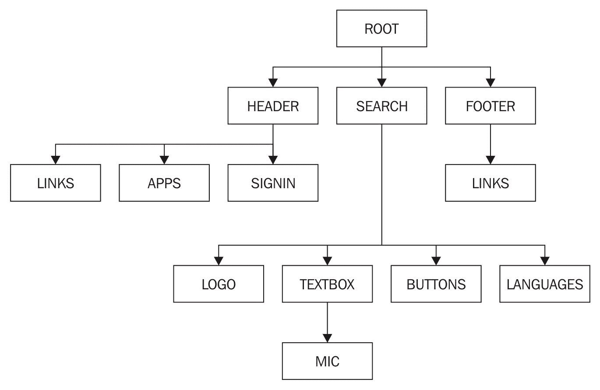
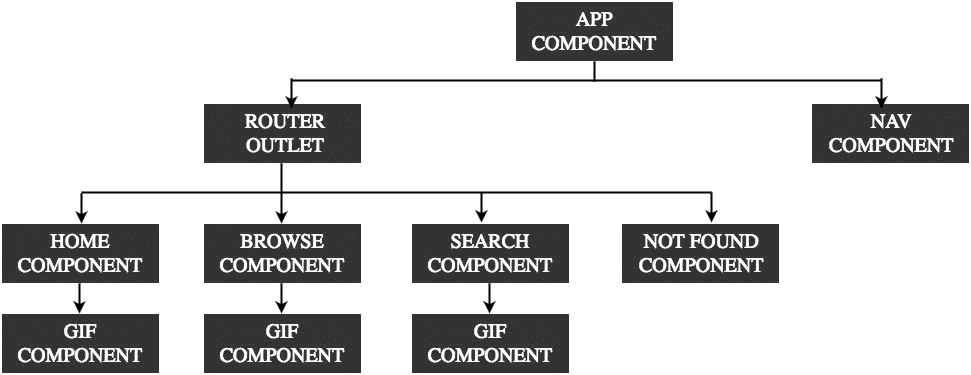
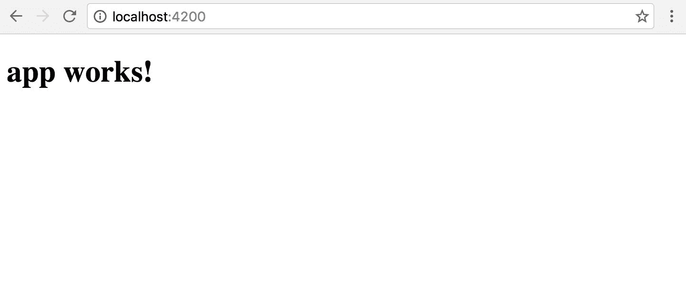
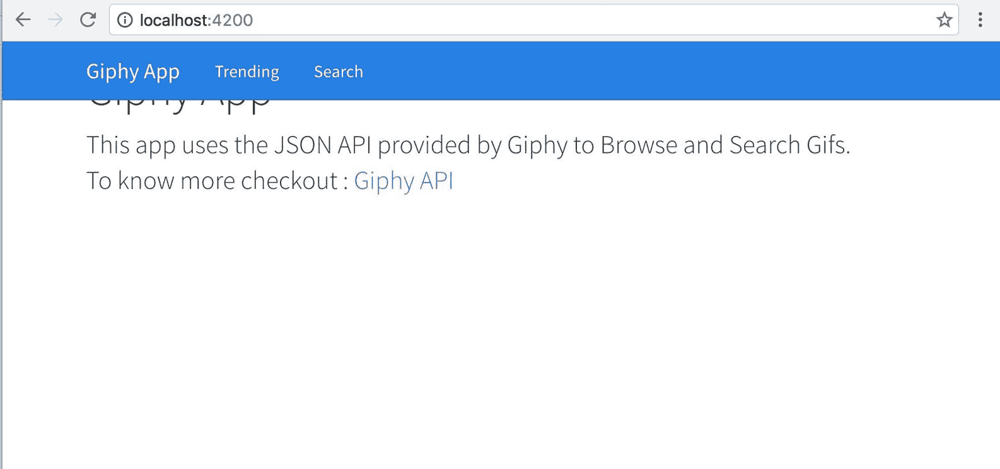
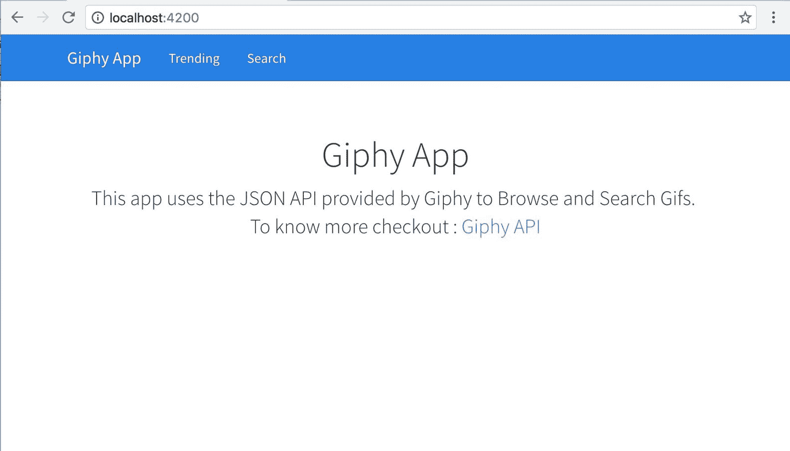
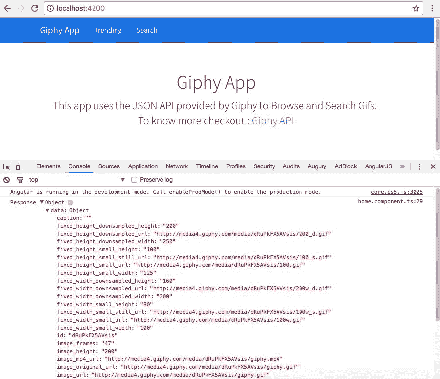
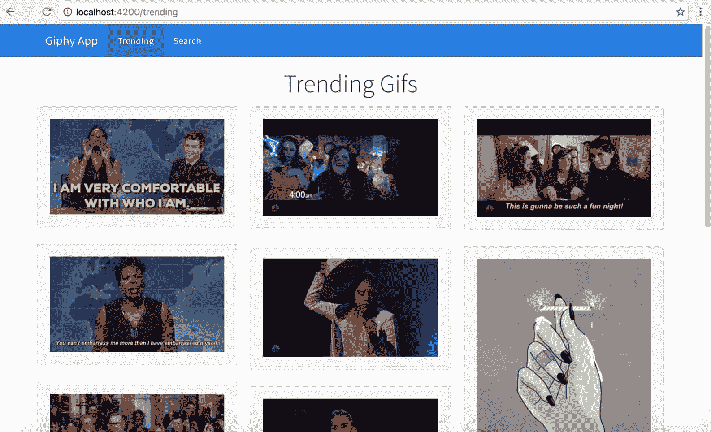
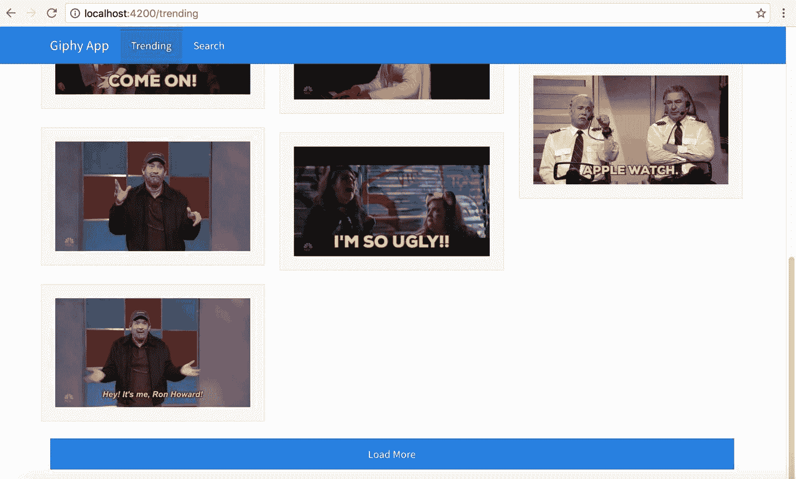
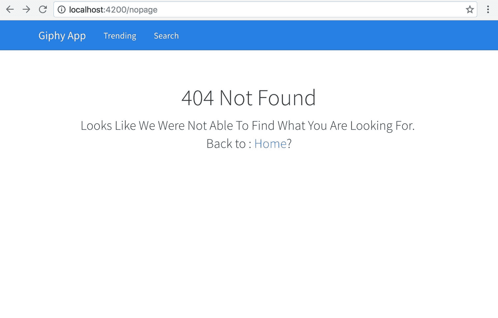

# 第一章：Angular - 入门

当 Timothy Berners-Lee 爵士发明互联网时，他从未想到互联网会被用来发布自拍照、分享猫视频或用广告轰炸网页。他的主要意图（猜测）是创建一个文档网络，以便互联网上的用户可以从任何地方访问这些超文本并加以利用。

Sitepoint 的 Craig Buckler 发表的一篇有趣的文章，标题为《网络磁盘空间不足》（[`www.sitepoint.com/web-runs-disk-space/`](http://www.sitepoint.com/web-runs-disk-space/)），展示了互联网上的内容是如何分布的：

+   28.65％的猫图片

+   16.80％的自恋自拍

+   14.82％毫无意义的社交媒体闲聊

+   12.73％愚蠢的视频博主视频

+   9.76％的广告/点击诱导页面

+   8.70％的欺诈和骗局

+   4.79％的虚假统计文章

+   3.79％的新 JavaScript 工具/库

+   0.76％的文件，以改善人类知识

您可以看到，从互联网的发明到现在，我们是如何演变的。*更好的演变需要更好的框架*来构建和管理这样的应用程序，这些应用程序需要可扩展、可维护和可测试。这就是 2010 年 Angular 填补空白的地方，自那时以来它一直在不断发展。

我们将从理解 Angular 的新变化、TypeScript 的重要性开始我们的旅程，并看看 Ionic 2 如何与 Angular 一起适应，以帮助构建性能高效和现代的移动混合应用程序。

在本章中，我们将通过一个示例快速了解 Angular 的新主题。Angular（2）中发生的主要变化主要是性能和组件化，除了语言更新。在本章中，我们将介绍以下主题：

+   Angular 有什么新东西？

+   TypeScript 和 Angular

+   构建 Giphy 应用程序

# Angular 有什么新东西？

Angular 2 是我见过的软件最受期待和最戏剧性的版本升级之一。Angular 1 对于 Web/移动 Web/混合应用程序开发人员来说是一个福音，它使许多事情变得容易。Angular 1 不仅帮助重构客户端应用程序开发，而且提供了构建应用程序的平台；不是网站，而是应用程序。尽管第一个版本在处理大型数据集时存在性能问题，但 Angular 团队在随后的 Angular 1.4.x 及以上版本中取得了相当大的进展，并通过发布更稳定的版本（即 Angular 2）解决了这些性能问题。

一些伴随 Angular（2）的新变化是：

+   速度和性能改进。

+   基于组件（而不是典型的 MV*）。

+   Angular CLI。

+   简单而富有表现力的语法。

+   渐进式 Web 应用程序（PWA）。

+   跨平台应用程序开发，包括桌面、移动和 Web。

+   基于 Cordova 的混合应用程序开发。

+   用于快速初始视图的 Angular Universal 提供程序。

+   升级以获得更好的动画、国际化和可访问性。

+   Angular 可以用 ES5、ES6、TypeScript 和 Dart 编写，根据用户对 JavaScript 口味的喜好。

有了这些新的更新，无论是在桌面、移动还是移动混合环境上，开发应用程序都变得更加容易。

注意：最新版本的 Angular 将被称为 Angular，而不是 Angular 2，或 AngularJS 4，或 NG4。因此，在本书中，我将把 Angular 版本 2 称为 Angular。

目前最新版本的 Angular 是 4。请查看第十一章，*Ionic 3*，了解更多关于 Angular 4 及其如何改进 Ionic 的信息。

您可以在这里找到有关 Angular 的更多信息：[`angular.io`](https://angular.io)。

注意：如果您是 Angular 的新手，可以参考这些书籍：

[`www.packtpub.com/web-development/learning-angular-2`](https://www.packtpub.com/web-development/learning-angular-2)

[`www.packtpub.com/web-development/mastering-angular-2-components`](https://www.packtpub.com/web-development/mastering-angular-2-components)

[`www.packtpub.com/web-development/mastering-angular-2`](https://www.packtpub.com/web-development/mastering-angular-2)

[`www.packtpub.com/web-development/angular-2-example`](https://www.packtpub.com/web-development/angular-2-example)

或者这些视频：

[`www.packtpub.com/web-development/angular-2-projects-video`](https://www.packtpub.com/web-development/angular-2-projects-video)

[`www.packtpub.com/web-development/web-development-angular-2-and-bootstrap-video`](https://www.packtpub.com/web-development/web-development-angular-2-and-bootstrap-video)

[`www.packtpub.com/web-development/angular-2-web-development-TypeScript-video`](https://www.packtpub.com/web-development/angular-2-web-development-TypeScript-video)

# TypeScript 入门

Angular 在应用程序开发中广泛使用 TypeScript。因此，作为 Angular 入门的一部分，我们也将复习必要的 TypeScript 概念。

如果你是 TypeScript 的新手，TypeScript 是 JavaScript 的一种带类型的超集，可以编译成普通的 JavaScript。TypeScript 提供静态类型、类和接口，并支持几乎所有 ES6 和 ES7 的特性，这些特性在浏览器中还没有实现。

TypeScript 文件保存为`.ts`扩展名。

为无类型语言（JavaScript）添加类型的主要优势是让 IDE 理解我们尝试做的事情，并在编码时更好地帮助我们；换句话说，智能感知。

说到这一点，这就是我们可以用 TypeScript 做的事情。

# 变量类型

在纯 JavaScript 中，我们会做类似这样的事情：

```html
x = 20; 
// after a few meaningful minutes  
x = 'nah! It's not a number any more';

```

但是在 TypeScript 中，我们不能像前面的代码片段中所示那样做，TypeScript 编译器会抱怨，因为我们在运行时修改了变量类型。

# 定义类型

当我们声明变量时，可以选择声明变量的类型。例如：

```html
name: string = 'Arvind'; 
age: number  = 99; 
isAlive: boolean = true; 
hobbies: string[]; 
anyType: any; 
noType = 50; 
noType = 'Random String';

```

这增加了我们尝试做的事情的可预测性。

# 类

我是一个相信 JavaScript 是基于对象的编程语言而不是面向对象编程语言的人，我知道有很多人不同意我的观点。

在纯 JavaScript 中，我们有函数，它们就像类，并展示基于原型的继承。在 TypeScript/ES6 中，我们有类构造：

```html
class Person { 
  name: string; 

constructor(personName: string) {  
this.name = personName;  
} 

getName { 
    return "The Name: " + this.greeting; 
}   
} 
// somewhere else 
arvind:Person = new Person('Arvind');

```

在上面的例子中，我们定义了一个名为 Person 的类，并定义了类构造函数，在类初始化时接受名称。

要初始化类，我们将使用 new 关键字调用类，并将名称传递给构造函数。存储类实例的变量——在上面的例子中是对象`arvind`，也可以被赋予类的类型。这有助于更好地理解`arvind`对象的可能性。

注意：ES6 中的类仍然遵循基于原型的继承，而不是经典的继承模型。

# 接口

当我们开始构建复杂的应用程序时，通常会需要一种特定类型的结构在整个应用程序中重复出现，这遵循某些规则。这就是接口的作用。接口提供*结构子类型*或*鸭子类型*来检查实体的类型和*形状*。

例如，如果我们正在开发一个涉及汽车的应用程序，每辆汽车都有一定的共同结构，在应用程序中使用时需要遵守这个结构。因此，我们创建一个名为 ICar 的接口。任何与汽车相关的类都将按照以下方式实现这个接口：

```html
Interface ICar { 
  engine : String; 
  color: String; 
  price : Number; 
} 

class CarInfo implements ICar{ 
  engine : String; 
  color: String; 
  price : Number; 

  constructor(){ /* ... */} 
}

```

# 模块和导入

在纯 JavaScript 中，你可能会观察到这样的代码块：

```html
(function(){ 
  var x = 20; 
  var y = x * 30; 
})(); //IIFE 
// x & y are both undefined here.

```

在 ES6/TS 中，使用导入和导出语法实现模块：

```html
logic.ts
export function process(){ 
  x = 20; 
  y = x * 30; 
} 

exec.ts 
import { process } from './logic'; 
process();

```

这些是我们开始使用 TypeScript 所需的基本要素。我们将在需要时查看更多类似的概念。

通过这些概念，我们结束了开始使用 TypeScript 所需的关键概念。让我们开始学习 Angular。

有关 TypeScript 的更多信息，请查看：[`www.typescriptlang.org/docs/tutorial.html`](https://www.typescriptlang.org/docs/tutorial.html)。还可以查看 TypeScript 介绍视频：[`channel9.msdn.com/posts/Anders-Hejlsberg-Introducing-TypeScript`](https://channel9.msdn.com/posts/Anders-Hejlsberg-Introducing-TypeScript)。

# Angular

Angular（2）添加了许多新功能，并更新了现有功能，并删除了一些 Angular 1.x 中的功能。在本节中，我们将介绍一些 Angular 的基本功能。

# 组件

Angular 组件受到 Web 组件规范的启发。在非常高的层面上，Web 组件有四个部分：

+   **自定义元素**：用户可以创建自己的 HTML 元素。

+   **HTML 导入**：将一个 HTML 文档导入到另一个 HTML 文档中。

+   **模板**：自定义元素的 HTML 定义。

+   **Shadow DOM**：编写自定义元素封装逻辑的规范。

前面四个规范解释了前端开发人员如何开发自己的独立、隔离和可重用组件，类似于 HTML 选择框（`<select></select>`）、文本区域（`<textarea></textarea>`）或输入框（`<input />`）。

您可以在此处阅读有关 Web 组件规范的更多信息：[`www.w3.org/standards/techs/components#w3c_all`](https://www.w3.org/standards/techs/components#w3c_all)。

如果您想深入了解 Web 组件，请查看：[`webcomponents.org/`](http://webcomponents.org/)。

如前所述，Angular（宽松地）是构建在 Web 组件上的，前面四个规范是以 Angular 方式实现的。

简单来说，我们整个应用程序是一个组件树。例如，如果我们看世界上最受欢迎的页面[`www.google.com`](https://www.google.com)，它可能看起来像这样：


如果我们必须在 Angular 中构建此页面，我们首先会将页面拆分为组件。

前面页面中的所有组件的可视表示如下：



注意：每个黑色框都是（自定义）组件。

从前面的图中可以看出，整个页面是一棵自定义组件树。

（自定义）组件通常由三部分组成：

+   `component.ts`：表示组件逻辑

+   `component.html`：表示组件视图（模板）

+   `component.css`：表示组件特定的样式

要构建自定义组件，我们需要在类的顶部使用`Component`装饰器。简单来说，装饰器让我们可以在类上配置特定的元数据。然后 Angular 将使用这些元数据来理解该类的行为。装饰器以`@`开头，后面跟着装饰器的名称。

组件装饰器告诉 Angular 正在处理的类需要表现出 Angular 组件的行为。一个简单的装饰器如下所示：

```html
@Component({ 
  selector: 'app-root', 
  templateUrl: './app.component.html', 
  styleUrls: ['./app.component.css'] 
}) 
export class AppComponent { 
  // This is where we write the component logic! 
  title = 'Hello World!'; 
}

```

组件装饰器中包含的一些属性有：

+   `selector`：在模板中标识此组件的 CSS 选择器

+   `templateUrl`：包含视图模板的外部文件的 URL

+   `styleUrls`：要应用于此组件视图的样式表的 URL 列表

+   `providers`：此组件及其子组件可用的提供者列表

要了解有关 Component 装饰器的更多信息，请参阅以下链接：[`angular.io/docs/ts/latest/api/core/index/Component-decorator.html`](https://angular.io/docs/ts/latest/api/core/index/Component-decorator.html)

# 区域

区域是 Angular 中引入的新概念之一。区域的概念是从 Dart 迁移到 JavaScript 的。

许多开发人员最初被 Angular 吸引的主要原因是其*自动数据绑定*，以及其他一些原因。这是通过在 Angular 1.x 中使用作用域来实现的。在 Angular 2 中，我们使用 Zone.js（[`github.com/angular/zone.js`](https://github.com/angular/zone.js)）来实现相同的功能。

每当数据发生变化时，Angular 会使用新数据更新适当的*利益相关者*（变量、接口、提供程序等）。Angular 可以轻松跟踪所有同步活动。但是对于异步代码的变化检测，例如事件处理、AJAX 调用或计时器，Angular 2 使用 Zone.js。

要了解有关区域的更多信息，以及它们的工作方式和在 Angular 中的变化检测，请查看 Angular 中的区域：[`blog.thoughtram.io/angular/2016/02/01/zones-in-angular-2.html`](http://blog.thoughtram.io/angular/2016/02/01/zones-in-angular-2.html)和解释 Angular 变化检测：[`blog.thoughtram.io/angular/2016/02/22/angular-2-change-detection-explained.html`](http://blog.thoughtram.io/angular/2016/02/22/angular-2-change-detection-explained.html)。

# 模板

模板用于将组件逻辑绑定到 HTML。模板还用作用户交互和应用逻辑之间的接口。

与 Angular 1 版本相比，模板已经发生了相当大的变化。但是仍然有一些事情保持不变。例如，我们从组件中获取值并在用户界面中显示它的方式仍然相同，使用双大括号表示法（插值语法）。

以下是一个`app.component.ts`的示例：

```html
@Component({ 
  selector: 'app-root', 
  templateUrl: './app.component.html', 
  styleUrls: ['./app.component.css'] 
}) 
export class AppComponent { 
  // This is where we write the component logic! 
  title = 'Hello World!'; 
}

```

`app.component.html`可能如下所示：

```html
<h1>
{{title}} <!-- This value gets bound from app.component.ts -->
</h1>

```

模板也可以通过将模板元数据传递给装饰器而不是`templateUrl`来内联。这可能如下所示：

```html
 @Component({ 
  selector: 'app-root', 
  template: '<h1>{{title}}</h1>', 
  styleUrls: ['./app.component.css'] 
}) 
export class AppComponent { 
  // This is where we write the component logic! 
  title = 'Hello World!'; 
}

```

`template`元数据优先级高于`templateUrl`。例如，如果我们同时定义了`template`和`templateUrl`元数据，将选择并呈现`template`。

我们还可以使用反引号（`）而不是引号在 ES6 和 TypeScript 中编写多行模板。有关更多信息，请参阅模板文字：[`developer.mozilla.org/en/docs/Web/JavaScript/Reference/Template_literals`](https://developer.mozilla.org/en/docs/Web/JavaScript/Reference/Template_literals)

在 Angular 1.x 中，我们有核心/自定义指令。但是在 Angular（2）中，我们有各种表示法，使用这些表示法可以实现与 Angular 1 中指令相同的行为。

例如，如果我们想根据表达式的真值向元素添加自定义类，它会是这样的：

```html
<div [class.highlight]="shouldHighlight">Hair!</div>

```

上述是著名的`ng-class` Angular 1.x 指令的替代品。

为了处理事件，我们使用`( )`表示法，如下所示：

```html
<button (click)=pullHair($event)">Pull Hair</button>

```

而且`pullhair()`是在组件类内部定义的。

为了保持数据绑定最新，我们使用`[( )]`表示法，如下所示：

```html
<input type="text" [(ngModel)]="name">

```

这使得组件类中的名称属性与文本框同步。

这里显示了`*ngFor`的示例，它是`ng-repeat`的替代品：

```html
<ul> 
  <li *ngFor="let todo in todos">{{todo.title}}</li> 

</ul>

```

请注意，在`todo`前面的`let`表示它是该区域中的局部变量。

这些是我们需要开始实际示例的基本概念。当这些概念在我们的应用中出现时，我会谈论其他 Angular（2）的概念。

# Giphy 应用

利用我们迄今为止学到的概念，我们将使用 Angular 和一个名为 Giphy 的开放 JSON API 提供程序构建一个简单的应用。

Giphy（[`giphy.com`](http://giphy.com)）是一个简单的 Gif 搜索引擎。Giphy 的人们公开了一个我们可以使用和处理数据的开放 REST API。

我们要构建的应用将与 Giphy JSON API 通信并返回结果。使用 Angular，我们将为应用中的三个功能构建接口：

+   显示一个随机 Gif

+   显示趋势 Gifs

+   搜索 Gif

我们将使用 Angular CLI（[`cli.angular.io/`](https://cli.angular.io/)）和 Twitter Bootstrap（[`getbootstrap.com/`](http://getbootstrap.com/)）与 Cosmos 主题（[`bootswatch.com/cosmo/`](https://bootswatch.com/cosmo/)）。

在我们开始构建应用之前，让我们首先了解应用的结构。

# 架构

我们要看的第一件事是应用程序的架构。在客户端，我们将有一个路由器，所有事情都将从那里开始流动。路由器将有四个路由：

+   主页路由

+   浏览路由

+   搜索路由

+   页面未找到路由

我们将有一个服务，其中有三种方法将与 Giphy REST API 交互。

除了前面提到的项目，我们还将有以下组件：

+   **导航组件**：应用程序导航栏

+   **主页组件**：主页，显示随机 gif

+   **趋势组件**：显示趋势 gif

+   **搜索组件**：搜索 gif

+   **Giphy 组件**：gif 模板

+   **页面未找到组件**：显示告诉用户未找到任何内容的页面

此应用程序的组件树如下所示：



# API

Giphy API 相当容易理解和使用。您可以在这里找到官方 API 文档：[`github.com/Giphy/GiphyAPI`](https://github.com/Giphy/GiphyAPI)。

我们将要使用的 API 是：

+   随机 Gif：[`api.giphy.com/v1/gifs/random?api_key=dc6zaTOxFJmzC`](http://api.giphy.com/v1/gifs/random?api_key=dc6zaTOxFJmzC)

+   趋势 Gifs：[`api.giphy.com/v1/gifs/trending?api_key=dc6zaTOxFJmzC`](http://api.giphy.com/v1/gifs/trending?api_key=dc6zaTOxFJmzC)

+   搜索 Gifs：[`api.giphy.com/v1/stickers/search?q=cat&api_key=dc6zaTOxFJmzC`](http://api.giphy.com/v1/stickers/search?q=cat&api_key=dc6zaTOxFJmzC)

您可以转到上述链接以查看示例数据。

在撰写本文时，Giphy 公开了`dc6zaTOxFJmzC`作为要使用的 API 密钥。

# Angular CLI

为了开发我们的 Giphy 应用程序，我们将使用 Angular CLI。如果您对 CLI 及其功能不熟悉，我建议您观看此视频：使用 Angular CLI 创建简单的 Angular 2 应用程序：[`www.youtube.com/watch?v=QMQbAoTLJX8`](https://www.youtube.com/watch?v=QMQbAoTLJX8)。

此示例是使用 Angular CLI 版本 1.0.0-beta.18 编写的。

# 安装软件

为了成功开发 Angular-Giphy 应用程序，我们需要安装 Node.js ([`nodejs.org/en`](https://nodejs.org/en))。我们将使用 NPM ([`www.npmjs.com`](https://www.npmjs.com)) 通过 Angular CLI 下载所需的模块。

安装 Node.js 后，打开新的命令提示符/终端，然后运行以下命令：

```html
npm install -g @angular/cli

```

这将继续安装 Angular CLI 生成器。这是我们开始开发应用程序所需的全部内容。

注意：我使用了 angular-cli 版本 1.0.0 构建此应用程序。

# 文本编辑器

关于文本编辑器，您可以使用任何编辑器来处理 Angular 和 Ionic。您还可以尝试 Sublime text ([`www.sublimetext.com/3`](http://www.sublimetext.com/3)) 或 Atom 编辑器 ([`atom.io/`](https://atom.io/)) 或 Visual Studio Code ([`code.visualstudio.com/`](https://code.visualstudio.com/)) 来处理代码。

如果您使用 Sublime text，可以查看：[`github.com/Microsoft/TypeScript-Sublime-Plugin`](https://github.com/Microsoft/TypeScript-Sublime-Plugin) 以在编辑器中添加 TypeScript 智能。对于 Atom，请参阅以下链接：[`atom.io/packages/atom-TypeScript`](https://atom.io/packages/atom-typescript)。

# 搭建一个 Angular 2 应用程序

首先，我们要做的是使用 Angular CLI 搭建一个 Angular 应用程序。创建一个名为`chapter1`的新文件夹，并在该文件夹中打开命令提示符/终端，然后运行以下命令：

```html
ng new giphy-app

```

现在，Angular CLI 生成器将继续创建所有必要的文件和文件夹，以便与我们的 Angular 应用程序一起使用。

如前所述，您可以查看使用 Angular CLI 创建简单的 Angular 2 应用程序：[`www.youtube.com/watch?v=QMQbAoTLJX8`](https://www.youtube.com/watch?v=QMQbAoTLJX8)，也可以查看 Angular CLI 文档：[`cli.angular.io/reference.pdf`](https://cli.angular.io/reference.pdf) 了解更多信息。

脚手架项目结构如下所示：

```html
. 
├── .angular-cli.json 
├── .editorconfig 
├── README.md 
├── e2e 
│   ├── app.e2e-spec.ts 
│   ├── app.po.ts 
│   ├── tsconfig.e2e.json 
├── karma.conf.js 
├── node_modules 
├── package.json 
├── protractor.conf.js 
├── src 
│   ├── app 
│   │   ├── app.component.css 
│   │   ├── app.component.html 
│   │   ├── app.component.spec.ts 
│   │   ├── app.component.ts 
│   │   ├── app.module.ts 
│   ├── assets 
│   │   ├── .gitkeep 
│   ├── environments 
│   │   ├── environment.prod.ts 
│   │   ├── environment.ts 
│   ├── favicon.ico 
│   ├── index.html 
│   ├── main.ts 
│   ├── polyfills.ts 
│   ├── styles.css 
│   ├── test.ts 
│   ├── tsconfig.app.json 
│   ├── tsconfig.spec.json 
│   ├── typings.d.ts 
├── tsconfig.json 
├── tslint.json

```

我们将大部分时间花在`src`文件夹内。一旦项目完全搭建好，进入`giphy-app`文件夹并运行以下命令：

```html
ng serve

```

这将启动内置服务器。构建完成后，我们可以导航到[`localhost:4200`](http://localhost:4200)查看页面。页面应该看起来像这样：



# 构建 Giphy 应用程序

现在我们已经准备好开始了，我们将首先向应用程序添加 Twitter Bootstrap CSS。

在这个例子中，我们将使用来自[`bootswatch.com/`](https://bootswatch.com/)的 Bootstrap 主题 Cosmos。我们可以在主题页面上找到 Cosmos CSS 主题：[`bootswatch.com/cosmo/`](https://bootswatch.com/cosmo/)，点击 Cosmos 下拉菜单，选择`bootstrap.min.css`选项。或者，我们也可以在这里找到它：[`bootswatch.com/cosmo/bootstrap.min.css`](https://bootswatch.com/cosmo/bootstrap.min.css)。

如果你愿意，你也可以使用任何其他主题或原始的 Bootstrap CSS。

要添加主题文件，导航到`giphy-app/src/styles.css`并在其中添加以下行：

```html
@import "https://bootswatch.com/cosmo/bootstrap.min.css";

```

就是这样，现在我们的应用程序已经使用了 Twitter Bootstrap CSS。

接下来，我们将开始处理应用程序的主页面。为此，我们将利用 Twitter Bootstrap 的一个示例模板，名为 Starter Template。模板可以在这里找到：[`getbootstrap.com/examples/starter-template/`](http://getbootstrap.com/examples/starter-template/)。

起始模板包括一个导航栏和一个主体部分，其中显示内容。

对于导航栏部分，我们将生成一个名为`nav-bar`的新组件，并更新其中的相关代码。

要使用 Angular CLI 生成一个新的自定义组件，导航到`giphy-app`文件夹并运行以下命令：

```html
ng generate component nav-bar

```

注意：你可以终止当前运行的命令，或者生成一个新的命令提示符/终端来运行前面的命令。

你应该看到类似这样的东西：

```html
create src/app/nav-bar/nav-bar.component.css
create src/app/nav-bar/nav-bar.component.html
create src/app/nav-bar/nav-bar.component.spec.ts
create src/app/nav-bar/nav-bar.component.ts
update src/app/app.module.ts

```

现在打开`giphy-app/src/app/nav-bar/nav-bar.component.html`并更新如下：

```html
<nav class="navbar navbar-inverse navbar-fixed-top"> 
    <div class="container"> 
        <div class="navbar-header"> 
            <a class="navbar-brand" [routerLink]="['/']">Giphy App</a> 
        </div> 
        <div id="navbar" class="collapse navbar-collapse"> 
            <ul class="nav navbar-nav"> 
                <li [routerLinkActive]="['active']"><a [routerLink]="
                  ['/trending']">Trending</a></li> 
                <li [routerLinkActive]="['active']"><a [routerLink]="
                  ['/search']">Search</a></li> 
            </ul> 
        </div> 
    </div> 
</nav>

```

我们在这里所做的一切就是创建一个带有两个菜单项和应用程序名称的标题栏，它作为指向主页的链接。

接下来，我们将更新`giphy-app/src/app/app.component.html`以加载`nav-bar`组件。用以下内容替换该文件的内容：

```html
<nav-bar></nav-bar>

```

接下来，我们将开始向应用程序添加路由。如前所述，我们将有三个路由。

为了为当前应用程序添加路由支持，我们需要做三件事：

1.  创建所需的路由。

1.  配置`@NgModule`。

1.  告诉 Angular 在哪里加载这些路由的内容。

在撰写本文时，Angular CLI 已禁用了路由生成。因此，我们将手动创建相同的路由。否则，我们可以简单地运行`ng generate route home`来生成主页路由。

所以首先，让我们定义所有的路由。在 app 文件夹内创建一个名为`app.routes.ts`的新文件。更新文件如下：

```html
import { HomeComponent } from './home/home.component'; 
import { TrendingComponent } from './trending/trending.component'; 
import { SearchComponent } from './search/search.component'; 
import { PageNotFoundComponent } from './page-not-found/page-not-found.component'; 

export const ROUTES = [ 
  { path: '', component: HomeComponent }, 
  { path: 'trending', component: TrendingComponent }, 
  { path: 'search', component: SearchComponent }, 
  { path: '**', component: PageNotFoundComponent } 
];

```

我们所做的一切就是导出一个路由数组。请注意路径`'**'`。这是我们定义路由的另一部分。

现在我们将创建所需的组件。运行以下命令：

```html
ng generate component home
ng generate component trending
ng generate component search
ng generate component pageNotFound

```

接下来，我们将配置`@NgModule`。打开`giphy-app/src/app/app.module.ts`并在顶部添加以下导入：

```html
import { RouterModule }   from '@angular/router'; 
import { ROUTES } from './app.routes';

```

接下来，更新`@NgModule`装饰器的`imports`属性如下：

```html
//.. snipp 
imports: [ 
    BrowserModule, 
    FormsModule, 
    HttpModule, 
    RouterModule.forRoot(ROUTES) 
  ], 
//.. snipp 

```

完成的页面将如下所示：

```html
import { BrowserModule } from '@angular/platform-browser'; 
import { NgModule } from '@angular/core'; 
import { FormsModule } from '@angular/forms'; 
import { HttpModule } from '@angular/http'; 
import { RouterModule }   from '@angular/router'; 

import { AppComponent } from './app.component'; 
import { NavBarComponent } from './nav-bar/nav-bar.component'; 
import { HomeComponent } from './home/home.component'; 
import { TrendingComponent } from './trending/trending.component'; 
import { SearchComponent } from './search/search.component'; 
import { PageNotFoundComponent } from './page-not-found/page-not-found.component'; 

import { ROUTES } from './app.routes'; 

@NgModule({ 
  declarations: [ 
    AppComponent, 
    NavBarComponent, 
    HomeComponent, 
    TrendingComponent, 
    SearchComponent, 
    PageNotFoundComponent 
  ], 
  imports: [ 
    BrowserModule, 
    FormsModule, 
    HttpModule, 
    RouterModule.forRoot(ROUTES) 
  ], 
  providers: [], 
  bootstrap: [AppComponent] 
}) 
export class AppModule { }

```

现在我们将更新应用程序组件以显示导航栏以及当前路由内容。

更新`giphy-app/src/app/app.component.html`如下：

```html
<app-nav-bar></app-nav-bar> 
<router-outlet></router-outlet>

```

使用`router-outlet`，我们告诉路由器在该位置加载当前路由内容。

如果你想了解更多关于 Angular 中的路由，请查看：Brian Ford 的《Eleven Dimensions with Component Router》：[`www.youtube.com/watch?v=z1NB-HG0ZH4`](https://www.youtube.com/watch?v=z1NB-HG0ZH4)。

接下来，我们将更新主页组件的 HTML 并测试到目前为止的应用程序。

打开`giphy-app/src/app/home/home.component.html`并按以下方式更新它：

```html
<div class="container"> 
    <div class="starter-template"> 
        <h1>Giphy App</h1> 
        <p class="lead">This app uses the JSON API provided by Giphy to Browse and Search Gifs. 
            <br> To know more checkout : <a href="https://github.com/Giphy/GiphyAPI#trending-gifs-endpoint">Giphy API</a> </p> 
    </div> 
</div>

```

完成后，保存文件并运行以下命令：

```html
ng  serve

```

我们应该看到以下页面：



如我们所见，页面看起来有问题。让我们通过添加一些样式来修复这个问题。打开`giphy-app/src/styles.css`并添加以下内容：

```html
body {
  padding-top: 50px; 
  padding-bottom: 20px; 
} 

.starter-template { 
  padding: 40px 15px; 
  text-align: center; 
}

```

现在我们的页面将如预期般显示：



接下来，我们将开始编写服务以与 Giphy API 交互。我们将编写三种方法，一种用于获取随机 gif，一种用于获取最新趋势，一种用于使用关键字搜索 Gif API。

开始时，我们将生成一个服务。运行以下命令：

```html
ng generate service giphy

```

```html
WARNING Service is generated but not provided, it must be provided to be used

```

如警告所示，生成的服务尚未标记为提供者。因此，我们需要手动进行标记。

打开`giphy-app/src/app/app.module.ts`并导入`GiphyService`：

```html
import { GiphyService } from './giphy.service';

```

接下来，在`@NgModule`装饰器的`providers`属性中添加`GiphyService`作为提供者：

```html
//.. snipp 
providers: [ 
    GiphyService 
  ], 
//..snipp

```

完整的`giphy-app/src/app/app.module.ts`如下所示：

```html
import { BrowserModule } from '@angular/platform-browser'; 
import { NgModule } from '@angular/core'; 
import { FormsModule } from '@angular/forms'; 
import { HttpModule } from '@angular/http'; 
import { RouterModule }   from '@angular/router'; 

import { AppComponent } from './app.component'; 
import { NavBarComponent } from './nav-bar/nav-bar.component'; 
import { HomeComponent } from './home/home.component'; 
import { TrendingComponent } from './trending/trending.component'; 
import { SearchComponent } from './search/search.component'; 
import { PageNotFoundComponent } from './page-not-found/page-not-found.component'; 

import { ROUTES } from './app.routes'; 

import { GiphyService } from './giphy.service'; 

@NgModule({ 
  declarations: [ 
    AppComponent, 
    NavBarComponent, 
    HomeComponent, 
    TrendingComponent, 
    SearchComponent, 
    PageNotFoundComponent 
  ], 
  imports: [ 
    BrowserModule, 
    FormsModule, 
    HttpModule, 
    RouterModule.forRoot(ROUTES) 
  ], 
  providers: [ 
    GiphyService 
  ], 
  bootstrap: [AppComponent] 
}) 
export class AppModule { }

```

现在我们将更新`giphy-app/src/app/giphy.service.ts`以包含这三种方法。打开`giphy-app/src/app/giphy.service.ts`并按以下方式更新它：

```html
import { Injectable } from '@angular/core'; 
import { Http, Response, Jsonp } from '@angular/http'; 
import { Observable } from 'rxjs/Rx'; 
import 'rxjs/Rx'; 

@Injectable() 
export class GiphyService { 
  private giphyAPIBase = 'http://api.giphy.com/v1/gifs'; 
  private APIKEY = 'dc6zaTOxFJmzC'; 

  constructor(private http: Http) { } 

  getRandomGif(): Observable<Response> { 
    return this.http.get(this.giphyAPIBase + 
      '/random?api_key=' + this.APIKEY) 
      .map((res) => res.json()); 
  } 

  getTrendingGifs(offset, limit): Observable<Response> { 
    return this.http.get(this.giphyAPIBase + 
      '/trending?api_key=' + this.APIKEY + '&offset=' + offset + 
      '&limit=' + limit) 
      .map((res) => res.json()); 
  } 

  searchGifs(offset, limit, text): Observable<Response> { 
    return this.http.get(this.giphyAPIBase + '/search?api_key=' + 
      this.APIKEY + '&offset=' + offset + 
      '&limit=' + limit + '&q=' + text) 
      .map((res) => res.json()); 
  } 
}

```

我们所做的只是向相应的 Giphy API URL 发出 HTTP GET 请求并返回一个 Observable。

在 RxJS（[`reactivex.io/rxjs/`](http://reactivex.io/rxjs/)）中，Observable 是一个可以随时间变化的实体。这是 RxJS 的最基本构建块。观察者订阅 Observable 并对其变化做出反应。这种模式称为响应式模式。

引用自文档：

这种模式有助于并发操作，因为它不需要在等待 Observable 发出对象时阻塞，而是创建一个观察者作为哨兵，随时准备在 Observable 未来发出对象时做出适当的反应。

如果您对 Observables 还不熟悉，可以从这里开始：[`reactivex.io/documentation/observable.html`](http://reactivex.io/documentation/observable.html)，然后阅读：在 Angular 中利用 Observables：[`blog.thoughtram.io/angular/2016/01/06/taking-advantage-of-observables-in-angular2.html`](http://blog.thoughtram.io/angular/2016/01/06/taking-advantage-of-observables-in-angular2.html)和 Angular 2 中使用 Observables 进行 HTTP 请求：[`scotch.io/tutorials/angular-2-http-requests-with-observables`](https://scotch.io/tutorials/angular-2-http-requests-with-observables)。

现在服务已经完成，我们将更新`HomeComponent`以获取一个随机的 gif 并在主页上显示它。

打开`giphy-app/src/app/home/home.component.ts`并按以下方式更新它：

```html
import { Component, OnInit } from '@angular/core'; 
import { GiphyService } from '../giphy.service'; 

@Component({ 
  selector: 'app-home', 
  templateUrl: './home.component.html', 
  styleUrls: ['./home.component.css'] 
}) 
export class HomeComponent implements OnInit { 
  public gif: string; 
  public result: any; 
  public isLoading: boolean = true; 

  constructor(private giphyService: GiphyService) { 
    this.getRandomGif(); 
  } 

  ngOnInit() { 
  } 

  getRandomGif() { 
    this.giphyService.getRandomGif().subscribe( 
      (data) => { 
        this.result = data; 
        this.gif = this.result.data.image_url; 
        this.isLoading = false; 
      }, 
      (err) => console.log('Oops!', err), 
      () => console.log('Response', this.result) 
    ) 
  } 
}

```

在上述代码中，首先，我们导入了`GiphyService`并将其添加到构造函数中。接下来，我们编写了`getRandomGif()`并从构造函数中调用了`getRandomGif()`。在`getRandomGif()`中，我们在`giphyService`上调用了`getRandomGif()`来获取一个随机的 gif。然后，我们将 gif 赋值给一个名为`gif`的类变量。

为了确保一切正常运行，我们将通过执行`ng serve`并打开开发者工具来运行应用程序。如果一切顺利，我们应该能看到来自 Giphy API 的响应：



现在我们已经得到了响应，我们希望构建一个组件来显示这个 gif。我们希望构建一个单独的组件，因为我们将在其他页面上使用相同的组件来显示需要的 gif。

让我们继续搭建组件。运行以下命令：

```html
ng generate component gif-viewr

```

接下来，打开`giphy-app/src/app/gif-viewr/gif-viewr.component.html`并按以下方式更新它：

```html
<div class="item"> 
  <div class="well"> 
     
  </div> 
</div>

```

完成后，我们需要告诉组件从父组件中期望数据，因为主页组件将把`imgUrl`传递给`gif-viewer`组件。

打开`giphy-app/src/app/gif-viewr/gif-viewr.component.ts`。首先，通过添加对 Input 装饰器的引用来更新导入语句：

```html
import { Component, OnInit, Input} from '@angular/core';

```

接下来，在`imgUrl`变量中添加一个 Input 装饰器：

```html
@Input() imgUrl: string;

```

更新后的`giphy-app/src/app/gif-viewr/gif-viewr.component.ts`如下所示：

```html
import { Component, OnInit, Input} from '@angular/core'; 

@Component({ 
  selector: 'app-gif-viewr', 
  templateUrl: './gif-viewr.component.html', 
  styleUrls: ['./gif-viewr.component.css'] 
}) 
export class GifViewrComponent implements OnInit { 
  @Input() imgUrl: string; 

  constructor() { } 

  ngOnInit() { 
  } 
}

```

注意：要为组件定义输入，我们使用`@Input`装饰器。要了解更多关于`@Input`装饰器的信息，请参考 Angular 文档中的属性指令部分：[`angular.io/docs/ts/latest/guide/attribute-directives.html`](https://angular.io/docs/ts/latest/guide/attribute-directives.html)。

保存文件并打开`giphy-app/src/app/home/home.component.html`。我们将在此页面内添加`app-gif-viewr`组件：

```html
<app-gif-viewr class="home" [imgUrl]="gif"></app-gif-viewr>

```

完整的文件如下所示：

```html
<div class="container"> 
    <div class="starter-template"> 
        <h1>Giphy App</h1> 
        <p class="lead">This app uses the JSON API provided by Giphy to 
          Browse and Search Gifs. 
            <br> To know more checkout : 
            <a href=
            "https://github.com/Giphy/GiphyAPI#trending-gifs-endpoint">
            Giphy API</a> </p> 
    </div> 

  <app-gif-viewr class="home" [imgUrl]="gif"></app-gif-viewr> 
</div>

```

接下来，我们将更新 CSS 以美化页面。打开`giphy-app/src/styles.css`并将以下 CSS 添加到现有样式中：

```html
.home .well{ 
   width: 70%; 
    margin: 0 auto; 
} 

img{ 
  width: 100%; 
}

```

如果我们回到浏览器并刷新，我们应该会看到以下内容：


每次刷新页面，我们都会看到一个新的 gif 出现。

接下来，我们将在热门页面上进行工作。该页面将显示当前流行的 gif，使用 Pintrest 布局（或 Masonry 布局）。热门 REST API 支持分页。我们将利用这一点，每次加载 12 个 gif。然后提供一个“加载更多”按钮来获取接下来的 12 个 gif。

首先，让我们从 Giphy API 获取数据。打开`giphy-app/src/app/trending/trending.component.ts`。我们将首先导入`GiphyService`：

```html
import { GiphyService } from '../giphy.service';

```

现在，我们将添加相同的内容到构造函数中，并更新构造函数以调用`getTrendingGifs()`：

```html
constructor(private giphyService: GiphyService) { } 
In ngOnInit(), we will call the getTrendingGifs() API: 
  ngOnInit() { 
    this.getTrendingGifs(this.offset, this.perPage); 
  } 
Next, we will add the required class variables:  
private offset = 0; 
private perPage = 12; 
public results: any; 
public gifs: Array<any> = []; 
public isLoading: boolean = true;

```

`offset`和`perPage`将用于管理分页。

`results`将用于存储来自服务器的响应。

`gifs`是由一系列热门 gif 组成的数组，我们将其暴露给模板。

`isLoading`是一个`boolean`变量，用于跟踪请求是否正在进行中。使用`isLoading`，我们将显示/隐藏“加载更多”按钮。

接下来，我们将添加`getTrendingGifs()`：

```html
getTrendingGifs(offset, limit) { 
    this.giphyService.getTrendingGifs(offset, limit).subscribe( 
      (data) => { 
        this.results = data; 
        this.gifs = this.gifs.concat(this.results.data); 
        this.isLoading = false; 
      }, 
      (err) => console.log('Oops!', err), 
      () => console.log('Response', this.results) 
    ) 
  } 
And finally getMore(), which will be invoked by the Load More button: 
 getMore() { 
    this.isLoading = true; 
    this.offset = this.offset + this.perPage; 
    this.getTrendingGifs(this.offset, this.perPage); 
  }

```

为了显示检索到的 gif，我们将更新热门组件模板。打开`giphy-app/src/app/trending/trending.component.html`并进行如下更新：

```html
<div class="container"> 
    <h1 class="text-center">Trending Gifs</h1> 
    <div class="wrapper"> 
        <app-gif-viewr [imgUrl]="gif.images.original.url" *ngFor="let gif of gifs"></app-gif-viewr> 
    </div> 
    <input type="button" value="Load More" class="btn btn-primary btn-block" *ngIf="!isLoading" (click)="getMore()"> 
</div>

```

我们在这里所做的一切就是设置`app-gif-viewr`以通过对其应用`*ngFor`指令来获取 gif URL。底部还有一个“加载更多”按钮，用户可以加载更多 gif。

最后，为了实现 Pintrest/Masonry 布局，我们将添加一些 CSS 规则。打开`giphy-app/src/styles.css`并添加以下样式：

```html
*, *:before, *:after { 
  box-sizing: border-box !important; 
} 

.wrapper { 
  column-width: 18em; 
  column-gap: 1em; 
} 

.item { 
  display: inline-block; 
  padding: .25rem; 
  width: 100%; 
} 

.well { 
  position: relative; 
  display: block; 
}

```

保存所有文件并返回浏览器。如果我们点击导航栏中的热门菜单项，我们应该会看到以下内容：



如果我们完全向下滚动，我们应该会看到一个“加载更多”按钮：



点击“加载更多”按钮将加载下一组 gif：


我浪费了大约 15 分钟点击“加载更多”并观看 gif。我认为这就是为什么 API 应该有速率限制的原因。

最后，我们将实现搜索 gif。打开`giphy-app/src/app/search/search.component.ts`并导入`GiphyService`：

```html
import { GiphyService } from '../giphy.service';

```

在构造函数中将`giphyService`添加为一个类变量：

```html
constructor(private giphyService: GiphyService) { }

```

接下来，我们将添加变量来管理分页以及响应：

```html
  private offset = 0; 
  private perPage = 12; 
  public results: any; 
  public query: string; 
  public gifs: Array<any> = []; 
  public isLoading: boolean = true;

```

现在我们将调用`searchGifs`，它通过传递查询字符串来进行 REST 调用以获取搜索到的 gif：

```html
searchGifs(offset, limit, query) { 
    this.giphyService.searchGifs(offset, limit, query).subscribe( 
      (data) => { 
        this.results = data; 
        this.gifs = this.gifs.concat(this.results.data); 
        this.isLoading = false; 
      }, 
      (err) => console.log('Oops!', err), 
      () => console.log('Response', this.results) 
    ) 
  }

```

以下是一个管理搜索表单提交按钮的方法：

```html
  search(query) { 
    this.query = query; 
    this.isLoading = true; 
    this.searchGifs(this.offset, this.perPage, this.query); 
  }

```

最后，`getMore()`来加载同一查询的更多页面：

```html
getMore() { 
    this.isLoading = true; 
    this.offset = this.offset + this.perPage; 
    this.searchGifs(this.offset, this.perPage, this.query); 
  }

```

更新后的`giphy-app/src/app/search/search.component.ts`如下所示：

```html
import { Component, OnInit } from '@angular/core'; 
import { GiphyService } from '../giphy.service'; 

@Component({ 
  selector: 'app-search', 
  templateUrl: './search.component.html', 
  styleUrls: ['./search.component.css'] 
}) 
export class SearchComponent implements OnInit { 
  private offset = 0; 
  private perPage = 12; 
  public results: any; 
  public query: string; 
  public gifs: Array<any> = []; 
  public isLoading: boolean = true; 

  constructor(private giphyService: GiphyService) { } 

  ngOnInit() { 
  } 

  searchGifs(offset, limit, query) { 
    this.giphyService.searchGifs(offset, limit, query).subscribe( 
      (data) => { 
        this.results = data; 
        this.gifs = this.gifs.concat(this.results.data); 
        this.isLoading = false; 
      }, 
      (err) => console.log('Oops!', err), 
      () => console.log('Response', this.results) 
    ) 
  } 

  search(query) { 
    this.query = query; 
    this.isLoading = true; 
    this.searchGifs(this.offset, this.perPage, this.query); 
  } 

  getMore() { 
    this.isLoading = true; 
    this.offset = this.offset + this.perPage; 
    this.searchGifs(this.offset, this.perPage, this.query); 
  } 
}

```

现在我们将更新`giphy-app/src/app/search/search.component.html`。打开`giphy-app/src/app/search/search.component.html`并进行如下更新：

```html
<div class="container"> 
    <h1 class="text-center">Search Giphy</h1> 
    <div class="row"> 
        <input class="form-control" type="text" placeholder="Search 
          something.. Like.. LOL or Space or Wow" #searchText 
          (keyup.enter)="search(searchText.value)"> 
    </div> 
    <br> 
    <div class="wrapper"> 
        <app-gif-viewr [imgUrl]="gif.images.original.url" *ngFor="let 
          gif of gifs"></app-gif-viewr> 
    </div> 
    <input type="button" value="Load More" class="btn btn-primary btn-block" *ngIf="!isLoading" (click)="getMore()"> 
</div>

```

这个视图与热门组件相同，只是有一个搜索文本框，允许用户通过输入字符串进行搜索。

如果我们保存所有文件，返回浏览器，并导航到搜索页面，我们应该会看到一个带有搜索文本框的空白页面。此时，“加载更多”按钮将不会显示。如果我们输入文本并按回车键，我们应该会看到结果，如下图所示：


有了这个，我们已经完成了在 Angular 应用中使用 Giphy API 的实现。

为了结束这个例子，我们将更新`giphy-app/src/app/page-not-found/page-not-found.component.html`如下：

```html
<div class="container"> 
    <div class="starter-template"> 
        <h1>404 Not Found</h1> 
        <p class="lead">Looks Like We Were Not Able To Find What You Are Looking For. 
            <br>Back to : <a [routerLink]="['/']">Home</a>? </p> 
    </div> 
</div>

```

当我们导航到[`localhost:4200/nopage`](http://localhost:4200/nopage)时，我们应该看到以下页面：



# 摘要

在本章中，我们已经对 TypeScript 进行了高层次的概述，以及为什么我们使用 TypeScript。接下来，我们熟悉了 Angular 的新语法和组件结构。利用这些知识，我们构建了一个名为 Giphy 的应用程序，它与 Giphy 的 REST API 进行交互以获取 gif。

您可以在这里阅读更多关于 Angular 的信息：[`angular.io`](https://angular.io)。

此外，查看第十一章，*Ionic 3*，了解有关 Angular 4 的更多变化。

在下一章--欢迎来到 Ionic，我们将开始使用 Cordova 进行移动混合开发，并了解 Ionic 如何融入更大的方案。
