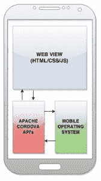
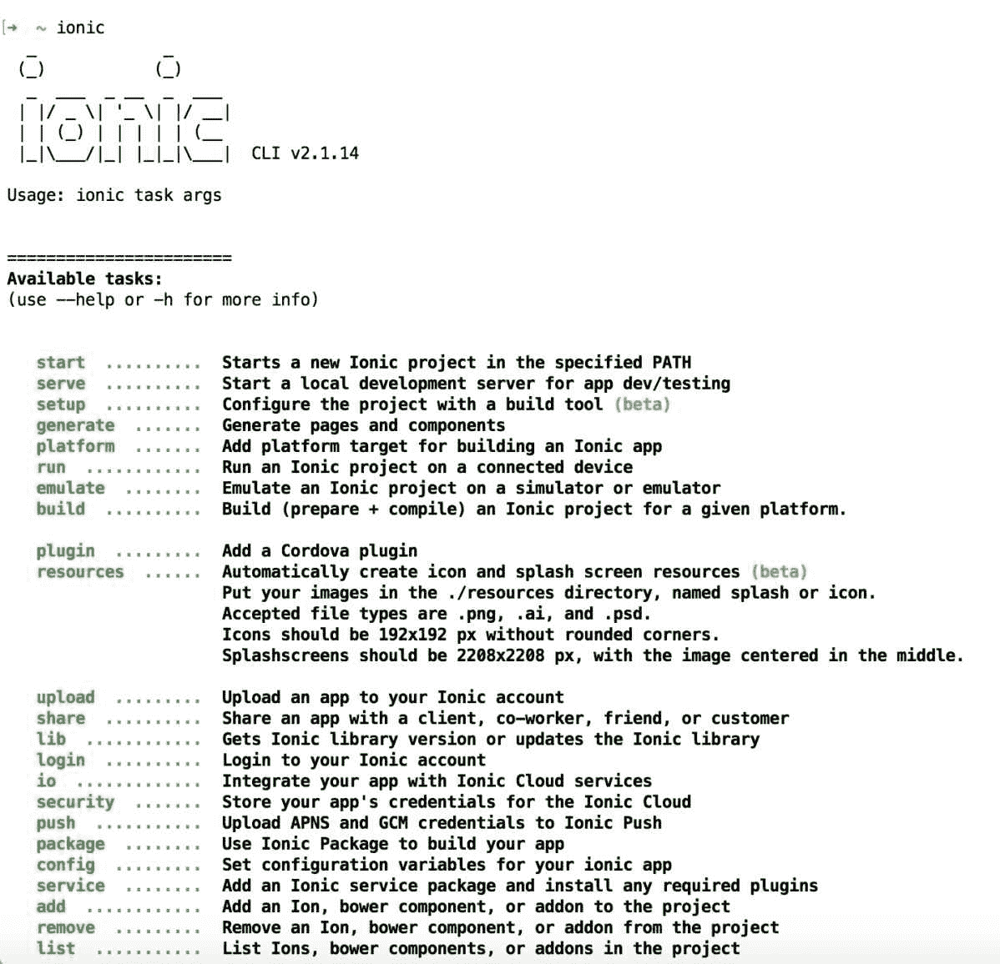
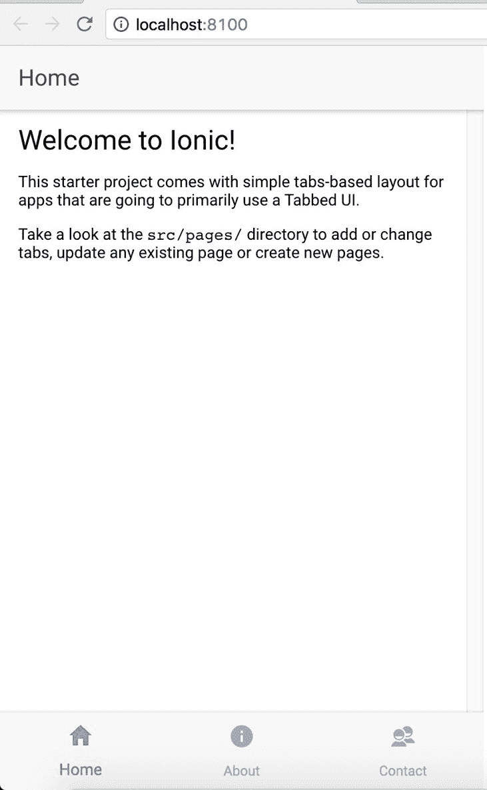
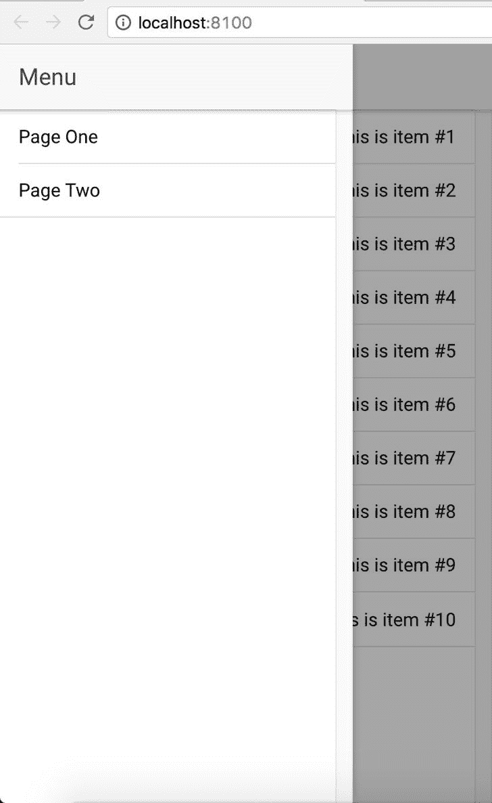

# 第二章：欢迎来到 Ionic

在上一章中，我们通过一个例子学习了 Angular 2。在本章中，我们将看一下移动混合应用的大局，设置所需的软件来开发 Ionic 应用，最后搭建一些应用并探索它们。

本章涵盖的主题如下：

+   移动混合架构

+   Apache Cordova 是什么？

+   Ionic 是什么？

+   设置开发和运行 Ionic 应用所需的工具

+   使用 Ionic 模板

# 移动混合架构

在我们开始使用 Ionic 之前，我们需要了解移动混合开发的大局。

这个概念非常简单。几乎每个移动操作系统（在使用 Cordova 时也称为平台）都有一个用于开发应用程序的 API。这个 API 包括一个名为 WebView 的组件。WebView 通常是一个在移动应用程序范围内运行的浏览器。这个浏览器运行 HTML、CSS 和 JS 代码。这意味着我们可以使用上述技术构建一个网页，然后在我们的应用程序内执行它。

我们可以使用相同的 Web 开发知识来构建本地混合移动应用程序（这里，本地是指在打包后与资产一起安装在设备上的特定于平台的格式文件），例如：

+   Android 使用 Android 应用程序包（`.apk`）

+   iOS 使用 iPhone 应用程序存档（`.ipa`）

+   Windows Phone 使用应用程序包（`.xap`）

包/安装程序由一段初始化网页和一堆显示网页内容所需的资产的本地代码组成。

在移动应用程序容器内显示网页的这种设置，其中包含我们的应用程序业务逻辑，被称为混合应用。

# Apache Cordova 是什么？

简单来说，Cordova 是将 Web 应用程序和本地应用程序拼接在一起的软件。Apache Cordova 的网站表示：

“Apache Cordova 是使用 HTML、CSS 和 JavaScript 构建本地移动应用程序的平台。”

Apache Cordova 不仅仅是将 Web 应用程序与本地应用程序拼接在一起，而且还提供了一组用 JavaScript 编写的 API，以与设备的本地功能进行交互。是的，我们可以使用 JavaScript 访问我们的相机，拍照并通过电子邮件发送。听起来很激动人心，对吧？

为了更好地理解发生了什么，让我们看一下以下的截图：



正如我们所看到的，我们有一个 WebView，HTML/CSS/JS 代码在其中执行。这段代码可以是一个简单的独立用户界面；在最好的情况下，我们正在通过 AJAX 请求从远程服务器获取一些数据。或者，这段代码可以做更多的事情，比如与设备的蓝牙通信并获取附近设备的列表。

在后一种情况下，Cordova 有一堆 API，用 JavaScript 与 WebView 进行接口，然后以其本地语言（例如，Android 的 Java）与设备进行通信，从而在这种情况下为 Java 和 JavaScript 提供了桥梁。例如，如果我们想了解正在运行我们的应用程序的设备更多信息，我们只需要在 JS 文件中编写以下代码并启动应用程序：

```html
var platform = device.platform;

```

安装设备插件后，我们还可以使用 JavaScript 从 WebView 内部访问设备的 UUID、型号、操作系统版本和 Cordova 版本，如下所示：

```html
var uuid = device.uuid; 
var model = device.model; 
var version = device.version; 
var Cordova = device.Cordova;

```

我们将在第六章 *Ionic Native*中更多地处理 Cordova 插件。

前面的解释是为了让你了解移动混合应用的结构以及我们如何使用 JavaScript 从 WebView 中使用设备功能。

Cordova 不会将 HTML、CSS 和 JS 代码转换为特定于操作系统的二进制代码。它所做的只是包装 HTML、CSS 和 JS 代码，并在 WebView 内执行它。

所以你现在一定已经猜到了，Ionic 是我们用来构建在 WebView 中运行并与 Cordova 通信以访问设备特定 API 的 HTML/CSS/JS 代码的框架。

# Ionic 2 是什么？

Ionic 2 是一个用于开发混合移动应用程序的美观的开源前端 SDK，提供了移动优化的 HTML、CSS 和 JS 组件，以及用于构建高度交互式应用程序的手势和工具。

与其他框架相比，Ionic 2 通过最小化 DOM 操作和硬件加速的转换，具有高性能效率。Ionic 使用 Angular 2 作为其 JavaScript 框架。

在像 Ionic 2 这样的框架中使用 Angular 的强大功能，可能性是无限的（只要在移动应用程序中有意义，我们可以在 Ionic 中使用任何 Angular 组件）。 Ionic 2 与 Cordova 的设备 API 集成非常好。这意味着我们可以使用 Ionic Native 访问设备 API，并将其与 Ionic 的美观用户界面组件集成。

Ionic 有自己的命令行界面（CLI）来搭建、开发和部署 Ionic 应用程序。在开始使用 Ionic CLI 之前，我们需要设置一些软件。

# Ionic 3

在本书发布时，Ionic 的最新版本是 3。我已经准备了另一章名为 Ionic 3（第十一章），您可以参考了解更多关于 Ionic 3 及其变化的信息。

另外，请注意，本书中的示例在使用 Ionic 3 时仍然有效。可能会有一些语法和结构上的变化，但总体意思应该保持不变。

# 软件设置

现在我们将设置所有开发和运行 Ionic 应用程序所需的必要软件。

# 安装 Node.js

由于 Ionic 使用 Node.js 作为其 CLI 以及构建任务，我们将首先安装它如下：

1.  导航到[`nodejs.org/`](https://nodejs.org/)。

单击主页上的安装按钮，将自动下载适用于我们操作系统的安装程序。我们也可以导航到[`nodejs.org/download/`](https://nodejs.org/download/)并下载特定的副本。

1.  通过执行下载的安装程序安装 Node.js。

要验证 Node.js 是否已成功安装，请打开新的终端（*nix 系统）或命令提示符（Windows 系统）并运行以下命令：

```html
 node -v
 > v6.10.1

```

1.  现在执行以下命令：

```html
 npm -v
 > 3.10.10

```

`npm`是一个**Node Package Manager**，我们将使用它来下载我们 Ionic 项目的各种依赖项。

我们只需要在开发过程中使用 Node.js。指定的版本仅用于说明。您可能有相同版本或软件的最新版本。

# 安装 Git

Git 是一个免费的开源分布式版本控制系统，旨在处理从小型到非常大型的项目，并具有速度和效率。在我们的情况下，我们将使用一个名为 Bower 的包管理器，它使用 Git 来下载所需的库。此外，Ionic CLI 使用 Git 来下载项目模板。

要安装 Git，请导航到[`git-scm.com/downloads`](http://git-scm.com/downloads)并下载适用于您平台的安装程序。安装成功后，我们可以导航到命令提示符/终端并运行以下命令：

```html
git --version

```

我们应该看到以下输出：

```html
> git version 2.11.0 (Apple Git-81)

```

# 文本编辑器

这是一个完全可选的安装。每个人都有自己喜欢的文本编辑器。在尝试了许多文本编辑器之后，我纯粹因为其简单性和插拔包的数量而爱上了 Sublime Text。

如果您想尝试这个编辑器，可以导航到[`www.sublimetext.com/3`](http://www.sublimetext.com/3)下载 Sublime Text 3。

因为我们将用 TypeScript 编写 JavaScript 代码，Microsoft 的 Visual Studio Code 是另一个不错的选择。

如果您想尝试这个编辑器，可以导航到[`code.visualstudio.com/`](https://code.visualstudio.com/)。

您也可以尝试 Atom 作为另一种选择。

如果您想尝试这个编辑器，可以导航到[`atom.io/`](https://atom.io/)。

# 安装 TypeScript

接下来，我们将安装 TypeScript 编译器。如第一章“Angular - A Primer”中所述，我们将使用 TypeScript 编写 JavaScript 代码。要安装 TypeScript 编译器，请运行以下命令：

```html
npm install typescript -g

```

一旦 TypeScript 成功安装，我们可以通过运行此命令来验证：

```html
tsc -v
> message TS6029: Version 1.7.5

```

在 Ionic 3 发布时，TypeScript 的最新版本是 2.2.2。在使用 Ionic 3 时，您可能需要将 TSC 的版本更新为 2.2.2 或更高版本。

# 安装 Cordova 和 Ionic CLI

最后，为了完成 Ionic 2 的设置，我们将安装 Ionic 和 Cordova CLI。Ionic CLI 是 Cordova CLI 的包装器，具有一些附加功能。

本书中的所有代码示例使用 Cordova 版本 6.4.0，Ionic CLI 版本 2.1.14 和 Ionic 版本 2.1.17。但是最新版本的 Ionic 也应该可以使用相同的代码。

要安装 Ionic CLI，请运行以下命令：

```html
npm install -g ionic cordova

```

要验证安装，请运行以下命令：

```html
cordova -v
> 6.4.0

```

您也可以运行此命令：

```html
ionic -v
> 2.1.14

```

您可以运行以下命令获取有关 Ionic 设置的完整信息：

```html
ionic info

Your system information:
Cordova CLI: 6.4.0 
Ionic CLI Version: 2.1.14
Ionic App Lib Version: 2.1.7
ios-deploy version: 1.8.4 
ios-sim version: 5.0.6 
OS: macOS Sierra
Node Version: v6.10.1
Xcode version: Xcode 8.3 Build version 8E162

```

如果您看到的 Ionic CLI 版本大于或等于 2.2.2，则您有一个可以处理 Ionic 3 应用程序的 Ionic CLI。尽管如此，本书中的命令和示例将以相同的方式工作。

要了解 Ionic CLI 包含的功能，运行以下命令：

```html
 ionic

```

我们应该看到一系列任务，如下截图所示：



除了在上述截图中看到的任务之外，还有一些其他任务。

我们可以阅读任务和解释，了解它们的作用。还要注意，截至今天，其中一些任务仍处于测试阶段。

通过这样，我们已经完成了使用 Ionic 开发应用所需的所有软件的安装。

# 平台指南

在本书结束时，我们将构建可以部署到设备上的应用程序。由于 Cordova 接受 HTML、CSS 和 JS 代码作为输入并生成特定于平台的安装程序，我们需要在我们的机器上有构建环境。

Android 用户可以按照 Android 平台指南中的说明在本地机器上设置 SDK：[`cordova.apache.org/docs/en/edge/guide_platforms_android_index.md.html#Android%2520Platform%2520Guide`](http://cordova.apache.org/docs/en/edge/guide_platforms_android_index.md.html#Android%2520Platform%2520Guide)。

iOS 用户可以按照 iOS 平台指南中的说明在本地机器上设置 SDK：[`cordova.apache.org/docs/en/edge/guide_platforms_ios_index.md.html#iOS%20Platform%20Guide`](http://cordova.apache.org/docs/en/edge/guide_platforms_ios_index.md.html#iOS%2520Platform%2520Guide)。

您需要 macOS 环境来开发 iOS 应用程序。

截至今天，Ionic 仅支持 Android 4.0+（尽管在 2.3 上也可以工作）和 iOS 6+移动平台。但 Cordova 支持更多平台。

您可以在以下网址查看其他支持的平台：[`cordova.apache.org/docs/en/edge/guide_platforms_index.md.html#Platform%20Guides`](http://cordova.apache.org/docs/en/edge/guide_platforms_index.md.html#Platform%2520Guides)。

# 你好 Ionic

现在我们已经完成了软件设置，我们将创建一些 Ionic 应用程序的脚手架。

Ionic 有三个主要/常用模板，我们可以使用这些模板快速开始开发应用程序：

+   空白：这是一个空白的 Ionic 项目，有一个页面

+   选项卡：这是一个使用 Ionic 选项卡构建的示例应用程序

+   侧边菜单：这是一个使用侧边菜单驱动导航的示例应用程序

为了了解脚手架的基础知识，我们将从空白模板开始。

为了保持我们的学习过程清晰，我们将创建一个文件夹结构来处理 Ionic 项目。创建一个名为`chapter2`的文件夹。

接下来，打开一个新的命令提示符/终端，并将目录（`cd`）更改为`chapter2`文件夹。现在运行以下命令：

```html
ionic start -a "Example 1" -i app.example.one example1 blank --v2

```

上述命令具有以下功能：

+   `-a "Example 1"`：这是应用程序的可读名称。

+   `-i app.example.one`：这是应用程序 ID/反向域名。

+   `example1`：这是文件夹的名称。

+   `blank`：这是模板的名称。

+   `--v2`：此标志表示项目将使用最新版本的 Ionic 进行脚手架。这可能会在将来被移除。

参考附录，附加主题和提示，了解更多关于 Ionic start 任务的信息。

Ionic CLI 在执行任务时非常冗长。正如我们从命令提示符/终端中所看到的，项目正在创建时会打印出大量信息。

首先，从`ionic2-app-base` GitHub 存储库[`github.com/driftyco/ionic2-app-base`](https://github.com/driftyco/ionic2-app-base)下载`ionic2-app-base`。之后，从`ionic-starter-blank` GitHub 存储库[`github.com/driftyco/ionic2-starter-blank`](https://github.com/driftyco/ionic2-starter-blank)下载`ionic2-starter-blank`。然后安装所有必需的依赖项。

一旦项目成功创建，我们将看到一堆关于如何进一步进行的说明。我们的输出应该看起来类似以下内容：

！[](img/00020.jpeg)

为了进一步进行，我们将使用`cd`命令导航到`example1`文件夹。我们不会按照命令提示符/终端中提供的说明进行，因为我们还没有理解项目设置。一旦我们对 Ionic 有一个大致的了解，我们可以在脚手架一个新的 Ionic 应用程序后，开始使用命令提示符/终端输出中提供的命令。

一旦我们已经切换到`example1`文件夹，我们将通过以下命令提供应用程序：

```html
ionic serve

```

这将在端口`8100`上启动一个新的`dev`服务器，然后在我们的默认浏览器中启动应用程序。我强烈建议在使用 Ionic 时将 Google Chrome 或 Mozilla Firefox 设置为默认浏览器。

当浏览器启动时，我们应该看到空模板的主页。

如果我们运行`ionic serve`并且端口`8100`已被占用，Ionic 将在`8101`上启动应用程序。

我们还可以使用以下命令在任何其他端口上提供 Ionic 应用程序：

```html
ionic serve -p 8200

```

一旦应用程序成功启动并且我们在浏览器中看到输出，我们将返回到命令提示符/终端，应该会看到类似以下截图的内容：

！[](img/00021.jpeg)

# 浏览器开发者工具设置

在我们进一步进行之前，我建议按照以下格式在浏览器中设置开发者工具。

# Google Chrome

一旦 Ionic 应用程序启动，按下 Mac 上的*Command* + *Option* + *I*，或者在 Windows/Linux 上按下*Ctrl* + *Shift* + *I*，打开开发者工具。然后点击顶部行中倒数第二个图标，靠近关闭按钮，如下截图所示：

！[](img/00022.jpeg)

这将把开发者工具停靠在当前页面的一侧。拖动浏览器和开发者工具之间的分界线，直到视图开始类似于移动设备。

如果您在开发者工具中点击“元素”选项卡，您可以轻松地检查页面并一次看到输出，如下截图所示：

！[](img/00023.jpeg)

这个视图对于修复错误和调试问题非常有帮助。

# Mozilla Firefox

如果您是 Mozilla Firefox 的粉丝，我们也可以使用 Firefox 来实现前面的结果。一旦 Ionic 应用程序启动，按下 Mac 上的*Command* + *Option* + *I*，或者在 Windows/Linux 上按下*Ctrl* + *Shift* + *I*，打开开发者工具（不是 Firebug，Firefox 的本机开发工具）。然后点击浏览器窗口旁边的停靠图标，如下截图所示：

！[](img/00024.jpeg)

现在我们可以拖动分界线，以实现与 Chrome 中看到的相同结果：

！[](img/00025.jpeg)

# Ionic 项目结构

到目前为止，我们已经搭建了一个空白的 Ionic 应用程序并在浏览器中启动了它。现在，我们将浏览搭建好的项目结构。

如果我们在文本编辑器中打开`chapter2 example1`文件夹，我们应该在项目的根目录看到以下文件夹结构：

```html
. 
├── config.xml 
├── hooks 
├── ionic.config.json 
├── node_modules 
├── package.json 
├── platforms 
├── plugins 
├── resources 
├── src 
├── tsconfig.json 
├── tslint.json 
├── www

```

以下是每个项目的快速解释：

+   `src`：这是所有开发发生的文件夹。应用程序源代码将放在这里。如果您从 Ionic 1 转到 Ionic 2，这是您会注意到的第一个变化。对我来说，这是文件夹结构的一个很好的升级，因为它将开发代码与部署代码分开。

+   `hooks`：这个文件夹包含了在执行特定的 Cordova 任务时执行的脚本。Cordova 任务可以是以下任何一种：`after_platform_add`（添加新平台后）、`after_plugin_add`（添加新插件后）、`before_emulate`（模拟开始前）、`after_run`（应用程序运行前）等。每个任务都放在以 Cordova 任务命名的文件夹内。

+   `resources`：这个文件夹包含了基于移动操作系统的应用程序图标和启动画面的各种版本。

+   `www`：这个文件夹包含了在`src`文件夹中编写的构建 Ionic 代码。这个文件夹中的所有代码都打算放在 WebView 中。

+   `config.xml`：这个文件包含了 Cordova 在将我们的 Ionic 应用程序转换为特定于平台的安装程序时所需的所有元信息。如果您打开`config.xml`，您将看到一堆描述我们项目的 XML 标签。我们将再次详细查看这个文件。

+   `ionic.config.js`：这个文件包含了构建任务所需的配置。

+   `package.json`：这个文件包含了项目级别的 node 依赖项。

+   `tsconfig.json`：这个文件包含了 TypeScript 的配置。

+   `tslint.json`：这个文件包含了 TS lint 规则。要了解更多关于这些规则的信息，请参考：[`palantir.github.io/tslint/rules/`](https://palantir.github.io/tslint/rules/)。

# config.xml 文件

`config.xml`文件是一个与平台无关的配置文件。如前所述，这个文件包含了 Cordova 在将`www`文件夹中的代码转换为特定于平台的安装程序时所需的所有信息。

`config.xml`文件的设置基于 W3C 的打包 Web 应用程序（小部件）规范（[`www.w3.org/TR/widgets/`](http://www.w3.org/TR/widgets/)），并扩展为指定核心 Cordova API 功能、插件和特定于平台的设置。我们可以向该文件添加两种类型的配置。一种是全局的，即对所有设备通用，另一种是特定于平台的。

如果我们打开`config.xml`，我们会遇到的第一个标签是 XML 根标签。接下来，我们可以看到 widget 标签：

```html
<widget id="app.example.one" version="0.0.1"  >

```

之前指定的`id`是我们应用程序的反向域名，我们在脚手架时提供的。其他规范是在 widget 标签内定义的其子级。子级标签包括应用程序名称（在设备上安装时显示在应用程序图标下方）、应用程序描述和作者详细信息。

它还包含了在将`src`文件夹中的代码转换为本机安装程序时需要遵守的配置。

内容标签定义了应用程序的起始页面。

访问标签定义了应用程序中允许加载的 URL。默认情况下，它会加载所有的 URL。

preference 标签设置了各种选项的名称值对。例如，`DisallowOverscroll`描述了当用户滚动文档的开头或结尾时是否应该有任何视觉反馈。

您可以在以下链接中阅读有关特定于平台的配置的更多信息：

+   Android：[`docs.phonegap.com/en/edge/guide_platforms_android_config.md.html#Android%20Configuration`](http://docs.phonegap.com/en/4.0.0edge/guide_platforms_android_config.md.html#Android%2520Configuration)

+   iOS：[`docs.phonegap.com/en/edge/guide_platforms_ios_config.md.html#iOS%20Configuration`](http://docs.phonegap.com/en/4.0.0edge/guide_platforms_ios_config.md.html#iOS%2520Configuration)

平台特定配置和全局配置的重要性是一样的。您可以在[`docs.phonegap.com/en/edge/config_ref_index.md.html#The%20config.xml%20File`](http://docs.phonegap.com/en/4.0.0edge/config_ref_index.md.html#The%2520config.xml%2520File)了解更多关于全局配置的信息。

# src 文件夹

正如前面提到的，该文件夹包括我们的 Ionic 应用程序，HTML、CSS 和 JS 代码。如果我们打开`src`文件夹，我们将找到以下文件结构：

```html
. . 
├── app 
│   ├── app.component.ts 
│   ├── app.html 
│   ├── app.module.ts 
│   ├── app.scss 
│   ├── main.ts 
├── assets 
│   ├── icon 
├── declarations.d.ts 
├── index.html 
├── manifest.json 
├── pages 
│   ├── home 
├── service-worker.js 
├── theme 
    ├── variables.scss

```

让我们详细看看每一个：

+   `app 文件夹`：app 文件夹包括特定环境的初始化文件。该文件夹包括`app.module.ts`，其中定义了`@NgModule`模块。`app.component.ts`包括根组件。

+   `assets 文件夹`：该文件夹包括所有静态资产。

+   `pages 文件夹`：该文件夹包括我们将要创建的页面。在这个例子中，我们已经有一个名为`home`的示例页面。每个页面都是一个组件，其中包括业务逻辑-`home.ts`，标记-`home.html`和与组件相关的样式-`home.scss`。

+   `theme 文件夹`：该文件夹包括`variables.scss`，覆盖它将改变 Ionic 组件的外观和感觉。

+   `index.html`：这是一切的起点。

这完成了我们对空白模板的介绍。在我们搭建下一个模板之前，让我们快速查看一下`src/app/app.component.ts`文件。

正如您所看到的，我们正在创建一个新的应用/根组件。`@Component`装饰器需要一个`template`或`templateUrl`属性来正确加载 Ionic 2 应用程序。作为模板的一部分，我们添加了`ion-nav`组件。

在类定义内部，我们声明了一个`rootPage`并将其分配给主页，并在构造函数内部，我们有平台准备好的回调，当平台准备就绪时将调用它。

这是一个非常简单和基本的 Ionic 应用程序。到目前为止，您一定已经在与 Web 相关的 Angular 代码上工作过。但是当您处理 Ionic 时，您将与与设备功能相关的脚本一起工作。Ionic 为我们提供了服务，以更有条理地实现这些功能。

# 搭建选项卡模板

为了更好地了解 Ionic CLI 和项目结构，我们还将搭建其他两个起始模板。首先我们将搭建选项卡模板。

使用`cd`命令，返回到`chapter2`文件夹并运行以下命令：

```html
ionic start -a "Example 2" -i app.example.two example2 tabs --v2

```

选项卡项目被搭建在`example2`文件夹内。使用`cd`命令，进入`example2`文件夹并执行以下命令：

```html
    ionic serve

```

我们应该看到使用 Ionic 构建的选项卡界面应用程序，如下面的屏幕截图所示：



选项卡位于页面底部。我们将在第三章，*Ionic 组件和导航*，以及第四章，*Ionic 装饰器和服务*中更多地讨论自定义。

如果您回到`example2`文件夹并分析项目结构，除了`src`/`pages`文件夹的内容外，其他都是一样的。

这一次，在 pages 文件夹中您将看到四个文件夹。tabs 文件夹包括选项卡定义，about、contact 和 home 文件夹包括每个选项卡的定义。

现在您可以很好地了解 Ionic 是如何与 Angular 集成的，以及所有组件是如何相辅相成的。当我们处理更多 Ionic 的部分时，这种结构将更加有意义。

# 搭建侧边菜单模板

现在我们将搭建最终的模板。使用`cd`命令，返回到`chapter2`文件夹并运行以下命令：

```html
ionic start -a "Example 3" -i app.example.three example3 sidemenu --v2

```

执行脚手架项目，使用`cd`命令，进入`example3`文件夹并输入以下命令：

```html
ionic serve

```

输出应该类似于以下截图：



您可以自行分析项目结构并查看区别。

您可以运行`ionic start -l`或`ionic templates`来查看可用模板的列表。您还可以使用`ionic start task`和列表中的模板名称来搭建应用程序。

# 摘要

在本章中，我们了解了移动混合架构的一些知识。我们还学习了混合应用程序的工作原理。我们看到了 Cordova 如何将 HTML、CSS 和 JS 代码拼接在一起，以在本地应用程序的 WebView 中执行。然后我们安装了开发 Ionic 应用程序所需的软件。我们使用 Ionic CLI 搭建了一个空白模板并分析了项目结构。随后，我们搭建了另外两个模板并观察了它们之间的区别。

您还可以参考 Ionic 幻灯片[`ionicframework.com/present-ionic/slides`](http://ionicframework.com/present-ionic/slides)获取更多信息。

在下一章节*Ionic 组件和导航*中，我们将学习 Ionic 组件以及如何构建一个简单的两页应用程序并在它们之间进行导航。这将帮助我们使用 Ionic API 构建有趣的用户界面和多页面应用程序。
