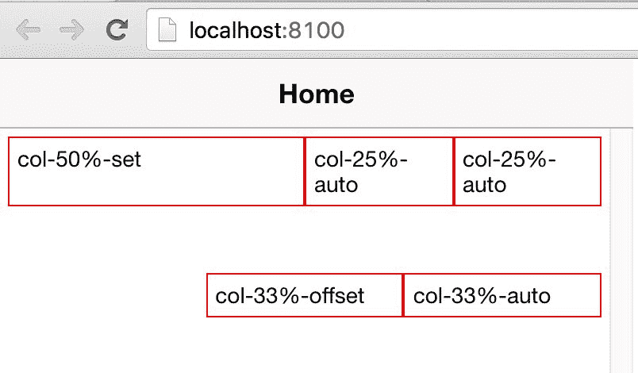
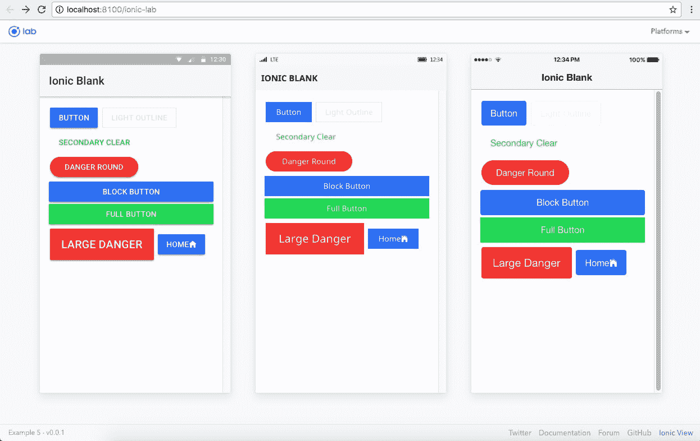

# 第三章：Ionic 组件和导航

到目前为止，我们已经了解了 Ionic 是什么，以及它在移动混合应用开发的大局中扮演的角色。我们还看到了如何搭建一个 Ionic 应用程序。

在本章中，我们将使用 Ionic 组件、Ionic 网格系统和 Ionic 中的导航。我们将查看 Ionic 的各种组件，使用这些组件可以构建提供出色用户体验的应用程序。

本章将涵盖以下主题：

+   Ionic 网格系统

+   Ionic 组件

+   Ionic 导航

# 核心组件

Ionic 是一个强大的移动 CSS 框架和 Angular 的结合。使用 Ionic，将任何想法推向市场所需的时间非常短。Ionic CSS 框架包含了构建应用程序所需的大多数组件。

为了测试可用组件，我们将搭建一个空白的起始模板，然后添加 Ionic 的可视组件。

在开始搭建之前，我们将创建一个名为`chapter3`的新文件夹，并在该文件夹中搭建本章的所有示例。

要搭建一个空白应用程序，请运行以下代码：

```html
ionic start -a "Example 4" -i app.example.four example4 blank --v2 

```

# Ionic 网格系统

要对布局进行精细控制，以便在页面上定位组件或以一致的方式将元素排列在一起，您需要一个网格系统，Ionic 提供了这样一个系统。

Ionic 网格系统的美妙之处在于它是基于 FlexBox 的。FlexBox——或 CSS 柔性盒布局模块——为优化的用户界面设计提供了一个盒模型。

您可以在以下链接了解更多关于 FlexBox 的信息：

[`www.w3.org/TR/css3-flexBox/`](http://www.w3.org/TR/css3-flexBox/)

您可以在以下链接找到有关 FlexBox 的精彩教程：

[`css-tricks.com/snippets/css/a-guide-to-flexbox/`](https://css-tricks.com/snippets/css/a-guide-to-flexbox/)

基于 FlexBox 的网格系统的优势在于，您不需要固定列网格。您可以在一行内定义尽可能多的列，并且它们将自动分配相等的宽度。这样，与任何其他基于 CSS 的网格系统不同，您不需要担心类名的总和是否等于网格系统中的总列数。

要了解网格系统的工作原理，请打开`example4/src/pages/home`文件夹中的`home.html`文件。删除`ion-content`指令内的所有内容，并添加以下代码：

```html
<ion-row> 
        <ion-col>col-20%-auto</ion-col> 
        <ion-col>col-20%-auto</ion-col> 
        <ion-col>col-20%-auto</ion-col> 
        <ion-col>col-20%-auto</ion-col> 
        <ion-col>col-20%-auto</ion-col> 
</ion-row>

```

为了直观地看到区别，我们在`src/pages/home`文件夹中的`home.scss`中添加以下样式：

```html
ion-col { 
    border: 1px solid red; 
}

```

上述样式不是使用网格系统所必需的；它只是为了显示布局中每个列的视觉分隔。

保存`home.html`和`home.scss`文件，并使用`cd`命令进入`example4`文件夹，然后运行以下命令：

```html
ionic serve

```

然后您应该看到以下内容：


为了检查宽度是否会自动变化，我们将子 div 的数量减少到三个，如下所示：

```html
<ion-row> 
        <ion-col>col-33%-auto</ion-col> 
        <ion-col>col-33%-auto</ion-col> 
        <ion-col>col-33%-auto</ion-col> 
</ion-row>

```

然后您应该看到以下内容：


无需麻烦，无需计算；您只需要添加要使用的 ion-col，它们将自动分配相等的宽度。

但这并不意味着您不能应用自定义宽度。您可以使用 Ionic 提供的宽度属性轻松实现这一点。

例如，假设在前面的三列情况下，您希望第一列跨越 50%，剩下的两列占据剩余的宽度；您只需要在第一个`ion-col`中添加一个名为`width-50`的属性，如下所示：

```html
    <ion-row> 
        <ion-col width-50>col-50%-set</ion-col> 
        <ion-col>col-25%-auto</ion-col> 
        <ion-col>col-25%-auto</ion-col> 
   </ion-row>

```

然后您应该看到以下内容：


您可以参考以下表格，了解预定义宽度属性及其隐含宽度的列表：

| **属性名称** | **百分比宽度** |
| --- | --- |
| `width-10` | 10% |
| `width-20` | 20% |
| `width-25` | 25% |
| `width-33` | 33.333% |
| `width-34` | 33.333% |
| `width-50` | 50% |
| `width-66` | 66.666% |
| `width-67` | 66.666% |
| `width-75` | 75% |
| `width-80` | 80% |
| `width-90` | 90% |

你还可以通过一定的百分比来偏移列。例如，将以下标记附加到我们当前的示例中：

```html
<ion-row> 
        <ion-col offset-33>col-33%-offset</ion-col> 
        <ion-col>col-33%-auto</ion-col> 
 </ion-row>

```

然后你应该会看到以下内容：



第一个 div 偏移了 33%，剩下的 66%将在两个 div 之间分配。偏移属性所做的就是在 div 的左侧添加指定百分比的边距。

你可以参考以下表格，了解预定义类及其隐含的偏移宽度：

| **属性名称** | **百分比宽度** |
| --- | --- |
| `offset-10` | 10% |
| `offset -20` | 20% |
| `offset -25` | 25% |
| `offset -33` | 33.333% |
| `offset -34` | 33.333% |
| `offset -50` | 50% |
| `offset -66` | 66.666% |
| `offset -67` | 66.666% |
| `offset -75` | 75% |
| `offset -80` | 80% |
| `offset -90` | 90% |

你还可以垂直对齐网格中的列。这是使用 FlexBox 网格系统的另一个优势。

添加以下代码：

```html
<h4 text-center>Align Cols to <i>top</i></h4> 
    <ion-row top> 
        <ion-col> 
            <div>col</div> 
        </ion-col> 
        <ion-col> 
            <div>col</div> 
        </ion-col> 
        <ion-col> 
            <div>col</div> 
        </ion-col> 
        <ion-col> 
            <div> 
                This 
                <br>is a tall 
                <br> column 
            </div> 
        </ion-col> 
    </ion-row> 
    <h4 text-center>Align Cols to <i>center</i></h4> 
    <br> 
    <ion-row center> 
        <ion-col> 
            <div>col</div> 
        </ion-col> 
        <ion-col> 
            <div>col</div> 
        </ion-col> 
        <ion-col> 
            <div>col</div> 
        </ion-col> 
        <ion-col> 
            <div> 
                This 
                <br>is a tall 
                <br> column 
            </div> 
        </ion-col> 
    </ion-row> 
    <h4 text-center>Align Cols to <i>bottom</i></h4> 
    <ion-row bottom> 
        <ion-col> 
            <div>col</div> 
        </ion-col> 
        <ion-col> 
            <div>col</div> 
        </ion-col> 
        <ion-col> 
            <div>col</div> 
        </ion-col> 
        <ion-col> 
            <div> 
                This 
                <br>is a tall 
                <br> column 
            </div> 
        </ion-col> 
    </ion-row>

```

然后你应该会看到以下内容：


如果其中一个列很高，你可以在`ion-row`标记上添加 top、center 或 bottom 属性，事情就会如前面的图所示的那样落实到位。

有了这样一个简单而强大的网格系统，布局可能是无限的。

要了解更多关于 Ionic 网格系统的信息，你可以参考以下链接：[`ionicframework.com/docs/components/#grid`](http://ionicframework.com/docs/components/#grid)

# Ionic 组件

在本节中，我们将介绍一些 Ionic 组件。这些组件包括按钮、列表、卡片和表单。Ionic 组件会根据运行设备自动适应 iOS 主题，或者根据 Android 或 Windows 主题的 Material Design。当我们使用 Ionic 组件时，我们将在所有三个平台上看到输出。

要进一步进行，我们为按钮创建一个新项目。你可以`cd`到`chapter3`文件夹，并运行以下命令：

```html
ionic start -a "Example 5" -i app.example.five example5 blank --v2 

```

接下来，我们在实验室模式下为应用提供服务。使用`cd`命令导航到`example5`文件夹，并运行以下命令：

```html
ionic serve --lab

```

这将在实验室模式下为 Ionic 应用提供服务，看起来会像这样：


通过这个视图，我们可以在所有三个平台上看到所有组件的输出。

# 按钮

Ionic 提供了不同的按钮变化，包括大小和样式。

在`src/pages/home/home.html`中更新`ion-content`指令，使用以下代码，我们应该会看到不同的按钮变化：

```html
<ion-content class="home" padding> 
    <button ion-button>Button</button> 
    <button ion-button color="light" outline>Light Outline</button> 
    <button ion-button color="secondary" clear>Secondary Clear</button> 
    <button ion-button color="danger" round>Danger Round</button> 
    <button ion-button block>Block Button</button> 
    <button ion-button color="secondary" full>Full Button</button> 
    <button ion-button color="danger" large>Large Danger</button> 
    <button ion-button dark> 
        Home 
        <ion-icon name="home"></ion-icon> 
    </button> 
</ion-content>

```

你注意到了`ion-content`指令上的填充属性吗？这将为`ion-content`指令添加`16px`的填充。如果你保存文件，你应该会看到这个：



前面的截图涵盖了基于默认 Ionic 颜色样本的所有按钮需求。

另外，你是否注意到按钮的外观在 iOS、Android 和 Windows 之间有所不同？我们将在第五章*Ionic 和 SCSS*中更多地讨论如何自定义这些组件。

有关按钮组件的更多信息，请参考：[`ionicframework.com/docs/api/components/button/Button`](http://ionicframework.com/docs/api/components/button/Button)

# 列表

```html
ion-content section:
```

```html
<ion-list> 
        <ion-item> 
            Light 
        </ion-item> 
        <ion-item> 
            Primary 
        </ion-item> 
        <ion-item> 
            Secondary 
        </ion-item> 
        <ion-item> 
            Danger 
        </ion-item> 
        <ion-item> 
            Dark 
        </ion-item> 
 </ion-list>

```

你应该会看到以下内容：


通过向`ion-list`指令添加一个名为`no-lines`的属性，线条将消失。如果你将前面的代码片段更新为以下内容：

```html
<ion-list no-lines> 
        <ion-item> 
            Light 
        </ion-item> 
        <ion-item> 
            Primary 
        </ion-item> 
        <ion-item> 
            Secondary 
        </ion-item> 
        <ion-item> 
            Danger 
        </ion-item> 
        <ion-item> 
            Dark 
        </ion-item> 
    </ion-list>

```

你应该能够看到以下屏幕：


你还可以使用`ion-item-group`将列表项分组在一起。其代码如下：

```html
<ion-list> 
    <ion-item-group> 
        <ion-item-divider light>A</ion-item-divider> 
        <ion-item>Apple</ion-item> 
        <ion-item>Apricots</ion-item> 
        <ion-item>Avocado</ion-item> 
        <ion-item-divider light>B</ion-item-divider> 
        <ion-item>Bananas</ion-item> 
        <ion-item>Blueberries</ion-item> 
        <ion-item>Blackberries</ion-item> 
    </ion-item-group>  
</ion-list>

```

为此，`ion-list`将被替换为`ion-item-group`，如前面的代码片段所示。你应该会看到以下屏幕：


Ionic 列表的新添加是滑动列表。在这种类型的列表中，每个项目都可以向左滑动以显示新选项。

这段代码的片段如下所示：

```html
<ion-list> 
        <ion-item-sliding> 
            <ion-item> 
                <ion-avatar item-left> 
                     
                </ion-avatar> 
                <h2>Indiana Jones</h2> 
                <p>Played by Harrison Ford in Raiders of the Lost Ark
                </p> 
            </ion-item> 
            <ion-item-options> 
                <button ion-button color="light"> 
                    <ion-icon name="ios-more"></ion-icon> 
                    More 
                </button> 
                <button ion-button color="primary"> 
                    <ion-icon name="text"></ion-icon> 
                    Text 
                </button> 
                <button ion-button color="secondary"> 
                    <ion-icon name="call"></ion-icon> 
                    Call 
                </button> 
            </ion-item-options> 
        </ion-item-sliding> 
        <ion-item-sliding> 
            <ion-item> 
                <ion-avatar item-left> 
                     
                </ion-avatar> 
                <h2>James Bond</h2> 
                <p>Played by Sean Connery in Dr. No</p> 
            </ion-item> 
            <ion-item-options> 
                <button ion-button color="light"> 
                    <ion-icon name="ios-more"></ion-icon> 
                    More 
                </button> 
                <button ion-button color="primary"> 
                    <ion-icon name="text"></ion-icon> 
                    Text 
                </button> 
                <button ion-button color="secondary"> 
                    <ion-icon name="call"></ion-icon> 
                    Call 
                </button> 
            </ion-item-options> 
        </ion-item-sliding> 
</ion-list>

```

前面代码的输出如下所示：


有关列表组件的更多信息，您可以参考以下链接：[`ionicframework.com/docs/components/#lists`](http://ionicframework.com/docs/components/#lists)

# 卡片

卡片是在移动设备上展示内容的最佳设计模式之一。对于显示用户个性化内容的任何页面或应用程序，卡片都是最佳选择。世界正在向卡片展示内容的方式发展，包括在某些情况下也在桌面上。例如 Twitter ([`dev.twitter.com/cards/overview`](https://dev.twitter.com/cards/overview))和 Google Now。

因此，您也可以将该设计模式简单地移植到您的应用程序中。您需要做的就是设计适合卡片的个性化内容，并将其放入`ion-card`组件中：

```html
<ion-card> 
 <ion-card-header> 
      Card Header 
 </ion-card-header> 
<ion-card-content> 
            Lorem ipsum dolor sit amet, consectetur adipisicing elit. Dignissimos magni itaque numquam distinctio pariatur voluptas sint, id inventore nulla vitae. Veritatis animi eos cupiditate. Labore, amet debitis maxime velit assumenda. 
</ion-card-content> 
</ion-card>

ion-card-header directive and the output would look as follows:
```


您可以通过向卡片添加图像来为卡片增添创意：

```html
<ion-card> 
         
        <ion-card-content> 
            <h2 class="card-title"> 
        quas quae sunt 
      </h2> 
            <p> 
                Lorem ipsum dolor sit amet, 
                consectetur adipisicing elit. Magni nihil 
                hic vel fugit dignissimos ad natus eaque! 
                Perspiciatis beatae quis doloremque soluta 
                enim ratione laboriosam. Dolore illum, 
                quas quae sunt. 
            </p> 
        </ion-card-content> 
        <ion-row no-padding> 
            <ion-col width-33> 
                <button ion-button clear small color="danger"> 
                    <ion-icon name='star'></ion-icon> 
                    Dolore 
                </button> 
            </ion-col> 
            <ion-col width-33> 
                <button ion-button clear small color="danger"> 
                    <ion-icon name='musical-notes'></ion-icon> 
                    Perspi 
                </button> 
            </ion-col> 
            <ion-col width-33> 
                <button ion-button clear small color="danger"> 
                    <ion-icon name='share-alt'></ion-icon> 
                    Magni 
                </button> 
            </ion-col> 
        </ion-row> 
</ion-card>

```

这将如下所示：


您还可以使用卡片来显示地图：

```html
    <ion-card> 
        <div style="position: relative"> 
             
            <ion-fab bottom right edge> 
                <button ion-fab mini> 
                    <ion-icon name='pin'></ion-icon> 
                </button> 
            </ion-fab> 
        </div> 
        <ion-item> 
            <ion-icon subtle large item-left name='map'></ion-icon> 
            <h2>Malaysia</h2> 
            <p>Truely Asia!!</p> 
        </ion-item> 
    </ion-card>

```

你应该能够看到以下屏幕：


有了`ion-card`的强大功能，您可以将应用程序提升到一个新水平！

# Ionic 图标

Ionic 拥有自己的 700 多个字体图标。添加图标的最简单方法如下：

```html
<ion-icon name="heart"></ion-icon>

```

您可以从这里找到图标的名称：[`ionicons.com`](http://ionicons.com)。

您可以使用`is-active`属性将图标标记为活动或非活动。活动图标通常是完整和粗的，而非活动图标是轮廓和细的：

```html
<ion-icon name="beer" isActive="true"></ion-icon> 
<ion-icon name="beer" isActive="false"></ion-icon>

```

图标也可以根据平台进行设置；以下片段显示了如何设置：

```html
<ion-icon ios="logo-apple" md="logo-android"></ion-icon>

```

您也可以通过首先创建一个分配给变量的属性，然后在构造函数中填充该变量，以编程方式设置图标名称。HTML 片段如下所示：

```html
<ion-icon [name]="myIcon"></ion-icon>

```

TypeScript 代码（在`home.ts`中）如下所示：

```html
import { Component } from '@angular/core';

@Component({
  selector: 'page-home',
  templateUrl: 'home.html'
})
export class HomePage {

  myIcon: String;
  iconNames: Array<String> = ['home', 'map', 'pin', 'heart', 'star'];

  constructor(public navCtrl: NavController) {
    this.myIcon = this.iconNames[Math.floor(Math.random() * 
    this.iconNames.length)];
  }
}

```

前面片段的整合输出如下：


# 模态框

在本节中，我们将看一下 Ionic 中的模态框以及如何实现它们。要使用此示例，我们需要搭建一个新项目：

```html
ionic start -a "Example 6" -i app.example.six example6 blank --v2

```

`cd`进入`example6`文件夹并运行`ionic serve --lab`，您应该看到空白模板的主页。

要使用模态框，我们需要首先创建一个要显示为模态框的组件。

从`example6`文件夹内运行以下命令：

```html
ionic generate component helloModal

```

注意：我们将在本章的后面部分讨论子生成器。

注意：如果您使用的是最新的 Ionic CLI，您将看到一个名为`hello-modal.module.ts`的文件与`hello-modal.html`、`hello-modal.scss`和`hello-modal.ts`一起生成。要了解有关`hello-modal.module.ts`的更多信息，请参考第十一章，*Ionic 3*。

生成组件后，我们需要将其添加到`@NgModule`中。打开`src/app/app.module.ts`并添加`import`语句：

```html
import { HelloModalComponent } 
from '../components/hello-modal/hello-modal';

```

注意：生成的组件可能具有`HelloModal`而不是`HelloModalComponent`的类名。如果是这种情况，请相应更新。

接下来，将`HelloModalComponent`添加到`declarations`和`entryComponents`中，如下所示：

```html
@NgModule({ 
  declarations: [ 
    MyApp, 
    HomePage, 
    HelloModalComponent 
  ], 
  imports: [ 
    IonicModule.forRoot(MyApp) 
  ], 
  bootstrap: [IonicApp], 
  entryComponents: [ 
    MyApp, 
    HomePage, 
    HelloModalComponent 
  ], 
  providers: [ 
    StatusBar, 
    SplashScreen, 
    {provide: ErrorHandler, useClass: IonicErrorHandler} 
  ] 
})

```

现在已经完成，我们开始配置组件。打开`src/pages/home/home.ts`并更新如下：

```html
import { Component } from '@angular/core'; 
import { ModalController } from 'ionic-angular'; 
import { HelloModalComponent } from '../../components/hello-modal/hello-modal'; 

@Component({ 
   selector: 'page-home', 
   templateUrl: 'home.html' 
}) 
export class HomePage { 

   constructor(public modalCtrl: ModalController) { } 

   show() { 
      let modal = this.modalCtrl.create(HelloModalComponent); 
      modal.present(); 
      modal.onDidDismiss((data) => { 
         console.log(data); 
      }); 
   } 
}

```

如你所见，对于使用`modal`组件，我们有一个`ModalController`。使用`ModalController`实例的`create()`，我们可以注册一个模态框。然后，使用`present()`，我们显示模态框。

更新`src/pages/home/home.html`以显示一个按钮。点击该按钮将呈现模态框：

```html
<ion-header> 
  <ion-navbar> 
    <ion-title> 
      My Modal App 
    </ion-title> 
  </ion-navbar> 
</ion-header> 

<ion-content padding> 
  <button ion-button color="primary" (click)="show()">Show Modal</button> 
</ion-content>

```

接下来，我们更新`HelloModalComponent`。打开`src/components/hello-modal/hello-modal.ts`并更新如下：

```html
import { Component } from '@angular/core'; 
import { ViewController } from 'ionic-angular'; 

@Component({ 
  selector: 'hello-modal', 
  templateUrl: 'hello-modal.html' 
}) 
export class HelloModalComponent { 

  constructor(public viewCtrl: ViewController) { } 

  close() { 
    this.viewCtrl.dismiss({'random' : 'data'}); 
  } 
}

```

在这里，我们使用`ViewController`的实例来管理弹出窗口。最后，对于弹出窗口的内容，打开`src/components/hello-modal/hello-modal.html`并更新如下：

```html
<ion-content padding> 
    <h2>I'm a modal!</h2> 
    <button ion-button color="danger" (click)="close()">Close</button> 
</ion-content>

```

有了这个，我们已经添加了所有需要的代码。保存所有文件并运行`ionic serve -lab`以查看输出。

输出应如下所示：


# 分段

Segment 是 Ionic 的另一个新功能。这个组件用于控制单选按钮的选择。我们将搭建另一个应用程序来使用这个示例。从`chapter3`文件夹内，运行以下命令：

```html
ionic start -a "Example 7" -i app.example.seven example7 blank --v2 

```

`cd`进入`example7`文件夹，运行`ionic serve --lab`，你应该会看到空模板的主页。

```html
ion-content directive in the src/pages/home/home.html file:
```

```html
    <ion-segment [(ngModel)]="food" color="primary"> 
        <ion-segment-button value="pizza"> 
            Pizza 
        </ion-segment-button> 
        <ion-segment-button value="burger"> 
            Burger 
        </ion-segment-button> 
    </ion-segment> 
    <div [ngSwitch]="food"> 
        <ion-list *ngSwitchCase="'pizza'"> 
            <ion-item> 
                <ion-thumbnail item-left> 
                     
                </ion-thumbnail> 
                <h2>Pizza 1</h2> 
            </ion-item> 
            <ion-item> 
                <ion-thumbnail item-left> 
                     
                </ion-thumbnail> 
                <h2>Pizza 2</h2> 
            </ion-item> 
        </ion-list> 
        <ion-list *ngSwitchCase="'burger'"> 
            <ion-item> 
                <ion-thumbnail item-left> 
                     
                </ion-thumbnail> 
                <h2>Burger 1</h2> 
            </ion-item> 
            <ion-item> 
                <ion-thumbnail item-left> 
                     
                </ion-thumbnail> 
                <h2>Burger 2</h2> 
            </ion-item> 
        </ion-list> 
    </div>

```

我们在`src/pages/home/home.ts`文件中将 food 属性初始化为`pizza`，如下所示：

```html

import { Component } from '@angular/core'; 
import { NavController } from 'ionic-angular'; 

@Component({ 
   selector: 'page-home', 
   templateUrl: 'home.html' 
}) 
export class HomePage { 
   food: string; 

   constructor(public navCtrl: NavController) { 
      this.food = 'pizza'; 
   } 
}

```

输出应该如下所示：


# Ionic 导航

在本节中，我们将看看 Ionic 导航。我们将搭建一个空模板，然后添加更多页面，看看如何在它们之间导航。

Ionic 3 引入了`@IonicPage`装饰器，用于简化和改进导航，围绕原生移动体验。请查看第十一章，*Ionic 3*。

# 基本导航

要开始，我们需要搭建一个新项目。运行以下命令：

```html
ionic start -a "Example 8" -i app.example.eight example8 blank --v2

```

使用`ionic serve`命令运行 Ionic 应用，你应该会看到空模板的主页。

Ionic 中的导航不需要 URL；相反，页面是从导航控制器的页面堆栈中推送和弹出的。与基于浏览器的导航相比，这种方法非常符合在原生移动应用中实现导航的方式。但是，你可以使用 URL 进行页面深度链接，但这并不定义导航。

要了解基本导航，我们打开`src/app/app.html`文件，应该会找到以下模板：

```html
<ion-nav [root]="rootPage"></ion-nav>

```

`ion-nav`是`NavController`的子类，其目的是与导航页面堆栈一起工作。为了让`ion-nav`正常工作，我们必须将根页面设置为最初加载的页面，其中根页面是任何`@component`。

所以如果我们看`app.component.ts`，它指向一个名为 rootPage 的局部变量，并且设置为 HomePage。

现在，在`src/pages/home/home.html`中，我们会看到顶部有一个部分，如下所示：

```html
  <ion-navbar> 
    <ion-title> 
      Ionic Blank 
    </ion-title> 
  </ion-navbar>

```

这是动态导航栏。

在`src/pages/home/home.ts`内，我们可以按如下方式访问`NavController`：

```html
import { Component } from '@angular/core'; 
import { NavController } from 'ionic-angular'; 

@Component({ 
  selector: 'page-home', 
  templateUrl: 'home.html' 
}) 
export class HomePage { 
  constructor(public navCtrl: NavController) { 

  } 
}

```

现在我们可以访问导航属性。

# Ionic CLI 子生成器

全新的 Ionic CLI v2 现在充满了子生成器，可以帮助搭建页面、组件、提供者等。要查看可用子生成器的列表，可以运行以下命令：

```html
ionic generate --list 

```

你会看到以下内容：


现在，我们将使用前面的子生成器，在`example8`项目内生成两个页面。运行以下命令：

```html
ionic generate page about

```

还要运行以下命令：

```html
ionic generate page contact

```

在`app/pages`文件夹内，你应该会看到两个新文件夹，about 和 contact 文件夹，它们有自己的`html`、`ts`和`scss`文件，以及`module.ts`文件。

类名为`About`而不是`AboutPage`。如果是这样，请相应地更新前面的内容。

在我们继续之前，我们需要按如下方式将`AboutPage`和`ContactPage`添加到`src/app/app.module.ts`中：

```html
import { NgModule, ErrorHandler } from '@angular/core'; 
import { IonicApp, IonicModule, IonicErrorHandler } from 'ionic-angular'; 
import { MyApp } from './app.component'; 
import { HomePage } from '../pages/home/home'; 
import { AboutPage } from '../pages/about/about'; 
import { ContactPage } from '../pages/contact/contact'; 

import { StatusBar } from '@ionic-native/status-bar'; 
import { SplashScreen } from '@ionic-native/splash-screen'; 

@NgModule({ 
  declarations: [ 
    MyApp, 
    HomePage, 
    AboutPage, 
    ContactPage 
  ], 
  imports: [ 
    IonicModule.forRoot(MyApp) 
  ], 
  bootstrap: [IonicApp], 
  entryComponents: [ 
    MyApp, 
    HomePage, 
    AboutPage, 
    ContactPage 
  ], 
  providers: [ 
    StatusBar, 
    SplashScreen, 
    { provide: ErrorHandler, useClass: IonicErrorHandler } 
  ] 
}) 
export class AppModule { }

```

# 多页面导航

现在我们有了三个页面，我们将看看如何在它们之间实现导航。从主页，用户应该能够转到关于和联系页面，从关于页面转到联系和主页，最后从联系页面转到主页和关于页面。

首先，我们按如下方式更新`home.html`：

```html
<ion-header> 
    <ion-navbar> 
        <ion-title> 
            Home Page 
        </ion-title> 
    </ion-navbar> 
</ion-header> 
<ion-content padding> 
    <ion-card> 
        <ion-card-header> 
            Home Page 
        </ion-card-header> 
        <ion-card-content> 
            <button ion-button (click)="goTo('about')">About</button> 
            <button ion-button color="danger"  
             (click)="goTo('contact')">Contact</button> 
            <button ion-button color="light" 
             (click)="back()">Back</button> 
        </ion-card-content> 
    </ion-card> 
</ion-content>

```

接下来，我们按如下方式更新`home.ts`：

```html

import { Component } from '@angular/core'; 
import { NavController } from 'ionic-angular'; 

import { AboutPage } from '../about/about'; 
import { ContactPage } from '../contact/contact'; 

@Component({ 
   selector: 'page-home', 
   templateUrl: 'home.html' 
}) 
export class HomePage { 
   constructor(private navCtrl: NavController) { } 

   goTo(page) { 
      if (page === 'about') { 
         this.navCtrl.push(AboutPage); 
      } else if (page === 'contact') { 
         this.navCtrl.push(ContactPage); 
      } 
   } 

   back() { 
      if (this.navCtrl.length() >= 2) { 
         this.navCtrl.pop(); 
      } 
   } 
}

```

你注意到`goTo`和`back`函数了吗？这就是我们从一个页面导航到另一个页面的方式。

接下来，我们将按如下方式更新`about.html`：

```html
<ion-header> 
    <ion-navbar> 
        <ion-title> 
            About Page 
        </ion-title> 
    </ion-navbar> 
</ion-header> 
<ion-content padding> 
    <ion-card> 
        <ion-card-header> 
            About Page 
        </ion-card-header> 
        <ion-card-content> 
            <button ion-button (click)="goTo('home')">Home</button> 
            <button ion-button color="danger" 
             (click)="goTo('contact')">Contact</button> 
            <button ion-button color="light" 
             (click)="back()">Back</button> 
        </ion-card-content> 
    </ion-card> 
</ion-content>

```

`about.ts`如下：

```html
import { Component } from '@angular/core'; 
import { NavController } from 'ionic-angular'; 

import { HomePage } from '../home/home'; 
import { ContactPage } from '../contact/contact'; 

@Component({ 
   selector: 'page-home', 
   templateUrl: 'home.html' 
}) 
export class AboutPage { 
   constructor(private navCtrl: NavController) { } 

   goTo(page) { 
      if (page === 'home') { 
         this.navCtrl.push(HomePage); 
      } else if (page === 'contact') { 
         this.navCtrl.push(ContactPage); 
      } 
   } 

   back() { 
      if (this.navCtrl.length() >= 2) { 
         this.navCtrl.pop(); 
      } 
   } 
}

```

最后，`contact.html`：

```html
<ion-header> 
    <ion-navbar> 
        <ion-title> 
            Contact Page 
        </ion-title> 
    </ion-navbar> 
</ion-header> 
<ion-content padding> 
    <ion-card> 
        <ion-card-header> 
            Contact Page 
        </ion-card-header> 
        <ion-card-content> 
            <button ion-button (click)="goTo('home')">Home</button> 
            <button ion-button color="danger" 
             (click)="goTo('about')">About</button> 
            <button ion-button color="light" 
             (click)="back()">Back</button> 
        </ion-card-content> 
    </ion-card> 
</ion-content>

```

以及`contact.ts`如下：

```html

import { Component } from '@angular/core'; 
import { NavController } from 'ionic-angular'; 

import { HomePage } from '../home/home'; 
import { AboutPage } from '../about/about'; 

@Component({ 
   selector: 'page-home', 
   templateUrl: 'home.html' 
}) 
export class ContactPage { 
   constructor(private navCtrl: NavController) { } 

   goTo(page) { 
      if (page === 'home') { 
         this.navCtrl.push(HomePage); 
      } else if (page === 'about') { 
         this.navCtrl.push(AboutPage); 
      } 
   } 

   back() { 
      if (this.navCtrl.length() >= 2) { 
         this.navCtrl.pop(); 
      } 
   } 
}

```

如果我们保存所有文件并返回浏览器，我们应该会看到以下内容：


当我们点击 About 按钮时，我们应该会看到以下屏幕：


正如我们所看到的，返回按钮会自动添加到导航栏中。现在，当我们点击返回按钮时，我们将返回到主页。如果你注意到了返回功能，我们添加了一个条件来检查堆栈中是否有多个视图以弹出视图。如果只有一个视图，它将被移除，用户将看到一个黑屏，如下所示：


为了避免应用程序中的**黑屏死机**，我们添加了这个条件。

现在我们了解了 Ionic 应用程序中的导航，你可以回到标签模板和侧边菜单模板，并查看`src`文件夹以开始。

另外，请查看第十一章，*Ionic 3*，了解更多关于`@IonicPage`修饰符以及深度链接的信息。

# 摘要

在本章中，我们已经了解了 Ionic 网格系统和一些主要的 Ionic 组件，并且看到了如何使用它们。我们介绍了按钮、列表、卡片、图标和段落。接下来，我们将看到如何使用导航组件以及如何在页面之间导航。

在下一章中，我们将使用 Ionic 修饰符和服务，并且我们将看看 Ionic 提供的修饰符和服务。
