# 第四章：Ionic 装饰器和服务

在上一章中，我们通过了一些 Ionic 组件，使用这些组件可以轻松构建时尚的移动混合应用程序。在这一章中，我们将使用 Ionic 2 的装饰器和服务。整个 Ionic 2 生态系统分为两部分：组件和服务 API。组件包括按钮、卡片和列表，正如我们在上一章中看到的，服务 API 包括平台、`config`、`NavController`、`Storage`等等。

在这一章中，我们将看一下以下主题：

+   Ionic 模块

+   组件装饰器

+   配置服务

+   平台服务

+   存储 API

# 装饰器

在我们开始使用 Ionic 内置装饰器之前，我们将快速了解装饰器是什么，以及它们如何让我们的生活变得更容易。

简单来说，装饰器是一个接受类并扩展其行为而不实际修改它的函数。

例如，如果我们有一个人类，并且我们想要向类中添加关于这个人的更多信息，比如年龄和性别，我们可以很容易地做到这一点。

以下是我们如何在 TypeScript 中编写自己的装饰器的示例：

```html
@MoreInfo({ 
    age: 5, 
    gender: 'male' 
}) 
class Person { 
    constructor(private firstName, private lastName) {} 
}

```

`MoreInfo`装饰器看起来会像这样：

```html
function MoreInfo(config) { 
    return function (target) { 
        Object.defineProperty(target.prototype, 'age', {value: () => config.age}); 
        Object.defineProperty(target.prototype, 'gender', {value: () => config.gender}); 
    } 
}

```

同样，Ionic 还提供了两个装饰器：

+   Ionic 模块或`NgModule`装饰器

+   组件装饰器

# Ionic 模块

Ionic 模块或`NgModule`装饰器引导 Ionic 应用程序。如果我们打开任何现有的 Ionic 项目并查看`src/app/app.module.ts`文件，我们会看到以下内容：

```html
import { NgModule, ErrorHandler } from '@angular/core'; 
import { IonicApp, IonicModule, IonicErrorHandler } from 'ionic-angular'; 
import { MyApp } from './app.component'; 
import { HomePage } from '../pages/home/home'; 
import { AboutPage } from '../pages/about/about'; 
import { ContactPage } from '../pages/contact/contact'; 

@NgModule({ 
  declarations: [ 
    MyApp, 
    HomePage, 
    AboutPage, 
    ContactPage 
  ], 
  imports: [ 
    IonicModule.forRoot(MyApp) 
  ], 
  bootstrap: [IonicApp], 
  entryComponents: [ 
    MyApp, 
    HomePage, 
    AboutPage, 
    ContactPage 
  ], 
  providers: [{ provide: ErrorHandler, useClass: IonicErrorHandler }] 
}) 
export class AppModule { }

```

这是我们引导 Ionic 应用程序的地方。这个应用程序也可以通过在`IonicModule`上使用`forRoot`来配置。`forRoot`同时负责提供和配置服务。

在`IonicModule`上实现`forRoot`的一个示例看起来像这样：

```html
import { IonicApp, IonicModule } from 'ionic-angular'; 
import { MyApp } from './app.component'; 

@NgModule({ 
    declarations: [MyApp], 
    imports: [ 
        IonicModule.forRoot(MyApp, { 
            backButtonText: 'Go Back', 
            iconMode: 'ios', 
            modalEnter: 'modal-slide-in', 
            modalLeave: 'modal-slide-out', 
            tabsPlacement: 'bottom', 
            pageTransition: 'ios' 
        }, {}) 
    ], 
    bootstrap: [IonicApp], 
    entryComponents: [MyApp], 
    providers: [] 
})

```

平台特定的配置也可以被传递，如下所示：

```html
import { IonicApp, IonicModule } from 'ionic-angular'; 
import { MyApp } from './app.component'; 

@NgModule({ 
    declarations: [MyApp], 
    imports: [ 
        IonicModule.forRoot(MyApp, { 
            backButtonText: 'Go Back', 
            platforms: { 
                ios: { 
                    iconMode: 'ios', 
                    modalEnter: 'modal-slide-in', 
                    modalLeave: 'modal-slide-out', 
                    tabbarPlacement: 'bottom', 
                    pageTransition: 'ios-transition', 
                }, 
                android: { 
                    iconMode: 'md', 
                    modalEnter: 'modal-md-slide-in', 
                    modalLeave: 'modal-md-slide-out', 
                    tabbarPlacement: 'top', 
                    pageTransition: 'md-transition', 
                } 
            } 

        }, {}) 
    ], 
    bootstrap: [IonicApp], 
    entryComponents: [MyApp], 
    providers: [] 
})

```

您可以在[`ionicframework.com/docs/v2/api/IonicModule/`](https://ionicframework.com/docs/v2/api/IonicModule/)了解更多关于 Ionic 模块的信息，关于配置请访问：[`ionicframework.com/docs/v2/api/config/Config/`](https://ionicframework.com/docs/v2/api/config/Config/)，关于`NgModule`请访问[`angular.io/docs/ts/latest/guide/ngmodule.html`](https://angular.io/docs/ts/latest/guide/ngmodule.html)。

# 组件装饰器

`Component`装饰器标记一个类为 Angular 组件，并收集组件配置元数据。一个简单的组件装饰器看起来像这样：

```html
import { Component } from '@angular/core'; 
import { Platform } from 'ionic-angular'; 
import { StatusBar, Splashscreen } from 'ionic-native'; 

import { HomePage } from '../pages/home/home'; 

@Component({ 
  templateUrl: 'app.html' 
}) 
export class MyApp { 
  rootPage = HomePage; 

  constructor(platform: Platform) { 
    platform.ready().then(() => { 
    StatusBar.styleDefault(); 
       Splashscreen.hide(); 
    }); 
  } 
}

```

组件包括所有 Ionic 和 Angular 核心组件和指令，因此我们不需要显式声明指令属性。只有子/父组件上的依赖属性需要显式指定。

要了解更多关于`Component`装饰器的信息，请参考[`angular.io/docs/ts/latest/api/core/index/Component-decorator.html`](https://angular.io/docs/ts/latest/api/core/index/Component-decorator.html)。

# 导航

在上一章中，我们看到了在两个页面之间进行导航的基本实现。在本节中，我们将更深入地研究相同的内容。

首先，我们将脚手架一个空白的 Ionic 应用程序。创建一个名为`chapter4`的新文件夹，在该文件夹内打开一个新的命令提示符/终端，并运行以下命令：

```html
ionic start -a "Example 9" -i app.example.nine example9 blank --v2

```

一旦应用程序被脚手架化，`cd`进入`example9`文件夹。如果我们导航到`example9/src/app/app.component.ts`，我们应该看到由名为`MyApp`的类定义的 App 组件。如果我们导航到相应的模板`example9/src/app/app.html`，我们应该看到`ion-nav`组件。

`ion-nav`组件接受一个名为 root 的输入属性。root 属性指示哪个组件将充当根组件/根页面。在这个例子中，我们已经从我们的`MyApp`类(`example9/src/app/app.component.ts`)中指定了 Home Page 作为`root`。

现在我们将生成一个名为 about 的新页面，使用 Ionic CLI 的 generate 命令。运行以下命令：

```html
ionic generate page about

```

这个命令将在`src/pages`文件夹内创建一个新的组件。

如果我们查看`example9/src/pages/home/`和`example9/src/pages/about/`的内容，我们应该会看到两个独立的组件。

在我们开始将这两个页面连接在一起之前，我们首先需要使用`@NgModule`注册关于页面。打开`example9/src/app/app.module.ts`并按照以下方式更新它：

```html
import { NgModule, ErrorHandler } from '@angular/core'; 
import { IonicApp, IonicModule, IonicErrorHandler } from 'ionic-angular'; 
import { MyApp } from './app.component'; 
import { HomePage } from '../pages/home/home'; 
import { AboutPage } from '../pages/about/about'; 

@NgModule({ 
  declarations: [ 
    MyApp, 
    HomePage, 
    AboutPage 
  ], 
  imports: [ 
    IonicModule.forRoot(MyApp) 
  ], 
  bootstrap: [IonicApp], 
  entryComponents: [ 
    MyApp, 
    HomePage, 
    AboutPage 
  ], 
  providers: [{provide: ErrorHandler, useClass: IonicErrorHandler}] 
}) 
export class AppModule {}

```

接下来，我们将在主页上添加一个按钮，当我们点击它时，我们将显示关于页面。按照以下方式更新`example9/src/pages/home/home.html`：

```html
<ion-header> 
  <ion-navbar> 
    <ion-title> 
      Home Page 
    </ion-title> 
  </ion-navbar> 
</ion-header> 

<ion-content padding> 
   <button ion-button color="secondary" (click)="openAbout()">Go To About</button> 
</ion-content>

```

接下来，我们将添加页面之间导航的逻辑。按照以下方式更新`example9/src/pages/home/home.ts`：

```html
import { Component } from '@angular/core'; 
import { NavController } from 'ionic-angular'; 
import { AboutPage } from '../about/about'; 

@Component({ 
  selector: 'page-home', 
  templateUrl: 'home.html' 
}) 
export class HomePage { 

  constructor(public navCtrl: NavController) {} 

  openAbout(){ 
    this.navCtrl.push(AboutPage); 
  } 
}

```

使用`this.navCtrl.push(AboutPage);`，我们从主页跳转到关于页面。

如果我们保存文件并执行`ionic serve`，我们应该会看到带有按钮的主页。当我们点击按钮时，我们应该会看到关于页面：

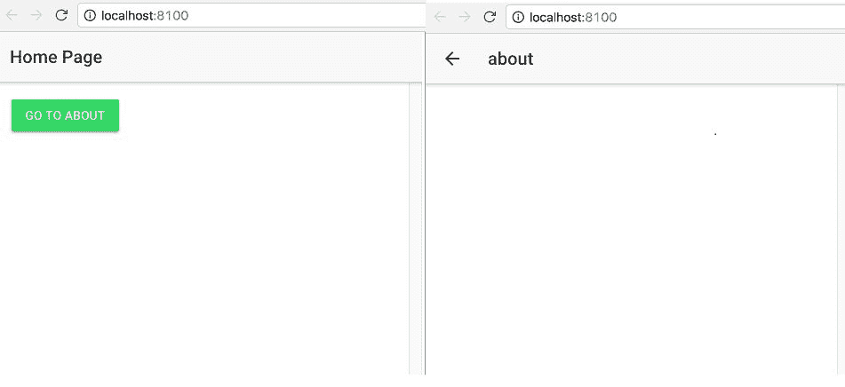

现在，如果我们想要导航回去，我们可以使用自动生成的返回按钮，或者我们可以在关于页面上创建一个按钮返回。为了做到这一点，请按照以下方式更新`example9/src/pages/about/about.html`：

```html
<ion-header> 
  <ion-navbar> 
    <ion-title>About Page</ion-title> 
  </ion-navbar> 
</ion-header> 

<ion-content padding> 
   <button ion-button color="light" (click)="goBack()">Back</button> 
</ion-content>

```

并按照以下方式更新`example9/src/pages/about/about.ts`：

```html
import { Component } from '@angular/core'; 
import { NavController } from 'ionic-angular'; 

@Component({ 
  selector: 'page-about', 
  templateUrl: 'about.html' 
}) 
export class AboutPage { 

  constructor(public navCtrl: NavController) {} 

  goBack(){ 
    this.navCtrl.pop(); 
  } 
}

```

请注意`this.navCtrl.pop();`--这是我们从视图中弹出页面的方法。

如果我们保存所有文件并返回浏览器，然后从主页导航到关于，我们应该会看到一个返回按钮。点击它将会带我们回到主页。

这是一个简单的例子，说明了我们如何将两个页面连接在一起。

除此之外，我们还有页面事件，指示页面的各个阶段。为了更好地理解这一点，我们将按照以下方式更新`example9/src/pages/about/about.ts`：

```html
import { Component } from '@angular/core'; 
import { NavController } from 'ionic-angular'; 

@Component({ 
  selector: 'page-about', 
  templateUrl: 'about.html' 
}) 
export class AboutPage { 

  constructor(public navCtrl: NavController) { } 

  goBack() { 
    this.navCtrl.pop(); 
  } 

  ionViewDidLoad() { 
    console.log("About page: ionViewDidLoad Fired"); 
  } 

  ionViewWillEnter() { 
    console.log("About page: ionViewWillEnter Fired"); 
  } 

  ionViewDidEnter() { 
    console.log("About page: ionViewDidEnter Fired"); 
  } 

  ionViewWillLeave() { 
    console.log("About page: ionViewWillLeave Fired"); 
  } 

  ionViewDidLeave() { 
    console.log("About page: ionViewDidLeave Fired"); 
  } 

  ionViewWillUnload() { 
    console.log("About page: ionViewWillUnload Fired"); 
  } 

  ionViewDidUnload() { 
    console.log("About page: ionViewDidUnload Fired"); 
  } 
}

```

保存所有文件，导航到浏览器，从主页导航到关于，然后返回，我们应该会看到以下内容：

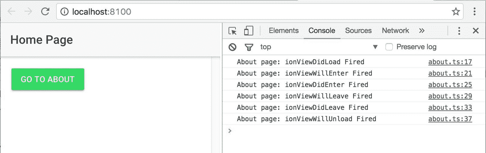

基于此，我们可以挂接到各种事件，并在需要时采取相应的行动。

# 在页面之间传递数据

到目前为止，我们已经看到了如何从一个页面移动到另一个页面。现在，使用`NavParams`，我们将从一个页面传递数据到另一个页面。

在相同的`example9`项目中，我们将添加这个功能。在主页上，我们将呈现一个文本框，供用户输入数据。一旦用户输入数据并点击转到关于，我们将获取`textbox`的值，并将其传递到关于页面，并在关于页面中打印我们在主页上捕获的文本。

要开始，我们将按照以下方式更新`example9/src/pages/home/home.html`：

```html
<ion-header> 
    <ion-navbar> 
        <ion-title> 
            Home Page 
        </ion-title> 
    </ion-navbar> 
</ion-header> 
<ion-content padding> 
    <ion-list> 
        <ion-item> 
            <ion-label color="primary">Enter</ion-label> 
            <ion-input placeholder="Something..." #text></ion-input> 
        </ion-item> 
    </ion-list> 
    <button ion-button color="secondary" (click)="openAbout(text.value)">Go To About</button> 
</ion-content>

```

请注意，我们已经更新了`openAbout`方法以获取文本值。接下来，我们将更新`example9/src/pages/home/home.ts`：

```html
import { Component } from '@angular/core'; 
import { NavController } from 'ionic-angular'; 
import { AboutPage } from '../about/about'; 

@Component({ 
  selector: 'page-home', 
  templateUrl: 'home.html' 
}) 
export class HomePage { 

  constructor(public navCtrl: NavController) {} 

  openAbout(text){ 
    text = text || 'Nothing was entered'; 

    this.navCtrl.push(AboutPage, { 
      data : text 
    }); 
  } 
}

```

请注意我们传递给`navCtrl`的 push 方法的第二个参数。这是我们如何从主页传递数据。现在我们将更新`example9/src/pages/about/about.ts`以捕获数据：

```html
import { Component } from '@angular/core'; 
import { NavController, NavParams } from 'ionic-angular'; 

@Component({ 
  selector: 'page-about', 
  templateUrl: 'about.html' 
}) 
export class AboutPage { 
  text: string; 

  constructor(public navCtrl: NavController, public navParams: NavParams) {  
    this.text = navParams.get('data'); 
  } 

  goBack() { 
    this.navCtrl.pop(); 
  } 

  /// SNIPP :: Page events... 
}

```

为了捕获数据，我们需要从`ionic-angular`中导入`NavParams`。并且使用`navParams.get(data);`，我们在构造函数中获取从主页传递过来的数据。

最后，为了在关于页面中显示数据，请按照以下方式更新`example9/src/pages/about/about.html`：

```html
<ion-header> 
    <ion-navbar> 
        <ion-title>About Page</ion-title> 
    </ion-navbar> 
</ion-header> 
<ion-content padding> 
    <label>Text Entered : {{text}}</label> 
    <br> 
    <button ion-button color="light" (click)="goBack()">Back</button> 
</ion-content>

```

保存所有文件并返回浏览器，我们应该能够看到以下内容：

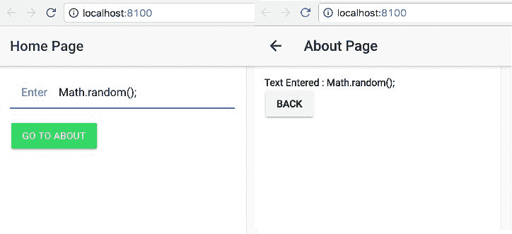

现在我们知道如何将两个页面连接在一起并在它们之间传递数据。

我们可以使用`@IonicPage`装饰器实现导航和延迟加载。您可以在第十一章中找到更多关于此的信息，*Ionic 3*。

# 配置服务

该服务允许您配置和设置特定于应用程序的首选项。

为了在各种组件中跨平台或在同一平台内定制应用程序的外观和感觉，我们使用配置服务。

为了更好地理解这项服务，我们将搭建一个新的应用程序并与之一起工作。运行以下命令：

```html
ionic start -a "Example 10" -i app.example.ten example10 tabs --v2

```

然后运行`ionic serve --lab`。

这将在实验室视图中运行选项卡应用程序，我们可以在其中同时看到 Android iOS 和 Windows 应用程序。

我们还可以使用以下 URL 在三个平台视图中查看 Ionic 应用程序：

iOS：[`localhost:8100/?ionicplatform=ios`](http://localhost:8100/?ionicplatform=ios) Android：[`localhost:8100/?ionicplatform=android`](http://localhost:8100/?ionicplatform=android) Windows：[`localhost:8100/?ionicplatform=windows`](http://localhost:8100/?ionicplatform=windows)

我们应该看到类似于这样的东西：

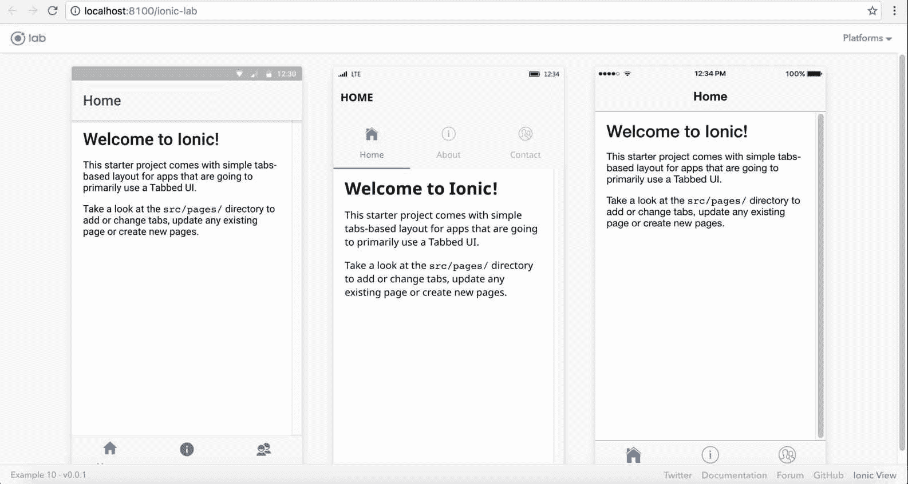

配置设置在`@NgModule`上。如果我们打开`example10/src/app/app.module.ts`，我们应该找到`NgModule`装饰器，在其中我们可以找到`IonicModule.forRoot(MyApp)`。

简单的配置看起来像这样：

```html
//... snipp 
imports: [ 
    IonicModule.forRoot(MyApp, { 
        mode: 'md' 
    }) 
  ], 
//.. snipp

```

这将使外观和感觉默认为材料设计，而不考虑平台。我们应该能够看到以下内容：

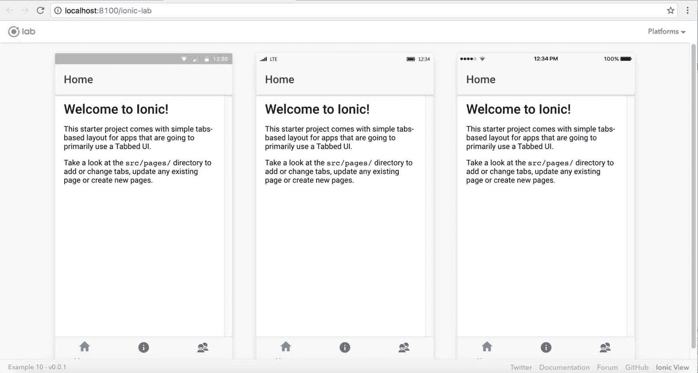

您还可以像这样设置其他配置值：

```html
//.. snipp 
imports: [ 
    IonicModule.forRoot(MyApp, { 
      backButtonText: 'Go Back', 
      iconMode: 'ios', 
      modalEnter: 'modal-slide-in', 
      modalLeave: 'modal-slide-out', 
      tabsPlacement: 'bottom', 
      pageTransition: 'ios', 
    }) 
  ], 
//... snipp

```

前面的值相当自明。

配置中的属性可以在应用程序级别、平台级别和组件级别进行覆盖。

例如，您可以在应用程序级别以及平台级别覆盖`tabberPlacement`属性，如下所示：

```html
//..snipp 
imports: [ 
    IonicModule.forRoot(MyApp, { 
      tabsPlacement: 'bottom', // bottom for all platforms 
      platforms: { 
        ios: { 
          tabsPlacement: 'top', // top only for iOS 
        } 
      } 
    }) 
  ], 
//...snipp

```

我们将看到以下内容：

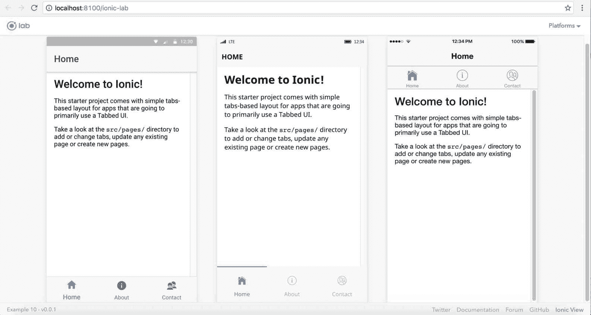

我们也可以在组件级别进行覆盖。更新`example10/src/pages/tabs/tabs.html`如下：

```html
<ion-tabs tabsPlacement="top"> 
  <ion-tab [root]="tab1Root" tabTitle="Home" tabIcon="home"></ion-tab> 
  <ion-tab [root]="tab2Root" tabTitle="About" tabIcon="information-circle"></ion-tab> 
  <ion-tab [root]="tab3Root" tabTitle="Contact" tabIcon="contacts"></ion-tab> 
</ion-tabs>

```

我们应该看到以下内容：

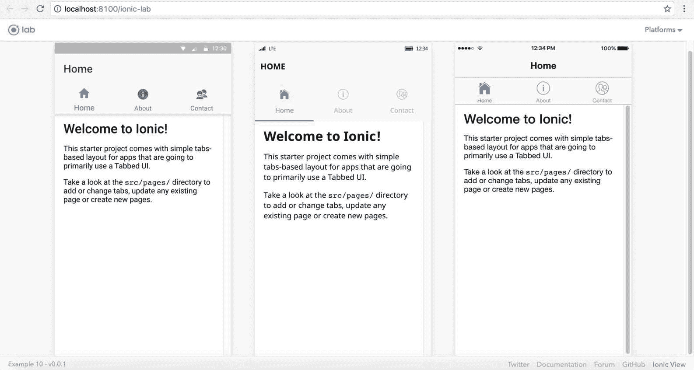

为了快速测试，我们还可以在 URL 中设置配置属性，而不定义任何覆盖。例如，要测试将选项卡放在顶部时的外观，我们可以转到此 URL：[`localhost:8100/?ionicTabsPlacement=top`](http://localhost:8100/?ionicTabsPlacement=top)

我们还可以在配置中设置自定义属性，并在以后提取它们。例如，我们可以设置以下属性：

```html
config.set('ios', 'themePref', 'dark');

```

然后我们可以使用以下方法获取值：

```html
config.get('themePref');

```

我们可以从`ionic-angular`导入`config`，例如`import {Config} from 'ionic-angular';`，然后在构造函数中初始化`config`：`constructor(private config : Config) { //**// }`

# 平台服务

平台服务返回有关当前平台的可用信息。Ionic 的新版平台服务提供了更多信息，帮助我们根据设备类型定制应用程序。

为了更好地了解平台服务，我们将创建一个空白应用程序。运行以下命令：

```html
ionic start -a "Example 11" -i app.example.eleven example11 blank --v2

```

然后运行`ionic serve`启动空白应用程序。

现在我们将在`example11/src/pages/home/home.ts`中添加对 Platform 类的引用。更新`home.ts`如下：

```html
import { Component } from '@angular/core'; 
import { Platform } from 'ionic-angular'; 

@Component({ 
  selector: 'page-home', 
  templateUrl: 'home.html' 
}) 
export class HomePage { 
  constructor(public platform: Platform) {} 
}

```

现在我们将开始使用`Platform`类的各种功能。

我们要查看的第一个是`userAgent`字符串。要访问`userAgent`，我们可以在平台上执行`userAgent()`。

更新`example11/src/pages/home/home.html`内容部分如下：

```html
<ion-header> 
    <ion-navbar> 
        <ion-title> 
            Ionic Blank 
        </ion-title> 
    </ion-navbar> 
</ion-header> 
<ion-content padding> 
    <ion-card> 
        <ion-card-header> 
            Platform : User Agent 
        </ion-card-header> 
        <ion-card-content> 
            {{platform.userAgent()}} 
        </ion-card-content> 
    </ion-card> 
</ion-content>

```

我们应该看到以下内容：

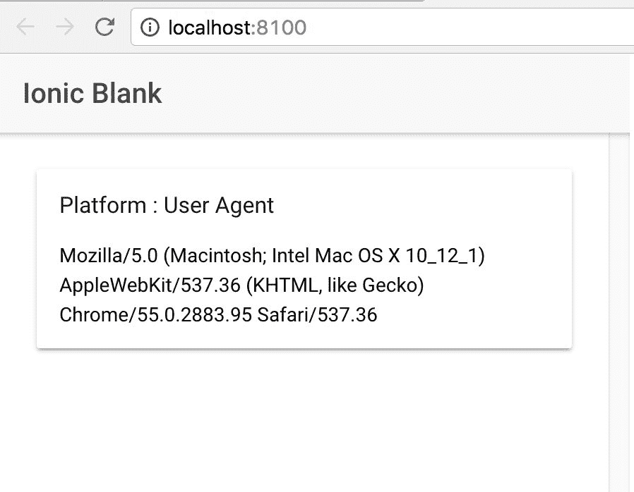

接下来，我们将找出应用程序正在运行的平台；为此，我们将更新`home.html`中的`ion-content`内容如下：

```html
<ion-card> 
    <ion-card-header> 
      Platform : platformName 
    </ion-card-header> 
    <ion-card-content> 
      <ion-list> 
        <ion-item> 
          android : {{platform.is('android')}} 
        </ion-item> 
        <ion-item> 
          cordova : {{platform.is('cordova')}} 
        </ion-item> 
        <ion-item> 
          core : {{platform.is('core')}} 
        </ion-item> 
        <ion-item> 
          ios : {{platform.is('ios')}} 
        </ion-item> 
        <ion-item> 
          ipad : {{platform.is('ipad')}} 
        </ion-item> 
        <ion-item> 
          iphone : {{platform.is('iphone')}} 
        </ion-item> 
        <ion-item> 
          mobile : {{platform.is('mobile')}} 
        </ion-item> 
        <ion-item> 
          mobileweb : {{platform.is('mobileweb')}} 
        </ion-item> 
        <ion-item> 
          phablet : {{platform.is('phablet')}} 
        </ion-item> 
        <ion-item> 
          tablet : {{platform.is('tablet')}} 
        </ion-item> 
        <ion-item> 
          windows : {{platform.is('windows')}} 
        </ion-item> 
      </ion-list> 
    </ion-card-content> 
  </ion-card>

```

当浏览器刷新时，我们应该看到以下内容：

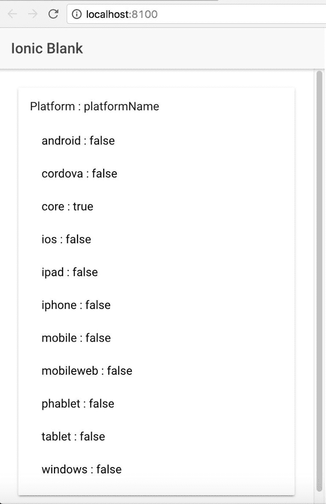

正如我们从屏幕截图中看到的，当在浏览器中运行时，前面的平台名称是这些值。

现在，让我们添加浏览器平台并查看是否有任何更改。运行以下命令：

```html
ionic platform add browser 

```

然后运行：

```html
ionic run browser

```

您应该能够在浏览器中看到 Ionic 应用程序启动，并且现在输出应该如下所示：

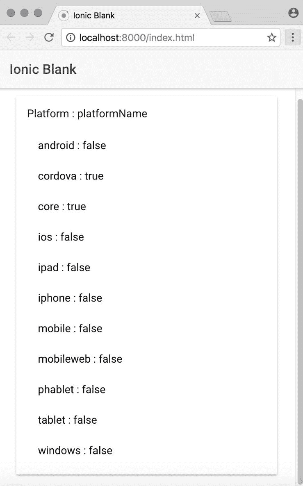

如果我们仔细观察，我们可以看到在前面的屏幕截图中，`cordova`现在设置为`true`。

使用前面的平台名称，我们可以轻松定制应用程序并调整用户体验。

要了解有关平台服务的更多信息，请参阅[`ionicframework.com/docs/api/platform/Platform/`](http://ionicframework.com/docs/api/platform/Platform/)

# 存储服务

在本节中，我们将研究存储服务。Ionic 的 Storage 类帮助我们与应用程序在原生容器中运行时可用的各种存储选项进行交互。

引用 Ionic 文档：

Storage 是一种存储键/值对和 JSON 对象的简单方法。Storage 在底层使用各种存储引擎，根据平台选择最佳的存储引擎。

在本机应用上下文中运行时，Storage 将优先使用 SQLite，因为它是最稳定和广泛使用的基于文件的数据库之一，并且避免了一些像 localstorage 和 IndexedDB 这样的问题，比如操作系统决定在低磁盘空间情况下清除这些数据。

在 Web 或作为渐进式 Web 应用运行时，Storage 将尝试使用 IndexedDB、WebSQL 和 localstorage，按照这个顺序。

现在，要开始使用 Storage 类，我们将创建一个新的应用。运行以下命令：

```html
ionic start -a "Example 12" -i app.example.twelve example12 blank --v2 

```

然后运行`ionic serve`在浏览器中启动它。

为了了解如何使用 Storage，我们将构建一个简单的用户管理应用。在这个应用中，我们可以添加用户，将数据持久化存储，然后稍后删除它。这个应用的主要目的是探索 Storage 类。

最终的应用将看起来像下面这样：

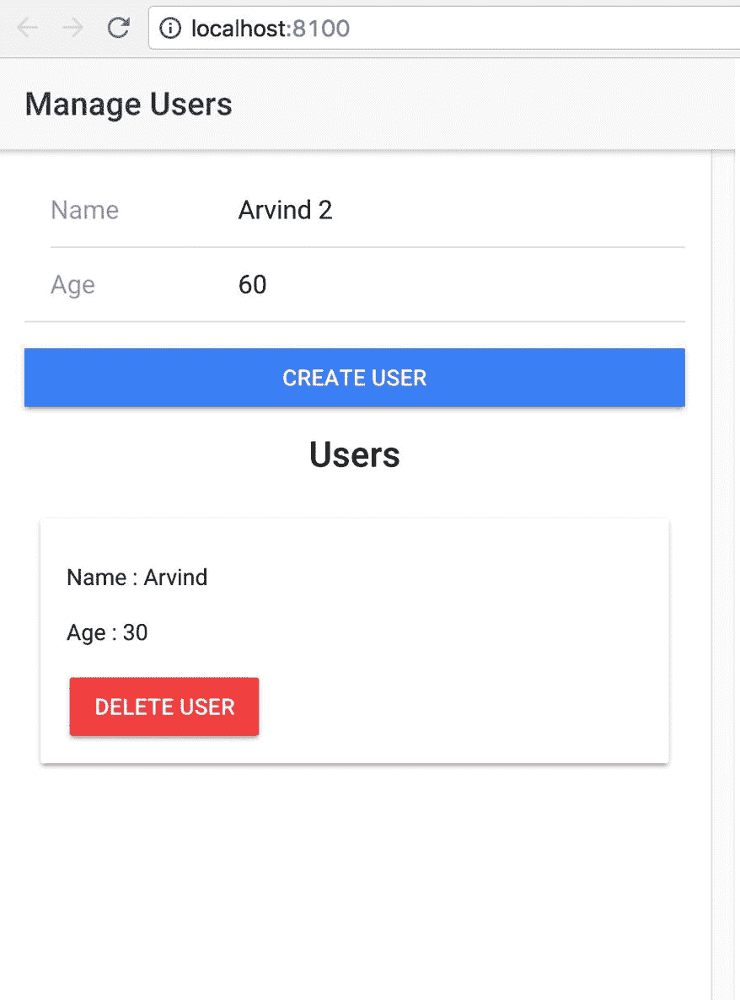

在开始使用`Storage`类之前，我们需要将其添加到我们的`Ionic`项目中。运行以下命令：

```html
npm install --save @ionic/storage

```

接下来，我们需要将其添加为提供者。按照以下方式更新`example12/src/app/app.module.ts`：

```html
import { BrowserModule } from '@angular/platform-browser'; 
import { ErrorHandler, NgModule } from '@angular/core'; 
import { IonicApp, IonicErrorHandler, IonicModule } from 'ionic-angular'; 
import { SplashScreen } from '@ionic-native/splash-screen'; 
import { StatusBar } from '@ionic-native/status-bar'; 

import { MyApp } from './app.component'; 
import { HomePage } from '../pages/home/home'; 
import { IonicStorageModule } from '@ionic/storage'; 

@NgModule({ 
  declarations: [ 
    MyApp, 
    HomePage 
  ], 
  imports: [ 
    BrowserModule, 
    IonicModule.forRoot(MyApp), 
    IonicStorageModule.forRoot() 
  ], 
  bootstrap: [IonicApp], 
  entryComponents: [ 
    MyApp, 
    HomePage 
  ], 
  providers: [ 
    StatusBar, 
    SplashScreen, 
    {provide: ErrorHandler, useClass: IonicErrorHandler} 
  ] 
}) 
export class AppModule {}

```

接下来，我们将构建界面。打开`example12/src/pages/home/home.html`。首先我们将更新头部如下：

```html
<ion-header> 
    <ion-navbar> 
        <ion-title> 
            Manage Users 
        </ion-title> 
    </ion-navbar> 
</ion-header>

```

接下来，在内容部分，我们将创建两个部分，一个用于用户输入姓名和年龄的表单，另一个用于显示用户列表的部分：

```html
<ion-content padding> 
    <div> 
        <ion-list> 
            <ion-item> 
                <ion-label fixed>Name</ion-label> 
                <ion-input type="text" placeholder="Enter Name" #name>
                </ion-input> 
            </ion-item> 
            <ion-item> 
                <ion-label fixed>Age</ion-label> 
                <ion-input type="number" placeholder="Enter Age" #age> 
                </ion-input> 
            </ion-item> 
        </ion-list> 
        <button ion-button full color="primary" (click)="addUser(name, 
        age)" [disabled]="!name.value || !age.value">Create 
        User</button> 
    </div> 
    <div *ngIf="users.length > 0"> 
        <h3 style="text-align: center;" padding>Users</h3> 
        <ion-card *ngFor="let user of users"> 
            <ion-card-content> 
                <ion-label>Name : {{user.name}}</ion-label> 
                <ion-label>Age : {{user.age}}</ion-label> 
                <button ion-button color="danger" 
                (click)="removeUser(user)">Delete User</button> 
            </ion-card-content> 
        </ion-card> 
    </div> 
</ion-content>

```

接下来，我们将开始处理逻辑。按照以下方式更新`example12/src/pages/home/home.ts`：

```html
import { Component } from '@angular/core'; 
import { NavController } from 'ionic-angular'; 
import { Storage } from '@ionic/storage'; 

@Component({ 
  selector: 'page-home', 
  templateUrl: 'home.html' 
}) 
export class HomePage { 
  users: any[] = []; 

  constructor(private navCtrl: NavController, private storage: Storage) { 
    // get all the users from storage on load 
    this.getUsers(); 
  } 

  getUsers() { 
    this.storage.ready().then(() => { 
      this.storage.forEach((v, k, i) => { 
        if (k.indexOf('user-') === 0) { 
          this.users.push(v); 
        } 
      }); 
    }); 
  } 

  addUser(name, age) { 
    this.storage.ready().then(() => { 
      let user = { 
        id: this.genRandomId(), 
        name: name.value, 
        age: age.value 
      }; 
      // save it to the storage 
      this.storage.set('user-' + user.id, user); 
      // update the inmemory variable to refresh the UI 
      this.users.push(user); 
      // reset the form 
      name.value = ''; 
      age.value = ''; 
    }); 
  } 

  removeUser(user) { 
    this.storage.ready().then(() => { 
      // remove from storage 
      this.storage.remove('user-' + user.id); 
      // update the inmemory variable to refresh the UI 
      this.users.splice(this.users.indexOf(user), 1); 
    }); 
  } 

  genRandomId() { 
    return Math.floor(Math.random() * 9999); // up to 4 digits random number 
  } 

}

```

在上面的代码中，首先我们从`@ionic/storage`中导入了`Storage`。接下来，在构造函数中实例化了相同的内容。

我们创建了一个名为`users`的类变量，用于在内存中存储我们创建的所有用户。在构造函数内部，我们调用`getUsers()`来在加载时从存储中获取用户。我们创建了两个函数，`addUser()`和`removeUser()`，用于添加用户和删除用户。

由于存储是一个键值存储，我们使用用户的 ID 创建存储的键。例如，如果用户的 ID 是 1，我们将键创建为`user-1`。这样，我们知道存储中属于我们应用的所有键都以*user*开头，以防其他实体在同一个应用中使用 Storage。

我们使用`genRandomId()`来生成一个 1 到 9999 之间的随机数。

如果我们保存所有文件，返回浏览器，并打开控制台，我们应该看到类似以下的内容：

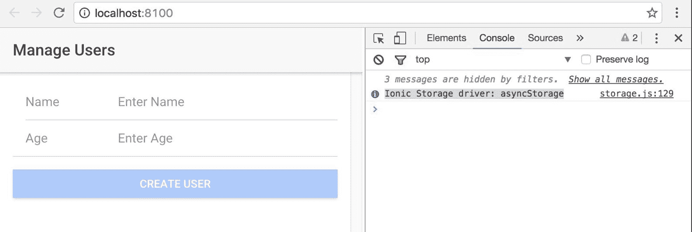

请注意控制台中的消息。这条消息告诉我们数据将被存储在 asynStorage 中。因此，在 Chrome 中，它将是 IndexedDB。

因此，在 Chrome 中，如果我们在开发工具中点击应用程序选项卡并导航到 IndexedDB，我们应该看到类似以下的内容：

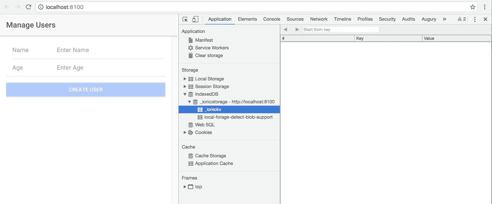

现在，让我们使用表单添加一个用户。更新后的屏幕和存储应该如下所示：

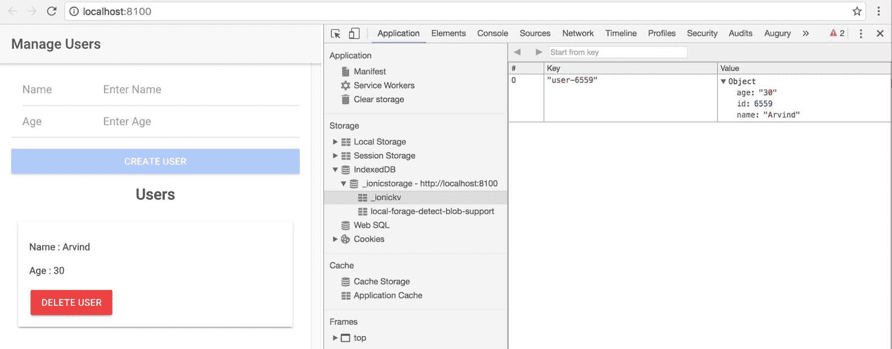

现在，点击删除后，我们应该看到存储已清除，并且 UI 更新后没有任何用户。

因此，使用存储，我们可以在 Ionic 应用中轻松开始处理数据持久性，而不必担心底层实现。

如果需要，我们可以覆盖`IonicStorageModule.forRoot()`如下：

```html
IonicStorageModule.forRoot({
  name: 'appDB',
  driverOrder: ['indexeddb', 'sqlite', 'websql']
})

```

您可以在这里找到更多配置和属性：[`ionicframework.com/docs/storage/`](https://ionicframework.com/docs/storage/)

通过这样，我们完成了 Ionic 中 Storage 的概述。

# 摘要

在本章中，我们已经介绍了 Ionic 的两个主要装饰器。然后我们介绍了配置和平台服务，并看到了如何根据平台和配置自定义应用程序。之后，我们介绍了 Ionic 中的存储 API。请参考第十一章，*Ionic 3*，了解全新的`IonicPage`指令和`IonicPage`模块。

在下一章中，我们将学习如何为 Ionic 应用创建主题。
