# 第五章：Ionic 和 SCSS

在本章中，我们将介绍使用 Ionic 进行主题设置。Ionic 中的主题设置简单且易于实现。Ionic 团队在简化和模块化 Ionic 中的主题设置方面付出了很大的努力。简而言之，Ionic 中的主题设置发生在组件级别，以及平台级别（iOS、Android 和 WP）。Ionic 使用 SCSS 来处理主题设置。在本章中，我们将介绍以下主题：

+   Sass 与 SCSS

+   使用 SCSS 变量

+   平台级别和页面/组件级别的覆盖

# 什么是 Sass？

引用自 Sass 文档：

“Sass 是 CSS 的扩展，为基本语言增添了力量和优雅。”

它允许我们使用变量、嵌套规则、mixin、内联导入等，所有这些都是完全兼容 CSS 的语法。Sass 有助于保持大型样式表的良好组织，并快速启动小型样式表。

简单来说，Sass 使 CSS 可编程。但是，本章的标题是 SCSS；为什么我们要谈论 Sass 呢？嗯，Sass 和 SCSS 基本上是相同的 CSS 预处理器，每个都有自己的编写预 CSS 语法的方式。

SCSS 是作为另一个名为 HAML（[`haml.info/`](http://haml.info/)）的预处理器的一部分而开发的，由 Ruby 开发人员，因此它继承了很多来自 Ruby 的语法风格，例如缩进、无大括号和无分号。

一个示例的 Sass 文件看起来像这样：

```html
// app.sass 

brand-primary= blue 

.container 
    color= !brand-primary 
    margin= 0px auto 
    padding= 20px 

=border-radius(!radius) 
    -webkit-border-radius= !radius 
    -moz-border-radius= !radius 
    border-radius= !radius 

* 
    +border-radius(0px) 

```

通过 Sass 编译器运行，它将返回以下代码：

```html
.container { 
  color: blue; 
  margin: 0px auto; 
  padding: 20px; 
} 

* { 
  -webkit-border-radius: 0px; 
  -moz-border-radius: 0px; 
  border-radius: 0px; 
}

```

好老的 CSS。但是你有没有注意到`brand-primary`作为一个变量，在容器类内替换它的值？以及`border-radius`作为一个函数（也称为 mixin），在调用时生成所需的 CSS 规则？是的，这是 CSS 编程中缺失的一部分。你可以尝试前面的转换：[`sasstocss.appspot.com/`](http://sasstocss.appspot.com/)，看看 Sass 是如何编译成 CSS 的。

习惯于基于大括号的编码语言的人会觉得这种编写代码的方式有点困难。所以，SCSS 应运而生。

Sass 代表**Syntactically Awesome Style Sheets**，SCSS 代表**Sassy CSS**。因此，SCSS 基本上与 Sass 相同，除了类似于 CSS 的语法。前面的 Sass 代码，如果用 SCSS 编写，会变成这样：

```html
$brand-primary: blue; 

.container{ 
    color: !brand-primary; 
    margin: 0px auto; 
    padding: 20px; 
} 

@mixin border-radius($radius) { 
    -webkit-border-radius: $radius; 
    -moz-border-radius: $radius; 
    border-radius: $radius; 
} 

* { 
    @include border-radius(5px); 
}

```

这看起来更接近 CSS 本身，对吧？而且它很有表现力。Ionic 使用 SCSS 来为其组件设置样式。

如果你想了解更多关于 SCSS 与 Sass 的信息，你可以查看：[`thesassway.com/editorial/sass-vs-scss-which-syntax-is-better`](http://thesassway.com/editorial/sass-vs-scss-which-syntax-is-better)。

现在我们对 SCSS 和 Sass 是什么以及如何使用它们有了基本的了解，我们将利用它们在我们的 Ionic 应用程序中来维护和设置主题。

# Ionic 和 SCSS

默认情况下，Ionic 已经集成了 SCSS。与早期版本不同，在那个版本中，人们必须在项目中设置 SCSS，在 Ionic 2 中，主题设置变得更加模块化和简单。主题设置可以发生在两个级别：

+   在平台级别

+   在页面/组件级别

应用级别的主题设置几乎总是我们所需要的。我们会根据我们的品牌更改应用程序的颜色，由于 Ionic 使用了 SCSS 映射，颜色直接被组件继承。此外，我们可以根据需要添加、重命名和删除颜色。映射中唯一需要的颜色是主要颜色。如果颜色因模式而异，iOS、MD 和 WP 颜色可以进一步自定义。

如果我们希望保持我们的样式与那些页面/组件隔离并特定于它们，页面/组件级别的主题设置非常有帮助。这是应用程序开发的基于组件的方法的最大优势之一。我们可以保持我们的组件模块化和可管理，同时防止样式和功能从一个组件泄漏到另一个组件，除非有意为之。

为了掌握 Ionic 中的主题设置，我们将搭建一个新的选项卡应用程序并设置相同的主题。如果需要，创建一个名为`chapter5`的新文件夹，然后打开一个新的命令提示符/终端。运行以下命令：

```html
ionic start -a "Example 13" -i app.example.thirteen example13 tabs 
--v2

```

一旦应用程序被脚手架搭建，运行`ionic serve`在浏览器中查看应用程序。我们要处理的第一件事是颜色。打开`example13/src/theme/variables.scss`，我们应该会看到一个名为`$colors`的变量映射。

为了快速测试颜色方案，将`$colors`映射中的主要变量的值从`#387ef5`更改为`red`。我们应该会看到以下内容：

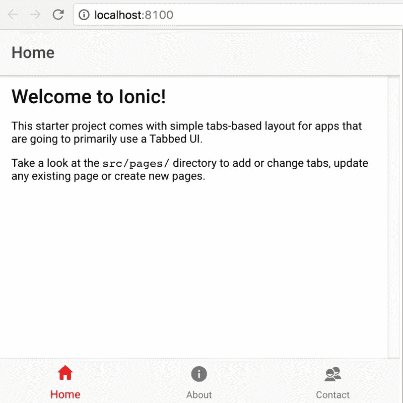

如前所述，主要是唯一的强制值。

颜色映射也可以扩展以添加我们自己的颜色。例如，在`example13/src/pages/home/home.html`上，让我们添加一个带有属性名称`purple`的按钮，看起来会像这样：

```html
<ion-content padding> 
    <button ion-button color="purple">A Purple Button</button> 
</ion-content>

```

在`$colors`映射中，添加一个新的键值：`purple: #663399`。完整的映射看起来像这样：

```html
$colors: ( 
  primary:    red, 
  secondary:  #32db64, 
  danger:     #f53d3d, 
  light:      #f4f4f4, 
  dark:       #222, 
  purple:     #663399 
);

```

现在，如果我们返回到页面，我们应该会看到以下内容：


确实很简单地向我们的应用程序添加新颜色。

我们可以通过添加基础和对比属性来进一步定制主题颜色。基础将是元素的背景，对比将是文本颜色。

为了测试上述功能，打开`example13/src/pages/about/about.html`，并按照下面的代码添加一个浮动操作按钮：

```html
<ion-content padding> 
  <button ion-fab color="different">FAB</button> 
</ion-content>

color=different to the FAB. We will be using this variable name to apply styles.
```

我们更新的`$colors`映射将如下所示：

```html
$colors: ( 
  primary:    red, 
  secondary:  #32db64, 
  danger:     #f53d3d, 
  light:      #f4f4f4, 
  dark:       #222, 
  purple:     #663399, 
  different: ( 
    base: #4CAF50, 
    contrast: #F44336 
  ) 
);

```

注意：这将为所有不同的 Ionic 组件生成样式。如果它们不是根组件的一部分，请不要将 SCSS 变量放在映射中。

保存所有文件后导航到关于选项卡时，我们应该会看到以下内容：

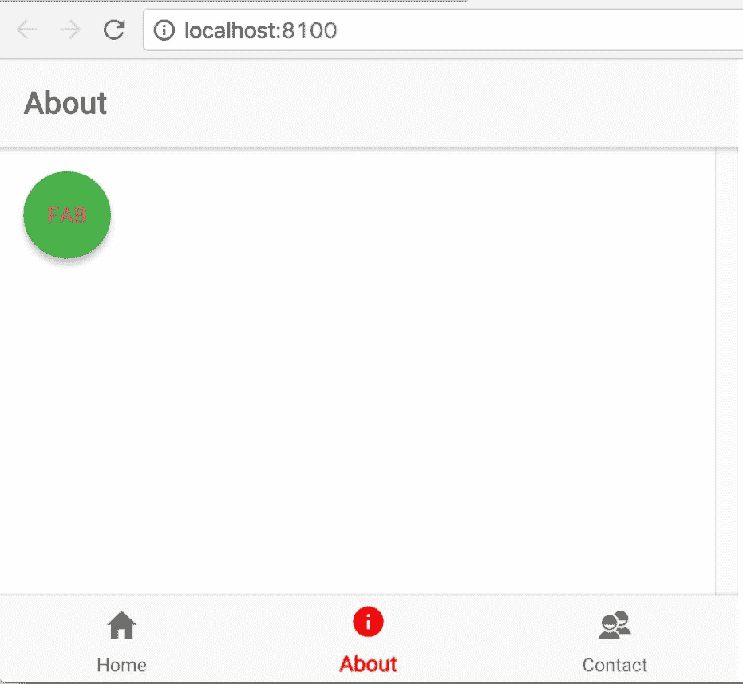

主题设置很简单吧？

# 页面级别覆盖

我们可以通过在两个不同页面中的同一组件上应用不同的样式，将相同的主题应用到下一个级别。例如，我们将使标签在关于页面和联系页面中看起来不同。这是我们将如何实现它的方式。

在`example13/src/pages/about/about.html`中，我们将在`ion-content`部分内添加一个新的标签，如下面的代码所示：

```html
<ion-content padding> 
  <button ion-fab color="different">FAB</button> 
  <label>This is a label that looks different from the one on Contact Page</label> 
</ion-content>

```

我们将在`example13/src/pages/about/about.scss`中添加所需的样式，如下面的代码所示：

```html
page-about { 
    label { 
        border: 2px solid #FF5722; 
        background: #FF5722; 
    } 
}

```

同样，我们将在`example13/src/pages/contact/contact.html`中的`ion-content`部分内添加另一个标签，如下面的代码所示：

```html
<ion-content> 
    <label>This is a label that looks different from the one on About Page</label> 
</ion-content>

```

我们将在`example13/src/pages/contact/contact.scss`中添加所需的样式，如下面的代码所示：

```html
page-contact { 
    label { 
        border: 2px solid #009688; 
        background: #009688; 
        margin: 20px; 
        margin-top: 100px; 
        display: block; 
    } 
}

```

现在，如果我们保存所有文件并返回到浏览器中的关于页面，我们应该会看到以下内容：

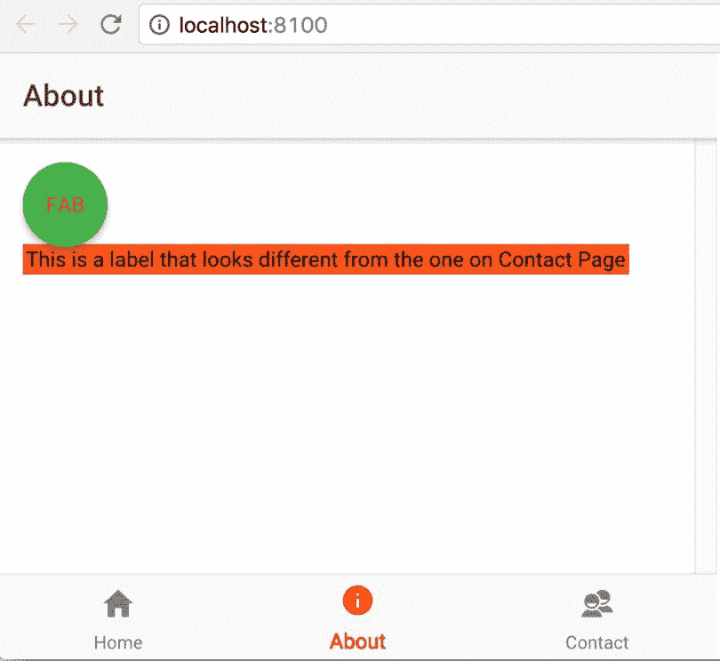

联系页面将如下所示：

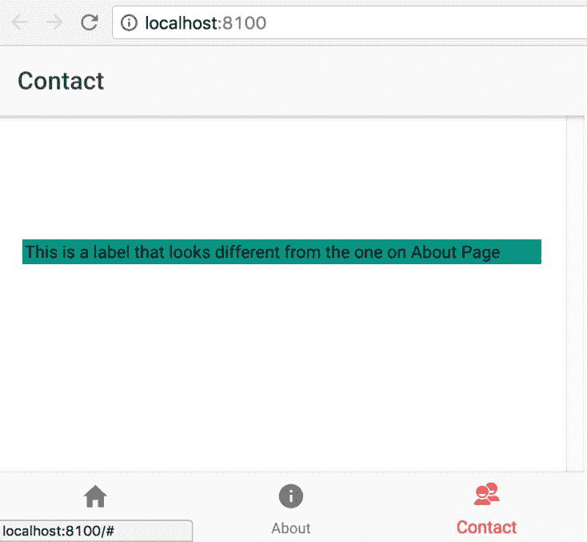

正如我们从上图中看到的，我们正在使用页面级样式来区分这两个组件。上面的截图是一个简单的例子，说明了我们如何在不同页面的同一组件中拥有多种样式。

# 平台级别覆盖

既然我们已经看到了如何在页面级别应用样式，让我们看看 Ionic 主题是如何简化在平台级别管理样式的。当在多个具有自己独特样式的设备上查看同一应用程序时，平台级样式是适用的。

在使用 Ionic 时，我们定义模式，其中模式是应用程序运行的平台。默认情况下，Ionic 会在`ion-app`元素上添加与模式相同的类名。例如，如果我们在 Android 上查看应用程序，body 将具有名为`md`的类，其中`md`代表**material design**。

为了快速检查这一点，我们将打开`http://localhost:8100/?ionicplatform=ios`，然后在开发者工具中检查 body 元素。我们应该会看到`ion-app`元素带有一个名为`ios`的类，以及其他类：

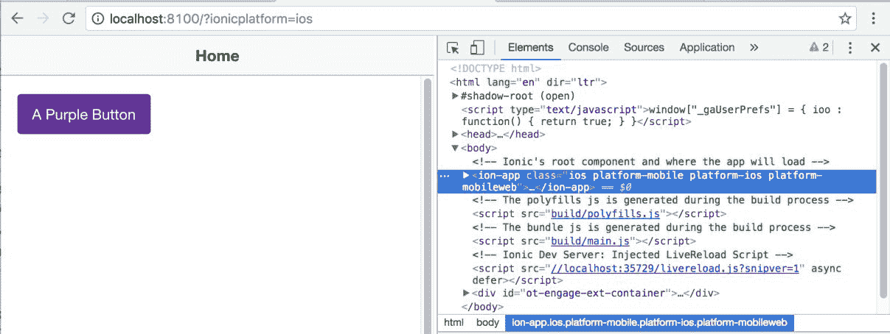

如果我们打开`http://localhost:8100/?ionicplatform=android`，我们应该会看到以下内容：

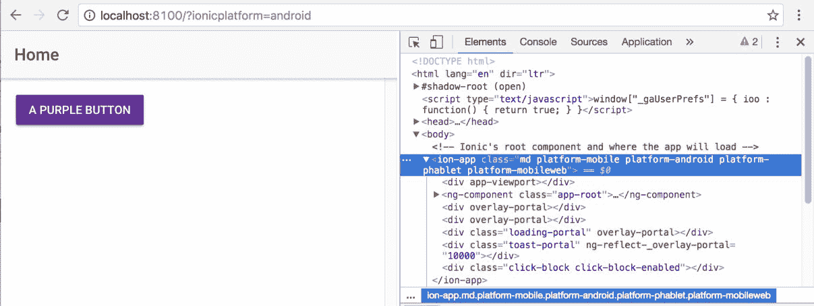

如果我们打开`http://localhost:8100/?ionicplatform=windows`，我们应该会看到以下内容：

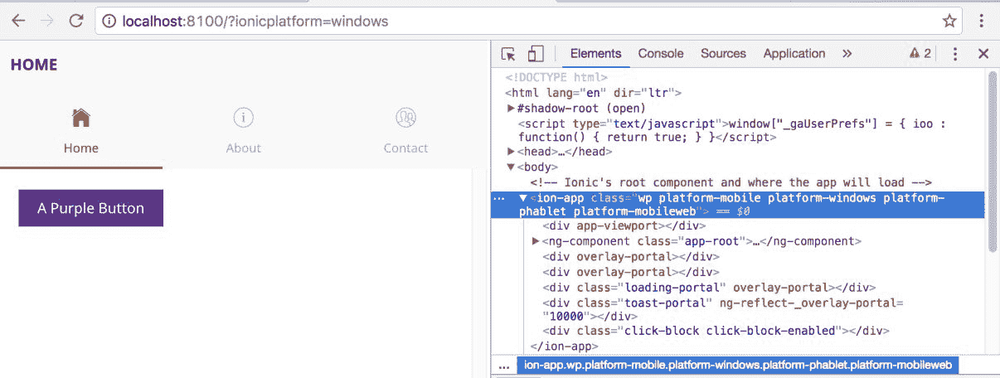

截至今天，Ionic 有三种模式：

| **平台** | **模式** | **描述** |
| --- | --- | --- |
| iOS | ios | 对所有组件应用 iOS 样式 |
| Android | md | 对所有组件应用 Material Design 样式 |
| Windows | wp | 对所有组件应用 Windows 样式 |
| Core | md | 如果我们不在上述设备中的任何一个上，应用将默认获得 Material Design 样式 |

更多信息请参阅：[`ionicframework.com/docs/theming/platform-specific-styles/`](http://ionicframework.com/docs/theming/platform-specific-styles/)。

我们将在`example13/src/theme/variables.scss`文件的注释提供的部分中定义特定于平台的样式。

为了理解特定于平台的样式，我们将为`navbar`应用不同的背景颜色并更改文本颜色。 

打开`example13/src/theme/variables.scss`并在注释中说`App Material Design Variables`的部分下添加以下样式：

```html
// App Material Design Variables 
// --------------------------------------------------

// Material Design only Sass variables can go here 
.md{ 
  ion-navbar .toolbar-background { 
      background: #FF5722; 
  } 

  ion-navbar .toolbar-title { 
      color: #fff; 
  } 
}

```

现在，当我们保存文件并导航到`http://localhost:8100/?ionicplatform=android`，我们应该看到以下内容：

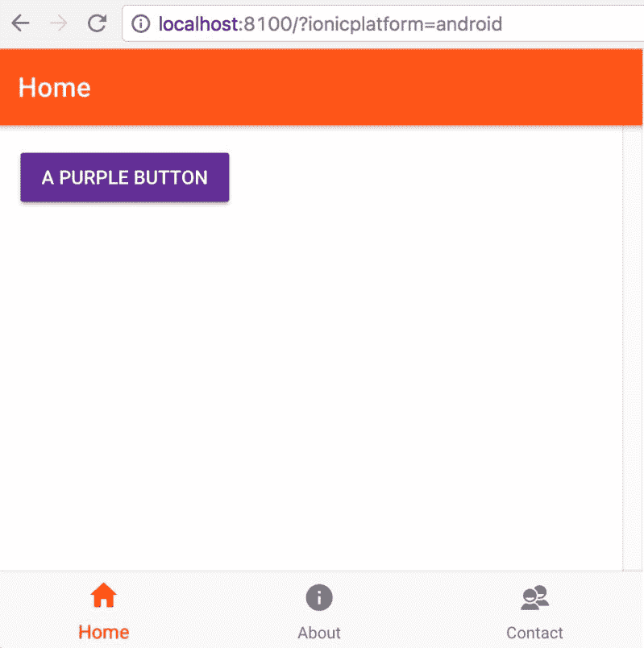

请注意`.md`类，其中嵌套了样式。这就是使样式特定于平台的原因。

类似地，我们更新`App iOS Variables`部分：

```html
// App iOS Variables 
// -------------------------------------------------- 
// iOS only Sass variables can go here 
.ios{ 
  ion-navbar .toolbar-background { 
      background: #2196F3; 
  } 

  ion-navbar .toolbar-title { 
      color: #fff; 
  } 
}

```

然后我们应该看到以下内容：

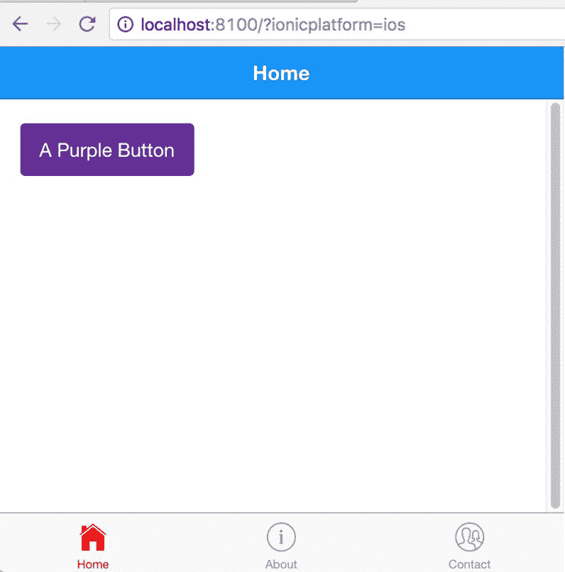

最后，对于 Windows，我们将根据以下代码更新`App Windows Variables`部分：

```html
// App Windows Variables 
// -------------------------------------------------- 
// Windows only Sass variables can go here 
.wp{ 
  ion-navbar .toolbar-background { 
      background: #9C27B0; 
  } 

  ion-navbar .toolbar-title { 
      color: #fff; 
  } 
}

```

我们应该看到以下内容：

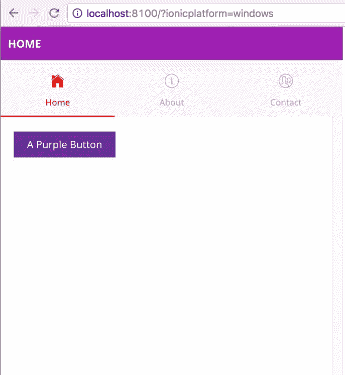

我们已经在第四章中看到了如何使用`config`属性将应用的模式更改为`md`、`ios`或`wp`。

我们也可以动态设置平台并应用样式。

为了理解这一点，我们将使用徽章组件。只有在 Windows 平台上，徽章组件才不会有任何边框半径，但我们希望使用动态属性来覆盖这种行为。

```html
ion-content section:
```

```html
<ion-item> 
        <ion-icon name="logo-dropbox" item-left></ion-icon> 
        Files 
        <ion-badge item-right [attr.round-badge]="isWindows ? '' : null">175</ion-badge> 
    </ion-item>

```

如果我们注意到在`ion-badge`上，我们有一个条件属性`[attr.round-badge]="isWindows ? '' : null"`。如果平台是 Windows，我们将添加一个名为`round-badge`的新属性，并根据以下代码更新`example13/src/pages/contact/contact.ts`：

```html
import { Component } from '@angular/core'; 
import { Platform } from 'ionic-angular'; 

@Component({ 
  selector: 'page-contact', 
  templateUrl: 'contact.html' 
}) 
export class ContactPage { 
  isWindows: Boolean; 

  constructor(public platform: Platform) { 
    this.isWindows = platform.is('windows'); 
  } 
}

```

我们已经在构造函数中定义了`isWindows`的值。现在，如果我们保存所有文件并导航到`http://localhost:8100/?ionicplatform=windows`，我们应该看到以下内容：

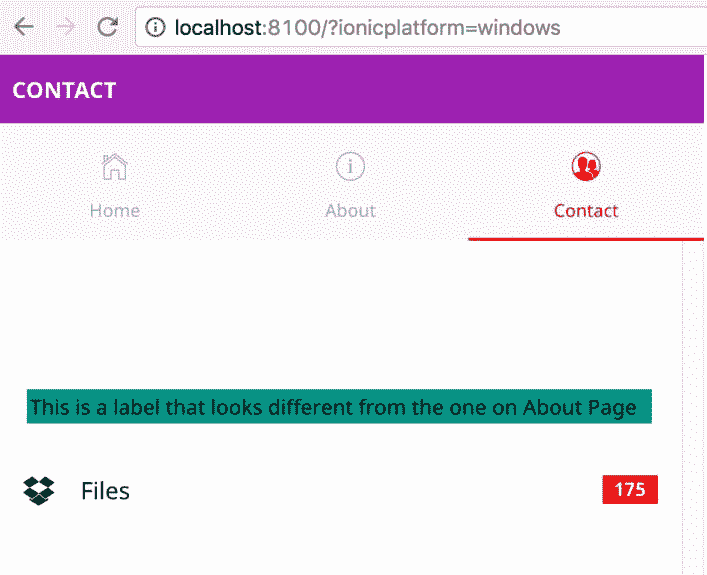

如果我们检查徽章，我们应该看到添加了属性`round-badge`：

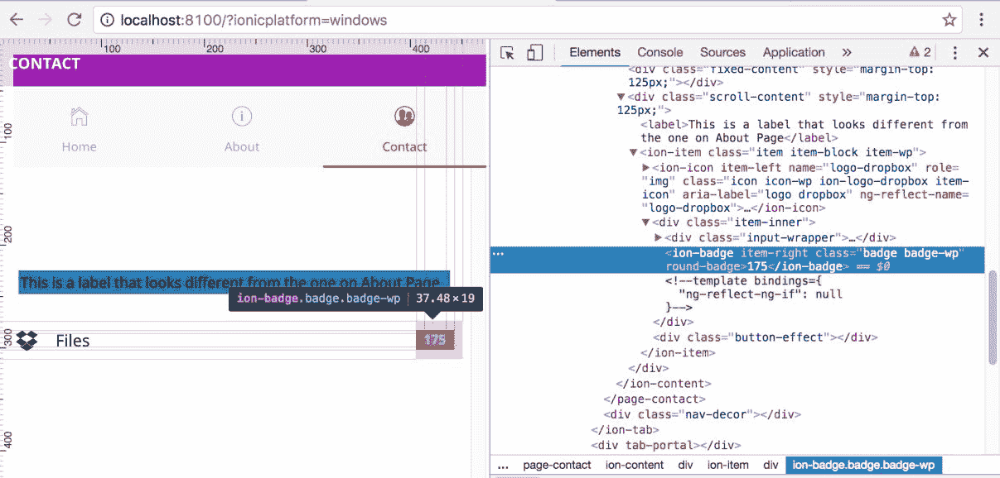

我们可以导航到其他平台并验证相同的内容。

如果我们观察，徽章容器的边框有`0px`的边框半径。现在我们将在`example13/src/theme/variables.scss`的`App Windows Variables`部分中添加所需的覆盖。

代码片段如下所示：

```html
.wp{ 
  // snipp 

  ion-badge[round-badge]{ 
    border-radius: 12px; 
  } 
}

```

现在，即使对于 Windows 平台，我们也可以看到`border-radius`被应用：

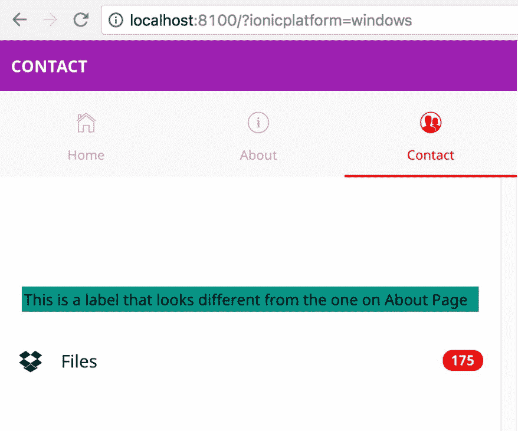

这是我们可以实现特定于平台的覆盖的另一种方式。

# 组件级别的覆盖

到目前为止，我们所见到的自定义大多是在页面和平台级别上。如果我们想要自定义 Ionic 提供的组件以匹配我们品牌的外观和感觉呢？

这也可以很容易地实现，这要归功于 Ionic 团队，他们已经在暴露变量名称以自定义属性的方面走了额外的一英里。

如果我们导航到[`ionicframework.com/docs/theming/overriding-ionic-variables/`](http://ionicframework.com/docs/theming/overriding-ionic-variables/)，我们将看到一个可过滤的表格，我们可以在其中找到可以覆盖的特定于组件的变量：

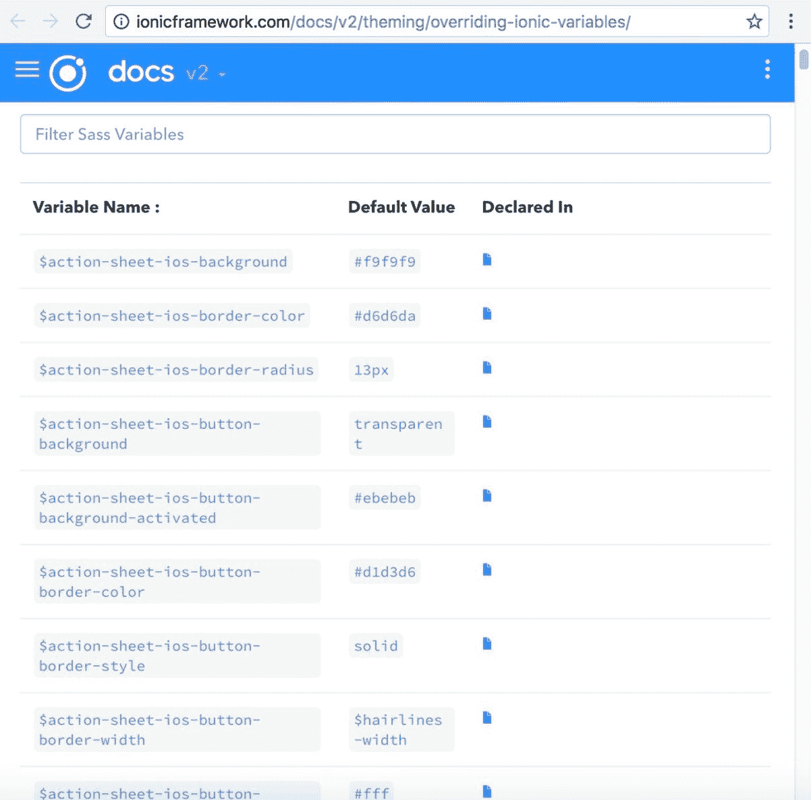

# 主题一个示例组件

为了快速检查这一点，我们将在当前应用的主页上实现覆盖加载栏。当用户登陆到这个标签页时，我们将以编程方式触发加载弹出窗口，并根据平台的不同，我们将自定义组件的外观和感觉，以展示组件可以根据我们的意愿进行自定义。

根据以下代码更新`example13/src/pages/home/home.ts`：

```html
import { Component } from '@angular/core'; 
import { LoadingController } from 'ionic-angular'; 

@Component({ 
  selector: 'page-home', 
  templateUrl: 'home.html' 
}) 
export class HomePage { 

  constructor(public loadingCtrl: LoadingController) { 
    this.presentLoading(); 
  } 

  presentLoading() { 
    let loader = this.loadingCtrl.create({ 
      content: "Please wait...", 
      duration: 3000 
    }); 
    loader.present(); 
  } 
}

```

我们定义了一个名为`presentLoading`的函数，并在构造函数中调用它。这将在页面加载时显示加载条。

如果我们保存此页面并导航到三个不同的平台，我们将看到特定于该特定平台的样式。在这个例子中，我们将使所有的加载条看起来（几乎）一样，不管平台如何。我们将通过搞乱`SCSS`变量来实现相同的效果。

如果我们导航到[`ionicframework.com/docs/theming/overriding-ionic-variables/`](http://ionicframework.com/docs/theming/overriding-ionic-variables/)并过滤`loading-ios`，我们将看到一堆与加载弹出样式相关的 SCSS 变量。同样，如果我们搜索`loading-md`，我们将找到与 Android 相关的 SCSS 变量。最后，如果我们搜索`loading-wp`，我们会找到 Windows 平台的 SCSS 变量。

我们将使用前面的变量名并自定义外观和感觉。打开`example13/src/theme/variables.scss`。在定义了`@import 'ionic.globals';`之后，在定义颜色映射之前，我们将添加组件级别的覆盖。如果你看的是被注释的 SCSS 文件，你会看到一个名为`Shared Variables`的部分。这是我们添加变量覆盖的地方。

我们取了一些 SCSS 变量，并修改了它们的属性，如下所示的代码：

```html
// Overriding Loading Popup for iOS  
// >> Start 
$loading-ios-background: #2196F3; 
$loading-ios-border-radius: 0px; 
$loading-ios-text-color: #fff; 
$loading-ios-spinner-color: #eee; 
// >> End 

// Overriding Loading Popup for Android  
// >> Start 
$loading-md-background: #2196F3; 
$loading-md-border-radius: 0px; 
$loading-md-text-color: #fff; 
$loading-md-spinner-color: #eee; 
// >> End 

// Overriding Loading Popup for Windows  
// >> Start 
$loading-wp-background: #2196F3; 
$loading-wp-border-radius: 0px; 
$loading-wp-text-color: #fff; 
$loading-wp-spinner-color: #eee; 
// >> End

```

现在，如果我们导航到`http://localhost:8100/?ionicplatform=ios`，我们应该会看到以下内容：

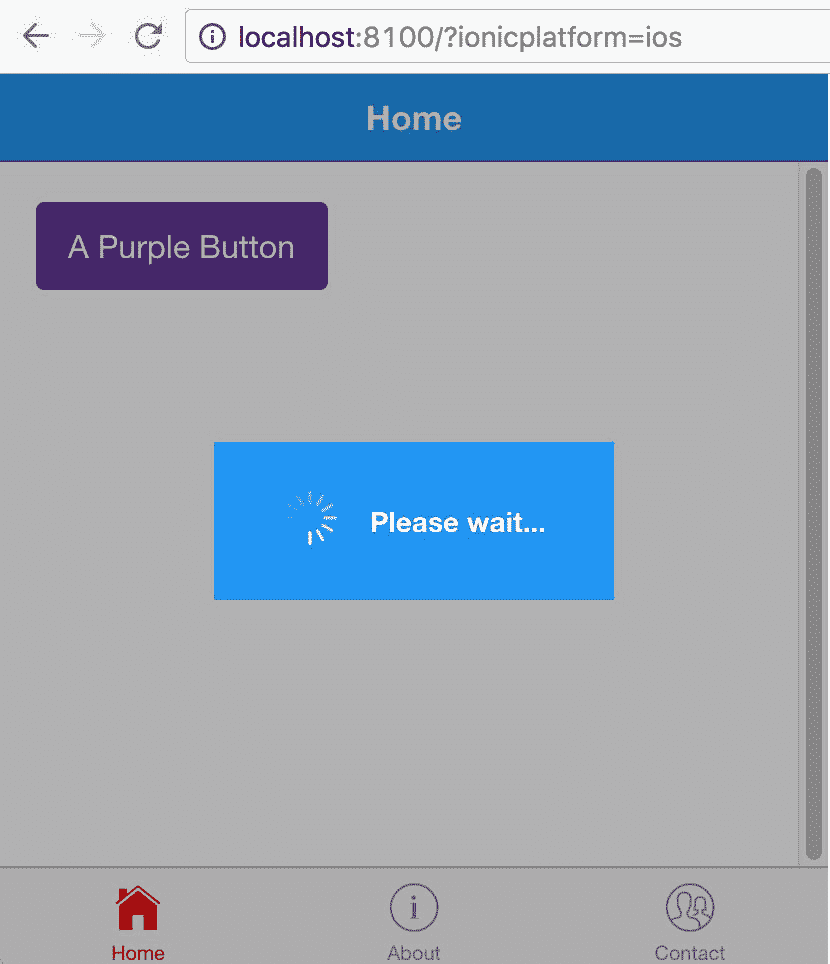

如果我们导航到`http://localhost:8100/?ionicplatform=android`，我们应该会看到以下内容：

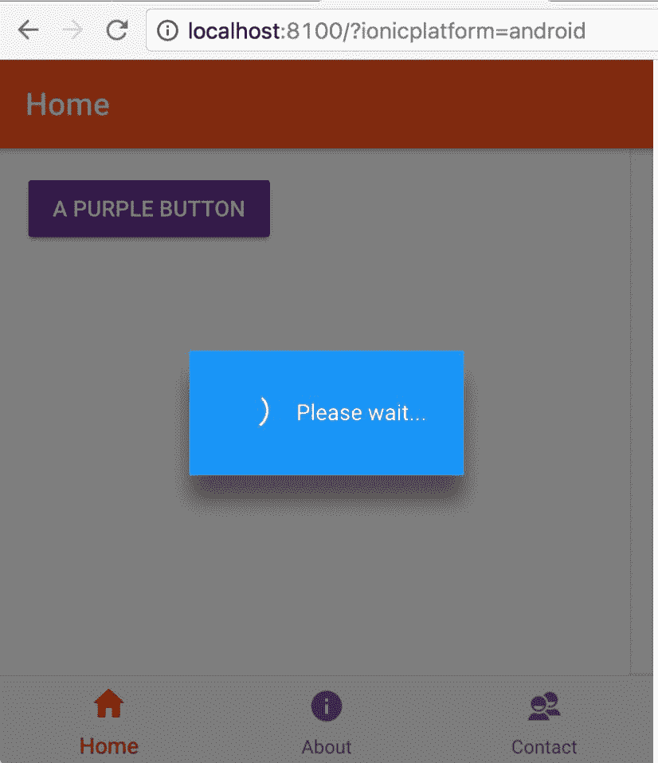

最后，如果我们导航到`http://localhost:8100/?ionicplatform=windows`，我们应该会看到以下内容：

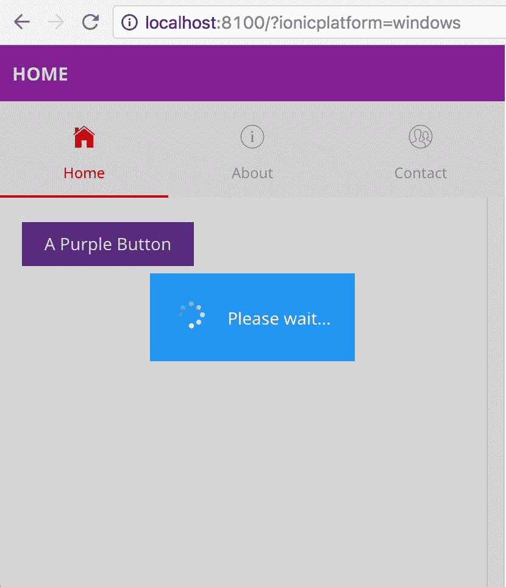

我们也可以添加自定义 CSS，使它们看起来都一样。

通过这样，我们完成了对 Ionic 应用在平台级别和页面/组件级别进行主题设置的概述。

# 摘要

在本章中，我们已经看到了如何为 Ionic 应用设置主题。我们还看到了如何可以轻松地在平台级别和页面/组件级别实现样式。

在下一章中，我们将看一下 Ionic Native。Ionic Native 对于 Ionic 1 来说就像 ngCordova 一样。我们将深入探讨如何将设备功能与 Ionic 应用集成。
