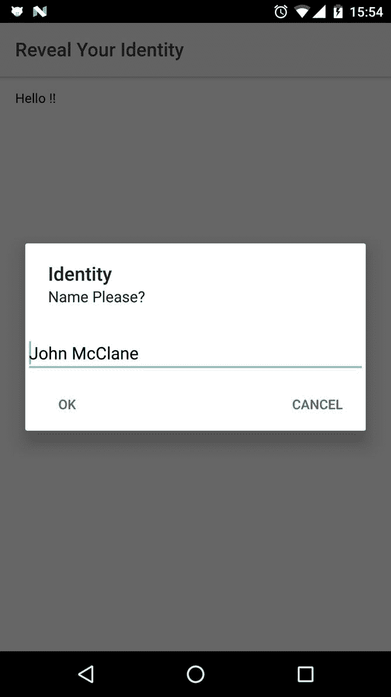

# 第六章：Ionic Native

在本章中，我们将研究如何将设备特定功能（如网络、电池状态、相机等）集成到 Ionic 应用程序中。为了开始探索这一点，我们将首先研究 Cordova 插件，然后使用 Ionic Native。

在本章中，我们将看一下：

+   设置特定于平台的 SDK

+   使用 Cordova 插件 API

+   使用 Ionic Native

+   测试一些 Ionic Native 插件

# 设置特定于平台的 SDK

在我们开始与设备特定功能交互之前，我们需要在本地机器上设置该设备操作系统的 SDK。官方上，Ionic 支持 iOS、Android 和 Windows 手机平台。尽管如此，Ionic 可以在任何可以运行 HTML、CSS 和 JavaScript 的设备上使用。

以下是如何在本地机器上设置移动 SDK 的链接。不幸的是，如果没有设置，我们无法继续本章节（和书籍）。让我们看一下以下链接：

+   **Android**：[`cordova.apache.org/docs/en/latest/guide/platforms/android/`](https://cordova.apache.org/docs/en/latest/guide/platforms/android/)

+   **iOS**：[`cordova.apache.org/docs/en/6.x/guide/platforms/ios/`](https://cordova.apache.org/docs/en/6.x/guide/platforms/ios/)

+   **Windows**：[`cordova.apache.org/docs/en/6.x/guide/platforms/wp8/`](https://cordova.apache.org/docs/en/6.x/guide/platforms/wp8/)

注意：对于其他支持的操作系统，您可以查看[`cordova.apache.org/docs/en/6.x/guide/overview/`](https://cordova.apache.org/docs/en/6.x/guide/overview/)。

在本书中，我们只会使用 Android 和 iOS。您也可以为其他移动平台采用类似的方法。在我们继续之前，我们需要确保设置已经完成，并且按预期工作。

# Android 设置

确保已安装 SDK 并且 Android 工具在您的路径中：

+   在计算机的任何位置的命令提示符/终端中运行：`android`。这将启动 Android SDK 管理器。确保您已安装最新版本的 Android，或者您正在针对安装特定版本。

+   运行以下命令：

```html
      android avd

```

+   这将启动 Android 虚拟设备管理器。确保至少设置了一个 AVD。如果还没有这样做，您可以通过单击“创建”按钮轻松完成。您可以按照以下选项填写选项：


# iOS 设置

确保您已安装 Xcode 和所需工具，并且已全局安装`ios-sim`和`ios-deploy`：

```html
npm install -g ios-sim
npm install -g ios-deploy

```

iOS 设置只能在苹果设备上完成。Windows 开发人员无法从 Windows 设备部署 iOS 应用程序，因为需要 Xcode。

# 测试设置

让我们看看如何测试 Android 和 iOS 的设置。

# 测试 Android

为了测试设置，我们将创建一个新的 Ionic 应用程序，并使用 Android 和 iOS 模拟器进行模拟。我们将首先创建一个选项卡应用程序。创建一个名为`chapter6`的文件夹，并打开一个新的命令提示符/终端。运行以下命令：

```html
ionic start -a "Example 14" -i app.example.fourteen example14 tabs --v2

```

要在 Android 模拟器上模拟应用程序，首先需要为此项目添加 Android 平台支持，然后模拟它：

添加 Android 平台，请运行以下命令：

```html
ionic platform add android

```

完成后，请运行以下命令：

```html
ionic emulate android

```

一段时间后，您将看到模拟器启动，并且应用程序将在模拟器内部部署和执行。如果您已经使用原生 Android 应用程序工作过，您就知道 Android 模拟器有多慢。如果您没有，它非常慢。Android 模拟器的替代方案是 Genymotion ([`www.genymotion.com`](https://www.genymotion.com))。Ionic 也与 Genymotion 很好地集成在一起。

Genymotion 有两种版本，一种是免费的，另一种是商业使用的。免费版本功能有限，只能用于个人使用。

您可以从以下网址下载 Genymotion 的副本：[`www.genymotion.com/#!/store`](https://www.genymotion.com/#!/store)。

安装 Genymotion 后，请使用您喜欢的 Android SDK 创建一个新的虚拟设备。我的配置如下：


接下来，我们启动模拟器并让其在后台运行。现在 Genymotion 正在运行，我们需要告诉 Ionic 使用 Genymotion 而不是 Android 模拟器来模拟应用程序。为此，我们使用以下命令：

```html
ionic run android

```

而不是这个：`ionic emulate android`。

这将部署应用程序到 Genymotion 模拟器，您可以立即看到应用程序，而不像使用 Android 模拟器那样需要等待。


确保在运行应用程序之前，Genymotion 在后台运行。

如果 Genymotion 对您来说有点大，您可以简单地将 Android 手机连接到计算机并运行以下命令：

```html
ionic run android

```

这将部署应用程序到实际设备。

要设置 Android USB 调试，请参考：[`developer.android.com/studio/run/device.html`](https://developer.android.com/studio/run/device.html)。

Genymotion 的早期截图来自个人版，因为我没有许可证。在开发阶段，我通常与我的 Android 手机一起使用 iOS 模拟器。一旦整个开发完成，我会从设备农场购买设备时间，并在目标设备上进行测试。

如果在连接 Android 手机到计算机时遇到问题，请检查您是否能够在命令提示符/终端中运行`adb device`并在此处看到您的设备。您可以在[`developer.android.com/studio/command-line/adb.html`](https://developer.android.com/studio/command-line/adb.html)找到有关**Android 调试桥**（**ADB**）的更多信息。

# 测试 iOS

要测试 iOS，我们将首先添加 iOS 平台支持，就像我们为 Android 做的那样，然后模拟它。

运行以下命令：

```html
ionic platform add ios

```

然后运行：`ionic emulate ios`。

您应该看到默认的模拟器启动，最后，应用程序将出现在模拟器中，如下面的截图所示：


要部署到苹果设备，您可以运行以下命令：

```html
ionic run ios

```

确保在继续之前能够模拟/运行应用程序。

# 使用 Cordova 插件入门

根据 Cordova 文档：

“插件是一种注入代码的包，允许应用程序呈现的 Cordova WebView 与其运行的本机平台进行通信。插件提供对设备和平台功能的访问，这些功能通常对基于 Web 的应用程序不可用。所有主要的 Cordova API 功能都是作为插件实现的，还有许多其他可用的插件，可以启用诸如条形码扫描仪、NFC 通信或定制日历界面等功能…”

换句话说，Cordova 插件是访问设备特定功能的窗口。Cordova 团队已经构建了需要的插件，以便几乎可以与所有设备特定功能一起使用。还有社区贡献的插件，可以提供围绕设备特定功能的定制包装。

您可以在这里搜索现有的插件：[`cordova.apache.org/plugins/`](https://cordova.apache.org/plugins/)。

在本章的过程中，我们将探索一些插件。由于我们专注于 Ionic 特定的开发，我们将使用 Ionic CLI 添加插件。在幕后，Ionic CLI 调用 Cordova CLI 来执行必要的操作。

# Ionic 插件 API

在处理插件时，我们将使用四个主要命令。

# 添加插件

此 CLI 命令用于向项目添加新插件：

```html
ionic plugin add org.apache.cordova.camera

```

您也可以使用这个：

```html
ionic plugin add cordova-plugin-camera

```

# 删除插件

此 CLI 命令用于从项目中删除插件：

```html
ionic plugin rm org.apache.cordova.camera

```

您也可以使用这个：

```html
ionic plugin rm cordova-plugin-camera

```

# 列出已添加的插件

此 CLI 命令用于列出项目中的所有插件，例如：

```html
ionic plugin ls

```

# 搜索插件

此 CLI 命令用于从命令行搜索插件，例如：

```html
ionic plugin search scanner barcode

```

# Ionic Native

现在我们已经了解了如何使用 Cordova 插件，我们将创建一个新项目并与我们的 Ionic 应用程序集成 Cordova 插件。

Ionic 为我们提供了一个简单的包装器，以 TypeScript 的方式处理 Cordova 插件。在所有插件都采用 ES6/TS 方法之前，我们需要一种方法在我们的 Ionic 应用程序中使用这些插件。

进入 Ionic Native。Ionic Native 是当今 ES5 Cordova 插件的 ES6/TypeScript 实现，因此您可以导入所需的插件并在 TypeScript 中使用它们。Ionic 团队在以 TypeScript 绑定的形式向我们提供插件方面做得非常好。

# Ionic Native 测试驱动

为了测试，我们将创建一个新项目并执行以下命令：

1.  运行以下命令：

```html
      ionic start -a "Example 15" -i app.example.fifteen 
      example15 blank --v2

```

并`cd`到`example15`文件夹中。

1.  让我们搜索电池状态插件并将其添加到我们的项目中。运行以下命令：

```html
      ionic plugin search battery status

```

1.  这将启动默认浏览器并将您导航到：[`cordova.apache.org/plugins/?q=battery%20status`](http://cordova.apache.org/plugins/?q=battery%20status)。根据你找到的插件名称，你可以将该插件添加到项目中。所以，在我们的情况下，要将电池状态插件添加到项目中，我们将运行以下命令：

```html
       ionic plugin add cordova-plugin-battery-status.

```

这将向我们当前的项目中添加电池状态插件（[`github.com/apache/cordova-plugin-battery-status`](https://github.com/apache/cordova-plugin-battery-status)）。在 Ionic Native 的文档中也可以找到相同的内容：[`ionicframework.com/docs/native/battery-status/`](https://ionicframework.com/docs/native/battery-status/)。

要查看已安装的所有插件，运行以下命令：

```html
ionic plugin ls

```

然后，你应该看到以下屏幕截图：


除了添加 Cordova 插件之外，我们还需要为电池状态添加所需的 Ionic Native 模块。运行以下命令：

```html
npm install --save @ionic-native/battery-status

```

添加模块后，我们需要在`example15/src/app/app.module.ts`中将其标记为提供者。打开`example15/src/app/app.module.ts`并按照所示进行更新：

```html
import { NgModule, ErrorHandler } from '@angular/core'; 
import { IonicApp, IonicModule, IonicErrorHandler } from 'ionic-angular'; 
import { MyApp } from './app.component'; 
import { HomePage } from '../pages/home/home'; 

import { StatusBar } from '@ionic-native/status-bar'; 
import { SplashScreen } from '@ionic-native/splash-screen'; 
import { BatteryStatus } from '@ionic-native/battery-status'; 

@NgModule({ 
  declarations: [ 
    MyApp, 
    HomePage 
  ], 
  imports: [ 
    IonicModule.forRoot(MyApp) 
  ], 
  bootstrap: [IonicApp], 
  entryComponents: [ 
    MyApp, 
    HomePage 
  ], 
  providers: [ 
    StatusBar, 
    SplashScreen, 
    BatteryStatus, 
    {provide: ErrorHandler, useClass: IonicErrorHandler} 
  ] 
}) 
export class AppModule {}

```

现在，我们可以开始使用电池状态插件。打开`example15/src/pages/home/home.ts`并使用以下代码进行更新：

```html
import { Component } from '@angular/core'; 
import { BatteryStatus } from 'ionic-native'; 
import { Platform } from 'ionic-angular'; 

@Component({ 
  selector: 'page-home', 
  templateUrl: 'home.html' 
}) 
export class HomePage { 
  level: Number; 
  isPlugged: Boolean; 

  constructor(platform: Platform) { 
    platform.ready().then(() => { 
      BatteryStatus.onChange().subscribe( 
        (status) => { 
          this.level = status.level; 
          this.isPlugged = status.isPlugged; 
        } 
      ); 
    }); 
  } 
}

```

这就是 Ionic Native 如何公开`BatteryStatus`。

接下来，按照以下方式更新`example15/src/pages/home/home.html`中的`ion-content`部分：

```html
<ion-header> 
    <ion-navbar> 
        <ion-title> 
            Battery Status 
        </ion-title> 
    </ion-navbar> 
</ion-header> 
<ion-content padding> 
    <h2>level : {{level}}</h2> 
    <h2>isPluggedIn : {{isPlugged}}</h2> 
</ion-content>

```

现在运行以下命令：

```html
ionic serve

```

你将在页面上看不到任何输出，如果你打开开发工具，你会在控制台中看到一个警告，上面写着：

```html
Native: tried calling StatusBar.styleDefault, but Cordova is not 
available. 
Make sure to include cordova.js or run in a device/simulator

```

这意味着我们不能直接在浏览器中运行插件；它们需要一个环境来执行，比如 Android、iOS 或 Windows。

为了测试应用程序（和插件），我们将添加一个 Android 平台或一个 iOS 平台：

```html
ionic platform add android

```

你也可以使用以下命令：

```html
ionic platform add ios

```

然后执行以下命令之一：

+   `ionic emulate android`

+   `ionic emulate ios`

+   `ionic run android`

+   `ionic run ios`

运行任何一个前面的命令都会显示以下输出：


现在你知道如何向你的 Ionic 应用程序中添加 Cordova 插件并对其进行测试。在接下来的部分中，我们将使用更多的插件。来自 Genymotion 的前面的屏幕截图是我个人使用许可证的。这些图片仅用于说明目的。

# Cordova 白名单插件

在继续使用 Ionic Native 之前，我们将花一些时间来了解一个关键的 Cordova 插件--白名单插件：[`github.com/apache/cordova-plugin-whitelist`](https://github.com/apache/cordova-plugin-whitelist)。

从白名单插件的 Cordova 文档中：

“域白名单是一种安全模型，用于控制应用程序无法控制的外部域的访问。Cordova 提供了一个可配置的安全策略，用于定义可以访问哪些外部站点。”

因此，如果我们希望更好地控制我们的应用程序在处理来自其他来源的内容时的行为方式，我们应该使用白名单插件。您可能已经注意到，此插件已添加到我们的 Ionic 应用程序中。如果此插件尚未添加到 Ionic/Cordova 应用程序中，您可以通过运行以下命令轻松添加：

```html
ionic plugin add https://github.com/apache/cordova-plugin-
whitelist.git

```

一旦添加了插件，您可以更新`config.xml`文件以进行导航白名单 - 允许您的应用程序在 WebView 内打开的链接，以允许链接到`example.com`。

您将添加以下代码：

```html
<allow-navigation href="http://example.com/*" />

```

如果要使您的 WebView 链接到任何网站，您需要添加以下内容：

```html
<allow-navigation href="http://*/*" /> 
<allow-navigation href="https://*/*" /> 
<allow-navigation href="data:*" />

```

您还可以添加意图白名单，其中可以指定允许在设备上浏览的链接列表。例如，从我们的自定义应用程序中打开短信应用程序：

```html
<allow-intent href="sms:*" />

```

或简单的网页：

```html
<allow-intent href="https://*/*" />

```

您还可以使用此插件在应用程序上强制执行**内容安全策略**（**CSP**）（[`content-securitypolicy.com/`](http://content-securitypolicy.com/)）。您只需要在`www/index.html`文件中添加`meta`标签，如下所示：

```html
<!-- Allow XHRs via https only --> 
<meta http-equiv="Content-Security-Policy" content="default-src 'self' https:">

```

这是白名单插件的快速介绍。此插件适用于：

+   Android 4.0.0 或更高版本

+   iOS 4.0.0 或更高版本

请记住添加并配置此插件；否则，外部链接将无法工作。

# 使用 Ionic Native 处理 Cordova 插件

在之前的示例中，我们已经看到了如何将设备功能（例如电池状态）与我们的 Ionic 应用程序集成。现在，我们将探索更多类似的插件，并看看如何实现它们。

# 设备

我们将在本节中首先查看的插件是设备插件。此插件描述了设备的硬件和软件规格。

您可以在此处了解有关此插件的更多信息：[`github.com/apache/cordova-plugin-device`](https://github.com/apache/cordova-plugin-device)或[`ionicframework.com/docs/native/device/`](https://ionicframework.com/docs/native/device/)。

让我们搭建一个新的空白应用程序，然后向其中添加设备插件：

```html
ionic start -a "Example 16" -i app.example.sixteen example16 blank --v2

```

应用程序搭建完成后，`cd`进入`example16`文件夹。现在我们将添加设备插件，运行以下命令：

```html
ionic plugin add cordova-plugin-device

```

这将添加设备插件。完成后，我们将添加 Ionic 本机设备模块。运行以下命令：

```html
npm install --save @ionic-native/device

```

添加模块后，我们需要在`example16/src/app/app.module.ts`中将其标记为提供者。按照以下方式更新`example16/src/app/app.module.ts`：

```html
import { NgModule, ErrorHandler } from '@angular/core'; 
import { IonicApp, IonicModule, IonicErrorHandler } from 'ionic-angular'; 
import { MyApp } from './app.component'; 
import { HomePage } from '../pages/home/home'; 

import { StatusBar } from '@ionic-native/status-bar'; 
import { SplashScreen } from '@ionic-native/splash-screen'; 
import { Device } from '@ionic-native/device'; 

@NgModule({ 
  declarations: [ 
    MyApp, 
    HomePage 
  ], 
  imports: [ 
    IonicModule.forRoot(MyApp) 
  ], 
  bootstrap: [IonicApp], 
  entryComponents: [ 
    MyApp, 
    HomePage 
  ], 
  providers: [ 
    StatusBar, 
    SplashScreen, 
    Device, 
    { provide: ErrorHandler, useClass: IonicErrorHandler } 
  ] 
}) 
export class AppModule { }

```

接下来，通过运行`ionic platform add ios`或`ionic platform add android`来添加 iOS 或 Android 平台之一。

现在，我们将添加与设备插件相关的代码。打开`example16/src/pages/home/home.ts`并按照以下方式更新类：

```html
import { Component } from '@angular/core'; 
import { Device } from '@ionic-native/device'; 
import { Platform } from 'ionic-angular'; 

@Component({ 
  selector: 'page-home', 
  templateUrl: 'home.html' 
}) 
export class HomePage { 
  cordova: String; 
  model: String; 
  devicePlatform: String; 
  uuid: String; 
  version: String; 
  manufacturer: String; 
  isVirtual: Boolean; 
  serial: String; 

  constructor(private platform: Platform, 
    private device: Device) { 
    platform.ready().then(() => { 
      let device = this.device; 
      this.cordova = device.cordova; 
      this.model = device.model; 
      this.devicePlatform = device.platform; 
      this.uuid = device.uuid; 
      this.version = device.version; 
      this.manufacturer = device.manufacturer; 
      this.isVirtual = device.isVirtual; 
      this.serial = device.serial; 
    }); 
  } 
}

```

接下来，按照以下方式更新`example16/src/pages/home/home.html`：

```html
<ion-header> 
  <ion-navbar> 
    <ion-title> 
      Ionic Blank 
    </ion-title> 
  </ion-navbar> 
</ion-header> 

<ion-content padding> 
  <table> 
    <tr> 
      <td>cordova</td> 
      <td>{{cordova}}</td> 
    </tr> 
    <tr> 
      <td>model</td> 
      <td>{{model}}</td> 
    </tr> 
    <tr> 
      <td>platform</td> 
      <td>{{platform}}</td> 
    </tr> 
    <tr> 
      <td>uuid</td> 
      <td>{{uuid}}</td> 
    </tr> 
    <tr> 
      <td>version</td> 
      <td>{{version}}</td> 
    </tr> 
    <tr> 
      <td>manufacturer</td> 
      <td>{{manufacturer}}</td> 
    </tr> 
    <tr> 
      <td>isVirtual</td> 
      <td>{{isVirtual}}</td> 
    </tr> 
    <tr> 
      <td>serial</td> 
      <td>{{serial}}</td> 
    </tr> 
  </table> 
</ion-content>

```

保存所有文件，最后运行`ionic emulate ios`或`ionic emulate android`。我们应该看到以下输出：


如前面的屏幕截图所示，设备是 Nexus 6P。

# 吐司

我们将要使用的下一个插件是 Toast 插件。此插件显示文本弹出窗口，不会阻止用户与应用程序的交互。

您可以在这里了解有关此插件的更多信息：[`github.com/EddyVerbruggen/Toast-PhoneGap-Plugin`](https://github.com/EddyVerbruggen/Toast-PhoneGap-Plugin)或[`ionicframework.com/docs/native/toast/`](https://ionicframework.com/docs/native/toast/)。

我们将使用以下命令搭建一个新的空白应用程序：

```html
ionic start -a "Example 17" -i 
app.example.seventeen example17 blank --v2

```

应用程序搭建完成后，`cd`进入`example17`文件夹。现在我们将添加 Toast 插件，运行：

```html
ionic plugin add cordova-plugin-x-toast

```

然后我们将添加 Ionic Native Toast 模块：

```html
npm install --save @ionic-native/toast

```

接下来，我们将在`example17/src/app/app.module.ts`中将 Toast 添加为提供者。按照以下方式更新`example17/src/app/app.module.ts`：

```html
import { NgModule, ErrorHandler } from '@angular/core'; 
import { IonicApp, IonicModule, IonicErrorHandler } from 'ionic-angular'; 
import { MyApp } from './app.component'; 
import { HomePage } from '../pages/home/home'; 

import { StatusBar } from '@ionic-native/status-bar'; 
import { SplashScreen } from '@ionic-native/splash-screen'; 
import { Toast } from '@ionic-native/toast'; 

@NgModule({ 
  declarations: [ 
    MyApp, 
    HomePage 
  ], 
  imports: [ 
    IonicModule.forRoot(MyApp) 
  ], 
  bootstrap: [IonicApp], 
  entryComponents: [ 
    MyApp, 
    HomePage 
  ], 
  providers: [ 
    StatusBar, 
    SplashScreen, 
    Toast, 
    {provide: ErrorHandler, useClass: IonicErrorHandler} 
  ] 
}) 
export class AppModule {}

```

完成后，通过运行以下命令添加 iOS 或 Android 平台之一：

```html
ionic platform add ios

```

或：

```html
ionic platform add android

```

现在，我们将添加与 Toast 插件相关的代码。打开`example17/src/pages/home/home.ts`并按照文件中所示进行更新：

```html
import { Component } from '@angular/core'; 
import { Toast } from '@ionic-native/toast'; 
import { Platform } from 'ionic-angular'; 

@Component({ 
  selector: 'page-home', 
  templateUrl: 'home.html' 
}) 
export class HomePage { 

  constructor(private platform: Platform, private toast: Toast) { 
    platform.ready().then(() => { 
      toast.show("I'm a toast", '5000', 'center').subscribe( 
        (toast) => { 
          console.log(toast); 
        } 
      ); 
  }); 
  } 

}

```

保存所有文件并运行：

```html
ionic emulate ios or ionic emulate android

```

您应该看到以下输出：


要了解有关 Toast 插件 API 方法的更多信息，请参阅：[`ionicframework.com/docs/native/toast/`](http://ionicframework.com/docs/native/toast/)。

# 对话框

我们接下来要使用的插件是对话框插件。这会触发警报、确认和提示窗口。

您可以从这里了解有关插件的更多信息：[`github.com/apache/cordova-plugin-dialogs`](https://github.com/apache/cordova-plugin-dialogs) 和 [`ionicframework.com/docs/native/dialogs/`](https://ionicframework.com/docs/native/dialogs/)。

首先，为对话框插件搭建一个新的空白应用程序：

```html
ionic start -a "Example 18" -i app.example.eightteen example18 blank --v2

```

应用程序搭建完成后，`cd`进入`example18`文件夹。现在，我们将添加对话框插件，运行：

```html
ionic plugin add cordova-plugin-dialogs

```

之后，我们将为对话框添加 Ionic Native 模块。运行以下命令：

```html
npm install --save @ionic-native/dialogs

```

接下来，将对话框添加为提供者。按照以下步骤更新`example18/src/app/app.module.ts`：

```html
import { NgModule, ErrorHandler } from '@angular/core'; 
import { IonicApp, IonicModule, IonicErrorHandler } from 'ionic-angular'; 
import { MyApp } from './app.component'; 
import { HomePage } from '../pages/home/home'; 

import { StatusBar } from '@ionic-native/status-bar'; 
import { SplashScreen } from '@ionic-native/splash-screen'; 
import { Dialogs } from '@ionic-native/dialogs'; 

@NgModule({ 
  declarations: [ 
    MyApp, 
    HomePage 
  ], 
  imports: [ 
    IonicModule.forRoot(MyApp) 
  ], 
  bootstrap: [IonicApp], 
  entryComponents: [ 
    MyApp, 
    HomePage 
  ], 
  providers: [ 
    StatusBar, 
    SplashScreen, 
    Dialogs, 
    {provide: ErrorHandler, useClass: IonicErrorHandler} 
  ] 
}) 
export class AppModule {}

```

完成后，通过运行以下命令添加 iOS 或 Android 平台之一：

```html
ionic platform add ios

```

或者：

```html
ionic platform add android

```

现在，我们将添加与对话框插件相关的代码。打开`example18/src/pages/home/home.ts`并更新为所述的代码文件：

```html
import { Component } from '@angular/core'; 
import { Dialogs } from '@ionic-native/dialogs'; 
import { Platform } from 'ionic-angular'; 

@Component({ 
  selector: 'page-home', 
  templateUrl: 'home.html' 
}) 
export class HomePage { 
  name: String; 

  constructor(private dialogs: Dialogs, private platform: Platform) { 
    platform.ready().then(() => { 
      dialogs 
        .prompt('Name Please?', 'Identity', ['Cancel', 'Ok'], 'John 
        McClane') 
        .then((result) => { 
          if (result.buttonIndex == 2) { 
            this.name = result.input1; 
          } 
        }); 
    }); 
  } 
}

```

接下来，我们将按照以下方式更新`example18/src/pages/home/home.html`：

```html
<ion-header> 
    <ion-navbar> 
        <ion-title> 
            Reveal Your Identity 
        </ion-title> 
    </ion-navbar> 
</ion-header> 
<ion-content padding> 
    Hello {{name}}!! 
</ion-content>

```

保存所有文件，最后运行以下命令：

```html
    ionic emulate ios or ionic emulate android

```

我们应该看到以下输出：



要了解有关对话框插件 API 方法的更多信息，请参阅：[`ionicframework.com/docs/native/dialogs/`](https://ionicframework.com/docs/native/dialogs/)。

# 本地通知

我们接下来要使用的插件是本地通知插件。该插件主要用于通知或提醒用户与应用相关的活动。有时，当后台活动正在进行时，也会显示通知，比如大文件上传。

您可以从这里了解有关插件的更多信息：[`github.com/katzer/cordova-plugin-local-notifications`](https://github.com/katzer/cordova-plugin-local-notifications) 和 [`ionicframework.com/docs/native/local-notifications/`](https://ionicframework.com/docs/native/local-notifications/)。

首先，为本地通知插件搭建一个新的空白应用程序：

```html
ionic start -a "Example 19" -i 
app.example.nineteen example19 blank --v2

```

应用程序搭建完成后，`cd`进入`example19`文件夹。现在，我们将添加本地通知插件，运行以下命令：

```html
ionic plugin add de.appplant.cordova.plugin.local-notification

```

接下来，添加 Ionic Native 模块：

```html
npm install --save @ionic-native/local-notifications

```

并在`example19/src/app/app.module.ts`中更新提供者：

```html
import { NgModule, ErrorHandler } from '@angular/core'; 
import { IonicApp, IonicModule, IonicErrorHandler } from 'ionic-angular'; 
import { MyApp } from './app.component'; 
import { HomePage } from '../pages/home/home'; 

import { StatusBar } from '@ionic-native/status-bar'; 
import { SplashScreen } from '@ionic-native/splash-screen'; 
import { LocalNotifications } from '@ionic-native/local-notifications'; 

@NgModule({ 
  declarations: [ 
    MyApp, 
    HomePage 
  ], 
  imports: [ 
    IonicModule.forRoot(MyApp) 
  ], 
  bootstrap: [IonicApp], 
  entryComponents: [ 
    MyApp, 
    HomePage 
  ], 
  providers: [ 
    StatusBar, 
    SplashScreen, 
    LocalNotifications, 
    {provide: ErrorHandler, useClass: IonicErrorHandler} 
  ] 
}) 
export class AppModule {}

```

完成后，通过运行以下命令添加 iOS 或 Android 平台之一：

```html
ionic platform add ios

```

或者：

```html
ionic platform add android

```

现在，我们将添加与本地通知插件相关的代码。打开`example19/src/pages/home/home.ts`并按照以下方式更新：

```html
import { Component } from '@angular/core'; 
import { LocalNotifications } from '@ionic-native/local-notifications'; 
import { Platform } from 'ionic-angular'; 

@Component({ 
  selector: 'page-home', 
  templateUrl: 'home.html' 
}) 
export class HomePage { 
  defaultText: String = 'Hello World'; 

  constructor(private localNotifications: LocalNotifications, private platform: Platform) { } 

  triggerNotification(notifText) { 
    this.platform.ready().then(() => { 

      notifText = notifText || this.defaultText; 
      this.localNotifications.schedule({ 
        id: 1, 
        text: notifText, 
      }); 
    }); 
  } 

}

```

接下来，我们将按照以下方式更新`example19/src/pages/home/home.html`：

```html
<ion-header> 
    <ion-navbar> 
        <ion-title> 
            Local Notification 
        </ion-title> 
    </ion-navbar> 
</ion-header> 
<ion-content padding> 
    <div class="list"> 
        <label class="item item-input"> 
            <span class="input-label">Enter Notification text</span> 
            <input type="text" #notifText [ngModel]="defaultText"> 
        </label> 
        <label class="item item-input"> 
            <button ion-button color="dark" (click)=" 
            triggerNotification(notifText.value)">Notify</button> 
        </label> 
    </div> 
</ion-content>

```

保存所有文件，然后运行以下命令：

```html
ionic server android

```

或者：

```html
ionic server ios

```

我们应该看到以下输出：


现在，当我们查看通知栏时，应该看到本地通知：


要了解有关对话框插件 API 方法的更多信息，请参阅：[`ionicframework.com/docs/native/local-notifications/`](https://ionicframework.com/docs/native/local-notifications/)。

# 地理位置

我们要查看的最后一个插件是地理位置插件，它可以帮助获取设备的坐标。

您可以从这里了解有关插件的更多信息：[`github.com/apache/cordova-plugin-geolocation`](https://github.com/apache/cordova-plugin-geolocation) 和 [`ionicframework.com/docs/native/geolocation/`](https://ionicframework.com/docs/native/geolocation/)。

首先，为地理位置插件搭建一个新的空白应用程序：

```html
ionic start -a "Example 20" -i app.example.twenty example20 blank --v2

```

应用程序搭建完成后，`cd`进入`example20`文件夹。现在，我们将添加地理位置插件，运行以下命令：

```html
ionic plugin add cordova-plugin-geolocation

```

接下来，运行以下命令以添加 Ionic Native 模块：

```html
npm install --save @ionic-native/geolocation

```

现在，我们注册提供者。更新`example20/src/app/app.module.ts`：

```html
import { NgModule, ErrorHandler } from '@angular/core'; 
import { IonicApp, IonicModule, IonicErrorHandler } from 'ionic-angular'; 
import { MyApp } from './app.component'; 
import { HomePage } from '../pages/home/home'; 

import { StatusBar } from '@ionic-native/status-bar'; 
import { SplashScreen } from '@ionic-native/splash-screen'; 
import { Geolocation } from '@ionic-native/geolocation'; 

@NgModule({ 
  declarations: [ 
    MyApp, 
    HomePage 
  ], 
  imports: [ 
    IonicModule.forRoot(MyApp) 
  ], 
  bootstrap: [IonicApp], 
  entryComponents: [ 
    MyApp, 
    HomePage 
  ], 
  providers: [ 
    StatusBar, 
    SplashScreen, 
    Geolocation, 
    {provide: ErrorHandler, useClass: IonicErrorHandler} 
  ] 
}) 
export class AppModule {}

```

完成后，通过运行以下命令添加 iOS 或 Android 平台之一：

```html
ionic platform add ios

```

或者：

```html
ionic platform add android

```

现在，我们将添加与地理位置插件相关的代码。打开`example20/src/pages/home/home.ts`并更新如下：

```html
import { Component } from '@angular/core'; 
import { Platform } from 'ionic-angular'; 
import { Geolocation } from '@ionic-native/geolocation'; 

@Component({ 
  selector: 'page-home', 
  templateUrl: 'home.html' 
}) 
export class HomePage { 
  latitude: Number = 0; 
  longitude: Number = 0; 
  accuracy: Number = 0; 

  constructor(private platform: Platform, 
    private geolocation: Geolocation) { 
    platform.ready().then(() => { 
      geolocation.getCurrentPosition().then((position) => { 
        this.latitude = position.coords.latitude; 
        this.longitude = position.coords.longitude; 
        this.accuracy = position.coords.accuracy; 
      }); 
    }); 
  } 
}

```

接下来，按照以下代码更新`example20/src/pages/home/home.html`：

```html
<ion-header> 
    <ion-navbar> 
        <ion-title> 
            Ionic Blank 
        </ion-title> 
    </ion-navbar> 
</ion-header> 
<ion-content padding> 
    <ul class="list"> 
        <li class="item"> 
            Latitude : {{latitude}} 
        </li> 
        <li class="item"> 
            Longitude : {{longitude}} 
        </li> 
        <li class="item"> 
            Accuracy : {{accuracy}} 
        </li> 
    </ul> 
</ion-content>

```

保存所有文件，最后运行以下命令：

```html
ionic emulate ios

```

或：

```html
ionic emulate android

```

我们应该能够看到以下输出：


一旦权限被提供，我们应该能够看到以下截图中显示的值：


我的 Google Nexus 6P 运行 Android Nougat，其中有一个名为运行时权限的新功能。这允许用户在运行时而不是在安装应用程序时给予权限。您可以在这里了解更多关于该功能的信息：[`developer.android.com/training/permissions/requesting.html`](https://developer.android.com/training/permissions/requesting.html)。

要了解有关 Geolocation 插件 API 方法的更多信息，请参考：[`ionicframework.com/docs/native/geolocation/`](https://ionicframework.com/docs/native/geolocation/)。

前面的例子应该已经很好地展示了你如何使用 Ionic Native。

# 摘要

在本章中，我们已经了解了 Cordova 插件是什么，以及它们如何在现有的 Ionic 应用程序中使用。我们首先建立了一个用于 Android 和 iOS 的本地开发环境，然后学习了如何模拟和运行 Ionic 应用程序。接下来，我们探索了如何将 Cordova 插件添加到 Ionic 项目中并使用它们。最后，借助 Ionic Native，我们在 Ionic 应用程序中注入了插件并与它们一起工作。

在下一章中，我们将利用到目前为止所学到的知识来构建一个名为 Riderr 的应用程序。利用 Uber 提供的公共 API，我们将构建一个应用程序，通过它，乘客可以预订 Uber 车辆。
