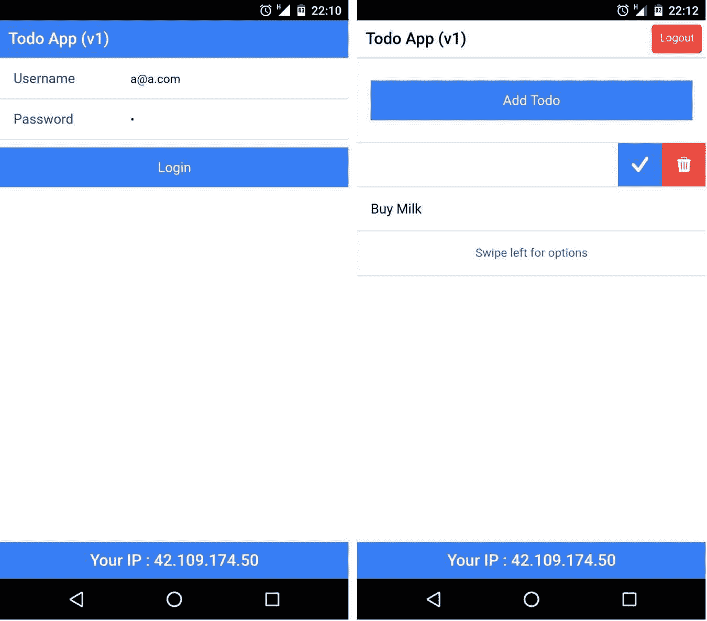
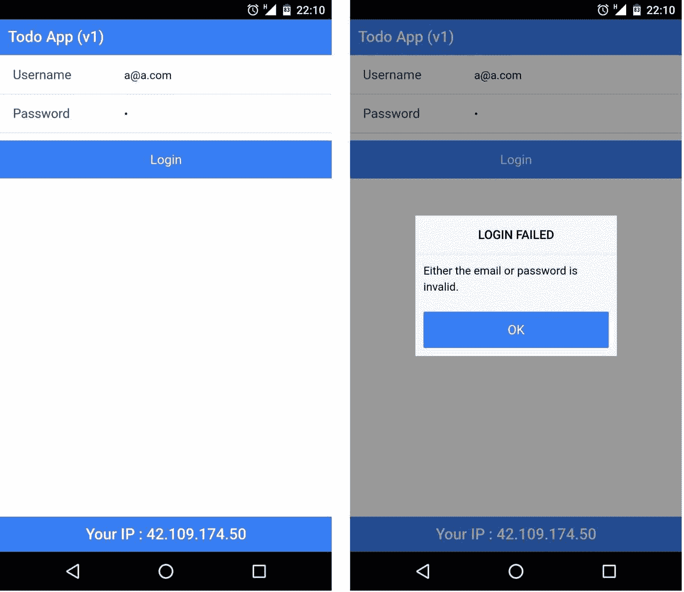
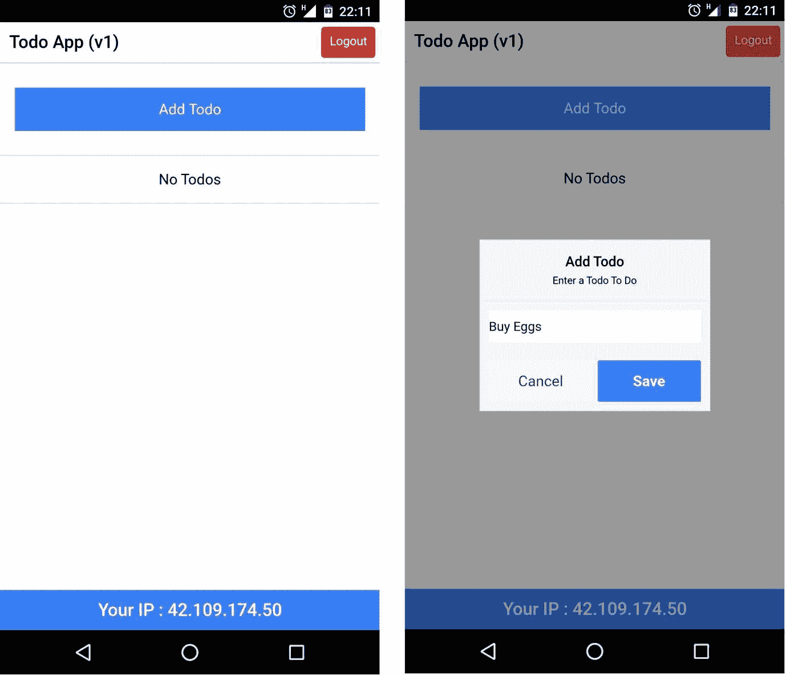
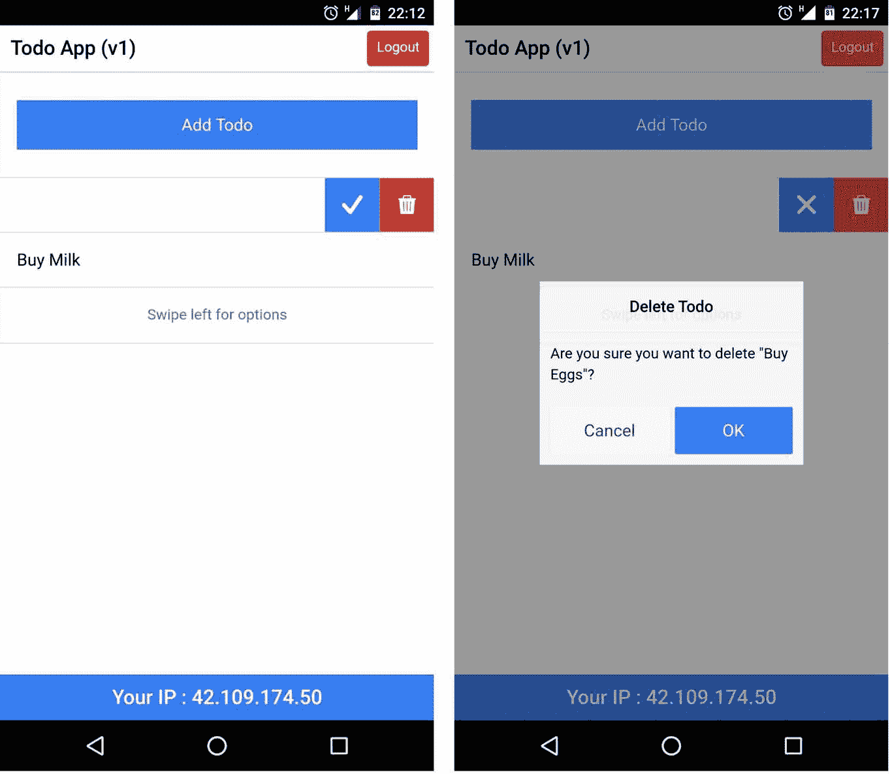
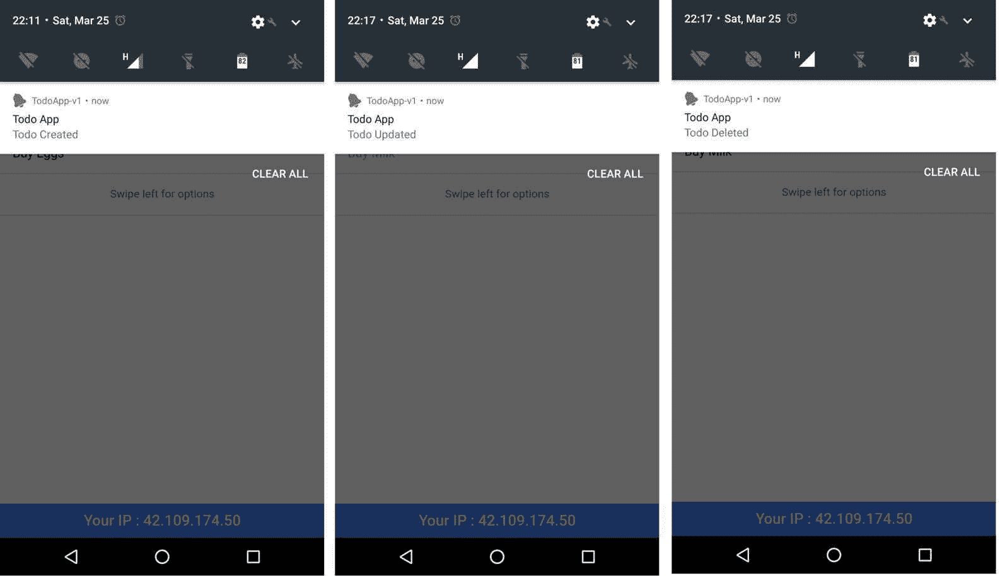
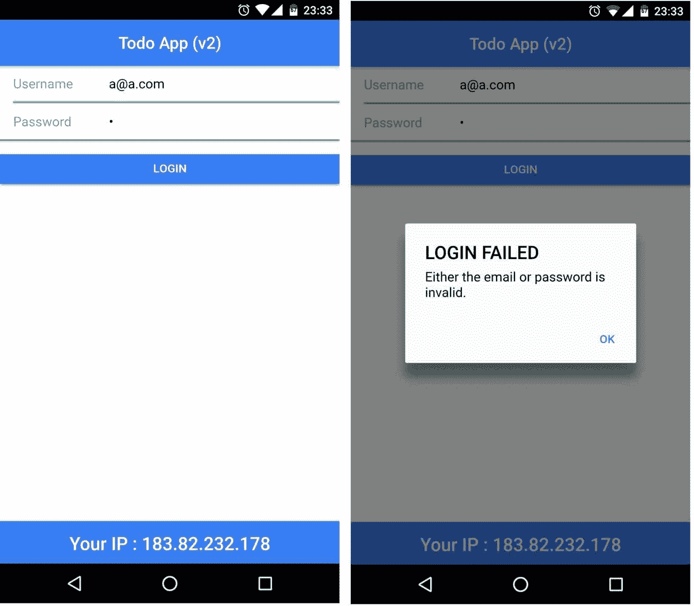
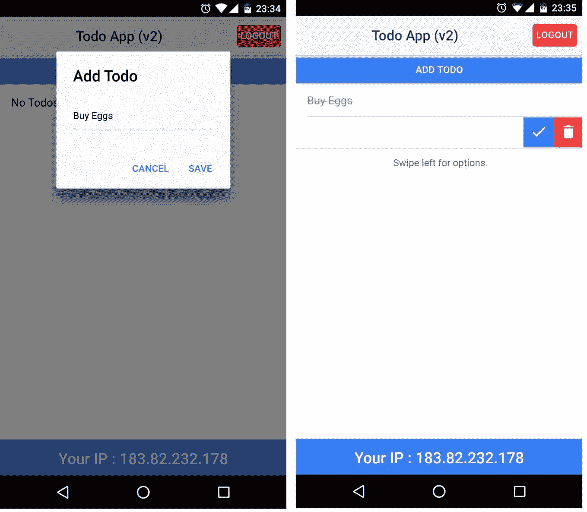
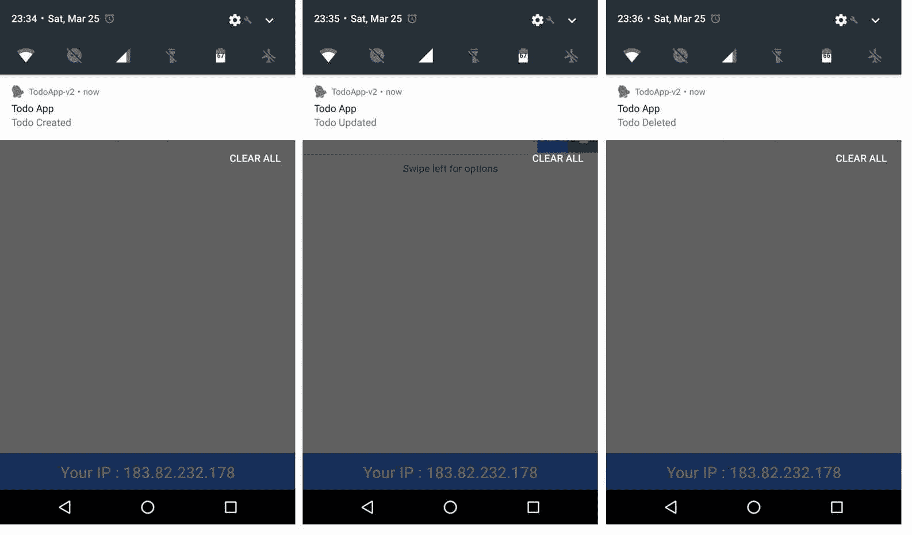

# 第八章：Ionic 2 迁移指南

在本章中，我们将看看如何将现有的 Ionic 1 应用迁移到 Ionic 2/Ionic 3。我们首先将使用 Ionic 1 构建一个简单的 Todo 应用，然后了解如何将其迁移到 Ionic 2：

+   为什么要迁移？

+   构建一个简单的 Ionic 1 Todo 应用

+   迁移计划

+   将 Ionic 1 Todo 应用迁移到 Ionic 2

如果您想要从 Ionic 1 迁移到 Ionic 3，本迁移指南仍然有效。请参考第十一章，*Ionic 3*，以更好地了解 Ionic 3 中的变化。

# 为什么要迁移？

到目前为止，在这本书中，我们已经学习了使用 Ionic 2 构建应用的过程，但并不了解 Ionic 1。但就现实世界而言，已经有数千个应用程序使用了 Ionic 1 部署。这些应用可以利用 Ionic 2 的改进功能来提高应用体验。

在软件世界中迁移代码是一项艰巨的任务。在我们的情况下，迁移更加复杂，因为我们不仅要将 Ionic 1 的库升级到 Ionic 2，还要将这些库所写的语言本身升级，例如，从 ES5 到 ES6 和 TypeScript。

JavaScript 应用程序的新生态主要围绕 ES6、TypeScript 和 Web 组件展开。适应这些以利用最新技术就是 Angular 2 所做的。Ionic 2 也做到了这一点。

在我看来，有这么多的变化，将一个完全运行良好的应用程序从 Ionic 1 迁移到 Ionic 2 应该谨慎对待，只有在必要时才需要这样做。

*如果事情顺利，为什么要改变呢？*

当涉及将应用程序基础从 Ionic 1 更改为 Ionic 2 时，有些人称之为迁移，但我称之为重写。

# Todo 应用 - Ionic v1

在本节中，我们将使用 Ionic 1 构建一个 Todo 应用。我们将构建的应用几乎包含了典型 Ionic 应用的所有特性。我们将拥有：

+   路由

+   持久性

+   本地通知

+   REST API 集成

两页 Todo 应用中的第一页将是登录页面，第二页将是我们处理 Todos 的页面。我们将使用`LocalStorage`来保存认证状态以及我们将创建的 Todos。当用户创建、更新或删除待办事项时，我们还将显示本地通知。显示本地通知更多地是与设备功能进行接口的 Ionic 应用。最后，我们将发出对[`www.ipify.org/`](https://www.ipify.org/)的 REST API 请求，以获取我们从中访问此应用的设备的 IP 地址。

最终应用程序将如下图所示：



# 构建应用程序

现在我们已经有了一个建设的想法，让我们开始吧。创建一个名为`chapter8`的文件夹，并在`chapter8`文件夹内打开一个新的命令提示符/终端并运行：

```html
ionic start -a "TodoApp-v1" -i app.example.todoapp_v1 todoapp_v1  blank

```

我们正在使用 Ionic v1 搭建一个空白项目。请注意，我们没有使用`--v2`标志。一旦项目被搭建，就在你喜欢的文本编辑器中打开它。

在我们开始处理这两个页面之前，我们将创建所需的服务。我们将创建五个服务：

+   LocalStorage 服务：与 LocalStorage 进行交互

+   本地通知服务：与`$cordovaLocalNotification`进行交互

+   IP 服务：与[`api.ipify.org`](https://api.ipify.org)进行交互

+   认证服务：管理认证

+   Todos 服务：管理 Todos

为此，我们将在`www/js`文件夹内创建另一个名为`services.js`的文件。打开`todoapp_v1/www/js/services.js`并添加以下代码：

```html
angular.module('starter') 
.service('LS', function($window) { // local storage 
    this.set = function(key, value) { 
        // http://stackoverflow.com/a/23656919/1015046 
        $window.localStorage.setItem(key, 
        $window.angular.toJson(value)); 
    } 

    this.get = function(key) { 
        return $window.JSON.parse($window.localStorage.getItem(key)); 
    } 

    this.remove = function(key) { 
        $window.localStorage.removeItem(key); 
    } 
})

```

`LS`服务公开了对 HTML5 `localStorage`的包装器。

接下来，在同一文件中为本地通知服务添加一个包装器，在`LS`服务之后：

```html
// snipp 
.service('LN', function($ionicPlatform, $cordovaLocalNotification) { // local notifications 
    var i = 1; 
    this.show = function(text) { 
        $ionicPlatform.ready(function() { 
            var notifPromise = $cordovaLocalNotification.schedule({ 
                id: i++, 
                title: 'Todo App', 
                text: text 
            }) 
            return notifPromise; 
        }); 
    } 
})

```

在编写代码结束时，我们将从`ngCordova`添加所需的依赖项。

接下来，我们将添加`IP`服务以与[`api.ipify.org`](https://api.ipify.org)进行交互并获取用户的 IP 地址。追加以下代码：

```html
// snipp 
.service('IP', function ($http) { 
    this.get = function(){ 
        return $http.get('https://api.ipify.org/?format=json'); 
    } 
})

```

最后，管理身份验证和待办事项的两个关键服务。添加以下代码：

```html
// snipp 
.service('AUTH', function(LS) { 
    var LS_AUTH_KEY = 'auth'; 
    this.login = function(user) { 
        if (user.email === 'a@a.com', user.password === 'a') { 
            LS.set(LS_AUTH_KEY, true); 
            return true; 
        } else { 
            return false; 
        } 
    } 

    this.isAuthenticated = function() { 
        return !!LS.get(LS_AUTH_KEY); 
    } 

    this.logout = function() { 
        LS.remove(LS_AUTH_KEY); 
    } 

}) 

.service('TODOS', function(LS) { 
    var LS_TODOS_KEY = 'todos'; 

    this.set = function(todos) { 
        LS.set(LS_TODOS_KEY, todos); 
    } 

    this.get = function() { 
        return LS.get(LS_TODOS_KEY) || []; 
    } 
});

```

通过这样，我们已经完成了所需的服务。

由于这将是一个双页面应用程序，我们将使用 State 路由器来定义和管理路由。打开`todoapp_v1/www/js/app.js`并在`run`方法下添加以下`config`部分：

```html
.config(function($stateProvider, $urlRouterProvider) { 
    $stateProvider 
        .state('login', { 
            url: '/login', 
            templateUrl: 'templates/login.html', 
            controller: 'LoginCtrl' 
        }) 
        .state('home', { 
            url: '/home', 
            templateUrl: 'templates/home.html', 
            controller: 'HomeCtrl' 
        }); 
    // if none of the above states are matched, use this as the fallback 
    $urlRouterProvider.otherwise('/login'); 
});

```

在上述片段中，我们定义了两个路由 - 登录和主页。现在我们需要创建所需的模板和控制器。

在`www/js`文件夹中创建一个名为`controllers.js`的新文件。打开`todoapp_v1/www/js/controllers.js`和`LoginCtrl`，如下面的代码所示：

```html
angular.module('starter') 

.controller('LoginCtrl', function($scope, AUTH, $state, $ionicHistory, $ionicPopup) { 

    // check Auth before proceeding 
    if (AUTH.isAuthenticated()) { 
        $state.go('home'); 
    } 

    // hardcode the test user 
    $scope.user = { 
        email: 'a@a.com', 
        password: 'a' 
    } 

    $scope.login = function() { 
        if (AUTH.login($scope.user)) { 
            // remove all views in stack 
            // this way when the user clicks on the  
            // back button on the home page 
            // we do not show the login screen again 
            $ionicHistory.clearHistory(); 
            $state.go('home'); 
        } else { 
            $ionicPopup.alert({ 
                title: 'LOGIN FAILED', 
                template: 'Either the email or password is invalid.' 
            }); 
        }; 
    } 
})

```

在这里，我们正在检查用户是否已经经过身份验证，如果是，我们将用户重定向到主页。`login()`接受用户的凭据并使用`AUTH.login()`验证它们。如果身份验证失败，我们将使用`$ionicPopup`服务显示警报。

接下来，我们将按照以下代码添加`HomeCtrl`：

```html
// snipp 

.controller('HomeCtrl', function($scope, $state, AUTH, TODOS, $ionicHistory, $ionicPopup, $ionicListDelegate, LN) { 

    $scope.todo = {}; 
    // check Auth before proceeding 
    if (!AUTH.isAuthenticated()) { 
        $state.go('login'); 
    } 

    // fetch todos on load 
    $scope.todos = TODOS.get(); 

    $scope.add = function() { 
        //reset 
        $scope.todo.text = ''; 
        var addTodoPopup = $ionicPopup.show({ 
            template: '<input type="text" ng-model="todo.text">', 
            title: 'Add Todo', 
            subTitle: 'Enter a Todo To Do', 
            scope: $scope, 
            buttons: [ 
                { text: 'Cancel' }, { 
                    text: '<b>Save</b>', 
                    type: 'button-positive', 
                    onTap: function(e) { 
                        // validation 
                        if (!$scope.todo.text) { 
                            e.preventDefault(); 
                        } else { 
                            return $scope.todo.text; 
                        } 
                    } 
                } 
            ] 
        }); 

        addTodoPopup.then(function(text) { 
            if (text) { 
                var todo = { 
                    text: text, 
                    isCompleted: false 
                }; 

                $scope.todos.push(todo); 
                // save it to LS 
                TODOS.set($scope.todos); 
                LN.show('Todo Created'); 
            } 
        }); 
    } 

    $scope.update = function(todo) { 
        todo.isCompleted = !todo.isCompleted; 
        $ionicListDelegate.closeOptionButtons(); 
        // update LS 
        TODOS.set($scope.todos); 
        LN.show('Todo Updated'); 
    } 

    $scope.delete = function($index, todo) { 

        var deleteConfirmPopup = $ionicPopup.confirm({ 
            title: 'Delete Todo', 
            template: 'Are you sure you want to delete "' + todo.text + 
            '"? ' 
        }); 

        deleteConfirmPopup.then(function(res) { 
            if (res) { 
                $scope.todos.splice($index, 1); 
                // update LS 
                TODOS.set($scope.todos); 
                LN.show('Todo Deleted'); 
            } 
        }); 
    } 

    $scope.logout = function() { 
        AUTH.logout(); 
        $ionicHistory.clearHistory(); 
        $state.go('login'); 
    } 
});

```

我们首先检查身份验证。接下来，我们获取所有的待办事项。我们在`HomeCtrl`范围上定义了四种方法：`add()`，`update()`，`delete()`和`logout()`。

添加方法用于添加新的待办事项。我们使用`$ionicPopup`服务显示一个弹出窗口，用户在其中输入待办事项文本。一旦待办事项被添加，我们使用`LN`服务推送一个本地通知。

更新方法在本地存储中更新待办事项的`isCompleted`属性，并推送一个指示相同内容的本地通知。

删除方法显示一个确认框，询问用户确认删除操作。如果用户确认删除，我们将从集合中删除待办事项并将集合持久化到本地存储中。为了完成删除过程，我们推送一个本地通知指示待办事项已被删除。

最后，注销方法清除身份验证状态并将用户重定向回登录页面。

现在我们已经完成了控制器，我们将开始处理所需的模板。在`www`文件夹中创建一个名为`templates`的新文件夹。在模板文件夹中，创建一个名为`login.html`的文件。打开`todoapp_v1/www/templates/login.html`并按照以下代码进行更新：

```html
<ion-view view-> 
    <ion-content> 
        <div class="list"> 
            <label class="item item-input"> 
                <span class="input-label">Username</span> 
                <input type="email" ng-model="user.email" 
                placeholder="Enter your email"> 
            </label> 
            <label class="item item-input"> 
                <span class="input-label">Password</span> 
                <input type="password" ng-model="user.password" 
                placeholder="Enter your password"> 
            </label> 
            <button ng-click="login()" class="button button-positive 
            button-full" ng-disabled="!user.email || !user.password"> 
                Login 
            </button> 
        </div> 
    </ion-content> 
    <ion-footer-bar align- class="bar-positive"> 
        <h1 class="title">Your IP : {{ip}}</h1> 
    </ion-footer-bar> 
</ion-view>

```

我们有一个简单的登录表单。在页脚中，我们将显示用户的 IP 地址。为了获取用户的 IP 地址，我们将按照以下代码更新`todoapp_v1/www/js/app.js`中的`run`方法：

```html
// snipp 
.run(function($ionicPlatform, IP, $rootScope) { 
    $ionicPlatform.ready(function() { 
        if (window.cordova && window.cordova.plugins.Keyboard) { 
            cordova.plugins.Keyboard.hideKeyboardAccessoryBar(true); 
            cordova.plugins.Keyboard.disableScroll(true); 
        } 
        if (window.StatusBar) { 
            StatusBar.styleDefault(); 
        } 

        IP.get().then(function(resp) { 
            // console.log(resp.data); 
            $rootScope.ip = resp.data.ip; 
        }); 
    }); 
}) 
// snipp

```

我们将 IP 地址存储在根作用域上。

接下来，在`www/templates`文件夹中创建一个名为`home.html`的新文件。按照以下代码更新`todoapp_v1/www/templates/home.html`：

```html
<ion-view view-> 
    <ion-nav-bar class="bar-default"> 
        <ion-nav-buttons side="right"> 
            <button class="button button-assertive" ng-click=" 
            logout()"> 
                Logout 
            </button> 
        </ion-nav-buttons> 
    </ion-nav-bar> 
    <ion-content> 
        <ion-list can-swipe="true"> 
            <ion-item> 
                <button class="button button-full button-positive" ng-
                click="add()"> 
                    Add Todo 
                </button> 
            </ion-item> 
            <ion-item ng-repeat="todo in todos"> 
                <h2 ng-class="{ 'strike' : todo.isCompleted}">
                {{todo.text}}</h2> 
                <ion-option-button class="button-assertive icon ion-
                trash-a" ng-click="delete($index, todo)">
                </ion-option-button> 
                <ion-option-button class="button-positive icon" ng-               
                class="{'ion-checkmark-round' : 
                !todo.isCompleted, 'ion-close-round' :
                todo.isCompleted}" ng-click="update(todo)">
                </ion-option-button> 
            </ion-item> 
            <ion-item ng-if="todos.length > 0"> 
                <p class="text-center">Swipe left for options</p> 
            </ion-item> 
            <ion-item ng-if="todos.length === 0"> 
                <h2 class="text-center">No Todos</h2> 
            </ion-item> 
        </ion-list> 
    </ion-content> 
    <ion-footer-bar align- class="bar-positive"> 
        <h1 class="title">Your IP : {{ip}}</h1> 
    </ion-footer-bar> 
</ion-view>

```

当用户标记`todo`为已完成时，为了视觉效果，我们添加了一个名为`strike`的类。打开`todoapp_v1/www/css/style.css`并按照以下代码进行更新：

```html
.strike{ 
  text-decoration: line-through; 
  color: #999; 
}

```

通过这样，我们已经完成了实现所需代码。现在，我们将添加所需的依赖项并更新`www/index.html`。

首先，我们将为我们的项目添加`ngCordova`([`ngcordova.com/`](http://ngcordova.com/))支持。运行以下命令：

```html
bower install ngCordova --save

```

接下来是本地通知插件：([`ngcordova.com/docs/plugins/localNotification/`](http://ngcordova.com/docs/plugins/localNotification/)) cordova plugin add: [`github.com/katzer/cordova-plugin-local-notifications.git`](https://github.com/katzer/cordova-plugin-local-notifications.git)。

现在，我们将更新`www/index.html`以添加`ngCordova`依赖项。添加以下内容：

```html
<script src="img/ng-cordova.js"></script> before <script src="img/cordova.js"></script>.

```

接下来，添加对`services.js`和`controllers.js`的引用：

```html
<script src="img/services.js"></script> 
<script src="img/controllers.js"></script>

```

在`app.js`已经被包含之后。接下来，将按照以下代码更新 body 部分：

```html
<ion-pane> 
        <ion-nav-bar class="bar-positive"> 
        </ion-nav-bar> 
        <ion-nav-view></ion-nav-view> 
</ion-pane>

```

我们已经添加了`<ion-nav-view></ion-nav-view>`以支持路由。

现在，打开`todoapp_v1/www/js/app.js`并更新启动模块定义为：`angular.module('starter', ['ionic', 'ngCordova'])`

就是这样！现在我们需要做的就是添加一个平台并开始测试使用 Ionic v1 构建的待办事项应用程序：

```html
ionic platform add android or ionic platform add ios

```

然后运行以下命令：

```html
ionic run android or ionic run ios

```

然后我们应该看到登录页面出现：



成功登录后，我们应该能够添加新的待办事项：



我们可以更新待办事项或删除待办事项：



当添加、更新或删除待办事项时，我们会推送本地通知：



通过这样，我们完成了构建 Ionic 1 待办事项应用程序。

# 迁移计划

现在我们完成了 Ionic v1 待办事项应用程序，我们将开始考虑将其迁移到 Ionic 2。

注意：如果您计划从 Ionic 1 迁移到 Ionic 3，您将遵循类似的方法。

计划很简单；我们将使用`--v2`标志搭建一个新的空白模板，并开始组合东西。以下表格将是一个很好的起点：

| **组件** | **Ionic 1** | **Ionic 2** |
| --- | --- | --- |
| Ionic 起始模板 | 空白 | 空白 |
| 引导应用程序 | ng-app | `NgModule` |
| 导航 | 状态路由器 | `NavController` |
| 组件 | 模板和控制器 | `@Component` |
| 服务/工厂 | 服务提供者 | `@Injectable Provider` |
| 持久性 | 本地存储 | Storage API |
| 设备交互 | `NgCordova` | Ionic Native |
| 本地通知 | `$cordovaLocalNotification`服务 | LocalNotifications 类 |

现在我们知道了高级映射，我们将从头开始在 v2 中搭建一个新的空白模板。

在`chapter8`文件夹中，打开一个新的命令提示符/终端并运行：

```html
ionic start -a "TodoApp-v2" -i app.example.todoapp_v2 todoapp_v2  blank --v2

```

完成搭建后，`cd`进入`todoapp_v2`文件夹。我们将生成所需的组件和提供者。运行以下命令：

```html
 ionic generate page login

```

这将生成登录页面。接下来，三个提供者：

```html
ionic generate provider auth 
ionic generate provider todos 
ionic generate provider IP

```

由于我们在 Ionic 2 中使用了 Storage API，我们不会为此创建单独的提供者。

现在我们有了所需的页面和提供者，我们将引导应用程序。

打开`todoapp_v2/src/app/app.module.ts`并进行所需的导入：

```html
// snipp 
import { LoginPage } from '../pages/login/login'; 

import { Auth } from '../providers/auth'; 
import { Todos } from '../providers/todos'; 
import { IP } from '../providers/ip'; 

import { IonicStorageModule } from '@ionic/storage'; 
import { LocalNotifications } from '@ionic-native/local-notifications';

```

接下来，我们将按照以下代码更新`@NgModule`：

```html
@NgModule({ 
  declarations: [ 
    MyApp, 
    HomePage, 
    LoginPage 
  ], 
  imports: [ 
    IonicModule.forRoot(MyApp), 
    IonicStorageModule.forRoot() 
  ], 
  bootstrap: [IonicApp], 
  entryComponents: [ 
    MyApp, 
    HomePage, 
    LoginPage 
  ], 
  providers: [ 
    StatusBar, 
    SplashScreen, 
    {provide: ErrorHandler, useClass: IonicErrorHandler}, 
    Auth, 
    Todos, 
    IP, 
    LocalNotifications 
  ] 
})

```

就像我们在 Ionic 1 应用程序中所做的那样，我们将在最后安装所需的依赖项。

打开`todoapp_v2/src/app/app.component.ts`并将`rootPage`更新为`LoginPage`。我们将从`'../pages/home/home';`更新`import { HomePage }`到`import { LoginPage }`和`rootPage = HomePage;`到`rootPage = LoginPage;`

现在，我们将更新提供者。打开`todoapp_v2/src/providers/ip.ts`并按照以下代码进行更新：

```html
import { Injectable } from '@angular/core'; 
import { Http, Response } from '@angular/http'; 
import { Observable } from 'rxjs/Observable'; 

@Injectable() 
export class IP { 
  constructor(private http: Http) {} 

  get() : Observable <Response>{ 
    return this.http.get('https://api.ipify.org/?format=json'); 
  } 
}

```

接下来，打开`todoapp_v2/src/providers/auth.ts`。按照以下内容进行更新：

```html
import { Injectable } from '@angular/core'; 
import { Storage } from '@ionic/storage'; 

@Injectable() 
export class Todos { 
  private LS_TODOS_KEY = 'todos'; 

  constructor(private storage: Storage) { } 

  set(todos): void { 
    this.storage.set(this.LS_TODOS_KEY, todos); 
  } 

  get(): Promise<any> { 
    return this.storage.get(this.LS_TODOS_KEY); 
  } 
}

```

最后，打开`todoapp_v2/src/providers/auth.ts`并按照以下内容进行更新：

```html
import { Injectable } from '@angular/core'; 
import { Storage } from '@ionic/storage'; 

@Injectable() 
export class Auth { 
  private LS_AUTH_KEY = 'auth'; 

  constructor(private storage: Storage) { } 

  login(user: any): Boolean { 
    if (user.email === 'a@a.com', user.password === 'a') { 
      this.storage.set(this.LS_AUTH_KEY, true) 
      return true; 
    } else { 
      return false; 
    } 
  } 

  isAuthenticated(): Promise<Storage> { 
    return this.storage.get(this.LS_AUTH_KEY); 
  } 

  logout(): void { 
    this.storage.set(this.LS_AUTH_KEY, undefined); 
  } 
}

```

前面的三个提供者非常简单。它们复制了 Ionic 1 中所示的相同逻辑，只是这些是用 TypeScript 编写的，遵循 Angular 2 的结构。

现在，我们将在页面上进行工作。首先是登录页面。打开`todoapp_v2/src/pages/login/login.ts`并按照以下代码进行更新：

```html
import { Component } from '@angular/core'; 
import { NavController, AlertController } from 'ionic-angular'; 
import { HomePage } from '../home/home'; 
import { Auth } from '../../providers/auth'; 
import { IP } from '../../providers/ip'; 

@Component({ 
  selector: 'page-login', 
  templateUrl: 'login.html' 
}) 
export class LoginPage { 
  userIp = ''; 
  user = { 
    email: 'a@a.com', 
    password: 'a' 
  } 

  constructor( 
    public navCtrl: NavController, 
    public alertCtrl: AlertController, 
    private auth: Auth, 
    private ip: IP) { 

    // check if the user is already  
    // authenticated 
    auth.isAuthenticated().then((isAuth) => { 
      if (isAuth) { 
        navCtrl.setRoot(HomePage); 
      } 
    }); 

    // Get the user's IP 
    ip.get().subscribe((data) => { 
      this.userIp = data.json().ip; 
    }); 
  } 

  login() { 
    if (this.auth.login(this.user)) { 
      this.navCtrl.setRoot(HomePage); 
    } else { 
      let alert = this.alertCtrl.create({ 
        title: 'LOGIN FAILED', 
        subTitle: 'Either the email or password is invalid.', 
        buttons: ['OK'] 
      }); 
      alert.present(); 
    } 
  } 
}

```

这个文件中的逻辑与 Ionic 1 应用程序中的`LoginCtrl`的逻辑非常相似。接下来，我们将按照以下代码更新`todoapp_v2/src/pages/login/login.html`：

```html
<ion-header class="positive"> 
    <ion-navbar> 
        <ion-title>Todo App (v2)</ion-title> 
    </ion-navbar> 
</ion-header> 
<ion-content> 
    <ion-list> 
        <ion-item> 
            <ion-label fixed>Username</ion-label> 
            <ion-input type="email" placeholder="Enter your email" 
            [(ngModel)]="user.email"></ion-input> 
        </ion-item> 
        <ion-item> 
            <ion-label fixed>Password</ion-label> 
            <ion-input type="password" placeholder="Enter your 
            password" [(ngModel)]="user.password"></ion-input> 
        </ion-item> 
    </ion-list> 
    <button ion-button full (click)="login()" [disabled]="!user.email || !user.password">Login</button> 
</ion-content> 
<ion-footer>
  <h3>Your IP : {{userIp}}</h3>
</ion-footer>

```

页面结构与 Ionic 1 完全相同，只是我们与组件交互的方式不同；`[(ngModel)]`语法用于双向数据绑定`(ng-model)`和`(click)`语法用于按钮上的事件处理`(ng-click).`

请注意`ion-header`上的 positive 类。我们将使用这个类来为页面提供几乎相同的外观和感觉，就像我们在 Ionic 1 应用程序中所做的那样。

现在我们将在`todoapp_v2/src/pages/home/home.ts`上进行工作。按照以下代码更新`todoapp_v2/src/pages/home/home.ts`：

```html
import { Component } from '@angular/core'; 
import { LocalNotifications } from '@ionic-native/local-notifications'; 
import { NavController, AlertController } from 'ionic-angular'; 
import { LoginPage } from '../login/login'; 
import { Auth } from '../../providers/auth'; 
import { IP } from '../../providers/ip'; 
import { Todos } from '../../providers/todos'; 

@Component({ 
  selector: 'page-home', 
  templateUrl: 'home.html' 
}) 
export class HomePage { 
  private i = 1; // ID for notifications 
  userIp = ''; 
  userTodos = []; 

  constructor( 
    public navCtrl: NavController, 
    public alertCtrl: AlertController, 
    private localNotifications: LocalNotifications, 
    private auth: Auth, 
    private ip: IP, 
    private todos: Todos) { 

    // check if the user is authenticated 
    auth.isAuthenticated().then((isAuth) => { 
      if (!isAuth) { 
        navCtrl.setRoot(LoginPage); 
      } 
    }); 

    // fetch todos on load 
    this.todos.get().then((_todos) => { 
      this.userTodos = _todos || []; 
    }); 

    // Get the user's IP 
    ip.get().subscribe((data) => { 
      this.userIp = data.json().ip; 
    }); 
  } 

  add() { 
    let addTodoPopup = this.alertCtrl.create({ 
      title: 'Add Todo', 
      inputs: [ 
        { 
          name: 'text', 
          placeholder: 'Enter a Todo To Do' 
        } 
      ], 
      buttons: [ 
        { 
          text: 'Cancel', 
          role: 'cancel', 
          handler: (data) => { 
            // console.log('Cancel clicked'); 
          } 
        }, 
        { 
          text: 'Save', 
          handler: (data) => { 
            if (data.text) { 
              let todo = { 
                text: data.text, 
                isCompleted: false 
              }; 
              this.userTodos.push(todo); 
              // store the todos 
              this.todos.set(this.userTodos); 
              this.notify('Todo Created'); 

            } else { 
              return false; 
            } 
          } 
        } 

      ] 
    }); 
    addTodoPopup.present(); 
  } 

  update(todo, slidingItem) { 
    todo.isCompleted = !todo.isCompleted; 
    // store the todos 
    this.todos.set(this.userTodos); 
    slidingItem.close(); 
    this.notify('Todo Updated'); 
  } 

  delete(todo, index) { 
    let alert = this.alertCtrl.create({ 
      title: 'Delete Todo', 
      message: 'Are you sure you want to delete "' + todo.text + '"? ', 
      buttons: [ 
        { 
          text: 'No', 
          role: 'cancel', 
          handler: () => { 
            // console.log('Cancel clicked'); 
          } 
        }, 
        { 
          text: 'Yes', 
          handler: () => { 
            this.userTodos.splice(index, 1); 
            this.todos.set(this.userTodos); 
            this.notify('Todo Deleted'); 
          } 
        } 
      ] 
    }); 
    alert.present(); 

  } 

  logout() { 
    this.auth.logout(); 
    this.navCtrl.setRoot(LoginPage); 
  } 

  private notify(text) { 
    this.localNotifications.schedule({ 
      id: this.i++, 
      title: 'Todo App', 
      text: text, 
    }); 
  } 
}

```

这里复制了`HomeCtrl`的相同逻辑。唯一的关键区别是`notify()`被用作包装器来呈现本地通知，不像在 Ionic 1 应用程序中，我们为此使用了一个服务。

更新后的 `todoapp_v2/src/pages/home/home.html` 如下所示：

```html
<ion-header> 
    <ion-navbar> 
        <ion-title>Todo App (v2)</ion-title> 
        <ion-buttons end> 
            <button ion-button color="danger" (click)="logout()"> 
                Logout 
            </button> 
        </ion-buttons> 
    </ion-navbar> 
</ion-header> 
<ion-content> 
    <button ion-button full (click)="add()"> 
        Add Todo 
    </button> 
    <ion-list can-swipe="true"> 
        <ion-item-sliding *ngFor="let todo of userTodos" #slidingItem> 
            <ion-item [class.strike]="todo.isCompleted"> 
                {{todo.text}} 
            </ion-item> 
            <ion-item-options side="right"> 
                <button ion-button icon-only (click)="update(todo, 
                slidingItem)"> 
                    <ion-icon [name]="todo.isCompleted ? 'close' : 
                    'checkmark'"></ion-icon> 
                </button> 
                <button ion-button icon-only color="danger" 
                (click)="delete(todo, index)"> 
                    <ion-icon name="trash"></ion-icon> 
                </button> 
            </ion-item-options> 
        </ion-item-sliding> 
        <ion-item *ngIf="userTodos.length > 0"> 
            <p text-center>Swipe left for options</p> 
        </ion-item> 
        <ion-item *ngIf="userTodos.length === 0"> 
            <h2 class="text-center">No Todos</h2> 
        </ion-item> 
    </ion-list> 
</ion-content> 
<ion-footer> 
    <h3>Your IP : {{userIp}}</h3> 
</ion-footer>

```

最后是样式。打开 `todoapp_v2/src/app/app.scss` 并添加以下 CSS 规则：

```html
ion-header.positive ion-navbar .toolbar-background, 
ion-footer, 
{ 
    background-color: #387ef5; 
} 

ion-header.positive .toolbar-title, 
ion-footer { 
    color: #fff; 
} 

.toolbar-title, 
ion-footer { 
    text-align: center; 
} 

ion-navbar button[color=danger]{ 
    background: #f53d3d; 
    color: #fff; 
    border-radius: 4px 
} 

.strike { 
    text-decoration: line-through; 
    color:#999; 
}

```

这结束了我们的编码部分。现在，我们将安装所需的依赖项。首先是与存储相关的依赖项，运行以下命令：

```html
ionic plugin add cordova-sqlite-storage -save 
npm install --save @ionic/storage

```

接下来是本地通知的依赖项：

```html
ionic plugin add de.appplant.cordova.plugin.local-notification 
npm install --save @ionic-native/local-notifications

```

这应该满足所需的依赖关系。

现在，我们将添加一个平台并测试应用程序：

```html
ionic platform add android or ionic platform add ios

```

然后运行以下命令：

```html
ionic run android or ionic run ios

```

然后您应该看到登录页面弹出：



管理待办事项的主页：



最后是推送的通知：



通过这个，我们已经完成了将我们的 Ionic 1 Todo 应用程序迁移到 Ionic 2。希望这个例子给出了一些关于如何将 Ionic 1 应用程序迁移到 Ionic 2 以及 Ionic 3 的想法。

# 摘要

在本章中，我们已经了解了构建一个简单的 Ionic 1 Todo 应用程序的过程。接下来，我们准备了一个粗略的迁移计划，并按照相同的计划将 Ionic 1 Todo 应用程序迁移到 Ionic 2。我们已经看到了在迁移和利用最新功能（如 Ionic Native 和 Storage API）方面，Ionic 1 和 Ionic 2 应用程序之间的一些关键区别。

请查看第十一章，*Ionic 3*，以了解 Ionic 2 和 Ionic 3 之间的区别。

在下一章中，我们将测试我们迁移的 Ionic 2 Todo 应用程序。
