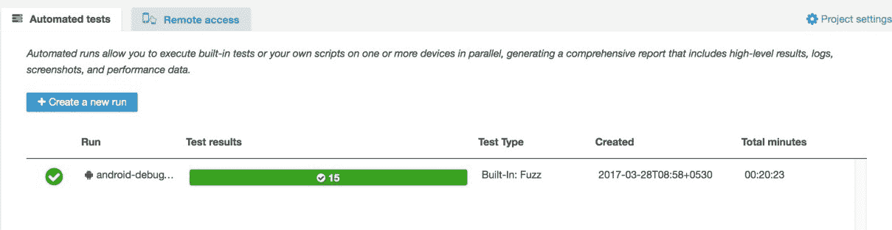

# 第九章：测试 Ionic 2 应用

在本章中，我们将讨论如何测试使用 Cordova（和 Ionic 2）构建的移动混合应用。测试可以在多个层面进行，首先是单元测试，然后是端到端测试，最后将应用部署到实际设备上并执行测试。在本章中，我们将对我们在第八章中构建的 Ionic 2 Todo 应用执行以下测试：

+   单元测试

+   端到端测试

+   使用 AWS 设备农场进行猴子或模糊测试

+   使用 AWS 设备农场进行测试

# 测试方法学

在应用开发领域，测试进入应用开发生命周期的两种方式。一种是更传统的方式，其中首先进行开发，然后根据要求设计和执行测试运行。另一种更有效的方式是采用**测试驱动开发**（**TDD**）。经过一段时间的验证，TDD 已被证明是一种更无缺陷的应用开发方式。您可以在这里阅读更多关于 TDD 的信息：[`agiledata.org/essays/tdd.html`](http://agiledata.org/essays/tdd.html)。

TDD 的副产品是**行为驱动测试**（**BDT**）。BDT 更多地围绕行为测试而不是需求测试。单元测试和 BDT 的自动化测试的良好组合将产生一个具有最小错误的优秀产品。由于 BDT 涉及更多以用户为中心的测试，因此可以在测试阶段轻松发现最终用户可能在测试阶段遇到的问题。

在本章中，我们将遵循测试应用的更传统流程，即在构建后进行测试。我们将实施单元测试、端到端测试，然后将应用上传到 AWS 设备农场并进行猴子测试。

# 设置单元测试环境

Ionic CLI 构建的应用在撰写本章的当天不包括任何测试设置。因此，我们需要自己添加所需的测试设置。

# 设置项目

首先，我们将创建一个名为`chapter9`的新文件夹，并将`chapter8`文件夹中的`todoapp_v2`复制到`chapter9`文件夹中。

通过从`chapter9/todoapp_v2`文件夹的根目录运行`npm install`来安装依赖项（如果缺少）。

运行`ionic serve`，查看应用是否按预期工作。当您创建、更新和删除`todo`时，您可能会在控制台中看到警告，指出 Cordova 环境不存在。这是因为我们在浏览器中使用本地通知插件。

我们将为单元测试我们的 Todo 应用进行环境设置，该设置基于文章：*Ionic 2 Unit Testing Setup: The Best Way* ([`www.roblouie.com/article/376/ionic-2-set-up-unit-testing-the-best-way/`](http://www.roblouie.com/article/376/ionic-2-set-up-unit-testing-the-best-way/))。

要开始，我们将安装 Karma 和 Jasmine：

+   **Karma**：Karma 是一个在 Node.js 上运行的 JavaScript 测试运行器。引用 Karma 的文档，*Karma 本质上是一个工具，它生成一个 Web 服务器，针对连接的每个浏览器执行源代码与测试代码。对每个浏览器的每个测试的结果进行检查，并通过命令行显示给开发人员，以便他们可以看到哪些浏览器和测试通过或失败。*

我们将使用 Karma 来执行我们将要编写的测试用例：

+   **Jasmine**：Jasmine 是一个用于测试 JavaScript 代码的行为驱动开发框架。它不依赖于任何其他 JavaScript 框架。它不需要 DOM。它具有清晰明了的语法，因此我们可以轻松编写测试。

我们将使用 Jasmine 来定义我们的测试并编写断言。通常我们会通过编写一个描述块来开始测试。然后我们开始使用`it`构造定义我们的测试用例。

例如：

```html
describe('Component: MyApp Component', () => { 
  it('should be created', () => { 
     // assertions go here 
  }); 
});

```

断言是简单的比较语句，用于验证实际结果和期望结果：

```html
expect(1 + 1).toBe(2); 
expect(!!true).toBeTruthy();

```

依此类推。

现在我们对 Karma 和 Jasmine 有了基本的了解，我们将安装所需的依赖项。

在安装过程中，如果出现任何错误，请更新到最新版本的 Node.js。

要安装 Karma，请运行以下命令：

```html
npm install -g karma-cli

```

接下来，安装 Jasmine 和相关依赖项：

```html
npm install --save-dev @types/jasmine@2.5.41 @types/node html-loader jasmine karma karma-webpack ts-loader karma-sourcemap-loader karma-jasmine karma-jasmine-html-reporter angular2-template-loader karma-chrome-launcher null-loader karma-htmlfile-reporter

```

完成后，我们将添加所需的配置文件。

在`todoapp_v2`文件夹的根目录下创建一个名为`test-config`的新文件夹。在`test-config`文件夹内，创建一个名为`webpack.test.js`的文件。使用以下代码更新`todoapp_v2/test-config/webpack.test.js`：

```html
var webpack = require('webpack'); 
var path = require('path'); 

module.exports = {
    devtool: 'inline-source-map',
    resolve: {
        extensions: ['.ts', '.js']
    },
    module: {
        rules: [{
            test: /.ts$/,
            loaders: [{
                loader: 'ts-loader'
            }, 'angular2-template-loader']
        }, {
            test: /.html$/,
            loader: 'html-loader'
        }, {
            test: /.(png|jpe?g|gif|svg|woff|woff2|ttf|eot|ico)$/,
            loader: 'null-loader'
        }]
    },
    plugins: [
        new webpack.ContextReplacementPlugin(
            // The (|/) piece accounts for 
            path separators in *nix and Windows
            /angular(|/)core(|/)
            (esm(|/)src|src)(|/)linker/,
            root('./src'), // location of your src
            {} // a map of your routes
        )
    ]
};

function root(localPath) { 
    return path.resolve(__dirname, localPath); 
}

```

接下来，在`test-config`文件夹内创建另一个名为`karma-test-shim.js`的文件。使用以下代码更新`todoapp_v2/test-config/karma-test-shim.js`：

```html
Error.stackTraceLimit = Infinity; 

require('core-js/es6'); 
require('core-js/es7/reflect'); 

require('zone.js/dist/zone'); 
require('zone.js/dist/long-stack-trace-zone'); 
require('zone.js/dist/proxy'); 
require('zone.js/dist/sync-test'); 
require('zone.js/dist/jasmine-patch'); 
require('zone.js/dist/async-test'); 
require('zone.js/dist/fake-async-test'); 

var appContext = require.context('../src', true, /.spec.ts/); 

appContext.keys().forEach(appContext); 

var testing = require('@angular/core/testing'); 
var browser = require('@angular/platform-browser-dynamic/testing'); 

testing.TestBed.initTestEnvironment(browser.BrowserDynamicTestingModule, browser.platformBrowserDynamicTesting());

```

最后，在`test-config`文件夹内创建一个名为`karma.conf.js`的文件。使用以下代码更新`todoapp_v2/test-config/karma.conf.js`：

```html
var webpackConfig = require('./webpack.test.js'); 
module.exports = function(config) { 
    var _config = { 
        basePath: '', 
        frameworks: ['jasmine'], 
        files: [ 
            { pattern: './karma-test-shim.js', watched: true } 
        ], 
        preprocessors: { 
            './karma-test-shim.js': ['webpack', 'sourcemap'] 
        }, 
        webpack: webpackConfig, 
        webpackMiddleware: { 
            stats: 'errors-only' 
        }, 
        webpackServer: { 
            noInfo: true 
        }, 
        reporters: ['html', 'dots'], 
        htmlReporter: { 
            outputFile: './unit-test-report.html', 
            pageTitle: 'Todo App Unit Tests', 
            subPageTitle: 'Todo App Unit Tests Report', 
            groupSuites: true, 
            useCompactStyle: true, 
            useLegacyStyle: true 
        }, 
        port: 9876, 
        colors: true, 
        logLevel: config.LOG_INFO, 
        autoWatch: true, 
        browsers: ['Chrome'], 
        singleRun: true 
    }; 
    config.set(_config); 
};

```

有了这些，我们完成了运行单元测试所需的基本配置。

前面提到的文章本身包含了我们添加的三个配置文件的所需信息。有关更多信息，请参阅：[`angular.io/docs/ts/latest/guide/webpack.html#!#test-configuration`](https://angular.io/docs/ts/latest/guide/webpack.html#!#test-configuration)。

# 编写单元测试

现在我们已经完成了所需的设置，我们将开始编写单元测试。单元测试写在与源文件相邻的文件中，文件名后面加上`.spec`。例如，如果我们为`app.component.ts`编写测试用例，我们将在相同的文件夹中创建一个名为`app.component.spec.ts`的文件，并编写所需的测试用例。

有关更多信息，请参阅[`angular.io/docs/ts/latest/guide/testing.html#!#q-spec-file-location`](https://angular.io/docs/ts/latest/guide/testing.html#!#q-spec-file-location)和[`angular.io/docs/ts/latest/guide/style-guide.html#!#02-10`](https://angular.io/docs/ts/latest/guide/style-guide.html#!#02-10)。

首先，我们将开始编写应用组件的测试。我们将测试以下情况：

+   如果组件已创建。

+   如果`rootPage`设置为`LoginPage`。

现在，在`todoapp_v2/src/app`文件夹内创建一个名为`app.component.spec.ts`的文件。使用以下代码更新`todoapp_v2/src/app/app.component.spec.ts`：

```html
import { async, TestBed } from '@angular/core/testing'; 
import { IonicModule } from 'ionic-angular'; 
import { StatusBar } from '@ionic-native/status-bar'; 
import { SplashScreen } from '@ionic-native/splash-screen'; 
import { MyApp } from './app.component'; 
import { LoginPage } from '../pages/login/login'; 

describe('Component: MyApp Component', () => { 
  let fixture; 
  let component; 

  beforeEach(async(() => { 
    TestBed.configureTestingModule({ 
      declarations: [MyApp], 
      imports: [ 
        IonicModule.forRoot(MyApp) 
      ], 
      providers: [ 
        StatusBar, 
        SplashScreen 
      ] 
    }) 
  })); 

  beforeEach(() => { 
    fixture = TestBed.createComponent(MyApp); 
    component = fixture.componentInstance; 
  }); 

  it('should be created', () => { 
    expect(component instanceof MyApp).toBe(true); 
  }); 

  it('should set the rootPage as LoginPage', () => { 
    expect(component.rootPage).toBe(LoginPage); 
  }); 

});

```

有很多事情要做。首先，我们导入了所需的依赖项。接下来，我们添加了描述块。在描述块内，我们添加了`beforeEach()`。`beforeEach()`在每次测试执行之前运行。在第一个`beforeEach()`中，我们定义了`TestBed`。在第二个`beforeEach()`中，我们创建了所需的组件并获取了它的实例。

`TestBed`配置和初始化了单元测试的环境。要深入了解 Angular 2 中的测试设置和执行方式，请查看：*Testing Angular 2, Julie Ralph*，网址：[`www.youtube.com/watch?v=f493Xf0F2yU`](https://www.youtube.com/watch?v=f493Xf0F2yU)。

一旦`TestBed`被定义并且组件被初始化，我们就编写我们的测试用例。

注意：我们已经用`async`包装了`beforeEach()`的回调函数。`async`不会让下一个测试开始，直到所有待处理的任务都完成。要了解何时在测试中使用`async`，请参考*Angular 2 Testing -- Async function call --when to use*：[`stackoverflow.com/a/40127164/1015046`](http://stackoverflow.com/a/40127164/1015046)。

接下来，我们将测试登录页面。

在`todoapp_v2/src/pages/login`文件夹内创建一个名为`login.spec.ts`的文件。我们将测试以下内容：

+   组件已创建

+   `userIp`变量被初始化为空字符串。

+   用户对象包含值为`a@a.com`的电子邮件

+   用户对象包含值为`a`的密码

使用以下代码更新`todoapp_v2/src/pages/login/login.spec.ts`：

```html
import { async, TestBed } from '@angular/core/testing'; 
import { IonicModule, NavController, AlertController } from 'ionic-angular'; 
import { IonicStorageModule } from '@ionic/storage'; 
import { MyApp } from '../../app/app.component'; 
import { LoginPage } from './login'; 
import { Auth } from '../../providers/auth'; 
import { IP } from '../../providers/ip'; 

describe('Component: Login Component', () => { 
  let fixture; 
  let component; 

  beforeEach(async(() => { 
    TestBed.configureTestingModule({ 
      declarations: [ 
        MyApp, 
        LoginPage 
      ], 
      imports: [ 
        IonicModule.forRoot(MyApp), 
        IonicStorageModule.forRoot() 
      ], 
      providers: [ 
        Auth, 
        IP, 
        NavController, 
        AlertController 
      ] 
    }) 
  })); 

  beforeEach(() => { 
    fixture = TestBed.createComponent(LoginPage); 
    component = fixture.componentInstance; 
  }); 

  it('should be created', () => { 
    expect(component instanceof LoginPage).toBe(true); 
  }); 

  it('should initialize `userIp` to ''', () => { 
    expect(component.userIp).toBe(''); 
  }); 

  it('should initialize `user`', () => { 
    expect(component.user.email).toBe('a@a.com'); 
    expect(component.user.password).toBe('a'); 
  }); 

});

```

上述代码相当容易理解。

接下来，我们转向主页组件。在`todoapp_v2/src/pages/home`文件夹内创建一个名为`home.spec.ts`的文件。在这个组件中，我们将测试以下内容：

+   组件是否已创建

+   `userIp`变量是否初始化为空字符串

+   `userTodos`变量是否初始化为空数组

+   当本地通知被触发时（这是我们对 Ionic Native 插件进行单元测试的方式）

使用以下代码更新`todoapp_v2/src/pages/home/home.spec.ts`：

```html
import { async, TestBed } from '@angular/core/testing'; 
import { IonicModule, NavController, AlertController } from 'ionic-angular'; 
import { MyApp } from '../../app/app.component'; 
import { HomePage } from './home'; 
import { LoginPage } from '../login/login'; 
import { IonicStorageModule } from '@ionic/storage'; 
import { LocalNotifications } from '@ionic-native/local-notifications'; 
import { LocalNotificationsMocks } from '../../mocks/localNotificationMocks'; 
import { Auth } from '../../providers/auth'; 
import { IP } from '../../providers/ip'; 
import { Todos } from '../../providers/todos'; 

describe('Component: Home Component', () => { 
  let fixture; 
  let component; 
  let localNotif; 

  beforeEach(async(() => { 
    TestBed.configureTestingModule({ 
      declarations: [ 
        MyApp, 
        HomePage, 
        LoginPage 
      ], 
      imports: [ 
        IonicModule.forRoot(MyApp), 
        IonicStorageModule.forRoot() 
      ], 
      providers: [ 
        Auth, 
        Todos, 
        IP, 
        { provide: LocalNotifications, useClass: 
          LocalNotificationsMocks }, 
        NavController, 
        AlertController 
      ] 
    }) 
  })); 

  beforeEach(() => { 
    fixture = TestBed.createComponent(HomePage); 
    component = fixture.componentInstance; 
    localNotif = new LocalNotificationsMocks(); 
  }); 

  it('should be created', () => { 
    expect(component instanceof HomePage).toBe(true); 
  }); 

  it('should initialize `userIp` to ''', () => { 
    expect(component.userIp).toBe(''); 
  }); 

  it('should initialize `userTodos`', () => { 
    expect(component.userTodos.length).toBe(0); 
  }); 

  // this is how we mock and test 
  // ionic-native plugins 
  it('should return null when a new notification is scheduled', () => { 
    expect(component.notify()).toBe(localNotif.schedule()); 
  }); 
});

```

从上述代码中需要注意的关键事项是提供者的属性传递给`TestBed.configureTestingModule()`。由于我们在模拟环境中运行测试，其中没有 Cordova，我们需要模拟或模拟`LocalNotifications`服务。

我们这样做的方式是创建另一个名为`LocalNotificationsMocks`的类，并在调用`LocalNotifications`时使用它。在`LocalNotificationsMocks`中，我们实现了返回预定义值的虚拟方法来模拟服务。

因此，我们将为`LocalNotifications`创建一个模拟服务。在`src`文件夹内创建一个名为 mocks 的文件夹。在`mocks`文件夹内，创建一个名为`localNotificationMocks.ts`的文件。使用以下代码更新`todoapp_v2/src/mocks/localNotificationMocks.ts`：

```html
export class LocalNotificationsMocks { 
  public schedule(config: any): void { 
    // https://github.com/driftyco/ionic-
    native/blob/5aa484c024d7cac3b6628c5dd8694395e8a29ed4/src/%40ionic-
    native/plugins/local-notifications/index.ts#L160 
    return; 
  } 
}

```

我们正在覆盖`schedule()`以根据原始定义返回 void。

完成组件测试后，接下来我们将测试提供者。

在`todoapp_v2/src/providers`文件夹内创建一个名为`ip.spec.ts`的文件。在这个提供者中，我们将模拟一个 HTTP 请求，并将模拟响应的输出与硬编码的响应进行比较。我们将测试以下情况：

+   提供者是否被构建

+   从模拟后端服务获取 IP 地址

打开`todoapp_v2/src/providers/ip.spec.ts`并使用以下代码进行更新：

```html
import { async, TestBed, inject } from '@angular/core/testing'; 
import { IP } from './ip'; 
import { Headers, Http, HttpModule, BaseRequestOptions, XHRBackend, Response, ResponseOptions } from '@angular/http'; 
import { MockBackend, MockConnection } from '@angular/http/testing'; 

// https://kendaleiv.com/angular-2-mockbackend-service-testing-template-using-testbed/ 
describe('Service: IPService', () => { 
  let service; 
  let http; 

  const mockResponse = { 
    ip: '11:22:33:44' 
  }; 

  beforeEach(async(() => { 
    TestBed.configureTestingModule({ 
      imports: [ 
        HttpModule 
      ], 
      providers: [ 
        MockBackend, 
        BaseRequestOptions, 
        { 
          provide: Http, 
          useFactory: (backend, options) => new Http(backend, options), 
          deps: [MockBackend, BaseRequestOptions] 
        }, 
        IP 
      ] 
    }) 
  })); 

  it('should construct', async(inject( 
    [IP, MockBackend], (ipService, mockBackend) => { 
      expect(ipService).toBeDefined(); 
    }))); 

  it('should get IP equal to `11:22:33:44`', async(inject( 
    [IP, MockBackend], (ipService, mockBackend) => { 

      mockBackend.connections.subscribe(conn => { 
        conn.mockRespond(new Response(new ResponseOptions({ body: JSON.stringify(mockResponse) }))); 
      }); 

      const result = ipService.get(); 

      result.subscribe((res) => { 
        expect(res.json()).toEqual({ 
          ip: '11:22:33:44' 
        }); 
      }); 
    }))); 
});

```

请注意 HTTP 的提供者。我们已经将它连接到`MockBackend`，并在发出请求时返回一个`mockResponse`。

接下来是 Auth 提供者。在`todoapp_v2/src/providers`文件夹内创建一个名为`auth.spec.ts`的文件。我们将在这个提供者中测试以下内容：

+   提供者是否被构建

+   成功使用有效凭据登录

+   使用无效凭据成功失败

+   `isAuthenticated()`的值

+   `logout()`时`authStatus`的值

打开`todoapp_v2/src/providers/auth.spec.ts`并使用以下代码进行更新：

```html
import { async, TestBed, inject } from '@angular/core/testing'; 
import { Auth } from './auth'; 
import { IonicStorageModule } from '@ionic/storage'; 
import { StorageMocks } from '../mocks/storageMocks'; 

let validUser = { 
  email: 'a@a.com', 
  password: 'a' 
} 

let inValidUser = { 
  email: 'a@a.com', 
  password: 'b' 
} 

describe('Service: AuthService', () => { 
  beforeEach(async(() => { 
    TestBed.configureTestingModule({ 
      imports: [ 
        IonicStorageModule.forRoot() 
      ], 
      providers: [ 
        Auth, 
        { provide: IonicStorageModule, useClass: StorageMocks }, 
      ] 
    }); 

  })); 

  it('should construct', async(inject( 
    [Auth, IonicStorageModule], (authService, ionicStorageModule) => { 
      expect(authService).toBeDefined(); 
    }))); 

  it('should login user with valid credentials', async(inject( 
    [Auth, IonicStorageModule], (authService, ionicStorageModule) => { 
      expect(authService.login(validUser)).toBeTruthy(); 
    }))); 

  it('should not login user with invalid credentials', async(inject( 
    [Auth, IonicStorageModule], (authService, ionicStorageModule) => { 
      expect(authService.login(inValidUser)).toBeFalsy(); 
    }))); 

  it('should return the auth status as true', async(inject( 
    [Auth, IonicStorageModule], (authService, ionicStorageModule) => { 
      // log the user in! 
      authService.login(validUser); 
      let result = authService.isAuthenticated(); 

      result.then((status) => { 
        expect(status).toBeTruthy(); 
      }) 
    }))); 

  it('should set auth to falsy on logout', async(inject( 
    [Auth, IonicStorageModule], (authService, ionicStorageModule) => { 
      // log the user in! 
      let authStatus = authService.login(validUser); 
      // check if login is successful 
      expect(authStatus).toBeTruthy(); 

      // trigger logout 
      let result = authService.logout(); 
      result.then((status) => { 
        expect(status).toBeFalsy(); 
      }); 
    }))); 

});

```

为了成功执行上述测试用例，我们需要模拟`IonicStorageModule`。在`todoapp_v2/src/mocks`文件夹内创建一个名为`storageMocks.ts`的新文件。使用以下代码更新`todoapp_v2/src/mocks/storageMocks.ts`：

```html
export class StorageMocks { 
  // mock store   
  store = {}; 

  public get(key) { 
    return new Promise((resolve, reject) => { 
      resolve(this.store[key]); 
    }); 
  } 

  public set(key, value){ 
    return new Promise((resolve, reject) => { 
      this.store[key] = value; 
      resolve(this.store[key]); 
    }); 
  } 
}

```

在这里，我们正在使用内存对象覆盖`IonicStorageModule`的行为。

我们将要测试的最后一个提供者是 Todos。在`todoapp_v2/src/providers`文件夹内创建一个名为`todos.spec.ts`的文件。我们将测试以下内容：

+   提供者是否被构建

+   Todos 的初始长度为`0`

+   保存一个 todo

+   更新一个 todo

+   删除一个 todo

打开`todoapp_v2/src/providers/todos.spec.ts`并进行以下更新：

```html
import { async, TestBed, inject } from '@angular/core/testing'; 
import { Todos } from './todos'; 
import { IonicStorageModule } from '@ionic/storage'; 
import { StorageMocks } from '../mocks/storageMocks'; 

let todos = [{ 
  text: 'Buy Eggs', 
  isCompleted: false 
}]; 

describe('Service: TodoService', () => { 
  beforeEach(async(() => { 
    TestBed.configureTestingModule({ 
      imports: [ 
        IonicStorageModule.forRoot() 
      ], 
      providers: [ 
        Todos, 
        { provide: IonicStorageModule, useClass: StorageMocks }, 
      ] 
    }); 

  })); 

  it('should construct', async(inject( 
    [Todos, IonicStorageModule], (todoService, ionicStorageModule) => { 
      expect(todoService).toBeDefined(); 
    }))); 

  it('should fetch 0 todos initally', async(inject( 
    [Todos, IonicStorageModule], (todoService, ionicStorageModule) => { 
      let result = todoService.get(); 
      result.then((todos) => { 
        expect(todos).toBeFalsy(); 
      }); 
    }))); 

  it('should save a todo', async(inject( 
    [Todos, IonicStorageModule], (todoService, ionicStorageModule) => { 
      let result = todoService.set(todos); 
      result.then((_todos) => { 
        expect(_todos).toEqual(todos); 
        expect(_todos.length).toEqual(1); 
      }); 
    }))); 

   it('should update a todo', async(inject( 
    [Todos, IonicStorageModule], (todoService, ionicStorageModule) => { 
      let todo = todos[0]; 
      todo.isCompleted = true; 
      todos[0] = todo; 
      let result = todoService.set(todos); 
      result.then((_todos) => { 
        expect(_todos[0].isCompleted).toBeTruthy(); 
      }); 
    })));  

   it('should delete a todo', async(inject( 
    [Todos, IonicStorageModule], (todoService, ionicStorageModule) => { 
      todos.splice(0, 1); 
      let result = todoService.set(todos); 
      result.then((_todos) => { 
        expect(_todos.length).toEqual(0); 
      }); 
    })));  

});

```

请注意提供者中的`StorageMocks`设置。通过这样做，我们已经完成了编写测试用例。下一步是执行。

# 执行单元测试

为了开始执行过程，我们将在`package.json`文件中添加一个脚本，这样我们就可以通过在命令提示符/终端中执行`npm test`来轻松运行测试。

打开`package.json`并在 scripts 部分添加以下行：

```html
"test": "karma start --reporters html ./test-config/karma.conf.js"

```

现在运行以下命令：

```html
npm test

```

然后，您应该看到浏览器启动并执行我们的测试用例。命令提示符/终端日志应该看起来像这样：

```html
todoapp_v2 npm test

> ionic-hello-world@ test /chapter9/todoapp_v2
> karma start --reporters html ./test-config/karma.conf.js

webpack: Compiled successfully.
webpack: Compiling...
ts-loader: Using typescript@2.0.9 and 
    /chapter9/todoapp_v2/tsconfig.json

webpack: Compiled successfully.
26 03 2017 23:26:55.201:INFO [karma]: Karma v1.5.0 server started 
    at http://0.0.0.0:9876/
26 03 2017 23:26:55.204:INFO [launcher]: Launching browser Chrome 
    with unlimited concurrency
26 03 2017 23:26:55.263:INFO [launcher]: Starting browser Chrome
26 03 2017 23:26:57.491:INFO [Chrome 56.0.2924 (Mac OS X 10.12.1)]: 
    Connected on socket DHM_DNgQakmVtg7RAAAA with id 44904930

```

您还应该看到一个名为`unit-test-report.html`的文件创建在`test-config`文件夹内。如果在浏览器中打开此文件，您应该会看到以下内容：


上表总结了执行的测试。

# driftyco/ionic-unit-testing-example

在撰写本章的三天前，Ionic 团队发布了一篇博客文章，表明他们将支持单元测试和端到端测试，并且这将成为 Ionic 脚手架项目本身的一部分。更多信息可以在这里找到：[`blog.ionic.io/basic-unit-testing-in-ionic/`](http://blog.ionic.io/basic-unit-testing-in-ionic/)。

这个项目是基于 Ionic 2 测试领域中的一些非常有价值的贡献者，正如博客文章中所提到的。截至今天，*driftyco/ionic-unit-testing-example*（[`github.com/driftyco/ionic-unit-testing-example`](https://github.com/driftyco/ionic-unit-testing-example)）存储库没有完整的实现，只支持单元测试。

但到书出版时，他们可能已经推出了。`driftyco/ionic-unit-testing-example`内的设置应该仍然与我们在这里遵循的设置相同。我提醒您这一点，以便您可以关注该项目。

# E2E 测试

在单元测试中，我们已经测试了代码单元。在端到端测试中，我们将测试完整的功能，比如登录或注销，或者获取 IP 地址等等。在这里，我们将整个应用程序作为一个整体来看，而不仅仅是一个功能的一部分。有些人也将这称为集成测试。

我们将使用 Protractor 来帮助我们执行 E2E 测试。我们仍然会使用 Jasmine 来描述我们的测试，只是测试运行器从 Karma 变为 Protractor。

引用自[`www.protractortest.org`](http://www.protractortest.org)：

"Protractor 是一个用于 Angular 应用程序的端到端测试框架。Protractor 在真实浏览器中运行测试，与用户交互。"

YouTube 上有很多视频，深入解释了 Protractor 和 Selenium，以及 Protractor 的各种 API，可以用于测试，如果您想了解更多关于 Protractor 的信息。

我们将要进行的测试如下：

+   登录到应用程序

+   验证登录

+   注销应用程序

+   验证注销

# 设置项目

我将按照名为“E2E（端到端）测试在 Ionic 2 中的介绍”（[`www.joshmorony.com/e2e-end-to-end-testing-in-ionic-2-an-introduction/`](https://www.joshmorony.com/e2e-end-to-end-testing-in-ionic-2-an-introduction/)）的文章来设置 E2E 环境。

我们将使用相同的示例来实现单元测试。

首先通过运行以下命令安装 protractor：

```html
npm install protractor --save-dev

```

接下来，安装`webdriver-manager`并更新它：

```html
npm install -g webdriver-manager
webdriver-manager update

```

现在，我们将通过运行以下命令安装 Protractor 的依赖项：

```html
npm install jasmine-spec-reporter ts-node connect @types/jasmine@2.5.41 
@types/node --save-dev

```

请注意 Jasmine 类型的版本。它是硬编码为`2.5.41`。在撰写本文时，TypeScript 版本的 Jasmine 类型与 Ionic 2 项目存在一些冲突。如果您正在使用 Ionic 3.0，则应该已经解决了这个问题。

接下来，在`todoapp_v2`项目文件夹的根目录下，创建一个名为`protractor.conf.js`的文件。使用以下代码更新`todoapp_v2/protractor.conf.js`：

```html
var SpecReporter = require('jasmine-spec-reporter').SpecReporter; 

exports.config = { 
    allScriptsTimeout: 11000, 
    directConnect: true, 
    capabilities: { 
        'browserName': 'chrome' 
    }, 
    framework: 'jasmine', 
    jasmineNodeOpts: { 
        showColors: true, 
        defaultTimeoutInterval: 30000, 
        print: function() {} 
    }, 
    specs: ['./e2e/**/*.e2e-spec.ts'], 
    baseUrl: 'http://localhost:8100', 
    useAllAngular2AppRoots: true, 
    beforeLaunch: function() { 

        require('ts-node').register({ 
            project: 'e2e' 
        }); 

        require('connect')().use(require('serve-static')
        ('www')).listen(8100); 

    }, 
    onPrepare: function() { 
        jasmine.getEnv().addReporter(new SpecReporter()); 
    } 
}

```

这个文件定义了 Protractor 和 Selenium 的启动属性。

接下来，我们将在`todoapp_v2`文件夹的根目录下创建一个名为`e2e`的文件夹。在`todoapp_v2/e2e`文件夹内，创建一个名为`tsconfig.json`的文件。使用以下代码更新`todoapp_v2/e2e/tsconfig.json`：

```html
{ 
  "compilerOptions": { 
    "sourceMap": true, 
    "declaration": false, 
    "moduleResolution": "node", 
    "emitDecoratorMetadata": true, 
    "experimentalDecorators": true, 
    "lib": [ 
      "es2016" 
    ], 
    "outDir": "../dist/out-tsc-e2e", 
    "module": "commonjs", 
    "target": "es6", 
    "types":[ 
      "jasmine", 
      "node" 
    ] 
  } 
}

```

这完成了我们的端到端测试设置。现在，我们将开始编写测试。

# 编写 E2E 测试

现在我们已经完成了所需的设置，我们将开始编写测试。在`todoapp_v2/e2e`文件夹内创建一个名为`test.e2e-spec.ts`的新文件。

如前所述，我们将执行一个简单的测试--登录到应用程序，验证登录，从应用程序注销，并验证注销。所需的测试应该如下所示：

```html
import { browser, element, by, ElementFinder } from 'protractor'; 

// https://www.joshmorony.com/e2e-end-to-end-testing-in-ionic-2-an-introduction/ 
describe('Check Navigation : ', () => { 

  beforeEach(() => { 
    browser.get(''); 
  }); 

  it('should have `Todo App (v2)` as the title text on the Login Page', 
  () => { 
      expect(element(by.css('.toolbar-title')) 
        .getAttribute('innerText')) 
        .toContain('Todo App (v2)'); 

  }); 

  it('should be able to login with prefilled credentials', () => { 
    element(by.css('.scroll-content > button')).click().then(() => { 
      // Wait for the page transition 
      browser.driver.sleep(3000); 

      // check if we have really redirected 
      expect(element(by.css('.scroll-content > button')) 
        .getAttribute('innerText')) 
        .toContain('ADD TODO'); 

      expect(element(by.css('h2.text-center')) 
        .getAttribute('innerText')) 
        .toContain('No Todos'); 

      expect(element(by.css('ion-footer > h3')) 
        .getAttribute('innerText')) 
        .toContain('Your IP : 183.82.232.178'); 

    }); 

  }); 

  it('should be able to logout', () => { 
     element(by.css('ion-buttons > button')).click().then(() => { 

      // Wait for the page transition 
      browser.driver.sleep(3000); 

      // check if we have really redirected 
      expect(element(by.css('.toolbar-title')) 
        .getAttribute('innerText')) 
        .toContain('Todo App (v2)'); 
    }); 
  }); 

});

```

前面的代码是不言自明的。请注意，我已经将我的 IP 地址硬编码以在测试时进行验证。在开始执行 E2E 测试之前，请更新 IP 地址。

# 执行 E2E 测试

现在我们已经完成了测试的编写，我们将执行相同的测试。在项目的根目录下打开命令提示符/终端，并运行以下命令：

```html
protractor

```

您可能会遇到一个错误，看起来像这样：

```html
// snipp
Error message: Could not find update-config.json. Run 'webdriver-
manager update' to download binaries.
// snipp

```

如果是这样，请运行以下命令：

```html
./node_modules/protractor/bin/webdriver-manager update

```

然后运行`protractor`或`./node_modules/.bin/protractor`。

然后您应该会看到浏览器启动并导航到应用程序。如果一切顺利，您应该会在命令提示符/终端中看到以下输出：

```html
  todoapp_v2 ./node_modules/.bin/protractor
[00:37:27] I/launcher - Running 1 instances of WebDriver
[00:37:27] I/direct - Using ChromeDriver directly...
Spec started

 Check Navigation :
 should have `Todo App (v2)` as the title text on the Login Page
 should be able to login with prefilled credentials
 should be able to logout

Executed 3 of 3 specs SUCCESS in 11 secs.
[00:37:40] I/launcher - 0 instance(s) of WebDriver still running
[00:37:40] I/launcher - chrome #01 passed

```

通过这样，我们完成了对 Ionic 应用的两种主要测试。

我们要做的最后一个测试是使用 AWS 设备农场。

注意：在测试 Cordova 功能时，您可以像之前看到的那样模拟它们。我们将在执行 E2E 测试之前直接更新`app.module.ts`，而不是更新测试床。但是请记住在测试完成后将其改回来。

# 代码覆盖率

检查代码覆盖率是测试过程中非常重要的活动。代码覆盖率帮助我们了解我们编写的代码有多少被测试了。您可以参考*karma-coverage* ([`github.com/karma-runner/karma-coverage`](https://github.com/karma-runner/karma-coverage)) 模块和 *remap-istanbul* ([`github.com/SitePen/remap-istanbul`](https://github.com/SitePen/remap-istanbul)) 模块来实现代码覆盖率。

您还可以参考*如何向 Angular 2 项目添加测试覆盖报告*：[`www.angularonrails.com/add-test-coverage-report-angular-2-project/`](https://www.angularonrails.com/add-test-coverage-report-angular-2-project/) 进行进一步参考。

# AWS 设备农场

现在我们已经对我们的应用进行了单元测试和端到端测试，我们将部署应用到实际设备上并进行测试。

要在实际设备上开始测试，我们需要借用或购买这些设备，这对于一个一次性的应用来说可能并不实际。这就是设备农场的概念出现的地方。设备农场是各种设备的集合，可以通过 Web 界面访问。这些设备可以通过 Web 进行访问和测试，方式类似于在实际设备上进行测试。

市面上有很多提供按需付费设备农场的供应商。在许多设备农场的试错之后，我对 AWS 设备农场有了一些好感。它简单易用，并且在错误日志、截图和视频方面非常详细。后者真的可以帮助您在特定设备上识别终端用户或错误崩溃报告中报告的问题。

截至撰写本章的日期，AWS 每个设备每分钟收费$0.17，前 250 分钟免费。或者如果您是重度用户，您也可以根据您的使用情况订阅无限测试计划。这从每月$250 起。

在这个主题中，使用 AWS 设备农场，我们将上传我们在第八章 *Ionic 2 迁移指南*中迁移的 Todo 应用的 APK，并执行两个测试：

+   Monkey 测试应用，看看应用是否崩溃

+   在实际设备上手动测试应用

# 设置 AWS 设备农场

在我们开始在实际设备上测试之前，我们将设置一个新的 AWS 账户，如果您还没有的话。您可以转到[`aws.amazon.com/`](https://aws.amazon.com/) 进行注册和登录。

一旦您进入 AWS 控制台，从页面头部的服务选项中选择设备农场。设备农场是 AWS 区域不可知的。您不需要在特定区域才能访问它。

一旦您进入 AWS 设备农场的主页，您应该会看到一个像这样的屏幕：


点击“开始”。这将提示我们输入项目名称。在 Device Farm 中，项目是我们要执行的测试类型、要测试的设备类型或应用程序版本的逻辑分组。

我将把我的项目命名为`Todo App v1`。当我有另一个版本时，我将把它命名为`Todo App v2`：


注意：这里的`v1`指的是我们的 Todo 应用的 v1 版本，而不是使用 Ionic v1 构建的 Todo 应用。

点击“创建项目”，你应该会进入项目主页。

# 设置 Todo 应用

现在我们准备测试我们的应用，让我们继续构建它。转到`todoapp_v2`文件夹并打开一个新的命令提示符/终端。运行`ionic platform add android`或`ionic platform add ios`，然后构建应用程序：

```html
ionic build

```

在这个例子中，我将为 Android 构建并使用 APK 进行设备测试。构建完成后，转到`todoapp_v2/platforms/android/build/outputs/apk`文件夹，你应该会找到一个名为`android-debug.apk`的文件。我们将上传这个 APK 文件进行测试。

iOS 测试的流程也类似，只是我们上传 IPA 文件。

# 对 Todo 应用进行猴子测试

猴子测试或模糊测试是一种自动化测试技术，测试执行器将输入随机输入，在应用程序或页面的随机部分执行随机点击，以查看应用程序是否崩溃。要了解更多关于猴子测试的信息，请参考：[`en.wikipedia.org/wiki/Monkey_testing`](https://en.wikipedia.org/wiki/Monkey_testing)。

Device Farm 将这作为在设备上测试应用程序的良好起点。

一旦我们进入项目主页，我们应该会看到两个选项卡：自动化测试和远程访问：


在自动化测试选项卡上，点击“创建新运行”。在“选择您的应用程序”部分，选择您的选择，如下面的截图所示：


接下来上传 APK 或 IPA 文件。一旦应用程序成功上传，我们应该会看到类似于这样的东西：


点击“下一步”。

在配置测试部分，选择内置：模糊，如下面的截图所示：


还有其他自动化测试框架，如 Appium 或 Calabash，也可以用来构建自动化测试套件。Device Farm 也支持这些框架。

点击“下一步”。

这是我们选择目标设备的地方。默认情况下，AWS Device Farm 选择顶级设备。我们可以选择这个，也可以构建自己的设备池：


在这个例子中，我将选择顶部设备。

点击“下一步”以进入指定设备状态部分。在这里，如果需要，我们可以覆盖设备功能：


我们将保持现状。

点击“下一步”，在这里我们设置测试的估计时间。我选择了每个设备 5 分钟，如下所示：


点击“确认并开始运行”以启动猴子测试。这将需要大约 25 分钟才能完成。你可以去跑步，喝咖啡，做瑜伽，基本上你需要度过 25 分钟。

现在测试已经完成，你应该会看到这样的屏幕：



看起来 Todo 应用在五台设备上通过了猴子测试。如果我们点击该行，我们应该会看到结果的深入分析：


正如你从前面的步骤中看到的那样，我们可以查看每个设备的结果和所有设备的截图。为了获得更深入的见解，我们将点击一个设备：


正如你从前面的图片中看到的那样，我们还可以查看测试执行视频、日志、性能和截图：


性能概述如前面的截图所示。

这有助于我们快速在各种设备上对我们的应用进行一些随机测试。

# 在各种设备上手动测试 Todo 应用

在本节中，我们将远程访问设备并在其上测试我们的应用程序。当用户报告您无法在其他设备上复制的特定设备上的错误时，此功能非常有用。

要开始手动测试，请导航到项目主页，然后单击“远程访问”选项卡。然后单击“开始新会话”按钮。

这将重定向到另一个页面，在那里我们需要选择一个设备，如图所示：


我选择了一个 Android 设备，并通过单击“确认并开始会话”来启动了一个新会话。这将启动一个新会话：


一旦设备可用，我们应该看到类似于这样的东西：


默认情况下，我们最近上传的 APK 将安装在此设备上。否则，您可以使用右上角的“安装应用程序”来安装特定应用程序，如前面的屏幕截图所示。

我已经从菜单中导航到`TodoApp-v2`，如图所示：


启动应用程序后，我们可以进行登录、管理待办事项、查看通知等操作：


测试完成后，我们可以停止会话。会话成功终止后，我们可以以可下载的格式获取日志、视频和网络流量的副本以进行进一步调试：


通过这种方式，我们已经看到了如何在各种设备上手动测试应用程序。

# 自动化测试

除了上述测试应用的方法之外，我们还可以使用诸如 Appium（[`appium.io/`](http://appium.io/)）之类的框架构建自动化测试用例。通过使用设备农场，我们可以上传 APK 或 IPA，然后进行自动化测试套件。然后我们选择一组设备并在它们上执行测试。

您可以查阅*自动化混合应用*（[`appium.io/slate/en/master/?ruby#automating-hybrid-apps`](http://appium.io/slate/en/master/?ruby#automating-hybrid-apps)）和*使用 Smoke Tests 和 Appium 验证 Cordova 或 PhoneGap 构建*（[`ezosaleh.com/verifying-a-cordovaphonegap-build-with-smoke-tests-appium`](http://ezosaleh.com/verifying-a-cordovaphonegap-build-with-smoke-tests-appium)）来了解为混合应用编写自动化测试的想法。

如果选择，您也可以在模拟器中本地运行这些自动化测试。

# 总结

在本章中，我们已经介绍了测试的两种主要方法-单元测试和端到端测试。我们使用 Karma 和 Jasmine 对 Todo 应用进行了单元测试。我们使用 Protractor 和 Jasmine 进行了端到端测试。我们还使用了 AWS 设备农场的模糊测试来测试我们的应用，以及通过在我们选择的远程设备上安装应用程序来进行测试。

在下一章中，我们将看一下发布和管理 Ionic 应用程序。
