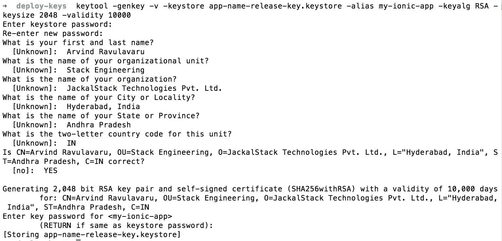
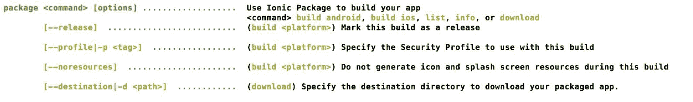

# 第十章：发布 Ionic 应用

在本章中，我们将介绍三种为 Ionic 应用生成安装程序的方法。一种是使用 PhoneGap 构建服务，第二种是使用 Cordova CLI，最后一种是使用 Ionic 包服务。我们将为 Android 和 iOS 操作系统生成安装程序。本章将涵盖以下主题：

+   生成图标和启动屏幕

+   验证 config.xml

+   使用 PhoneGap 构建服务生成安装程序

+   使用 Cordova CLI 生成安装程序

+   使用 Ionic 包生成服务

# 为应用程序准备分发

现在我们已经成功构建了 Ionic 应用，我们希望进行分发。通过应用商店是触及更广泛受众的最佳方式。但是，在开始分发应用之前，我们将需要特定于应用的图标和启动屏幕。启动屏幕是完全可选的，取决于产品理念。

# 设置图标和启动屏幕

默认情况下，当您运行以下代码时：

```html
ionic platform add android 

```

或者

```html
ionic platform add ios

```

CLI 会自动添加一个名为资源的新文件夹。您可以在第七章中查看这一点，*构建 Riderr 应用*。资源文件夹包括 Ionic 或 Android 或两者的子文件夹，具体取决于您添加了多少个平台，在每个文件夹中，您将看到两个名为图标和启动的子文件夹。

如果您的应用程序使用启动屏幕，则可以保留启动文件夹，否则删除该文件夹以节省最终应用程序安装程序的几个字节。

要生成图标，您可以获取大于 1024 x 1024 的图标副本，并使用任何服务，例如以下服务，为 Android 和 iOS 生成图标和启动屏幕：

+   [`icon.angrymarmot.org/`](http://icon.angrymarmot.org/)

+   [`makeappicon.com/`](http://makeappicon.com/)

我与上述任何服务都没有关联。您使用这些服务需自担风险。

或者，更好的是，您可以将名为`icon.png`和`splash.png`的文件放在资源文件夹中，并运行以下代码：

```html
ionic resources 

```

这将负责将您的图像上传到 Ionic 云，根据需要调整其大小，并将其保存回资源文件夹。

请注意，您正在将内容上传到公共/ Ionic 云中。

如果您只想转换图标，可以使用以下方法：

```html
ionic resources --icon

```

如果只需要启动屏幕，可以使用以下方法：

```html
ionic resources --splash

```

您可以使用[`code.ionicframework.com/resources/icon.psd`](http://code.ionicframework.com/resources/icon.psd)来设计您的图标，使用[`code.ionicframework.com/resources/splash.psd`](http://code.ionicframework.com/resources/splash.psd)来设计您的启动屏幕。

您可以将`icon.png`图像，`icon.psd`文件或 icon.ai 文件放在资源文件夹的根目录，ionic 资源将会自动处理！

# 更新 config.xml

+   正如我们已经知道的那样，`config.xml`是 Cordova API 信任的唯一真相来源，用于生成特定于操作系统的安装程序。因此，在我们开始部署过程之前，需要对此文件进行彻底验证。您可以按照清单来确保所有事情都就绪：

+   小部件 ID 已定义并有效

+   小部件版本已定义并有效

+   在应用更新的情况下，小部件版本已更新并有效

+   名称标签已定义并有效

+   描述已定义并有效

+   作者信息已定义并有效

+   访问标签已定义并且限制在所需的域内（[`github.com/apache/cordova-plugin-whitelist#network-request-whitelist`](https://github.com/apache/cordova-plugin-whitelist#network-request-whitelist)）

+   允许导航已定义并且限制在所需的域内（[`github.com/apache/cordova-plugin-whitelist#navigation-whitelist`](https://github.com/apache/cordova-plugin-whitelist#navigation-whitelist)）

+   允许意图已定义并且限制在所需的域内（[`github.com/apache/cordova-plugin-whitelist#intent-whitelist`](https://github.com/apache/cordova-plugin-whitelist#intent-whitelist)）

+   交叉检查偏好设置

+   交叉检查图标和启动图片的路径

+   交叉检查权限（如果有的话）

+   使用内容安全策略元标记（[`github.com/apache/cordova-plugin-whitelist#content-security-policy`](https://github.com/apache/cordova-plugin-whitelist#content-security-policy)）更新`index.html`

一旦以上点都经过验证，我们将开始安装程序生成过程。

# PhoneGap 构建服务

我们将首先看一下使用 PhoneGap 构建服务生成应用程序安装程序的方法。这可能是为 Android 和 iOS 生成安装程序的最简单方法。

这个过程非常简单。我们将整个项目上传到 PhoneGap 构建服务，它会负责构建安装程序。

如果你认为上传完整项目不切实际，你可以只上传`www`文件夹。但是，你需要做以下更改。

1.  将`config.xml`移动到`www`文件夹内。

1.  将资源文件夹移动到`www`文件夹内。

1.  在`config.xml`中更新资源文件夹的路径。

如果你经常做以上操作，我建议使用一个构建脚本来生成一个带有以上更改的 PhoneGap 构建`Deployable`文件夹。

如果你计划只为 Android 发布你的应用程序，你不需要做任何其他事情。但是，如果你计划生成 iOS 安装程序，你需要获得一个苹果开发者账户，并按照[`docs.build.phonegap.com/en_US/signing_signing-ios.md.html`](http://docs.build.phonegap.com/en_US/signing_signing-ios.md.html)中的步骤生成所需的证书。

你也可以按照[`docs.build.phonegap.com/en_US/signing_signing-android.md.html`](http://docs.build.phonegap.com/en_US/signing_signing-android.md.html)中提到的步骤签署你的 Android 应用程序。

一旦你拥有所需的证书和密钥，我们就可以开始生成安装程序了。你可以按照以下步骤使过程变得简单：

1.  创建一个 PhoneGap 账户并登录（[`build.phonegap.com/plans`](https://build.phonegap.com/plans)）

1.  接下来，转到[`build.phonegap.com/people/edit`](https://build.phonegap.com/people/edit)，选择 Signing Keys 选项卡，并上传 iOS 和 Android 证书。

1.  接下来，转到：[`build.phonegap.com/apps`](https://build.phonegap.com/apps)，点击 New App。作为*免费计划*的一部分，只要从公共 Git 存储库中拉取，你可以拥有尽可能多的应用。或者，你可以从私有存储库创建私有应用，或者通过上传 ZIP 文件创建。

1.  为了测试服务，你可以创建一个`.zip`文件（不是`.rar`或`.7z`），具有以下文件夹结构：

+   `App`（根文件夹）

+   `config`.xml

+   `resources`（文件夹）

+   `www`（文件夹）

这就是 PhoneGap 构建工作所需的一切。

1.  将 ZIP 文件上传到[`build.phonegap.com/apps`](https://build.phonegap.com/apps)并创建应用程序。

这个过程通常需要大约一分钟来完成它的魔力。

有时，你可能会从构建服务中看到意外的错误。等一会儿，然后再试一次。根据流量的不同，有时构建过程可能会比预期的时间长一些。

# 使用 Cordova CLI 生成安装程序

我们将看一下使用 Cordova CLI 创建安装程序。

# Android 安装程序

首先，我们将看一下使用 CLI 为 Android 生成安装程序。你可以按照以下步骤进行：

1.  在项目的根目录打开一个新的命令提示符/终端。

1.  使用以下命令移除不需要的插件：

```html
 ionic plugin rm cordova-plugin-console

```

1.  使用以下命令在发布模式下构建应用程序：

```html
      cordova build --release android

```

这将在发布模式下生成一个未签名的安装程序，并将其放置在`<<ionic project>>/platforms/android/build/outputs/apk/android-release-unsigned.apk`。

1.  接下来，我们需要创建一个签名密钥。如果你已经有一个签名密钥，或者你正在更新一个现有的应用程序，你可以跳过下一步。

1.  私钥是使用 keytool 生成的。我们将创建一个名为 deploy-keys 的文件夹，并将所有这些密钥保存在那里。创建文件夹后，运行`cd`命令进入文件夹并运行以下命令：

```html
      keytool -genkey -v -keystore app-name-release-key.keystore -alias 
      alias_name -keyalg RSA -keysize 2048 -validity 10000 

```

您将被问到以下问题，您可以按照所示回答：



如果您丢失了此文件，您将永远无法提交更新到应用商店。

注意：要了解有关 keytool 和签名过程的更多信息，请参阅[`developer.android.com/studio/publish/app-signing.html`](https://developer.android.com/studio/publish/app-signing.html)。

1.  这是一个可选步骤，您也可以将`android-release-unsigned.apk`复制到`deploy-keys`文件夹中，并从那里运行以下命令。我会把文件留在原地。

1.  接下来，我们使用 jarsigner 工具对未签名的 APK 进行签名：

```html
      jarsigner -verbose -sigalg SHA1withRSA -digestalg SHA1 -keystore app-name-
      release-key.keystore ../platforms/android/build/outputs/apk/android-
      release-unsigned.apk my-ionic-app

```

将要求输入密码，这是您在创建密钥库时的第一步输入的密码。签名过程完成后，现有的`android-release-unsigned.apk`将被替换为同名的已签名版本。

我们正在从 deploy-keys 文件夹内运行上述命令。

1.  最后，我们运行`zipalign`工具来优化 APK：

```html
      zipalign -v 4 ../platforms/android/build/outputs/apk/android-release-
      unsigned.apk my-ionic-app.apk

```

上述命令将在`deploy-keys`文件夹中创建`my-ionic-app.apk`。

现在，您可以将此 APK 提交到应用商店。

# iOS 安装程序

接下来，我们将使用 XCode 为 iOS 生成安装程序。您可以按照给定的步骤进行：

1.  在项目的根目录打开新的命令提示符/终端。

1.  删除不需要的插件：

```html
 ionic plugin rm cordova-plugin-console

```

1.  运行：

```html
 ionic build -release ios

```

1.  导航到 platforms/iOS 并使用 XCode 启动`projectname.xcodeproj`。

1.  一旦项目在 XCode 中，选择产品，然后从导航菜单中选择存档。

1.  接下来，选择窗口并从导航菜单中选择组织者。您将看到一个创建的存档列表。

1.  点击我们现在创建的快照存档，然后点击提交。进行帐户验证，然后应用将被上传到 iStore。

1.  最后，您需要登录 iTunes 商店设置截图、描述等。

这结束了使用 Cordova CLI 生成安装程序的过程。

# 离子包

在本节中，我们将看一下 Ionic Package。

# 上传项目到 Ionic 云

使用 Ionic 云服务生成安装程序非常简单。首先，我们通过运行以下命令将我们的应用上传到我们的 Ionic 帐户：

```html
ionic upload

```

在执行上述命令之前，请登录您的 Ionic 帐户。

如果您的项目涉及敏感信息，请在将应用上传到云之前与 Ionic 许可证进行交叉检查。

上传应用后，将为您的应用生成一个应用 ID。您可以在项目根目录下的`ionic.config.json`文件中找到应用 ID。

# 生成所需的密钥

您需要按照“使用 Cordova CLI 生成安装程序”部分的第 5 步，Android 安装程序子部分，获取密钥库文件。

接下来，我们使用 ionic package 命令生成安装程序：

```html
ionic package <command> [options]

```

选项将包括以下内容：



例如，如果您想要以发布模式为 Android 生成安装程序，将如下所示：

```html
ionic package release android -k app-name-release-key.keystore -a my-ionic-app -w 12345678 -r 12345678 -o ./ -e arvind.ravulavaru@gmail.com -p 12345678

```

我们正在从 deploy-keys 文件夹内运行上述命令。

同样，iOS 的上述命令将如下所示：

```html
ionic package release ios -c certificate-file -d password -f profilefile -o ./ -e arvind.ravulavaru@gmail.com -p 12345678

```

# 摘要

在本章中，我们看到了如何发布和管理 Ionic 应用。我们看到了如何使用 PhoneGap 构建服务、使用 Cordova CLI 以及最后使用 Ionic Package 生成安装程序。

在下一章中，我们将看一下 Ionic 3 和 Ionic 2 与 Ionic 3 之间的主要区别。

请注意，到目前为止我们学到的几乎所有概念在 Ionic 3 中仍然适用。
