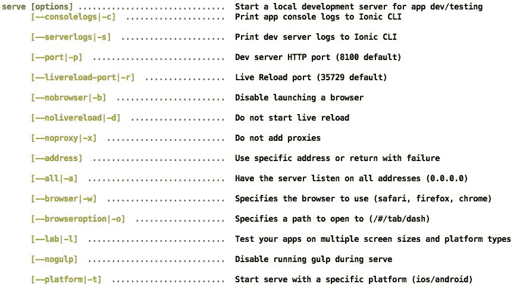
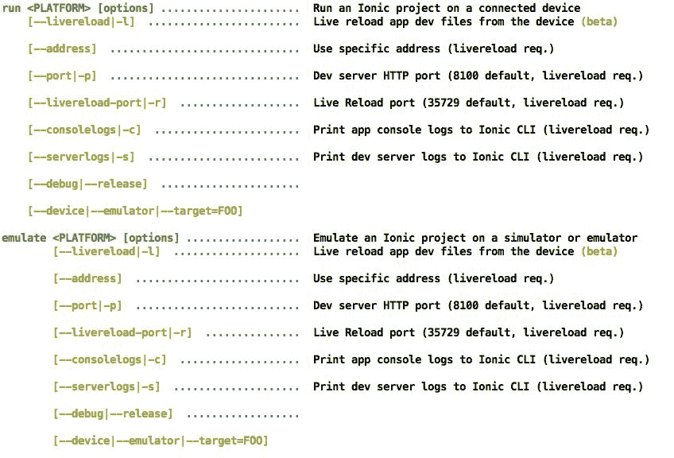

# 附录

本书的主要目的是让读者尽可能熟悉 Ionic。因此，我从第一章到第十一章采用了渐进式的方法，从 Cordova 的基础知识到使用 Angular Ionic 和 Cordova 构建应用程序。我们非常专注于学习 Ionic 的最低要求。

在本附录中，我将展示一些您可以探索的 Ionic CLI 和 Ionic Cloud 的更多选项。

# Ionic CLI

Ionic CLI 每天都在变得更加强大。由于我们在整本书中一直在使用 Ionic CLI 2.1.14，我将讨论相同的选项。Ionic CLI 2.2.2 或更高版本也应该几乎具有相同的选项。

# Ionic login

您可以通过以下三种方式之一登录到 Ionic Cloud 帐户。

首先，使用提示：

```html
ionic login

```

其次，无提示：

```html
ionic login --email arvind.ravulavaru@gmail.com --password 12345678

```

最后，使用环境变量。您可以将`IONIC_EMAIL`和`IONIC_PASSWORD`设置为环境变量，Ionic CLI 将在不提示的情况下使用它们。这可能有点不安全，因为密码将以纯文本形式存储。

注意：您需要拥有 Ionic Cloud 帐户才能成功进行身份验证。

# Ionic start

首先，我们将看一下无 Cordova 标志选项。

# 无 Cordova

start 命令是创建新的 Ionic 应用程序的最简单方式之一。在本书中，我们一直使用 start 命令来始终创建一个新的 Cordova 和 Ionic 项目。

此外，Ionic 也可以在没有 Cordova 的情况下使用。

要在没有 Cordova 的情况下创建一个 Ionic 项目，您需要使用`-w`标志或`--no-cordova`标志运行 start 命令：

```html
ionic start -a "My Mobile Web App" -i app.web.mymobile -w myMobileWebApp sidemenu

```

生成的项目应该如下所示：

```html
. 
├── bower.json 
├── gulpfile.js 
├── ionic.config.json 
├── package.json 
├── scss 
│   ├── ionic.app.scss 
├── www 
    ├── css 
    ├── img 
    ├── index.html 
    ├── js 
    ├── lib 
    ├── manifest.json 
    ├── service-worker.js 
    ├── templates

```

现在，像往常一样，您可以`cd`进入`myMobileWebApp`文件夹并运行`ionic serve`。

# 初始化支持 SCSS 的项目

初始化一个默认启用 SCSS 的项目，可以使用`-s`或`--sass`标志运行 start 命令：

```html
ionic start -a "My Sassy App" -i app.my.sassy --sass mySassyApp blank

```

注意：此命令在编写代码的当天不起作用。

# 列出所有 Ionic 模板

要查看所有可用模板的列表，请使用`-l`或`--list`标志运行 Ionic start：

```html
ionic start -l

```

截至今天，这些是可用的模板：

```html
    blank ................ A blank starter project for Ionic
complex-list ......... A complex list starter template
maps ................. An Ionic starter project using Google Maps 
    and a side menu
salesforce ........... A starter project for Ionic and Salesforce
sidemenu ............. A starting project for Ionic using a side 
    menu with navigation in the content area
tabs ................. A starting project for Ionic using a simple 
    tabbed interface
tests ................ A test of different kinds of page navigation 

```

# 应用 ID

如果您使用 Ionic Cloud 服务，您将为在云上创建的每个项目分配一个应用 ID（有关更多信息，请参阅本章中的 Ionic Cloud 部分）。此应用 ID 将驻留在项目根目录下的`ionic.config.json`文件中。

当您创建一个新项目时，应用 ID 为空。如果您想将当前创建的项目与云上现有的应用关联起来，可以使用`--io-app-id`标志运行 start 命令，并将其传递给云生成的应用 ID：

```html
ionic start -a "My IonicIO App" -i app.io.ionic --io-app-id "b82348b5" myIonicIOApp blank

```

现在，`ionic.config.json`应该如下所示：

```html
    {
 "name": "My IonicIO App",
 "app_id": "b82348b5"
}

```

# Ionic link

可以随时通过运行以下命令将本地创建的项目链接到云项目（有关更多信息，请参阅本章中的 Ionic Cloud 应用程序部分）：

```html
ionic link b82348b5

```

或者，您可以通过运行以下命令删除现有的应用 ID：

```html
ionic link --reset

```

# Ionic info

要查看已安装的库及其版本，请运行此命令：

```html
ionic info

```

信息应该如下所示：

```html
Cordova CLI: 6.4.0  
Ionic CLI Version: 2.1.14 
Ionic App Lib Version: 2.1.7 
ios-deploy version: 1.8.4  
ios-sim version: 5.0.6  
OS: macOS Sierra 
Node Version: v6.10.1 
Xcode version: Xcode 8.2.1 Build version 8C1002

```

# Ionic state

使用 Ionic state 命令，您可以管理 Ionic 项目的状态。假设您正在为 Ionic 应用程序测试一些插件和平台。但是，如果它们失败，您不想使用它们。在这种情况下，您将使用保存和恢复命令。

您可以通过使用`--nosave`标志将插件或平台避免保存到`package.json`文件中：

```html
ionic plugin add cordova-plugin-console --nosave

```

现在，您已经使用`--nosave`标志测试了您的应用程序，并且一切似乎都很正常。现在，您想将它们添加到您的`package.json`，您可以运行：

```html
ionic state save

```

此命令查找您安装的插件和平台，然后将所需的信息添加到`package.json`文件中。您还可以选择仅通过分别使用`--plugins`或`--platforms`标志运行前述命令来保存插件或平台。

一旦您添加了一堆插件，事情并不如预期那样工作，您可以通过运行以下命令重置到先前的状态：

```html
ionic state reset

```

如果您想将应用程序恢复到 Cordova 插件和平台列表中，您可以在`package.json`中更新相同并运行：

```html
ionic state restore

```

注意：`reset`命令会删除`platforms`和`plugins`文件夹并重新安装它们，而`restore`只会在`platforms`和`plugins`文件夹中恢复丢失的平台和插件。

# Ionic 资源

当您添加新平台时，默认情况下会创建`resources`文件夹，并为给定平台创建图标和启动画面。这些图标和启动画面是默认图像。如果您想要为项目使用您的标志或图标，您只需要运行 Ionic 资源命令。

此命令将在`resources`文件夹中查找名为`icon.png`的图像，以为该操作系统的所有设备创建图标，并在`resources`文件夹中查找名为`splash.png`的图像，以为该操作系统的所有设备创建启动画面。

您可以用您的品牌图像替换这两个图像并运行：

```html
    ionic resources

```

如果您只想转换图标，可以传入`-i`标志，如果只想转换启动画面，则可以传入`-s`标志。

注意：您还可以使用`.png`和`.psd`（示例模板：[`code.ionicframework.com/resources/icon.psd`](http://code.ionicframework.com/resources/icon.psd)和[`code.ionicframework.com/resources/splash.psd`](http://code.ionicframework.com/resources/splash.psd)）或`.ai`文件来生成图标。您可以在此处找到更多信息：[`blog.ionic.io/automating-icons-and-splash-screens/`](http://blog.ionic.io/automating-icons-and-splash-screens/)。

# Ionic 服务器，模拟和运行

Ionic 提供了一种在浏览器、模拟器和设备中运行 Ionic 应用程序的简便方法。这三个命令中的每一个都带有一堆有用的选项。

如果您希望在调试时在模拟器和实际设备上运行实时重新加载，则可以使用`-l`标志进行实时重新加载，并使用`-c`启用在提示中打印 JavaScript 控制台错误。这绝对是 Ionic CLI 中最好且最常用的实用程序。此命令可以节省至少 30%的调试时间：

```html
ionic serve -l -c
ionic emulate -l -c
ionic run -l -c

```

在使用 Ionic serve 时，您可以使用以下标志：



如果您的应用程序在 Android 和 iOS 上具有不同的外观和感觉，您可以通过运行同时测试这两个应用程序：

```html
ionic serve --lab

```

您可以根据需要浏览先前列出的其他选项。

在使用 Ionic run 和 emulate 时，您可以使用以下选项：



这是相当不言自明的。

# Ionic 上传和共享

您可以通过运行将当前的 Ionic 项目上传到您的 Ionic Cloud 帐户：

```html
ionic upload

```

注意：您需要拥有 Ionic Cloud 帐户才能使用此功能。

一旦应用程序上传完成，您可以前往[`apps.ionic.io/apps`](https://apps.ionic.io/apps)查看新更新的应用程序。您可以使用共享命令与任何人分享此应用程序，并传递预期人员的电子邮件地址：

```html
ionic share arvind.ravulavaru@gmail.com

```

# Ionic 帮助和文档

随时可以通过运行查看所有 Ionic CLI 命令的列表：

```html
ionic -h

```

您可以通过运行来打开文档页面：

```html
ionic docs

```

要查看可用文档列表，您可以运行：

```html
ionic docs ls

```

打开特定文档，您可以运行：

```html
ionic docs ionicBody

```

# Ionic Creator

如此惊人的 Ionic Creator 尚未适用于 Ionic 2。更多信息请参见：[`docs.usecreator.com/docs/ionic-2-support-roadmap`](http://docs.usecreator.com/docs/ionic-2-support-roadmap)。

# Ionic Cloud

您可以在[`apps.ionic.io/apps`](https://apps.ionic.io/apps)上创建和管理您的 Ionic 应用程序。在前述命令中，我们所指的应用程序 ID 是在使用[`apps.ionic.io/apps`](https://apps.ionic.io/apps)界面创建新应用程序时生成的应用程序 ID。

您可以通过单击[`apps.ionic.io/apps`](https://apps.ionic.io/apps)页面内的“新应用”按钮来创建新应用程序。创建应用程序后，您可以单击应用程序名称，然后将转到应用程序详细信息页面。

您可以通过单击应用程序详细信息页面上的“设置”链接来更新应用程序设置。

注意：您可以在这里阅读有关设置 Ionic 应用程序的更多信息：[`docs.ionic.io/`](http://docs.ionic.io/)。

Ionic 云还提供其他服务，如 Auth、IonicDB、Deploy、Push 和 Package。

要使用这些服务中的任何一个，我们需要首先搭建一个 Ionic 应用程序，然后通过运行以下命令将此应用程序添加到 Ionic 云中：

```html
ionic io init

```

接下来，您可以安装云客户端以与应用程序交互：

```html
npm install @ionic/cloud-angular --save

```

完成后，我们在`src/app/app.module.ts`中设置云设置：

```html
import { CloudSettings, CloudModule } from '@ionic/cloud-angular'; 

const cloudSettings: CloudSettings = { 
  'core': { 
    'app_id': 'APP_ID' 
  } 
}; 

@NgModule({ 
  declarations: [ ... ], 
  imports: [ 
    IonicModule.forRoot(MyApp), 
    CloudModule.forRoot(cloudSettings) 
  ], 
  bootstrap: [IonicApp], 
  entryComponents: [ ... ], 
  providers: [ ... ] 
}) 
export class AppModule {}

```

现在我们已经准备好使用 Ionic 云服务了。

# 认证

使用 Auth 服务，我们可以轻松地对用户进行各种社交服务进行身份验证。我们不仅可以使用 Google、Twitter 和 LinkedIn 等社交服务，还可以设置简单的电子邮件和密码验证。您可以在这里查看身份验证提供程序的列表：[`docs.ionic.io/services/auth/#authentication-providers`](http://docs.ionic.io/services/auth/#authentication-providers)。

使用`Auth`服务，这是我们管理身份验证的方式：

```html
import { Auth, UserDetails, IDetailedError } from '@ionic/cloud-angular'; 

@Component({ 
   selector : 'auth-page' 
}) 
export class AuthPage { 
   private testUser: UserDetails = { 'email': 'user@domain.con', 'password': 'password' }; 

    // construct 
    constructor( 
        private auth: Auth, 
        private user: User) {} 

    signup() { 
        this.auth.signup(testUser).then(() => { 
            // testUser is now registered 
            console.log(this.user) 
            this.updateLastLogin(); // update user data 
        }, (err: IDetailedError < string[] > ) => { 
            for (let e of err.details) { 
                if (e === 'conflict_email') { 
                    alert('Email already exists.'); 
                } else { 
                    // handle other errors 
                } 
            } 
        }); 
    } 

    signin() { 
        this.auth.login('basic', testUser).then(() => { 
            // testUser is now loggedIn 
        }); 
    } 

    signout() { 
        this.auth.logout(); 
    } 

    updateLastLogin() { 
        if (this.auth.isAuthenticated()) { 
            this.user.set('lastLogin', new Date()); 
        } 
    } 
}

Auth service refer to: http://docs.ionic.io/services/auth/.
```

# IonicDB

IonicDB 是一个无需担心可扩展性、数据管理和安全性的云托管实时数据库。如果您有使用 Firebase 或 Parse 的经验，IonicDB 与这些非常相似。

使用 IonicDB 的一个简单示例如下：

```html
import {Database} from '@ionic/cloud-angular'; 

@Component({ 
    selector: 'todos-page' 
}) 
export class TodosPage { 
    public todos: Array < string > ; 

    constructor(private db: Database) { 
        db.connect(); 
        db.collection('todos').watch().subscribe((todos) => { 
            this.todos = todos; 
        }, (error) => { 
            console.error(error); 
        }); 
    } 

    createTodo (todoText: string) { 
        this.db.collection('todos').store({ text: todoText, isCompleted: false }); 
    } 
}

```

有关 IonicDB 的更多选项，请参阅[`docs.ionic.io/services/database/`](http://docs.ionic.io/services/database/)。

# 部署

部署是另一个强大的服务，用户设备上安装的应用程序可以进行更新，而无需用户从应用商店更新。可以使用部署推送不涉及二进制更改的任何更改。

有关部署的更多信息，请参阅：[`docs.ionic.io/services/deploy`](http://docs.ionic.io/services/deploy)

# 推送

推送服务允许应用程序所有者向其用户发送推送通知。推送服务还允许应用程序所有者根据类型对设备进行分段和定位，并允许仅向某些段发送通知。

推送通知使用 Phonegap Push 插件（[`github.com/phonegap/phonegap-plugin-push`](https://github.com/phonegap/phonegap-plugin-push)）与 FCM（Firebase Cloud Messaging）用于 Android 和 iOS 设备的 iOS 推送。

有关推送的更多信息，请参阅：[`docs.ionic.io/services/push/`](http://docs.ionic.io/services/push/)。

# 打包

使用 Ionic 打包服务，开发人员可以为 Ionic 项目生成 APK 和 IPA，以与其他开发人员和测试人员共享。同样生成的 APK 和 IPA 也可以提交到 Play 商店和应用商店。

有关打包的更多信息，请参阅：[`docs.ionic.io/services/package/`](http://docs.ionic.io/services/package/)。

# 摘要

在《学习 Ionic，第二版》的最后一章中，我们介绍了 Ionic CLI 的一些关键功能，并介绍了 Ionic 云服务。

希望这本书给您提供了一些关于开始使用 Ionic 2 的想法。

感谢您的阅读。

--阿文德·拉夫拉瓦鲁。
