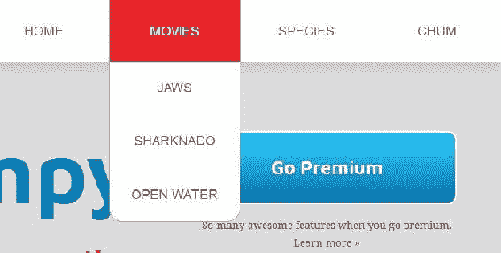
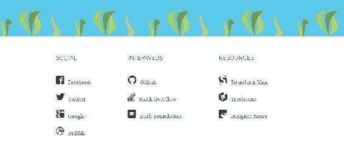

# 零、前言

HTML、CSS 和 JavaScript 是网络的三种核心语言。你对他们三个了解得越多，你就会过得越好。在这三种语言中，CSS 的作用是作为网络的表现语言。它描述了诸如页面的颜色、字体和布局等内容。

这本书有一些基本的先决条件。我希望你了解如何编写 HTML，并了解基本的 CSS，包括样式字体，添加边距，填充和背景颜色，以及其他事情，例如什么是十六进制颜色代码。在接下来的几章中，我将介绍一些基本概念，如盒子模型、显示属性和样式表类型。我还将涉及少量的 JavaScript 和 jQuery。你不需要任何关于这些的先验知识，但是你会在这本书里尝到它们的滋味。

现在，看一下我们将要建造的最终场地。为了学习 CSS，我们将完成以下 HTML5 网站的搭建，这都是关于鲨鱼的。我说*完成*建这个网站是因为基本的 HTML 和 CSS 已经会到位了，你可以从这本书的下载包里下载。我们将添加我将向您展示的所有内容，以及更多内容。这个网站以模块化和可重用的 CSS 为特色，当我们阅读这本书时，您将了解到这一点。在我们使用 flexbox 重写布局之前，该站点将首先用浮动来构建布局。我们在文本中使用网络字体:


导航有一个使用 CSS 动画的下拉菜单:



该网站还有一个带有 CSS 渐变的行动号召按钮:


该网站完全响应。当我们调整浏览器的大小时，您可以看到我们的两列布局变成了单列布局:


此外，我们的菜单变成了为移动设备设计的菜单:


如果我们向下滚动一点，我们可以看到我们有使用 CSS 过渡的幽灵按钮。它已经为 HiDPI 设备做好了准备，例如苹果的视网膜显示器:


网站上的大多数图像都使用了 SVG:


在页面的最底部，我们使用图标字体:



如你所见，你会在这本书里学到一些很酷的东西。为了最大限度地利用它，我建议您在我编写代码时跟着我。

# 这本书涵盖了什么

[第 1 章](01.html#K0RQ0-a72d261cc09f412988422c8a08f12cd5)、 *CSS 基础*，涵盖了掌握 CSS 所必需的基本概念。

[第二章](02.html#TI1E0-a72d261cc09f412988422c8a08f12cd5)*升温*，讲的是威震文字编辑器；CSS 重置，重置浏览器中的默认样式；和后代选择器。

[第 3 章](03.html#1LCVG0-a72d261cc09f412988422c8a08f12cd5)、*用浮动创建页面布局*，深入浮动。我们将介绍 float 的基本用法，然后用 float 创建布局，并了解由 float 引起的常见问题以及如何解决这些问题。

[第 4 章](04.html#24L8G0-a72d261cc09f412988422c8a08f12cd5)、*用模块化、可重用的 CSS 类和 CSS3* 创建按钮，涵盖模块化 CSS 和多个类，并使用 CSS3 为我们的按钮添加过渡、悬停状态、变换和渐变。

[第 5 章](05.html#318PC0-a72d261cc09f412988422c8a08f12cd5)、*创建主导航和下拉菜单*，解释我们的主导航的功能和呈现。

[第 6 章](06.html#3UQQQ0-a72d261cc09f412988422c8a08f12cd5)、*变得有响应*，涵盖了响应性网页设计的基础，并解释了如何实现它来将我们的静态网站转变为移动网站。

[第 7 章](07.html#4MLOS0-a72d261cc09f412988422c8a08f12cd5)、*网页字体*，讨论了`@font-face`规则的基本语法、字体服务、使用场景以及网页字体和图标字体的提供者。

[第 8 章](08.html#57R300-a72d261cc09f412988422c8a08f12cd5)、【HiDPI 设备的工作流程，涵盖了使用支持向量机为视网膜准备图像的技术以及类似`srcset`属性的技术。

[第 9 章](09.html#5TOVU0-a72d261cc09f412988422c8a08f12cd5)、 *Flexbox* 、*第 1 部分*介绍了 Flexbox 模块，涵盖了基本实现和属性。

[第 10 章](10.html#6IOCA0-a72d261cc09f412988422c8a08f12cd5)、 *Flexbox* 、*第 2 部分*对 Flexbox 进行了更深入的介绍，构建了新的产品列表和更高级的属性。

[第 11 章](11.html#7124O0-a72d261cc09f412988422c8a08f12cd5)、*总结*，总结了我们在本书中涉及到的 CSS 的概念，并提供了一些你可以探索的其他 CSS 特性的信息。

# 这本书你需要什么

在整本书中，我一直使用 Chrome 作为我的浏览器，因为它的 DevTools 等等，但是其他浏览器也有类似的工具。我们将使用开发工具直接在浏览器中探索代码。

我也一直在用 macOS。如果你是 Windows 用户，而我在书中的任何地方都提到了命令( *cmd* )键，你应该假装我指的是 *Ctrl* 键。除此之外，我不认为这是一个问题。

我使用了文本编辑器*升华文本 3* 。我应该说崇高不是唯一的好东西。还有像 Atom 和 Visual Studio Code 这样的程序，它们做了许多相同的事情。

即使这本书是关于掌握 CSS 的，但是如果没有 HTML，我们对 CSS 也无能为力。因此，我们将大量使用 HTML。目标是使用非常干净、语义化的 HTML 这就是我们想要达到的目标。

# 这本书是给谁的

这本书是为那些希望在他们的网页项目中掌握 CSS 最佳实践的网页设计师和开发人员准备的。您应该已经知道如何使用网页，并准备好使用 CSS 来掌握网站演示。

# 约定

在这本书里，你会发现许多区分不同种类信息的文本样式。以下是这些风格的一些例子和对它们的意义的解释。

文本中的码字、数据库表名、文件夹名、文件名、文件扩展名、路径名、虚拟网址、用户输入和推特句柄如下所示:“要更改文本大小，请使用`font-size`属性。”

代码块设置如下:

```html
h2 {
  font-size: 26px;
  font-style: italic;
  color: #eb2428;
  margin-bottom: 10px;
} 
```

当我们希望将您的注意力吸引到代码块的特定部分时，相关的行或项目以粗体显示:

```html
h2 {
 font-size: 26px;
 font-style: italic;
 color: #eb2428;
 margin-bottom: 10px;
} 
```

任何命令行输入或输出都编写如下:

```html
# cp /usr/src/asterisk-addons/configs/cdr_mysql.conf.sample/etc/asterisk/cdr_mysql.conf

```

新术语和重要词汇以粗体显示。您在屏幕上看到的单词，例如菜单或对话框中的单词，会出现在文本中，如下所示:“单击“下一步”按钮将您移动到下一个屏幕。”

Warnings or important notes appear in a box like this. Tips and tricks appear like this.

# 读者反馈

我们随时欢迎读者的反馈。让我们知道你对这本书的看法——你喜欢或不喜欢什么。读者反馈对我们来说很重要，因为它有助于我们开发出你真正能从中获益的标题。

要给我们发送一般反馈，只需发送电子邮件`feedback@packtpub.com`，并在您的邮件主题中提及书名。

如果你对某个主题有专业知识，并且对写作或投稿感兴趣，请参见我们位于[www.packtpub.com/authors](https://www.packtpub.com/books/info/packt/authors)的作者指南。

# 客户支持

现在，您已经自豪地拥有了一本书，我们有许多东西可以帮助您从购买中获得最大收益。

# 下载示例代码

您可以从您在[http://www.packtpub.com](http://www.packtpub.com)的账户下载您购买的所有 Packt Publishing 书籍的示例代码文件。如果您在其他地方购买了这本书，您可以访问[http://www.packtpub.com/support](http://www.packtpub.com/support)并注册将文件直接通过电子邮件发送给您。您可以按照以下步骤下载代码文件:

1.  使用您的电子邮件地址和密码登录或注册我们的网站。
2.  将鼠标指针悬停在顶部的“支持”选项卡上。
3.  点击代码下载和勘误表。
4.  在搜索框中输入图书的名称。
5.  选择要下载代码文件的书籍。
6.  从您购买这本书的下拉菜单中选择。
7.  点击代码下载。

下载文件后，请确保使用最新版本的解压缩文件夹:

*   视窗系统的 WinRAR / 7-Zip
*   zipeg/izp/un ARX for MAC
*   适用于 Linux 的 7-Zip / PeaZip

这本书的代码包也托管在 https://github.com/PacktPublishing/Mastering-CSS 的 GitHub 上。我们还有来自丰富的图书和视频目录的其他代码包，可在[https://github.com/PacktPublishing/](https://github.com/PacktPublishing/)获得。看看他们！

# 下载这本书的彩色图片

我们还为您提供了一个 PDF 文件，其中包含本书中使用的截图/图表的彩色图像。彩色图像将帮助您更好地理解输出中的变化。您可以从[https://www . packtpub . com/sites/default/files/downloads/masteringss _ color images . pdf](https://www.packtpub.com/sites/default/files/downloads/MasteringCSS_ColorImages.pdf)下载此文件。

# 正误表

尽管我们尽了最大努力来确保我们内容的准确性，但错误还是会发生。如果你在我们的某本书里发现了错误——可能是文本或代码中的错误——如果你能向我们报告，我们将不胜感激。通过这样做，你可以让其他读者免受挫折，并帮助我们改进这本书的后续版本。如果您发现任何勘误表，请访问[http://www.packtpub.com/submit-errata](http://www.packtpub.com/submit-errata)，选择您的书籍，点击勘误表提交表格链接，并输入您的勘误表的详细信息。一旦您的勘误表得到验证，您的提交将被接受，勘误表将上传到我们的网站或添加到该标题勘误表部分下的任何现有勘误表列表中。

要查看之前提交的勘误表，请前往[https://www.packtpub.com/books/content/support](https://www.packtpub.com/books/content/support)并在搜索栏中输入图书名称。所需信息将出现在勘误表部分。

# 海盗行为

在互联网上盗版受版权保护的材料是一个贯穿所有媒体的持续问题。在 Packt，我们非常重视版权和许可证的保护。如果您在互联网上遇到任何形式的我们作品的非法拷贝，请立即向我们提供位置地址或网站名称，以便我们寻求补救。

请通过`copyright@packtpub.com`联系我们，获取疑似盗版资料的链接。

我们感谢您在保护我们的作者方面的帮助，以及我们为您带来有价值内容的能力。

# 问题

如果您对本书的任何方面有问题，可以在`questions@packtpub.com`联系我们，我们将尽最大努力解决问题。