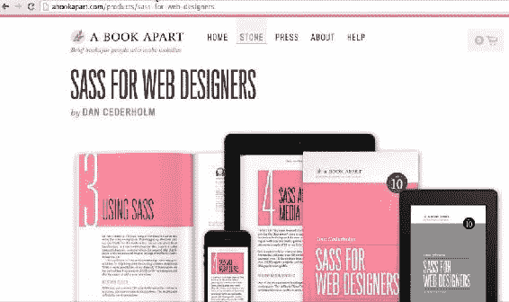
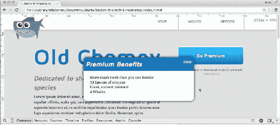
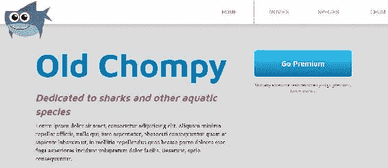
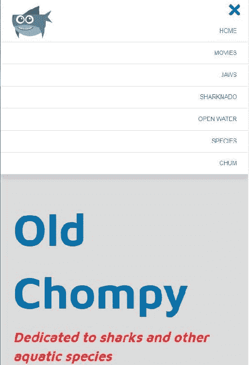

# 十一、总结

欢迎来到这本书的最后一章。在我们即将结束这段旅程的时候，我想向您介绍一下您的网络开发学习过程中的一些步骤，并浏览一些链接和资源，了解到目前为止您所学的所有内容的更多信息。

# 接下来的步骤

学习 CSS 的下一个逻辑进展是转到 CSS 预处理器，比如 Sass 或 Less。CSS 预处理程序允许您使用诸如嵌套、导入、变量和混合等编程特性编写 CSS，这些编程特性被编译成常规的 CSS。前端开发的另一个合乎逻辑的步骤是学习 JavaScript。首先，让我们谈谈 CSS 预处理器，萨斯。

# CSS 预处理程序

*Less* 和 *Sass* 我都用过，不过现在已经用了一段时间了。当我开始为这本书编写课程材料时，我几乎已经忘记了没有萨斯的 CSS 是什么样的。不用说，使用 Sass 编写 CSS 要容易得多。它使您的代码更加有条理和干净，我强烈推荐它。让我们回顾一下萨斯的一些显著特征。

# 变量

Sass 的一个简单而强大的特性是变量。让我们设置名为`$blue`和`$red`的变量，它们分别等于我在整个网站中使用的颜色，基本上是你看到的任何蓝色或红色:

```html
//colors
$blue: #0072AE;
$red: #EB2428;
```

现在当我需要输入`#0072AE`的难以记忆的十六进制值时，我只需输入`$blue`，萨斯就会神奇地处理它。变量的一个同样好的用途是它们和字体，这就是我认为它真正变得强大的地方。有了字体，你通常可以输入一个`font-family`，然后创建一堆字体。但是，这会变得冗长和重复。因此，将所有这些信息插入到一个变量中，一个非常简单的变量，如`$maven`或`$droid`，可以让您在任何需要的时候快速方便地使用字体:

```html
//fonts
$serif: 'Times New Roman', Georgia, serif;
$sans: Arial, Helvetica, sans-serif;
$maven: 'Maven Pro', $sans;
$droid: 'Droid Serif', $serif;
```

然后我可以在任何我设置`font-family`的地方使用这些变量:

```html
h1, h2 {
  font-family: $maven;
}
p {
  font-family: $droid;
}
```

这将被编译成整个字符串:

```html
h1, h2 {
  font-family: 'Maven Pro', Arial, Helvetica, sans-serif;;
}
p {
  font-family: 'Droid Serif', 'Times New Roman', Georgia, serif;
}
```

# 混入类

萨斯有一个更好的特性叫做**融合**。基本上，它们是一种提炼重复的方法。例如，为 CSS3 输入厂商前缀是一件很麻烦的事情，但是我可以使用`@mixin`关键字声明一个 mixin，然后创建一个充满厂商前缀的模板。在这里，我声明了一个名为`transition`的 mixin:

```html
@mixin transition($property: all, $duration: .25s, $timing-function: ease) {
    -webkit-transition: $property $duration $timing-function;
    transition: $property $duration $timing-function;
}
```

mixin 有一个括号，里面有参数，`$property`、`$duration`和`$timing-function`。每个参数都有一个默认值，`all`、`.25s`和`ease`。然后我有了前缀为-webkit 的转换属性和不带前缀的 verison。两者都以 mixin 的参数作为它们的值。

这允许我进入我的 CSS，如果我想使用过渡，只需添加`@include transition`:

```html
.button {
    @include transition();
}
```

This compiles down to:

```html
.button {
  -webkit-transition: all .25s ease;
  transition: all .25s ease;
}
```

我可以做的另一件事是随时更新这个 mixin 的默认值:

```html
.button {
    @include transition(background-color, .5s, ease-in-out);
}
```

这将编译为:

```html
.button {
  -webkit-transition: background-color .5s ease-in-out;
  transition: background-color .5s ease-in-out;
}
```

# SASS 嵌套

除了变量和混合，还有嵌套，表面上看起来不太强大，但非常方便。您可以将选择器嵌套在彼此内部，而不是编写后代选择器。您可以在下面的 CSS 代码中看到，我实际上已经将`focus`和`hover`选择器嵌套在`.button`中:

```html
.button {
  &:focus,
  &:hover {
    background-color: #333;
    color: #fff;
    transform: scale(1, 1) translate(0, -5px);
  }
}
```

这会编译成以下内容:

```html
.button:focus, 
.button:hover {
  background-color: #333;
  color: #fff;
  transform: scale(1, 1) translate(0, -5px);
}
```

根据经验，如果没有必要，就不要嵌套，因为每次嵌套时选择器会变得更具体、更重。模块化 CSS 的诀窍是保持选择器的轻量级。有关嵌套和在 Sass 中使用特殊&符号字符的更多信息，请查看我为 CSS-Tricks.com 写的文章，标题为*Sass &符号*([https://css-tricks.com/the-sass-ampersand/](https://css-tricks.com/the-sass-ampersand/))。

# 使用 SASS 创建和导入部分文件

在[第 7 章](07.html#4MLOS0-a72d261cc09f412988422c8a08f12cd5)、*网页字体、*的*字体套件和字体服务*部分，我们还讨论了 Sass 允许您为 CSS 的不同部分创建部分文件，并将它们导入到您的主 Sass 文件中:

```html
//Imports
@import '_variables.scss';
@import '_mixins.scss';
@import '_icons.scss';
@import '_reset.scss';
@import '_modular.scss';
@import '_modal.scss';
```

Sass 将把所有部分 Sass 文件编译成一个主 CSS 文件。所以我把我的 CSS 分解成更小的块。它们都被编译成`style.css`。

拥有这些多个组织好的文件的最大好处是它们可以编译成一个文件，所以这意味着只有一个 HTTP 请求，而不是多个请求。这就是性能的提升。更不用说它让我的 CSS 非常有条理。

所以这些只是预处理器的一些非常好的特性，特别是 Sass。在这一点上，使用 Sass 或更少绝对是最符合逻辑的步骤。您编写的 Sass 样式表将需要通过编译器将其转换为常规的旧 CSS 否则，浏览器将无法理解 Sass 代码。对于编译，您有几个选项。您可以安装 Ruby 和 Sass，并使用命令行来监视对 Sass 文件所做的任何更改。你也可以检查像 CodeKit 这样的软件来做同样的事情。或者你也可以使用任务管理器，比如我们在上一节结束时讨论过的“大口”。

要了解更多关于 SASS 的知识，我推荐 Packt 图书馆的 *Brock Nunn 的快速 SASS* 视频课程:


此外，查看由*丹·塞德尔霍尔姆*为网页设计师设计的*SASS*。这本书在用简单的术语解释 Sass 方面做得非常好，而且读起来很快:



# JavaScript 和 jQuery

对于前端开发人员来说，另一个合乎逻辑的步骤是学习 JavaScript，如果你还没有这样做的话。有了 CSS，我们可以通过`hover`和`focus`状态增加交互性，但是我们不能有点击或滑动功能或类似的东西。输入 JavaScript 和 jQuery。我建议你学习 JavaScript 的基础知识；然而，如果你想在其中获得一个跳板，你可以从学习 jQuery 开始。

假设我们想在点击了解更多>>链接时显示一个模态:


我们可以有一个模型显示:



所以我们有一个会淡入淡出的动画。因此，用 jQuery 设置动画相对比用 JavaScript 更容易。这个想法是在 HTML 和 CSS 中创建一个模态，就好像它一直存在一样。我创建了模态，并把它放在 HTML 文件的最底部:

```html
<div class="modal modal-learn-more">
    <span class="close-modal">close</span>
    <h2>Premium Benefits</h2>
    <ul>
        <li>More shark teeth than you can handle</li>
        <li>13 Species of octopus</li>
        <li>Giant, ancient lobsters!</li>
        <li>4 Whales</li>
    </ul>
</div>
```

然后我有一个名为`modal.scss`的 Sass 部分文件，它对模态进行样式化，并将其定位在它应该在的位置:

```html

//learn more modal
.modal {
  display: none;
  width: 40%;
  margin: 0 auto;
  position: absolute;
  top: 200px;
  left: 50%;
  @include translateX(-50%);
  background: #fff;
  @include box-shadow;
  @include border-radius;
  overflow: hidden;
  .close-modal {
    position: absolute;
    right: 10px;
    top: 10px;
    color: #fff;
    cursor: pointer;
    text-decoration: underline;
  }
  h2 {
    background: $blue;
    color: #fff;
    padding: 10px;
  }
  ul {
    padding: 10px 30px 30px 30px;
  }
}
```

`.modal`类也设置为`display: none`，所以默认不存在。就像我们的下拉菜单；默认情况下，它是隐藏的。

这里我们有一些 jQuery 来打开模态:

```html
//open modal//
$(".learn-more").on("click", function(event){
    event.preventDefault();
    $(".modal-learn-more").fadeIn();
});
```

这基本上是观察点击等级为`learn-more`的链接，然后淡入等级为`modal-learn-more`的元素。如果我们回到 HTML，我们会看到在模态的最外层父级`div`上有`modal-learn-more`类:

```html
<div class="modal modal-learn-more">
    <span class="close-modal">close</span>
    <h2>Premium Benefits</h2>
    <ul>
        <li>More shark teeth than you can handle</li>
        <li>13 Species of octopus</li>
        <li>Giant, ancient lobsters!</li>
        <li>4 Whales</li>
    </ul>
</div>
```

这是可读的，也是非常少量的 jQuery。如果我们想告诉模态，当我们点击关闭链接时，我们想关闭它，同样的事情也会发生:

```html
//close modal//
$(".close-modal").on("click", function(event){
    event.preventDefault();
    $(".modal-learn-more").fadeOut();
});
```

我们基本上是说当你点击关闭模式时，我们会有`modal-learn-more`淡出。jQuery 通过他们创建的预定义方法来处理淡入淡出的动画。在 jQuery 中选择我们想要淡出的`div`并选择我们想要点击的项目或元素是非常容易的。要了解更多关于 jQuery 的知识，我推荐去 Packt 图书馆查阅 jQuery 书籍，尤其是*jQuery for designer:初学者指南*。

Sass 和 jQuery 是下一个合乎逻辑的前进步骤。Sass 使 CSS 创作更上一层楼，jQuery 将为您的网站增加功能和更深入的交互。更不用说它会让你成为前端开发人员。在下一节中，我将总结我们讨论的所有内容，并指出一些您可以用来获取更多信息的好资源。

# 结论和联系

感谢您阅读*掌握 CSS* 。我真的很喜欢把这本书放在一起。我们讨论了很多内容，所以我将回顾一下我们所学的内容，并向您指出您可以从哪里获得更多主题信息。

# 盒子模型和块与内嵌元素

我们从回顾基础知识开始这本书，比如盒子模型，以及块和内嵌元素之间的区别。了解这两个重要的基本主题的一个好地方是网站点的 A 到 Z CSS 屏幕广播。对于块与内联元素:[https://www.sitepoint.com/atoz-css-screencast-display/](https://www.sitepoint.com/atoz-css-screencast-display/)和盒模型[https://www.sitepoint.com/atoz-css-screencast-box-model/](https://www.sitepoint.com/atoz-css-screencast-box-model/)。在这里你可以看到一些真正有用的盒子模型和展示视频。

# 漂浮物

我们还讨论了很多关于浮动以及如何使用它们来创建多列布局的内容，就像我们在主页上所做的那样:



我们讨论了浮动带来的问题，例如崩溃，以及浮动周围流动的其他内容。我们还讨论了不同的方法，例如使用`clear-fix`，来避免这些问题。要了解更多关于 float 的知识，我将带您回到 Sitepoint 的 A 到 Z CSS，以及简短的六分钟视频([https://www . Sitepoint . com/atoz-CSS-screencast-float-and-clear/](https://www.sitepoint.com/atoz-css-screencast-float-and-clear/))，其中涵盖了 float 的基础知识以及如何习惯它们的怪癖。

# 模块化 CSS

接下来，您学习了如何创建模块化 CSS。我们不想设计我们网站的一部分，然后如果我们想设计我们网站的另一个类似部分，就重新设计所有这些风格。我们希望能够重用我们已经通过使用模块化技术创建的 CSS。当我们使用模块化类构建按钮时，我强调了这一点。要了解更多关于模块化 CSS 的知识，您可以点击**SMACSS**(**CSS 的可扩展模块化架构**)；参考[smacss.com](http://smacss.com)网站。

# CSS3

在这一点上，我们的按钮使用了大量的 CSS3。我们在整个网站中使用了很多悬停效果。在电影页面上，我们为其中一个电影图像添加了悬停效果。如果你想了解更多关于 CSS3 的知识，在 Packt 图书馆有一本很棒的书叫做*用 CSS3* 设计下一代网络项目，作者是*桑德罗·帕加诺蒂*。

此外，您可能想查看由*丹·塞德尔霍尔姆*制作的【网页设计师】CSS3】、*第二版*，可通过[abookapart.com](http://abookapart.com)获得。

# 创建导航

我们继续构建了一个导航，它位于顶部的固定位置，我们的内容在它下面滚动。它有一个很好的下拉菜单，可以使用 CSS 动画很好地向下移动:


我们还在浏览器刷新时制作了鲨鱼动画；我们让它看起来像在游泳，这很有趣。我为自己在 CSS 动画上写的一篇文章感到骄傲:[http://www.richfinelli.com/css-animations-arent-that-tough/](http://www.richfinelli.com/css-animations-arent-that-tough/)。在本文中，我详细介绍了所有动画属性，并慢慢创建了一个相当复杂的动画:


我发现自己经常参考 **Mozilla 开发者网络** ( **MDN** )网站来快速参考动画属性。我认为，对于万物网络来说，MDN 是一个非常可靠和深入的资源:


# 使网站具有响应性

我们在使我们的网站响应速度方面做得很好，尤其是当我们将菜单完全转变为一个小屏幕来容纳移动设备时:



在我看来，更多地了解响应式网页设计的最好地方是从发明它的人身上——伊桑·马科特。查看开创这一切的开创性书籍-*响应性网页设计。*该书第二版于 2014 年底发布。

# 网络资源

在[第七章](07.html#4MLOS0-a72d261cc09f412988422c8a08f12cd5)*网页字体*中，我们谈到了网页字体和图标字体。我们了解了一个好的字体如何让一个网站看起来很棒。回到[abookapart.com](https://abookapart.com/)网站，有一本非常好的书，你可以用来学习如何设置和配对类型相位。杰森·圣玛丽亚把它叫做网络排版。

# HiDPI 设备

最后，在[第 8 章](08.html#57R300-a72d261cc09f412988422c8a08f12cd5)*HiDPI 设备的工作流程*中，我们通过学习我们需要对图像做什么来让我们的网站“视网膜准备好”，以便使它们在像 iPad Retina 这样的双密度显示器上看起来更清晰。我们研究了许多解释视网膜的方法。在 web 开发中，我最兴奋的事情之一就是 SVG。它确实解决了视网膜的一些突出问题。CSS 技巧([https://css-tricks.com](https://css-tricks.com/))的 Chris Coyier 写了几篇很棒的文章，总结了 SVG 以及如何使用它，其中有一篇题为——使用 SVG。

同样为了获得更多关于`srcset`属性的信息，我写了两篇关于这个主题的文章。一个在 W 描述符和`sizes`属性上([http://www.richfinelli.com/srcset-part-2/](http://www.richfinelli.com/srcset-part-2/))，另一个在 X 描述符上([http://www.richfinelli.com/srcset-part-1/](http://www.richfinelli.com/srcset-part-1/))。

# flex box(flex box)的缩写形式

Flexbox 太好玩了！我们将基于 3 列浮点的布局转换为基于 flexbox 的布局，并使用 flexbox 构建了一个新的部分，即我们的产品列表。要了解更多关于 flexbox 的信息，我建议查看韦斯·博斯的视频课程，*什么是 Flexbox！在* flexbox.io 或快速全面地参考所有 flexbox 属性，请查看位于[https://css-tricks.com/snippets/css/a-guide-to-flexbox/](https://css-tricks.com/snippets/css/a-guide-to-flexbox/)的 *CSS 技巧《flexbox 完整指南】*。

# 最后一点建议:音频播客非常棒

如果你像我一样，有强烈的学习欲望和长时间的工作，音频播客可以成为一个很好的资源。我最喜欢的两个关于前端开发的播客是 shopitalk([http://shoptalkshow.com/](http://shoptalkshow.com/))和语法([https://syntax.fm/](https://syntax.fm/))。两者都非常有趣，信息丰富。在上班的路上听播客是我了解网络开发最新动态和新知识的一种方式。

# 摘要

最后，我认为我们在这里创建了一个小网站，学习了很多关于 CSS 和网络开发的知识。再次感谢阅读。我真的很开心把它拼在一起。祝你成功，希望你继续磨练你的 CSS 技能。