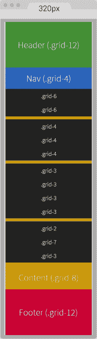

# 四、用于 RWD 的 CSS 网格、CSS 框架、UI 工具包和 Flexbox

**响应性网页设计**（**RWD**为每个人构建响应性网站和应用引入了一个新的工作层。当我们必须在不同的设备和不同的维度上测试我们的工作时，无论内容在哪里中断，我们都需要添加一个断点并再次测试。

这可能会发生很多次。因此，建立一个网站或应用将需要比过去更长的时间。

作为网页设计师和开发者，为了让事情变得更有趣，我们需要注意内容是如何在不同维度上布局的，网格如何帮助我们将内容组织到不同的布局。

既然我们已经提到了网格，您是否曾经问过自己，“我们使用网格到底是为了什么？”

借用设计行业的一些术语来回答这个问题，我们使用网格来让内容有节奏、比例和平衡。我们的目标是让那些使用我们的网站/应用的人对我们的内容有一个更愉快的体验，因为它更容易扫描（节奏），更容易阅读（比例）和组织（平衡）。

为了加快设计和构建过程，同时保持所有内容在不同维度上的正确格式，许多作者和公司创建了 CSS 框架和 CSS 网格，这些框架和 CSS 网格不仅包含网格，而且还包含许多其他功能和样式，这些功能和样式可以通过使用简单的类名来利用。

随着时间的推移，浏览器开始支持越来越多的 CSS3 属性，例如 Flexbox，使用布局将变得更加容易。这将使得 CSS 框架内的网格几乎不必要。

让我们看看 CSS 网格、CSS 框架、UI 工具包和 Flexbox 都是关于什么的，以及它们如何帮助我们使用 RWD。

在本章中，我们将介绍以下主题：

*   什么是网格？
*   CSS 网格
*   用于 RWD 的 CSS 网格的优缺点
*   CSS 框架
*   用户界面套件
*   用于 RWD 的 CSS 框架的优缺点
*   创建自定义 CSS 网格
*   使用自定义 CSS 网格构建示例页面
*   使用 Flexbox
*   使用 Flexbox 构建示例页面

# 什么是网格？

网格是一组视觉指南（垂直、水平或两者兼有，因此术语*网格*，有助于定义元素的放置位置。一旦元素被放置好，我们就会得到一个*布局*。

使用网格的好处是放置在网格上的元素将沿着页面和谐流动，在易读性、布局一致性和元素之间的良好比例方面增强用户体验。

# CSS 网格

CSS 网格基本上是组成列的垂直指南的复合。这些列的属性在 CSS 文件中定义。此文件包含具有特定宽度的类列表，这些类的宽度与为特定网格生成的列数相匹配。

我们在[第三章](3.html "Chapter 3. Mobile-first or Desktop-first?")中已经看到过这一点，*是先移动还是先桌面？*当我们使用**980 网格系统****980GS**对一个固定宽度的旧场地进行改造时。这是 SCSS 文件：

```html
*, *:before, *:after {
    box-sizing: border-box;
}

//Container
.container-12 {
     width: 980px;
     padding: 0 10px;
     margin: auto;
}
//Grid >> Global
.grid {
    &-1, &-2, &-3, &-4, &-5, &-6, &-7, &-8, &-9, &-10, &-11, &-12 {
        float: left;
        margin: 0 10px;
    }
}
//Grid >> 12 Columns
.container-12 {
    .grid-1  { width: 60px; }
    .grid-2  { width: 140px; }
    .grid-3  { width: 220px; }
    .grid-4  { width: 300px; }
    .grid-5  { width: 380px; }
    .grid-6  { width: 460px; }
    .grid-7  { width: 540px; }
    .grid-8  { width: 620px; }
    .grid-9  { width: 700px; }
    .grid-10 { width: 780px; }
    .grid-11 { width: 860px; }
    .grid-12 { width: 940px; }
}
//Clear Floated Elements - http://davidwalsh.name/css-clear-fix
.clear, .row {
    &:before,
    &:after { content: ''; display: table; }
    &:after { clear: both; }
}
//Use rows to nest containers
.row { margin-bottom: 10px;
    &:last-of-type { margin-bottom: 0; }
}
//Legacy IE
.clear { zoom: 1; }
```

### 提示

请记住我们将 960GS 转换为 980GS，因为内容物看起来太靠近主容器的边缘，主容器的左右两侧只有 10px 的水槽。因此，我们在每侧增加 10px，使主容器宽 980px。

因为我们掌握了 HTML5 和 CSS3 的 RWD，让我们看看同样的 980GS，用百分比使其流畅。

RWD 魔术公式为*（目标÷背景）x100=结果%*。

我们在这个案例中的上下文是 980px，如下所示：

```html
//Container
.container-12 {
    width: 100%;
    max-width: 980px;
    padding: 0 1.02%;
    margin: auto;
}
//Grid >> Global
.grid {
    &-1, &-2, &-3, &-4, &-5, &-6, &-7, &-8, &-9, &-10, &-11, &-12 {
        float: left;
        margin: 0 1.02%;
    }
}
//Grid >> 12 Columns
.container-12 {
    .grid-1  { width: 6.12%; }
    .grid-2  { width: 14.29%; }
    .grid-3  { width: 22.45%; }
    .grid-4  { width: 30.61%; }
    .grid-5  { width: 38.78%; }
    .grid-6  { width: 46.94%; }
    .grid-7  { width: 55.10%; }
    .grid-8  { width: 63.27%; }
    .grid-9  { width: 71.43%; }
    .grid-10 { width: 79.59%; }
    .grid-11 { width: 87.76%; }
    .grid-12 { width: 95.92%; }
}
//Clear Floated Elements - http://davidwalsh.name/css-clear-fix
.clear, .row {
  &:before,
  &:after { content: ''; display: table; }
  &:after { clear: both; }
}
//Use rows to nest containers
.row { margin-bottom: 10px;
  &:last-of-type { margin-bottom: 0; }
}
//Legacy IE
.clear { zoom: 1; }
```

在网页设计中，网格通常由 12 或 16 列组成。960GS 几乎是最著名的，尽管它一直是一个固定宽度的网格。但其他作者已经将其移植到流体中，例如*流体 960 网格系统*，但没有响应性。960GS 也有 24 列的选项，但不像 12 列版本那样受欢迎。

有其他用于网页设计的网格没有定义的框架宽度或列数，相反，这些网格可以有无限多的列，例如基于**自适应网页设计**（**AWD**的*无框架网格*。这意味着主容器*的宽度将*捕捉到一个特定的断点，该断点由适合它的列数计算得出。

## RWD CSS 网格的利弊

列出用于 RWD 的 CSS 网格的优缺点背后的想法是，当我们计划使用某种类型的网格时，我们应该能够做出最明智的决定。它有助于澄清客户的期望和我们的期望，因为使用特定的网格将影响时间线、设计、布局和许多用户体验因素。

优点如下：

*   布置图元要容易得多，因为柱可以作为放置的指南。
*   如果使用预先构建的 CSS 网格，则无需进行任何数学运算来处理列和边沟宽度。它已经被网格的作者处理好了。
*   我们可以更快地构建，因为我们所需要做的就是将特定的类添加到 HTML 中的容器中，在大多数情况下，布局会立即发生。
*   在 web 设计中理解网格是相对简单的，因此在已经构建的项目中增强/编辑其他人的标记和代码比他们根本没有使用 CSS 网格要轻松。
*   如果网格是响应的或自适应的，我们就不必太担心断点。
*   如果我们使用的是第三方 CSS 网格，那么任何跨浏览器的问题都已经得到解决。

缺点如下：

*   一些 CSS 网格的学习曲线比其他网格更陡峭。
*   对于许多 CSS 网格，我们被限制使用作者创建的名称约定。
*   我们可能不得不改变/调整编写 HTML 的方式。
*   有太多的 CSS 网格可供选择，这对某些人来说可能是压倒性的。
*   如果我们的内容在网格不支持的某些点中断，我们必须花时间修改原始网格以适应每种情况。

# CSS 框架

CSS 框架是一组预先构建的功能，基本上有助于加快 Web 前端开发。这些 CSS 框架的作者已经处理了许多小而重要的细节，因此决定使用它们的人可以专注于手头的任务，同时将许多决策留给 CSS 框架自己。

许多开发人员和设计师相信（我也这么认为），任何 CSS 框架的真正价值都是他们的 CSS 网格，有时我们会竭尽全力提取 CSS 网格并定制它以满足我们的需要。

在本书中，我们将重点介绍掌握 RWD 的 CSS 网格，而不是从 CSS 框架或 UI 工具包（如果碰巧提供的话）中剥离一个。我们很快就会谈到这个问题。

下面的列表描述了 CSS 框架的一些特性和特征：

*   CSS 框架只关注基于 web 的开发，而不是本地移动应用。
*   CSS 框架总是提供 CSS 网格。
*   它们中的许多还提供用户界面组件（就像 UI 工具包），例如，以 HTML 和 CSS 的形式提供滑块、分页、导航栏、排版、按钮等。
*   CSS 框架和面向 web 的 UI 工具包都可以称为*前端框架*。

# 用户界面套件

与 CSS 框架类似，还有另一种类型的前端框架称为 UI 工具包。然而，UI 工具包可以是它们自己的一个品种。

说实话，有时候区分 CSS 框架和 UI 工具包是很困难的。但是，不要过多地钻研哪一个是哪一个，重要的是要理解我们为什么首先使用它们，以及它们如何帮助我们构建更好、更快响应的网站和应用。

以下列表介绍了 UI 工具包的一些功能和特征：

*   基本上有两种类型的 UI 工具包：一种是使用 web 技术（HTML 和 CSS）构建的，可用于基于 web 的应用原型；另一种是由（通常）Photoshop（PSD）文件构成的，用于帮助模拟和设计本机移动应用。
*   很少有面向 web 的 UI 工具包提供某种网格。
*   UI 工具包的重点是提供用户界面组件，如滑块、分页、导航栏、对话框、覆盖图/模型、按钮、排版、工具提示、列表、手风琴、选项卡系统、旋转木马/幻灯片、表单等。
*   在面向 web 的 UI 工具包中，体系结构是非常模块化的。这意味着每个组件都可以合并到任何 CSS 框架中。

# RWD CSS 框架的利弊

以 RWD 作为我们在布局与屏幕房地产方面做出的任何决定的主要驱动力，让我们来看看 CSS 框架的好的和不好的东西是什么：

的优点如下：

*   它们对于快速构建响应性原型非常有用，而不是显示静态线框。
*   跨浏览器问题已经得到解决。
*   它们以一种很好的方式迫使您创建基于网格的布局。
*   它们提供了一个坚实的起点，可以在此基础上进行构建。
*   模块化允许您手工挑选所需的组件。例如，您可以只使用 CSS 网格模块，也可以使用`forms`模块。
*   更改样式以适合您的设计相对容易。
*   如果你不太擅长 CSS，你仍然可以使用 CSS 框架来实现你自己的设计。

缺点如下：

*   他们可以用你永远不会使用的 CSS 来填充你的项目。
*   如果您决定使用整个 CSS 框架，那么它们的占用空间很大。
*   您可能需要改变您的习惯和编写 HTML 和 CSS 的方式，以适应您正在使用的 CSS 框架。
*   它们可能是固执己见的，因此，如果您不喜欢事物的命名方式，那么您几乎没有定制的选择。
*   定制 CSS 框架是可行的，但它可能非常耗时和危险。将一个名称更改为其他名称，几乎没有办法知道对框架的其他部分会产生什么影响。
*   如果默认样式没有改变以适合您的品牌/设计，那么您的网站或应用将不会是独一无二的，并且会看起来像其他人的，在用户面前失去可信度。
*   如果您需要构建一些简单的东西，那么使用 CSS 框架就太过分了。
*   每个网站/应用或项目都是不同的，因此您可能会花费大量时间更改和覆盖每个项目的属性。
*   他们试图解决每一个前端问题。

现在我们已经看到了 CSS 网格、CSS 框架和 UI 工具包的优缺点，是时候做出决定并回答这个问题了：哪种方法最适合 RWD？

我承认，答案并不是最鼓舞人心的，但这是事实：这要看情况而定。

如果我们是自由职业者，自己做任何事情，或者在一个非常小的团队中工作，那么可能根本不需要使用任何框架。我们可以根据构建主要框架的相同原则定制一些东西。显然，我们希望自动化任何重复的过程，以便有效地利用我们的时间。

但是如果我们在一个大型团队中工作，一个拥有内部和离岸资源的网络专业人士的大熔炉，也许使用一个框架会有所帮助。这是因为每个人都需要遵守框架的结构，以便所有事情都是一致的。

# 创建自定义 CSS 网格

既然我们掌握了 RWD，我们就有机会创建自己的 CSS 网格。然而，我们需要聪明地工作，而不是努力。因此，我们要做的是利用*可变网格系统*应用，并将其结果与我们自己的方法相结合，制作一个移动优先、流畅、定制且坚固的 CSS 网格，从中我们可以创建健壮的响应性设计。

让我们列出我们的 CSS 网格需求：

*   它应该有 12 列。
*   它的宽度应为 1200px，以容纳 1280px 的屏幕。
*   它应该是流体，具有柱和排水沟的相对单位（百分比）。
*   它应该使用移动优先的方法。
*   它应该使用 SCSS 语法。
*   它应该可用于其他项目。
*   它应该是易于使用和理解的。
*   它应该易于扩展。

以下是我们 1200 像素宽、12 列宽的 20px 网格的外观：


黑色的左右填充各为 10px。在这个过程结束时，我们将把这些 10px 转换成百分比。

## 做数学题

我们将使用 RWD 魔法公式：*（目标÷背景）x100=结果%*。

我们的上下文将是 1200px。那么让我们转换一列：*80÷1200 x 100=6.67%*。

对于两列，我们必须考虑排水沟，即 20px。换句话说，我们不能说两列的值正好是 160px。这并不完全正确。

两列是：【t0【80px+20px+80px=180px【t1【。

现在让我们转换两列：*180÷1200 x 100=15%*。

对于三根柱子，我们现在必须考虑两个排水沟：*80px+20px+80px+20px+80px=280px*。

现在让我们转换三列：*280÷1200 x 100=23.33%*。

你现在能看到图案了吗？每次我们添加一列时，我们所需要做的就是向值中添加 100。这个值也解释了排水沟！

检查我们刚才看到的网格的屏幕截图，可以看到列的值增加了 100。

因此，所有方程式如下所示：

```html
1   column:    80 ÷ 1200 x 100 = 6.67%
2   columns:  180 ÷ 1200 x 100 = 15%
3   columns:  280 ÷ 1200 x 100 = 23.33%
4   columns:  380 ÷ 1200 x 100 = 31.67%
5   columns:  480 ÷ 1200 x 100 = 40%
6   columns:  580 ÷ 1200 x 100 = 48.33%
7   columns:  680 ÷ 1200 x 100 = 56.67%
8   columns:  780 ÷ 1200 x 100 = 65%
9   columns:  880 ÷ 1200 x 100 = 73.33%
10  columns:  980 ÷ 1200 x 100 = 81.67%
11  columns: 1080 ÷ 1200 x 100 = 90%
12  columns: 1180 ÷ 1200 x 100 = 98.33%

```

让我们为 12 柱网格创建 SCS：

```html
//Grid 12 Columns
.grid {
    &-1  { width:6.67%; }
    &-2  { width:15%; }
    &-3  { width:23.33%; }
    &-4  { width:31.67%; }
    &-5  { width:40%; }
    &-6  { width:48.33%; }
    &-7  { width:56.67%; }
    &-8  { width:65%; }
    &-9  { width:73.33%; }
    &-10 { width:81.67%; }
    &-11 { width:90%; }
    &-12 { width:98.33%; }
}
```

### 提示

在编辑代码时，使用连字符（`-`分隔单词可以更容易地选择术语。

## 增加 UTF-8 字符集指令和信用部分

不要忘记在文件顶部包含 UTF-8 编码指令，以让浏览器知道我们正在使用的字符集。让我们通过在顶部添加一个 Credits 部分来美化代码。代码如下：

```html
@charset "UTF-8";

/*
 Custom Fluid & Responsive Grid System
 Structure: Mobile-first (min-width)
 Syntax: SCSS
 Grid: Float-based
 Created by: Your Name
 Date: MM/DD/YY
*/

//Grid 12 Columns
.grid {
    &-1  { width:6.67%; }
    &-2  { width:15%; }
    &-3  { width:23.33%; }
    &-4  { width:31.67%; }
    &-5  { width:40%; }
    &-6  { width:48.33%; }
    &-7  { width:56.67%; }
    &-8  { width:65%; }
    &-9  { width:73.33%; }
    &-10 { width:81.67%; }
    &-11 { width:90%; }
    &-12 { width:98.33%; }
}
```

### 提示

注意信用以 CSS 风格的注释进行注释：`/* */`。根据我们编译 SCSS 文件的方式，这些类型的注释不会被剥离。通过这种方式，信用卡始终可见，以便其他人知道文件的作者。这可能适用于团队，也可能不适用于团队。此外，如果有，显示信用对文件大小的影响是不可察觉的。

## 包括箱体上浆性能和移动式首次混入

包括`box-sizing`属性允许浏览器的盒子模型考虑容器内的填充；这意味着填充被减而不是加，从而保持定义的宽度。

由于我们的定制 CSS 网格的结构将首先是移动的，因此我们需要包括将处理此方面的 mixin：

```html
@charset "UTF-8";

/*
    Custom Fluid & Responsive Grid System
    Structure: Mobile-first (min-width)
    Syntax: SCSS
    Grid: Float-based
    Created by: Your Name
    Date: MM/DD/YY
*/

*, *:before, *:after {
 box-sizing: border-box;
}

//Moble-first Media Queries Mixin
@mixin forLargeScreens($width) {
 @media (min-width: $width/16+em) { @content }
}

//Grid 12 Columns
.grid {
    &-1  { width:6.67%; }
    &-2  { width:15%; }
    &-3  { width:23.33%; }
    &-4  { width:31.67%; }
    &-5  { width:40%; }
    &-6  { width:48.33%; }
    &-7  { width:56.67%; }
    &-8  { width:65%; }
    &-9  { width:73.33%; }
    &-10 { width:81.67%; }
    &-11 { width:90%; }
    &-12 { width:98.33%; }
}
```

## 主容器并将 10px 转换为百分比值

由于我们使用的是移动优先的方法，我们的主容器默认为 100%宽；但我们也会给它一个最大宽度 1200px，因为需要创建一个这样大小的网格。

我们还将把 10px 转换成一个百分比值，因此使用 RWD 神奇公式：*10÷1200 x 100=0.83%*。

但是，正如我们之前所看到的，10px（在本例中为 0.83%）不够填充，使内容看起来太靠近主容器的边缘。所以我们要将填充增加到 20px:*20÷1200 x 100=1.67%*。

我们还将与`margin: auto;`水平居中放置主容器。

### 提示

无需将顶部和底部边距的零值声明为水平居中。换句话说，`margin: 0 auto;`是不必要的。仅仅宣布`margin: auto;`就足够了。

现在让我们将这些值包括在内：

```html
@charset "UTF-8";

/*
    Custom Fluid & Responsive Grid System
    Structure: Mobile-first (min-width)
    Syntax: SCSS
    Grid: Float-based
    Created by: Your Name
    Date: MM/DD/YY
*/

*, *:before, *:after {
 box-sizing: border-box;
}

//Moble-first Media Queries Mixin
@mixin forLargeScreens($width) {
 @media (min-width: $width/16+em) { @content }
}

//Main Container
.container-12 {
 width: 100%;
 //Change this value to ANYTHING you want, no need to edit anything else.
 max-width: 1200px;
 padding: 0 1.67%;
 margin: auto;
}

//Grid 12 Columns
.grid {
    &-1  { width:6.67%; }
    &-2  { width:15%; }
    &-3  { width:23.33%; }
    &-4  { width:31.67%; }
    &-5  { width:40%; }
    &-6  { width:48.33%; }
    &-7  { width:56.67%; }
    &-8  { width:65%; }
    &-9  { width:73.33%; }
    &-10 { width:81.67%; }
    &-11 { width:90%; }
    &-12 { width:98.33%; }
}
```

### 提示

在的`padding`属性中，如果我们输入`0.83%`或`.83%`是相同的。我们可以省略零。保持代码尽可能精简始终是一个好的实践。这与我们使用十六进制速记值时的原理相同：`#3336699`与`#369`相同。

## 先让它移动

在小的屏幕上，所有的列都将是 100%宽的。因为我们使用的是单列布局，所以不使用排水沟；这意味着我们至少现在还不需要申报利润率。

在 640px 时，网格将启动并为每个列分配相应的百分比，因此我们将在`40em`（640px）媒体查询中包含这些列，并将它们浮动到左侧。在这一点上，我们需要排水沟。因此，我们在左边和右边填充`.83%`来声明边距。

### 提示

我随意选择了`40em`（640px），只是作为一个起点。记住创建基于内容的断点，而不是基于设备的断点。

代码如下：

```html
@charset "UTF-8";

/*
    Custom Fluid & Responsive Grid System
    Structure: Mobile-first (min-width)
    Syntax: SCSS
    Grid: Float-based
    Created by: Your Name
    Date: MM/DD/YY
*/

*, *:before, *:after {
    box-sizing: border-box;
}

//Moble-first Media Queries Mixin
@mixin forLargeScreens($width) {
    @media (min-width: $width/16+em) { @content }
}

//Main Container
.container-12 {
    width: 100%;
    //Change this value to ANYTHING you want, no need to edit anything else.
    max-width: 1200px;
    padding: 0 1.67%;
    margin: auto;
}

//Grid
.grid {
 //Global Properties - Mobile-first
 &-1, &-2, &-3, &-4, &-5, &-6, &-7, &-8, &-9, &-10, &-11, &-12 {
 width: 100%;
 }
 @include forLargeScreens(640) { //Totally arbitrary width, it's only a starting point.
 //Global Properties - Large screens
 &-1, &-2, &-3, &-4, &-5, &-6, &-7, &-8, &-9, &-10, &-11, &-12 {
 float: left;
 margin: 0 .83%;
 }
 //Grid 12 Columns
 .grid {
 &-1  { width:6.67%; }
 &-2  { width:15%; }
 &-3  { width:23.33%; }
 &-4  { width:31.67%; }
 &-5  { width:40%; }
 &-6  { width:48.33%; }
 &-7  { width:56.67%; }
 &-8  { width:65%; }
 &-9  { width:73.33%; }
 &-10 { width:81.67%; }
 &-11 { width:90%; }
 &-12 { width:98.33%; }
 }
}

```

## 增加行和浮动清算规则

如果我们在 HTML 结构中使用行，或者将类`.clear`添加到标记中，那么我们可以使用`:before`和`:after`伪元素在单个嵌套规则中声明所有浮点清除值。

### 提示

声明伪元素时使用单冒号或双冒号也是一样的。双冒号是 CSS3 语法，单冒号是 CSS2.1 语法。这个想法是为了能够一眼就将它们区分开来，这样开发人员就可以知道它们是在哪个 CSS 版本上编写的。但是，IE8 及以下版本不支持双冒号语法。

浮点清除技术是 David Walsh 的 CSS 片段（[的改编 http://davidwalsh.name/css-clear-fix](http://davidwalsh.name/css-clear-fix) 。

我们还为底部边距为 10px 的行添加了一条规则，以将它们彼此分开，同时从最后一行删除该边距，以避免在底部创建不必要的额外间距。最后，我们添加了遗留 IEs 的清除规则。

现在让我们将这些规则包括在内：

```html
@charset "UTF-8";

/*
    Custom Fluid & Responsive Grid System
    Structure: Mobile-first (min-width)
    Syntax: SCSS
    Grid: Float-based
    Created by: Your Name
    Date: MM/DD/YY
*/

*, *:before, *:after {
    box-sizing: border-box;
}

//Moble-first Media Queries Mixin
@mixin forLargeScreens($width) {
    @media (min-width: $width/16+em) { @content }
}

//Main Container
.container-12 {
    width: 100%;
    //Change this value to ANYTHING you want, no need to edit anything else.
    max-width: 1200px;
    padding: 0 1.67%;
    margin: auto;
}

//Grid
.grid {
    //Global Properties - Mobile-first
    &-1, &-2, &-3, &-4, &-5, &-6, &-7, &-8, &-9, &-10, &-11, &-12 {
        width: 100%;
    }
    @include forLargeScreens(640) { //Totally arbitrary width, it's only a starting point.
    //Global Properties - Large screens
    &-1, &-2, &-3, &-4, &-5, &-6, &-7, &-8, &-9, &-10, &-11, &-12 {
        float: left;
        margin: 0 .83%;
    }
    //Grid 12 Columns
    .grid {
        &-1  { width:6.67%; }
        &-2  { width:15%; }
        &-3  { width:23.33%; }
        &-4  { width:31.67%; }
        &-5  { width:40%; }
        &-6  { width:48.33%; }
        &-7  { width:56.67%; }
        &-8  { width:65%; }
        &-9  { width:73.33%; }
        &-10 { width:81.67%; }
        &-11 { width:90%; }
        &-12 { width:98.33%; }
    }
}

//Clear Floated Elements - http://davidwalsh.name/css-clear-fix
.clear, .row {
 &:before,
 &:after { content: ''; display: table; }
 &:after { clear: both; }
}

//Use rows to nest containers
.row { margin-bottom: 10px;
 &:last-of-type { margin-bottom: 0; }
}

//Legacy IE
.clear { zoom: 1; }

```

让我们回顾一下我们的 CSS 网格需求：

*   **12 列**：从`.grid-1`开始到`.grid-12`。
*   **1200 像素宽，可容纳 1280 像素屏幕**：`.container-12`容器有`max-width: 1200px;`
*   **立柱和排水沟的流体和相对单位（百分比）**：百分比从 6.67%到 98.33%。
*   **Mobile first**：我们添加了 Mobile first mixin（使用`min-width`），并将网格嵌套在其中。
*   **SCSS 语法**：整个文件基于 Sass。
*   **可重用**：只要我们使用 12 列，并且使用移动优先的方法，我们就可以多次使用这个 CSS 网格。
*   **易于使用和理解**：类名非常简单。`.grid-6`网格用于跨越 6 列的图元，`.grid-7`用于跨越 7 列的图元，依此类推。
*   **易于扩展**：如果我们想使用 980px 而不是 1200px，我们只需更改`.container-12 max-width`属性中的值即可。由于所有元素都使用相对单位（百分比），因此所有元素都将按比例调整新宽度，以适应*任何*宽度。如果你问我的话，我觉得很甜蜜。

# 使用自定义 CSS 网格构建示例页面

下面是我们将在示例中使用的 HTML：

```html
<!DOCTYPE html>
<html>
<head>
    <meta charset="utf-8">
    <meta http-equiv="X-UA-Compatible" content="IE=edge">
    <meta name="viewport" content="width=device-width, initial-scale=1">
    <title>Mastering RWD with HTML5 &amp; CSS3</title>
    <link rel="stylesheet" href="css/site-styles.css">
    <!--[if lt IE 9]>
    <script src="//html5shiv.googlecode.com/svn/trunk/html5.js">
	</script>
    <![endif]-->
</head>
<body>
    <h1>Basic Layout Using a Custom CSS Grid</h1>
    <main class="container-12 clear" role="main">
    <header class="grid-12" role="banner">Header (.grid-12)</header>
        <nav class="grid-4" role="navigation">Nav (.grid-4)</nav>
        <section class="grid-8">
          <div class="row">
              <div class="grid-6 black">.grid-6</div>
              <div class="grid-6 black">.grid-6</div>
          </div>
          <div class="row">
              <div class="grid-4 black">.grid-4</div>
              <div class="grid-4 black">.grid-4</div>
              <div class="grid-4 black">.grid-4</div>
          </div>
          <div class="row">
              <div class="grid-3 black">.grid-3</div>
              <div class="grid-3 black">.grid-3</div>
              <div class="grid-3 black">.grid-3</div>
              <div class="grid-3 black">.grid-3</div>
          </div>
          <div class="row">
              <div class="grid-2 black">.grid-2</div>
              <div class="grid-7 black">.grid-7</div>
              <div class="grid-3 black">.grid-3</div>
          </div>
          <p>Content (.grid-8)</p>
        </section>
    <footer class="grid-12" role="contentinfo">Footer (.grid-12)</footer>
    </main>
</body>
```

## 嵌套容器

注意在它们自己的行中有几个嵌套的容器（黑色背景）。这里的想法是突出显示总共 12 列的嵌套内容部分。

嵌套柱是任何网格系统的主要优势。在本书中，我们利用了这种能力，因此我们不会以任何方式限制设计。

### 提示

我们使用 HTML5 Shiv polyfill 将 HTML5 支持添加到 IE8 及以下版本。

在小屏幕（320 像素宽）上，这是容器的外观：



在 40em（640px）宽的大屏幕上，布局如下：


您可以在[看到我在 CodePen 上创建的演示 http://codepen.io/ricardozea/pen/d6ab6e0293be9b6bac2e16ad37942ed5](http://codepen.io/ricardozea/pen/d6ab6e0293be9b6bac2e16ad37942ed5) 。

# 停止使用 CSS 网格，使用 Flexbox！

我打赌你没看到这一次，哈！

事实上，Flexbox 是一个惊人的 CSS 属性，它为新的视野打开了布局的可能性。以下是关于 Flexbox 的几件事：

*   它的浏览器支持在现代浏览器中是完美的。
*   IE8 和 IE9 不支持它。但是不用担心，使用[第 3 章](3.html "Chapter 3. Mobile-first or Desktop-first?")、*移动优先还是桌面优先中提到的条件类技术来处理这两个浏览器非常简单？*
*   IE10 只支持 2012 语法，但 Autoprefixer（在 Prepos 中）为我们自动处理这个老供应商的前缀。
*   我们在使用 Flexbox 时需要小心，因为旧的`display: box;`语法会导致浏览器在布局中执行多次传递，从而降低性能。
*   相比之下，新/当前语法`display: flex`；对性能没有任何影响。从旧语法开始，浏览器性能问题已经得到解决，因此我们应该处于良好状态。

### 提示

Paul Irish 和 Ojan Vafai 在**后文**中对此进行了很好的解释，Flexbox 布局并不慢，可以在[中找到 http://updates.html5rocks.com/2013/10/Flexbox-layout-isn-t-slow](http://updates.html5rocks.com/2013/10/Flexbox-layout-isn-t-slow) 。

我们开始吧，好吗？

## 使用 Flexbox 构建示例页面

在下面的示例中，我们将使用定制 CSS 网格构建相同的布局，但使用 Flexbox 属性。这将帮助我们更好地理解 Flexbox 的威力，并最终将我们从 CSS 网格中分离出来，同时在 HTML 中保留更具语义的结构。

### 提示

Chris Coyer 的一篇伟大的文章**是 Flexbox**的完整指南，可在[找到 https://css-tricks.com/snippets/css/a-guide-to-flexbox/](https://css-tricks.com/snippets/css/a-guide-to-flexbox/) 。

关于示例页面，需要注意以下几点：

*   我们在`<html>`元素中包含条件类，以支持传统浏览器，并通过使用 JavaScript 文件依赖项将一个请求保存到服务器。
*   因为我们没有使用 CSS 网格，所以嵌套的容器必须在其中显示术语**内容**。
*   我们将使用 HTML5 Shiv polyfill 来支持 IE8 对所有必要的 HTML5 标记的支持。
*   由于 IE10 在 Flexbox 中存在一些数学计算问题，因此我们需要在`<html>`元素中添加一个`.ie10`类。我们将通过在 IE 中使用 Louis Lazaris 创建的简单脚本来实现这一点，不包括条件注释，这样 IE8/9 就不会运行该脚本。关于这个脚本的所有信息都可以在[的文章中找到 http://www.impressivewebs.com/ie10-css-hacks/](http://www.impressivewebs.com/ie10-css-hacks/) 。

### 提示

我们用于瞄准 IE10 的脚本没有使用用户代理嗅探。UA 嗅探被认为不是一种好的做法。脚本正在使用条件编译语句。有关`@cc_on`声明的更多信息，请参见**微软开发者网络**（**MSDN**：[中的部分 https://msdn.microsoft.com/en-us/library/8ka90k2e（v=vs.94）。aspx](https://msdn.microsoft.com/en-us/library/8ka90k2e(v=vs.94).aspx)。

这就是 Flexbox 布局在小屏幕（320px 宽）上的外观：


这就是它在大屏幕上的样子。此屏幕宽 768px，但内容为`40em`（640px）：


### HTML

以下是我们将在示例页面中使用的标记：

```html
<!DOCTYPE html>
<!--[if IE 8]> <html class="no-js ie8" lang="en"> <![endif]-->
<!--[if IE 9]> <html class="no-js ie9" lang="en"> <![endif]-->
<!--[if gt IE 9]><!--><html class="no-js" lang="en"><!--<![endif]-->
<head>
    <meta charset="utf-8">
    <meta name="viewport" content="width=device-width, initial-scale=1">
    <meta http-equiv="X-UA-Compatible" content="IE=edge">
    <title>Basic Layout Using Flexbox</title>
    <!--[if lt IE 9]>
      <script src="http://html5shiv.googlecode.com/svn/trunk/html5.js">
	  </script>
    <![endif]-->
	<!--[if !IE]><!-->
      <script>
        if (/*@cc_on!@*/false && document.documentMode === 10) {
          document.documentElement.className+=' ie10';
        }
      </script>
    <!--<![endif]-->
</head>
<body>
    <h1>Basic Layout Using Flexbox</h1>
    <main class="main-container" role="main">
        <header role="banner">Header</header>
        <!-- Flexible elements need to be wrapped in a container -->
        <div class="flex-container">
            <nav role="navigation">Nav</nav>
            <section>
                <div class="flex-container row-1">
                    <div class="level-1">content</div>
                    <div class="level-1">content</div>
                </div>
                <div class="flex-container row-2">
                    <div class="level-1">content</div>
                    <div class="level-1">content</div>
                    <div class="level-1">content</div>
                </div>
                <div class="flex-container row-3">
                    <div class="level-1">content</div>
                    <div class="level-1">content</div>
                    <div class="level-1">content</div>
                    <div class="level-1">content</div>
                </div>
                <div class="flex-container row-4">
                    <div class="level-1 content-a">content</div>
                    <div class="level-1 content-b">">content</div>
                    <div class="level-1 content-c">content</div>
                </div>
                <p>Content</p>
            </section>
        </div>
        <footer role="contentinfo">Footer</footer>
    </main>
</body>
</html>
```

### SCSS

SCSS 代码有几个部分类似于 CSS 网格中使用的代码。然而，也有重要的区别。

让我们把它拆开。

我们将首先创建 Credits 部分、`box-sizing: border-box;`参数以说明容器内部而非外部的填充、移动首次混合以及主要容器属性：

```html
/*
    Custom Fluid & Responsive Grid System
    Structure: Mobile-first (min-width)
    Syntax: SCSS
    Grid: Flexbox-based
    Created by: Your Name
    Date: MM/DD/YY
*/
*, *:before, *:after {
  box-sizing: border-box;
}
//Moble-first Media Queries Mixin
@mixin forLargeScreens($media) {
    @media (min-width: $media/16+em) { @content }
}
//Main container
.main-container {
    width: 100%;
    //Change this value to ANYTHING you want, no need to edit anything else
    max-width: 1200px;
    //Any value you want
    padding: 0 1.67%;
    margin: auto;
}
```

### 添加 Flexbox 容器

现在，让我们为 Flexbox 容器添加属性，该容器的行为有点类似于 CSS 网格中的`.row`。代码如下：

```html
/*
    Custom Fluid & Responsive Grid System
    Structure: Mobile-first (min-width)
    Syntax: SCSS
    Grid: Flexbox-based
    Created by: Your Name
    Date: MM/DD/YY
*/
*, *:before, *:after {
    box-sizing: border-box;
}
//Moble-first Media Queries Mixin
@mixin forLargeScreens($media) {
    @media (min-width: $media/16+em) { @content }
}
//Main container
.main-container {
    width: 100%;
  //Change this value to ANYTHING you want, no need to edit anything else
    max-width: 1200px;
    //Any value you want
    padding: 0 1.67%;
    margin: auto;
}
//Flexbox container
.flex-container {
 margin-bottom: 10px;
 //Remove the margin from the last flexbox container
 &:last-of-type {
 margin-bottom: 0;
 }
 @include forLargeScreens(640) {
 display: flex;
 }
}

```

如您所见，我们正在添加`margin-bottom: 10px;`以分隔内容行。但是，我们正在删除最后一个 Flexbox 容器上的边距，以便它不会在末尾生成不需要的额外填充。

然后我们加入了第一款移动混音器，目标屏幕宽度为 640 像素（`40em`。这意味着我们**只**将在大屏幕上使用 Flexbox，但在小屏幕上，我们不会使用它。

### 提示

如果所有列的宽度相等，则无需使用 Flexbox。在我们的示例中，小屏幕中的列是 100%宽的。

#### Flexbox 容器内的 DIVs

现在，让我们在大屏幕上的列中添加左右边距。在小屏幕上，列没有边距。记住*10px=0.83%*。

我们将使用带有星号/星号的属性选择器，这样我们就可以将所有 div 作为目标，这些 div 至少包含一个类名中带有`level-`的值。我们还将删除第一个容器上的左边距和最后一个容器上的右边距，以便将 div 刷新到其父容器的边缘。代码如下：

```html
/*
    Custom Fluid & Responsive Grid System
    Structure: Mobile-first (min-width)
    Syntax: SCSS
    Grid: Flexbox-based
    Created by: Your Name
    Date: MM/DD/YY
*/
*, *:before, *:after {
    box-sizing: border-box;
}
//Moble-first Media Queries Mixin
@mixin forLargeScreens($media) {
    @media (min-width: $media/16+em) { @content }
}
//Main container
.main-container {
    width: 100%;
    //Change this value to ANYTHING you want, no need to edit anything else
    max-width: 1200px;
    //Any value you want
    padding: 0 1.67%;
    margin: auto;
}
//Flexbox container
.flex-container {
    margin-bottom: 10px;
    //Remove the margin from the last flexbox container
    &:last-of-type {
        margin-bottom: 0;
    }
    @include forLargeScreens(640) {
        display: flex;
    }
}
//DIVs inside the flex container
[class*="level-"] {
 width: 100%;
 @include forLargeScreens(640) {
 margin: 0 .83%;
 }
 &:first-of-type { margin-left: 0; }
 &:last-of-type { margin-right: 0; }
}

```

### 页眉、页脚、导航和剖面容器

现在，页眉和页脚部分在小和大屏幕上都是 100%宽的，因此它们不需要任何特定的规则。然而，本例在页眉和页脚部分都添加了一些属性，但只是出于样式的原因，而不是布局的原因。尽管如此，导航和剖面容器确实具有特定的宽度，这取决于可用的屏幕宽度。

在小屏幕上，导航和分段集装箱的宽度为 100%，而在大屏幕上，它们并排放置；导航容器的宽度为 33%，右边距为 1.67%（等于 20px）的边沟。在大屏幕上，节容器的宽度为 65.33%。公式如下：*33%+1.67%+65.33=100%*。

让我们继续为导航和剖面容器定义这些属性：

```html
/*
    Custom Fluid & Responsive Grid System
    Structure: Mobile-first (min-width)
    Syntax: SCSS
    Grid: Flexbox-based
    Created by: Your Name
    Date: MM/DD/YY
*/
*, *:before, *:after {
    box-sizing: border-box;
}
//Moble-first Media Queries Mixin
@mixin forLargeScreens($media) {
    @media (min-width: $media/16+em) { @content }
}
//Main container
.main-container {
    width: 100%;
    //Change this value to ANYTHING you want, no need to edit anything else
    max-width: 1200px;
    //Any value you want
    padding: 0 1.67%;
    margin: auto;
}
//Flexbox container
.flex-container {
    margin-bottom: 10px;
    //Remove the margin from the last flexbox container
    &:last-of-type {
        margin-bottom: 0;
    }
    @include forLargeScreens(640) {
        display: flex;
    }
}
//DIVs inside the flex container
[class*="level-"] {
 width: 100%;
 @include forLargeScreens(640) {
 margin: 0 .83%;
 }
 &:first-of-type { margin-left: 0; }
 &:last-of-type { margin-right: 0; }
}
//Nav
nav {
 width: 100%;
 @include forLargeScreens(640) {
 width: 33%;
 margin-right: 1.67%;
 }
}
//Content area
section {
 width: 100%;
 @include forLargeScreens(640) {
 width: 65.33%;
 }
}

```

### 嵌套容器

最后，对于这个例子，我们将为具有黑色背景的不同内容节定义宽度，这样您就可以清楚地了解如何嵌套容器。

我们基本上是为`.content-a`和`.content-c`分配特定但不同的宽度，这是该行的第一个和第三个内容区域。不需要为第二个内容区域指定宽度，除非我们愿意。Flexbox 将使第二个容器完全占据第一个和第三个内容区域之间的所有剩余空间。

### 提示

IE10 在计算嵌套容器值时存在问题，因此我们需要为这些容器创建特定的宽度。我们将在为 IE8 和 IE9 创建的相同规则中包含 IE10 的宽度。

我之所以使用 30%和 42%这样的任意值，是为了向您展示我们可以随心所欲地使用这些值，并且只要有可用空间，Flexbox 将始终尝试保持这些比例。

现在，让我们为不同的嵌套容器添加这些属性：

```html
/*
    Custom Fluid & Responsive Grid System
    Structure: Mobile-first (min-width)
    Syntax: SCSS
    Grid: Flexbox-based
    Created by: Your Name
    Date: MM/DD/YY
*/
*, *:before, *:after {
    box-sizing: border-box;
}
//Moble-first Media Queries Mixin
@mixin forLargeScreens($media) {
    @media (min-width: $media/16+em) { @content }
}
.main-container {
    //Change this value to ANYTHING you want, no need to edit anything else.
    width: 100%;
    max-width: 1200px;
    //Any value you want
    padding: 0 1.67%;
    margin: auto;
}
//Flexbox container
.flex-container {
    margin-bottom: 10px;
    //Remove the margin from the last flexbox container
    &:last-of-type {
        margin-bottom: 0;
    }
    @include forLargeScreens(640) {
        display: flex;
    }
}
//DIVs inside the flex container
[class*="level-"] {
 width: 100%;
 @include forLargeScreens(640) {
 margin: 0 .83%;
 }
 &:first-of-type { margin-left: 0; }
 &:last-of-type { margin-right: 0; }
}
//Nav
nav {
 width: 100%;
 @include forLargeScreens(640) {
 width: 33%;
 margin-right: 1.67%;
 }
}
//Content area
section {
 width: 100%;
 @include forLargeScreens(640) {
 width: 65.33%;
 }
}
//Different width containers
.content- {
 @include forLargeScreens(640) {
 &a { width: 30%; }
 &c { width: 42%; }
 }
}

```

### 养老

使用 Flexbox 并没有附带关于 IE8、IE9 和 IE10 的警告。

与传统浏览器一样，只需调整值和测试即可获得最佳结果。记住，网站不必在每个浏览器中都看起来完全相同。

让我们澄清几件事。类`.ie8`和`.ie9`来自`<html>`元素中的条件类。类`.ie10`来自 IE 中的脚本，不包括条件注释。因此，IE8 和 IE9 无法运行此脚本。但是不用担心，解决方案很简单，你会看到的。让我们看看。

#### 一条规则就可以统治所有人

我们要做的第一件事是为这三个方面创建一个规则：IE8、IE9 和 IE10。在这个规则中，我们将以百分比的形式声明嵌套容器的宽度。说实话，我们也可以用像素来表示这些宽度，但出于与所有其他响应示例一致的原因，我们将使用百分比。

这里有一条规则…好吧，规则他们所有人：

```html
/*
    Custom Fluid & Responsive Grid System
    Structure: Mobile-first (min-width)
    Syntax: SCSS
    Grid: Flexbox-based
    Created by: Your Name
    Date: MM/DD/YY
*/
*, *:before, *:after {
    box-sizing: border-box;
}
//Moble-first Media Queries Mixin
@mixin forLargeScreens($media) {
    @media (min-width: $media/16+em) { @content }
}
.main-container {
    //Change this value to ANYTHING you want, no need to edit anything else.
    width: 100%;
    max-width: 1200px;
    //Any value you want
    padding: 0 1.67%;
    margin: auto;
}
//Flexbox container
.flex-container {
    margin-bottom: 10px;
    //Remove the margin from the last flexbox container
    &:last-of-type {
        margin-bottom: 0;
    }
    @include forLargeScreens(640) {
        display: flex;
    }
}
//DIVs inside the flex container
[class*="level-"] {
    width: 100%;
    @include forLargeScreens(640) {
        margin: 0 .83%;
    }
    &:first-of-type { margin-left: 0; }
    &:last-of-type { margin-right: 0; }
}
//Nav
nav {
    width: 100%;
    @include forLargeScreens(640) {
        width: 33%;
        margin-right: 1.67%;
    }
}
//Content area
section {
    width: 100%;
    @include forLargeScreens(640) {
        width: 65.33%;
    }

}
//Different width containers
.content- {
    @include forLargeScreens(640) {
        &a { width: 30%; }
        &c { width: 42%; }
    }
}
//All IEs
.ie8, .ie9, .ie10 {
 //Exact values (desired width − 0.83% = result %) are commented, but they need tweaked to have one value for all IEs
 section {
 .row-1 .level-1 { width: 49.17%; }
 //Exact value is 32.17%
 .row-2 .level-1 { width: 32.20%; }
 //Exact value is 24.17%
 .row-3 .level-1 { width: 23.75%; }
 .row-4 {
 .content-a { width: 19.17%; }
 .content-b { width: 49.17%; }
 //Exact value is 29.17%
 .content-c { width: 28.3%; }
 }
 }
}

```

#### IE8 和 IE9 的规则

现在我们将声明处理 IE8 和 IE9 值的规则。我们宣布`overflow: hidden;`清除其父容器`.flex-container`DIVs 中的浮子。然后我们向左浮动到导航和内容部分，并给它们一个高度；此高度仅用于造型目的。

我们给导航部分一个 1%的宽度和边距，以保持简单。我们还为内容部分指定了一个宽度。然后，我们使用页脚清除带有`clear: both;`和`zoom: 1;`参数的浮动导航和内容部分，以便更好地测量。

以下是 IE8/9 的 SCS：

```html
/*
    Custom Fluid & Responsive Grid System
    Structure: Mobile-first (min-width)
    Syntax: SCSS
    Grid: Flexbox-based
    Created by: Your Name
    Date: MM/DD/YY
*/
*, *:before, *:after {
    box-sizing: border-box;
}
//Moble-first Media Queries Mixin
@mixin forLargeScreens($media) {
    @media (min-width: $media/16+em) { @content }
}
.main-container {
    //Change this value to ANYTHING you want, no need to edit anything else.
    width: 100%;
    max-width: 1200px;
    //Any value you want
    padding: 0 1.67%;
    margin: auto;
}
//Flexbox container
.flex-container {
    margin-bottom: 10px;
    //Remove the margin from the last flexbox container
    &:last-of-type {
        margin-bottom: 0;
    }
    @include forLargeScreens(640) {
        display: flex;
    }
}
//DIVs inside the flex container
[class*="level-"] {
    width: 100%;
    @include forLargeScreens(640) {
        margin: 0 .83%;
    }
    &:first-of-type { margin-left: 0; }
    &:last-of-type { margin-right: 0; }
}
//Nav
nav {
    width: 100%;
    @include forLargeScreens(640) {
        width: 33%;
        margin-right: 1.67%;
    }
}
//Content area
section {
    width: 100%;
    @include forLargeScreens(640) {
        width: 65.33%;
    }
}
//Different width containers
.content- {
    @include forLargeScreens(640) {
        &a { width: 30%; }
        &c { width: 42%; }
    }
}
//All IEs
.ie8, .ie9, .ie10 {
    //Exact values (desired width − 0.83% = result %) are commented, but they need tweaked to have one value for all IEs
    section {
        .row-1 .level-1 { width: 49.17%; }
        //Exact value is 32.17%
        .row-2 .level-1 { width: 32.20%; }
        //Exact value is 24.17%
        .row-3 .level-1 { width: 23.75%; }
        .row-4 {
          .content-a { width: 19.17%; }
          .content-b { width: 49.17%; }
          //Exact value is 29.17%
          .content-c { width: 28.3%; }
        }
    }
}
//IE8/9
.ie8, .ie9 {
 .flex-container { overflow: hidden; }
 nav, section { float: left; min-height: 440px; }
 nav { width: 29%; margin-right: 1%; }
 section { width: 70%; }
 footer { clear: both; zoom: 1; }
}

```

#### IE8 和 IE9 的具体规则

最后，我们通过两条规则为传统浏览器敲定了交易：一条用于 IE8，另一条用于 IE9，使用属性选择器对所有嵌套容器进行选择。

对于 IE8，我们给出嵌套容器`display: inline-block;`而不是`float: left;`，以使嵌套容器组集中在它们对应的行中。如果我们不这样做，所有行的右侧都会有奇怪的间隙。我们还将宣布左右边缘为 0.2%。测试后，任何较大的值都会使嵌套容器包裹。

对于 IE9，我们将把嵌套容器浮动到左侧。

让我们看看这两条规则：

```html
/*
  Custom Fluid & Responsive Grid System
    Structure: Mobile-first (min-width)
    Syntax: SCSS
    Grid: Flexbox-based
    Created by: Your Name
    Date: MM/DD/YY
*/
*, *:before, *:after {
    box-sizing: border-box;
}
//Moble-first Media Queries Mixin
@mixin forLargeScreens($media) {
    @media (min-width: $media/16+em) { @content }
}
.main-container {
    //Change this value to ANYTHING you want, no need to edit anything else.
    width: 100%;
    max-width: 1200px;
    //Any value you want
    padding: 0 1.67%;
    margin: auto;
}
//Flexbox container
.flex-container {
    margin-bottom: 10px;
    //Remove the margin from the last flexbox container
    &:last-of-type {
        margin-bottom: 0;
    }
  @include forLargeScreens(640) {
        display: flex;
    }
}
//DIVs inside the flex container
[class*="level-"] {
    width: 100%;
    @include forLargeScreens(640) {
        margin: 0 .83%;
    }
    &:first-of-type { margin-left: 0; }
    &:last-of-type { margin-right: 0; }
}
//Nav
nav {
    width: 100%;
    @include forLargeScreens(640) {
        width: 33%;
        margin-right: 1.67%;
    }
}
//Content area
section {
    width: 100%;
    @include forLargeScreens(640) {
        width: 65.33%;
    }
}
//Different width containers
.content- {
    @include forLargeScreens(640) {
        &a { width: 30%; }
        &c { width: 42%; }
    }
}
//All IEs
.ie8, .ie9, .ie10 {
    //Exact values (desired width − 0.83% = result %) are commented, but they need tweaked to have one value for all IEs
    section {
        .row-1 .level-1 { width: 49.17%; }
        //Exact value is 32.17%
        .row-2 .level-1 { width: 32.20%; }
        //Exact value is 24.17%
        .row-3 .level-1 { width: 23.75%; }
        .row-4 {
          .content-a { width: 19.17%; }
          .content-b { width: 49.17%; }
          //Exact value is 29.17%
          .content-c { width: 28.3%; }
        }
    }
}
//IE8/9
.ie8, .ie9 {
    .flex-container { overflow: hidden; }
    nav, section { float: left; min-height: 440px; }
    nav { width: 29%; margin-right: 1%; }
    section { width: 70%; }
    footer { clear: both; zoom: 1; }
}
//IE8
.ie8 {
 [class*="level-"] {
 display: inline-block;
 margin: 0 .2%;
 }
}
//IE9
.ie9 {
 [class*="level-"] { float: left; }
}

```

# 总结

这一章有很多东西要消化，嗯？

然而，我们现在知道网格是什么，它的用途是什么，这是我们许多人以前从未真正质疑过的。我们还了解更多关于 CSS 网格、CSS 框架和 UI 工具包的信息；只要您清楚它们如何帮助我们在构建响应声音的网站和应用时提高效率，就可以随心所欲地使用它们。

使用传统的*浮动*技术创建我们的定制 CSS 是一个识别模式的问题，其中添加一个新列就是将值增加 100。现在，我们可以创建任意宽度的 12 列网格。

在 Flexbox 的帮助下，我们现在了解了响应性和流动性布局的未来。有了如此强大的浏览器支持，Flexbox 无疑是传统 CSS 网格的主要竞争者。使用条件类是在传统浏览器中支持复杂布局的一个好选择。此外，对于 IE10，我们需要使用只有 IE10 能够看到的条件编译脚本。因此，我们可以针对 IE10 使用一个`.ie10`特定的选择器。

在下一章中，当我们谈论在小屏幕上为我们的大手指构建响应性界面时，我们将深入到可用性和用户体验的世界。是时候考验一下那些大手指了！