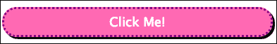
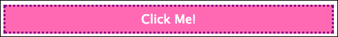

# 第一章：移动优先 - 如何以及为什么？

如果你从事为公司建立/维护网站或为代理机构建立网页属性的业务，你可以并且应该使用移动优先策略。为什么？因为这对你的最终产品有价值。你最终会得到一个被大多数人在所有可能的设备和浏览器上使用的网站。

这本书面向初学者和中级开发人员以及设计师。它还面向那些希望更深入了解现代工具和网页策略可能性（以及由此可能不切实际的内容）的商业和管理人员。本书中的代码示例，按步骤使用，应该帮助任何具有基本开发技能的人更深入地了解可能性以及如何实现可能性。当然，我喜欢每天都建造东西，但对于我们这些还必须制定策略并教育客户和同事的人来说，掌握如何制作移动优先网站的程序知识比仅掌握理论和概念知识更有价值。

# 什么是响应式网页设计？

**响应式网页设计**（**RWD**）是一组用于在不同尺寸屏幕上显示网页的策略。这些策略利用了现代浏览器中可用的功能，以及渐进增强策略（而不是优雅降级）。这些术语是什么意思？好吧，一旦我们深入了解程序和代码，它们就会变得更有意义。但这里有一个快速示例，用来说明 RWD 中使用的双向渐进增强。

假设你想要制作一个漂亮的按钮，它是一个大目标，可以可靠地被大而笨拙的拇指按下，在各种移动设备上都可以。事实上，你希望这个按钮几乎可以在人类所知的每一种移动设备上运行。这不是问题。以下代码是你（大大简化的）HTML 的样子：

```html
<!DOCTYPE html>
  <head>
    <link rel="stylesheet" href="css/main.css">
  </head>
  <body>
    <button class="big-button">Click Me!</button>
  </body>
</html>
```

以下代码是你的 CSS 的样子：

```html
.big-button {
  width: 100%;
  padding: 8px 0;
  background: hotPink;
  border: 3px dotted purple;
  font-size: 18px;
  color: #fff;
  border-radius: 20px;
  box-shadow: #111 3px 4px 0px;
}
```

### 提示

**下载示例代码**

你可以从你在[`www.PacktPub.com`](http://www.PacktPub.com)账户中购买的所有 Packt 图书中下载示例代码文件。如果你在其他地方购买了这本书，你可以访问[`www.PacktPub.com/support`](http://www.PacktPub.com/support)并注册，将文件直接发送到你的邮箱。

因此，这会让你得到一个可以延伸到文档主体宽度的按钮。它还是热粉色的，带有点状紫色边框和厚重的黑色阴影（不要评判我的设计选择）。

这段代码的好处在于什么。让我们用一些想象中的设备/浏览器来解释一下第一段中的一些术语：

+   设备一（代号：Goldilocks）：这个设备有一个现代浏览器，屏幕尺寸为 320 x 480 像素。它经常更新，所以很可能拥有你在喜爱的博客中读到的所有酷炫的浏览器功能。

+   设备二（代号：小熊宝宝）：这个设备有一个部分支持 CSS2 并且文档不完善的浏览器，以至于你只能通过试错或论坛来确定支持哪些样式。屏幕尺寸为 320 x 240 像素。这描述了一个在移动设备上浏览网页的现代采用水平之前的设备，但你的使用情况可能需要你支持它。

+   设备三（代号：Papa Bear）：这是一台带有现代浏览器的笔记本电脑，但你永远不会知道屏幕尺寸，因为视口大小由用户控制。

因此，Goldilocks 得到以下显示：



因为它装饰了完整的 CSS3 功能，它将呈现圆角和阴影。



另一方面，小熊宝宝只会得到方形边角，没有阴影（如前面的屏幕截图中所示），因为它的浏览器无法理解这些样式声明，也不会对其进行任何操作。不过，这并不是什么大问题，因为你仍然可以得到按钮的重要功能；它可以延伸到屏幕的整个宽度，成为全世界所有拇指的大目标（而且它仍然是粉色的）。

大熊宝宝也得到了所有 CSS3 的好东西。


也就是说，无论用户将浏览器调整到多宽，它都会延伸到整个浏览器的宽度。我们只需要它宽约 480 像素，这样用户就可以点击它，并且在我们想象的任何设计中看起来合理。因此，为了实现这一点，我们将利用一个称为`@media`查询的巧妙的 CSS3 功能。我们将在本书中广泛使用这些功能，并使您的样式表看起来像这样：

```html
.big-button {
  width: 100%;
  padding: 8px 0;
  background: hotPink;
  border: 3px dotted purple;
  font-size: 18px;
  color: #fff;
  border-radius: 20px;
  box-shadow: #111 3px 3px 0px;
}

@media only screen and (min-width: 768px){
  .big-button { 
    width: 480px;
  }
}
```

现在，如果您正在和我一起编码，并且有一个现代浏览器（意思是浏览器支持 HTML5 规范中的大多数，如果不是全部功能，稍后会详细介绍），您可以做一些有趣的事情。您可以调整浏览器的宽度，看看开始按钮如何响应`@media`查询。从浏览器非常窄的情况开始，按钮会变宽，直到屏幕宽度达到 768 像素；超过这个宽度，按钮将会变为只有 480 像素。如果您的浏览器宽度超过 768 像素，按钮将保持 480 像素宽，直到浏览器宽度小于 768 像素。一旦低于这个阈值，按钮就会变为全宽。

这是因为媒体查询的原因。这个查询基本上是在问浏览器几个问题。查询的第一部分是关于媒介类型是什么（打印还是屏幕）。查询的第二部分是询问屏幕的最小宽度是多少。当浏览器对`screen`和`min-width 768px`都回答是时，就满足了应用媒体查询内样式的条件。说这些样式被应用了有点误导。事实上，这种方法实际上利用了媒体查询中提供的样式可以覆盖样式表中先前设置的其他样式的事实。在我们的情况下，唯一应用的样式是一个显式宽度的按钮，它覆盖了先前设置的百分比宽度。

因此，这种方法的好处是，我们可以制作一个网站，可以适应很多屏幕尺寸。这种方法可以重复使用很多代码，只在需要时应用不同屏幕宽度的样式。其他让可用网站适应移动设备的方法需要维护多个代码库，并且必须识别设备，这只有在实际检测到请求网站的设备时才有效。这些其他方法可能很脆弱，也违反了编程中的“不要重复自己”（DRY）原则。

不过，本书将介绍一种特定的 RWD 方法。我们将使用**320 and Up**框架来实现移动优先策略。简而言之，这种策略假设请求网站的设备具有小屏幕，并且不一定具有很强的处理能力。320 and Up 还有很多很好的辅助功能，可以快速轻松地为客户的网站提供许多所需的功能。但是，当我们一起建立一个简单的网站时，我们将详细介绍这些细节。

### 注意

请注意，有很多框架可以帮助您构建响应式网站，甚至有一些可以帮助您构建响应式的移动优先网站。320 and Up 的一个特点是它比大多数框架更少地表达观点。我喜欢它，因为它简单，消除了为许多网站设置可能使用的繁琐工作。我还喜欢它是开源的，可以与静态网站以及任何服务器端语言一起使用。

# 先决条件

在我们开始构建之前，您需要下载与本书相关的代码。它将包含您所需的所有组件，并且已经为您正确地进行了结构化。如果您想要为自己的项目使用 320 and Up，您可以从*Andy Clarke*的网站（他是 320 and Up 的负责人）或他的 GitHub 账户上获取。我也在我的 GitHub 仓库中维护了一个分支。

## 安迪·克拉克的网站

[`stuffandnonsense.co.uk/projects/320andup/`](http://stuffandnonsense.co.uk/projects/320andup/)

## GitHub

[`github.com/malarkey/320andup`](https://github.com/malarkey/320andup)

## 我的 GitHub 分支

[`github.com/jasongonzales23/320andup`](https://github.com/jasongonzales23/320andup)

也就是说，跟随本书的最简单方法是从这里获取我为您打包好的代码：[`github.com/jasongonzales23/mobilefirst_book`](https://github.com/jasongonzales23/mobilefirst_book)

# 摘要

在本章中，我们看了一个简单的例子，展示了响应式网页设计策略如何为许多不同尺寸的屏幕提供相同的内容，并使布局根据显示屏进行调整。我们为一个粉色按钮写了一个简单的例子，并获得了一个指向 320 and Up 的链接，因此我们可以开始构建一个完整的移动优先响应式网站。
