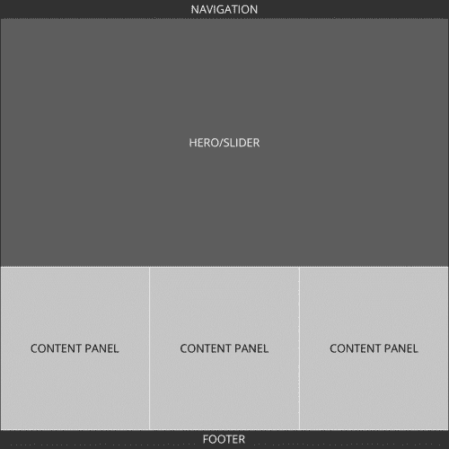
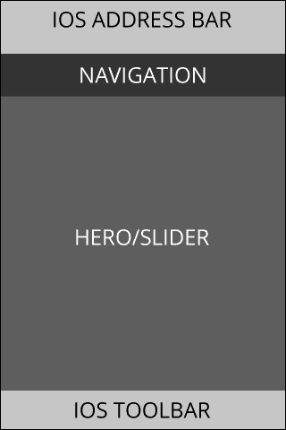
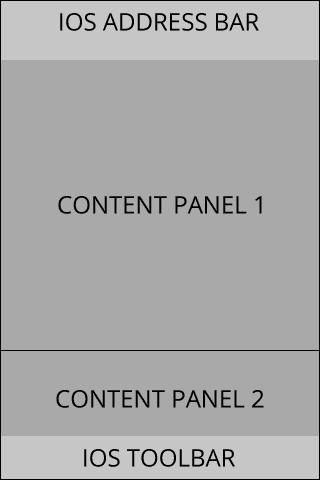
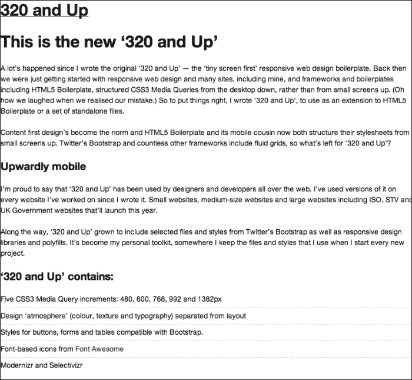
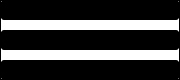

# 第二章：构建主页

在这一章中，我们将开始使用 320 and Up 框架，立即开始构建我们示例作品网站的主页。我们将从一些基础知识开始，了解特定代码放在哪里以及为什么。然后我们将快速转移到构建我们的页面，包括作品主页的许多典型元素：导航、主页/幻灯片和三个内容面板。如果你不知道这些术语的含义，不要担心，你很快就会知道的！

如果你已经成功下载并解压了第一章结尾处的链接中的所有代码，*移动优先-如何以及为什么？*，你已经准备好了。如果没有，请返回并使用链接下载示例代码。

# 准备和规划你的工作空间

每个人都有自己喜欢的代码存放方法和组织方式，网页开发中有很多关于组织的惯例，了解这些惯例是很好的。如果你有自己喜欢的工作流程，尤其是从教程中获取代码的工作流程，请继续使用。但是对于那些没有喜好的人，我建议你把下载的代码放在一个工作目录中，你可以在那里保存（或计划保存）所有的网页项目。我通常把所有的网页代码放在一个名为`work`的目录中。所以在 Unix 或 Mac OS X 机器上，它看起来是这样的：

```html
~/work/320-and-up

```

关于放置代码的一些建议。如果你使用这本书特别是为了构建你想要部署和使用的东西，你可能只想使用示例代码作为参考，并仅使用 320 and Up 框架提供的文件来构建你的项目。但是，请确保你把所有这些放在一个名为 320 and Up 之外的目录中。

无论你如何进行，我都会在每一章提供之前和之后的代码，这样你就可以有一个模板来开始，也可以看到我们在本章结束时将会得到的最终产品的示例。如果你刚开始并且对此感到困惑，只需复制代码并进行编辑。如果以后需要，你可以随时下载一个新的副本。

如果你查看`ch2`目录，你应该会看到两个文件夹`before`和`after`。从现在开始，我假设你会选择最简单的方式直接编辑`before`文件。但是请按照你喜欢的方式继续。

继续前往或查看`before`目录。你会看到我从 Andy Clarke 的 GitHub 仓库（`repo`）克隆下来的`320andup`文件夹。我所做的就是通过输入以下命令行来切换到`before`目录：

```html
$ cd before

```

然后我从仓库克隆了代码：

`git clone git@github.com:malarkey/320andup.git`

如果你不想去研究这些，就直接使用我提供的代码。我只是想让你知道我是如何把代码放在那里的。

一旦你查看了`320andup`文件夹的内容，你会看到很多文件。不要感到压力。我会在我们进行时解释我们正在使用的内容。而且我们有些文件根本不会用到。如果你要部署这些代码，我鼓励你进行某种生产过程，只部署你真正需要的代码。不过，这本书的范围超出了这一点，因为我们将专注于构建。

## 提前规划

我知道你可能很兴奋地开始编写一些代码，但首先我们需要对我们将要构建的内容进行一些规划。当我准备构建一个网站时，这是我首先要做的，这样我就有了一个构建代码的参考。这是一个好的实践；你不想随意尝试。但是当你构建一个响应式网站时，情况也会变得更加复杂。

也就是说，这是我们将遵循的每个页面的公式：

1.  描述我们想要的页面元素及其层次结构。

1.  为我们需要编码的所有不同屏幕尺寸的页面元素（称为**线框图**）绘制一些简单的图片。

1.  为 320 像素宽的屏幕编写一些代码（并提前考虑）。

1.  为我们需要编码的其他屏幕尺寸编写一些代码。

让我们从第一步开始。我们的作品集网站首页将包括以下元素：

+   导航菜单

+   主页/幻灯片

+   内容面板三合一

+   页脚

这是一个相当有效的作品集网站页面布局，但对于公司网站也同样有效。在设计页面之前，我们应该花一点时间以一种非常抽象的方式规划页面内容会是什么样子。通常，最好的表示方法是用线框图。线框图应该显示内容放置在页面上的位置以及相对大小。这是我们的网站作为台式机布局的样子：



我很快就在 Photoshop 中制作了那张图片，但你可以在任何图片编辑器中轻松完成（事实上，我和许多同事都非常喜欢使用简单的协作图片编辑器，比如 Google Drive 中的编辑器）。如果你正在制作与这个示例不同的东西，你可能想现在花点时间制作你自己的图片。

在这个阶段，重要的是暂时不要考虑尺寸（但很快会考虑），而是考虑每种内容类型，并评估它对网站目的的重要性。这个作品集网站的目的是展示我们的作品，以便我们能够被雇佣。为了实现这一目标，我们决定有一个主页、一个画廊页面、一个联系表格和一个**关于我**页面。并不是开创性的，但相当有效。接下来，让我们看看主页如何支持网站的目的。

### 导航

在首页上，导航区将链接到我在上一节中列出的那些页面：

+   **标志**

+   **首页**

+   **画廊**

+   **联系**

+   **关于我**

### 主页/幻灯片

这个区域很大，很吸引人。让我们计划在这里放一些大胆的图片和/或文本，以吸引人们去浏览我们想要突出的画廊作品以及联系表格。

### 内容面板

这些区域应该突出网站的目的。我认为这些区域是为那些愿意往下滚动的人准备的。换句话说，愿意往下滚动的人是好奇的，我们应该为他们提供有关网站目的的更多细节。例如，我的内容可能突出三个技能领域：前端工程、用户体验和视觉设计。由于我主要是前端工程师，它是最优先的；其次是用户体验，最后是视觉设计。虽然在台式机或较大的平板电脑上可以同时看到这三个，但在较小的平板电脑和手机上，我们无法舒适地同时看到这三个。

对于你自己，仔细考虑一下你想要突出的三个领域。通常会将一个面板专门用于社交媒体整合。无论你决定了什么，确保它提供更多细节，而不仅仅是重复页面上相同的内容。

### 页脚

页脚将有一个简短的声明和一个顶部的链接，目的是返回主导航。特别是在手机上，有一个返回顶部的链接是非常重要的。在移动设备上，我们需要为用户提供一种方便的方式，让他们能够从页面顶部导航到底部，而不必手动滚动。

好的，现在我们已经对我们的内容进行了优先排序和分类，但你应该已经注意到线框图中的一个问题。我从台式机视图开始，但这本书主要是关于首先为手机设计，对吧？我之所以首先制作那个线框图，是因为我假设大多数读者在转向移动设计之前已经设计过台式机页面。事实上，只设计台式机视图是很常见的！从现在开始，我们将严格专注于首先设计手机。我保证！

因此，知道我们的内容是什么，现在我们需要制作一个适用于移动设备的布局。首先，我会向您展示我认为我们的布局应该是什么，然后解释原因。就是这样：



请注意，我们必须考虑地址栏和工具栏。请记住，我们不仅仅是为 iPhone 设计。我只是以它作为一个快速的例子，主要是因为它对很多人来说很熟悉。重点是，在移动设备上，您不仅要处理小屏幕，而且甚至不能指望获得所有小屏幕，因为大多数移动网络浏览器需要一些地址和工具栏的“chrome”。有一些事情我们可以做来尝试重新获得那个空间，但稍后再说。现在，我们需要做一个悲观的假设来规划我们的布局。如果我们以目前非常流行的 iPhone 4/4S 的移动 Safari 浏览器为例，我们只有 320 像素乘以 376 像素可用，因为我们使用 60 像素用于地址栏和 44 像素用于工具栏。iPhone 5 的高度要高大约 88 像素。再次重申，我们不仅仅是为 iPhone 设计。我们主要是看这个例子来说明一个观点——您不能保证在视口中放入大量内容。

实际上，看起来我们只能放一个导航栏和主要内容。最好确保英雄/幻灯片中的内容有意义！在本书中，我们不会过多关注内容策略，因为有很多其他更有经验的人在这方面；然而，让我们尽力在那里放一些精心选择的内容。

也就是说，我们仍然可以包括所有其他内容；它们现在只是看不见。如果用户向下滚动，他们仍然应该能够看到三个内容面板，而不是沿页面宽度展开。向下滚动的用户应该看到这个：



如果用户继续向下滚动，他们将看到第三个面板，最终是页脚。重申一下，当他们滚动到页脚时，从这里轻松访问站点导航可能会非常有帮助。

好的，我打赌您迫不及待地想要编写一些代码并构建！既然我们知道我们要构建什么，现在我们可以做到。由于 320 像素宽的屏幕需要所有内容填充屏幕的宽度，并且所有主要块都需要堆叠，HTML 和 CSS 代码将非常简单！

继续打开`320andup`目录中的`index.html`文件；或者按照代码示例打开此路径中的文件：

`ch2/before/320andup/index.html`

我们将快速浏览一下浏览器中的这个页面，然后我们将更改它以添加我们自己的内容。继续以您喜欢的方式在浏览器中查看此文件。我更喜欢使用 Python 简单的 HTTP 服务器（请参阅以下提示）。但由于我们只是在处理静态站点，您可以双击文件，甚至将其拖入浏览器窗口。

### 提示

**Python 简单 HTTP 服务器**

我不想太偏向 Mac OS X，但如果您使用 Mac，这将很容易。如果您使用其他*nix 操作系统，这仍然会很容易。如果您使用 Windows，这将需要更多的工作；然而，这可能是值得的。

在 Mac 上启动 Python 简单服务器，您只需通过命令行浏览到要提供给浏览器的目录，然后键入：

```html
python –m SimpleHTTPServer

```

如果使用其他*nix 操作系统，您可能需要使用软件包管理器安装 Python，然后运行上述命令。对于 Windows，您需要从[`www.python.org/getit/`](http://www.python.org/getit/)安装它。按照说明进行操作，然后使用命令行运行相同的命令。

对于熟悉 WAMP/MAMP 解决方案的人，您可能希望使用它们。您可以在以下位置找到它们：

+   [`www.apachefriends.org/en/xampp.html`](http://www.apachefriends.org/en/xampp.html)

+   [`www.mamp.info/en/index.html`](http://www.mamp.info/en/index.html)

我强烈建议你使用最先进的浏览器，比如 Chrome 或 Firefox，在本书中我们将要做的工作中，它们有非常有用的开发工具，可以帮助你了解你的代码发生了什么。开发工具使你更容易理解事物是如何工作的，以及如何解决问题。事实上，我们将要使用的许多功能只在现代浏览器中可用。所以如果你还没有，去下载一个；它们都是免费且易于安装的。就我个人而言，我的主要开发浏览器是 Chrome。

好的，一旦你在浏览器中打开这个页面，你应该能看到我在下面的图片中所展示的内容。花点时间仔细阅读一下。你可能会有很多问题，这是件好事。在我们构建东西的时候，你会知道更多。



所以，我们需要做的第一件事是编辑这个文件（路径为`ch2/before/320andup/index.html`）使其成为我们自己的。基本上，我们想要通过移除页眉、页脚和中间的所有内容来清空这个页面。在`before`目录中，我提供了一个名为`index_stripped.html`的示例。随意将你的努力与该示例文件进行比较（如果你是一名初学者开发者，不要被诱惑只是将`index_stripped.html`的名称改为`index.html`并使用它；努力编辑代码成功）。

我们一开始要做的另一件事是，使我们能够从谷歌的服务器中拉取 JavaScript 库 jQuery。谷歌非常友好，托管了大量的 JavaScript 和 AJAX 相关的库。因此，我们许多人可以将谷歌作为**内容交付网络**（**CDN**）。然而，你可能会注意到从谷歌服务中拉取它的 HTML 代码行缺少了一些东西：

```html
<script src="img/jquery.min.js"></script>

```

它缺少了 HTTP 协议，这是 URL 的第一部分，在斜杠之前的花哨说法。我敢打赌你在想为什么？原因是我们需要它在`http`或`https`域内工作，这取决于我们的网站是什么。将其省略会使其默认为此代码所在页面的 HTTP 协议。如果你在安全的`https`站点中错误地指定为`http`，它将向所有良好的浏览器发出安全警告，因为你不能在安全站点的上下文中提供不安全的内容。否则，`http`是完全可以的（你也可以完全省略这一点，使用你的网站所使用的任何协议）。

对于这个项目，我正在使用`http`；然而，如果你正在构建一个安全的网站，务必确保这也是安全的。现在你的代码应该是这样的：

```html
<script src="img/jquery.min.js"></script>
```

现在如果你刷新页面，你不应该注意到任何变化，除非你查看 jQuery 的来源。如果你不知道如何检查站点资源是否正在下载，现在不要太担心。但如果你看到错误，只需仔细检查你的代码是否与示例匹配。你可以在任何开发者控制台中检查是否有 JavaScript 错误，无论你使用的是哪种浏览器（甚至是 IE）。一旦这个工作正确了，你可以首先让页面请求 jQuery 库来自谷歌的服务。如果失败，它将来自你网站的服务器。再次强调，我不会过多介绍这个样板代码的细节，但知道以下这行 HTML 是一个备份，以防谷歌无法在你请求时提供 jQuery 文件：

```html
<script>window.jQuery || document.write('<script src="img/jquery-1.7.2.min.js"><\/script>')</script>
```

## 让我们开始构建！

好了！所有的基础都已经就位了。让我们首先为小屏幕构建页面的组件。让我们从页面顶部到底部开始。正如我之前提到的，通常所有的内容都应该跨越小屏幕的整个宽度。让我们从页眉和导航开始。

在 body 标签的下面，让我们放一些 HTML 来制作我们的导航。它应该是这个样子的：

```html
<body class="clearfix">
<!-- PUT YOUR CONTENT HERE -->
<header>
  <nav class="navbar open">
    <div class="navbar-inner">
      <div class="container">
          <a class="logo" href="./">Logo</a>
          <ul class="nav">
            <li><a href="./index.html">Home</a></li>
            <li><a href="./gallery.html">Gallery</a></li>
            <li><a href="./contact.html">Contact</a></li>
            <li><a href="./about.html">About Me</a></li>
          </ul>
        </div>
    </div>
  </nav>
</header>
```

### 页眉

我们创建了一个页眉块。我们出于语义和布局原因使用它。页眉主要包含标志和导航。

### 标志

标志将包含在`<a>`标签中。这遵循了非官方的网络惯例，即网站标志应链接回首页。我们仍然会有一个明确的链接到首页，但提供两个链接对用户而言是有帮助的，而不会令人困惑。我使用简写./以便页面链接回到当前深度级别的根目录；对于生产，您可能希望采取额外步骤，将其链接到您的完全合格的根域（例如，[www.yourdomain.com/index.html](http://www.yourdomain.com/index.html)）。

### 导航

我们创建了一个语义`<nav>`块，并在内部放置了一些嵌套容器，最后是一个`<ul>`（无序列表）。每个`<li>`（列表项）将链接到我们网站上的每个页面。对于这个项目，我们将手动编写每个链接，但如果您使用某种框架，这些链接将动态生成。我已经创建了指向尚不存在的页面的链接，因此如果您单击它们，将收到**404 文件未找到**的消息。

关于导航有一些关键事项需要注意。现在，没有应用任何 CSS，基本布局几乎是我们想要的。每个链接都垂直堆叠，并且有一些额外的填充，这将是全世界肥厚手指的明显目标。这一切都非常理想，因为知道您的网站在没有 CSS 的情况下仍然可以正常运行总是很好的。这有很多原因。其中一个是您的 CSS 由于某种原因未能提供服务。另一个包括使用纯文本浏览器的用户。您还会注意到这里有一些相对非语义的容器，它们作为实用容器发挥作用。我们很快会使用其中一些。

这种导航的一个问题是，一旦我们正确地对其进行样式设置，它将占用大量屏幕空间。在触摸界面上需要交互的元素的最小区域大约是 50 像素乘以 50 像素，以便足够宽以适应手指。不过这里有一些余地。例如，如果触摸目标真的很宽，您可以将其高度设置为大约 40 像素，但这可能有风险。一些可用性专家建议将触摸目标的宽度设置为 60 像素，以适应最粗的手指——拇指，因为许多用户在移动设备上使用它四处移动。不过，为了论证起见，让我们做出妥协，假设每个元素的高度为 40 像素，宽度为全宽，或者至少为 320 像素。这意味着我们的导航与标志将有 200 像素高。我们可能已经占用了超过一半的屏幕空间，只是导航，我们确实需要记住我们必须为潜在的浏览器界面做规划。只用导航而没有实际内容来迎接用户是非常糟糕的。

我们需要对此做些什么！

幸运的是，一个快速出现的惯例解决了这个问题。大多数移动友好的网站和移动应用程序使用一个由三条平行线组成的图标来表示隐藏的导航菜单。



对于用户来说，这应该表明触摸或点击此元素将显示或隐藏导航。当然，这假设用户知道惯例。出于这个原因，可能有一些情况这不合适，特别是在导航很少的网站上。也就是说，我们将继续按照这个惯例构建我们的导航，以节省屏幕空间并学习如何进行此增强。

这是我们将使用的基本策略。我们将通过 CSS 隐藏和显示菜单，并使用 JavaScript 仅更改类。这样，如果用户没有 JS，他们仍然会得到菜单，但不幸的是它将完全展开。

首先要做的事情是添加一个按钮。在包含我们的标志的`<a>`标签下面添加你的按钮。我们将稍后对菜单进行样式设置，以更好地组织事物，但首先让我们让它工作起来。现在你的导航 HTML 应该是这样的：

```html
    <nav class="navbar">
    <div class="navbar-inner">
      <div class="container">
        <button class="menu-button">
        </button>
        <a class="logo" href="./">Logo</a>
```

如果刷新，你现在会看到一个小按钮的按钮，就在你的标志的左边。现在看起来不起眼，但请耐心等待。我们将编写 JS 代码来切换一些类来隐藏/显示导航菜单。继续打开路径`ch2/before/320andup/js/script.js`中的文件。此时，它应该是一个空文件。我们将编写一些简单的 JavaScript 来隐藏和显示菜单。同样，如果用户没有 JS，菜单就会保持打开状态。这只是渐进增强的一个小例子，还有更多要来的。

接下来，我们将编写这个 JS 来在用户触摸按钮时为菜单分配一个新的类。我们将使用一些简单而优雅的 jQuery：

```html
$(document).ready(function(){
    //all code that should run after the DOM loads goes here
    $('.navbar').removeClass('open');    
    $('.menu-button').on('click', function(){
        $('.navbar').toggleClass('open');
    });
});
```

这段代码的作用是什么呢。首先出现的 JS，`$(document).ready()`，是一些 jQuery，基本上等待 DOM 加载完成的时刻，然后执行放在`ready`函数中的所有代码。通常使用这个来确保 DOM 的所有元素都在那里，以便调用特定元素的代码实际上都在那里。

接下来的一行代码`$('.navbar').removeClass('open')`，将删除我们稍后将使用的`open`类，以便使用一些 CSS 来打开和关闭菜单。如果设备没有 JS，那么这个类就永远不会被移除，打开样式就是唯一应用于菜单的样式！

下一行代码以`$('.menu-button').on('click', function(){`开头，为具有`.menu-button`类的按钮附加了一个事件监听器。当用户点击按钮时，函数内的代码运行。此外，移动浏览器将触摸事件转换为点击，因此这段代码处理了两种事件。但回到函数——用户触摸或点击后，函数简单地在具有`.navbar`类的元素上添加或删除`open`类。从现在开始，我不会详细介绍我们编写的 JavaScript。如果你需要更多帮助理解它，那就超出了本书的范围。但如果你还不准备深入研究 JavaScript，只需跟着我，你应该会学到一些东西！

现在，如果你保存这段代码并重新加载页面，你可以试一下。如果你打开你最喜欢的开发者工具，点击按钮时查看`<nav>`标签，你应该会看到类`open`出现和消失在那个元素上。如果没有发生，或者你遇到错误，尝试重新追溯你的步骤，看看是否漏掉了一些代码。另外，尝试运行本章提供的完整代码，看看是否正常工作。如果我提供给你的代码不起作用，那么除了代码之外还有其他问题。

如果你没有看到任何错误，但同时在浏览器的检查器中也没有看到任何变化，那就耐心等待。可能由于某种原因它没有更新 DOM。但一旦我们添加一些样式，我们很快就会看到它的工作证明。

我将要写的大部分 CSS 可以用纯 CSS、SASS 或 LESS 来编写。出于几个原因，我更喜欢使用 SASS。这个主题也超出了本书的范围。但为了简洁起见，我将尽力向你展示如何在 SASS 和纯 CSS 中编写所有 CSS 代码示例。如果你需要了解更多，请阅读附录 B，*使用 CSS 预处理器*和其他预处理器。否则，请跟着我继续展示 CSS 和 SASS 的代码示例。完成的代码示例都是 CSS 和 SASS/SCSS。

首先，让我们安排导航菜单，以便以一种增强可用性和外观的方式布局事物。例如，让我们让所有这些堆叠的元素高 40 像素。

如果你正在使用 SCSS，请打开`scss`文件夹中的`_page.scss`，确保你将页面头部链接的`css`文件名更改为：

```html
<link rel="stylesheet" href="css/320andup-scss.css">
```

当然，你可以用其他方法来处理这个问题，但让我们保持简单。如果你正在编辑纯 CSS，只需打开路径中的文件：

`ch2/before/320andup/css/320andup.css`

当然，如果你愿意，你可以随时更改这个文件的名称以及头部链接的文件名称，但我建议我们现在保持简单，暂时不要更改。现在，让我们开始为这个页面添加样式。只是一个快速的提示——对于这些样式中的许多样式，我大量借鉴了强大的 Twitter Bootstrap 框架，这是一个包含样板 CSS 和 HTML 的前端框架。你可以在 320 and Up 中包含它，但出于简单起见，我决定不在本书中包含它。也就是说，如果你决定将两者结合起来（如果你喜欢快速而好地构建东西，我强烈建议你这样做），你会发现我使用的许多样式与它非常兼容。现在让我们开始吧！

首先，让我们把按钮移到它应该在的地方，并让它看起来不错：

```html
.menu-button {
  display: block;
  float: right;
  background: #444;
  border: 1px solid #000;
  padding: 7px 10px;
  margin: 5px;
}
```

按钮远离了所有的链接，这样用户在尝试打开链接时就不会意外触摸到它。它看起来也好一点，但仍然需要我们之前讨论过的那三行。不过我们不需要任何图片。

如果你正在使用任何 SASS 或 LESS，你可以利用 320 and Up 提供的许多方便的 mixin 之一。你应该打开`_mixins.scss`，快速查看所有的 mixin。同样，如果你对它们还不熟悉，我将很快给出一个例子，说明它们有多酷；不过，首先简要解释一下 SASS 中的 mixin 以及它们为什么如此出色。

在 SASS 中，你可以通过输入`@mixin`，然后是你想要生成的一些 CSS 来定义 mixin。如果你有一个复杂的任务，不想重复努力，这是非常好的。这回到了 DRY 的概念；例如，我们可以使用 CSS3 的圆角来制作菜单按钮的三个圆角矩形。问题是，目前至少有三种不同的方式来声明圆角，这要归功于供应商前缀。对于所有的圆角，我们必须这样定义：

```html
-moz-border-radius
-webkit-border-radius
border-radius
```

因此，我们可以在需要在网站样式中的任何地方使用圆角时每次都输入前面的代码。或者，我们可以节省精力并将这些放入 mixin 中。圆角 mixin 就是为你做这件事。现在就在`_mixins`文件中查看它。SASS 中的 mixin 可以做很多事情，但单单这种情况就很有说服力。它本质上就像一个可调用的函数，当代码编译成 CSS 时执行（详细信息请参阅附录 B，“使用 CSS 预处理器”）。你可以编写`@include rounded`，mixin 中的 CSS 将呈现在最终的 CSS 中。在这种情况下，你可以获得所有这些创建圆角的方式，而无需输入所有的内容。

如果你已经在使用 SASS，这就是你需要在你的网站上看到它的操作（如果你没有，阅读附录 B，“使用 CSS 预处理器”来了解如何开始）。首先，我们将为我们的按钮添加一些新的标记。

```html
<button class="menu-button">
          <span class="icon-bar"></span>
          <span class="icon-bar"></span>
          <span class="icon-bar"></span>
</button>
```

将这个 SCSS 嵌套在你的`.menu-button` SCSS 中：

```html
  .icon-bar {
    display: block;
    width: 18px;
    height: 2px;
    margin-top: 3px;
    background-color: #fff;
    @include rounded(1px);
  }
```

圆角 mixin 将呈现以下 CSS（或者如果你愿意，你也可以手动编写）：

```html
  .menu-button .icon-bar {
    display: block;
    width: 18px;
    height: 2px;
    margin-top: 3px;
    background-color: #fff;
    -webkit-border-radius: 1px;
    -moz-border-radius: 1px;
    border-radius: 1px; }
```

当 SCSS 被处理时，最后三行是 mixin 生成的。这真的可以节省很多时间。现在你的按钮应该看起来整洁，漂浮在右边！

现在，让我们让所有这些链接看起来整洁。你的 SCSS 应该是这样的：

```html
.navbar {
  background: #1b1b1b;
  .navbar-inner {
     .logo{
      display: block;
      padding: 9px 15px;
      font-weight: bold;
      color: #999999;
      margin-bottom: 4px;
    }
    .nav {
      a {
        @extend .logo;
      }
    }
  }
}
```

以下是 CSS：

```html
.navbar {  
background: #1b1b1b; }
.navbar .navbar-inner {
    background: #1b1b1b; }
    .navbar .navbar-inner .logo, .navbar .navbar-inner .nav a {
      display: block;
      padding: 9px 15px;
      font-weight: bold;
      color: #999999;
      margin-bottom: 4px; }
```

这将产生一个清晰的对比，并使链接高 40 像素。但现在我们需要做一些事情来隐藏和显示菜单。我更倾向于不使用 JavaScript 动画来做。好吧，实际上这不仅仅是倾向。CSS3 动画在大多数情况下会更流畅，而且这确实符合渐进增强的思想。如果设备不支持 CSS3 动画，它很可能也不足以处理 JavaScript 动画，那么为什么要强制它运行 JS 循环来实现一个好看的功能呢？另一方面，大多数支持 CSS3 动画的设备通过利用 GPU 来优化这些动画。即使它们不这样做，它们也会播放 JS 动画。

我不会在我的论点上太聪明，但如果你是在一个不支持 CSS3 动画的慢设备上，或者你是在最流畅的移动设备上，这段代码基本上是有效的。

首先，我们需要在这里做一个尴尬的让步。当元素的高度自动计算时，CSS3 动画将无法工作（尚未！）。这对我们来说并不重要，因为我们可以很容易地知道我们的导航菜单的高度。但是，如果你想在未知大小的菜单上使用这种动画，你就不能使用这种方法。对于这种情况还有其他方法；然而，它们没有包含在这本书中。

所以，现在你的 SCSS 需要看起来像这样：

```html
.navbar {
  background: #1b1b1b;
  overflow: hidden;
  max-height:44px;
  @include transition(max-height .5s);
  &.open{
    max-height: 220px;
  }
  .navbar-inner {
    .logo{
      display: block;
      padding: 9px 15px;
      font-weight: bold;
      color: #999999;
      margin-bottom: 4px;
    }
    .nav {
      margin-bottom: 0;
      list-style:none;
      a {
        @extend .logo;
      }
    }
  }
}
```

和 CSS：

```html
.navbar {
  background: #1b1b1b;
  overflow: hidden;
  max-height: 44px;
  -webkit-transition: max-height 0.5s;
  -moz-transition: max-height 0.5s;
  -ms-transition: max-height 0.5s;
  -o-transition: max-height 0.5s;
  transition: max-height 0.5s; }
  .navbar.open {
    max-height: 220px; }
  .navbar .navbar-inner .logo, .navbar .navbar-inner .nav a {
    display: block;
    padding: 9px 15px;
    font-weight: bold;
    color: #999999;
    margin-bottom: 4px; }
  .navbar .navbar-inner .nav {
    margin-bottom: 0; }
```

我们设置打开菜单的最大高度为 5 x 44 = 220px。`nav`中有五个堆叠的元素，我们知道它们每个都有 44 像素高（我可以通过我的开发工具看到）。由此推断，关闭版本，即已删除`open`类的版本，应该有一个最大高度为 44 像素。我们需要隐藏溢出，这样当菜单折叠到较小的高度时，其他元素就不可见了。

你还应该注意到，创建 CSS3 过渡动画的五种不同方法是用一行 SCSS（另一个 mixin）编写的：

```html
  @include transition(max-height .5s);
```

现在看起来非常不错！随意尝试并享受。这是一个相当紧张的部分。其余部分会简单一些，我保证！

接下来，让我们继续我们的*英雄*部分。现在，我们将简单地有一个背景，一些占位文本和一个按钮。但我将在本节稍后提供一些制作幻灯片秀的提示和建议。

## 英雄

现在让我们暂时保持标记简单。稍后，我们将回来把它做成一个简单的幻灯片秀。

```html
<div class="hero">
  <div class="container">
    <h1>Big Headline</h1>
    <p>YOLO vero scenester, semiotics next level flannel Austin shoreditch portland 3 wolf moon chillwave gentrify consequat tousled retro. Umami tonx ennui cliche delectus pinterest, in excepteur hashtag before they sold out.</p>
      <a href="./contact.html" class="btn btn-primary btn-extlarge">Contact Me</a>
  </div>
</div>
```

英雄 div 充当一些样式和内容的容器，我们将添加一些内容。现在，我们将只添加一个标题，一些文本和一个按钮，最终会将用户带到我们的联系页面。

SCSS 应该是这样的：

```html
.hero {
  text-align: center;
  padding: 40px 20px;
  text-shadow: -1px 1px 0px #E0B78A;
  @include horizontal(#feb900, #cb790f);
  h1 {
    margin: 10px 0;
    font-size: 45px;
    font-weight: bold;
  }
  p {
    font-size: 18px;
    margin: 0 0 30px 0;
    font-weight: 200;
    line-height: 1.25;
  }
  .btn {
    text-shadow: 1px 1px 0px #000000;
  }
}
```

和 CSS：

```html
.hero {
  text-align: center;
  padding: 40px 20px;
  text-shadow: -1px 1px 0px #e0b78a;
  background-color: #cb790f;
  background-image: -webkit-gradient(linear, 0 0, 100% 0, from(#feb900), to(#cb790f));
  background-image: -webkit-linear-gradient(left, #feb900, #cb790f);
  background-image: -moz-linear-gradient(left, #feb900, #cb790f);
  background-image: -ms-linear-gradient(left, #feb900, #cb790f);
  background-image: -o-linear-gradient(left, #feb900, #cb790f);
  background-image: linear-gradient(left, #feb900, #cb790f);
  background-repeat: repeat-x; }
  .hero h1 {
    margin: 10px 0;
    font-size: 45px;
    font-weight: bold; }
  .hero p {
    font-size: 18px;
    margin: 0 0 30px 0;
    font-weight: 200;
    line-height: 1.25; }
  .hero .btn {
    text-shadow: 1px 1px 0px black; }
```

同样，你可以看到 mixin 的使用。我们使用了渐变 mixin，`@horizontal`，创建了八行普通的 CSS。你相信你应该使用 SASS 了吗？

其他的都相对简单。你可能会注意到，我不得不用黑色的阴影覆盖按钮的文本阴影，因为桃红色的阴影在黑色按钮上的白色文本后面看起来会很糟糕。所有其他选择都只是这个区域的一些基本样式，你可以根据自己的口味随意调整。

现在，让我们继续到底部的三个内容面板。

## 内容面板

现在，在英雄下面，放置这个示例代码：

```html
<!--panels -->
<div class="full clearfix">
  <div class="grids grids-three clearfix">
    <div class="header header-link clearfix">
      <h2 class="h2">Heading</h2>
    </div>
    <div class="grid grid-1 clearfix">
      <p class="grid-a"></p>
      <h3 class="h2"><a href="#">Lorem ipsum dolor</a></h3>
      <p>Lorem ipsum dolor sit amet, consectetur adipisicing elit, sed do eiusmod tempor incididunt ut labore et dolore magna aliqua.</p>
    </div>
      <div class="grid grid-2 clearfix">
      <p class="grid-a"></p>
      <h3 class="h2"><a href="#">Lorem ipsum dolor</a></h3>
      <p>Lorem ipsum dolor sit amet, consectetur adipisicing elit, sed do eiusmod tempor incididunt ut labore et dolore magna aliqua.</p>
    </div>
    <div class="grid grid-3 clearfix">
      <p class="grid-a"></p>
      <h3 class="h2"><a href="#">Lorem ipsum dolor</a></h3>
      <p>Lorem ipsum dolor sit amet, consectetur adipisicing elit, sed do eiusmod tempor incididunt ut labore et dolore magna aliqua.</p>
    </div>
  </div><!-- / grids -->
</div>
```

现在，我必须在这里承认，我在这一部分所做的一切都只是复制了 Andy 在他的面板`upstart`中的示例。这些非常有用。你可以在任何预处理器文件夹中找到他的示例，但我从`ch2/before/320andup/scss/320andup-panels/index.html`中找到了我的。

这些不仅是自动布局的（这是愚蠢的开发人员用来表示自动发生但似乎神秘和神奇的事情），而且，正如你很快会看到的，它们已经是响应式的，而无需我们付出任何努力。这是一个巨大的回报！

我想要做的唯一更改是`full`类的`div`的背景颜色。蓝色与我的橙色主题不搭配。但是，如果你查看面板起始的 SCSS（在`upstarts/320andup-panels/_upstart.scss`中），你会注意到背景的颜色是从`$basecolor`变量计算出来的：

```html
background-color : lighten($basecolor, 75%);
```

这意味着你需要将`$basecolor`变量分配给某个值。让我们使用我们英雄渐变中的橙色之一！打开`_variables.scss`，将`$basecolor`更改为这样：

```html
$basecolor: rgb(203, 121, 15);
```

你会注意到我们英雄中的按钮颜色改变了！哇！这实际上是可以的，我已经计划好了。这是将样式与变量绑定在一起的强大功能，但如果你不注意的话，它可能会让你感到困扰。

好！现在看起来非常锐利！如果你调整浏览器大小，你会看到内容面板的大小和布局发生变化。我们只需要制作一个页脚，然后我们可以为 320 及以上的内容添加一些响应式样式。

## 页脚

让我们再次保持简单：

```html
<footer>
  <div class="container">
    <h4>Let's build something awesome together.</h4>
    <p>Connect with me in any of the following ways</p>
    <ul class="social">
      <li><a class="icon-facebook-sign" href="http://faceylink.html"></a></li>
      <li><a class="icon-twitter-sign" href="http://twitterlink.html"></a></li>
      <li><a class="icon-envelope" href="mailto:something@yourmail.com"></a></li>
    </ul>
    <div class="toplink">
      <a href="#">Top</a>
    </div>
  </div>
</footer>
```

我们将这样设计。首先是 SCSS：

```html
footer {
  padding: 15px 0;
  text-align: center;
  background: #1b1b1b;
  color: $white;
  overflow: auto;
  p {
    padding: 9px 15px;
  }
  .social {
    list-style: none;
    margin: 0 auto;
    width: 280px;
    li{
      float: left;
      height: 80px;
      width: 80px;
      list-style: none;
      border-radius: 50%;
      background: #000;
      margin-right: 20px;
      a {
        font-size: 42px;
        padding-top: 24px;
        color: $lightgrey;
        &:visited {
          color: $grey;
          text-decoration: none;
        }
        &:hover{
          text-decoration: none;
        }
      }
    }
    li:last-child {
      margin-right: 0;
    }
  }
  .toplink{
    clear:both;
    a {
      display:inline-block;
      padding:30px;
      color: #fff;
    }
  }
}
```

和 CSS：

```html
footer {
  padding: 15px 0;
  text-align: center;
  background: #1b1b1b;
  color: white;
  overflow: auto; }
  footer p {
    padding: 9px 15px; }
  footer .social {
    list-style: none;
    margin: 0 auto;
    width: 280px; }
    footer .social li {
      float: left;
      height: 80px;
      width: 80px;
      list-style: none;
      border-radius: 50%;
      background: #000;
      margin-right: 20px; }
    footer .social li a {
      font-size: 42px;
      padding-top: 24px;
      color: #bfbfbf; }
    footer .social li a:visited {
        color: gray;
        text-decoration: none; }
    footer .social li a:hover {
        text-decoration: none; }
    footer .social li:last-child {
      margin-right: 0; }
```

希望你现在已经掌握了这一点。但你可以再次看到在 SCSS 中使用一些变量以及`&`符号来帮助更快地编写代码。

接下来，我们处理在较大屏幕上的布局发生的变化。

## 使我们的页面响应式

查看何时需要添加新样式的最佳方法是将浏览器窗口从最窄逐渐拖宽。当设计开始看起来奇怪或破碎时，就是重新设计的时候了。

在我们的情况下，我们需要为较大的屏幕重新设计的主要内容是导航、英雄和页脚。内容面板已经为我们处理了。让我们从导航开始。

在导航的情况下，我们实现了隐藏/显示功能，以节省宝贵的屏幕空间，但在某些时候，我们不需要让用户点击来显示菜单。我们可以简单地将导航始终完全显示，就像我们习惯的桌面站点导航一样。为了找到布局中断的点，我们可以拖动浏览器宽度，这可能会很烦人。而且，实际上，响应式网站不是为了那些不断自发地调整浏览器大小的怪人，比如我自己，而是为了不同尺寸的设备。幸运的是，320 及以上在其工具箱中有一个有用的工具来帮助我们。

如果你在工作目录中打开名为`responsive.html`的 HTML 文件（提醒你，它是`ch2/before/320andup/responsive.html`），它应该会自动加载你的`index.html`文件。现在，通过左右滚动，你可以在五个良好的布局断点中看到你的布局（不要与调试代码中使用的断点混淆）。当然，会有例外，但这些断点是一个真正节省时间的起点，因为它们往往涵盖了当前可用的设备范围。我鼓励你批评和质疑，但现在，让我们利用它们，因为它们与 320 及以上配对，并且将加速几乎所有情况下支持良好设计的开发。如果你通过计算机文件系统打开此页面，它不会加载页面。请参阅本章前面的注释，找到打开此页面的好方法。但重申一下，对于这么简单的东西，我个人最喜欢的是 Python 简单的 HTTP 服务器。

好的，当您成功加载此页面时，您看到了什么？您应该注意到设计在移动和小平板布局上运行得非常好。基于我在这里放置的最少量的占位内容，它看起来既不太稀疏，也不显得太拥挤。而且作为一个奖励，这些整洁的内容面板会扩展以填充额外的空间。框架通过`@media`查询实现了这一点。稍后再详细介绍。

话虽如此，您对平板电脑的纵向布局有什么看法？通常情况下，它是有效的，但是现在我们在英雄区域有更多的空间。这并不意味着我们必须添加更多内容，但我们可能可以把文本放大一点来填充它。让我们大胆一点，让它变得非常粗体，吸引人们的注意。好处是，320 and Up 已经为轻松更改大小提供了所有的结构。首先让我们看看代码，然后我会解释底层发生了什么。

如果您正在使用 SASS，这非常容易。打开`_768.sass`或`_768.scss`文件并添加以下代码：

```html
.hero {
  h1 {
    font-size: 108px;
  }
  p{
    font-size: 40px;
  }
}
```

或者在 CSS 中，找到文件中的这一点：

```html
@media only screen and (min-width: 768px) 
```

在大括号内添加以下代码：

```html
  .hero h1 {
    font-size: 108px; }
  .hero p, .hero footer a, footer .hero a {
    font-size: 40px; }
```

因此，如果您对 SASS 或`@media`查询不熟悉，我将花一点时间帮助您理解这里发生了什么。首先，我将解释`@media`查询。在这种情况下，它的作用很简单，就是告诉浏览器一旦屏幕宽度达到最小宽度 768 像素，就应用其中的样式。您还可以设置其他尺寸和其他条件。

关于 SASS 中允许我们将这些样式组织在单独文件中的魔法，只有在`.sass`或`.scss`文件中（而不是`.css`文件）才有类似的语法，实质上是一条指令，让预处理器引入单独的文件。您可能已经注意到，您编辑的文件（以及其他一堆文件）的名称开头有一个下划线。这表示它是一个部分文件。如果您查看`320andup-sass.sass`文件或您选择的语言的相应文件，您会注意到在所有`@media`查询中，都有`@import`语句。对于我们刚刚编辑的文件，在相同的`@media`查询中有一个`@import 768`语句，就像您在普通 CSS 文件中看到的那样：

```html
// 768px
@media only screen and (min-width: 768px) {
@import "768";
}
```

当文件执行到这一点时，它告诉 SASS 预处理器去找到名称为`_768.sass`的文件，并将那里的任何代码呈现到这个位置。因此，这并不是什么高深的科学，但是设置所有这些的繁重工作已经为您处理了。

好的，现在回到让这个设计响应这个平板尺寸的问题。您还会注意到的另一件事是，我们可能不再需要隐藏导航元素了。如果我们可以保持导航方便，并显示大量内容，那么我们已经完成了一些非常重要的任务！所以让我们回到`_786.sass`文件，并在我们之前的代码块上面添加以下代码：

```html
.menu-button {
  display: none;
}
.navbar {
  position: fixed;
  width: 100%;
  .logo {
    float: right
  }

  .nav li {
    float: left;
  }
}
```

您会注意到这个结构与我们原始的`site.sass`文件的结构相似。这只是出于维护原因的一个良好实践，以确保样式实际上覆盖了其他样式。

如果需要，刷新您的屏幕，现在您会看到导航元素从左到右延伸。这可能是您在常规桌面网站上习惯看到的。大家都很高兴。这种样式也可能移动到`_480`文件布局中，但在我看来，这看起来有点拥挤。话虽如此，如果您的导航较少并且有一个小徽标（或没有徽标），您可能希望在 480 像素时应用该样式。

在这一点上，还有一个很棒的小调整。导航和英雄中的所有内容都比需要的边缘更靠近视口。我们肯定可以添加一些空间。在标记中，我们有一个很好的实用类，可以用于这个目的（这已经成为前端开发人员一直在使用的一种约定）。在您选择的`_768`文件中添加此代码，放在我们迄今为止编写的所有先前代码的上面：

```html
.container {
  width: 90%;
  margin: 0 auto;
}
```

这使我们能够将这些容器居中放置在我们希望在屏幕宽度上填充的其他元素中，这样我们的应用程序在不过分扩展内容的情况下产生了巨大的视觉影响。这种大小和边距是动态的，并且随着浏览器变得更宽而以流畅的方式变化。我们可以在各种视觉断点处设置明确的宽度；然而，如果我们这样做，我们就没有充分利用这个框架。我认为固定宽度是一种过时的范式。

让我解释一下我的意思。在网页设计的早期，设计师们让他们的页面看起来更像……嗯，页面。但是当前的网页设计有一个更灵活的理念。我认为这是一件好事，你不觉得吗？举个例子，使用大屏幕的用户不会在页面中间得到一个狭窄的内容带。

沿着这些线路，您是否注意到“320 and Up”的设计方式还有另一个便利之处？一旦我们应用了 768 的样式，这些样式也适用于更大的屏幕。很棒！更少的代码意味着更快更好的工作，更容易的维护。这也意味着浏览器需要下载更少的 CSS。这就是 UI 的三重要素：良好的用户体验，良好的性能和可维护性。

现在，你会注意到另一件事，我们的页脚没问题。我必须承认，我在这方面采取了简单的方法，但我在这里使用的方法对于这种类型的内容仍然很有用。当页面的某个区域（比如页脚）的内容很少时，只需将所有内容合理地居中对齐是很有益的。如果做得当，它很容易阅读，并且不会分散注意力，而这显然是页面上方更重要的内容。如果页脚有非常重要的内容，您应该考虑将其移到页面的主体部分！

接下来，让我们重新审视英雄区域，并讨论在其中添加图像并使用一些简单的代码来循环播放它们。

## 滑块

因此，在制作幻灯片之前，看一下 320 and Up 如何便于制作响应式图像将是有用的。如果您查看`index.html`文件中提供的代码，您将看到英雄标记下方的幻灯片标记。我已经在那里留下了注释，以便您可以轻松找到。

现在，因为我希望您看到已经为您放置在您自己的文件中的一些内容，所以只需添加以下标记：

```html
<div class="slider">
  <div class="container">
    
  </div>
</div>
```

在这里使用这个标记代替英雄标记（要么删除英雄内容，要么将其注释掉；完全取决于你）。

接下来，在您正在工作的`site.css`文件中添加以下少量 CSS（所有文件类型中都是相同的）：

```html
.slider {
  text-align: center;
}
```

刷新页面并调整浏览器宽度。您应该看到图像在不被裁剪的情况下发生变化。这是一个优雅的解决方案，因为一个图像将适用于所有布局。这并不是所有情况的解决方案（目前有很多关于如何使图像更适应屏幕尺寸的讨论）。但是它适用于以下情况：我有少量不太大的图像，我不需要为不同的屏幕尺寸裁剪它们。这种情况实际上非常普遍，只要您的图像能够轻量化，它就能很好地工作。

现在，让我们增加一些复杂性，而不是重新发明轮子。现在，我们只会添加两张图片，并提供一些简单的 JavaScript 来循环播放并使图像淡入。

让我们更改标记，以便为更多的 JS 和 CSS 做好准备：

```html
<div class="slider">
  <div class="container">
    <div class="slide active"></div>
    <div class="slide"></div>
    <div class="slide"></div>
  </div>
</div>
```

代码不多，但让我们深入了解一下。现在我们需要将图像包装在`<div>`标签中（出于其他目的，您总是可以将它们放在其他块元素中；但是，现在这种简单的标记对于我们的目的来说是完全合适的）。这些`div`容器允许我们为幻灯片中的任何内容分配类并进行块级样式设置，而不仅仅是图像。目前，我们只在这些幻灯片中放置了一个图像，但是如果我们想要添加标题或按钮或其他东西，那将变得不切实际。为了使幻灯片放映灵活显示，我们只需要将这些包装器放在所有内容周围。

现在，让我们看一些 CSS，以便正确显示这个：

```html
.slider {
  text-align: center;
  position: relative;
  .container {
    position: relative;
    .slide{
      position: relative;
      display: none;
      &.active{
        display: block;
      }
    }
  }
}
```

和编译后的 CSS：

```html
.slider {
  text-align: center;
  position: relative; }
  .slider .container {
    position: relative; }
    .slider .container .slide {
      position: relative;
      display: none; }
      .slider .container .slide.active {
        display: block; }
```

这个标记使我们可以确保第一个图像是唯一可见的，甚至不需要运行任何 JavaScript。默认情况下，`slide`类是不可见的，只有在添加`active`类时才变得可见。这不仅在代码级别上起作用，而且读起来也很好。您读到代码，它说`class="active slide"`，您就会对这是什么意思有一个很好的想法。

接下来，让我们添加一些 JS，看看我们是否可以进行简单的动画。这不会是一个花哨的动画。提醒您一下；如果您想要一些带有酷炫控件和其他花里胡哨的东西，那就超出了本书的范围。如果您想要一个漂亮的响应式幻灯片放映，我建议使用 Twitter Bootstrap 中包含的轮播或其他任何响应式幻灯片放映。我下面分享的示例代码将简单地循环浏览一些图像。

在您的`document ready`函数中添加这个：

```html
  var changeSlide = function(){
    //query the DOM for an active slide
    var $active = $('.slider .active');
    //if there are no active slides set the last one as active
    if ( $active.length === 0 ) {
      $active = $('.slide').last();
    }
//get the next slide after the active one, if there is no next one, set next as the first slide
    var $next =  $active.next().length ? $active.next() : $('.slide').first();
    //set classes on active and next slides so we can apply styles appropriately
    $active.addClass('last-active');
    $next.addClass('active');
    $active.removeClass('active last-active');
  };
//this will kick off the slideshow code above
  $(function() {
    setInterval( changeSlide, 5000 );
  });
```

这段代码是从[`jonraasch.com/blog/a-simple-jquery-slideshow`](http://jonraasch.com/blog/a-simple-jquery-slideshow)改编的，以适应我们的 320 和 Up 布局。它将循环浏览您的图像，并将活动类附加到每个图像，同时从上一个图像中删除它。然后一旦到达最后一个，它就会分配给第一个。再次，这是一个非常简单的方法，因为本书的重点是 320 和 Up。如果您想使用幻灯片放映，我建议不要重复发明轮子，因为有很多很棒的组件可供选择。如果您想选择一个好的组件，请寻找一个设计为响应式的组件，或者至少不会干扰它。对我来说，另一个标准是它使用带有 JS polyfills 的 CSS3 动画。CSS3 动画在移动设备上可能（虽然不是在所有情况下）比 JS 动画更流畅。

我们使用的图像的一个限制是，对于非常大的屏幕，图像在幻灯片的左右负空间中有点被吞没。如果这让您感到困扰，并且使您的网站看起来不如您认为的那样好，那么您有两种策略可供选择：包含更大的图像或在该区域放置全宽度的背景。我更喜欢后者，因为比例更大的图像将占据我们布局的顶部，并且还意味着可能会损害性能的更大的文件。

请记住，这里的最终目标是将内容呈现给我们网站的访问者！后一种策略需要一些规划。要么您的图像需要在边缘周围具有一些透明度，要么所有图像的背景应与您在 CSS 或滑块区域中使用的背景相匹配。我将向您展示一个简单的匹配背景的示例。

我碰巧知道我创建的示例图像具有从`#383234`到`#231F20`的垂直渐变。所以现在我所需要做的就是制作一个与之匹配的背景。使用 320 和 Up 提供的 SCSS mixin 非常容易。我只需将这个添加到我的`.slider`样式中：

```html
  @include vertical(#383234, #231f20);
```

并且渲染为 CSS：

```html
  background-image: -webkit-gradient(linear, 0 0, 0 100%, from(#383234), to(#231f20));
  background-image: -webkit-linear-gradient(top, #383234, #231f20);
  background-color: #231f20;
  background-image: -moz-linear-gradient(top, #383234, #231f20);
  background-image: -ms-linear-gradient(top, #383234, #231f20);
  background-image: -o-linear-gradient(top, #383234, #231f20);
  background-image: linear-gradient(top, #383234, #231f20);
```

这种方法的局限性在于不支持渐变的设备将会得到纯色。如果这对你来说是不可接受的，那么现在是时候回到绘图板，想出一个在所有情况下都能工作的设计了！在大多数情况下，我与设计师合作，他们要么在这种情况下束手无策，要么找到方法使他们的设计在所有情况下都能工作。如果问我，这是一个不断变化的目标，最好把精力集中在一个你知道会完美呈现给 80%的受众，并且对你网站其他观众也还不错的设计上。

好！现在你已经掌握了一个主页的基本知识，它将在几乎任何设备上都能得到最佳显示！这是很多工作，但现在我们已经奠定了基础，其他页面将会很快。

# 总结

在这一章中，我们创建了根据屏幕大小变化的导航，这样小屏幕用户可以展开或折叠它，而大屏幕用户可以获得完整的导航菜单。我们甚至使用 CSS 创建了指示可折叠菜单的图标。我们制作了一个响应式的主区域，有一个大的行动号召，利用混合和变量快速将我们的设计与相互补充的颜色结合在一起。我们使用面板`Upstart`在页面底部获得了三个内容面板，并使用提供的图标和 CSS 框架在页脚包括社交媒体和联系信息图标。最重要的是，这一切发生得非常快。一旦你掌握了它，你可以在一个小时内完成这样的页面。现在让我们继续下一章吧！
