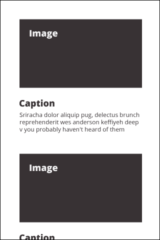
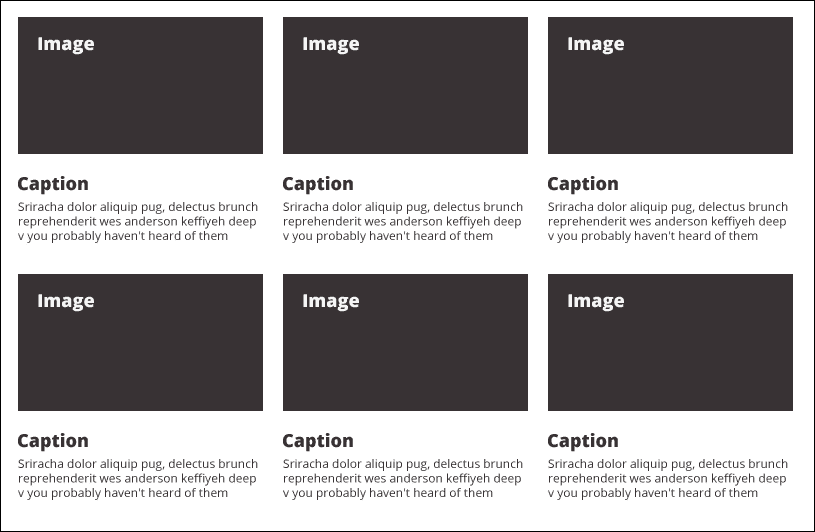
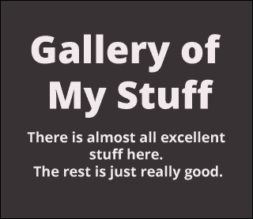
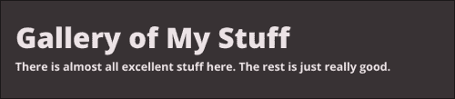
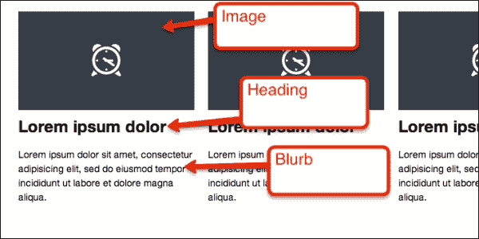
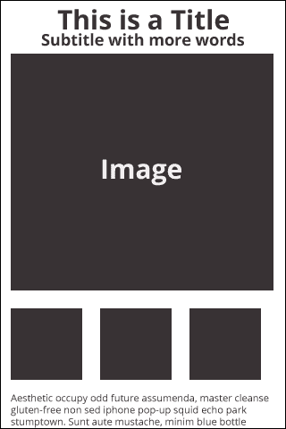
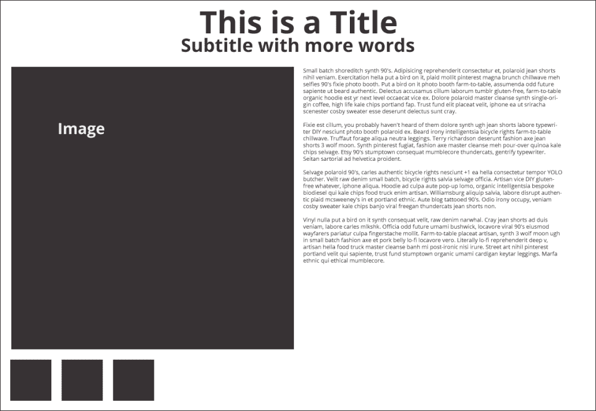
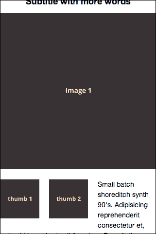

# 第三章：构建画廊页面

在上一章中，我们做了很多工作，为我们的投资组合网站的其余部分建立了相当的基础。有了我们现在拥有的知识和我们在 320 和 Up 框架之上编写的少量代码，我们真的可以开始快速前进了。在本章中，我们将做到这一点。我们将构建一个面板画廊，用于窄屏堆叠，用于宽屏平铺。为此，我们将使用与上一章中用于页面底部内容面板三重内容相同的基本方法。

# 创建线框

在我们开始编码之前，让我们看一些线框图。以下屏幕截图显示了我们在小屏幕上的屏幕应该是什么样子：



随着浏览器变得更宽，我们希望这些图像变得更大，并将布局从堆叠变为平铺，以更好地利用屏幕空间。以下屏幕截图是超过 992 像素宽的基本布局：



我在上面创建的 320 和 Up 方便的两者之间有很多视觉断点。在使用 320 和 Up 时要记住的唯一一件事是如何使页面的其余部分与其保持一致。在这里，让我们分析布局正在做什么，并通过使用 320 和 Up 中已经存在的样式或创建我们自己的样式，使我们的页面的其余部分与其友好相处。

我为自己创建**画廊**页面的方式是在页面顶部使用某种英雄，但不是幻灯片。我觉得对于这种网站的大多数页面，重要的是用简单而醒目的陈述来引导用户。主要原因是您不能指望用户首先访问您的**主页**，因此您需要在每个页面上建立关于您的网站的相当多的背景信息。我想我会将这种策略与连续电视节目的编写者使用的策略进行比较：您必须假设观众可能需要在每一集或在这种情况下的每个页面中获得一些背景信息。

因此，让我们从一个不太高的英雄开始页面，但仍然具有非常粗体的文本-标题和简短的句子。

要开始，请从`ch3/before/320andup/gallery.html`获取`gallery.html`文件。该文件将包含我们可以从我们的**主页**中重复使用的所有项目，例如文件头中的代码，导航，页脚等。花点时间看一下它，并查看我们在前进过程中重复使用的内容。继续在浏览器中打开此页面，查看您要开始使用的内容。您应该看到导航部分紧挨着页脚。不用担心，我们很快就会填补它们之间的空间。

在我们继续之前，我只想快速概述我们从第一页中保留的代码以及原因。当然，我们保留了从文件顶部到结束的`</head>`标记的所有内容。我们还重复使用从页脚开始并延续到文件底部的代码。这是我们在每个页面上需要的整个代码，以便跨设备和浏览器进行基本工作，以及包括我们的样式，网站图标和 JavaScript 库。我们还有一些在每个页面上都相同的代码，例如导航和页脚的标记。换句话说，我们在构建的每个页面上都重复使用此代码。这是正确的，但是，例如，如果您使用的是 Django 或 Rails 等框架，或者在另一个框架中使用某种模板语言，您将把在每个页面上重复出现的代码分离到自己的文件中，以便可以在其他文件中重复使用和共享。这将是解决需要在每个页面上出现此代码的问题的一个很好的方法。

然而，为了使这本书不依赖于特定的平台，我只是简单地在我们进行的过程中将这段代码从一页复制到另一页。我真的不建议以这种方式制作网站。在不同的地方重复相同的代码只是在某个时候犯下可怕的错误的邀请（希望我没有犯下一个）。

让我解释一下仅仅手动从一页复制代码到另一页的一些风险。例如，如果你决定在一页上对导航部分进行更改，你必须记住在每一页上做同样的更改，并确保你精确执行。如果你已经编程一段时间，你会认识到这个原则叫做“不要重复你自己”（DRY）。这是编写代码的基本原则。你应该遵循它。这个原则是我之前推荐使用 Sass（或 LESS）的主要理由，也是你应该使用 320 and Up 这样的框架的主要理由！

好了，我说得够多的了。

页面的其他方面也适合在你选择的框架中重复使用。包含导航的页眉和页脚很可能在每一页上都是相同的，所以我也会使这些组件可重复使用。我要指出的最后一件事是，你还应该在底部重复使用 JavaScript。许多时候，开发人员使用策略使 CSS 和 JavaScript 的包含动态化，根据页面的需要，但对于我们简单的网站来说，这是不必要的。

现在我们已经处理好了这些事情，让我们继续处理这个页面上独特的内容。

# 纤细的英雄

现在，我们需要在这个页面顶部放一个英雄，但我们不想让它太过分散注意力，以至于影响到画廊瓷砖。所以，我们不想要一个大而引人注目的图片。相反，我们想要一些醒目的内容，快速总结一下页面上正在发生的事情，并满足以下要求（我之前也提到过）；假设访问者可能会在没有看到网站其他部分的情况下着陆在这个页面上，同时不侮辱那些已经在浏览网站的人的智慧。

当然，你实际说什么取决于你。真正的目标是理解内容的策略以及它如何与我们的布局相关。

这是我们在 320 像素宽设备上所追求的效果图：



在桌面浏览器上应该是这样的：



两个效果图之间的主要区别如下：

+   320 像素的布局将需要比更宽的布局更小的字体大小

+   320 像素的布局将文本居中对齐，而更宽的布局将文本左对齐

这并不是强制性的，只是我做出的一个设计决定，碰巧我们也可以通过响应式设计来支持它。

现在，让我们为此编写一些代码。将以下标记放在`</header>`标签的下面。标记需要如下所示：

```html
<div class="hero">
  <div class="container">
    <h1>Gallery of My Stuff</h1>
    <p>There is almost all excellent stuff here. The rest is just really good.</p>
  </div>
</div>
```

现在，很酷的是，如果你把所有东西放在正确的位置，你的页面看起来会接近我们想要的样子，因为我们正在重复使用**主页**页面的样式。准确地说，只有当我们在 320 像素宽的屏幕上查看时，它才看起来正确。花点时间看看**主页**和这个新的**画廊**页面，理解一下样式是如何被重复使用的。你可能会注意到一件事，现在我们的`<h1>`标签的文本跨越了两行，我们的`line-height`太高了。让我们稍微调整一下。通过添加以下代码行来编辑`.hero h1`样式：

```html
line-height: 1em;
```

现在，刷新页面，看看这样如何保持标题简洁。这是一个舒适的外观，你觉得呢？

好了，这真的很容易！这很有效。

这是为什么这样做有效的原因：您会注意到我将高度设置为`1em`。`em`是一种与像素不同的测量单位。像素设置了一个明确的测量，而`em`设置了一个相对的测量。为什么设置相对高度？为了使未来的更改更容易。一个`em`等于当前的字体大小。因此，在这种情况下，`line-height`最终等于字体大小。这是期望的结果，因为我们希望`line-height`与字体大小几乎没有额外的空白空间。

那么，为什么要如此抽象呢？您并不总是必须这样做，但我喜欢在这样的地方使用`em`，因为这样可以使更改字体大小变得不那么麻烦。如果我以后回来需要调整字体大小，我就不需要同时调整`line-height`以保持当前的样式效果。`em`将继续呈现与字体大小相同的`line-height`。

接下来，让我们看看所有这些对于桌面视图是如何工作的。使用您喜欢的方法（响应式`.html`页面或调整浏览器大小），继续查看我们正在为之设计的最宽宽度，1382 像素宽。

问题在于有一些细微的地方差了一点。您会注意到桌面布局上的字体大小稍微有点太大，以至于无法保持我们想要的紧凑布局。因此，我们需要覆盖一些从**主页**中重复使用的样式。

有两种方法可以实现这一点。一种方法是在我们想要以不同样式进行设计的页面元素之上分配一个类，然后从该类中派生一些新样式，这些新样式将覆盖现有的类。例如，当前，英雄中的`<h1>`元素获得了这种样式：

```html
.hero h1{
  font-size: 108px;
}
```

因此，我们可以向我们的英雄添加一个新类，如下所示：

```html
<div class="hero slimmer">
```

然后，在样式表的更下方，有一个具有以下属性的样式：

```html
.hero.slimmer  h1{
  font-size: 60px;
  text-align: left:
}
```

然后，这种样式将覆盖上面应用的`.hero`样式。然而，这并不理想；现在我们有了两种`hero`，非紧凑型的`hero`在语义上是模糊的。相反，我们可以给两种`hero`都添加一个类，以明确这些样式适用于`hero`的大版本。

首先，让我们返回并更改我们**主页**的 HTML 如下：

```html
<div class="hero jumbo">
  <div class="container">
  <h1>Big Headline</h1>
  <p>YOLO vero scenester, semiotics next level flannel Austin shoreditch portland 3 wolf moon chillwave gentrify consequat tousled retro.</p>
  <a href="./contact.html" class="btn btn-primary btn-extlarge">Contact Me</a>
  </div>
</div>
```

请注意添加了`jumbo`类。现在，假设您正在使用 SCSS，我们需要编辑我们的样式表，以匹配 768 像素及以上的屏幕。为了做到这一点，打开`ch3/before/320andup/scss/_76s.scss`文件。以后，我只会要求您按名称打开文件，而不是说明整个路径。因此，对于这个文件，我会要求您打开`768`文件。当我们需要编辑适用于 992 像素及更宽的布局样式时，我会要求您打开`992`文件，依此类推。有了这个基础，让我们继续向`768`文件添加一些代码。在这个文件中，我们的 SCSS 读取如下：

```html
.hero {
  h1 {
    font-size: 108px;
  }
  p{
    font-size: 40px;
  }
}
```

现在我们将`.hero`替换为`.jumbo`。

因此，现在，整个 SCSS 文件部分应该看起来像以下代码片段（接下来是 CSS）：

```html
.jumbo {
  h1 {
    font-size: 108px;
  }
  p{
    font-size: 40px;
  }
}
```

然后，在上一个代码片段中添加以下 CSS：

```html
@media only screen and (min-width: 768px) {

  .jumbo h1 {
    font-size: 108px; }
  .jumbo p {
    font-size: 40px; } }
```

因此，很酷的是`.jumbo h1`和`.jumbo p`现在更具可重用性，因为它们与`.hero`解耦，后者具有相当特定的应用。

现在我们需要为我们的**画廊**页面的样式进行处理。让我们将 HTML 代码修改如下：

```html
<div class="hero subhead">
  <div class="container">
    <h1>Gallery of My Stuff</h1>
    <p>There is almost all excellent stuff here. The rest is just really good.</p>
  </div>
</div>
```

我们不为 320 样式分配`subhead`样式，但让我们为需要更好地利用可用空间的样式添加它。第一站是 480 像素的视觉断点。查看这个 480 像素的布局；我们可以适当增加字体大小。这似乎是一个小改变，但让我们这样做不仅是因为我们可以，而且因为明年几乎肯定会有一个宽度为 520 像素的平板电脑，现在您花时间这样做，您的布局更有可能在这个分辨率下保持稳定！

如果你正在使用 SCSS（或其他预处理器），请在你的`480px`文件中添加以下代码：

```html
.subhead {
h1 {
    font-size: 48px;
  }
  p{
    font-size: 24px;
  }
}
```

这将再次渲染 CSS，嵌套在查询`@media only screen and (min. width: 480px)`内，并且看起来像这样：

```html
.subhead h1 {
  font-size: 60px; }
.subhead p {
  font-size: 24px; }
```

在这一点上，我们保持文本居中，因为布局的其余部分也将居中。在我们添加内容面板后再详细讨论这一点。

让我们继续到下一个视觉断点，即 600 像素。`48px`的标题看起来有点小。让我们把它全部增加到`60px`。将这段代码添加到你的`600px`文件中：

```html
.subhead {
  h1 {
    font-size: 60px;
  }
}
```

这段代码渲染了以下 CSS：

```html
.subhead h1 {
  font-size: 60px; }
```

现在，转到 768 像素的视觉断点——你觉得它看起来怎么样？我觉得这个字体大小在这里以及其他断点上都适用，但是如果你愿意的话，也可以对更大的尺寸进行更改。在某种程度上，这取决于你想要多大程度地定制字体大小以适应你的内容，或者你想要一些更安全、更通用的样式来很好地适应动态内容。我设计这些布局的目标是创建一个可能适用于各种内容的布局。

现在，我们的`subhead`标题在所有尺寸下看起来都很好！花点时间调整浏览器的大小，看看一切是如何变化并利用现有的屏幕空间。你可能会注意到的一件事是，文本与视图区域边缘之间的空间变得显著变窄，直到在 600 像素和 786 像素之间。你可能还记得，这发生的原因是因为我们直到达到 768 像素的断点之前，才对带有`container`类的`div`标签进行样式设置。我们稍后会解决这个问题，但在我们过多地干扰它之前，让我们看看它与内容面板的搭配效果如何。

在这一点上，我应该提到，我自己构建响应式布局的方法，无论是独自工作还是与团队合作，总是像这样递归的。我试图构建页面的一个组件，直到我觉得它要么完全符合我的要求，要么我对它如何与页面上其他内容搭配有疑问；对我来说，这是一个这样的关键时刻。在与团队合作时，我可能会开始编写这个页面的代码，并从设计师或其他开发人员那里得到反馈，然后进行调整，直到我们都满意到足以发布代码或向客户展示。因为我们正在为自己制作一个网站，我们只是独自迭代（你和我一起）。

因此，我们将添加我们的内容面板，但接着我们需要回过头来确保我们的`subhead`标题看起来不错。

# 内容面板

你可能还记得，与**主页**一样，每个内容面板都将有一个图像、一个标题和一个简短的简介。



如果我这样做是为了展示我在网站上的作品集，我会使用每个我想要突出显示的项目的屏幕截图，并编写相对简短的标题和简介。默认情况下，320 and Up 将每个标题作为指向相应页面的链接，但如果你担心人们不会点击它，你也可以将每个面板链接起来。稍后，我们将制作一个示例页面，演示用户如果点击标题会跳转到哪里。

对于这个示例页面，我们将继续使用占位图像和 Lorem Ipsum，但如果你已经准备好了一些实际的、有意义的内容，也可以随意使用。此外，如果你将这些布局连接到某种内容管理系统或博客，你应该考虑如何改变你的代码以适应这些方法。例如，你可能是通过模板中的循环来构建这个布局，这个模板依赖于你创建的`gallery`对象的数量。

对于面板本身，你只需要使用我们放在**主页**上的相同的面板；但是不仅仅是三个，你可以添加任意数量来展示你的出色工作。

以下是你需要制作第一组三个面板的 HTML 代码：

```html
<div class="full clearfix">
  <div class="grids grids-three clearfix">
    <div class="header header-link clearfix">
      <h2 class="h2">Heading</h2>
    </div>
    <div class="grid grid-1 clearfix">
      <p class="grid-a"></p>
      <h3 class="h2"><a href="#">Lorem ipsum dolor</a></h3>
      <p>Lorem ipsum dolor sit amet, consectetur adipisicing elit, sed do eiusmod tempor incididunt ut labore et dolore magna aliqua.</p>
    </div>
    <div class="grid grid-2 clearfix">
      <p class="grid-a"></p>
      <h3 class="h2"><a href="#">Lorem ipsum dolor</a></h3>
      <p>Lorem ipsum dolor sit amet, consectetur adipisicing elit, sed do eiusmod tempor incididunt ut labore et dolore magna aliqua.</p>
    </div>
    <div class="grid grid-3 clearfix">
      <p class="grid-a"></p>
      <h3 class="h2"><a href="#">Lorem ipsum dolor</a></h3>
      <p>Lorem ipsum dolor sit amet, consectetur adipisicing elit, sed do eiusmod tempor incididunt ut labore et dolore magna aliqua.</p>
    </div>
  </div><!-- / grids -->
</div>
```

现在，您只需保存并刷新页面，就会看到一切都运行正常！效率非常高，不是吗？当然，对于您自己的内容，非常重要的是使用 410 x 230 像素的图像，您可以使用图像编辑软件或 CMS 或博客中的巧妙编辑工具进行裁剪。您会注意到，在这三个面板的上方有一个`<h2>`标题。如果有一些合理的分组可以受益于标题，我才会包括这个标题。即使没有这个特定的标题，布局也会很好地工作。我不建议删除`<h3>`标题，因为它们和图像一起，将帮助观看者快速浏览页面并快速找到信息。

因此，在这一点上，您可以使用代码示例中的占位图像来构建此页面，也可以开始包含您自己的内容。如果您是静态地进行操作，而不是在某种模板中使用循环构建页面，那么您只需要不断地复制和粘贴这些面板。

稍微尝试一下；不过，我想给您一些关于这些面板在页面上如何工作的快速想法。需要考虑的一件事是如何让面板在没有标题或额外空白的情况下布局。您真正需要做的就是根据需要不断重复`grid-1`、`grid-2`和`grid-3`块（当然，里面的整个标记也是如此）。我也在示例代码中分享了这一点。

另一个需要考虑的问题是，如果您没有完全是三的倍数的面板，该怎么办。没关系！它也可以正常工作。我在示例代码中也分享了这一点。我只停留在了五个块，它的布局正如您所希望的那样。

关于这个页面，只剩下两个问题需要解决。第一个问题是，您可能会注意到，在我的初始线框图中，我希望为较大的布局左对齐文本。我随意决定，我们将对所有大于 600 像素的布局进行左对齐。转到您的`600px`文件并添加以下代码：

```html
.subhead {
  text-align: left;
  h1 {
    font-size: 60px;
  }
}
```

或者，在您的 CSS 中的`600px` `@media`查询中添加以下代码：

```html
.subhead {
  text-align: left; }
.subhead h1 {
  font-size: 60px; }
```

现在，文本只在较小的设备上居中，而在平板电脑和较大的设备上左对齐。

第二个问题可能是当您在 600 像素和 768 像素之间调整浏览器大小时会注意到的。希望您已经注意到，英雄部分的文本最终与视图区域的边缘距离比布局的其余部分要近得多。您可能还记得，我们将所有内容放在`content`容器中，但是该类在`768px` `@media`查询触发之前不会被样式化。也许我们应该尝试将`768` `@media`查询中的样式应用于`600px`宽度的屏幕，看看这对大于`600px`的所有布局的所有断点有什么影响。因此，现在，立即从`768px`文件中剪切该样式，并粘贴到`600px`文件中。或者，如果您使用的是纯 CSS，您需要从`768px` `@media`查询中删除此代码，并将其粘贴到`600px`中。

现在，完成了这一步之后，回去调整**主页**和**画廊**页面，调整浏览器的大小。主页的标题现在与其下面的面板保持良好的对齐。这个更改似乎并不会对**主页**的标题或页脚产生不利影响，所以看起来我们可以继续了。

在某种程度上，这就是我为响应式网站开发的方式，我看看有什么问题，然后尝试修复它，以一种通用而优雅的方式，尽可能不对内容施加不必要的限制。

现在，我们在这一章中的最后一个重要任务是制作用户单击相应内容面板链接时将着陆的页面。我们将称这个任务为画廊详情。

# 画廊详情

现在，让我们看看我们想要在这个页面上的内容以及如何为不同的设备进行布局策略。

我认为，大多数人希望在任何类型的作品集中看到的主要内容是一些关键图像和一些更详细的文本，用于描述这些图像。

这是我们移动屏幕所需的布局：



在屏幕截图中显示的较小的正方形将是用户可以触摸或单击以显示页面上较小图像上方的较大图像的缩略图。第一个缩略图将是**画廊**页面加载时显示的默认图像。我们还将突出显示当前活动的缩略图，带有边框。为了做到这一点，我们需要制作所有图像的全尺寸和缩略图尺寸的图像。每个图像的描述将显示在缩略图下方（在我看来这完全合适）。如果您的图像足够引人注目，人们会向下滚动以阅读它。

现在，让我们看看相反的情况——桌面视图。现在我们有更多的屏幕空间，我们将希望以不同的方式布置事物：



有了额外的空间，我们可以将您辛苦撰写的文本放在大图像的旁边，下面是缩略图的位置。假设与其他响应式布局一样，只要我们以百分比调整页面的关键组件大小，这两种布局将覆盖所有断点。

与以前一样，让我们先从移动屏幕的布局开始。页面的 HTML 结构应该相当简单。我们需要将所有图像放在页面上，隐藏除第一个特色图像之外的所有图像，然后我们将添加我们的文本。同样，让我们不要过多考虑桌面页面的外观；让我们尽可能简单地获取移动布局所需的内容。

与以前一样，您需要确保重复使用我们页面的基本结构——页眉、导航和页脚。在关闭`</header>`标签之后，我们将在页眉下方插入新内容（确切地说）。请务必仔细调查示例代码`ch3/320andup/gallery-item.html`中以下代码的位置，以便您可以跟上。

以下是我们将在画廊项目页面上添加的 HTML 代码的样子：

```html
<header class="page-header">
  <h1>This is a Title</h1>
  <h2>Subtitle with more words</h2>
</header>
<div class="gallery-showcase">
  <div class="gallery-image-area">
    <ul class="featured-images">
      <li class="featured-image-item active"></li>
      <li class="featured-image-item"></li>
      <li class="featured-image-item"></li>
    </ul>
    <ul class="thumbnail-images">
      <li class="thumbnail actice"></li>
      <li class="thumbnail"></li>
      <li class="thumbnail"></li>
    </ul>
  </div>
</div>
<div class="gallery-description">
  <p>some text here…</p>
  <p>even more text if you want…</p>
</div>
```

您应该注意到代码的基本结构中有一个外部容器，其中包含所有我们的主要图像和所有我们的缩略图像。这个容器具有`gallery-showcase`类。在这个类内部，有用于大图像和较小缩略图像的容器——分别是`featured-images`和`thumbnail-images`，用户可以点击或触摸以查看相应的较大图像。内部的`gallery-image-area`容器主要用于布局。就像我们在幻灯片中所做的那样，我们将使用 CSS 将所有图像加载到页面上，同时隐藏不活动的图像。稍后，我们将连接一些简单而优雅的 JS 使其具有互动性。您将在以前的代码中注意到的最后一部分是`gallery-description`容器，它将包含您对作品集项目的描述。

我已经为您添加了占位图像，并在共享代码中提供了它们。大图像的尺寸为 550 x 550 像素，缩略图的尺寸为 80 x 80 像素。如果您想在不修改布局的情况下将这些布局用于自己的目的，您需要编辑一些图像到这些尺寸。

如果您感到不耐烦，就像我经常做的那样，您已经刷新了这个页面，并且可以看到它还没有准备好。我们还有一些工作要做。让我们首先隐藏在页面加载时不会看到的大画廊图像。就像我们为英雄幻灯片所做的那样，我们将为第一张图像分配一个类；这将使它成为页面上唯一可见的图像。回到我们刚刚制作的 HTML 文件，注意我们已经为第一张大图像和第一张缩略图分配了`active`类。

好的，让我们开始样式设计！

我们将为`page`文件添加一些样式；对我来说，那是`page.scss`文件。但是，如果你直接编辑 CSS，你只需要把这些样式添加到你的 CSS 文件中。由于 SCSS 预处理器的渲染方式，这些样式会在代码中的表格样式下面，文件中的位置相当靠后。我建议遵循这个顺序，这样这些样式会在样式表中比更通用的全站样式更低。我倾向于从*Andy*（无意冒犯）那里有点不同地看待`site`和`page`文件。我认为`site`样式是页面上会在每个（或几乎每个）页面上出现的元素。然后，我认为`page`样式是特定页面的样式，不太可能在其他页面上被重复使用。

首先，让我们把标题弄成我们想要的样子。你可能注意到我们在这个页面上有第二个`<header>`（是的，这是允许的）。我们想要为页面内的标题添加一些特定的样式。首先，我们需要让图片下面的文本居中对齐，所以我们只需要在 SCSS 或 CSS 中添加以下代码到适当的位置（如果你不确定，可以从 Packt Publishing 网站下载代码示例）：

```html
.page-header {
  text-align: center;
  margin: 12px 0;
}
```

然后，我们需要为字体应用样式：

```html
.page-header {
  text-align: center;
  margin: 12px 0;
  h1 {
    font-size: 30px;
    margin: 0;
  }
  h2{
    font-size: 18px;
  }
}
```

前面的代码渲染为以下 CSS：

```html
.page-header {
  text-align: center;
  margin: 12px 0; }
  .page-header h1 {
    font-size: 30px;
    margin: 0; }
  .page-header h2 {
    font-size: 18px; }
```

现在，让我们应用样式来隐藏所有未激活的大图库图片。为此，写入以下 SCSS 代码：

```html
.gallery-image-area {
  .featured-image-item {
    display: none;
    &.active {
      display: block;
    }
  }
}
```

前面的代码渲染为以下 CSS：

```html
.gallery-image-area .featured-image-item {
  display: none; }
  .gallery-image-area .featured-image-item.active {
    display: block; }
```

刷新页面，现在你应该只能看到第一个大图库图片。进展了！

你应该在 320 像素的布局上查看我们的布局（记住这是移动优先），会发现到目前为止，所有的东西都是堆叠的——绝对所有的东西。唯一我们肯定不想堆叠的就是缩略图。所以，让我们把它们正确地布局出来。基本上，我们只需要让`<li>`标签左浮动并添加一些间距，我们就会得到大部分我们需要的东西。

在你的样式表中添加以下代码：

```html
ul {
  list-style: none;
}
.thumbnail {
  float: left;
  margin: 0 20px 20px 0;
}
```

在这段代码中，我们首先移除了列表的默认项目符号（但仅限于`gallery-image-container`块内的列表），然后我们让缩略图左浮动。这样，你可以潜在地拥有尽可能多的缩略图，但我建议保持在三个左右，以便让你网站的访问者更容易理解。然而，问题在于，如果你像我在共享代码中一样放了三个缩略图，你会误以为这个布局完全没问题。如果你放了三个缩略图，暂时移除第三个的整个 HTML 代码，这样你就只剩下两个了。



看到了吗？我们在缩略图下面的文本会因为缩略图的`<li>`浮动而上移。如果你不了解浮动的所有特性，我建议你去了解一下。这是一个关于浮动的很棒的文章链接：[`alistapart.com/article/css-floats-101`](http://alistapart.com/article/css-floats-101)

但是，现在，我只会告诉你一种修复这个问题的方法。我们只需要清除包含文本的容器。你可以通过添加以下 SCSS/CSS 来实现：

```html
.gallery-description {
  clear: left; 
}
```

在我们继续处理更大的布局之前，让我们再做一件事：让所有的内容远离屏幕边缘，并使其大小与导航栏类似。我们可以使用与之前处理英雄部分类似的方法来实现这一点。

在你的样式表中添加以下 SCSS/CSS 代码：

```html
.gallery-showcase, .gallery-description {
  width: 90%;
  margin: 0 auto;
}
```

现在看起来不错！我们只需要让布局适应更大的屏幕。一旦超过 768 像素，我们就可以把文本移到大图像的右侧。打开你的`_768`文件或者找到你的 CSS 中的`768` `@media`查询，我们将以最小的努力把文本移到右侧。以下是 SCSS/CSS 代码（再次；与本章前面显示的代码相同）：

```html
.gallery-showcase {
  width: 45%;
  float: left;
  margin: 0 2.5%;
}

.gallery-description {
  clear: none;
  width: 45%;
  float: left;
  margin: 0 2.5%
} 
```

现在，拖动浏览器的宽度并享受吧。还有一个问题要解决：您可能会注意到一旦导航的大小发生变化，标题会向上移动。您可能会记得这是由于导航部分是一个固定元素。我们需要做的就是在`page-header`上指定不同的边距，如下所示：

```html
.page-header {
  margin: 66px 0 12px 0;
}
```

然后，页面应该看起来正确。刷新页面并享受吧！

## 返回链接

让我们为页面添加一个简单的增强功能，以便轻松导航。由于这个画廊项目页面不在菜单中，而且为每个画廊项目添加一个菜单项可能并不实际，让我们只是在页面顶部添加一个返回链接。这样可以让任何设备上的用户轻松返回到**画廊**页面。

首先，让我们在`gallery-item.html`的标记中添加这个链接。将返回链接放在页眉内的最后一个位置：

```html
<a class="back btn" href="./gallery.html">&lt; Back</a>
```

以下是上下文中的代码：

```html
<header class="page-header">
  h1>This is a Title</h1>
  <h2>Subtitle with more words</h2>
  <a class="back btn" href="/gallery.html">&lt; Back</a>
</header>
```

刷新您的浏览器，您会注意到您免费获得了一些漂亮的按钮样式，这要感谢 320 and Up。我们需要再做一点点样式，但首先让我澄清一些重要的事情。我们刚刚构建的是一个示例画廊项目页面，链接自`gallery.html`页面。如果您正在手工构建这个静态网站（尽管我之前建议不要这样做），您需要为所有的画廊项目手动构建这个页面，并为每个页面指定一个不是`gallery-item.html`的独特名称。相反，您可能需要将其命名为`company-site.html`或者您要展示的项目的名称。此外，您会注意到我创建了返回链接返回到**画廊**页面，如下所示：

```html
…href="gallery.html"…
```

这不是形成链接的典型方式；在您自己的项目中，您更有可能将链接制作如下：

```html
…href="/gallery.html"…
```

在我们的示例代码中，我们需要使用`gallery.html`，因为更典型的`/gallery.html`会将我们带到整个项目的根目录。而且，猜猜看？在这个项目的根目录中并没有`gallery.html`页面，因为我已经将项目分成了章节。因此，在这个示例项目中，您将会收到**404**响应（**页面未找到**）。试一试吧。

总之，您很可能希望您的链接看起来像`href="/gallery.html"`而不是`href="gallery.html"`。

现在，让我们为按钮添加一些样式，这样它就不会只是坐在页面中间了。现在，最简单的做法就是将其浮动到左侧。要做到这一点，请将以下样式代码添加到您的`_page.scss`文件的相应位置：

```html
.back {
  float: left;
}
```

我将这个嵌套在了`.page-header`的代码内部。因此，在这个上下文中，代码如下所示：

```html
.page-header {
  text-align: center;
  margin: 12px 0;
  h1 {
    font-size: 30px;
    margin: 0;
  }
  h2{
    font-size: 18px;
  }
  .back {
    float: left;
  }
}
```

CSS 中的代码如下所示：

```html
.page-header .back {
  float: left; }
```

不过，这还不够。在添加这个样式后刷新页面，您会注意到页面看起来有问题。这是因为我们需要清除浮动。简单！在`.gallery-showcase`、`.gallery-description`样式的 SCSS 或 CSS 中添加以下代码：

```html
clear: both;
```

这个样式将应用于两个元素，对我们的目的没有任何不利影响。不过，如果您愿意，您可以将您的 CSS 代码分成两个独立的样式，如果这让您感到不舒服的话。现在，这个按钮还有最后一件事要做。它紧挨着视口和主图。让我们回去，添加一个边距将其推开。更新后的`.page-header` `.back`样式应该如下所示：

```html
float: left;
margin: 20px;
```

接下来，让我们开始使用画廊项目的 JavaScript！

## JavaScript 画廊项目

接下来，我们需要编写一些 JavaScript 来满足我们在这个画廊项目页面中的需求。我们的需求非常简单；如果用户点击缩略图，我们希望显示相应的较大图像。有很多策略可以做到这一点，但我将依赖两件事情来快速轻松地实现：我们的页面结构和 jQuery 轻松索引事物的能力。所以，让我先展示代码，然后再解释它是如何工作的。将以下代码粘贴或输入到您的`script.js`文件中，可以放在`ready`函数的任何位置（如果不确定，可以从 Packt Publishing 网站下载代码示例）：

```html
$('.thumbnail').on('click', function(){
  var idx = $(this).index();
  $('.featured-images').children('.active').removeClass('active');
  $('.featured-image-item').eq(idx).addClass('active');
  $('.thumbnail-images').children('.active').removeClass('active');
  $('.thumbnail').eq(idx).addClass('active');
});
```

以下是代码逐行的功能：

以下代码行将事件侦听器附加到缩略图上，这样当点击时，函数内的其余代码将被执行：

```html
$('.thumbnail').on('click', function(){
```

以下代码行获取您刚刚点击的缩略图的从零开始的索引。换句话说，它找出了与此缩略图并排的其他缩略图数量以及它在序列中的编号。从零开始是计算机的计数方式。因此，如果您点击列表中的第一个缩略图，它将获得索引`0`；第二个将获得索引`1`。如果这让您感到困惑，对不起，但这就是计算机计数许多事物的方式。无论如何，我们将使用该数字来定位稍后在`featured-images`列表中的相应图像。

```html
var idx = $(this).index();
```

以下代码行从当前具有`active`类的`featured-image-item`中删除`active`类：

```html
  $('.featured-images').children('.active').removeClass('active');
```

以下代码行将`active`类添加到与相应缩略图在列表中相同位置的`featured-image-item`容器中：

```html
  $('.featured-image-item').eq(idx).addClass('active');
```

以下两行代码的功能与我们刚刚看到的两行代码相同，并且也在缩略图上删除和添加`active`类：

```html
  $('.thumbnail-images').children('.active').removeClass('active');
  $('.thumbnail').eq(idx).addClass('active');
```

简单来说，前面的代码表示，当用户点击第*n*个缩略图时，`active`类使其活动，并使第*n*个特色图像活动。

现在您有了`active`类，另一个不错的增强是添加边框以突出显示活动缩略图。

更新您的`_page.scss`文件（或其等效文件）为以下代码：

```html
.thumbnail {
  float: left;
  margin: 0 20px 20px 0;
  &.active {
    border: 3px solid $basecolor;
    margin: 0 14px 14px 0;
  }
}
```

CSS 代码如下所示：

```html
.gallery-image-area .thumbnail.active {
  border: 3px solid #cb790f;
  margin: 0 14px 14px 0; }
```

我添加了 3 像素宽的边框，并选择了我们主题的基础颜色（尽管您可以选择最适合您的颜色）。由于边框会使每个缩略图占用更多空间，我相应地减少了边距。这会使缩略图稍微跳动，但我不介意，因为这会给用户一些反馈。如果您介意，我鼓励您找到一种不会发生这种情况的策略！

# 总结

我们又走了很多路！在本章中，我们制作了一个画廊概述和一个画廊详细信息，这对于从手机到台式机等各种设备都能很好地工作。我们重复使用了一些 320 和 Up 的起步，这样我们就不必从头开始构建响应式的三列布局。列在小屏幕上很好地堆叠，并在更宽的屏幕上水平排列以填充宽度。我们为**画廊**页面制作了一个略微修改的主视觉，而无需编写大量覆盖样式，甚至编写了一些优雅的 JavaScript 来使**画廊**详细页面交互。在下一章中，我们将制作一个页面，让网站访问者可以与我们联系。
