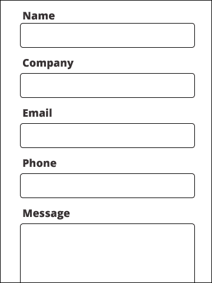
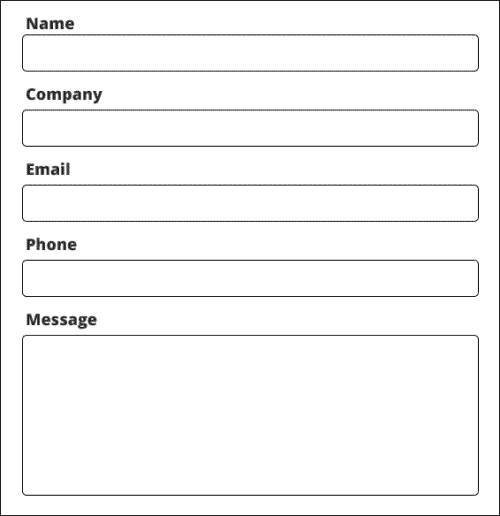
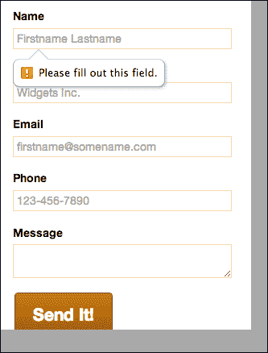
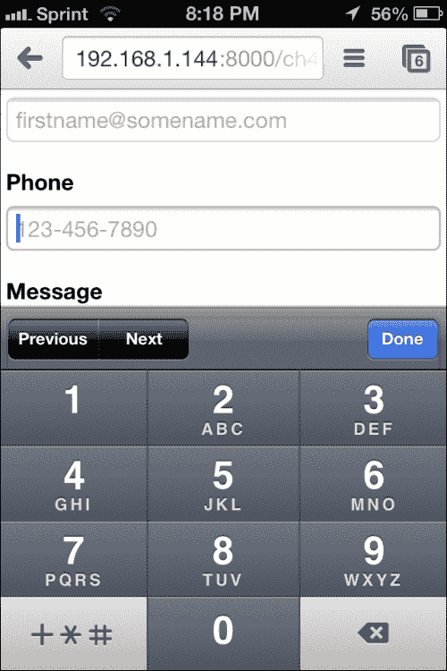
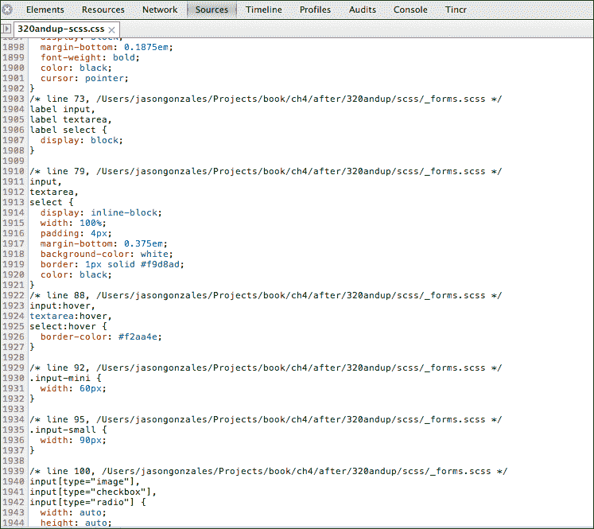

# 第四章：构建联系表格

在第三章中，*构建画廊页面*，我们建立了展示我们作品的页面。希望你在这些页面上展示的作品质量是如此引人注目，以至于网站访客会想要联系你，雇佣你的出色工作。

让我们让这个能力变得简单和有吸引力！

# 制定表格计划

我知道表格并不是很令人兴奋，但我们必须以某种方式获取用户信息，所以我们不妨让它们看起来漂亮一些，而不是呆板和冷冰冰。一个干净友好的表格将会简单而且最少，只收集我们需要的信息。我们还需要确保填写表格的过程尽可能清晰和没有挫折感。320 和 Up 框架被设计用来促进这些工作，但我们仍然需要进行必要的规划，以确保一切都恰到好处。

幸运的是，对于我们相当简单的需求来说，这并不会太困难。让我们考虑一下我们需要收集的最基本信息，以便跟进潜在客户。我们需要以下信息：

+   潜在客户的姓名

+   公司

+   电子邮件地址

+   电话号码

+   一条消息

需要牢记的一些重要事项是，确保所有字段的标签都让用户知道应该在哪个字段中输入什么。我认为一个可用表格最具有说服力的论点是这样的：

人们从左到右，从上到下阅读。因此，标签应该出现在它所描述的输入框的上方，因为用户会先读标签，然后看到输入框。当然，这是一个假设，即我们的用户理解定义表单输入的视觉线索。如果我们的用户不知道表单字段是什么，我们可能就没什么希望了。也就是说，值得思考的是，我们的用户界面在很大程度上依赖于人们理解约定！

在这张表格上，我们可以使用其他约定。一个常见的约定是使用占位符来向用户展示每个输入中期望的内容类型的示例。同样，这个约定对于任何长时间使用互联网的人来说都是众所周知的。希望这也可以对一些不太熟悉这些约定的人有所帮助。

## 处理必填字段

我们需要让用户知道的最后一件事是我们希望他们输入的必填字段。关于这个问题有两种看法；我会介绍两种，主要是因为我认为两种方法都有其优点，而且这真的取决于你在做什么。

一个约定是在所有必填字段旁边放置必填的 `*`。这个约定对大多数访客来说确实有效，但这种方法的问题在于，如果我们基本上注释了一些我们认为是可选的字段，可能会阻止收集一些信息。这个论点基本上声称，如果我们不要求消息并且不将其标记为必填，用户跳过这一部分的可能性就会增加。我们的表格绝对应该要求用户提交姓名和电子邮件；否则，我们根本无法回复。通常不要求电话号码或消息。将**电话**字段留作可选是对大多数人的一种礼貌，因为有些人不希望通过电话联系。将**消息**字段留作可选是对用户的一种礼貌。我们不想强制要求，因为一旦我们有了姓名和电子邮件，我们就可以随时回复，尽管我们的回复可能会非常通用。对于我们的潜在客户来说，了解我们下次交谈的背景是有帮助的。这样可以节省每个人的时间和精力。

考虑到这一点，我想介绍一下不遵循将字段标记为必填的约定的论点。论点如下：

如果我们作为网站的创建者，只在表单上放上我们绝对需要跟进的输入字段，那么表单应该足够简单，不会让用户感到沮丧。在我们的情况下，我们有五个字段，这是相当节俭的。然后，通过不标记任何字段为必填，我们表明我们想要我们所要求的所有信息，但实际上并不需要。然后我们可以使用表单验证来确保我们得到最基本的信息，而在我们的情况下将是姓名和电子邮件。

最终，这些决定考虑了许多其他因素。由于我们的作品集网站很可能是用于数字媒体工作，我们的受众应该熟悉网络惯例，我们可以利用这一点，为每个人带来一个干净、简单的表单。在其他项目中，你肯定需要迎合不同的受众或收集更多的数据。希望通过我对这个表单规划的讲解，能对你未来的决策有所帮助。

## 表单布局

好了，现在让我们继续讨论我们希望在断点上看到这个表单的样子。这将很容易，因为我们在这个页面上的重点是从潜在客户那里获取一些信息。因此，我们几乎可以在移动端和桌面端几乎完全相同的布局上得逞。

这是移动端的布局：



这是一个宽度大于 992 像素的布局示例：



很难把它们区分开来！我知道，如果有人在全宽度的新 Thunderbolt 上打开这个表单，输入字段会变得不必要地宽。但实际上，我们不需要也不希望页面上的其他内容干扰，所以我们会小小努力，让页面看起来仍然令人愉悦。

好了，说了这么多！让我们写些代码。

首先，让我们在表单上方放一个小的主体区域。我总是喜欢在我在网上创建的东西中添加人情味，所以在标题下方，让我们放置这个标记：

```html
<!--hero markup -->
  <div class="hero subhead">
    <div class="container">
      <h1>Say Hello!</h1>
      <p>I just met you and this is crazy. Leave your number, I'd love to work with you.</p>
    </div>
  </div>  <!--end hero markup -->
```

你可能应该在里面放上你自己的消息，但你明白我的意思。

之后，让我们放置表单所需的标记。我们将在主体之后使用的标记如下：

```html
<!--form -->  <div class="full row clearfix">
    <h2 class="h2">Hello! Is it me you're looking for?</h2>    <p>Reach out to me for your new projects.</p>
    <form method="post" action="#" class="contact">      
<p>
<label for="name">Name</label>
<input id="name" name="name" placeholder="Firstname Lastname" type="text" required/>
</p>
<p>
<label for="company">Company</label>
<input id="company" name="company" placeholder="Widgets Inc." type="text"/>
</p>   
<p>
<label for="email">Email</label>>>      
<input id="email" name="email" placeholder="firstname@somename.com" type="email" required/>
</p>
<p>         
<label for="phone">Phone</label>        
<input id="phone" name="phone" placeholder="123-456-7890" type="tel"/>      
</p>      
<p>         
<label for="message">Message</label>        
<textarea id="message" name="message"></textarea>      
</p>      
<p>         
<input type="submit" class="btn btn-primary btn-extlarge" value="Send It!" />      
</p>    
</form>  
</div>  
<!--end form -->
```

这个标记大部分都很直接，但我使用了略微主观的标记和良好的实践。首先，你会注意到，我没有为表单的`action`参数提供值，用于将表单数据提交到服务器。我会留给你来做，因为我们不会制作一个处理这些数据的后端（或者，你可以使用许多巧妙的服务之一，它们会为你处理联系和电子邮件表单）。

在代码下方，你会注意到我用`<p>` `</p>`标签包裹了每个标签和输入配对。这并不罕见，但这是一种处理表单布局的主观方式。如果可以避免，我更倾向于不给输入和表单控件添加样式。对于成长的网站，这可能会导致大量不可重用的工作。你可以通过依赖一些包裹表单控件的元素来消除或减少这一点。始终保持这些元素在语义上适当。我会认为标签和输入表单是段落的一部分，因为它们共享相同的主题，并且是内容主题的一个断点。

## 输入标签魔法

另外，特别是对于手机，始终要充分利用标签中的`for`属性，只有在将该参数的值设置为要与其关联的输入的 ID 的值相匹配时，它才起作用。换句话说，如果您的标签是**电子邮件**输入，给该输入一个 ID 为`email`（`id=email`），并将标签也设置为`email`（`name=email`）。这种做法不仅仅是语义化的，否则我可能就不会费心了。一旦以这种方式配对了输入和标签，一些神奇的事情就会发生。标签现在具有了魔力——当用户点击或触摸标签时，与其配对的输入将获得焦点。这个标准早在触摸界面上网的实践变得普遍之前就已经存在了，但对于触摸来说，这是一个很棒的功能！现在，手指粗的用户、手抖的用户或者动作不精确的用户更有可能击中目标。如果你以前不知道这一点，可以试一试。如果你已经知道了，希望你跳过了这一段；时间宝贵。

我还有一些事情要指出。我在所有我想要强制的字段上放置了`required`属性。这个属性是 HTML 5 规范中的新内容，在幕后做了一些很好的魔术。我们需要为不支持这一特性的浏览器做一些回退，但是您可以暂时享受 HTML 5 会让您作为 web 开发人员的工作比以前更容易的幻想（不用担心，您仍然需要编写一些 JavaScript 来帮助验证这个表单）。不过，一旦您的潜在用户几乎都在使用现代浏览器时（问题是，那会是什么时候？），这个功能将节省您的时间。无论如何，试一试吧。启动一个简单的服务器，比如 Python Simple HTTP 服务器，然后访问您当前状态的联系表单。不要费心填写表单，然后点击**发送**。如果您使用的是 Chrome，您会得到一个很好的验证错误消息，**请填写此字段**，在一个工具提示中：



其他浏览器的现代版本（Firefox、Safari 和 Internet Explorer）也会做类似的事情。在手机上也试一试吧，效果还不错！

好了，好玩的时间很快就会结束了，因为我们需要为不支持这一特性的浏览器做一些回退。但是，由于 HTML 5 规范，我们还有一些有趣的增强功能要添加。接下来，我想指出一些绝对轻松的增强功能，这些功能是通过一些 HTML 5 表单字段属性获得的。您会注意到，电子邮件输入的`type="email"`。这个属性给你带来了两种特殊的酱料。在桌面和手机上（当然是在支持的浏览器中），你会得到多年来我们在 JavaScript 中编写的电子邮件地址验证。它会寻找`@`等等。在手机上，它应该会打开一个软键盘，上面有一个醒目的`@`。

我们在 HTML 5 中使用的另一个带有新属性的字段是`type="tel"`属性。唯一的好处是，在手机上，它会弹出数字键盘而不是字母键盘。



对于在小屏幕上填写表单的可怜人来说，这真是一件好事。您的用户会感谢您。

现在，让我们添加我们需要的最小样式，使其看起来与我们的其他应用程序一致。一切看起来都很不错；唯一的例外是输入框的边框是橙色的。如果你使用 SASS，而且你的编译器写出了样式的行号，这将非常容易调试。我一直鼓励你一直使用 SASS，但我真的很喜欢的一点是在开发过程中打印出所有样式选择器的行号。你确实需要为生产编译压缩的 CSS，但对于开发，总是切换到便于调试的代码。我用 CodeKit 做这个，还有其他一些原因。我应该补充说，我通常使用开源的命令行工具。例如，我使用`tmux`和`vim`来编写代码，而不是独立的文本编辑器。但是 Codekit 有很多有用的功能，而且配置起来非常轻松，我真的很喜欢。我只希望它有一个命令行版本。

当我在 CSS 中解决问题时，CodeKit 让我的整天变得更容易。

当我查看这些古怪的橙色边框时，这是我在 Chrome 开发工具中看到的：



我看到边框属性在`_forms.scss`的第 79 行定义。非常有帮助，对吧？

不幸的是，这还不是故事的结局。当我到达那行代码时，这是我看到的：

```html
input,
textarea,select {
display : inline-block;
width : 100%;
padding : 4px;
margin-bottom : $baselineheight / 4;
background-color : $inputbackground;
border : $inputborderwidth $inputborderstyle $inputborder;
color : $textcolor;

&:hover {
border-color : $inputhover; }
}
```

我立刻注意到两件事。边框颜色是用变量`$inputborder`定义的，悬停时的边框颜色是用`$inputhover`定义的。在我看来，这些变量命名不够准确，但公平地说，我过去做得更糟。无论如何，如果我能在这里做出改进，那就是将这些变量命名为某种指出它们实际上是颜色变量的名称，比如`$inputbordercolor`和`$inputborderhovercolor`。当然，这些名字很长，但它们很准确。

好的，继续。我们需要去`_variables.scss`部分看看发生了什么。这些边框为什么是橙色，天哪？不要惊慌，帮助就在眼前。进入`_variables.scss`文件，我快速搜索了`$inputborder`，这是我看到的：

```html
$inputborder    : lighten($basecolor, 40%);
```

让我们思考一下代码中发生了什么。对于许多设计来说，使用基本颜色作为输入边框可以创建和谐的设计。但是，在我的例子中，我选择了一种略带黄橙色的颜色，这使得边框的对比度相当低。老实说，它们让我感到很烦人；我无法想象对视觉有挑战的人来说会是什么样子。而且，我猜 90%的时间，我希望我的输入边框是灰色的。为什么呢？嗯，对于像创建表单这样关键的事情，我希望确保字段用高对比度的颜色清晰定义，而在白色背景下，最大的对比度是黑色。如果`#000`黑色看起来太刺眼，我们总是可以选择接近黑色的深灰色。在这一点上，我认为最好为这个设计（也许将来的其他设计）重新定义这个变量为某种灰色。

让我们试试这个：

```html
$inputborder    : $lightgrey;
```

我实际上尝试了这个变量文件中定义的所有灰色，我更喜欢浅灰色。它有助于使行看起来更有条理。到目前为止，你可能已经注意到的另一件事是，当你在输入上悬停时，边框仍然会变成橙色。让我们改成更深的灰色。与之前类似，你会注意到`input:hover`样式是在`_forms.scss`文件中定义的。它看起来是这样的：

```html
&:hover {
    border-color : $inputhover; }
```

现在我们去`_variables.scss`文件重新定义`$inputhover`！

让我们这样做：

```html
$inputhover     : $grey;
```

看起来不错！

我们只需要做一些微调，就可以让这个页面的样式更加完美。让我们让输入框看起来更漂亮，并且在移动浏览器中呈现输入框的方式更加一致。你会注意到在之前的屏幕截图中，iPhone 上的表单（或者如果你在自己的移动设备上检查你的工作）自动获得了圆角。让我们设置一个样式在我们的表单页面中做到这一点。

我想要改变整个网站上的所有输入框，所以我要去编辑`_forms.scss`文件。

更新这个样式：

```html
input,
 textarea,
 select {
 display : inline-block;
 width : 100%;
 padding : 4px;
 margin-bottom : $baselineheight / 4;
 background-color : $inputbackground;
 border : $inputborderwidth $inputborderstyle $inputborder;
 color : $textcolor;
 @include rounded(6px); //this is the new bit

 &:hover {
 border-color : $inputhover; }
}
```

在使用`rounded mixin`时，我喜欢 6 像素，但随意调整到你喜欢的样子。我想要改变这些输入框的另一件事是填充。拥有一个大目标很好，但它们也可以在单词和输入框边框之间留出一些空间。就在`rounded mixin`下面，让我们添加一些填充：

```html
padding: 10px;
```

看起来好多了！

我们在这个页面上的最后一个样式任务是限制表单的宽度。让我们保持表单不要超过 992 像素，并保持它居中。

实际上，我们可以在不使用任何`@`媒体查询的情况下做到这一点。让我们回到`site.scss`文件，并添加一个样式，如果我们想要重用它，它将起到相同的作用：

```html
.row {
  max-width: 992px;
  margin: 0 auto;
}
```

这正是我之前描述的。这实际上是一个很好的例子，说明了如何考虑响应式而不一定依赖于更新的标准。

好的，现在我们需要做的最后一件事是去连接验证，以便在尚未支持 HTML 5`required`属性的浏览器中起作用。

## JS 验证回退

嗯，我们可以写出所有的回退。知道如何写回退是非常有用的，但这超出了本书的范围。另外，有一种非常棒的方法可以使用已经制作好的回退。它叫做**webshims**，你可以在这里找到它：[`afarkas.github.io/webshim/demos/index.html`](http://afarkas.github.io/webshim/demos/index.html)。

这个库使得非常容易利用许多 HTML 5 功能，而无需为旧浏览器编写大量支持。在我们的情况下，我们将不需要做太多工作来支持表单中的 HTML 5 验证。

从我之前列出的网站上下载库。一旦你这样做了，将`js-webshim`文件夹复制到你的项目中。我已经在本章的`after`文件夹中完成了这个操作。

现在，我们还需要做两件事，然后就可以了。

在`contact.html`页面的底部包含`webshims`库中的`polyfiller`脚本：

```html
<script src="img/polyfiller.js"></script>
```

你必须把它放在 jQuery 之后，但在你写的脚本之前。

现在在`script.js`中，添加这一行来实例化`polyfiller`脚本：

```html
$.webshims.polyfill();
```

我已经把它放在`ready`函数中，以确保所有的表单元素在**文档对象模型**（**DOM**）中出现之前就已经触发了。

现在，我们已经完成了对表单验证的 polyfill，并且它应该在不支持 HTML 5 验证的浏览器中起作用。享受吧！

# 总结

因此，在本章中，我们计划了比我们其他页面更简单的布局，但有充分的理由。没有人喜欢填写表单，但如果我们可以在具有表单的页面上减少噪音，我们就可以鼓励用户提供信息，以更好地促进沟通。或者至少，我们不会阻止人们填写我们的表单。

可能，这里最大的挑战是客户端验证的跨浏览器支持。在大多数用户使用现代浏览器之前，我们仍然需要进行 shim 和 polyfill，但正如我们所看到的，写得很好的代码也使这变得相当容易，除非我们的要求很复杂。

接下来，让我们继续**关于我**页面。
