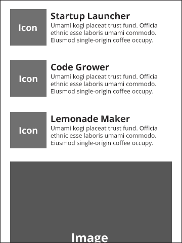
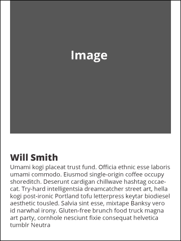
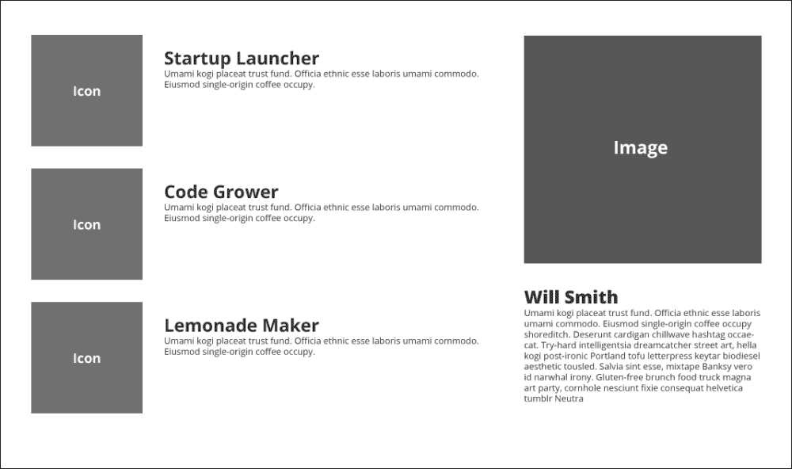

# 第五章：建立关于我的页面

在上一章中，我们为客户建立了一个联系我们的表单潜力。这只是当前模型的组合中的一部分，无论是个人业务还是其他任何业务用途的投资组合网站。这个约定的最后一个方面是“关于我”页面。这可能是我经常看到的最不重要的页面，我经常不得不与在他们的网站这一角落做一些相当奇怪的事情的客户进行咨询。也就是说，我认为这通常是出于好意的。

但在我们回到设计和编码之前，我想提出关于“关于我”页面的赞成和反对的观点。

# 证明“关于我”页面的必要性

每个人都希望他们的网站能够实现看似两种相互冲突的目标，这些目标如下：

+   目标 1：我们是专业人士。这是我们的工作和我们的业绩。我们与我们的竞争对手不同。

+   目标 2：我们只是普通人！我和你一样！我们的血液在流动，就像你一样！

所以，从修辞学的角度来说，这其实是有道理的，对吧？你想要与你的观众建立情感联系。这在修辞学的研究中被称为感情。如果你没有建立情感联系，获得客户或销售的可能性肯定会减少。但是，信不信由你，我真的很享受与人交流，听他们的经历，我真的很享受帮助他们解决问题。此外，我发现以一种传达我的温暖和人性的方式（无论是通过网络还是其他任何方式）进行交流是令人满意的（希望我对这一点是正确的）。我可以在做这件事的同时赚钱，这真是太棒了。

我并不是一个罕见的品种。尽管有一些愚蠢的刻板印象，我发现网页开发人员是非常社交的人，也喜欢技术。那么，为什么我们制作的软件中缺乏个性和人情味呢？不知道。但我在这里要为更多的个性辩护。作为任何技术的用户，任何被设计来承认我的人性和我生活的实际状况的东西都会让我感到高兴。它们可以给你带来一刻愉悦或深刻的满足体验。

所有这些都是为了说“关于我”页面是一个很好的地方来为自己（无论是个人还是集体）提供光明，但这只是与观众建立联系的一种策略。但是，如果在到达“关于我”页面之前你还没有与你的观众建立联系，在当前的用语中，“你做错了”。如果你的客户要求你这样做，你还是做错了。对我来说，给网站注入正确的语气以及使网站真正可用是很重要的。对于投资组合网站来说，这是非常容易被欺骗的，因为惯例已经相当成熟。对于这本书，我们只是利用惯例快速制作了“关于我”页面。但最终，这只是一个框架。你需要有创意，而不要过度，通过为你的网站添加令人惊讶的东西，或者可能只是一个令人难忘的惊喜。希望使用一个快速、简单的框架能给你更多的时间和大脑空间来做这些。我对框架的最大担忧是，它们促进了几乎无法区分的网站的快速制作。

所以，我的真正观点是，确实有一个“关于我”页面，做得好，但也要确保整个网站也是关于你的。这需要更多的工作，也存在风险，但我认为最终是值得的。另一件事是，这本书并不真正涉及这个问题；我不打算教你如何创建“关于我”页面，尽管这是本章的主要内容。这确实值得一整本书来关注，更不用说一本不那么技术性的书了。所以我提前道歉，这一章主要是关于如何布置这个页面的。

话虽如此，让我们开始设计这个页面。我们将在这个页面上需要的内容类型非常简单。它将包括以下内容：

+   关于我们将要提供的服务的一些细节。

+   公司成员的照片。对于这种情况，我们将假设数量不多，但包括处理更多数量的策略。显然，如果只有你一个人，你只需要一张照片。让它很好；一些简介的文字，既简洁又有意义。

# 制作线框图

让我们来看看这个页面的一些线框图。在这些示例中，我将假设这是一个个人作品集网站。但如果你有一个小团队，你可能会想重新考虑这个布局。我们稍后会讨论更多。现在，这是移动视图的线框图。首先是页面的顶部部分（在标语牌下面，这将保持一致）：



请注意，我们列出并堆叠了三项服务。我们将使用一组包含的图标来制作大的、引人注目的图标，放在每个服务/技能描述的左侧。在图标下面，我们将放上必不可少的头像和简介：



现在我们将如何在更宽的桌面布局上使用相同的内容：



我们将使用此页面的更宽布局将一些内容放在侧边栏上。这样做的好处是让用户在不滚动的情况下看到更多内容。

# 标记

让我们从这个页面的标记开始。这个页面将面临一个特殊的技术挑战，因为 320 and Up 没有提供制作这种侧边栏的方法，也不是真的打算这样做。其他框架如 Bootstrap 和 Foundation 有这样的功能。不过我们将自己解决这个问题。没有必要引入整个框架来解决这个单一问题。话虽如此，我将从这些框架如何解决这个问题中汲取灵感。

为了解决这个问题，让我们从移动布局的一些相当基本的标记开始。首先，让我们添加另一个标语牌（不过不要流泪；在将来你可以做任意多个）。

```html
<!--hero markup -->
<div class="hero subhead">
  <div class="container">
    <h1>Let's Talk About Me.</h1>
    <p>Read on to learn about my special powers.</p>
  </div>
</div>
<!--end hero markup -->
```

希望到目前为止这一切都是有意义的。现在让我们为主要区域添加我们的第一部分标记，描述我们所提供的所有内容。我们知道我们需要以下内容：

+   一个包装器，用于所有内容，这样我们可以根据不同的屏幕宽度对页面内容进行填充和设置宽度

+   主要内容和侧边栏内容的包装器，出于与前一点相似的原因

+   各种容器和所有实际内容的标记

所以让我们开始吧。让我们在标语牌下面放上这个标记：

```html
<!--main content -->
<div class="full summary">
  <div class="main-content">
    <div class="content-item">
      <div class="circle pull-left">
        <i class="icon-fire big-icon"></i>
      </div>
      <div class="content-body">
        <h4 class="content-heading">Startup Igniter</h4>
        <p>Umami kogi placeat trust fund. Officia ethnic esse laboris umami commodo. Eiusmod single-origin coffee occupy.</p>
    </div>
  </div> <!--end content-item -->
  <div class="content-item">
    <div class="circle pull-left">
      <i class="icon-leaf big-icon"></i>
    </div>
    <div class="content-body">
      <h4 class="content-heading">Code Grower</h4>
      <p>Umami kogi placeat trust fund. Officia ethnic esse laboris umami commodo. Eiusmod single-origin coffee occupy.</p>
    </div>
  </div><!--end content-item -->
  <div class="content-item">
    <div class="circle pull-left">
      <i class="icon-lemon big-icon"></i>
    </div>
    <div class="content-body">
      <h4 class="content-heading">Lemonade Maker</h4>
      <p>Umami kogi placeat trust fund. Officia ethnic esse laboris umami commodo. Eiusmod single-origin coffee occupy.</p>
    </div>
  </div><!--end content-item -->
</div>
  <div class="sidebar-content">

  </div>
</div>
<!--end main content -->
```

我们重新使用了`.full`类，该类在所有主要内容上应用相同的样式，主要是填充和边距。我也创建了许多新类。现在它们还没有样式，但在我继续并为它们添加样式之前，让我解释一下我的想法。

在`.full`之后的下一个容器是`.main-content`容器。在移动视图中它不会做太多事情，但随着布局变得更宽，我们将为其分配一个大小并浮动它，以便有空间将`.sidebar-container`浮动到右侧（剧透）。

在`.main-content`容器内，我们将有三个内容块，包括一个图标、一个标题和一些文字。我给每个块都加上了`.content-item`类。在这个类内部，有一个`div`标签，我将把它改成一个圆圈（至少对于现代浏览器来说），用来装饰图标。接着是`content-body` `div`类，它将包含一个标题和我想描述的特殊能力的简短介绍。根据需要重复使用`content-items`类，但我喜欢三个一组。三毕竟是一个神奇的数字。

请注意，我使用了框架中的`icon`类。它们使用`font-awesome`字体。它们非常容易实现，并且在我们开始对它们进行样式设置时，您将看到它们非常灵活。要使它们出现在您的标记中，您只需要向您的标记添加相应的类。我将这些类添加到`<i>`标记中，这是一种约定，但只要标记有意义，您也可以在`<span>`标记、`<a>`标记或其他标记上使用它们。您会注意到我还在每个图标上添加了`.big-icon`类。这是因为我预计我将需要一个额外的样式来使这些图标变大，并为更大的布局添加一些其他样式。接下来，让我们利用 320 和 Up 附带的图标字体集。

# 令人敬畏的图标字体

以后参考一下`_font-awesome.scss`（或类似的）文件，您会看到所有图标的列表，这些图标是通过样式创建的，以便使用`font-awesome`图标字体。这些对我们来说只是预先准备的，但如果您需要一个已添加到`font-awesome`的新图标，您需要将其添加到此列表中（或者自己创建一个列表）。您会注意到图标实际上是用`content`属性指定的。例如，柠檬图标的 CSS 如下所示：

```html
. icon-lemon:before              { content: "\f094"; }
```

这是因为图标是用 Unicode 字符`F094`指定的。您可以在[`fortawesome.github.io/Font-Awesome/icons/`](http://fortawesome.github.io/Font-Awesome/icons/)上查找。只需单击每个图标，了解一些关于每个图标的更多信息。

我们在这里的时候，让我们快速看一下支持这些图标字体的其他内容。在`_font-awesome.scss`表的顶部，您会看到任何以`icon-`开头的类都会默认获得一些样式。这是用以下样式指定的：

```html
[class^="icon-"],
[class*=" icon-"] {
display : inline;
width : auto;
height : auto;
line-height : inherit;
vertical-align : baseline;
background-image : none;
background-position : 0 0;
background-repeat : repeat; }
```

前面的代码针对任何以`icon-`开头或包含`icon-`的内容。这是通过正则表达式`^`和`*`完成的。正则表达式是正则表达式的缩写。正则表达式是用于搜索字符串的实用程序；它们使用各种符号来完成此任务。正则表达式是一个超出本书范围的巨大主题，但只需知道，通过在 CSS 中使用这些符号，CSS 引擎会在您的标记中搜索选择器字符串。并非所有可用的正则表达式符号都可以在 CSS 中使用，但使用`^`和`*`可能非常强大。

继续阅读，您会发现如果在`<li>`或`<a>`元素上使用这些类，还会应用其他样式。甚至还为将元素放在按钮或`<li>`标签内定义了特殊样式。我们不会使用这些，但请尝试使用它们。

如果您继续刷新页面，这看起来可能不太好；所以让我们开始为 320 和 Up 布局设置样式。我想要做的第一件事是制作将容纳我们图标的圆圈。我希望所有这些圆圈的大小都相同，所以我将设置一个统一的大小，以及我将在一会儿解释的其他一些样式：

```html
.circle {
  background: #FFA500;
  @include rounded(28px);
  height: 56px;
  width: 56px;
  position: relative;
}
```

我实际上是通过一些试错得出这些尺寸的，但我不会让您感到无聊。边框半径设置为元素高度和宽度的一半。这是制作圆圈的方法。显然，使用旧浏览器的人会得到一个正方形。如果您对此不满意，可以放置某种`polyfill`或回退。请注意，我使用 mixin 来制作特定于供应商的边框半径，但如果您使用纯 CSS，您将需要键入所有这些。

最后，我将这些图标的`position`设置为`relative`，这样我就可以绝对定位每个图标在圆圈内。它们都有不同的尺寸，所以它们将各自获得一个独特的位置来适应这一点。

让我们继续对它们进行样式和定位。将这些样式放在`.circle`样式下面：

```html
.big-icon {
  font-size: 2em;
  color: #FFF;
  text-shadow: -1px -1px #999;
  position: absolute;
  &.icon-fire {
    top: 15px;
    left: 18px;
}
  &.icon-leaf {
    top: 16px;
    left: 13px;
  }
  &.icon-lemon {
    top: 15px;
    left: 16px;
  }
}
```

前面的代码是 SCSS 代码。这是常规 CSS 的样子：

```html
.big-icon {
  font-size: 2em;
  color: #FFF;
  text-shadow: -1px -1px #999999;
  position: absolute; }
  .big-icon.icon-fire {
    top: 15px;
    left: 18px; }
  .big-icon.icon-leaf {
    top: 16px;
    left: 13px; }
  .big-icon.icon-lemon {
    top: 15px;
    left: 16px; }
```

`.big-icon`样式只是使图标变大，白色，并带有一点阴影，使它们看起来像是被轻微压印到圆圈中。我认为这是一种很酷的效果。我还在这里将`position`设置为`absolute`，以确定所有图标的位置。我通过数学和用眼睛看的方式得出了所有图标的位置。

这是数学方法。在浏览器的开发者工具中查看图标的尺寸。以火焰图标为例，我看到它的尺寸为 22 x 25 像素。因此，要获得左侧定位，我从圆的宽度中减去图标的宽度，即 56 - 22 = 34。将其除以 2 以获得左侧位置，因为左侧位置在图标的左上角，所以我们需要从图标的左边缘到图标中心的距离。这给我们一个左侧位置为 17 像素。但后来我用眼睛看了看，觉得 18 像素更好，真是奇怪。对于剩下的图标也是如此。

现在，我们需要将文本定位在每个图标的右侧。看起来是这样的：

```html
.content-body {
  overflow: hidden;
  .content-heading {
    margin: 0 0 5px;
  }
}
```

这很简单。唯一可能看起来奇怪的是`overflow: hidden`。它所做的就是确保文本保持在一个整洁的小框中，而不是围绕图标`div`流动。要了解更多信息，你可以咨询谷歌，但你可以参考[`alistapart.com/article/css-floats-101`](http://alistapart.com/article/css-floats-101)上的一篇精彩文章。

继续刷新页面并查看。看起来非常棒，但图标离文本太近了。让我们来修复一下。将以下代码添加到你的圆形样式中：

```html
.circle {
  margin-right: 12px; /* this is the new bit */
  background: #FFA500;
  @include rounded(28px);
  height: 56px;
  width: 56px;
  position: relative;
}
```

啊！现在看起来很好！让我们继续添加我们的图片和简介。这是我们需要的标记：

```html
<!-- sidebar content -->
<div class="full bio">
  <div class="sidebar-content">
    <div class="image-container">
      
    </div>
    <div class="bio-container">
      <h3>Will Smith</h3>
      <p>Seitan gastropub jean shorts DIY, shabby chic scenester flannel umami. Keffiyeh freegan small batch Neutra before they sold out, literally salvia 8-bit. Flannel trust fund swag Austin, locavore sustainable irony. Fingerstache pop-up readymade Schlitz try-hard. Roof party 3 wolf moon forage Schlitz, butcher squid Pinterest cardigan seitan. Cray YOLO helvetica, cliche tattooed single-origin coffee selvage food truck gastropub. Disrupt McSweeney's ugh put a bird on it.</p>
    </div>
  </div>
</div>
<!-- sidebar content -->
```

请注意，我们正在使用用于画廊页面的大占位图像，但当然你需要使用自己喜欢的时尚照片。说到画廊页面，我们需要在这里使用一些类似的样式来使图像和文本看起来正确。由于我们在两个部分都重复使用了`full`类，因此在生物内容和视口边缘之间有适当的空间。我们只需要在图像下方添加一个边距来将标题推下来。添加这个样式：

```html
.image-container {
  margin-bottom: 2em;
}
```

根据你的喜好随意调整边距。

在 320 像素宽度下查看这个布局，一切都很好。当屏幕宽度为 992 像素或更大时，让它布局为两列。继续调整浏览器大小到 992 像素（或者在平板电脑上查看）。看起来很奇怪。幸运的是，我们只需要为这些分配适当的百分比宽度并浮动它们。尝试添加这些样式：

```html
.summary {
  width: 55%;
  float: left;
}

.bio {
  width: 35%;
  float: right;
}
```

现在我们可以在每个内容块上使用`summary`和`bio`类。继续刷新，你会注意到页脚现在试图挤进两列之间的小区域。很容易解决。只需在`_site.scss`文件中的页脚样式中添加这个样式：

```html
clear: both;
```

修复了！

好了，就这些了！

# 总结

在本章中，我们学会了使用图标字体并对其进行样式设置，使其看起来和位图图像一样出色；然而，它们更加灵活，因为我们可以通过 CSS 调整大小、颜色，并添加简单的阴影等效果。我们还迅速制作了一个自定义布局来满足我们的内容需求。太棒了！现在去利用我们所做的事情为自己和客户构建出色的东西吧！
