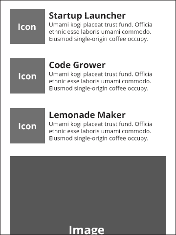

# 五、构建关于我的页面

在前一章中，我们为客户建立了一个潜在的联系方式。这只是投资组合网站当前模型公式的一部分，无论是用于个人业务还是任何其他业务用途。这个约定的最后一个方面是**关于我**页面。这可以说是我经常看到的最不重要的页面，我不得不咨询那些在他们网站的这个角落做非常奇怪的事情的客户。话虽如此，我认为通常是善意的。

但是在我们回到设计和编码之前，我想提出一个支持和反对**关于我**页面的论点。

# 证明“关于我”页面的合理性

每个人都希望他们的网站能够满足两个看起来相互冲突的目标，如下所示:

*   目标 1:我们是专业人士。这是我们的工作和记录。我们不同于我们的竞争对手。
*   目标 2:我们只是人！我也和你一样！我们的血管里流淌着温暖的血液，就像你一样！

所以，从修辞上来说，这其实很有道理，对吧？你想和你的观众建立情感联系。这就是修辞学研究中的哀婉。如果你没有建立情感联系，获得客户或销售的可能性肯定会降低。但是，信不信由你，我只是真心喜欢与人交流，听他们的经历，我真的很喜欢帮助他们解决问题。此外，我发现以传达我的温暖和人性的方式交流(无论是通过网络还是任何其他方式)是令人满意的(希望我是对的)。我可以一边做一边赚钱，这太棒了。

我不是稀有品种。尽管有一些愚蠢的刻板印象，但我发现网络开发人员是非常社会化的人，他们也喜欢技术。那么，为什么我们制作的这么多软件缺乏个性和人情味呢？不知道。但是我在这里要为它争论更多。作为任何技术的使用者，任何旨在认可我的人性和我的实际生活条件的东西都会让我快乐。它们可以给你一个快乐的时刻或令人深感欣慰的经历。

所有这些都是说**关于我**页面是一个很好的地方来展示你自己(无论是个人还是集体)，这只是一个与你的观众联系的策略。但是如果你还没有和你的观众建立联系，当你到达**关于我**的页面时，用现在的话来说“你做错了”。如果你的客户要求你这样做，你还是做错了。对我来说，给网站注入正确的基调以及让网站真正可用是很重要的。对于投资组合网站来说，这看起来很容易，因为约定已经相当成熟了。对于这本书，我们刚刚用惯例快速制作了**关于我**页面。但归根结底，这只是一个框架。这取决于你的创造力，而不是过度紧张，通过添加令人惊讶的事情，或者可能只是一个令人惊讶的难忘的事情到你的网站。希望使用一个快速、简单的框架能给你更多的时间和大脑空间去做这件事。我对框架最大的恐惧是它们促进了几乎无法区分的网站的快速生产。

所以，我真正的观点是，一定要有一个**关于我**的页面，做好它，但要确保整个网站也是关于你的。这需要更多的工作，也有风险，但最终我认为这是值得的。另一件事是这本书并不是真的关于这个；我不会教你如何创建【关于我的 T2】页面，虽然这是本章的主题。这确实值得整本书的关注，更不用说一本不太专业的书了。所以我提前道歉，这一章主要是关于如何布局这一页。

说到这里，让我们开始设计这个页面。我们在这个页面上需要的内容将非常简单。它将包括以下内容:

*   关于我们将要提供的服务的一些细节。
*   公司成员的形象。在这种情况下，我们将假设一个较小的数字，但包括一个处理较大数字的策略。显然，如果这只是你，你只需要一张照片。把它做好；一些生物文本，一些时髦但有意义的东西。

# 制作线框

让我们来看看本页的一些线框。对于这些例子，我将假设这是一个一个人的投资组合网站。但是如果你有一个小组，你可能会想重新考虑这个布局。我们稍后将对此进行更多讨论。现在，这里是移动视图的线框。首先，页面的顶部(字幕下，保持一致):



请注意，我们已经列出并堆叠了三个服务。我们将使用包含的图标集在所描述的每个服务/技能的左侧制作大而醒目的图标。在图标下方，我们将放置强制性的头像和简历:


下面是我们将如何在更宽的桌面布局上使用相同的内容:


我们将使用这个页面更宽的布局来把一些内容放到侧边栏上。这样做的好处是让用户不用滚动就能看到更多的内容。

# 标记

让我们从本页的标记开始。这个页面将有一个特殊的技术挑战，因为 320 和 Up 都没有提供一种制作这种侧边栏的方法，也不是它真正想要的。其他框架，如 Bootstrap 和 Foundation，都有这个功能。不过，我们会推出自己的解决方案。不需要引入一个完整的框架来解决这个单一的问题。话虽如此，我将从这些框架是如何做到这一点上得到启示。

为了解决这个问题，让我们从一些基本的移动布局标记开始。首先，让我们添加另一个，我们的最后一个，字幕(不要流泪，虽然；以后想做多少就做多少)。

```html
<!--hero markup -->
<div class="hero subhead">
  <div class="container">
    <h1>Let's Talk About Me.</h1>
    <p>Read on to learn about my special powers.</p>
  </div>
</div>
<!--end hero markup -->
```

希望现在这一切都有意义了。现在，让我们为主要区域添加第一点标记，描述我们必须提供的所有内容。我们知道我们需要以下东西:

*   所有内容的包装，因此我们可以根据不同屏幕宽度的需要填充和设置页面内容的宽度
*   主内容和侧边栏内容的包装器，原因与前一点类似
*   所有实际内容的各种容器和标记

就这样了。让我们把这个标记放在字幕下面:

```html
<!--main content -->
<div class="full summary">
  <div class="main-content">
    <div class="content-item">
      <div class="circle pull-left">
        <i class="icon-fire big-icon"></i>
      </div>
      <div class="content-body">
        <h4 class="content-heading">Startup Igniter</h4>
        <p>Umami kogi placeat trust fund. Officia ethnic esse laboris umami commodo. Eiusmod single-origin coffee occupy.</p>
    </div>
  </div> <!--end content-item -->
  <div class="content-item">
    <div class="circle pull-left">
      <i class="icon-leaf big-icon"></i>
    </div>
    <div class="content-body">
      <h4 class="content-heading">Code Grower</h4>
      <p>Umami kogi placeat trust fund. Officia ethnic esse laboris umami commodo. Eiusmod single-origin coffee occupy.</p>
    </div>
  </div><!--end content-item -->
  <div class="content-item">
    <div class="circle pull-left">
      <i class="icon-lemon big-icon"></i>
    </div>
    <div class="content-body">
      <h4 class="content-heading">Lemonade Maker</h4>
      <p>Umami kogi placeat trust fund. Officia ethnic esse laboris umami commodo. Eiusmod single-origin coffee occupy.</p>
    </div>
  </div><!--end content-item -->
</div>
  <div class="sidebar-content">

  </div>
</div>
<!--end main content -->
```

我们重新使用了`.full`类，该类对我们所有的主要内容应用相同的样式，主要是填充和边距。我也创建了很多新的类。现在还没有适合他们的风格，但是让我解释一下我的想法，然后再继续设计。

`.full`之后的下一个容器是`.main-content`容器。它在移动视图中不会有太大的作用，但是随着布局变得更宽，我们会给它分配一个尺寸并浮动它，这样就有空间将`.sidebar-container`浮动到右边(剧透警告)。

在`.main-content`容器中，我们将有三大块内容，包括一个图标、一个标题和一些文本。我给每一大块都上了课`.content-item`。在这个类中，有一个`div`标签，我将把它变成一个圆圈(无论如何，对于现代浏览器来说)来框住图标。接下来是`content-body` `div`课，将会有一个标题和一个简短的介绍，我想描述一下我的特殊能力。冲洗并重复`content-items`课，随你喜欢，但我喜欢三套。三毕竟是个神奇的数字。

请注意，我使用的是框架中的`icon`类。他们使用`font-awesome`字体。它们非常容易实现，并且非常灵活，当我们开始设计它们时，您会看到这一点。要让它们出现在您的标记中，您所需要做的就是向标记中添加适当的类。我将这些类添加到`<i>`标签中，这是一种约定，但是只要标记有意义，您就可以很容易地在`<span>`标签、`<a>`或任何其他标签上使用它们。你会注意到我还在每一个上面增加了`.big-icon`类。这是因为我预计我将需要一个额外的风格，使这些大，并增加一些其他的风格，为更大的布局。接下来，让我们利用 320 和更高版本附带的图标字体集。

# 超赞的图标字体

为了将来参考，看一下`_font-awesome.scss`(或类似的)文件，你会看到一个由样式创建的所有图标的列表，以便于使用`font-awesome`图标字体。这些只是为我们预先准备的，但是如果你需要一个已经添加到`font-awesome`的新图标，你需要把它添加到这个列表中(或者你自己制作的一个)。你会注意到图标实际上是用`content`属性指定的。例如，柠檬图标 CSS 看起来如下:

```html
. icon-lemon:before              { content: "\f094"; }
```

这是因为图标是用 Unicode 字符`F094`指定的。你可以在[http://fortawesome.github.io/Font-Awesome/icons/](http://fortawesome.github.io/Font-Awesome/icons/)找到这个。只需点击每个图标，了解每个图标的更多信息。

在这里，让我们快速了解一下还有什么支持这些图标字体。在`_font-awesome.scss`表单的顶部，您会看到任何以`icon-`开头的类都会默认获得一些样式。用此样式指定的:

```html
[class^="icon-"],
[class*=" icon-"] {
display : inline;
width : auto;
height : auto;
line-height : inherit;
vertical-align : baseline;
background-image : none;
background-position : 0 0;
background-repeat : repeat; }
```

前面的代码针对的是以`icon-`开头或包含`icon-`的任何内容。这是通过正则表达式`^`和`*`完成的。正则表达式的简写。正则表达式是搜索字符串的工具；他们使用各种符号来完成这项任务。 Regex 是本书范围之外的一个巨大话题，但请记住，通过在 CSS 中使用这些符号，CSS 引擎会在您的标记中搜索选择器字符串。并非所有可用的正则表达式符号都可以在 CSS 中使用，但是`^`和`*`的使用可以相当强大。

继续阅读，你会发现如果你在`<li>`或`<a>`元素上使用这些类，会应用额外的样式。甚至还有特殊的样式被定义用于将元素放入按钮或`<li>`标签中。我们不会使用这些，但请用它们做实验。

如果你继续刷新你的页面，这看起来不会太棒；因此，让我们继续为 320 和 Up 布局设计这种样式。我想做的第一件事是做一个可以容纳我们图标的圆圈。我希望所有这些圆的大小都相同，所以我将设置一个统一的大小以及几个其他样式，稍后我将解释:

```html
.circle {
  background: #FFA500;
  @include rounded(28px);
  height: 56px;
  width: 56px;
  position: relative;
}
```

实际上，我是通过一点点尝试和错误达到这些维度的，但我不会让你厌烦。边框半径设置为元素高度和宽度的一半。这就是制作圆的方法。显然，使用旧浏览器的人会得到一个方块。如果你对此不满意，你可以采取某种`polyfill`或回退措施。请注意，我使用了 mixin 来制作供应商特定的边框半径，但是如果您使用普通 CSS，您将需要键入所有这些。

最后，我将这些图标上的`position`设置为`relative`，这样我就可以在圆圈内绝对定位每个图标。他们都有不同的维度，所以他们每个人都会有一个独特的位置来适应。

让我们继续进行造型和定位。将这些样式放在`.circle`样式下面:

```html
.big-icon {
  font-size: 2em;
  color: #FFF;
  text-shadow: -1px -1px #999;
  position: absolute;
  &.icon-fire {
    top: 15px;
    left: 18px;
}
  &.icon-leaf {
    top: 16px;
    left: 13px;
  }
  &.icon-lemon {
    top: 15px;
    left: 16px;
  }
}
```

之前的代码是 SCSS 代码。以下是普通 CSS 的样子:

```html
.big-icon {
  font-size: 2em;
  color: #FFF;
  text-shadow: -1px -1px #999999;
  position: absolute; }
  .big-icon.icon-fire {
    top: 15px;
    left: 18px; }
  .big-icon.icon-leaf {
    top: 16px;
    left: 13px; }
  .big-icon.icon-lemon {
    top: 15px;
    left: 16px; }
```

`.big-icon`样式只是使图标变得更大，白色，并带有一点阴影，使它们看起来像是被微妙地浮雕到圆圈中。我认为这是一种很酷的效果。我还将所有图标的`position`设置为`absolute`。通过数学和目测的结合，我到达了图标的所有位置。

以下是的数学方法。在浏览器中查看开发者工具中的图标，我得到了尺寸。例如，使用 fire 图标，我看到它的尺寸是 22 x 25 像素。所以为了得到左边的定位，我用圆圈的宽度减去图标的宽度，也就是 56–22 = 34。除以 2 得到左边的位置，因为左边的位置在图标的左上角，所以我们需要从图标的左边缘到图标中心的距离。这给了我们一个 17 像素的左边位置。但是后来我看了一下，更喜欢 18 px，继续。冲洗并重复其余图标。

现在，我们需要将文本放在每个图标的右边。看起来是这样的:

```html
.content-body {
  overflow: hidden;
  .content-heading {
    margin: 0 0 5px;
  }
}
```

这很简单。唯一看起来奇怪的是`overflow: hidden`业务。它所做的只是确保文本保持在一个整洁的小盒子里，而不是在图标`div`周围流动。要了解更多信息，你应该咨询谷歌，但你可以参考[http://alistapart.com/article/css-floats-101](http://alistapart.com/article/css-floats-101)的一篇精彩文章。

继续刷新页面，看一看。看起来很棒，但是图标离文本太近了。我们来解决这个问题。将以下代码添加到您的圆形样式中:

```html
.circle {
  margin-right: 12px; /* this is the new bit */
  background: #FFA500;
  @include rounded(28px);
  height: 56px;
  width: 56px;
  position: relative;
}
```

啊！现在看起来不错！让我们继续添加我们的图片和简历。以下是我们需要的标记:

```html
<!-- sidebar content -->
<div class="full bio">
  <div class="sidebar-content">
    <div class="image-container">
      
    </div>
    <div class="bio-container">
      <h3>Will Smith</h3>
      <p>Seitan gastropub jean shorts DIY, shabby chic scenester flannel umami. Keffiyeh freegan small batch Neutra before they sold out, literally salvia 8-bit. Flannel trust fund swag Austin, locavore sustainable irony. Fingerstache pop-up readymade Schlitz try-hard. Roof party 3 wolf moon forage Schlitz, butcher squid Pinterest cardigan seitan. Cray YOLO helvetica, cliche tattooed single-origin coffee selvage food truck gastropub. Disrupt McSweeney's ugh put a bird on it.</p>
    </div>
  </div>
</div>
<!-- sidebar content -->
```

请注意，我们使用的是用于图库页面的大占位符图像，但是您当然需要使用自己喜欢的 glamor 镜头。说到图库页面，我们需要在这里使用一些类似的样式来使图像和文本看起来正确。因为我们在两个部分都重新使用了`full`类，所以在生物内容和视窗边缘之间有适当的空间。我们只需要在图片下方留出一个空白来向下推动标题。添加此样式:

```html
.image-container {
  margin-bottom: 2em;
}
```

你可以根据自己的口味随意调整边际。

看看这个 320 像素宽的布局，一切都很好。当屏幕宽度为 992 px 或更大时，让我们将其布局为两列。继续，将你的浏览器调整到 992 px(或者在平板电脑上看一下)。看起来很奇怪。幸运的是，我们所需要做的就是给它们分配适当的百分比宽度，并使它们浮动。尝试添加以下样式:

```html
.summary {
  width: 55%;
  float: left;
}

.bio {
  width: 35%;
  float: right;
}
```

我们现在可以在每个内容块上使用类`summary`和`bio`。继续刷新你会注意到页脚现在正试图挤进列之间的小区域。容易修复。只需将此样式添加到`_site.scss`文件中的页脚样式中:

```html
clear: both;
```

修好了！

好了，就这些！

# 总结

在这一章中，我们学习了使用图标字体和样式，这样它们看起来就像位图图像一样好；然而，它们要灵活得多，因为我们可以通过 CSS 调整大小、着色和添加简单的效果，比如阴影。我们还快速创建了定制布局，以满足我们的内容需求。太棒了。现在走出去，利用我们所做的一切，为你自己和你的客户打造优秀的产品！