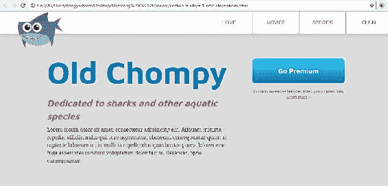
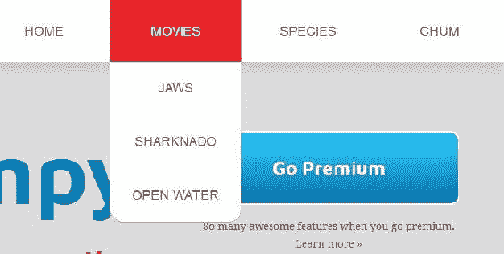
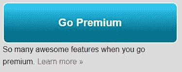
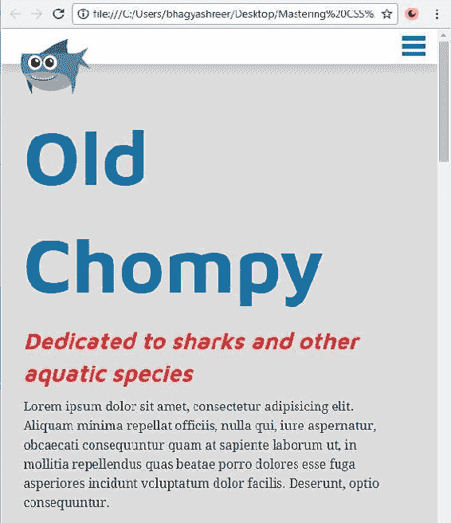
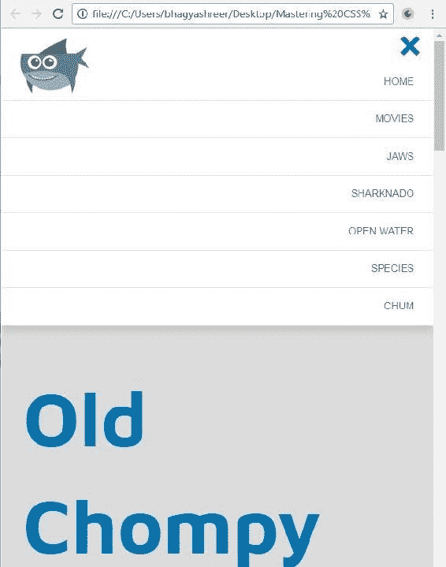
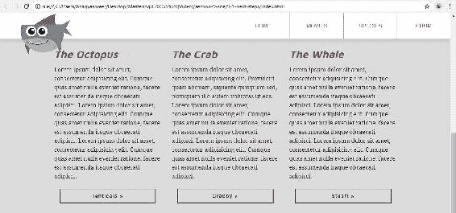
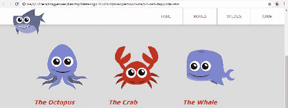
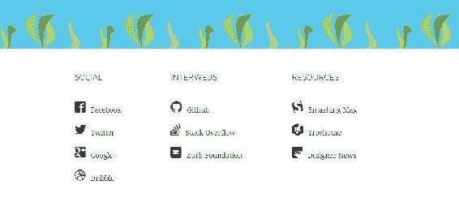

# 前言

HTML、CSS 和 JavaScript 是网络的三种核心语言。你对它们三者了解得越多，你就会越好。在这三者中，CSS 的作用是作为网络的展示语言。它描述了诸如颜色、字体和页面布局等内容。

本书有一些基本先决条件。我希望你了解如何编写 HTML，并了解基本的 CSS，包括样式化字体、添加边距、填充和背景颜色等，以及十六进制颜色代码是什么。在接下来的章节中，我将介绍一些基本概念，如盒模型、显示属性和样式表类型。我还会涉及少量 JavaScript 和 jQuery。你不需要任何关于这些的先前知识，但你将在本书中有所涉猎。

现在，让我们来看一下我们将要构建的最终网站。为了学习 CSS，我们将完成构建以下关于鲨鱼的 HTML5 网站。我说*完成*构建这个网站，是因为基本的 HTML 和 CSS 已经就位，你可以从本书的下载包中下载它们。我们将添加我将向你展示的所有东西，以及更多。这个网站采用了模块化和可重用的 CSS，你将在本书中学到。该网站首先将使用浮动进行布局，然后我们将使用 flexbox 重写布局。我们还会为文本使用 Web 字体：



导航功能包括使用 CSS 动画的下拉菜单：



该网站还具有一个带有 CSS 渐变的行动号召按钮：



该网站是完全响应式的。当我们调整浏览器大小时，可以看到我们的两列布局转变为单列布局：



此外，我们的菜单会变成专为移动设备设计的菜单：



如果我们向下滚动一点，我们会看到使用 CSS 过渡的幽灵按钮。它已经准备好适用于苹果的视网膜显示屏等高分辨率设备：



网站上的大部分图像都使用 SVG：



在页面的最底部，我们使用了一个图标字体：



因此，你会学到一些非常酷的东西。为了充分利用它，我建议你跟着我一起编码。

# 本书涵盖的内容

第一章，*CSS 基础*，介绍了掌握 CSS 所必需的基本概念。

第二章，*加速*，讨论了 Sublime 文本编辑器；CSS 重置，用于重置浏览器中的默认样式；以及后代选择器。

第三章，*使用浮动创建页面布局*，深入探讨了浮动。我们将介绍浮动的基本用法，然后使用浮动创建布局，并了解浮动可能引起的常见问题以及如何解决。

第四章，*使用模块化、可重用的 CSS 类和 CSS3 创建按钮*，涵盖了模块化 CSS 和多个类，并使用 CSS3 为我们的按钮添加过渡、悬停状态、变换和渐变。

第五章，*创建主导航和下拉菜单*，解释了我们主要导航的功能和展示。

第六章，*变得响应式*，介绍了响应式网页设计的基础知识，并解释了如何将其实现，将我们的静态网站转变为移动网站。

第七章，*Web 字体*，讨论了`@font-face`规则的基本语法、字体服务、使用场景以及 Web 字体和图标字体的提供者。

第八章，*HiDPI 设备的工作流程*，涵盖了为准备图像以适应 Retina 而使用 SVG 和`srcset`属性等技术的技术。

第九章，*Flexbox*，*第一部分*，介绍了 Flexbox 模块，涵盖了基本实现和属性。

第十章，*Flexbox*，*第二部分*，更深入地介绍了 Flexbox，构建了一个新的产品列表和更高级的属性。

第十一章，*总结*，总结了本书中涵盖的 CSS 概念，并提供了一些关于其他可以探索的 CSS 功能的信息。

# 您需要为这本书做好准备

在整本书中，我一直使用 Chrome 作为我的浏览器，因为它的 DevTools 等原因，但其他浏览器也有类似的工具。我们将使用 DevTools 直接在浏览器中探索代码。

我也一直在使用 macOS。如果您是 Windows 用户，而我在书中提到命令（*cmd*）键，您应该假装我是在提到*Ctrl*键。除此之外，我认为这不会成为问题。

我使用的文本编辑器是*Sublime Text 3*。我应该说 Sublime 并不是唯一一个好的文本编辑器。还有其他像 Atom 和 Visual Studio Code 这样的编辑器，它们可以做很多相同的事情。

尽管这本书是关于掌握 CSS，但没有 HTML，我们无法做太多事情。因此，我们将在 HTML 中进行相当多的工作。我们的目标是使用非常干净、语义化的 HTML；这是我们的目标。

# 这本书是为谁准备的

这本书是为希望在其网站项目中掌握 CSS 最佳实践的网页设计师和开发人员而写的。您应该已经知道如何处理网页，并准备使用 CSS 来掌握网站呈现。

# 约定

在这本书中，您会发现一些区分不同信息类型的文本样式。以下是这些样式的一些示例及其含义的解释。

文本中的代码词、数据库表名、文件夹名、文件名、文件扩展名、路径名、虚拟 URL、用户输入和 Twitter 句柄显示如下："要更改文本大小，请使用`font-size`属性。"

代码块设置如下：

```css
h2 {
  font-size: 26px;
  font-style: italic;
  color: #eb2428;
  margin-bottom: 10px;
} 
```

当我们希望引起您对代码块的特定部分的注意时，相关行或项目将以粗体显示：

```css
h2 {
 font-size: 26px;
 font-style: italic;
 color: #eb2428;
 margin-bottom: 10px;
} 
```

任何命令行输入或输出都以以下形式书写：

```css
# cp /usr/src/asterisk-addons/configs/cdr_mysql.conf.sample/etc/asterisk/cdr_mysql.conf

```

新术语和重要单词以粗体显示。您在屏幕上看到的单词，例如菜单或对话框中的单词，会以这样的形式出现在文本中："单击“下一步”按钮将您移至下一个屏幕。"

警告或重要说明会以这样的形式出现在方框中。

提示和技巧会出现在这样的形式中。
