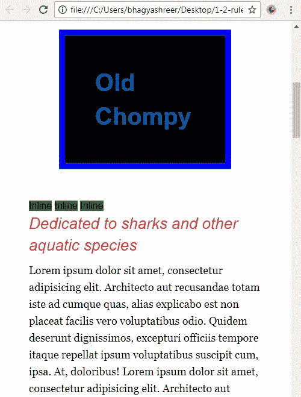

# 第一章：CSS 基础

在这第一章中，*CSS 基础*，我们将看一下掌握 CSS 所必需的基本概念。你将学习到在网页开发中的最佳实践。

在网页开发的世界中，事物经常变化。例如，在过去，表格是布局网页的首选技术。但今天，使用表格进行布局绝对不是你想要做的事情。浮动一直是创建布局的最常见方式，也是我们首先要学习的内容。在过去的一年左右，flexbox 开始取代浮动进行布局，我们将在本书的后期学习 flexbox。CSS 正在进步，其他新的布局模块被设计来取代浮动进行页面布局。网格布局和 CSS 区域可能是未来的发展方向。由于前端网页开发领域的事物迅速发展，我们的关键是我们不能停止学习 CSS。一般来说，一旦停止学习，你的知识将很快过时。我的目的是教授能够长期受益的概念和技术。

在本章的两个部分中，我们将回顾对网页设计和 CSS 至关重要的核心概念。我们将首先回顾如何创建 CSS 中最基本的东西-规则集-并讨论我们可以写这些规则集的不同位置。

# 规则集的解剖和三种类型的样式表

我们现在对这本书的内容和我们将要构建的网站有了更多的了解。在我们开始深入研究更高级的主题之前，让我们回顾一下一些 CSS 基础知识。在本书中，我会使用诸如选择器、属性和值等术语，你需要确切理解这些术语的含义，以便跟上进度。我们将首先回顾一个规则集，然后再看看我们可以写这些规则集的三个不同位置。所以让我们开始吧。

# 解剖规则集

让我们跳到一个 CSS 文件中，看看下面代码块中的一个规则集。它是针对`h2`-一个二级标题。它设置了`font-size`为`26px`，`font-style`为`italic`，`color`为红色，`margin-bottom`为`10px`：

```css
h2 { 
  font-size: 26px; 
  font-style: italic; 
  color: #eb2428; 
  margin-bottom: 10px; 
} 
```

所以这里没有什么可怕的！不过让我们来解剖一下：

```css
selector { 
  property: value; 
  property: value;
  property: value;
} 
```

在上面的代码中，`h2`是*选择器*。我们选择页面上的一个元素来定位我们的样式规则。`h2`选择器可以是`p`、`li`、`div`、`a`或者我们想要定位的任何 HTML 元素。它也可以是一个类、一个 ID 或一个元素属性，我稍后会谈到。接下来，我们在花括号内有属性和值。从开花括号到闭花括号是*声明块*。你可以在花括号内有尽可能多的属性。`font-size`、`color`、`font-style`和`margin`只是你可以使用的许多不同属性中的一部分。每个属性都有一个对应的值。在每个属性和值之间，你必须有一个冒号。值之后是一个分号，这也是必需的。每个属性和值被称为一个声明。所以声明块是花括号内的所有内容，声明是包括属性和值的单行。但实际上，在规则集的解剖中有三个重要的事情需要记住：选择器、属性和值。现在让我们看看我们可以在哪里写这些规则集。

# 外部样式表

目前，我们将规则集写在外部样式表中。你可以看到它实际上是一个独立的文件：


在屏幕左侧的文件夹结构中，你可以看到它在一个名为`css`的文件夹中：


除了`嵌入`样式表之外。外部样式表是编写样式的最佳位置；它是一个单独的文件，链接到每个 HTML 页面。外部样式表可以控制整个网站，这是首选样式表的主要原因。在`index.html`文件的`<head></head>`标签之间的任何位置；这是您可以链接到外部样式表的地方：

```css
<head>
  <link rel="stylesheet" href="css/style.css"> 
</head>
```

`href`属性指向文件的位置。这里它指向`css`文件夹，然后是一个名为`style.css`的文件。还有一个`rel`属性，基本上表示这是一个`stylesheet`。在过去，您可能已经看到`text/css`作为`type`属性的值，如下面的代码块所示，但在 HTML5 中这不再是必需的：

```css
<head>
  <link rel="stylesheet" href="css/style.css" type="text/css"> 
</head>
```

您可能还看到了自关闭标签上的结束斜杠，比如`link`元素，但在 HTML5 中，这个斜杠不再是必需的。因此，包括它或排除它对您的网站没有任何影响。

# 嵌入样式表

除了使用最佳类型的样式表，外部样式表，我们还可以在 HTML 文档的头部编写我们的规则集。这被称为**嵌入样式表**。有很多原因不这样做。主要的两个原因是它阻碍了工作流程，而且它只控制站点的单个页面。我们要做的就是在`head`标签中创建这些开放和关闭的`<style>`标签：

```css
<head>
  <style> 

  </style> 
</head>
```

在这个开放的`<style>`标签内的任何位置，我们可以开始添加我们的规则集，这将只影响这一页：

```css
<head>
  <style> 
    h2 { 
      font-size: 50px; 
   } 
  </style> 
</head>
```

再次强调，这不是编写样式的最佳位置。将它们保留在外部样式表中，99%的时间都是最好的选择，但您可以选择将样式嵌入到文档的`head`标签中。

# 内联样式表

最后，第三种样式表是内联样式表。它实际上不是样式表-更像是*内联样式*。我们可以在 HTML 元素内部实际上写一个`style`属性：

```css
<h2 style=""> 
```

内联样式与使用传统规则集的外部和嵌入样式表有些不同；这里没有选择器，也没有完整的规则集，因为您是在 HTML 标记内部编写它。我们可以输入`font-size`为`10px`。我们以与规则集相同的方式编写属性和值，并且应该用分号结束：

```css
<h2 style="font-size: 10px;"> 
```

我们还可以更改颜色并用分号结束：

```css
<h2 style="font-size: 10px; color: deeppink;"> 
```

保存这个，刷新网站，你就可以看到结果：


这绝对是编写样式的最低效方式。然而，在 HTML 元素中直接编写 CSS 会赋予它最大的权重，并且会覆盖所有针对相同元素的嵌入样式和所有外部样式，除非使用`!important`关键字。在第四章，*使用模块化、可重用的 CSS 类和 CSS3 创建按钮*中的*特异性规则*部分，我深入探讨了级联和其他因素，这些因素使某些规则的权重更大，并覆盖其他规则。

好的，现在我们已经创建了一个规则集，并学会了规则集的每个部分的名称，特别是选择器、属性和值。这些信息对您来说将是有帮助的，因为我经常会使用这些术语。我们还回顾了可以创建样式表的三种不同位置：外部、嵌入在`<head>`标签中，以及内联，直接在元素内部。再次强调，外部样式表是最有效的，因为它可以控制整个网站。这是我写 CSS 的唯一位置。接下来，我们将回顾另外两个核心概念：盒模型和`display`属性。

# 盒模型和块与内联元素

在这一部分，我们将回顾 CSS 的另外两个基础：盒模型和块级与内联元素。充分掌握这两个概念是以后掌握 CSS 的关键。首先，我们将回顾盒模型，然后我们将看看它与块级元素的关系。接着我们将讨论内联元素的特点。

# 盒模型

**盒模型**定义了页面上元素的宽度和高度。要确定一个元素占据的水平空间，你需要将`content` + `padding-left` + `padding-right` + `border-left` + `border-right` + `margin-left` + `margin-right`相加：


所以让我们通过查看我们网站上的`h1`来实际看一下。这是蓝色文字，上面写着“Old Chompy”。


这是使这个标题看起来像这样的规则集：

```css
h1 { 
  font-size: 40px; 
  line-height:1.4; 
  font-weight: bold; 
  color: #0072ae 
} 
```

让我们添加以下属性，给它一个`width`、`padding`、`border`和`margin`。以及一个显眼的`background-color`：

```css
h1 { 
  font-size: 40px; 
  line-height:1.4; 
  font-weight: bold; 
  color: #0072ae 
 background-color: black; 
 width: 300px; 
 padding: 50px; border: 10px solid blue; margin: 50px; 
}
```

现在我们的标题看起来是这样的。一个大盒子：


所以这个元素的盒模型现在有这 5 个属性；从前面的屏幕截图中可以看出，这个`h1`看起来真的像一个盒子。我们可以看到`10px`的边框，`margin`在`border`外面是`50px`，填充在边框和文本之间是`50px`。然后填充内部的宽度是`300px`。所以这个元素的宽度实际上是*300 + 20 + 100 + 100*，总共是`520px`。所以即使我们在 CSS 文件中定义了`width`属性为`300px`，这个元素实际占据的空间是`520px`。

现在，这是传统的盒模型。我可以使用`box-sizing`属性和`border-box`值修改这个传统的盒模型。所以让我们使用`box-sizing`属性，看看它如何影响网站。将属性和值添加到`h1`声明块的底部，如下所示：

```css
h1 { 
  font-size: 40px; 
  line-height:1.4; 
  font-weight: bold; 
  color: #0072ae 
  background-color: black; 
  width: 300px; 
  padding: 50px; 
  margin: 50px; 
  border: 10px solid blue;
  box-sizing: border-box;
}
```

如下截图所示，`border-box`将从`width`和`height`计算中减去`padding`和`border`。如果我将`300px`作为我的`width`，那么我指定的`300px`将减去`20px`的边框和`100px`的填充。这是一个更直观的盒模型，它与 Internet Explorer 8 及更高版本兼容，以及所有其他主要浏览器。这个元素现在占据的最终水平空间从`520px`变成了`400px`。


# 块级元素与内联元素

让我们稍微谈谈块级元素。标题 1（`h1`）、标题 2（`h2`）、段落（`p`）、列表项（`li`）和`div`都是自然块级元素的例子。块级元素有两个定义特征：它们扩展了整个可用宽度，并且它们强制后面的元素出现在下一行，这意味着它们堆叠在一起。所以让我们从我们的声明块中删除`box-sizing`属性以及`width`属性，以演示如果没有指定宽度，它们将占用整个可用宽度：

```css
h1 { 
  font-size: 40px; 
  line-height:1.4; 
  font-weight: bold; 
  color: #0072ae 
  background-color: black; 
  padding: 50px; 
  margin: 50px; 
  border: 10px solid blue;
}
```

保存并刷新网站。你可以在下面的截图中看到，当你将浏览器窗口放大时，它占据了整个可用宽度，除了我们设置的`margin`是四周的`50px`：


现在让我们进入 HTML 文件，在 HTML 中再添加两个这样的`h1`标签，并保存：

```css
<section> 
  <h1>Old Chompy</h1> 
  <h1>Old Chompy</h1> 
  <h1&gt;Old Chompy</h1> 
```

这就是它的样子：


现在你可以看到这些块级元素如何堆叠在一起：好老的块级元素。

另一方面，内联元素的行为不同。它们水平相邻，并且不占用整个可用宽度。它们只占用它们需要的宽度。一些天然的内联元素是锚点(`<a>`)、`<span>`、`<i>`、`<b>`、`<strong>`和`<em>`标签。

好了，让我进入 HTML 并向页面添加三个`span`标签：

```css
<section> 
  <h1>Old Chompy</h1> 
  <h1>Old Chompy</h1> 
  <h1>Old Chompy</h1> 
  <span>Inline</span> 
  <span>Inline</span> 
  <span>Inline</span> 
```

我还会通常在规则集中针对那些`span`元素并给它们一个绿色的背景，只是为了看到它们的区别：

```css
span { 
  background-color: green; 
} 
```

这是它的外观：



您可以注意到绿色的内联元素是水平排列而不是垂直堆叠。没有什么特别的，但我们可以看到它们不会占用整个可用宽度，它们只会占用它们需要的宽度。

有一些内联元素不会做的事情。它们不会响应`width`或`margin-top`或`margin-bottom`。因此，如果一个元素自然是内联的，并且您给它一个`width`和一个`margin-top`或`margin-bottom`，就像下面的代码所示，它将绝对不会做任何事情：

```css
span { 
  background-color: green;
 width: 1000px;
  margin-top: 1000px; 
} 
```

没有任何变化：


内联元素只是不遵守这些属性，这些属性对它们没有影响，所以我们将删除它们。

还有一件有趣的事情可以做。有一个`display`属性，允许您将自然的块级元素更改为内联元素，反之亦然。所以让我们在我们的`span`选择器中添加一个`display`属性，值为`block`，并在浏览器中查看。所以，我可以说`display: block`，还可以添加一些`margin-top`：

```css
span { 
  background-color: green; 
 display: block; 
  margin-top: 10px; 
}
```

我们可以看到这些元素现在堆叠在彼此上面，并且现在遵守`margin-top`和`margin-bottom`的值：


`display`属性设置为`block`的元素会遵守我给它的任何`width`值，但它也会占用整个可用宽度。您可以看到它延伸到屏幕的边缘。我们也可以在我们的`h1`选择器上轻松使用`display: inline`属性，将显示的性质从块状更改为内联。最后，我们可以使用`display: none`，这会完全隐藏页面上的元素，并且通常出于各种原因而使用。所以让我们去我们的`h1`声明并说`display: none`：

```css
h1 { 
  font-size: 40px; 
  line-height:1.4; 
  font-weight: bold; 
  color: #0072ae; 
  background-color: black; 
  padding: 50px; 
  margin: 50px; 
  border: 10px solid blue; 
 display: none; 
} 
```

现在，如果我们查看我们的网站，那个`h1`是不可见的。它不再是浏览器要向我们展示的东西：


总之，所有元素都符合框模型。框模型会根据`box-sizing`属性的使用方式而略有变化，如果有的话。此外，框模型会根据元素是块级还是内联而变化，这是两种最常见的显示属性。

# 总结

在本章中，我们取得了很多成就。我们已经讨论了 CSS 是 Web 的呈现语言，真正使您的网站看起来像一个网站。我们现在熟悉了我们将要构建的网站和我们将在接下来的章节中使用的工具。我们已经涵盖了诸如规则集、链接到外部样式表和框模型和显示属性等核心概念，这些都是掌握 CSS 所必不可少的。

在下一章中，我们将介绍一些编写 CSS 所必需的工具，例如良好的文本编辑器、CSS 重置和 Chrome 的开发者工具。
