# 第二章：加速

为了成为一个优秀的编码人员，你需要加速并学习一些能帮助你成为更好的开发人员的东西。在本章中，我们将看看可以加快工作流程的文本编辑器。然后，我们将看看*CSS 重置*，它重置默认浏览器，使其样式减少到最低，并内置浏览器开发者工具，帮助我们排除代码故障。然后，我们将看看如何使用类和 ID 重命名元素，并使用后代选择器限定我们的选择器。

# 文本编辑器

HTML、CSS 和 JavaScript 可以在任何文本编辑应用程序中编写。这是这三种核心网络语言的伟大之处之一。问题在于，编写 HTML、CSS 和 JavaScript 极易出错。对于 CSS，逗号、分号和大括号需要在正确的位置输入。在大多数情况下，需要完美地遵守特定的语法，否则你的页面将无法按预期渲染。以下是 Mac 上的 TextEdit 的示例。它与 Windows 上的记事本类似，因为它没有许多使编写代码变得容易的功能：

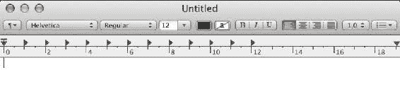

无论如何，让我们在 TextEdit 中写一些代码。我们从 HTML 文档类型开始。之后，我们添加一个 HTML 开放和闭合标签，然后是`head`标签，里面是`title`标签。你很快就会意识到，这是一个相当乏味的过程，也就是在 TextEdit 中编写代码。我们可以在这里写代码，但我们真的得不到任何东西，没有语法高亮，也没有其他任何帮助：

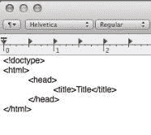

幸运的是，一个好的文本编辑器可以真正为你做一些艰苦的工作。在本章中，我们将看看这样一个文本编辑器，即 Sublime Text 3，以及它具有的一些很好的功能，可以帮助你更好地编写 HTML 和 CSS。首先，我们将看看片段，然后我们将看看语法高亮，接着是代码建议和多个光标。Sublime Text 3 是我选择的文本编辑器，因为它快速且易于使用。我喜欢的一件事是它如何轻松自然地让我编写代码。

# 片段

在 Sublime Text 3 中，你只需在 HTML 文件中输入`html:5`，然后按下*Tab*键，就可以获得 HTML 的基本样板。所以，我们在 TextEdit 中必须输入的所有代码都可以很快地为我们写好：

```css
<!DOCTYPE html> 
<html> 
<head> 
        <title></title> 
</head> 
<body> 

</body> 
</html> 
```

另一件事是，当你输入`div`并按下*Tab*键时，可以自动创建`div`的闭合标签，并将光标放在开放和闭合`div`标签之间：

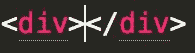

我们可以对任何 HTML 元素做到这一点；只需输入像`p`这样的东西，然后按下*Tab*键，将光标放在中间：

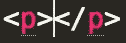

太棒了！拥有如此简单的东西真的很好。

我们可以再进一步安装 Emmet 包。我强烈鼓励你这样做。这将为您提供更好的代码片段。实际上，之前生成基本 HTML 样板的`html:5`代码片段实际上是一个 Emmet 片段；它不是 Sublime 的标准功能：

```css
<!DOCTYPE html> 
<html> 
<head> 
    <meta charset="UTF-8">     
    <title>Document</title> 
</head> 
<body> 

</body> 
</html> 
```

在 Sublime 中安装包（基本上是插件）的能力，是它如此强大的另一个原因。对于 Sublime 没有默认提供的所有内容，都有一个可用的包。所以，假设你需要 ColdFusion 代码的语法高亮；有一个可用的包可以为你做到这一点。我在我的网站上有一篇文章，介绍了包安装，这非常简单。只需在[richfinelli.com/installing-sublime-package-manager/](http://www.richfinelli.com/installing-sublime-package-manager/)上查看它：

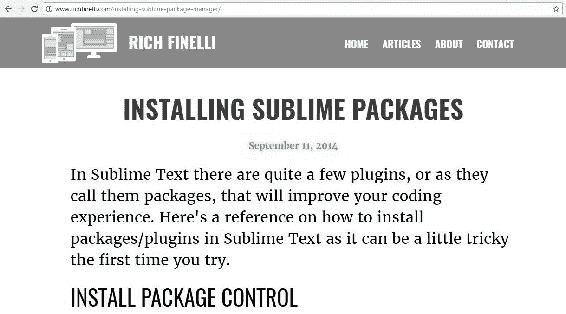

到目前为止，这是最好的包，你应该安装的第一件事就是 Emmet。有了 Emmet，比如你去到你的 HTML 并输入像这样的东西：

```css
div>ul>li*5>a{link$} 
```

这将扩展为以下内容：

```css
<div>
  <ul>
    <li><a href="">link1</a></li>
    <li><a href="">link2</a></li>
    <li><a href="">link3</a></li>
    <li><a href="">link4</a></li>
    <li><a href="">link5</a></li>
  </ul>
</div>
```

请注意，`$`在第一个`a`中扩展为 1，第二个为 2，依此类推，这可能非常有用。使用类似 CSS 选择器的语法快速编写 HTML 只是 Emmet 允许你做的好事之一。

# 多重光标

使用 Emmet 扩展的`div`标签，让我们来看看 Sublime 的多重光标功能。由于我们有五个列表，我们可能需要在每个列表中输入相同的内容。如果按住*cmd*键并单击代码的不同行，您实际上可以创建多个光标。如图所示，您现在可以在五个不同的位置输入相同的内容：

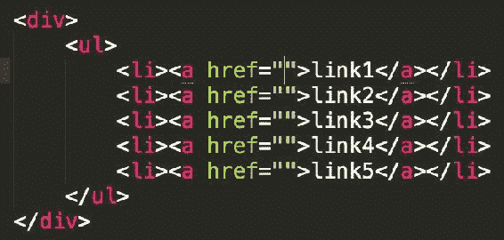

现在，假设您想在多个光标处输入一些占位文本。首先，输入“lorem5”，或者输入“lorem”后跟任何其他数字，您将获得相应数量的占位“lorem ipsum”文本：

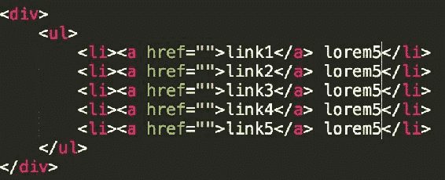

然后，只需按下*Tab*，它将自动扩展到我们的情况下，即 5 个字的 lorem ipsum 文本，如图所示：

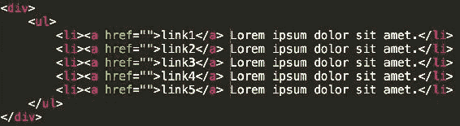

# 语法高亮

让我们暂时切换到我们的 CSS。另一个将使我们的工作更加轻松的功能是语法高亮。请注意，所有规则集都遵循一种颜色方案。选择器是红色的，属性是蓝色的，值是紫色的。它们将开始嵌入到您的潜意识中：

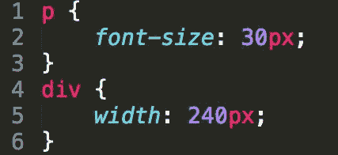

Sublime Text 为您做的是，它微妙地指出了您的错误。我经常在需要冒号的地方输入了分号。这将导致您的 CSS 无法工作。尽管如此，语法高亮告诉我有些地方不对，因为如下截图所示，颜色方案发生了变化：

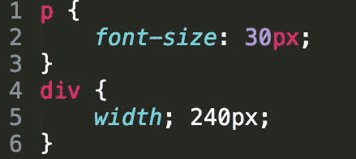

很容易发现颜色差异，但如果您不寻找它，很难看出冒号和分号之间的区别：

# 代码建议

有一些很酷的功能可用，比如代码完成和代码建议。因此，如果您开始输入类似`border-`的内容，您将获得所有以`border`开头的不同属性：

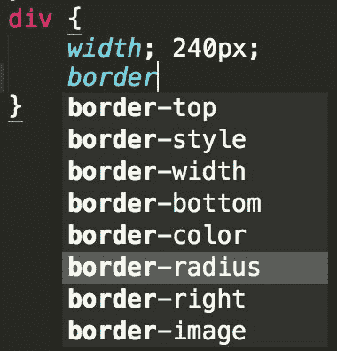

在这种情况下，我正在寻找`border-radius`，所以我可以直接转到该建议并按下*Tab*，它会自动为我完成任务：

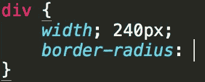

我喜欢这个文本编辑器的原因还有很多，我就不一一列举了。它的价格是 70 美元，但有一个无限免费试用版，您可以用来确定您是否喜欢它——相信我，您会喜欢的。现在我并不是说 Sublime 是您应该使用或尝试的唯一文本编辑器。还有其他好的编辑器，比如 Visual Studio Code，Atom，Adobe Brackets 等。如果您使用的是其他大部分我所说的功能，并且对您有用的东西，那就坚持使用它。只是确保您不要使用记事本或文本编辑器来编写代码，因为那将非常痛苦和低效。

良好的文本编辑器对于编写良好的 HTML 和 CSS 至关重要，并将使我们的生活更加轻松。接下来，您将了解 CSS 重置以及它们如何帮助我们为编写 CSS 创建一个非常好的起点。

# CSS 重置

在上一节中，您了解了良好文本编辑器的强大功能。在本节中，我们将使用该文本编辑器来探索一种称为*CSS 重置*的东西。开始网站需要放置并且通常是您网站样板的一部分的许多部分。我称这些部分为您的“基础层”。这个*基础层*的一个重要部分是 CSS 重置。重置允许您消除浏览器在默认浏览器样式方面的不一致，并一般上消除所有默认浏览器样式。它允许*您*更轻松地使用 CSS 提供*您*手工制作的样式。在本节中，我们将首先加载 CSS 重置，然后检查该重置并看看它在做什么。最后，我们将添加和自定义重置以满足我们的需求。

# 加载 Eric Meyer 的 CSS 重置

有几种不同的重置可供选择，但我已经迷上了 CSS 大师 Eric Meyer 的重置。让我们从[meyerweb.com/eric/tools/css/reset/](http://meyerweb.com/eric/tools/css/reset/)获取它：

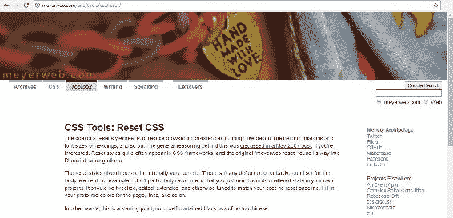

所以，向下滚动一点，找到重置的顶部，然后只需突出显示所有代码，直到你到达闭合大括号：

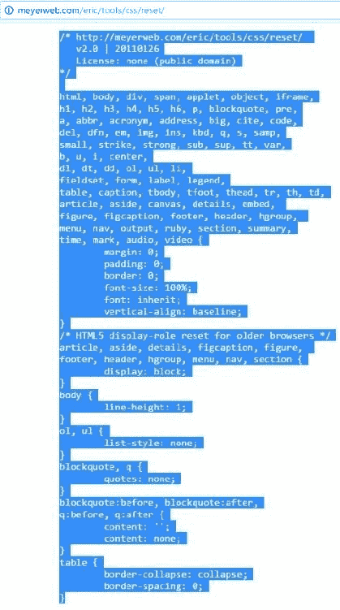

切换到 Sublime，打开你的样式表，然后粘贴进去：

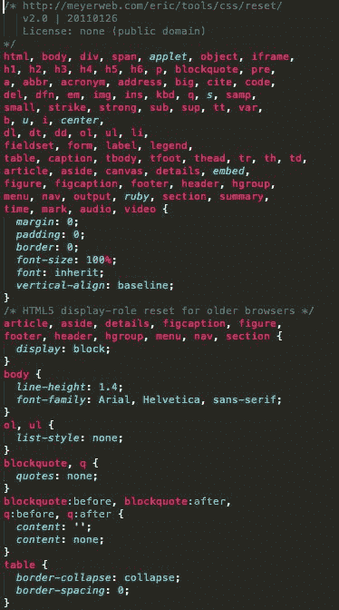

在保存之前，让我们打开我们网站的 `index.html` 文件。你可以用 Sublime 做的一件事是：如果你右键点击你的 HTML 文件，你可以选择在浏览器中打开，它会打开你的默认浏览器：

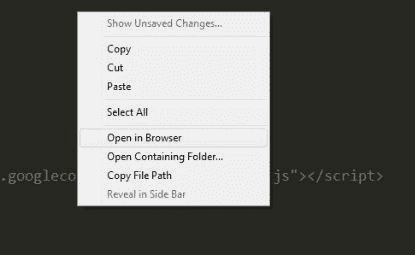

在我的情况下，是 Chrome。所以这就是没有重置的网站会是什么样子：

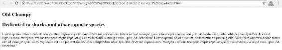

正如你在下一个截图中看到的，我们添加的所有 CSS 实际上移除了我们的一点点样式。这就是为什么我们称它为重置。所有文本看起来都一样——没有边距，没有填充，什么都没有。

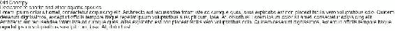

# 检查 CSS 重置

在我们的样式表的顶部，有一个 CSS 注释，归功于 Eric Meyer 的重置。我们会留下这个注释：

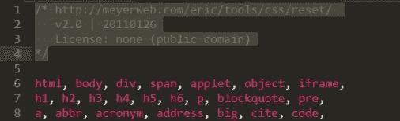

接下来，我们有大部分的重置。这一大块代码模糊地提醒了你在 第一章 中学到的规则集，*CSS 基础*。它实际上只是一个带有非常长选择器的规则集。选择器中用逗号分隔了几乎每个 HTML 元素：

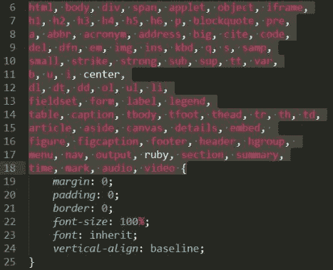

这意味着所有这些元素都将从声明块中接收相同的样式：

```css
... {
  margin: 0; 
  padding: 0; 
  border: 0; 
  font-size: 100%; 
  font: inherit; 
  vertical-align: baseline; 
}
```

正如你在这个声明块的前三个声明中看到的，`margin`、`padding` 和 `border` 都被设置为 `0`。使用值 `0` 和使用 `0px` 是一样的，只是少了两个字符。如果值是零，你就不需要指定像素。这将从所有元素中移除默认的 margin、padding 和 border。在这些声明的下面，我们有 `font-size` 属性，它是 `100%`。这一行是一个指令，使所有字体都是浏览器默认的，基本上就是 `16px`，因为大多数桌面浏览器的默认字体大小是 `16px`。

在这个声明块下面，我们有新的 HTML5 元素，我们将它们的显示设置为块级。这允许一些不认识这些新元素的旧浏览器现在将它们视为块级元素。这使得 HTML5 可以在一些旧浏览器中工作：

```css
/* HTML5 display-role reset for older browsers */ 
article, aside, details, figcaption, figure,  
footer, header, hgroup, menu, nav, section { 
    display: block; 
} 
```

接下来，我们有一个新的选择器和声明，将 `line-height` 设置为 `1`：

```css
body { 
  line-height: 1; 
} 
```

`line-height` 属性向下级联，这意味着如果我们在一个元素上设置它，例如 `body`，它将被继承到它包含的所有其他元素。值 `1` 是一个无单位的值，所以 `1` 将等于字体的大小。值 `1.2` 将是字体大小的 1.2 倍。所以，如果 `font-size` 是 `16px`，`line-height` 是 `1`，那么 `line-height` 将等于 `16px`。如果 `line-height` 设置为 `2`，你的字体大小是 `16px`，那么 `line-height` 将等于 `32px`。

接下来在样式表中是有序和无序列表，我们从 `ul`、`ol` 中移除了项目符号和编号，通过级联的方式也会应用到 `li` 中：

```css
ol, ul { 
    list-style: none; 
} 
```

在此之下，你会看到重置为 `blockquote` 和 `q` 元素设置了一些默认值。我很少使用块引用，而且这个重置有点长，所以通常我会删除这部分重置。但如果你经常使用这些元素，那就保留它：

```css
blockquote, q { 
    quotes: none; 
} 
blockquote:before, blockquote:after, 
q:before, q:after { 
    content: ''; 
    content: none; 
} 
```

接下来，我们重置了 2 个 `table` 属性：`border-collapse` 和 `border-spacing`：我从未深入研究过，但最终处理了一些微妙的表格不一致，你在任何现代桌面浏览器中都看不到。

```css
table { 
    border-collapse: collapse; 
    border-spacing: 0; 
} 
```

这基本上就是 CSS 重置的解剖。这个重置应该是你的 CSS 基础层的一部分，让你开始。我们现在将看看如何添加和自定义它。

# 自定义 CSS 重置

让我们更新`body`元素上的`line-height`和`font-family`属性，这将建立所谓的“垂直韵律”，并使`Arial`成为所有元素的默认`font-family`：

```css
body { 
    line-height: 1.4; 
    font-family: Arial, Helvetica, sans-serif; 
} 
```

然后你会看到它如何影响文本，主要是在文本的行之间添加一些垂直空间：

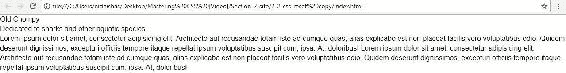

为所有这些默认值尽早建立是很好的；这样，你就不必一遍又一遍地为 CSS 中的每个元素描述`line-height`和`font-family`。请注意，并非所有属性都像`font-family`和`line-height`那样被子元素继承；只有某些属性具有这种效果，主要是文本级别的属性才会表现出这种行为。在这种情况下，我们在`body`元素上设置了这些属性，但它们被级联到了`h1`、`h2`和我们的`p`，使它们都具有`Arial`的`font`和`line-height`为`1.4`。

我想在我们的重置中再添加几个规则集。让我们在重置的底部留出一些空间。我想要添加的第一个是`clearfix`，如下一段代码所示。我现在不打算详细介绍`clearfix`。我将在第三章中详细解释它，*使用浮动创建页面布局*。这个默认值对于清除浮动非常有帮助；我们将需要它：

```css
/* micro clear fix */ 
.grouping:before, 
.grouping:after { 
    content: " "; 
    display: table;  
} 
.grouping:after { 
    clear: both;  
} 
```

接下来我们要做的是为媒体元素设置`max-width`，以确保响应式媒体。我将在第六章中更详细地讨论这个问题，*成为响应式*：

```css
img, iframe, video, object { 
  max-width: 100%;  
} 
```

最后，我想取消对`strong`和`b`元素的重置，并确保它们确实具有`bold`的`font-weight`：

```css
strong, b { 
    font-weight: bold;  
} 
```

所以关于重置就是这样。现在，转到我们的 HTML，我想详细说明两个不在重置中的基础层的部分：

```css
<!doctype html> 
<html lang="en"> 
<head> 
    <meta charset="UTF-8"> 
    <meta http-equiv="X-UA-Compatible" content="IE=edge,chrome=1"> 

<!-- description --> 
    <title>Section 2-Ramping Up - Mastering CSS</title> 

<!-- stylesheets --> 
    <link rel="stylesheet" href="css/style.css"> 

<!-- stylesheets for older browsers -->       
    <!-- ie6/7 micro clearfix --> 
    <!--[if lte IE 7]> 
        <style> 
        .grouping { 
            *zoom: 1; 
        } 
        </style> 
    <![endif]--> 
    <!--[if IE]> 
        <script   src="img/html5.js"></script> 
    <![endif]--> 
</head> 
```

首先，我们有一个处理`IE 7`的`clearfix`，如下面的代码所示。你不需要知道这到底是在做什么，但你可能想知道它使`clearfix`在 IE7 中工作。如果你不支持较旧版本的 IE，你可以省略这部分。同样，我们将在第三章中详细讨论`clearfix`，*使用浮动创建页面布局*：

```css
<!-- stylesheets for older browsers -->       
    <!-- ie6/7 micro clearfix --> 
    <!--[if lte IE 7]> 
        <style> 
        .grouping { 
            *zoom: 1; 
        } 
        </style> 
    <![endif]--> 
    <!--[if IE]> 
        <script 
         src="img/
         html5.js"></script> 
    <![endif]--> 
```

如果我们放大这段代码，它恰好是一个嵌入样式表。你可以看到有一个开头和结尾的`style`标签，中间有一个规则集：

```css
<style> 
  .grouping { 
    *zoom: 1; 
  } 
</style> 
```

在嵌入样式表之外，紧接着开头的`style`标签的那一行是所谓的`IE`条件注释，它说：“如果低于或等于`IE 7`，请看下面的规则。”

```css
<!--[if lte IE 7]> 
```

在规则集下面，我们有一个指向 HTML5 Shiv 库的`script`，它使旧版本的 IE 能够理解更新的 HTML5 元素：

```css
<!--[if IE]> 
    <script 
     src="img/
     html5.js"></script> 
<![endif]--> 
```

这也是在 IE 条件注释中，但它是针对所有版本的 IE。实际上，IE 10 及更高版本不再支持 IE 条件注释，因此这个脚本只支持 IE9 及更低版本；然而，它确保我们的 HTML5 元素在较旧的浏览器中得到支持。同样，如果你不支持这些较旧的浏览器，也可以省略这部分。

在本节中，我们剖析了我们的 CSS 重置以及如何准备好基础层来编写代码。现在，让我们来看看*Chrome DevTools*部分。

# Chrome DevTools

到目前为止，我们所做的大部分 CSS 都相当简单。我们尝试的时候，所有的东西都能一次成功，但这并不总是发生。通常，CSS 不起作用，我总是在想我错过了什么。我的编辑器中的语法高亮虽然有帮助，但并不能阻止我忽略错误。通常，是一个小错误导致某些东西不起作用，很难找到错误并修复它。在本节中，我们将简单地看一下如何打开 DevTools。然后，我们将在检查器中修改一些 CSS，最后查看控制台以找到错误。

# 如何打开开发者工具

要打开 Chrome 的 DevTools，您只需右键单击或 *Ctrl* + 单击页面的任何部分。您将获得一个上下文菜单，如下截图所示。当您选择“检查元素”选项时，您将进入一个全新的技术世界：

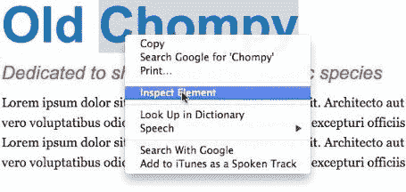

通常情况下，DevTools 会占据屏幕的下半部分。如下截图所示，左侧是浏览器渲染的 HTML，技术上称为 DOM。右侧是所有样式：

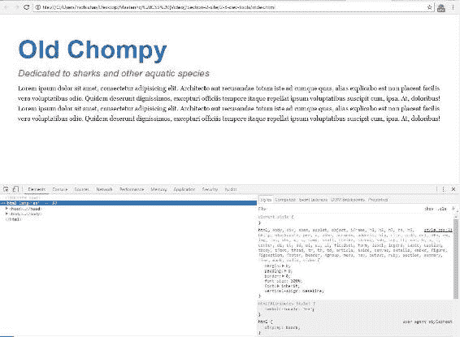

如果您在左侧悬停在某个元素上，它会在顶部突出显示。因此，如果您悬停在 `h2` 上或单击它，它会突出显示，如下截图所示：

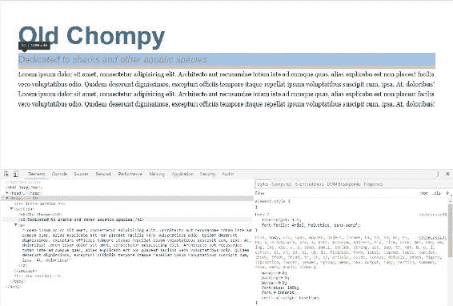

如果您悬停在 `<section>` 上或单击它，它会在顶部突出显示：

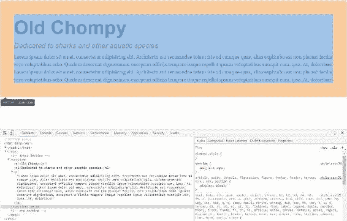

# 更改检查器内的 CSS

在检查器的右侧，您将看到您在 DOM 中突出显示的任何元素的所有样式。您甚至可以单击其中任何属性或值并更改它们。因此，如果您单击 `font-size` 旁边的 `26px`，您可以将其增加到您想要的任何值。这将立即在浏览器中更新，非常酷：

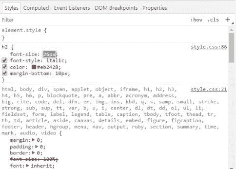

您甚至可以取消选中某些属性并立即看到更改。因此，如下截图所示，如果您在 DOM 中单击 `h2` 元素，然后在右侧取消颜色和下边距，这对 `h2` 元素的更改会立即生效。只需重新选中它们即可添加它们回来：

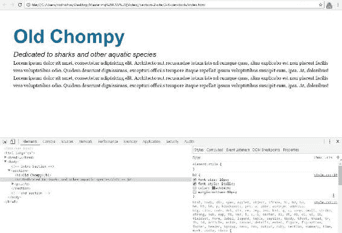

如果您单击最后一个元素-在这种情况下是 `margin-bottom` 并按 *Tab*，它将允许您输入新的属性和值。因此，添加 `margin-left` 为 `-40px`，看看效果；这将将此 `h2` 向左移动 `40px`：

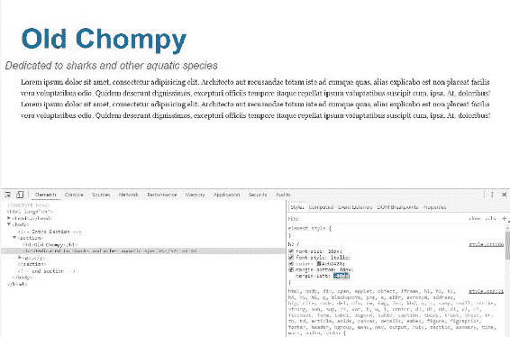

现在这些不是永久更改。一旦刷新浏览器，这些样式就会消失；但是，如果您想保留我们正在尝试的这些更改，可以复制此规则集并将其粘贴到您的代码中。它甚至告诉我们当前样式表中的此规则集位于样式表的第 86 行。如果您将鼠标悬停在那里，它将准确告诉您该文件在您网站文件夹中的位置：

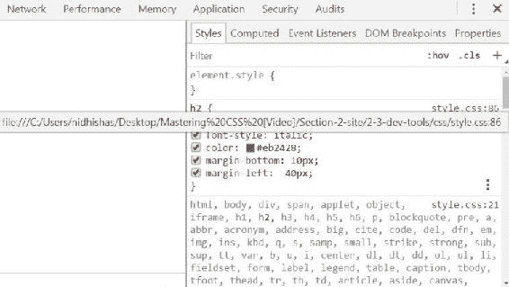

# 使用控制台查找错误

到目前为止，我们只是在探索 Chrome DevTools 的冰山一角。例如，有时添加图像可能会有些棘手。因此，让我们通过在 HTML 中输入以下图像标签来将其添加到页面上，放在 `h2` 上方：

```css
 
```

如果我们保存并刷新网站，我们会发现图像根本没有显示出来，所以肯定有问题。刷新页面后，DevTools 中会出现一个带有数字一的红色错误图标。如下截图所示，这里有一个错误：

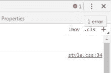

要查看错误是什么，请单击“控制台”选项卡。您会看到 `sharkey.png` 文件找不到：

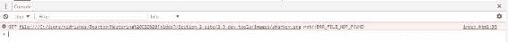

这是很有用的信息。它告诉您这不是与权限相关的问题。这不是 403；它只是找不到它正在寻找的文件。因此，我会打开我的 `images` 文件夹，并确保图像在文件夹中，在这种情况下，我们假设它在那里。但是，唯一的问题是，它正在寻找的文件拼写不同：

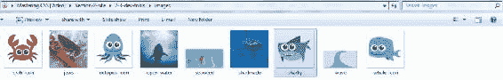

它正在寻找 `sharkey`，S-H-A-R-K-E-Y，而实际文件只是 S-H-A-R-K-Y，所以很容易修复。现在您知道问题出在哪里，只需在您的 HTML 中更改名称即可：

```css
 
```

如果您保存后刷新浏览器，此图像应该会显示出来：

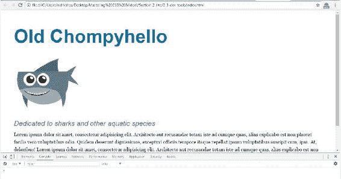

所以这两个东西，元素检查器和控制台，在实验和故障排除代码方面都非常有用。我的最大建议是，如果你的 HTML、CSS 和 JavaScript 不像你期望的那样工作，只需打开 DevTools，看看底层。很可能你会整天都打开 DevTools。我还要补充一点，Firefox、Safari 和 IE 都有类似任务的 DevTools，对于这些浏览器的故障排除同样有用。我们只是触及了开发者工具可以做的一小部分。查看我的博客文章，了解如何使用 Chrome DevTools 进行 HTML 和 CSS 故障排除的更多信息；网址是[www.richfinelli.com/troubleshooting-html-and-css](http://www.richfinelli.com/troubleshooting-html-and-css)。

它解释了如何创建新的选择器，以及如何访问计算值而不是声明的值，这在调试 CSS 规则和确定哪些规则优先级时非常有用。它还介绍了设备仿真模式等内容：

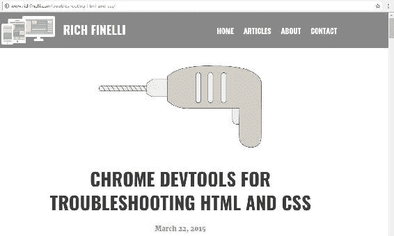

现在你知道如何使用 Chrome DevTools，它是你故障排除 HTML 和 CSS 的王牌。接下来，你将学习如何重命名元素，这是 CSS 真正发挥作用的地方。

# 重命名元素——类和 ID

重命名元素是 CSS 的一个强大功能。让我为你设置一下。到目前为止，CSS 一直很好，因为我们能够保持一致。例如，所有的标题 1 都是蓝色，字体大小为 20 像素，但是如果你想让你的`h1`看起来不同呢？这就是重命名和分类元素真正有用的地方。在这一部分，你将学习如何根据类和 ID 重命名和样式化元素。我们将看看这将如何在我们的鲨鱼网站上得到回报，首先是类，然后是 ID。

# 类

看一下`index.html`文件。你会看到页面中有几个 HTML5 的`<section>`标签：一个在初始部分，一个在次要部分，一个在替代部分，总共有三个。其中一个如下所示：

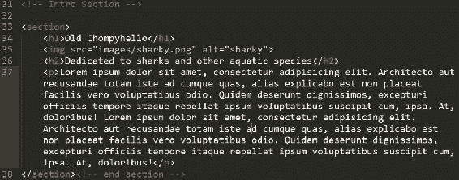

在第二个`<section>`中，有三个`div`标签，每个标签中都有一个`img`、`h2`、`p`和一个`a`标签。所以这个 HTML 并不复杂。最后一个部分看起来很像第一个部分；它只有`h1`和`h2`元素以及几个段落。然而，这里有个难题：我们希望页面底部的`h1`与网站的主`h1`元素不同。解决方法是添加一个类和基于这个类的样式。所以，在替代部分的`h1`元素内，我们将添加类属性。我们将输入`class=""`，并输入任何我们认为合适的名称或缩写：

```css
<h1 class="">Feeding Frenzy</h1> 
```

编程和计算机科学中最困难的工作是命名事物。这个名字应该有足够的意义，这样如果另一个人遇到你的代码并且想要接着你的工作，他们不会完全迷失。所以，在我们的例子中，我们将使用`alt-headline`。类是区分大小写的，所以我建议你使用小写，并用破折号分隔单词，这是 CSS 中常见的命名约定。如果你使用空格，它会被视为两个类，这并不是我们想要做的事情：

```css
<h1 class="alt-headline">Feeding Frenzy</h1> 
```

所以我们将保存我们的 HTML 并跳到我们的 CSS。

在`h1`下面，我们将添加我们的类名，前面加上一个句点作为选择器。输入`.alt-headline`并添加一个字体大小为 40px：

```css
h1 { 
  font-size: 70px; 
  line-height:1.4; 
  font-weight: bold; 
  color: #0072ae; 
} 
.alt-headline { 
  font-size: 40px; 
} 
```

在保存之前，我们将把 CSS 窗口缩小，这样我们就可以在代码旁边看到我们的网站。滚动到你的网站上的`h1`，你会在左侧的预览中看到它当前是`70px`：

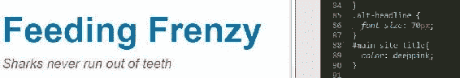

当你保存 CSS 时，`h1`变成了`40px`：

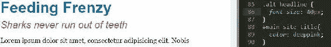

我把这个新的规则集放在原始的`h1`规则集下面，你可能会认为因为它是第二个，它会覆盖上面的那个。实际上并不是这里发生的事情。即使我把这个规则集移到`h1`上面，它仍然是`40px`。这是因为当作为选择器使用时，类比元素具有更大的权重：

```css
.alt-headline { 
  font-size: 40px; 
} 
h1 { 
  font-size: 70px; 
  line-height:1.4; 
  font-weight: bold; 
  color: #0072ae; 
} 
```

以下是前面代码的输出：

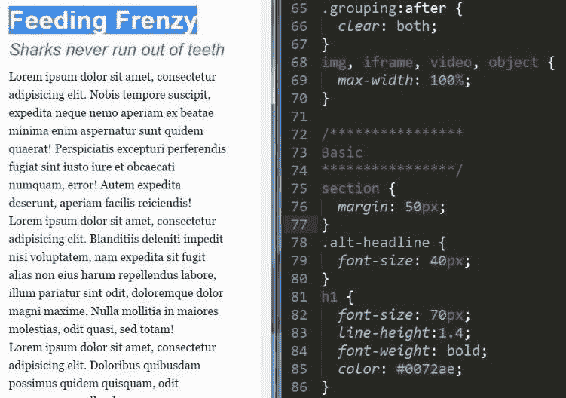

为了保险起见，让我们保留原始`h1`选择器下面的`alt-headline`规则集。

# 分类多个元素

类也用于对多个元素进行分类。如果你想要改变中间部分的`h2`标签，使其与页面其他地方的`h2`标签相似但不同，使用类将是完美的选择。让我们进入我们的 HTML，在`secondary-section`中的所有`div`标签中添加一个类，并称之为`column-title`。转到`The Octopus`，`The Crab`和`The Whale`标题，并使用 Sublime 的多光标浏览器功能为每个标题添加`class="column-title"`。例如，`The Octopus`标题应该是这样的：

```css
<h2 class="column-title">The Octopus</h2> 
```

然后，我们去到我们的 CSS，在`h2`下面添加`.column-title`。然后添加一些属性和值。添加`font-style`为`normal`；你想要去掉`italic`。我们的颜色是蓝色，`#0072ae`，我们将使`font-weight`为粗体：

```css
.column-title { 
  font-style: normal; 
  color: #0072ae; 
  font-weight: bold; 
} 
```

保存这个，转到浏览器，你会看到现在每个图像下面的`h2`标签与你在网站其他地方看到的`h2`标签不同：


底部和顶部的`h2`标签仍然是红色的，而且是斜体的：


类可以非常有用，用于命名和分类你想要看起来相同的相同元素组。接下来，让我们使用 ID 重命名一个元素。

# ID

滚动到我们网站的顶部，在我们的 HTML 中，转到`h1`：

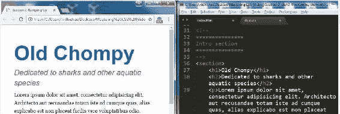

让我们给第一个`h1`标签一个特殊的 ID，叫做`main-site-title`：

```css
<h1 id="main-site-title">Old Chompy</h1> 
```

有了一个 ID，你也可以在引号内使用任何你想要的名称，只要它有意义。切换到 CSS，滚动到我们的`alt-headline`类的下面。这就是我们将添加`main-site-title`的地方。编写类和 ID 的主要区别在于，我们用句点开头的类和用数字符号或井号或井号（你想叫它什么都可以）开头的 ID：

```css
#main-site-title 
```

在这种情况下，我们可以说颜色是不同的：`深粉色`。保存并刷新网站以查看效果：

```css
#main-site-title{ 
  color: deeppink; 
} 
```

以下是前面代码的输出：

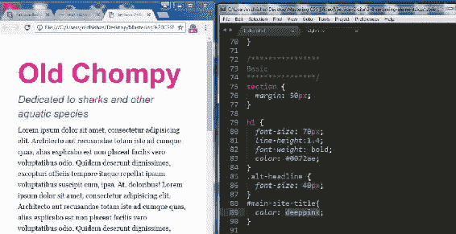

你可以看到这只改变了 Old Chompy 的`h1`，即具有 ID 的那个。

# 我们应该使用类还是 ID？

现在，你可能会想，类和 ID 之间有什么区别？嗯，首先要说的是，ID 的权重比类更大，确切地说是 10 倍。保持你的选择器轻量级是可扩展、可重用的 CSS 的关键之一。权重更大到底意味着什么？这意味着它更具体，ID 将覆盖任何类。我们将深入研究第四章中的特异性规则和权重，*使用模块化、可重用的 CSS 类和 CSS3 创建按钮*。现在，只需知道当目标相同元素时，ID 将覆盖类。第二点是，ID 是唯一的，因此，它只能在页面上使用一次。鉴于这两点，主要是第一点，作为编码标准，我很少使用 ID 进行样式设置，因为类几乎总是足够的。

使用简单类重命名元素是如此强大，可能是 CSS 中最有用的东西。虽然命名类有时可能有点棘手，但重要的是要使名称语义化或有意义。例如，如果您正在命名您的博客文章容器，将其命名为"blog-post-container"是可以的，因为这完美地描述了它是什么。ID 虽然有其时机和地点，但并不像类那样有用。在大多数情况下最好只使用类来保持您的特异性低。在下一节中，您将学习如何使用后代选择器根据其上下文来定位元素。

# 后代选择器

如你在上一节中学到的，使用类重命名元素是 CSS 中非常强大的功能。然而，这并不是定位特定类型元素的唯一方法。后代选择器允许您基于其祖先元素来定位页面上的元素。这通常是必要的，因为您只想根据元素的上下文应用边距或新字体。您可以使用后代选择器来获取上下文，而无需每次都在每个元素上放置一个类。我将首先解释父元素、兄弟元素和子元素是什么，以及祖先和后代元素是什么。如果我们想要使用后代选择器，我们需要对这些清楚明了。接下来，我们将使用后代选择器的一个实际示例，并通过计算后代选择器的权重来结束。

# 父元素、子元素和兄弟元素

让我们去我们的 HTML，看看`secondary-section`中这个嵌套良好的 HTML 代码。所以基本上，我们这里有一个`section`标签和三个在该部分内部的`div`标签：

```css
<section>
  <div>
    <figure>
      
    </figure>
    <h2 class="column-title">The Octopus</h2>
    <p>Lorem ipsum dolor...</p>
    <a href="#" class="button">Tenticals</a>
  </div>
  <div>
    <figure>
      
    </figure>
    <h2 class="column-title">The Crab</h2>
    <p>Lorem ipsum dolor...</p>
    <a href="#" class="button">Crabby</a>
  </div>
  <div>
    <figure>
      
    </figure>
    <h2 class="column-title">The Whale</h2>
    <p>Lorem ipsum dolor...</p>
    <a href="#" class="button">Stuart</a>
  </div>
</section>
```

所以`<div>`是`<section>`的子元素，而`<section>`是父元素。换句话说，`<div>`是`<section>`的后代，`<section>`是`<div>`的祖先。`<figure>`也是`<section>`的后代，``是`<section>`的后代。请注意，`<figure>`、`<h2>`和`<p>`在 HTML 中处于同一级别，因此它们是兄弟元素，它们也都是`<section>`的后代。这就是它的复杂程度；没有叔叔、没有阿姨，也没有远房表兄弟。

# 创建后代选择器

在上一节中，*重命名元素-类和 ID*，我们给所有`<h2>`添加了一个类，因为我们知道 HTML 中`secondary-section`的`<h2>`标签与所有其他`<h2>`标签不同。所以我们可能也想要将这个区域中的其他元素也设置为不同。这是我们可以做到最好的方式。不要在`<h2>`标签上放置类，而是在`section`标签上放置它，并从那里使用后代选择器。让我们去掉所有`<h2>`标签中的`class="column-title"`。在`section`元素上，让我们添加一个新的类，即`secondary-section`：

```css
<section class="secondary-section">
  <div>
    <figure>
      
    </figure>
    <h2>The Octopus</h2>
    <p>Lorem ipsum dolor...</p>
    <a href="#" class="button">Tenticals</a>
  </div>
  <div>
    <figure>
      
    </figure>
    <h2>The Crab</h2>
    <p>Lorem ipsum dolor...</p>
    <a href="#" class="button">Crabby</a>
  </div>
  <div>
    <figure>
      
    </figure>
    <h2>The Whale</h2>
    <p>Lorem ipsum dolor...</p>
    <a href="#" class="button">Stuart</a>
  </div>
</section>
```

保存这个，您会看到`<h2>`标签失去了它们的蓝色粗体颜色，因为在 CSS 中，我们仍然在定位已经不存在的`.column-title`类：

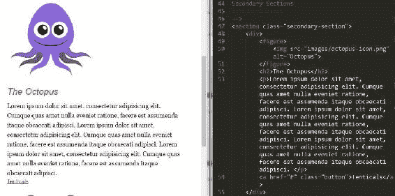

现在我要做的是进入 CSS，找到`.column-title`类，更新它：

```css
.secondary-section h2 {
  font-style: normal;
  color: #eb2428;
  margin-bottom: 10px;
}
```

这就是我们的后代选择器。如果我们保存并刷新，我们会看到它将那些`<h2>`标签改回我们想要的蓝色、粗体和非斜体的`font-style`：

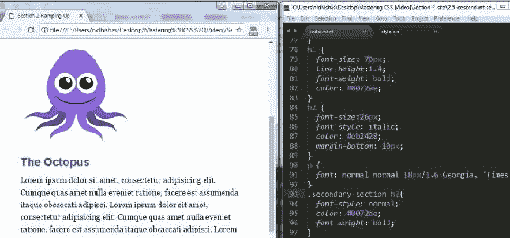

所以下面 CSS 中显示的`.secondary-section`选择器是一个后代选择器。它定位了所有在`secondary-section`内部的`h2`：

```css
.secondary-section h2 { 
  font-style: normal; 
  color: #0072ae; 
  font-weight: bold; 
} 
```

如果我们回头看一下 HTML，您会看到`h2`确实在`secondary-section`中：

```css
<section class="secondary-section"> 
    <div> 
        <figure> 
             
        </figure> 
        <h2>The Octopus</h2> 
```

现在我们可以更进一步。进入 CSS，在我们现有的`.secondary-section h2`规则集下面，键入`.secondary-section p`。这将定位我们`secondary-section`内部的段萌。添加一个深粉色的颜色，保存并刷新，您会看到现在所有的段落都是粉色的：

```css
.secondary-section p { 
  color: deeppink; 
} 
```

它看起来是这样的：

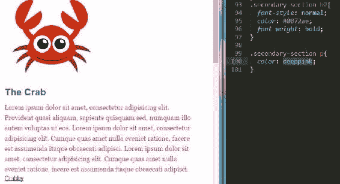

我们也可以对我们的`image`标签进行同样的操作。如果您回顾一下 HTML，我们的`image`标签位于`div`标签内，而`div`标签位于`figure`标签内。

```css
<section class="secondary-section"> 
    <div> 
        <figure> 
             
        </figure> 
```

切换回我们的 CSS，我们可以输入选择器`.secondary-section div figure img`，然后我们添加一个`10px`的实线边框，颜色为灰色：

```css
.secondary-section div figure img { 
  border: 10px solid #333; 
} 
```

以下是前面代码的输出：

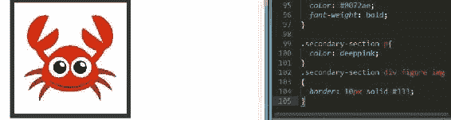

虽然我们可以看到它起作用了，并且我们在网站上的图像周围有了灰色边框，但我们的选择器比我们需要的更具体。我们可以只输入`img`而不是`div`和`figure`，边框仍然会存在：

```css
.secondary-section img { 
   border: 10px solid #333; 
} 
```

使用这样一个非常长的选择器还有另一个问题。以下选择器的权重更大，可能会覆盖您不希望覆盖的其他样式：

```css
.secondary-section div figure img { 
   border: 10px solid #333; 
} 
```

这违反了保持代码轻量级的原则。特异性是我真的想要强调的东西；不要用非常长的选择器过度使用它。事实上，作为一个经验法则，尽量不要超过三级深；当然也有例外，但在编写 CSS 时要记住这一点。原因是计算 CSS 选择器的权重是一门确切的科学，我将在后面的章节中详细介绍。我至少想现在介绍一下，这样我们就可以开始熟悉它。

# 计算选择器的权重

一个类值为 10 分，所以`.secondary-section`值为 10 分。像`p`或`div`这样的普通元素值为 1 分。因此，`.secondary-section p`选择器值为 11 分。`.secondary-section div figure img`选择器值为 13 分。让我们在值为 13 分的选择器下面创建另一个选择器，我们有`.secondary-section img`。然后，让我们将`border-color`改为`blue`：

```css
.secondary-section div figure img { 
   border: 10px solid #333; 
} 
.secondary-section img { 
 border: 10px solid blue; 
}
```

当我们保存时，我们的边框将保持灰色，因为我们最后一个选择器的点数仅为 11；它被前一个选择器的 13 点的点数击败了。这就是这些较长的后代选择器的问题，它们的权重更重：

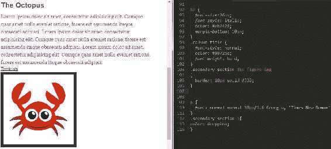

以下是前面代码的输出：

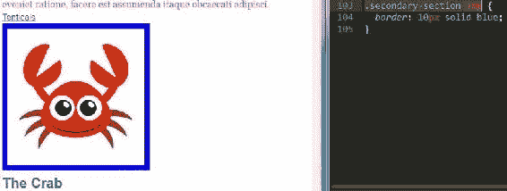

ID 的点值为 100 分，这就是为什么我建议不要使用它们。它们有太多不必要的权重，使特异性水平飙升。分配点值听起来有点像在视频游戏中记分，但不同之处在于您希望尽量保持在这个游戏中的点值低。如果您这样做，您将能够编写更简单的 CSS。

# BEM

保持特异性低的一种技巧是完全避免使用后代选择器，而是使用*BEM*。BEM 代表*块元素修饰符*，是 CSS 的命名约定。其思想是使用特定的命名约定为您最终要样式化的每个元素添加一个类。这样，每个元素的特异性得分为 10，因此每个元素的特异性相同。除此之外还有很多内容，我建议您在[`getbem.com/`](http://getbem.com/)上了解更多。我倾向于使用 BEM 方法，但这并不意味着后代选择器完全需要避免。我认为它们有时机和地方。我的建议是保持您的后代选择器合理，并避免超过 3 级的较长后代选择器。

# 总结

在本章中，您了解了良好文本编辑器的特性，讨论了 CSS 重置，探索了 Chrome 的 DevTools 的故障排除功能，并学习了如何使用类重命名元素。在本章的最后一节中，您了解了后代选择器。

下一章是关于使用浮动创建多列层并了解浮动引起的问题的解决方案。
