# 第三章：使用浮动创建页面布局

为了在所有浏览器中创建支持的多列布局，我们将使用浮动。浮动乍看起来非常简单，但对它们有一些不直观的怪癖，如果不完全理解可能会引起一些挫折。这可能是因为浮动的真正起源不是用于布局，而是为了实现文本围绕图像轻松流动的常见杂志技术。因此，在本章中，我们将深入研究浮动。我们将介绍浮动的基本用法，然后通过使用浮动创建布局（并在后续部分中解决浮动引起的头痛）

# 浮动介绍-围绕图像流动的文本

让我们从介绍浮动开始这一章。我们将讨论浮动的最初目的，然后是它们引起的基本问题以及如何清除浮动后面的元素。在本节中，我们还将开始制作一个关于鲨鱼电影的新 HTML 页面，您可以在书籍下载包中找到。

# 鲨鱼电影页面

这里有一个关于鲨鱼电影的新 HTML 页面。如果您查看此页面，您会看到一个图像位于标题的顶部，文本的顶部，并且链接的顶部；当您向下滚动时，您会看到每个电影都有三个类似的部分：

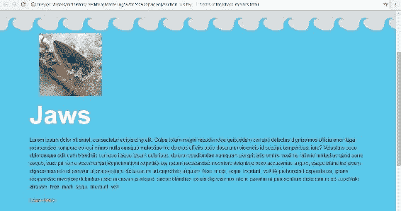

HTML 非常简单。有三个部分，每个部分都有一个`wrapper`类的`div`标记，用于居中内容。在`wrapper`类中，有一个包含图像的锚点标记。在锚点标记下面是一个包含标题和一些段落文本的`h1`标记。然后是一个锚点标记，这是一个链接以了解更多信息。以下是第一部分的屏幕截图：

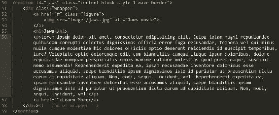

# 浮动的最初目的

让我们看一下最终项目，如下图所示。我们希望将图像浮动到左侧，并使标题和文本围绕它流动：

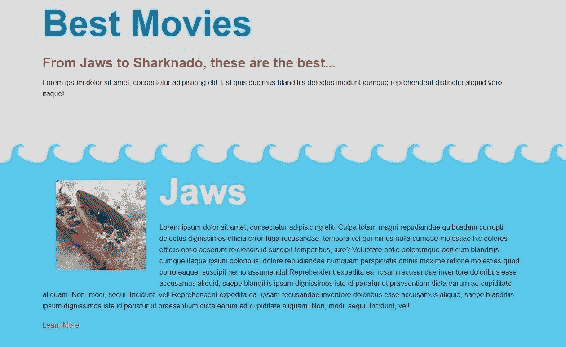

让我们在 CSS 中定位该图像。我们不是在选择器中定位图像，而是实际上定位图像的容器，即具有`figure`类的锚点标记：

```css
<a href="#" class="figure"> 
```

我不想只将`.figure`类作为我的选择器目标，因为我可能会在其他图像容器上使用这个类，并且可能不希望它们全部浮动。因此，让我们基于其父级使用后代选择器。其父级位于部分顶部，具有多个类：`content-block`，`style-1`和`wave-border`：

```css
<section id="jaws" class="content-block style-1 wave-border"> 
```

这是一种模块化的方法，我们将在下一节中更详细地介绍。我们正在寻找的主要类是`content-block`。`style-1`和`style-2`类只控制两种不同的颜色方案，`wave-border`添加了波浪的重复背景图像到第一部分的顶部。最后，在我们的 CSS 中，我们的选择器将是`.content-block .figure`，因此我们正在针对任何具有`content-block`类的元素中具有`figure`类的元素进行定位：

```css
.content-block .figure { 
  margin: 30px; 
} 
```

因此，在这个规则集下，我们将在`margin`属性下输入`float: left`：

```css
.content-block .figure { 
  margin: 30px; 
 float: left 
} 
```

当我们刷新页面时，我们看到一切都按计划进行。这几乎太简单了。我们在所有三个部分几乎完全实现了我们的目标：

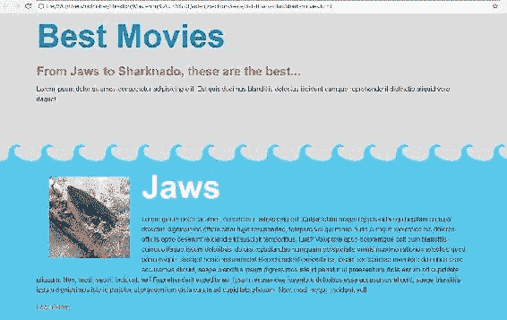

让我们在我们的 CSS 中为`h1`和`p`添加背景颜色，只是为了看看这里发生了什么。我们将为`h1`赋予`deeppink`的背景颜色，并通过`content-block`为`p`赋予`green`的背景颜色：

```css
.content-block h1 { 
  color: #fff; 
  background-color: deeppink; 
} 
.content-block p { 
  font-family: Georgia, 'Times New Roman' sans-serif; 
  background-color: green; 
} 
```

以下是前面代码块的输出：

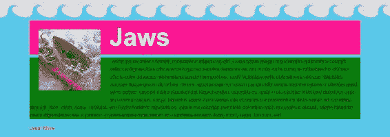

注意背景是如何在图像后面的。文本向右流动，但元素本身不再将浮动元素，即图像，视为正常流的一部分。当它们的显示属性受到影响时，浮动元素本身会发生变化。例如，浮动的锚点标签，或者真的是一个 class 为`figure`的锚点，开始像块级元素一样行事。它现在会响应宽度和上下边距；正如我们所见，它已经响应了下边距。然而，它不一定会强制换行。让我们将它向右浮动，它应该有一个非常相似的效果：

```css
.content-block .figure { 
  margin: 30px; 
  float: right; 
} 
```

以下是上述代码块的输出：

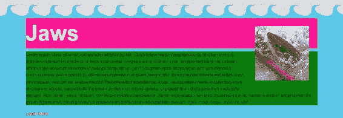

# 使用 clear 属性解决浮动的基本问题

我们可以使用`clear`属性来阻止浮动元素下面的元素表现异常。例如，让我们给段落添加`clear`属性。我们将添加`clear: both`，它清除左右两侧的浮动元素：

```css
.content-block p { 
  font-family: Georgia, 'Times New Roman' sans-serif; 
  background-color: green; 
  clear: both; 
} 
```

现在，当您刷新时，您会看到段落文本坐在浮动元素下面：

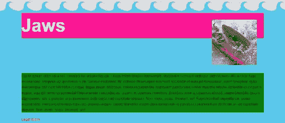

我们也可以对`h1`做同样的事情，它会位于下面：

```css
.content-block .figure { 
  margin: 30px; 
  float: right; 
} 
.content-block h1 { 
  color: #fff; 
  background-color: deeppink; 
 clear: right; 
} 
```

我们也可以直接说`clear: right`，因为在它上面的浮动是向右浮动的。

保存 CSS 并查看网站后，您会看到它起作用了。`h1`标签也位于`.figure`下面：

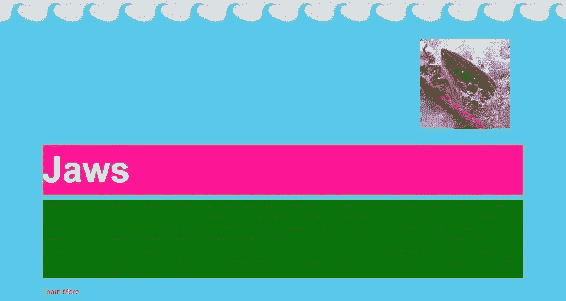

然而，如果您在`h1`的规则集中输入`clear: left`，它不一定会起作用，因为这里没有左浮动的元素：

```css
.content-block h1 { 
  color: #fff; 
  background-color: deeppink; 
  clear: left; 
} 
```

以下是上述代码块的输出：

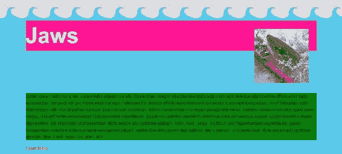

在这里，`None`是`float`和`clear`的默认值。因此，我们可以在这两个上说`clear: none`，它将恢复到添加`clear`属性之前的状态：

```css
.content-block h1 { 
  color: #fff; 
  background-color: deeppink; 
  clear: none; 
} 
.content-block p { 
  font-family: Georgia, 'Times New Roman' sans-serif; 
  background-color: green; 
  clear: none; 
} 
```

以下是上述代码块的输出：


然而，由于`clear: none`是默认值，您可以从这两个选择器中删除整个属性；这将对网站产生相同的影响。我几乎从不使用 clear left 和 clear right；`both`值似乎在大多数情况下都足够了。

在本节中，我们看到了浮动元素的传统用法，以及浮动元素下面的元素如何围绕浮动元素流动。这可以使用`clear`属性来停止。这种技术很有用，但老实说，浮动对于构建多列布局更有用。现在让我们来看看。

# 创建多列布局

浮动设计用于围绕图像流动文本。然而，浮动也是构建多列布局的最常见方式。在本节中，我们将看看如何将元素浮动到彼此旁边以创建页面布局。

所以，我们目前在 HTML 中次要部分有三个 class 为`column`的`div`标签：

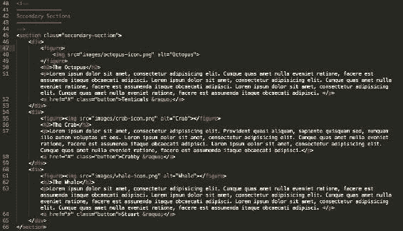

以下截图展示了最终的网站。这是我们的目标。我们希望有三个相等的列，之间有一个小的间距或边距：

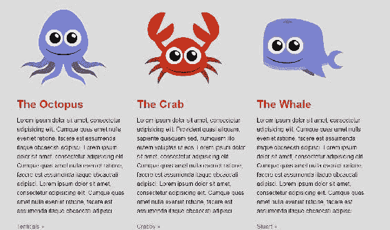

在我们当前的网站中，列是堆叠在彼此上面的。现在，我们有简单的行，所以我们想使用浮动来解决这个问题。在我们最终的网站中，我们希望将所有内容都居中在页面的中间，但现在，我们所有的内容都从浏览器窗口的一边到几乎是浏览器窗口的另一边：

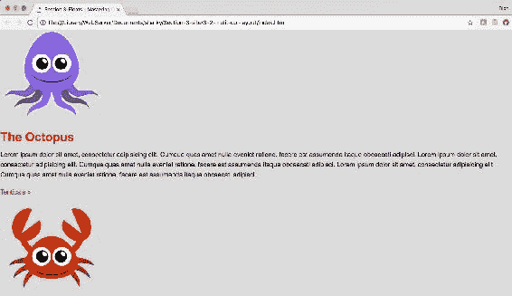

让我们通过居中我们的`div`标签来修复这个问题。

# 居中一个元素

我们真正需要做的是将整个内容包裹在一个`div`标签中；所以让我们这样做。进入 HTML 文件。在开放的`section`标签下一行，添加`<div class="wrapper">`。并在关闭的`section`标签之前，用`</div>`关闭它：

```css
<section class="secondary-section"> 
    <div class="wrapper">
        <div>...</div>
        <div>...</div>
        <div>...</div>
    </div> 
</section>
```

现在，切换到 CSS 文件。`.wrapper`标签将是一个更可重用的类。为了居中任何元素，我们会给它一个 margin，并且我们会使用两值语法：上和下将是零，左和右将是自动。我们还必须给它一个宽度为`960px`。没有宽度，你真的无法使用这种 margin 技术来居中它：

```css
.wrapper { 
  margin: 0 auto; 
  width: 960px; 
} 
```

好了，我们完成了；所有的内容现在应该都居中在这个包裹器内：

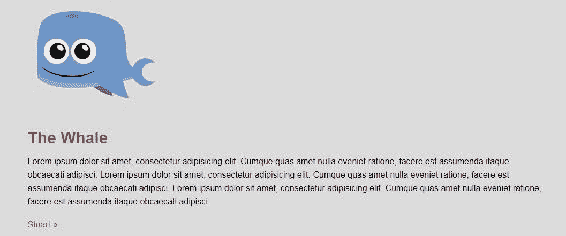

就像我说的，`wrapper`类很好而且可重用。我会在网站的任何地方使用`wrapper`类来居中一组元素。

# 浮动列

所以，回到我们的业务顺序：在我们的主页上浮动这三列。为了做到这一点，我想给每个`div`标签一个`column`类，这样我们就可以对其进行样式设置。所以，在 HTML 中，让我们去到次要部分的每个`div`标签，并使用 Sublime Text 的多重光标功能一次性给它们都添加`class="column"`：

```css
<section class="secondary-section"> 
    <div class="wrapper">
        <div class="column">...</div>
        <div class="column">...</div>
        <div class="column">...</div>
    </div> 
</section>
```

在我的 CSS 中，我已经用一个大的注释标注了这部分 CSS，我鼓励你也这样做。

在这个注释下面，我们将针对`.column`并应用`float: left`。宽度将是`320px`。

```css
/**************** 
3 columns 
****************/ 
.column { 
  float: left; 
  width: 320px; 
} 
```

理想情况下，每当你浮动元素时，尝试添加一个宽度。如果所有三列都是`320px`，那将恰好加起来是 960 像素，正好适应那个包裹器的宽度。如果我们使用的数字加起来超过 960 像素，那么不是所有的三个`div`标签都会适应那个空间。其中一个会换行到底部，所以它们不会都在一行上。重要的是，所有浮动的`div`标签的宽度永远不要超过父`div`标签的宽度。所以保存这个并刷新网站：

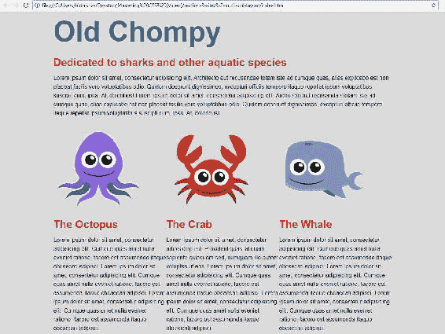

看起来所有三列都浮动在一起。这个效果还不错，只是列之间没有任何间距。所以让我们回到我们的代码，给它一个`margin-left`属性，值为`30px`。保存并刷新浏览器：

```css
.column { 
  float: left; 
  width: 320px; 
  margin-left: 30px; 
} 
```

以下是前面代码块的输出：

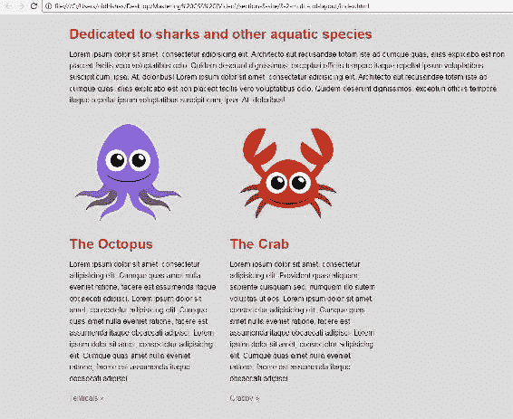

我们得到了`30px`的边距，但我们的第三列也因为无法适应允许的宽度而漂移到了底部。

让我们通过将列的宽度减小到每个`300px`来修复这个问题：

```css
.column { 
  float: left; 
  width: 300px; 
  margin-left: 30px; 
} 
```

现在如果你看浏览器，你也会看到我们不需要在第一列上添加`margin-left`。我们不需要在空白处旁边添加左边距：

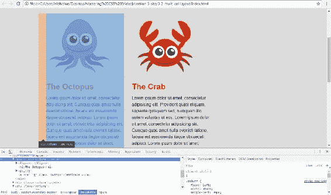

让我们去掉第一列的左边距。我们可以通过使用一个叫做`first child`的伪类来定位那个单独的`.column`属性。

# 使用伪类定位`.column`

添加`.column:first-child`选择器将定位到列元素的第一次出现。我们将把`margin-left`添加为零。当我们保存这个时，我们得到了三个相等的列，每个都有一个`margin-left`，除了第一个：

```css
.column:first-child { 
  margin-left: 0; 
} 
```

以下是前面代码块的输出：

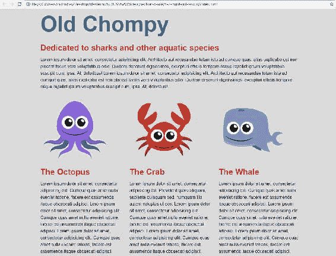

这种技术对于两列、四列或任意数量的列都同样适用。

# 折叠的容器

所以，列的一切都很好，除了如果你尝试向下滚动页面，你会发现我们离底部非常紧。

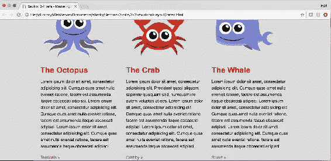

让我们看看当我们为包裹所有内容的容器`secondary-section`添加`margin-bottom`属性时会发生什么：假设`margin-bottom: 40px`：

```css
/**************** 
3 columns 
****************/ 
.secondary-section { 
  margin-bottom: 40px; 
} 
```

如果我们保存这个，它在浏览器中实际上什么也没做。内容仍然紧贴着底部。让我进一步说明这个问题。如果我有一个绿色的背景颜色，那么你会期望整个背景都是绿色的：

```css
.secondary-section { 
  margin-bottom: 40px; 
  background-color: green; 
} 
```

然而，如果我们添加前面的代码并保存，背景颜色并没有变成绿色。所以，让我们实际检查一下这个元素。使用 Chrome 的 DevTools 在浏览器中检查`secondary-section`。我们会看到`margin-bottom`和`background-color`都在被应用的过程中。但我们在页面上看不到任何绿色的东西：

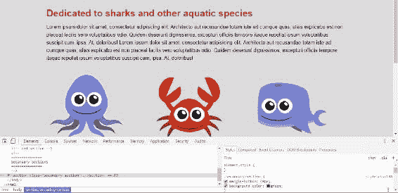

当您将鼠标悬停在`secondary-section`元素上时，您将看到它在屏幕上以桃红色突出显示的空间（如果您正在查看打印副本，则将以不同的灰色阴影显示）：

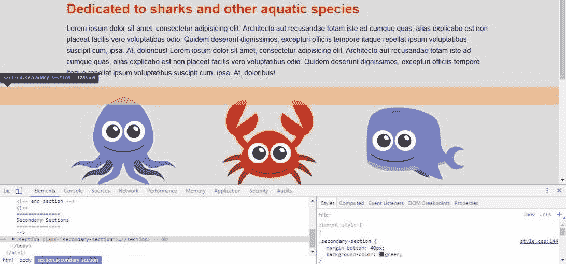

容器实际上已经坍塌了。当父元素内的所有元素都被浮动时，就会发生这种情况：容器坍塌，浮动被带出正常流，容器没有高度。

让我们看看我们能做些什么来解决这个问题。

# 解决浮动的问题

好的，让我们看看我们的问题。您已经学会了如何将堆叠的行转换为水平列，以实现多列布局，但是我们围绕浮动元素的包含元素已经完全坍塌并且失去了高度，因为它内部的所有元素都被浮动了。作为一个坍塌的元素，它看起来不像是响应`margin-bottom`属性或我们分配给它的`background-color`。因此，在本节中，我们将看看四种不同的方法来解决这个坍塌，并尝试理解处理它的最佳方法。首先，我们将使用`clear`方法，然后是`overflow: hidden`方法，然后是`float`方法，最后是最优选的方法：`clearfix` hack。

# 使用清除方法

让我们使用`clear`属性来解决这个问题。在`secondary-section`的末尾，我们将向一个新的`div`添加一个`clear`类，使用以下代码：

```css
<div class="clear"></div> 
```

接下来，我们将进入我们的 CSS，在全局样式保留区域，在针对`wrapper`类的规则集下面；这是我们将创建`clear`选择器并添加`clear: both`的地方：

```css
/***************
Global
***************/
::-moz-selection {
  background-color: #eb2428; 
}
::selection {
  background-color: #eb2428; 
}
.wrapper {
  margin: 0 auto;
  width: 960px;
}
.clear {
 clear: both;
}
```

因此，如果我们保存并返回到浏览器，我们的背景颜色将是绿色，底部间距为`50px`。一切都运行得很好：

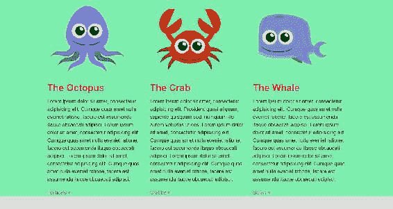

然而，我们在页面上添加了额外的非语义标记。我们甚至可能因此而受到 SEO 的扣分。让我们探索其他方法来做到这一点，而不添加额外的标记。去掉我们刚刚添加到 HTML 中的额外标记：

```css
<div class="clear"></div> <!-- delete this -->
```

我们的坍塌将返回。现在我们将无法再看到绿色的背景；这就是我们知道坍塌存在的方式：

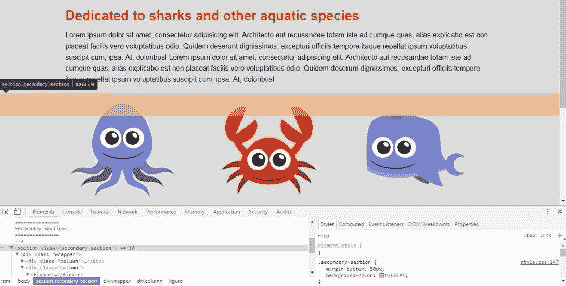

# 使用 overflow 属性和 hidden 值

我们将看看的下一种方法是`overflow: hidden`。转到您的 CSS 并找到`.secondary-section`类。我们可以做的是添加值为`hidden`的`overflow`属性：

```css
.secondary-section { 
  margin-bottom: 50px; 
  background-color: #7EEEAF; 
  overflow: hidden; 
} 
```

`overflow: hidden`是一个真正的 hack。它从来不是用来修复坍塌的容器的；它是用来隐藏任何溢出其容器的内容图像或文本的。然而，神奇的是，`overflow: hidden`也清除了坍塌。如果我们保存我们的 CSS 并转到我们的网站，我们将看到这一点，因为背景现在是绿色的：

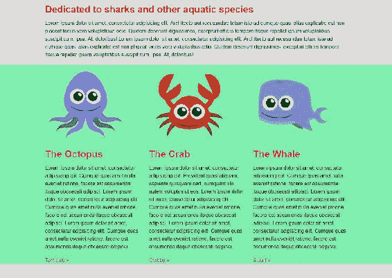

`overflow: hidden`的一个小问题是，您可能希望内容溢出容器，例如下拉菜单或工具提示。`overflow: hidden` hack 将隐藏溢出内容 - 没有什么意外！这是一个解决方案，但并不总是理想的。例如，在我们确切的情况下，我们可能希望这只章鱼有点从容器中爬出来。让我们进入 Chrome DevTools 并给它`margin-top: -50px`。如您所见，现在图像的顶部不再显示，溢出被隐藏了：

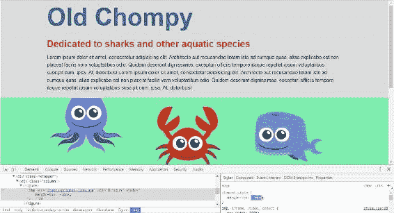

所以这对我们来说不是一个好的解决方案。让我们从我们的 CSS 文件中删除`overflow: hidden`声明，并看看下一种方法：`float`方法。

# 浮动方法

我们可以通过将容器浮动到左侧或右侧来防止元素坍塌。让我们这样做；让我们向我们的`secondary-section`添加`float: left`或`float: right`。任何一个都可以：

```css
.secondary-section { 
  margin-bottom: 50px; 
  background-color: #7EEEAF; 
  float: left; 
} 
```

一旦我们保存了这个，我们会看到我们有绿色的背景，所以坍塌不再发生，但明显的问题是我们已经向左浮动了。我们希望这个 div 居中：

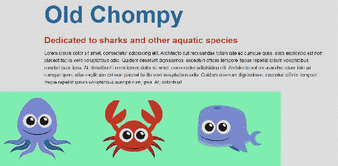

这种方法显然有一个明显的缺点。有些情况和一些情况下它可能是一个完美的解决方案，但在这种情况下，有一个明显的问题：我们不再居中。从你的 CSS 中删除`float: left`，并探索我的最喜欢，我认为最好的解决方案：**clearfix hack**。

# clearfix hack

如果我们看一下下面的 CSS，在我们的重置之后，这些规则集构成了我们的**clearfix**：

```css
/* clearfix */ 
.grouping:before, 
.grouping:after { 
  content: " "; 
  display: table;  
} 
.grouping:after { 
  clear: both; 
} 
```

这段代码实际上是我们 CSS 的基础层。基本上，这样做是在任何具有`grouping`类的元素之前和之后创建一个伪元素。这个伪元素有一个空白内容和显示设置为表。然后我们在代码块下面有`after`伪元素，它有`clear`属性设置，并清除它之前的任何浮动。

有时你可能会看到`clearfix`作为类名，而不是`grouping`。我倾向于使用`grouping`，因为我认为这更有意义；你在某种程度上在分组元素，这更有语义。不过这并不重要；`clearfix`和`grouping`都能做同样的事情。

好了，这已经在 CSS 中了，所以我们除了去 HTML 中的`secondary-section`，只需添加这个`grouping`类。所以我们给它添加了第二个类：

```css
<section class="secondary-section grouping"> 
```

当我们保存并刷新时，我们有了我们的容器；坍塌已经解决了。在下一张截图中，我们看到了背景颜色和底部边距。我们在这里的情况非常好：

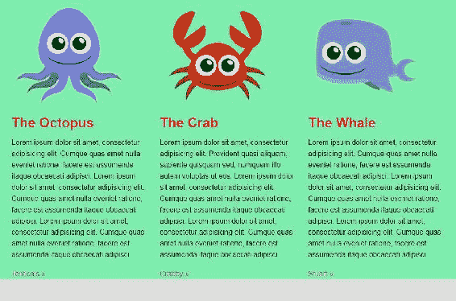

clearfix 在 IE8 中可以工作，但在 IE7 中不行，除非你添加一个 IE 特定的样式表。这实际上是放在索引中的。所以在`index.html`的头部，我有这个样式表，如下一张截图所示，专门为 IE7。它的作用是给 grouping 一个`1`的缩放。这会触发旧版本的 IE 中的`hasLayout`，从而清除坍塌：

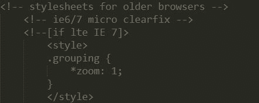

如果这对你来说没有太多意义，不要担心；它不一定要有。不过，知道这可以让 clearfix hack 在旧版本的 IE 中工作。总的来说，这是非常深的浏览器支持，而且非常容易使用，这是许多前端开发人员首选的清除坍塌浮动的方法。这绝对是我解决问题的最喜欢的方法。

在这一节中，你学会了使用以下方法来修复由浮动引起的父元素坍塌：

1.  一个空的清除 div。

1.  `overflow: hidden`。

1.  通过浮动父元素。这三种方法都有效，但都有轻微到严重的缺陷。

1.  具有非常深的支持、易于使用和语义化风格的 clearfix hack 往往是最佳方法。我在每个项目中都使用它。它可以轻松解决浮动的最大问题之一：坍塌。我喜欢 clearfix hack 的另一点是它是一种非常模块化的 CSS 方法。只需在你的标记中的任何地方添加`clearfix`类，你就可以摆脱坍塌的容器。

# 总结

在本章中，我们讨论了传统的浮动元素的使用：围绕图像流动文本。然后我们看了看使用浮动来构建多列布局。最后，我们学会了如何解决使用浮动时出现的问题。我们发现 clearfix hack 是修复浮动坍塌的最佳方法。在下一章中，我们将扩展模块化 CSS，使用模块化方法创建现代按钮。
