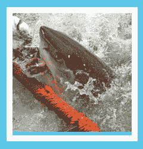
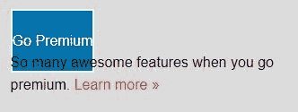

# 第四章：使用模块化、可重用的 CSS 类和 CSS3 创建按钮

拥有模块化和可重用的 CSS 使其组织有序且简洁，从而避免出现让你抓狂的情况。如果能够在标记中的任何位置使用其类并且不需要这些类被父元素限定为后代选择器，那么 CSS 就是“可重用”的。术语“模块化”指的是通过向其添加另一个类来为按钮添加变化的能力，以便一个元素可以有两个类，这两个类可以组合在一起形成非常不同的东西。

一个很好的例子是如何编写模块化和可重用的 CSS：创建按钮。然而，这个概念应该应用到网站的所有组件中。在本章中，我们有很多内容要讨论。在前两节中，我们将介绍模块化 CSS 和多个类，然后我们将转变话题，讨论选择器如何在特异性规则部分互相覆盖。然后，我们将深入研究 CSS3 的过渡、变换和渐变，并逐步介绍创建和样式化一个大的呼吁行动按钮的每个步骤。

# 使用模块化 CSS 创建按钮

在这一部分，我们将创建具有模块化 CSS 类的按钮。我们将找出模块化 CSS 究竟是什么，以及为什么它很有用。首先，让我们看一下我们将要创建的最终网站，并探索我们将使用的不同按钮类型。

# 不同的按钮类型

在顶部，我们有一个巨大的“立即订阅”呼吁行动按钮：


在首页向下滚动一点，我们会发现这些带有漂亮悬停状态的“幽灵”按钮：


在电影页面上，我们有相同的标准按钮。它只是颜色不同，并且位置有点不同。这出现在所有三个电影部分中：


因此，在这一部分，我们将在所有三列的底部构建这些标准按钮：


# 构建标准按钮

我们的起点让我们走了很长一段路，但应该相当容易：


让我们跳转到我们次要部分的 HTML 中：


我将在每个列底部的三个锚元素中添加`button`类。

```css
<a href="#" class="button">Tenticals &raquo;</a>
```

现在，跳到我们 CSS 的底部，让我们为我们的新部分添加一个巨大的注释，并命名为“按钮”。

```css
/****************
Buttons
****************/
```

这是我们所有按钮样式的地方。

我们要做的是创建`.button`选择器。所有共享的样式属性都将放在这里。我们不会在按钮选择器中放置任何定位属性，因为按钮可以放置在任何位置：

```css
/****************
Buttons
****************/
.button {
}
```

让我们从添加边框开始。我们将选择两像素实线和深灰色。我们将把相同的颜色应用于文本：

```css
.button {
   border: 2px solid #333;
   color: #333;
}
```

保存并刷新浏览器后，它开始略微类似按钮：


现在我们需要添加一些填充。让我们回到我们的 CSS，并使用两个值的填充快捷方式：`10px`用于顶部和底部，`0px`用于左右。这是因为我们最终会将文本居中。让我们还将显示属性更改为`block`，因为这些是内联元素，我们希望它们的行为像块级元素一样：

```css
.button{
   border: 2px solid #333;
   color: #333;
   padding: 10px 0;
 display: block;
}
```

保存这个，刷新浏览器，看看效果：


正如你所看到的，我们现在必须添加一些文本级属性。首先，让我们添加一个字体系列。我们将选择典型的`sans-serif`堆栈：`Arial, Helvetica, sans-serif`。然后，使用`text-align`属性将文本对齐到元素的中心。我们还将把`font-weight`设置为`bold`，然后使用另一个叫做`letter-spacing`的属性，并添加一个值`1.5px`。如果你不熟悉`letter-spacing`属性，它基本上就是你所想的——它在每个字母之间创建了水平空间：

```css
/****************
Buttons
****************/
.button{
  border: 2px solid #333;
  color: #333;
  padding: 10px 0;
  display: block;
  font-family: Arial, Helvetica, sans-serif;
  text-align: center;
 font-weight: bold;
 letter-spacing: 1.5px;
}
```

保存并刷新网站后，我们将拥有我们的按钮元素。目前还没有悬停状态；我们将在另一节中介绍：


如果您现在转到电影页面，您将看到那里的“了解更多”链接，也需要成为按钮：


让我们跳到`shark-movies.html`文件中的标记，并做同样的事情。在每个电影部分底部的每个锚点标签中添加`button`类：

```css
<a href="" class="button">Learn More</a>
```

保存并刷新，您将立即得到一个按钮：


它有点起作用；我们有一个按钮，但不完全。它们看起来像按钮，但颜色不对，太宽，而且没有定位到右侧。此外，文本与背景的对比度不佳，特别是在较暗的部分。因此，我们需要做一些修复，因为这些按钮与主页上的按钮不同，主页上的按钮是全宽的。

让我们现在修复这些按钮，看看如何更加模块化，并添加多个类以变化按钮。

# 多个类

总结一下，到目前为止，您已经学会了如何创建一个可以在网页的任何地方重复使用的类，以创建一个按钮。然而，按钮在网站上往往会有所不同。例如，您可能会有像“确定”、“关闭”、“取消”、“提交”和“添加到购物车”等按钮。所有这些按钮都有不同的含义，因此它们的颜色或样式略有不同。在某些情况下，例如我们的电影和索引页面，按钮最终会因页面布局的差异而有所不同。在本节中，我们将变得更加模块化，并学习如何使用多个类来改变我们按钮的外观。我们将看一些多个类如何为我们提供一些便利，以便在整个网站上样式化我们的按钮。

以下截图展示了最终的网站。我们希望按钮看起来像“了解更多”按钮。它们向右浮动，是白色的，有白色边框，宽度更窄：


目前我们的网站情况如下。我们的按钮是深灰色的，并且宽度全屏，但不符合我们的要求：


# 更改按钮的宽度

首先，让我们通过创建一个名为`button-narrow`的新类来解决宽度问题。在我们的 CSS 中，在上一节创建的`.button`规则集下面，创建一个名为`.button-narrow`的新类。非常简单，宽度将是`25%`：

```css
/****************
Buttons
****************/
.button {
  border: 2px solid #333;
  color: #333;
  padding: 10px 0;
  display: block;
  font-family: Arial, Helvetica, sans-serif;
  text-align: center;
  font-weight: bold;
  letter-spacing: 1.5px;
}
.button-narrow {
 width: 25%;
}
```

保存这个。接下来，转到`shark-movies.html`文件。转到每个带有`button`类的三个锚点标签。我只会展示“了解更多”按钮的代码，但对于所有按钮，代码更改都是相同的：

```css
<a href="" class="button ">Learn More</a>
```

让我们将新的`button-narrow`类添加到这些元素中：

```css
<a href="" class="button button-narrow">Learn More</a>
```

保存后，转到浏览器，您会看到所有三个部分的按钮现在都变得更小了：


让我们再进一步，创建另一个名为`button-alt`的类，用于控制边框和字体颜色。

# 更改按钮的边框和字体颜色

让我们也将`button-alt`类添加到这 3 个“了解更多”按钮中。

```css
<a href="" class="button button-narrow button-alt">Learn More</a>
```

现在转到 CSS，并在我们的`.button-narrow`选择器下方输入`.button-alt`作为我们的新选择器。我选择`button-alt`作为类，因为这是另一种按钮颜色。然后，指定`color`为白色，`border-color`为白色：

```css
.button-alt {
  color: #fff;
  border-color: #fff;
}
```

保存后，转到网站，您会看到我们几乎到达目标了：


# 定位按钮

最后一件事是按钮的位置。它目前位于左侧，需要位于右侧。当然，我们可以创建一个名为`button-right`的类，将按钮浮动到右侧。然而，将元素浮动到左侧或右侧是非常常见的，甚至在按钮之外也是如此。最好将类名保持更通用，例如`float right`和`float left`。这样，我们可以将任何东西浮动到右侧或左侧。在我的情况下，在 CSS 的`Buttons`部分之前，我有我的全局样式：


在全局列表下面，我将复制我的标准模块化样式库：


这是我多年来建立的基本样板的一部分，其中包括`float-left`、`float-right`、`clear`、`bold`、`hidden`和一些其他常见的模块化类。您可以在下载包中看到完整的列表。这些可以在整个网站中重复使用。现在，在`shark-movies.html`文件中，让我们简单地将`float-right`类添加到我们的三个锚标签中：

```css
<a href="" class="button button-narrow button-alt float-right">Learn More</a>
```

保存并刷新鲨鱼电影网站。您现在将看到按钮向右浮动：


我还应该指出，我们每个部分周围的容器不会坍塌。让我们进入 DevTools 看看原因。以下截图中突出显示的具有`content-block`类的部分之所以没有坍塌，是因为我向其中添加了 clearfix `grouping`类：


如果我将这个删除并从那一行中删除`grouping`，您将看到坍塌会发生。因为我们有这个`grouping`类，我们确保这个部分不会坍塌：


因此，总之，我们遵循了一种非常模块化和可重用的方法来构建我们的按钮，并创建了一些可以用来改变按钮样式的模块化按钮相关类。我们还有其他方法可以做到这一点。我可以使用后代选择器来根据它们的父级样式化按钮。这样，content-block 内的所有按钮将始终向右浮动，并且是白色而不是深灰色。如果除了内容块之外的其他区域也提供了相同的替代按钮样式，这将是一个不错的选择。接下来，让我们谈谈为什么需要一种模块化、可重用和轻量级的 CSS 方法。我们将通过讨论特异性规则来做到这一点。

# 特异性规则

我们开始了解到，CSS 的模块化方法使我们能够将类作为 CSS 的小块，可以在网页的任何地方使用来为任何元素设置样式。这使得编写 CSS 非常方便。然而，这仅在 CSS 保持轻量级时才有效。正如您将在本节中了解到的，每个 CSS 选择器都可以在一个规模上进行衡量，最重的选择器将赢得两个竞争选择器之间的样式战。因此，我将首先解释不同选择器的权重以及它们如何相互推翻。然后，我们将稍微讨论一下通用选择器和`!important`声明如何适用于选择器的权重。

# 不同选择器的权重

所有选择器都被分配了一个权重，最重的选择器在存在冲突的 CSS 规则时优先。在构建网站时，通常会出现一种情况，即通用样式会在不同情况下被更具体的样式覆盖。在样式表顶部的全局区域中，为所有段落元素设置了一个非常广泛的样式：

```css
p {
  font-size: 16px;
  line-height: 1.6;
  margin-bottom: 20px;
}
```

字体大小为`16px`。有一个`line-height`属性为`1.6`和`margin-bottom`为`20px`。自然地，我可能想要在不同情况下覆盖`line-height`或`margin-bottom`。让我们尝试使用选择器`.content-block p`来覆盖它：

```css
p {
  font-size: 16px;
  line-height: 1.6;
  margin-bottom: 20px;
}
.content-block p {

}
```

这是一个后代选择器。现在让我们添加`line-height`为`1.8`和`margin-bottom`为`40px`：

```css
.content-block p {
 line-height: 1.8;
 margin-bottom: 40px
}
```

切换到网站上查看原始设置。这个后代选择器应该针对主文本区域中的任何内容或段落文本：


当我们保存我们的 CSS 并刷新网站时，我们会得到更多的行高和底部边距，就像你在下面的截图中看到的那样：


那么每个选择器的权重是多少呢？嗯，你可以认为内联样式值为 1000 分，ID 值为 100 分，类值为 10 分，元素值为 1 分。在我们一直在看的例子中，单个`p`元素选择器的值只有 1 分，而`.content-block p`，它是一个类和一个元素，值为 11 分：


这个分数系统决定了哪个选择器会获胜。在这种情况下，这两个选择器都是针对段落元素的；然而，因为`.content-block p`值为 11 分，它将击败它上面的规则集，因为作为元素选择器，它只值 1 分：

```css
p {
  font-size: 16px;
  line-height: 1.6;
  margin-bottom: 20px;
}
.content-block p {
  line-height: 1.8;
  margin-bottom: 40px
}
```

ID 的权重是 100 分，是类的 10 倍。在我们的`shark-movies.html`文件中，你可以看到《大白鲨》的第一部分有`jaws` ID：

```css
<section id="jaws" class="content-block style-1 wave-border grouping">
```

现在让我们切换回我们的样式表，并创建一个新的规则集，如下所示：

```css
#jaws p {
  line-height: 3;
}
```

当我们刷新浏览器时，你会看到`line-height`为`3`生效了：


我们使用的 ID 值为 101 分的选择器将覆盖具有类和元素值仅为 11 分的选择器，以及仅具有 1 分元素值的选择器。ID 的权重，在我的情况下意味着我倾向于在可以的情况下远离它们进行样式设置。ID 也比类更不灵活；它们在页面上只能使用一次。我真的尽量避免使用它们，因为它们不太可重用。

另一件要避免的事情是内联样式，我们可以认为它值 1000 分。内联样式将击败一切，包括具有 ID 的选择器。让我们再次定位段落来演示这一点。我们将直接进入`shark-movies.html`文件，并实际添加一个内联样式。在`jaws`部分的`h1`选择器下面，我们有我们的段落，所以让我们给它添加我们的内联样式。我们将输入`style="line-height: 1"`：

```css
<p style="line-height: 1">
```

当我们保存这个时，我们会返回到我们的网站并刷新浏览器。一旦我们这样做，我们会看到`line-height`使用了内联样式，因为它的权重更大。它比我们样式表中的所有其他选择器都要重：


那么什么能击败内联样式呢？你还有一个王牌：`!important`声明。

# !important 声明

让我们看看`!important`声明是如何工作的。我们回到 CSS 中的这个元素选择器，它只是一个段落：

```css
p {
  font-size: 16px;
  line-height: 1.6;
  margin-bottom: 20px;
}
```

我们可以进入`line-height`值本身，然后在该行的末尾添加`!important`。行高将增加到`1.6`：

```css
p {
  font-size: 16px;
  line-height: 1.6 !important;
  margin-bottom: 20px;
}
```

以下是上述代码的输出：


让我们检查一下这个段落，确保它实际上使用了`!important`声明。正如你在 Chrome 的 DevTools 中看到的那样，值为 1 的内联样式被划掉了；我们可以看到值为 101 分的 ID 与一个元素也被划掉了：


如果我们再往下滚动一点，我们会看到我们的类加上被划掉的元素：


再往下滚动一点，你会看到它确实是使用了带有`!important`声明的元素选择器的`line-height`：


添加`!important`声明实际上可以被认为值为 10,000 分，击败了所有类、ID 和内联样式的那个属性。就像你想远离内联样式和 ID 一样，你也想远离使用`!important`声明，除非你有一个非常好的理由。还有另一个选择器的权重小于 1 分：通用选择器。

# 通用选择器

通用选择器只是一个星号。它值为零，因此只有在没有其他选择器竞争时才起作用。在我们的 CSS 中去掉`!important`声明。在我们的其他规则集之上，让我们添加一个`*`作为选择器，并添加`font-size`为`9px`和`line-height`为`.5`：

```css
* {
  font-size: 9px;
  line-height: .5;
}
```

从技术上讲，这个星号应该应用于每个元素，除非定义了更具体的内容。任何东西都能打败`*`选择器。现在当您转到网站时，您会发现一旦去掉`!important`声明，您就会回到内联样式的`line-height`属性：


在 DevTools 中，我们可以看到通用选择器最终被划掉了。它没有应用于这段文字或实际上任何东西。它在页面上没有被应用太多：


由于它的权重很少，很多时候你会看到通用选择器被用作原始重置。您可以将`margin: 0`和`padding: 0`的属性和值添加到通用选择器中，并将其放在样式表的顶部。这将真正将每个元素的边距和填充重置为零：

```css
* {
  margin: 0;
  padding: 0;
}
```

让我们重新审视一下显示不同选择器权重的图表。您已经学会了将`!important`视为价值 10000 分，通用选择器视为价值零分：


# 点系统的现实

但实际上，我描述的点系统并不完全真实。假设您有这样一个选择器，包括 11 个元素：`div div p p p p p p p p p { ... }`。使用我已经描述的系统，这值得 11 分。我已经描述了类选择器的值为 10 分。然而，长元素选择器永远不会打败一个单一的类：`.i-beat-any-number-of-elements`。因此从技术上讲，元素的值为 0,0,0,1，类的值为 0,0,1,0，ID 的值为 0,1,0,0，内联样式的值为 1,0,0,0。但是！停顿以强调。如果您创建了一个由超过 10 个元素组成的选择器，那么您将会有非常糟糕的体验。那将是一个非常糟糕的主意，我建议您尽量不要超过 3 或 4 个。因此，与其认为元素的值为 0,0,0,1，类的值为 0,0,1,0，我们可以根据我之前描述的术语来思考，其中类的值为 10 分，元素的值为 1 分，依此类推。

另外，重要的是要记住，以任何合理的规模编写 CSS 都更容易，因为您可以轻松地创建模块化的可重用类，形式为按钮。创建现代网站的一个重要部分是在必要时覆盖样式；您不希望这变得困难。我强烈建议您坚持使用类和元素选择器，并且在使用`!important`声明时要非常保守；完全避免内联样式和 ID。

# 过渡

了解 CSS 的特异性以及选择器如何相互覆盖可以在使用 CSS 时减轻很多挫折感。现在我们对此有了更好的理解，让我们回到我们的项目，完成我们一直在工作的按钮的样式。按钮如果没有流畅的悬停状态和平滑的过渡就是不完整的。我们将通过使用伪选择器`:hover`来开始本节。然后，我们将通过过渡使其平滑，最后讨论供应商前缀何时是必要的。

# 创建悬停状态

目前，我们网站上的按钮是幽灵按钮。它们没有背景颜色，有深灰色边框或深灰色文本，如下面的屏幕截图所示：


我们想要创建一个按钮，当悬停时，它将具有深灰色背景颜色，并显示白色文本。因此，让我们使用`:hover`伪类来实现这一点。在第一个现有的`.button`规则集下，添加一个名为`.button:hover`的新选择器。添加`background-color: #333`，并将文本颜色设置为白色：

```css
/****************
Buttons
****************/
.button {
 border: 2px solid #333;
 color: #333;
 padding: 10px 0;
 display: block;
 font-family: Arial, Helvetica, sans-serif;
 text-align: center;
 font-weight: bold;
 letter-spacing: 1.5px;
}
.button:hover {
 background-color: #333;
 color: #fff;
}
```

注意我没有使用十六进制代码的全部六个字符。如果所有六个字符都相同，只使用三个字符也是可以的。现在如果我们保存并刷新，当我们将鼠标悬停在按钮上时，我们将有悬停状态：


然而，悬停状态的过渡非常突然；它立即发生。因此，下一步是使用 CSS3 过渡属性来平滑地从无悬停到悬停的状态变化。

# 使用过渡属性

我们可以选择要过渡的属性、过渡的持续时间和过渡的时间函数。所有三个属性都可以分别列出为`transition-property`、`transition-duration`和`transition-timing-function`；然而，使用简写似乎是最简单的方法。因此，我们将在`.button`规则集中输入`transition`作为一个新属性，并使用`.25s`，或四分之一秒。我们将指定要过渡的所有属性。我们将使用`linear`时间函数：

```css
.button {
  border: 2px solid #333;
  color: #333;
  padding: 10px 0;
  display: block;
  text-align: center;
  font-weight: bold;
  letter-spacing: 1.5px;
  font-family: Arial, Helvetica, sans-serif;
  transition: .25s all linear;
}
```

现在当我们在浏览器中查看时，当你将鼠标移到每个按钮上时，变化会更加渐进：


从深灰色过渡到白色文本以及背景颜色和边框需要 0.25 秒。四分之一秒似乎刚刚好，但你可以尝试更快或更慢的过渡。你可以将其更改为十分之一秒，那也很好，非常快，几乎立即。你可以将其更改为一秒，那将慢十倍，可能太慢了。我发现 0.2 到 0.3 秒似乎是过渡的“金发女孩区”。

在`0.25s`之后我们添加的下一个值是`all`：

```css
transition: .25s all linear;
```

这可以设置为你想要过渡的某个属性，或者所有属性。因此，如果你愿意，你可以将其设置为`color`：

```css
transition: .25s color linear;
```

只有文本颜色会过渡。如果你尝试这样做，你会看到按钮的深灰色背景立即过渡，但文本颜色会在 0.25 秒内过渡：


如果我们愿意，我们可以添加一个逗号分隔的属性列表进行过渡。在这种情况下，我正在过渡`color`和`background-color`。这样做的一个原因是，如果你需要过渡多个属性，但不是每个属性。

```css
 transition: .25s color linear, .25s background-color linear;
```

因此，背景颜色和文本颜色将以相同的速度过渡。我们使用`all`关键字更有效地实现了这一点，以过渡文本颜色和背景颜色。然而，在某些情况下，保持属性的过渡速度与其他属性不同可能是有用的。让我们将`background-color`的过渡时间函数更改为 1.25 秒：

```css
transition: .25s color linear, 1.25s background-color linear;
```

现在，文本颜色的过渡速度将比背景颜色的过渡速度更快。在我们目前的情况下，这并不是特别有用，所以让我们改回到之前的方式：

```css
 transition: .25s all linear;
```

在我们的情况下，时间函数设置为`linear`。我们还可以使用`ease`、`ease-in`、`ease-out`和`ease-in-out`：

```css
transition: .25s all ease-in-out;
```

对于我们正在使用的短过渡，线性方法或默认方法都可以正常工作；任何一种都可以正常工作。在这种非常快的过渡中，实际上很难区分`ease`、`ease-in`、`ease-in-out`和`linear`之间的区别。我建议尝试每一种方法，以确定哪一种最适合你的需求。你可能需要改变过渡的持续时间才能清楚地看到效果。

好的，所以当悬停时，过渡为我们的按钮添加了一个很好的体验层。我们还可以过渡活动和焦点状态。焦点是当用户使用*Tab*键而不是将鼠标指针悬停在按钮上时，按钮的状态。我喜欢使所有悬停状态与焦点状态相同。这很容易通过添加逗号来添加选择器来实现。所以就像我们有`.button:hover`一样，我们可以做`.button:focus`：

```css
.button:focus,
.button:hover {
  background-color: #333;
  color: #fff;
}
```

如果您添加这个，焦点状态也会被触发。当您按*Tab*键和*Shift* + *Tab*键从一个按钮移动到另一个按钮时，它们的悬停状态也将是它们的焦点状态。出于可访问性原因，这是很好的。

# 供应商前缀

如前所述，过渡是 CSS3 的一个属性。所有现代（主要）浏览器都支持它们：Chrome、Firefox、Safari、Internet Explorer 和 Edge。旧版浏览器，如 IE9 及以下版本，不支持它们。它们仍然会得到悬停状态，但没有任何过渡，会显得突兀。这并不是一个问题，因为过渡通常不是您网站的核心功能，而更多的是一个附加的体验层。不过，它们是 CSS3，我们可以通过包括供应商前缀版本来更多地利用它们。传统上，`-webkit-`前缀用于 Safari 和 Chrome；`-moz-`用于 Firefox 和`-o-`用于 Opera。然而，Firefox 和 Opera 现在也使用`-webkit-`，所以从技术上讲，您不需要`-moz-`和`-o-`，就像您以前需要它们一样；然而，对于这些浏览器的旧版本，您仍然可以包括它们：

```css
-webkit-transition: .25s all ease-in-out;
-moz-transition: .25s all ease-in-out;
-o-transition: .25s all ease-in-out;
transition: .25s all ease-in-out;
```

或者您可以通过一半的 CSS，仍然让 99%的用户看到您的过渡效果，只需使用`-webkit-`供应商前缀：

```css
-webkit-transition: .25s all ease-in-out;
transition: .25s all ease-in-out;
```

过渡是 CSS3 的一个很棒的特性，它为用户体验增加了一个额外的层次。到目前为止，我们已经为我们的按钮创建了一个悬停状态，并使用过渡效果来平滑状态变化。然后，我们添加了供应商前缀以支持旧版浏览器。接下来，我们将看看 CSS3 的另一个特性：变换。

# 变换

与过渡一样，变换是 CSS3 的一个特性。不过它们得到了更多的支持，因为所有主要的浏览器，包括 IE9 及以上版本，都提供了支持。变换允许您做一些事情，包括旋转、缩放和平移。在本节中，我们将看一些实际的例子。首先，我们将为我们的按钮应用一个比例，然后我们将进行平移，然后是对旋转值的独特使用。

# 将比例应用到我们的按钮

让我们从我们在 CSS 中留下的按钮继续下去。在过渡下面，让我们添加一个 transform。我们将添加`transform: scale(.9, .9)`，就像这样：

```css
-o-transition: .25s all ease-in-out;
transition: .25s all ease-in-out;
transform: scale(.9,.9);
```

请注意，通过使用`.9`作为宽度和高度的值，我们实际上使我们的按钮变小了，原始尺寸的九分之一：


让我们再次将`scale`属性添加到按钮的悬停/焦点状态，以获得更整洁的交互：

```css
.button:focus,
.button:hover {
  background-color: #333;
  color: #fff;
  transform: scale(1.1, 1.1);
}
```

比例值是一个 css 函数，分别采用宽度和高度。1.1 表示原始尺寸的 1.1 倍。

当您保存并刷新时，您会看到当您悬停在按钮上时，按钮实际上会变得更大。这是一个很好的平滑过渡，因为我们已经应用了过渡属性：


# 使用 translate 函数

让我们再进一步，也使用`translate`函数。这将添加到与我们刚刚编写的`transform: scale`代码相同的行或声明中。`translate`函数可以将元素移动到左侧、右侧、顶部或底部。正如您在下一行代码中所看到的，第一个值是左右移动的值。但我们不打算将其向左或向右移动，所以我们将使用`0`。第二个值是上下移动的值。我实际上会将其向上推`-5px`。如果我使用正值，那将会将其向下推：

```css
transform: scale(1.1,1.1) translate(0, -5px);
```

现在当我们刷新并悬停在按钮上时，我们会看到它确实稍微向上移动了，确切地说是五个像素：


请注意，我用一个空格分隔了两个函数。这里的语法非常重要：

```css
transform: scale(1.1,1.1) translate(0, -5px);
```

你可能会自然地在这里添加一个逗号，但如果我实际上在两个函数`scale`和`translate`之间添加逗号，我们将得不到任何关于`transform`的交互，因为这个语法是不正确的：

```css
transform: scale(1.1,1.1), translate(0, -5px); /* don't use a comma to separate transforms :-( */
```

# 使用旋转值

还有另一个变换函数，我想介绍一下，但如果我们给这些按钮添加更多的装饰，它们将会分散注意力。相反，让我们在电影页面上的电影图像上添加一个非常有趣的悬停效果。每个电影标题旁边的图像实际上是指向电影的外部链接：


然而，我希望在悬停时发生视觉交互，这真的表明这是一个超链接，或者至少让用户知道有一些可以执行的操作。让我们使用`transform: rotate()`来实现这一点。

这是我们在最终网站中的目标。一个白色框架，里面有一张图像，悬停效果是在这个白色框架内旋转：



正如你在下图中所看到的，当你悬停在图像上时，图像会旋转并略微放大——即使图像放大了，它也不会溢出其父容器：


我们需要有一个元素来包裹我们的图像，以实现这一点。我们确实有这个——一个带有`figure`类的锚标签，它是每个图像的父元素。这就是我们将添加这个厚厚的白色边框的地方。我们需要在`a`标签中添加`overflow: hidden`，因为当我们对图像进行缩放和旋转时，溢出隐藏可以防止它从容器中弹出。

让我们开始工作。`.content-block .figure`选择器已经存在，所以让我们首先给它添加白色边框。我会稍后再添加`overflow: hidden`。首先，让我们将`border`属性设置为`10px`，`solid`和`white`：

```css
.content-block .figure {
  float: left;
  margin: 30px;
  border: 10px solid #fff;
}
```

在我们刷新当前网站之前，它看起来是这样的：


当我们刷新浏览器时，我们得到了白色边框：


正如你所看到的，我们得到了图像底部和边框之间的间隙。我们可以通过两种方式来纠正这个问题。我们可以设置容器的高度与图像的高度完全一致；我们可以使用`height`属性来实现这一点，但这并不是最好的解决方案。或者，我们可以将图像浮动到左侧。为此，我们可以使用`float`属性，因为这是足够简单和更强大的解决方案。但是，我们要针对的是`.content-block .figure`内部的图像本身。所以让我们这样做，并将其浮动到左侧。

```css
.content-block .figure img {
  float: left;
}
```

现在刷新浏览器，我们将看到这样可以消除图像和边框之间的间隙：


我们还将在图像上添加`rotate`和`scale`。`rotate`函数与`scale`和`transition`有些不同，因为它在函数内部不需要两个参数。它只需要一个：你想要旋转的角度。在我们的例子中，这是`15deg`。所以我们将创建一个新的选择器，用于悬停在图像上：

```css
.content-block .figure img {
  float: left;
}
.content-block .figure img:hover {
 transform: rotate(15deg);
}
```

接下来，在水平方向和垂直方向分别添加缩放：`1.25`，记住*不要*在两个函数之间添加逗号。这是这个代码：

```css
.content-block .figure img {
  float: left;
}
.content-block .figure img:hover {
  transform: rotate(15deg) scale(1.25, 1.25);
}
```

保存所有这些，转到网站，现在当你悬停时，图像会立即从容器中弹出：


让我们在`parent .figure`选择器中添加`overflow:hidden`。这正是`overflow:hidden`的用途：

```css
.content-block .figure {
  float: left;
  margin: 30px;
  border: 10px solid #fff;
  overflow: hidden;
}
.content-block .figure img {
  float: left;
}
.content-block .figure img:hover {
  transform: rotate(15deg) scale(1.25, 1.25);
}
```

当我们现在去网站，我们看到它工作正常。我们得到了旋转，我们得到了稍微放大并且更加包含在其容器内而没有溢出的缩放：


然而，从默认状态到悬停状态的变化仍然太突然了。让我们添加一个`transition`属性，以使其更加平滑。我们希望将过渡效果添加到图像的非悬停状态。让我们添加一个四分之一秒的过渡效果：

```css
.content-block .figure img {
  float: left;
  transition: .25s all ease-in-out;
}
```

现在我们从默认状态平稳过渡到悬停状态：


# 添加供应商前缀和:focus 状态

我们要做的最后一件事是为我们的`transform`和`transition`属性添加供应商前缀。就像过渡一样，我将添加声明的`-webkit-`前缀版本，以支持较旧版本的 Chrome、Safari、Firefox 和 Opera。而且我还将添加`-ms-`前缀版本，以支持 Internet Explorer 9。

```css
.content-block .figure img {
  float: left;
  -webkit-transition: .25s all ease-in-out;
  transition: .25s all ease-in-out;
}
.content-block .figure img:hover {
 -webkit-transform: rotate(15deg) scale(1.25, 1.25);
 -ms-transform: rotate(15deg) scale(1.25, 1.25);
  transform: rotate(15deg) scale(1.25, 1.25);
}
```

也许值得强调的是，使用`transform`属性时，我添加了`-ms-`供应商前缀。碰巧 IE9 将支持变换，如果您为其提供`-ms-`前缀：

```css
-ms-transform: rotate(15deg) scale(1.25, 1.25);
```

但是，我没有使用过渡来做这个，因为添加`-ms-`供应商前缀不会有任何区别，因为 IE9 根本就不支持过渡。

让我们也添加`:focus`状态，以使其更具网络可访问性：

```css
.content-block .figure img {
  float: left;
  -webkit-transition: .25s all ease-in-out;
  transition: .25s all ease-in-out;
}
.content-block .figure img:hover,
.content-block .figure img:focus {
  -webkit-transform: rotate(15deg) scale(1.25, 1.25);
  -ms-transform: rotate(15deg) scale(1.25, 1.25);
  transform: rotate(15deg) scale(1.25, 1.25);
}
```

好的，这就结束了我们对过渡和变换的简要介绍。通过添加不同类型的变换以及过渡来平滑转换，我们将我们的体验层提升到了另一个水平。还有其他可用的变换，我们没有介绍，比如`skew`、`translate x`、`translate y`、`scale x`、`scale y`等。还有真正将其提升到另一个水平的 3D 变换，这绝对值得探索，因为浏览器支持已经变得更好了。接下来，我们将继续通过为站点上的主要呼吁行动按钮进行样式设置来继续我们的样式培训。

# 设计呼吁行动的按钮

在这一章中，我们在样式化按钮方面取得了长足的进步。现在是时候再添加一个了。在最终站点中，我们还有一个需要构建的主页呼吁行动按钮。在本节中，让我们逐步介绍样式化呼吁行动按钮的每个步骤。首先，我们将添加 HTML，然后正确定位它并添加适当的 CSS；最后，我们将为其添加一个漂亮的悬停效果。

这是我们当前的站点：


以下是我们的最终目标站点，我们将创建 Go Premium 呼吁行动按钮：


# 添加 HTML

让我们将标记添加到我们的`index.html`文件中。在`Intro Section`中使用一个按钮的锚标记，文本为`Go Premium`：

```css
<!-- 
===============
Intro Section
===============
-->
<section>
  <div class="wrapper">
    <h1>Old Chompy</h1>
    <h2>Dedicated to sharks and other aquatic species</h2>
    <p>Lorem ipsum dolor ...</p>
    <a href="#">Go Premium</a>
  </div><!-- end wrapper -->
</section><!-- end section -->
```

在此下方，添加一个`p`标记，其中列出了您需要尽快单击的原因，即将成为巨大的呼吁行动按钮。这个段落标记也将有一个锚点，以了解有关我们虚构的高级产品的更多信息：

```css
<!-- 
===============
Intro Section
===============
-->
<section>
  <div class="wrapper">
    <h1>Old Chompy</h1>
    <h2>Dedicated to sharks and other aquatic species</h2>
    <p>Lorem ipsum dolor ...</p>
    <a href="#">Go Premium</a>    <p>So many awesome features when you go premium. <a href="#">Learn more &raquo;</a></p>
  </div><!-- end wrapper -->
</section><!-- end section -->
```

现在我们真的在这个顶部部分创建了一个两列布局。我们需要将内容的左侧块浮动到左侧，将内容的高级部分浮动到右侧。这样做的最佳方法是将两者都包装在一个具有唯一类名的`div`标记中，为每个添加宽度，并将它们都浮动。所以首先添加标记：

```css
<section>
    <div class="wrapper">
 <div class="intro-content">
            <h1>Old Chompy</h1>
            <h2>Dedicated to sharks and other aquatic species</h2>
            <p>Lorem ipsum dolor ...</p>
 </div><!-- end of intro-content -->
 <div class="go-premium">
            <a href="#">Go Premium</a>
            <p>So many awesome features when you go premium. <a href="#">Learn more &raquo;</a></p>
 </div><!-- end of go-premium -->
    </div><!-- end wrapper -->
</section><!-- end section -->
```

当我们应用这个并查看我们的网站时，我们看到呼吁行动的按钮位于我们期望的位置，直接在介绍内容下面，因为我们还没有添加特定于布局的 CSS：


让我们深入研究 CSS 并进行更改。

# 使用 CSS 定位

在这里对于我们来说，定位应该不是什么新鲜事。只需在我们的 CSS 中创建一个`Go Premium`部分，其中包含以下规则集：

```css
/****************
Go Premium
****************/
.intro-content {
  width: 360px;
  margin-right: 60px;
  float: left;
}
.go-premium {
  width: 300px;
  float: left;
}
```

我们的`.intro-content`和`.go-premium`区域都有定义的固定宽度。我们还应该在介绍内容上添加`margin-right`，以在两者之间添加一些空间。它们都向左浮动。所以这段代码真正实现的是这样的：


我们在左侧获取我们的介绍性内容，右侧是我们的`Go Premium`内容。然而，我们在这里有一些问题。高级内容在页面上太高了，然后在下面，我们的内容侵入并流向介绍内容的右侧。这就是我们面临的浮动不清除的问题。

顶部边距应该解决我们的第一个问题，所以在`.go-premium`选择器中添加`margin-top`为`125px`：

```css
.go-premium {
  width: 360px;
  float: left;
  margin-top: 125px;
}
```

以下是上述代码的输出：


我们的第二个问题是内容实际上围绕浮动元素流动，并且在我们的 Go Premium 按钮上方有点侵入。我们可以在包裹整个顶部部分的容器上使用清除浮动 hack 类来解决这个问题。查看我们`index.html`文件中的介绍部分。整个顶部部分，包括介绍内容和 go premium，都包裹在一个包装器内：

```css
<section>
    <div class="wrapper">
        <div class="intro-content">
            <h1>Old Chompy</h1>
            <h2>Dedicated to sharks and other aquatic species</h2>
            <p>Lorem ipsum dolor ...</p>
        </div><!-- intro-content -->
        <div class="go-premium">
            <a href="#">Go Premium</a>
            <p>So many awesome features when you go premium. <a     
            href="#">Learn more   
            &raquo;</a></p>
        </div><!-- end of go-premium -->
    </div><!-- end wrapper -->
</section><!-- end section -->
```

让我们在这个包装器中添加清除浮动的 hack，使用我们的`grouping`类，这将解决我们网站上的问题：

```css
<div class="wrapper grouping">
```

以下是上述代码的输出：


# 按钮样式

让我们继续样式化按钮。为了样式化目的，让我们给我们的 go premium 锚点添加一个`call-to-action`类：

```css
<a class="call-to-action" href="#">Go Premium</a>
```

快速查看最终网站，这就是我们在 Go Premium 按钮上的目标。有一个白色边框，白色文本，蓝色渐变，并且周围有足够的填充：


悬停状态去除了渐变，并将文本颜色和边框颜色更改为蓝色：


请注意，我们将无法使用上面图片中的确切网络字体。我们暂时将使用纯蓝色背景代替渐变，因为我们将在下一节回到它，并在本书的后面再次添加渐变和字体。

在 CSS 中，在`.go-premium`规则集下面，添加一个`.call-to-action`选择器和一个 2 像素的白色实线边框。我们还将使文本颜色为白色，背景颜色为蓝色。在顶部和底部添加`25px`的填充，左右位置为零，因为我们最终会将文本居中：

```css
/****************
Go Premium
****************/
.intro-content {
  width: 360px;
  margin-right: 60px;
  float: left;
}
.go-premium {
  width: 300px;
  float: left;
}
.call-to-action {
 border: 2px solid #fff;
 color: #fff;
 background-color: #0072ae;
 padding: 25px 0;
}
```

现在我们的按钮看起来有点奇怪，因为锚点是内联元素，它的填充没有向下推挤下面的文本。这就是内联元素的工作方式：



最简单的解决方法是将显示更改为`block`：

```css
.call-to-action {
  border: 2px solid #fff;
  color: #fff;
  background-color: #0072ae;
  padding: 25px 0;
  display: block;
}
```

以下是上述代码的输出：


我们需要将文本对齐到中心并添加圆角。像这样添加：

```css
.call-to-action {
  border: 2px solid #fff;
  color: #fff;
  background-color: #0072ae;
  padding: 25px 0;
  display: block;
  text-align: center;
  border-radius: 10px;
}
```

我们不再需要为边框半径添加供应商前缀，因为这个 CSS3 属性规范比变换和过渡属性更成熟。刷新浏览器，你会看到我们的按钮开始变得非常漂亮：


现在我们可以增加字体大小和字重：

```css
font-size: 22px;
font-weight: bold;
```

以下是上述代码的输出：


我们的按钮看起来很棒。让我们添加悬停样式。在 CSS 中添加`:hover`和`:focus`选择器。我们需要将边框和文本的颜色从白色更改为蓝色；`border-color`会处理这个问题。使用关键字`none`的`background`属性将去除背景颜色：

```css
.call-to-action {
  border: 2px solid #fff;
  color: #fff;
  background-color: #0072ae;
  padding: 25px 0;
  display: block;
  text-align: center;
  border-radius: 10px;
}
.call-to-action:hover,
.call-to-action:focus {
 border-color: #0072ae; 
 color: #0072ae; 
 background: none;
}
```

如果我们现在转到我们的网站，并悬停或聚焦在我们的按钮上，我们将看到呼吁行动按钮的不同处理方式：


最后，让我们添加一个过渡效果，使状态变化更加微妙。在我们的 CSS 中，为按钮的非悬停状态添加`transition: all .25s ease-in-out`和供应商前缀：

```css
.call-to-action {
  border: 2px solid #fff;
  color: #fff;
  background-color: #0072ae;
  padding: 25px 0;
  display: block;
  text-align: center;
  border-radius: 10px;
  font-size: 22px;
  font-weight: bold;
  -webkit-transition: all .25s ease-in-out;
 transition: all .25s ease-in-out;
}
```

添加了过渡效果后，我们有了一个完全样式的呼吁行动按钮（减去正确的网络字体和渐变）。

我们现在已经定位了我们的呼吁行动区域，并将按钮本身样式化得非常棒。接下来，让我们完成呼吁行动按钮，并学习更多关于 CSS 渐变的知识。

# 渐变

我们的大呼吁行动按钮几乎完成了。我们只需要添加一个渐变，就像变换、过渡和边框半径一样，这是 CSS3 中的一个特性。

# 使用终极 CSS 渐变生成器

由于渐变规范和语法有些冗长，并且在各个浏览器之间不一致，使用它的最简单方法是通过一个可以为我们创建 CSS 输出的应用程序。通常，我会避开诸如此类的东西，因为我更喜欢编写自己的代码，但是我会为渐变做个例外。最终的 CSS 渐变生成器似乎对我非常有效。该网站是[www.colorzilla.com/gradient-editor/](http://www.colorzilla.com/gradient-editor/)。我们要实现的渐变相当简单。它从顶部的浅蓝色到底部的深蓝色：


让我们去[www.colorzilla.com/gradient-editor/](http://www.colorzilla.com/gradient-editor/)。该工具默认为以下内容。右上角甚至有一个预览：


默认情况下有四个颜色停止点，我们只需要两个。因此，点击渐变条中间的两个停止点并删除它们。单击颜色停止点会显示一组新的控件，包括删除按钮：


我们的渐变条应该如下所示：


现在双击第一个停止点。您的屏幕应该是这样的：


现在我们输入要使用的颜色，即`33D3FF`，然后点击确定。整体上是一个很好的类似 Photoshop 的界面：


现在，双击第二个颜色停止点，并添加`00718e`颜色：


这种颜色和渐变看起来像我们一直在追求的。但是我们可以稍微移动颜色停止点，改变渐变。我将它拖到大约三分之一的位置：


我们还可以通过更改大小为 370 x 100 来调整预览显示的高度，使其更像我们实际的 CTA 按钮的高度：


CSS 输出就在预览栏下面。我们只需点击复制即可复制它。切换到我们的 CSS 文件，并将其粘贴到我们的 CTA 选择器内：

```css
.call-to-action {
  border: 2px solid #fff;
  color: #fff;
  background-color: #0072ae;
  padding: 25px 0;
  display: block;
  text-align: center;
  border-radius: 10px;
  font-size: 22px;
  font-weight: bold;
  -webkit-transition: all .25s ease-in-out;
  transition: all .25s ease-in-out;
  /* Permalink - use to edit and share this gradient: 
  http://colorzilla.com/gradient-editor/#33d3ff+0,00718e+73 */
 background: #33d3ff; /* Old browsers */
 background: -moz-linear-gradient(top, #33d3ff 0%, #00718e 73%); 
  /* FF3.6-15 */
 background: -webkit-gradient(top, #33d3ff 0%,#00718e 73%); 
  /* Chrome10-25,Safari5.1-6 */
 background: -webkit-linear-gradient(to bottom, #33d3ff 0%,#00718e 73%);      
  /* W3C, IE10+, FF16+, Chrome26+, Opera12+, Safari7+ */
 background: -o-linear-gradient(top, #33d3ff 0%, #0071ae 72%); 
  /* Opera 11.10+ */
 background: -ms-linear-gradient(top, #33d3ff 0%, #0071ae 72%); 
  /* IE10+ */
 background: linear-gradient(to bottom, #33d3ff 0%, #0071ae 72%); 
  /* W3C */
 filter: progid:DXImageTransform.Microsoft.gradient(startColorstr='#33d3ff', endColorstr='#00718e',GradientType=0 ); 
/* IE6-9 */
}
```

# 最终渐变生成器的 CSS 输出

最终的渐变生成器创建了八个不同的属性。哇！第一个只是旧版浏览器的背景颜色，不支持渐变的语法：

```css
background: #33d3ff; /* Old browsers */
```

实际上，我们想将其更改为`#0072AE`，因为这是我们网站的官方品牌颜色。因此添加并删除前面在声明中提到的`background-color: #0072AE`属性：

```css
.call-to-action {
  border: 2px solid #fff;
  color: #fff;
  padding: 25px 0;
  display: block;
  text-align: center;
  border-radius: 10px;
  font-size: 22px;
  font-weight: bold;
  -webkit-transition: all .25s ease-in-out;
  transition: all .25s ease-in-out;
  /* Permalink - use to edit and share this gradient: 
  http://colorzilla.com/gradient-editor/#33d3ff+0,00718e+73 */
 background: #0072ae; /* Old browsers */
  background: -moz-linear-gradient(top, #33d3ff 0%, #00718e 73%); 
  /* FF3.6-15 */
  background: -webkit-gradient(top, #33d3ff 0%,#00718e 73%); 
  /* Chrome10-25,Safari5.1-6 */
  background: -webkit-linear-gradient(to bottom, #33d3ff 0%,#00718e 73%);      
  /* W3C, IE10+, FF16+, Chrome26+, Opera12+, Safari7+ */
  background: -o-linear-gradient(top, #33d3ff 0%, #0071ae 72%); 
  /* Opera 11.10+ */
  background: -ms-linear-gradient(top, #33d3ff 0%, #0071ae 72%); 
  /* IE10+ */
  background: linear-gradient(to bottom, #33d3ff 0%, #0071ae 72%); 
  /* W3C */
  filter: progid:DXImageTransform.Microsoft.gradient(startColorstr='#33d3ff', endColorstr='#00718e',GradientType=0 ); 
/* IE6-9 */
}
```

这是大量生成的 CSS。如果我们仔细看一些这些，我想知道有多少人在使用 Firefox 3-15，考虑到当前版本是 55？同样，对于 Chrome 10-25，当前版本是 60？

```css
background: -moz-linear-gradient(top, #33d3ff 0%, #00718e 73%); 
 /* FF3.6-15 */
background: -webkit-gradient(top, #33d3ff 0%,#00718e 73%); 
 /* Chrome10-25,Safari5.1-6 */
```

此外，Chrome 和 Firefox 都是无限期更新的浏览器，这意味着它们会在不提示用户的情况下自动更新自己。

因此，我需要对所有这些前缀版本进行第二意见。让我们看看“Autoprefixer CSS Online”对此的看法，[`autoprefixer.github.io/`](https://autoprefixer.github.io/)。Autoprefixer 自称为管理供应商前缀的工具。它根据当前浏览器的流行度和对供应商前缀的支持来添加缺少的前缀并删除过时的前缀。

我将在 Autoprefixer 工具的左侧输入非前缀声明，它将根据我提供的浏览器流行度标准输出需要的供应商前缀。我希望我的渐变在市场份额大于 0.1%的所有浏览器中显示。


现在剩下的只有`-webkit-`供应商前缀和非前缀或 W3C 标准版本：

```css
background: -webkit-linear-gradient(top, #33d3ff 0%,#0071ae 76%,#0071ae 76%);     
background: linear-gradient(to bottom, #33d3ff 0%,#0071ae 76%,#0071ae 76%); }
```

因此，让我们更新我们的规则集：

```css
.call-to-action {
  border: 2px solid #fff;
  color: #fff;
  padding: 25px 0;
  display: block;
  text-align: center;
  border-radius: 10px;
  font-size: 22px;
  font-weight: bold;
  -webkit-transition: all .25s ease-in-out;
  transition: all .25s ease-in-out;
 background: -webkit-linear-gradient(top, #33d3ff 0%,#0071ae   
  76%,#0071ae 76%);     
  background: linear-gradient(to bottom, #33d3ff 0%,#0071ae 76%,#0071ae 
  76%); }
}
```

我不知道你，但我对我们刚刚做的事情感到非常满意！

我们将保存这个并转到我们的按钮。在浏览器刷新之前，您可以看到它是纯色的：


当我们刷新时，我们得到了我们的渐变，如下图所示。这非常好。它将在拥有超过 0.1%市场份额的所有浏览器中运行。


并且要非常清楚，我并没有说 1%的市场份额。我说的是 0.1%的市场份额。

在本节中，我们成功地为呼吁行动的按钮添加了样式，并使用了一个处理繁重工作的程序来应用渐变，这让我们能够更快地工作。

# 总结

在本章中，您学会了如何使用模块化 CSS 创建按钮，并使用多个类来改变按钮的外观。您还了解了 CSS 的特异性如何工作，以及选择器如何相互覆盖。您现在知道如何保持 CSS 的轻量和可管理性。最后，您学会了如何使用过渡、悬停状态、变换和渐变来为我们的按钮添加样式。

在下一章中，我们将继续创建我们的主要导航工具。通过这样做，您将学习有关 CSS 定位、CSS3 伪类、CSS3 动画以及如何纯粹使用 CSS 创建下拉菜单。这非常有趣！
