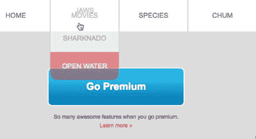

# 第五章：创建主导航和下拉菜单

在本章中，我们将为网站的主要导航构建所有功能和展示。这一章非常深入，因为构建我们的主导航涉及伪类；静态、绝对、相对和固定定位；以及 CSS 动画。

# 开始导航

在本节中，我们将首先创建尽可能干净的 HTML，然后插入基本的 CSS 以启动它。以下是我们最终网站应该看起来的样子；这是我们的目标：


我们有一个典型的水平导航栏。其中一些项目有下拉菜单。我们还在导航栏的左侧有一个鲨鱼标志，它很好地悬挂在那里。

# 构建菜单的语义化 HTML

让我们立即输入我们需要的 HTML。我们将从这个漂亮的大 HTML 注释开始。您可能已经注意到，我喜欢这些大家伙。这是因为更容易快速定位到我需要的代码部分：

```css
<!-- 
===============
Nav
===============
-->
```

我们将把所有内容包装在 HTML5 的`nav`元素中，并应用`grouping`类，因为我们将在其中浮动所有内容。最终将需要一个清除浮动，以防容器坍塌：

```css
<!-- 
===============
Nav
===============
-->
<nav class="grouping">

</nav>
```

现在让我们添加一个`figure`元素，它将包裹我们的鲨鱼图像：

```css
<nav class="grouping">
 <figure>
 
 </figure>
</nav>
```

接下来，我们将开始一个带有`primary-nav`类的无序列表。很久以前，人们确定使用列表进行导航非常语义化，因为它本质上是一个链接列表：

```css
<nav class="grouping">
    <figure>
        
    </figure>
 <ul class="primary-nav">

 </ul>
</nav>
```

我们将从四个列表项开始。我们将在每个列表项中放置一个锚点标记：

```css
<nav class="grouping">
    <figure>
        
    </figure>
    <ul class="primary-nav">
      <li><a href="#"></a></li> 
 <li><a href="#"></a></li> 
 <li><a href="#"></a></li> 
 <li><a href="#"></a></li> 
    </ul>
</nav>
```

当我们将其应用到我们的网站时，我们将得到一个鲨鱼图像和四个链接，全部垂直堆叠：


我们需要将这四个链接水平排列，就像块一样。我们将使用浮动和其他一些属性来实现这一点。

# 使用 CSS 来设计导航

在我们的 CSS 中，首先我们将找到导航的大块注释：

```css
/****************
nav
****************/
```

然后我们将定位`.primary-nav`类。让我们使用一种特殊类型的后代选择器，它只定位列表项的第一级：

```css
.primary-nav > li
```

这很重要。我们这样做是因为稍后我们将在这些列表项中嵌套另一个无序列表以获得一个下拉菜单。假设我们创建相同的选择器，但没有大于号符号：

```css
.primary-nav li
```

这将定位`primary-nav`内的任何和所有`li`标签--子代、孙代、曾孙代等。如果您只想定位直接子代，请使用此选择器；它被称为子组合器：

```css
.primary-nav > li
```

元素之间的大于号确保我们只定位直接子代。让我们也将这些列表项浮动到左侧，然后刷新浏览器：

```css
.primary-nav > li {
 float: left;
}
```

以下是前面代码的输出：


这是一个开始；还有很多工作要做。

让我们使用相同类型的子组合器来仅定位`.primary-nav`的直接子项中的直接子项锚点：

```css
.primary-nav > li {
  float: left;
}
.primary-nav > li > a {

}
```

所以我们将在顶部添加`25px`的填充，左右各`0`。我们还会添加一个宽度；每个宽度将为`150px`，并且我们会给每个添加一个 1 像素实线的`border-left`并将它们颜色设置为灰色：

```css
.primary-nav > li > a {
 padding: 25px 0;
 width: 150px;
 border-left: 1px solid #ada791;
}
```

我们看到它现在开始松散地类似于我们最终的导航：


我们现在将把整个规则集放在我们的 CSS 中，放在主要导航选择器下面：

```css
.primary-nav > li > a {
  padding: 25px 0;
  width: 150px;
  border-left: 1px solid #ada791;
}
nav li a{
 font-family: Arial, Helvetica, sans-serif;
 color: #766e65;
 text-transform: uppercase;
 font-size: 15px;
 text-align: center;
 -webkit-transition: 0.15s background-color linear;
 transition: 0.15s background-color linear;
}
```

这是一个更熟悉的后代选择器，适用于我们将应用于主导航项目以及下拉导航项目的一些样式。这是一种很好的**DRY**（**不要重复自己**）方法，这样我们就不必以后为下拉菜单重新编写这段代码。让我们更仔细地检查这个规则集。基本上，我们将`font-family`设置为`Arial`：

```css
font-family: Arial, Helvetica, sans-serif;
```

我们有这个文本颜色：

```css
color: #766e65;
```

我们使用了`text-transform: uppercase`。这将确保我们可以在 HTML 中为导航项输入小写字母，并将每个字母转换为大写字符。这样，如果我们以后决定普通情况比全部大写更好，那么我们只需要在一个地方进行更改，而不是更新整个 HTML：

```css
text-transform: uppercase;
```

接下来，我们有一个字体大小：

```css
font-size: 15px;
```

我们还将文本对齐到中心：

```css
text-align: center;
```

我们也添加了一个过渡，就像在上一章讨论的那样。这是为了过渡背景颜色：

```css
-webkit-transition: 0.15s background-color linear;
transition: 0.15s background-color linear;
```

这是我们保存更改并刷新浏览器时得到的结果：


我们有一些问题。一个问题是我们的锚点标签是内联元素，所以问题是它们实际上并不像块级元素一样行为。因此，我们可以做的一件事是将它们也浮动到左侧。为此，在`.primary-nav > li > a`规则集中添加`float: left`属性：

```css
.primary-nav > li > a {
  float: left;
  padding: 25px 0;
  width: 150px;
  border-left: 1px solid #ada791;
}
```

以下是上述代码的输出：


这看起来好多了。

现在让我们来定位焦点和悬停状态。在我们的最后一个规则集下面，我们将添加另一个规则集：

```css
nav li a:focus,
nav li a:hover,
nav li a.active {
  background-color: #eb2428;
  color: #fff;
}
```

这将不仅针对焦点和悬停状态，还将针对`active`类。这不是一个“状态”，就像焦点或悬停状态一样。这是一个我们将应用于元素的类，表示您正在访问该页面。它将与悬停状态相同。接下来，我们将背景颜色设置为红色，文本颜色设置为白色。现在，当我们刷新时，我们得到了悬停和焦点状态，这很好：


我们现在唯一需要做的就是弄清楚导航栏的位置，并将整个东西推到右边，因为现在它正好位于我们的图像下方。所以让我们将整个导航栏浮动到右侧。让我们这样做：

```css
.primary-nav {
  float: right;
}
```

以下是上述代码的输出：


正如您所看到的，这效果相当不错。整个导航都位于鲨鱼下方。我们可以通过将鲨鱼浮动到左侧来解决这个问题，但是如果我们使用绝对定位，我们还可以实现一些不错的功能，这是我们稍后在本章中将要介绍的。

最后，让我们通过添加白色背景并将我们的图像限制为`160px`的宽度来稍微整理一下这个导航。

```css
/****************
nav
****************/
nav {
  background-color: #fff;
}
nav img {
  width: 160px;
}
```

这是没有白色背景的网站，我们的鲨鱼相当大：


当我们刷新网站时，我们将得到我们想要的白色背景和一个较小的鲨鱼：


好了，我们已经为导航的第一层构建了 HTML 和大部分 CSS。接下来，您将学习如何使用伪类来解决导航中的某些问题。

# 使用伪类

您已经学会了如何向元素添加类以应用特殊样式。您总是需要进入 HTML 添加类。有时这可能会成为一个问题。例如，当内容通过内容管理系统动态生成时，您可能无法编辑任何元素，因为它可能不存在于静态 HTML 文件中。这时就需要使用伪类。伪类允许您根据元素在 HTML 中的位置和其他特性来定位元素。在本节中，我们将看一下`first-child`伪类，它可以帮助我们样式化我们的导航。然后我们将看一下其他几个伪类，例如`last-child`和`nth-child`。

最后，我不希望主菜单，也就是第一个菜单，有`border-left`，因为它是第一个元素。所以，我想摆脱它：


# 第一个子元素

为了在我们的 CSS 中定位第一个元素，我们将在锚点元素后添加`first-child`。所以我们将复制这个选择器，并将其粘贴在自身下面：

```css
.primary-nav > li > a {
  float: left;
  padding: 25px 0;
  width: 150px;
  border-left: 1px solid #ada791;
}
```

然后我们将`:first-child`添加到选择器中，删除属性，并添加`border-left`，值设置为`none`：

```css
.primary-nav > li > a:first-child {
  border-left: none;
}
```

保存这个，转到网站，然后刷新页面：


结果并不是我们可能期望的。实际上，我们从导航中删除了每个项目的左边框。这是因为首先，所有锚点都是它们直接父元素`li`的子元素。所以我们实际上应该以不同的方式处理这个问题。

快速查看我们 HTML 中的`nav`。锚点是`li`内的第一个元素；没有第二个元素。所以，如果我们想要定位`ul`内的第一个元素，它不会是锚点，而是列表项，即`<li>`：

```css
<nav class="grouping">
    <figure>
        
    </figure>
    <ul class="primary-nav">
        <li><a href="#">Home</a></li>
        <li><a href="#">Movies</a></li>
        <li><a href="#">Species</a></li>
        <li><a href="#">Chum</a></li>
    </ul>
</nav>
```

在我们的 CSS 中，我们实际上要将伪类从这里移动：

```css
.primary-nav > li > a:first-child {
```

我们将它从`a`中移除，并将它附加到`li`，如下所示：

```css
.primary-nav > li:first-child > a {
```

现在我们所有的导航元素上都有`border-left`属性，除了第一个：


关于`first-child`的一件事是，它必须是出现在父元素内的第一个元素。所以即使我们特别将`li`作为主导航的第一个子元素，如果我们在第一个`li`标签之前在`ul`内有其他东西，那么我们的选择器就不起作用了。让我们看看这个。让我们在`ul`元素的子元素中添加一个`h2`：

```css
<nav class="grouping">
    <figure>
        
    </figure>
    <ul class="primary-nav">
        <h2>not valid html</h2>
        <li><a href="#">Home</a></li>
        <li><a href="#">Movies</a></li>
        <li><a href="#">Species</a></li>
        <li><a href="#">Chum</a></li>
    </ul>
</nav>
```

这不是有效的 HTML，但是为了好玩，注意我们在第一个`li`标签上重新获得了左侧边框：


这是因为它不再是第一个孩子。`h2`现在是第一个孩子。这是在使用`first-child`伪类时的一个常见错误。

# 最后一个孩子

现在让我们看看`last-child`伪类。让我们创建一个新的选择器：

```css
.primary-nav > li:last-child > a {

}
```

我们将通过将背景颜色设置为亮粉色，文本颜色设置为白色，使示例更加明显：

```css
.primary-nav > li:last-child > a {
  background-color: deeppink
  color: #fff;
}
```

现在我们的最后一个孩子也应用了这些属性：


我更喜欢`first-child`，因为它在 IE7 及更早版本中有更深的支持，而`last-child`的支持从 IE9 开始。

# nth-child 伪类

`nth-child`类允许我们选择其父元素内的任何元素。让我们进入 CSS 并将`last-child`更改为`nth-child(2)`：

```css
.primary-nav > li:nth-child(2) > a {
  background-color: deeppink;
  color: #fff;
}
```

保存代码并刷新网站：


所以，在我们的网站上，粉色实际上应该应用于`h2`和 HOME，因为`h2`是`ul`内的第一个元素，而 HOME 是第二个。

如果你是一个 JavaScript 人，`nth-child`不是从零开始的，所以第一个不是零：第一个是一。

考虑到这一点，让我们将`nth-child`设置为`1`：这本质上与使用`first-child`相同：

```css
.primary-nav > li:nth-child(1) > a {
  background-color: deeppink;
  color: #fff;
}
```

让我们快速从我们的 HTML 中去掉这个`h2`标签：

```css
<nav class="grouping">
    <figure>
        
    </figure>
    <ul class="primary-nav">
        <!--<h2>not valid html</h2>-->
        <li><a href="#">Home</a></li>
        <li><a href="#">Movies</a></li>
        <li><a href="#">Species</a></li>
        <li><a href="#">Chum</a></li>
    </ul>
</nav>
```

我们现在看到粉色保留在第一个导航项上：


您还可以使用关键字`odd`和`even`。所以如果我在那里加入`even`或`odd`，你会得到应用这些属性的数字二和四：

```css
.primary-nav > li:nth-child(even) > a {
  background-color: deeppink;
  color: #fff;
}
```

刷新网站，你会得到以下结果：


这是一个很好的技术，可以为表格或列表添加斑马条纹，以增加可读性。

# nth-of-type 伪类

还有`nth-of-type`。在我们的 CSS 中，将`nth-of-type(2)`添加到`primary-nav`选择器中：

```css
.primary-nav > li:nth-of-type(2) > a {
  background-color: deeppink;
  color: #fff;
}
```

`nth-of-type`和`nth-child`之间的区别在于，`nth-of-type`预先限定只查找它附加的元素。例如，在我们的例子中，我们已经将`nth-of-type`附加到了一个`li`，所以它只匹配`li`标签：

```css
.primary-nav > li:nth-of-type(2) > a {
  background-color: deeppink;
  color: #fff;
}
```

让我们看看这个实例。让我们重新添加我们的`h2`标签：

```css
<nav class="grouping">
    <figure>
        
    </figure>
    <ul class="primary-nav">
        <h2>not valid html</h2>
        <li><a href="#">Home</a></li>
        <li><a href="#">Movies</a></li>
        <li><a href="#">Species</a></li>
        <li><a href="#">Chum</a></li>
    </ul>
</nav>
```

它不会只是指`ul`内的任何孩子。我们现在看到第二个`li`标签应用了这些属性：


所以`nth-of-type`比`nth-child`更精确。`nth-child`和`nth-of-type`的浏览器支持从 IE9 和更高版本开始，以及其他主要浏览器。

在这一部分，我们学习了一些伪类，可以根据它们在 HTML 中的顺序来定位元素。然而，这些并不是我们迄今为止使用的第一个伪类。我主要指的是基于状态的伪类，比如`hover`和`focus`，这些我们迄今为止已经使用了很多。在下一节中，我们将转变方向，讨论 CSS 定位以进一步提升我们的导航。

# 绝对定位

在这一部分，我们将开始研究不同的 CSS 定位属性，以及它们的补充偏移属性。首先，我们将绝对定位鲨鱼标志，然后使用固定定位来处理整个导航栏。

# 绝对定位鲨鱼

我们已经把菜单放好了，但是鲨鱼明显是在导航栏的上面。我们需要它水平对齐，或多或少。我们需要修复鲨鱼，使其悬挂在导航栏上方。我们还希望整个导航栏保持固定在浏览器窗口的顶部：


所以让我们去我们的 CSS 中，给`nav figure`选择器添加`position: absolute`。在`nav`规则集下面创建一个新的选择器。我们将其称为`nav figure`，并给它一个`position`属性，值为`absolute`：

```css
/****************
nav
****************/
nav {
  background-color: #fff;
}
nav figure{
  position: absolute;
}
nav img {
  width: 160px;
}
```

立刻看起来好多了：


让我们谈谈我们刚刚做的事情。所有元素，默认情况下都是`static`定位。静态元素遵循*正常流*，这意味着块级元素只是简单地堆叠在一起，只要它们没有浮动。将`position`改为`absolute`会将其从正常流中移出。它的块级特性消失了，其他元素对它没有任何影响。它可以被视为存在于另一个平面或层次上。一旦绝对定位，你就可以开始使用偏移属性，比如`top`、`right`、`bottom`和`left`。

让我们这样做。给`nav figure`元素添加两个属性，即`top`和`left`：

```css
nav figure{
  position: absolute;
  top: -50px;
  left: 50px;
}
```

这些将会像`margin-top`和`margin-left`一样起作用。如果你查看结果，你应该会看到鲨鱼距离左边有`50px`，距离顶部有`-50px`：


那么当我们将`top`属性与`bottom`交换，将`left`属性与`right`交换时会发生什么：

```css
nav figure{
  position: absolute;
  bottom: : -50px;
  right: 50px;
}
```

它实际上将鲨鱼移动到了页面的底部和右侧！


这张图片更清楚地展示了偏移属性与绝对定位的结合工作原理。偏移属性现在是基于浏览器视口的，但通常我们不想这样做；相反，我们希望通过将父元素设置为`position: relative`来基于父元素定位。

图片的父元素是`nav`选择器，所以让我们将其设置为相对定位：

```css
nav {
  background-color: #fff;
  position: relative;
}
nav figure{
  position: absolute;
  bottom: -50px;
  right: 50px;
}
```

你可以看到，即使现在我们距离右边有`50px`，因为导航栏一直延伸到右边缘，而我们距离导航栏底部有`-50px`，因为鲨鱼在那里延伸到导航栏下方：


`position: relative`声明为子元素建立了一个坐标系，具有`position: absolute`的子元素。

让我们把鲨鱼移回它应该在的位置：

```css
nav figure{
  position: absolute;
 top: -20px;
 left: 50px;
}
```

鲨鱼很好地重叠在我们的导航栏上。它现在坐在我们的标题上面，有点好笑，但我们马上就会回到这个问题：


首先，通过添加`position: fixed`来使整个导航栏固定在顶部。

# 使用固定定位来处理导航栏

让我们将导航栏的`position`属性从`absolute`改为`fixed`，看看结果如何：

```css
nav {
  background-color: #fff;
  position: fixed;
}
```

以下是上述代码的输出：


`fixed`值，例如`relative`，仍然像坐标系一样，用于任何绝对定位的子元素或后代元素，但它也有一些超能力。*现在，这些超能力完全破坏了我们的导航。*问题在于：`position: relative`仍然保留其块元素的特性，而`position: fixed`在从*正常流*中移除时失去了许多这些块特性，导航现在看起来有点滑稽：它没有延伸到浏览器窗口的全宽。让我们通过一些偏移属性来修复这个问题。

我们实际上可以通过设置 `left: 0` 和 `right: 0` 来拉伸导航。让我们还添加 `top: 0` 来确保它被定位在顶部：

```css
nav {
  background-color: #fff;
  position: fixed;
 left: 0;
 right: 0;
 top: 0;
}
```

看起来更好。而且，因为导航的位置设置为固定，当我们滚动页面时，导航内的所有内容都固定在顶部，其他所有内容都在其下面移动：


但是，如果您滚动到顶部，您会发现网站标题现在位于导航栏后面。这是因为导航不再是正常流的一部分：


让我们通过向`intro-content`和我们的`go-premium`按钮添加`margin-top`来修复这个问题。我们将转到我们的`go-premium`规则集，并将`margin-top`的值添加为`150px`：

```css
.go-premium {
  width: 300px;
  float: left;
  margin-top: 150px;
}
```

我们还将转到我们的`intro-content`规则集，并添加`margin-top`为`125px`：

```css
.intro-content {
  width: 600px;
  margin-right: 60px;
  float: left;
  margin-top: 125px;
}
```

现在看起来非常好：


因此，您已经了解了相对、绝对和固定定位。您还了解到每个元素的默认位置是静态的。`relative`位置为子元素创建了一个坐标系。`absolute`位置允许您将元素移动到自己的宇宙中，并根据最近的相对定位的父元素进行积极定位。`fixed`位置将使元素基于浏览器的视口而粘性，而不是基于任何相对定位的元素。`absolute`和`fixed`元素都将作为坐标系，相对于其他子元素。在下一节中，我们将看看如何构建下拉菜单，其中我们将再次使用绝对定位。

# 构建下拉菜单

让我们创建一个纯 CSS 下拉菜单！我们将首先添加标记，然后添加 CSS。

# 创建基本的 HTML 列表

通常，在构建诸如通常隐藏在视图中的下拉菜单之类的组件时，我会将其构建得好像它没有被隐藏一样。然后，一旦完成并完全样式化，我会创建下拉行为。这也是我们在这里要做的。所以让我们在我们现有的`index.html`文档中创建 HTML。我们将转到我们的导航栏的无序列表，如下所示：

```css
<nav class="grouping">
    <figure>
        
    </figure>
    <ul class="primary-nav grouping">
        <li><a href="#">Home</a></li> 
        <li><a href="shark-movies.html">Movies</a></li>
        <li><a href="#">Species</a></li>
        <li><a href="#">Chum</a></li>
    </ul>
</nav>
```

最佳实践是在无序列表内构建菜单，其中每个菜单项都是列表项内的锚点。对于下拉菜单，我们需要在具有下拉菜单的`li`内部嵌套另一个`ul`标签。我们将在这里嵌套它：

```css
<li><a href="shark-movies.html">Movies</a></li>
```

但首先，我们将为任何将有下拉菜单的导航项添加一个特殊的类`has-submenu`：

```css
<li class="has-submenu"><a href="shark-movies.html">Movies</a></li>
```

这样，通过`has-submenu`类，我们可以在 CSS 中专门针对这些`li`标签及其后代。在这个电影`li`标签内部，我们将创建一个新的带有`li`标签的`ul`，并在这些`li`标签内部放入一个锚标签。以下是下拉菜单的标记：

```css
<nav class="grouping">
    <figure>
        
    </figure>
    <ul class="primary-nav grouping">
        <li><a href="#">Home</a></li> 
       <li class="has-submenu"><a href="shark-movies.html">Movies</a>
 <ul>
 <li><a href="#">Jaws</a></li>
 <li><a href="#">Sharknado</a></li>
 <li><a href="#">Open Water</a></li>
 </ul>
        </li>
        <li><a href="#">Species</a></li>
        <li><a href="#">Chum</a></li>
    </ul>
</nav>

```

下拉菜单中有三个子菜单：


我们只需要对其进行样式化，使其看起来像我们最终的菜单。

# 样式化下拉菜单

我们需要适当地样式化下拉菜单，以适应我们现有的菜单。这是我们要达到的效果：


我想要将下拉菜单的样式与主导航的样式分开。我们将通过在主导航下面创建这个大的`下拉菜单`注释来实现这一点：

```css
/****************
Drop Down Menu
****************/
```

下拉菜单可以在这里有自己的小节。所以让我们首先只针对`has-sub menu`内部的`ul`。为了使子菜单放置在白色导航栏之外，让我们将其绝对定位并且距离`top`为`70px`：

```css
/****************
Drop Down Menu
****************/
.has-submenu ul{
 position: absolute;
 top: 70px;
}
```

这给我们带来了以下效果：


现在我们只需要样式化下拉菜单，使其看起来像它应该的样子。请注意，在我们的网站上，没有一个`li`标签像我们的主导航一样向左浮动。这是因为，正如你记得的那样，我们使用了一种后代选择器，只针对`primary-nav`的直接子`li`。我们不需要取消之前的样式。让我们回过头来看看，如果我们不这样做会发生什么。

这是子组合选择器的位置：

```css
.primary-nav > li {
  float: left;
}
.primary-nav > li > a {
  float: left;
  padding: 25px 0;
  width: 150px;
  border-left: 1px solid #ada791;
}
```

为了进行快速测试，让我们从两个选择器中删除大于号符号：

```css
.primary-nav li {
  float: left;
}
.primary-nav li a {
  float: left;
  padding: 25px 0;
  width: 150px;
  border-left: 1px solid #ada791;
}
```

这是它的样子：


请注意，我们在顶部菜单中的所有样式都在子菜单中重复。这是我们想要避免的，因为我们不希望编写额外的 CSS 来取消整个菜单向左浮动并在不需要的地方添加边框。因此，让我们将那些大于号符号添加回我们的`.primary-nav`选择器中：

```css
.primary-nav > li {
  float: left;
}
.primary-nav > li > a {
  float: left;
  padding: 25px 0;
  width: 150px;
  border-left: 1px solid #ada791;
}
```

好吧，让我们给`.has-submenu`添加白色背景和边框。在底部、左侧和右侧添加边框。我们不希望顶部有边框，所以我们将使用`border-bottom`、`border-left`和`border-right`，而不是使用`border`的简写：

```css
/****************
Drop Down Menu
****************/
.has-submenu ul {
  position: absolute;
  top: 70px;
  background-color: #fff;
 border-bottom: 1px solid #ada791;
 border-left: 1px solid #ada791;
 border-right: 1px solid #ada791;
}
```

现在开始类似下拉菜单：


一个明显的问题是宽度。我们需要给它一个`width`为`150px`，以匹配其父元素的宽度。另外，让我们给`bottom-left`和`bottom-right`角添加`border-radius`：

```css
/****************
Drop Down Menu
****************/
.has-submenu ul{
  position: absolute;
  top: 70px;
  background-color: #fff;
  border-bottom: 1px solid #ada791;
  border-left: 1px solid #ada791;
  border-right: 1px solid #ada791;
  width: 150px;
 border-radius: 0 0 15px 15px
}
```

请注意`border-radius`的简写。它与边距和填充的简写非常相似。第一个值是左上角，然后顺时针方向。因此，第二个值是右上角，第三个是右下角，第四个是左下角。

现在我们有了所需的`width`和`border-radius`：


有一件奇怪的事情是，我们的导航项的文本看起来并不是居中对齐的。锚元素的文本是居中对齐的。如果你右键单击`a`标签的文本，然后选择“检查”，你就可以看到这一点：


问题在于`li`标签占据了整个宽度，而`a`标签是内联元素，只占据它们需要的宽度。让我们添加一个新的选择器：`.has-submenu a`，使用`display: block`和`padding`，上下各为`20px`：

```css
.has-submenu a{
  display: block;
  padding: 20px 0;
}
```

下拉菜单看起来好多了：


我们的悬停状态从主导航中继承过来，这很好。唯一的问题是我们最后的悬停状态——Open Water——隐藏了圆角：


# 修复悬停状态

有两种方法可以解决悬停在**Open Water**子菜单项上时丢失圆角的问题。第一种方法是使用`last-child`伪类，你在前面的几节中学到了，来定位`a`选择器和子菜单的最后一个`li`选择器。这应该可以正常工作，但如果我们想要更深层次的浏览器支持，我们需要使用另一种技术，在`ul`元素——父元素上使用`overflow: hidden`。我倾向于在这里使用`overflow: hidden`的方法，因为它很简洁，并且具有更深层次的浏览器支持。

```css
/****************
Drop Down Menu
****************/
.has-submenu ul{
  position: absolute;
  top: 70px;
  background-color: #fff;
  border-bottom: 1px solid #ada791;
  border-left: 1px solid #ada791;
  border-right: 1px solid #ada791;
  width: 150px;
  border-radius: 0 0 15px 15px;
  overflow: hidden;
}
```

如果我们现在查看浏览器，问题已经解决了：


现在我们只剩下静态菜单。它总是打开的。我们需要创建一个下拉行为，当你将鼠标悬停在 MOVIES 导航项上时，它会出现。一种方法是默认隐藏下拉菜单，然后使用`hover`和`focus`伪类来显示它。

默认情况下使用`display: none`隐藏下拉菜单。让我们首先使用`display: none`隐藏整个`ul`标签：

```css
/****************
Drop Down Menu
****************/
.has-submenu ul{
  position: absolute;
  top: 70px;
  background-color: #fff;
  border-bottom: 1px solid #ada791;
  border-left: 1px solid #ada791;
  border-right: 1px solid #ada791;
  width: 150px;
  border-radius: 0 0 15px 15px;
  overflow: hidden;
  display: none;
}
```

我们可以通过创建一个新的选择器`.has-submenu:hover ul`，只在`has-submenu`悬停时才针对`ul`进行定位：

```css
/****************
Drop Down Menu
****************/
.has-submenu ul{
  position: absolute;
  top: 70px;
  background-color: #fff;
  border-bottom: 1px solid #ada791;
  border-left: 1px solid #ada791;
  border-right: 1px solid #ada791;
  width: 150px;
  border-radius: 0 0 15px 15px;
  display: none;
}
.has-submenu a {
  display: block;
  padding: 20px 0;
}
.has-submenu:hover ul {
 display: block;
}
```

根据这个规则集，当你悬停在电影菜单上时，里面的`ul`元素将被显示出来。然后，因为我们在之前的选择器中添加了`display: none`——非悬停状态，默认情况下，`ul`标签，也就是下拉菜单，不会被显示出来。现在默认情况下没有子菜单可用：


现在当我们悬停在电影菜单上时，子菜单就会出现：


我还要提到的一件事是，`display: none`存在无法让屏幕阅读器宣布内容的问题。

还有另一种选择：使用**屏幕外隐藏技术**，这需要额外的工作，但是非常值得。

# 使用屏幕外隐藏技术隐藏下拉菜单

基本思想是绝对定位一个元素，远离可见屏幕，这样它就不可见了，但屏幕阅读器仍然可以宣布它。关于无障碍还有很多要学习的地方。我建议你首先查看这篇文章[`css-tricks.com/places-its-tempting-to-use-display-none-but-dont/`](https://css-tricks.com/places-its-tempting-to-use-display-none-but-dont/)，至少了解一下如何使用屏幕外隐藏技术，然后再从无障碍方面继续学习：


Web 无障碍是一个非常深入的话题，它值得有一本专门的书来讲述。所以我在这里无法全面地讲述它。不过，我们可以用类似下面的方法来替代使用`display: none`来隐藏我们的下拉菜单，以使其更具有可访问性：

```css
.accessibly-hidden {
  position: absolute;
  top: -9999px;
  left: -9999px;
}
```

这将*隐藏*内容，对于有视力的用户来说，但对于屏幕阅读器用户来说，仍然会宣布内容。

我们已经很顺利地完成了下拉菜单的设置。这次效果非常完美。你第一次尝试创建下拉菜单可能不会这么顺利，但使用这些技巧，你可以避免一些可能遇到的问题。

我最大的两个建议是：

+   首先构建下拉菜单，就好像它将一直可见，然后在样式设置好并且看起来不错之后隐藏它。

+   由于推荐的方法是在无序列表中使用无序列表，因此值得仔细设置你的规则集以避免混淆。例如，一个适用于父`ul`和子`ul`（即`ul li`）的样式规则集；另一个只适用于父`ul`和`li`选择器，使用子组合器（即`ul > li`）；最后，一个只适用于子`ul`的规则集（即`.has-submenu ul`）。这样，你就不必为子`ul`创建一堆可能令人困惑的覆盖样式。

导航的下一个部分需要我们实际创建下拉效果；我们将使用 CSS 动画来实现这一点。

# CSS 动画（第一部分）

我们的主导航现在正在成形，我们的下拉功能几乎完成了。下拉菜单的最后一点润色是 CSS 动画，以使下拉菜单向下平滑动画。动画非常有趣，现代浏览器，包括 Chrome，Firefox，Opera 和从 IE10 开始的浏览器都支持它们。IE9 仍然会显示下拉菜单，但它只会简单地出现/消失。动画与过渡非常相似，但我们可以对静态元素进行动画处理，并使用不同的动画属性和关键帧来控制动画。我们稍后会更深入地讨论这个问题。所以在这一部分，我们要做的是：我们将在要进行动画处理的元素的选择器中定义`animation-name`、`animation-duration`和`animation-timing-function`。之后，我们将继续定义我们要进行动画处理的关键帧。

# 定义动画名称、持续时间和时间函数

让我们回顾一下我们的下拉菜单的 CSS：

```css
/****************
Drop Down Menu
****************/
.has-submenu ul{
  position: absolute;
  top: 70px;
  background-color: #fff;
  border-bottom: 1px solid #ada791;
  border-left: 1px solid #ada791;
  border-right: 1px solid #ada791;
  width: 150px;
  border-radius: 0 0 15px 15px;
  overflow: hidden;
  display: none;
}
.has-submenu a {
  display: block;
  padding: 20px 0;
}
.has-submenu:hover ul {
  display: block;
}
```

让我们以如下方式定位`has-submenu`的`hover`状态：

```css
.has-submenu:hover ul {
  display: block;
}
```

现在，我们将使用非前缀的/W3C 标准属性名称，并在最后添加所需的前缀。因此，要进行动画，我们使用`animation-name`，并将`slideDown`作为动画名称：

```css
.has-submenu:hover ul {
  display: block;
 animation-name: slideDown;
}
```

我可以随意命名这个动画，只要不使用任何空格。就像类名一样，我也不能以数字开头。此外，关键字**none**不能用作动画名称，因为它是保留的用于移除动画的特殊关键字。接下来，我们将以秒为单位指定动画持续时间和动画的时间函数：

```css
.has-submenu:hover ul {
  display: block;
  animation-name:slideDown;
 animation-duration: .25s;
 animation-timing-function: ease;
}
```

对于`timing-function`，我使用了`ease`，但您还可以指定`linear`，`ease-in`，`ease-out`和`ease-in-out`函数，这些函数与我们用于`transitions`的相同时间函数。这段代码本身不会做任何事情。我们必须指定在使用`@keyframes`进行动画时会发生什么。因此，在最后一个规则集下面，我们将添加一个带有我们之前想出的动画名称`slideDown`的`@keyframes` *at-rule*：

```css
@keyframes slideDown {
}
```

在花括号内，我们将指定`from`和`to`的时间偏移量：

```css
@keyframes slideDown {
  from {}
 to {}
}
```

花括号内的任何内容都将是动画的起点，花括号内的任何内容都将是动画的终点。我们可以在动画中放置几个属性；让我们从`translateY`变换函数开始，值为负 100％：

```css
@keyframes slideDown {
  from {transform: translateY(-100%);}
  to {}
}
```

这将使无序列表向上移动负 100％，使其成为起点。百分比是元素的高度。`50％`会使其向下移动一半的元素高度，而`100％`会使其向下移动整个元素的高度。因此，`-100％`将使其垂直向上移动整个元素的高度。在这里，`translateY`函数对我们来说是新的。它很像`translate`，只是它只用于垂直平移。`translateX`函数可以进行水平平移。在`to`的花括号内，我们将把`translateY`设置为`0％`：

```css
@keyframes slideDown {
  from {transform: translateY(-100%);}
  to {transform: translateY(0%);}
}
```

我们现在可以看到菜单向下动画：


# 设置额外的关键帧

到目前为止，我们的动画完全可以用`transition`来实现，因为没有真正引入任何新内容。但是动画的强大之处在于我们可以设置额外的关键帧。让我们将 CSS 中的`from`和`to`更改为分别为`0％`和`100％`，如下所示：

```css
@keyframes slideDown {
  0% {transform: translateY(-100%);}
  100% {transform: translateY(0%);}
}
```

我们不仅可以添加开始和结束，还可以在这两个点之间添加任意数量的停止。让我们添加一个新的关键帧，比如`90％`，其`translateY`为`10％`：

```css
@keyframes slideDown {
  0% {transform: translateY(-100%);}
  90% {transform: translateY(10%);}
  100% {transform: translateY(0%);}
}
```

我们正在将下拉菜单的位置从`-100％`到`10％`进行翻译，在 0.25 秒的前 90％。然后，在 0.25 秒的最后 10％，垂直移动从`10％`到`0％`。这使动画在最后有一点跳动或弹跳：


我们不仅可以添加多个关键帧，还可以在每个关键帧中添加多个属性。所以让我们将`opacity`添加到我们的动画中。假设我们从不可见的关键帧开始，最终不透明度为`1`，即完全可见。我们不会在 90％关键帧上动画不透明度：

```css
@keyframes slideDown {
  0% {transform: translateY(-100%);opacity: 0;}
  90% {transform: translateY(10%);}
  100% {transform: translateY(0%);opacity: 1;}
}
```

菜单现在向下动画并淡入：


# 供应商前缀

为了完成我们的下拉动画，让我们通过添加必要的供应商前缀来获得最大的浏览器支持：

```css
/****************
Drop Down Menu
****************/
@-webkit-keyframes slideDown {
 0% {-webkit-transform: translateY(-100%); opacity: 0; }
 90% {-webkit-transform: translateY(10%);}
 100% {-webkit-transform: translateY(0%); opacity: 1; }
}
@keyframes slideDown {
  0% {transform: translateY(-100%); opacity: 0; }
  90% {transform: translateY(10%);}
  100% {transform: translateY(0%); opacity: 1; }
}
.has-submenu ul{
  position: absolute;
  top: 70px;
  background-color: #fff;
  border-bottom: 1px solid #ada791;
  border-left: 1px solid #ada791;
  border-right: 1px solid #ada791;
  width: 150px;
  border-radius: 0 0 15px 15px;
  overflow: hidden;
  display: none;
}
.has-submenu a {
  display: block;
  padding: 20px 0;
}
.has-submenu:hover ul {
  display: block;
 -webkit-animation-name: slideDown;
  animation-name: slideDown;
 -webkit-animation-duration: 2.5s;
  animation-duration: 2.5s;
 -webkit-animation-timing-function: ease;
  animation-timing-function: ease;
}
```

`@keyframes`动画都需要`-webkit-`供应商前缀，以及`transform`，`animation-name`，`animation-duration`和`animation-timing-function`属性。

当我们来到这一部分的结尾时，我们的下拉菜单动画已经就位。CSS 动画在 IE10 及更高版本中受支持，因此较旧版本的 IE 和其他较旧的浏览器不会显示动画，但它们仍然可以访问菜单和其所有内容。在我们的情况下，由于这只是整体体验的额外触摸，如果较旧的浏览器错过了这一点，这并不是一个严重的问题；它们仍然可以获得他们需要的所有核心内容。在下一节中，我们将继续使用 CSS 动画，通过尝试我们的鲨鱼标志来创建一个更加强大的动画。

# CSS 动画（第二部分）

我们的主导航下拉菜单的滑动动作已经完成。现在让我们通过尝试我们的鲨鱼标志和探索其他动画属性，如`delay`，`iteration-count`，`fill-mode`以及`animation`（这是简写）来深入研究 CSS 动画。

# 动画延迟，迭代次数和填充模式

让我们为鲨鱼图像添加一个动画，以便从不同的角度看动画可以做什么，并且每次页面加载时都会发生。我们将其命名为`crazyShark`：

```css
nav figure {
  position: absolute;
  top: -20px;
  left: 50px;
 animation-name: crazyShark;
 animation-duration: .25s;
 animation-timing-function: ease;
}
@-webkit-keyframes crazyShark {

}
nav img {
  width: 160px;
}
```

让我们添加一堆同时平移和旋转鲨鱼图像的`@keyframes`动画：

```css
@keyframes crazyShark {
  0% {transform: translate(90%, 70%);}
 33% {transform: translate(40%, 20%) rotate(90deg);}
 66% {transform: translate(10%);}
 100% {transform: translate(0%) rotate(0deg);}
}
```

现在，让我们去我们的动画属性，并将持续时间从`0.25`秒更改为`1`秒：

```css
animation-duration: 1s;
```

鲨鱼真的在四处移动，因此我们的动画被命名为`crazyShark`：


请注意，我使用的`translate`语法与我们之前使用的略有不同。由逗号分隔的两个值分别用于*x*和*y*坐标，而当*x*和*y*坐标相同时，可以使用一个单一值：

```css
/*translate shorthands for translateX and translateY*/

transform: translate(40%, 20%); 
/*2 values (x first, y second) when both values are different*/

transform: translate(10%); 
/*1 value is used when x and y coordinates are the same*/
```

还有其他几个动画属性，其中两个是`animation-delay`和`animation-iteration-count`。我发现这两个都很有用：

```css
nav figure {
  position: absolute;
  top: -20px;
  left: 50px;
  animation-name: crazyShark;
  animation-duration: 1s;
  animation-timing-function: ease;
 animation-delay: 2s;
 animation-iteration-count: 2;
}
```

现在，动画开始前将有 2 秒的延迟，*我不会尝试在书本格式中说明这一点*。然后它应该完全动画两次：


如果我们愿意，我们也可以无限重复动画；我们可以只添加`infinite`关键字而不是一个数字，鲨鱼将永远继续前进。*我绝对不会尝试在书本格式中说明这一点！* 让我们摆脱`animation-delay`和`animation-iteration-count`：

```css
nav figure {
  position: absolute;
  top: -20px;
  left: 50px;
  animation-name: crazyShark;
  animation-duration: 1s;
  animation-timing-function: ease;
}
```

# 动画填充模式

`animation-fill-mode`属性告诉被动画化的元素在动画开始前和动画完成后该做什么。使用`animation-fill-mode`填充动画之前和/或之后的空间。我们现在不需要`animation-fill-mode`属性。因为鲨鱼动画在页面加载时开始，然后将鲨鱼降落到其静态位置-我们说不要平移和旋转：

```css
 100% {transform: translate(0%) rotate(0deg);}
```

但是，如果我们以*x*为 10％，*y*为 70％，旋转为 10 度结束动画会怎么样呢？

```css
 100% {transform: translate(10%, 70%) rotate(10deg);}
```

如果您应用这个并转到网站，您会注意到鲨鱼似乎在第一个标题附近结束动画，然后跳回到其原始位置。这由以下两个截图说明：

动画的最后，鲨鱼：


鲨鱼在动画结束后会瞬间传送到其静态位置：


我们可以使用`animation-fill-mode: forwards`来修复这个问题：

```css
nav figure {
  position: absolute;
  top: -20px;
  left: 50px;
  animation-name: crazyShark;
  animation-duration: 1s;
  animation-timing-function: ease;
  animation-delay: 2s;
  animation-iteration-count: 2;
 animation-fill-mode: forwards;
}
```

现在，在动画结束后，鲨鱼将保持在那个位置而不会跳回到其原始位置：


太棒了！

`animation-fill-mode`属性的值为`backwards`将确保被动画化的元素在动画开始之前就*填充*到其起始位置。`both`关键字是填充起始和结束位置的一种方式。

让我们将我们的规则集减少到这三个动画属性：

```css
animation-name: crazyShark;
animation-duration: 1s;
animation-timing-function: ease;
```

让我们也调整和减少整个动画。这样，我们的疯狂鲨鱼将变得稍微不那么疯狂，*但仍然足够疯狂*：

```css
@keyframes crazyShark {
  0% {transform: translate(90%, 70%);opacity: 0;} 
  33% {transform: translate(40%, 20%) rotate(90deg);}
  66% {transform: translate(10%, 50%);}
  100% {transform: translate(0%) rotate(0deg);opacity: 1;} 
}
```

我们将为每个动画属性添加供应商前缀。但在这之前，让我们使用动画属性的简写来使我们的编码生活变得更容易，将所有动画属性合并成一行。

# 使用动画简写

在我们的`nav figure`规则集中加入这些声明：

```css
animation-name: crazyShark;
animation-duration: 1s;
animation-timing-function: ease;
```

从`animation-name`和底部两个声明中删除`-name`，这样我们就剩下了这个：

```css
 animation: crazyShark;
```

现在，我们将添加`1s`和`ease`：

```css
 animation: crazyShark 1s ease;
```

现在我们应该得到的结果如下：

```css
nav figure {
  position: absolute;
  top: -20px;
  left: 50px;
 animation: crazyShark 1s ease;
}
```

此外，您可以将所有不同的动画属性放入一个简写中。无论您以什么顺序放置它们，只要`animation-duration`在`animation-delay`之前。以下是一种可能的方式，可以在一个方便的简写中使用我们讨论过的所有动画属性：

```css
animation: [name] [duration] [timing-function] [delay] [fill-mode] [iteration-count];
```

现在我们已经有了简写，这将使添加供应商前缀版本变得更容易一些。

# 供应商前缀

让我们添加`-webkit-`前缀版本的`animation`属性：

```css
nav figure {
  position: absolute;
  top: -20px;
  left: 50px;
 -webkit-animation: crazyShark 1s ease;
  animation: crazyShark 1s ease;
}
```

我们将对`@keyframes`做同样的处理：

```css
@-webkit-keyframes crazyShark {
 0% {-webkit-transform: translate(90%, 70%);opacity: 0;}
 33% {-webkit-transform: translate(40%, 20%);}
 66% {-webkit-transform: translate(10%, 50%);}
 100% {-webkit-transform: translate(0%);opacity: 1;}
}
@keyframes crazyShark {
  0% {transform: translate(90%, 70%);opacity: 0;}
  33% {transform: translate(40%, 20%);}
  66% {transform: translate(10%, 50%);}
  100% {transform: translate(0%);opacity: 1;}
}
```

请注意，我在`@keyframes`前面加了`@-webkit-keyframes`，以及在`transform`前面加了`-webkit-transform`。

# 有关动画的其他信息

有关 CSS 动画的更多信息，我建议查看我的文章，“CSS 动画并不那么难。”，网址为[richfinelli.com/css-animations-arent-that-tough](http://richfinelli.com/css-animations-arent-that-tough)：


总之，我们已经探讨了其他动画属性，比如`animation-delay`，`animation-iteration-count`和`animation-fill-mode`，在创建一个花哨的、过度的动画的过程中。我们还将所有这些属性简化为一个方便的简写。我们还为每个属性添加了`-webkit-`前缀版本，以获得更好的浏览器支持。在本章的下一节和最后一节中，我们将为整个导航栏添加`box-shadow`，并修复下拉菜单的一个错误，即`z-index`。

# 完成导航

我们几乎完成了我们的主导航，但还有一些小事情要做。首先，我们将解决一个`z-index`问题，我稍后会详细说明。然后，我们需要在我们的导航栏底部添加`box-shadow`以完成设计。

# 修复 Z 索引问题

首先，我们将使用`z-index`属性来修复一个错误。当您悬停在 MOVIES 导航项上时，会出现一个下拉菜单。您会注意到一些事情：



首先，下拉菜单中的一个导航项被突出显示了——而实际上不应该。其次，导航实际上是在 MOVIES 导航项的顶部进行动画。

我们可以将动画速度减慢到`2.5 秒`，以便更容易查看这个问题：

```css
.has-submenu:hover ul {
  display: block;
  -webkit-animation: slideDown 2.5s ease; 
  animation: slideDown 2.5s ease; 
}
```

这样可以更容易地看到下拉菜单是在 MOVIES 菜单项的顶部下拉的。


这就是我们的问题，这就是为什么我们最终会出现下拉菜单项中的一个被突出显示的原因。

在我们的 CSS 文件中：

```css
/****************
Drop Down Menu
****************/
.has-submenu ul{
  position: absolute;
  top: 70px;
  background-color: #fff;
  border-bottom: 1px solid #ada791;
  border-left: 1px solid #ada791;
  border-right: 1px solid #ada791;
  width: 150px;
  border-radius: 0 0 15px 15px;
  overflow: hidden;
  display: none;
}
.has-submenu a {
  display: block;
  padding: 20px 0;
  position: relative;
}
.has-submenu:hover ul {
  display: block;
  -webkit-animation: slideDown 2.5s ease; 
  animation: slideDown 2.5s ease; 
}
```

这个错误，可以说，可以通过一个叫做`z-index`的新属性来修复。`z-index`属性设置了重叠元素的堆叠顺序。我们的下拉菜单出现在顶部，因为它在主导航项电影的锚标签之后。自然地，绝对定位的元素会出现在没有设置`position`属性的元素的上面。这就是为什么下拉菜单出现在主导航栏的顶部。`z-index`的值是一个数字。它可以应用于设置为`relative`、`absolute`或`fixed`位置的元素，以及透明度小于 1 或应用了`transform`的元素，以及其他一些情况。只要我们的下拉菜单——也就是`z-index`小于其容器——我们就可以继续。转到`.has-submenu a`选择器，让我们应用`position:relative`声明。这样，元素将接受`z-index`。我们将添加一个`z-index`为`10`：

```css
.has-submenu a {
  display: block;
  padding: 20px 0;
 position: relative;
 z-index: 10;
}
```

在`.has-submenu ul`上，我们不需要应用`position:relative`，因为它已经设置为`position: absolute`；它将接受`z-index`为`5`，小于 10。所以理论上，我们应该已经解决了我们的 bug：

```css
.has-submenu ul{
  position: absolute;
  z-index: 5;
  top: 70px;
```

保存并查看我们的网站。在全速运行时，当你在导航项目上悬停时，没有一个菜单项会被突出显示，下拉菜单会出现在主导航栏后面。现在只是为了确保，再次减慢动画速度。你应该看到它出现在 MOVIES 菜单的后面，这很好：


让我们也把`animation-duration`改回`.5s`：

```css
.has-submenu:hover ul {
  display: block;
  -webkit-animation: slideDown .5s ease; 
  animation: slideDown .5s ease; 
}
```

# 添加 box-shadow

让我们谈谈`box-shadow`属性。在我们的最终网站上，你可以看到我们的主导航下面有这个阴影：


让我们回到我们的 CSS，找到我们的`nav`选择器。`box-shadow`是一个 CSS3 属性：

```css
nav {
  background-color: #fff;
  position: fixed;
  left: 0;
  right: 0;
  top: 0;
  z-index:1;
  box-shadow: 0 8px;
}
```

我们针对`nav`元素并使用非前缀版本，这在所有主要浏览器中都受支持，从 IE9 及以上版本开始。我们不必回头去添加任何供应商前缀，因为规范已经足够成熟，所有浏览器现在都支持非前缀版本。我们添加的前两个值是*x*和*y*。我们将*x*值设置为`0`，将*y*值设置为`8px`；这将使`box-shadow`属性向下发散：

```css
box-shadow: 0 8px;
```

如果我使用负值，那么子菜单将从导航栏顶部发散。我们希望它从导航栏底部发散。

接下来是模糊值。我们将把它设置为`15px`：

```css
box-shadow: 0 8px 15px;
```

如果我把模糊值保持为`0`，我们将得到一个硬的 8 像素边框。模糊是使它看起来更像阴影而不是边框的原因。

我们要使用的最终值是颜色。我们将使用一个名为`rgba`的新颜色值，这是 CSS3 颜色值。然后我们添加`0, 0, 0`。这意味着红色、绿色和蓝色都将为零，这意味着它们的输出将是黑色。变量`a`指的是 alpha 通道，我们将把它设置为`.1`：

```css
 box-shadow: 0 8px 15px rgba(0, 0, 0, .1);
```

所以如果你去网站上检查并取消检查开发者工具中的 box-shadow，你会看到`box-shadow`属性的效果。这是没有这个属性时的样子：


这张图显示了我们的网站应用了 box-shadow：


有时候，对于这些 CSS 属性，查看开发者工具是很好的。让我们看看如果我们改变它们的值会是什么样子。我们可以看看增加或减少模糊后 box-shadow 的效果。在下面的截图中，我们看到将值从`15px`增加到`26px`后的效果——你可以看到模糊消失了：


如果减少模糊，比如`0px`，它会变成硬化的阴影：


我认为大约`15px`是恰到好处的。你也可以看到它在更高的不透明度下是什么样子——更高的 alpha 通道。如果我们把 alpha 通道从`.1`改为`.5`，阴影会变得更暗：


我认为`.1`是合适的。这个效果很好。

# 总结

这是一个广泛的章节；我们涵盖了很多内容。我们构建并设计了我们的菜单。你学会了伪类，以及我们如何使用它们来针对 HTML 中元素的位置。我们熟悉了定位属性，使用`absolute`定位我们的鲨鱼图标。我们为我们的菜单建立了一个下拉菜单，并为它添加了动画。我们探索了动画属性，比如`animation delay`、`iteration count`和`fill-mode`，并将它们应用到我们的鲨鱼图标上。最后，我们通过修复`z-index`问题和使用`box-shadow`属性完成了导航的最终设计。在下一章中，我们将看看我最喜欢的主题之一，响应式网页设计，因为我们要为不同的设备尺寸准备这个网站。
