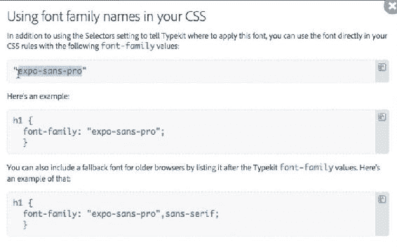
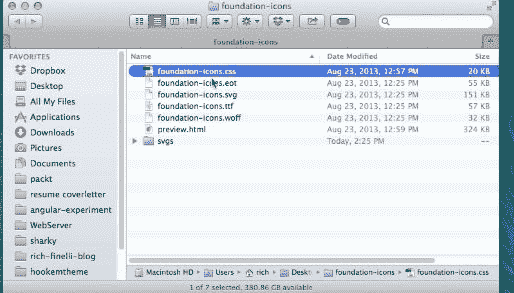

# 第七章：网络字体

很长一段时间，我们只能使用一些基本字体，比如 Times New Roman、Georgia 和 Arial。如果你想要更远的偏离，你就会面临字体在别人查看你的网站时不显示的风险，因为他们可能没有安装那个字体。在这段时间里，每当我们想使用一个花哨的字体时，我们都必须将它保存为一个图片，这曾经带来了许多问题。幸运的是，现在网络字体正式出现了，这使我们能够在所有计算机上使用大量出色的字体。在本章中，您将学习有关网络字体的知识。首先，您将学习`@font-face`规则的基本语法，然后我们将讨论`@font-face`可能有点棘手，接着我们将介绍提供字体并将其传递到您的网站的服务，比如 Google Web Fonts 和 Typekit。最后我们将介绍图标字体。

# @font-face 属性

让我们从学习如何使用`@font-face`属性向网站添加网络字体开始这一章。首先，我们将在网站的一个文件夹中添加一个 OTF 文件，然后我们将在我们的 CSS 中定义一个新字体，最后，我们将将该 CSS 应用到我们网页上的元素。

# 直接将字体文件添加到网站

在本节的项目文件中，我们有一个名为`fonts`的新文件夹。在这个文件夹里，有一个名为`LeagueGothic-Regular`的 OTF 文件：


现在这个字体就存在于我们网站的文件夹中，访问我们网站的最终用户将下载这个字体到他们的计算机上，就像他们下载 HTML、CSS 文件和图片一样。但首先，我们必须告诉它这样做，并在我们的 CSS 中查找它。

# 在我们的 CSS 中定义和应用新字体

在 CSS 中，就在我们的重置下面，让我们添加一个名为字体的新部分。添加`@font-face`；这将允许我们声明一个新字体：

```css
/****************
Fonts
****************/
@font-face {
    font-family: 'League-Gothic';
}
```

我将首先声明字体名称，可以是任何东西。所以即使字体叫`League Gothic-Regular`，你也可以把它命名为`Bananas Serif`。让我们称之为`League Gothic`，因为这是最有意义的。

我用单引号括起来有两个原因。一是它是一个网络字体，二是它有多个单词，应该总是用引号括起来，就像你会引用`'Times New Roman'`一样。接下来，我们将声明这个字体存在的位置，使用`src`属性：

```css
@font-face {
  font-family: 'League Gothic';
 src: url('../fonts/LeagueGothic-Regular.otf');
}
```

我们要确保拼写与 OTF 文件的名称完全匹配。请注意我使用了`../`。这是一条指令，要跳出`CSS`文件夹，然后进入`fonts`文件夹，查找`LeagueGothic-Regular.otf`。这是我们项目的文件夹结构：


现在我们可以使用我们习惯的`font-family`属性将此字体添加到任何规则集中。我们也可以像通常一样指定回退，以防字体未被下载。在样式表的“全局”部分，有一个`h1`的规则集和另一个`h2`的规则集：

```css
h1 {
  font-weight: 700;
  font-size: 80px;
  color: #0072ae;
  margin-bottom: 10px; 
}
h2 {
  font-size: 30px;
  margin-bottom: 10px;
  color: #eb2428;
  font-weight: 700; 
}
```

在`h2`规则集下面，我们将添加另一个，针对`h1`标签和`h2`标签添加我们的新网络字体。

```css
h1, h2 {
  font-family: "League Gothic", Arial, Helvetica, sans-serif;
}
```

以下是前面代码的输出：


以下是我们的字体以前是什么样子的：


当我们刷新时，哇！非常时尚的网络字体被添加到我们的网站上：


我们已经成功地将网络字体添加到我们的网站，但不幸的是，我们所做的实际上并不能在所有浏览器中工作。由于排版可能是网页上最重要的事情，我们必须找到一个更好的解决方案。

# @font-face：有点棘手的事情

表面上，网络字体很容易，但实际上，当我们希望它们在所有现代浏览器中工作时，它们变得复杂起来。一些浏览器使用 OTF，其他使用 WOFF，还有一些使用 EOT、RTF 和 SVG。让我们来看看使用`@font-face`属性使网络字体工作的完整设置。

# 使其在所有浏览器中工作

```css
CSS Tricks, that describes the ideal @font-face at-rule. (*Using @font-face* by *Chris Coyier* of CSS-tricks.com, August 25, 2016, https://css-tricks.com/snippets/css/using-font-face/.)
```

```css
@font-face {
  font-family: 'MyWebFont';
  src: url('webfont.eot'); /* IE9 Compat Modes */
  src: url('webfont.eot?#iefix') format('embedded- 
  opentype'), /* IE6-   
  IE8 */
  url('webfont.woff2') format('woff2'), /* Super Modern 
  Browsers */
  url('webfont.woff') format('woff'), /* Pretty Modern   
  Browsers */
  url('webfont.ttf') format('truetype'), /* Safari, 
  Android, iOS */
  url('webfont.svg#svgFontName') format('svg'); /* Legacy 
  iOS */
}
```

这不仅是寻找字体的七个不同的`url`，还有五种不同的字体文件：`eot`、`woff2`、`woff`、`ttf`和`svg`！正如前面的代码示例中的注释所解释的那样，每种字体文件格式都支持不同的浏览器版本。

根据同一篇*CSS Tricks*文章，只有`woff`和`woff2`文件格式将为您提供相当不错的浏览器支持（Chrome 5+，Safari 5.1+，Firefox 3.6+，IE9+，Edge，Android 4.4+和 iOS 5.1+）：

```css
@font-face {
 font-family: 'MyWebFont';
 src: url('myfont.woff2') format('woff2'),
      url('myfont.woff') format('woff');
}
```

但这仍意味着你需要获取和托管两种文件格式，这当然不像五种文件格式那么具有挑战性，但也不是一件轻而易举的事情。

网络字体比我们希望的要复杂一些。大多数情况下，字体是通过服务提供的，这正是我们将在接下来的两个部分中看到的。Google Web 字体、Typekit 和其他服务使网络字体变得更加容易，并提供多种不同粗细和样式的高质量字体。在下一节中，我们将使用来自 Google 字体的字体。

# Google Web 字体

托管自己的网络字体并使用适当的 CSS 来支持所有浏览器稍微有些挑战。有更简单的方法来解决这个问题。我真的很喜欢 Google 字体；它们非常容易使用，而且 100%免费。字体的质量也非常好。在这一部分，我们将用 Google Web 字体替换我们托管的字体。第一步是去 Google 字体并选择我们将使用的两种字体。在两个 HTML 文档的标题中添加 CSS 文件的链接。最后，在我们的 CSS 中添加字体名称。

# 查找 Google 字体

前往[`fonts.google.com/`](https://fonts.google.com/)，搜索我们的标题字体：`Maven`。很酷的是，我们可以输入一些文本，比如说我们的网站标题，来看看这种字体中特定单词的样子。大多数字体服务都会输出类似于这样的东西：


所以我们可以只输入 Old Chompy 并了解一下这个字体在我们的`h1`上会是什么样子。我们甚至可以增加字体大小。让我们搜索并使用**Maven Pro**；通过点击红色加号图标来实现。在屏幕底部，我们应该选择了一个字体系列：


接下来我们将寻找并获取**Droid Serif**字体。底部将显示选择的 2 个字体系列：


让我们打开底部的东西，获取更多信息：


我们快要完成了；我们只是在验证和审查。从底部滑出的面板向我们展示了一些有趣的东西：

+   加载时间

+   如何在我们的页面上嵌入字体文件

+   如何在我们的 CSS 中指定这些字体

我可以通过转到*自定义*选项卡来添加额外的字体粗细和字体样式：


在这里，我可以选择额外的字体粗细和字体样式。如果我选择太多，加载时间指示器就会变慢：


我们只需要 Droid Serif 的普通、斜体和粗体，以及 Maven Pro 的普通和粗体，这从慢到中等：


现在，我们的加载速度设置为中等。我真的很想处于绿色状态，但至少我们没有处于红色状态，所以我们就接受这个吧。

让我们回到*嵌入*选项卡，并复制这些字体文件的链接：


这段代码实际上只是一个样式表。让我们把它粘贴到`index.html`和`shark-movies.html`的`head`标签中：


我们可以看到这是我们用来指定样式的相同`<link/>`：

```css
<link href="https://fonts.googleapis.com/css?family=Droid+Serif:400,400i,700|Maven+Pro:400,700" rel="stylesheet">
```

实际上，这是一个指向`fonts.googleapis.com`的样式表，这就是它获取字体的地方。它实际上显示了两种字体选择，即：Droid Serif 和 Maven Pro。Google 字体托管在 Google 的服务器上，我们只需要进行一次 http 请求，这对性能来说很好。

# 在 CSS 中应用字体

现在我们想在我们的 CSS 中使用这些字体。正如你所看到的，他们确切地告诉我们如何做到这一点：


首先，在我们的`h1`和`h2`中用`Maven Pro`替换`League Gothic`：

```css
h1 {
  font-size: 80px;
  color: #0072ae;
  margin-bottom: 10px; 
  font-family: "Maven Pro", Arial, Helvetica, sans-serif;
  font-weight: 700;
}
h2 {
  font-size: 30px;
  margin-bottom: 10px;
  color: #eb2428;
  font-family: "Maven Pro", Arial, Helvetica, sans-serif;
  font-style: italic;
}
```

下一步是添加**Droid Serif**。我实际上想确保我们的所有正文、所有段落、锚点和除了`h1`标签和`h2`标签之外的所有内容都使用**Droid Serif**。我们会多加一些小心，所以我们将添加备用字体。我们将指定备用字体为`Georgia`，然后是`Times New Roman`，然后是默认的`serif`，如下所示：

```css
body {
  background-color: #dcdcdc;
  font-family: "Droid Serif", Georgia, "Times New Roman", sans-serif;
  font-weight: 100;
  font-size: 16px; 
}
```

保存这些更改。现在当我们转到我们的网站时，在刷新之前，我们可以看到我们的`h1`和`h2`应用了**League Gothic**，然后我们的通用`Arial`用于段落：


刷新后，我们得到了我们的新字体：这非常好。我们的`h1`和`h2`使用**Maven Pro**，我们的其他所有文本使用**Droid Serif**：


在本节中，您学会了如何使用 Google 提供的免费字体资源。使用 Google 的 Web 字体是地球上最简单的使用字体的方式，除了根本不指定字体。在下一节中，我们将看看另一个很棒的字体资源——Typekit，这是 Adobe 提供的订阅字体库，提供了大量高质量的字体。

# Adobe Typekit

Adobe Typekit 是出色的订阅字体服务之一。但是，为什么要使用 Typekit，当 Google 提供免费字体时呢？我不想说您得到了 Google 的报酬，因为我认为 Google 的字体质量很高，选择很多，但我认为 Typekit 的字体选择和质量也非常出色。然而，我认为最好的功能是，这个字体服务对所有*Adobe Creative Cloud*订阅者免费。因此，如果您订阅了创意云套件，例如 Photoshop 和 Illustrator 等工具，您也可以访问 Typekit 上的每种字体。如果您不是 Adobe Creative Cloud 的订阅者，您也可以单独订阅 Typekit，这绝对值得。另一个很酷的功能是，您可以很容易地将字体同步到 Photoshop 和 Illustrator，并在这些工具中进行设计，而使用 Google Web 字体则不那么容易。在本节中，我们将从 Typekit 向我们的网站添加另一种字体。

# 从 Typekit 中选择字体

让我们去[`typekit.com/`](https://typekit.com/)：


我将使用我的 Adobe ID 和密码登录。如果您没有 Adobe ID，或者既不是 Adobe 的创意云会员，也不是 Typekit 的独立服务会员，您需要注册才能跟着进行。我们可以浏览看起来不错的字体，但让我们实际搜索我们想要的字体`expo sans`：


选择 Expo Sans 后，我们来到一个显示不同粗细和样式的页面。我们有两个基本选项可以使用，即全部同步或添加到套件。同步是为了将此字体同步到我的计算机，以便在 Photoshop、Illustrator 和其他 Adobe 产品中使用。将其添加到套件中允许我在 Web 上使用它。所以让我们这样做，然后点击“添加到套件”按钮：


然后，我们将点击“创建套件”按钮，选择 Expo Sans Pro：


我们将把它命名为`Old Chompy`，这是我们网站的名称。然后，对于域名，我将使用`localhost:8888`和`oldchompy.com`；`localhost:8888`将用于开发，`oldchompy.com`将用于网站投入生产后，因为那将是域名。然后我们将点击“继续”：


这是使用 Typekit 的一个小缺点；您必须选择一个域。在整个课程中，我们一直通过文件系统直接向浏览器提供页面。我们还没有需要设置本地开发环境。通常，直到开始使用 AJAX 调用、服务器端代码或内容管理系统（CMS）时，您才需要这样做。为了确保 Typekit 的字体不能随意在任何地方使用，Typekit 将它们交付给特定的域名。

我会使用`localhost:8888`，这是我的本地服务器通过 MAMP 在我的电脑上运行的地方。建立本地开发环境远远超出了这个项目的范围，所以不要觉得你必须完全跟着这个特定的步骤。我还会输入这个站点理论上将公开的域名，即`localhost:8888`和`oldchompy.com`。

在我们进入这个嵌入代码之前，让我们回到网站，看看 URL 的第一部分：


请注意，我现在通过`localhost:8888`以不同的方式访问我的网站。这是我的本地服务器正在运行的地方。这与我之前的访问方式不同，之前是直接通过文件系统，进入文件库网页服务器文档，然后进入我的站点文件夹。


我将为整个课程的这一部分做这个。就像我之前说的，如果你无法跟上这部分，不要担心。

# 将字体添加到网站

让我们回到 Typekit 上的嵌入代码；这个屏幕给了我们 JavaScript 嵌入代码：


我会复制这个，转到 Sublime Text，然后粘贴到我们 HTML 文件的`<head></head>`标签中。我会在我的`shark-movies.html`页面中做同样的事情，并保存：

```css
<!doctype html>
<html lang="en">
<head>
  <meta charset="UTF-8">
  <meta http-equiv="X-UA-Compatible" content="IE=edge,chrome=1">

<!-- mobile -->
  <meta name="viewport" content="width=device-width, initial-scale=1.0, minimum-
  scale=1.0">

<!-- description -->
  <title>Section 7-Web Fonts - Mastering CSS</title>

<!-- stylesheets -->
  <link rel="stylesheet" href="css/style.css">

<!-- fonts -->
  <link href='http://fonts.googleapis.com/css?
  family=Droid+Serif:400,700|Maven+Pro:400,700' rel='stylesheet' type='text/css'>
 <!-- Typekit -->
<script src="img/ycq4ynz.js"></script>
<script>try{Typekit.load({ async: true });}catch(e){}</script>
```

好的，回到 Typekit。我会点击“继续”按钮，进入下一步：


在下一个屏幕上，我们可以做几件事，包括选择我们想要包括的字重和样式。默认情况下，选择了常规、斜体、粗体和粗斜体，总重量为 134K。我可以选择其他字重和样式，它会显示给我看套件大小如何变化。现在，我会保留默认的四种字重和样式。接下来，让我们点击顶部附近的“在 CSS 中使用字体”链接：


这给了我们想要使用的字体的名称，即`expo-sans-pro`：



让我们复制`expo-sans-pro`，然后回到 CSS 文件。只是为了好玩，把它粘贴在我们的`h1`选择器中，在`Maven Pro`之前，然后保存：

```css
h1 {
  font-weight: 700;
  font-size: 100px;
  color: #0072ae;
  margin-bottom: 10px; 
  font-family: 'expo-sans-pro', 'Maven Pro', Arial, sans-serif;
  font-style: normal;
  font-weight: bold;
}
```

不过，在这个工作之前，我们实际上需要点击“发布”按钮：


现在，它会告诉我们可能需要几分钟才能完全分布到他们的网络中，但通常情况下会比那快得多。如果我们现在去我们的网站并刷新，我们可以看到字体的变化：


这是*Expo Sans Pro*，一个非常漂亮的字体。我几乎比*Maven Pro*更喜欢它，这就是使用 Typekit 或付费字体服务的好处之一：它们有如此多令人难以置信的高质量字体。

因此，总的来说，我们使用了 Typekit 的一个漂亮的字体，我很想使用它来代替*Maven Pro*，但我认为我们会保留 Maven。从 Typekit 这样的服务应用字体涉及一些额外的步骤，但总的来说，它仍然比自己托管字体要容易。在下一节中，我们将看看另一种我们可以使用的字体，叫做图标字体。

# 图标字体

在这一节中，我们将看看如何将图标字体添加到我们的网站。当您的网站上有实心、彩色的图标时，图标字体可以很好地工作。与将每个图像作为单独的请求不同，所有图标都是整个字体的一部分的请求——这更快。由于我们不使用图像，我们可以使用 CSS 来提供图像的颜色和大小，这意味着我们可以使图标更大而不会失去保真度。我们将在页脚中展示我们的图标字体。因此，首先我们必须为两个页面构建页脚，然后我们将从 ZURB Foundation 下载一个免费的图标字体。接下来，我们将使用 CSS 将图标字体添加到我们的网站。最后，我们将为图标添加一个`:hover`状态，以尝试如何使用 CSS 来改变它们的外观。

# 构建页脚

所以这是我们在最终网站的页脚中所追求的目标：


我们希望有三列链接，每个链接都有一个图标。 传统上，您可以使用图像来实现这一点，但是如果您有很多图像，这可能会影响性能。 传统上，许多人将所有这些图标分组到一个称为“图像精灵”的图像文件中，并将其加载为背景图像，仅显示所需图像的背景图像部分，使用`background-position`属性。 这将确保您只有一个网络请求，而不是 10 个，因为您将使用一个图像文件。 这个过程很棘手，因为您必须使用`background-position`属性来找到您要查找的图像。 更大的问题是，当涉及更改颜色或添加新图标时，您必须更新精灵，然后更新 CSS。 图像精灵的最大问题是当您必须继续支持 HiDPI 或* Retina *设备时。 图标字体并不完美，但它们解决了这些棘手的问题。

在我们的两个 HTML 文件中，让我们复制页脚的这段代码：

```css
<!-- 
================ 
Footer
================
--> 
<footer>
  <div class="wrapper grouping">
    <ul>
      <li class="list-heading">Social</li>
      <li><a href=""><span></span>Facebook</a></li>
      <li><a href=""><span></span>Twitter</a></li>
      <li><a href=""><span></span>Google+</a></li>
      <li><a href=""><span></span>Dribble</a></li>
    </ul>
    <ul>
      <li class="list-heading">Interwebs</li>
      <li><a href=""><span></span>Github</a></li>
      <li><a href=""><span></span>Stack Overflow</a></li>
      <li><a href=""><span></span>Zurb Foundation</a></li>
    </ul>
    <ul>
      <li class="list-heading">Resources</li>
      <li><a href=""><span></span>Smashing Mag</a></li>
      <li><a href=""><span></span>Treehouse</a></li>
      <li><a href=""><span></span>Designer News</a></li>
    </ul>
    <p class="legal-copy clear">Ol' Chompy - The Shark Site</p>
  </div><!-- end wrapper -->
</footer>
```

这是没有添加任何 CSS 的样子：


我们需要整理一下。 就在媒体查询开始之前，让我们放一些 CSS 使页脚吸附到位：

```css
/***************
Footer
***************/
footer {
  background: #fff url('../images/seaweed.jpg') repeat-x 0 0;
  padding: 142px 0;
  font-size: 14px;
  line-height: 1.7; 
}
footer ul {
  float: left;
  margin: 0 100px 50px 0; 
}
footer .list-heading {
  text-transform: uppercase;
  color: #333;
  margin-bottom: 30px;
  font-size: 17px; 
  font-family: 'Maven Pro', Arial, Helvetica, sans-serif;
}
footer a {
  color: #333;
}
footer li, 
footer p {
  color: #4D4D4D; 
  line-height: 30px;
}
footer li {
  margin-bottom: 10px;
}
.legal-copy {
  text-align: right;
  font-size: 10px;
}
```

这样看起来好多了：


# 从 ZURB Foundation 下载免费图标字体

让我们转到 Zurb 页面，查看 Foundation Icon Fonts 3 [`zurb.com/playground/foundation-icon-fonts-3`](http://zurb.com/playground/foundation-icon-fonts-3)：


这个图标集中有很多不同的图标字体。 让我们点击“下载字体”按钮。 在 Chrome 中，它将在左下角下载； 我们只需将文件夹放在桌面上，然后双击解压缩它。 然后，我们可以打开`Foundation-icons`文件夹：



在这个文件夹中有一个 CSS 文件，几个字体文件，一个名为`preview.html`的文件，然后是一个充满`svgs`的文件夹。 CSS 文件的样子如下：

```css
@font-face {
  font-family: "foundation-icons";
  src: url("foundation-icons.eot");
  src: url("foundation-icons.eot?#iefix") format("embedded-opentype"),
       url("foundation-icons.woff") format("woff"),
       url("foundation-icons.ttf") format("truetype"),
       url("foundation-icons.svg#fontcustom") format("svg");
  font-weight: normal;
  font-style: normal;
}
```

# 将图标字体添加到我们的网站

在我们的 CSS 中，我们可以看到`@font-face`规则加载不同的字体文件，就像我们在本章的第二部分中查看的 Web 字体一样。 在此之下是每个图标字体的类名，后面是伪元素 before：


我们已经了解了伪类，但还没有了解伪元素。 伪元素`:before`和`:after`基本上是“虚拟”的元素，它们将出现在您调用的元素之前或之后。 这是使用 CSS 添加内容的一种巧妙方式。 它添加的内容是与类名相关的图标。 因此，如果我们转到选择器的底部，我们可以看到它实际上设置了字体系列，所有不同的字体属性以及其他一些东西：

```css
... {
  font-family: "foundation-icons";
  font-style: normal;
  font-weight: normal;
  font-variant: normal;
  text-transform: none;
  line-height: 1;
  -webkit-font-smoothing: antialiased;
  display: inline-block;
  text-decoration: inherit;
}
```

之后，在下一个选择器中，您可以看到每个图标都添加了内容到其伪元素：


这些内容是与字体系列中的字母对应的代码。 例如：

```css
fi-address-book:before { content: "\f100"; }
```

这是与地址簿图标对应的内容在字体系列中。 我们在这些代码行中看到的`fi-`前缀代表**foundation icon**。 如果您不完全理解所有这些，不要担心； 主要问题是我们需要将此 CSS 复制到我们的 CSS 文件中。 它有 594 行代码，所以我不想将其包含在我们现有的样式表中，因为这将使它比我想要的更加臃肿。 所以我们有两个选择。 我们可以从 CSS 文件中删除并找出我们计划使用的图标，或者我们可以将 CSS 文件链接到单独的文件中。 让我们单独链接到它-这样我们在需要时可以使用整个图标字体库。 理想情况下，稍后，我们将在转到生产之前从未使用的图标字体中删除出来，因为将该文件缩减到只使用的 10 个图标将其从 20kb 减少到 1kb！

让我们将此文件保存在我们项目的`css`文件夹中，并将其命名为`icons.css`：


现在我们将进入我们的`index.html`文件，在这个文件的头部添加一个链接到`foundation-icons.css`，就在`style.css`的链接下面：

```css
<!-- stylesheets -->
 <link rel="stylesheet" href="css/style.css">
 <link rel="stylesheet" href="css/foundation-icons.css">
```

保存这个，复制它，并跳到 Shark Movies 粘贴它，然后保存。

接下来，让我们创建一个名为`icons`的新文件夹。我们将四个不同的字体文件拖到这个新文件夹中：


现在这四个不同的字体文件都在`icons`文件夹中，回到`icons.css`文件，我们只需要改变源指向刚刚放置这些字体文件的文件夹。让我们在 url 前面加上`../icons/`，像这样：

```css
@font-face {
  font-family: "foundation-icons";
  src: url("../icons/foundation-icons.eot");
  src: url("../icons/foundation-icons.eot?#iefix") format("embedded-opentype"),
       url("../icons/foundation-icons.woff") format("woff"),
       url("../icons/foundation-icons.ttf") format("truetype"),
       url("../icons/foundation-icons.svg#fontcustom") format("svg");
  font-weight: normal;
  font-style: normal;
}
```

所以现在我们的 URL 指向了正确的文件夹。

现在我们需要在我们的 HTML 元素中添加图标类来加载图标。但首先我们需要确定使用哪些类。`preview.html`文件在这方面非常有帮助，所以让我们从`foundation-icons`文件夹中打开它：


当我们打开它时，我们可以看到以不同大小显示的图标。搜索 Facebook，这里我们可以看到我们正在寻找的 Facebook 图标以及与之对应的类名`fi-social-facebook`：


复制除了那个类名的句号之外的所有内容，并将其粘贴到`index.html`中 Facebook 的链接旁边：

```css
<footer>
  <div class="wrapper grouping">
    <ul>
      <li class="list-heading">Social</li>
      <li><a href=""><span class="fi-social-facebook"></span>Facebook</a></li>
      <li><a href=""><span></span>Twitter</a></li>
      <li><a href=""><span></span>Google+</a></li>
      <li><a href=""><span></span>Dribble</a></li>
    </ul>
    <ul>
      <li class="list-heading">Interwebs</li>
      <li><a href=""><span></span>Github</a></li>
      <li><a href=""><span></span>Stack Overflow</a></li>
      <li><a href=""><span></span>Zurb Foundation</a></li>
    </ul>
    <ul>
      <li class="list-heading">Resources</li>
      <li><a href=""><span></span>Smashing Mag</a></li>
      <li><a href=""><span></span>Treehouse</a></li>
      <li><a href=""><span></span>Designer News</a></li>
    </ul>
    <p class="legal-copy clear">Ol' Chompy - The Shark Site</p>

  </div><!-- end wrapper -->
</footer>
```

保存这个，现在当我们去我们的网站，我们将能够看到 Facebook 图标：


# 图标字体样式

我们有两个问题：一是太小，二是离单词太近。我们应该对每个图标添加`margin-right`并使其变大。这意味着 HTML 中的每个`span`标签都需要一个类。让我们添加`class="icon"`如下：

```css
<footer>
  <div class="wrapper grouping">
    <ul>
      <li class="list-heading">Social</li>
      <li><a href=""><span class="icon fi-social-facebook"></span>Facebook</a></li>
      <li><a href=""><span class="icon"></span>Twitter</a></li>
      <li><a href=""><span class="icon"></span>Google+</a></li>
      <li><a href=""><span class="icon"></span>Dribble</a></li>
    </ul>
    <ul>
      <li class="list-heading">Interwebs</li>
      <li><a href=""><span class="icon"></span>Github</a></li>
      <li><a href=""><span class="icon"></span>Stack Overflow</a></li>
      <li><a href=""><span class="icon"></span>Zurb Foundation</a></li>
    </ul>
    <ul>
      <li class="list-heading">Resources</li>
      <li><a href=""><span class="icon"></span>Smashing Mag</a></li>
      <li><a href=""><span class="icon"></span>Treehouse</a></li>
      <li><a href=""><span class="icon"></span>Designer News</a></li>
    </ul>
    <p class="legal-copy clear">Ol' Chompy - The Shark Site</p>

  </div><!-- end wrapper -->
</footer>
```

现在在 CSS 中，在我们的页脚部分，让我们添加一个新的规则集来解决这两个问题：

```css
footer .icon {
  margin-right: 10px;
  font-size: 30px;
}
```

我们还可以添加一个过渡效果，因为我们将有一个悬停效果，这将有助于缓解状态变化。让我们添加一个过渡效果：

```css
footer .icon {
  margin-right: 10px;
  font-size: 30px;
 -webkit-transition: .25s color ease-in-out;
 transition: .25s color ease-in-out;
}
```

现在刷新网站，你会看到 Facebook 图标稍微变大了，而且有了更多的空间：


现在我们需要为 Twitter、Google、Dribble 和 HTML 中的其他六个链接添加相应的类：

```css
<footer>
  <div class="wrapper grouping">
    <ul>
      <li class="list-heading">Social</li>
      <li><a href=""><span class="icon fi-social-facebook">
      </span>Facebook</a></li>
      <li><a href=""><span class="icon fi-social-twitter">
      </span>Twitter</a></li>
      <li><a href=""><span class="icon fi-social-google-plus">
      </span>Google+</a></li>
      <li><a href=""><span class="icon fi-social-dribbble">
      </span>Dribbble</a></li>
    </ul>
    <ul>
      <li class="list-heading">Interwebs</li>
      <li><a href=""><span class="icon fi-social-github">
      </span>Github</a></li>
      <li><a href=""><span class="icon fi-social-stack-overflow">
      </span>Stack Overflow</a></li>
      <li><a href=""><span class="icon fi-social-zurb"></span>Zurb 
      Foundation</a></li>
    </ul>
    <ul>
      <li class="list-heading">Resources</li>
      <li><a href=""><span class="icon fi-social-smashing-mag">
      </span>Smashing Mag</a></li>
      <li><a href=""><span class="icon fi-social-treehouse">
      </span>Treehouse</a></li>
      <li><a href=""><span class="icon fi-social-designer-news">
      </span>Designer News</a></li>
    </ul>
    <p class="legal-copy clear">Ol' Chompy - The Shark Site</p>

  </div><!-- end wrapper -->
</footer>
```

这是它的样子：


好了！现在我们已经将所有与图标相关的类放在了正确的位置，并且我们的页脚上每个链接都有一个图标。图标字体的好处是它们在 HiDPI 设备上会清晰明了。此外，我们可以在悬停状态下更改颜色和其他属性，这是普通光栅图像所做不到的。让我们为所有这些添加一个快速的悬停状态。在我们的 CSS 中，让我们添加一个新的选择器：

```css
footer .icon {
  margin-right: 10px;
  font-size: 30px;
  -webkit-transition: .25s color ease-in-out;
  transition: .25s color ease-in-out;
}
footer a:hover .icon {
 color: #f00;
}
```

应用这个，你应该看到这个图标很好地过渡到了完全不同的颜色：


图标字体是您网站的一个很好的选择。我建议在您的网站的非关键元素上使用图标字体，因为如果由于某种原因字体在用户的计算机上无法加载，就没有备用方案。备用方案通常默认为一个方块，或者更糟糕的是一个完全无关的字符或字母。在我们的情况下，我认为我们没问题，因为在我们的图标字体无法加载的情况下，我们仍然会有图标旁边的描述。图标字体的好处是，就像任何其他字体一样，它们可以流畅地缩放到视网膜设备。

# 摘要

我们通过讨论`@font-face`属性来开始本章关于 Web 字体的内容，使用它来向我们的网站添加字体。我们看了如何使用 Google 字体和 Typekit。最后，您学会了如何使用图标字体，并使用 Zurb 的图标字体构建网站的页脚。在下一章中，我们将讨论视网膜设备，并为 HiDPI 设备的世界准备我们的页面。
