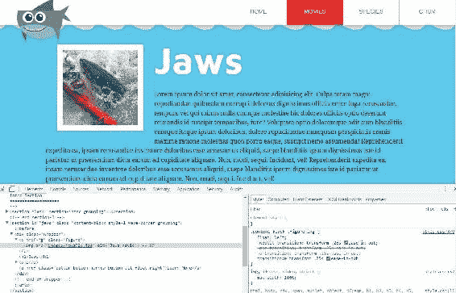
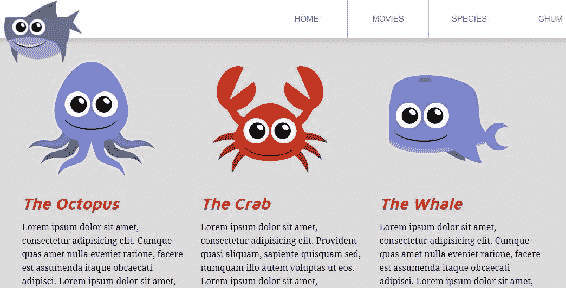

# 第八章：HiDPI 设备的工作流程

视网膜设备现在几乎是苹果电脑、平板电脑和手机的默认设备。此外，“视网膜”一词实际上是苹果公司为计算机设备注册的商标，是他们品牌化描述双倍（或更多）密度屏幕和设备的方式。我将松散地使用“视网膜”一词来描述任何具有高密度显示屏的设备，无论是由苹果制造还是其他制造商。视网膜设备上的所有内容都更清晰，因为与 CSS 设备显示器上的像素相比，现在有近四倍的像素；对于每个“CSS 像素”，现在有四个“设备像素”，从而实现更高质量的显示。不利的一面是，到目前为止我们使用的图像实际上在这样的设备上看起来不会那么好，因为我们没有考虑到更高密度的显示。

在本章中，我们将介绍一些针对视网膜显示器的图像技术。这包括使图像放大两倍。我们还将研究背景图像技术，使用 SVG，并在图像元素上使用`srcset`属性来进一步考虑视网膜。

# 2x 图像

2x 图像是宽度和高度的两倍。基本思路是使图像的宽度和高度是我们实际需要的两倍。然后我们将该图像添加到我们的 HTML 中。然后我们将使用 CSS 将图像限制为屏幕上的实际大小。我喜欢处理响应式设计中的灵活图像的方式与此相同：我喜欢确保图像将具有具有设置的包含元素`width`和`height`值。然后，我确保图像本身的`max-width`设置为 100%。这些要求已经具备。我的所有图像通常都有一个容器，在 CSS 中，我的所有图像都将其`max-width`设置为 100%。

# 创建视网膜大小的图像（2x）

所以让我们从鲨鱼电影页面上的光影开始。右键单击“大白鲨”电影图像并检查此元素：


我们可以看到鲨鱼电影页面上的这些图像是 200 x 200 像素。我们的目标是用尺寸为 400 x 400 像素的图像替换它们。如您在下面的屏幕截图中看到的，我已经创建了三个与原始图像相同的图像，只是它们更大，并且带有`@2x.jpg`后缀，表示这些是视网膜版本：


切换到 HTML，您会看到我已经为所有三个图像的文件名添加了`@2x`并保存了。例如，这是我们“Open Water”电影的文件名应该是这样的：

```css

```

# 使用 CSS 调整 2x 图像的大小

转到浏览器并刷新。现在，当您查看这张大白鲨的图像时，您实际上不会看到任何明显的区别：



然而，快速检查显示正在提供`@2x`图像，但它被限制为 200 x 200 的大小，因此您可以看到原始图像是`400 x 400`，但显示为`200 x 200`：


由于我们对响应式设计的基础，即时包含元素`.figure`已经设置了`23.958333333333`百分比的宽度（如下面的代码所示），这相当于网站最宽处的 200 像素：


如果我们从 Chrome DevTools 的样式窗格中删除`width`，图像将会放大到其实际大小，即`400 x 400`：


因此，是包含元素具有设置的`width`，以及`max-width`设置为 100%，使图像受限。如果我们从 Chrome DevTools 的样式窗格中删除这个`max-width`，图像将不再受限，如下所示：


父元素的溢出选项设置为隐藏，这就是为什么图像的宽度不会超过 23.95%。


# 在视网膜设备上检查图像质量

现在我们怎么知道图像在视网膜设备上会看起来很好呢？最好的办法是在视网膜设备上测试它，但我们也可以在 Chrome 中作弊一点，将其缩放到 200%。首先，让我们在 DevTools 中直接将宽度设置为 200px：


然后让我们转到 Chrome 工具栏，并将缩放比例调整到 200%：


前面的截图旨在演示在 200%缩放时，图像仍然非常清晰，这有点类似于模拟视网膜设备。

这似乎不是一个准备好视网膜的图像的坏方法。嗯，如果只是这么简单就好了。事实证明，使图像的高度和宽度增加一倍实际上使它们比 1x 版本大三到四倍。因此，如果你看一下`images`文件夹中的 Jaws 图像，原始大小为 28 KB，而 2x 版本（双倍密度版本）为 105 KB。这是原始大小的四倍！


因此，总之，这只是我们为视网膜网站做准备的开始。我们目前最大的问题是，我们为所有设备提供了一个巨大的视网膜大小的图像，即使那些不是视网膜的设备也是如此。这对于那些不会从中受益的站点来说，是额外的下载和页面负担，这是不负责任的。

在下一节中，我们将介绍类似的背景图像技术。

# 背景图像

为了处理背景图像，我们可以使用特殊的媒体查询来确定像素比，然后修改`background`属性以提供视网膜图像。在这一节中，我们将确定如何在视网膜领域处理背景图像。我们首先创建一个专门用于确定像素比的媒体查询。然后，我们将更新正在提供的图像为视网膜版本。页脚中的海藻是一个背景图像，因此将是这项任务的完美图像。

# 针对页脚中的海藻

这是在电影页面页脚上方的海藻：


如果我们查看 CSS，发生的一切就是页脚有一个重复的背景图像。背景是海藻，我们让它沿着*x*轴重复：

```css
footer {
  background: #fff url('../images/seaweed.jpg') repeat-x 0 0;
  padding: 142px 0;
  font-size: 14px;
  line-height: 1.7; 
}
```

因此，我们需要有一个视网膜大小的`seaweed.jpg`版本。我在我的`images`文件夹中有这个，我把它命名为`seaweed@2x.jpg`：


在样式表的最底部，在所有我们的媒体查询之后，让我们为视网膜背景图像保留一个位置：

```css
/***************
Retina, Background Images
***************/
```

这是我们将使用特殊媒体查询来检测视网膜的地方。

# 设备像素比的媒体查询

我们从第六章中记得这样的媒体查询，*变得响应式*：

```css
@media all and (max-width: 400px) {
  /*rule sets here*/
}
```

媒体查询有两个部分，媒体*类型*和媒体*特性*：

```css
@media *media type* and (*media feature*) {
  /*rule sets here*/
}
```

媒体类型可以是关键字值，如*screen*、*print*、*speech*和*all*。媒体特性也可以是许多东西。在响应式章节中，特性是浏览器的`max-width`。然而，对于视网膜，我们要查询屏幕的像素比：

```css
@media
screen and (-webkit-min-device-pixel-ratio: 2),
screen and (min-resolution: 192dpi) {
}
```

在前面的示例中发生了很多事情。有两个不同的查询针对两个不同的媒体特性。分隔这两个查询的逗号类似于说“或”。因此，如果前面的两个查询中的任何一个为真，则媒体查询将生效。但为什么要有两个查询？嗯，第一个查询是针对像 Safari 和旧版 Chrome 这样的 webkit 浏览器，设备的`min-device-pixel-ratio`为`2`。接下来，我们针对具有 192 像素每英寸或更高像素密度的设备。它不是使用设备像素比，而是使用`min-resolution: 192dpi`，这考虑到了不同的浏览器，比如 Windows 手机。这两个媒体特性基本上都是针对视网膜。

现在，在媒体查询中，我们将针对页脚并将背景图像更改为我们的视网膜版本。我会在页脚中输入一个开放的大括号，然后是`background-image`；URL 将是`../images/seaweed@2x.jpg`：

```css
@media
screen and (-webkit-min-device-pixel-ratio: 2),
screen and (min-resolution: 192dpi) {
 footer {
 background-image: url('../images/seaweed@2x.jpg');
 }
}
```

我们在浏览器中看不到明显的区别。不过，让我们检查一下页脚，以确保它仍然加载常规的`seaweed.jpg`文件，而不是`seaweed@2x.jpg`：


我们检查这个的原因是因为我不是在视网膜设备上。我们可以使用一些技巧来确保这个工作。让我们去我们的 CSS 并将设备像素比更改为`1`：

```css
@media
screen and (-webkit-min-device-pixel-ratio: 1),
screen and (min-resolution: 192dpi) {
  footer {
    background-image: url('../images/seaweed@2x.jpg');
  }
}
```

让我们看看在浏览器中是什么样子的：


现在我们得到了 2x 版本，我们可以看到它明显更大。我们有两倍大小的图像；视觉上看起来是两倍大小。它没有被限制在我们预期的显示尺寸上。有一个名为`background-size`的属性，我们将使用它来解决这个问题。

# 仅向视网膜设备提供 2x 图像

我们必须使用`background-size`属性来确保海藻被适当地限制。我们将在页脚部分顶部持有非视网膜版本的规则集中放置`background-size`属性，而不是在媒体查询中。我们可以很容易地将其放在媒体查询中，这样也可以，但这将适用于非视网膜设备和视网膜设备，因此我们将添加水平`200px`和垂直`100px`的背景大小，如下面的代码所示：

```css
footer {
  background: #fff url('../images/seaweed.jpg') repeat-x 0 0;
  background-size: 200px 100px;
  padding: 142px 0;
  font-size: 14px;
  line-height: 1.7; 
}
```

保存这个并转到浏览器。当我们刷新网站时，海藻应该缩小到 200 x 100，恢复到其常规大小：


如果您查看我们在 DevTools 中的样式，您会看到我们得到了`@2x`版本。您可以看到浏览器加载 CSS 的方式-它在顶部看到了媒体查询。这是正在使用的。下面是未加载的非媒体查询版本。这正是我们希望它工作的方式，这很好。

我们需要做的最后一件事是将媒体查询恢复为`device-pixel-ratio`为 2 而不是 1，所以，我们将更改它：

```css
@media
screen and (-webkit-min-device-pixel-ratio: 2),
screen and (min-resolution: 192dpi) {
  footer {
    background-image: url('../images/seaweed@2x.jpg');
  }
}
```

现在它将加载非视网膜版本，因为我使用的是非视网膜设备：


只有视网膜尺寸的背景图像才会被视网膜设备下载，非视网膜设备会下载常规尺寸的背景图像。一切都很好，但这仍然是相当多的工作。我们可以以更少的工作量处理这些海藻，只需要一张图片-使用 SVG 而不是传统的光栅图形。

# 可伸缩矢量图形（SVG）

**可伸缩矢量图形**（**SVG**）-是一种基于 XML 的图形图像格式。它与 JPEG 和 PNG 等光栅格式不同，因为它可以在任何尺寸下缩放而不失去任何分辨率或出现像素化。这意味着我们不需要为视网膜或响应式布局使用多个图像！SVG 的另一个好处是文件大小可以比保存为 JPEG 或 PNG 的相同图像要小得多。所有主要浏览器都支持 SVG 格式，甚至可以追溯到 IE9。SVG 并不是站点上每个图像的替代品-它们特别适用于线条图，通常是通过设计软件（如 Adobe Illustrator）生成的。

在本节中，我们将看看如何将 Adobe Illustrator 文件保存为 SVG，以及我们可以将 SVG 添加到网站的三种不同方式：

+   将 SVG 添加为`background-image`

+   使用``标签添加 SVG

+   使用内联 SVG

我们的网站上有很多图像非常适合使用 SVG，包括网站顶部的鲨鱼：


我们网站中间的所有不同海洋物种也非常适合作为 SVG：



即使我们在上一节中处理的页脚中的海藻也非常适合 SVG：


那么哪些图像不适合作为 SVG？嗯，我们电影页面上的光栅图像绝对不适合：


# 将 Illustrator 文件保存为 SVG

我在 Illustrator 中打开了一个名为`seaweed.ai`的 Adobe Illustrator 文件。像 Illustrator 这样的程序是可以创建 SVG 或从头开始绘制 SVG 的地方。在本书中，使用 Illustrator 创建 SVG 远远超出了范围，但我想从这里开始只是为了展示 SVG 可能来自何处。

在*Illustrator CC 2017*中，将 AI 文件保存为 SVG 以供 Web 使用的最佳方法之一是使用文件* > *导出* > *屏幕导出...选项。

这个选项使用`artboard`名称作为文件名，所以在我们导出为 SVG 之前，让我们通过转到窗口* > * `画板`来重命名画板。让我们将 artboard1 重命名为 seaweed，如下面的截图所示：


现在，通过转到文件* > *导出* > *屏幕导出...选项，我们将获得一个 SVG 文件：


这将弹出一个带有几个选项的屏幕。使用“导出到”字段，我们将选择保存此文件的位置，这将不可避免地在我们的`images`文件夹中。在单击右下角的“导出画板”按钮之前，我们还将更改格式为`SVG`：


保存后，您会看到 SVG 为 1 KB。我们在上一节中使用的`@2x`版本为 13 KB！


因此，SVG 不仅比`@2x`版本小 13 倍，而且比常规版本小 6 倍，这真是太神奇了！现在让我们将其整合到我们的 CSS 中。

# 将 SVG 文件添加为背景图像

在我们的 CSS 中，在针对页脚的规则集内部，我要做的就是将格式从`.jpg`更改为`.svg` - 也就是从（`'.../images/seaweed.jpg'`）更改为（`'.../images/seaweed.svg'`），如下面的代码所示：

```css
footer {
  background: #fff url('../images/seaweed.svg') repeat-x 0 0;
  background-size: 200px 100px;
  padding: 142px 0;
  font-size: 14px;
  line-height: 1.7; 
}
```

因为现在我们有一个适用于非视网膜和视网膜设备的 SVG，所以我们将转到底部，并注释掉我们上一节中的这个媒体查询：

```css

/***************
Retina, Background Images
***************/
/*********** @media
only screen and (-webkit-min-device-pixel-ratio: 2),
only screen and (min-resolution: 192dpi) {
   footer {
    background-image: url('../images/seaweed@2x.jpg');
  } 
}
*************/
```

这是我们在上一节中用来为视网膜设备提供更大图像的方法，但是如果我们使用 SVG，我们就不需要所有这些额外的代码。所以我把它们都去掉了。

我将刷新浏览器，它看起来完全一样。让我们检查元素，如下面的截图所示。我们可以看到它正在提供`seaweed.svg`。我们从 2 张图片变成了 1 张。13 KB 变成了 1 KB。我们还去掉了一些复杂的媒体查询中的几行 CSS。您开始明白为什么 SVG 是纯粹的令人敬畏了吗？


# 将 SVG 添加为常规的

您还可以将 SVG 用作常规``。我们碰巧在网站中间有几张图片 - 不同的海洋物种，这些将是使用 SVG 实现的完美候选者：


我已经将章鱼、螃蟹和鲸鱼保存为`.svg`文件。所以让我们转到 HTML，简单地将章鱼、螃蟹和鲸鱼的图像从`.png`更改为`.svg`：

```css
<!-- 
===============
Secondary Sections
===============
-->
<section class="secondary-section grouping">
  <div class="wrapper">
    <div class="column">
      <figure>
        
      </figure>
      <h2>The Octopus</h2>
      <p>Lorem ipsum dolor... </p>
      <a href="#" class="button">Tenticals &raquo;</a>
    </div>
    <div class="column">
      <figure>
        
      </figure>
      <h2>The Crab</h2>
      <p>Lorem ipsum dolor... </p>
      <a href="#" class="button">Crabby &raquo;</a>
    </div>
    <div class="column">
      <figure></figure>
      <h2>The Whale</h2>
      <p>Lorem ipsum dolor... </p>
      <a href="#" class="button">Stuart &raquo;</a>
    </div>
  </div><!-- end wrapper -->
</section>
```

`images`文件夹中的文件名完全相同。唯一的区别是后缀是`svg`而不是`png`：


保存这个。我们将得到以下输出：


在上图中，我们可以看到文件看起来不错；唯一的问题是它们似乎变大了一点。所以我们将它们缩小到我们想要的尺寸。

# 你无法阻止 SVG，你只能希望限制它们！

要限制图像的大小，我们需要设置`width`和/或`max-width`。我们实际上已经这样做了，但只是在媒体查询中，因此它不会在较大的屏幕上触发：

```css
@media screen and (max-width: 1023px){
  .intro-content {
    width: auto;
    float: none;
    padding-bottom: 0;
    margin-bottom: 30px;
  }
  .go-premium {
    width: auto;
    float: none;
    margin-top: 0;
  }
  .column {
    float: none;
    width: auto;
    padding: 0 50px;
  }
 .column figure {
 margin: 0 auto;
 width: 100%; 
 max-width: 250px;
 }
  .column h2 {
    text-align: center;
  }
}/* end of media query */

```

让我们从媒体查询中删除该规则集，并将其添加到我们最初定义响应式媒体查询之外的 3 列位置：

```css
****************
3 columns
****************/
.column {
  float: left;
  width: 31.25%; /* 300/960 */
  margin-left: 3.125%; /* 30/960 */
}
.column:first-child {
  margin-left: 0;
}
.column figure {
 margin: 0 auto;
 width: 100%;
 max-width: 250px; 
}
```

我们所做的就是使用自动边距来居中`figure`元素，确保其宽度是其容器的 100%，只要宽度不超过 250px（`max-width`）。

既然我们已经将它放在了正确的位置，这就是我们得到的结果：


我们将每个 SVG 图像限制为最大宽度为`250px`。我们的螃蟹、章鱼和鲸鱼看起来非常好，立即就准备好了。

# 使用内联 SVG

我们对 SVG 还有另一个选项，称为内联 SVG。由于 SVG 实际上只是文本文件中的 XML，我们实际上可以直接将 SVG 代码嵌入到我们的 HTML 中。这样就不需要额外的 HTTP 请求（对性能有好处）。此外，它允许我们使用 CSS 来改变 SVG，例如提供一个酷炫的悬停状态或动画。这确实给了我们一个巨大的优势；它的重要性无法被过分强调。

所以我们要做的是转到 Sublime Text 中的`images`文件夹，然后打开`crab.svg`。但首先，让我们看看当我打开`crab.png`时会发生什么，Sublime 会显示一个图像：


使用 SVG，它实际上显示了代码！你可以看到它是 XML，与 HTML 类似：


我将复制并粘贴所有的 SVG 代码，并转到我们的`index.html`文件，然后删除整个`img`标签：

```css
<div class="column">
  <figure>
 
  </figure>
  <h2>The Crab</h2>
  <p>Lorem ipsum dolor... </p>
  <a href="#" class="button">Crabby &raquo;</a>
</div>
```

然后我们将其替换为 SVG 代码：

```css
<div class="column">
  <figure>
    <svg  viewBox="1.5 113.9 256 256">
 <path fill="#9E2610" d="M72.1 296.8s-31.8 11.7-37.9 20.5c0 0 3.5-21.3 
      30.9-32.7l7 12.2zm12.1 10.7s-21.9  
      22.8-23.4 32.7c0 0-5.8-19.3 12.5-40.1l10.9 7.4zm-15.9-28.7s-34 
      2.4-43.3 9.1c0 0 12.3-19.5 42.3-22.8l1 
      13.7zM185.4 295s31.8 11.7 37.9 20.5c0 0-3.5-21.3-30.9-32.7l-7 
      12.2z"/>
 <path fill="#D62D0E" d="M50.5 223.5S13 205.5 41 161c0 0 9-19.5 
      38-16.5L53.5 205l46-32.8s12.5 24.5-11    
      42.2c0 0-13.8 10.2-20.8 9 0 0 4.5 11 12 16.2l3.5 3.2-9.5 
      11c.1.2-20.7-15.3-23.2-30.3z"/>
 <path fill="#9E2610" d="M173.3 305.6s21.9 22.8 23.4 32.7c0 0 
      5.8-19.3-12.5-40.1l-10.9 7.4zm15.9-28.7s34 
      2.4 43.3 9.1c0 0-12.3-19.5-42.3-22.8l-1 13.7z"/>
 <path fill="#D62D0E" d="M207.9 223.5s37.5-18 9.5-62.5c0 
      0-9-19.5-38-16.5l25.5 60.5-46-32.8s-12.5 24.5 
      11 42.2c0 0 13.8 10.2 20.8 9 0 0-4.5 11-12 16.2l-3.5 3.2 9.5 11c0 .2 
      20.7-15.3 23.2-30.3z"/>
 <path fill="#D62D0E" d="M127.8 212s44-5.2 65.2 57.8c0 0 11.8 
      44.5-62.2 48.5 0 0-70.2 1.2-66.2-43.8-.1 0 
      6.6-54 63.2-62.5z"/>
 <circle fill="#FFFFFF" cx="103.8" cy="265.1" r="23.5"/>
 <circle fill="#FFFFFF" cx="153.6" cy="264.1" r="23.5"/>
 <circle cx="105.2" cy="263.8" r="14.8"/>
 <circle cx="152.2" cy="262.5" r="14.8"/>
 <ellipse transform="rotate(-45.37 157.15 256.57)" fill="#FFFFFF" 
      cx="157.1" cy="256.6" rx="4.7" 
      ry="7.2"/>
 <ellipse transform="rotate(-45.37 110.35 257.456)" fill="#FFFFFF" 
      cx="110.3" cy="257.4" rx="4.7" 
      ry="7.2"/>
 <path d="M78.5 290s12.7 20 51.6 19.5c0 0 34.2 1.5 49.2-19.5 0 0-15.8 
      17.5-49.2 17.2 0 0-36.1.3-51.6-
      17.2z"/>
 </svg>
  </figure>
  <h2>The Crab</h2>
  <p>Lorem ipsum dolor... </p>
  <a href="#" class="button">Crabby &raquo;</a>
</div>
```

哇，这是很多的代码... SVG 的缺点是你直接将大量代码放入你的标记中。你仍然会获得更好的性能，因为你不需要为它发出 HTTP 请求，但我们为此添加了接近 30 行的代码。

在 Chrome 中我们看不到任何变化；螃蟹看起来完全一样。所以我们不妨检查一下这个元素。现在我们可以看到它是内联 SVG 代码：


你还可以看到你可能会认为你可以使用 CSS 来改变这些属性，因为每个路径实际上都是 Dom 中的一个单独的节点：


例如，如果我们想的话，我们可以改变这行代码的填充颜色：


让我们把它变成绿色：


现在你得到了一个绿色的爪子：


所以你可以看到你可能如何改变 SVG 的属性，对其进行动画处理，或者创建一个酷炫的悬停状态。你不能用 SVG 作为`background-image`或`img`标签来做到这一点，但你可以用内联 SVG 来做到这一点。

由于这是一种不同的媒体格式，它不是`img`标签，也不是`video`标签。它实际上是一个`SVG`标签。让我们转到样式表的顶部，进入我的重置。这是我们在媒体上设置`max-width: 100%`的地方，如下面的代码所示。我们还将向此列表添加一个 SVG：

```css
img, iframe, video, object, svg {
  max-width: 100%;
}
```

在下一节中，我们将讨论如何在`img`标签上使用`srcset`属性，以向高密度显示器提供视网膜图像，并向普通密度显示器提供正常大小的图像。

# 源设置属性（srcset）

SVG 仍然是向 HiDPI 设备提供视网膜图像的最受欢迎的方式，因为文件大小几乎总是比 JPG 和 PNG 小，而且对于视网膜和非视网膜设备只需要一个图像。但还有另一个非常好的选择出现了，叫做`srcset`。这个选项并不是要取代 SVG，而是要补充它，因为 SVG 不能用于传统的光栅图像和照片，这些更适合于 JPEG 和 PNG。

# 什么是 srcset？

`srcset`属性只是一组图像，就像名称所暗示的那样。我们可以提供不止一个图像供浏览器选择，而是一组图像，浏览器可以从中选择，并且只获取浏览器认为最适合设备的图像。

我们将专注于我们电影页面上的三个电影图像，它们都是光栅的、摄影的图像。


在`movies.html`中，我们有一个`img`标签和每部电影的适当图片。所以对于 Sharknado，我们有`sharknado.jpg`：

```css

```

对于 Jaws，我们有`jaws.jpg`：

```css

```

让我们更新 Jaws 图像，并添加一个名为`srcset`的新属性，然后将我们的 Jaws 图像作为该属性的值：

```css

```

正如我提到的，`srcset`是一组图像选择，供浏览器决定哪个最适合情况。让我们添加一组图像。

# 向 srcset 添加一组图像

要向`image`标签添加一组图像，用逗号分隔每个图像。我们首先提供常规大小的图像。然后我们将添加`images/jaws@2x.jpg`：

```css

```

实际上，浏览器需要其他东西来让它知道这是一个更大的图像，称为*像素密度描述符*，或者只是*X 描述符*。让我们添加它，如下面的屏幕截图所示：

```css

```

在每个图像字符串后面，我将提供一个空格，然后是 X 描述符。因此，第一个图像字符串将是`1x`，第二个将是`2x`。X 描述符是我们提供给浏览器的提示。这意味着我们在`1x`或正常像素密度显示器上使用`images/jaws.jpg`，在`2x`或 retina 显示器上使用更大的图像`images/jaws@2x.jpg`。

# 测试图像集

让我们看看图像集是否起作用。如果没有在 retina 显示屏上测试，这将会很困难。但让我们看看是否可以进行一些粗略的测试。Chrome 有一个很好的功能，如果我们检查一个图像，我们可以看到它的`src`属性和`srcset`属性。看看下面的代码：


在这里，如果我们将鼠标悬停在每个图像的路径上，你会看到一个弹出窗口出现在正在提供的图像上。但是当我们悬停在`jaws@2x`上时，没有弹出窗口出现，因为该图像没有被提供：


这是有道理的，因为我不是在 retina 显示屏上，所以它正在使用非 retina 图像。

让我们使用浏览器缩放技巧，这是我们在前面的部分中使用的，看看是否可以伪造一个 retina 设备。让我们放大到 200%：


然后，刷新页面，以便它获取它认为最好的图像：


当我在`src`和`srcset`中悬停在`jaws.jpg`上时，我们没有弹出窗口。但是当我们悬停在`jaws@2x.jpg`的路径上时，我们就会看到，如下所示：


这告诉我，更大的图像正在被获取。这是好东西。

# 简化 srcset 属性

让我们再看一下代码，以简化`srcset`属性：

```css

```

我们需要保留原始的`src`作为不支持`srcset`的浏览器的备用。我们稍后会在本节中讨论浏览器支持有多好，但重要的是要记住，`src`属性是为了让不支持的浏览器不被忽视。

另一件需要注意的事情是，我们可以简化这个代码方程式。W3C 规范提到，对于新的用户代理，`src`属性参与资源选择，就好像它是在`srcset`中用`1x`描述符指定的一样。由于我们有传统的`src`属性，可以提供图像的`1x`版本，我们可以从`srcset`属性中删除第一个图像字符串，并简化我们的标记：

```css

```

换句话说，我们可以从`srcset`属性中删除带有`1x`描述符的常规大小图像字符串，因为这已经在`src`属性中指定了。这样简化了它，这是好事。

现在让我们用类似的标记更新我们的另外两部电影，从《Sharknado》开始：

```css

```

我们将对电影《Open Water》做同样的事情：

```css

```

# 浏览器支持

让我们讨论浏览器支持[caniuse.com](http://caniuse.com/)显示了大量绿色浏览器：


Microsoft Edge 支持`srcset`，Chrome，Firefox，Safari，Opera，以及 iOS Safari 8 及更高版本也支持。

将选项更改为*日期相对*，显示支持在 iOS 上更早：


它从 Safari 8.1 到 8.4 提供了部分支持。它支持"分辨率切换"，这就是我们使用 X 描述符所做的；然而，它不支持完整的语法，我稍后会在本节中详细讨论。一个值得注意的不支持的浏览器是 IE，甚至是 IE11。但是，Internet Explorer 将获取我们在传统源属性中指定的常规大小图像。

好处在于绝大多数高密度设备最终都会得到`2x`版本，而不支持的浏览器，很可能是非视网膜设备，将收到`1x`版本。

我要指出的是，你不一定只使用一个或两个图像路径。我将复制并粘贴三个图像路径，如下所示：

```css

```

正如你在前面的代码中看到的，我已经指定了一个可以用于`4x`显示、`2x`显示和`1.5x`显示的`image`。这让我想到另一点——你不一定要使用整数。你可以使用 1.5 或 1.325。

此外，我们只是向浏览器提供提示，所以即使我们看起来对哪个图像被服务有很大的控制，最终决定权还是在浏览器手中。这是基于除用户屏幕像素密度之外的因素，例如，缩放级别，正如我们已经看到的，以及其他因素，比如用户的网络条件。

因此，理论上，如果用户有一个视网膜设备，但网络条件不佳，浏览器会提供一个较小的图像，因为它会优先考虑图像的快速加载——加载会更快，但不会那么清晰。我们很可能在其他技术中看到了这种优先级的情况。例如，Netflix 可能会显示电影的模糊版本，直到它获得足够的带宽来向您展示同一部电影的高清版本。我们喜欢这样，因为我们宁愿快速得到一些东西来观看，而不是等待最好的版本来观看。

# 使用`srcset`属性的`W`描述符和 sizes 属性

请注意，`srcset`属性不是一个单一的技巧；我们已经讨论了它如何轻松处理视网膜图像。但`srcset`属性还有另一个用例，它使用`W`描述符和`sizes`属性：

```css

```

它允许你根据浏览器的宽度来处理不同图像的服务。在桌面上，一个巨大的、英雄式的、全屏的图像看起来很漂亮，但如果你把它缩小并在更小的移动设备上提供服务，那么它的性能就会很差，因为小设备不需要超大的图像。

`w`描述符是对浏览器关于图像大小的提示；这里的`w`代表宽度。`sizes`属性添加了媒体查询和一个维度，告诉浏览器我们首选的图像渲染大小，如果浏览器宽度与媒体查询匹配，最后是如果浏览器宽度不匹配媒体查询的首选渲染大小。

我的意图不是解释`srcset`属性的这种替代用法的细节，而是让你知道`srcset`属性有更深层次。如果你想深入了解，我在我的网站上写了一篇文章，网址是[richfinelli.com/srcset-part-2/](http://www.richfinelli.com/srcset-part-2/)。我还写了一篇关于 X 描述符的文章，网址是[richfinelli.com/srcset-part-1/](http://www.richfinelli.com/srcset-part-1/)，如果你还想更深入地了解我们刚才谈到的内容。

# 总结

为视网膜设备开发需要额外的工作。我的建议是尽可能使用 SVG 作为为视网膜设备提供超清晰图像的首选。在 SVG 不可行的情况下——即照片——使用`img`标签的`srcset`属性，让浏览器能够智能地决定提供图像。`srcset`的浏览器支持很好，不支持的浏览器将退回到`src`属性。浏览器根据像素密度、缩放级别和其他因素，比如网络条件，最终决定使用哪个图像。

在下一章第九章，*Flexbox*，*Part 1*，我们将看到一个用弹性盒子布局网页部分的替代和更好的解决方案。
