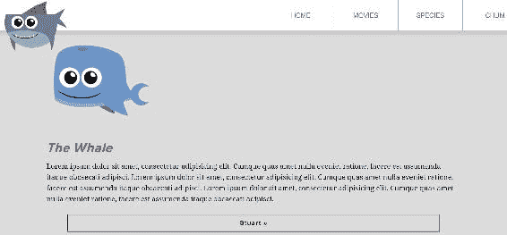
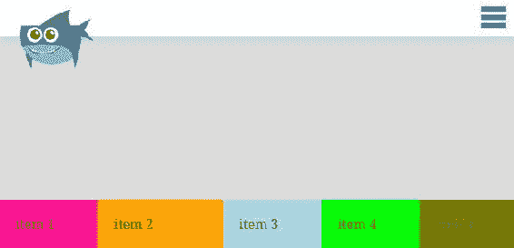
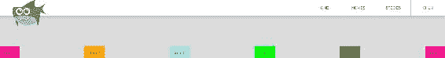

# 第九章：Flexbox，第一部分

Flexbox 是用于页面部分布局的模块，目前在 Internet Explorer 10 及以上版本中有很好的浏览器支持。从技术上讲，它并不是为全页面布局设计的；它更多用于页面的部分布局或给定组件的布局。

例如，以下三列（章鱼，螃蟹和鲸鱼）是使用浮动布局的，但我们将使用 flexbox 来完成完全相同的事情：


Flexbox 是一个大主题，所以我们将在两章中涵盖它。本章将介绍基础知识，我们将解决实现 flexbox，从浮动切换到 flexbox，并介绍所有 flexbox 属性和简写。在下一章中，我们将构建一个新的部分-以下产品列表-以演示如何使用 flexbox 构建不同的东西。


我将在最新版本的 Chrome 中编码，目前支持所有 flexbox 属性的非前缀版本。这将简化学习体验。但在完成之前，我们需要为最大的浏览器兼容性添加供应商前缀。

我们将涵盖以下主题：

+   CSS 的弹性盒布局模块概述

+   从浮动切换到 flexbox

+   Flexbox 属性和简写

# 弹性盒布局模块概述

什么是 flexbox？通常称为 flexbox，它的真实名称是*flexible box layout module*。它提供了一种更有效的方式来布局，对齐和分配父元素的子元素之间的空间，即使它们的大小和数量是未知的或动态的。Flexbox 定义了一种全新的布局模式。

传统上，有*块模式*，用于文档布局。有*内联模式*，用于文本；*表模式*，用于表格数据（表格）；和*定位模式*，用于明确位置而不太关心周围的其他元素。现在有*flexbox 模式*。那么 flexbox 做什么？它可以做很多真正有用的事情。在核心，flexbox 用于布局和对齐。以下列表说明了它更常见的用例：

+   元素的垂直或水平布局。

+   元素的左对齐或右对齐，就像您可以使用浮动一样，但没有浮动带来的额外麻烦。您还可以水平或垂直居中元素。

+   此外，您可以控制显示方向。例如，默认情况下，您可以按源顺序显示元素，也可以按相反方向显示。

+   此外，您可以明确控制元素并更改它们的显示顺序。

+   它轻松实现的另一件事是给你相等高度的列，这以前只能通过使用黑客来实现

+   它真正的乐趣在于它如何在父元素中分配元素以适应可用空间。

+   面向响应式设计

# 弹性术语

所以这都是令人兴奋的事情，我相信你想开始看到它的实际效果，但在我们跳入之前，我们需要做一些功课并学习弹性术语。

# Flex 容器和 flex 项目

首先，有一个称为*flex 容器*的东西，它本质上是包含所有*flex 项目*的元素。换句话说，它是一组元素的父元素；flex 项目是其父元素或 flex 容器的子元素。


# 主要尺寸和交叉尺寸

这里有一个称为*主尺寸*和*交叉尺寸*的东西，如下所示：


默认情况下，主尺寸是宽度，交叉尺寸是高度，但如果修改`flex-direction`，这可能会改变，这是我们将在下一节学习的内容。

# 主轴和交叉轴

此外，还有一个称为*主轴*的东西，默认情况下水平运行，以及*交叉轴*，默认情况下垂直运行，如下图所示：


# Justify-content 和 align-items

在本章节中，您将学习到一个叫做`justify-content`的属性，它控制沿主轴的对齐方式；`align-items`属性控制沿交叉轴的对齐方式。这是一个重要的概念。主轴和交叉轴可以根据`flex-direction`设置为`column`或`row`来切换。因此，主轴默认始终是水平轴，除非您使用`flex-direction: column`，垂直轴就成为主轴！

如果这是您第一次接触 flexbox，您可能会说：“嘿，慢点！”不用担心，这只是术语和一些属性和概念的介绍；不要指望立刻就能理解这一切。随着我们在接下来的章节中开始使用不同的属性，我们将更多地参考前面的图表，并且我们将在接下来的章节中深入讨论每一个属性。

# 从浮动到 flexbox

在本节中，我们将开始工作，将我们的列模块从基于浮动的布局更改为基于 flexbox 的布局（我很兴奋）。

首先，我们将从列中删除所有与浮动相关的属性，并将它们分解到最初的状态；然后，我们将使用`display: flex`将浮动布局转换为基于 flexbox 的布局，以立即看到结果。最后，我们将探讨`flex-direction`在响应式设计中的用途；当我们开始讨论较小的屏幕尺寸时，我们将讨论这一点。

# 从列部分删除与浮动相关的属性

好的，这是我们的三列布局：


让我们回想一下，它在较小的宽度下变成了一个一列的管道：


好了，让我们去 CSS 文件。现在我们将从我们的列中删除所有基于浮动的属性。

从这开始：

```css
****************
3 columns
****************/
.column {
  float: left;
  width: 31.25%; /* 300/960 */
  margin-left: 3.125%; /* 30/960 */
}
.column:first-child {
  margin-left: 0;
}
.columns figure {
  margin: 0 auto;
  width: 100%;
  max-width: 250px;
}
```

让我们基本上删除所有内容，使其看起来像这样：

```css
****************
3 columns
****************/
.column {

}

```

接下来，让我们在响应式媒体查询中删除基于浮动的代码。所以从这开始：

```css
@media screen and (max-width: 1023px){
  .intro-content {
    width: auto;
    float: none;
    padding-bottom: 0;
    margin-bottom: 30px;
  }
  .go-premium {
    width: auto;
    float: none;
    margin-top: 0;
  }
 .column {
 float: none;
 width: auto;
 padding: 0 50px;
 }
 .column figure {
 margin: 0 auto;
 width: 100%; 
 max-width: 250px;
 }
 .column h2 {
 text-align: center;
 }
}/* end of media query */
```

让我们将它改成这样：

```css
@media screen and (max-width: 1023px){
  .intro-content {
    width: auto;
    float: none;
    padding-bottom: 0;
    margin-bottom: 30px;
  }
  .go-premium {
    width: auto;
    float: none;
    margin-top: 0;
  }
}/* end of media query */
```

并在一个非常小的宽度的媒体查询中，让我们删除对列的最后一个引用。所以，从这开始：

```css
@media screen and (max-width: 550px) {
  h1 {
    font-size: 40px;
  }
  h2 {
    font-size: 26px;
  }
 .column {
 padding: 0;
 }
  .content-block .figure {
    width: 200px;
    display: block;
    margin-left: auto;
    margin-right: auto;
    float: none;
  }
  .content-block h1 {
    text-align: center;
  }
  .button-narrow {
    width: 100%;
  }
}/* end of media query */
```

让我们删除`.column {}`规则集，使其看起来像这样：

```css
@media screen and (max-width: 550px) {
  h1 {
    font-size: 40px;
  }
  h2 {
    font-size: 26px;
  }
  .content-block .figure {
    width: 200px;
    display: block;
    margin-left: auto;
    margin-right: auto;
    float: none;
  }
  .content-block h1 {
    text-align: center;
  }
  .button-narrow {
    width: 100%;
  }
}/* end of media query */
```

好了，如果我们刷新浏览器并扩大它，我们将回到堆叠布局：



我们已经成功地从本节中删除了基于浮动的布局，因为我们的三列已经消失了。

# 使用`display: flex`打开 flexbox

现在我们将使用 flexbox 重新构建列。我们将查看我们的 index.html 文件。这是我们称之为列的区域的标记：

```css
<!-- 
===============
Secondary Sections
===============
-->
<section class="secondary-section grouping">
  <div class="wrapper">
    <div class="column">
      <figure>
        
      </figure>
      <h2>The Octopus</h2>
      <p>Lorem ipsum dolor...</p>
      <a href="#" class="button">Tenticals &raquo;</a>
    </div>
    <div class="column">
      <figure>
        
      </figure>
      <h2>The Crab</h2>
      <p>Lorem ipsum dolor...</p>
      <a href="#" class="button">Crabby &raquo;</a>
    </div>
    <div class="column">
      <figure></figure>
      <h2>The Whale</h2>
      <p>Lorem ipsum dolor...</p>
      <a href="#" class="button">Stuart &raquo;</a>
    </div>
  </div><!-- end wrapper -->
</section>
```

每个`<div class="column"></div>`将成为我们的 flex 项目；`<div class="wrapper">`将成为我们的 flex 容器。为了便于理解，我将简化我们的标记如下：

```css
<div class="wrapper"> <!--flex container-->
  <div class="column">...</div> <!--flex item-->
  <div class="column">...</div> <!--flex item-->
  <div class="column">...</div> <!--flex item-->
</div> <!--end of flex container-->
```

让我们为 flex 容器添加一个新的类名"columns"，我们将使用它来定位我们的 flex 容器与我们的 flexbox 代码：

```css
<div class="wrapper columns"> <!--flex container-->
  <div class="column"></div> <!--flex item-->
  <div class="column"></div> <!--flex item-->
  <div class="column"></div> <!--flex item-->
</div> <!--end of flex container-->
```

让我们添加一个新的规则集，以定位我们将要成为 flex 容器的元素。要将某物转换为 flex 容器，只需添加`display: flex`：

```css
/****************
3 columns
****************/
.columns {
  display: flex;
}
.column {

}
```

flex 容器的子元素将自动成为 flex 项目。

请注意，子子孙孙的元素不会被视为 flex 项目，只有直接的子元素。

这就是我们得到的：


我们基本上通过一个简单的属性`display: flex`实现了我们的浮动布局。间距有点紧，但我们仍然有一个水平布局。

Flex 覆盖浮动。假设我们有许多浮动，即`float: left`，`float: right`和`float: none`；无论是什么，flex 项目都会忽略浮动，也就是说，它们没有任何影响。因此，一旦容器元素设置为`display: flex`，使子元素成为 flex 项目，浮动现在将被忽略在这些 flex 项目上。我可以随心所欲地浮动，但它对 flex 项目没有任何影响。

还有一件事要记住的是，每列现在都是相等的高度。但让我们做一件事。让我们在 flex 项目周围添加一个边框：

```css
/****************
3 columns
****************/
.columns {
  display: flex;
}
.column {
  border: 1px solid pink;
}
```

这就是它的样子：


等高列，对吧？嗯，每列的内容量完全相同。所以即使我们使用浮动布局，我们也会得到等高的列。不等高是因为每列的内容量不同。我将删除螃蟹列中的一些段落文本：


做完这些之后，你会发现即使它的内容少了很多，它的高度仍然相同。尽管在这里发生了一些其他事情，特别是螃蟹列的宽度与其他两列不同。我们将在本章后面讨论这个问题，但是我们默认情况下确实获得了等高，这是一个很难通过基于浮动的布局来实现的快速胜利。

# 改变 flex-direction

让我们看看通过添加`flex-direction`属性并将其值设置为`column`来改变布局方向有多简单。这个属性适用于`.columns`的 flex 容器。我还删除了粉色的`border`。

```css
/****************
3 columns
****************/
.columns {
  display: flex;
 flex-direction: column;
}
.column {
}
```

我们保存这个设置，哇！我们从水平变成了垂直：


一些我们可能想要的居中对齐已经消失了；然而，布局仍然是垂直的。所以这很有趣。

另一件事是我们可以将`flex-direction`设置为`column-reverse`：

```css
/****************
3 columns
****************/
.columns {
  display: flex;
  flex-direction: column-reverse;
}
.column {
}
```

之前，我们的章鱼首先出现；现在如果我们刷新浏览器，我们的鲸鱼首先出现，章鱼最后出现：


然而，如果我们查看我们的 DevTools，我们会发现章鱼仍然是源顺序中的第一个，但是最后一个被显示出来：


因此，源顺序没有改变，只是显示顺序改变了。

现在是一个好时机来谈谈我们的 flexbox 图表。当`flex-direction`设置为`row`时，这个图表适用——flex 项目水平排列：


然而，当`flex-direction`改为`column`时，图表也会改变：


交叉轴现在从左到右，主轴从上到下，flex 项目现在堆叠在彼此上方。

`flex-direction`的默认值是`row`；`flex-direction: row`。

我们还可以将`flex-direction`设置为`row-reverse`，它会按你所想的那样：水平排列 flex 项目，但顺序相反。让我们看一下下面的图片；我们有鲸鱼、螃蟹和章鱼的顺序相反：


让我们从`.column`的 flex 容器中删除`flex-direction`属性，它将默认为行，这正是我们想要的：

```css
/****************
3 columns
****************/
.columns {
  display: flex;
}
.column {
}
```

# 浏览器缩小

现在让我们考虑一下更小的设备，缩小我们的浏览器。在接近平板尺寸时，会有点紧：


在我们的媒体查询中，我们最初删除了所有的`float`内容。让我们将`flex-direction`改为`column`：

```css
@media screen and (max-width: 550px) {
  h1 {
    font-size: 40px;
  }
  h2 {
    font-size: 26px;
  }
  .columns {
 flex-direction: column;
 }
  .content-block .figure {
    width: 200px;
    display: block;
    margin-left: auto;
    margin-right: auto;
    float: none;
  }
  .content-block h1 {
    text-align: center;
  } 
  .button-narrow {
    width: 100%;
  }
}/* end of media query */
```

我们又回到了较窄浏览器宽度下的一列堆叠布局：


正如你所看到的，仍然存在一些间距和对齐的问题，我们将在下一节中使用 flexbox 来解决这些问题。

总之，我们从列部分中删除了所有基于浮动的布局 CSS，并添加了使用`display: flex`的 flexbox 布局。我们还改变了`flex-direction`，正如我们所看到的，它决定了主轴和交叉轴的方向。

# 理解 flex-grow、flex-basis、flex-shrink 和 flex

让我们试着理解 flexbox 的尺寸属性。在这一节中，我们将使用`flex-grow`、`flex-shrink`、`flex-basis`以及它们的快捷方式`flex`来调整 flex 项目的尺寸。所有这些属性都适用于 flex 项目，而不是 flex 容器。

# 使用 flex-grow

首先，我们来看一个新页面——`flexbox.html`。你可能已经猜到了，有一个`<section>`将成为 flex 容器，还有 5 个`<div>`将成为 flex 项目。

```css
<!--
====================
Flexbox Demo
====================
-->
<section class='flex-container'>
    <div class="flex-item flex-item1">item 1</div>
    <div class="flex-item flex-item2">item 2</div>
    <div class="flex-item flex-item3">item 3</div>
    <div class="flex-item flex-item4">item 4</div>
    <div class="flex-item flex-item5">item 5</div>
</section>
```

这是我们在添加 flexbox 属性之前将要开始的 CSS：

```css
/***************
Flexbox demo
***************/
.flex-container {
  margin-top: 200px;
}
.flex-item {
  padding: 20px;
}
.flex-item1 { background: deeppink;}
.flex-item2 { background: orange; }
.flex-item3 { background: lightblue; }
.flex-item4 { background: lime; }
.flex-item5 { background: olive; }
```

这是在浏览器中的样子：


通过在我们的 CSS 文件中的 flex 容器中添加`display: flex`来打开 flexbox：

```css
.flex-container {
  margin-top: 200px;
 display: flex;
}
```

好了，如果我们刷新浏览器，这为我们创建了一个水平行，如下面的截图所示：


flex-grow 是我们将要看的第一个 flexbox 大小调整属性，它是一个因子。它确定如何沿着 flex 容器的主轴分配“剩余空间”。让我们明确一下，当我说“剩余空间”时我的意思是什么。那就是 flex 容器内未填充的空间，即 flex 项没有占用的空间。在我们的例子中，就是右侧的这个空白空间：


再次，`flex-grow`决定如何将剩余空间分配给 flex 项。让我们应用它到我们的 flex 项，使用值`1`：

```css
.flex-container {
  margin-top: 200px;
  display: flex;
}
.flex-item {
  padding: 20px;
  flex-grow: 1;
}
```

`flex-grow: 1`将强制将剩余空间均匀分配给所有的 flex 项。每个 flex 项都会得到之前未占用的空间的相等部分：


当我缩小浏览器时，我们可以看到我们实现了一个完全流动的网格，而不使用`width`属性和计算 100 如何平均分成 5 的确切百分比！


让我们为第二个 flex 项创建一个新的规则集（每个 flex 项都有一个唯一的类，第二个是`flex-item2`）。我们将添加一个`flex-grow`属性，值为`2`，这将把剩余空间的两倍分配给第二个 flex 项：

```css
.flex-container {
  margin-top: 200px;
  display: flex;
}
.flex-item {
  padding: 20px;
  flex-grow: 1;
}
.flex-item2 {
 flex-grow: 2
}
```

如果我们刷新浏览器，它应该看起来像这样：


注意，`flex-item2`的宽度不一定是其他项的两倍；它只是得到了其他项两倍的剩余空间。这是一个值得注意的区别。而且，如果我们缩小浏览器窗口，我们可以看到随着浏览器窗口的缩小，它变窄，直到达到一定的宽度，然后它们大致相同。当有额外的空间时，它会尝试分配更多的空间给`flex-item2`，因为它具有更高的`flex-grow`因子：



我们也可以将`flex-item2`的`flex-grow`设置为`0`，这是`flex-grow`的默认值。这基本上表示不要将任何剩余空间分配给这个 flex 项：

```css
.flex-item2 {
  flex-grow: 0
}
```

第二个 flex 项不会增长以占用任何额外的空间；剩下的四个项会占用可用的额外空间：


# 使用 flex-basis

让我们再看一下 flex 项的另一个属性：`flex-basis`。请注意，`flex-basis`是在根据`flex-grow`和`flex-shrink`进行剩余空间分配之前的 flex 项的初始主尺寸；我们很快会讨论后者。现在，让我们把`flex-basis`简单地看作是宽度。所以，对于`flex-item2`，让我们给它一个`flex-basis`为`400px`并移除它的`flex-grow`因子：

```css
/***************
Flexbox demo
***************/
.flex-container {
  margin-top: 200px;
  display: flex;
}
.flex-item {
  padding: 20px;
  flex-grow: 1;
}
.flex-item2 {
 flex-basis: 400px;
}
```

如果你刷新浏览器，它将把第二个 flex 项的大小设置为`400px`。但是如果我们真正看一下，它的大小要比 400 像素多一点：


然而，我仍然将`flex-grow`应用到所有的 flex 项，包括这一个。让我们改变一下，让我们的第二个 flex 项具有默认值`flex-grow: 0;`：

```css
.flex-item2 {
 flex-grow: 0;
    flex-basis: 400px;
}
```

现在当你刷新浏览器，你会看到它确切地是 400 像素：


它会一直是 400 像素，直到我们开始缩小浏览器；在某个时候，它会开始让步。一旦空间开始变得非常有限，它决定将它缩小到小于 400 像素；这就是`flex-basis`定义中*初始主尺寸*部分发挥作用的地方。我们告诉 flexbox 我们希望第二个 flex 项的宽度为 400 像素，flexbox 会遵守这一点，直到 flex 容器没有足够的空间来容纳它。然后，它开始减小第二个 flex 项的宽度，以适应最佳布局。

让我们再次移除`flex-grow`：

```css
.flex-item2 {
  flex-basis: 400px;
}
```

请注意，`flex-basis`不仅仅是宽度：当`flex-direction`设置为`row`时，它是宽度，这是默认值，当`flex-direction`设置为`column`时，它是高度。从技术上讲，因为它不是宽度或高度，它是主要尺寸。

你开始明白为什么我们花了那么多时间来学习 flex 术语了吗？如果其中有任何内容让您感到困惑，我建议您回到本章的开头复习 flex 术语。

所以让我们将`flex-direction`更改为`column`。我们将在 flex 容器上执行此操作：

```css
.flex-container {
  margin-top: 200px;
  display: flex;
 flex-direction: column;
}
.flex-item {
  padding: 20px;
  flex-grow: 1;
}
.flex-item2 {
  flex-basis: 400px;
}
```

现在，由于主轴是垂直运行，`400px`的`flex-basis`现在是第二个 flex 项目的高度。您可以在以下截图中看到：


因此，`flex-basis`会覆盖任何设置的高度。让我们举个例子，为第二个 flex 项目输入一个`height`为`800px`：

```css
.flex-item2 {
  flex-basis: 400px;
 height: 800px;
}
```

我们看到高度仍然是 400 像素。实际上，我应该说主要尺寸是 400 像素，它应该看起来像这样：


因此，`flex-basis`还接受两个关键字：`auto`和`content`。`auto`关键字的意思是，“去查看`width`或`height`属性”。由于`flex-direction`目前是`column`，当我们将`flex-basis`更改为`auto`时，`800px`的`height`不应再被忽略：

```css
.flex-item2 {
 flex-basis: auto;
  height: 800px;
}
```

高度现在是 800 像素：


因此，`auto`是`flex-basis`的默认值。还有另一个可用的关键字叫做`content`；这意味着 flex 项目的大小是基于 flex 项目内容的大小。目前最新版本的 Chrome 不支持这一点，所以我不会演示它；但是，一旦浏览器开始实现它，它似乎会在未来变得有用。

好了，我将删除`height`和`flex-basis`。我还将删除`flex-direction`，最终得到我们的 CSS 如下：

```css
.flex-container {
  margin-top: 200px;
  display: flex;
}
.flex-item {
  padding: 20px;
  flex-grow: 1;
}
.flex-item2 {

}
```

这是它的样子：


# 使用 flex-shrink

`flex-shrink`可以被认为是`flex-grow`的相反。虽然`flex-grow`确定了当有剩余空间时，flex 项目应该消耗多少额外空间，与其他项目成比例，`flex-shrink`确定了当没有剩余空间时，flex 项目本身应该如何与其他项目成比例收缩。因此，让我们看看这个过程并逐步进行。

首先，让我们为每个 flex 项目添加`flex-basis`为`200px`，并临时删除`flex-grow`：

```css
.flex-container {
  margin-top: 200px;
  display: flex;
}
.flex-item {
  padding: 20px;
  flex-basis: 200px;
}
.flex-item2 {

}
```

因此，如果`flex-basis`设置为 200 像素，每个 flex 项目将是 200 像素宽，任何额外的空间都不允许在任何 flex 项目中，因为`flex-grow`已被移除。它应该看起来像这样：


让我们将`flex-grow`的值重新添加到我们的`flex-item`类中：`1`。

```css
.flex-item {
  padding: 20px;
  flex-basis: 200px;
  flex-grow: 1;
}
```

再次，额外的空间分配给每个 flex 项目。`flex-basis`属性只是初始主尺寸的起点（请注意我没有说“初始宽度”，而是“宽度”）。但是每个 flex 项目都变得更宽，以吸收均匀分配给每个项目的额外空间。这是您的页面目前应该看起来的样子：


让我们在第二个 flex 项目上添加一个`flex-shrink`属性。我们将使用一个因子`2`，如下面的代码所示：

```css
.flex-container {
  margin-top: 200px;
  display: flex;
}
.flex-item {
  padding: 20px;
  flex-basis: 200px;
  flex-grow: 1;
}
.flex-item2 {
  flex-shrink: 2;
}
```

随着浏览器尺寸的减小，所有项目都会收缩。除了第二个 flex 项目，它的收缩量是其他 flex 项目的两倍，如下面的截图所示：


如果没有为 flex 项目指定，`flex-shrink`的默认值为`1`。因此，让我们为所有 flex 项目添加`flex-shrink: 1`，除了第二个 flex 项目，它的`flex-shrink`设置为`2`，只是为了证明没有任何变化： 

```css
.flex-container {
  margin-top: 200px;
  display: flex;
}
.flex-item {
  padding: 20px;
  flex-basis: 200px;
  flex-grow: 1;
 flex-shrink: 1;
}
.flex-item2 {
  flex-shrink: 2;
}
```

我们可以看到，当我们使浏览器变小时，实际上没有任何变化；第二个 flex 项目仍然比其他项目收缩得更多，如下面的示例所示：


您还可以做的一个好玩的事情是将`flex-shrink`设置为`0`，以确保项目不会收缩。让我们为第二个 flex 项目这样做：

```css
.flex-container {
  margin-top: 200px;
  display: flex;
}
.flex-item {
  padding: 20px;
  flex-basis: 200px;
  flex-grow: 1;
  flex-shrink: 1;
}
.flex-item2 {
 flex-shrink: 0;
}
```

现在刷新浏览器。当空间有限时，所有其他 flex 项目都会收缩，除了项目 2；它保持着`flex-basis: 200px`：


# 使用 flex 快捷方式

还有一个名为 `flex` 的快捷属性，可以替代使用 `flex-grow`、`flex-shrink` 和 `flex-basis`。让我们用 `flex` 替换 `flex-basis`、`flex-grow` 和 `flex-shrink`：

```css
.flex-container {
  margin-top: 200px;
  display: flex;
}
.flex-item {
  padding: 20px;
 flex: 1 1 200px;
}
.flex-item2 {
  flex-shrink: 0;
}
```

因此，`flex` 中值的顺序如下：`flex-grow`、`flex-shrink` 和 `flex-basis`：

```css
.flex-container {
  margin-top: 200px;
  display: flex;
}
.flex-item {
  padding: 20px;
 flex: 1 1 200px; /* order: flex-grow, flex-shrink, flex-basis */
}
```

如果我们刷新浏览器，它将做与我们使用非快捷属性时完全相同的事情：


对于第二个 flex 项目，它只有 `flex-shrink`，所以我们可以使用 `flex: 1 0` 的快捷方式。`flex-basis` 将智能地设置为其默认值 `auto`，可以省略。我们需要将值设置为 `1 0`，因为 `flex-grow` 的默认值是 `1`，因此即使我们没有显式设置 `flex-grow`，我们也需要将其值添加到我们的快捷方式中。我们还将删除现有的 `flex-shrink`：

```css
.flex-container {
  margin-top: 200px;
  display: flex;
}
.flex-item {
  padding: 20px;
  flex: 1 1 200px; /* order: flex-grow, flex-shrink, flex-basis */
}
.flex-item2 {
 flex: 1 0; /* order: flex-grow, flex-shrink */
}
```

同样，在浏览器中我们看不到任何变化，这正是我们从小的重构中想要的：


因此，`flex: 1 0` 意味着 `flex-grow = 1` 和 `flex-shrink = 0`。如前所述，`flex-basis` 默认为 `auto`，因此我们不需要在这里添加它。还有一个关键字 `none`，基本上是说不要增长、不要收缩，并且查看我的宽度或高度作为主要大小，换句话说，不要伸缩。这个快捷方式很简洁，但在开始使用 flexbox 时，我建议使用每个属性单独使用，直到完全理解每个属性在做什么。

# 更多布局，更多定位

本节介绍了使用 flexbox 进行更多布局和更多定位。在这里，我们将查看一个新属性 `justify-content`，以及如何在彼此之间嵌套 flexbox，最后使用自动边距。

在开始之前，让我们通过去掉我们的 flex 快捷方式来重置一些 `flex` 属性：

```css
.flex-container {
  margin-top: 200px;
  display: flex;
}
.flex-item {
  padding: 20px;
}
.flex-item2 {

}
```

通过移除 flex 快捷方式，每个 flex 项目都不再关心增长、收缩或它们的初始主要大小应该是什么：


# 使用 `justify-content` 属性

首先是 `justify-content`，这是一个决定内容是否在主轴的起始位置、结束位置或中间位置对齐的 flex 容器属性。让我们添加 `justify-content` 并将其设置为 `flex-start`，如下面的代码片段所示：

```css
.flex-container {
  margin-top: 200px;
  display: flex;
 justify-content: flex-start;
}
```

`flex-start` 是 `justify-content` 的默认值，因此没有任何变化：


`flex-start` 将 flex 项目定位在主轴的起始位置。请记住，当未指定 `flex-direction` 或指定为 `row` 时，主轴水平从左到右。因此，`flex-start` 将是左边缘，`flex-end` 将是右边缘：


现在让我们将值更改为 `flex-end`：

```css
.flex-container {
  margin-top: 200px;
  display: flex;
 justify-content: flex-end;
} 
```

内容现在定位到右侧：


这很像使用 `float:right`，只是没有所有额外的麻烦和与浮动相关的问题：没有清除、没有折叠，也没有重新排列浮动项目。基本上，我们只是将 flex 项目定位到右侧。

这非常有用，但真正的魔力是当我们使用 `justify-content: center` 时发生的：

```css
.flex-container {
  margin-top: 200px;
  display: flex;
  justify-content: center;
}
```

哦，天哪，我们刚刚将 flex 项目居中了！


从来没有 `float: center`。诚然，我们可以通过在容器上将左右边距设置为 `auto` 来居中物品。但问题是，这样做时我们总是必须指定容器的 `width`；因此，如果容器中的项目数量发生变化，我们还必须更改 `width` 属性。有其他居中的技巧，但没有一个像这样简单和灵活。

Flexbox 本质上更适合动态内容，不需要定义任何 `width`；让我们在 HTML 中添加另一个 flex 项目来证明这一点：

```css
<section class="flex-container">
    <div class="flex-item flex-item1">item 1</div>
    <div class="flex-item flex-item2">item 2</div>
    <div class="flex-item flex-item3">item 3</div>
    <div class="flex-item flex-item4">item 4</div>
    <div class="flex-item flex-item5">item 5</div>
 <div class="flex-item flex-item1">item 6</div>
</section>
```

现在我们有六个项目，它们都仍然居中：


但等等，还有更多！有一个名为 `space-between` 的关键字可以使用：

```css
.flex-container {
  margin-top: 200px;
  display: flex;
 justify-content: space-between;
}

```

这个关键字`space-between`在每个项之间均匀分配了额外的空间。因此每个元素之间都有"空间"：



注意第一个和最后一个元素紧贴边缘；第一个 flex 项紧贴其容器的最左边缘；最后一个 flex 项紧贴其容器的最右边缘。

还有另一个值，`space-around`做了一些略有不同的事情：

```css
.flex-container {
     margin-top: 200px;
     display: flex;
    justify-content: space-around;
 }
```

请注意，`space-around`重新分配了容器周围所有 flex 项的额外空间，甚至是第一个和最后一个，而`space-between`只在每个项之间插入额外的空间。


让我们回到主页，在一个更实际的例子中实现这一点，也就是我们的三列：


我们的三列设置为`display: flex`，但没有应用其他 flex 属性。flex 项已经有点居中，因为 flex 容器已经居中。然而，我们希望每个 flex 项之间有一些空间。因此，在我们的 CSS 区域中，让我们说`justify-content: space-between`。与我们目前正在做的无关。我还在我们的海洋生物上设置了`max-width: 50%`，这样它们就不会太大。但更重要的是`justify-content`：

```css
.columns {
  display: flex;
 justify-content: space-between;
}
.column {

}
.column figure {
 max-width: 50%;
}
```

没有任何变化！


这是因为每列中的文本。内容推动每个 flex 项填充可用的空间。因此，我们需要为这些项添加`width`或`flex-basis`，以明确定义我们希望每列有多宽。这是因为由于没有额外的空间，flexbox 无法重新分配 flex 项以在每个 flex 项之间放置额外的空间。我们需要一些额外的空间。

让我们通过向每列添加`flex-basis: 30%`来实现这一点：

```css
.columns {
  display: flex;
  justify-content: space-between;
}
.column {
 flex-basis: 30%;
}
.column figure {
  max-width: 50%;
}
```

刷新页面，你应该看到这个：


注意空间在每个项之间均匀分布。太棒了！我们还有一点清理要做。底部的按钮在每列底部的位置不一致；现在这并不太明显，因为每列内的内容相对相同；然而，如果我们使每列中的内容量有很大的不同，这将变得更加明显：


我们如何解决这个问题？好吧，记住，在我们的情况下，flex 容器是列，每列是一个 flex 项。按钮不是一个 flex 项，因为它在列内。这就是嵌套的 flexbox 发挥作用的地方。

# 嵌套的 Flexbox

让我们将列转换为嵌套的 flex 容器：

```css
.columns {
  display: flex;
  justify-content: space-between;
}
.column {
  flex-basis: 30%;
 display: flex;
}.column figure {
  max-width: 50%;
}
```

当然，容器的 flex 项默认设置为`flex-direction:row`，因此它们都水平地坐在一起，这完全破坏了事情：


显然，这不是我们想要的样子，但我们可以很容易地解决这个问题。让我们将`flex-direction`更改为`column`，如下面的代码片段所示：

```css
.column {
  flex-basis: 30%;
  display: flex;
  flex-direction: column;
}
```

很好，我们又回到了正轨。看起来和我们将列设置为 flex 容器之前一样：


这对我们有什么帮助？嗯，我们可以开始使用`justify-content`，也许我们可以说`justify-content`，`space-between`：

```css
.column {
  flex-basis: 30%;
  display: flex;
  flex-direction: column;
 justify-content: space-between;
}
```

这使按钮在底部很好地放置，但现在在内容的中间。每个 flex 项之间的空间均匀分布，这对于每列来说是不同的，因此看起来不太好：


让我们恢复`justify-content`的默认值：

```css
.column {
  flex-basis: 30%;
  display: flex;
  flex-direction: column;
  justify-content: flex-start;
}
```

这将所有内容移回顶部，因为`flex-direction`是`column`，主轴现在是上下方向的：


# 使用自动边距

关于 flexbox 的一个显著特点是它对`margin`的`auto`关键字进行了全新的处理。自动边距现在与 flexbox 密切配合。我现在可以将我的按钮作为选择器，并给它`margin-top`为`auto`：

```css
.columns {
  display: flex;
  justify-content: space-between;
}
.column {
  flex-basis: 30%;
  display: flex;
}
.column figure {
  max-width: 50%;
}
.column .button {
 margin-top: auto;
}
```

砰！按钮上方的空间现在自动计算，按钮位于每列的底部：


当 flex-direction 是 row 时，这也适用；您可以使用`margin-left: auto;`或`margin-right: auto`将 flex 项紧贴到其 flex 容器的外边缘。

为了举例说明，让我们回到我们的 flexbox 演示示例，我们可以将 flex 容器的`justify-content`更改为`flex-start`，然后添加另一个规则集，使用`margin-left: auto`将最后一个 flex 项推到右边缘：

```css
/***************
Flexbox demo
***************/
.flex-container {
  margin-top: 200px;
  display: flex;
 justify-content: flex-start;
}
.flex-item {
  padding: 20px;
}
.flex-item:last-child {
 margin-left: auto;
}
```

所有的 flex 项都排在左边-在它们的`flex-start`处-除了最后一个 flex 项，它紧贴在右边-或者在`flex-end`处-因为我们自动计算它的左边距：


让我们回到主页，看看我们的列。关于这些列的最后一件事：红色标题不是每个都在同一垂直位置对齐，因为我们的每个海洋生物 SVG 的高度略有不同：


让我们给每个海洋生物一个`flex-basis`为`150px`。由于`flex-direction`是`column`，`flex-basis`可以被视为高度；因此，我们基本上给每个图形相同高度的`150px`：

```css
.columns {
  display: flex;
  justify-content: space-between;
}
.column {
  flex-basis: 30%;
  display: flex;
  flex-direction: column;
}
.column figure {
  max-width: 50%;
 flex-basis: 150px;
}
.column .button {
  margin-top: auto;
}
```

现在这些红色标题将整齐地排在一起：


总之，`justify-content`沿着主轴定位和重新分配额外的空间。您可以整天嵌套 flexbox，并且自动边距非常方便，可以让您将内容定位到 flex 容器的相反边缘，这是一个非常常见的 UI 模式。

# 总结

在本章中，我们已经涵盖了 flexbox 的大量内容，包括所有基本的 flexbox 属性。在下一章中，当我们学习如何对齐和流动 flexbox 内容以及所需的属性时，我们将继续进行。我们还将创建一个新的 UI 模式-产品列表-并看看 flexbox 如何在那里发挥作用。
