# 第十章：Flexbox，第二部分

让我们继续探索伸缩盒和它所提供的功能。你现在应该已经掌握了基础知识，所以在本章中，我们将继续构建一个新的部分——下面你看到的产品列表，以便获得一些使用伸缩盒构建实际内容的实践经验：

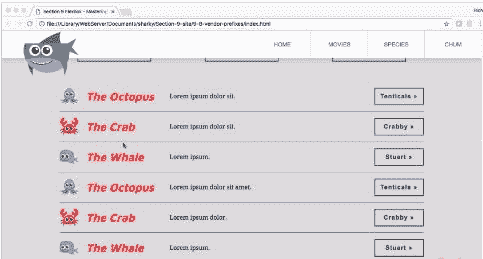

我们还将讨论在使用伸缩盒时需要添加前缀的内容，以及如何以最简单的方式添加前缀。

我们将涵盖以下主题：

+   使用伸缩盒构建一个新的部分

+   使用 flex-wrap 和 align-content

+   更改伸缩项的显示顺序

+   处理供应商前缀

# 构建产品列表

让我们用伸缩盒构建一个产品列表。我们将通过创建一个产品列表来看看我们还可以用伸缩盒构建什么。我们将探讨两个新的伸缩盒属性：`align-items`和`align-self`。

# 使用 align-items

为了构建产品列表，我们将从一些新的标记开始，这些标记将直接位于页脚上方：

```css
<!-- 
===============
Product Listing
===============
-->
<section class="secondary-section grouping">
    <ul class="wrapper product-list">
        <li class="product-list-item">
            <figure>
                
            </figure>
            <h2>The Octopus</h2>
            <p>Lorem ipsum dolor sit.</p>
            <a href="#" class="button">Tenticals &raquo;</a>
        </li>
        <li class="product-list-item">...</li>
        <li class="product-list-item">...</li>
        <li class="product-list-item">...</li>
        <li class="product-list-item">...</li>
        <li class="product-list-item">...</li>
    </ul><!-- end wrapper -->
</section>
<!-- 
================ 
Footer
================
--> 
```

标记相当多，但并不是很复杂。有一个无序列表，其中包含六个列表项（`<li>`标签）。每个列表项都有一个 SVG 图像（`<figure></figure>`）、一个标题（`<h2>`）、一个段落（`<p>`）和一个锚点（`<a>`）。在前面的代码片段中，我省略了除第一个之外所有列表项的内容。

我们还将从一些 CSS 开始引导这一部分：

```css
/****************
Product Listing
****************/
.product-list-item {
  border-bottom: 1px solid #766e65;
}
.product-list-item figure {
  width: 50px;
  margin-right: 20px;
}
.product-list-item h2 {
  margin: 0;
}
.product-list-item p {
  margin: 0;
}
.product-list-item .button {
  transform: scale(1);
  width: 130px;
}
```

以下是我们产品列表的初始内容：

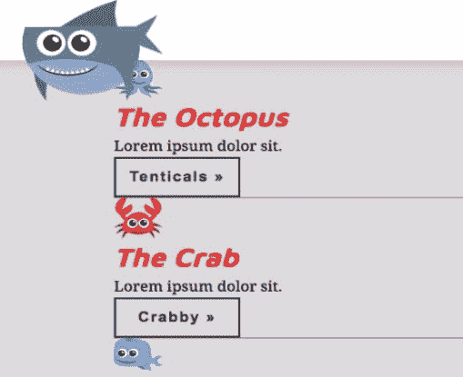

我们希望每个列表项的内容都水平排列。我们可以选择类`product-list-item`，并使用`display: flex`：

```css
.product-list-item {
  border-bottom: 1px solid #766e65;
 display: flex;
}
```

这个规则集是针对具有`product-list-item`类的六个不同的`li`标签。这很重要，因为我们有六个不同的伸缩容器。添加`display: flex`应该会水平排列每个伸缩容器中的所有不同伸缩项。因为这就是伸缩盒的作用。默认情况下，`flex-direction`是`row`，所以一切都是水平排列的：

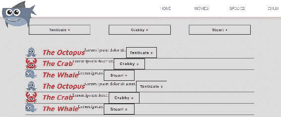

好吧，看起来不太好。我们可以做的一件事是给`h2`添加一个值为`250px`的`flex-basis`：

```css
.product-list-item h2 {
  margin: 0;
  flex-basis: 250px;
}
```

这应该增加一些组织性，而且确实做到了：

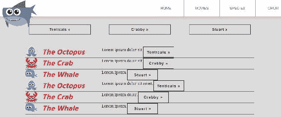

现在，让我们使用自动边距将按钮对齐到最右边缘：

```css
.product-list-item .button {
  transform: scale(1);
  width: 130px;
 margin-left: auto
}
```

回顾我们在上一节学到的内容，`margin-left: auto`将自动计算按钮左侧的边距，并将其推到最右边。这好多了，但是仍然有点紧：

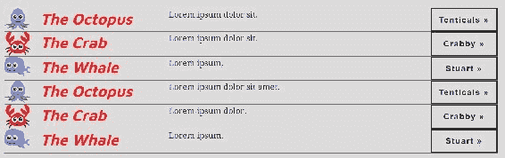

让我们用一个叫做`align-items`的新属性来解决这个问题。所以这些按钮彼此之间太近了，而这段落却高高地坐着。我们希望图片、标题、段落和按钮都垂直居中。`align-items`是一个可以用在伸缩容器上的属性，它控制了伸缩项沿交叉轴的定位。这里再次提醒我们，当`flex-direction`设置为`row`时，交叉轴的方向是怎样的：

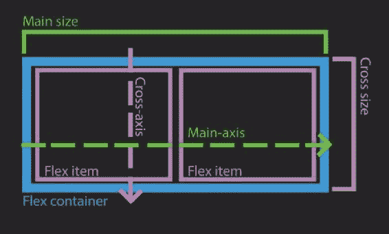

正如我们所看到的，当`flex-direction`为行时，交叉轴从上到下。我们将添加一个值为`center`的`align-items`。这实际上不会有太明显的效果，除非我们添加一个`height`为`80px`。所以我们也来做这个：

```css
.product-list-item {
  border-bottom: 1px solid #766e65;
  display: flex;
 align-items: center;
 height: 80px;
}
```

因此，使用`align-items: center`将使项目在交叉轴中间对齐：

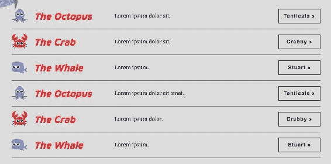

好吧！我们所有的伸缩项都是垂直居中的，只用了一个属性，而且每个项目的高度都不同。另外，我想指出`align-items`的默认值是`stretch`，它会强制伸缩项从交叉轴的起始位置拉伸到结束位置。这就是为什么伸缩盒默认提供了等高列。

我们还可以使用`flex-start`，它将所有伸缩项对齐到伸缩容器的顶部或交叉轴的起始位置：

```css
.product-list-item {
  border-bottom: 1px solid #766e65;
  display: flex;
  align-items: flex-start;
  height: 80px;
}
```

以下是前面代码的输出：

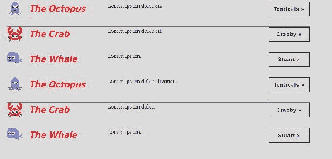

让我们尝试`flex-end`，这将使所有的伸缩项目对齐到底部或交叉轴的末尾：

```css
.product-list-item {
  border-bottom: 1px solid #766e65;
  display: flex;
  align-items: flex-end;
  height: 80px;
}
```

我们的伸缩项目现在对齐到了交叉轴的末尾——底部：

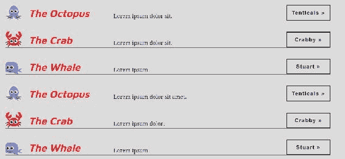

让我们把这个改回到`center`：

```css
.product-list-item {
  border-bottom: 1px solid #766e65;
  display: flex;
 align-items: center;
  height: 80px;
}
```

现在让我们回到我们的三列；我们仍然有图片和标题对齐到左边的问题，我们希望它们居中：

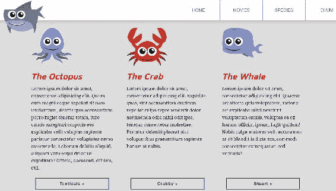

让我们看看如何使用`align-items`来在`flex-direction`设置为`column`时居中我们的海洋生物和标题。在这种情况下，交叉轴是水平的。

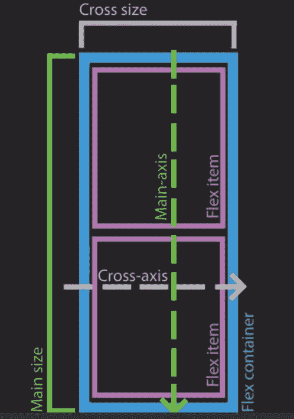

这是个好消息。因为`align-items`用于在交叉轴上对齐，而对于`flex-direction: column`来说，交叉轴是水平的，这应该会使我们的海洋生物图片和标题居中。

记住每个`.column`都是`.columns`的一个伸缩项目，但也是其自己的伸缩项目，拥有自己的伸缩项目。这些伸缩项目包括海洋生物图片、标题、段落和按钮等。所以每一列都是其自己的伸缩项目。我们可以使用`align-items: center`：

```css
/****************
3 columns
****************/
.columns {
  display: flex;
  justify-content: space-between;
}
.column {
  flex-basis: 30%;
  display: flex;
  flex-direction: column;
  justify-content: flex-start;
 align-items: center;
}
.column figure {
  max-width: 50%;
  flex-basis: 150px;
}
.column .button {
  margin-top: auto;
}
```

这就是我们最终得到的结果：

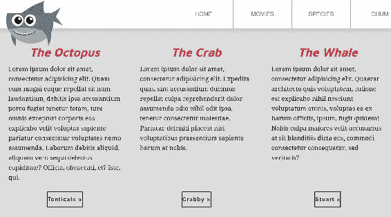

事情都居中了，就像标题和底部的按钮一样，但我们的海洋生物图片完全消失了，我们的按钮也变小了。让我们逐个解决这些问题，首先考虑一下为什么我们的海洋生物消失了。让我们在海洋生物应该出现的地方附近检查并找到图片：

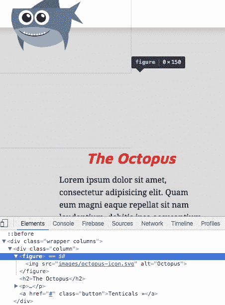

在 DevTools 中检查包含`img`元素的`figure`元素，显示宽度为 0，高度为 150。那么如果我们已经设置了这个 CSS，为什么宽度会是 0 呢？

```css
.column figure {
  max-width: 50%;
  flex-basis: 150px;
}
```

嗯，我们没有为这些 SVG 设置明确的`width`。我们设置了`max-width`，但这实际上并没有强制设置宽度。请记住，`max-width`只是说“永远不要超过 x 像素宽度”，但不会强制在该阈值以下设置任何宽度。我们的`flex-basis`是`150px`，因为`flex-direction`是`column`，所以它控制了高度。我们根本没有设置真正的宽度。当我们设置`align-items: center`时，它会强制元素只占据它们需要的宽度或高度，几乎就像当你将块级元素`float`到`left`或`right`时一样。此外，SVG 在图像的宇宙中是独一无二的。传统的 PNG 和 JPG 图像即使在 CSS 中没有指定任何尺寸，也有固定的尺寸。而 SVG 可以按比例缩放到任何大小，因此没有基准尺寸。由于`figure`或`img`都没有设置宽度或高度，`align-items`属性会将宽度挤压为 0，这就是它们消失的原因。

这很容易解决；我们只需要添加一个`width`。让它比以前的尺寸更小一点，大约是其容器的 50%：

```css
.column figure {
  max-width: 50%;
  flex-basis: 150px;
 width: 50%;
}
```

我们的海洋生物又回来了！

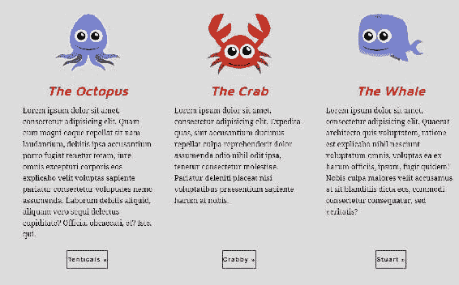

底部的按钮和我们刚刚遇到的图片有相同的问题；它们没有设置任何`padding`或`width`，所以`align-items`强制宽度只能与内容一样宽，这就是为什么它们看起来都被挤压得很小。

解决方法是一样的：只需设置一个`width`。在这种情况下，让`width`为`90%`：

```css
/****************
3 columns
****************/
.columns {
  display: flex;
  justify-content: space-between;
}
.column {
  flex-basis: 30%;
  display: flex;
  flex-direction: column;
  justify-content: flex-start;
  align-items: center;
}
.column figure {
  max-width: 50%;
  width: 50%;
  flex-basis: 150px;
}
.column .button {
  margin-top: auto;
 width: 90%;
}
```

问题解决了：

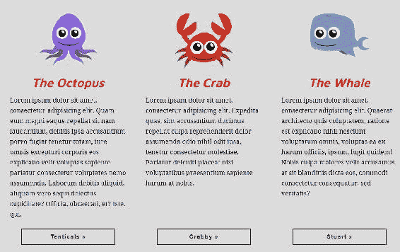

# 使用`align-self`伸缩属性

看起来不错，但如果我不想让所有的伸缩项目都居中怎么办？我可能更喜欢`h2`对齐到`flex-start`（事实上我是这样做的）。`align-items`是一个用于控制所有伸缩项目在交叉轴上对齐的属性。另一个名为`align-self`的 flexbox 属性控制沿交叉轴的对齐，但是直接用于伸缩项目。这将帮助我们只将我们的`h2`对齐到左边。

让我们为`h2`创建一个新的选择器，并添加`align-self: flex-start`：

```css
/****************
3 columns
****************/
.columns {
  display: flex;
  justify-content: space-between;
}
.column {
  flex-basis: 30%;
  display: flex;
  flex-direction: column;
  justify-content: flex-start;
  align-items: center;
}
.column figure {
  max-width: 50%;
  width: 50%;
  flex-basis: 150px;
}
.column h2 {
 align-self: flex-start;
}
.column .button {
  margin-top: auto;
  width: 90%;
}
```

请注意，`align-self`是仅适用于 flex 项的属性；它的默认值是`auto`，这意味着它告诉它检查`align-items`的值以进行交叉轴对齐。它还接受`stretch`、`flex-start`、`flex-end`、`center`和`baseline`。它允许我们覆盖单个 flex 项的`align-items`值。

如果我们现在刷新浏览器，我们会看到我们的`h2`标签对齐到左侧-在它们的`flex-start`：

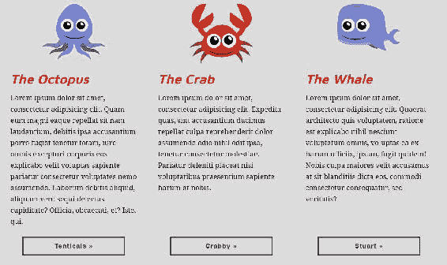

我们现在看起来不错。让我们花一分钟快速修复一下我们之前创建的一个错误。我们将通过右键单击并选择检查来查看这个错误；我们将在 Chrome 中将 DevTools 移动到右侧。我只是将它调整到平板尺寸；我们现在可以看到问题了，我们的海洋生物失控了！

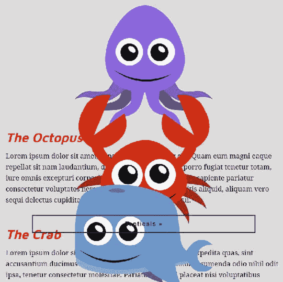

我们的列都堆叠在一起。所以我们必须弄清楚为什么会发生这种情况。这是因为我们为每列将`flex-basis`设置为`30%`。当`flex-direction`为行时，它运行得很好，但是您可能还记得从*Floats to Flexbox*部分，我们在较小设备的媒体查询中将`flex-direction`更改为`column`。当`flex-direction`为`column`时，`flex-basis`控制的是高度而不是宽度，因为在这种情况下，主轴是垂直而不是水平的。

所以让我们在媒体查询中修复这个问题。让我们创建一个新的选择器并将`flex-basis`设置为`auto`：

```css
@media screen and (max-width: 1023px){
 .column {
 flex-basis: auto;
    margin-bottom: 50px;
 }
}/* end of media query */
```

您会记得，将`flex-basis`设置为`auto`意味着这样做：看看我的宽度或高度。因为我们没有明确设置高度；高度由内容确定，正是我们想要的——只需使高度成为内容的大小。此外，我偷偷加了`margin-bottom`为`50px`，以在它们之间提供一点间隙：

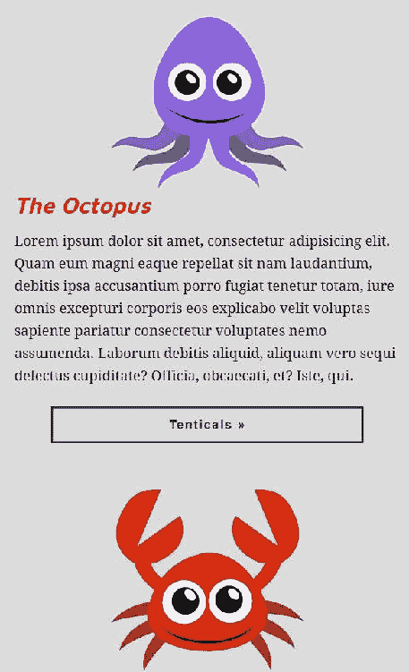

在本节中，我们使用 flexbox 构建了我们的产品列表，并介绍了两个新的 flex 属性：`align-items`和`align-self`。在下一节中，我将介绍另外两个属性：`flex-wrap`和`align-content`。

# 使用 flex-wrap 和 align-content

`flex-wrap`属性允许我们确定我们是将内容包装到第二行还是将所有 flex 项挤入单行；`align-content`确定被包装到多行的行的对齐方式，从而变成多行。它们基本上是最好的朋友。

# 使用 flex-wrap

我们将返回并使用我们的 flexbox 示例页面（`flexbox.html`）作为测试这些属性的游乐场。这是我们在这个区域最终得到的 CSS：

```css
/***************
Flexbox demo
***************/
.flex-container {
  margin-top: 200px;
  display: flex;
  justify-content: flex-start;
}
.flex-item {
  padding: 20px;
}
.flex-item:last-child {
  margin-left: auto;
}
.flex-item1 { background: deeppink;}
.flex-item2 { background: orange; }
.flex-item3 { background: lightblue; }
.flex-item4 { background: lime; }
.flex-item5 { background: olive; }
```

flex 容器将所有内容都对齐到`flex-start`，或者在我们的情况下是左侧。这是因为`flex-direction`没有设置，因此默认为`row`。最后一个 flex 项被推到最右边，使用`margin-left: auto;`。这是我们的`flexbox.html`页面目前应该看起来的样子：

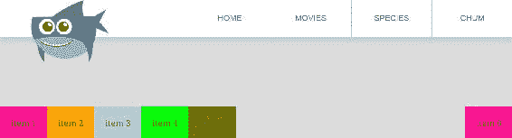

在`flexbox.html`中，让我们添加更多的 flex 项并保存它们：

```css
<section class='flex-container'>
    <div class="flex-item flex-item1">item 1</div>
    <div class="flex-item flex-item2">item 2</div>
    <div class="flex-item flex-item3">item 3</div>
    <div class="flex-item flex-item4">item 4</div> 
    <div class="flex-item flex-item5">item 5</div> 
    <div class="flex-item flex-item1">item 6</div>
    <div class="flex-item flex-item1">item 1</div>
    <div class="flex-item flex-item2">item 2</div>
    <div class="flex-item flex-item3">item 3</div>
    <div class="flex-item flex-item4">item 4</div> 
    <div class="flex-item flex-item5">item 5</div> 
    <div class="flex-item flex-item1">item 6</div>
    <div class="flex-item flex-item1">item 1</div>
    <div class="flex-item flex-item2">item 2</div> 
    <div class="flex-item flex-item3">item 3</div> 
    <div class="flex-item flex-item4">item 4</div> 
    <div class="flex-item flex-item5">item 5</div> 
    <div class="flex-item flex-item1">item 6</div>
</section>
```

现在我们看到 flexbox 是如何真正挤压 flex 项以适应在 flex 容器内的一行上的。

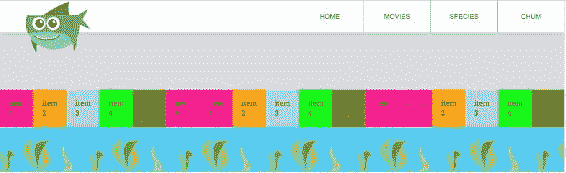

所以我们将通过将`flex-wrap`属性添加到 flex 容器中并将值设置为`wrap`来包装多行。此外，让我们通过删除整个规则集来摆脱最后一个 flex 项上的`margin-left: auto`：

```css
/***************
Flexbox demo
***************/
.flex-container {
  margin-top: 200px;
  display: flex;
  justify-content: flex-start;
 flex-wrap: wrap;
}
.flex-item {
  padding: 20px;
}
.flex-item1 { background: deeppink;}
.flex-item2 { background: orange; }
.flex-item3 { background: lightblue; }
.flex-item4 { background: lime; }
.flex-item5 { background: olive; }
```

因此，所有先前收缩以适应一行的 flex 项现在会扩展到其自然大小；这意味着文本的宽度加上文本两侧的`padding`的`20px`。这创建了两行内容。很好，正是我们想要的！

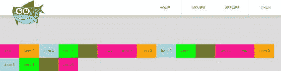

`flex-wrap`的默认值是`nowrap;`。这是有道理的，因为在将其设置为`wrap`之前，它强制所有我们的 flex 项适合一行。就好像我们根本没有省略`flex-wrap`一样。让我们换成`nowrap`来测试一下：

```css
.flex-container {
    margin-top: 200px;
    display: flex;
    justify-content: flex-start;
 flex-wrap: nowrap;
}
```

就好像我们根本没有指定`flex-wrap`一样：

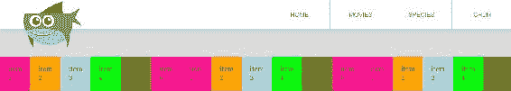

还有`wrap-reverse;`让我们试试：

```css
.flex-container {
  margin-top: 200px;
  display: flex;
  justify-content: flex-start;
 flex-wrap: wrap-reverse;
}
```

最后一个项目现在是第一个，第一个项目是最后一个。从技术上讲，最后一个项目现在是第一行的第四个：

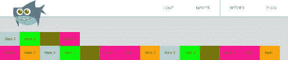

使用`flex-wrap`的好处是，现在每一行在`flex-grow`、`flex-shrink`和`justify-content`等属性方面都可以独立工作。

让我们测试一下，添加`flex-grow: 1`：

```css
.flex-container {
  margin-top: 200px;
  display: flex;
  justify-content: flex-start;
  flex-wrap: wrap-reverse;
}
.flex-item {
  padding: 20px;
 flex-grow: 1;
}
```

这会重新分配任何额外的空间，以确保它们填满所有剩余的空间：

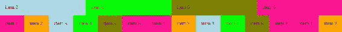

每一行都将它们的 flex 项目扩展以占据额外的空间。正如你所看到的，第一行的 flex 项目被拉伸得更远，以填补比下面一行更多的额外空间。在它下面的另外两行中，flex 项目只被拉伸了一点点来填补额外的空间。

让我们再次看看这些行如何独立于彼此地工作，通过将`justify-content`改为`space-between`在 flex 容器上。我们还将在 flex 项目上去掉`flex-grow`：

```css
.flex-container {
  margin-top: 200px;
  display: flex;
 justify-content: space-between;
  flex-wrap: wrap-reverse;
}
.flex-item {
  padding: 20px;
}
```

因此，在每个 flex 项目之间都有额外的空间分配：

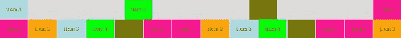

第一行有很多额外的空间，而第二行在每个 flex 项目之间只有一点额外的空间。同样，每一行在处理`flex-grow`、`flex-shrink`和`justify-content`时都是独立的。这种情况非常适合来自**内容管理系统**（**CMS**）的动态、未知数量的内容。

# 使用 align-content

好的，让我们再看看另一个叫做`align-content`的属性。像`flex-wrap`一样，`align-content`是一个只在 flex 容器上工作的属性；然而，`align-content`依赖于`flex-wrap`被设置为`wrap`或`wrap-reverse`，这意味着在所有其他情况下`align-content`都会被忽略。此外，`align-content`类似于`align-items`，因为它控制沿交叉轴的排列或对齐。唯一的区别是，它不是在交叉轴上重新分配每个*flex 项目*，而是在交叉轴上重新分配每个*行*。

让我们将`align-content`设置为`space-between`。我们还将其高度设置为`300px`，并给它一个深灰色的边框：

```css
.flex-container {
  margin-top: 200px;
  display: flex;
  justify-content: space-between;
  flex-wrap: wrap-reverse;
 align-content: space-between;
 height: 300px;
 border: 1px solid #777; 
}
```

我还要把 flex 项目的数量加倍，以保持事情的趣味性：

```css
<!--
====================
Flexbox Demo
====================
-->
<section class='flex-container'>
    <div class="flex-item flex-item1">item 1</div>
    <div class="flex-item flex-item2">item 2</div>
    <div class="flex-item flex-item3">item 3</div>
    <div class="flex-item flex-item4">item 4</div> 
    <div class="flex-item flex-item5">item 5</div> 
    <div class="flex-item flex-item1">item 6</div>
    <div class="flex-item flex-item1">item 1</div>
    <div class="flex-item flex-item2">item 2</div>
    <div class="flex-item flex-item3">item 3</div>
    <div class="flex-item flex-item4">item 4</div> 
    <div class="flex-item flex-item5">item 5</div> 
    <div class="flex-item flex-item1">item 6</div>
    <div class="flex-item flex-item1">item 1</div>
    <div class="flex-item flex-item2">item 2</div> 
    <div class="flex-item flex-item3">item 3</div> 
    <div class="flex-item flex-item4">item 4</div> 
    <div class="flex-item flex-item5">item 5</div> 
    <div class="flex-item flex-item1">item 6</div>
    <div class="flex-item flex-item1">item 1</div>
 <div class="flex-item flex-item2">item 2</div>
 <div class="flex-item flex-item3">item 3</div>
 <div class="flex-item flex-item4">item 4</div> 
 <div class="flex-item flex-item5">item 5</div> 
 <div class="flex-item flex-item1">item 6</div>
 <div class="flex-item flex-item1">item 1</div>
 <div class="flex-item flex-item2">item 2</div>
 <div class="flex-item flex-item3">item 3</div>
 <div class="flex-item flex-item4">item 4</div> 
 <div class="flex-item flex-item5">item 5</div> 
 <div class="flex-item flex-item1">item 6</div>
 <div class="flex-item flex-item1">item 1</div>
 <div class="flex-item flex-item2">item 2</div> 
 <div class="flex-item flex-item3">item 3</div> 
 <div class="flex-item flex-item4">item 4</div> 
 <div class="flex-item flex-item5">item 5</div> 
 <div class="flex-item flex-item1">item 6</div>
</section>
```

现在我们有 3 行，并且由于`align-content`，每行之间有空间：

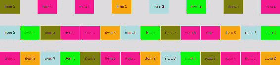

`height`属性是相关的，因为如果省略，flex 容器的高度只会和其 flex 项目一样高；因此，`align-content`不会起作用，因为没有额外的垂直空间可供使用。除了`space-between`之外，`align-items`的其他值包括`flex-start`、`flex-end`、`center`和`space-around`。这些值应该是我们在学习`justify-content`属性时熟悉的。默认值是`stretch`。`space-around`值会均匀地重新分配所有项目周围的额外空间，包括第一个和最后一个。

所以让我们把它从`space-between`改为`space-around`：

```css
.flex-container {
  margin-top: 200px;
  display: flex;
  justify-content: space-between;
  flex-wrap: wrap-reverse;
 align-content: space-around;
 height: 300px;
 border: 1px solid #777; 
}
```

你可以看到，使用`space-around`，在 flex 容器的顶部和第一行之间以及容器底部和最后一行之间有一些空间：

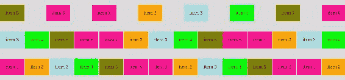

而`space-between`让第一行和最后一行紧紧贴着 flex 容器，这是一个细微的差别。我们之前在学习`justify-content`时也注意到了这种微妙之处。

现在让我们将`align-content`的值改为`center`：

```css
.flex-container {
  margin-top: 200px;
  display: flex;
  justify-content: space-between;
  flex-wrap: wrap-reverse;
  align-content: center;
  height: 300px;
  border: 1px solid #777; 
}
```

正如我们所期望的，我们的行是居中的：

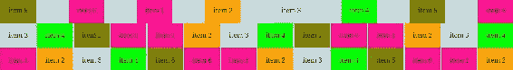

现在让我们将`flex-direction`改为列，看看在这种情况下`flex-wrap`和`align-content`是如何一起工作的：

```css
.flex-container {
  margin-top: 200px;
  display: flex;
  justify-content: space-between;
  flex-direction: column;
  flex-wrap: wrap-reverse;
  align-content: center;
  height: 300px;
  border: 1px solid #777; 
}
```

这里发生了很多事情，很难准确地说是什么，但我们可以说的一件事是我们在水平方向上是居中的：

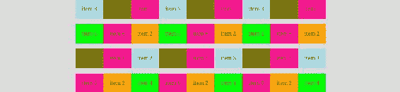

让我们简化一下，以理解发生了什么。首先，让我们将`flex-wrap`从`wrap-reverse`改回`wrap`：

```css
.flex-container {
    margin-top: 200px;
    display: flex;
    justify-content: space-between;
    flex-direction: column;
 flex-wrap: wrap;
    align-content: center;
    height: 300px;
    border: 1px solid #777; 
}
```

在`flexbox.html`中，我们将大大减少 flex 项目的数量：

```css
<section class='flex-container'>
    <div class="flex-item flex-item1">item 1</div>
    <div class="flex-item flex-item2">item 2</div>
    <div class="flex-item flex-item3">item 3</div>
    <div class="flex-item flex-item4">item 4</div> 
    <div class="flex-item flex-item5">item 5</div> 
    <div class="flex-item flex-item1">item 6</div>
</section>
```

现在，更容易看到`flex-direction`是`column`，这会强制两个垂直列，因为`flex-wrap`设置为`wrap`，并且我们没有足够的空间容纳所有 6 个伸缩项目：


我们为`justify-content`设置的`space-between`正在在每个伸缩项目之间重新分配额外的空间。请注意，两列都独立地重新分配了它们的额外空间，如下图所示。

当交叉轴上有额外空间和多行时，使用`align-content`来排列交叉轴上的行。正如我们所知，当`flex-direction`为行时，交叉轴从上到下运行。

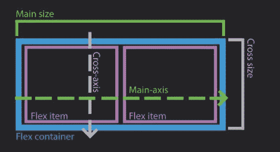

当`flex-direction`为列时，交叉轴从左到右运行：

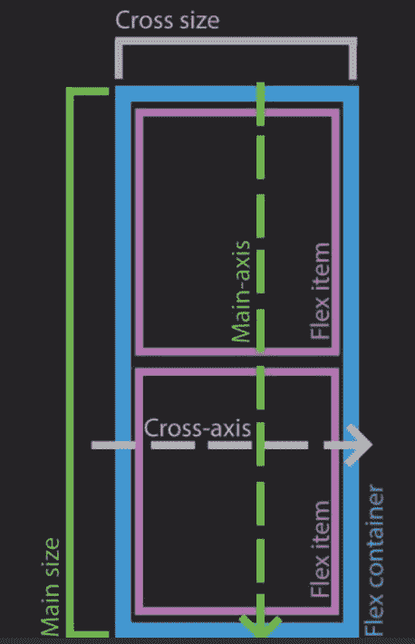

如果我开始听起来像一个重复的唱片，我很抱歉，但我觉得重复强调伸缩盒的运作方式是很重要的。

# 使用`flex-flow`缩写

之前，我们看到`flex`缩写如何将`flex-grow`、`flex-shrink`和`flex-basis`组合在一起。让我们介绍另一个缩写，`flex-flow`，它将允许我们通过将`flex-direction`和`flex-wrap`组合在一起来减少一些属性。无论如何，这会简化我们的 CSS 代码：

```css
.flex-container {
  margin-top: 200px;
  display: flex;
  justify-content: space-between;
  flex-flow: column wrap;
  align-content: center;
  height: 300px;
  border: 1px solid #777; 
}
```

没有变化，这正是我们在使用缩写重构时想要的：

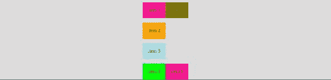

考虑到`align-content`与`flex-wrap`的密切依赖，我期望`align-content`是`flex-flow`的一部分。然而，`align-content`并不是`flex-flow`的一部分，它与`flex-direction`和`flex-wrap`一起。

在本节中，您学习了`flex-wrap`如何允许我们创建多个流或行的内容，而`align-items`则将这些多行定位在其容器的交叉轴上。

# 更改伸缩项目的显示顺序

在本节中，我们将讨论如何更改伸缩项目的显示顺序以及这如何有助于响应式网页设计。我们还将讨论这如何影响网页可访问性。

在较宽的屏幕宽度下，内容水平显示：首先是章鱼，然后是螃蟹，然后是鲸鱼：

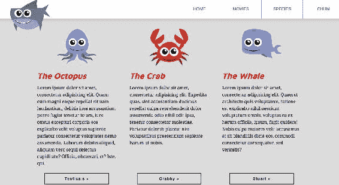

在较窄的设备宽度下，内容以与源顺序相同的顺序显示，只是垂直显示，如下面的屏幕截图所示：

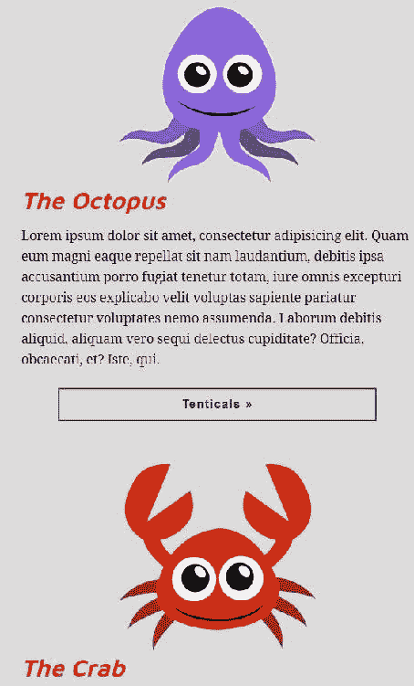

在这两种情况下，显示顺序与源顺序相同，在这种情况下是有意义的。

在这里做点不同的事情。假设我们正在与一位设计师合作，他希望本周突出显示螃蟹，并在视觉上优先于章鱼和鲸鱼。这就是我们在这里所做的。我在 HTML 和 CSS 中添加了一些额外的内容来实现这种新的特色处理：

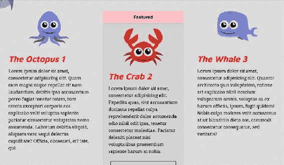

在标记中，我为每列的标题添加了一个数字，这样我们在浏览器中查看时就可以轻松记住源顺序。然后，对于螃蟹，我添加了一个名为`featured`的类和一个名为`ribbon`的`div`标签。

```css
<div class="column">
    <figure>
        
    </figure>
    <h2>The Octopus 1</h2>
    <p>Lorem ipsum dolor...</p>
    <a href="#" class="button">Tenticals &raquo;</a>
</div>
<div class="column featured">
 <div class="ribbon">Featured</div>
    <figure>
        
    </figure>
    <h2>The Crab 2</h2>
    <p>Lorem ipsum dolor...</p>
    <a href="#" class="button">Crabby &raquo;&lt;/a>
</div>
<div class="column">
    <figure>
        
    </figure>
    <h2>The Whale 3</h2>
    <p>Lorem ipsum dolor sit...</p>
    <a href="#" class="button">Stuart &raquo;</a>
 </div>
```

我添加了一些 CSS 来样式化丝带。

```css
/*featured column*/
.featured {
  padding: 0 0 20px 0;
  background-color: #d3d3d3;
  overflow: hidden;
}
.featured h2, 
.featured p {
  margin-left: 20px;
  margin-right: 20px;
}
.ribbon {
    background-color: #ffc0cb;
    padding: 10px 50px;
    margin-bottom: 20px;
    align-self: stretch;
    text-align: center;
    font-family: 'Maven Pro', Arial, sans-serif;
    font-weight: bold;
    box-shadow: #b7b7b7 0px 2px 15px 0px;
}
```

您可能已经注意到，特色丝带被拉伸横跨顶部；这是使用`align-self: stretch`完成的。正如我们已经讨论过的，`align-self`沿着交叉轴对齐伸缩项目，在我们的情况下，由于`flex-direction`设置为`column`，交叉轴从左到右。`align-self`属性类似于`align-items`，不同之处在于它用于伸缩项目并覆盖`align-items`属性。

在桌面或更宽的视图上，当我们的业务合作伙伴和设计师看到这一点时，他们真的很高兴。但在手机上，他们说，“嗯，我不知道，螃蟹仍然显示为第二。”他们可能是对的，这是特色内容，所以它不仅应该在视觉上突出，而且还应该首先出现。如果我们的内容来自数据库，我们可以更新它，使螃蟹首先出现；或者，我们可以使用一些 JavaScript 来重新排列我们的特色内容，使螃蟹首先出现。这两种解决方案，至少不是理想的。

Flexbox 在这里派上了用场。在我们针对较小设备的媒体查询中，我们可以使用一个名为`order`的 flex 项目属性：

```css
@media screen and (max-width: 1023px){
  .intro-content {
    width: auto;
    float: none;
    padding-bottom: 0;
    margin-bottom: 30px;
  }
  .go-premium {
    width: auto;
    float: none;
    margin-top: 0;
  }
  .columns {
    flex-direction: column;
  }
  .column {
    flex-basis: auto;
    margin-bottom: 50px;
  }
  .featured {
 order: -1;
 }
}/* end of media query */
```

好了，当我刷新浏览器时，它立即将我们的螃蟹移动到了第一个位置，如下面的截图所示：

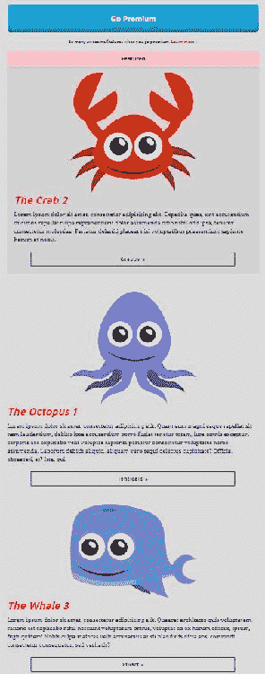

默认情况下，所有 flex 项目都被赋予`order`为`0`，所以提供`-1`将螃蟹移到了顶部。项目的顺序与主轴一起运行；最低顺序的 flex 项目将位于主轴的开始，而最高顺序的 flex 项目将出现在主轴的末尾。

同样，在我们的情况下，由于`flex-direction`是`column`，主轴从上到下运行。让我们把`order`改为`1`：

```css
@media screen and (max-width: 1023px){
  .intro-content {
    width: auto;
    float: none;
    padding-bottom: 0;
    margin-bottom: 30px;
  }
  .go-premium {
    width: auto;
    float: none;
    margin-top: 0;
  }
  .columns {
    flex-direction: column;
  }
  .column {
    flex-basis: auto;
    margin-bottom: 50px;
  }
 .featured {
 order: 1;
 }
}/* end of media query */
```

这将螃蟹移到底部，因为默认情况下章鱼和鲸鱼都是`0`，而我们已经指定螃蟹为`1`—所以现在它被放在了最后：

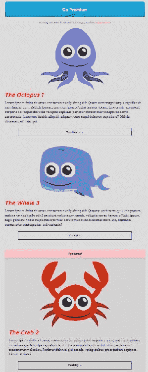

好了，让我们再添加两个规则集：

```css
.column:nth-child(1) {
 order: 3;
}
.featured {
  order: 1;
}
.column:nth-child(3) {
 order: 2;
}
```

我们使用`nth-child`伪类来改变顺序。现在刷新浏览器后，螃蟹在显示顺序中是第一个（源顺序中是第二个），鲸鱼是第二个（但源顺序中是第三个），章鱼是第三个（但源顺序中是第一个）。这就是它应该看起来的样子：

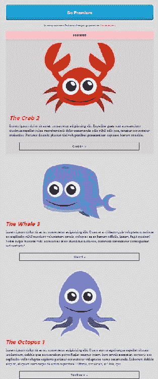

所以我也可以按相反的顺序放置它们。我已经把第一个作为第三个，我可以把第二个作为第二个，第三个作为第一个：

```css
.column:nth-child(1) {
  order: 3;
}
.featured {
  order: 2;
}
.column:nth-child(3) {
  order: 1;
}
```

这就是我们应该看到的：

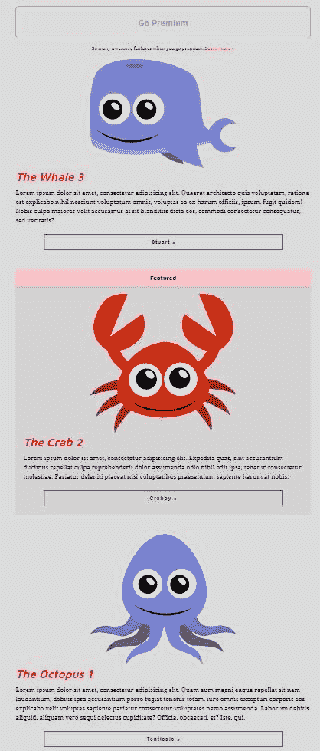

现在我们把第三个作为第一个，第二个作为第二个，第一个作为第三个。相反的顺序。但请记住，我有一个更简单的方法来做到这一点；我实际上可以摆脱这三个规则集，只需指定`flex-direction`为`column-reverse`：

```css
@media screen and (max-width: 1023px){
  .intro-content {
    width: auto;
    float: none;
    padding-bottom: 0;
    margin-bottom: 30px;
  }
  .go-premium {
    width: auto;
    float: none;
    margin-top: 0;
  }
  .columns {
 flex-direction: column-reverse;
  }
  .column {
    flex-basis: auto;
    margin-bottom: 50px;
  }
}/* end of media query */
```

现在当我刷新浏览器时，它们仍然是相反的顺序：

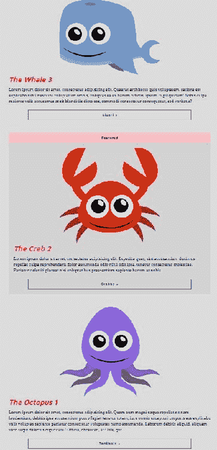

# 无障碍影响

我想提一下的一件事是，改变显示顺序有一个缺点，你可能需要注意：通过内容进行制表。制表顺序仍然基于源顺序，这成为一个无障碍问题。现在你可能会认为在我们的例子中，制表顺序在桌面上是合乎逻辑的，但在较小的设备上，比如手机上，它可能会变得不合逻辑，尽管大多数情况下不会通过字段进行制表。也许这大多数是正确的；然而，改变显示顺序对于屏幕阅读器，比如 JAWS，也是一个问题，它根据源顺序而不是显示顺序向视力受损的用户读取内容。因此，你的内容仍然会根据源顺序被屏幕阅读器宣布，这将与视觉顺序不同步。这可能是一个无障碍问题。因此，如果改变顺序，最好记住这一点。

在这一部分，你学会了`order`属性如何改变 flex 容器中 flex 项目的显示顺序，以及它对制表顺序和无障碍的影响。

# 供应商前缀

让我们谈谈供应商前缀。在这一部分，我们将讨论 flexbox 的浏览器支持以及如何在我们的 flexbox CSS 中添加供应商前缀以获得更深入的 flexbox 支持。我们还将谈论一个叫做**Autoprefixer**的东西，它可以帮助我们添加这些前缀。

Flexbox 支持从 IE10 开始，如果我们使用`-ms-`供应商前缀。但这可能不是您想要添加的唯一供应商前缀，因为自从浏览器首次实现以来，W3C 规范实际上已经发生了变化。当它被实现时，语法和属性名称与今天的不同。为了获得深度浏览器支持，我们可以使用旧语法结合新语法来支持一些早期采用的浏览器。

让我们更新我们最初添加 flexbox 的原始规则集，这是我们的`.columns`：

```css
.columns {
  display: -webkit-box;
  display: -webkit-flex;
  display: -ms-flexbox;
  display: flex;
  -webkit-box-pack: justify;
  -webkit-justify-content: space-between;
  -moz-box-pack: justify;
  -ms-flex-pack: justify;
  justify-content: space-between;
}
```

哇！这里有很多事情。我们不仅仅是在属性的开头添加`-ms-`，`-moz-`和`-webkit-`。当涉及到`display`属性的值时，我们将供应商前缀添加到值的开头。值本身与我们的非前缀版本并没有太大不同。还有 2 个`-webkit-`值！Chrome 和 Safari 真的是 flexbox 的早期采用者，所以实际上有两个不同的前缀，WebKit 浏览器支持：`-webkit-box`和`-webkit-flex`。所以，这是很多前缀和很多记忆，对于`justify-content`属性看起来也很疯狂。这是很多。棘手的部分是学习和记住旧的语法，特别是因为不明显哪些前缀仍然是必需的。

# Autoprefixer

这就是 Autoprefixer CSS 在线工具([`autoprefixer.github.io/`](https://autoprefixer.github.io/))可以非常有帮助的地方。它根据浏览器的总市场份额和我们想要为每个浏览器回溯的版本数量提供我们需要的前缀。让我们将这个过滤器更新为`.01%`：

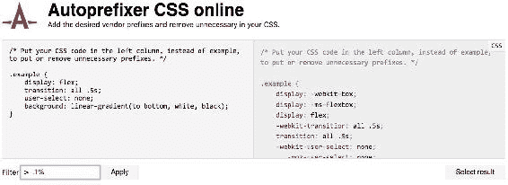

让我们摆脱所有这些前缀，只需将这个规则集复制粘贴到 Autoprefixer 工具的左边框中：

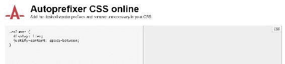

在右侧，它提供了我们应该使用的前缀：

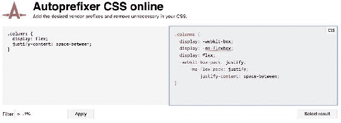

让我们将它复制回我们的 CSS：

```css
.columns {
  display: -webkit-box;
  display: -ms-flexbox;
  display: flex;
  -webkit-box-pack: justify;
      -ms-flex-pack: justify;
          justify-content: space-between;
}
```

这非常方便，比记住所有 flexbox 属性的不同语法要容易得多。如果有一种方法可以自动为我们添加供应商前缀，而不必我们进行所有这些复制和粘贴，那将是很好的。我们可以做的一件事是使用预处理器，比如**Sass**，编写一个称为**mixin**的东西，为我们添加供应商前缀，这样我们就不必太在意这个了。我们将在下一章中看看 Sass mixins

# Gulp

现在我想提一下你可能听说过的东西：Gulp。

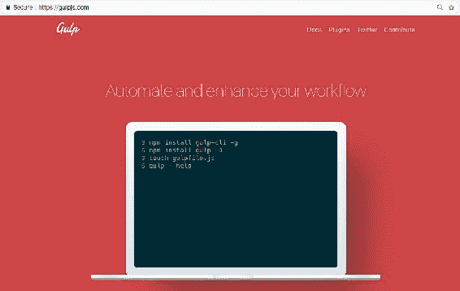

Gulp ([`gulpjs.com/`](https://gulpjs.com/))及其朋友 Grunt([`gruntjs.com/`](https://gruntjs.com/))，允许我们创建构建流程，例如压缩我们的 CSS 和 JavaScript 文件，将 Sass 编译成 CSS，甚至自动为 CSS 添加供应商前缀，使用 Autoprefixer。Gulp 在 Node 上运行，需要您下载它，然后下载 Gulp。然后您可以下载单独的任务，比如 Autoprefixer。学习 Gulp 远远超出了本书的范围，但 Gulp 真的非常有用，我非常喜欢它。为了开始使用它，我强烈建议您阅读*Getting Started with Gulp*，*Travis Maynard*，*Packt Publishing*，这本书非常好地解释了如何安装 Gulp，设置它并使用它。这就是我学会如何使用 Gulp 的方式，通过阅读这本书。

Gulp 是一个*命令行*工具，你可以配置它在每次保存 CSS 文件时运行 Autoprefixer。所以，如果我在我的 CSS 中写入一个 flexbox 属性并按下*Ctrl* + *S*，Gulp 将会监视我的文件是否有任何变化，如果它检测到变化，它将告诉 Autoprefixer 运行并使用必要的供应商前缀更新我的 CSS 文件。我知道这听起来很奇怪——用供应商前缀更新我的 CSS 文件——但从技术上讲，它所做的是创建一个新的 CSS 文件，其中包含所有的供应商前缀。这里有比我解释的更多，但是查看 Travis Maynard 的书来设置它。这样，你就再也不用考虑供应商前缀了，因为 Autoprefixer 和 Gulp 会为你考虑这些事情。

# Flexbox 作业

我们已经建立了一个了不起的网站：

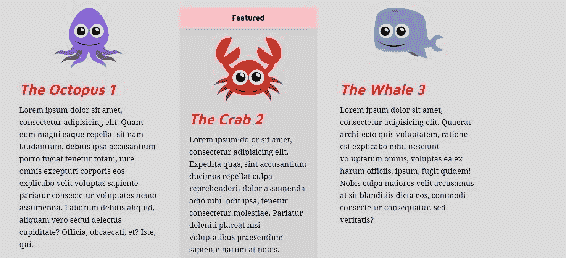

然而，它并非没有问题。你可能已经注意到，在产品列表部分，当我们缩小浏览器时，它开始看起来有点怪异，如下面的截图所示：

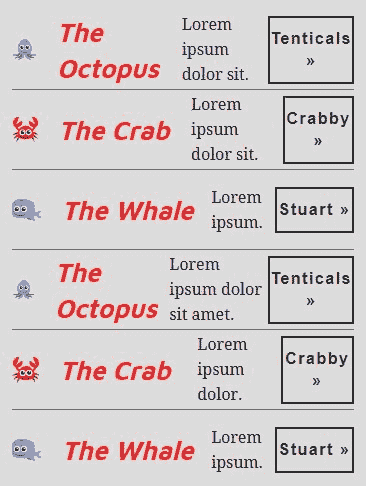

最后一个带回家的测试是更新媒体查询内的 CSS，使得在较小的设备尺寸下显示效果良好。

在这一部分，我们谈到了我们需要为我们的 flexbox 属性添加供应商前缀，以便获得更深层次的浏览器支持。然而，供应商前缀可能会很棘手，最好将前缀添加工具交给像 Autoprefixer 这样的工具。更好的是，最好自动化 Autoprefixer，这样每次保存 CSS 文件时都会执行它。你可以使用任务运行器，比如 Gulp 或 Grunt 来实现这一点。

# 总结

这完成了我们对 flexbox 的探索。我们现在已经看到了与之相关的每一个属性，并将它们应用到了为我们的网站构建新产品列表中。在下一章中，我们将看看在结尾中关于 CSS 技能和工具的下一步：第十一章，*总结*。
